--- 
title: "Algoritmos de Ajuste de Hiperparametros"
author: "Fabio Scielzo Ortiz"
date: "`r Sys.Date()`"
subtitle: Aprendizaje Supervisado
site: bookdown::bookdown_site
documentclass: book
bibliography:
- book.bib
- packages.bib
description: "Esta es una introducción a los algoritmos de ajuste de hiperparámetros, aplicados a modelos de aprendizaje supervisado."
link-citations: yes
github-repo: null
---


# Introducción


<center>

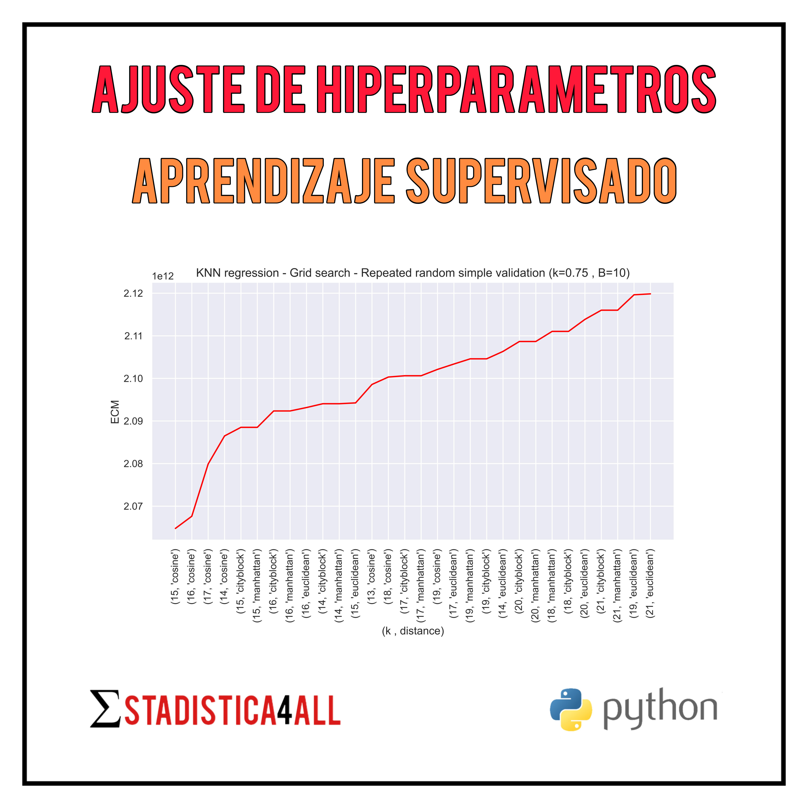{width="70%"}

</center>


<br>

<div class="warning" style='background-color:#FCF2EC; color: #000000; border-left: solid #FE9554 7px; border-radius: 3px; size:1px ; padding:0.1em;'>
<span>
 
<p style='margin-left:10em;'>


$\hspace{0.2cm}$ **Más artículos:    $\hspace{0.1cm}$ [Estadistica4all](https://Estadistica4all.com/)**

$\hspace{0.2cm}$ **Autor:** $\hspace{0.1cm}$ [Fabio Scielzo Ortiz](https://estadistica4all.com/creador.html)

$\hspace{0.2cm}$ **Si utilizas este artículo, por favor, cítalo:** 

$\hspace{0.3cm}$ Scielzo Ortiz, Fabio. (2023). Algoritmos de ajuste de hiperparámetros. Estadistica4all. 


</p>
 
</p></span>
</div>


<br>

En un modelo de aprendizaje estadístico un hiper-parámetro es un parámetro del modelo que no es estimado por el propio modelo cuando este es entrenado. Es decir, es un parámetro al que hay que asignarle un valor a priori del entrenamiento del modelo. 
 
Los algoritmos de ajuste de hiper-parámetros son una familia de algoritmos cuyo propósito es seleccionar un valor óptimo (o razonablemente óptimo) para los hiper-parámetros de un modelo dado.

En este artículo nos centraremos en el algoritmo Grid Search (busqueda en rejilla o cuadricula), tanto en su versión determinista como en su versión aleatoria (Random Search).

Grid search puede ser aplicado tanto a modelos de aprendizaje supervisado como a modelos de aprendizaje no supervisado. Pero en este artículo nos centraremos en su aplicación a modelos de aprendizaje supervisado, concretamente usaremos KNN como modelo supervisado para realizar los ejemplos de aplicación. No obstante, es fácilmente extrapolable su aplicación a otros modelos supervisados y también a modelos no supervisados.

Este algoritmo usa a su vez algoritmos y métricas de validación, por ello es muy recomendable leer el artículo que tenemos en el blog sobre **algoritmos de validación para modelos de aprendizaje supervisado**. Además, puesto que los ejemplos se ilustraran usando KNN como modelo supervisado de referencia, también es recomendable leer el artículo que tenemos en el blog sobre **KNN**.
 


<br>


# Grid Search y Random Search  


Tenemos un modelo de aprendizaje estadístico $M$, el cual tiene $r$ hiper-parámetros $h_1,...,h_r$, cuyos campos de variación son $R(h_1),...,R(h_r)$, respectivamente. 

Usaremos la notación $M(h) = M(h_1,...,h_r)$ para denotar al modelo $M$ con vector de hiper-parámetros   $h=(h_1,...,h_r)\hspace{0.05cm}$.

Esta notación nos interesa para hacer explicitos los hiper-parámetros que tiene el modelo.

Se define el espacio de búsqueda $S$ como un subconjunto del conjunto de posibles combinaciones de valores de los hiper-parámetros:


$$S \hspace{0.1cm} \subseteq \hspace{0.1cm} R(h_1)\hspace{0.1cm}\text{x}\dots \text{x}\hspace{0.1cm}R(h_r)$$

<br>


## Algoritmo Grid Search

El algoritmo grid search queda resumido en el siguiente bloque:


<div class="warning" style='background-color:#F7EBE8; color: #030000; border-left: solid #CA0B0B 7px; border-radius: 3px; size:1px ; padding:0.1em;'>
<span>
 
<p style='margin-left:1em;'>


- Para cada posible combinación de valores de los hiper-parámetros contenida en el espacio de búsqueda, es decir, para cada $s=(s_1,...,s_r) \in S$

    - Se valida $M(h=s)$ , es decir, $M(h_1=s_1 \hspace{0.05cm} ,..., \hspace{0.05cm} h_r=s_r)$ usando algún **algoritmo de validación** de modelos de aprendizaje estadístico (ya sean supervisados o no-supervisados). Con ello se obtiene un valor de una **métrica de validacion** para la combinacion de hiper-parámetros $s=(s_1,...,s_r)\\$


- Tras el paso anterior se obtienen $\hspace{0.05cm}\#\hspace{0.05cm} S\hspace{0.05cm}$ valores de la métrica de validación calculada aplicando cierto algoritmo de validación.

    - Si, por ejemplo, tuvieramos un modelo de regresión y la métrica usada fuera el $\hspace{0.1cm}ECM\hspace{0.1cm}$, entonces se obtienen los siguientes valores de la métrica:
    
    $$\Bigl\{  \hspace{0.1cm} ECM \hspace{0.05cm}[ \hspace{0.05cm}  M(h=s) \hspace{0.05cm}]_{test}^* \hspace{0.2cm} : \hspace{0.2cm}  s\in S \hspace{0.1cm}  \Bigl\}\\$$


- Se selecciona el vector de hiper-parámetros $s=(s_1,...,s_r) \in S$ con el que se obtiene un mejor valor de la métrica de validacion. Si la metrica es de *error*, se selecciona el $s$ con el que se obtiene *menor* valor de la métrica. Si la métrica es de *acierto*, se seleciona el $s$ con el que se obtiene *mayor* valor de la metrica.

    - Si, por ejemplo, tuvieramos un modelo de regresión y la métrica usado fuera el $\hspace{0.07cm}ECM\hspace{0.07cm}$, que es una métrica de error, entonces el vector de hiper-parámetros seleccionado sería $s^*$, donde:
 
    $$s^* \hspace{0.12cm}=\hspace{0.12cm} arg\hspace{0.25cm} \underset{s \in S}{Min}\hspace{0.25cm} ECM \hspace{0.05cm}\Bigl[ \hspace{0.05cm} M(h=s) \hspace{0.05cm} \Bigr]_{test}^* \\$$

    - Si, por ejemplo, tuvieramos un modelo de clasificación supervisada y la métrica usado fuera la $\hspace{0.1cm}TAC\hspace{0.1cm}$, que es una métrica de acierto, entonces el vector de hiper-parámetros seleccionado sería $s^*$, donde:
 
    $$s^* \hspace{0.12cm}=\hspace{0.12cm} arg\hspace{0.25cm} \underset{s \in S}{Max}\hspace{0.25cm} TAC\hspace{0.05cm}\Bigl[ \hspace{0.05cm} M(h=s) \hspace{0.05cm}  \Bigr]_{test}^*$$


</p>
 
</p></span>
</div>


<br>

### ¿ Cómo definir el espacio de búsqueda $\hspace{0.03cm}S\hspace{0.03cm}$ ?

Lo ideal es que $\hspace{0.05cm}S \hspace{0.05cm} = \hspace{0.1cm} R(h_1)\hspace{0.1cm}\text{x}\dots \text{x}\hspace{0.1cm}R(h_r)\hspace{0.1cm}$, pero cuando el número de hiper-parámetros es demasiado alto, o estos tienen campos de variación grandes, esto no es factible en la práctica. Por ello se suelen seguir dos vías más eficientes a nivel computacional, pero menos a nivel estadístico:

- Se toma $\hspace{0.05cm}S\hspace{0.05cm}$ como un subconjunto estricto de  las posibles combinaciones de hiper-parámetros , es decir, $\hspace{0.1cm}S \hspace{0.1cm} \subset \hspace{0.1cm} R(h_1)\hspace{0.1cm}\text{x}\dots \text{x}\hspace{0.1cm}R(h_r)$.

    La definición de $\hspace{0.05cm}S\hspace{0.05cm}$ en este contexto puede ser **determinista** o **aleatoria**. En el primcer caso, el analista define las combinaciones de hiper-parametros que se van a considerar. En el segundo caso, de entre un conjunto de combinaciones definidas por el analista, se escogen *aleatoriamente* las combinaciones de hiper-parámetros que definirán a $\hspace{0.05cm}S\hspace{0.05cm}$.

    - Si la definición de $\hspace{0.05cm}S\hspace{0.05cm}$ es **aleatoria**, el algoritmo suele denominarse Random Grid Search, o simplemente **Random Search**. 
    
    - Si la definción de  $\hspace{0.05cm}S\hspace{0.05cm}$  es **determinista**, el algoritmo se denomina **Grid search**.


<br>

---

<br>


# Grid Search - Random Search programados en `Python` 

Importamos las librerías que vamos a utilizar en esta sección:

```python
import pandas as pd
import numpy as np
import math
import sklearn
import itertools

from sklearn.utils import resample
from sklearn.neighbors import NearestNeighbors

import seaborn as sns
import matplotlib.pyplot as plt

sns.set_theme()
```
 
<br>

Cargamos los datos con los que vamos a trabajar:

```python
Data = pd.read_csv('House_Price_Regression.csv')

Data = Data.loc[:, ['latitude', 'longitude', 'no_of_bathrooms', 'no_of_bedrooms', 'price', 'size_in_m_2', 'balcony_recode', 'private_garden_recode', 'quality_recode']]

Data.head()
```


<div>
<style scoped>
    .dataframe tbody tr th:only-of-type {
        vertical-align: middle;
    }

    .dataframe tbody tr th {
        vertical-align: top;
    }

    .dataframe thead th {
        text-align: right;
    }
</style>
<table border="1" class="dataframe">
  <thead>
    <tr style="text-align: right;">
      <th></th>
      <th>latitude</th>
      <th>longitude</th>
      <th>no_of_bathrooms</th>
      <th>no_of_bedrooms</th>
      <th>price</th>
      <th>size_in_m_2</th>
      <th>balcony_recode</th>
      <th>private_garden_recode</th>
      <th>quality_recode</th>
    </tr>
  </thead>
  <tbody>
    <tr>
      <th>0</th>
      <td>25.113208</td>
      <td>55.138932</td>
      <td>2</td>
      <td>1</td>
      <td>2700000</td>
      <td>100.242337</td>
      <td>1.0</td>
      <td>0.0</td>
      <td>2.0</td>
    </tr>
    <tr>
      <th>1</th>
      <td>25.106809</td>
      <td>55.151201</td>
      <td>2</td>
      <td>2</td>
      <td>2850000</td>
      <td>146.972546</td>
      <td>1.0</td>
      <td>0.0</td>
      <td>2.0</td>
    </tr>
    <tr>
      <th>2</th>
      <td>25.063302</td>
      <td>55.137728</td>
      <td>5</td>
      <td>3</td>
      <td>1150000</td>
      <td>181.253753</td>
      <td>1.0</td>
      <td>0.0</td>
      <td>2.0</td>
    </tr>
    <tr>
      <th>3</th>
      <td>25.227295</td>
      <td>55.341761</td>
      <td>3</td>
      <td>2</td>
      <td>2850000</td>
      <td>187.664060</td>
      <td>1.0</td>
      <td>0.0</td>
      <td>1.0</td>
    </tr>
    <tr>
      <th>4</th>
      <td>25.114275</td>
      <td>55.139764</td>
      <td>1</td>
      <td>0</td>
      <td>1729200</td>
      <td>47.101821</td>
      <td>0.0</td>
      <td>0.0</td>
      <td>2.0</td>
    </tr>
  </tbody>
</table>
</div>


<br>


## Algoritmos de validación

Cargamos los algoritmos de validación de los que se nutrirá nuestro algoritmo de ajuste de hiperparámetros.

Estos algoritmos fueron tratados con detalle en el artículo sobre [algoritmos de validación para modelos de aprendizaje supervisado.](http://estadistica4all.com/Articulos/Algoritmos-de-validacion-cruzada.html)

```python
class RandomSimpleValidation :
   
    # D --> have to be a pandas data frame.
    # k --> is the proportion of observation of D that define D_train.
    # response --> have to be a string with the name of the response variable.
    # model --> object containing the initialized model to use.
    # The function has been created thinking that the model to be used will be one from the `sklearn` library.
    # metric --> It's the name of the validation metric.
    # random_seed --> seed to replicate the random process.
    
    
    
    def __init__(self, k, metric, model, random_seed):

        self.k = k
        
        self.metric = metric
        
        self.model = model

        self.random_seed = random_seed
    

    def fit(self, D, response_name):
    
         
        N = len(D)

        self.D_train = D.sample(frac=self.k, replace=False, random_state=self.random_seed)

        self.D_test = D.drop( self.D_train.index , )

        self.X_train = self.D_train.loc[: , self.D_train.columns != response_name]
        self.Y_train = self.D_train.loc[: , response_name]

        self.X_test = self.D_test.loc[: , self.D_test.columns != response_name]
        self.Y_test = self.D_test.loc[: , response_name]


        self.model.fit(self.X_train, self.Y_train)
        
    
    def predict(self):
    
        self.Y_predict_test = self.model.predict(self.X_test)

    
    def compute_metric(self):
    
        if self.metric == 'ECM':

            self.ECM_test = np.mean((self.Y_predict_test - self.Y_test) ** 2)
            
            return self.ECM_test


        elif self.metric == 'TAC':

            self.TAC_test = np.mean((self.Y_predict_test == self.Y_test))

            return self.TAC_test
```


```python
class RepeatedRandomSimpleValidation :
   
    # D --> It have to be a pandas data frame.
    # B --> It's the number of iterations of the Random Simple Validation algorithm.    
    # k --> It's the proportion of observation of D that define D_train.
    # response --> It have to be a string with the name of the response variable.
    # model --> It's an object containing the initialized model to use.
    # The function has been created thinking that the model to be used will be one from the `sklearn` library.
    # metric --> It's the name of the validation metric.
    # random_seed --> It's the seed to replicate the random process
    
    def __init__(self, B, k, metric, model, random_seed):

        self.B = B

        self.k = k
        
        self.metric = metric
        
        self.model = model

        self.random_seed = random_seed

 

    def fit(self, D, response_name):
    
        self.D = D
        
        self.response_name = response_name

        np.random.seed(self.random_seed)    

        self.seed_array = np.random.randint(9999999, size=(self.B))
 
    
    def compute_metric(self):
    
        Metric_test_list = [ ]

        for b in range(0,self.B) :

            RandomSimpleValidation_init = RandomSimpleValidation(k=self.k, metric=self.metric, model=self.model, random_seed=self.seed_array[b])

            RandomSimpleValidation_init.fit(D=self.D,  response_name=self.response_name)

            RandomSimpleValidation_init.predict()

            Metric_test_list.append( RandomSimpleValidation_init.compute_metric() )


        self.Metric_test = np.mean(Metric_test_list)    

        
        return self.Metric_test
```


```python
class KFoldCV:

    # D --> It have to be a pandas data frame.
    # K --> It's the number of folds of K-fold algorithm..
    # response_name --> It have to be a string with the name of the response variable.
    # model --> It's an object containing the initialized model to use.
    # The function has been created thinking that the model to be used will be one from the `sklearn` library.
    # metric --> It's the name of the validation metric.
    # random_seed --> It's the seed to replicate the random process.
   
    def __init__(self, D, K, response_name, random_seed, metric, model):
   
        self.D = D
   
        self.K = K
   
        self.response_name = response_name
   
        self.random_seed = random_seed
   
        self.metric = metric
   
        self.model = model
   
        self.ECM_K_FOLDS_vector = []
   
        self.TA_K_FOLDS_vector = []
   
        self.df_sample = None


    def __resample_df(self):
   
        np.random.seed(self.random_seed)
   
        sample = resample(range(0, len(self.D)), n_samples=len(self.D), replace=False)
   
        self.df_sample = pd.DataFrame({'index': range(0,len(self.D)) , 'sample':sample})


    def __get_quantiles(self):
   
        Q = []
   
        for q in np.arange(0 , 1 + 1/self.K , 1/self.K):
   
            Q.append( np.quantile( range(0, len(self.D)) , q ).round(0) )
   
        return Q
    
   
    def __train_test_split(self, q, Q):
   
        X_test = self.D.loc[self.df_sample.loc[Q[q]:(math.floor(Q[q+1])-1), 'sample'] , self.D.columns != self.response_name ] 
   
        Y_test = self.D.loc[self.df_sample.loc[Q[q]:(math.floor(Q[q+1])-1), 'sample'] , self.D.columns == self.response_name ]
   
        X_train = self.D.loc[ : , self.D.columns != self.response_name ].drop(self.df_sample.loc[Q[q]:(math.floor(Q[q+1])-1), 'sample'] )
   
        Y_train = self.D.loc[ : , self.D.columns == self.response_name ].drop(self.df_sample.loc[Q[q]:(math.floor(Q[q+1])-1), 'sample'])
   
        Y_test = Y_test.to_numpy()
   
        return X_test, Y_test, X_train, Y_train
    
   
    def fit(self):
   
        self.__resample_df()
   
        Q = self.__get_quantiles()
   
        for j in range(0, len(Q)-1):
   
            X_test, Y_test, X_train, Y_train = self.__train_test_split(j, Q)
   
            self.model.fit(X_train, Y_train)
   
            Y_predict_test = self.model.predict(X_test)
   
            if self.metric == 'ECM':
   
                self.ECM_K_FOLDS_vector.append(np.mean((Y_predict_test - Y_test)**2))
   
            elif self.metric == 'TAC':
   
                self.TA_K_FOLDS_vector.append(np.mean((Y_predict_test == Y_test)))


    def get_metric(self):
   
        if self.metric == 'ECM':
   
            return np.mean(self.ECM_K_FOLDS_vector)
   
        elif self.metric == 'TAC':
   
            return np.mean(self.TA_K_FOLDS_vector)
```


```python
class RepeatedKFoldCV:

    # D --> It have to be a pandas data frame.
    # B --> It's the number of iterations of the K-Fold algorithm.    
    # K --> It's the number of folds of K-fold algorithm..
    # response_name --> It have to be a string with the name of the response variable.
    # model --> It's an object containing the initialized model to use.
    # The function has been created thinking that the model to be used will be one from the `sklearn` library.
    # metric --> It's the name of the validation metric.
    # random_seed --> It's the seed to replicate the random process.
    
    def __init__(self, B, K, random_seed, metric, model):
     
     
        self.B = B
     
        self.K = K
         
        self.random_seed = random_seed
     
        self.metric = metric
     
        self.model = model
        

    def fit(self, D, response_name):
       
        self.Metric_Repeted_K_Folds_list = [ ]
       
        np.random.seed(self.random_seed)

        for b in range(0, self.B):
       
            KFoldCV_init = KFoldCV(D=D, K=self.K, response_name=response_name, random_seed=123, metric=self.metric, model=self.model)

            KFoldCV_init.fit()

            self.Metric_Repeted_K_Folds_list.append( KFoldCV_init.get_metric() )


    def get_metric(self):

        return  np.mean(self.Metric_Repeted_K_Folds_list)
```


  


 
## Grid Search - Random Search


Vamos a programar el algoritmo Grid Search, tanto su versión determinista como su versión random.

La clase con la que se ha programado tiene los siguientes parámetros:

- Data: conjunto de datos de interés. $\\[0.3cm]$

- Response_name: nombre de la variable respuesta. $\\[0.3cm]$

- model: nombre del modelo que se va a utilizar. En esta versión, por simplicidad, solo se ha considerado el modelo KNN, por ello los nombres disponibles son 'knn_regression' y 'knn_classification'. $\\[0.3cm]$

- search_space: es el espacio de búsqueda para los hiper-parámetros del modelo. $\\[0.3cm]$

- validation: es el nombre del algoritmo de validación que va a utilizar el algoritmo Grid Search. En esta versión hay dos posibles algoritmos de validación disponibles, validación simple aleatoria repetida y repeated K-fold. Los nombres disponibles son 'repeated_random_simple_validation' y 'repeated_K_Fold_CV'. $\\[0.3cm]$

- metric: es el nombre de la métrica de validación que usará el algoritmo. En esta versión, por simplicidad, solo se han considerado dos, el error cuadrático medio para modelos de regresión y la tasa de acierto para modelos de clasificación supervisada. Los nombres dispobles son 'ECM' y 'TAC'. $\\[0.3cm]$

- B y k: son parámetros asociados a la función repeated_random_simple_validation. B es el número de repeticiones y k la proporcion de observaciones de train. Para ver más detalles sobre la función repeated_random_simple_validation, se recomienda, una vez más, leer el artículo sobre [algoritmos de validación para modelos de aprendizaje supervisado](http://estadistica4all.com/Articulos/Algoritmos-de-validacion-cruzada.html). $\\[0.3cm]$


- random_seed: es la semilla aleatoria de la funcion repeated_random_simple_validation. $\\[0.3cm]$


- random_search: es un parámetro que toma como valores 'True' o 'False'. Si es 'True' el algoritmo implementado es Random Search, si es 'False' es Grid Search determinista. $\\[0.3cm]$

- random_state: es la semilla aleatoria de Random Search. $\\[0.3cm]$

- n_random_samples: es el número de vectores de valores posibles de los hiper-parametros que se van a considerar en Random Search. $\\[0.3cm]$


La clase devuelve un data-frame con las distintas combinaciones de hiper-parámetros que han sido evaluadas, y los valores de la métrica de validación que han sido obtenidos para cada una de esas combinaciones. $\\[0.3cm]$

La clase con la que se ha  programado el algoritmo Grid Search es la siguiente:


```python
class GridSearch:

    def __init__(self, model, search_space, metric, random_search=False, n_random_samples=None, random_state = None):
        
        self.model = model
        self.search_space = search_space
        self.metric = metric              
        self.random_search = random_search
        self.random_state = random_state
        self.n_random_samples = n_random_samples
               

    def fit_KFoldCV(self, Data, response_name, K, random_seed):

        self.Data = Data
        self.response_name = response_name
        self.K = K
        self.random_seed = random_seed
        self.hyperparameter_combinations = list(itertools.product(self.search_space[0], self.search_space[1]))
        self.grid_search_metric_list = []

        if self.random_search:

            self.hyperparameter_combinations = resample(self.hyperparameter_combinations, n_samples=self.n_random_samples, replace=False, random_state=self.random_state)
        
        else:  pass


        if self.model == 'knn_regression' :

            for h in self.hyperparameter_combinations:
            
                knn_regression_init = sklearn.neighbors.KNeighborsRegressor(n_neighbors=h[0], metric=h[1])

                KFoldCV_init = KFoldCV(D=self.Data, K=self.K, response_name=self.response_name, 
                                       random_seed=self.random_seed, metric=self.metric, model=knn_regression_init)

                KFoldCV_init.fit()

                self.grid_search_metric_list.append(KFoldCV_init.get_metric())            


        elif self.model == 'knn_classification' :

            for h in self.hyperparameter_combinations:
            
                knn_classification_init = sklearn.neighbors.KNeighborsClassifier(n_neighbors=h[0], metric=h[1])

                KFoldCV_init = KFoldCV(D=self.Data, K=self.K, response_name=self.response_name,
                                       random_seed=self.random_seed, metric=self.metric, model=knn_classification_init)

                KFoldCV_init.fit()

                self.grid_search_metric_list.append(KFoldCV_init.get_metric()) 


    def fit_RepeatedRandomSimpleValidation(self, Data, response_name, k, B, random_seed):

        self.Data = Data
        self.response_name = response_name
        self.k = k
        self.B = B
        self.random_seed = random_seed
        self.hyperparameter_combinations = list(itertools.product(self.search_space[0], self.search_space[1]))
        self.grid_search_metric_list = []

        if self.random_search:

            self.hyperparameter_combinations = resample(self.hyperparameter_combinations, n_samples=self.n_random_samples, replace=False, random_state=self.random_state)
        
        else:

            pass


        if self.model == 'knn_regression' :

            for h in self.hyperparameter_combinations:
            
                knn_regression_init = sklearn.neighbors.KNeighborsRegressor(n_neighbors=h[0], metric=h[1])

                RepeatedRandomSimpleValidation_init = RepeatedRandomSimpleValidation(B=self.B, k=self.k, metric=self.metric, 
                                                                                     model=knn_regression_init, random_seed=self.random_seed)

                RepeatedRandomSimpleValidation_init.fit(D=self.Data, response_name=self.response_name)

                self.grid_search_metric_list.append(RepeatedRandomSimpleValidation_init.compute_metric())            


        elif self.model == 'knn_classification' :

            for h in self.hyperparameter_combinations:
            
                knn_classification_init = sklearn.neighbors.KNeighborsClassifier(n_neighbors=h[0], metric=h[1])

                RepeatedRandomSimpleValidation_init = RepeatedRandomSimpleValidation(B=self.B, k=self.k, metric=self.metric,
                                                                                     model=knn_classification_init, random_seed=self.random_seed)

                RepeatedRandomSimpleValidation_init.fit(D=self.Data, response_name=self.response_name)

                self.grid_search_metric_list.append(RepeatedRandomSimpleValidation_init.compute_metric())            


    def fit_RepeatedKFoldCV(self, Data, response_name, K, B, random_seed):

        self.Data = Data
        self.response_name = response_name
        self.K = K
        self.B = B
        self.random_seed = random_seed
        self.hyperparameter_combinations = list(itertools.product(self.search_space[0], self.search_space[1]))
        self.grid_search_metric_list = []

        if self.random_search:

            self.hyperparameter_combinations = resample(self.hyperparameter_combinations, n_samples=self.n_random_samples, 
                                                        replace=False, random_state=self.random_state)
        
        else:

            pass


        if self.model == 'knn_regression' :

            for h in self.hyperparameter_combinations:
            
                knn_regression_init = sklearn.neighbors.KNeighborsRegressor(n_neighbors=h[0], metric=h[1])

                RepeatedKFoldCV_init = RepeatedKFoldCV(B=self.B, K=self.K, metric=self.metric, 
                                                        model=knn_regression_init, random_seed=self.random_seed)

                RepeatedKFoldCV_init.fit(D=self.Data, response_name=self.response_name)

                self.grid_search_metric_list.append(RepeatedKFoldCV_init.get_metric())            


        elif self.model == 'knn_classification' :

            for h in self.hyperparameter_combinations:
            
                knn_classification_init = sklearn.neighbors.KNeighborsClassifier(n_neighbors=h[0], metric=h[1])

                RepeatedKFoldCV_init = RepeatedKFoldCV(B=self.B, K=self.K, metric=self.metric, 
                                                                      model=knn_classification_init, random_seed=self.random_seed)

                RepeatedKFoldCV_init.fit(D=self.Data, response_name=self.response_name)

                self.grid_search_metric_list.append(RepeatedKFoldCV_init.get_metric())             

        
    def get_df_grid_search(self) :

            self.df_grid_search = pd.DataFrame({'(k, distance)': self.hyperparameter_combinations, self.metric: self.grid_search_metric_list})

            if self.metric == 'ECM':

                self.df_grid_search = self.df_grid_search.sort_values(by=self.metric, ascending=True)
        
            elif self.metric == 'TAC':
        
                self.df_grid_search = self.df_grid_search.sort_values(by=self.metric, ascending=False)

            return self.df_grid_search

```

<br>

A continuación vamos a probar el algoritmo usando el algoritmo KNN como referencia, tanto como algoritmo de clasificación como de regresión. 

Usaremos el siguiente mismo espacio de búsqueda.

```python
search_space = [range(1,100) , ['euclidean','cosine','cityblock','manhattan']]
```


### Grid Search K-Fold Regression

Grid Search aplicado a KNN para regresión, usando el algoritmo K-Fold, con K=10, y la métrica de validación ECM.

```python
GridSearch_init = GridSearch( model='knn_regression', search_space=search_space, metric='ECM')
```


```python
GridSearch_init.fit_KFoldCV(Data=Data, response_name='price', K=10, random_seed=123) # time: 1.23 min
```


```python
GridSearch_10Fold_regression = GridSearch_init.get_df_grid_search()
```


```python
GridSearch_10Fold_regression
```


<div>
<style scoped>
    .dataframe tbody tr th:only-of-type {
        vertical-align: middle;
    }

    .dataframe tbody tr th {
        vertical-align: top;
    }

    .dataframe thead th {
        text-align: right;
    }
</style>
<table border="1" class="dataframe">
  <thead>
    <tr style="text-align: right;">
      <th></th>
      <th>(k, distance)</th>
      <th>ECM</th>
    </tr>
  </thead>
  <tbody>
    <tr>
      <th>30</th>
      <td>(8, cityblock)</td>
      <td>2.149765e+12</td>
    </tr>
    <tr>
      <th>31</th>
      <td>(8, manhattan)</td>
      <td>2.149765e+12</td>
    </tr>
    <tr>
      <th>28</th>
      <td>(8, euclidean)</td>
      <td>2.167357e+12</td>
    </tr>
    <tr>
      <th>69</th>
      <td>(18, cosine)</td>
      <td>2.172008e+12</td>
    </tr>
    <tr>
      <th>33</th>
      <td>(9, cosine)</td>
      <td>2.179763e+12</td>
    </tr>
    <tr>
      <th>...</th>
      <td>...</td>
      <td>...</td>
    </tr>
    <tr>
      <th>391</th>
      <td>(98, manhattan)</td>
      <td>4.028750e+12</td>
    </tr>
    <tr>
      <th>388</th>
      <td>(98, euclidean)</td>
      <td>4.032013e+12</td>
    </tr>
    <tr>
      <th>394</th>
      <td>(99, cityblock)</td>
      <td>4.048032e+12</td>
    </tr>
    <tr>
      <th>395</th>
      <td>(99, manhattan)</td>
      <td>4.048032e+12</td>
    </tr>
    <tr>
      <th>392</th>
      <td>(99, euclidean)</td>
      <td>4.049301e+12</td>
    </tr>
  </tbody>
</table>
<p>396 rows × 2 columns</p>
</div>


<br>


### Random Search K-Fold Regression

Random Search aplicado a KNN para regresión, usando el algoritmo K-Fold, con K=10, y la métrica de validación ECM.

```python
RandomSearch_init = GridSearch( model='knn_regression', search_space=search_space, metric='ECM', random_search=True, n_random_samples=150, random_state=123)
```


```python
RandomSearch_init.fit_KFoldCV(Data=Data, response_name='price', K=10, random_seed=123) # time: 25.8 seg
```


```python
RandomSearch_10Fold_regression = RandomSearch_init.get_df_grid_search()

RandomSearch_10Fold_regression
```


<div>
<style scoped>
    .dataframe tbody tr th:only-of-type {
        vertical-align: middle;
    }

    .dataframe tbody tr th {
        vertical-align: top;
    }

    .dataframe thead th {
        text-align: right;
    }
</style>
<table border="1" class="dataframe">
  <thead>
    <tr style="text-align: right;">
      <th></th>
      <th>(k, distance)</th>
      <th>ECM</th>
    </tr>
  </thead>
  <tbody>
    <tr>
      <th>60</th>
      <td>(8, manhattan)</td>
      <td>2.149765e+12</td>
    </tr>
    <tr>
      <th>107</th>
      <td>(8, cityblock)</td>
      <td>2.149765e+12</td>
    </tr>
    <tr>
      <th>13</th>
      <td>(9, cosine)</td>
      <td>2.179763e+12</td>
    </tr>
    <tr>
      <th>138</th>
      <td>(14, cosine)</td>
      <td>2.183241e+12</td>
    </tr>
    <tr>
      <th>18</th>
      <td>(11, cosine)</td>
      <td>2.197101e+12</td>
    </tr>
    <tr>
      <th>...</th>
      <td>...</td>
      <td>...</td>
    </tr>
    <tr>
      <th>36</th>
      <td>(97, euclidean)</td>
      <td>4.016359e+12</td>
    </tr>
    <tr>
      <th>53</th>
      <td>(98, manhattan)</td>
      <td>4.028750e+12</td>
    </tr>
    <tr>
      <th>134</th>
      <td>(99, cityblock)</td>
      <td>4.048032e+12</td>
    </tr>
    <tr>
      <th>130</th>
      <td>(99, manhattan)</td>
      <td>4.048032e+12</td>
    </tr>
    <tr>
      <th>146</th>
      <td>(99, euclidean)</td>
      <td>4.049301e+12</td>
    </tr>
  </tbody>
</table>
<p>150 rows × 2 columns</p>
</div>


<br>

### Grid Search K-Fold Classification

Grid Search aplicado a KNN para clasificación, usando el algoritmo K-Fold, con K=10, y la métrica de validación TAC.

```python
GridSearch_init = GridSearch( model='knn_classification', search_space=search_space, metric='TAC')
```


```python
GridSearch_init.fit_KFoldCV(Data=Data, response_name='quality_recode', K=10, random_seed=123)  # time: 1.24 min
```

 

```python
GridSearch_10Fold_classification = GridSearch_init.get_df_grid_search()
```


```python
GridSearch_10Fold_classification
```


<div>
<style scoped>
    .dataframe tbody tr th:only-of-type {
        vertical-align: middle;
    }

    .dataframe tbody tr th {
        vertical-align: top;
    }

    .dataframe thead th {
        text-align: right;
    }
</style>
<table border="1" class="dataframe">
  <thead>
    <tr style="text-align: right;">
      <th></th>
      <th>(k, distance)</th>
      <th>TAC</th>
    </tr>
  </thead>
  <tbody>
    <tr>
      <th>395</th>
      <td>(99, manhattan)</td>
      <td>0.601334</td>
    </tr>
    <tr>
      <th>327</th>
      <td>(82, manhattan)</td>
      <td>0.601334</td>
    </tr>
    <tr>
      <th>312</th>
      <td>(79, euclidean)</td>
      <td>0.601334</td>
    </tr>
    <tr>
      <th>314</th>
      <td>(79, cityblock)</td>
      <td>0.601334</td>
    </tr>
    <tr>
      <th>315</th>
      <td>(79, manhattan)</td>
      <td>0.601334</td>
    </tr>
    <tr>
      <th>...</th>
      <td>...</td>
      <td>...</td>
    </tr>
    <tr>
      <th>1</th>
      <td>(1, cosine)</td>
      <td>0.450322</td>
    </tr>
    <tr>
      <th>5</th>
      <td>(2, cosine)</td>
      <td>0.381866</td>
    </tr>
    <tr>
      <th>7</th>
      <td>(2, manhattan)</td>
      <td>0.375512</td>
    </tr>
    <tr>
      <th>6</th>
      <td>(2, cityblock)</td>
      <td>0.375512</td>
    </tr>
    <tr>
      <th>4</th>
      <td>(2, euclidean)</td>
      <td>0.375330</td>
    </tr>
  </tbody>
</table>
<p>396 rows × 2 columns</p>
</div>


<br>

### Random Search K-Fold Classification

 
Random Search aplicado a KNN para clasificación, usando el algoritmo K-Fold, con K=10, y la métrica de validación TAC.

```python
RandomSearch_init = GridSearch( model='knn_classification', search_space=search_space, metric='TAC', random_search=True, random_state=123)
```


```python
RandomSearch_init.fit_KFoldCV(Data=Data, response_name='quality_recode', K=10, random_seed=123) # time: 54 seg
```


```python
RandomSearch_10Fold_classification = RandomSearch_init.get_df_grid_search()

RandomSearch_10Fold_classification
```


<div>
<style scoped>
    .dataframe tbody tr th:only-of-type {
        vertical-align: middle;
    }

    .dataframe tbody tr th {
        vertical-align: top;
    }

    .dataframe thead th {
        text-align: right;
    }
</style>
<table border="1" class="dataframe">
  <thead>
    <tr style="text-align: right;">
      <th></th>
      <th>(k, distance)</th>
      <th>TAC</th>
    </tr>
  </thead>
  <tbody>
    <tr>
      <th>112</th>
      <td>(72, cityblock)</td>
      <td>0.601334</td>
    </tr>
    <tr>
      <th>122</th>
      <td>(76, manhattan)</td>
      <td>0.601334</td>
    </tr>
    <tr>
      <th>117</th>
      <td>(71, cityblock)</td>
      <td>0.601334</td>
    </tr>
    <tr>
      <th>27</th>
      <td>(73, manhattan)</td>
      <td>0.601334</td>
    </tr>
    <tr>
      <th>113</th>
      <td>(85, cosine)</td>
      <td>0.601334</td>
    </tr>
    <tr>
      <th>...</th>
      <td>...</td>
      <td>...</td>
    </tr>
    <tr>
      <th>56</th>
      <td>(4, cosine)</td>
      <td>0.459897</td>
    </tr>
    <tr>
      <th>103</th>
      <td>(4, euclidean)</td>
      <td>0.459007</td>
    </tr>
    <tr>
      <th>94</th>
      <td>(1, euclidean)</td>
      <td>0.451028</td>
    </tr>
    <tr>
      <th>121</th>
      <td>(2, cosine)</td>
      <td>0.381866</td>
    </tr>
    <tr>
      <th>82</th>
      <td>(2, cityblock)</td>
      <td>0.375512</td>
    </tr>
  </tbody>
</table>
<p>150 rows × 2 columns</p>
</div>


<br>


### Grid Search Repeated K-Fold Regression

Grid Search aplicado a KNN para regresión, usando el algoritmo Repeated K-Fold, con B=15 y K=10, y la métrica de validación ECM.

```python
GridSearch_init = GridSearch(model='knn_regression', search_space=search_space, metric='ECM')
```


```python
GridSearch_init.fit_RepeatedKFoldCV(Data=Data, response_name='price', B=5, K=10, random_seed=123) # time: 5.32 min
```


```python
GridSearch_5_Repeated_10Fold_regression = GridSearch_init.get_df_grid_search()

GridSearch_5_Repeated_10Fold_regression
```


<div>
<style scoped>
    .dataframe tbody tr th:only-of-type {
        vertical-align: middle;
    }

    .dataframe tbody tr th {
        vertical-align: top;
    }

    .dataframe thead th {
        text-align: right;
    }
</style>
<table border="1" class="dataframe">
  <thead>
    <tr style="text-align: right;">
      <th></th>
      <th>(k, distance)</th>
      <th>ECM</th>
    </tr>
  </thead>
  <tbody>
    <tr>
      <th>30</th>
      <td>(8, cityblock)</td>
      <td>2.149765e+12</td>
    </tr>
    <tr>
      <th>31</th>
      <td>(8, manhattan)</td>
      <td>2.149765e+12</td>
    </tr>
    <tr>
      <th>28</th>
      <td>(8, euclidean)</td>
      <td>2.167357e+12</td>
    </tr>
    <tr>
      <th>69</th>
      <td>(18, cosine)</td>
      <td>2.172008e+12</td>
    </tr>
    <tr>
      <th>33</th>
      <td>(9, cosine)</td>
      <td>2.179763e+12</td>
    </tr>
    <tr>
      <th>...</th>
      <td>...</td>
      <td>...</td>
    </tr>
    <tr>
      <th>391</th>
      <td>(98, manhattan)</td>
      <td>4.028750e+12</td>
    </tr>
    <tr>
      <th>388</th>
      <td>(98, euclidean)</td>
      <td>4.032013e+12</td>
    </tr>
    <tr>
      <th>394</th>
      <td>(99, cityblock)</td>
      <td>4.048032e+12</td>
    </tr>
    <tr>
      <th>395</th>
      <td>(99, manhattan)</td>
      <td>4.048032e+12</td>
    </tr>
    <tr>
      <th>392</th>
      <td>(99, euclidean)</td>
      <td>4.049301e+12</td>
    </tr>
  </tbody>
</table>
<p>396 rows × 2 columns</p>
</div>


<br>


### Random Search Repeated K-Fold Regression

Random Search aplicado a KNN para regresión, usando el algoritmo Repeated K-Fold, con B=15 y K=10, y la métrica de validación ECM.


```python
RandomSearch_init = GridSearch(model='knn_regression', search_space=search_space, metric='ECM', random_search=True, n_random_samples=150, random_state=123)
```


```python
RandomSearch_init.fit_RepeatedKFoldCV(Data=Data, response_name='quality_recode', B=5, K=10, random_seed=123) # time: 1.48 seg
```


```python
RandomSearch_5_Repeated_10Fold_regression = RandomSearch_init.get_df_grid_search()

RandomSearch_5_Repeated_10Fold_regression
```


<div>
<style scoped>
    .dataframe tbody tr th:only-of-type {
        vertical-align: middle;
    }

    .dataframe tbody tr th {
        vertical-align: top;
    }

    .dataframe thead th {
        text-align: right;
    }
</style>
<table border="1" class="dataframe">
  <thead>
    <tr style="text-align: right;">
      <th></th>
      <th>(k, distance)</th>
      <th>ECM</th>
    </tr>
  </thead>
  <tbody>
    <tr>
      <th>145</th>
      <td>(88, cosine)</td>
      <td>0.457656</td>
    </tr>
    <tr>
      <th>113</th>
      <td>(85, cosine)</td>
      <td>0.457697</td>
    </tr>
    <tr>
      <th>21</th>
      <td>(84, cosine)</td>
      <td>0.458074</td>
    </tr>
    <tr>
      <th>12</th>
      <td>(97, cosine)</td>
      <td>0.458586</td>
    </tr>
    <tr>
      <th>5</th>
      <td>(66, manhattan)</td>
      <td>0.458723</td>
    </tr>
    <tr>
      <th>...</th>
      <td>...</td>
      <td>...</td>
    </tr>
    <tr>
      <th>19</th>
      <td>(3, cosine)</td>
      <td>0.574303</td>
    </tr>
    <tr>
      <th>26</th>
      <td>(3, manhattan)</td>
      <td>0.579867</td>
    </tr>
    <tr>
      <th>121</th>
      <td>(2, cosine)</td>
      <td>0.646198</td>
    </tr>
    <tr>
      <th>82</th>
      <td>(2, cityblock)</td>
      <td>0.652763</td>
    </tr>
    <tr>
      <th>94</th>
      <td>(1, euclidean)</td>
      <td>0.826616</td>
    </tr>
  </tbody>
</table>
<p>150 rows × 2 columns</p>
</div>


<br>


### Grid Search Repeted K-Fold Classification

Grid Search aplicado a KNN para clasificación, usando el algoritmo Repeated K-Fold, con B=15 y K=10, y la métrica de validación TAC.

```python
GridSearch_init = GridSearch(model='knn_classification', search_space=search_space, metric='TAC')
```


```python
GridSearch_init.fit_RepeatedKFoldCV(Data=Data, response_name='quality_recode', B=5, K=10, random_seed=123) # time: 7.52 min
```


```python
GridSearch_5_Repeated_10Fold_classification = GridSearch_init.get_df_grid_search()

GridSearch_5_Repeated_10Fold_classification
```


<div>
<style scoped>
    .dataframe tbody tr th:only-of-type {
        vertical-align: middle;
    }

    .dataframe tbody tr th {
        vertical-align: top;
    }

    .dataframe thead th {
        text-align: right;
    }
</style>
<table border="1" class="dataframe">
  <thead>
    <tr style="text-align: right;">
      <th></th>
      <th>(k, distance)</th>
      <th>TAC</th>
    </tr>
  </thead>
  <tbody>
    <tr>
      <th>395</th>
      <td>(99, manhattan)</td>
      <td>0.601334</td>
    </tr>
    <tr>
      <th>327</th>
      <td>(82, manhattan)</td>
      <td>0.601334</td>
    </tr>
    <tr>
      <th>312</th>
      <td>(79, euclidean)</td>
      <td>0.601334</td>
    </tr>
    <tr>
      <th>314</th>
      <td>(79, cityblock)</td>
      <td>0.601334</td>
    </tr>
    <tr>
      <th>315</th>
      <td>(79, manhattan)</td>
      <td>0.601334</td>
    </tr>
    <tr>
      <th>...</th>
      <td>...</td>
      <td>...</td>
    </tr>
    <tr>
      <th>1</th>
      <td>(1, cosine)</td>
      <td>0.450322</td>
    </tr>
    <tr>
      <th>5</th>
      <td>(2, cosine)</td>
      <td>0.381866</td>
    </tr>
    <tr>
      <th>7</th>
      <td>(2, manhattan)</td>
      <td>0.375512</td>
    </tr>
    <tr>
      <th>6</th>
      <td>(2, cityblock)</td>
      <td>0.375512</td>
    </tr>
    <tr>
      <th>4</th>
      <td>(2, euclidean)</td>
      <td>0.375330</td>
    </tr>
  </tbody>
</table>
<p>396 rows × 2 columns</p>
</div>


<br>


### Random Search  Repeated K-Fold Classification

Random Search aplicado a KNN para clasificación, usando el algoritmo Repeated K-Fold, con B=15 y K=10, y la métrica de validación TAC.

```python
RandomSearch_init = GridSearch(model='knn_classification', search_space=search_space, metric='TAC', random_search=True, random_state=123)
```


```python
RandomSearch_init.fit_RepeatedKFoldCV(Data=Data, response_name='quality_recode', B=5, K=10, random_seed=123) # Time: 3.48 min
```


```python
RandomSearch_5_Repeated_10Fold_classification = RandomSearch_init.get_df_grid_search()

RandomSearch_5_Repeated_10Fold_classification
```


<div>
<style scoped>
    .dataframe tbody tr th:only-of-type {
        vertical-align: middle;
    }

    .dataframe tbody tr th {
        vertical-align: top;
    }

    .dataframe thead th {
        text-align: right;
    }
</style>
<table border="1" class="dataframe">
  <thead>
    <tr style="text-align: right;">
      <th></th>
      <th>(k, distance)</th>
      <th>TAC</th>
    </tr>
  </thead>
  <tbody>
    <tr>
      <th>395</th>
      <td>(92, cosine)</td>
      <td>0.601334</td>
    </tr>
    <tr>
      <th>141</th>
      <td>(71, manhattan)</td>
      <td>0.601334</td>
    </tr>
    <tr>
      <th>130</th>
      <td>(99, manhattan)</td>
      <td>0.601334</td>
    </tr>
    <tr>
      <th>301</th>
      <td>(74, cityblock)</td>
      <td>0.601334</td>
    </tr>
    <tr>
      <th>134</th>
      <td>(99, cityblock)</td>
      <td>0.601334</td>
    </tr>
    <tr>
      <th>...</th>
      <td>...</td>
      <td>...</td>
    </tr>
    <tr>
      <th>322</th>
      <td>(1, cosine)</td>
      <td>0.450322</td>
    </tr>
    <tr>
      <th>121</th>
      <td>(2, cosine)</td>
      <td>0.381866</td>
    </tr>
    <tr>
      <th>82</th>
      <td>(2, cityblock)</td>
      <td>0.375512</td>
    </tr>
    <tr>
      <th>182</th>
      <td>(2, manhattan)</td>
      <td>0.375512</td>
    </tr>
    <tr>
      <th>150</th>
      <td>(2, euclidean)</td>
      <td>0.375330</td>
    </tr>
  </tbody>
</table>
<p>396 rows × 2 columns</p>
</div>


<br>


### Grid Search Repeated Random Simple Validation Regression

Grid Search aplicado a KNN para regresón, usando el algoritmo Repeated Random Simple Validation, con B=15 y K=10, y la métrica de validación ECM.

```python
GridSearch_init = GridSearch(model='knn_regression', search_space=search_space, metric='ECM')
```


```python
GridSearch_init.fit_RepeatedRandomSimpleValidation(Data=Data, response_name='price', B=15, k=0.8, random_seed=123) # Time: 1.49 min
```


```python
GridSearch_Repeated_Random_Simple_Validation_regression = GridSearch_init.get_df_grid_search()

GridSearch_Repeated_Random_Simple_Validation_regression
```


<div>
<style scoped>
    .dataframe tbody tr th:only-of-type {
        vertical-align: middle;
    }

    .dataframe tbody tr th {
        vertical-align: top;
    }

    .dataframe thead th {
        text-align: right;
    }
</style>
<table border="1" class="dataframe">
  <thead>
    <tr style="text-align: right;">
      <th></th>
      <th>(k, distance)</th>
      <th>ECM</th>
    </tr>
  </thead>
  <tbody>
    <tr>
      <th>61</th>
      <td>(16, cosine)</td>
      <td>2.100355e+12</td>
    </tr>
    <tr>
      <th>57</th>
      <td>(15, cosine)</td>
      <td>2.104077e+12</td>
    </tr>
    <tr>
      <th>65</th>
      <td>(17, cosine)</td>
      <td>2.114013e+12</td>
    </tr>
    <tr>
      <th>53</th>
      <td>(14, cosine)</td>
      <td>2.129950e+12</td>
    </tr>
    <tr>
      <th>69</th>
      <td>(18, cosine)</td>
      <td>2.135545e+12</td>
    </tr>
    <tr>
      <th>...</th>
      <td>...</td>
      <td>...</td>
    </tr>
    <tr>
      <th>388</th>
      <td>(98, euclidean)</td>
      <td>3.707686e+12</td>
    </tr>
    <tr>
      <th>1</th>
      <td>(1, cosine)</td>
      <td>3.716708e+12</td>
    </tr>
    <tr>
      <th>394</th>
      <td>(99, cityblock)</td>
      <td>3.716987e+12</td>
    </tr>
    <tr>
      <th>395</th>
      <td>(99, manhattan)</td>
      <td>3.716987e+12</td>
    </tr>
    <tr>
      <th>392</th>
      <td>(99, euclidean)</td>
      <td>3.719429e+12</td>
    </tr>
  </tbody>
</table>
<p>396 rows × 2 columns</p>
</div>


<br>


### Random Search Repeated Simple Validation Regression

Random Search aplicado a KNN para regresión, usando el algoritmo Repeated Random Simple Validation, con B=15 y K=10, y la métrica de validación ECM.

```python
GridSearch_init = GridSearch(model='knn_regression', search_space=search_space, metric='ECM', random_search=True, random_state=123, n_random_samples=150)
```


```python
GridSearch_init.fit_RepeatedRandomSimpleValidation(Data=Data, response_name='price', B=15, k=0.8, random_seed=123) # Time: 38.6 seg
```


```python
RandomSearch_Repeated_Simple_Validation_regression = GridSearch_init.get_df_grid_search()

RandomSearch_Repeated_Simple_Validation_regression
```


<div>
<style scoped>
    .dataframe tbody tr th:only-of-type {
        vertical-align: middle;
    }

    .dataframe tbody tr th {
        vertical-align: top;
    }

    .dataframe thead th {
        text-align: right;
    }
</style>
<table border="1" class="dataframe">
  <thead>
    <tr style="text-align: right;">
      <th></th>
      <th>(k, distance)</th>
      <th>ECM</th>
    </tr>
  </thead>
  <tbody>
    <tr>
      <th>138</th>
      <td>(14, cosine)</td>
      <td>2.129950e+12</td>
    </tr>
    <tr>
      <th>62</th>
      <td>(15, manhattan)</td>
      <td>2.154248e+12</td>
    </tr>
    <tr>
      <th>106</th>
      <td>(14, manhattan)</td>
      <td>2.154595e+12</td>
    </tr>
    <tr>
      <th>6</th>
      <td>(14, cityblock)</td>
      <td>2.154595e+12</td>
    </tr>
    <tr>
      <th>131</th>
      <td>(18, manhattan)</td>
      <td>2.160066e+12</td>
    </tr>
    <tr>
      <th>...</th>
      <td>...</td>
      <td>...</td>
    </tr>
    <tr>
      <th>36</th>
      <td>(97, euclidean)</td>
      <td>3.697234e+12</td>
    </tr>
    <tr>
      <th>53</th>
      <td>(98, manhattan)</td>
      <td>3.705077e+12</td>
    </tr>
    <tr>
      <th>134</th>
      <td>(99, cityblock)</td>
      <td>3.716987e+12</td>
    </tr>
    <tr>
      <th>130</th>
      <td>(99, manhattan)</td>
      <td>3.716987e+12</td>
    </tr>
    <tr>
      <th>146</th>
      <td>(99, euclidean)</td>
      <td>3.719429e+12</td>
    </tr>
  </tbody>
</table>
<p>150 rows × 2 columns</p>
</div>


<br>


### Grid Search Repeated Simple Validation Classification

Grid Search aplicado a KNN para clasificación, usando el algoritmo Repeated Random Simple Validation, con B=15 y K=10, y la métrica de validación TAC.

```python
GridSearch_init = GridSearch(model='knn_classification', search_space=search_space, metric='TAC')
```


```python
GridSearch_init.fit_RepeatedRandomSimpleValidation(Data=Data, response_name='quality_recode', B=15, k=0.8, random_seed=123) # Time: 3.30 min
```


```python
GridSearch_Repeated_Simple_Validation_classification = GridSearch_init.get_df_grid_search()

GridSearch_Repeated_Simple_Validation_classification
```


<div>
<style scoped>
    .dataframe tbody tr th:only-of-type {
        vertical-align: middle;
    }

    .dataframe tbody tr th {
        vertical-align: top;
    }

    .dataframe thead th {
        text-align: right;
    }
</style>
<table border="1" class="dataframe">
  <thead>
    <tr style="text-align: right;">
      <th></th>
      <th>(k, distance)</th>
      <th>TAC</th>
    </tr>
  </thead>
  <tbody>
    <tr>
      <th>365</th>
      <td>(92, cosine)</td>
      <td>0.591776</td>
    </tr>
    <tr>
      <th>218</th>
      <td>(55, cityblock)</td>
      <td>0.591601</td>
    </tr>
    <tr>
      <th>369</th>
      <td>(93, cosine)</td>
      <td>0.591601</td>
    </tr>
    <tr>
      <th>377</th>
      <td>(95, cosine)</td>
      <td>0.591601</td>
    </tr>
    <tr>
      <th>337</th>
      <td>(85, cosine)</td>
      <td>0.591601</td>
    </tr>
    <tr>
      <th>...</th>
      <td>...</td>
      <td>...</td>
    </tr>
    <tr>
      <th>12</th>
      <td>(4, euclidean)</td>
      <td>0.483990</td>
    </tr>
    <tr>
      <th>5</th>
      <td>(2, cosine)</td>
      <td>0.427822</td>
    </tr>
    <tr>
      <th>7</th>
      <td>(2, manhattan)</td>
      <td>0.414523</td>
    </tr>
    <tr>
      <th>6</th>
      <td>(2, cityblock)</td>
      <td>0.414523</td>
    </tr>
    <tr>
      <th>4</th>
      <td>(2, euclidean)</td>
      <td>0.401925</td>
    </tr>
  </tbody>
</table>
<p>396 rows × 2 columns</p>
</div>


<br>

### Random Search Repeated Simple Validation Classification

Random Search aplicado a KNN para clasificación, usando el algoritmo Repeated Random Simple Validation, con B=15 y K=10, y la métrica de validación TAC.

```python
GridSearch_init = GridSearch(model='knn_classification', search_space=search_space, metric='TAC', random_search=True, random_state=123, n_random_samples=150)
```


```python
GridSearch_init.fit_RepeatedRandomSimpleValidation(Data=Data, response_name='quality_recode', B=15, k=0.8, random_seed=123) # Time: 1.23 min
```


```python
RandomSearch_Repeated_Simple_Validation_classification = GridSearch_init.get_df_grid_search()

RandomSearch_Repeated_Simple_Validation_classification
```


<div>
<style scoped>
    .dataframe tbody tr th:only-of-type {
        vertical-align: middle;
    }

    .dataframe tbody tr th {
        vertical-align: top;
    }

    .dataframe thead th {
        text-align: right;
    }
</style>
<table border="1" class="dataframe">
  <thead>
    <tr style="text-align: right;">
      <th></th>
      <th>(k, distance)</th>
      <th>TAC</th>
    </tr>
  </thead>
  <tbody>
    <tr>
      <th>113</th>
      <td>(85, cosine)</td>
      <td>0.591601</td>
    </tr>
    <tr>
      <th>51</th>
      <td>(55, cityblock)</td>
      <td>0.591601</td>
    </tr>
    <tr>
      <th>96</th>
      <td>(69, cosine)</td>
      <td>0.591601</td>
    </tr>
    <tr>
      <th>8</th>
      <td>(66, cosine)</td>
      <td>0.591426</td>
    </tr>
    <tr>
      <th>91</th>
      <td>(91, cityblock)</td>
      <td>0.591426</td>
    </tr>
    <tr>
      <th>...</th>
      <td>...</td>
      <td>...</td>
    </tr>
    <tr>
      <th>26</th>
      <td>(3, manhattan)</td>
      <td>0.490114</td>
    </tr>
    <tr>
      <th>24</th>
      <td>(4, manhattan)</td>
      <td>0.485389</td>
    </tr>
    <tr>
      <th>103</th>
      <td>(4, euclidean)</td>
      <td>0.483990</td>
    </tr>
    <tr>
      <th>121</th>
      <td>(2, cosine)</td>
      <td>0.427822</td>
    </tr>
    <tr>
      <th>82</th>
      <td>(2, cityblock)</td>
      <td>0.414523</td>
    </tr>
  </tbody>
</table>
<p>150 rows × 2 columns</p>
</div>


<br>


## Visualización de resultados <a class="anchor" id="1"></a>

Vamos a mostrar el código que se ha usado solo para el primero de los gráficos, para no saturar de código el artículo. 

El resto de gráficos se han construido adaptando este código al caso concreto en cuestión. 

```python
GridSearch_10Fold_regression['(k, distance)'] = GridSearch_10Fold_regression['(k, distance)'].astype('str')
```

```python
fig, ax = plt.subplots(figsize=(11,8))

p = sns.lineplot(y="ECM", x='(k, distance)' , data=GridSearch_10Fold_regression.iloc[0:30, :], color='red')

plt.setp(p.get_xticklabels(), rotation=90)

plt.title("KNN regression - Grid search - K Fold CV (K=10)", fontsize=15)

plt.tight_layout()

fig.savefig('p1.jpg', format='jpg', dpi=600)
```


<br> 

- Gráficos de los resultados obtenidos con las distintas variantes probadas del algoritmo Grid Search para el ajuste de los hiper-parámetros del modelo KNN para regresión:


<center>

{width="60%"}

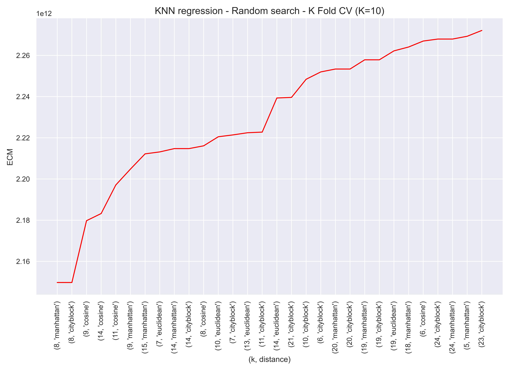{width="60%"}

{width="60%"}

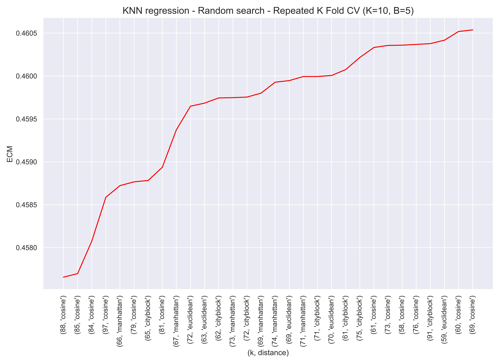{width="60%"}

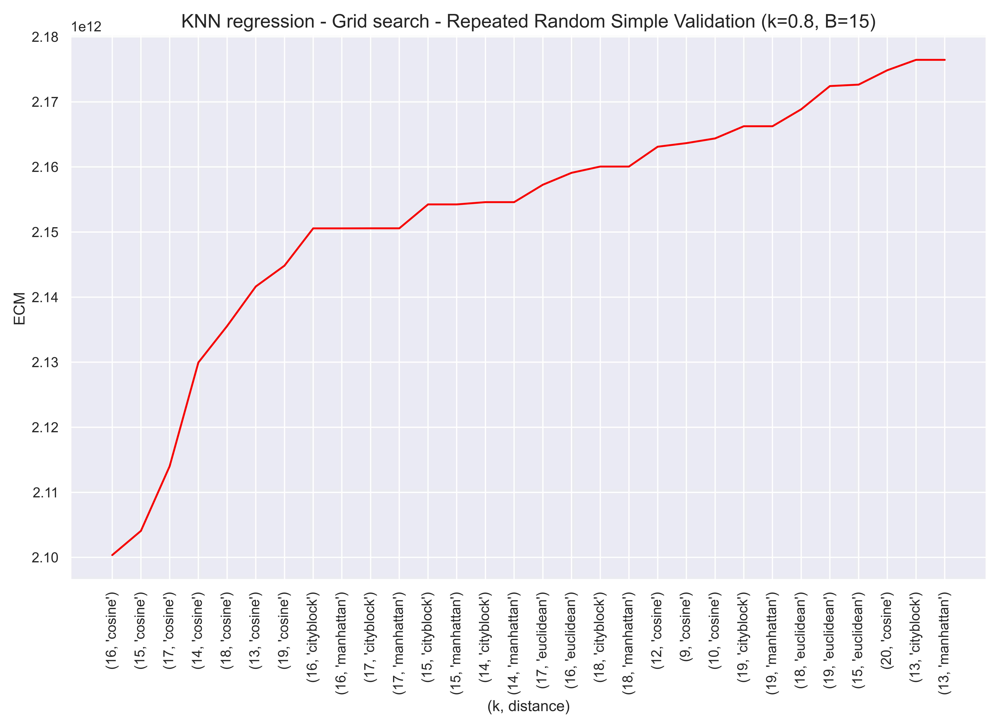{width="60%"}

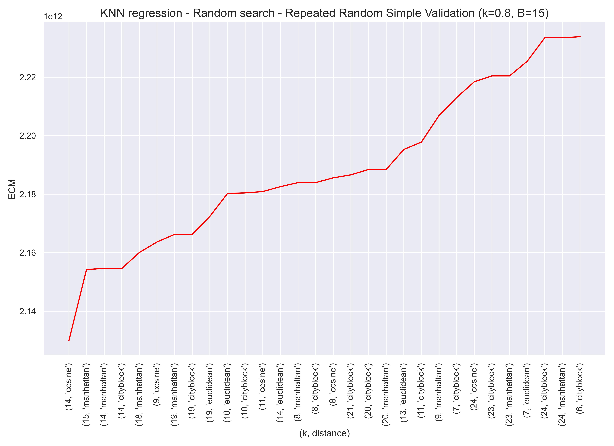{width="60%"}

</center>


Como puede verse, la combinación óptima de hiper-parámetros varía en función de la versión utilizada del algoritmo de ajuste de hiper-parámetros.


<br>


- Gráficos de los resultados obtenidos con las distintas variantes probadas del algoritmo Grid Search para el ajuste de los hiper-parámetros del modelo KNN para clasificación:
 

<center>

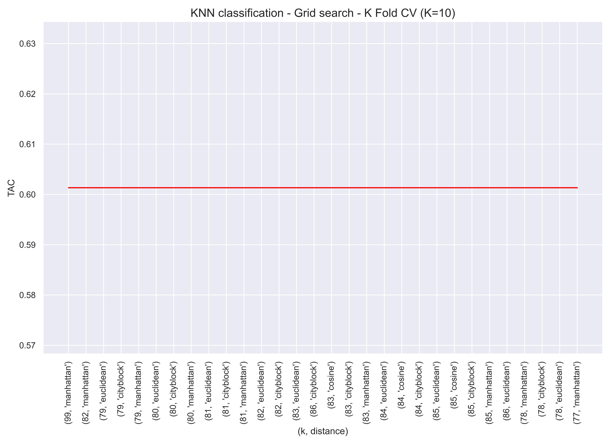{width="60%"}

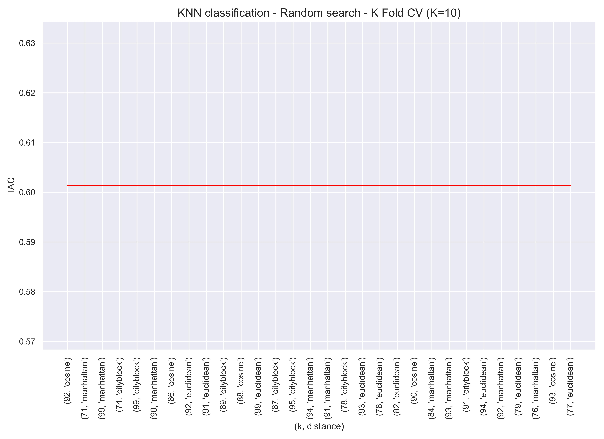{width="60%"}

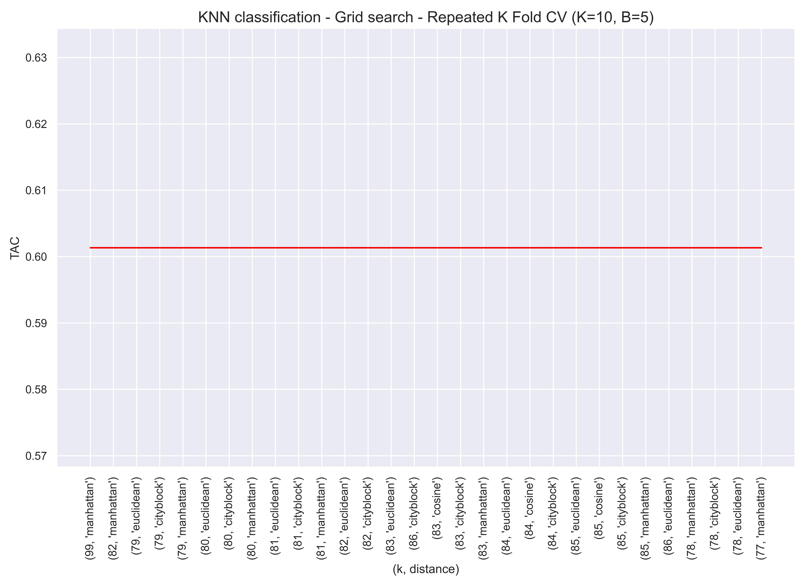{width="60%"}

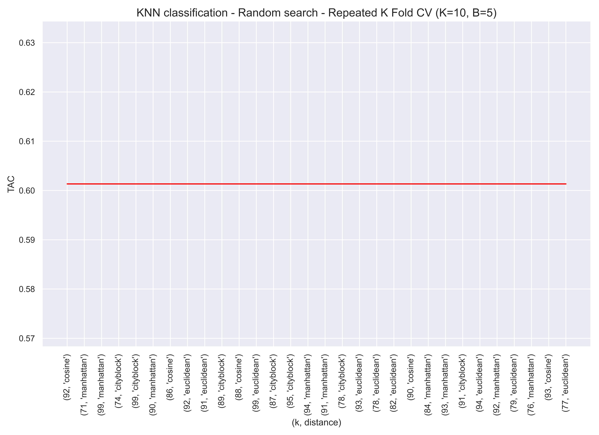{width="60%"}

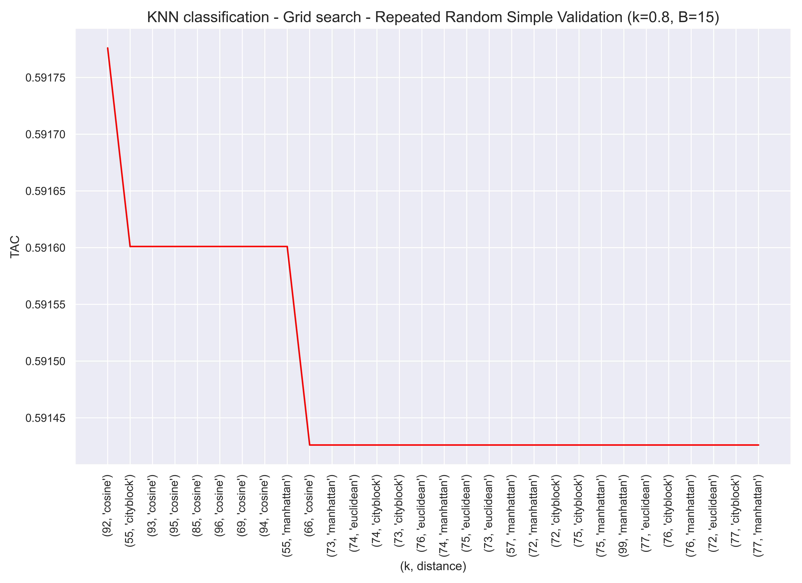{width="60%"}

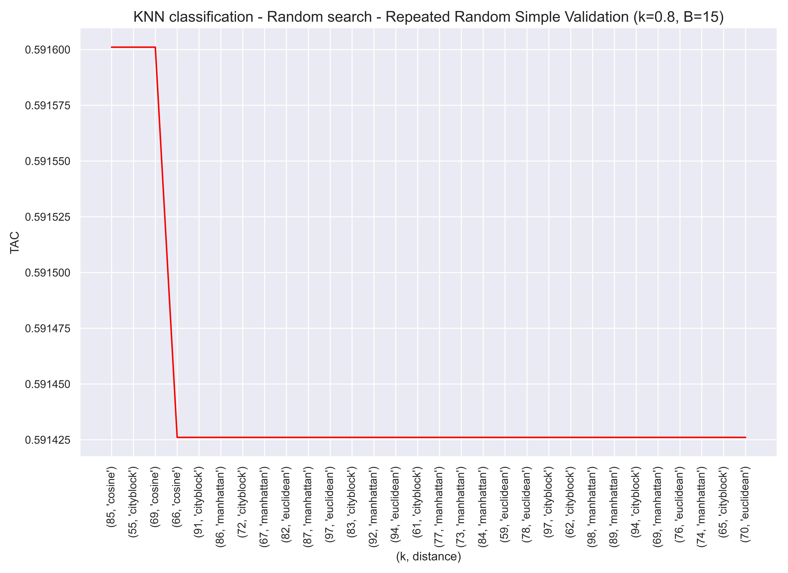{width="60%"}

</center>
 


Como ocurría en el caso anterior, la combinación óptima de hiper-parámetros varía en función de la versión utilizada del algoritmo de ajuste de hiper-parámetros. 

 

<br>


# Ajuste de hiperparámetros con `sklearn`
 
## Grid search con `sklearn`
     

La función que vamos a utilizar para aplicar el algoritmo de ajuste de hiper-parámetros Grid Search es `GridSearchCV`, de la libreria `sklearn`.

Esta función tiene, entre otros, los siguientes parámetros:


- estimator: es el modelo que cuyos hiper-parámetros quieren ajustarse. $\\[0.3cm]$

- param_grid: es un diccionario con los valores considerados para cada uno de los hiper-parámetros del modelo. $\\[0.3cm]$

- cv: esta función utiliza como algoritmo de validación el K-Fold. cv es el parámetro K, es decir, el número de folds. $\\[0.3cm]$

- scoring: es la métrica de validación que usará el algoritmo. $\\[0.3cm]$


Importamos la función `GridSearchCV`:

```python
from sklearn.model_selection import GridSearchCV
```


En este primer ejemplo vamos a utilizar como modelo el KNN para *regresión*.

```python
knn_regression = sklearn.neighbors.KNeighborsRegressor( )
```


Inicializamos la función `GridSearchCV` con los siguientes parametros:

```python
grid_search = GridSearchCV(estimator = knn_regression, param_grid = {'n_neighbors': range(1,200), 'metric': ['euclidean','cosine','cityblock','manhattan']}, cv = 10, scoring='neg_mean_squared_error')
```

Creamos un array con la variable respuesta, que en este caso es *price*, y un data-frame con los predictores, que serán el resto de variables del data-set con el que estamos trabajando:

```python
Y = Data.loc[:,'price']

X = Data.loc[:, Data.columns != 'price']
```


Ajustamos la función `GridSearchCV` con los datos de `Y` y `X` usando el método `fit` 

```python
grid_search.fit(X,Y)
```
 
Podemos acceder a alguna información relevante tras ajustar la función con los datos.


La combinación de hiper-parámetros óptimos:


```python
grid_search.best_params_
```


    {'metric': 'cosine', 'n_neighbors': 17}


El valor de la métrica que se ha considerado para esa combinación de hiper-parámetros óptimos:

```python
grid_search.best_score_
```

    -2278523570223.8994


Podemos crear un data-frame con las distintas combinaciones de valores de los hiper-parámetros que han sido utilizadas y el valor de la métrica de validación que se ha obtenido para cada una de esas combinaciones. Esto es justamente lo que nos devolvía nuestra función programada en la sección anterior.

```python
df_grid_search_sklearn = pd.DataFrame({'k': grid_search.cv_results_['param_n_neighbors'], 'distance': grid_search.cv_results_['param_metric'] , 'ECM': - grid_search.cv_results_['mean_test_score']})

df_grid_search_sklearn = df_grid_search_sklearn.sort_values(by='ECM', ascending=True)

df_grid_search_sklearn
```


<div>
<style scoped>
    .dataframe tbody tr th:only-of-type {
        vertical-align: middle;
    }

    .dataframe tbody tr th {
        vertical-align: top;
    }

    .dataframe thead th {
        text-align: right;
    }
</style>
<table border="1" class="dataframe">
  <thead>
    <tr style="text-align: right;">
      <th></th>
      <th>k</th>
      <th>distance</th>
      <th>ECM</th>
    </tr>
  </thead>
  <tbody>
    <tr>
      <th>215</th>
      <td>17</td>
      <td>cosine</td>
      <td>2.278524e+12</td>
    </tr>
    <tr>
      <th>209</th>
      <td>11</td>
      <td>cosine</td>
      <td>2.287579e+12</td>
    </tr>
    <tr>
      <th>214</th>
      <td>16</td>
      <td>cosine</td>
      <td>2.300468e+12</td>
    </tr>
    <tr>
      <th>216</th>
      <td>18</td>
      <td>cosine</td>
      <td>2.305225e+12</td>
    </tr>
    <tr>
      <th>210</th>
      <td>12</td>
      <td>cosine</td>
      <td>2.308334e+12</td>
    </tr>
    <tr>
      <th>...</th>
      <td>...</td>
      <td>...</td>
      <td>...</td>
    </tr>
    <tr>
      <th>794</th>
      <td>198</td>
      <td>manhattan</td>
      <td>5.264590e+12</td>
    </tr>
    <tr>
      <th>197</th>
      <td>198</td>
      <td>euclidean</td>
      <td>5.266036e+12</td>
    </tr>
    <tr>
      <th>198</th>
      <td>199</td>
      <td>euclidean</td>
      <td>5.272047e+12</td>
    </tr>
    <tr>
      <th>596</th>
      <td>199</td>
      <td>cityblock</td>
      <td>5.273960e+12</td>
    </tr>
    <tr>
      <th>795</th>
      <td>199</td>
      <td>manhattan</td>
      <td>5.273960e+12</td>
    </tr>
  </tbody>
</table>
<p>796 rows × 3 columns</p>
</div>


Realizamos algunos cambios orientados a una mejor visualización gráfica posterior.

```python
df_grid_search_sklearn['k'] = df_grid_search_sklearn['k'].astype(str) 

df_grid_search_sklearn['distance'] = df_grid_search_sklearn['distance'].astype(str)

df_grid_search_sklearn['k-distance'] = df_grid_search_sklearn[['k', 'distance']].agg('-'.join, axis=1)
```

<br>


---

<br>


Ahora vamos a aplicar la función `GridSearchCV` al modelo KNN para clasificación.


```python
knn_classification = sklearn.neighbors.KNeighborsClassifier( )
```

Inicializamos los parámetros de la función `GridSearchCV`:

```python
grid_search = GridSearchCV(estimator = knn_classification, param_grid = {'n_neighbors': range(1,200), 'metric': ['euclidean','cosine','cityblock','manhattan']}, cv = 10, scoring='accuracy')
```

Creamos un array con la variable respuesta, que en este caso es *quality_recode*, y un data-frame con los predictores, que serán el resto de variables del data-set con el que estamos trabajando:

```python
Y = Data.loc[:,'quality_recode']

X = Data.loc[:, Data.columns != 'quality_recode']
```

 
Podemos acceder a alguna información relevante tras ajustar la función con los datos.


La combinación de hiper-parámetros óptimos:

```python
grid_search.fit(X,Y)
```


 
```python
grid_search.best_estimator_
```

 
    {'metric': 'euclidean', 'n_neighbors': 34}


El valor de la métrica que se ha considerado para esa combinación de hiper-parámetros óptimos:

```python
grid_search.best_params_
```


    0.6036731882061174


Podemos crear un data-frame con las distintas combinaciones de valores de los hiper-parámetros que han sido utilizadas y el valor de la métrica de validación que se ha obtenido para cada una de esas combinaciones. Esto es justamente lo que nos devolvía nuestra función programada en la sección anterior.

```python
df_grid_search_sklearn = pd.DataFrame({'k': grid_search.cv_results_['param_n_neighbors'], 'distance': grid_search.cv_results_['param_metric'] , 'TAC': grid_search.cv_results_['mean_test_score']})

df_grid_search_sklearn = df_grid_search_sklearn.sort_values(by='TAC', ascending=False)

df_grid_search_sklearn
```


<div>
<style scoped>
    .dataframe tbody tr th:only-of-type {
        vertical-align: middle;
    }

    .dataframe tbody tr th {
        vertical-align: top;
    }

    .dataframe thead th {
        text-align: right;
    }
</style>
<table border="1" class="dataframe">
  <thead>
    <tr style="text-align: right;">
      <th></th>
      <th>k</th>
      <th>distance</th>
      <th>TAC</th>
    </tr>
  </thead>
  <tbody>
    <tr>
      <th>33</th>
      <td>34</td>
      <td>euclidean</td>
      <td>0.603673</td>
    </tr>
    <tr>
      <th>160</th>
      <td>161</td>
      <td>euclidean</td>
      <td>0.601573</td>
    </tr>
    <tr>
      <th>158</th>
      <td>159</td>
      <td>euclidean</td>
      <td>0.601573</td>
    </tr>
    <tr>
      <th>157</th>
      <td>158</td>
      <td>euclidean</td>
      <td>0.601573</td>
    </tr>
    <tr>
      <th>156</th>
      <td>157</td>
      <td>euclidean</td>
      <td>0.601573</td>
    </tr>
    <tr>
      <th>...</th>
      <td>...</td>
      <td>...</td>
      <td>...</td>
    </tr>
    <tr>
      <th>600</th>
      <td>4</td>
      <td>manhattan</td>
      <td>0.460890</td>
    </tr>
    <tr>
      <th>200</th>
      <td>2</td>
      <td>cosine</td>
      <td>0.410485</td>
    </tr>
    <tr>
      <th>598</th>
      <td>2</td>
      <td>manhattan</td>
      <td>0.394762</td>
    </tr>
    <tr>
      <th>399</th>
      <td>2</td>
      <td>cityblock</td>
      <td>0.394762</td>
    </tr>
    <tr>
      <th>1</th>
      <td>2</td>
      <td>euclidean</td>
      <td>0.384260</td>
    </tr>
  </tbody>
</table>
<p>796 rows × 3 columns</p>
</div>


Hacemos algunos cambios orientados a una mejor visualización gráfica posterior:

```python
df_grid_search_sklearn['k'] = df_grid_search_sklearn['k'].astype(str) 

df_grid_search_sklearn['distance'] = df_grid_search_sklearn['distance'].astype(str)

df_grid_search_sklearn['k-distance'] = df_grid_search_sklearn[['k', 'distance']].agg('-'.join, axis=1)
```


<br>


## Random search con `sklearn`

La función que vamos a utilizar para aplicar el algoritmo de ajuste de hiper-parámetros Grid Search es `RandomizedSearchCV`, de la libreria `sklearn`.

Esta función tiene, entre otros, los siguientes parámetros:


- estimator: es el modelo que cuyos hiper-parámetros quieren ajustarse. $\\[0.3cm]$

- param_distributions: es un diccionario con los valores considerados para cada uno de los hiper-parámetros del modelo. $\\[0.3cm]$

- cv: esta función utiliza como algoritmo de validación el K-Fold. cv es el parámetro K, es decir, el número de folds. $\\[0.3cm]$

- scoring: es la métrica de validación que usará el algoritmo. $\\[0.3cm]$

- n_iter: es el número de combinaciones de hiper-paramétros que se van a seleccionar aleatoriamente. $\\[0.3cm]$

- random_state: es la semilla aleatoria de la parte aleatoria que tiene el algoritmo Random Search. $\\[0.3cm]$


Importamos la función `RandomizedSearchCV` de la librería `sklearn`:

```python
from sklearn.model_selection import RandomizedSearchCV
```

Inicializamos algunos parámetros de la función `RandomizedSearchCV`:

```python
random_search = RandomizedSearchCV(estimator = knn_regression, param_distributions = {'n_neighbors': range(1,200), 'metric': ['euclidean','cosine','cityblock','manhattan']}, cv = 10, n_iter=100, random_state=123, scoring='neg_mean_squared_error')
```

Creamos un array con la variable respuesta, que en este caso es *price*, y un data-frame con los predictores, que serán el resto de variables del data-set con el que estamos trabajando:

```python
Y = Data.loc[:,'price']

X = Data.loc[:, Data.columns != 'price']
``` 

Entrenamos la función `RandomizedSearchCV` con los datos : 

```python
random_search.fit(X,Y)
```

Podemos crear un data-frame con las distintas combinaciones de valores de los hiper-parámetros que han sido utilizadas y el valor de la métrica de validación que se ha obtenido para cada una de esas combinaciones. Esto es justamente lo que nos devolvía nuestra función programada en la sección anterior.
 

```python
df_random_search_sklearn = pd.DataFrame({'k': random_search.cv_results_['param_n_neighbors'], 'distance': random_search.cv_results_['param_metric'] , 'ECM': - random_search.cv_results_['mean_test_score']})

df_random_search_sklearn = df_random_search_sklearn.sort_values(by='ECM', ascending=True)
df_random_search_sklearn
```


<div>
<style scoped>
    .dataframe tbody tr th:only-of-type {
        vertical-align: middle;
    }

    .dataframe tbody tr th {
        vertical-align: top;
    }

    .dataframe thead th {
        text-align: right;
    }
</style>
<table border="1" class="dataframe">
  <thead>
    <tr style="text-align: right;">
      <th></th>
      <th>k</th>
      <th>distance</th>
      <th>ECM</th>
      <th>k-distance</th>
    </tr>
  </thead>
  <tbody>
    <tr>
      <th>18</th>
      <td>11</td>
      <td>cosine</td>
      <td>2.287579e+12</td>
      <td>11-cosine</td>
    </tr>
    <tr>
      <th>38</th>
      <td>11</td>
      <td>manhattan</td>
      <td>2.321534e+12</td>
      <td>11-manhattan</td>
    </tr>
    <tr>
      <th>91</th>
      <td>14</td>
      <td>euclidean</td>
      <td>2.334281e+12</td>
      <td>14-euclidean</td>
    </tr>
    <tr>
      <th>84</th>
      <td>19</td>
      <td>cosine</td>
      <td>2.337300e+12</td>
      <td>19-cosine</td>
    </tr>
    <tr>
      <th>78</th>
      <td>12</td>
      <td>euclidean</td>
      <td>2.339571e+12</td>
      <td>12-euclidean</td>
    </tr>
    <tr>
      <th>...</th>
      <td>...</td>
      <td>...</td>
      <td>...</td>
      <td>...</td>
    </tr>
    <tr>
      <th>60</th>
      <td>189</td>
      <td>cityblock</td>
      <td>5.180324e+12</td>
      <td>189-cityblock</td>
    </tr>
    <tr>
      <th>43</th>
      <td>189</td>
      <td>euclidean</td>
      <td>5.182189e+12</td>
      <td>189-euclidean</td>
    </tr>
    <tr>
      <th>46</th>
      <td>190</td>
      <td>cityblock</td>
      <td>5.187852e+12</td>
      <td>190-cityblock</td>
    </tr>
    <tr>
      <th>17</th>
      <td>194</td>
      <td>manhattan</td>
      <td>5.227831e+12</td>
      <td>194-manhattan</td>
    </tr>
    <tr>
      <th>27</th>
      <td>196</td>
      <td>euclidean</td>
      <td>5.247368e+12</td>
      <td>196-euclidean</td>
    </tr>
  </tbody>
</table>
<p>100 rows × 4 columns</p>
</div>


Realizamos cambios para una posterior mejor visualización gráfica:

```python
df_random_search_sklearn['k'] = df_random_search_sklearn['k'].astype(str) 

df_random_search_sklearn['distance'] = df_random_search_sklearn['distance'].astype(str)

df_random_search_sklearn['k-distance'] = df_random_search_sklearn[['k', 'distance']].agg('-'.join, axis=1)
```

 
<br>


---

<br>


Ahora vamos a aplicar la función `RandomizedSearchCV` al modelo KNN para clasificación.

Inicializamos algunos parámetros de la función `RandomizedSearchCV`: 

```python
random_search = RandomizedSearchCV(estimator = knn_classification, param_distributions = {'n_neighbors': range(1,200), 'metric': ['euclidean','cosine','cityblock','manhattan']}, cv = 10, n_iter=100, random_state=123, scoring='accuracy')
```


Creamos un array con la variable respuesta, que en este caso es *quality_recode*, y un data-frame con los predictores, que serán el resto de variables del data-set con el que estamos trabajando:

```python
Y = Data.loc[:,'quality_recode']

X = Data.loc[:, Data.columns != 'quality_recode']
``` 


Entrenamos la función con los datos:
```python
random_search.fit(X,Y)
```


Podemos crear un data-frame con las distintas combinaciones de valores de los hiper-parámetros que han sido utilizadas y el valor de la métrica de validación que se ha obtenido para cada una de esas combinaciones. Esto es justamente lo que nos devolvía nuestra función programada en la sección anterior.
 
```python
df_random_search_sklearn = pd.DataFrame({'k': random_search.cv_results_['param_n_neighbors'], 'distance': random_search.cv_results_['param_metric'] , 'TAC': random_search.cv_results_['mean_test_score']})

df_random_search_sklearn = df_random_search_sklearn.sort_values(by='TAC', ascending=False)
df_random_search_sklearn
```


<div>
<style scoped>
    .dataframe tbody tr th:only-of-type {
        vertical-align: middle;
    }

    .dataframe tbody tr th {
        vertical-align: top;
    }

    .dataframe thead th {
        text-align: right;
    }
</style>
<table border="1" class="dataframe">
  <thead>
    <tr style="text-align: right;">
      <th></th>
      <th>k</th>
      <th>distance</th>
      <th>TAC</th>
    </tr>
  </thead>
  <tbody>
    <tr>
      <th>50</th>
      <td>101</td>
      <td>cityblock</td>
      <td>0.601573</td>
    </tr>
    <tr>
      <th>69</th>
      <td>92</td>
      <td>euclidean</td>
      <td>0.601573</td>
    </tr>
    <tr>
      <th>32</th>
      <td>156</td>
      <td>cityblock</td>
      <td>0.601573</td>
    </tr>
    <tr>
      <th>33</th>
      <td>173</td>
      <td>euclidean</td>
      <td>0.601573</td>
    </tr>
    <tr>
      <th>80</th>
      <td>97</td>
      <td>manhattan</td>
      <td>0.601573</td>
    </tr>
    <tr>
      <th>...</th>
      <td>...</td>
      <td>...</td>
      <td>...</td>
    </tr>
    <tr>
      <th>57</th>
      <td>5</td>
      <td>euclidean</td>
      <td>0.517093</td>
    </tr>
    <tr>
      <th>70</th>
      <td>5</td>
      <td>cosine</td>
      <td>0.515999</td>
    </tr>
    <tr>
      <th>14</th>
      <td>4</td>
      <td>cosine</td>
      <td>0.482937</td>
    </tr>
    <tr>
      <th>4</th>
      <td>4</td>
      <td>manhattan</td>
      <td>0.460890</td>
    </tr>
    <tr>
      <th>94</th>
      <td>2</td>
      <td>cosine</td>
      <td>0.410485</td>
    </tr>
  </tbody>
</table>
<p>100 rows × 3 columns</p>
</div>


Realizamos algunos cambios orientados a una mejor visualización gráfica posterior:
```python
df_random_search_sklearn['k'] = df_random_search_sklearn['k'].astype(str) 

df_random_search_sklearn['distance'] = df_random_search_sklearn['distance'].astype(str)


df_random_search_sklearn['k-distance'] = df_random_search_sklearn[['k', 'distance']].agg('-'.join, axis=1)
```

<br>

## Visualización de resultados <a class="anchor" id="1"></a>

Vamos a visualizar los resultados obtenidos aplicando las funciones  `GridSearchCV`  y  `RandomizedSearchCV` al modelo KNN para regresión:


```python
fig, axs = plt.subplots()

p1 = sns.lineplot(y="ECM", x='k-distance' , data=df_grid_search_sklearn.iloc[0:30, :], color='red')

plt.setp(p1.get_xticklabels(), rotation=90)

p1.title.set_text('KNN regression - Grid search - K fold (K=10)')

fig.savefig('pp1.jpg', format='jpg', dpi=1200)

plt.show()
```

```python
fig, axs = plt.subplots()

p2 = sns.lineplot(y="ECM", x='k-distance' , data=df_random_search_sklearn.iloc[0:30, :], color='red')

plt.setp(p2.get_xticklabels(), rotation=90)

p2.title.set_text('KNN regression - Random search - K fold (K=10)')

fig.savefig('pp2.jpg', format='jpg', dpi=1200)

plt.show()
```

<center>

{width="60%"}

{width="60%"}

</center> 


Como puede verse, la combinación óptima de hiper-parámetros varía en función de la versión utilizada del algoritmo de ajuste de hiper-parámetros.

<br>


Ahora vamos a visualizar los resultados obtenidos aplicando las funciones  `GridSearchCV`  y  `RandomizedSearchCV` al modelo KNN para clasificación:

```python
fig, axs = plt.subplots()

p1 = sns.lineplot(y="TAC", x='k-distance' , data=df_grid_search_sklearn.iloc[0:30, :], color='red')

plt.setp(p1.get_xticklabels(), rotation=90)

p1.title.set_text('KNN classification - Grid search - K fold (K=10)')

fig.savefig('pp3.jpg', format='jpg', dpi=1200)

plt.show()
```
```python
fig, axs = plt.subplots()

p2 = sns.lineplot(y="TAC", x='k-distance' , data=df_random_search_sklearn.iloc[0:30, :], color='red')

plt.setp(p2.get_xticklabels(), rotation=90)

p2.title.set_text('KNN classification - Random search - K fold (K=10)')

fig.savefig('pp4.jpg', format='jpg', dpi=1200)

plt.show()
```

    
     
<center>

{width="60%"}

{width="60%"}

</center> 


La combinación óptima de hiper-parámetros varía en función de la versión utilizada del algoritmo de ajuste de hiper-parámetros. 

Cabe destacar que en el segundo caso, las 30 combinaciones de hiper-parámetros representadas tienen el mismo valor de la métrica TAC, que es además el máximo alcanzado, por tanto son todas igual de óptimas.


 


<br>

---

<br>


# Bibliografía   


- Aler Mur, Ricardo. (2022). *Metodología: evaluación de modelos.* [Presentación de PowerPoint]. Aula Global UC3M. $\\[0.635cm]$
 
- Rodriguez, Daniel. (julio 2018). GridSearchCV. *AnalyticsLane*. https://www.analyticslane.com/2018/07/02/gridsearchcv/
 
<br> 
 
 
 
 
 
