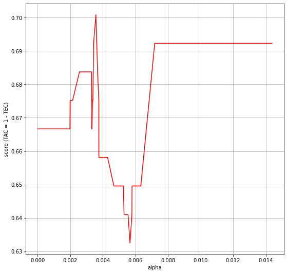

# Objetivos <a class="anchor" id="1"></a>

- Conocer un contexto de aplicación real.

- Ejercitarnos en el análisis de datos y la implementación de algoritmos de clasificación, para adquirir criterio en la aplicación de los mismos.

- Evaluar las capacidades de R y mlr para la implementación.


#  Problema <a class="anchor" id="2"></a>

- Resolver un problema de clasificación para el diagnóstico de pacientes hepáticos.


#  Datos <a class="anchor" id="3"></a>

- Usaremos el conjunto de datos “Indian Liver Patient Dataset”: Los pacientes con enfermedades del hígado han ido aumentando continuamente debido al consumo excesivo de alcohol, inhalación de gases nocivos, ingesta de alimentos contaminados, encurtidos y drogas. 

- Este conjunto de datos se utilizó para evaluar los algoritmos de predicción en un esfuerzo por reducir la cargapara los médicos. Este conjunto de datos contiene 416 registros de pacientes hepáticos y 167 registros de pacientes no hepáticos recopilados en el noreste de Andhra Pradesh, India.

- La variable de respuesta es “diseased” (personas que tienen enfermedad del hígado)

- El data set encuentra en la librería “mlr3data”. 
data("ilpd", package = "mlr3data")


 
\newpage


#  Desarrollo de la práctica <a class="anchor" id="4"></a>


Vamos a desarrollar esta práctica en los lenguajes de programación `R` y `Python` simultaneamente. 

En general lo haremos a través el lenguaje `Python` utilizando un paquete llamado `rpy2` que permite ejecutar codigo `R` desde `Python` 


##  Carga de los datos 


Empezamos la práctica cargando los datos, tanto en `R` como en `Python` :

Importamos en Python la libreria rpy2 que nos será esencial para trabajar con R y Python simultaneamente desde el mismo entorno:


```python
import warnings
warnings.filterwarnings("ignore")
```


```python
import rpy2

%load_ext rpy2.ipython
```

  
    


```r
%%R

# install.packages("mlr3data")
# install.packages("mlr3")
```

    
    


\newpage


Cargamos los datos en `R`


```r
%%R

data("ilpd", package = "mlr3data")

head(ilpd,5)
```

      age gender total_bilirubin direct_bilirubin alkaline_phosphatase
    1  65 Female             0.7              0.1                  187
    2  62   Male            10.9              5.5                  699
    3  62   Male             7.3              4.1                  490
    4  58   Male             1.0              0.4                  182
    5  72   Male             3.9              2.0                  195
      alanine_transaminase aspartate_transaminase total_protein albumin
    1                   16                     18           6.8     3.3
    2                   64                    100           7.5     3.2
    3                   60                     68           7.0     3.3
    4                   14                     20           6.8     3.4
    5                   27                     59           7.3     2.4
      albumin_globulin_ratio diseased
    1                   0.90      yes
    2                   0.74      yes
    3                   0.89      yes
    4                   1.00      yes
    5                   0.40      yes
    


\newpage

Cargamos los datos en `Python`


```python
import pandas as pd
```


```python
Data_Python = pd.read_csv('indian_liver_patient.csv')
```


```python
Data_Python = Data_Python.rename({'Dataset': 'Diseased'}, axis=1)
```


```python
Data_Python.head()
```
```
   Age  Gender  Total_Bilirubin  Direct_Bilirubin  Alkaline_Phosphotase  
0   65  Female              0.7               0.1                   187   
1   62    Male             10.9               5.5                   699   
2   62    Male              7.3               4.1                   490   
3   58    Male              1.0               0.4                   182   
4   72    Male              3.9               2.0                   195   

   Alamine_Aminotransferase  Aspartate_Aminotransferase  Total_Protiens  
0                        16                          18             6.8   
1                        64                         100             7.5   
2                        60                          68             7.0   
3                        14                          20             6.8   
4                        27                          59             7.3   

   Albumin  Albumin_and_Globulin_Ratio  Diseased  
0      3.3                        0.90         1  
1      3.2                        0.74         1  
2      3.3                        0.89         1  
3      3.4                        1.00         1  
4      2.4                        0.40         1 
```

 

\vspace{1cm}


**Describiremos cada una de las variables:**

- age: edad del paciente. A los pacientes que exceden 89 son listados con la edad 90
- gender: género del paciente.
- total_bilirubin: Total de bilirubina.
- direct_bilirubin: Bilirubina directa.
- alkaline_phosphatase: Fosfatasa alcalina.
- alanine_transaminase: alanina aminotransferasa o transamisana glutámico pirúvica.
- aspartate_trasaminase: aspartato aminotransferasa.
- total_protein: proteinas totales.
- albumin: albúmina.
- albumin_globulin_ratio: albúmina y globulina ratio.
- diseased: Si tienen (1) o no (2) enfermadad en el hígado.


Ahora que ya tenenmos cargados los datos y hemos visto la apariencia de los mismo procedemos a hacer un EDA (exploratory data analysis).


 

##   EDA en `R` <a class="anchor" id="6"></a>


###   EDA con `skimr` <a class="anchor" id="6"></a>


Haremos el EDA con la librería `skimr`, como se pide en el enunciado de la práctica.


```r
%%R

# install.packages('skimr')

library(skimr) # Cargamos librería

skim(ilpd) # EDA con librería
```

    -- Data Summary ------------------------
                               Values
    Name                       ilpd  
    Number of rows             583   
    Number of columns          11    
    _______________________          
    Column type frequency:           
      factor                   2     
      numeric                  9     
    ________________________         
    Group variables            None  
    
    -- Variable type: factor -------------------------------------------------------
      skim_variable n_missing complete_rate ordered n_unique top_counts        
    1 gender                0             1 FALSE          2 Mal: 441, Fem: 142
    2 diseased              0             1 FALSE          2 yes: 416, no: 167 
    
    -- Variable type: numeric ------------------------------------------------------
      skim_variable          n_missing complete_rate    mean      sd   p0   p25
    1 age                            0             1  44.7    16.2    4    33  
    2 total_bilirubin                0             1   3.30    6.21   0.4   0.8
    3 direct_bilirubin               0             1   1.49    2.81   0.1   0.2
    4 alkaline_phosphatase           0             1 291.    243.    63   176. 
    5 alanine_transaminase           0             1  80.7   183.    10    23  
    6 aspartate_transaminase         0             1 110.    289.    10    25  
    7 total_protein                  0             1   6.48    1.09   2.7   5.8
    8 albumin                        0             1   3.14    0.796  0.9   2.6
    9 albumin_globulin_ratio         0             1   0.947   0.318  0.3   0.7
          p50   p75   p100 hist 
    1  45      58     90   <U+2582><U+2586><U+2587><U+2585><U+2581>
    2   1       2.6   75   <U+2587><U+2581><U+2581><U+2581><U+2581>
    3   0.3     1.3   19.7 <U+2587><U+2581><U+2581><U+2581><U+2581>
    4 208     298   2110   <U+2587><U+2581><U+2581><U+2581><U+2581>
    5  35      60.5 2000   <U+2587><U+2581><U+2581><U+2581><U+2581>
    6  42      87   4929   <U+2587><U+2581><U+2581><U+2581><U+2581>
    7   6.6     7.2    9.6 <U+2581><U+2582><U+2587><U+2587><U+2581>
    8   3.1     3.8    5.5 <U+2581><U+2585><U+2587><U+2586><U+2581>
    9   0.947   1.1    2.8 <U+2586><U+2587><U+2582><U+2581><U+2581>
    

 


También haremos uso de la función `str()` que nos da la estructura de nuestro dataset.


```r
%%R

str(ilpd) # Analizamos la estructura de los datos
```

    'data.frame':	583 obs. of  11 variables:
     $ age                   : int  65 62 62 58 72 46 26 29 17 55 ...
     $ gender                : Factor w/ 2 levels "Female","Male": 1 2 2 2 2 2 1 1 2 2 ...
     $ total_bilirubin       : num  0.7 10.9 7.3 1 3.9 1.8 0.9 0.9 0.9 0.7 ...
     $ direct_bilirubin      : num  0.1 5.5 4.1 0.4 2 0.7 0.2 0.3 0.3 0.2 ...
     $ alkaline_phosphatase  : int  187 699 490 182 195 208 154 202 202 290 ...
     $ alanine_transaminase  : int  16 64 60 14 27 19 16 14 22 53 ...
     $ aspartate_transaminase: int  18 100 68 20 59 14 12 11 19 58 ...
     $ total_protein         : num  6.8 7.5 7 6.8 7.3 7.6 7 6.7 7.4 6.8 ...
     $ albumin               : num  3.3 3.2 3.3 3.4 2.4 4.4 3.5 3.6 4.1 3.4 ...
     $ albumin_globulin_ratio: num  0.9 0.74 0.89 1 0.4 1.3 1 1.1 1.2 1 ...
     $ diseased              : Factor w/ 2 levels "yes","no": 1 1 1 1 1 1 1 1 2 1 ...
    


Claramente podemos ver como con skimr, las variables que son numéricas las considera todas numéricas, mientras que la función str nos especifica las variables numéricas en si son variables que toman valores reales o enteros.


###  EDA con `DataExplorer` <a class="anchor" id="6"></a>


Por último sacaremos un reporte con la librería `DataExplorer`:


```r
%%R

# install.packages('DataExplorer')

# DataExplorer::create_report(ilpd,y="diseased") 
```

    
    

Se genera un reporte en HTML que puede ser abierto en el navegador. 


Aqui esta la version en PDF de dicho reporte:

https://github.com/FabioScielzoOrtiz/Estadistica4all.github.io/blob/main/Notebooks/Aprendizaje%20Automatico/Data%20Profiling%20Report.pdf


\newpage


Aunque hemos visto el número de valores ausentes en la salida que nos da skimr, esto se puede hacer a mano como sigue:


```r
%%R 

library(tidyverse)

ilpd %>% map_dbl(.f = function(x){sum(is.na(x))}) 

# Número de missing values
```

   
                       age                 gender        total_bilirubin 
                         0                      0                      0 
          direct_bilirubin   alkaline_phosphatase   alanine_transaminase 
                         0                      0                      0 
    aspartate_transaminase          total_protein                albumin 
                         0                      0                      0 
    albumin_globulin_ratio               diseased 
                         0                      0 
    


Podemos sacar las siguientes conclusiones del EDA anterior:
- Se dispone de 583 instancias y 11 variables (2 de tipo factor biclase, 5 de tipo numérico y 4 enteras)
- No hay ausencia de valores por lo que no habrá que eliminar instancias o al menos los modelos no se verán dificultados por los mismos.
- La variable respuesta es diseased que es una de las variables tipo factor biclase que puede tomar valores "yes" o "no". Se puede ver como esta variable está un poco desbalanceada ya que tenemos muchas más observaciones con valor "yes"(416 observaciones) que con valor "no"(167 observaciones).
- En cuanto a las correlaciones se puede ver que son relativamente altas entre los pares que tienen que ver con sustancias similares, como bilirubina directa y bilirubina total. Con respecto a la variable respuesta podemos ver como hay relaciones directas con el resto de variables y una correlacion similar en torno a 0.7.


\newpage

 

##   EDA en `Python` <a class="anchor" id="7"></a>


Ahora vamos a realizar un EDA del data-set pero usando `Python`

El EDA (Exploratory Data Analysis) en lineas generales va a consistir en:

- Analizar estructura del data-set que tenemoss (dimensiones, tipo de variables, valores faltantes, etc)
- Cálculo de estadísticos básicos para cada variable
-  Generación de gráficos que aporten información relevante (histogramas, diagramas de barras, scatter plots, box plots, etc)
- Análisis de relaciones entre los predictores y la respuesta.


###   Estructura del data-set <a class="anchor" id="8"></a>


```python
import warnings
warnings.filterwarnings("ignore")
```


```python
Data_Python.shape
```

    (583, 11)


\vspace{0.5cm}

Tenemos un data-set con 11 variables y 583 observaciones.

Las variables son:

- 10 predictores (age , gender , Total_Bilirubin , Direct_Bilirubin , Alkaline_Phosphotase , Alamine_Aminotransferase , Aspartate_Aminotransferase ,Total_Protiens , Albumin , Albumin_and_Globulin_Ratio ) 
  
- 1 respuesta ( Diseased )

La variables **categoricas** del data-set son: 

- Diseased y Gender (*binarias*)

Las variables **cuantitativas** del data-set son: 

- age , Alkaline_Phosphotase, Alamine_Aminotransferase  , Aspartate_Aminotransferase (*discretas*) y   Total_Bilirubin , Direct_Bilirubin, Total_Protiens, Albumin, Albumin_and_Globulin_Ratio (*continuas*)


\newpage
 

Con el siguiente código podemos ver el tipo de cada una de las variables en Python (que podría no coincidir con el descrito anteriormente, en su caso habría que modificarlo.)


```python
Data_Python.info()
```

    <class 'pandas.core.frame.DataFrame'>
    RangeIndex: 583 entries, 0 to 582
    Data columns (total 11 columns):
     #   Column                      Non-Null Count  Dtype  
    ---  ------                      --------------  -----  
     0   Age                         583 non-null    int64  
     1   Gender                      583 non-null    object 
     2   Total_Bilirubin             583 non-null    float64
     3   Direct_Bilirubin            583 non-null    float64
     4   Alkaline_Phosphotase        583 non-null    int64  
     5   Alamine_Aminotransferase    583 non-null    int64  
     6   Aspartate_Aminotransferase  583 non-null    int64  
     7   Total_Protiens              583 non-null    float64
     8   Albumin                     583 non-null    float64
     9   Albumin_and_Globulin_Ratio  583 non-null    float64
     10  Diseased                    583 non-null    int64  
    dtypes: float64(5), int64(5), object(1)
    memory usage: 50.2+ KB
    

\vspace{0.5cm}

En este caso el tipo en Python es correcto para todas las variables salvo para la respuesta (Diseased) ya que Python la considera entera (cuantitativa discreta: int64) cuando realmente es categórica binaria, por ello tranformamos su tipo de int64 a object (el tipo clasico de las variables categoricas en Python).


```python
Data_Python['Diseased'] = Data_Python['Diseased'].astype('object')
```


 

Comprobamos que los cambios se han producido correctamente:


```python
Data_Python.info()
```

    <class 'pandas.core.frame.DataFrame'>
    RangeIndex: 583 entries, 0 to 582
    Data columns (total 11 columns):
     #   Column                      Non-Null Count  Dtype  
    ---  ------                      --------------  -----  
     0   Age                         583 non-null    int64  
     1   Gender                      583 non-null    object 
     2   Total_Bilirubin             583 non-null    float64
     3   Direct_Bilirubin            583 non-null    float64
     4   Alkaline_Phosphotase        583 non-null    int64  
     5   Alamine_Aminotransferase    583 non-null    int64  
     6   Aspartate_Aminotransferase  583 non-null    int64  
     7   Total_Protiens              583 non-null    float64
     8   Albumin                     583 non-null    float64
     9   Albumin_and_Globulin_Ratio  583 non-null    float64
     10  Diseased                    583 non-null    object 
    dtypes: float64(5), int64(4), object(2)
    memory usage: 50.2+ KB
    

\vspace{0.5cm}


Ahora vamos a ver si existe algún valor nulo en el data-set:


```python
Data_Python.isnull().sum()
```


    Age                           0
    Gender                        0
    Total_Bilirubin               0
    Direct_Bilirubin              0
    Alkaline_Phosphotase          0
    Alamine_Aminotransferase      0
    Aspartate_Aminotransferase    0
    Total_Protiens                0
    Albumin                       0
    Albumin_and_Globulin_Ratio    0
    Diseased                      0
    dtype: int64


Ninguna de las variables tiene valores faltantes (nulos).


\vspace{0.7cm}


Ahora vamos a ver cual es el rango de las variables categoricas, y posteriormete lo codificaremos en formato estandar $\lbrace 0,1,2,...\rbrace$ , si es que no lo están ya.


```python
Data_Python['Gender'].unique()
```


    array(['Female', 'Male'], dtype=object)


```python
Data_Python['Diseased'].unique()
```


    array([1, 2], dtype=object)


Vamos a codificar en formato estandar la variable **Gender** tal que: **Female=0** , **Male=1** , y la variable **Diseased** tal que: **1=0** , **2=1**

Para ello vamos a apoyarnos en la libreria `sklearn`, que posteriormente volverá a ser usada. Se podría hacer esto de otras formas, como con un bucle for, pero en casos en los que el número de categorias es alto, la opción aportada por `sklearn` es bastante más eficiente que un bucle.


```python
from sklearn.preprocessing import OrdinalEncoder

ord_enc = OrdinalEncoder()
```


```python
Data_Python['Gender'] = ord_enc.fit_transform(Data_Python[['Gender']])

Data_Python['Diseased'] = ord_enc.fit_transform(Data_Python[['Diseased']])
```


Comprobamos que los cambios se han realizado correctamente:


```python
Data_Python['Gender'].unique()
```


    array([0., 1.])


```python
Data_Python['Diseased'].unique()
```


    array([0., 1.])


 

Pero cuidado, tras realizar estos cambios tambien se cambia en Python el tipo de las variables codificadas a 'float64' , que es un tipo cuantitativo (continuo), por lo que debemos volver a fijar el tipo de Diseased y Gender como 'object' (ya que son categoricas).


```python
Data_Python.dtypes
```


    Age                             int64
    Gender                        float64
    Total_Bilirubin               float64
    Direct_Bilirubin              float64
    Alkaline_Phosphotase            int64
    Alamine_Aminotransferase        int64
    Aspartate_Aminotransferase      int64
    Total_Protiens                float64
    Albumin                       float64
    Albumin_and_Globulin_Ratio    float64
    Diseased                      float64
    dtype: object


```python
Data_Python['Diseased'] = Data_Python['Diseased'].astype('object')
Data_Python['Gender'] = Data_Python['Gender'].astype('object')
```

\newpage

Verificamos que se han realizado correctamente los cambios:


```python
Data_Python.dtypes
```


    Age                             int64
    Gender                         object
    Total_Bilirubin               float64
    Direct_Bilirubin              float64
    Alkaline_Phosphotase            int64
    Alamine_Aminotransferase        int64
    Aspartate_Aminotransferase      int64
    Total_Protiens                float64
    Albumin                       float64
    Albumin_and_Globulin_Ratio    float64
    Diseased                       object
    dtype: object


\newpage
 

###   Resumen Estadístico Descriptivo Básico <a class="anchor" id="9"></a>

Ahora vamos a hacer una descripcion estadística básica de las variables del data-set:


```python
Data_Python.describe(include='all') # include='all' para dar un tratamiento diferente a las categoricas que a las cuantitativas
```
```
            Y         Age  Gender  Total_Bilirubin  Direct_Bilirubin  
count   583.0  583.000000   583.0       583.000000        583.000000   
unique    2.0         NaN     2.0              NaN               NaN   
top       0.0         NaN     1.0              NaN               NaN   
freq    416.0         NaN   441.0              NaN               NaN   
mean      NaN   44.746141     NaN         3.298799          1.486106   
std       NaN   16.189833     NaN         6.209522          2.808498   
min       NaN    4.000000     NaN         0.400000          0.100000   
25%       NaN   33.000000     NaN         0.800000          0.200000   
50%       NaN   45.000000     NaN         1.000000          0.300000   
75%       NaN   58.000000     NaN         2.600000          1.300000   
max       NaN   90.000000     NaN        75.000000         19.700000   

        Alkaline_Phosphotase  Alamine_Aminotransferase  
count             583.000000                583.000000   
unique                   NaN                       NaN   
top                      NaN                       NaN   
freq                     NaN                       NaN   
mean              290.576329                 80.713551   
std               242.937989                182.620356   
min                63.000000                 10.000000   
25%               175.500000                 23.000000   
50%               208.000000                 35.000000   
75%               298.000000                 60.500000   
max              2110.000000               2000.000000   

        Aspartate_Aminotransferase  Total_Protiens     Albumin  
count                   583.000000      583.000000  583.000000   
unique                         NaN             NaN         NaN   
top                            NaN             NaN         NaN   
freq                           NaN             Nan         NaN                      
mean                     109.910806     6.483190         3.141852
std                      288.918529     1.085451         0.795519
min                      10.000000      2.700000         0.900000
25%                      25.000000      5.800000         2.600000
50%                      42.000000      6.600000         3.100000
75%                      87.000000      7.200000         3.800000
max                      4929.000000    9.600000         5.500000

```
\newpage

```

        Albumin_and_Globulin_Ratio  
count                   583.000000         
unique                         NaN         
top                            NaN           
freq                           NaN                           
mean                      0.947064
std                       0.318492
min                       0.300000  
25%                       0.700000  
50%                       0.947064  
75%                       1.100000  
max                       2.800000

```

\newpage

 

###   Análisis gráfico general  


**Histogramas para las variables cuantitativas**  

\vspace{0.25cm}

Vamos a generar un histograma para cadda variable cuantitativa.

```python
import numpy as np
import seaborn as sns
import matplotlib as mpl
import matplotlib.pyplot as plt
```


```python
fig, axs = plt.subplots(3, 3, figsize=(13, 13))

p1 = sns.histplot(data=Data_Python, x="Total_Bilirubin", stat="proportion", bins=15, color="skyblue", ax=axs[0, 0])
p1.set_xticks( range(int(Data_Python['Total_Bilirubin'].min()) , int(Data_Python['Total_Bilirubin'].max()) , 10) )
p1.set_yticks( np.arange(0, 1, 0.1)  )

p2 = sns.histplot(data=Data_Python, x="Direct_Bilirubin", stat="proportion", bins=15, color="olive", ax=axs[0, 1])
p2.axes.set(xlabel='Direct_Bilirubin', ylabel=' ')
p2.set_xticks( range(int(Data_Python['Direct_Bilirubin'].min()) , int(Data_Python['Direct_Bilirubin'].max()) , 3) )
p2.set_yticks( np.arange(0, 1, 0.1)  )

p3 = sns.histplot(data=Data_Python, x="Alkaline_Phosphotase", stat="proportion", bins=15, color="blue", ax=axs[0, 2])
p3.axes.set(xlabel='Alkaline_Phosphotase', ylabel=' ')
p3.set_xticks( range(int(Data_Python['Alkaline_Phosphotase'].min()) , int(Data_Python['Alkaline_Phosphotase'].max()) , 320) )
p3.set_yticks( np.arange(0, 1, 0.1)  )

p4 = sns.histplot(data=Data_Python, x="Alamine_Aminotransferase", stat="proportion", bins=15, color="teal", ax=axs[1, 0])
p4.axes.set(xlabel='Alamine_Aminotransferase', ylabel=' ')
p4.set_xticks( range(int(Data_Python['Alamine_Aminotransferase'].min()) , int(Data_Python['Alamine_Aminotransferase'].max()) , 300) )
p4.set_yticks( np.arange(0, 1, 0.1)  )

p5 = sns.histplot(data=Data_Python, x="Aspartate_Aminotransferase", stat="proportion", bins=15, color="purple", ax=axs[1, 1])
p5.axes.set(xlabel='Aspartate_Aminotransferase', ylabel=' ')
p5.set_xticks( range(int(Data_Python['Aspartate_Aminotransferase'].min()) , int(Data_Python['Aspartate_Aminotransferase'].max()) , 850) )
p5.set_yticks( np.arange(0, 1, 0.1)  )

p6 = sns.histplot(data=Data_Python, x="Total_Protiens", stat="proportion", bins=15, color="pink", ax=axs[1, 2])
p6.axes.set(xlabel='Total_Protiens', ylabel=' ')
p6.set_xticks( range(int(Data_Python['Total_Protiens'].min()) , int(Data_Python['Total_Protiens'].max()+1) , 1) )
p6.set_yticks( np.arange(0, 1, 0.1)  )

p7 = sns.histplot(data=Data_Python, x="Albumin", stat="proportion", bins=15, color="orange", ax=axs[2, 0])
p7.axes.set(xlabel='Albumin', ylabel=' ')
p7.set_xticks( range(int(Data_Python['Albumin'].min()) , int(Data_Python['Albumin'].max()+1) , 1) )
p7.set_yticks( np.arange(0, 1, 0.1)  )

p8 = sns.histplot(data=Data_Python, x="Albumin_and_Globulin_Ratio", stat="proportion", bins=15, color="red", ax=axs[2, 1])
p8.axes.set(xlabel='Albumin_and_Globulin_Ratio', ylabel=' ')
p8.set_xticks( np.arange(0, 2, 0.5)  )
p8.set_yticks( np.arange(0, 1, 0.1)  )

p9 = sns.histplot(data=Data_Python, x="Age", stat="proportion", bins=15, color="green", ax=axs[2, 2])
p9.axes.set(xlabel='Age', ylabel=' ')
p9.set_xticks( range(int(Data_Python['Age'].min()) , int(Data_Python['Age'].max()) , 10) )
p9.set_yticks( np.arange(0, 1, 0.1)  )

plt.show()
```

\clearpage
    

    


\clearpage

 

**Diagramas de barras para las variables categóricas**

Ahora vamos a realizar una serie de operaciones para generar dos diagramas de barrras, uno para la variable Gender y otro para Diseased.


```python
proportion_Female = len( Data_Python.loc[ Data_Python['Gender']==0 , :] ) / len(Data_Python)
proportion_Male = len( Data_Python.loc[ Data_Python['Gender']==1 , :] ) / len(Data_Python)

proportion_Diseased_yes = len( Data_Python.loc[ Data_Python['Diseased']==0 , :] ) / len(Data_Python)
proportion_Diseased_no = len( Data_Python.loc[ Data_Python['Diseased']==1 , :] ) / len(Data_Python)
```


```python
Data_Python['proportion_Gender'] = 0


for i in range(0, len(Data_Python)):

    if Data_Python['Gender'][i] == 0 :

        Data_Python['proportion_Gender'][i] = proportion_Female

    else :

        Data_Python['proportion_Gender'][i] = proportion_Male
```


```python
Data_Python['proportion_Diseased'] = 0


for i in range(0, len(Data_Python)):

    if Data_Python['Diseased'][i] == 0 :

        Data_Python['proportion_Diseased'][i] = proportion_Diseased_yes

    else :

        Data_Python['proportion_Diseased'][i] = proportion_Diseased_no
```


```python
fig, axs = plt.subplots(1, 2, figsize=(8, 8))

p1 = sns.barplot(x='Gender', y='proportion_Gender', data=Data_Python, ax=axs[0]) 
p1.set_yticks( np.arange(0, 0.85, 0.1)  )
p1.set_xticklabels(['Female', 'Male'])
p1.axes.set(xlabel='Gender', ylabel='proportion')

p2 = sns.barplot(x='Diseased', y='proportion_Diseased', data=Data_Python, ax=axs[1]) 
p2.set_yticks( np.arange(0, 0.85, 0.1)  )
p2.set_xticklabels(['Yes', 'No'])
p2.axes.set(xlabel='Diseased', ylabel=' ')

plt.show()
```


    
{height=400px width=500px}
    
 


```python
[ proportion_Female , proportion_Male ]
```


    [0.24356775300171526, 0.7564322469982847]


```python
[ proportion_Diseased_yes , proportion_Diseased_no ]
```


    [0.7135506003430532, 0.2864493996569468]


Como puede verse el porcentaje de mujeres en la muestra es del 24.36% , mientras que el de hombres es del 75.64%

Por otro lado el porcentaje de endfermos es del71.36%, mientras que el de no enfermos es del 28.64%


\newpage

###   Box-plots para las variables cuantitativas  <a class="anchor" id="13"></a>


```python
fig, axs = plt.subplots(3, 3, figsize=(13, 13))

p1 = sns.boxplot(x=Data_Python['Age'], color="palegreen", ax=axs[0, 0])
p1.set_xticks( range(int(Data_Python['Age'].min()) , int(Data_Python['Age'].max()+10) , 10) )

p2 = sns.boxplot(x=Data_Python['Direct_Bilirubin'], color="olive", ax=axs[0, 1])
p2.set_xticks( range(int(Data_Python['Direct_Bilirubin'].min()) , int(Data_Python['Direct_Bilirubin'].max()) , 10) )

p3 = sns.boxplot(x=Data_Python['Alkaline_Phosphotase'], color="blue", ax=axs[1, 0])
p3.set_xticks( range(int(Data_Python['Alkaline_Phosphotase'].min()) , int(Data_Python['Alkaline_Phosphotase'].max() ) , 300) )

p4 = sns.boxplot(x=Data_Python['Alamine_Aminotransferase'], color="teal", ax=axs[1, 1])
p4.set_xticks( range(int(Data_Python['Alamine_Aminotransferase'].min()) , int(Data_Python['Alamine_Aminotransferase'].max()) , 500) )

p5 = sns.boxplot(x=Data_Python['Aspartate_Aminotransferase'], color="purple", ax=axs[0, 2])
p5.set_xticks( range(int(Data_Python['Aspartate_Aminotransferase'].min()) , int(Data_Python['Aspartate_Aminotransferase'].max()) , 850) )

p6 = sns.boxplot(x=Data_Python['Total_Protiens'], color="pink", ax=axs[1, 2])
p6.set_xticks( range(int(Data_Python['Total_Protiens'].min()) , int(Data_Python['Total_Protiens'].max()) , 10) )

p7 = sns.boxplot(x=Data_Python['Albumin'], color="orange", ax=axs[2, 2])
p7.set_xticks( range(int(Data_Python['Albumin'].min()) , int(Data_Python['Albumin'].max()) , 10) )

p8 = sns.boxplot(x=Data_Python['Albumin_and_Globulin_Ratio'], color="red", ax=axs[2, 1])
p8.set_xticks( range(int(Data_Python['Albumin_and_Globulin_Ratio'].min()) , int(Data_Python['Albumin_and_Globulin_Ratio'].max()) , 10) )

p9 = sns.boxplot(x=Data_Python['Total_Bilirubin'], color="skyblue", ax=axs[2, 0])
p9.set_xticks( range(int(Data_Python['Total_Bilirubin'].min()) , int(Data_Python['Total_Bilirubin'].max()) , 10) )


plt.show()
```


    

    


\newpage
 

###   Análisis de la relación entre los predictores categoricos y la respuesta <a class="anchor" id="14"></a>

**Analisis relación entre respuesta (Diseased) y Gender**

\vspace{0.55cm}

**Frecuencia relativa de genero condicionada a enfermedad**

Ahora vamos a realizar una serie de operaciones para obtener una tabla de frecuencias relativas de la variable Gender condicionada a la respuesta (Diseased). También obtendremos el gráfico de barras asociado a esta tabla.


```python
Df_Diseased_Yes = Data_Python.loc[ Data_Python['Diseased']==0 , :] 

proportion_Female_in_Diseased_Yes = len( Df_Diseased_Yes.loc[Df_Diseased_Yes['Gender']==0 , :] ) / len(Df_Diseased_Yes)

####################

Df_Diseased_Yes = Data_Python.loc[ Data_Python['Diseased']==0 , :] 

proportion_Male_in_Diseased_Yes = len( Df_Diseased_Yes.loc[Df_Diseased_Yes['Gender']==1 , :] ) / len(Df_Diseased_Yes)

####################

Df_Diseased_No = Data_Python.loc[ Data_Python['Diseased']==1 , :] 

proportion_Female_in_Diseased_No = len( Df_Diseased_No.loc[Df_Diseased_No['Gender']==0 , :] ) / len(Df_Diseased_No)

####################

Df_Diseased_No = Data_Python.loc[ Data_Python['Diseased']==1 , :] 

proportion_Male_in_Diseased_No = len( Df_Diseased_No.loc[Df_Diseased_No['Gender']==1 , :] ) / len(Df_Diseased_No)

```


Función para calcular tablas de frecuencias relativas condicionadas con dos variables:


```python
def Table_Con_Rel_Freq_2_Var_Py (df, var1, p1, p2, var1_name='var1' , var2_name='var2') :

    table = np.zeros(( p2+1 , p1+1 ))
    table[:] = np.nan

##########################################################

    for i in range(0, p2+1):
        for j in range(0, p1+1):

            df_new = df.loc[ var1 == j   , : ]

            table[i,j] = len( df_new.loc[ df_new[var2_name] == i , :] ) / len(df_new)
    
    table = pd.DataFrame(table)

    return table
```


```python
Frec_Relativas_Condicionadas_Gender_in_Diseased = Table_Con_Rel_Freq_2_Var_Py (Data_Python, Data_Python['Diseased'], 1, 1, var1_name='Diseased' , var2_name='Gender')

Frec_Relativas_Condicionadas_Gender_in_Diseased.index = ['Female' , 'Male']
Frec_Relativas_Condicionadas_Gender_in_Diseased.columns = ['Yes' , 'No']
Frec_Relativas_Condicionadas_Gender_in_Diseased = Frec_Relativas_Condicionadas_Gender_in_Diseased.style.set_caption("Gender  |  Diseased ")
```


```python
p1 = sns.countplot(data=Data_Python, x="Diseased", hue="Gender", palette="husl")
p1.set_xticklabels(['Yes', 'No'])
p1.legend(title='Gender', loc='upper right', labels=['Female', 'Male'])
```


    
{height=320px width=420px}
    

\newpage

```python
Frec_Relativas_Condicionadas_Gender_in_Diseased
```

```
Gender | Diseased
                
            Yes	        No
Female  	0.221154	0.299401
Male	    0.778846	0.700599
```


```python
[proportion_Female_in_Diseased_Yes , proportion_Male_in_Diseased_Yes]
```


    [0.22115384615384615, 0.7788461538461539]


```python
[proportion_Female_in_Diseased_No , proportion_Male_in_Diseased_No]
```


    [0.2994011976047904, 0.7005988023952096]


Como puede observarse el porcentaje de mujeres dentro del grupo de los enfermos es del 22.12% , mientras que el de hombres es del 77.88%.

Por otro lado el porcentaje de mujeres dentro del grupo de los no enfermos es del 29.94%, mientras que el de hombres es del 70.06%


\vspace{0.5cm}

**Frecuencia relativa de enfermedad condicionada al genero**

Ahora vamos a realizar una serie de operaciones para obtener una tabla de frecuencias relativas de la variable respuesta (Diseased) condicionada a la variable Gender . También obtendremos el gráfico de barras asociado a esta tabla.


```python
Frec_Relativas_Condicionadas_Diseased_in_Gender = Table_Con_Rel_Freq_2_Var_Py (Data_Python, Data_Python['Gender'], 1, 1, var1_name='Gender' , var2_name='Diseased')
Frec_Relativas_Condicionadas_Diseased_in_Gender.index = ['Yes' , 'No']
Frec_Relativas_Condicionadas_Diseased_in_Gender.columns = ['Female' , 'Male']
Frec_Relativas_Condicionadas_Diseased_in_Gender = Frec_Relativas_Condicionadas_Diseased_in_Gender.style.set_caption("Diseased | Gender")
```


```python
p = sns.countplot(data=Data_Python, x="Gender", hue="Diseased", palette="husl")
p.set_xticklabels(['Female', 'Male'])
p.legend(title='Diseased', loc='upper right', labels=['Yes', 'No'])
```


    
{height=320px width=420px}
    


```python
Frec_Relativas_Condicionadas_Diseased_in_Gender
```
```
Diseased | Gender
 	
      Female	  Male
Yes	0.647887	0.734694
No	0.352113	0.265306
```


Como puede observarse el porcentaje de enfermos dentro del grupo de as mujeres es del 64.79% , mientras que el de no enfermos es del 35.21%.

Por otro lado el porcentaje de enfermos dentro del grupo de los hombres es del 73.47%, mientras que el de no enfermos es del 26.53%


\newpage

**Analisis relación entre respuesta (Diseased) y Grupo de Edad**

\vspace{0.25cm}

**Frecuecnia relativa de enfermedad en funcion del grupo de edad**

Tenemos que categorizar la variable cuantitativa Age (edad) , para ello debemos emplear una regla de categorización (mediana, media, cuartiles, Scott ...)

Usaremos la regla de los cuartiles por simplicidad:


```python
intervals = np.quantile( Data_Python['Age'] , [0, 0.25, 0.5, 0.75 , 1])
intervals
```


    array([ 4., 33., 45., 58., 90.])


Nos apoyaremos en la funcion `cut()` de la libreria `Pandas` para categorizar la variable Age usando la regla de los cuartiles.

A esta función le das un vector (bins) y construye unos intervalos con los elementos del vector, en este caso (3, 33], (33, 45], (45, 58], (58, 90]. Luego te devuelve a qué intervalo pertenece cada observación de una variable dada (en nuestro caso Age), y también nos permite codificar estos intervalos con la codificacion estandar (0,1,2,...), y así obtener una nueva variable que es una versión categorizada de la variable pasada (Age en nuestro caso).

Vamos a restar una cantidad positiva (por ejemplo 1) al mínimo de Age, puesto que ese valor será el extremo inferior del primer intervalo, y dicho intervalo será abierto en ese extremo (por configuración de la función `cut`), por tanto si no restasemos una cantidad positiva, el valor mínimo de Age no estaría en ninguno de los intervalos generados por `cut()`


```python
intervals[0] =  intervals[0] - 1

intervals
```


    array([ 3., 33., 45., 58., 90.])


<p><p style="page-break-after:always;"></p></p>


```python
pd.cut(x=Data_Python['Age'] , bins=intervals , right=True)
```


    0      (58.0, 90.0]
    1      (58.0, 90.0]
    2      (58.0, 90.0]
    3      (45.0, 58.0]
    4      (58.0, 90.0]
               ...     
    578    (58.0, 90.0]
    579    (33.0, 45.0]
    580    (45.0, 58.0]
    581     (3.0, 33.0]
    582    (33.0, 45.0]
    Name: Age, Length: 583, dtype: category
    Categories (4, interval[float64, right]): [(3.0, 33.0] < (33.0, 45.0] < (45.0, 58.0] < (58.0, 90.0]]


```python
pd.cut(x=Data_Python['Age'] , bins=intervals , labels=False)
```


    0      3
    1      3
    2      3
    3      2
    4      3
          ..
    578    3
    579    1
    580    2
    581    0
    582    1
    Name: Age, Length: 583, dtype: int64


\vspace{0.1cm}


```python
Data_Python['Age_cat'] = pd.cut(x=Data_Python['Age'] , bins=intervals , labels=False)
```

\vspace{0.2cm}


La nueva variable $Age\_cat$ es tal que:

$$
Age\_cat_{i} = \left\lbrace\begin{array}{l} 0, \hspace{0.25cm} \text{ if $Age_{i} \in \left[ Min(Age ) \hspace{0.03cm} ,\hspace{0.03cm} Q(0.25, Age ) \right] $} \\ \\ 1, \hspace{0.25cm}\text{ if $Age_{i} \in ( Q(0.25 , Age ) , Q(0.50 , Age )] $}   
\\ \\ 2, \hspace{0.25cm} \text{ if $Age _{i} \in (Q(0.50 , Age ) , Q(0.75 , Age )] $}   \\ \\ 3,  \hspace{0.25cm} \text{ if $Age _{i} \in \left(Q(0.75 ,  Age ) \hspace{0.02cm},\hspace{0.02cm} Max(Age )\right] $} \end{array}\right.
$$

para $\hspace{0.1cm} i=1,...,n$

\vspace{0.2cm}


Ahora tenemos una variable que nos indica el grupo de edad de cada individuo. Tenemos tes grupos de edad. 

Grupo 0:  $\hspace{0.2cm} \leqslant 33$ años 

Grupo 1: $\hspace{0.2cm}$ entre $33$ y $45$ años

Grupo 2: $\hspace{0.2cm}$ entre $45$ y $58$ años

grupo 3: $\hspace{0.2cm}$ $> 58$ años


\newpage

Ahora vamos a generar una tabla de frecuencias relativas de la variable respuesta (Diseased) condicionada a la nueva variable Grupo de edad (Age_cat), también generaremos su gráfico de barras asociado.


```python
Frec_Relativas_Condicionadas_Diseased_in_Aged = Table_Con_Rel_Freq_2_Var_Py (Data_Python, Data_Python['Age_cat'], 3, 1, var1_name='Age_cat' , var2_name='Diseased')
Frec_Relativas_Condicionadas_Diseased_in_Aged.index = ['Yes' , 'No']
Frec_Relativas_Condicionadas_Diseased_in_Aged.columns = ['(3, 33]', '(33, 45]' , '(45, 58]' , '(58, 90]']
Frec_Relativas_Condicionadas_Diseased_in_Aged = Frec_Relativas_Condicionadas_Diseased_in_Aged.style.set_caption("Diseased | Age Group")
```


```python
p = sns.countplot(data=Data_Python, x="Age_cat", hue="Diseased", palette="husl")
p.set_xticklabels(['(3, 33]', '(33, 45]' , '(45, 58]' , '(58, 90]'])
p.legend(title='Diseased', loc='upper right', labels=['Yes', 'No'] )
```

    
{height=320px width=420px}
    


```python
Frec_Relativas_Condicionadas_Diseased_in_Aged  
```


```
 Diseased | Age Group
 
 	    (3, 33]	    (33, 45]	 (45, 58]	  (58, 90]
Yes 	0.645570	 0.676056	  0.800000    0.736842
No  	0.354430	 0.323944	  0.200000    0.263158
``` 

\newpage

Como puede observarse dentro del grupo de los más jovenes (de edad menor o igual a 33) el procentaje de enfermos es del 64.56% , este porcentaje aumenta hasta el 67.60% en el grupo de individuos cuya edad esta entre 33 y 45 años, y hasta el 80% en el de los individuos con una edad entre 45 y 58 años, luego pasa a ser del 73.68% en el grupo de edad superior a 58 años.


\vspace{1cm}

**Frecuecnia relativa de grupo de edad en funcion de enfermedad**

Ahora vamos a generar una tabla de frecuencias relativas de la variable grupo de edad (Age_cat)   condicionada a la   variable respuesta, también generaremos su gráfico de barras asociado.


```python
Frec_Relativas_Condicionadas_Age_in_Diseased = Table_Con_Rel_Freq_2_Var_Py (Data_Python, Data_Python['Diseased'], 1, 3, var1_name='Diseased' , var2_name='Age_cat')
Frec_Relativas_Condicionadas_Age_in_Diseased.index = ['(3, 33]', '(33, 45]' , '(45, 58]' , '(58, 90]']
Frec_Relativas_Condicionadas_Age_in_Diseased.columns = ['Yes' , 'No']
Frec_Relativas_Condicionadas_Age_in_Diseased = Frec_Relativas_Condicionadas_Age_in_Diseased.style.set_caption("Age Group | Diseased")
```


```python
p = sns.countplot(data=Data_Python, x="Diseased", hue="Age_cat", palette="husl")
p.set_xticklabels(['Yes', 'No'])
p.legend(title='Group Age', loc='upper right', labels= ['(3, 33]', '(33, 45]' , '(45, 58]' , '(58, 90]'])
```


    
{height=320px width=420px}
    


```python
Frec_Relativas_Condicionadas_Age_in_Diseased
```

```

Age Group | Diseased

 	            Yes	         No
(3, 33]	     0.245192	  0.335329
(33, 45]	 0.230769	  0.275449
(45, 58]	 0.288462	  0.179641
(58, 90]	 0.235577	  0.209581

```


  


Se puede apreciar que dentro del grupo de los enfermos , el grupo de edad mas frecuente seria el de los individuos con una edad entre 45 y 58 años, seguido del de más de 58 años. 

Por otro lado dentro del grupo de los no enfermos el grupo de edad claramente mayoritario es el de los mas jovenes (edad menor o igual a 33 años), seguido del siguiente grupo mas joven (edad entre 33 y 45).


\vspace{1cm}

### 4.3.5. Análisis de la relación entre los predictores cuantitativos y la respuesta  <a class="anchor" id="17"></a>

\vspace{0.21cm}


**Resumen Estadístico Descriptivo Cuantitativo en función de Diseased**

Ahora vamos a hacer una serie de operaciones para obtener una tabla en la que se pueden comparar los valores de diferentes estadísticos descriptivos básicos para cada variable cuantitativa en función del valor de la respuesta (Diseased).


```python
Data_Python_Quantitative_Diseased_yes = Data_Python.loc[ Data_Python['Diseased'] == 0 , (Data_Python.columns != 'Gender') & (Data_Python.columns != 'Diseased') & (Data_Python.columns != 'proportion_Gender')  & (Data_Python.columns != 'proportion_Diseased') & (Data_Python.columns != 'Age_cat') ]
Data_Python_Quantitative_Diseased_no = Data_Python.loc[ Data_Python['Diseased'] == 1 , (Data_Python.columns != 'Gender') & (Data_Python.columns != 'Diseased') & (Data_Python.columns != 'proportion_Gender')  & (Data_Python.columns != 'proportion_Diseased') & (Data_Python.columns != 'Age_cat') ]
```


```python
std_yes = Data_Python_Quantitative_Diseased_yes.std()
std_no = Data_Python_Quantitative_Diseased_no.std()

mean_yes = Data_Python_Quantitative_Diseased_yes.mean()
mean_no = Data_Python_Quantitative_Diseased_no.mean()

Q25_yes = Data_Python_Quantitative_Diseased_yes.quantile(q=0.25)
Q25_no = Data_Python_Quantitative_Diseased_no.quantile(q=0.25)

Q50_yes = Data_Python_Quantitative_Diseased_yes.quantile(q=0.5)
Q50_no = Data_Python_Quantitative_Diseased_no.quantile(q=0.5)

Q75_yes = Data_Python_Quantitative_Diseased_yes.quantile(q=0.75)
Q75_no = Data_Python_Quantitative_Diseased_no.quantile(q=0.75)

min_yes = Data_Python_Quantitative_Diseased_yes.min()
min_no = Data_Python_Quantitative_Diseased_no.min()

max_yes = Data_Python_Quantitative_Diseased_yes.max()
max_no = Data_Python_Quantitative_Diseased_no.max()
```


```python
df_yes = pd.DataFrame({'mean':mean_yes , 'min':min_yes , 'Q25':Q25_yes  , 'median':Q50_yes  , 'Q75':Q75_yes  , 'max':max_yes  , 'std':std_yes})

df_no = pd.DataFrame({'mean':mean_no , 'min':min_no , 'Q25':Q25_no  , 'median':Q50_no  , 'Q75':Q75_no  , 'max':max_no  , 'std':std_no})
```

<p><p style="page-break-after:always;"></p></p>


```python
Statistics_Quantitatives_Diseased = pd.DataFrame({
    
              'Age_yes':df_yes.iloc[0,:]   ,              
              'Age_no':df_no.iloc[0,:],
              'Total_Bilirubin_yes':df_yes.iloc[1,:]   , 
              'Total_Bilirubin_no':df_no.iloc[1,:],
              'Direct_Bilirubin_yes':df_yes.iloc[2,:]   , 
              'Direct_Bilirubin_no':df_no.iloc[2,:],
              'Alkaline_Phosphotase_yes':df_yes.iloc[3,:]   , 
              'Alkaline_Phosphotase_no':df_no.iloc[3,:],
              'Alamine_Aminotransferase_yes':df_yes.iloc[4,:]   , 
              'Alamine_Aminotransferase_no':df_no.iloc[4,:],
              'Aspartate_Aminotransferase_yes':df_yes.iloc[5,:]   , 
              'Aspartate_Aminotransferase_no':df_no.iloc[5,:],
              'Total_Protiens_yes':df_yes.iloc[6,:]   , 
              'Total_Protiens_no':df_no.iloc[6,:],
              'Albumin_yes':df_yes.iloc[7,:]   , 
              'Albumin_no':df_no.iloc[7,:],
              'Albumin_and_Globulin_Ratio_yes':df_yes.iloc[8,:]   , 
              'Albumin_and_Globulin_Ratio_no':df_no.iloc[8,:],
              
               })
```

\newpage

```python
Statistics_Quantitatives_Diseased
```

```
          Age_yes     Age_no  Total_Bilirubin_yes  Total_Bilirubin_no  
mean    46.153846  41.239521             4.164423            1.142515   
min      7.000000   4.000000             0.400000            0.500000   
Q25     34.000000  28.000000             0.800000            0.700000   
median  46.000000  40.000000             1.400000            0.800000   
Q75     58.000000  55.000000             3.625000            1.100000   
max     90.000000  85.000000            75.000000            7.300000   
std     15.654412  16.999366             7.144831            1.004472   

        Direct_Bilirubin_yes  Direct_Bilirubin_no  Alkaline_Phosphotase_yes  
mean                1.923558             0.396407                319.007212   
min                 0.100000             0.100000                 63.000000   
Q25                 0.200000             0.200000                186.000000   
median              0.500000             0.200000                229.000000   
Q75                 1.800000             0.350000                315.250000   
max                19.700000             3.600000               2110.000000   
std                 3.206901             0.519255                268.307911   

        Alkaline_Phosphotase_no  Alamine_Aminotransferase_yes  
mean                 219.754491                     99.605769   
min                   90.000000                     12.000000   
Q25                  161.500000                     25.000000   
median               186.000000                     41.000000   
Q75                  213.000000                     76.500000   
max                 1580.000000                   2000.000000   
std                  140.986262                    212.768472 


    Alkaline_Phosphotase_no  Alamine_Aminotransferase_yes  
mean                 219.754491                     99.605769   
min                   90.000000                     12.000000   
Q25                  161.500000                     25.000000   
median               186.000000                     41.000000   
Q75                  213.000000                     76.500000   
max                 1580.000000                   2000.000000   
std                  140.986262                    212.768472   

        Alamine_Aminotransferase_no  Aspartate_Aminotransferase_yes  
mean                      33.652695                      137.699519   
min                       10.000000                       11.000000   
Q25                       20.000000                       29.750000   
median                    27.000000                       52.500000   
Q75                       37.500000                      108.750000   
max                      181.000000                     4929.000000   
std                       25.060392                      337.389980   

        Aspartate_Aminotransferase_no  Total_Protiens_yes  Total_Protiens_no  
mean                        40.688623            6.459135           6.543114   
min                         10.000000            2.700000           3.700000   
Q25                         21.000000            5.700000           5.900000   
median                      29.000000            6.550000           6.600000   
Q75                         43.500000            7.200000           7.300000   
max                        285.000000            9.600000           9.200000   
std                         36.411620            1.094659           1.063042 


Total_Protiens_yes  Total_Protiens_no  Albumin_yes  Albumin_no  
mean              6.459135           6.543114     3.060577    3.344311   
min               2.700000           3.700000     0.900000    1.400000   
Q25               5.700000           5.900000     2.500000    2.900000   
median            6.550000           6.600000     3.000000    3.400000   
Q75               7.200000           7.300000     3.625000    4.000000   
max               9.600000           9.200000     5.500000    5.000000   
std               1.094659           1.063042     0.786595    0.783690   

        Albumin_and_Globulin_Ratio_yes  Albumin_and_Globulin_Ratio_no  
mean                          0.914337                       1.028588  
min                           0.300000                       0.370000  
Q25                           0.700000                       0.900000  
median                        0.900000                       1.000000  
Q75                           1.100000                       1.200000  
max                           2.800000                       1.900000  
std                           0.325374                       0.285658 

```

\vspace{0.2cm}

Esta tabla nos aporta información muy relevante, algunos ejemplos son los siguientes:

- La media de edad en el grupo de los enfermos es de 46 años mientras que en el de no enfermos es 41.24

- Hay un 25% de los enfermos que tienen un valor de Total_Bilirubin superior a 3.62, mientras que en el grupo de los no enfermos solo un 25% supera un valor de 1.1.


\newpage


**Diagrama de puntos de la respuesta (Diseased) en función de predictores cuantitativos**

En este caso vamos a generar unos diagramas de puntos de la respuesta en función de cada uno de los predictores cuantitativos. El diagrama de puntos que usaremos es un tipo especial que añade ruido horizontal a los puntos para poder así visulalizar varios puntos que tengan un mismo valor real (valor sin ruido).

\vspace{0.25cm}

```python
fig, axs = plt.subplots(3, 3, figsize=(15, 15))

p1 = sns.stripplot(data=Data_Python, x="Diseased", y="Age", jitter=0.3, size=4, color='red', ax=axs[0, 0])
p1.set_xticklabels(['Yes', 'No'])
p1.set_yticks( range(int(Data_Python['Age'].min()) , int(Data_Python['Age'].max()) , 7) )

p2 = sns.stripplot(data=Data_Python, x="Diseased", y="Direct_Bilirubin", jitter=0.3, size=4, color='red', ax=axs[0, 1])
p2.set_xticklabels(['Yes', 'No'])

p3 = sns.stripplot(data=Data_Python, x="Diseased", y="Alkaline_Phosphotase", jitter=0.3, size=4, color='red', ax=axs[1, 0])
p3.set_xticklabels(['Yes', 'No'])

p4 = sns.stripplot(data=Data_Python, x="Diseased", y="Alamine_Aminotransferase", jitter=0.3, size=4, color='red', ax=axs[1, 1])
p4.set_xticklabels(['Yes', 'No'])

p5 = sns.stripplot(data=Data_Python, x="Diseased", y="Aspartate_Aminotransferase", jitter=0.3, size=4, color='red', ax=axs[0, 2])
p5.set_xticklabels(['Yes', 'No'])

p6 = sns.stripplot(data=Data_Python, x="Diseased", y="Total_Protiens", jitter=0.3, size=4, color='red', ax=axs[1, 2])
p6.set_xticklabels(['Yes', 'No'])

p7 = sns.stripplot(data=Data_Python, x="Diseased", y="Albumin", jitter=0.3, size=4, color='red', ax=axs[2, 2])
p7.set_xticklabels(['Yes', 'No'])

p8 = sns.stripplot(data=Data_Python, x="Diseased", y="Albumin_and_Globulin_Ratio", jitter=0.3, size=4, color='red', ax=axs[2, 1])
p8.set_xticklabels(['Yes', 'No'])

p9 = sns.stripplot(data=Data_Python, x="Diseased", y="Total_Bilirubin", jitter=0.3, size=4, color='red', ax=axs[2, 0])
p9.set_xticklabels(['Yes', 'No'])


plt.show()

```


    

    


\newpage


## Arboles de clasificación en `R`  <a class="anchor" id="21"></a>


###  Algoritmo `rpart` con `R`  <a class="anchor" id="22"></a>


```r
%%R

library(rpart)
library(rpart.plot)
library(caret)
library(tidyverse)
```

    

Vamos a hacer la visualización del arbol con `rpart`


```r
%%R

set.seed(0)
datos_entreno<-sample_frac(ilpd,0.75) # fraccionamos la muestra en entrenamiento y test
datos_test<-setdiff(ilpd,datos_entreno)

arbol_0<-rpart(diseased~.,data = datos_entreno, method = "class", cp=0.01)
rpart.plot(arbol_0, 
           extra = 104,          # show fitted class, probs, percentages
           box.palette = "GnBu", # color scheme
           branch.lty = 3,       # dotted branch lines
           shadow.col = "gray",  # shadows under the node boxes
           nn = TRUE)

```


    

    


\newpage

Ahora vamos a calcular las predicciones y la matriz de confusión:


```r
%%R

prediccion1<-predict(arbol_0,newdata=datos_test,type="class")

matriz_confusion1<-confusionMatrix(prediccion1,datos_test[["diseased"]])
```


```r
%%R

prediccion1
```

      1   2   3   4   5   6   7   8   9  10  11  12  13  14  15  16  17  18  19  20 
     no  no yes yes yes yes  no yes  no yes yes yes yes  no  no yes yes yes yes yes 
     21  22  23  24  25  26  27  28  29  30  31  32  33  34  35  36  37  38  39  40 
    yes yes yes yes  no yes yes yes yes yes yes yes yes yes yes yes yes yes yes yes 
     41  42  43  44  45  46  47  48  49  50  51  52  53  54  55  56  57  58  59  60 
     no yes  no  no yes yes yes  no yes yes yes  no yes yes yes  no yes yes yes yes 
     61  62  63  64  65  66  67  68  69  70  71  72  73  74  75  76  77  78  79  80 
    yes yes yes  no  no yes yes  no yes yes yes  no yes yes  no  no yes yes yes yes 
     81  82  83  84  85  86  87  88  89  90  91  92  93  94  95  96  97  98  99 100 
    yes yes  no yes  no yes yes yes yes yes  no yes  no  no  no yes yes  no yes yes 
    101 102 103 104 105 106 107 108 109 110 111 112 113 114 115 116 117 118 119 120 
    yes yes yes yes yes  no  no yes yes yes  no  no  no yes  no yes yes yes  no yes 
    121 122 123 124 125 126 127 128 129 130 131 132 133 134 135 136 137 138 139 140 
    yes yes yes yes  no yes yes yes  no yes yes  no yes yes yes yes yes yes yes yes 
    141 
    yes 
    Levels: yes no
    

<p><p style="page-break-after:always;"></p></p>


```r
%%R

matriz_confusion1
```

    Confusion Matrix and Statistics
    
              Reference
    Prediction yes no
           yes  80 25
           no   22 14
                                              
                   Accuracy : 0.6667          
                     95% CI : (0.5824, 0.7437)
        No Information Rate : 0.7234          
        P-Value [Acc > NIR] : 0.9431          
                                              
                      Kappa : 0.1468          
                                              
     Mcnemar's Test P-Value : 0.7705          
                                              
                Sensitivity : 0.7843          
                Specificity : 0.3590          
             Pos Pred Value : 0.7619          
             Neg Pred Value : 0.3889          
                 Prevalence : 0.7234          
             Detection Rate : 0.5674          
       Detection Prevalence : 0.7447          
          Balanced Accuracy : 0.5716          
                                              
           'Positive' Class : yes             
                                              
    


\vspace{0.25cm}


Debido a la alta complejidad de estos arboles le vamos a hacer un proceso de prepoda, para ello podemos hacer uso tanto del parámetro cp o directamente manipulando los hiperparametros de los modelos.

\vspace{0.25cm}


Arbol podado con una profundidad maxima de 4:


```r
%%R

set.seed(0)
datos_entreno2<-sample_frac(ilpd,0.75)  # Separamos los datos de entrenamiento
datos_test2<-setdiff(ilpd, datos_entreno2) # Separamos los datos de test

arbol_1<-rpart(diseased~.,data=datos_entreno2, maxdepth=4, method = "class") # Cambiamos la profundidad
rpart.plot(arbol_1, 
           extra = 104,          # show fitted class, probs, percentages
           box.palette = "GnBu", # color scheme
           branch.lty = 3,       # dotted branch lines
           shadow.col = "gray",  # shadows under the node boxes
           nn = TRUE)

```


    

    

\newpage

Con esto hemos conseguido un modelo mucho más simple que el anterior sin prepoda. El cual es más facil de interpretar.


En estos gráficos, cada uno de los rectángulos representa un nodo de nuestro árbol, con su regla de clasificación.

Cada nodo está coloreado de acuerdo a la categoría mayoritaria entre los datos que agrupa. Esta es la categoría que ha predicho el modelo para ese grupo.

Dentro del rectángulo de cada nodo se nos muestra qué proporción de casos pertenecen a cada categoría y la proporción del total de datos que han sido agrupados allí. 

Estas proporciones nos dan una idea de la precisión de nuestro modelo al hacer predicciones.

\vspace{0.25cm}

Calculamos las predicciones y la matriz de confusión:


```r
%%R

prediccion2 <-predict(arbol_1,newdata=datos_test2,type="class")
matriz_confusion2<-confusionMatrix(prediccion2,datos_test2[["diseased"]])
```


```r
%%R

prediccion2
```

      1   2   3   4   5   6   7   8   9  10  11  12  13  14  15  16  17  18  19  20 
     no  no yes yes yes yes  no yes  no yes yes yes yes  no  no yes yes yes yes yes 
     21  22  23  24  25  26  27  28  29  30  31  32  33  34  35  36  37  38  39  40 
    yes yes yes yes  no yes yes yes yes yes yes yes yes yes yes yes yes yes yes yes 
     41  42  43  44  45  46  47  48  49  50  51  52  53  54  55  56  57  58  59  60 
     no yes yes  no yes yes yes  no yes yes yes yes yes  no yes yes yes yes yes yes 
     61  62  63  64  65  66  67  68  69  70  71  72  73  74  75  76  77  78  79  80 
    yes yes yes  no  no yes yes  no yes yes yes yes yes yes yes yes yes yes yes yes 
     81  82  83  84  85  86  87  88  89  90  91  92  93  94  95  96  97  98  99 100 
    yes yes  no yes yes yes yes yes yes yes yes yes  no yes  no yes yes  no yes yes 
    101 102 103 104 105 106 107 108 109 110 111 112 113 114 115 116 117 118 119 120 
    yes yes yes yes yes yes  no yes yes yes  no  no  no yes  no yes yes yes yes yes 
    121 122 123 124 125 126 127 128 129 130 131 132 133 134 135 136 137 138 139 140 
    yes yes yes yes yes yes yes yes  no yes yes  no yes yes yes yes yes yes yes yes 
    141 
    yes 
    Levels: yes no
    

\newpage


```r
%%R

matriz_confusion2
```

    Confusion Matrix and Statistics
    
              Reference
    Prediction yes no
           yes  87 29
           no   15 10
                                              
                   Accuracy : 0.6879          
                     95% CI : (0.6045, 0.7633)
        No Information Rate : 0.7234          
        P-Value [Acc > NIR] : 0.84963         
                                              
                      Kappa : 0.123           
                                              
     Mcnemar's Test P-Value : 0.05002         
                                              
                Sensitivity : 0.8529          
                Specificity : 0.2564          
             Pos Pred Value : 0.7500          
             Neg Pred Value : 0.4000          
                 Prevalence : 0.7234          
             Detection Rate : 0.6170          
       Detection Prevalence : 0.8227          
          Balanced Accuracy : 0.5547          
                                              
           'Positive' Class : yes             
                                              
    


Se puede ver como hemos mejorado un poco la precisión de la predicción simplemente cambiando la profundidad máxima. Cabe remarcar que el algoritmo de los CART utilizan el índice de Gini como criterio de división.


\newpage


### Algoritmo C5.0 con  `R`  <a class="anchor" id="23"></a>


 

Cargamos el paquete específico del Arbol de clasificación C5.0


```r
%%R

# install.packages("C50",dependencies=TRUE)

library(C50)
```


Realizamos la partición en datos de entrenaminento y test:


```r
%%R

set.seed(0)
tamano_total<-nrow(ilpd)
tamano_entreno<-round(tamano_total*0.75)
datos_indices<-sample(1:tamano_total,size = tamano_entreno)
datos_entreno<-ilpd[datos_indices,]
datos_test<-ilpd[-datos_indices,]

```


Las siguientes proporciones deberían de ser relativamente similares para que los arboles den unos buenos resultados:


```r
%%R

round(table(datos_entreno$diseased)/nrow(datos_entreno), 3)
```

    
      yes    no 
    0.709 0.291 
    


```r
%%R

round(table(datos_test$diseased)/nrow(datos_test), 3)
```

    
      yes    no 
    0.726 0.274 
    


Ejecución del modelo de clasificación C5.0


```r
%%R

modeloC50 <- C5.0(diseased~.,data=datos_entreno,trials=1,rules=FALSE)
```


\newpage

Información del modelo creado


```r
%%R

summary(modeloC50)
```

    
    Call:
    C5.0.formula(formula = diseased ~ ., data = datos_entreno, trials = 1, rules
     = FALSE)
    
    
    C5.0 [Release 2.07 GPL Edition]  	Thu Oct 13 16:14:45 2022
    -------------------------------
    
    Class specified by attribute `outcome'
    
    Read 437 cases (11 attributes) from undefined.data
    
    Decision tree:
    
    direct_bilirubin > 0.9: yes (135/9)
    direct_bilirubin <= 0.9:
    :...alanine_transaminase > 65:
        :...albumin <= 3.9: yes (35/1)
        :   albumin > 3.9:
        :   :...aspartate_transaminase <= 99: no (4/1)
        :       aspartate_transaminase > 99: yes (4)
        alanine_transaminase <= 65:
        :...alkaline_phosphatase > 211:
            :...total_bilirubin <= 0.8:
            :   :...gender = Female:
            :   :   :...age <= 39: yes (2)
            :   :   :   age > 39: no (5)
            :   :   gender = Male:
            :   :   :...age <= 13: no (3)
            :   :       age > 13:
            :   :       :...albumin_globulin_ratio <= 0.55: no (2)
            :   :           albumin_globulin_ratio > 0.55: yes (25/4)
            :   total_bilirubin > 0.8:
            :   :...age > 37: yes (27/1)
            :       age <= 37:
            :       :...total_bilirubin > 1.6: no (2)
            :           total_bilirubin <= 1.6:
            :           :...alanine_transaminase <= 23: no (2)
            :               alanine_transaminase > 23: yes (10/1)
            alkaline_phosphatase <= 211:
            :...direct_bilirubin <= 0.1:
                :...gender = Male: yes (21/5)
                :   gender = Female:
                :   :...alkaline_phosphatase <= 168: no (4)
                :       alkaline_phosphatase > 168: yes (8/2)
                direct_bilirubin > 0.1:
                :...total_bilirubin <= 0.7:
                    :...alanine_transaminase > 33:
                    :   :...aspartate_transaminase > 64: yes (3)
                    :   :   aspartate_transaminase <= 64:
                    :   :   :...aspartate_transaminase <= 41: yes (2)
                    :   :       aspartate_transaminase > 41: no (2)
                    :   alanine_transaminase <= 33:
                    :   :...albumin_globulin_ratio > 0.9: no (19)
                    :       albumin_globulin_ratio <= 0.9:
                    :       :...gender = Female:
                    :           :...alkaline_phosphatase <= 176: yes (3/1)
                    :           :   alkaline_phosphatase > 176: no (3)
                    :           gender = Male:
                    :           :...age <= 34: no (2)
                    :               age > 34: yes (5/1)
                    total_bilirubin > 0.7:
                    :...gender = Female:
                        :...alanine_transaminase > 29: no (7)
                        :   alanine_transaminase <= 29:
                        :   :...total_bilirubin > 0.9: no (7/1)
                        :       total_bilirubin <= 0.9:
                        :       :...albumin <= 4.3: yes (23/3)
                        :           albumin > 4.3: no (4/1)
                        gender = Male:
                        :...aspartate_transaminase <= 25:
                            :...albumin <= 3.9: no (18/1)
                            :   albumin > 3.9: yes (5/1)
                            aspartate_transaminase > 25:
                            :...aspartate_transaminase > 70: no (4)
                                aspartate_transaminase <= 70:
                                :...albumin_globulin_ratio <= 0.58: no (3)
                                    albumin_globulin_ratio > 0.58: yes (38/11)
    
    
    Evaluation on training data (437 cases):
    
    	    Decision Tree   
    	  ----------------  
    	  Size      Errors  
    
    	    33   44(10.1%)   <<
    
    
    	   (a)   (b)    <-classified as
    	  ----  ----
    	   306     4    (a): class yes
    	    40    87    (b): class no
    
    
    	Attribute usage:
    
    	100.00%	direct_bilirubin
    	 69.11%	alanine_transaminase
    	 59.27%	alkaline_phosphatase
    	 51.72%	total_bilirubin
    	 43.94%	gender
    	 22.88%	albumin_globulin_ratio
    	 21.28%	albumin
    	 19.45%	age
    	 18.99%	aspartate_transaminase
    
    
    Time: 0.0 secs
    
    


 Podemos ver el gráfico del modelo:


```r
%%R

plot(modeloC50)
```


    
{height=350px width=450px}
    

\newpage


Calculamos las predicciones del modelo:


```r
%%R

(prediccion<-predict(modeloC50, newdata = datos_test,type="class"))
```

      [1] no  yes yes yes yes yes no  yes yes yes yes no  yes no  yes yes yes no 
     [19] yes yes yes yes yes yes yes yes yes yes no  yes yes yes yes yes yes yes
     [37] yes yes yes yes yes yes yes yes yes no  yes no  no  yes yes yes no  yes
     [55] yes yes yes yes yes yes yes yes yes yes yes yes yes yes yes yes yes yes
     [73] yes yes yes yes no  yes no  no  yes yes yes yes yes yes yes yes yes yes
     [91] yes yes yes yes yes yes yes no  yes no  yes yes no  yes yes yes yes yes
    [109] yes yes yes yes yes no  yes no  yes no  yes no  yes yes no  yes yes yes
    [127] yes yes yes no  yes yes yes no  yes yes no  yes yes yes yes yes yes yes
    [145] yes yes
    Levels: yes no
    


\vspace{0.2cm}

Calculamos la matriz de confusión:


```r
%%R

(matriz_confusion<-table(predicho=prediccion, real=datos_test$diseased))
```

            real
    predicho yes no
         yes  92 30
         no   14 10
    

\vspace{0.2cm}


Calculamos la tasa de acierto en la clasificacion (TAC) obtenida parte del modelo, es decir el porcentaje de clasificaciones correctas.


```r
%%R

100*sum(diag(matriz_confusion))/sum(matriz_confusion)
```

    [1] 69.86301
    

TAC = 0.6986

\vspace{0.2cm}


Calculamos la tasa de error de clasificacion (TEC = 1 - TAC) cometido por el modelo, que es el porcentaje de clasificaciones incorrectas


```r
%%R

error_clas<-round(mean(prediccion != datos_test$diseased),3)
paste(
  "El error de clasificacion es del:",100*error_clas,"%.",sum(prediccion==datos_test$diseased),"clasificaciones correctas de un total de",length(prediccion)
)
```

    [1] "El error de clasificacion es del: 30.1 %. 102 clasificaciones correctas de un total de 146"
    

TEC = 0.301


\vspace{1cm}


Ahora vamos a podar el arbol con la libreria C5.0


 Seleccionamos la submuestra del 75% de los datos


```r
%%R

set.seed(0)
tamano_total<-nrow(ilpd)
tamano_entreno<-round(tamano_total*0.75)
datos_indices<-sample(1:tamano_total,size = tamano_entreno)
datos_entreno<-ilpd[datos_indices,]
datos_test<-ilpd[-datos_indices,]

```

<p><p style="page-break-after:always;"></p></p>


Las siguientes proporciones deberían de ser relativamente similares para que los arboles den unos buenos resultados:


```r
%%R

round(table(datos_entreno$diseased)/nrow(datos_entreno), 3)
```

    
      yes    no 
    0.709 0.291 
    


```r
%%R

round(table(datos_test$diseased)/nrow(datos_test), 3)
```

    
      yes    no 
    0.726 0.274 
    


Ejecución del arbol de clasificación podado con la libreria C5.0


```r
%%R


modeloC50<-C5.0(diseased~.,data=datos_entreno,trials=1,rules=FALSE,control = C5.0Control(minCases = 10,earlyStopping = TRUE))
```


Información del modelo creado


```r
%%R

summary(modeloC50)
```

    
    Call:
    C5.0.formula(formula = diseased ~ ., data = datos_entreno, trials = 1, rules
     = FALSE, control = C5.0Control(minCases = 10, earlyStopping = TRUE))
    
    
    C5.0 [Release 2.07 GPL Edition]  	Thu Oct 13 16:14:56 2022
    -------------------------------
    
    Class specified by attribute `outcome'
    
    Read 437 cases (11 attributes) from undefined.data
    
    Decision tree:
    
    direct_bilirubin > 0.9: yes (135/9)
    direct_bilirubin <= 0.9:
    :...alanine_transaminase > 65: yes (43/4)
        alanine_transaminase <= 65:
        :...alkaline_phosphatase > 211: yes (78/20)
            alkaline_phosphatase <= 211:
            :...direct_bilirubin <= 0.1: yes (33/11)
                direct_bilirubin > 0.1:
                :...total_bilirubin <= 0.7: no (39/11)
                    total_bilirubin > 0.7:
                    :...gender = Female:
                        :...total_bilirubin <= 0.8: yes (20/5)
                        :   total_bilirubin > 0.8: no (21/7)
                        gender = Male:
                        :...aspartate_transaminase <= 25: no (23/5)
                            aspartate_transaminase > 25: yes (45/18)
    
    
    Evaluation on training data (437 cases):
    
    	    Decision Tree   
    	  ----------------  
    	  Size      Errors  
    
    	     9   90(20.6%)   <<
    
    
    	   (a)   (b)    <-classified as
    	  ----  ----
    	   287    23    (a): class yes
    	    67    60    (b): class no
    
    
    	Attribute usage:
    
    	100.00%	direct_bilirubin
    	 69.11%	alanine_transaminase
    	 59.27%	alkaline_phosphatase
    	 33.87%	total_bilirubin
    	 24.94%	gender
    	 15.56%	aspartate_transaminase
    
    
    Time: 0.0 secs
    
    


 Gráfico del modelo:


```r
%%R

plot(modeloC50)
```


    
{height=300px width=420px}
    


\newpage

Calculamos las predicciones:


```r
%%R

(prediccion<-predict(modeloC50, newdata = datos_test,type="class"))
```

      [1] no  no  yes yes yes yes yes yes yes no  yes yes yes yes yes yes yes yes
     [19] yes yes yes yes yes yes yes yes yes yes no  yes yes yes yes yes yes yes
     [37] yes yes yes yes yes yes yes yes yes no  yes no  no  yes yes yes yes yes
     [55] yes yes yes yes yes yes yes yes yes no  no  yes no  yes no  no  yes yes
     [73] no  yes yes yes yes yes no  yes yes yes yes yes yes yes yes no  yes no 
     [91] yes no  yes yes yes yes yes no  yes no  yes yes no  yes no  yes yes yes
    [109] yes yes yes yes yes yes yes no  yes yes no  no  yes yes yes yes yes yes
    [127] yes yes yes yes yes yes yes no  yes yes no  yes yes yes yes yes yes yes
    [145] yes yes
    Levels: yes no
    


Calculamos la matriz de confusión:


```r
%%R

(matriz_confusion<-table(predicho=prediccion, real=datos_test$diseased))
```

            real
    predicho yes no
         yes  92 28
         no   14 12
    


\vspace{0.5cm}


Porcentaje de clasificados correctamente:


```r
%%R

100*sum(diag(matriz_confusion))/sum(matriz_confusion)
```

    [1] 71.23288
    

TAC = 0.7123


\newpage

 Error de clasificación :

 
```r
%%R

error_clas<-round(mean(prediccion != datos_test$diseased),3)
paste(
  "El error de clasificacion es del:",100*error_clas,"%.",sum(prediccion==datos_test$diseased),"clasificaciones correctas de un total de",length(prediccion)
)
```

    [1] "El error de clasificacion es del: 28.8 %. 104 clasificaciones correctas de un total de 146"
    

TEC = 0.288


\vspace{1cm}


###   Algoritmo CART en `R` con `mlr3`  


No es necesario preprocesar los datos para árboles (dummy y normalización).


```r
%%R

# install.packages('mlr3extralearners')

library(mlr3)
library(mlr3learners)
```

    R[write to console]: 
    Attaching package: 'mlr3'
    
    
    R[write to console]: The following object is masked from 'package:skimr':
    
        partition
    
    
    


Creamos la tarea de clasificación:


```r
%%R

ILPD_task <- as_task_classif(ilpd , target = "diseased")
```

\newpage


Partimos el data-set en parte de test y parte de train:


```r
%%R

res_desc <- rsmp("holdout" , ratio=0.75)

set.seed(0)

res_desc$instantiate(ILPD_task)
```


Definimos el método de aprendizaje:


```r
%%R

tree_learner <- lrn("classif.rpart" , maxdepth=4)
```


 


Entrenamos y evaluamos el modelo:


```r
%%R

tree_resample<-resample(task = ILPD_task, learner = tree_learner,resampling = res_desc,store_models = TRUE)
```

    INFO  [16:15:05.775] [mlr3] Applying learner 'classif.rpart' on task 'ilpd' (iter 1/1)
    


Calculamos las predicciones:


```r
%%R

tree_test<-tree_resample$predictions()
tree_test[[1]]
```

    <PredictionClassif> for 146 observations:
        row_ids truth response
              4   yes       no
              9    no       no
             11   yes      yes
    ---                       
            575   yes      yes
            577   yes      yes
            583    no      yes
    

\newpage


Calculamos la accuracy (que es la TAC):


```r
%%R

tree_acc <- tree_resample$aggregate(msr("classif.acc"))

tree_acc
```

    classif.acc 
      0.6917808 
    


\vspace{0.25cm}


Visualizamos el modelo:


Primero obtenderemos la expresion en texto del modelo, luego su gráfico.


```r
%%R

tree_learner<-tree_resample$learners[[1]]
tree_learner$model
```

    n= 437 
    
    node), split, n, loss, yval, (yprob)
          * denotes terminal node
    
     1) root 437 127 yes (0.70938215 0.29061785)  
       2) alkaline_phosphatase>=211.5 216  28 yes (0.87037037 0.12962963)  
         4) total_bilirubin>=0.85 169  14 yes (0.91715976 0.08284024) *
         5) total_bilirubin< 0.85 47  14 yes (0.70212766 0.29787234)  
          10) aspartate_transaminase>=45.5 20   2 yes (0.90000000 0.10000000) *
          11) aspartate_transaminase< 45.5 27  12 yes (0.55555556 0.44444444)  
            22) aspartate_transaminase< 27.5 14   3 yes (0.78571429 0.21428571) *
            23) aspartate_transaminase>=27.5 13   4 no (0.30769231 0.69230769) *
       3) alkaline_phosphatase< 211.5 221  99 yes (0.55203620 0.44796380)  
         6) total_bilirubin>=1.75 36   5 yes (0.86111111 0.13888889) *
         7) total_bilirubin< 1.75 185  91 no (0.49189189 0.50810811)  
          14) aspartate_transaminase>=26.5 99  42 yes (0.57575758 0.42424242) *
          15) aspartate_transaminase< 26.5 86  34 no (0.39534884 0.60465116) *
    


 \newpage


```r
%%R

rpart.plot(tree_learner$model)
```


    

    


\newpage


### Algoritmo C5.0 en `R` con `mlr3`  <a class="anchor" id="25"></a>


```r
%%R

library(mlr3)
library(mlr3learners)
library(mlr3extralearners)
```


 Cambiamos el tipo de los datos a  numerico  porque si no el algoritmo no funciona.


```r
%%R

ilpd$age<-as.numeric(ilpd$age)
ilpd$alkaline_phosphatase<-as.numeric(ilpd$alkaline_phosphatase)
ilpd$alanine_transaminase<-as.numeric(ilpd$alanine_transaminase)
ilpd$aspartate_transaminase<-as.numeric(ilpd$aspartate_transaminase)
```


 Creamos la tarea de clasificación:


```r
%%R

ILPD_task<-as_task_classif(ilpd,target = "diseased")

```


 Definimos el método de evaluación:


```r
%%R

res_desc<-rsmp("holdout",ratio=0.75)
set.seed(0)
res_desc$instantiate(ILPD_task)

```


 Definimos el método de aprendizaje:
 


```r
%%R

tree_learner<-lrn("classif.C50")
```


Entrenamos y evaluamos el modelo:


```r
%%R

tree_resample<-resample(task = ILPD_task, learner = tree_learner, resampling = res_desc, store_models = TRUE)
```

    INFO  [16:15:13.538] [mlr3] Applying learner 'classif.C50' on task 'ilpd' (iter 1/1)
    


 Obtenemos la predicciones del modelo:


```r
%%R

tree_test<-tree_resample$predictions()
tree_test[[1]]

```

    <PredictionClassif> for 146 observations:
        row_ids truth response
              4   yes       no
              9    no      yes
             11   yes      yes
    ---                       
            575   yes      yes
            577   yes      yes
            583    no      yes
    


 Calculamos la accuracy (TAC) del modelo:


```r
%%R

tree_acc<-tree_resample$aggregate(msr("classif.acc"))

tree_acc
```

    classif.acc 
      0.6986301 
    

TAC = 0.6986


\vspace{0.25cm}

 Visualizamos el modelo :


```r
%%R

tree_learner<-tree_resample$learners[[1]]
tree_learner$model

```

    
    Call:
    C50::C5.0.formula(formula = f, data = data, control = ctrl)
    
    Classification Tree
    Number of samples: 437 
    Number of predictors: 10 
    
    Tree size: 35 
    
    Non-standard options: attempt to group attributes
    
    

Como vemos no da plena  información sobre la estructura del modelo.


Ahora hemos intentado graficar el modelo, pero nos sale un error.


```r
%%R

# plot(tree_learner$model)
```

    
    


\newpage


###    Comparación entre `R` y `mlr3`  

Algoritmo RPART con Rpart (R)
Inicializamos la semilla y dividimos el data frame en datos de muestra de entrenamiento y muestra de test con funciones de dplyr.
Después creamos el modelo con rpart y le metemos la modelo la variable respuesta, el data frame de entrenamiento, el método y el coeficiente de partición que nos poda el árbol.
Posteriormente, sacamos las predicciones a partir del modelo, el data frame de test y el type.
Por último, lo que hacemos es sacar la matriz de confusiones, que nos da una medida de cómo de bueno es nuestro modelo. Más concretamente, en este problema, nos interesa la accuracy.

Aunque no se pide, para poder podar los árboles en este caso, lo que se puede hacer es ajustar los hiperparámetros como pueden ser la profundidad máxima.
Y en este tipo de árboles se utiliza GINI como criterio de división.


Algoritmo C5.0 con C5.0 (R)
Lo primero que hacemos es crear la semilla y dividir el data frame en datos de entrenamiento y datos de test.
Hecho esto, hacemos el modelo con C5.0 y le metemos la variable respuesta, el data frame de entrenamiento, si queremos que nos saque las reglas y el número de intentos (este es un argumento que nos es útil en un proceso de boosting).
Para ver la información del modelo creado lo que hacemos es uso de la función summary y lo graficamos con plot.
Por último, lo que hacemos es como en el caso anterior sacar las predicciones con predict y la matriz de confusiones, en este caso la hemos sacado con table, que no te saca como en el caso anterior otros estadísticos a parte de la accuaracy como puede ser Kappa. En este caso, no es así y para sacar la accuracy, tenemos que calcularla a mano.

Para podar, este tipo de árboles lo que se puede hacer es usar control dentro de la función que crea el modelo, en nuestro caso hemos puesto un mínimo de casos y una parada rápida.
La diferencia principal entre los algoritmos es que el C5.0 utiliza la entropía como criterio de división.


Algoritmo RPART con Mlr3
Lo primero que hacemos es crear una tarea de clasificación, donde tenemos los datos y el problema a resolver.
Después le metemos el método de evaluación, en este caso holdout al 75% y dividimos los datos en test y entrenamiento.
Posteriormente, definimos el método de aprendizaje con un learner donde se contiene el método a utilizar.
Lo entrenamos y evaluamos con resample y los distintos objetos que hemos creado en pasos anteriores.
Para sacar las predicciones, la accuracy y visualizar el modelo, lo que debemos hacer es llamar a los elementos del modelo pertinentes, y no como en R que debemos calcularlos a mano.


Algoritmo C5.0 con Mlr3
Lo primero que hacemos es cambiar las variables que son enteras a numéricas.
Después, de la misma forma que para rpart creamos la tarea donde metemos los datos y le indicamos la variable respuesta.
Definimos el método de evaluación, que como en el anterior usamos un holdout al 75% y dividimos los datos en estrenamiento y test.
Posteriormente, definimos el método de aprendizaje con un learner y en este caso es "classif.c50".
A partir de aquí, procedemos de la misma forma que en el caso anterior con las predicciones, accuracy y visualización del modelo.


A modo de resumen, con R es bastante intutivo el proceso, pero tiene el problema de que cuando quieres sistematizar el análisis, ya que este tipo de árboles dependen mucho de como sea la partición en muestra entrenamiento y muestra test, es realmente complicado. 
También podemos ver como el ajuste de hiperparámetros o la poda de los árboles es bastante manual, por lo que esto no es demasiado eficiente.


En general, en mlr3 está todo el proceso mucho más optimizado y de forma más automática. Además el preproceso o el ajuste de hiperparámetros es mucho más fácil que con R.
Podemos decir que mlr3 es una familia de paquetes que forman un ecosistema muy avanzado para algoritmos de machine learning, aun así es algo complicado acostumbrarnos a la sintaxis del paquete y a su filosofía. Después de haber trabajado un tiempo con este grupo de paquetes, está claro que es mucho mejor que hacerlo con R y algunas librerías sueltas.

A modo de resumen, en R puedes hacer problemas básicos, pero a la hora de hacer un proceso completo, lo idóneo es usar la librería mlr3 a pesar de que la curva de aprendizaje y aclimatación al paquete por su filosofía y sintaxis pueda parecer algo complicada al principio.
Todo ello sin decir que con mlr3 todos los algoritmos se programan de una forma similar, ahorrando líneas de código con respecto a hacerlo con rpart y C5.0.

En ninguno de los casos, hace falta un preproceso de los datos.


\newpage


###  Comparación de resultados  <a class="anchor" id="25.2"></a>


**Rpart con R** 


*Sin podar:*

5 predicciones primeras: NO NO YES YES YES

Accuracy modelo: 0.6667

Primeros índices: 1 2 3 5 6


*Podado:*

5 predicciones primeras: NO NO YES YES YES

Accuracy modelo: 0.6879

Primeros índices: 1 2 3 5 6


\vspace{0.5cm}


**C5.0 con R**


*Sin podar:*

5 predicciones primeras: NO YES YES YES YES

Accuracy modelo: 0.6986

Primeros índices: 1 2 3 5 6


*Podado:*

5 predicciones primeras: NO NO YES YES YES

Accuracy modelo: 0.7123

Primeros índices: 1 2 3 5 6


 \vspace{0.5cm}


**Rpart con Mlr3**

5 predicciones primeras: NO NO YES YES YES

Accuracy modelo: 0.6917

Primeros índices: 4 9 11 12 13


**C5.0 con Mlr3**

5 predicciones primeras: NO YES YES YES YES

Accuracy modelo: 0.6986

Primeros índices: 4 9 11 12 13

\vspace{0.5cm}


Se puede ver como dan cosas distintas con R y Mlr3 aunque la diferencia es mínima.
También vemos diferencias entre algoritmos ya que parece que dan una mayor precisión los algoritmos c5.0 además de una mayor eficiencia computacional.
En cuanto a los índices, podemos ver como Mlr3 coge distintos de los que toma R. También tenemos que remarcar que la semilla es la misma en todos los casos.


 \newpage

##  Arboles de clasificación en `Python` <a class="anchor" id="26"></a>

### Arboles de clasificación: *teoría*  <a class="anchor" id="27"></a>

Vamos a considerar el siguiente tipo de arboles (matematicos):


    


Es importante tener en cuenta los elementos que estan reflejados, pues los usaremos posteriormente.

Los arboles estan compuestos de iteraciones, que a su vez cada una de ellas se dividen en dos tallos. La union de tallos de distintas iteraciones da lugar a las ramas del arbol.


\newpage


### Definicion formal de los arboles de clasificación:


La idea de los algoritmos de arboles de clasificacion es segmentar las observaciones de los predictores $X_1,...,X_p$ para predecir el valor de la respuesta $Y$ en base a esa informacion segmentada. Es algo asi como predecir Y por grupos/segmentos.
  
  \vspace{1cm}

  **Elementos Básicos**

- Tenemos unos predictores $\hspace{0.1cm} X_1,...,X_p \hspace{0.1cm}$ y una variable respuesta **categorica** $\hspace{0.1cm} Y$

- Tenemos un arbol $\hspace{0.1cm} T \hspace{0.1cm}$  de la forma del expuesto en la imagen con $\hspace{0.1cm} m-1 \hspace{0.1cm}$ iteraciones y $\hspace{0.1cm} m \hspace{0.1cm}$ ramas.

- $r_{ht}$ es la rama $h$ del arbol con $t$ iteraciones.
  
-  Cada iteracion del arbol tiene asociado uno de los predictores $\hspace{0.07cm} X_1,...,X_n$
  
- Cada iteracion del arbol tiene dos tallos (tallo 1 (izquierdo) y tallo 2 (derecho)).


- En cada tallo de una iteracion se define un intervalo. 

- $\hspace{0.1cm} I_{lt} \hspace{0.1cm}$ es el intervalo asociado al tallo $l$ de la iteracion $\hspace{0.1cm} t$


- Para simplificar el problema consideraremos $\hspace{0.1cm} I_{1t} = (-\infty \hspace{0.03cm},\hspace{0.03cm} s_t)\hspace{0.1cm}$  y $\hspace{0.1cm} I_{2t} = [s_t \hspace{0.03cm},\hspace{0.03cm} \infty]\hspace{0.1cm}$ donde $\hspace{0.1cm} s_t \hspace{0.1cm}$ es llamado punto de corte de la iteracion $\hspace{0.1cm} t \hspace{0.1cm}$ del arbol

- $R_{ht} \hspace{0.1cm}$ es la region (rectangulo $n$-dimensional) definida por la rama $\hspace{0.1cm} h \hspace{0.1cm}$    de un arbol con $t$ iteraciones


\newpage

 **Criterio de prediccion de la variable respuesta**


Dada una nueva observacion $\hspace{0.1cm} x_{new}= (x_{new,1},x_{new,2},...,x_{new,p} ) \hspace{0.1cm}$ la idea es predecir $\hspace{0.1cm} y_{new} \hspace{0.1cm}$ como sigue:


Sea $\hspace{0.1 cm} f_{r, R_{ht}} \hspace{0.1 cm}$ la frecuencia relativa de la clase/grupo r en la rama $h$ de un arbol con $t$ iteraciones. 

Es decir, es la proporcion  de individuos de la muestra de entrenamiento que caen en la rama $h$ de un arbol  con $t$ iteraciones  que pertenecen a la clase $r$ (es decir, para los que $Y=r$ ) : 

$$ \hspace{0.1 cm} f_{r , R_{ht}} \hspace{0.1 cm} = \hspace{0.1 cm} \dfrac{\# \hspace{0.1 cm}\lbrace i \hspace{0.1 cm}/\hspace{0.1 cm} x_i \in R_{ht} \hspace{0.15 cm}\text{y}\hspace{0.15 cm} y_i = r \rbrace}{\# \hspace{0.1 cm}\lbrace i \hspace{0.1 cm}/\hspace{0.1 cm} x_i \in R_{ht}  \rbrace} $$

\vspace{0.5cm}

Donde: $\hspace{0.25cm} r \in Rango(Y) = \lbrace 0,1,..,c-1 \rbrace$

\vspace{0.7cm}


  - $Si \hspace{0.3cm} x_{new} \in R_{ht} \hspace{0.15cm}  \Rightarrow  \hspace{0.15cm}$ $x_{new}$ es clasificado en la clase/grupo mayoritaria (más frecuente) en la rama $h$ $(r_h)$


\vspace{0.5cm}

Por tanto:

 - $\hspace{0.4 cm} Si \hspace{0.22 cm} r_{R_{ht}}^*  \hspace{0.05 cm}= \hspace{0.05 cm} \underset{\hspace{0.7 cm} r}{arg \hspace{0.1 cm} Max} \hspace{0.05 cm} \left(\hspace{0.1 cm} f_{r, R_{ht}} \hspace{0.1 cm}\right) \hspace{0.2 cm} ,\hspace{0.05 cm} entonces:$  


 $$Si \hspace{0.3cm} x_{new} \in R_h \hspace{0.22cm}  \Rightarrow  \hspace{0.22cm}  \widehat{y}_{new} = r_{R_{ht}}^*$$


\vspace{0.7cm}


*Observación:*

Definida la region $\hspace{0.05 cm} R_{ht} \hspace{0.05 cm}$ , es relativamente sencillo resolver el problema $\hspace{0.05 cm} \underset{  r}{    Max} \hspace{0.05 cm} \left(\hspace{0.1 cm} f_{r, R_{ht}} \hspace{0.1 cm}\right)  \hspace{0.05 cm}$  y asi obtener $\hspace{0.05 cm}  r_{R_{ht}}^*$


\newpage


 **Objetivo** : Usando la **tasa de error de clasificacion** como métrica a optimizar

\vspace{0.35cm}


Definimos el **error de entrenamiento de la rama $h$ de un arbol de clasificacion con $t$ iteraciones** como la tasa de error de clasificacion para las observaciones de entrenamiento que caen en la rama $h$ de dicho arbol, es decir, como:

$$TEC(R_{ht}) = 1 - f_{r^*_{R_{ht}} , R_{ht}}$$

\vspace{0.35cm}


*Observación:*

$f_{r^*_{R_{ht}} , R_{ht}}$ es la proporcion de individuos de la muestra de entrenamiento que caen en la rama $h$ de un arbol con $t$ iteraciones que son de la clase/grupo $r^*_{R_{ht}}$ (el valor de la variable respuesta para ellos es $r^*_{R_{ht}}$)

Como  el modelo clasifica a los que caen en esa rama como de la clase $r^*_{R_{ht}}$ , es decir, como la predicion de la respuesta para todo individuo que pertenezaca a esa rama es $r^*_{R_{ht}}$ , por parte del modelo, entonces se tiene lo siguiente:

$f_{r^*_{R_{ht}} , R_{ht}}$ es la proporcion de individuos de la muestra de entrenamiento que caen en la rama $h$ de un arbol con $t$ iteraciones que son correctamente clasificados por el modelo (proporcion de individuos de la region $R_{ht}$ a los que se les ha predicho bien la respuesta).

$TEC(R_{ht})$ es la proporcion de individuos de la muestra de entrenamiento que caen en la rama $h$ de un arbol con $t$ iteraciones $($ sus observaciones de los predictores pertenecen a $R_{ht}$ $)$ y que han sido clasificados erroneamente. Se les ha clasificado en la clase $r^*_{R_{ht}}$ y su clase era otra diferente, es decir, tenian un valor distinto a $r^*_{R_{ht}}$ para la variable respeusta, que es el valor que el modelo les predice para la respuesta.

\vspace{0.35cm}


Definimos el **error global de entrenamiento de un arbol de clasificación** como la suma de los errores de entrenamiento de las ramas del arbol de clasificación: 


$$\sum_{h=1}^{m} \hspace{0.1cm} TEC(R_h) $$


\vspace{0.35cm}


El **objetivo** es construir un arbol de regresion con $m$ ramas tal que **minimice** el **error global de entrenamiento**. 

Es decir, formalmente el objetivo es:

$$ \underset{R_1,..,R_m}{Min}  \hspace{0.12cm}  \sum_{h=1}^{m} \hspace{0.1cm} TEC(R_h)  $$

\vspace{0.35cm}


Pero para escoger las regiones $\hspace{0.1cm} R_1,...,R_m \hspace{0.1cm}$ que definen las ramas del arbol  hay que determinar dos elementos que definen a su vez a las regiones:

$1.\hspace{0.1cm}$ Qué predictores estan asociados a cada iteracion del arbol $\hspace{0.1cm} \Rightarrow \hspace{0.1cm}$ Para cada iteracion $i$ escoger $X_j \hspace{0.01cm}$ $(\hspace{0.01cm} $ es decir, escoger $j \hspace{0.01cm})$
   
$2.\hspace{0.1cm}$ Qué intervalos estan asociados a cada uno de los dos tallos de cada interaccion $\hspace{0.1cm} \Rightarrow \hspace{0.1cm}$ Para cada iteracion $i$ escoger $I_{1i}$ y $I_{2i}\hspace{0.1cm}$ $(\hspace{0.01cm}$ es decir, escoger el punto de corte $\hspace{0.07cm}s_i \hspace{0.04cm} )$
   


Por tanto el porblema a resolver se puede reformular como:

Para cada iteracion $\hspace{0.1cm} i \hspace{0.1cm}$ escoger $\hspace{0.1cm} X_j\hspace{0.01cm}$ $(\hspace{0.05cm}$ es decir $\hspace{0.01cm}j \hspace{0.05cm})\hspace{0.05cm}$ y $\hspace{0.05cm}( I_{1i}\hspace{0.1cm},\hspace{0.1cm}I_{2i} )\hspace{0.1cm}$ $\hspace{0.1cm}($ es decir $\hspace{0.1cm} s_i)\hspace{0.1cm}$ tal que se acaben formando un arbol cuyas ramas definan unas regiones $\hspace{0.1cm}R_1,...,R_m\hspace{0.1cm}$ que **minimicen** $\hspace{0.1cm}\sum_{h=1}^{m} \hspace{0.1cm} TEC(R_h)$


\vspace{1.5cm}


 **Objetivo** : Usando el **índice de Gini** como métrica a optimizar

\vspace{0.35cm}


Definimos el **error de entrenamiento de la rama $h$ de un arbol de clasificacion con $t$ iteraciones** como el índice de Gini de la respuesta en la rama $h$ del arbol con $t$ iteraciones (indice de gini de la respuesta en la region $R_{ht}$)  , es decir, como:


$$ G_{R_{ht}} = \sum_{r=0,1,..,c-1}^{} f_{r , R_{ht}}\cdot(1 - f_{r , R_{ht}}) $$

\vspace{0.35cm}


Donde: $\hspace{0.15cm} Rango(Y) = \lbrace 0,1,...,c-1 \rbrace$

\vspace{0.35cm}


$G_{R_{ht}}$  toma valores pequeños cuando la frecuencia de una clase $r=0,1,...$ en la region $R_{ht}$ es alta , y por tanto la del resto baja.

$G_{R_{ht}}$ toma valores altos cuando las frecuencias de las clases se reparten de manera "igualitaria" en la region $R_{ht}$. Y cuanto mas igualitaria es la reparticion de las classes, mas alto es $G_{R_{ht}}$ . Hasta el punto que cuando la reparticion es totalmente igualitaria, esto es, cada clase tiene la misma frecuencia , si hay $c$ clases, cada una tiene una frecuencia relativa de $1/c$ en la region, entonces en indicide de Gini alcanza su maximo valor.


\vspace{0.35cm}

*Ejemplo:*

Para $\hspace{0.1 cm} c=3$  $\hspace{0.15cm} ( Rango(Y)=\lbrace 0,1,2 \rbrace )$ 

Si tenemos: $\hspace{0.15cm} f_{0 , R_{ht}} = 0.40 \hspace{0.15cm}$ , $\hspace{0.15cm} f_{1 , R_{ht}}=0.30 \hspace{0.15cm}$ y $\hspace{0.15cm} f_{2 , R_{ht}}=0.30$ $\hspace{0.15cm} \Rightarrow \hspace{0.15cm}$  $G_{R_{ht}} = 0.66$

Si tenemos: $\hspace{0.15cm} f_{0 , R_{ht}} = 0.80 \hspace{0.15cm}$ , $\hspace{0.15cm} f_{1 , R_{ht}}=0.10 \hspace{0.15cm}$ y $\hspace{0.15cm} f_{2 , R_{ht}}=0.10$ $\hspace{0.15cm} \Rightarrow \hspace{0.15cm}$  $G_{R_{ht}} = 0.34$

Si tenemos: $\hspace{0.15cm} f_{0 , R_{ht}} = 0.9 \hspace{0.15cm}$ , $\hspace{0.15cm} f_{1 , R_{ht}}=0.05 \hspace{0.15cm}$ y $\hspace{0.15cm} f_{2 , R_{ht}}=0.05$ $\hspace{0.15cm} \Rightarrow \hspace{0.15cm}$  $G_{R_{ht}} = 0.185$


\vspace{0.35cm}

Teniendo esto en cuenta nos interesan que en cada rama (region $R_{ht}$) la frecuencia de la clase mayoritaria sea lo mayor posible, y eso equivale a que el indice de Gini sea lo menos posible dentro de cada rama, siguiendo la filosofia empleada con la $TEC$, donde nos interesaba que  $f_{r^*_{R_{ht}} , R_{ht}}$ fuese lo mayor posible en cada rama.


\newpage


Definimos el **error global de entrenamiento de un arbol de clasificación** como la suma de los errores de entrenamiento de las ramas del arbol de clasificación:  


$$\sum_{h=1}^{m} \hspace{0.1cm} G_{R_{ht}} $$


\vspace{0.35cm}


El **objetivo** es construir un arbol de regresion con $m$ ramas tal que **minimice** el **error global de entrenamiento**. 

Es decir, formalmente el objetivo es:


$$ \underset{R_1,..,R_m}{Min}  \hspace{0.12cm}  \sum_{h=1}^{m} \hspace{0.1cm} G_{R_{ht}}  $$

\vspace{0.35cm}

En el fondo minimizar el error de clasificacion de un arbol de clasificacion equivale a minimizar el indice de Gini en las ramas del arbol conjuntamente (a nivel global).


\vspace{0.35cm}

Pero para escoger las regiones $\hspace{0.1cm} R_1,...,R_m \hspace{0.1cm}$ que definen las ramas del arbol  hay que determinar dos elementos que definen a su vez a las regiones:

$1.\hspace{0.1cm}$ Qué predictores estan asociados a cada iteracion del arbol $\hspace{0.1cm} \Rightarrow \hspace{0.1cm}$ Para cada iteracion $i$ escoger $X_j \hspace{0.01cm}$ $(\hspace{0.01cm} $ es decir, escoger $j \hspace{0.01cm})$
   
$2.\hspace{0.1cm}$ Qué intervalos estan asociados a cada uno de los dos tallos de cada interaccion $\hspace{0.1cm} \Rightarrow \hspace{0.1cm}$ Para cada iteracion $i$ escoger $I_{1i}$ y $I_{2i}\hspace{0.1cm}$ $(\hspace{0.01cm}$ es decir, escoger el punto de corte $\hspace{0.07cm}s_i \hspace{0.04cm} )$
   
\vspace{0.35cm}


Por tanto el porblema a resolver se puede reformular como:

Para cada iteracion $\hspace{0.1cm} i \hspace{0.1cm}$ escoger $\hspace{0.1cm} X_j\hspace{0.01cm}$ $(\hspace{0.05cm}$ es decir $\hspace{0.01cm}j \hspace{0.05cm})\hspace{0.05cm}$ y $\hspace{0.05cm}( I_{1i}\hspace{0.1cm},\hspace{0.1cm}I_{2i} )\hspace{0.1cm}$ $\hspace{0.1cm}($ es decir $\hspace{0.1cm} s_i)\hspace{0.1cm}$ tal que se acaben formando un arbol cuyas ramas definan unas regiones $\hspace{0.1cm}R_1,...,R_m\hspace{0.1cm}$ que **minimicen** $\hspace{0.1cm}\sum_{h=1}^{m} \hspace{0.1cm} G_{R_{ht}}$


\newpage

 **Algoritmo para la resolucion del problema :
 algoritmo de particion binaria**  

\vspace{0.2cm}

El siguiente algoritmo es una forma de resolver el problema planteado anteriormente. Consiste en ir generando el arbol de manera secuencial, iteracion a iteracion, minimizando en cada paso el error de clasificacion para las observaciones de train que caen en las ramas asociadas a la iteracion en cuestion que esta siendo optimizada.

El algoritmo se basa en la resolucion secuencial de problemas de minimizacion, uno por cada iteracion tenga el arbol que se acabará generando.


\vspace{0.5cm}


**Problema de la Iteración 1**


Arbol con 1 iteración:


{height=300px width=420px}
    

\vspace{0.5cm}


La idea es, determinar las regiones $R_{11}$ y $R_{21}\hspace{0.1cm}$ $($ es decir, $j$ y $s_1 \hspace{0.05cm}) \hspace{0.1cm}$  del arbol con 1 iteracion   tal que minimizan el error de entrenamiento global de dicho arbol con 1 iteracion.


\vspace{0.5cm}

 

Mas formalmente el problema planteado es:


- Si utilizamos la **TEC** como metrica de error a minimizar:

\begin{gather*}
\underset{R_{11}  ,  R_{21}}  {Min} \hspace{0.15cm} \left(\hspace{0.1cm} TEC_1 = TEC(R_{11}) + TEC(R_{21})  \hspace{0.1cm}\right)   \hspace{0.1cm} =   \\ \\
=\hspace{0.2cm} \underset{R_{11}  ,  R_{21}}  {Min} \hspace{0.1cm} \left( \hspace{0.2cm}  \left( 1 - f_{r^*_{R_{11}} , R_{11}} \right)  \hspace{0.3cm} +  \hspace{0.1cm}    \left( 1 - f_{r^*_{R_{21}} , R_{21}} \right)  \hspace{0.2cm} \right)     \\ \\
=\hspace{0.2cm}   \underset{R_{11}  ,  R_{21}}  {Min} \hspace{0.1cm} \left( \hspace{0.2cm}    1 - \dfrac{\# \hspace{0.1 cm}\lbrace i \hspace{0.1 cm}/\hspace{0.1 cm} x_i \in R_{11} \hspace{0.15 cm}\text{y}\hspace{0.15 cm} y_i = r^*_{R_{11}} \rbrace}{\# \hspace{0.1 cm}\lbrace i \hspace{0.1 cm}/\hspace{0.1 cm} x_i \in R_{11}  \rbrace}  \hspace{0.3cm} +  \hspace{0.3cm}      1 - \dfrac{\# \hspace{0.1 cm}\lbrace i \hspace{0.1 cm}/\hspace{0.1 cm} x_i \in R_{21} \hspace{0.15 cm}\text{y}\hspace{0.15 cm} y_i = r^*_{R_{21}} \rbrace}{\# \hspace{0.1 cm}\lbrace i \hspace{0.1 cm}/\hspace{0.1 cm} x_i \in R_{21}  \rbrace}   \hspace{0.2cm} \right)     \\ \\
=\hspace{0.2cm}   \underset{j  ,  s_1}  {Min} \hspace{0.1cm} \left( \hspace{0.2cm}    1 - \dfrac{\# \hspace{0.1 cm}\lbrace i \hspace{0.1 cm}/\hspace{0.1 cm} x_i < s_1 \hspace{0.15 cm}\text{y}\hspace{0.15 cm} y_i = r^*_{R_{11}} \rbrace}{\# \hspace{0.1 cm}\lbrace i \hspace{0.1 cm}/\hspace{0.1 cm} x_i < s_1  \rbrace} \hspace{0.3cm} +  \hspace{0.3cm}      1 - \dfrac{\# \hspace{0.1 cm}\lbrace i \hspace{0.1 cm}/\hspace{0.1 cm} x_i \geqslant s_1 \hspace{0.15 cm}\text{y}\hspace{0.15 cm} y_i = r^*_{R_{21}} \rbrace}{\# \hspace{0.1 cm}\lbrace i \hspace{0.1 cm}/\hspace{0.1 cm} x_i \geqslant s_1 \rbrace}    \hspace{0.2cm} \right)    
\end{gather*}


- Si utilizamos el **índice de Gini** como metrica de error a minimizar:

\begin{gather*}
\underset{R_{11}  ,  R_{21}}  {Min} \hspace{0.15cm} \left(\hspace{0.1cm} G_1 = G_{R_{11}} + G_{R_{21}}  \hspace{0.1cm}\right)   \hspace{0.1cm} =   \\ \\
=\hspace{0.2cm} \underset{R_{11}  ,  R_{21}}  {Min} \hspace{0.1cm} \Biggl\{ \hspace{0.2cm}  \sum_{r=0,1,..,c-1}^{} f_{r , R_{11}}\cdot(1 - f_{r , R_{11}})  \hspace{0.1cm} + \hspace{0.1cm}  \sum_{r=0,1,..,c-1}^{} f_{r , R_{21}}\cdot(1 - f_{r , R_{21}})   \hspace{0.2cm} \Biggl\}     \\ \\ 
=\hspace{0.2cm}   \underset{R_{11}  ,  R_{21}}  {Min} \hspace{0.1cm} \Biggl\{\hspace{0.2cm}   \sum_{r=0,1,..,c-1}^{}  \dfrac{\# \hspace{0.1 cm}\lbrace i \hspace{0.1 cm}/\hspace{0.1 cm} x_i \in R_{11} \hspace{0.15 cm}\text{y}\hspace{0.15 cm} y_i = r  \rbrace}{\# \hspace{0.1 cm}\lbrace i \hspace{0.1 cm}/\hspace{0.1 cm} x_i \in R_{11}  \rbrace}  \cdot \left(   1 - \dfrac{\# \hspace{0.1 cm}\lbrace i \hspace{0.1 cm}/\hspace{0.1 cm} x_i \in R_{11} \hspace{0.15 cm}\text{y}\hspace{0.15 cm} y_i = r  \rbrace}{\# \hspace{0.1 cm}\lbrace i \hspace{0.1 cm}/\hspace{0.1 cm} x_i \in R_{11}  \rbrace}  \right) \\ \\
\hspace{0.3cm} +  \hspace{0.3cm}         \sum_{r=0,1,..,c-1}^{}  \dfrac{\# \hspace{0.1 cm}\lbrace i \hspace{0.1 cm}/\hspace{0.1 cm} x_i \in R_{21} \hspace{0.15 cm}\text{y}\hspace{0.15 cm} y_i = r  \rbrace}{\# \hspace{0.1 cm}\lbrace i \hspace{0.1 cm}/\hspace{0.1 cm} x_i \in R_{21}  \rbrace}  \cdot \left(   1 - \dfrac{\# \hspace{0.1 cm}\lbrace i \hspace{0.1 cm}/\hspace{0.1 cm} x_i \in R_{21} \hspace{0.15 cm}\text{y}\hspace{0.15 cm} y_i = r  \rbrace}{\# \hspace{0.1 cm}\lbrace i \hspace{0.1 cm}/\hspace{0.1 cm} x_i \in R_{21}  \rbrace}  \right)            \hspace{0.2cm} \Biggl\}     \\ \\
=\hspace{0.2cm}   \underset{j  ,  s_1}  {Min} \hspace{0.1cm} \Biggl\{     \sum_{r=0,1,..,c-1}^{}  \dfrac{\# \hspace{0.1 cm}\lbrace i \hspace{0.1 cm}/\hspace{0.1 cm} x_{ij} < s_1 \hspace{0.15 cm}\text{y}\hspace{0.15 cm} y_i = r  \rbrace}{\# \hspace{0.1 cm}\lbrace i \hspace{0.1 cm}/\hspace{0.1 cm} x_{ij} < s_1  \rbrace}  \cdot \left(   1 - \dfrac{\# \hspace{0.1 cm}\lbrace i \hspace{0.1 cm}/\hspace{0.1 cm} x_{ij} < s_1 \hspace{0.15 cm}\text{y}\hspace{0.15 cm} y_i = r  \rbrace}{\# \hspace{0.1 cm}\lbrace i \hspace{0.1 cm}/\hspace{0.1 cm} x_{ij} < s_1  \rbrace}  \right) \\ \\
\hspace{0.3cm} +  \hspace{0.3cm}         \sum_{r=0,1,..,c-1}^{}  \dfrac{\# \hspace{0.1 cm}\lbrace i \hspace{0.1 cm}/\hspace{0.1 cm} x_{ij} \geqslant s_1 \hspace{0.15 cm}\text{y}\hspace{0.15 cm} y_i = r \rbrace}{\# \hspace{0.1 cm}\lbrace i \hspace{0.1 cm}/\hspace{0.1 cm} x_{ij} \geqslant s_1 \rbrace}  \cdot \left(   1 - \dfrac{\# \hspace{0.1 cm}\lbrace i \hspace{0.1 cm}/\hspace{0.1 cm} x_{ij} \geqslant s_1 \hspace{0.15 cm}\text{y}\hspace{0.15 cm} y_i = r \rbrace}{\# \hspace{0.1 cm}\lbrace i \hspace{0.1 cm}/\hspace{0.1 cm} x_{ij} \geqslant s_1 \rbrace}  \right)           \Biggl\} 
\end{gather*}


\vspace{1.5cm}


Notar que:

\vspace{0.5cm}

$R_{11} = \lbrace  (v_1 ,..., v_n) / v_j < s_1 \rbrace   \hspace{0.3cm}\Rightarrow\hspace{0.3cm}  [\hspace{0.1cm}  x_i \in R_{11}  \hspace{0.1cm} \Leftrightarrow \hspace{0.1cm} x_{ij} < s_1 \hspace{0.1cm}] \hspace{0.3cm}\Rightarrow\hspace{0.3cm} \lbrace i/x_i \in R_{11} \rbrace  = \lbrace i / x_{ij} < s_1 \rbrace$  

$R_{21} = \lbrace  (v_1 ,..., v_n) / v_j \geqslant s_1 \rbrace   \hspace{0.3cm}\Rightarrow\hspace{0.3cm} [\hspace{0.1cm} x_i \in R_{21} \hspace{0.1cm} \Leftrightarrow \hspace{0.1cm} x_{ij} \geqslant s_1 \hspace{0.1cm}] \hspace{0.2cm}\Rightarrow\hspace{0.2cm} \lbrace i/x_i \in R_{11} \rbrace  = \lbrace i / x_{ij} \geqslant s_1 \rbrace$  

\vspace{0.5cm}


Notese que determinar $R_{11}$ y $R_{21}$  es equivalente a determinar el predictor $X_j$ $($ es decir $j)$  y el punto de corte $s_1$ asociados a la Iteracion 1, ya que $R_{11}$ y $R_{21}$ quedan determinadas al fijar $X_j$ y $s_1$

\newpage

Notar también que:

\vspace{0.5cm}


Fijado $(j, s_1)$ puede calcularse $r_{R_{11}}^*$ como solucion al problema de maximizacion:


$$\underset{  r}{ Max} \hspace{0.05 cm} \left(\hspace{0.1 cm} f_{r, R_{11}} \hspace{0.1 cm}\right) = \underset{ r}{ Max} \hspace{0.05 cm} \left(\hspace{0.1 cm}   \dfrac{\# \hspace{0.1 cm}\lbrace i \hspace{0.1 cm}/\hspace{0.1 cm} x_i \in R_{11} \hspace{0.15 cm}\text{y}\hspace{0.15 cm} y_i = r \rbrace}{\# \hspace{0.1 cm}\lbrace i \hspace{0.1 cm}/\hspace{0.1 cm} x_i \in R_{11}  \rbrace}  \hspace{0.1 cm}\right) = \underset{  r}{ Max} \hspace{0.05 cm} \left(\hspace{0.1 cm}   \dfrac{\# \hspace{0.1 cm}\lbrace i \hspace{0.1 cm}/\hspace{0.1 cm} x_{ij} < s_1 \hspace{0.15 cm}\text{y}\hspace{0.15 cm} y_i = r \rbrace}{\# \hspace{0.1 cm}\lbrace i \hspace{0.1 cm}/\hspace{0.1 cm} x_{ij} < s_1 \rbrace}  \hspace{0.1 cm}\right)$$


Fijado $(j, s_2)$ puede calcularse $r_{R_{21}}^*$ como solucion al problema de maximizacion:


$$\underset{  r}{ Max} \hspace{0.05 cm} \left(\hspace{0.1 cm} f_{r, R_{21}} \hspace{0.1 cm}\right) = \underset{ r}{ Max} \hspace{0.05 cm} \left(\hspace{0.1 cm}   \dfrac{\# \hspace{0.1 cm}\lbrace i \hspace{0.1 cm}/\hspace{0.1 cm} x_i \in R_{21} \hspace{0.15 cm}\text{y}\hspace{0.15 cm} y_i = r \rbrace}{\# \hspace{0.1 cm}\lbrace i \hspace{0.1 cm}/\hspace{0.1 cm} x_i \in R_{21}  \rbrace}  \hspace{0.1 cm}\right) = \underset{  r}{ Max} \hspace{0.05 cm} \left(\hspace{0.1 cm}   \dfrac{\# \hspace{0.1 cm}\lbrace i \hspace{0.1 cm}/\hspace{0.1 cm} x_{ij} \geqslant s_1 \hspace{0.15 cm}\text{y}\hspace{0.15 cm} y_i = r \rbrace}{\# \hspace{0.1 cm}\lbrace i \hspace{0.1 cm}/\hspace{0.1 cm} x_{ij} \geqslant s_1 \rbrace}  \hspace{0.1 cm}\right)$$

\vspace{0.5cm}


Donde : 

- $\hspace{0.2cm} j \in \lbrace  1,2,...,p \rbrace$

- Si $X_j$ es cuantitativa:

 $\hspace{0.7cm}$  Ordenamos las observaciones de $X_j$ y quitamos repeticiones, obtenemos $X_j^{order}$, entonces:


$$  s_1 \in \Biggl\{ \dfrac{ x_{(1)j} + x_{(2)j} }{2} \hspace{0.1cm}, \hspace{0.1cm} \dfrac{x_{(2)j} + x_{(3)j} }{2} \hspace{0.1cm} ,...,\hspace{0.1cm} \dfrac{x_{(n-1)j} + x_{(n)j} }{2}   \Biggl\}$$


Donde $\hspace{0.1cm} x_{(i)j} \hspace{0.1cm}$ es la observacion que ocupa la posicion $i$-esima en $\hspace{0.1cm}  X_j^{order}$


- Si $X_j$ es categorica con $c$ categorias:

$$ s_1 \in Rango(X_j) = \lbrace 0,1,..., c-1 \rbrace $$ 

\vspace{0.5cm}

Notese que la eleccion de $X_j$ determina el campo de variacion de $s_1$


- $TEC(R_{11})$ es el error de entrenamiento de la rama $1$ de un arbol de clasificación con 1 iteracion  

- $TEC(R_{21})$ es el error de entrenamiento de la rama $2$ de un arbol de clasificación con 1 iteracion  


Estos elementos no volveran a ser definidos en los sucesivos problemas de iteracion para no pecar de ser repetitivo, puesto que pueden ser facilmente extrapolados a cualquier problema de iteracion. Ademas las definiciones generales de estos elementos han sido expuestas ya anteriormente.


- Denotaremos por $\hspace{0.1cm} \left(\hspace{0.1cm} j^{*(i)} \hspace{0.05cm},\hspace{0.05cm} s^{*(i)} \hspace{0.1cm}\right) \hspace{0.1cm}$ a una solucion del problema de la Iteracion $i$ , para $i=1,...,m-1$


\vspace{1.5cm}

Arbol obtenido tras resolver el problema de la Iteracion 1:


{height=300px width=420px}

    


- Si alguna de las ramas del arbol resultante de resolver el problema la iteracion 1 tiene menos de $\hspace{0.05cm}k\hspace{0.05cm}$ observaciones de train $\hspace{0.1cm} \Rightarrow \hspace{0.1cm}$ se para el algoritmo

- Si todas las ramas tienen $\hspace{0.05cm}k\hspace{0.05cm}$ o mas observaciones de train $\hspace{0.1cm} \Rightarrow \hspace{0.1cm}$ el algoritmo continua, se pasa a resolver el problema de la iteracion siguiente, en este caso el de la iteracion 2

Notese que $k$ será un ***hiperparametro*** del algoritmo.


\newpage

**Problema de la Iteracion 2**


Arbol con 2 iteraciones tras resolver el problema anterior:


{height=300px width=420px}
    

\vspace{0.15cm}

Si estamos en este problema es porque ninguna rama del arbol resultante del problema de la Iteracion 1 tiene menos de $k$ observaciones

La idea es, determinar las regiones $R_{12}$ , $R_{22}$ y $R_{32}$ del arbol con 2 iteraciones (es decir, $j$ y $s_2$), considerando la solucion del problema de la iteracion 1 (arbol de arriba) , que minimizan el error de entrenamiento global de dicho arbol.

Notese que $R_{32}$ ya esta determinada tras la resolucion del problema anterior, por ello realmente solo hay que determinar las regiones $R_{12}$ y $R_{22}$ óptimas (a saber, $j$ y $s_2$ óptimos)


\newpage

Mas formalmente el problema planteado es:


- Si utilizamos la **TEC** como metrica de error a minimizar:

\begin{gather*}
\underset{R_{12}  ,  R_{22},  R_{32}}  {Min} \hspace{0.15cm}  \Biggl\{ \hspace{0.1cm} TEC_2 = TEC(R_{12})  +  TEC(R_{22}) +  TEC(R_{32}) \hspace{0.1cm} \Biggl\}   \hspace{0.1cm} =   \\ \\
=\hspace{0.2cm} \underset{R_{12}  ,  R_{22}, R_{32}}  {Min} \hspace{0.1cm} \Biggl\{  \hspace{0.2cm}  \left( 1 - f_{r^*_{R_{12}} , R_{12}} \right)  \hspace{0.3cm} +  \hspace{0.1cm}       \left( 1 - f_{r^*_{R_{22}} , R_{22}} \right) \hspace{0.1cm} +  \hspace{0.1cm} \left( 1 - f_{r^*_{R_{32}} , R_{32}} \right)  \hspace{0.2cm}  \Biggl\}  \\ \\
=\hspace{0.2cm}   \underset{j \hspace{0.02cm},\hspace{0.02cm} s_2}  {Min} \hspace{0.1cm} \Biggl\{ \hspace{0.2cm}     1 - \dfrac{\# \hspace{0.1 cm}\lbrace i \hspace{0.1 cm}/\hspace{0.1 cm} x_i \in R_{12} \hspace{0.15 cm}\text{y}\hspace{0.15 cm} y_i = r^*_{R_{12}} \rbrace}{\# \hspace{0.1 cm}\lbrace i \hspace{0.1 cm}/\hspace{0.1 cm} x_i \in R_{12}  \rbrace}      \hspace{0.1cm} +  \hspace{0.1cm} 1 - \dfrac{\# \hspace{0.1 cm}\lbrace i \hspace{0.1 cm}/\hspace{0.1 cm} x_i \in R_{22} \hspace{0.15 cm}\text{y}\hspace{0.15 cm} y_i = r^*_{R_{22}} \rbrace}{\# \hspace{0.1 cm}\lbrace i \hspace{0.1 cm}/\hspace{0.1 cm} x_i \in R_{22}  \rbrace} \hspace{0.1cm} +    \hspace{0.1cm}   \\ \\ + \hspace{0.1 cm}   1 - \dfrac{\# \hspace{0.1 cm}\lbrace i \hspace{0.1 cm}/\hspace{0.1 cm} x_i \in R_{32} \hspace{0.15 cm}\text{y}\hspace{0.15 cm} y_i = r^*_{R_{32}} \rbrace}{\# \hspace{0.1 cm}\lbrace i \hspace{0.1 cm}/\hspace{0.1 cm} x_i \in R_{32}  \rbrace}  \hspace{0.2cm}  \Biggl\}   \\ \\
=\hspace{0.2cm}   \underset{j \hspace{0.02cm},\hspace{0.02cm} s_2}  {Min} \hspace{0.1cm} \Biggl\{ \hspace{0.2cm}     1 - \dfrac{\# \hspace{0.1 cm}\lbrace i \hspace{0.1 cm}/\hspace{0.1 cm}  x_{ij^{*(1)}} \hspace{0.05cm}   < \hspace{0.05cm} s^{*(1)} \hspace{0.25 cm}\text{y}\hspace{0.25 cm} x_{ij} \hspace{0.05cm}   < \hspace{0.05cm} s_2 \hspace{0.25 cm}\text{y}\hspace{0.25 cm} y_i = r^*_{R_{12}} \rbrace}{\# \hspace{0.1 cm}\lbrace i \hspace{0.1 cm} / \hspace{0.1 cm}  x_{ij^{*(1)}} \hspace{0.05cm}   < \hspace{0.05cm} s^{*(1)} \hspace{0.25 cm}\text{y}\hspace{0.25 cm} x_{ij} \hspace{0.05cm}   < \hspace{0.05cm} s_2  \hspace{0.1 cm} \rbrace }      \hspace{0.3cm} + 
\\  \\
1 -  \dfrac{\# \hspace{0.1 cm}\lbrace i \hspace{0.1 cm}/\hspace{0.1 cm}  x_{ij^{*(1)}} \hspace{0.05cm}   < \hspace{0.05cm} s^{*(1)} \hspace{0.25 cm}\text{y}\hspace{0.25 cm} x_{ij} \hspace{0.05cm}   \geqslant \hspace{0.05cm} s_2 \hspace{0.25 cm}\text{y}\hspace{0.25 cm} y_i = r^*_{R_{22}} \rbrace}{\# \hspace{0.1 cm}\lbrace i \hspace{0.1 cm} / \hspace{0.1 cm}  x_{ij^{*(1)}} \hspace{0.05cm}   < \hspace{0.05cm} s^{*(1)} \hspace{0.25 cm}\text{y}\hspace{0.25 cm} x_{ij} \hspace{0.05cm}   \geqslant \hspace{0.05cm} s_2  \hspace{0.1 cm} \rbrace } \hspace{0.3cm} +  \\ \\
1 - \dfrac{\# \hspace{0.1 cm}\lbrace i \hspace{0.1 cm}/\hspace{0.1 cm} x_{ij^{*(1)}} \geqslant s^{*(1)} \hspace{0.15 cm}\text{y}\hspace{0.15 cm} y_i = r^*_{R_{32}} \rbrace}{\# \hspace{0.1 cm}\lbrace i \hspace{0.1 cm}/\hspace{0.1 cm} x_{ij^{*(1)}} \geqslant s^{*(1)} \rbrace}  \hspace{0.2cm}  \Biggl\}
\\ \\  =\hspace{0.2cm}   \underset{j \hspace{0.02cm},\hspace{0.02cm} s_2}  {Min} \hspace{0.1cm} \Biggl\{   \hspace{0.2cm}    1 - \dfrac{\# \hspace{0.1 cm}\lbrace i \hspace{0.1 cm}/\hspace{0.1 cm}  x_{ij^{*(1)}} \hspace{0.05cm}   < \hspace{0.05cm} s^{*(1)} \hspace{0.25 cm}\text{y}\hspace{0.25 cm} x_{ij} \hspace{0.05cm}   < \hspace{0.05cm} s_2 \hspace{0.25 cm}\text{y}\hspace{0.25 cm} y_i = r^*_{R_{12}} \rbrace}{\# \hspace{0.1 cm}\lbrace i \hspace{0.1 cm} / \hspace{0.1 cm}  x_{ij^{*(1)}} \hspace{0.05cm}   < \hspace{0.05cm} s^{*(1)} \hspace{0.25 cm}\text{y}\hspace{0.25 cm} x_{ij} \hspace{0.05cm}   < \hspace{0.05cm} s_2  \hspace{0.1 cm} \rbrace }      \hspace{0.4cm} + \\ \\
\hspace{0.4cm}   1 -  \dfrac{\# \hspace{0.1 cm}\lbrace i \hspace{0.1 cm}/\hspace{0.1 cm}  x_{ij^{*(1)}} \hspace{0.05cm}   < \hspace{0.05cm} s^{*(1)} \hspace{0.25 cm}\text{y}\hspace{0.25 cm} x_{ij} \hspace{0.05cm}   \geqslant \hspace{0.05cm} s_2 \hspace{0.25 cm}\text{y}\hspace{0.25 cm} y_i = r^*_{R_{22}} \rbrace}{\# \hspace{0.1 cm}\lbrace i \hspace{0.1 cm} / \hspace{0.1 cm}  x_{ij^{*(1)}} \hspace{0.05cm}   < \hspace{0.05cm} s^{*(1)} \hspace{0.25 cm}\text{y}\hspace{0.25 cm} x_{ij} \hspace{0.05cm}   \geqslant \hspace{0.05cm} s_2  \hspace{0.1 cm} \rbrace }    \hspace{0.2cm}  \Biggl\} \\  \\
=\hspace{0.2cm} \underset{R_{12}  ,  R_{22} }  {Min} \hspace{0.1cm} \Biggl\{  \hspace{0.2cm}  \left( 1 - f_{r^*_{R_{12}} , R_{12}} \right)  \hspace{0.3cm} +  \hspace{0.1cm}       \left( 1 - f_{r^*_{R_{22}} , R_{22}} \right)   \hspace{0.2cm}  \Biggl\}
\end{gather*}


\newpage

- Si utilizamos el **índice de Gini** como metrica de error a minimizar:


\begin{gather*}
\underset{R_{12}  ,  R_{22}, R_{32}}  {Min} \hspace{0.15cm} \Biggl\{  \hspace{0.1cm} G_1 = G_{R_{12}} + G_{R_{22}} +  G_{R_{32}}  \hspace{0.1cm} \Biggl\}    \hspace{0.1cm} =   \\ \\ 
=\hspace{0.2cm} \underset{R_{12}  ,  R_{22}, R_{32}}  {Min} \hspace{0.1cm} \Biggl\{ \hspace{0.3cm}  \sum_{r=0,1,..,c-1}^{} f_{r , R_{12}}\cdot(1 - f_{r , R_{12}})  \hspace{0.1cm} + \hspace{0.1cm}  \sum_{r=0,1,..,c-1}^{} f_{r , R_{22}}\cdot(1 - f_{r , R_{22}}) \hspace{0.1cm} + \\ \\
\hspace{0.1cm}  \sum_{r=0,1,..,c-1}^{} f_{r , R_{32}}\cdot(1 - f_{r , R_{32}})  \hspace{0.3cm} \Biggl\} =     \\ \\
=\hspace{0.2cm}   \underset{R_{12}  ,  R_{22}  ,  R_{32}}  {Min} \hspace{0.1cm} \Biggl\{ \hspace{0.3cm}   \sum_{r=0,1,..,c-1}^{}  \dfrac{\# \hspace{0.1 cm}\lbrace i \hspace{0.1 cm}/\hspace{0.1 cm} x_i \in R_{12} \hspace{0.15 cm}\text{y}\hspace{0.15 cm} y_i = r  \rbrace}{\# \hspace{0.1 cm}\lbrace i \hspace{0.1 cm}/\hspace{0.1 cm} x_i \in R_{12}  \rbrace}  \cdot \left(   1 - \dfrac{\# \hspace{0.1 cm}\lbrace i \hspace{0.1 cm}/\hspace{0.1 cm} x_i \in R_{12} \hspace{0.15 cm}\text{y}\hspace{0.15 cm} y_i = r  \rbrace}{\# \hspace{0.1 cm}\lbrace i \hspace{0.1 cm}/\hspace{0.1 cm} x_i \in R_{12}  \rbrace}  \right)  \\ \\ 
\hspace{0.3cm} +  \hspace{0.3cm}         \sum_{r=0,1,..,c-1}^{}  \dfrac{\# \hspace{0.1 cm}\lbrace i \hspace{0.1 cm}/\hspace{0.1 cm} x_i \in R_{22} \hspace{0.15 cm}\text{y}\hspace{0.15 cm} y_i = r  \rbrace}{\# \hspace{0.1 cm}\lbrace i \hspace{0.1 cm}/\hspace{0.1 cm} x_i \in R_{22}  \rbrace}  \cdot \left(   1 - \dfrac{\# \hspace{0.1 cm}\lbrace i \hspace{0.1 cm}/\hspace{0.1 cm} x_i \in R_{22} \hspace{0.15 cm}\text{y}\hspace{0.15 cm} y_i = r  \rbrace}{\# \hspace{0.1 cm}\lbrace i \hspace{0.1 cm}/\hspace{0.1 cm} x_i \in R_{22}  \rbrace}  \right)    \\ \\
\hspace{0.3cm} +  \hspace{0.3cm}  \sum_{r=0,1,..,c-1}^{}  \dfrac{\# \hspace{0.1 cm}\lbrace i \hspace{0.1 cm}/\hspace{0.1 cm} x_i \in R_{32} \hspace{0.15 cm}\text{y}\hspace{0.15 cm} y_i = r  \rbrace}{\# \hspace{0.1 cm}\lbrace i \hspace{0.1 cm}/\hspace{0.1 cm} x_i \in R_{32}  \rbrace}  \cdot \left(   1 - \dfrac{\# \hspace{0.1 cm}\lbrace i \hspace{0.1 cm}/\hspace{0.1 cm} x_i \in R_{32} \hspace{0.15 cm}\text{y}\hspace{0.15 cm} y_i = r  \rbrace}{\# \hspace{0.1 cm}\lbrace i \hspace{0.1 cm}/\hspace{0.1 cm} x_i \in R_{32}  \rbrace}  \right)    \hspace{0.3cm} \Biggl\} =    \\ \\ 
 \hspace{-2.5 cm}=     \underset{j  ,  s_2}  {Min} \Biggl\{     \hspace{0.3cm}  \sum_{r=0,1,..,c-1}^{}   \dfrac{\# \hspace{0.1 cm}\lbrace i \hspace{0.1 cm}/\hspace{0.1 cm}  x_{ij^{*(1)}} \hspace{0.05cm}   < \hspace{0.05cm} s^{*(1)} \hspace{0.25 cm}\text{y}\hspace{0.25 cm} x_{ij} \hspace{0.05cm}   < \hspace{0.05cm} s_2 \hspace{0.25 cm}\text{y}\hspace{0.25 cm} y_i = r \rbrace}{\# \hspace{0.1 cm}\lbrace i \hspace{0.1 cm} / \hspace{0.1 cm}  x_{ij^{*(1)}} \hspace{0.05cm}   < \hspace{0.05cm} s^{*(1)} \hspace{0.25 cm}\text{y}\hspace{0.25 cm} x_{ij} \hspace{0.05cm}   < \hspace{0.05cm} s_2  \hspace{0.1 cm} \rbrace } \cdot 
\left(   1 -  \dfrac{\# \hspace{0.1 cm}\lbrace i \hspace{0.1 cm}/\hspace{0.1 cm}  x_{ij^{*(1)}} \hspace{0.05cm}   < \hspace{0.05cm} s^{*(1)} \hspace{0.25 cm}\text{y}\hspace{0.25 cm} x_{ij} \hspace{0.05cm}   < \hspace{0.05cm} s_2 \hspace{0.25 cm}\text{y}\hspace{0.25 cm} y_i = r \rbrace}{\# \hspace{0.1 cm}\lbrace i \hspace{0.1 cm} / \hspace{0.1 cm}  x_{ij^{*(1)}} \hspace{0.05cm}   < \hspace{0.05cm} s^{*(1)} \hspace{0.25 cm}\text{y}\hspace{0.25 cm} x_{ij} \hspace{0.05cm}   < \hspace{0.05cm} s_2  \hspace{0.1 cm} \rbrace } \right) \\ \\ 
\hspace{-1.5 cm} +  \hspace{0.3cm}         \sum_{r=0,1,..,c-1}^{}  \dfrac{\# \hspace{0.1 cm}\lbrace i \hspace{0.1 cm}/\hspace{0.1 cm}  x_{ij^{*(1)}} \hspace{0.05cm}   < \hspace{0.05cm} s^{*(1)} \hspace{0.25 cm}\text{y}\hspace{0.25 cm} x_{ij} \hspace{0.05cm}   \geqslant \hspace{0.05cm} s_2 \hspace{0.25 cm}\text{y}\hspace{0.25 cm} y_i = r \rbrace}{\# \hspace{0.1 cm}\lbrace i \hspace{0.1 cm} / \hspace{0.1 cm}  x_{ij^{*(1)}} \hspace{0.05cm}   < \hspace{0.05cm} s^{*(1)} \hspace{0.25 cm}\text{y}\hspace{0.25 cm} x_{ij} \hspace{0.05cm}   \geqslant \hspace{0.05cm} s_2  \hspace{0.1 cm} \rbrace }  \cdot \left(   1 - \dfrac{\# \hspace{0.1 cm}\lbrace i \hspace{0.1 cm}/\hspace{0.1 cm}  x_{ij^{*(1)}} \hspace{0.05cm}   < \hspace{0.05cm} s^{*(1)} \hspace{0.25 cm}\text{y}\hspace{0.25 cm} x_{ij} \hspace{0.05cm}   \geqslant \hspace{0.05cm} s_2 \hspace{0.25 cm}\text{y}\hspace{0.25 cm} y_i = r \rbrace}{\# \hspace{0.1 cm}\lbrace i \hspace{0.1 cm} / \hspace{0.1 cm}  x_{ij^{*(1)}} \hspace{0.05cm}   < \hspace{0.05cm} s^{*(1)} \hspace{0.25 cm}\text{y}\hspace{0.25 cm} x_{ij} \hspace{0.05cm}   \geqslant \hspace{0.05cm} s_2  \hspace{0.1 cm} \rbrace }  \right)  \\ \\
 +  \hspace{0.3cm}         \sum_{r=0,1,..,c-1}^{}  \dfrac{\# \hspace{0.1 cm}\lbrace i \hspace{0.1 cm}/\hspace{0.1 cm} x_{ij^{*(1)}} \geqslant s^{*(1)} \hspace{0.15 cm}\text{y}\hspace{0.15 cm} y_i = r \rbrace}{\# \hspace{0.1 cm}\lbrace i \hspace{0.1 cm}/\hspace{0.1 cm} x_{ij^{*(1)}} \geqslant s^{*(1)} \rbrace}  \cdot \left(   1 - \dfrac{\# \hspace{0.1 cm}\lbrace i \hspace{0.1 cm}/\hspace{0.1 cm} x_{ij^{*(1)}} \geqslant s^{*(1)} \hspace{0.15 cm}\text{y}\hspace{0.15 cm} y_i = r \rbrace}{\# \hspace{0.1 cm}\lbrace i \hspace{0.1 cm}/\hspace{0.1 cm} x_{ij^{*(1)}} \geqslant s^{*(1)} \rbrace}  \right)      \hspace{0.3cm}       \Biggl\}  
\end{gather*}


\begin{gather*}
\hspace{-2.5 cm} =     \underset{j  ,  s_2}  {Min} \hspace{0.1cm} \Biggl\{     \hspace{0.3cm}  \sum_{r=0,1,..,c-1}^{}   \dfrac{\# \hspace{0.1 cm}\lbrace i \hspace{0.1 cm}/\hspace{0.1 cm}  x_{ij^{*(1)}} \hspace{0.05cm}   < \hspace{0.05cm} s^{*(1)} \hspace{0.25 cm}\text{y}\hspace{0.25 cm} x_{ij} \hspace{0.05cm}   < \hspace{0.05cm} s_2 \hspace{0.25 cm}\text{y}\hspace{0.25 cm} y_i = r \rbrace}{\# \hspace{0.1 cm}\lbrace i \hspace{0.1 cm} / \hspace{0.1 cm}  x_{ij^{*(1)}} \hspace{0.05cm}   < \hspace{0.05cm} s^{*(1)} \hspace{0.25 cm}\text{y}\hspace{0.25 cm} x_{ij} \hspace{0.05cm}   < \hspace{0.05cm} s_2  \hspace{0.1 cm} \rbrace } \cdot \left(   1 -  \dfrac{\# \hspace{0.1 cm}\lbrace i \hspace{0.1 cm}/\hspace{0.1 cm}  x_{ij^{*(1)}} \hspace{0.05cm}   < \hspace{0.05cm} s^{*(1)} \hspace{0.25 cm}\text{y}\hspace{0.25 cm} x_{ij} \hspace{0.05cm}   < \hspace{0.05cm} s_2 \hspace{0.25 cm}\text{y}\hspace{0.25 cm} y_i = r \rbrace}{\# \hspace{0.1 cm}\lbrace i \hspace{0.1 cm} / \hspace{0.1 cm}  x_{ij^{*(1)}} \hspace{0.05cm}   < \hspace{0.05cm} s^{*(1)} \hspace{0.25 cm}\text{y}\hspace{0.25 cm} x_{ij} \hspace{0.05cm}   < \hspace{0.05cm} s_2  \hspace{0.1 cm} \rbrace } \right) \\ \\
\hspace{-1.5 cm} +  \hspace{0.1cm}         \sum_{r=0,1,..,c-1}^{}  \dfrac{\# \hspace{0.1 cm}\lbrace i \hspace{0.1 cm}/\hspace{0.1 cm}  x_{ij^{*(1)}} \hspace{0.05cm}   < \hspace{0.05cm} s^{*(1)} \hspace{0.25 cm}\text{y}\hspace{0.25 cm} x_{ij} \hspace{0.05cm}   \geqslant \hspace{0.05cm} s_2 \hspace{0.25 cm}\text{y}\hspace{0.25 cm} y_i = r \rbrace}{\# \hspace{0.1 cm}\lbrace i \hspace{0.1 cm} / \hspace{0.1 cm}  x_{ij^{*(1)}} \hspace{0.05cm}   < \hspace{0.05cm} s^{*(1)} \hspace{0.25 cm}\text{y}\hspace{0.25 cm} x_{ij} \hspace{0.05cm}   \geqslant \hspace{0.05cm} s_2  \hspace{0.1 cm} \rbrace }  \cdot \left(   1 - \dfrac{\# \hspace{0.1 cm}\lbrace i \hspace{0.1 cm}/\hspace{0.1 cm}  x_{ij^{*(1)}} \hspace{0.05cm}   < \hspace{0.05cm} s^{*(1)} \hspace{0.25 cm}\text{y}\hspace{0.25 cm} x_{ij} \hspace{0.05cm}   \geqslant \hspace{0.05cm} s_2 \hspace{0.25 cm}\text{y}\hspace{0.25 cm} y_i = r \rbrace}{\# \hspace{0.1 cm}\lbrace i \hspace{0.1 cm} / \hspace{0.1 cm}  x_{ij^{*(1)}} \hspace{0.05cm}   < \hspace{0.05cm} s^{*(1)} \hspace{0.25 cm}\text{y}\hspace{0.25 cm} x_{ij} \hspace{0.05cm}   \geqslant \hspace{0.05cm} s_2  \hspace{0.1 cm} \rbrace }  \right)    \Biggl\} \\ \\
\hspace{-1.5 cm} =   \underset{R_{12}  ,  R_{22} }  {Min} \hspace{0.1cm} \Biggl\{ \hspace{0.3cm}  \sum_{r=0,1,..,c-1}^{} f_{r , R_{12}}\cdot(1 - f_{r , R_{12}})  \hspace{0.1cm} + \hspace{0.1cm}  \sum_{r=0,1,..,c-1}^{} f_{r , R_{22}}\cdot(1 - f_{r , R_{22}})  \hspace{0.3cm} \Biggl\}  
\end{gather*}


Notar  que:


Fijado $(j, s_2)$ puede calcularse $r_{R_{12}}^*$ como solucion al problema de maximizacion:


\begin{gather*}
\underset{  r}{ Max} \hspace{0.05 cm} \left(\hspace{0.1 cm} f_{r, R_{12}} \hspace{0.1 cm}\right) = \underset{ r}{ Max} \hspace{0.05 cm} \left(\hspace{0.1 cm}   \dfrac{\# \hspace{0.1 cm}\lbrace i \hspace{0.1 cm}/\hspace{0.1 cm} x_i \in R_{12} \hspace{0.15 cm}\text{y}\hspace{0.15 cm} y_i = r \rbrace}{\# \hspace{0.1 cm}\lbrace i \hspace{0.1 cm}/\hspace{0.1 cm} x_i \in R_{12}  \rbrace}  \hspace{0.1 cm}\right) = \\ \\ \underset{  r}{ Max} \hspace{0.05 cm} \left(\hspace{0.1 cm}   \dfrac{\# \hspace{0.1 cm}\lbrace i \hspace{0.1 cm}/\hspace{0.1 cm}  x_{ij^{*(1)}} \hspace{0.05cm}   < \hspace{0.05cm} s^{*(1)} \hspace{0.25 cm}\text{y}\hspace{0.25 cm} x_{ij} \hspace{0.05cm}   < \hspace{0.05cm} s_2 \hspace{0.25 cm}\text{y}\hspace{0.25 cm} y_i = r \rbrace}{\# \hspace{0.1 cm}\lbrace i \hspace{0.1 cm} / \hspace{0.1 cm}  x_{ij^{*(1)}} \hspace{0.05cm}   < \hspace{0.05cm} s^{*(1)} \hspace{0.25 cm}\text{y}\hspace{0.25 cm} x_{ij} \hspace{0.05cm}   < \hspace{0.05cm} s_2  \hspace{0.1 cm} \rbrace }\right)
\end{gather*}


\vspace{0.35cm}


Fijado $(j, s_2)$ puede calcularse $r_{R_{22}}^*$ como solucion al problema de maximizacion:


\begin{gather*}
\underset{  r}{ Max} \hspace{0.05 cm} \left(\hspace{0.1 cm} f_{r, R_{22}} \hspace{0.1 cm}\right) = \underset{ r}{ Max} \hspace{0.05 cm} \left(\hspace{0.1 cm}   \dfrac{\# \hspace{0.1 cm}\lbrace i \hspace{0.1 cm}/\hspace{0.1 cm} x_i \in R_{22} \hspace{0.15 cm}\text{y}\hspace{0.15 cm} y_i = r \rbrace}{\# \hspace{0.1 cm}\lbrace i \hspace{0.1 cm}/\hspace{0.1 cm} x_i \in R_{22}  \rbrace}  \hspace{0.1 cm}\right) = \\ \\ \underset{  r}{ Max} \hspace{0.05 cm} \left(\hspace{0.1 cm}   \dfrac{\# \hspace{0.1 cm}\lbrace i \hspace{0.1 cm}/\hspace{0.1 cm}  x_{ij^{*(1)}} \hspace{0.05cm}   < \hspace{0.05cm} s^{*(1)} \hspace{0.25 cm}\text{y}\hspace{0.25 cm} x_{ij} \hspace{0.05cm}   \geqslant \hspace{0.05cm} s_2 \hspace{0.25 cm}\text{y}\hspace{0.25 cm} y_i = r \rbrace}{\# \hspace{0.1 cm}\lbrace i \hspace{0.1 cm} / \hspace{0.1 cm}  x_{ij^{*(1)}} \hspace{0.05cm}   < \hspace{0.05cm} s^{*(1)} \hspace{0.25 cm}\text{y}\hspace{0.25 cm} x_{ij} \hspace{0.05cm}   \geqslant \hspace{0.05cm} s_2  \hspace{0.1 cm} \rbrace } \right)
\end{gather*}
 


\vspace{0.35cm}

Notese que ninguna de las siguientes expresiones:

 $$\left( 1 - f_{r^*_{R_{32}} , R_{32}} \right)$$ 
 
 $$\sum_{r=0,1,..,c-1}^{} f_{r , R_{32}}\cdot(1 - f_{r , R_{32}})$$
 
 dependen de $(j, s_2)$ , por lo que puede sacarse de la funcion objetivo de sus respectivos problemas de minimizacion sin que esto altere la solucion del problema.


\vspace{0.35cm}

Arbol tras resolver el problema de la Iteración 2:


    


- Si alguna de las ramas tiene menos de $\hspace{0.05cm}k\hspace{0.05cm}$ observaciones de train $\hspace{0.1cm} \Rightarrow \hspace{0.1cm}$ se para el algoritmo

- Si todas las ramas tienen $\hspace{0.05cm}k\hspace{0.05cm}$ o mas observaciones de train $\hspace{0.1cm} \Rightarrow \hspace{0.1cm}$ el algoritmo continua, se pasa a resolver el problema de la iteracion siguiente, en este caso el de la iteracion 2


\vspace{0.35cm}


**Problema de la Iteracion 3:**

Arbol con 3 iteraciones tras resolver el problema anterior:


    


Si estamos en este problema es porque ninguna rama del arbol resultante del problema de la Iteracion 2 tiene menos de $k$ observaciones

La idea es, determinar las regiones $R_{13}$ , $R_{23}$, $R_{33}$ y $R_{43}$ del arbol con 3 iteraciones $($ es decir, $j$ y $s_3 \hspace{0.05cm})$, considerando la solucion del problema de la iteracion 2 (arbol de arriba),  que minimizan el error de entrenamiento global de dicho arbol.

Notese que $R_{13}$ y $R_{23}$ ya están determinadas tras la resolucion del problema anterior, por ello realmente solo hay que determinar las regiones $R_{33}$ y $R_{43}$ óptimas (a saber, $j$ y $s_3$ óptimos)


\newpage

Mas formalmente el problema se plantea como sigue:

- Usando $TEC$ como métrica a optimizar

\begin{gather*}
\underset{R_{13}  ,  R_{23},  R_{33},  R_{43}}  {Min} \hspace{0.15cm}  \Biggl\{\hspace{0.1cm} TEC_3 = TEC(R_{13})  +  TEC(R_{23}) +  TEC(R_{33}) +  TEC(R_{43}) \hspace{0.1cm} \Biggl\}   \hspace{0.1cm} =   \\ \\
= \underset{R_{13}  ,  R_{23},  R_{33},  R_{43}}  {Min} \hspace{0.1cm}  \Biggl\{ \hspace{0.05cm}   \left( 1 - f_{r^*_{R_{13}} , R_{13}} \right)   \hspace{0.05cm} +  \hspace{0.05cm}    \left( 1 - f_{r^*_{R_{23}} , R_{23}} \right) \hspace{0.05cm} +  \hspace{0.05cm}    \left( 1 - f_{r^*_{R_{33}} , R_{33}} \right)  \hspace{0.05cm} +  \hspace{0.05cm}    \left( 1 - f_{r^*_{R_{43}} , R_{43}} \right)  \hspace{0.05cm}   \Biggl\}  \\ \\    
=\hspace{0.2cm}   \underset{j \hspace{0.02cm},\hspace{0.02cm} s_3}  {Min} \hspace{0.1cm}  \Biggl\{ \hspace{0.2cm}     1 - \dfrac{\# \hspace{0.1 cm}\lbrace i \hspace{0.1 cm}/\hspace{0.1 cm} x_i \in R_{13} \hspace{0.15 cm}\text{y}\hspace{0.15 cm} y_i = r^*_{R_{13}} \rbrace}{\# \hspace{0.1 cm}\lbrace i \hspace{0.1 cm}/\hspace{0.1 cm} x_i \in R_{12}  \rbrace}      \hspace{0.4cm} +  \hspace{0.4cm}   1 - \dfrac{\# \hspace{0.1 cm}\lbrace i \hspace{0.1 cm}/\hspace{0.1 cm} x_i \in R_{23} \hspace{0.15 cm}\text{y}\hspace{0.15 cm} y_i = r^*_{R_{23}} \rbrace}{\# \hspace{0.1 cm}\lbrace i \hspace{0.1 cm}/\hspace{0.1 cm} x_i \in R_{23}  \rbrace} \hspace{0.4cm} +    \hspace{0.4cm}   \\ \\     1 - \dfrac{\# \hspace{0.1 cm}\lbrace i \hspace{0.1 cm}/\hspace{0.1 cm} x_i \in R_{33} \hspace{0.15 cm}\text{y}\hspace{0.15 cm} y_i = r^*_{R_{33}} \rbrace}{\# \hspace{0.1 cm}\lbrace i \hspace{0.1 cm}/\hspace{0.1 cm} x_i \in R_{33}  \rbrace}   \hspace{0.4cm} +    \hspace{0.4cm}       1 - \dfrac{\# \hspace{0.1 cm}\lbrace i \hspace{0.1 cm}/\hspace{0.1 cm} x_i \in R_{43} \hspace{0.15 cm}\text{y}\hspace{0.15 cm} y_i = r^*_{R_{43}} \rbrace}{\# \hspace{0.1 cm}\lbrace i \hspace{0.1 cm}/\hspace{0.1 cm} x_i \in R_{43}  \rbrace} \hspace{0.2cm}    \Biggl\}  \\ \\ 
=\hspace{0.2cm}   \underset{j \hspace{0.02cm},\hspace{0.02cm} s_3}  {Min} \hspace{0.1cm} \Biggl\{ \hspace{0.2cm}     1 - \dfrac{\# \hspace{0.1 cm}\lbrace i \hspace{0.1 cm}/\hspace{0.1 cm}  x_{ij^{*(1)}} \hspace{0.05cm}   < \hspace{0.05cm} s^{*(1)} \hspace{0.25 cm}\text{y}\hspace{0.25 cm} x_{ij^{*(2)}} \hspace{0.05cm}   < \hspace{0.05cm} s^{*(2)} \hspace{0.25 cm}\text{y}\hspace{0.25 cm} y_i = r^*_{R_{13}} \rbrace}{\# \hspace{0.1 cm}\lbrace i \hspace{0.1 cm} / \hspace{0.1 cm}  x_{ij^{*(1)}} \hspace{0.05cm}   < \hspace{0.05cm} s^{*(1)} \hspace{0.25 cm}\text{y}\hspace{0.25 cm} x_{ij} \hspace{0.05cm}   < \hspace{0.05cm} s^{*(2)}  \hspace{0.1 cm} \rbrace }      \hspace{0.4cm} +  \\ \\
\hspace{0.4cm} 1 -  \dfrac{\# \hspace{0.1 cm}\lbrace i \hspace{0.1 cm}/\hspace{0.1 cm}  x_{ij^{*(1)}} \hspace{0.05cm}   < \hspace{0.05cm} s^{*(1)} \hspace{0.25 cm}\text{y}\hspace{0.25 cm} x_{ij} \hspace{0.05cm}   \geqslant \hspace{0.05cm} s^{*(2)} \hspace{0.25 cm}\text{y}\hspace{0.25 cm} y_i = r^*_{R_{23}} \rbrace}{\# \hspace{0.1 cm}\lbrace i \hspace{0.1 cm} / \hspace{0.1 cm}  x_{ij^{*(1)}} \hspace{0.05cm}   < \hspace{0.05cm} s^{*(1)} \hspace{0.25 cm}\text{y}\hspace{0.25 cm} x_{ij} \hspace{0.05cm}   \geqslant \hspace{0.05cm} s^{*(2)}  \hspace{0.1 cm} \rbrace } \hspace{0.3cm} +    \hspace{0.1cm}  \\ \\
1 -  \dfrac{\# \hspace{0.1 cm}\lbrace i \hspace{0.1 cm}/\hspace{0.1 cm}  x_{ij^{*(1)}} \hspace{0.05cm}   \geqslant \hspace{0.05cm} s^{*(1)} \hspace{0.25 cm}\text{y}\hspace{0.25 cm} x_{ij} \hspace{0.05cm}  < \hspace{0.05cm} s_3 \hspace{0.25 cm}\text{y}\hspace{0.25 cm} y_i = r^*_{R_{33}} \rbrace}{\# \hspace{0.1 cm}\lbrace i \hspace{0.1 cm} / \hspace{0.1 cm}  x_{ij^{*(1)}} \hspace{0.05cm}   < \hspace{0.05cm} s^{*(1)} \hspace{0.25 cm}\text{y}\hspace{0.25 cm} x_{ij} \hspace{0.05cm}   < \hspace{0.05cm} s_3  \hspace{0.1 cm} \rbrace }  \hspace{0.2cm}   \hspace{0.3cm} +    \\ \\ 
1 -  \dfrac{\# \hspace{0.1 cm}\lbrace i \hspace{0.1 cm}/\hspace{0.1 cm}  x_{ij^{*(1)}} \hspace{0.05cm}   \geqslant \hspace{0.05cm} s^{*(1)} \hspace{0.25 cm}\text{y}\hspace{0.25 cm} x_{ij} \hspace{0.05cm}  \geqslant \hspace{0.05cm} s_3 \hspace{0.25 cm}\text{y}\hspace{0.25 cm} y_i = r^*_{R_{43}} \rbrace}{\# \hspace{0.1 cm}\lbrace i \hspace{0.1 cm} / \hspace{0.1 cm}  x_{ij^{*(1)}} \hspace{0.05cm}   < \hspace{0.05cm} s^{*(1)} \hspace{0.25 cm}\text{y}\hspace{0.25 cm} x_{ij} \hspace{0.05cm}   \geqslant \hspace{0.05cm} s_3  \hspace{0.1 cm} \rbrace }  \hspace{0.2cm} \Biggl\}
\\ \\  =\hspace{0.2cm}   \underset{j \hspace{0.02cm},\hspace{0.02cm} s_3}  {Min} \hspace{0.1cm} \Biggl\{   \hspace{0.2cm}    1 -   \dfrac{\# \hspace{0.1 cm}\lbrace i \hspace{0.1 cm}/\hspace{0.1 cm}  x_{ij^{*(1)}} \hspace{0.05cm}   \geqslant \hspace{0.05cm} s^{*(1)} \hspace{0.25 cm}\text{y}\hspace{0.25 cm} x_{ij} \hspace{0.05cm}  < \hspace{0.05cm} s_3 \hspace{0.25 cm}\text{y}\hspace{0.25 cm} y_i = r^*_{R_{33}} \rbrace}{\# \hspace{0.1 cm}\lbrace i \hspace{0.1 cm} / \hspace{0.1 cm}  x_{ij^{*(1)}} \hspace{0.05cm}   < \hspace{0.05cm} s^{*(1)} \hspace{0.25 cm}\text{y}\hspace{0.25 cm} x_{ij} \hspace{0.05cm}   < \hspace{0.05cm} s_3  \hspace{0.1 cm} \rbrace }    \hspace{0.3cm} +    \\ \\  \hspace{0.3cm}      1 -  \dfrac{\# \hspace{0.1 cm}\lbrace i \hspace{0.1 cm}/\hspace{0.1 cm}  x_{ij^{*(1)}} \hspace{0.05cm}   \geqslant \hspace{0.05cm} s^{*(1)} \hspace{0.25 cm}\text{y}\hspace{0.25 cm} x_{ij} \hspace{0.05cm}  \geqslant \hspace{0.05cm} s_3 \hspace{0.25 cm}\text{y}\hspace{0.25 cm} y_i = r^*_{R_{43}} \rbrace}{\# \hspace{0.1 cm}\lbrace i \hspace{0.1 cm} / \hspace{0.1 cm}  x_{ij^{*(1)}} \hspace{0.05cm}   < \hspace{0.05cm} s^{*(1)} \hspace{0.25 cm}\text{y}\hspace{0.25 cm} x_{ij} \hspace{0.05cm}   \geqslant \hspace{0.05cm} s_3  \hspace{0.1 cm} \rbrace }  \hspace{0.2cm}      \Biggl\} \\ \\
=\hspace{0.2cm}   \underset{j \hspace{0.02cm},\hspace{0.02cm} s_3}  {Min} \hspace{0.1cm}  \Biggl\{ \hspace{0.2cm}    \left( 1 - f_{r^*_{R_{33}} , R_{33}} \right)  \hspace{0.3cm} +  \hspace{0.1cm}     \left( 1 - f_{r^*_{R_{43}} , R_{43}} \right)   \hspace{0.2cm}  \Biggl\} \\ \\
=\hspace{0.2cm} \underset{  R_{33},  R_{43}}  {Min} \hspace{0.15cm}  \Biggl\{\hspace{0.1cm} TEC(R_{33}) +  TEC(R_{43}) \hspace{0.1cm} \Biggl\}   \hspace{0.1cm} 
\end{gather*}


\newpage


Arbol tras resolver el problema de la Iteración 3:


    


- Si alguna de las ramas tiene menos de $\hspace{0.05cm}k\hspace{0.05cm}$ observaciones de train $\hspace{0.1cm} \Rightarrow \hspace{0.1cm}$ se para el algoritmo

- Si todas las ramas tienen $\hspace{0.05cm}k\hspace{0.05cm}$ o mas observaciones de train $\hspace{0.1cm} \Rightarrow \hspace{0.1cm}$ el algoritmo continua, se pasa a resolver el problema de la iteracion siguiente, en este caso el de la iteracion 2


Siempre que no se cumpla la condicion de parada se seguiria haciendo crecer el arbol generando nuevas iteraciones.

No seguiremos exponiendo mas iteraciones del algoritmo, puesto que es facilmente extrapolable lo expuesto a cualquier iteracion superior.


\newpage


### Arboles de Clasificación Penalizados  

La idea es esencialmente la misma la ya comentada en la sección de arboles de regresion penalizados.

Los arboles de clasificación penalizados son esencialemte iguales que los arboles de clasificacion ordinarios pero tienen una modificacion en el problema de optimizacion tal que permiten penalizar los arboles con muchas ramas. 

El problema de optimizacion a resolver en los arboles de regresion ordinarios (usando Gini como métrica, sin perdida de generalidad) era:


$$ \underset{R_1,..,R_m}{Min}  \hspace{0.12cm}  \sum_{h=1}^{m} \hspace{0.1cm} G_{R_{ht}}  $$


En los arboles de regresion penalizados el problema a resolver es:

$$ \underset{R_1,..,R_m}{Min}  \hspace{0.12cm}  \sum_{h=1}^{m} \hspace{0.1cm} G_{R_{ht}} + \alpha \cdot m $$

Donde $m$ es el numero de ramas del arbol 

De este modo, si $\alpha = 0$ estamos en el caso de arboles de clasificacion ordinarios.

Si $\alpha > 0$ , entonces se penalizara el numero de ramas del arbil (m).

Dado un $\alpha >0$ , cuanto mayor sea el tamaño del arbol (m) mas dificil sera que sea optimo en el sentido de que resuelva el probema deminimizacion. Y viceversa.

Cuanto mayor sea $\alpha$ más se estará penalizando a los arboles de tamaño grande.

Con $\alpha >0$ ( y especialmente $\alpha >> 0$ ( relativamente grande)) tienden a salir como optimos arboles que son mas pequeños que los que salen pusando elalgoritmo ordinario (sin penalizacion).

En el algoritmo ordinario se prioriza que el arbol se ajuste a los datos de entrenamiento, lo que psuele provocar overfiting (sobreajuse). Esto es un problema porque hace que el arbol funcione muy bien (prediga bien) en la muestra de entrenamiento (cuando usa los datos que ya ha "visto"), pero bastante peor en la muestra de test. Estos modelos tendran poco sesgo pero mucha varianza a nivel predictivo, lo cual es negativo.

El algoritmo penalizado permite obtener un equilibrio entre sesgo y varianza a traves del parametro de penalizacion $\alpha$

La idea es seleccionar un alpha que nos genere un modelo con quiza un poco mas de sesgo pero con considerable menos varianza que el ordinario, lo cualq conduzca a un erro de prediccion menor que en el caso ordinario.


\vspace{0.15cm}

**¿ Cómo escoger $\alpha$ en la practica ?**

Una idea razonable es entrenar un arbol con los mismos datos de entrenamiento pero con $B$ distintos $\alpha$

Calcular con una muestra de test el error de cada uno de los $B$ modelos.

Quedarse con el  $\alpha$ asociado al modelo con menor error de test.

Una cuestion relevante aqui es como definir el conjunto de $B$ valores de $\alpha$ que se van a tener en consideracion. 

No entraremos aqui en esta cuestión.


\newpage


###  Arboles de clasificación: algoritmo de creación propia en `Python`

 **Algoritmo de creacion propia con TEC**  


```python
def classification_tree(Data_set, iterations_vector, k, Y_categories) :

# POR AHORA SOLO GENERA 4 ITERACIONES EN EL ARBOL --> iterations_vector = range(1,5) como mucho (=[1,2,3,4])

# Data_set tiene que ser tal que, su columna 0 sea Y, y la j-esima sea la variable Xj , para j=1,...,p

# Si se quiere que el arbol tenga como mucho 3 iteraciones --> iterations_vector = range(1,4) = [1,2,3]

# Si Y tiene como categorias 0,1,2 --> Y_categories = range(0,3)

# k = numero de obsrevaciones minimas por rama del arbol --> criterio de parada

########################################################################
    
    def s_values(j, Data_set):

        s_values = []

        if  (Data_set.dtypes[j] != 'float64') & (Data_set.dtypes[j] != 'int64') : # Para las variables categoricas s_value sera simplemente su rango.

            s_values = Data_set.sort_values(by=[Data_set.columns[j]], axis=0, ascending=True, ignore_index=True).iloc[:, j].unique()


        elif (Data_set.dtypes[j] == 'float64') | (Data_set.dtypes[j] == 'int64') :

            Xj_sorted = Data_set.sort_values(by=[Data_set.columns[j]], axis=0, ascending=True, ignore_index=True).iloc[:, j].unique()

        
            for i in range(0, len(Xj_sorted)-1):

                s_values.append( (Xj_sorted[i] + Xj_sorted[i+1] ) / 2  )

    
        return s_values


########################################################################  

   ## ITERACION 1

    if iterations_vector[0] == 1 : # nacimiento del arbol

        
        ###################################
        
        def f_R11(j, s, r, Data_set):

           # Verificando si se cumplen las siguientes dos condiciones conjuntamente nos garantizamos que todas las ramas tienes observaciones de train. 
           # Es decir, no habra ninguna rama sin observaciones de train que caigan en ella.

            cond_R11 = len(Data_set.loc[ (Data_set.iloc[:, j] < s) , : ] )

            if  cond_R11 != 0 :

                f_R11 = len( Data_set.loc[ (Data_set.iloc[:, j] < s) & (Data_set.loc[:, 'Y'] == r) , : ] ) / len( Data_set.loc[ (Data_set.iloc[:, j] < s) , : ] )

            
            elif cond_R11 == 0 :

                f_R11 = 0

            
            return f_R11 

        ######################################

        def f_R21(j, s, r, Data_set):

            cond_R21 = len(Data_set.loc[ (Data_set.iloc[:, j] >= s) , : ] )

            if cond_R21 != 0 :

                f_R21 = len( Data_set.loc[ (Data_set.iloc[:, j] >= s) & (Data_set.loc[:, 'Y'] == r) , : ] ) / len( Data_set.loc[ (Data_set.iloc[:, j] >= s) , : ] )
            
            elif cond_R21 == 0 :

                f_R21 = 0

            
            return f_R21 


        ###################################

        TEC_vector = []
        j_vector = []
        s_vector = []

        j_star_vector = []
        s_star_vector = []
        TEC_star_vector = []

        for j in range(1, Data_set.shape[1]) :

            for s in s_values(j, Data_set) :

                # Busqueda de r_star_R11 :

                f_R11_r_vector = []

                for r in Y_categories:  # Si Y tiene como categorias 0,1,2 --> Y_categories = range(0,3)

                    f_R11_r_vector.append( f_R11(j, s, r , Data_set) )

                f_R11_df = pd.DataFrame({'r':Y_categories  , 'f_R11':f_R11_r_vector })
        
                f_R11_df_sorted = f_R11_df.sort_values(by=['f_R11'], axis=0, ascending=False, ignore_index=True)

                r_star_R11 = f_R11_df_sorted.loc[0, 'r']


                # Busqueda de r_star_R21 :

                f_R21_r_vector = []

                for r in Y_categories:  # Si Y tiene como categorias 0,1,2 --> Y_categories = range(0,3)

                    f_R21_r_vector.append( f_R21(j, s, r , Data_set) )

                f_R21_df = pd.DataFrame({'r':Y_categories  , 'f_R21':f_R21_r_vector })
        
                f_R21_df_sorted = f_R21_df.sort_values(by=['f_R21'], axis=0, ascending=False, ignore_index=True)

                r_star_R21 = f_R21_df_sorted.loc[0, 'r']


                # Calculo de TEC_1 para la combinacion (j, s) dada:

                TEC_1 = 1- f_R11(j, s, r_star_R11, Data_set) + 1- f_R21(j, s, r_star_R21, Data_set)

                TEC_vector.append(TEC_1)
                j_vector.append(j)
                s_vector.append(s)


        # Busqueda de j_star y s_star de la itracion 1:

        TEC_df = pd.DataFrame({'TEC':TEC_vector, 'j':j_vector, 's':s_vector})

        TEC_df_sorted = TEC_df.sort_values(by=['TEC'], axis=0, ascending=True, ignore_index=True)

        s_star_vector.append( TEC_df_sorted.loc[0, 's'] )
        j_star_vector.append( TEC_df_sorted.loc[0, 'j'] )
        TEC_star_vector.append(TEC_df_sorted.loc[0, 'TEC'])

        # OJO: s_star_vector[i] sera el s_star de la iteracion i+1 , para i=0,1,...
        # OJO: j_star_vector[i] sera el j_star de la iteracion i+1 , para i=0,1,...    
        
      ###################################

        # Condicion de parada:

        obs_r11 = len( Data_set.loc[ Data_set.iloc[:, j_star_vector[0] ] < s_star_vector[0] , : ] )
        obs_r21 = len( Data_set.loc[ Data_set.iloc[:, j_star_vector[0] ] >= s_star_vector[0] , : ] )

        if(obs_r11 < k) | (obs_r21 < k) : # Si se cumple el criterio de parada


            print('El arbol final es el arbol con 1 Iteracion. Se ha cumplido el criterio de parada basado en numero minimo', k ,'de observaciones por rama')

            number_iterations=1

            obs_ramas = [obs_r11 , obs_r21]

       
            ###################
            
            return(number_iterations, j_star_vector, s_star_vector, TEC_star_vector, obs_ramas ) 

            ###################

        elif (obs_r11 >= k) & (obs_r21 >= k) : # No se cumple el criterio de parada

            pass


#######################################################################

    ## ITERACION 2   ·········· POR MODIFICAR !! ·············

    if iterations_vector[1] == 2 :  # Desarrollar nodo R1 de la 1ª iteracion

    ################################################################


        def f_R12(j, s, r, Data_set):

           # Verificando si se cumplen las siguientes dos condiciones conjuntamente nos garantizamos que todas las ramas tienes observaciones de train. 
           # Es decir, no habra ninguna rama sin observaciones de train que caigan en ella.

            cond_R12 = len( Data_set.loc[ (Data_set.iloc[:, j_star_vector[0]] < s_star_vector[0]) & (Data_set.iloc[:, j] < s) , : ] ) 

            if  cond_R12 != 0 :

                f_R12 = len( Data_set.loc[ (Data_set.iloc[:, j_star_vector[0]] < s_star_vector[0]) & (Data_set.iloc[:, j] < s) & (Data_set.loc[:, 'Y'] == r) , : ] ) / cond_R12

            
            elif cond_R12 == 0 :

                f_R12 = 0

            
            return f_R12 

        #########

        def f_R22(j, s, r, Data_set):

           # Verificando si se cumplen las siguientes dos condiciones conjuntamente nos garantizamos que todas las ramas tienes observaciones de train. 
           # Es decir, no habra ninguna rama sin observaciones de train que caigan en ella.

            cond_R22 = len( Data_set.loc[ (Data_set.iloc[:, j_star_vector[0]] < s_star_vector[0]) & (Data_set.iloc[:, j] >= s) , : ] ) 

            if  cond_R22 != 0 :

                f_R22 = len( Data_set.loc[ (Data_set.iloc[:, j_star_vector[0]] < s_star_vector[0]) & (Data_set.iloc[:, j] >= s) & (Data_set.loc[:, 'Y'] == r) , : ] ) / cond_R22

            
            elif cond_R22 == 0 :

                f_R22 = 0

            
            return f_R22 


        ###################################

        TEC_vector = []
        j_vector = []
        s_vector = []


        for j in range(1, Data_set.shape[1]) :

            for s in s_values(j, Data_set) :

                # Busqueda de r_star_R12 :

                f_R12_r_vector = []

                for r in Y_categories :  # Si Y tiene como categorias 0,1,2 --> Y_categories = range(0,3)

                    f_R12_r_vector.append( f_R12(j, s, r , Data_set) )

                f_R12_df = pd.DataFrame({'r':Y_categories  , 'f_R12':f_R11_r_vector })
        
                f_R12_df_sorted = f_R12_df.sort_values(by=['f_R12'], axis=0, ascending=False, ignore_index=True)

                r_star_R12 = f_R11_df_sorted.loc[0, 'r']


                # Busqueda de r_star_R22 :

                f_R22_r_vector = []

                for r in Y_categories:  # Si Y tiene como categorias 0,1,2 --> Y_categories = range(0,3)

                    f_R22_r_vector.append( f_R22(j, s, r , Data_set) )

                f_R22_df = pd.DataFrame({'r':Y_categories , 'f_R22':f_R22_r_vector })
        
                f_R22_df_sorted = f_R22_df.sort_values(by=['f_R22'], axis=0, ascending=False, ignore_index=True)

                r_star_R22 = f_R22_df_sorted.loc[0, 'r']


                # Calculo de TEC_1 para la combinacion (j, s) dada:

                TEC_2 = 1- f_R12(j, s, r_star_R12, Data_set) + 1- f_R22(j, s, r_star_R22, Data_set)

                TEC_vector.append(TEC_2)
                j_vector.append(j)
                s_vector.append(s)


        # Busqueda de j_star y s_star de la itracion 1:

        TEC_df = pd.DataFrame({'TEC':TEC_vector, 'j':j_vector, 's':s_vector})

        TEC_df_sorted = TEC_df.sort_values(by=['TEC'], axis=0, ascending=True, ignore_index=True)

        s_star_vector.append( TEC_df_sorted.loc[0, 's'] )
        j_star_vector.append( TEC_df_sorted.loc[0, 'j'] )
        TEC_star_vector.append(TEC_df_sorted.loc[0, 'TEC'])

        # OJO: s_star_vector[i] sera el s_star de la iteracion i+1 , para i=0,1,...
        # OJO: j_star_vector[i] sera el j_star de la iteracion i+1 , para i=0,1,... 


      ###################################

        # Condicion de parada:

        obs_r12 = len( Data_set.loc[ (Data_set.iloc[:, j_star_vector[0] ] < s_star_vector[0]) & (Data_set.iloc[:, j_star_vector[1]] < s_star_vector[1]) , : ] )
        obs_r22 = len( Data_set.loc[ (Data_set.iloc[:, j_star_vector[0] ] < s_star_vector[0]) & (Data_set.iloc[:, j_star_vector[1]] >= s_star_vector[1]) , : ] )
        obs_r32 = len( Data_set.loc[ (Data_set.iloc[:, j_star_vector[0] ] >= s_star_vector[0]) , : ] )

        if(obs_r12 < k) | (obs_r22 < k) : # Si se cumple el criterio de parada


            print('El arbol final es el arbol con 2 Iteracion. Se ha cumplido el criterio de parada basado en numero minimo', k ,'de observaciones por rama')

            number_iterations=2
            
            obs_ramas = [obs_r12 , obs_r22, obs_r32]

        
            ###################
            
            return(number_iterations, j_star_vector, s_star_vector, TEC_star_vector, obs_ramas ) 

            ###################


        elif (obs_r12 >= k) & (obs_r22 >= k) : # No se cumple el criterio de parada

            pass


####################################################################################

## ITERACION 3

    if iterations_vector[2] == 3 :  # Desarrollar nodo R2 de la 1ª iteracion -->  considerar j_star_vector[0] y s_star_vector[0] (1ª iteracion) y >= (R2)

       #########################################

        def f_R33(j, s, r, Data_set):

           # Verificando si se cumplen las siguientes dos condiciones conjuntamente nos garantizamos que todas las ramas tienes observaciones de train. 
           # Es decir, no habra ninguna rama sin observaciones de train que caigan en ella.

            cond_R33 = len( Data_set.loc[ (Data_set.iloc[:, j_star_vector[0]] >= s_star_vector[0]) & (Data_set.iloc[:, j] < s) , : ] ) 

            if  cond_R33 != 0 :

                f_R33 = len( Data_set.loc[ (Data_set.iloc[:, j_star_vector[0]] >= s_star_vector[0]) & (Data_set.iloc[:, j] < s) & (Data_set.loc[:, 'Y'] == r) , : ] ) / cond_R33

            
            elif cond_R33 == 0 :

                f_R33 = 0
            
            return f_R33

        #########

        def f_R43(j, s, r, Data_set):

           # Verificando si se cumplen las siguientes dos condiciones conjuntamente nos garantizamos que todas las ramas tienes observaciones de train. 
           # Es decir, no habra ninguna rama sin observaciones de train que caigan en ella.

            cond_R43 = len( Data_set.loc[ (Data_set.iloc[:, j_star_vector[0]] >= s_star_vector[0]) & (Data_set.iloc[:, j] >= s) , : ] ) 

            if  cond_R43 != 0 :

                f_R43 = len( Data_set.loc[ (Data_set.iloc[:, j_star_vector[0]] >= s_star_vector[0]) & (Data_set.iloc[:, j] >= s) & (Data_set.loc[:, 'Y'] == r) , : ] ) / cond_R43

            
            elif cond_R43 == 0 :

                f_R43 = 0

            
            return f_R43 

        
        ###################################

        TEC_vector = []
        j_vector = []
        s_vector = []


        for j in range(1, Data_set.shape[1]) :

            for s in s_values(j, Data_set) :

                # Busqueda de r_star_R11 :

                f_R33_r_vector = []

                for r in Y_categories :  # Si Y tiene como categorias 0,1,2 --> Y_categories = range(0,3)

                    f_R33_r_vector.append( f_R33(j, s, r , Data_set) )

                f_R33_df = pd.DataFrame({'r':Y_categories  , 'f_R33':f_R11_r_vector })
        
                f_R33_df_sorted = f_R33_df.sort_values(by=['f_R33'], axis=0, ascending=False, ignore_index=True)

                r_star_R33 = f_R11_df_sorted.loc[0, 'r']


                # Busqueda de r_star_R21 :

                f_R43_r_vector = []

                for r in Y_categories:  # Si Y tiene como categorias 0,1,2 --> Y_categories = range(0,3)

                    f_R43_r_vector.append( f_R43(j, s, r , Data_set) )

                f_R43_df = pd.DataFrame({'r':Y_categories  , 'f_R43':f_R21_r_vector })
        
                f_R43_df_sorted = f_R43_df.sort_values(by=['f_R43'], axis=0, ascending=False, ignore_index=True)

                r_star_R43 = f_R43_df_sorted.loc[0, 'r']


                # Calculo de TEC_1 para la combinacion (j, s) dada:

                TEC_1 = 1- f_R33(j, s, r_star_R33, Data_set) + 1- f_R43(j, s, r_star_R43, Data_set)

                TEC_vector.append(TEC_1)
                j_vector.append(j)
                s_vector.append(s)


        # Busqueda de j_star y s_star de la itracion 1:

        TEC_df = pd.DataFrame({'TEC':TEC_vector, 'j':j_vector, 's':s_vector})

        TEC_df_sorted = TEC_df.sort_values(by=['TEC'], axis=0, ascending=True, ignore_index=True)

        s_star_vector.append( TEC_df_sorted.loc[0, 's'] )
        j_star_vector.append( TEC_df_sorted.loc[0, 'j'] )
        TEC_star_vector.append(TEC_df_sorted.loc[0, 'TEC'])

        # OJO: s_star_vector[i] sera el s_star de la iteracion i+1 , para i=0,1,...
        # OJO: j_star_vector[i] sera el j_star de la iteracion i+1 , para i=0,1,... 


      ###################################

        # Condicion de parada:

        obs_r13 = len( Data_set.loc[ (Data_set.iloc[:, j_star_vector[0] ] < s_star_vector[0]) & (Data_set.iloc[:, j_star_vector[1]] < s_star_vector[1]) , : ] )
        obs_r23 = len( Data_set.loc[ (Data_set.iloc[:, j_star_vector[0] ] < s_star_vector[0]) & (Data_set.iloc[:, j_star_vector[1]] >= s_star_vector[1]) , : ] )

        obs_r33 = len( Data_set.loc[ (Data_set.iloc[:, j_star_vector[0] ] >= s_star_vector[0]) & (Data_set.iloc[:, j_star_vector[2]] < s_star_vector[2]) , : ] )
        obs_r43 = len( Data_set.loc[ (Data_set.iloc[:, j_star_vector[0] ] >= s_star_vector[0]) & (Data_set.iloc[:, j_star_vector[2]] >= s_star_vector[2]) , : ] )


        if(obs_r33 < k) | (obs_r43 < k) : # Si se cumple el criterio de parada


            print('El arbol final es el arbol con 3 Iteracion. Se ha cumplido el criterio de parada basado en numero minimo', k ,'de observaciones por rama')

            number_iterations = 3
            
            obs_ramas = [obs_r13, obs_r23, obs_r33 , obs_r43]

            
            ###################
            
            return(number_iterations, j_star_vector, s_star_vector, TEC_star_vector, obs_ramas ) 

            ###################


        elif (obs_r33 >= k) & (obs_r43 >= k) : # No se cumple el criterio de parada

            pass

    #######################


    ## ITERACION 4

    if iterations_vector[3] == 4 :  

       #########################################

       #########################################

        def f_R14(j, s, r, Data_set):

           # Verificando si se cumplen las siguientes dos condiciones conjuntamente nos garantizamos que todas las ramas tienes observaciones de train. 
           # Es decir, no habra ninguna rama sin observaciones de train que caigan en ella.

            cond_R14 = len( Data_set.loc[ (Data_set.iloc[:, j_star_vector[0]] < s_star_vector[0]) & (Data_set.iloc[:, j_star_vector[1]] < s_star_vector[1]) & (Data_set.iloc[:, j] < s) , : ] ) 

            if  cond_R14 != 0 :

                f_R14 = len( Data_set.loc[ (Data_set.iloc[:, j_star_vector[0]] < s_star_vector[0]) & (Data_set.iloc[:, j_star_vector[1]] < s_star_vector[1]) & (Data_set.iloc[:, j] < s) & (Data_set.loc[:, 'Y'] == r) , : ] ) / cond_R14

            
            elif cond_R14 == 0 :

                f_R14 = 0

            
            return f_R14 

        #########

        def f_R24(j, s, r, Data_set):

           # Verificando si se cumplen las siguientes dos condiciones conjuntamente nos garantizamos que todas las ramas tienes observaciones de train. 
           # Es decir, no habra ninguna rama sin observaciones de train que caigan en ella.

            cond_R24 = len( Data_set.loc[ (Data_set.iloc[:, j_star_vector[0]] < s_star_vector[0]) & (Data_set.iloc[:, j_star_vector[1]] < s_star_vector[1]) & (Data_set.iloc[:, j] >= s) , : ] ) 

            if  cond_R24 != 0 :

                f_R24 = len( Data_set.loc[ (Data_set.iloc[:, j_star_vector[0]] < s_star_vector[0]) & (Data_set.iloc[:, j_star_vector[1]] < s_star_vector[1]) & (Data_set.iloc[:, j] >= s) & (Data_set.loc[:, 'Y'] == r) , : ] ) / cond_R24

            
            elif cond_R24 == 0 :

                f_R24 = 0

            
            return f_R24 


 ###################################

        TEC_vector = []
        j_vector = []
        s_vector = []


        for j in range(1, Data_set.shape[1]) :

            for s in s_values(j, Data_set) :

                # Busqueda de r_star_R11 :

                f_R14_r_vector = []

                for r in Y_categories :  # Si Y tiene como categorias 0,1,2 --> Y_categories = range(0,3)

                    f_R14_r_vector.append( f_R14(j, s, r , Data_set) )

                f_R14_df = pd.DataFrame({'r':Y_categories  , 'f_R14':f_R11_r_vector })
        
                f_R14_df_sorted = f_R14_df.sort_values(by=['f_R14'], axis=0, ascending=False, ignore_index=True)

                r_star_R14 = f_R11_df_sorted.loc[0, 'r']


                # Busqueda de r_star_R21 :

                f_R24_r_vector = []

                for r in Y_categories:  # Si Y tiene como categorias 0,1,2 --> Y_categories = range(0,3)

                    f_R24_r_vector.append( f_R24(j, s, r , Data_set) )

                f_R24_df = pd.DataFrame({'r':Y_categories  , 'f_R24':f_R21_r_vector })
        
                f_R24_df_sorted = f_R24_df.sort_values(by=['f_R24'], axis=0, ascending=False, ignore_index=True)

                r_star_R24 = f_R24_df_sorted.loc[0, 'r']


                # Calculo de TEC_1 para la combinacion (j, s) dada:

                TEC_1 = 1- f_R14(j, s, r_star_R14, Data_set) + 1- f_R24(j, s, r_star_R24, Data_set)

                TEC_vector.append(TEC_1)
                j_vector.append(j)
                s_vector.append(s)


        # Busqueda de j_star y s_star de la itracion 1:

        TEC_df = pd.DataFrame({'TEC':TEC_vector, 'j':j_vector, 's':s_vector})

        TEC_df_sorted = TEC_df.sort_values(by=['TEC'], axis=0, ascending=True, ignore_index=True)

        s_star_vector.append( TEC_df_sorted.loc[0, 's'] )
        j_star_vector.append( TEC_df_sorted.loc[0, 'j'] )
        TEC_star_vector.append(TEC_df_sorted.loc[0, 'TEC'])

        # OJO: s_star_vector[i] sera el s_star de la iteracion i+1 , para i=0,1,...
        # OJO: j_star_vector[i] sera el j_star de la iteracion i+1 , para i=0,1,...        


      ###################################

        # Condicion de parada:

        obs_r14 = len( Data_set.loc[ (Data_set.iloc[:, j_star_vector[0] ] < s_star_vector[0]) & (Data_set.iloc[:, j_star_vector[1]] < s_star_vector[1]) & (Data_set.iloc[:, j_star_vector[3]] < s_star_vector[3]) , : ] )
        obs_r24 = len( Data_set.loc[ (Data_set.iloc[:, j_star_vector[0] ] < s_star_vector[0]) & (Data_set.iloc[:, j_star_vector[1]] < s_star_vector[1]) & (Data_set.iloc[:, j_star_vector[3]] >= s_star_vector[3]) , : ] )

        obs_r34 = len( Data_set.loc[ (Data_set.iloc[:, j_star_vector[0] ] < s_star_vector[0]) & (Data_set.iloc[:, j_star_vector[1]] >= s_star_vector[1]) , : ] )
        obs_r44 = len( Data_set.loc[ (Data_set.iloc[:, j_star_vector[0] ] >= s_star_vector[0]) & (Data_set.iloc[:, j_star_vector[2]] < s_star_vector[2]) , : ] )
        obs_r54 = len( Data_set.loc[ (Data_set.iloc[:, j_star_vector[0] ] >= s_star_vector[0]) & (Data_set.iloc[:, j_star_vector[2]] >= s_star_vector[2]) , : ] )


        if(obs_r14 < k) | (obs_r24 < k) : # Si se cumple el criterio de parada


            print('El arbol final es el arbol con 3 Iteracion. Se ha cumplido el criterio de parada basado en numero minimo', k ,'de observaciones por rama')

            number_iterations = 4
            
            obs_ramas = [obs_r14, obs_r24, obs_r34 , obs_r44, obs_r54]

            
            ###################
            
            return(number_iterations, j_star_vector, s_star_vector, TEC_star_vector, obs_ramas ) 

            ###################


        elif (obs_r14 >= k) & (obs_r24 >= k) : # No se cumple el criterio de parada

            print('Se ha generado el arbol mas grande permitido por el algoritmo (arbol con 4 Iteraciones)')

        # Aunque no se haya cummplido el criterio de parada como esta es la ultima Iteracion contemplada por el algoritmo, 
        # debemos calcular las metricas finales para que sean escupidas por el algoritmo. 
            
            number_iterations=4
            
            obs_ramas = [obs_r14, obs_r24, obs_r34, obs_r44, obs_r54]

            
              
            pass

    #######################
        
    return( number_iterations, j_star_vector, s_star_vector, TEC_star_vector, obs_ramas ) 

```


\newpage


Definimos una funcion para obtener predicciones de la respuesta:


```python
def classification_tree_PREDICTIONS(Data_set, Y_categories, number_iterations, j_star_vector, s_star_vector, obs_ramas, x_new):

    if number_iterations == 1 :

            obs_r11 = obs_ramas[0]
            obs_r21 = obs_ramas[1]


        ### Prediccion:

            # Si x_new cae en R11 

            if x_new[j_star_vector[0] - 1] < s_star_vector[0] :  # Ojo: el elemento j-1 de x_new es el valor de X_{j} , con j=1,2,...

                
                def f_R11(r, Data_set):

                    cond_R11 = len(Data_set.loc[ (Data_set.iloc[:, j_star_vector[0]] < s_star_vector[0]) , : ] )

                    if  cond_R11 != 0 :

                        f_R11 = len( Data_set.loc[  (Data_set.iloc[:, j_star_vector[0]] < s_star_vector[0]) & (Data_set.loc[:, 'Y'] == r) , : ] ) / cond_R11

            
                    elif cond_R11 == 0 :

                        f_R11 = 0
 
            
                    return f_R11
                


                # Busqueda de r_star_R11 :

                f_R11_r_vector = []

                for r in Y_categories :  # Si Y tiene como categorias 0,1,2 --> Y_categories = range(0,3)

                    f_R11_r_vector.append( f_R11(r , Data_set) )

                f_R11_df = pd.DataFrame({'r':Y_categories  , 'f_R11':f_R11_r_vector })
        
                f_R11_df_sorted = f_R11_df.sort_values(by=['f_R11'], axis=0, ascending=False, ignore_index=True)

                r_star_R11 = f_R11_df_sorted.loc[0, 'r']

                y_new_predict = r_star_R11 

                
                
            # Si x_new cae en r21

            elif x_new[j_star_vector[0] - 1] >= s_star_vector[0] :  
                
                
                def f_R21(r, Data_set):

                    cond_R21 = len(Data_set.loc[ (Data_set.iloc[:, j_star_vector[0]] >= s_star_vector[0]) , : ] )

                    if cond_R21 != 0 :

                        f_R21 = len( Data_set.loc[ (Data_set.iloc[:, j_star_vector[0]] >= s_star_vector[0]) & (Data_set.loc[:, 'Y'] == r) , : ] ) / cond_R21
            
                    elif cond_R21 == 0 :

                        f_R21 = 0

                    return f_R21

            
            # Busqueda de r_star_R21 :

                f_R21_r_vector = []

                for r in Y_categories :  # Si Y tiene como categorias 0,1,2 --> Y_categories = range(0,3)

                    f_R21_r_vector.append( f_R21(r , Data_set) )

                f_R21_df = pd.DataFrame({'r':Y_categories  , 'f_R21':f_R21_r_vector })
        
                f_R21_df_sorted = f_R21_df.sort_values(by=['f_R21'], axis=0, ascending=False, ignore_index=True)

                r_star_R21 = f_R21_df_sorted.loc[0, 'r']

                y_new_predict = r_star_R21 

    ###################################       

        
    if number_iterations == 2 :

            obs_r12 = obs_ramas[0]
            obs_r22 = obs_ramas[1]
            obs_r32 = obs_ramas[2]


        ### Prediccion:

            # Si x_new cae en R12
           
            if (x_new[j_star_vector[0] - 1] < s_star_vector[0]) & (x_new[j_star_vector[1] - 1] < s_star_vector[1]) :  # Ojo: el elemento j-1 de x_new es el valor de X_{j} , con j=1,2,...


                def f_R12(r, Data_set):

 
                    cond_R12 = len( Data_set.loc[ (Data_set.iloc[:, j_star_vector[0]] < s_star_vector[0]) & (Data_set.iloc[:, j_star_vector[1]] < s_star_vector[1]) , : ] ) 

                    if  cond_R12 != 0 :

                        f_R12 = len( Data_set.loc[ (Data_set.iloc[:, j_star_vector[0]] < s_star_vector[0]) & (Data_set.iloc[:, j_star_vector[1]] < s_star_vector[1]) & (Data_set.loc[:, 'Y'] == r) , : ] ) / cond_R12

            
                    elif cond_R12 == 0 :

                        f_R12 = 0

                
            # Busqueda de r_star_R12 :

                f_R12_r_vector = []

                for r in Y_categories :  # Si Y tiene como categorias 0,1,2 --> Y_categories = range(0,3)

                    f_R12_r_vector.append( f_R12(r , Data_set) )

                f_R12_df = pd.DataFrame({'r':Y_categories  , 'f_R12':f_R12_r_vector })
        
                f_R12_df_sorted = f_R12_df.sort_values(by=['f_R12'], axis=0, ascending=False, ignore_index=True)

                r_star_R12 = f_R12_df_sorted.loc[0, 'r']


                y_new_predict = r_star_R12


            
            # Si x_new cae en R22

            elif (x_new[j_star_vector[0] - 1] < s_star_vector[0]) & (x_new[j_star_vector[1] - 1] >= s_star_vector[1])  :

                
                def f_R22(r, Data_set):

                    cond_R22 = len( Data_set.loc[ (Data_set.iloc[:, j_star_vector[0]] < s_star_vector[0]) & (Data_set.iloc[:, j_star_vector[1]] >= s_star_vector[1]) , : ] ) 

                    if  cond_R22 != 0 :

                        f_R22 = len( Data_set.loc[ (Data_set.iloc[:, j_star_vector[0]] < s_star_vector[0]) & (Data_set.iloc[:, j_star_vector[1]] >= s_star_vector[1]) & (Data_set.loc[:, 'Y'] == r) , : ] ) / cond_R22

            
                    elif cond_R22 == 0 :

                        f_R22 = 0

            
                    return f_R22 

                
            # Busqueda de r_star_R22 :

                f_R22_r_vector = []

                for r in Y_categories :  # Si Y tiene como categorias 0,1,2 --> Y_categories = range(0,3)

                    f_R22_r_vector.append( f_R22(r , Data_set) )

                f_R22_df = pd.DataFrame({'r':Y_categories  , 'f_R22':f_R22_r_vector })
        
                f_R22_df_sorted = f_R22_df.sort_values(by=['f_R22'], axis=0, ascending=False, ignore_index=True)

                r_star_R22 = f_R22_df_sorted.loc[0, 'r']


                y_new_predict = r_star_R22


 

            # Si x_new cae en R32

            elif (x_new[j_star_vector[0] - 1] >= s_star_vector[0]) :

                def f_R32(r, Data_set):

                        cond_R32 = len( Data_set.loc[ (Data_set.iloc[:, j_star_vector[0]] >= s_star_vector[0]) , : ] ) 

                        if  cond_R32 != 0 :

                            f_R32 = len( Data_set.loc[ (Data_set.iloc[:, j_star_vector[0]] >= s_star_vector[0]) & (Data_set.loc[:, 'Y'] == r) , : ] ) / cond_R32

            
                        elif cond_R32 == 0 :

                            f_R32 = 0
           
                        return f_R32 

                
            # Busqueda de r_star_R32 :

                f_R32_r_vector = []

                for r in Y_categories :  # Si Y tiene como categorias 0,1,2 --> Y_categories = range(0,3)

                    f_R32_r_vector.append( f_R32(r , Data_set) )

                f_R32_df = pd.DataFrame({'r':Y_categories  , 'f_R32':f_R32_r_vector })
        
                f_R32_df_sorted = f_R22_df.sort_values(by=['f_R32'], axis=0, ascending=False, ignore_index=True)

                r_star_R32 = f_R32_df_sorted.loc[0, 'r']


                y_new_predict = r_star_R32


        
    if number_iterations == 3:

            obs_r13 = obs_ramas[0]
            obs_r23 = obs_ramas[1]
            obs_r33 = obs_ramas[2]
            obs_r43 = obs_ramas[3]

        ### Prediccion:

            # Si x_new cae en R13

            if (x_new[j_star_vector[0] - 1] < s_star_vector[0]) & (x_new[j_star_vector[1] - 1] < s_star_vector[1]) :  # Ojo: el elemento j-1 de x_new es el valor de X_{j} , con j=1,2,...

                def f_R13(r, Data_set):

                    cond_R13 = len( Data_set.loc[ (Data_set.iloc[:, j_star_vector[0]] < s_star_vector[0]) & (Data_set.iloc[:, j_star_vector[1]] < s_star_vector[1]) , : ] ) 

                    if  cond_R13 != 0 :

                        f_R13 = len( Data_set.loc[ (Data_set.iloc[:, j_star_vector[0]] >= s_star_vector[0]) & (Data_set.iloc[:, j_star_vector[1]] < s_star_vector[1]) & (Data_set.loc[:, 'Y'] == r) , : ] ) / cond_R13

                    elif cond_R13 == 0 :

                        f_R13 = 0

                    return f_R13

                
            # Busqueda de r_star_R13

                f_R13_r_vector = []

                for r in Y_categories :  # Si Y tiene como categorias 0,1,2 --> Y_categories = range(0,3)

                    f_R13_r_vector.append( f_R13(r , Data_set) )

                f_R13_df = pd.DataFrame({'r':Y_categories  , 'f_R13':f_R13_r_vector })
        
                f_R13_df_sorted = f_R13_df.sort_values(by=['f_R13'], axis=0, ascending=False, ignore_index=True)

                r_star_R13 = f_R13_df_sorted.loc[0, 'r']


                y_new_predict = r_star_R13


        # Si x_new cae en R23


            if (x_new[j_star_vector[0] - 1] < s_star_vector[0]) & (x_new[j_star_vector[1] - 1] >= s_star_vector[1]) :  # Ojo: el elemento j-1 de x_new es el valor de X_{j} , con j=1,2,...

                
                def f_R23(r, Data_set):

                    cond_R23 = len( Data_set.loc[ (Data_set.iloc[:, j_star_vector[0]] < s_star_vector[0]) & (Data_set.iloc[:, j_star_vector[1]] >= s_star_vector[1]) , : ] ) 

                    if  cond_R23 != 0 :

                        f_R23 = len( Data_set.loc[ (Data_set.iloc[:, j_star_vector[0]] < s_star_vector[0]) & (Data_set.iloc[:, j_star_vector[1]] >= s_star_vector[1]) & (Data_set.loc[:, 'Y'] == r) , : ] ) / cond_R23

                    elif cond_R23 == 0 :

                        f_R23 = 0

                    return f_R23

                
            # Busqueda de r_star_R23

                f_R23_r_vector = []

                for r in Y_categories :  # Si Y tiene como categorias 0,1,2 --> Y_categories = range(0,3)

                    f_R23_r_vector.append( f_R23( r , Data_set) )

                f_R23_df = pd.DataFrame({'r':Y_categories  , 'f_R23':f_R23_r_vector })
        
                f_R23_df_sorted = f_R23_df.sort_values(by=['f_R23'], axis=0, ascending=False, ignore_index=True)

                r_star_R23 = f_R23_df_sorted.loc[0, 'r']


                y_new_predict = r_star_R23


        # Si x_new cae en R33

            if (x_new[j_star_vector[0] - 1] >= s_star_vector[0]) & (x_new[j_star_vector[2] - 1] < s_star_vector[2]) :  # Ojo: el elemento j-1 de x_new es el valor de X_{j} , con j=1,2,...

                def f_R33(r, Data_set):

                        cond_R33 = len( Data_set.loc[ (Data_set.iloc[:, j_star_vector[0]] >= s_star_vector[0]) & (Data_set.iloc[:, j_star_vector[2]] < s_star_vector[2]) , : ] ) 

                        if  cond_R33 != 0 :

                            f_R33 = len( Data_set.loc[ (Data_set.iloc[:, j_star_vector[0]] >= s_star_vector[0]) & (Data_set.iloc[:, j_star_vector[2]] < s_star_vector[2]) & (Data_set.loc[:, 'Y'] == r) , : ] ) / cond_R33

                        elif cond_R33 == 0 :

                            f_R33 = 0

                        return f_R33

                
            # Busqueda de r_star_R33

                f_R33_r_vector = []

                for r in Y_categories :  # Si Y tiene como categorias 0,1,2 --> Y_categories = range(0,3)

                    f_R33_r_vector.append( f_R33( r , Data_set) )

                f_R33_df = pd.DataFrame({'r':Y_categories  , 'f_R33':f_R33_r_vector })
        
                f_R33_df_sorted = f_R33_df.sort_values(by=['f_R33'], axis=0, ascending=False, ignore_index=True)

                r_star_R33 = f_R33_df_sorted.loc[0, 'r']


                y_new_predict = r_star_R33         

            

        # Si x_new cae en R43

            elif (x_new[j_star_vector[0] - 1] >= s_star_vector[0]) & (x_new[j_star_vector[2] - 1] >= s_star_vector[2])  :


                def f_R43(r, Data_set):

                        cond_R43 = len( Data_set.loc[ (Data_set.iloc[:, j_star_vector[0]] >= s_star_vector[0]) & (Data_set.iloc[:, j_star_vector[2]] >= s_star_vector[2]) , : ] ) 

                        if  cond_R43 != 0 :

                            f_R43 = len( Data_set.loc[ (Data_set.iloc[:, j_star_vector[0]] >= s_star_vector[0]) & (Data_set.iloc[:, j_star_vector[2]] >= s_star_vector[2]) & (Data_set.loc[:, 'Y'] == r) , : ] ) / cond_R43

                        elif cond_R43 == 0 :

                            f_R43 = 0

                        return f_R43

                
            # Busqueda de r_star_R33

                f_R43_r_vector = []

                for r in Y_categories :  # Si Y tiene como categorias 0,1,2 --> Y_categories = range(0,3)

                    f_R43_r_vector.append( f_R43( r , Data_set) )

                f_R43_df = pd.DataFrame({'r':Y_categories  , 'f_R43':f_R43_r_vector })
        
                f_R43_df_sorted = f_R43_df.sort_values(by=['f_R43'], axis=0, ascending=False, ignore_index=True)

                r_star_R43 = f_R43_df_sorted.loc[0, 'r']


                y_new_predict = r_star_R43


    
    if number_iterations == 4 :

            obs_r14 = obs_ramas[0]
            obs_r24 = obs_ramas[1]
            obs_r34 = obs_ramas[2]
            obs_r44 = obs_ramas[3]
            obs_r54 = obs_ramas[4]


         ### Prediccion:

            # Si x_new cae en R14

            if (x_new[j_star_vector[0] - 1] < s_star_vector[0]) & (x_new[j_star_vector[1] - 1] < s_star_vector[1]) & (x_new[j_star_vector[3] - 1] < s_star_vector[3]) :  # Ojo: el elemento j-1 de x_new es el valor de X_{j} , con j=1,2,...


                def f_R14(r, Data_set):

                        cond_R14 = len( Data_set.loc[ (Data_set.iloc[:, j_star_vector[0]] < s_star_vector[0]) & (Data_set.iloc[:, j_star_vector[1]] < s_star_vector[1]) & (Data_set.iloc[:, j_star_vector[3]] < s_star_vector[3]) , : ] ) 

                        if  cond_R14 != 0 :

                            f_R14 = len( Data_set.loc[ (Data_set.iloc[:, j_star_vector[0]] < s_star_vector[0]) & (Data_set.iloc[:, j_star_vector[1]] < s_star_vector[1])  & (Data_set.iloc[:, j_star_vector[3]] < s_star_vector[3]) & (Data_set.loc[:, 'Y'] == r) , : ] ) / cond_R14

                        elif cond_R14 == 0 :

                            f_R14 = 0

                        return f_R14

                
            # Busqueda de r_star_R14

                f_R14_r_vector = []

                for r in Y_categories :  # Si Y tiene como categorias 0,1,2 --> Y_categories = range(0,3)

                    f_R14_r_vector.append( f_R14(r , Data_set) )

                f_R14_df = pd.DataFrame({'r':Y_categories  , 'f_R14':f_R14_r_vector })
        
                f_R14_df_sorted = f_R14_df.sort_values(by=['f_R14'], axis=0, ascending=False, ignore_index=True)

                r_star_R14 = f_R14_df_sorted.loc[0, 'r']


                y_new_predict = r_star_R14


            # Si x_new cae en R24


            if (x_new[j_star_vector[0] - 1] < s_star_vector[0]) & (x_new[j_star_vector[1] - 1] < s_star_vector[1]) & (x_new[j_star_vector[3] - 1] >= s_star_vector[3]) :  # Ojo: el elemento j-1 de x_new es el valor de X_{j} , con j=1,2,...

                def f_R24(r, Data_set):

                        cond_R24 = len( Data_set.loc[ (Data_set.iloc[:, j_star_vector[0]] < s_star_vector[0]) & (Data_set.iloc[:, j_star_vector[1]] < s_star_vector[1]) & (Data_set.iloc[:, j_star_vector[3]] >= s_star_vector[3]) , : ] ) 

                        if  cond_R24 != 0 :

                            f_R24 = len( Data_set.loc[ (Data_set.iloc[:, j_star_vector[0]] < s_star_vector[0]) & (Data_set.iloc[:, j_star_vector[1]] < s_star_vector[1])  & (Data_set.iloc[:, j_star_vector[3]] >= s_star_vector[3]) & (Data_set.loc[:, 'Y'] == r) , : ] ) / cond_R24

                        elif cond_R24 == 0 :

                            f_R24 = 0

                        return f_R24

                
            # Busqueda de r_star_R24

                f_R24_r_vector = []

                for r in Y_categories :  # Si Y tiene como categorias 0,1,2 --> Y_categories = range(0,3)

                    f_R24_r_vector.append( f_R24(r , Data_set) )

                f_R24_df = pd.DataFrame({'r':Y_categories  , 'f_R24':f_R24_r_vector })
        
                f_R24_df_sorted = f_R24_df.sort_values(by=['f_R24'], axis=0, ascending=False, ignore_index=True)

                r_star_R24 = f_R24_df_sorted.loc[0, 'r']


                y_new_predict = r_star_R24


            # Si x_new cae en R34

            if (x_new[j_star_vector[0] - 1] < s_star_vector[0]) & (x_new[j_star_vector[1] - 1] >= s_star_vector[1]) :  # Ojo: el elemento j-1 de x_new es el valor de X_{j} , con j=1,2,...

                def f_R34(r, Data_set):

                        cond_R34 = len( Data_set.loc[ (Data_set.iloc[:, j_star_vector[0]] < s_star_vector[0]) & (Data_set.iloc[:, j_star_vector[1]] >= s_star_vector[1]) , : ] ) 

                        if  cond_R34 != 0 :

                            f_R34 = len( Data_set.loc[ (Data_set.iloc[:, j_star_vector[0]] < s_star_vector[0]) & (Data_set.iloc[:, j_star_vector[1]] >= s_star_vector[1]) & (Data_set.loc[:, 'Y'] == r) , : ] ) / cond_R34

                        elif cond_R34 == 0 :

                            f_R34 = 0

                        return f_R34

                
            # Busqueda de r_star_R34

                f_R34_r_vector = []

                for r in Y_categories :  # Si Y tiene como categorias 0,1,2 --> Y_categories = range(0,3)

                    f_R34_r_vector.append( f_R34(r , Data_set) )

                f_R34_df = pd.DataFrame({'r':Y_categories  , 'f_R34':f_R34_r_vector })
        
                f_R34_df_sorted = f_R34_df.sort_values(by=['f_R34'], axis=0, ascending=False, ignore_index=True)

                r_star_R34 = f_R34_df_sorted.loc[0, 'r']


                y_new_predict = r_star_R34


            
            # Si x_new cae en R44

            elif (x_new[j_star_vector[0] - 1] >= s_star_vector[0]) & (x_new[j_star_vector[2] - 1] < s_star_vector[2])  :

                def f_R44(r, Data_set):

                        cond_R44 = len( Data_set.loc[ (Data_set.iloc[:, j_star_vector[0]] >= s_star_vector[0]) & (Data_set.iloc[:, j_star_vector[2]] < s_star_vector[2]) , : ] ) 

                        if  cond_R44 != 0 :

                            f_R44 = len( Data_set.loc[ (Data_set.iloc[:, j_star_vector[0]] >= s_star_vector[0]) & (Data_set.iloc[:, j_star_vector[2]] < s_star_vector[2]) & (Data_set.loc[:, 'Y'] == r) , : ] ) / cond_R44

                        elif cond_R44 == 0 :

                            f_R44 = 0

                        return f_R44

                
            # Busqueda de r_star_R44

                f_R44_r_vector = []

                for r in Y_categories :  # Si Y tiene como categorias 0,1,2 --> Y_categories = range(0,3)

                    f_R44_r_vector.append( f_R44(r , Data_set) )

                f_R44_df = pd.DataFrame({'r':Y_categories  , 'f_R44':f_R44_r_vector })
        
                f_R44_df_sorted = f_R44_df.sort_values(by=['f_R44'], axis=0, ascending=False, ignore_index=True)

                r_star_R44 = f_R44_df_sorted.loc[0, 'r']


                y_new_predict = r_star_R44


            
            # Si x_new cae en R54

            elif (x_new[j_star_vector[0] - 1] >= s_star_vector[0]) & (x_new[j_star_vector[2] - 1] >= s_star_vector[2])  :

 
                def f_R54(r, Data_set):

                        cond_R54 = len( Data_set.loc[ (Data_set.iloc[:, j_star_vector[0]] >= s_star_vector[0]) & (Data_set.iloc[:, j_star_vector[2]] >= s_star_vector[2]) , : ] ) 

                        if  cond_R54 != 0 :

                            f_R54 = len( Data_set.loc[ (Data_set.iloc[:, j_star_vector[0]] >= s_star_vector[0]) & (Data_set.iloc[:, j_star_vector[2]] >= s_star_vector[2]) & (Data_set.loc[:, 'Y'] == r) , : ] ) / cond_R44

                        elif cond_R54 == 0 :

                            f_R54 = 0

                        return f_R54

                
            # Busqueda de r_star_R54

                f_R54_r_vector = []

                for r in Y_categories :  # Si Y tiene como categorias 0,1,2 --> Y_categories = range(0,3)

                    f_R54_r_vector.append( f_R54(r , Data_set) )

                f_R54_df = pd.DataFrame({'r':Y_categories  , 'f_R54':f_R54_r_vector })
        
                f_R54_df_sorted = f_R54_df.sort_values(by=['f_R54'], axis=0, ascending=False, ignore_index=True)

                r_star_R54 = f_R54_df_sorted.loc[0, 'r']


                y_new_predict = r_star_R54

        


        
    return(y_new_predict)
```


\newpage

### Testeo del algoritmo de arbol de clasificacion creado en `Python` 


```python
import numpy as np
import pandas as pd
```


```python
Data_Python = Data_Python.iloc[: , 0:11]
```


```python
Data_Python.head()
```

```
  Age Gender  Total_Bilirubin  Direct_Bilirubin  Alkaline_Phosphotase  \
0   65    0.0              0.7               0.1                   187   
1   62    1.0             10.9               5.5                   699   
2   62    1.0              7.3               4.1                   490   
3   58    1.0              1.0               0.4                   182   
4   72    1.0              3.9               2.0                   195   

   Alamine_Aminotransferase  Aspartate_Aminotransferase  Total_Protiens  \
0                        16                          18             6.8   
1                        64                         100             7.5   
2                        60                          68             7.0   
3                        14                          20             6.8   
4                        27                          59             7.3   

   Albumin  Albumin_and_Globulin_Ratio Diseased  
0      3.3                        0.90      0.0  
1      3.2                        0.74      0.0  
2      3.3                        0.89      0.0  
3      3.4                        1.00      0.0  
4      2.4                        0.40      0.0 
```


Transformaciones necesarias para poder aplicar sobre este data-set nuestro algoritmo:

- Tranformar las variables categoricas a type=Object en Python (ya hecho en la parte de EDA)
- Llamar 'Y' a la variable respuesta (y hacer que sea la primera columna del data-set)
- La variable respuesta tiene que ser la primera columna (columna cero en Python)


Renombramos la variable respuesta y la ponemos como primera columna:


```python
Data_Python.insert(0, 'Y', Data_Python['Diseased'])
```


```python
Data_Python = Data_Python.drop(['Diseased'], axis=1)
```

\newpage


```python
Data_Python.head()
```
```
     Y  Age Gender  Total_Bilirubin  Direct_Bilirubin  Alkaline_Phosphotase  
0  0.0   65    0.0              0.7               0.1                   187   
1  0.0   62    1.0             10.9               5.5                   699   
2  0.0   62    1.0              7.3               4.1                   490   
3  0.0   58    1.0              1.0               0.4                   182   
4  0.0   72    1.0              3.9               2.0                   195   

   Alamine_Aminotransferase  Aspartate_Aminotransferase  Total_Protiens  
0                        16                          18             6.8   
1                        64                         100             7.5   
2                        60                          68             7.0   
3                        14                          20             6.8   
4                        27                          59             7.3   

   Albumin  Albumin_and_Globulin_Ratio  
0      3.3                        0.90  
1      3.2                        0.74  
2      3.3                        0.89  
3      3.4                        1.00  
4      2.4                        0.40
```

\vspace{0.5cm}


Ahora dividimos el data-set en train y test :


```python
Data_Python_Train = Data_Python.sample(frac=0.8, replace=False, weights=None, random_state=666, axis=None, ignore_index=False)

Data_Python_Test = Data_Python.drop( Data_Python_Train.index , )
```


```python
## TEST

X_test = Data_Python_Test.loc[: , Data_Python_Test.columns != 'Y']
Y_test = Data_Python_Test.loc[: , 'Y']

Data_Test = pd.concat([Y_test , X_test], axis=1)

#########################

## TRAIN

X_train = Data_Python_Train.loc[: , Data_Python_Train.columns != 'Y']
Y_train = Data_Python_Train.loc[: , 'Y']

Data_Train = pd.concat([Y_train , X_train], axis=1)
```


\newpage


Testeamos la funcion creada `classification_tree`


```python
number_iterations, j_star_vector, s_star_vector, TEC_star_vector, obs_ramas = classification_tree(Data_set=Data_Train, iterations_vector=range(1,5), k=20, Y_categories=range(0,2))
```

    El arbol final es el arbol con 1 Iteracion. Se ha cumplido el criterio de parada basado en numero minimo 20 de observaciones por rama
    


Los predictores seleccionados en cada iteración son:


```python
j_star_vector
```


    [1]


Los puntos de corte seleccionados en cada iteración son:


```python
s_star_vector
```


    [6.5]


El TEC óptimo obtenido en cada iteración es:


```python
TEC_star_vector
```


    [0.2764578833693304]


El número de observaciones por rama es:


```python
obs_ramas
```


    [3, 463]


\newpage


### Validacion Simple con funcion de validación propia y funcion Classification Tree propia 


```python
def Simple_Validation_Classification(Data_Test, X_train, Y_train, Y_test) :

    ##########################

    from joblib import Parallel, delayed
    import multiprocessing

    n_jobs  = multiprocessing.cpu_count()

    ##########################

    number_iterations, j_star_vector, s_star_vector, TEC_star_vector, obs_ramas = classification_tree(Data_set=Data_Train, iterations_vector=range(1,5), k=20, Y_categories=range(0,2))    
    
    Y_categories = range(0,2)

    def prediction(i, Data_Test, X_train, Y_train ):

     x_new = Data_Test.iloc[ i , range(1, Data_Test.shape[1])]

     y_new_predict = classification_tree_PREDICTIONS(Data_Test, Y_categories ,number_iterations, j_star_vector, s_star_vector, obs_ramas, x_new)
  
     return(y_new_predict)

    ##########################

    y_predictions_vector = []

    # Paralelizamos el siguiente bucle for :

    # for i in  range(0, len(Data_Test)):

        # y_new_predict = prediction(i, Data_Test, X_train, Y_train )

        # y_predictions_vector.append( y_new_predict )

    
    y_predictions_vector = Parallel(n_jobs=n_jobs)( delayed(prediction)( i, Data_Test, X_train, Y_train) for i in range(0, len(Data_Test)) )

    #########################

 
    TEC = ( y_predictions_vector != Y_test ).sum()  / len(Y_test)     

 
    return(y_predictions_vector , TEC)
```


```python
y_predictions_vector , TEC_classification_tree_own_function = Simple_Validation_Classification(Data_Test, X_train, Y_train, Y_test)
```

    El arbol final es el arbol con 1 Iteracion. Se ha cumplido el criterio de parada basado en numero minimo 20 de observaciones por rama
    


```python
TEC_classification_tree_own_function
```


    0.3076923076923077


\newpage


### Algoritmo de creacion propia con Gini  


```python
def classification_tree_Gini(Data_set, iterations_vector, k, Y_categories) :

# POR AHORA SOLO GENERA 4 ITERACIONES EN EL ARBOL --> iterations_vector = range(1,5) como mucho (=[1,2,3,4])

# Data_set tiene que ser tal que, su columna 0 sea Y, y la j-esima sea la variable Xj , para j=1,...,p

# Si se quuiere que el arbol tenga como mucho 3 iteraciones --> iterations_vector = range(1,4) = [1,2,3]

# Si Y tiene como categorias 0,1,2 --> Y_categories = range(0,3)

# k = numero de obsrevaciones minimas por rama del arbol --> criterio de parada

########################################################################
    
    def s_values(j, Data_set):

        s_values = []

        if  (Data_set.dtypes[j] != 'float64') & (Data_set.dtypes[j] != 'int64') : # Para las variables categoricas s_value sera simplemente su rango.

            s_values = Data_set.sort_values(by=[Data_set.columns[j]], axis=0, ascending=True, ignore_index=True).iloc[:, j].unique()


        elif (Data_set.dtypes[j] == 'float64') | (Data_set.dtypes[j] == 'int64') :

            Xj_sorted = Data_set.sort_values(by=[Data_set.columns[j]], axis=0, ascending=True, ignore_index=True).iloc[:, j].unique()

        
            for i in range(0, len(Xj_sorted)-1):

                s_values.append( (Xj_sorted[i] + Xj_sorted[i+1] ) / 2  )

    
        return s_values


########################################################################  

   ## ITERACION 1

    if iterations_vector[0] == 1 : # nacimiento del arbol

        
        ###################################
        
        def f_R11(j, s, r, Data_set):

           # Verificando si se cumplen las siguientes dos condiciones conjuntamente nos garantizamos que todas las ramas tienes observaciones de train. 
           # Es decir, no habra ninguna rama sin observaciones de train que caigan en ella.

            cond_R11 = len(Data_set.loc[ (Data_set.iloc[:, j] < s) , : ] )

            if  cond_R11 != 0 :

                f_R11 = len( Data_set.loc[ (Data_set.iloc[:, j] < s) & (Data_set.loc[:, 'Y'] == r) , : ] ) / len( Data_set.loc[ (Data_set.iloc[:, j] < s) , : ] )

            
            elif cond_R11 == 0 :

                f_R11 = 0

            
            return f_R11 

        ######################################

        def f_R21(j, s, r, Data_set):

            cond_R21 = len(Data_set.loc[ (Data_set.iloc[:, j] >= s) , : ] )

            if cond_R21 != 0 :

                f_R21 = len( Data_set.loc[ (Data_set.iloc[:, j] >= s) & (Data_set.loc[:, 'Y'] == r) , : ] ) / len( Data_set.loc[ (Data_set.iloc[:, j] >= s) , : ] )
            
            elif cond_R21 == 0 :

                f_R21 = 0

            
            return f_R21 


        ###################################

        G_vector = []
        j_vector = []
        s_vector = []

        j_star_vector = []
        s_star_vector = []
        G_star_vector = []

        for j in range(1, Data_set.shape[1]) :

            for s in s_values(j, Data_set) :


                f_R11_r_vector = []
                f_R21_r_vector = []

                for r in Y_categories:  # Si Y tiene como categorias 0,1,2 --> Y_categories = range(0,3)

                    f_R11_r_vector.append( f_R11(j, s, r , Data_set)*(1 - f_R11(j, s, r , Data_set)) )

                    f_R21_r_vector.append( f_R21(j, s, r , Data_set)*(1 - f_R21(j, s, r , Data_set)) )

                                  
            # Calculo de G_1 para la combinacion (j, s) dada:

                G_R11 =  sum(f_R11_r_vector)
                G_R21 =  sum(f_R21_r_vector)

                G_1 =  G_R11 + G_R21

                G_vector.append(G_1)
                j_vector.append(j)
                s_vector.append(s)


        # Busqueda de j_star y s_star de la itracion 1:

        G_df = pd.DataFrame({'G':G_vector, 'j':j_vector, 's':s_vector})

        G_df_sorted = G_df.sort_values(by=['G'], axis=0, ascending=True, ignore_index=True)

        s_star_vector.append( G_df_sorted.loc[0, 's'] )
        j_star_vector.append( G_df_sorted.loc[0, 'j'] )
        G_star_vector.append(G_df_sorted.loc[0, 'G'])

        # OJO: s_star_vector[i] sera el s_star de la iteracion i+1 , para i=0,1,...
        # OJO: j_star_vector[i] sera el j_star de la iteracion i+1 , para i=0,1,...    
        
      ###################################

        # Condicion de parada:

        obs_r11 = len( Data_set.loc[ Data_set.iloc[:, j_star_vector[0] ] < s_star_vector[0] , : ] )
        obs_r21 = len( Data_set.loc[ Data_set.iloc[:, j_star_vector[0] ] >= s_star_vector[0] , : ] )

        if(obs_r11 < k) | (obs_r21 < k) : # Si se cumple el criterio de parada


            print('El arbol final es el arbol con 1 Iteracion. Se ha cumplido el criterio de parada basado en numero minimo', k ,'de observaciones por rama')

            number_iterations=1

            obs_ramas = [obs_r11 , obs_r21]

       
            ###################
            
            return(number_iterations, j_star_vector, s_star_vector, G_star_vector, obs_ramas ) 

            ###################

        elif (obs_r11 >= k) & (obs_r21 >= k) : # No se cumple el criterio de parada

            pass


#################################################################

    ## ITERACION 2   ·········· POR MODIFICAR !! ·············

    if iterations_vector[1] == 2 :  # Desarrollar nodo R1 de la 1ª iteracion

        #######################################################


        def f_R12(j, s, r, Data_set):

           # Verificando si se cumplen las siguientes dos condiciones conjuntamente nos garantizamos que todas las ramas tienes observaciones de train. 
           # Es decir, no habra ninguna rama sin observaciones de train que caigan en ella.

            cond_R12 = len( Data_set.loc[ (Data_set.iloc[:, j_star_vector[0]] < s_star_vector[0]) & (Data_set.iloc[:, j] < s) , : ] ) 

            if  cond_R12 != 0 :

                f_R12 = len( Data_set.loc[ (Data_set.iloc[:, j_star_vector[0]] < s_star_vector[0]) & (Data_set.iloc[:, j] < s) & (Data_set.loc[:, 'Y'] == r) , : ] ) / cond_R12

            
            elif cond_R12 == 0 :

                f_R12 = 0

            
            return f_R12 

        #########

        def f_R22(j, s, r, Data_set):

           # Verificando si se cumplen las siguientes dos condiciones conjuntamente nos garantizamos que todas las ramas tienes observaciones de train. 
           # Es decir, no habra ninguna rama sin observaciones de train que caigan en ella.

            cond_R22 = len( Data_set.loc[ (Data_set.iloc[:, j_star_vector[0]] < s_star_vector[0]) & (Data_set.iloc[:, j] >= s) , : ] ) 

            if  cond_R22 != 0 :

                f_R22 = len( Data_set.loc[ (Data_set.iloc[:, j_star_vector[0]] < s_star_vector[0]) & (Data_set.iloc[:, j] >= s) & (Data_set.loc[:, 'Y'] == r) , : ] ) / cond_R22

            
            elif cond_R22 == 0 :

                f_R22 = 0

            
            return f_R22 


        ###################################

        G_vector = []
        j_vector = []
        s_vector = []


        for j in range(1, Data_set.shape[1]) :

            for s in s_values(j, Data_set) :

                # Busqueda de r_star_R11 :

                f_R12_r_vector = []
                f_R22_r_vector = []

                for r in Y_categories :  # Si Y tiene como categorias 0,1,2 --> Y_categories = range(0,3)

                    f_R12_r_vector.append( f_R12(j, s, r , Data_set)*(1 - f_R12(j, s, r , Data_set)) )

                    f_R22_r_vector.append( f_R22(j, s, r , Data_set)*(1 - f_R22(j, s, r , Data_set)))


            # Calculo de G_2 para la combinacion (j, s) dada:

                G_R12 =  sum(f_R12_r_vector)
                G_R22 =  sum(f_R22_r_vector)

                G_2 =  G_R12 + G_R22

                G_vector.append(G_2)
                j_vector.append(j)
                s_vector.append(s)


        # Busqueda de j_star y s_star de la itracion 1:

        G_df = pd.DataFrame({'G':G_vector, 'j':j_vector, 's':s_vector})

        G_df_sorted = G_df.sort_values(by=['G'], axis=0, ascending=True, ignore_index=True)

        s_star_vector.append( G_df_sorted.loc[0, 's'] )
        j_star_vector.append( G_df_sorted.loc[0, 'j'] )
        G_star_vector.append(G_df_sorted.loc[0, 'G'])


        # OJO: s_star_vector[i] sera el s_star de la iteracion i+1 , para i=0,1,...
        # OJO: j_star_vector[i] sera el j_star de la iteracion i+1 , para i=0,1,... 


      ###################################

        # Condicion de parada:

        obs_r12 = len( Data_set.loc[ (Data_set.iloc[:, j_star_vector[0] ] < s_star_vector[0]) & (Data_set.iloc[:, j_star_vector[1]] < s_star_vector[1]) , : ] )
        obs_r22 = len( Data_set.loc[ (Data_set.iloc[:, j_star_vector[0] ] < s_star_vector[0]) & (Data_set.iloc[:, j_star_vector[1]] >= s_star_vector[1]) , : ] )
        obs_r32 = len( Data_set.loc[ (Data_set.iloc[:, j_star_vector[0] ] >= s_star_vector[0]) , : ] )

        if(obs_r12 < k) | (obs_r22 < k) : # Si se cumple el criterio de parada


            print('El arbol final es el arbol con 2 Iteracion. Se ha cumplido el criterio de parada basado en numero minimo', k ,'de observaciones por rama')

            number_iterations=2
            
            obs_ramas = [obs_r12 , obs_r22, obs_r32]

        
            ###################
            
            return(number_iterations, j_star_vector, s_star_vector, G_star_vector, obs_ramas ) 

            ###################


        elif (obs_r12 >= k) & (obs_r22 >= k) : # No se cumple el criterio de parada

            pass


##########################################################

## ITERACION 3

    if iterations_vector[2] == 3 :  # Desarrollar nodo R2 de la 1ª iteracion -->  considerar j_star_vector[0] y s_star_vector[0] (1ª iteracion) y >= (R2)

       #########################################

        def f_R33(j, s, r, Data_set):

           # Verificando si se cumplen las siguientes dos condiciones conjuntamente nos garantizamos que todas las ramas tienes observaciones de train. 
           # Es decir, no habra ninguna rama sin observaciones de train que caigan en ella.

            cond_R33 = len( Data_set.loc[ (Data_set.iloc[:, j_star_vector[0]] >= s_star_vector[0]) & (Data_set.iloc[:, j] < s) , : ] ) 

            if  cond_R33 != 0 :

                f_R33 = len( Data_set.loc[ (Data_set.iloc[:, j_star_vector[0]] >= s_star_vector[0]) & (Data_set.iloc[:, j] < s) & (Data_set.loc[:, 'Y'] == r) , : ] ) / cond_R33

            
            elif cond_R33 == 0 :

                f_R33 = 0

            
            return f_R33

        #########

        def f_R43(j, s, r, Data_set):

           # Verificando si se cumplen las siguientes dos condiciones conjuntamente nos garantizamos que todas las ramas tienes observaciones de train. 
           # Es decir, no habra ninguna rama sin observaciones de train que caigan en ella.

            cond_R43 = len( Data_set.loc[ (Data_set.iloc[:, j_star_vector[0]] >= s_star_vector[0]) & (Data_set.iloc[:, j] >= s) , : ] ) 

            if  cond_R43 != 0 :

                f_R43 = len( Data_set.loc[ (Data_set.iloc[:, j_star_vector[0]] >= s_star_vector[0]) & (Data_set.iloc[:, j] >= s) & (Data_set.loc[:, 'Y'] == r) , : ] ) / cond_R43

            
            elif cond_R43 == 0 :

                f_R43 = 0

            
            return f_R43 

        
        ###################################

        G_vector = []
        j_vector = []
        s_vector = []


        for j in range(1, Data_set.shape[1]) :

            for s in s_values(j, Data_set) :

 
                f_R33_r_vector = []
                f_R43_r_vector = []

                for r in Y_categories :  # Si Y tiene como categorias 0,1,2 --> Y_categories = range(0,3)

                    f_R33_r_vector.append( f_R33(j, s, r , Data_set)*(1 - f_R33(j, s, r , Data_set)) )

                    f_R43_r_vector.append( f_R43(j, s, r , Data_set)*(1 - f_R43(j, s, r , Data_set)) )
 

            # Calculo de G_3 para la combinacion (j, s) dada:

                G_R33 =  sum(f_R33_r_vector)
                G_R43 =  sum(f_R43_r_vector)

                G_3 =  G_R33 + G_R43

                G_vector.append(G_3)
                j_vector.append(j)
                s_vector.append(s)
 


        # Busqueda de j_star y s_star de la itracion 1:

        G_df = pd.DataFrame({'G':G_vector, 'j':j_vector, 's':s_vector})

        G_df_sorted = G_df.sort_values(by=['G'], axis=0, ascending=True, ignore_index=True)

        s_star_vector.append( G_df_sorted.loc[0, 's'] )
        j_star_vector.append( G_df_sorted.loc[0, 'j'] )
        G_star_vector.append(G_df_sorted.loc[0, 'G'])

        # OJO: s_star_vector[i] sera el s_star de la iteracion i+1 , para i=0,1,...
        # OJO: j_star_vector[i] sera el j_star de la iteracion i+1 , para i=0,1,... 


      ###################################

        # Condicion de parada:

        obs_r13 = len( Data_set.loc[ (Data_set.iloc[:, j_star_vector[0] ] < s_star_vector[0]) & (Data_set.iloc[:, j_star_vector[1]] < s_star_vector[1]) , : ] )
        obs_r23 = len( Data_set.loc[ (Data_set.iloc[:, j_star_vector[0] ] < s_star_vector[0]) & (Data_set.iloc[:, j_star_vector[1]] >= s_star_vector[1]) , : ] )

        obs_r33 = len( Data_set.loc[ (Data_set.iloc[:, j_star_vector[0] ] >= s_star_vector[0]) & (Data_set.iloc[:, j_star_vector[2]] < s_star_vector[2]) , : ] )
        obs_r43 = len( Data_set.loc[ (Data_set.iloc[:, j_star_vector[0] ] >= s_star_vector[0]) & (Data_set.iloc[:, j_star_vector[2]] >= s_star_vector[2]) , : ] )


        if(obs_r33 < k) | (obs_r43 < k) : # Si se cumple el criterio de parada


            print('El arbol final es el arbol con 3 Iteracion. Se ha cumplido el criterio de parada basado en numero minimo', k ,'de observaciones por rama')

            number_iterations = 3
            
            obs_ramas = [obs_r13, obs_r23, obs_r33 , obs_r43]

            
            ###################
            
            return(number_iterations, j_star_vector, s_star_vector, G_star_vector, obs_ramas ) 

            ###################


        elif (obs_r33 >= k) & (obs_r43 >= k) : # No se cumple el criterio de parada

            pass

    #######################


    ## ITERACION 4

    if iterations_vector[3] == 4 :  

       #########################################

       #########################################

        def f_R14(j, s, r, Data_set):

           # Verificando si se cumplen las siguientes dos condiciones conjuntamente nos garantizamos que todas las ramas tienes observaciones de train. 
           # Es decir, no habra ninguna rama sin observaciones de train que caigan en ella.

            cond_R14 = len( Data_set.loc[ (Data_set.iloc[:, j_star_vector[0]] < s_star_vector[0]) & (Data_set.iloc[:, j_star_vector[1]] < s_star_vector[1]) & (Data_set.iloc[:, j] < s) , : ] ) 

            if  cond_R14 != 0 :

                f_R14 = len( Data_set.loc[ (Data_set.iloc[:, j_star_vector[0]] < s_star_vector[0]) & (Data_set.iloc[:, j_star_vector[1]] < s_star_vector[1]) & (Data_set.iloc[:, j] < s) & (Data_set.loc[:, 'Y'] == r) , : ] ) / cond_R14

            
            elif cond_R14 == 0 :

                f_R14 = 0

            
            return f_R14 

        #########

        def f_R24(j, s, r, Data_set):

           # Verificando si se cumplen las siguientes dos condiciones conjuntamente nos garantizamos que todas las ramas tienes observaciones de train. 
           # Es decir, no habra ninguna rama sin observaciones de train que caigan en ella.

            cond_R24 = len( Data_set.loc[ (Data_set.iloc[:, j_star_vector[0]] < s_star_vector[0]) & (Data_set.iloc[:, j_star_vector[1]] < s_star_vector[1]) & (Data_set.iloc[:, j] >= s) , : ] ) 

            if  cond_R24 != 0 :

                f_R24 = len( Data_set.loc[ (Data_set.iloc[:, j_star_vector[0]] < s_star_vector[0]) & (Data_set.iloc[:, j_star_vector[1]] < s_star_vector[1]) & (Data_set.iloc[:, j] >= s) & (Data_set.loc[:, 'Y'] == r) , : ] ) / cond_R24

            
            elif cond_R24 == 0 :

                f_R24 = 0

            
            return f_R24 


 ###################################

        G_vector = []
        j_vector = []
        s_vector = []


        for j in range(1, Data_set.shape[1]) :

            for s in s_values(j, Data_set) :

 
                f_R14_r_vector = []
                f_R24_r_vector = []

                for r in Y_categories :  # Si Y tiene como categorias 0,1,2 --> Y_categories = range(0,3)

                    f_R14_r_vector.append( f_R14(j, s, r , Data_set)*(1 - f_R14(j, s, r , Data_set)) )

                    f_R24_r_vector.append( f_R24(j, s, r , Data_set)*(1 - f_R24(j, s, r , Data_set)) )


            # Calculo de G_4 para la combinacion (j, s) dada:

                G_R33 =  sum(f_R33_r_vector)
                G_R43 =  sum(f_R43_r_vector)

                G_3 =  G_R33 + G_R43

                G_vector.append(G_3)
                j_vector.append(j)
                s_vector.append(s)


        # Busqueda de j_star y s_star de la itracion 1:

        G_df = pd.DataFrame({'G':G_vector, 'j':j_vector, 's':s_vector})

        G_df_sorted = G_df.sort_values(by=['G'], axis=0, ascending=True, ignore_index=True)

        s_star_vector.append( G_df_sorted.loc[0, 's'] )
        j_star_vector.append( G_df_sorted.loc[0, 'j'] )
        G_star_vector.append(G_df_sorted.loc[0, 'G'])

        # OJO: s_star_vector[i] sera el s_star de la iteracion i+1 , para i=0,1,...
        # OJO: j_star_vector[i] sera el j_star de la iteracion i+1 , para i=0,1,...        


      ###################################

        # Condicion de parada:

        obs_r14 = len( Data_set.loc[ (Data_set.iloc[:, j_star_vector[0] ] < s_star_vector[0]) & (Data_set.iloc[:, j_star_vector[1]] < s_star_vector[1]) & (Data_set.iloc[:, j_star_vector[3]] < s_star_vector[3]) , : ] )
        obs_r24 = len( Data_set.loc[ (Data_set.iloc[:, j_star_vector[0] ] < s_star_vector[0]) & (Data_set.iloc[:, j_star_vector[1]] < s_star_vector[1]) & (Data_set.iloc[:, j_star_vector[3]] >= s_star_vector[3]) , : ] )

        obs_r34 = len( Data_set.loc[ (Data_set.iloc[:, j_star_vector[0] ] < s_star_vector[0]) & (Data_set.iloc[:, j_star_vector[1]] >= s_star_vector[1]) , : ] )
        obs_r44 = len( Data_set.loc[ (Data_set.iloc[:, j_star_vector[0] ] >= s_star_vector[0]) & (Data_set.iloc[:, j_star_vector[2]] < s_star_vector[2]) , : ] )
        obs_r54 = len( Data_set.loc[ (Data_set.iloc[:, j_star_vector[0] ] >= s_star_vector[0]) & (Data_set.iloc[:, j_star_vector[2]] >= s_star_vector[2]) , : ] )


        if(obs_r14 < k) | (obs_r24 < k) : # Si se cumple el criterio de parada


            print('El arbol final es el arbol con 3 Iteracion. Se ha cumplido el criterio de parada basado en numero minimo', k ,'de observaciones por rama')

            number_iterations = 4
            
            obs_ramas = [obs_r14, obs_r24, obs_r34 , obs_r44, obs_r54]

            
            ###################
            
            return(number_iterations, j_star_vector, s_star_vector, G_star_vector, obs_ramas ) 

            ###################


        elif (obs_r14 >= k) & (obs_r24 >= k) : # No se cumple el criterio de parada

            print('Se ha generado el arbol mas grande permitido por el algoritmo (arbol con 4 Iteraciones)')

        # Aunque no se haya cummplido el criterio de parada como esta es la ultima Iteracion contemplada por el algoritmo, 
        # debemos calcular las metricas finales para que sean escupidas por el algoritmo. 
            
            number_iterations=4
            
            obs_ramas = [obs_r14, obs_r24, obs_r34, obs_r44, obs_r54]

            
              
            pass

    #######################
        
   
    return( number_iterations, j_star_vector, s_star_vector, G_star_vector, obs_ramas ) 

```


### Testeo del algoritmo  


```python
number_iterations, j_star_vector, s_star_vector, G_star_vector, obs_ramas = classification_tree_Gini(Data_set=Data_Train, iterations_vector=range(1,5), k=20 , Y_categories=range(0,2))
```

    El arbol final es el arbol con 1 Iteracion. Se ha cumplido el criterio de parada basado en numero minimo 20 de observaciones por rama
    


```python
number_iterations
```


    1


```python
j_star_vector
```


    [6]


```python
s_star_vector
```


    [11.5]


```python
G_star_vector
```


    [0.40005784418456025]


```python
obs_ramas
```


    [3, 463]


\newpage


### Validacion Simple con funcion de validación propia y funcion Regresssion Tree Gini propia 


```python
def Simple_Validation_Classification(Data_Test, X_train, Y_train, Y_test) :

    ##########################

    from joblib import Parallel, delayed
    import multiprocessing

    n_jobs  = multiprocessing.cpu_count()

    ##########################

    number_iterations, j_star_vector, s_star_vector, G_star_vector, obs_ramas = classification_tree_Gini(Data_set=Data_Train, iterations_vector=range(1,5), k=20 , Y_categories=range(0,2))
    
    Y_categories = range(0,2)

    def prediction(i, Data_Test, X_train, Y_train ):

     x_new = Data_Test.iloc[ i , range(1, Data_Test.shape[1])]

     y_new_predict = classification_tree_PREDICTIONS(Data_Test, Y_categories ,number_iterations, j_star_vector, s_star_vector, obs_ramas, x_new)
  
     return(y_new_predict)

    ##########################

    y_predictions_vector = []

    # Paralelizamos el siguiente bucle for :

    # for i in  range(0, len(Data_Test)):

        # y_new_predict = prediction(i, Data_Test, X_train, Y_train )

        # y_predictions_vector.append( y_new_predict )

    
    y_predictions_vector = Parallel(n_jobs=n_jobs)( delayed(prediction)( i, Data_Test, X_train, Y_train) for i in range(0, len(Data_Test)) )

    #########################

 
    TEC = ( y_predictions_vector != Y_test ).sum()  / len(Y_test)     

 
    return(y_predictions_vector , TEC)
```


\vspace{0.3cm}

```python
y_predictions_vector , TEC_classification_tree_Gini_own_function = Simple_Validation_Classification(Data_Test, X_train, Y_train, Y_test)
```

    El arbol final es el arbol con 1 Iteracion. 
    Se ha cumplido el criterio de parada basado en numero minimo 20 
    de observaciones por rama.
    


```python
TEC_classification_tree_Gini_own_function
```

    0.28205128205128205


\newpage


###  Arboles de clasificación en `Python` con `Sklearn`

La función de `sklearn` para arboles de clasificación es la siguiente :

> sklearn.tree.DecisionTreeClassifier(criterion='gini', splitter='best', max_depth=None, min_samples_split=2, min_samples_leaf=1, min_weight_fraction_leaf=0.0, max_features=None, random_state=None, max_leaf_nodes=None, min_impurity_decrease=0.0, class_weight=None, ccp_alpha=0.0)

Donde algunos de los parámetros más importantes son:

- criterion{“gini”, “entropy”, “log_loss”}, default=”gini”

- splitter{“best”, “random”}, default=”best”

The strategy used to choose the split at each node. Supported strategies are “best” to choose the best split and “random” to choose the best random split.


- max_depthint, default=None

Es la profundidad maxima del arbol (la distancia maxima entre el nodo raiz y alguno de los nodos terminales)


- min_samples_split int or float, default=2

Es el numero minimo de observaciones que tienen que tener un nodo para  separarlo/dividirlo (split) en dos nuesvos cuadrados/nodos. Si cierto nodo tiene menos de min_samples_split observaciones, el algoritmo ya no lo dividirá.

If int, then consider min_samples_split as the minimum number.

If float, then min_samples_split is a fraction and ceil(min_samples_split * n_samples) are the minimum number of samples for each split.

- min_samples_leaf

Es el numero minimo de observaciones que tienen que tener cada rama del arbol.  Para que un nodo sea dividido en dos nuevos nodos (generando dos nuevas ramas)  es necesario (aunque no suficiente) que el numero de observaciones que tendrían las dos nuevas ramas (los dos nuevos nodos) sea mayor que min_samples_leaf.

- ccp_alpha non-negative float, default=0.0

Complexity parameter used for Minimal Cost-Complexity Pruning. The subtree with the largest cost complexity that is smaller than ccp_alpha will be chosen. By default, no pruning is performed. See Minimal Cost-Complexity Pruning for details

\newpage

Probamos la funcion de `sklearn` :


```python
import sklearn

from sklearn.tree import DecisionTreeClassifier
```


```python
x_new = X_test.iloc[ 8 , :]
```


```python
Classification_Tree_sklearn = sklearn.tree.DecisionTreeClassifier(criterion='gini', splitter='best', min_samples_split=40, min_samples_leaf=50,  max_depth=None,  ccp_alpha=0, random_state=666)
```


Para poder ajustar el modelo con el metodo `fit` de `sklearn` la respuesta tiene que ser type = int o float


```python
Y_train = Y_train.astype('int')
Y_test = Y_test.astype('int')
```


```python
Classification_Tree_sklearn.fit(X_train, Y_train)
```


    DecisionTreeClassifier(ccp_alpha=0, min_samples_leaf=50, min_samples_split=40,
                           random_state=666)


**Predecir la respuesta para un vector de predictores :**


```python
Classification_Tree_sklearn.predict( [x_new] ) 
```


    array([0])


**Obtener la profundidad del arbol generado :**


```python
Classification_Tree_sklearn.get_depth()
```

    4


**Obtener el numero de ramas del arbol generado:**


```python
Classification_Tree_sklearn.get_n_leaves()
```

    8


nº de iteraciones (nodos que se han dividido en otros dos nodos) = nº ramas - 1 


\newpage


**Plotear el arbol :**


```python
from sklearn import tree

import graphviz 

import os
os.environ["PATH"] += os.pathsep + 'C:/Program Files (x86)/graphviz/Graphviz/bin'
```


```python
fit = Classification_Tree_sklearn.fit(X_train, Y_train)

dot_data = tree.export_graphviz( fit , out_file=None) 
graph = graphviz.Source(dot_data) 
graph.render("plot") 

dot_data = tree.export_graphviz(fit, out_file=None, 
                     feature_names=X_train.columns,  
                     filled=True, rounded=True,  
                      special_characters=True)  

graph = graphviz.Source(dot_data)  
```


{height=550px width=620px}
    


\newpage

Para demostrar que entendemos los parametros que vienen en cada nodo (en cada recuadro) los vamos a calcular "manualmente" para el nodo que se deriva de True en el nodo raiz,  el que tiene como parametros: gini = 0.478 , samples = 289 , value = [175, 114]


\vspace{0.2cm}

*samples = 289*


```python
df = Data_Train.loc[Data_Python['Total_Bilirubin']<=1.65 , :]
```


```python
len(df)
```


    289


Por tanto, dado un nodo, su parametro *samples* indica el numero de observaciones de entrenamiento que caerian en la rama que contiene a ese nodo, si este nodo fuera el nodo terminal de la rama. En el caso escogido seria la rama definida por Total_Bilirubin <= 1.65.


\vspace{0.2cm}


*value = [175, 114]*


```python
len(df.loc[df['Y'] == 0 , ])
```


    175


```python
len(df.loc[df['Y'] == 1 , ])
```


    114


Por tanto, dado un nodo, su parametro *value* es un vector con las frecuencias de las categorias de la variable respuesta (Y) para las observaciones de train que caerian en la rama que contiene a ese nodo, si este nodo fuera el nodo terminal de la rama.


\vspace{0.2cm}

*gini = 0.478*


```python
p0 = len(df.loc[df['Y'] == 0 , ])/len(df)
p1 = len(df.loc[df['Y'] == 1 , ])/len(df)
```


```python
p0*(1-p0) + p1*(1-p1)
```


    0.4777241651800146


Por tanto, dado un nodo del arbol, el parametro *gini* indica el indice de gini para las observaciones de train que caerian en rama  que contiene a dicho nodo, si este nodo fuera el nodo terminal de dicha rama.


 \newpage

### Validación simple con función de validacion propia y funcion Classification Tree de `sklearn`


```python
def Simple_Validation_Classification(Data_Test, X_train, Y_train, Y_test) :

    ##########################

    from joblib import Parallel, delayed
    import multiprocessing

    n_jobs  = multiprocessing.cpu_count()

    ##########################

    Classification_Tree_sklearn =  sklearn.tree.DecisionTreeClassifier(criterion='gini', splitter='best', min_samples_split=40, min_samples_leaf=50,  max_depth=None,  ccp_alpha=0, random_state=666)
    ##########################

    def prediction(i, Data_Test, X_train, Y_train ):

     x_new = Data_Test.iloc[ i , range(1, Data_Test.shape[1])]

     Classification_Tree_sklearn.fit(X_train, Y_train)

     y_new_predict = Classification_Tree_sklearn.predict( [x_new] ) 
  
     return(y_new_predict)

    ##########################

    y_predictions_vector = []

    # Paralelizamos el siguiente bucle for :

    # for i in  range(0, len(Data_Test)):

        # y_new_predict = prediction(i, Data_Test, X_train, Y_train )

        # y_predictions_vector.append( y_new_predict )

    
    y_predictions_vector = Parallel(n_jobs=n_jobs)( delayed(prediction)( i, Data_Test, X_train, Y_train) for i in range(0, len(Data_Test)) )

    #########################

    from itertools import chain

    y_predictions_vector = list(chain(*y_predictions_vector))

 
    TEC = sum(y_predictions_vector != Y_test)/len(Y_test)     

 
    return(y_predictions_vector , TEC)
```

<p><p style="page-break-after:always;"></p></p>


```python
y_predictions_vector , TEC_classification_tree_sklearn = Simple_Validation_Classification(Data_Test, X_train, Y_train, Y_test)
```


```python
TEC_classification_tree_sklearn
```


    0.3418803418803419


\newpage
 

### 4.5.4. Arboles de clasificación penalizados en `sklearn` :  $\alpha$ óptimo <a class="anchor" id="30"></a>

Vamos a obtener para los datos dados el $\alpha$ optimo para un arbol de clasificacion del tipo  tipo sklearn.tree.DecisionTreeClassifier(criterion='gini', splitter='best',  random_state=222)

Es decir para un arbol de clasificacion en el que por defecto ccp_alpha=0, min_samples_split=2, min_samples_leaf=2


```python
Classification_Tree_sklearn =  sklearn.tree.DecisionTreeClassifier(criterion='gini', splitter='best', ccp_alpha=0, random_state=222)

path = Classification_Tree_sklearn.cost_complexity_pruning_path(X_train, Y_train)
path
```


    {'ccp_alphas': array([0.        , 0.00190749, 0.00190749, 0.00198085, 0.00199264,
            0.00204838, 0.00204838, 0.00208281, 0.00208792, 0.00214592,
            0.00256706, 0.00286123, 0.00286123, 0.00286123, 0.00286123,
            0.00321888, 0.00321888, 0.00321888, 0.00330839, 0.0033381 ,
            0.0033632 , 0.00339575, 0.00343348, 0.00357654, 0.00367872,
            0.00367872, 0.00375536, 0.00375687, 0.00381497, 0.00390878,
            0.00393419, 0.00394962, 0.00398529, 0.00422372, 0.00429185,
            0.0046785 , 0.00525751, 0.00530546, 0.00554939, 0.00566861,
            0.00578789, 0.00579405, 0.00633117, 0.00718679, 0.00983335,
            0.01012134, 0.01438729, 0.0419547 ]),
     'impurities': array([0.        , 0.00381497, 0.00762995, 0.01159165, 0.01557694,
            0.0196737 , 0.02786722, 0.03203284, 0.03620869, 0.03835461,
            0.04862283, 0.05148406, 0.05720652, 0.06006775, 0.06292898,
            0.06614787, 0.06936675, 0.07258564, 0.0891276 , 0.09580381,
            0.10589341, 0.10928915, 0.11272263, 0.11629917, 0.11997789,
            0.12365662, 0.12741198, 0.13116885, 0.1387988 , 0.14661635,
            0.15055054, 0.15844978, 0.16243507, 0.17088251, 0.1794662 ,
            0.19818019, 0.2034377 , 0.21404863, 0.21959801, 0.2762841 ,
            0.28207199, 0.29366009, 0.30632242, 0.3278828 , 0.33771614,
            0.34783749, 0.36222478, 0.40417948])}


```python
ccp_alphas, impurities = path.ccp_alphas, path.impurities
```


```python
Classification_Tree_sklearn_vector = []

for ccp_alpha in ccp_alphas:
    
    Classification_Tree_sklearn = DecisionTreeClassifier(ccp_alpha=ccp_alpha, criterion='gini', splitter='best', random_state=222)
    
    Classification_Tree_sklearn.fit(X_train, Y_train)

    Classification_Tree_sklearn_vector.append(Classification_Tree_sklearn)
```


```python
from sklearn.metrics import accuracy_score
```


```python
acc_scores = [accuracy_score(Y_test, Classification_Tree_sklearn.predict(X_test)) for Classification_Tree_sklearn in Classification_Tree_sklearn_vector]

ramas = [Classification_Tree_sklearn.get_n_leaves() for Classification_Tree_sklearn in Classification_Tree_sklearn_vector]
```


```python
import matplotlib.pyplot as plt

plt.figure(figsize=(9,  9))
plt.grid()
plt.plot(ccp_alphas[:-1], acc_scores[:-1], color='red')
plt.xlabel("alpha")
plt.ylabel("score (TAC = 1 - TEC)")
```


    
{height=500px width=600px}
    

\newpage


```python
alpha_score_df = pd.DataFrame({'alpha':ccp_alphas, 'score (TAC = 1-TEC)': acc_scores , 'ramas': ramas})
```


```python
alpha_score_df_sorted = alpha_score_df.sort_values(by=["score (TAC = 1-TEC)"], ascending=False).reset_index(drop=False)
alpha_score_df_sorted['TEC']= 1 - alpha_score_df_sorted['score (TAC = 1-TEC)']
```


```python
alpha_score_df_sorted.head(7)
```

```
       index       alpha      score (TAC = 1-TEC)     ramas       TEC
0        23      0.003577             0.700855         47       0.299145
1        47      0.041955             0.692308         1        0.307692
2        46      0.014387             0.692308         2        0.307692
3        45      0.010121             0.692308         3        0.307692
4        44      0.009833             0.692308         4        0.307692
5        43      0.007187             0.692308         5        0.307692
6        22      0.003433             0.692308         48       0.307692

```
 


\vspace{0.5cm}


**Validacion simple con $\alpha$ óptimo:**


```python
def Simple_Validation_Classification(Data_Test, X_train, Y_train, Y_test) :

    ##########################

    from joblib import Parallel, delayed
    import multiprocessing

    n_jobs  = multiprocessing.cpu_count()

    ##########################

    Classification_Tree_penalized_star = sklearn.tree.DecisionTreeClassifier(ccp_alpha=alpha_score_df_sorted['alpha'][0], criterion='gini', splitter='best', random_state=222)
    ##########################

    def prediction(i, Data_Test, X_train, Y_train ):

     x_new = Data_Test.iloc[ i , range(1, Data_Test.shape[1])]

     Classification_Tree_penalized_star.fit(X_train, Y_train)

     y_new_predict = Classification_Tree_penalized_star.predict( [x_new] ) 
  
     return(y_new_predict)

    ##########################

    y_predictions_vector = []

    # Paralelizamos el siguiente bucle for :

    # for i in  range(0, len(Data_Test)):

        # y_new_predict = prediction(i, Data_Test, X_train, Y_train )

        # y_predictions_vector.append( y_new_predict )

    
    y_predictions_vector = Parallel(n_jobs=n_jobs)( delayed(prediction)( i, Data_Test, X_train, Y_train) for i in range(0, len(Data_Test)) )

    #########################

    from itertools import chain

    y_predictions_vector = list(chain(*y_predictions_vector))

 
    TEC = sum(y_predictions_vector != Y_test)/len(Y_test)    

 
    return(y_predictions_vector , TEC)
```

\vspace{0.25cm}


```python
y_predictions_vector , TEC_classification_tree_penalized_star = Simple_Validation_Classification(Data_Test, X_train, Y_train, Y_test)
```


```python
TEC_classification_tree_penalized_star
```

    0.29914529914529914


\newpage

### 4.5.5. Comparación final entre árboles de clasificación por validación simple <a class="anchor" id="31"></a>


```python
[TEC_classification_tree_penalized_star , TEC_classification_tree_sklearn, TEC_classification_tree_own_function, TEC_classification_tree_Gini_own_function,]
```


    [0.29914529914529914,
     0.3418803418803419,
     0.3076923076923077,
     0.28205128205128205]


El ranking de modelos segun validacion simple sería :

1. TEC_classification_tree_Gini_own_function


2. TEC_classification_tree_penalized_star(ccp_alpha=alpha_score_df_sorted['alpha'][0] , criterion='gini', splitter='best', random_state=222)) 


3. TEC_classification_tree_own_function


4. TEC_classification_tree_sklearn (DecisionTreeRegressor(criterion='gini', splitter='best', min_samples_split=40, min_samples_leaf=50,  max_depth=None,  ccp_alpha=0, random_state=222)  )
 


\newpage


##. KNN para clasificación en `Python`  


### KNN para clasificación: teoría  

- Tenemos $\hspace{0.1cm} p \hspace{0.1cm}$ variables $\hspace{0.1cm} X=(X_1,...,X_p) \hspace{0.1cm}$ medidas en un $n$ muestra de tamaño.

- También tenemos una variable de respuesta **categórica** $\hspace{0.1cm} Y \hspace{0.1cm}$ con $\hspace{0.1cm} g \hspace{0.1cm}$ categorías que indica el grupo al que cada elemento de la muestra pertenece $( \hspace{0.05cm} Range(Y)=\lbrace c_1 ,..., c_g \rbrace \hspace{0.05cm})$

- Los grupos generados por $\hspace{0.1cm} Y \hspace{0.1cm}$ se denotan como $\hspace{0.1cm} \Omega_1 ,..., \Omega_g \hspace{0.15cm}$ $\hspace{ 0.15cm}( \hspace{0.1cm} y_i = c_r \hspace{0.15cm} \Leftrightarrow \hspace{0.15cm}$ $i \in \Omega_r \hspace{0.1cm})$

\vspace{0.3cm}

El problema de clasificación supervisada consiste en, para una nueva observación de las variables $X_1,...,X_p \hspace{0.1cm}$, $\hspace{0.1cm} x_{nueva} = (x_{nueva,1}\ hspace{0.1cm},\hspace{0.1cm}x_{nuevo,2}\hspace{0.1cm},\dots,\hspace{0.1cm}x_{nuevo,p}) \hspace{0.1cm}$, predecir es $\hspace{0.1cm} Y \hspace{0.1cm}$ valor $\hspace{0.1cm} (y_{nuevo})\hspace{0.1cm}$ usando la información disponible de $\hspace{0.1cm} X_1 ,...,X_p \hspace{0.1cm}$ y $ \hspace{0.1cm} Y$

Entonces, el problema es clasificar un nuevo elemento/individuo en uno de los $\hspace{0.1cm} g \hspace{0.1cm}$ grupos generados por $\hspace{0.1cm} Y \hspace{0.1cm}$ usando la información disponible de $\hspace{0.1cm} X_1,...,X_p \hspace{0.1cm}$ y $Y$, y también $\hspace{0.1cm} x_{nuevo} = (x_{nuevo,1 }\hspace{0.1cm},\hspace{0.1cm}x_{nuevo,2}\hspace{0.1cm},\dots,\hspace{0.1cm}x_{nuevo,p}) \hspace{0.1cm}$

Tengase en cuenta que si no tenemos información sobre $\hspace{0.1cm} Y \hspace{0.1cm}$, esto sería un problema de clasificación no supervisado.


\vspace{0.3cm}


El algoritmo KNN (K-vecinos más cercanos) para la clasificación supervisada tiene los siguientes pasos:

\vspace{0.2cm}

$1. \hspace{0.15cm}$ Define una medida de **distancia** entre las observaciones de la muestra original respecto a las variables $X_1,...,X_p$ $\hspace{0.15cm} \Rightarrow \hspace{0.15cm}$ $\delta$

\vspace{0.2cm}


 $2. \hspace{0.15cm}$ Calcula las distancias entre $\hspace{0.1 cm}x_{new}\hspace{0.1 cm}$ y las observaciones iniciales $\hspace{0.1cm} \lbrace x_1,...,x_n \rbrace$ $\hspace{0.15cm} \Rightarrow \hspace{0.15cm}$ $\lbrace \hspace{0.1 cm} \delta(x_{nuevo}\hspace{0.03 cm},\hspace{0.03 cm} x_i) \hspace{0.1 cm} / \hspace{0.1 cm} i=1,...,n \hspace{0.1 cm} \rbrace$

  \vspace{0.2cm}

 $3. \hspace{0.15cm}$ Seleccione la $\hspace{0.03 cm} k \hspace{0.03 cm}$ observación más cercana a $\hspace{0.06 cm} x_{nuevo}\hspace{0.06 cm}$ basado en $\hspace {0.05cm} \delta \hspace{0.12cm}$ $(k$ vecinos más cercanos de $x_{nuevo})$ $\hspace{0.15cm} \Rightarrow \hspace{0.15cm}$ El conjunto de estas observaciones será denotar por $KNN(x_{nuevo})$

\vspace{0.2cm}

 $4. \hspace{0.15cm}$ Calcular la proporción de estas observaciones (vecinos) que pertenecen a cada grupo :
 
La proporción de $KNN$ que pertenece al grupo $\hspace{0.15cm} \Omega_r$ $\hspace{0.1cm}(Y=c_r) \hspace{0.1cm}$ será denotado por $\hspace{0.1 cm} f^{knn}_{r}$


   $$\hspace{0.1 cm} f^{KNN(x_{new})}_{r} \hspace{0.15cm}=\hspace{0.15cm} \dfrac{ \# \hspace{0.1cm}\lbrace\hspace{0.1cm} i \in KNN(x_{new}) \hspace{0.1cm}/\hspace{0.1cm} i \in \Omega_r \hspace{0.1cm}\rbrace  }{\# \hspace{0.1cm} KNN(x_{new}) = k} \hspace{0.15cm}=\hspace{0.15cm}  \dfrac{ \# \hspace{0.1cm}\lbrace\hspace{0.1cm} i \in KNN \hspace{0.1cm}/\hspace{0.1cm} y_i = r \hspace{0.1cm}\rbrace  }{ k}$$
   


\vspace{0.2cm}


$5. \hspace{0.15cm}$ Clasifica $\hspace{0.1cm} x_{new} \hspace{0.1cm}$ en ese grupo/clase $($ definido por $Y)$ más frecuente en KNN:

$\hspace{0.25cm} \hspace{0.2cm}$ $\text{If} \hspace{0.15cm} \underbrace{ f^{knn}_{s} \geqslant f^{knn}_{r} \hspace{0.15cm},\hspace{0.15cm} \forall r = 1,...,g }_{s \hspace{0.1cm}\text{es la clase más frecuente en}\hspace{0.1cm} KNN }$ $\hspace{0.1cm} \hspace{0.15cm} \Rightarrow \hspace{0.15cm} x_{new} \hspace{0.1cm}$ se clasifica en $\hspace{0.1cm} \Omega_s$ $\hspace{0.15cm} \Rightarrow \hspace{0.15cm} \widehat{y}_{new} = s$

\vspace{0.2cm}


$\hspace{0.2 cm}$ En otras palabras:

$\hspace{0.6 cm} \text{If} \hspace{0.4 cm} s^* \hspace{0.05 cm}= \hspace{0.05 cm} \underset{\hspace{0.7 cm} s}{arg \hspace{ 0.1 cm} Máx.} \hspace{0.05 cm} \left(\hspace{0.1 cm} f^{KNN(x_{new})}_{s} \hspace{0.1 cm}\right) \hspace{0.2 cm} \hspace{0.15cm} \Rightarrow \hspace{0.25cm} \widehat{y}_{new} = s^* \hspace{0.1cm}$


\newpage

### 4.6.2. Algoritmo de creación proia en `Python`  <a class="anchor" id="34"></a>

Vamos a desarrollar nuestro propio algoritmo para no depender de sklearn


```python
def KNN_classification( X , Y , x_new, k, distance = "Minkowski" , q = 0, p1=0, p2=0, p3=0 ):

    
## Para paralelizar el algoritmo 

    from joblib import Parallel, delayed
    import multiprocessing

    n_jobs  = multiprocessing.cpu_count()

#############################################################

    # Y, X y x_new deben ser objetos Pandas ya que luego seran convertidos a objetos Numpy automaticamente por el algoritmo
    
    # Y tiene que ser un Pandas data frame con la variable respuesta (que en este caso debe ser categorica y con categorias estandar {0,1,2,...}) 

    # X tiene que ser un Pandas data frame con los predictotres (X1,...,Xp). 

    # x_new tiene que ser un vector con una nueva observacion de los predictores. 


#############################################################

    Y = Y.to_numpy()

    X = X.to_numpy() 

    x_new = x_new.to_numpy()

    X = np.concatenate((X, [x_new]), axis=0)


    distances = []

    groups_knn = []

###############################################################
    
    def a(Binary_Data) :

            X = Binary_Data

            a = X @ X.T

            return(a)

###############################################################

    def d(Binary_Data):

            X = Binary_Data

            ones_matrix = np.ones(( X.shape[0] , X.shape[1])) 

            d = (ones_matrix - X) @ (ones_matrix - X).T

            return(d)

###############################################################

    def alpha_py(i,j, Multiple_Categorical_Data):

        X = Multiple_Categorical_Data

        alpha = np.repeat(0, X.shape[1])

        for k in range(0, X.shape[1]) :

            if X[i-1, k] == X[j-1, k] :

                alpha[k] = 1

            else :

                alpha[k] = 0

        alpha = alpha.sum()

        return(alpha)

###############################################################    
    if distance == "Euclidean":

        def Dist_Euclidea_Python(i, j, Quantitative_Data_set): 

            Dist_Euclidea = ( ( Quantitative_Data_set[i-1, :] - Quantitative_Data_set[j-1, :] )**2 ).sum()

            Dist_Euclidea = np.sqrt(Dist_Euclidea)

            return Dist_Euclidea

###############################################################
           
        ## PARTE DEL CODIGO A PARALELIZAR

        #for j in range(1, len(X)):

          # distances.append( Dist_Euclidea_Python( len(X), i , X ) )

        n_jobs  = multiprocessing.cpu_count()

        distances = Parallel(n_jobs=n_jobs)( delayed(Dist_Euclidea_Python)( len(X), s , X ) for s in range(1, len(X)) )
           

###############################################################

    if distance == "Minkowski":

        def Dist_Minkowski_Python(i,j, q , Quantitative_Data_set):

            Dist_Minkowski = ( ( ( abs( Quantitative_Data_set[i-1, :] - Quantitative_Data_set[j-1, :] ) )**q ).sum() )**(1/q)

            return Dist_Minkowski

###############################################################

        ## PARTE DEL CODIGO A PARALELIZAR

        # for i in range(1, len(X)):

          #  distances.append( Dist_Minkowski_Python( len(X), i , q , X) )

        n_jobs  = multiprocessing.cpu_count()

        distances = Parallel(n_jobs=n_jobs)( delayed(Dist_Minkowski_Python)( len(X), s , q , X) for s in range(1, len(X)) )

###############################################################

    if distance == "Canberra":

        def Dist_Canberra_Python(i,j, Quantitative_Data_set):

            numerator =  abs( Quantitative_Data_set[i-1, :] - Quantitative_Data_set[j-1, :] )  

            denominator =  ( abs(Quantitative_Data_set[i-1, :]) + abs(Quantitative_Data_set[j-1, :]) )
       
            numerator=np.array([numerator], dtype=float)

            denominator=np.array([denominator], dtype=float)

            Dist_Canberra = ( np.divide( numerator , denominator , out=np.zeros_like(numerator), where=denominator!=0) ).sum()

            return Dist_Canberra

###############################################################

        ## PARTE DEL CODIGO A PARALELIZAR

        # for i in range(1, len(X)):

          #  distances.append( Dist_Canberra_Python( len(X), i , X) )

        n_jobs  = multiprocessing.cpu_count()

        distances = Parallel(n_jobs=n_jobs)( delayed(Dist_Canberra_Python)( len(X), s , X) for s in range(1, len(X)) )
                

###############################################################
   
    if distance == "Pearson":

        def Dist_Pearson_Python(i, j, Quantitative_Data_set):

            Dist_Pearson = ( ( Quantitative_Data_set[i-1, ] - Quantitative_Data_set[j-1, ] )**2 / Quantitative_Data_set.var() ).sum()

            Dist_Pearson = np.sqrt(Dist_Pearson)

            return Dist_Pearson

###############################################################

       ## PARTE DEL CODIGO A PARALELIZAR
       
       # for i in range(1, len(X)):

        #   distances.append( Dist_Pearson_Python( len(X), i , X) )

        
        n_jobs  = multiprocessing.cpu_count()

        distances = Parallel(n_jobs=n_jobs)( delayed(Dist_Pearson_Python)( len(X), s , X) for s in range(1, len(X)) )

###############################################################
    
    if distance == "Mahalanobis":

        def Dist_Mahalanobis_Python(i, j, Quantitative_Data_set):

            # All the columns of Quantitative_Data_set must be type = 'float' or 'int' (specially not 'object'), in other case we will find 
            # dimensional problems when Python compute   x @ S_inv @ x.T

            x = (Quantitative_Data_set[i-1, :] - Quantitative_Data_set[j-1, :])

            x = np.array([x]) # necessary step to transpose a 1D array

            S_inv = np.linalg.inv( np.cov(Quantitative_Data_set , rowvar=False) ) # inverse of covariance matrix

            Dist_Maha = np.sqrt( x @ S_inv @ x.T )  # x @ S_inv @ x.T = np.matmul( np.matmul(x , S_inv) , x.T )

            

            return Dist_Maha

        
###############################################################

    ## PARTE DEL CODIGO A PARALELIZAR

       # for i in range(1, len(X)):

        #    distances.append( Dist_Mahalanobis_Python( len(X), i , X) )

        n_jobs  = multiprocessing.cpu_count()

        distances = Parallel(n_jobs=n_jobs)( delayed(Dist_Mahalanobis_Python)( len(X), s , X) for s in range(1, len(X)) )
       

###############################################################
    
    if distance == "Sokal":

        a = X @ X.T
        n = X.shape[0]
        p = X.shape[1]
        ones_matrix = np.ones((n, p))
        b = (ones_matrix - X) @ X.T
        c = b.T
        d = (ones_matrix - X) @ (ones_matrix - X).T


        def Sokal_Similarity_Py(i, j):

            Sokal_Similarity = ( a[i-1 , j-1] + d[i-1 , j-1] ) / p

            return Sokal_Similarity


        def Dist_Sokal_Python(i, j, Binary_Data_set):

            dist_Sokal = np.sqrt( 2 - 2*Sokal_Similarity_Py(i,j, Binary_Data_set) )

            return dist_Sokal

###############################################################

    ## PARTE DEL CODIGO A PARALELIZAR

      #  for i in range(1, len(X)):

        #    distances.append( Dist_Sokal_Python( len(X), i , X) )

        n_jobs  = multiprocessing.cpu_count()

        distances = Parallel(n_jobs=n_jobs)( delayed(Dist_Sokal_Python)( len(X), s , X) for s in range(1, len(X)) )

###############################################################
   
    if distance == "Jaccard":


        a = X @ X.T
        n = X.shape[0]
        p = X.shape[1]
        ones_matrix = np.ones((n, p))
        b = (ones_matrix - X) @ X.T
        c = b.T
        d = (ones_matrix - X) @ (ones_matrix - X).T


        def Jaccard_Similarity_Py(i, j):

            Jaccard_Similarity = a[i-1,j-1] / (a[i-1,j-1] + b[i-1,j-1] + c[i-1,j-1])
            
            return Jaccard_Similarity


        def Dist_Jaccard_Python(i, j):

            dist_Jaccard = np.sqrt( Jaccard_Similarity_Py(i,i) + Jaccard_Similarity_Py(i,i) - 2*Jaccard_Similarity_Py(i,j) )

            return dist_Jaccard

###############################################################

    ## PARTE DEL CODIGO A PARALELIZAR

       # for i in range(1, len(X)):

        #    distances.append( Dist_Jaccard_Python( len(X), i , X) )

        n_jobs  = multiprocessing.cpu_count()

        distances = Parallel(n_jobs=n_jobs)( delayed(Dist_Jaccard_Python)( len(X), s , X) for s in range(1, len(X)) )

###############################################################
    
    if distance == "Matches":

        def matches_similarity_py(i, j, Multiple_Categorical_Data):

            p = Multiple_Categorical_Data.shape[1]

            matches_similarity = alpha_py(i,j, Multiple_Categorical_Data) / p

            return(matches_similarity)


        def Dist_Matches_Py(i,j, Multiple_Categorical_Data):

            Dist_Matches = np.sqrt( matches_similarity_py(i, i, Multiple_Categorical_Data) +  matches_similarity_py(j, j, Multiple_Categorical_Data) - 2*matches_similarity_py(i, j, Multiple_Categorical_Data) )

            return( Dist_Matches )

###############################################################

        # for i in range(1, len(X)):

          #  distances.append( Dist_Matches_Py( len(X), i , X) )

        n_jobs  = multiprocessing.cpu_count()

        distances = Parallel(n_jobs=n_jobs)( delayed(Dist_Matches_Py)( len(X), s , X) for s in range(1, len(X)) )

###############################################################   
    if distance == "Gower":

        # The data matrix X have to be order in the following way:
        # The p1 first are quantitative, the following p2 are binary categorical, and the following p3 are multiple categorical.


###############################################################


        def Gower_Similarity_Python(i,j, Mixed_Data_Set, p1, p2, p3):

            X = Mixed_Data_Set

   # The data matrix X have to be order in the following way:
   # The p1 first are quantitative, the following p2 are binary categorical, and the following p3 are multiple categorical.

###############################################################
        
            def G(k, X):

                range = X[:,k].max() - X[:,k].min() 

                return(range)

            G_vector = np.repeat(0.5, p1)

            for r in range(0, p1):

                G_vector[r] = G(r, X)
                
      
###############################################################    
            ones = np.repeat(1, p1)

            Quantitative_Data = X[: , 0:p1]

            Binary_Data = X[: , (p1):(p1+p2)]
            
            Multiple_Categorical_Data = X[: , (p1+p2):(p1+p2+p3) ]

###############################################################

            numerator_part_1 = ( ones - ( abs(Quantitative_Data[i-1,:] - Quantitative_Data[j-1,:]) / G_vector ) ).sum() 

            numerator_part_2 = a(Binary_Data)[i-1,j-1] + alpha_py(i,j, Multiple_Categorical_Data)

            numerator = numerator_part_1 + numerator_part_2
 
            denominator = p1 + (p2 - d(Binary_Data)[i-1,j-1]) + p3

            Similarity_Gower = numerator / denominator  

            return(Similarity_Gower)

###############################################################

        def Dist_Gower_Py(i, j, Mixed_Data , p1, p2, p3):

            Dist_Gower = np.sqrt( 1 - Gower_Similarity_Python(i, j, Mixed_Data , p1, p2, p3) )

            return(Dist_Gower)    

###############################################################

        # for i in range(1, len(X)):

            # distances.append( Dist_Gower_Py( len(X), i , X, p1, p2, p3) )

        n_jobs  = multiprocessing.cpu_count()

        distances = Parallel(n_jobs=n_jobs)( delayed(Dist_Gower_Py)( len(X), s , X, p1, p2, p3) for s in range(1, len(X)) )

###############################################################

    if distance == "Gower-BM" :

        def GowerBM_Similarity_Python(i,j, BM_Data_Set, p2, p3):

            X = BM_Data_Set

          # The data matrix X have to be order in the following way:
          # The p2 first are binary categorical, and the following p3 are multiple categorical.

###############################################################
       
            Binary_Data = X[: , 0:p2]

            Multiple_Categorical_Data = X[: , (p2):(p2+p3)]
 
###############################################################

 
            numerator_part_2 = a(Binary_Data)[i-1,j-1] + alpha_py(i,j, Multiple_Categorical_Data)

            numerator = numerator_part_2

            denominator = (p2 - d(Binary_Data)[i-1,j-1]) + p3

            Similarity_Gower = numerator / denominator  

            return(Similarity_Gower)

###############################################################
        
        def Dist_GowerBM_Py(i, j, BM_Data ,  p2, p3):

            Dist_Gower = np.sqrt( 1 - GowerBM_Similarity_Python(i, j, BM_Data , p2, p3) )

            return(Dist_Gower)

###############################################################

        # for i in range(1, len(X)):

            # distances.append( Dist_GowerBM_Py( len(X), i , X, p2, p3) )

        n_jobs  = multiprocessing.cpu_count()

        distances = Parallel(n_jobs=n_jobs)( delayed(Dist_GowerBM_Py)( len(X), s , X, p2, p3) for s in range(1, len(X)) )

###############################################################
    
    if distance == "Gower-BQ" :

        def GowerBQ_Similarity_Python(i,j, BQ_Data_Set, p1, p2):

            X = BQ_Data_Set


        # The data matrix X have to be order in the following way:
        # The p1 first are quantitative, the following p2 are binary categorical 

###############################################################
        
            def G(k, X):

                range = X[:,k].max() - X[:,k].min() 

                return(range)

            G_vector = np.repeat(0.5, p1)

            for r in range(0, p1):

                G_vector[r] = G(r, X)
                
###############################################################
    
            ones = np.repeat(1, p1)

            Quantitative_Data = X[: , 0:p1]

            Binary_Data = X[: , (p1):(p1+p2)]
         
 
###############################################################

            numerator_part_1 = ( ones - ( abs(Quantitative_Data[i-1,:] - Quantitative_Data[j-1,:]) / G_vector ) ).sum() 

            numerator_part_2 = a(Binary_Data)[i-1,j-1] 
     
            numerator = numerator_part_1 + numerator_part_2

            denominator = p1 + (p2 - d(Binary_Data)[i-1,j-1])  

            Similarity_Gower = numerator / denominator  

            return(Similarity_Gower)

###############################################################

        def Dist_GowerBQ_Py(i, j, BQ_Data ,  p1, p2):

            Dist_Gower = np.sqrt( 1 - GowerBQ_Similarity_Python(i, j, BQ_Data , p1, p2) )

            return(Dist_Gower)

###############################################################

        # for i in range(1, len(X)):

        # distances.append( Dist_GowerBQ_Py( len(X), i , X, p1, p2) )

        n_jobs  = multiprocessing.cpu_count()

        distances = Parallel(n_jobs=n_jobs)( delayed(Dist_GowerBQ_Py)( len(X), s , X, p1, p2) for s in range(1, len(X)) )


###############################################################
    
    if distance == "Gower-MQ" :
        
        def GowerMQ_Similarity_Python(i,j, MQ_Data_Set, p1, p3):

            X = MQ_Data_Set

   # The data matrix X have to be order in the following way:
   # The p1 first are quantitative, the following p2 are binary categorical, and the following p3 are multiple categorical.

###############################################################
            
            def G(k, X):

                range = X[:,k].max() - X[:,k].min() 

                return(range)

            G_vector = np.repeat(0.5, p1)

            for r in range(0, p1):

                G_vector[r] = G(r, X)

###############################################################
    
            ones = np.repeat(1, p1)

            Quantitative_Data = X[: , 0:p1]
    
            Multiple_Categorical_Data = X[: , (p1):(p1+p3)]
 
    
###############################################################

            numerator_part_1 = ( ones - ( abs(Quantitative_Data[i-1,:] - Quantitative_Data[j-1,:]) / G_vector ) ).sum() 

            numerator_part_2 =   alpha_py(i,j, Multiple_Categorical_Data)

            numerator = numerator_part_1 + numerator_part_2

            denominator = p1 + p3

            Similarity_Gower = numerator / denominator  

            return(Similarity_Gower)


###############################################################

        def Dist_GowerMQ_Py(i, j, MQ_Data ,  p1, p3):

                Dist_Gower = np.sqrt( 1 - GowerMQ_Similarity_Python(i, j, MQ_Data , p1, p3) )

                return(Dist_Gower)


###############################################################

        # for i in range(1, len(X)):

        # distances.append( Dist_GowerMQ_Py( len(X), i , X, p1, p3) )

        n_jobs  = multiprocessing.cpu_count()

        distances = Parallel(n_jobs=n_jobs)( delayed(Dist_GowerMQ_Py)( len(X), s , X, p1, p3) for s in range(1, len(X)) )

###############################################################

###############################################################

    distances = pd.DataFrame({'distances': distances})

    distances = distances.sort_values(by=["distances"]).reset_index(drop=False)
        
    knn = distances.iloc[0:k , :]

    for i in knn.iloc[:,0]:

        groups_knn.append(Y[i])

    unique, counts = np.unique(groups_knn , return_counts=True)

    unique_Y , counts_Y = np.unique(Y , return_counts=True)

    if len(unique) == len(unique_Y) :

        proportions_groups_knn = pd.DataFrame({'proportions_groups': counts/k, 'groups': unique_Y })
    
    elif len(unique) < len(unique_Y) :

        proportions_groups_knn = pd.DataFrame({'proportions_groups': counts/k, 'groups': unique })


    prediction_group = proportions_groups_knn.sort_values(by=["proportions_groups"], ascending=False).iloc[0,:]['groups']
                                      

    return prediction_group, proportions_groups_knn   
```

\newpage


Probamos el algoritmo con un ejemplo:


```python
prediction_group, proportions_groups_knn  = KNN_classification( X_train , Y_train , x_new, 10 , distance = "Euclidean" )
```


```python
prediction_group
```

  0.0


```python
proportions_groups_knn
```
``` 
    proportions_groups     groups
0             0.8              0
1             0.2              1
 
```


\newpage

**Validación simple con función de validación propia y función de clasificación KNN propia**


```python
def Simple_Validation_Classification(distance, Data_Test, X_train, Y_train, Y_test) :

    ##########################

    from joblib import Parallel, delayed
    import multiprocessing

    n_jobs  = multiprocessing.cpu_count()

    ##########################

    ##########################

    def prediction(i, Data_Test, X_train, Y_train ):

     x_new = Data_Test.iloc[ i , range(1, Data_Test.shape[1])]

     prediction_group, proportions_groups_knn  =  KNN_classification( X_train , Y_train , x_new, 10 , distance = distance )
     
     y_new_predict = prediction_group

     return(y_new_predict)

    ##########################

    y_predictions_vector = []

    # Paralelizamos el siguiente bucle for :

    # for i in  range(0, len(Data_Test)):

        # y_new_predict = prediction(i, Data_Test, X_train, Y_train )

        # y_predictions_vector.append( y_new_predict )

    
    y_predictions_vector = Parallel(n_jobs=n_jobs)( delayed(prediction)( i, Data_Test, X_train, Y_train) for i in range(0, len(Data_Test)) )

    #########################

    from itertools import chain

    TEC = 1 - sum(y_predictions_vector == Y_test)/len(Y_test)     

 
    return(y_predictions_vector , TEC)
```


\newpage

Se va a probar el algoritmo con distancias diferentes a las que pueden usarse conn `sklearn` para asi cubrir un mayor campo.

\vspace{0.35cm}

**Usando la distancia de Canberra:**


```python
y_predictions_vector , TEC_KNN_Canberra = Simple_Validation_Classification('Canberra', Data_Test, X_train, Y_train, Y_test)
```


```python
TEC_KNN_Canberra
```


    0.23931623931623935


\vspace{0.35cm}


**Usando la distancia de Pearson:**


```python
y_predictions_vector , TEC_KNN_Pearson = Simple_Validation_Classification('Pearson', Data_Test, X_train, Y_train, Y_test)
```


```python
TEC_KNN_Pearson
```


    0.2991452991452992


\vspace{0.35cm}


**Usando la distancia de Mahalanobis:**

Ahora vamos a usar la distancia de Mhalanobis, pero teniendo especial cuidado, porque como pone dentro de la propia funcion (# All the columns of Quantitative_Data_set must be type = 'float' or 'int' (specially not 'object'), in other case we will find dimensional problems when Python compute   x @ S_inv @ x.T) todas las variables de X_train asi como x_new tienen que ser tipo float o int , y especialmente no ser tipo object, y resulta que tenemos Gender como object, luego tenemos que modificar esto para poder usar el algoritmo con la distancia de Mahalanobis.

Para hacer que todas las variables de X_train sean tipo float o int basta con cambiar a int la variable Gender que es la unica tipo object.


```python
X_train.dtypes
```


    Age                             int64
    Gender                         object
    Total_Bilirubin               float64
    Direct_Bilirubin              float64
    Alkaline_Phosphotase            int64
    Alamine_Aminotransferase        int64
    Aspartate_Aminotransferase      int64
    Total_Protiens                float64
    Albumin                       float64
    Albumin_and_Globulin_Ratio    float64
    dtype: object


```python
X_train['Gender'] = X_train['Gender'].astype('int')

```

Pero por otro lado como x_new se define en el algoritmo de validacion como x_new = Data_Test.iloc[ i , range(1, Data_Test.shape[1])] y Data_test tambien tiene variables tipo object, por lo que hay que convertirlas en tipo float o int, ya que si no x_new será tipo object y no podrá intervenir en ciertas operaciones entre arrays con Numpy , cosa que pasa en el algoritmo.   En general para quitarnos problemas siempre que se usen operaciones entre arrays con Numpy estos deberian ser tipo float o int, nunca object.


```python
Data_Test.dtypes
```


    Y                              object
    Age                             int64
    Gender                         object
    Total_Bilirubin               float64
    Direct_Bilirubin              float64
    Alkaline_Phosphotase            int64
    Alamine_Aminotransferase        int64
    Aspartate_Aminotransferase      int64
    Total_Protiens                float64
    Albumin                       float64
    Albumin_and_Globulin_Ratio    float64
    dtype: object


```python
Data_Test['Gender'] = Data_Test['Gender'].astype('int')
Data_Test['Y'] = Data_Test['Y'].astype('int')
```


```python
y_predictions_vector , TEC_KNN_Mahalanobis = Simple_Validation_Classification('Mahalanobis', Data_Test, X_train, Y_train, Y_test)
```


```python
TEC_KNN_Mahalanobis
```


    0.3504273504273504


\vspace{0.35cm}


**Usando la distancia de Gower:**

Ahora vamos a probar con la distancia de Gower, que es la ideal para conjuntos de datos de tipo mixto (que tienen por lo menos dos tipos de vairbales (cuantitativas-binarias , cuantitativas-multiclase, binarias-multiclase o cuantitativas-binarias-multiclase)).

Notese que las distancias usadas hasta el momento (Minkowski con p=1,2 (es decir, Euclidea y Manhattan), Canberra, Pearson y Mahalanobis) NO son distancias apropiadas, desde un punto de vista estadistico, para matrices de datos de tipo mixto.
La distancia mas estandarizada para este tipo de conjunto de datos es la de Gower. En este caso como tenemos un conjunto de datos de tipo cuantitativo-binario usaremos una version de la distancia de Gower adecuada para este tipo de datos.

Para ello podemos usar el parametro distance="Gower-BQ" en nuestra funcion de KNN. Pero para ello debemos hacer unas modificaciones en el data-set de predictores para que nuestra funcion pueda operar correctamente.

Por un lado tenemos que hacer que las primeras p1 variables (columnas) de X_train sean las cuantitativas, y las siguientes p2 variables las binarias. Tras esto ya podremos usar nuestra funcion KKN con la distancia de Gower para datos binarios-cuantitativos, pasandole como parametros adicionales p1 y p2.


```python
X_train_rearranged = X_train.loc[ : , [  'Age', 'Total_Bilirubin', 'Direct_Bilirubin',
                                         'Alkaline_Phosphotase', 'Alamine_Aminotransferase',          # Cuantitativas (9)
                                         'Aspartate_Aminotransferase', 'Total_Protiens', 'Albumin',
                                         'Albumin_and_Globulin_Ratio',
    
                                         'Gender'   # Binarias (1)

                                       ]]
```

Como x_new = Data_Test.iloc[ i , range(1, Data_Test.shape[1])]  y tambien tiene que ser un vector con el mismo orden que X_train_rearranged tenemos que reordenar Data_test del mismo modo que lo hemos hecho con X_train.


```python
Data_Test_rearranged = Data_Test.loc[ : , [ 'Y' ,  # Respuesta 

                                         'Age', 'Total_Bilirubin', 'Direct_Bilirubin',
                                         'Alkaline_Phosphotase', 'Alamine_Aminotransferase',          # Cuantitativas (9)
                                         'Aspartate_Aminotransferase', 'Total_Protiens', 'Albumin',
                                         'Albumin_and_Globulin_Ratio',
    
                                         'Gender'   # Binarias (1)

                                       ]]
```


\vspace{0.35cm}

Validamos el algoritmo por validación simple:


```python
def Simple_Validation_Classification(Data_Test, X_train, Y_train, Y_test) :

    ##########################

    from joblib import Parallel, delayed
    import multiprocessing

    n_jobs  = multiprocessing.cpu_count()

    ##########################

    ##########################

    def prediction(i, Data_Test, X_train, Y_train ):

     x_new = Data_Test.iloc[ i , range(1, Data_Test.shape[1])]

     prediction_group, proportions_groups_knn  =  KNN_classification( X_train , Y_train , x_new, 10 , distance = "Gower-BQ" , p1=9 , p2=1)
     
     y_new_predict = prediction_group

     return(y_new_predict)

    ##########################

    y_predictions_vector = []

    # Paralelizamos el siguiente bucle for :

    # for i in  range(0, len(Data_Test)):

        # y_new_predict = prediction(i, Data_Test, X_train, Y_train )

        # y_predictions_vector.append( y_new_predict )

    
    y_predictions_vector = Parallel(n_jobs=n_jobs)( delayed(prediction)( i, Data_Test, X_train, Y_train) for i in range(0, len(Data_Test)) )

    #########################

    from itertools import chain

    TEC = 1 - sum(y_predictions_vector == Y_test)/len(Y_test)     

 
    return(y_predictions_vector , TEC)
```


```python
prediction_group, proportions_groups_knn  =  KNN_classification( X=X_train_rearranged , Y=Y_train , x_new=x_new, k=10 , distance="Gower-BQ" , p1=9 , p2=1)

```


```python
y_predictions_vector , TEC_KNN_Gower_BQ  = Simple_Validation_Classification(Data_Test_rearranged, X_train_rearranged, Y_train, Y_test)
```


```python
TEC_KNN_Gower_BQ
```

    0.3418803418803419


\newpage


### KNN para clasificación en `Python` con `sklearn` 


```python
import sklearn

from sklearn.neighbors import NearestNeighbors
```


```python
# sklearn.neighbors.KNeighborsClassifier(n_neighbors=5, *, weights='uniform', algorithm='auto', leaf_size=30, p=2, metric='minkowski', metric_params=None, n_jobs=None) 
```

Es recomendable ver primero la documentación de sklearn: https://scikit-learn.org/stable/modules/generated/sklearn.neighbors.KNeighborsClassifier.html

\vspace{0.3cm}

```python
knn_classification = sklearn.neighbors.KNeighborsClassifier(n_neighbors=10 ,  weights='uniform', p=2, metric='minkowski')
```


```python
knn_classification.fit(X_train, Y_train)
```

   KNeighborsClassifier(n_neighbors=10)


```python
knn_classification.predict( [x_new] ) 
```

    array([0])


```python
knn_classification.predict_proba([x_new])
```

    array([[0.8, 0.2]])


\newpage


**Validación simple con función de validación propia y función de clasificación KNN `sklearn`**


```python
def Simple_Validation_Classification(Data_Test, X_train, Y_train, Y_test) :

    ##########################

    from joblib import Parallel, delayed
    import multiprocessing

    n_jobs  = multiprocessing.cpu_count()

    ##########################

    knn_classification = sklearn.neighbors.KNeighborsClassifier(n_neighbors=10 ,  weights='uniform', p=2, metric='minkowski')

    ##########################

    def prediction(i, Data_Test, X_train, Y_train ):

     x_new = Data_Test.iloc[ i , range(1, Data_Test.shape[1])]

     knn_classification.fit(X_train, Y_train)
     
     y_new_predict = knn_classification.predict( [x_new] )

     return(y_new_predict)

    ##########################

    y_predictions_vector = []

    # Paralelizamos el siguiente bucle for :

    # for i in  range(0, len(Data_Test)):

        # y_new_predict = prediction(i, Data_Test, X_train, Y_train )

        # y_predictions_vector.append( y_new_predict )

    
    y_predictions_vector = Parallel(n_jobs=n_jobs)( delayed(prediction)( i, Data_Test, X_train, Y_train) for i in range(0, len(Data_Test)) )

    #########################

    from itertools import chain

    y_predictions_vector = list(chain(*y_predictions_vector))

    TEC = 1 - sum(y_predictions_vector == Y_test)/len(Y_test)     

 
    return(y_predictions_vector , TEC)
```


```python
y_predictions_vector , TEC_KNN_Minkowski_p_2 = Simple_Validation_Classification(Data_Test, X_train, Y_train, Y_test)
```


```python
TEC_KNN_Minkowski_p_2
```


    0.2991452991452992


\vspace{0.6cm}


**Validación simple con la función de validación `sklearn`**

\vspace{0.2cm}

**Usando la distancia de Minkowski con q=2:**


```python
knn_classification = sklearn.neighbors.KNeighborsClassifier(n_neighbors=10 ,  weights='uniform', p=2, metric='minkowski')

knn_classification.fit(X_train, Y_train)
```


    KNeighborsClassifier(n_neighbors=10)


```python
TEC_KNN_skl_Minkowski_p_2 = 1 - knn_classification.score(X_test, Y_test)

TEC_KNN_skl_Minkowski_p_2
```


    0.2991452991452992


\vspace{0.2cm}

**Usando la distancia de Minkowski con q=1:**


```python
knn_classification = sklearn.neighbors.KNeighborsClassifier(n_neighbors=10 ,  weights='uniform', p=1, metric='minkowski')

knn_classification.fit(X_train, Y_train)
```


    KNeighborsClassifier(n_neighbors=10, p=1)


```python
TEC_skl_Minkowski_p_1 = 1 - knn_classification.score(X_test, Y_test)

TEC_skl_Minkowski_p_1
```


    0.32478632478632474


\vspace{0.2cm}

**Usando la distancia coseno:**


```python
knn_classification = sklearn.neighbors.KNeighborsClassifier(n_neighbors=10 ,  weights='uniform', metric='cosine')

knn_classification.fit(X_train, Y_train)
```


    KNeighborsClassifier(metric='cosine', n_neighbors=10)


```python
TEC_skl_Coseno = 1 - knn_classification.score(X_test, Y_test)

TEC_skl_Coseno
```


    0.2991452991452992


\newpage


### Selección óptima del hiperparámetro $k$ en KNN 

Vamos a hacer una seleccion óptima del hiperparametro $k$ por validacion simple para KNN con varias distancias.


\vspace{0.35cm}


**$k$ óptimo con distancia Canberra**


```python
def Simple_Validation_Classification(k, Data_Test, X_train, Y_train, Y_test) :

    ##########################

    from joblib import Parallel, delayed
    import multiprocessing

    n_jobs  = multiprocessing.cpu_count()

    ##########################

    ##########################

    def prediction(i, Data_Test, X_train, Y_train ):

     x_new = Data_Test.iloc[ i , range(1, Data_Test.shape[1])]

     prediction_group, proportions_groups_knn  =  KNN_classification( X_train , Y_train , x_new, k , distance = 'Canberra' )
     
     y_new_predict = prediction_group

     return(y_new_predict)

    ##########################

    y_predictions_vector = []

    # Paralelizamos el siguiente bucle for :

    # for i in  range(0, len(Data_Test)):

        # y_new_predict = prediction(i, Data_Test, X_train, Y_train )

        # y_predictions_vector.append( y_new_predict )

    
    y_predictions_vector = Parallel(n_jobs=n_jobs)( delayed(prediction)( i, Data_Test, X_train, Y_train) for i in range(0, len(Data_Test)) )

    #########################

    from itertools import chain

    TEC = 1 - sum(y_predictions_vector == Y_test)/len(Y_test)     

 
    return(y_predictions_vector , TEC)
```

\vspace{0.35cm}


```python
TEC_KNN_Canberra_vector = [ ]

for k in range(1, 50) :

    y_predictions_vector , TEC = Simple_Validation_Classification(k, Data_Test, X_train, Y_train, Y_test)

    TEC_KNN_Canberra_vector.append(TEC)
```


```python
k_KNN_Canberra_df = pd.DataFrame({'k':range(1,50), 'TEC':TEC_KNN_Canberra_vector})

k_KNN_Canberra_df = k_KNN_Canberra_df.sort_values(by=["TEC"]).reset_index(drop=False)
```


```python
k_KNN_Canberra_df.head()
```
```
   index   k       TEC
0      3   4  0.230769
1      4   5  0.230769
2      5   6  0.230769
3      7   8  0.230769
4      9  10  0.239316
```


\newpage

**$k$ óptimo con distancia Pearson**


```python
def Simple_Validation_Classification(k, Data_Test, X_train, Y_train, Y_test) :

    ##########################

    from joblib import Parallel, delayed
    import multiprocessing

    n_jobs  = multiprocessing.cpu_count()

    ##########################

    ##########################

    def prediction(i, Data_Test, X_train, Y_train ):

     x_new = Data_Test.iloc[ i , range(1, Data_Test.shape[1])]

     prediction_group, proportions_groups_knn  =  KNN_classification( X_train , Y_train , x_new, k , distance = 'Pearson' )
     
     y_new_predict = prediction_group

     return(y_new_predict)

    ##########################

    y_predictions_vector = []

    # Paralelizamos el siguiente bucle for :

    # for i in  range(0, len(Data_Test)):

        # y_new_predict = prediction(i, Data_Test, X_train, Y_train )

        # y_predictions_vector.append( y_new_predict )

    
    y_predictions_vector = Parallel(n_jobs=n_jobs)( delayed(prediction)( i, Data_Test, X_train, Y_train) for i in range(0, len(Data_Test)) )

    #########################

    from itertools import chain

    TEC = 1 - sum(y_predictions_vector == Y_test)/len(Y_test)     

 
    return(y_predictions_vector , TEC)
```


```python
TEC_KNN_Pearson_vector = [ ]

for k in range(1, 50) :

    y_predictions_vector , TEC = Simple_Validation_Classification(k, Data_Test, X_train, Y_train, Y_test)

    TEC_KNN_Pearson_vector.append(TEC)
```


```python
k_KNN_Pearson_df = pd.DataFrame({'k':range(1,50), 'TEC':TEC_KNN_Pearson_vector})

k_KNN_Pearson_df = k_KNN_Pearson_df.sort_values(by=["TEC"]).reset_index(drop=False)
```


```python
k_KNN_Pearson_df.head()
```

```
   index  k       TEC
0      3  4  0.256410
1      1  2  0.264957
2      4  5  0.264957
3      2  3  0.273504
4      5  6  0.273504
```


\newpage


**$k$ óptimo con distancia Euclidea**


```python
def Simple_Validation_Classification(k, Data_Test, X_train, Y_train, Y_test) :

    ##########################

    from joblib import Parallel, delayed
    import multiprocessing

    n_jobs  = multiprocessing.cpu_count()

    ##########################

    ##########################

    def prediction(i, Data_Test, X_train, Y_train ):

     x_new = Data_Test.iloc[ i , range(1, Data_Test.shape[1])]

     prediction_group, proportions_groups_knn  =  KNN_classification( X_train , Y_train , x_new, k , distance = 'Euclidean' )
     
     y_new_predict = prediction_group

     return(y_new_predict)

    ##########################

    y_predictions_vector = []

    # Paralelizamos el siguiente bucle for :

    # for i in  range(0, len(Data_Test)):

        # y_new_predict = prediction(i, Data_Test, X_train, Y_train )

        # y_predictions_vector.append( y_new_predict )

    
    y_predictions_vector = Parallel(n_jobs=n_jobs)( delayed(prediction)( i, Data_Test, X_train, Y_train) for i in range(0, len(Data_Test)) )

    #########################

    from itertools import chain

    TEC = 1 - sum(y_predictions_vector == Y_test)/len(Y_test)     

 
    return(y_predictions_vector , TEC)
```


```python
TEC_KNN_Euclidean_vector = [ ]

for k in range(1, 50) :

    y_predictions_vector , TEC = Simple_Validation_Classification(k, Data_Test, X_train, Y_train, Y_test)

    TEC_KNN_Euclidean_vector.append(TEC)
```


```python
k_KNN_Euclidean_df = pd.DataFrame({'k':range(1,50), 'TEC':TEC_KNN_Pearson_vector})

k_KNN_Euclidean_df = k_KNN_Euclidean_df.sort_values(by=["TEC"]).reset_index(drop=False)
```


```python
k_KNN_Euclidean_df.head()
```
```
      index  k       TEC
0      3     4    0.256410
1      1     2    0.264957
2      4     5    0.264957
3      2     3    0.273504
4      5     6    0.273504
```


\newpage

## 4.7. Comparación final entre árboles y KNN para clasificación por validacion simple


| Modelo                                                     |    TAC      |  
|-----------------------------------------------------------------------|-------------|
| Rpart sin podar                                                       | 0.6667      |
| Rpart podado                                                          | 0.6879      |        
| C5.0 sin podar                                                        |   0.6986     |        
| C5.0 podado                                                           | 0.7123             |                  
| Rpart podado (mlr3)                                                   | 0.6917     |        
| C5.0 (mlr3 )                                                          | 0.6986      |        
|  AC propio TEC $k=20$                                                   |   0.6923     |         
|  **AC propio Gini $k=20$**                                                  |   **0.7179**   |       
|  AC sklearn (criterion='gini', min_samples_split=40, min_samples_leaf=50) | 0.6581   |  
|  AC sklearn penalizacion $\alpha^*$ (criterion='gini')                    |   0.7008     |
|  KNN Canberra $k=10$  |    0.7607    |
|  KNN Pearson $k=10$  |    0.7008    |
|  KNN Mahalanobis $k=10$  |    0.6496    |
|  KNN Gower $k=10$  |    0.6581    |
|  KNN Minkowski $q=2$ $k=10$  |    0.7008    |
|  KNN Minkowski $q=1$ $k=10$  |    0.67521   |
|  KNN Coseno $k=10$  |    0.7008    |
|  **KNN CanberRa $k*$**  |     **0.7692**     |
|  KNN Pearson $k^*$  |    0.74359   |
|  KNN Euclidea $k^*$  |   0.74359    |


Donde:

AC = Arbol de clasificación


