# Introducción

Las fuentes de energía renovable, como la solar o la eólica, ofrecen muchas ventajas ambientales sobre los combustibles fósiles para la generación de electricidad, pero la energía que producen fluctúa con las condiciones climáticas cambiantes. Las empresas de servicios eléctricos necesitan pronósticos precisos de la producción de energía para tener disponible el equilibrio adecuado de combustibles fósiles y renovables. Los errores en el pronóstico podrían generar grandes gastos para la empresa de servicios públicos debido al consumo excesivo de combustible o compras de emergencia de electricidad a las empresas vecinas. Los pronósticos de energía generalmente se derivan de modelos numéricos de predicción del clima, pero las técnicas estadísticas y de aprendizaje automático se utilizan cada vez más junto con los modelos numéricos para producir pronósticos más precisos.

El objetivo de este concurso es descubrir qué técnicas estadísticas y de machine learning proporcionan las mejores predicciones a corto plazo de la producción de energía solar.Se predicirá el total de energía solar entrante diaria en 98 sitios de Oklahoma Mesonet.

Hay 15 variables, predichas para 5 momentos del día siguiente lo que equivale a 75 atributos de entrada. En cuanto a las instancias tenemos que son 4380.
En cuanto a las variables:

- 1: apcp_sfc. Precipitación acumulada en 3 horas en la superficie. Mide en kg/m^2.
- 2: dlwrf_sfc. Promedio del flujo radiativo de onda larga descendente en la superficie. Mide en W/m^2.
- 3: dswrf_sfc. Promedio del flujo radiativo de onda corta descendente en la superficie. Mide en W/m^2.
- 4: pres_msl. Presión del aire al nivel medio del mar. Mide en Pa.
- 5: pwat_eatm. Agua precipitable en toda la profundidad de la atmósfera(representa la cantidad de agua potencial para ser precipitable ya sea lluvia, nieve, granizo,etc...). Mide en Kg/m^2.
- 6: spfh_2m. Humedad específica a 2 metros del suelo. Mide en Kg.	
- 7: tcdc_eatm. Cobertura total de nubes en toda la profundidad de la atmósfera. Mide en %.
- 8: tcolc_eatm.	Condensado total integrado en la columna en toda la atmósfera. Mide en Kg/m^2.
- 9: tmax_2m. Temperatura máxima durante las últimas 3 horas a 2 metros sobre el suelo. Mide en K(kelvin).
- 10: tmin_2m. Temperatura mínima durante las últimas 3 horas a 2 metros sobre el suelo. Mide en K(kelvin).
- 11: tmp_2m. Temperatura actual a 2 m sobre el suelo. Mide en K(kelvin).
- 12: tmp_sfc. Temperatura de la superficie. Mide en K(kelvin).
- 13: ulwrf_sfc. Radiación de onda larga ascendente en la superficie.	Mide en W/m^2. 
- 14: ulwrf_tatm.	Radiación de onda larga ascendente en la parte superior de la atmósfera. Mide en W/m^2. 
- 15: uswrf_sfc. Radiación ascendente de onda corta en la superficie. Mide en W/m^2. 

A pesar de que las variables originales representan lo indicado anteriormente, los datos han sido modificados y por ende algunos no corresponden con los valores "esperados", por ejemplo, si la variable original es numérica al haber sido cambiada puede tener valores no numéricos como carácteres o factores.

Fuente: https://www.kaggle.com/c/ams-2014-solar-energy-prediction-contest/data

\newpage


# Análisis exploratorio de datos

Cargamos la librerias que vamos a utilizar:
```r
library(skimr)
library(ggplot2)
library(tidyverse)
library(dplyr)
library(mlr3)
library(mlr3verse)
library(mlr3hyperband)
library(kableExtra)
library(kknn)
library(gganimate)
library(gifski)
library(BBmisc)
library(ranger)
library(xgboost)
source("C:/Users/Usuario/Documents/fabio/Fabio/Estadistica4all.github.io/
Notebooks/Aprendizaje Automatico Practica 2/PDF/extras_from_mlr.R")
source("C:/Users/Usuario/Documents/fabio/Fabio/Estadistica4all.github.io/
Notebooks/Aprendizaje Automatico Practica 2/PDF/ResamplingHoldoutOrder.R")
```

Procedemos a leer los datos:
```{r,include=FALSE}
datos<-readRDS("C:/Users/Usuario/Documents/fabio/Fabio/
Estadistica4all.github.io/Notebooks/Aprendizaje Automatico Practica 2/PDF/disp_2.rds")
```


```r
skim(datos)
```
```
---Data Summary-------------------
                           Values
Name                       datos 
Number of rows             4380  
Number of columns          76    
----------------------          
Column type frequency:           
  character                4     
  factor                   37    
  numeric                  35    
----------------------         
Group variables            None 
```

·En cuanto a los datos observamos que hay 4380 filas y 76 columnas(75 si contamos los atributos que serán los independientes ya que el atributo restante es el dependiente que se intentará explicar con ayuda de las otras variables).

·Hay tres tipos de datos: carácteres(constituyen 4 columnas), factores(constituyen 37 columnas) y numéricos(constituyen 35 columnas).


## ¿Hay missing values? ¿Si es así, cual es la proporción de estos respecto al total?
```r
# En esta funcion vemos cuantos NA's hay por cada columna correspondiente

(contador_na <-sapply(datos, function(datos) sum(length(which(is.na(datos))))))
```
```
apcp_sf1_1 apcp_sf2_1 apcp_sf3_1 apcp_sf4_1 apcp_sf5_1 dlwrf_s1_1 dlwrf_s2_1 dlwrf_s3_1 
         0          0          0          0       3986          0          0          0 
dlwrf_s4_1 dlwrf_s5_1 dswrf_s1_1 dswrf_s2_1 dswrf_s3_1 dswrf_s4_1 dswrf_s5_1 pres_ms1_1 
         0          0        832          0       4117          0        482          0 
pres_ms2_1 pres_ms3_1 pres_ms4_1 pres_ms5_1 pwat_ea1_1 pwat_ea2_1 pwat_ea3_1 pwat_ea4_1 
         0          0          0          0          0          0        657        745 
pwat_ea5_1 spfh_2m1_1 spfh_2m2_1 spfh_2m3_1 spfh_2m4_1 spfh_2m5_1 tcdc_ea1_1 tcdc_ea2_1 
       745          0          0       3854        745          0          0          0 
tcdc_ea3_1 tcdc_ea4_1 tcdc_ea5_1 tcolc_e1_1 tcolc_e2_1 tcolc_e3_1 tcolc_e4_1 tcolc_e5_1 
         0          0          0          0        876          0          0          0 
tmax_2m1_1 tmax_2m2_1 tmax_2m3_1 tmax_2m4_1 tmax_2m5_1 tmin_2m1_1 tmin_2m2_1 tmin_2m3_1 
         0          0          0          0          0          0          0          0 
tmin_2m4_1 tmin_2m5_1 tmp_2m_1_1 tmp_2m_2_1 tmp_2m_3_1 tmp_2m_4_1 tmp_2m_5_1 tmp_sfc1_1 
       482          0          0        526          0          0          0          0 
tmp_sfc2_1 tmp_sfc3_1 tmp_sfc4_1 tmp_sfc5_1 ulwrf_s1_1 ulwrf_s2_1 ulwrf_s3_1 ulwrf_s4_1 
       745        876          0          0        569        482          0          0 
ulwrf_s5_1 ulwrf_t1_1 ulwrf_t2_1 ulwrf_t3_1 ulwrf_t4_1 ulwrf_t5_1 uswrf_s1_1 uswrf_s2_1 
         0          0          0          0          0          0        526          0 
uswrf_s3_1 uswrf_s4_1 uswrf_s5_1     salida 
       657          0          0          0 
```
Se puede observar el número de datos faltantes por cada variable. LLaman la atención las variables apcp_sf5_1, dswrf_s3_1 y spfh_2m3_1 que tienen un valor muy alto de porcentaje de NA's (en torno al 90%).

```r
# Total
sum(contador_na)
```
    
    [1] 21902

En total hay 21902 datos faltantes.


```r
# Proporcion de NA's respecto al total de datos
mean(is.na(datos))
```
```
[1] 0.06579548
```

En conclusión, obtenemos que hay 21902 datos faltantes de 332880. Lo que constituye el 6.57% respecto al total del conjunto de datos.

\newpage

## Atributos constantes

```r
# Con esta funcion observamos cuantos valores unicos hay en cada atributo.
unicos<-lengths(sapply(datos, unique))
```

```r
# Comprobamos a que atributos corresponden los valores unicos.
which(unicos==1) 
```
```
named integer(0)
```


No hay atributos con valores únicos.


## Distribución de la variable respuesta a través del tiempo

```r
# Variable respuesta
ggplot(datos,aes(x=salida,y=1:length(salida)))+geom_point(col="turquoise")+
coord_flip()+labs(x="Radiacion Solar",y="Tiempo")+ggtitle("Radiacion Solar a lo largo del Tiempo")+theme(plot.title = element_text(hjust = 0.5))
```


Como observamos en los gráficos la distribución de la radiación solar a lo largo del tiempo presenta un patrón no lineal, más bien parece un patrón en forma de curvas que se repite a cada cierto periodo de tiempo. Empieza creciendo de forma exponencial, hasta llegar a un máximo y luego desciende de manera exponencial y luego vuelve a crecer. Tiene forma cóncava, como si fuera una cordillera/montañas. Por tanto vemos que como presenta un patrón característico, y vamos a usar diferentes modelos de aprendizaje automático para entrenarlos y ver si son capaces de predecir valores futuros. Finalmente, los compararemos para ver cual predice mejor su comportamiento y seleccionaremos el mejor modelo, que será aquel que tenga un menor error.


\newpage

# Preproceso

Primero vamos a buscar diferentes métodos de imputación y escalado y evaluarlo con knn
y escogeremos con el que mejores resultados obtengamos.

```r
lrn("regr.kknn")$feature_types
```

     [1] "logical" "integer" "numeric" "factor"  "ordered"

Como vemos con knn en regresión(de la libreria "kknn") solo trabaja con numéricos y enteros tenemos que convertir las otras variables para poder trabajar con ellas.

```r
# Primero, convertimos los "characters" a factores

j<-1

for(j in 1:ncol(datos)){
  if(is.character(datos[,j])){
    datos[,j]<-as.factor(datos[,j])
  }
  else{}
  j<-j+1
}
```


## Relative Absolute Error(RAE)

-El método RAE, es una métrica para evaluar la capacidad predictiva de un modelo. Es un cociente entre los residuos(la diferencia entre el valor predicho y el real) y la diferencia entre el valor real y su media. La parte del numerador nos indica la distancia de los valores predichos a los valores reales mientras que el denominador es un indicador de centralidad, es decir, nos indica lo que se alejan las observaciones respecto a su media(modelo básico).

Por tanto, el error RAE es una medida relativa, al comparar un modelo de regresión(que indica cuanto se alejan los valores reales de los predichos en media) con un modelo normal(indica cuanto se alejan los valores reales de la media). 

Si el modelo realiza bien las predicciones, entonces el numerador sera pequeño(si es 0 entonces es que predice perféctamente) y al hacer el cociente el error también será pequeño. En cambio si el numerador es grande, eso indica que el modelo no ha sido capaz de captar y entrenar correctámente y al hacer el cociente el error es más grande. Si el modelo es peor que el modelo trivial/básico entonces el error es mayor que 1(es decir, que el numerador es mayor que el denomiador, entonces el modelo es muy malo).

Tiene la siguiente fórmula:

$$\frac{\sum_{i=1}^{n}|y_{i}-\hat{y_{i}}|}{\sum_{i=1}^{n}|y_{i}-\bar{y}|}$$

Toma valores entre 0 e infinito.
Si el cociente es próximo a 0 indica que el modelo predictivo es bueno, ya que cuanto menor sea el numerador, menor distancia habrá entre los valores predichos a los reales.


 
## Mejor método de imputación/escalado

Antes de empezar a crear modelos, como hemos visto que hay valores faltantes hay que hacer un previo proceso de imputación(para no perder la "potencial" información que aporten los datos faltantes) y también de escalado(ya que los datos están medidos en diferentes unidades).

```r

# Creamos nuestra tarea de regresión

my_task<-as_task_regr(datos,target = "salida")

# Dividimos en entrenamiento y test
# En entrenamiento de los 12 años, cogemos 9, de los cuales 6 se usaran para entrenar y 3 para validar mientras que los últimos 3 años se dejan para test

trainvalid<-datos[1:(9*365),]
test<-datos[(9*365+1):(12*365),]

# Validamos el modelo
# Fijamos una semilla(para reproducibilidad del modelo)
set.seed(100428853)

trainvalid_partition<-rsmp("custom")
trainvalid_partition$instantiate(my_task,train=list(1:(6*365)),
test=(list((6*365+1):nrow(trainvalid))))

# Definimos el learner(método de aprendizaje), en este caso usaremos para evaluar el método KNN del paquete "kknn".

learner_name <- "regr.kknn"
knn_learner <- lrn(learner_name)

# Definimos secuencia con diferentes formas de imputación como con la media, mediana, histograma o muestra y escalado normal o por rango.

# Imputación para valores numéricos.
imputacion<-c("imputemean","imputehist","imputemedian","imputesample") 

# Imputación para categóricos, usaremos "imputemode".
# Escalado

escalado<-c("scale","scalerange")
# Definimos un vector de errores, donde se guardan los errores de las distintas combinaciones de imputar/escalar y escogeremos el que sea más óptimo(menor error).
errores_pre<-c()

for(i in 1:length(imputacion)) {
for(j in 1:length(escalado)) {  
  preproc<-po(imputacion[i]) %>>%
    po("imputemode") %>>% 
    po("removeconstants") %>>%
    po(escalado[j])
  graph<-preproc %>>%
       po(knn_learner)
  impute_knn<-as_learner(graph)
  
# Definimos la forma de evaluación
  
  set.seed(100428853)  
  res_desc<-rsmp("custom")
  res_desc$instantiate(my_task,train=list(1:(6*365)),
  test=(list((6*365+1):nrow(trainvalid))))
  
# Entrenamos el modelo
  knn_resample<-resample(task=my_task,
                       learner=impute_knn,
                       resampling = res_desc)
  
# Calculamos el error
  knn_error<-knn_resample$aggregate(msr("regr.rae"))
  errores_pre<-c(errores_pre,knn_error)
  } 
}
```

```r
# Probamos con el imputador multivariante

errores_pre_m<-c()

for(j in 1:length(escalado)) {  
  preproc<-po("imputelearner",lrn("regr.rpart")) %>>%
    po("imputemode") %>>% 
    po("removeconstants") %>>%
    po(escalado[j])
    graph<-preproc %>>%
       po(knn_learner)
    
    impute_mult<-as_learner(graph)
  
# Definimos la forma de evaluación
  
  set.seed(100428853)  
  res_desc<-rsmp("custom")
  res_desc$instantiate(my_task,train=list(1:(6*365)),
  test=(list((6*365+1):nrow(trainvalid))))
  
# Entrenamos el modelo
  mult_resample<-resample(task=my_task,
                       learner=impute_mult,
                       resampling = res_desc)
  
# Calculamos el error
  mult_error<-mult_resample$aggregate(msr("regr.rae"))
  errores_pre_m<-c(errores_pre_m,mult_error)
  } 
```


```r
names(errores_pre)<-c("imputación:media/moda, escalado:normal","imputación:media/moda, escalado:rango","imputación:hist/moda, escalado:normal","imputación:hist/moda, escalado:rango","imputación:mediana/moda, escalado:normal","imputación:mediana/moda, escalado:rango","imputación:sample/moda, escalado:normal","imputación:sample/moda, escalado:rango")

names(errores_pre_m)<-c("imputación:multivariante/moda,escalado:normal",
"imputación:multivariante/moda,escalado:rango")

errores_pre_t<-c(errores_pre,errores_pre_m)
```

En la siguiente tabla vemos el resumen de los diferentes métodos analizados para el preproceso:
```r
# Errores en función de diferentes métodos
knitr::kable(errores_pre_t,caption = "Errores Métodos Imputación/Escalado",col.names="RAE") %>% kable_classic(full_width = F, html_font = "Cambria") %>% 
row_spec(1:2,bold=T,color="deepskyblue",background = "white") %>%
row_spec(3:4,bold=T,color="forestgreen",background = "white") %>%
row_spec(5:6,bold=T,color="firebrick",background = "white") %>%
row_spec(7:8,bold=T,color="gold",background = "white") %>%
row_spec(9:10,bold=T,color="orange",background = "white") %>%
pack_rows(index = c("Imputación Media"=2,"Imputación Histograma"=2,"Imputación Mediana"=2,"Imputación Sample"=2,"Imputación Multivariante"=2))
```

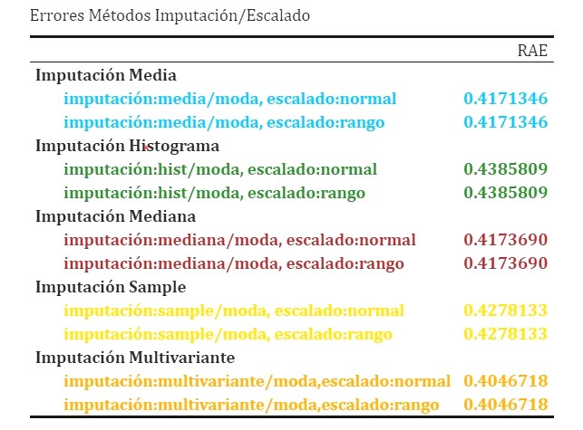


```r
# Para ver que método de imputación/escalado da el menor error
cat("El mejor método de imputación/escalado es:",which.min(errores_pre_t),"que coincide con el modelo:",names(which.min(errores_pre_t)),"\n")
```
El mejor método de imputación/escalado es con multivariante/moda y escalado normal.
Aunque el segundo menor error es el obtenido con la imputación por media y escalado normal(aunque el imputador muestra aleatoria[sample] también da un error parecido). Algunos modelos funcionan mejor con escalado multivariante y otros con otros métodos como por ejemplo  sample/mediana por tanto se aplicara el imputador que menor error consiga para cada determinado modelo(que ha sido comprobado y comparado con anterioridad a hacer los modelos finales que están representados con el código).


\newpage


## Evaluación de métodos SIN ajuste de hiperparámetros

Para empezar, construiremos varios modelos de regresión pero sin ajustar sus hiper-parámetros y evaluaremos su rendimiento. Posteriormente construiremos modelos ajustamos sus hiper-parámetros y los compararemos con sus respectivos modelos para evaluar si su rendimiento mejora o no en base a los hiper-parámetros elegidos.


· En principio vamos a crear 6 modelos de regresión: un modelo de regresión lineal múltiple, un modelo de árboles(con rpart), un modelo de regresión con el método knn, un modelo de regresión con svm con el kernel lineal y otro con el kernel radial y por último un modelo de regresión con el método cubist.

· Primero incluimos los datos al modelo. Después convertimos los carácteres a facotres .Cada learner/método de aprendizaje anterior mencionado trabaja con un tipo de datos(algunos permiten categóricos, otros no) y por tanto se haran los ajustes necesarios en los datos para poder llevar a cabo el modelo. Si el modelo no trabaja con factores se convertiran a enteros, si no trabaja con factores nominales se convertiran a dummies. Para cada modelo ha sido probado varios métodos de preprocesos y se ha seleccionado finálmente el que mejores resultados ha dado.

· Después se llevará a cabo el preproceso, donde se le imputarán los valores faltantes, se escalaran los datos y se eliminaran las constantes. 

· Para entrenar los modelos, usaremos 9 años de los 12 totales. De estos 9 años los 6 primeros(van en orden cronológico) se usaran para entrenar el modelo y se evaluará al modelo con los 3 años siguientes y así con todos los modelos. Finalmente se escogera el modelo que tenga un menor error(calculado con el método RAE).

· En esta primera parte se entrenarán los modelos sin ajuste de hiper-parámetros y después se volveran a crear los modelos, ajustando los hiper-parámetros más importantes para poder comparar y ver si hay diferencias. 

· Para el ajuste de hiper-parámetros se usarán 2 métodos: grid-search y random-search.

·A continuación se crearán 2 modelos de ensembles con y sin ajuste de hiper-parámetros(random forest: ranger y gradient boosting: xgboost).

· Por último se creará un modelo final que se usará para realizar predicciones. Se seleccionará el mejor método para crear este modelo final y se usarán todos los datos, es decir, se usarán los primeros 9 años para entrenar y luego los 3 últimos para el test. Previamente se hara una estimación del modelo. 


\newpage

### Modelo Regresión Lineal

Primero creamos un modelo de regresión lineal múltiple, donde la variable dependiente es "salida" y el resto de variables son las predictoras. Usaremos el learner lm.

```r
# Definimos el learner
lm_lrn<-lrn("regr.lm")
lm_lrn$feature_types
```


    [1] "logical"   "integer"   "numeric"   "character" "factor"   


Este learner trabaja con valores lógicos,enteros,numéricos,factores y carácteres.


```r
# Parámetros del modelo
as.data.table(lm_lrn$param_set)
```

```r
# Leemos los datos

datos<-readRDS("C:/Users/Usuario/Documents/fabio/Fabio/
Estadistica4all.github.io/Notebooks/Aprendizaje Automatico Práctica 2/PDF/disp_2.rds")

# Primero pasamos los carácteres a factores

j<-1

for(j in 1:ncol(datos)){
  if(is.character(datos[,j])){
    datos[,j]<-as.factor(datos[,j])
  }
  else{}
  j<-j+1
}

# El método LM no trabaja con variables ordinales asi que los convertimos a enteros

k<-1

for(k in 1:ncol(datos)){
  if(is.ordered(datos[,k])){
    datos[,k]<-as.integer(datos[,k])
  }
  else{}
  k<-k+1
}


# Definimos la tarea
my_task<-as_task_regr(datos,target="salida")

# Preproceso
# Los modelos de Regresión Lineal no admite los "missings values" así que hay que llevar a cabo un método de imputación primero. Asi mismo también escalaremos.

 preproceso_lm<- po("removeconstants") %>>%
 po("imputelearner",lrn("regr.rpart"))%>>%
 po("imputemode") %>>%
 po("scale") 
 
# Unimos con el learner

 graph_lm<-preproceso_lm %>>% lm_lrn
 graph_learner_lm<-as_learner(graph_lm)
```

```r
# Estrategia de validación, en este caso es personalizada(con los primeros 6 años entrenamos y los 3 siguientes se hace la validación)
 set.seed(100428853)
 
 trainvalid<-datos[1:(9*365),]
 test<-datos[(9*365+1):(12*365),]
 
 res_desc_lm<-rsmp("custom")
 res_desc_lm$instantiate(my_task,train=list(1:(6*365)),
 test=(list((6*365+1):nrow(trainvalid))))
  
# Entrenamos el modelo y validamos 

 lm_resample<-resample(my_task,graph_learner_lm,res_desc_lm,store_models = TRUE)

# Definimos el criterio de calcular el error
 measure<-msr("regr.rae")
 
# Calculamos el error 
 error_lm<-lm_resample$aggregate(measure)
```

```r
cat("El error del modelo de regresión lineal es:", error_lm,"\n")
```

El error del modelo de regresión lineal es: 0.3405573 

\newpage

### Modelo Rpart

El segundo modelo, es de árboles y lo construiremos con el learner rpart.

```r
# Definimos el learner
rpart_lrn<-lrn("regr.rpart")
rpart_lrn$feature_types
```

    [1] "logical" "integer" "numeric" "factor"  "ordered"
    
Este learner trabaja con valores lógicos, enteros, numéricos, factores y categóricos ordinales.

```r
# Parámetros del modelo
as.data.table(rpart_lrn$param_set)
```

```r
datos<-readRDS("C:/Users/Usuario/Documents/fabio/Fabio/
Estadistica4all.github.io/Notebooks/Aprendizaje Automatico Práctica 2/PDF/disp_2.rds")

# Como rpart no trabaja con characteres, los convertimos a factores. 
# Convertimos los "characters" a factores

j<-1

for(j in 1:ncol(datos)){
  if(is.character(datos[,j])){
    datos[,j]<-as.factor(datos[,j])
  }
  else{}
  j<-j+1
}

# Definimos la tarea
my_task<-as_task_regr(datos,target="salida")

# Preproceso
# Como hay valores faltantes vamos a hacer imputación para no desechar la información que pueden porporcionar otras columnas. También escalamos para centrar los datos

 preproceso_rpart<-po("removeconstants") %>>% 
 po("imputemedian")%>>%
 po("imputemode") %>>%
 po("scale") 
# Unimos con el learner

 graph_rpart<-preproceso_rpart %>>% rpart_lrn
 graph_learner_rpart<-as_learner(graph_rpart)
```

```r
# Estrategia de validación
 set.seed(100428853)
 
 trainvalid<-datos[1:(9*365),]
 test<-datos[(9*365+1):(12*365),]

 res_desc_rpart<-rsmp("custom")
 res_desc_rpart$instantiate(my_task,train=list(1:(6*365)),
 test=(list((6*365+1):nrow(trainvalid))))
  
# Entrenamos el modelo y validamos

 rpart_resample<-resample(task=my_task,learner=graph_learner_rpart,
 resampling=res_desc_rpart,store_models = TRUE)

# Calculamos el error

 error_rpart<-rpart_resample$aggregate(measure)
```

```r
cat("El error del modelo rpart es:", error_rpart,"\n")
```

El error del modelo rpart es: 0.4289548 


\newpage


### Modelo Vecino Más Cercano

El tercer modelo será con KNN.

```r
# Definimos el learner
knn_lrn<-lrn("regr.kknn")
knn_lrn$feature_types
```

    [1] "logical" "integer" "numeric" "factor"  "ordered"
    
Este learner trabaja con valores lógicos, enteros, numéricos, factores y categóricos ordinales.

```r
# Parámetros del modelo
as.data.table(knn_lrn$param_set)
```

```r
datos<-readRDS("C:/Users/Usuario/Documents/fabio/Fabio/
Estadistica4all.github.io/Notebooks/Aprendizaje Automatico Práctica 2/PDF/disp_2.rds")

# Como KNN no trabaja con characteres, los convertimos a factores 
# Convertimos los "characters" a factores

j<-1

for(j in 1:ncol(datos)){
  if(is.character(datos[,j])){
    datos[,j]<-as.factor(datos[,j])
  }
  else{}
  j<-j+1
}

# Definimos la tarea
 my_task<-as_task_regr(datos,target="salida")

# Preproceso
# Imputamos y escalamos

 preproceso_knn<- po("removeconstants") %>>%
 po("imputelearner",lrn("regr.rpart"))%>>%
 po("imputemode") %>>% 
 po("scale")
 
# Unimos con el learner

 graph_knn<-preproceso_knn %>>% knn_lrn
 graph_learner_knn<-as_learner(graph_knn)
```

```r
# Estrategia de validación
 set.seed(100428853)
 
 trainvalid<-datos[1:(9*365),]
 test<-datos[(9*365+1):(12*365),]
 
 res_desc_knn<-rsmp("custom")
 res_desc_knn$instantiate(my_task,train=list(1:(6*365)),
 test=(list((6*365+1):nrow(trainvalid))))
  
# Entrenamos el modelo y validamos 

 knn_resample<-resample(task=my_task,learner=graph_learner_knn,
 resampling=res_desc_knn,store_models = TRUE)
 
# Calculamos el error

 error_knn<-knn_resample$aggregate(measure)
```

```r
cat("El error del modelo de Vecino Mas Cercano es:",error_knn,"\n")
```

El error del modelo de Vecino Mas Cercano es: 0.4046718

\newpage


### Modelo SVM Lineal

El cuarto modelo sera un Suport Vector Machine Lineal.

```r
# Definimos el learner

svm_l_lrn<-lrn("regr.svm",kernel="linear")
svm_l_lrn$feature_types
```

    [1] "logical" "integer" "numeric"
    
Como observamos este learner solo trabaja con datos de tipo lógico, entéros y numéricos.

```r
# Parámetros del modelo
 as.data.table(svm_l_lrn$param_set)
```

```r

datos<-readRDS("C:/Users/Usuario/Documents/fabio/Fabio/
Estadistica4all.github.io/Notebooks/Aprendizaje Automatico Práctica 2/PDF/disp_2.rds")

# Como SVM solo trabaja con numéricos y enteros, vamos a convertir los datos que no lo son.

# Convertimos los "characters" a factores

j<-1

for(j in 1:ncol(datos)){
  if(is.character(datos[,j])){
    datos[,j]<-as.factor(datos[,j])
  }
  else{}
  j<-j+1
}

# Convertimos las variables categóricas ordinales a enteros

k<-1

for(k in 1:ncol(datos)){
  if(is.ordered(datos[,k])){
    datos[,k]<-as.integer(datos[,k])
  }
  else{}
  k<-k+1
}

# Por último todavía hay variables categóricas/factores dentro de los datos pero como son nominales(sin orden) hay que convertirlas a dummies.

# Primero identificamos que variables de los datos son factores no ordinales.

factores<-(sapply(datos, function(datos) sum(length(which(is.factor(datos))))))
which(factores==TRUE)

# Ahora creamos variables dummies para los factores nominales.

datos <- createDummyFeatures(datos, target = "salida")

# Definimos la tarea
 my_task<-as_task_regr(datos,target="salida")

# Preproceso
# Imputamos y escalamos

 preproceso_svm<- po("removeconstants") %>>% 
 po("imputelearner",lrn("regr.rpart"))%>>%
 po("scale") 

# Unimos con el learner
 graph_svm<-preproceso_svm%>>% svm_l_lrn
 graph_lrn_svm<-as_learner(graph_svm)
```

```r
# Estrategia de validación
 set.seed(100428853)
 
 trainvalid<-datos[1:(9*365),]
 test<-datos[(9*365+1):(12*365),]
 
 res_desc_s<-rsmp("custom")
 res_desc_s$instantiate(my_task,train=list(1:(6*365)),
 test=(list((6*365+1):nrow(trainvalid))))
  

# Entrenamos el modelo y lo validamos
  
  svm_l_resample<-resample(task=my_task,learner=graph_lrn_svm,
  resampling=res_desc_s,store_models = TRUE)

# Calculamos el error

 error_svm_l<-svm_l_resample$aggregate(measure)
```

```r
cat("El error del modelo SVM con kernel lineal es de :", error_svm_l,"\n")
```

El error del modelo SVM con kernel lineal es de : 0.3356875 


\newpage


### Modelo SVM Radial

El quinto modelo, es un Suport Vector Machine con kernel gaussiano.

```r
# Definimos el learner
svm_r_lrn<-lrn("regr.svm",kernel="radial")
svm_r_lrn$feature_types
```

    [1] "logical" "integer" "numeric"
    
Igual que antes solo trabaja con datos de tipo lógico, enteros o numéricos

```r
# Parámetros del modelo
as.data.table(svm_r_lrn$param_set)
```

```r
datos<-readRDS("C:/Users/Usuario/Documents/fabio/Fabio/
Estadistica4all.github.io/Notebooks/Aprendizaje Automatico Práctica 2/PDF/disp_2.rds")

 # Como SVM solo trabaja con numéricos y enteros convertimos los datos
 
# Primero, convertimos los "characters" a factores

j<-1

for(j in 1:ncol(datos)){
  if(is.character(datos[,j])){
    datos[,j]<-as.factor(datos[,j])
  }
  else{}
  j<-j+1
}

# A continuación, convertimos las variables categóricas ordinales a enteros

k<-1

for(k in 1:ncol(datos)){
  if(is.ordered(datos[,k])){
    datos[,k]<-as.integer(datos[,k])
  }
  
  else{}
  k<-k+1

  }


# Ahora creamos variables dummies para los factores nominales.

datos <- createDummyFeatures(datos, target = "salida")
# Definimos la tarea

 my_task<-as_task_regr(datos,target="salida")

# Preproceso
# Imputamos y escalamos

 preproceso_r<- po("removeconstants") %>>% 
 po("imputelearner",lrn("regr.rpart"))%>>%
 po("scale")

 # Unimos con el learner

 graph_r<-preproceso_r %>>% svm_r_lrn
 graph_learner_r<-as_learner(graph_r)
```

```r
# Estrategia de validación
 set.seed(100428853)
 
 trainvalid<-datos[1:(9*365),]
 test<-datos[(9*365+1):(12*365),]
 
 res_desc_r<-rsmp("custom")
 res_desc_r$instantiate(my_task,train=list(1:(6*365)),
 test=(list((6*365+1):nrow(trainvalid))))
  
# Entrenamos el modelo

 svm_r_resample<-resample(task=my_task,learner=graph_learner_r,
 resampling=res_desc_r,store_models = TRUE)

# Calculamos el error

 error_svm_r<-svm_r_resample$aggregate(measure)
```

```r
cat("El error del modelo SVM con kernel gaussiano es:", error_svm_r,"\n")
```

El error del modelo SVM con kernel gaussiano es: 0.3323792 

\newpage


### Modelo cubist

El sexto y último modelo será con el método "cubist"(otro método para hacer árboles). Se hacen árboles donde las hojas contienen modelos de regresión lineales. Estos modelos se basan en predictores usados en las separaciones/"splits" anteriores.Se hace una predicción utilizando el modelo de regresión lineal en el nodo terminal del árbol, pero se "suaviza" teniendo en cuenta la predicción del modelo lineal en el nodo anterior del árbol (que también ocurre recursivamente en el árbol). El árbol se convierte en un conjunto de reglas que va desde arriba del árbol hasta abajo.

```r
# Definimos el learner
cub_lrn<-lrn("regr.cubist")
cub_lrn$feature_types

# Este learner trabaja con enteros, numéricos, carácteres, factores y categóricas ordinales
```

```r
# Parámetros del modelo
as.data.table(cub_lrn$param_set)
```

```r
datos<-readRDS("C:/Users/Usuario/Documents/fabio/Fabio/
Estadistica4all.github.io/Notebooks/Aprendizaje Automatico Práctica 2/PDF/disp_2.rds")

# Convertimos los "characters" a factores

j<-1

for(j in 1:ncol(datos)){
  if(is.character(datos[,j])){
    datos[,j]<-as.factor(datos[,j])
  }
  else{}
  j<-j+1
}

# Definimos la tarea
 my_task<-as_task_regr(datos,target="salida")

# Preproceso
# Imputamos y escalamos

 preproceso_c<-  po("removeconstants") %>>% 
 po("imputesample")%>>%
 po("imputemode") %>>%
 po("scale")

 # Unimos con el learner

 graph_c<-preproceso_c %>>% cub_lrn
 graph_learner_c<-as_learner(graph_c)
```
 
```r
# Estrategia de validación
 
 set.seed(100428853)
 
 trainvalid<-datos[1:(9*365),]
 test<-datos[(9*365+1):(12*365),]
 
 res_desc_c<-rsmp("custom")
 res_desc_c$instantiate(my_task,train=list(1:(6*365)),
 test=(list((6*365+1):nrow(trainvalid))))
  
# Entrenamos el modelo

 cub_resample<-resample(task=my_task,learner=graph_learner_c,
 resampling=res_desc_c,store_models = TRUE)
 
# Calculamos el error

 error_cub<-cub_resample$aggregate(measure)
```

```r
cat("El error del modelo cubist es:", error_cub,"\n")
```

El error del modelo cubist es: 0.3223797 


\newpage


### De los 6 ajustes anteriores, ¿Cuál es el que tiene un menor error?

```r
errores_sin<-c(error_lm,error_rpart,error_knn,error_svm_l,
error_svm_r,error_cub)
names(errores_sin)<-c("Modelo LM","Modelo Rpart","Modelo KNN","Modelo SVM Lineal","Modelo SVM Radial","Modelo Cubico")
```

```r
cat("El modelo con el menor error es el", which.min(errores_sin),"que corresponde con el modelo:",names(which.min(errores_sin)),"\n")
```
El modelo con el menor error es el 6 que corresponde con el modelo: Modelo Cubico 


```r
cat("El modelo con el mayor error es el", which.max(errores_sin),"que corresponde con:",names(which.max(errores_sin)),"\n")
```
El modelo con el mayor error es el 2 que corresponde con: Modelo Rpart 


```r
# Tabla
knitr::kable(errores_sin,caption = "Errores Modelos Sin Ajuste Hiper-Parámetros",col.names="RAE") %>%  kable_classic(full_width = F, html_font = "Cambria") %>%
row_spec(1, bold = T, color = "forestgreen",background = "white") %>% 
row_spec(2, bold = T, color = "turquoise",background = "white") %>%
row_spec(3, bold = T, color = "gold",background = "white") %>%
row_spec(4, bold = T, color = "orange",background = "white") %>%
row_spec(5, bold = T, color = "purple",background = "white") %>%
row_spec(6, bold = T, color = "darkred",background = "white") 
```

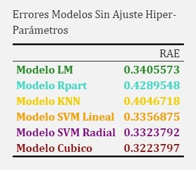


\newpage


### Conclusiones:

-Como vemos en la anterior tabla, observamos que el menor error sin ajuste de hyperparámetros lo obtenemos con modelo SVM con kernel gaussiano. Aunque el modelo de regresión lineal, svm lineal o con el método "cubist" también ofrece resultados parecidos y no mucho peores. El modelo con el que peor resultado se obtiene es con rpart de árboles que tiene 10% más de error seguido de KNN.
-A pesar de que el modelo SVM radial es el que nos da menor error, los modelos lineales tampoco lo hacen mal. No hay una clara distincción entre si los modelos lineales vs los no lineales ofrecen mejores resultados.


## Evaluación de métodos CON ajuste de hiperparámetros

·Ahora vamos a volver a crear los mismos modelos que antes(excepto cubist) y haremos un proceso de ajuste de hiper-parámetros para posteriormente compararlos con los respectivos modelos anteriores sin ajuste y comparar las diferencias de los rendimientos.


### Modelo KNN Con Ajuste Hiper-Parámetros

Para este modelo ajustaremos el número de vecinos ya que es su hiper-parámetro más importante.
Lo vamos a hacer con el método de "grid-search", que en un espacio definido, busca valores del hiper-parámetro e ira haciendo diversas combinaciones y se ajustará el que mejor resultado tenga.


```r
datos<-readRDS("C:/Users/Usuario/Documents/fabio/Fabio/
Estadistica4all.github.io/Notebooks/Aprendizaje Automatico Práctica 2/PDF/disp_2.rds")

# Definimos el learner

knn_lrn_h<-lrn("regr.kknn")

# Como KNN no permite carácteres, los convertimos a factores
# A continuación, convertimos los "characters" a factores

j<-1

for(j in 1:ncol(datos)){
  if(is.character(datos[,j])){
    datos[,j]<-as.factor(datos[,j])
  }
  else{}
  j<-j+1
}

# Definimos la tarea

my_task<-as_task_regr(datos,target = "salida")

# Preproceso

preproceso_kknn<- po("removeconstants") %>>%
  po("imputelearner",lrn("regr.rpart")) %>>%
  po("imputemode") %>>%
  po("scale") 

# Unimos con el learner

 graph_knn_h<-preproceso_kknn %>>% knn_lrn_h
 graph_kknn<-as_learner(graph_knn_h)
```

```r
set.seed(100428853)
# Dividimos los datos en train y test

trainvalid<-datos[1:(9*365),]
test<-datos[(9*365+1):(12*365),]

# Validación
desc_outer<- rsmp("custom")
desc_outer$instantiate(my_task,train=list(1:(6*365)),
test=(list((6*365+1):nrow(trainvalid))))

# Evaluación de los hiper-parámetros 

desc_inner <- rsmp("holdoutorder",ratio=6/9)

# Definición del espacio de búsqueda, del parámetro del número de vecinos
knn_space <- ps(
  regr.kknn.k = p_int(lower=1, upper=30)
)

generate_design_grid(knn_space, param_resolutions = c(regr.kknn.k =30))

# Definimos de k=1 a k=30 vecinos

# Definición la forma de "tunear" los hiperparámetros

terminator <- trm("none")
tuner <- tnr("grid_search", param_resolutions=c(regr.kknn.k=30))

# Ajustamos el nuevo learner

knn_hyper <- AutoTuner$new(
  learner = graph_kknn,
  resampling = desc_inner,
  measure = msr("regr.rae"),
  search_space = knn_space,
  terminator = terminator,
  tuner = tuner,
  store_tuning_instance = TRUE
)

# Evaluamos el nuevo learner con su ajuste 

knn_h_resample <- resample(my_task, knn_hyper, desc_outer,store_models = TRUE)

# Calculamos el error

error_knn_h <- knn_h_resample$aggregate(measure)
```

```r
cat("El error del modelo KNN con ajuste de hiperparámetros es:",error_knn_h,"\n")
```

El error del modelo KNN con ajuste de hiperparámetros es: 0.3857358 


```r
# Comparamos los errores del modelo KNN sin y con ajuste de hiperparámetros
errores_knn<-c(error_knn,error_knn_h)
names(errores_knn)<-c("Modelo KNN Sin Ajuste Hiperparámetros","Modelo KNN Con Ajuste Hiperparámetros")
```

```r
# Tabla
knitr::kable(errores_knn,caption = "Errores Modelos KNN",col.names="RAE") %>%  kable_classic(full_width = F, html_font = "Cambria") %>%
row_spec(1,bold=T,color="deepskyblue",background = "white") %>%
row_spec(2,bold=T,color="cyan",background = "white")
```

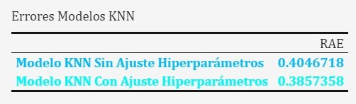


Como vemos en la tabla, el ajuste con hiperparámetros nos da un error menor.

\newpage


## Modelo Rpart Con Ajuste Hiper-Parámetros

Para este modelo ajustamos los parámetros de min_split(número mínimo de observaciones en un nodo para que se realice la separación) y max_depth(número máximo de la profundidad de nodos del árbol final).

En este caso usamos random_search para el método de busca y combinación de hiper-parámetros, que cogera muestras aleatorias del espacio de búsqueda y realizara distintas combinaciones.

```r
# Leemos los datos
datos<-readRDS("C:/Users/Usuario/Documents/fabio/Fabio/
Estadistica4all.github.io/Notebooks/Aprendizaje Automatico Práctica 2/PDF/disp_2.rds")

# Definimos el learner
rpart_lrn_h<-lrn("regr.rpart")

# Como Rpart no permite carácteres, los convertimos a factores
# A continuación, convertimos los "characters" a factores

j<-1

for(j in 1:ncol(datos)){
  if(is.character(datos[,j])){
    datos[,j]<-as.factor(datos[,j])
  }
  else{}
  j<-j+1
}

# Definimos la tarea

my_task<-as_task_regr(datos,target = "salida")

# Preproceso y escalado

preproceso_rpart<-po("imputelearner",lrn("regr.rpart"))%>>%
  po("imputemode") %>>%
  po("scale") %>>% 
  po("removeconstants")

# Unimos con el learner

graph_rpart_h<-preproceso_rpart %>>% rpart_lrn_h
graph_r_h<-as_learner(graph_rpart_h)
```

```r
# Fijamos la semilla del RNG
set.seed(100428853)

# Dividimos en train y test

trainvalid<-datos[1:(9*365),]
test<-datos[(9*365+1):(12*365),]

# Validación externa

desc_outer <- rsmp("custom")
desc_outer$instantiate(my_task,train=list(1:(6*365)),
test=(list((6*365+1):nrow(trainvalid))))

# Evaluación de los hiper-parámetros(interna) 

desc_inner <- rsmp("holdoutorder",ratio=6/9)

# Definimos el espacio de búsqueda

rpart_space <- ps(
  regr.rpart.minsplit  = p_int(lower = 10, upper = 20),
  regr.rpart.maxdepth = p_int(lower = 2, upper = 20)
)

# Método de búsqueda es "random_search" en este caso con 10 evaluaciones

terminator <- trm("evals", n_evals = 10 )
tuner <- tnr("random_search")

# Ajustamos el nuevo learner

rpart_hyper <- AutoTuner$new(
  learner = graph_r_h,
  resampling = desc_inner,
  measure = msr("regr.rae"),
  search_space = rpart_space,
  terminator = terminator,
  tuner = tuner
)

# Evaluamos el nuevo learner

rpart_h_resample <- resample(my_task, rpart_hyper, desc_outer,store_models = TRUE)

# Calculamos el error
error_rpart_h <- rpart_h_resample$aggregate(measure)
```

```r
cat("El error del modelo Rpart con ajuste de hiperparámetros es:",error_rpart_h,"\n")
```
El error del modelo Rpart con ajuste de hiperparámetros es: 0.4261093 


A continuación,  se compara los errores Rpart con y sin ajuste de Hiper parámetros.
```r
# Comparamos los errores de Rpart con y sin ajuste

errores_rpart<-c(error_rpart,error_rpart_h)
names(errores_rpart)<-c("Modelo Rpart Sin Ajuste Hiperparámetros","Modelo Rpart Con Ajuste Hiperparámetros")
```

```r
# Tabla
knitr::kable(errores_rpart,caption = "Errores Modelos Rpart",col.names="RAE") %>%  kable_classic(full_width = F, html_font = "Cambria") %>%
row_spec(1,bold=T,color="forestgreen",background = "white") %>%
row_spec(2,bold=T,color="darkgreen",background = "white")
```

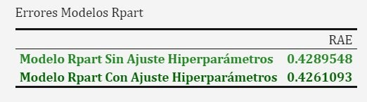

Como observamos en la tabla, apenas hay diferencia entre ambos,aunque el modelo con ajuste da un error menor.


\newpage


## Modelo SVM Lineal Con Ajuste Hiper-Parámetros

Para el modelo SVM lineal solo ajustaremos el coste, ya que es uno de los parámetros más importantes del modelo que controla la penalización del modelo cuando falla.

```r
datos<-readRDS("C:/Users/Usuario/Documents/fabio/Fabio/
Estadistica4all.github.io/Notebooks/Aprendizaje Automatico Práctica 2/PDF/disp_2.rds")

# Definimos el learner
svm_l_lrn<-lrn("regr.svm",kernel="linear",type="eps-regression")

 # Como SVM solo trabaja con numéricos y enteros convertimos los datos
 
# Convertimos los "characters" a factores

j<-1

for(j in 1:ncol(datos)){
  if(is.character(datos[,j])){
    datos[,j]<-as.factor(datos[,j])
  }
  else{}
  j<-j+1
}

# Convertimos las variables categóricas ordinales a enteros

k<-1

for(k in 1:ncol(datos)){
  if(is.ordered(datos[,k])){
    datos[,k]<-as.integer(datos[,k])
  }
  else{}
  k<-k+1
}

# Ahora creamos variables dummies para los factores no ordinales.

datos <- createDummyFeatures(datos, target = "salida")

# Definimos la tarea

my_task<-as_task_regr(datos,target="salida")

# Preproceso, imputamos y escalamos

 preproceso_svm_h<-po("imputelearner",lrn("regr.rpart"))%>>%
 po("scale") %>>%
 po("removeconstants")
# Unimos con el learner

 graph_svm_h<-preproceso_svm_h %>>% svm_l_lrn
 graph_h<-as_learner(graph_svm_h)
```

```r
# Evaluación del modelo
set.seed(100428853)

trainvalid<-datos[1:(9*365),]
test<-datos[(9*365+1):(12*365),]

desc_outer <- rsmp("custom")
desc_outer$instantiate(my_task,train=list(1:(6*365)),
test=(list((6*365+1):nrow(trainvalid))))

# Evaluación de los hiper-parámetros 

desc_inner <- rsmp("holdoutorder",ratio=6/9)

# Definimos el espacio de búsqueda
svm_space <- ps(
  regr.svm.cost = p_dbl(-10, 10, trafo=function(x) 2^x)
)

set.seed(100365449)
generate_design_random(svm_space, 100)

# 10 evaluaciones con random search
terminator <- trm("evals", n_evals = 10)
tuner <- tnr("random_search")

# Nuevo learner que se autoajusta sus hiper-par
svm_hyper <- AutoTuner$new(
  learner = graph_h,
  resampling = desc_inner,
  measure = msr("regr.rae"),
  search_space = svm_space,
  terminator = terminator,
  tuner=tuner,
  store_tuning_instance = TRUE)

# Evaluamos el learner con su autoajuste de hiperparámetros

svm_l_h_resample <- resample(my_task, svm_hyper, desc_outer,store_models = TRUE)

# Error del learner con autoajuste

error_svm_l_hyper<-svm_l_h_resample$aggregate(msr("regr.rae"))
```

```r
cat("El error del modelo SVM Lineal con ajuste de hiperparámetros es:",error_svm_l_hyper,"\n")
```

El error del modelo SVM Lineal con ajuste de hiperparámetros es: 0.3326315 


```r
errores_svm_l<-c(error_svm_l,error_svm_l_hyper)
names(errores_svm_l)<-c("Modelo SVM Lineal Sin Ajuste Hiperparámetros","Modelo SVM Lineal Con Ajuste Hiperparámetros")
```

```r
knitr::kable(errores_svm_l,caption = "Errores Modelos SVM Lineales",col.names="RAE") %>%  kable_classic(full_width = F, html_font = "Cambria") %>%
row_spec(1,bold=T,color="gold",background = "white") %>%
row_spec(2,bold=T,color="chocolate",background = "white")
```

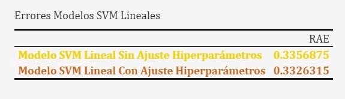

En esta tabla observamos que, aunque el modelo sin ajuste da mayor error, la diferencia entre los 2 modelos es mínima, 


\newpage


## Modelo SVM Radial Con Ajuste Hiper-Parámetros

En el modelo SVM radial ajustamos el parámetro de coste y gamma.
```r
datos<-readRDS("C:/Users/Usuario/Documents/fabio/Fabio/
Estadistica4all.github.io/Notebooks/Aprendizaje Automatico Práctica 2/PDF/disp_2.rds")

# Definimos el learner
svm_r_h<-lrn("regr.svm",kernel="radial",type = "eps-regression")


 # Como SVM solo trabaja con numéricos y enteros convertimos los datos

# Convertimos los "characters" a factores

j<-1

for(j in 1:ncol(datos)){
  if(is.character(datos[,j])){
    datos[,j]<-as.factor(datos[,j])
  }
  else{}
  j<-j+1
}

# Convertimos las variables categóricas ordinales a enteros

k<-1

for(k in 1:ncol(datos)){
  if(is.ordered(datos[,k])){
    datos[,k]<-as.integer(datos[,k])
  }
  else{}
  k<-k+1
}

# Ahora creamos variables dummies para los variables categóricas nominales.

datos <- createDummyFeatures(datos, target = "salida")

# Convertimos las variables categóricas a dummys

datos<-createDummyFeatures(datos,target="salida")

# Definimos la tarea

my_task<-as_task_regr(datos,target="salida")

# Preproceso
 preproceso_svm_r<-po("imputemedian")%>>%
 po("scale") %>>% 
 po("removeconstants")
# Unimos con el learner

 graph_svm_r<-preproceso_svm_r %>>% svm_r_h
 graph_r<-as_learner(graph_svm_r)
```

```r
# Evaluación del modelo
set.seed(100428853)

trainvalid<-datos[1:(9*365),]
test<-datos[(9*365+1):(12*365),]

desc_outer <- rsmp("custom")
desc_outer$instantiate(my_task,train=list(1:(6*365)),
test=(list((6*365+1):nrow(trainvalid))))

# Evaluación de los hiper-parámetros 

desc_inner <- rsmp("holdoutorder",ratio=6/9)

# Definimos el espacio de búsqueda
svm_space_r <- ps(
  regr.svm.gamma = p_dbl(lower=-10, upper=10, trafo=function(x) 2^x), 
  regr.svm.cost  = p_dbl(lower=-10, upper=10, trafo=function(x) 2^x)
)

generate_design_random(svm_space_r,100)

# 10 evaluaciones con random search
terminator <- trm("evals", n_evals = 10)
tuner <- tnr("random_search")

# Nuevo learner que se autoajusta sus hiper-pararámetros
svm_hyper_r <- AutoTuner$new(
  learner = graph_r,
  resampling = desc_inner,
  measure = msr("regr.rae"),
  search_space = svm_space_r,
  terminator = terminator,
  tuner=tuner,
  store_tuning_instance = TRUE)

# Evaluamos el learner con su autoajuste de hiperparámetros

svm_r_h_resample<- resample(my_task, svm_hyper_r, desc_outer,store_models = TRUE)

# Error del learner con autoajuste

error_svm_r_hyper<-svm_r_h_resample$aggregate(measure)
```

```r
cat("El error del modelo SVM Radial con ajuste de hiperparámetros es:",error_svm_r_hyper,"\n")
```

El error del modelo SVM Radial con ajuste de hiperparámetros es: 0.3631865 


```r
errores_svm_r<-c(error_svm_r,error_svm_r_hyper)
names(errores_svm_r)<-c("Modelo SVM Radial Sin Ajuste Hiperparámetros","Modelo SVM Radial Con Ajuste Hiperparámetros")
```

```r
knitr::kable(errores_svm_r,caption = "Errores Modelos SVM Radiales",col.names="RAE") %>%  kable_classic(full_width = F, html_font = "Cambria") %>%
row_spec(1,bold=T,color="darkblue",background = "white") %>%
row_spec(2,bold=T,color="purple",background = "white")  
```

El modelo que mejores resultados nos proporciona es SVM radial sin ajuste de hiperparámetros.


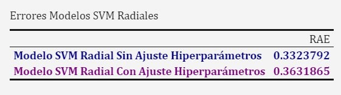


\newpage


# Métodos Ensembles

## Modelo Random Forest Sin Ajuste Hiper-Parámetros

Creamos un modelo con random forest con el método ranger.

```r
# Primero definimos el learner
ranger_lrn<-lrn("regr.ranger")
ranger_lrn$feature_types
```

    [1] "logical"   "integer"   "numeric"   "character" "factor"    "ordered"  

Trabaja con lógicos, enteros, numéricos, carácteres, factores y categóricos ordinales

```r
# Parámetros del modelo
as.data.table(ranger_lrn$param_set)
```

```r

datos<-readRDS("C:/Users/Usuario/Documents/fabio/Fabio/
Estadistica4all.github.io/Notebooks/Aprendizaje Automatico Práctica 2/PDF/disp_2.rds")

# A continuación, convertimos los "characters" a factores

j<-1

for(j in 1:ncol(datos)){
  if(is.character(datos[,j])){
    datos[,j]<-as.factor(datos[,j])
  }
  else{}
  j<-j+1
}


# Definimos la tarea
 my_task<-as_task_regr(datos,target="salida")  

# Preproceso
# Imputamos y escalamos

 preproceso_r<- po("removeconstants") %>>%
 po("imputelearner",lrn("regr.rpart"))%>>%
 po("imputemode") %>>%
 po("scale")
 
# Unimos con el learner

 graph_r<-preproceso_r %>>% ranger_lrn
 graph_ranger<-as_learner(graph_r)
```

```r
# Estrategia de validación
 set.seed(100428853)
 
 trainvalid<-datos[1:(9*365),]
 test<-datos[(9*365+1):(12*365),]
 
 res_desc_r<-rsmp("custom")
 res_desc_r$instantiate(my_task,train=list(1:(6*365)),
 test=(list((6*365+1):nrow(trainvalid))))
  
# Entrenamos el modelo y validamos el modelo

 ranger_resample<-resample(task=my_task,learner=graph_ranger,resampling = res_desc_r,store_models = TRUE)  

# Calculamos el error

 error_ranger<-ranger_resample$aggregate(measure)
```

```r
cat("El error del modelo ranger es:", error_ranger,"\n")
```

El error del modelo ranger es: 0.3263091 


\newpage


## Modelo Random Forest Con Ajuste Hiper-Parámetros

Ajustamos el "mtry" y el número de árboles.

```r

datos<-readRDS("C:/Users/Usuario/Documents/fabio/Fabio/
Estadistica4all.github.io/Notebooks/Aprendizaje Automatico Práctica 2/PDF/disp_2.rds")

# A continuación, convertimos los "characters" a factores

j<-1

for(j in 1:ncol(datos)){
  if(is.character(datos[,j])){
    datos[,j]<-as.factor(datos[,j])
  }
  else{}
  j<-j+1
}


# Definimos la tarea
 my_task<-as_task_regr(datos,target="salida")  

# A continuación definimos el learner
ranger_lrn_h<-lrn("regr.ranger")

# Preproceso
 preproceso_ranger_h<- po("removeconstants") %>>%
   po("imputelearner",lrn("regr.rpart"))%>>%
   po("imputemode") %>>%
   po("scale") 
# Unimos con el learner

 graph_r_h<-preproceso_ranger_h %>>% ranger_lrn_h
 graph_learner_h<-as_learner(graph_r_h)
```

```r
# Evaluación del modelo
set.seed(100428853)

trainvalid<-datos[1:(9*365),]
test<-datos[(9*365+1):(12*365),]
 
desc_outer_r <- rsmp("custom")
desc_outer_r$instantiate(my_task,train=list(1:(6*365)),
test=(list((6*365+1):nrow(trainvalid))))

# Evaluación de los hiper-parámetros 

desc_inner_r <- rsmp("holdoutorder",ratio=6/9)

# Definimos el espacio de búsqueda
ranger_space <- ps(
  regr.ranger.num.trees = p_int(lower=1, upper=500), 
  regr.ranger.mtry = p_int(lower = 1, upper =50))

generate_design_random(ranger_space, 100)

# Definición de terminación con 10 evaluaciones 
terminator <- trm("evals", n_evals = 10)
tuner <- tnr("random_search")

# Nuevo learner que se autoajusta sus hiper-par
ranger_hyper <- AutoTuner$new(
  learner = graph_learner_h,
  resampling = desc_inner_r,
  measure = msr("regr.rae"),
  search_space = ranger_space,
  terminator = terminator,
  tuner=tuner,
  store_tuning_instance = TRUE)

# Evaluamos el learner con su autoajuste de hiperparámetros

ranger_resample <- resample(my_task, ranger_hyper, desc_outer_r,store_models = TRUE)

# Error del learner con autoajuste

error_ranger_h<-ranger_resample$aggregate(msr("regr.rae"))
```

```r
cat("El error del modelo Ranger con ajuste de hiperparámetros es",error_ranger_h,"\n")
```

El error del modelo Ranger con ajuste de hiperparámetros es 0.3173147 


```r
# Comparamos los errores de Ranger con y sin ajuste

errores_ranger<-c(error_ranger,error_ranger_h)
names(errores_ranger)<-c("Modelo Ranger Sin Ajuste Hiperparámetros","Modelo Ranger Con Ajuste Hiperparámetros")
```

```r
# Tabla
knitr::kable(errores_ranger,caption = "Errores Modelos Ranger",col.names="RAE") %>%  kable_classic(full_width = F, html_font = "Cambria") %>%
row_spec(1,bold=T,color="deepskyblue",background = "white") %>%
row_spec(2,bold=T,color="dodgerblue",background = "white")    
```
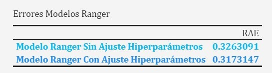


En la tabla se observa que el modelo con el ajuste da ligeramente mejores resultados, aunque apenas hay diferencia. De momento es el modelo que mejores resultados ha dado.


\newpage


## Modelo Gradient Boosting: Método XGBoost Sin Ajuste Hiper-Parámetros

```r
# Primero definimos el learner
xgb_lrn<-lrn("regr.xgboost")

xgb_lrn$feature_types
# Trabaja con lógicos, enteros y numéricos
```

```r
# Parámetros del modelo

as.data.table(xgb_lrn$param_set)
```

```r

datos<-readRDS("C:/Users/Usuario/Documents/fabio/Fabio/
Estadistica4all.github.io/Notebooks/Aprendizaje Automatico Práctica 2/PDF/disp_2.rds")

 # Como XGBOOST solo trabaja con numéricos y enteros convertimos los datos
 
# A continuación, convertimos los "characters" a factores

j<-1

for(j in 1:ncol(datos)){
  if(is.character(datos[,j])){
    datos[,j]<-as.factor(datos[,j])
  }
  else{}
  j<-j+1
}

# Convertimos las variables categóricas ordinales a enteros

k<-1

for(k in 1:ncol(datos)){
  if(is.ordered(datos[,k])){
    datos[,k]<-as.integer(datos[,k])
  }
  else{}
  k<-k+1
}

# Ahora creamos variables dummies para los factores nominales.

datos <- createDummyFeatures(datos, target = "salida")

# Convertimos las categóricas en dummys

datos<-createDummyFeatures(datos,target = "salida")

# Definimos la tarea

 my_task<-as_task_regr(datos,target="salida")


# Preproceso

 preproceso_xgb<- po("removeconstants") %>>% 
 po("imputemedian") %>>%
 po("scale") 
 
# Unimos con el learner

 graph_xgb<-preproceso_xgb %>>% xgb_lrn
 graph_learner_xgb<-as_learner(graph_xgb)
```

```r
# Estrategia de validación

 set.seed(100428853)
 
 trainvalid<-datos[1:(9*365),]
 test<-datos[(9*365+1):(12*365),]
 
 res_desc_x<-rsmp("custom")
 res_desc_x$instantiate(my_task,train=list(1:(6*365)),
 test=(list((6*365+1):nrow(trainvalid))))
  
# Entrenamos el modelo

 xgboost_resample<-resample(my_task,graph_learner_xgb,res_desc_x,store_models = TRUE)
 
# Calculamos el error

 error_xgb<-xgboost_resample$aggregate(measure)
```

```r
 cat("El error del modelo XGboosting sin ajuste es:", error_xgb,"\n")
```

El error del modelo XGboosting sin ajuste es: 1.630531 


Como vemos el error que obtenemos es mayor que 1 lo que indica que el modelo ajustado es peor que un modelo trivial/básico.


\newpage


## Modelo Gradient Boosting Con Ajuste Hiper-Parámetros

En este modelo ajustaremos "nround"(indica el número de iteraciones que se realizaran antes de detener el ajuste) y "eta"(tasa aprendizaje del modelo).

```r
datos<-readRDS("C:/Users/Usuario/Documents/fabio/
Fabio/Estadistica4all.github.io/Notebooks/Aprendizaje Automatico Práctica 2/PDF/disp_2.rds")

# Definimos el learner

xgb_lrn_h<-lrn("regr.xgboost")
```

```r
 # Como XGBOOST solo trabaja con numéricos y enteros convertimos los datos

# A continuación, convertimos los "characters" a factores

j<-1

for(j in 1:ncol(datos)){
  if(is.character(datos[,j])){
    datos[,j]<-as.factor(datos[,j])
  }
  else{}
  j<-j+1
}

# Convertimos las variables categóricas ordinales a enteros

k<-1

for(k in 1:ncol(datos)){
  if(is.ordered(datos[,k])){
    datos[,k]<-as.integer(datos[,k])
  }
  else{}
  k<-k+1
}

# Ahora creamos variables dummies para los factores nominales.

datos <- createDummyFeatures(datos, target = "salida")

# Definimos la tarea

 my_task<-as_task_regr(datos,target="salida")

# Preproceso
preproceso_xgb_h<-po("imputemedian")%>>%
  po("scale") %>>% 
  po("removeconstants")
# Unimos con el learner

graph_xgb<-preproceso_xgb_h %>>% xgb_lrn_h
graph_xgb_h<-as_learner(graph_xgb)
```

```r
# Evaluación del modelo

set.seed(100428853)

trainvalid<-datos[1:(9*365),]
test<-datos[(9*365+1):(12*365),]
 
desc_outer <- rsmp("custom")
desc_outer$instantiate(my_task,train=list(1:(6*365)),
test=(list((6*365+1):nrow(trainvalid))))

# Evaluación de los hiper-parámetros 

desc_inner <- rsmp("holdoutorder",ratio=6/9)

# Definición del espacio de búsqueda

xgb_space <- ps(
  regr.xgboost.eta = p_dbl(lower = 0.01, upper = 0.99),
  regr.xgboost.nrounds=p_int(lower = 100, upper = 500)
)

# Definición de terminación: 20 evaluaciones
terminator <- trm("evals", n_evals = 20)
tuner <- tnr("random_search")
measure<-msr("regr.rae")

# Nuevo learner que se autoajusta sus hiper-pararámetros
xgb_h <- AutoTuner$new(
  learner = graph_xgb_h,
  resampling = desc_inner,
  measure = measure,
  search_space = xgb_space,
  terminator = terminator,
  tuner = tuner
)

# Evaluamos el learner con autoajuste
set.seed(100365469)

xgb_h_resample <- resample(my_task, xgb_h, desc_outer,store_models = TRUE)

# Calculamos el error
error_xgb_h <- xgb_h_resample$aggregate(measure)
```

```r
cat("El error del modelo XGBOOST Con Ajuste Hiperparámetros es:", error_xgb_h,"\n")
```

El error del modelo XGBOOST Con Ajuste Hiperparámetros es: 0.3191722 


```r
# Comparamos los errores de XGBOOST con y sin ajuste

errores_xgb<-c(error_xgb,error_xgb_h)
names(errores_xgb)<-c("Modelo XGBOOST Sin Ajuste Hiperparámetros","Modelo XGBOOST Con Ajuste Hiperparámetros")
```

```r
# Tabla
knitr::kable(errores_xgb,caption = "Errores Modelos XGB",col.names="RAE") %>%  kable_classic(full_width = F, html_font = "Cambria") %>%
row_spec(1,bold=T,color="firebrick",background = "white") %>%
row_spec(2,bold=T,color="deepskyblue",background = "white")    
```


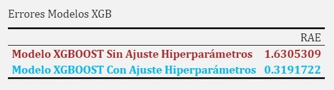

Como se observa en la tabla, el error baja 5 veces el error del modelo xgboost sin ajuste de hiper-parámetros.


\newpage


# Conclusiones de todos los modelos:

Comparamos todos los modelos y en base a ello escogeremos el modelo que presente los resultados más óptimos.

```r
# Vector de errores de TODOS los modelos
errores_totales<-c(error_lm,error_rpart,error_rpart_h,error_knn,
error_knn_h,error_svm_l,error_svm_l_hyper,error_svm_r,error_svm_r_hyper,
error_cub,error_ranger,error_ranger_h,error_xgb,error_xgb_h)

names(errores_totales)<-c("Modelo LM","Modelo Rpart Sin Ajuste Hiperparámetros","Modelo Rpart Con Ajuste Hiperparámetros","Modelo KNN Sin Ajuste Hiperparámetros","Modelo KNN Con Ajuste Hiperparámetros","Modelo SVM Lineal Sin Ajuste Hiperparámetros","Modelo SVM Lineal Con Ajuste Hiperparámetros","Modelo SVM Radial Sin Ajuste Hiperparámetros","Modelo SVM Radial Con Ajuste Hiperparámetros","Modelo Cubist","Modelo Random Forest(Ranger) Sin Ajuste Hiperparámetros","Modelo Random Forest(Ranger) Con Ajuste Hiperparámetros","Modelo XGBOOST Sin Ajuste Hiperparámetros","Modelo XGBOOST Con Ajuste Hiperparámetros")
```

```r
# Tabla comparación de todos los modelos.

knitr::kable(errores_totales,caption = "Errores Todos Modelos",col.names="RAE") %>%  kable_classic(full_width = F, html_font = "Cambria") %>% 
pack_rows(index = c("Modelo LM" = 1,"Modelo Rpart"=2,"Modelo KNN"=2,"Modelo SVM Lineal"=2,"Modelo SVM Radial"=2,"Modelo Cubist"=1,"Modelo Random Forest(Ranger)"=2,"Modelo XGBOOST"=2)) %>% 
row_spec(1, bold = T, color = "deepskyblue",background = "white") %>% 
row_spec(2:3, bold = T, color = "firebrick",background = "white") %>%
row_spec(4:5, bold = T, color = "forestgreen",background = "white") %>%
row_spec(6:7, bold = T, color = "gold",background = "white") %>%
row_spec(8:9, bold = T, color = "cyan",background = "white") %>%
row_spec(10, bold = T, color = "purple",background = "white") %>%
row_spec(11:12, bold = T, color = "red",background = "white") %>%
row_spec(13:14, bold = T, color = "orangered",background = "white")
```

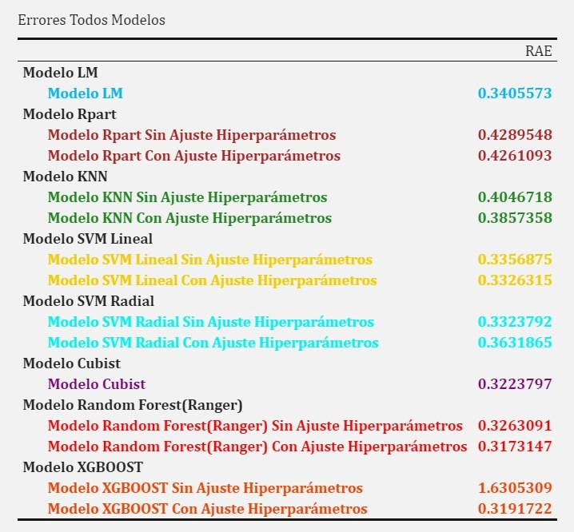


```r
# Error mínimo de los 14 modelos
cat("El modelo con el menor error es el", which.min(errores_totales),"que corresponde con:",names(which.min(errores_totales)),"cuyo RAE es:",errores_totales[which.min(errores_totales)],"\n")
```

El modelo con el menor error es el 12 que corresponde con: Modelo Random Forest(Ranger) Con Ajuste Hiperparámetros cuyo RAE es: 0.3173147 


```r
# Error máximo de los 14 modelos
cat("El modelo con el mayor error es el", which.max(errores_totales),"que corresponde con:",names(which.max(errores_totales)),"cuyo RAE es:",errores_totales[which.max(errores_totales)],"\n")
```

El modelo con el mayor error es el 13 que corresponde con: Modelo XGBOOST Sin Ajuste Hiperparámetros cuyo RAE es: 1.630531 


```r
# Tabla modelos ordenados de mejor a peor(en función del RAE)
ordenado<-as.data.frame(errores_totales) %>% arrange(errores_totales,desc=T)
```

```r
# Tabla de mejor a peor modelo en función de la métrica RAE

knitr::kable(ordenado,caption = "Errores Todos Modelos Ordenado de Mejor a Peor",col.names="RAE") %>%  kable_classic(full_width = F, html_font = "Cambria") %>% 
row_spec(1, bold = T, color = "chartreuse",background = "white") %>% 
row_spec(2, bold = T, color = "chartreuse",background = "white") %>%
row_spec(3, bold = T, color = "chartreuse",background = "white") %>%
row_spec(4, bold = T, color = "forestgreen",background = "white") %>%
row_spec(5, bold = T, color = "forestgreen",background = "white") %>%
row_spec(6, bold = T, color = "forestgreen",background = "white") %>%
row_spec(7, bold = T, color = "forestgreen",background = "white") %>%
row_spec(8, bold = T, color = "forestgreen",background = "white") %>% 
row_spec(9, bold = T, color = "forestgreen",background = "white") %>%
row_spec(10, bold = T, color = "forestgreen",background = "white") %>%
row_spec(11, bold = T, color = "firebrick",background = "white") %>%
row_spec(12, bold = T, color = "firebrick",background = "white") %>%
row_spec(13, bold = T, color = "red",background = "white") %>%
row_spec(14, bold = T, color = "red",background = "white")
```

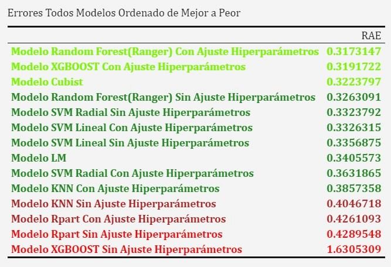

En esta tabla observamos los modelos ordenados en función del rendimiento que nos proporciona el método RAE. Los modelos con un RAE < 0.40 están marcados en verde(de menor a mayor intensidad, en función del error) y los modelos cuyo RAE es > 0.40 están marcados en rojo.

· Observamos que los mejores modelos son los 2 ensembles con ajuste de hiper-parámetros y el Cubist.

· Como era de esperar, ya que en la gráfica inicial vimos que la serie mostraba un patrón no lineal los modelos no lineales han dado mejores resultados.


\newpage


# Modelo Final

Escogemos el modelo Ranger(Random Forest) ya que es el modelo con el que menor error hemos conseguido para crear el modelo final.

##  Estimación del error del modelo final con los datos de test(los 3 últimos años)

```r
datos<-readRDS("C:/Users/Usuario/Documents/fabio/Fabio/
Estadistica4all.github.io/Notebooks/Aprendizaje Automatico Práctica 2/PDF/disp_2.rds")

# A continuación, convertimos los "characters" a factores

j<-1

for(j in 1:ncol(datos)){
  if(is.character(datos[,j])){
    datos[,j]<-as.factor(datos[,j])
  }
  else{}
  j<-j+1
}


# Definimos la tarea
 my_task<-as_task_regr(datos,target="salida")  

# A continuación definimos el learner
ranger_lrn_f<-lrn("regr.ranger")

# Preproceso
 preproceso_ranger_f<- po("removeconstants") %>>%
   po("imputelearner",lrn("regr.rpart"))%>>%
   po("imputemode") %>>%
   po("scale") 
# Unimos con el learner

 graph_r_f<-preproceso_ranger_f %>>% ranger_lrn_f
 graph_learner_f<-as_learner(graph_r_f)
```

```r
# Evaluación del modelo
set.seed(100428853)

# Seleccionamos los tres últimos años para el test y el resto para entrenar

desc_outer_r <- rsmp("custom")
desc_outer_r$instantiate(my_task,train=list(1:(9*365)),
test=(list((9*365+1):(12*365))))

# Evaluación de los hiper-parámetros 

desc_inner_r <- rsmp("holdoutorder",ratio=9/12)

# Definimos el espacio de búsqueda
ranger_space <- ps(
  regr.ranger.num.trees = p_int(lower=1, upper=500), 
  regr.ranger.mtry = p_int(lower = 1, upper =50))

generate_design_random(ranger_space, 100)

# Definición de terminación
terminator <- trm("evals", n_evals = 5)
tuner <- tnr("random_search")

# Nuevo learner que se autoajusta sus hiper-pararámetros
ranger_hyper_f <- AutoTuner$new(
  learner = graph_learner_f,
  resampling = desc_inner_r,
  measure = msr("regr.rae"),
  search_space = ranger_space,
  terminator = terminator,
  tuner=tuner,
  store_tuning_instance = TRUE)

# Evaluamos el learner con su autoajuste de hiperparámetros

ranger_resample <- resample(my_task, ranger_hyper_f, desc_outer_r,store_models = TRUE)

# Error estimado del modelo final

error_ranger_f<-ranger_resample$aggregate(msr("regr.rae"))
```

```r
cat("El error estimado para el modelo final es:",error_ranger_f,"\n")
```

El error estimado para el modelo final es: 0.3459345 


Por tanto el valor del RAE para el modelo final haciendo regresión con el learner random forest(ranger) es 0.345. Es bastante parecido al modelo ranger que hicimos con ajuste de hiper-parámetros aunque mayor.


\newpage


##  Modelo Final

Vamos a construir el modelo final con el método de random forest.
```r
# Leemos los datos con los que entrenamos
datos<-readRDS("C:/Users/Usuario/Documents/fabio/Fabio/
Estadistica4all.github.io/Notebooks/Aprendizaje Automatico Práctica 2/PDF/disp_2.rds")

# Leemos los datos para el test

test<-readRDS("C:/Users/Usuario/Documents/fabio/Fabio/
Estadistica4all.github.io/Notebooks/Aprendizaje Automatico Práctica 2/PDF/compet_2.rds")


# A continuación, convertimos los "characters" a factores

j<-1

for(j in 1:ncol(datos)){
  if(is.character(datos[,j])){
    datos[,j]<-as.factor(datos[,j])
  }
  else{}
  j<-j+1
}


k<-1

for(k in 1:ncol(test)){
  if(is.character(test[,k])){
    test[,k]<-as.factor(test[,k])
  }
  else{}
  k<-k+1
}


# Definimos la tarea
final_task<-as_task_regr(datos,target="salida")  

# A continuación definimos el learner
final_lrn<-lrn("regr.ranger")

# Preproceso 
final_pre<- po("removeconstants") %>>%
   po("imputelearner",lrn("regr.rpart"))%>>%
   po("imputemode") %>>%
   po("scale") 

# Unimos con el learner

 graph_final<-final_pre %>>% final_lrn
 graph_lrn_final<-as_learner(graph_final)
```

```r
# Fijamos la semilla
set.seed(100428853)

# Evaluación de los hiper-parámetros 

desc_inner_f <- rsmp("holdoutorder",ratio=9/12)

# Definimos el espacio de búsqueda
final_ranger_space <- ps(
  regr.ranger.num.trees = p_int(lower=1, upper=500), 
  regr.ranger.mtry = p_int(lower = 1, upper =50))

generate_design_random(final_ranger_space, 100)

# Definición de terminación
final_terminator <- trm("evals", n_evals = 5)
final_tuner <- tnr("random_search")

# Nuevo learner que se autoajusta sus hiper-pararámetros
ranger_final <- AutoTuner$new(
  learner = graph_lrn_final,
  resampling = desc_inner_f,
  measure = msr("regr.rae"),
  search_space = final_ranger_space,
  terminator=final_terminator,
  tuner=final_tuner,
  store_tuning_instance = TRUE)

# Entrenamos el modelo final

ranger_final$train(final_task)

# Guardamos el modelo
saveRDS(ranger_final,file="Modelo Final.rds")
```

 
## Cálculamos las predicciones 

```r
# Calculamos las predicciones

ranger_test<-ranger_final$predict_newdata(test)

# Guardamos las predicciones
write.table(ranger_test$response,sep = "\t" ,row.names=TRUE,file = "Predicciones Modelo Final.txt") 
```

\newpage


#  Ajuste de hiperparámetros con hyperband

Hyperband elimina las configuraciones de rendimiento  desde el principio durante su proceso de entrenamiento con el objetivo de aumentar la eficiencia del tuner. Para ello, se construyen varios soportes con un conjunto asociado de configuraciones para cada uno. Esta configuración se inicializa mediante muestreo estocástico, a menudo uniforme. Cada soporte se divide en varias etapas y las configuraciones se evalúan para un presupuesto creciente en cada etapa. Hay que tener en cuenta que actualmente todas las configuraciones se entrenan completamente desde el principio, por lo que no se realizan actualizaciones en línea de los modelos.

Se inicializan diferentes soportes con diferente número de configuraciones y diferentes tamaños. Para identificar el presupuesto para evaluar el hyperband, hay que especificar explícitamente qué hiperparámetro influye en el presupuesto etiquetando un solo hiperparámetro en el conjunto de parámetros.

La ventaja de hyper-band como método para ajustar hiperparámetros es que, a diferencia de "grid-search" y "random-search" no busca en un espacio aleatorio/discretizado los valores de los hiper-parámetros más óptimos y "a ciegas". Una de las formas es aplicando el "budget" para asignar un presupuesto a la búsqueda del hiper-parámetro para así optimizar el tiempo de búsqueda, eliminando las combinaciones de hiper-parámetros que tengan un rendimiento más bajo.

En cada paso, el presupuesto/"budget" aumenta en una cantidad "eta" y solo los mejores 1/"eta" puntos se usan en el siguiente paso. 

En este caso, asignaremos el "budget" al número de árboles del modelo.

```r
datos<-readRDS("C:/Users/Usuario/Documents/fabio/Fabio/
Estadistica4all.github.io/Notebooks/Aprendizaje Automatico Práctica 2/PDF/disp_2.rds")

# A continuación, convertimos los "characters" a factores

j<-1

for(j in 1:ncol(datos)){
  if(is.character(datos[,j])){
    datos[,j]<-as.factor(datos[,j])
  }
  else{}
  j<-j+1
}

# Definimos la tarea
 my_task<-as_task_regr(datos,target="salida")  

# A continuación definimos el learner
ranger_lrn_hb<-lrn("regr.ranger")

# Preproceso
 preproceso_ranger_hb<- po("removeconstants") %>>%
   po("imputelearner",lrn("regr.rpart"))%>>%
   po("imputemode") %>>%
   po("scale") 
# Unimos con el learner

 graph_r_hb<-preproceso_ranger_hb %>>% ranger_lrn_hb
 graph_learner_hb<-as_learner(graph_r_hb)
```

```r
# Evaluación del modelo
set.seed(100428853)

trainvalid<-datos[1:(9*365),]
test<-datos[(9*365+1):(12*365),]

desc_outer_r <- rsmp("custom")
desc_outer_r$instantiate(my_task,train=list(1:(6*365)),
test=(list((6*365+1):nrow(trainvalid))))

# Evaluación de los hiper-parámetros 

desc_inner_r <- rsmp("holdoutorder",ratio=6/9)

# Definimos el espacio de búsqueda
ranger_hb_space <- ps(
  regr.ranger.num.trees = p_int(lower=5, upper=500,tags = "budget"), 
  regr.ranger.mtry = p_int(lower = 1, upper =50))

generate_design_random(ranger_hb_space, 100)

# Definición de terminación en 5 evaluaciones
terminator <- trm("evals", n_evals = 5)
tuner <- tnr("hyperband")

# Nuevo learner que se autoajusta sus hiper-pararámetros
ranger_hyperband <- AutoTuner$new(
  learner = graph_learner_hb,
  resampling = desc_inner_r,
  measure = msr("regr.rae"),
  search_space = ranger_hb_space,
  terminator = terminator,
  tuner=tuner,
  store_tuning_instance = TRUE)

# Evaluamos el learner con su autoajuste de hiperparámetros

ranger_hb <- resample(my_task, ranger_hyperband, desc_outer_r)

# Error del learner con autoajuste

error_ranger_hb<-ranger_hb$aggregate(msr("regr.rae"))
```

```{r,echo=FALSE}
cat("El error del modelo Ranger con ajuste de hiper-parámetros hyper-band",error_ranger_hb,"\n")
```
El error del modelo Ranger con ajuste de hiper-parámetros hyper-band 0.3513443 


El error estimado con el método de hyper-band es 0.35. Es un poco peor que los modelos anteriores pero en términos de error no hay mucha diferencia.

```r
# Incluimos el error de ranger con hyperband 
errores_ranger<-c(errores_ranger,error_ranger_hb)
names(errores_ranger)<-c("Modelo Ranger Sin Ajuste Hiperparámetros","Modelo Ranger Con Ajuste Hiperparámetros","Modelo Ranger Con Ajuste Hyperband")
```

```r
# Tabla comparación
knitr::kable(errores_ranger,caption = "Errores Modelos Ranger",col.names="RAE") %>%  kable_classic(full_width = F, html_font = "Cambria") %>%
row_spec(1,bold=T,color="deepskyblue",background = "white") %>%
row_spec(2,bold=T,color="forestgreen",background = "white") %>%
row_spec(3,bold=T,color="firebrick",background = "white")  
```

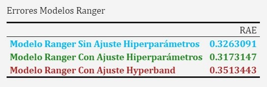

Y por último destacar que el mejor de todos es el modelo Ranger con ajuste de hiperparámetros.


