--- 
title: "Cloud Machine Learning with Azure"
author: "Fabio Scielzo Ortiz"
date: "`r Sys.Date()`"
site: bookdown::bookdown_site
documentclass: book
bibliography: [book.bib]
# url: your book url like https://bookdown.org/yihui/bookdown
# cover-image: path to the social sharing image like images/cover.jpg
description: |
 This article is an introduction to **Cloud Machine Learning** in **Azure** environment.
link-citations: yes
github-repo: rstudio/bookdown-demo
---

# Introduction  

{width="45%"}

 

 

- **More articles:    $\hspace{0.1cm}$ [Estadistica4all](https://estadistica4all.com/)**

- **Author:** $\hspace{0.1cm}$ [Fabio Scielzo Ortiz](https://estadistica4all.com/creador.html)

- **If you use this article, please cite it:**

$\hspace{1.2cm}$ Scielzo Ortiz, F. (2023). Introducción a Pandas. Estadistica4all. 

- ***It is recommended to open the article on a computer or tablet.***

 

  
 
 
This article is an introduction to **Cloud Machine Learning** in **Azure** environment.
 
 
 
 

# Machine Learning Project Lifecycle

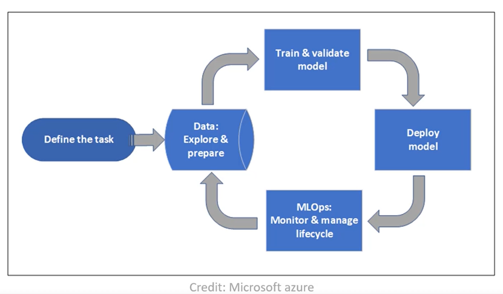{width="80%"}

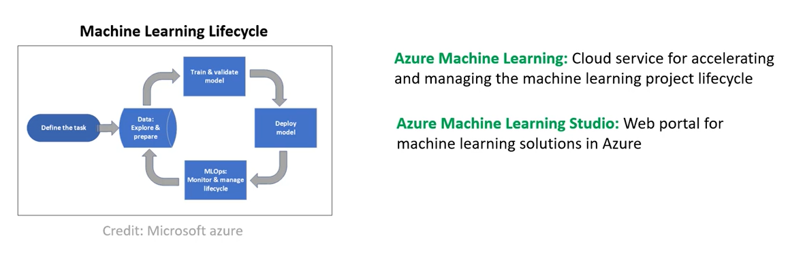{width="100%"}

 

# Creating the AzureML workspace

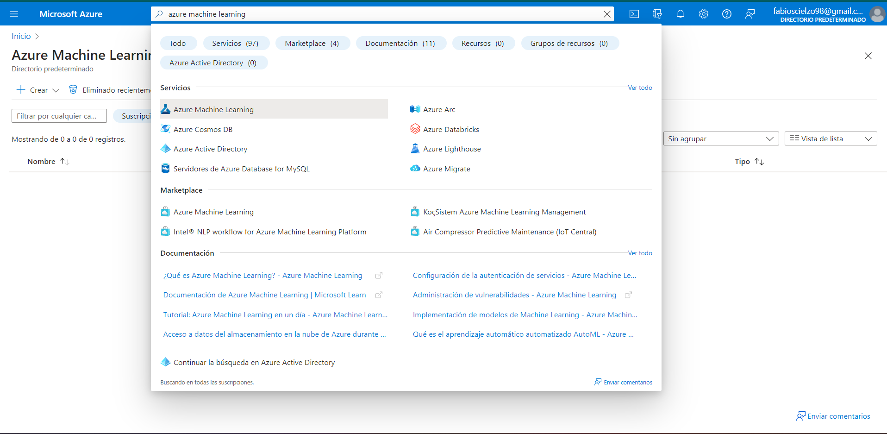{width="100%"}

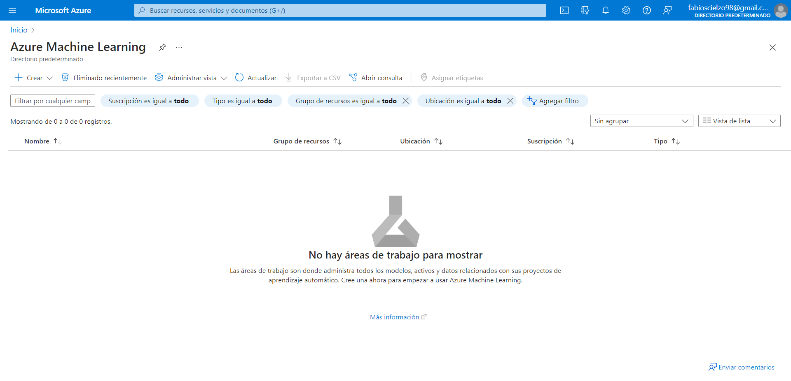{width="100%"}

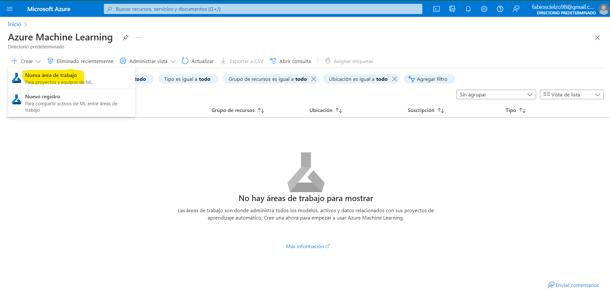{width="100%"}

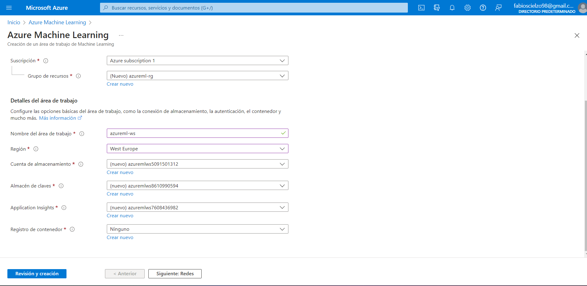{width="100%"}

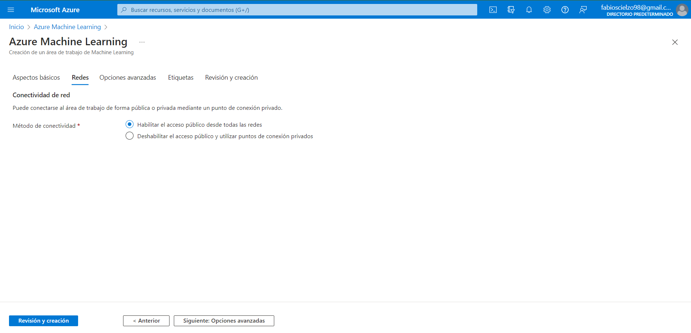{width="100%"}

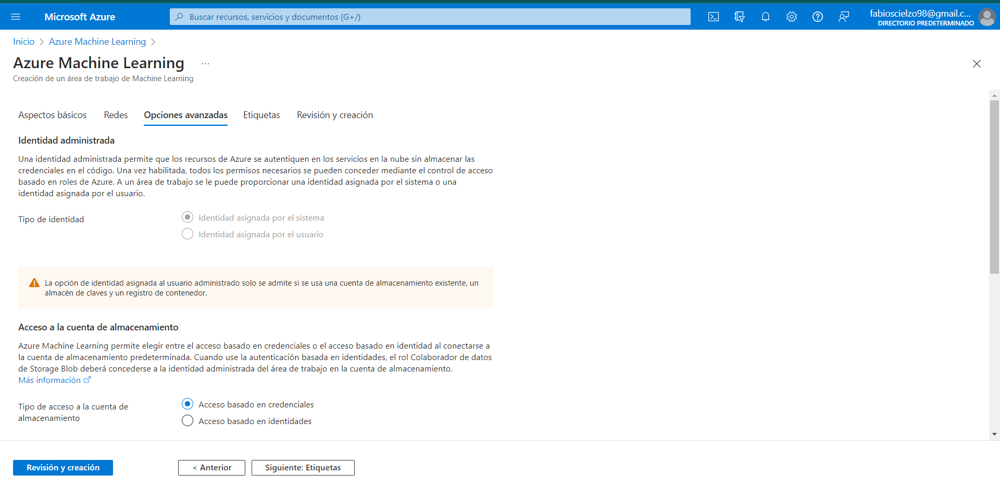{width="100%"}

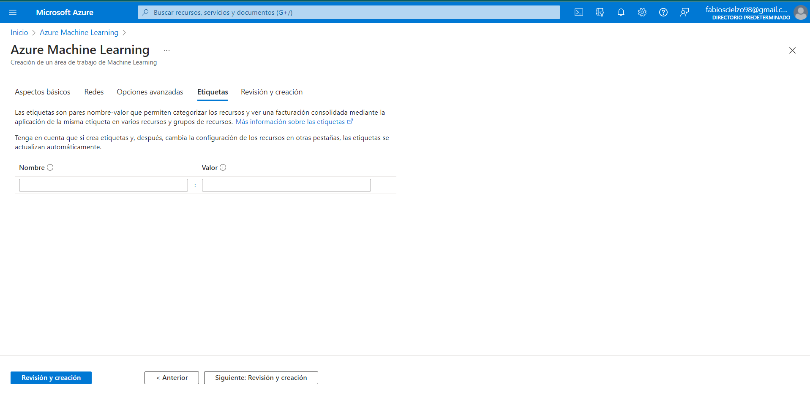{width="100%"}

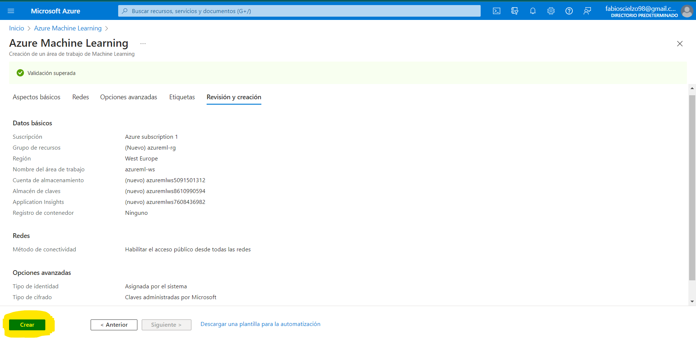{width="100%"}

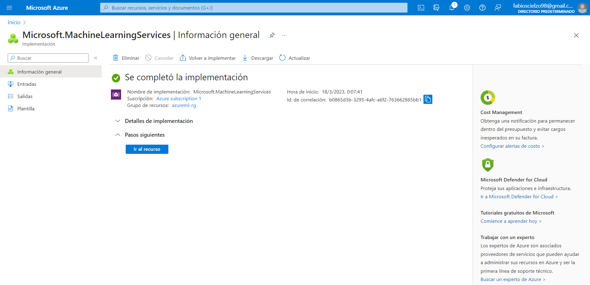{width="100%"}

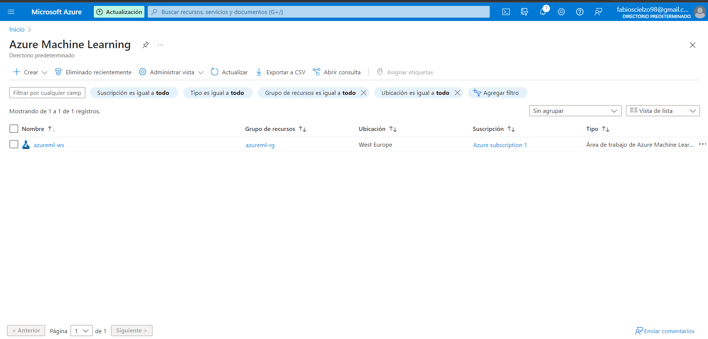{width="100%"}

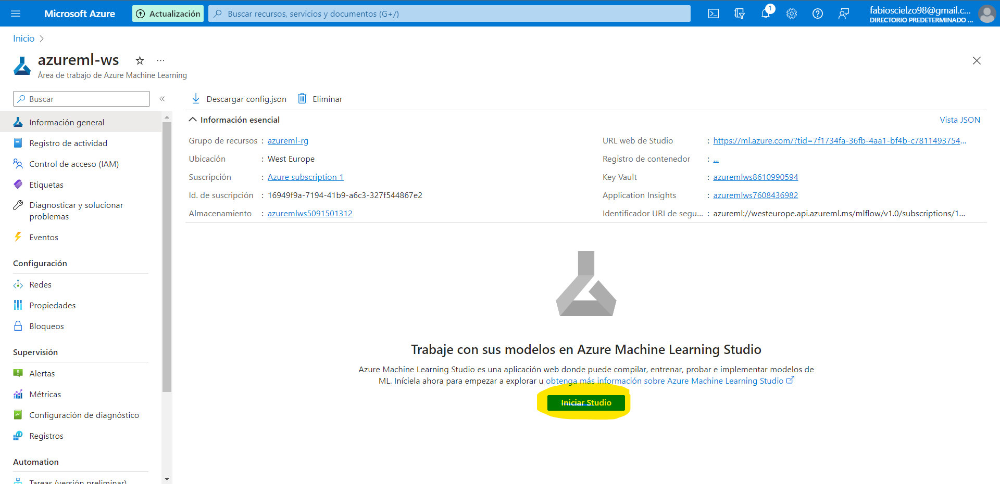{width="100%"}

