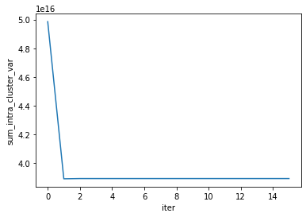

```python
import seaborn as sns
import pandas as pd
import numpy as np
from sklearn.utils import resample
import math as math
from itertools import chain
```


```python
Data = pd.read_csv('House_Price_Regression.csv')
```


```python
Data_quant = Data.loc[:, ['latitude', 'longitude', 'price', 'size_in_m_2', 'no_of_bedrooms', 'no_of_bathrooms']]

Data_quant.head()
```


<div>
<style scoped>
    .dataframe tbody tr th:only-of-type {
        vertical-align: middle;
    }

    .dataframe tbody tr th {
        vertical-align: top;
    }

    .dataframe thead th {
        text-align: right;
    }
</style>
<table border="1" class="dataframe">
  <thead>
    <tr style="text-align: right;">
      <th></th>
      <th>latitude</th>
      <th>longitude</th>
      <th>price</th>
      <th>size_in_m_2</th>
      <th>no_of_bedrooms</th>
      <th>no_of_bathrooms</th>
    </tr>
  </thead>
  <tbody>
    <tr>
      <th>0</th>
      <td>25.113208</td>
      <td>55.138932</td>
      <td>2700000</td>
      <td>100.242337</td>
      <td>1</td>
      <td>2</td>
    </tr>
    <tr>
      <th>1</th>
      <td>25.106809</td>
      <td>55.151201</td>
      <td>2850000</td>
      <td>146.972546</td>
      <td>2</td>
      <td>2</td>
    </tr>
    <tr>
      <th>2</th>
      <td>25.063302</td>
      <td>55.137728</td>
      <td>1150000</td>
      <td>181.253753</td>
      <td>3</td>
      <td>5</td>
    </tr>
    <tr>
      <th>3</th>
      <td>25.227295</td>
      <td>55.341761</td>
      <td>2850000</td>
      <td>187.664060</td>
      <td>2</td>
      <td>3</td>
    </tr>
    <tr>
      <th>4</th>
      <td>25.114275</td>
      <td>55.139764</td>
      <td>1729200</td>
      <td>47.101821</td>
      <td>0</td>
      <td>1</td>
    </tr>
  </tbody>
</table>
</div>


```python
Data.columns
```


    Index(['neighborhood_recode', 'latitude', 'longitude', 'price',
           'no_of_bedrooms', 'no_of_bathrooms', 'quality_recode',
           'maid_room_recode', 'unfurnished_recode', 'balcony_recode',
           'barbecue_area_recode', 'central_ac_recode',
           'childrens_play_area_recode', 'childrens_pool_recode',
           'concierge_recode', 'covered_parking_recode',
           'kitchen_appliances_recode', 'maid_service_recode',
           'pets_allowed_recode', 'private_garden_recode', 'private_gym_recode',
           'private_jacuzzi_recode', 'private_pool_recode', 'security_recode',
           'shared_gym_recode', 'shared_pool_recode', 'shared_spa_recode',
           'view_of_water_recode', 'size_in_m_2'],
          dtype='object')


```python
Data_mixed = Data.loc[:, ['latitude', 'longitude', 'price', 'size_in_m_2', 'no_of_bedrooms', 'no_of_bathrooms', 'balcony_recode', 'barbecue_area_recode', 'private_pool_recode', 'quality_recode']]
```

## Distancias (funciones)


```python
def Dist_Euclidea(x_i, x_r):

        Dist_Euclidea = ( ( x_i - x_r )**2 ).sum()

        Dist_Euclidea = np.sqrt(Dist_Euclidea)

        return Dist_Euclidea
```


```python
def Matrix_Dist_Euclidea(Data):

    if isinstance(Data, pd.DataFrame):
        Data = Data.to_numpy()
    elif isinstance(Data, np.ndarray):
        pass

    n = len(Data)

    M =  np.empty((n , n))

    
    for i in range(0, n):

         for r in range(0, n):

             if i >= r :
               
                 M[i,r] = 0

             else :

                 M[i,r] = Dist_Euclidea(Data[i,:] , Data[r,:])   

                      
    return M 
```


```python
def Dist_Minkowski(x_i, x_r, q):

    Dist_Minkowski = ( ( ( abs( x_i - x_r) )**q ).sum() )**(1/q)

    return Dist_Minkowski
```


```python
def Matrix_Dist_Minkowski(Data, q):

    if isinstance(Data, pd.DataFrame):
        Data = Data.to_numpy()
    elif isinstance(Data, np.ndarray):
        pass

    n = len(Data)

    M =  np.empty((n , n))

    
    for i in range(0, n):

         for r in range(0, n):

             if i >= r :
               
                 M[i,r] = 0

             else :

                 M[i,r] = Dist_Minkowski(Data[i,:] , Data[r,:], q)   
                      
    return M 
```


```python
def Dist_Canberra(x_i, x_r):

    numerator =  abs( x_i - x_r )

    denominator =  ( abs(x_i) + abs(x_r) )
       
    numerator=np.array([numerator], dtype=float)

    denominator=np.array([denominator], dtype=float)

    # The following code is to eliminate zero division problems

    Dist_Canberra = ( np.divide( numerator , denominator , out=np.zeros_like(numerator), where=denominator!=0) ).sum() 

    return Dist_Canberra
```


```python
def Matrix_Dist_Canberra(Data):

    if isinstance(Data, pd.DataFrame):
        Data = Data.to_numpy()
    elif isinstance(Data, np.ndarray):
        pass

    n = len(Data)

    M =  np.empty((n , n))

    
    for i in range(0, n):

         for r in range(0, n):

             if i >= r :
               
                 M[i,r] = 0

             else :

                 M[i,r] = Dist_Canberra(Data[i,:] , Data[r,:])   
                     
    return M 
```


```python
def Dist_Pearson(x_i, x_r, variance) :

    Dist_Pearson = ( ( x_i - x_r )**2 / variance ).sum()

    Dist_Pearson = np.sqrt(Dist_Pearson)

    return Dist_Pearson
```


```python
def Matrix_Dist_Pearson(Data):

    if isinstance(Data, pd.DataFrame):
        Data = Data.to_numpy()
    elif isinstance(Data, np.ndarray):
        pass

    n = len(Data)

    M =  np.empty((n , n))

    
    for i in range(0, n):

         for r in range(0, n):

             if i >= r :
               
                 M[i,r] = 0

             else :

                 M[i,r] = Dist_Pearson(Data[i,:] , Data[r,:], variance=np.var(Data, axis=0, ddof=1))   
                     
    return M 
```


```python
def Dist_Mahalanobis(x, S_inv):  # Más eficiente que la anterior

    # All the columns of Data must be type = 'float' or 'int' (specially not 'object'), in other case we will find 
    # dimensional problems when Python compute   x @ S_inv @ x.T

    # x = (x_i - x_r)

    # x = np.array([x]) # necessary step to transpose a 1D array

    Dist_Maha = np.sqrt( x @ S_inv @ x.T )  # x @ S_inv @ x.T = np.matmul( np.matmul(x , S_inv) , x.T )

    Dist_Maha = float(Dist_Maha)

    return Dist_Maha
```


```python
def Matrix_Dist_Mahalanobis(Data):

    if isinstance(Data, pd.DataFrame):
        Data = Data.to_numpy()
    elif isinstance(Data, np.ndarray):
        pass

    n = len(Data)

    M =  np.empty((n , n))

    S_inv=np.linalg.inv( np.cov(Data , rowvar=False) )

   
    for i in range(0, n):

         for r in range(0, n):

             if i >= r :
               
                 M[i,r] = 0

             else :

                 M[i,r] = Dist_Mahalanobis(x = np.array([Data[i,:] - Data[r,:]]) , S_inv=S_inv ) 

                      
    return M 
```


```python
def a_b_c_d_Matrix(Data):

    X = Data.to_numpy()

    a = X @ X.T

    n = X.shape[0]

    p = X.shape[1]

    ones_matrix = np.ones((n, p)) 

    b = (ones_matrix - X) @ X.T

    c = b.T

    d = (ones_matrix - X) @ (ones_matrix - X).T

    return a , b , c , d , p
```


```python
def Sokal_Similarity(i , r, a , d, p):


    if a[i,r] + d[i,r] == 0 :

        Sokal_Similarity = 0

        
    else :

        Sokal_Similarity = (a[i,r] + d[i,r]) / p
        

    return Sokal_Similarity
```


```python
def Matrix_Sim_Sokal(Data):

    n = len(Data)

    M =  np.empty((n , n))

    a, b, c, d, p = a_b_c_d_Matrix(Data)

   
    for i in range(0, n):

         for r in range(0, n):

            if i > r :
               
                 M[i,r] = 0
            
            elif i == r :
               
                 M[i,r] = 1

            else :

                 M[i,r] = Sokal_Similarity(i=i, r=r, a=a, d=d, p=p)
                      
    return M 
```


```python
def Dist_Sokal(i, r, a, d, p):

    dist_Sokal = np.sqrt( Sokal_Similarity(i , i, a , d, p) + Sokal_Similarity(r , r, a , d, p) - 2*Sokal_Similarity(i , r, a , d, p) )

    return dist_Sokal  
```


```python
def Matrix_Dist_Sokal(Data):

    n = len(Data)

    M =  np.empty((n , n))

    a, b, c, d, p = a_b_c_d_Matrix(Data)

   
    for i in range(0, n):

         for r in range(0, n):

             if i >= r :
               
                 M[i,r] = 0

             else :

                 M[i,r] = Dist_Sokal(i=i, r=r, a=a, d=d, p=p)
                      
    return M 
```


```python
def Jaccard_Similarity(i , r, a, d, p):


    if a[i,r] == 0 and  (p-d[i,r]) == 0 :

        Jaccard_Similarity = 1

    else :

        Jaccard_Similarity = a[i,r] / (p-d[i,r])
        

    return Jaccard_Similarity
```


```python
def Matrix_Sim_Jaccard(Data):

    n = len(Data)

    M =  np.empty((n , n))

    a, b, c, d, p = a_b_c_d_Matrix(Data=Data)

   
    for i in range(0, n):

         for r in range(0, n):

            if i > r :
               
                 M[i,r] = 0
            
            elif i == r :
               
                 M[i,r] = 1
            
            else :

                 M[i,r] = Jaccard_Similarity(i , r , a, d, p)
                      
    return M 
```


```python
def Dist_Jaccard(i , r, a, d, p):

    Dist_Jaccard = np.sqrt( Jaccard_Similarity(i , i, a, d, p) + Jaccard_Similarity(r , r, a, d, p) - 2*Jaccard_Similarity(i , r, a, d, p) )

    return Dist_Jaccard  
```


```python
def Matrix_Dist_Jaccard(Data):

    n = len(Data)

    M =  np.empty((n , n))

    a, b, c, d, p = a_b_c_d_Matrix(Data)

   
    for i in range(0, n):

         for r in range(0, n):

             if i >= r :
               
                 M[i,r] = 0

             else :

                 M[i,r] = Dist_Jaccard(i=i, r=r, a=a, d=d, p=p)
                      
    return M 
```


```python
def alpha(x_i, x_r):

    alpha = sum(x_i == x_r)

    return(alpha)   
```


```python
def matching_similarity(x_i, x_r, Data):

    p = Data.shape[1]

    matching_similarity = alpha(x_i, x_r) / p

    return(matching_similarity)
```


```python
def Matrix_Sim_Matching(Data):
    
    Data = Data.to_numpy()

    n = len(Data)

    M =  np.empty((n , n))

   
    for i in range(0, n):

         for r in range(0, n):

            if i > r :
               
                 M[i,r] = 0
            
            elif i == r :
               
                 M[i,r] = 1
            
            else :

                 M[i,r] = matching_similarity(x_i=Data[i,:], x_r=Data[r,:], Data=Data)
                      
    return M 
```


```python
def Dist_Matching(x_i, x_r, Data):

    Dist_Matching = np.sqrt(matching_similarity(x_i, x_i, Data) +  matching_similarity(x_r, x_r, Data) - 2*matching_similarity(x_i, x_r, Data) )

    return( Dist_Matching )
```


```python
def Matrix_Dist_Matching(Data):

    Data = Data.to_numpy()

    n = len(Data)

    M =  np.empty((n , n))
   
    for i in range(0, n):

         for r in range(0, n):

             if i >= r :
               
                M[i,r] = 0

             else :

                M[i,r] = Dist_Matching(x_i=Data[i,:], x_r=Data[r,:], Data=Data)
                      
    return M 
```


```python
def Matrix_Gower_Similarity(Data, p1, p2, p3):

    # Data tiene que ser un numpy array tal que:
    # las primeras p1 tiene que ser variables cuantitativas, 
    # las siguientes p2 binarias y las restantes p3 multicales

    # Si Data no contiene variables cuantitativas --> p1=0
    # Si Data no contiene variables binarias --> p2=0
    # Si Data no contiene variables multiclase --> p3=0

    Data_pd = Data

    Data = Data.to_numpy()

    n = len(Data)

    M =  np.empty((n , n))

############################################################
    
    G_vector = np.repeat(0.5, p1)

    for k in range(0, p1):

        G_vector[k] = Data[:,k].max() - Data[:,k].min()

############################################################
   
    ones = np.repeat(1, p1)

    Quant_Data = Data[: , 0:p1]

    Binary_Data_pd = Data_pd.iloc[: , (p1):(p1+p2)]

    Multiple_Data = Data[: , (p1+p2):(p1+p2+p3) ]

############################################################

    a, b, c, d, p = a_b_c_d_Matrix(Binary_Data_pd)

############################################################

    for i in range(0, n):

         for r in range(0, n):

            if i > r :
               
                 M[i,r] = 0
            
            elif i == r :
               
                 M[i,r] = 1
            
            else :

                # Calculo de la distancia de Gower entre las observaciones x_i y x_r

                numerator_part_1 = ( ones - ( abs(Quant_Data[i,:] - Quant_Data[r,:]) / G_vector ) ).sum() 

                numerator_part_2 = a[i,r] 
                
                numerator_part_3 = alpha(Multiple_Data[i,:], Multiple_Data[r,:])

                numerator = numerator_part_1 + numerator_part_2 + numerator_part_3

                denominator = p1 + (p2 - d[i,r]) + p3
                

                if denominator == 0:

                    M[i,r] = 0

                else:    
                    
                    M[i,r] = numerator / denominator
                      
   
    return M  
```


```python
def Matrix_Dist_Gower(Data, p1, p2, p3 ):

    M = Matrix_Gower_Similarity(Data, p1, p2, p3)

    M = M + M.T - np.diag(np.repeat(1 , len(M)), k=0)

    M = np.sqrt( 1 - M )

    return M
```


### Maha robust


```python
def MAD(X_j) :

   MAD = np.median( np.abs( X_j - np.median(X_j) ) )

   return MAD
```


```python
def Variable_alpha_trimmed(X_j, alpha) :
 
    lower_bound = np.quantile(X_j, q=alpha/2)  
    upper_bound = np.quantile(X_j, q=1-alpha/2) 

    mask = np.logical_and(X_j >= lower_bound, X_j <= upper_bound)

    result = X_j[mask]

    return result
```


```python
def Variable_alpha_winsorized(X_j, alpha) :

    if np.all(X_j == 0) :  # X_j is a zero array

        variable_alpha_winsorized = X_j

        variable_alpha_winsorized = pd.Series(variable_alpha_winsorized)

    else :

        lower_bound = np.quantile(X_j, q=alpha/2)
        upper_bound = np.quantile(X_j, q=1-alpha/2)
 
        A = X_j[X_j <= lower_bound]  
        B = X_j[X_j >= upper_bound] 

        a = np.min( X_j[X_j > lower_bound] )
        b = np.max( X_j[X_j < upper_bound] )

        def h(x):

            # x in A not work correctly because of A is not a list but also an array.
            # To fix this we will use A.tolist(), which is a list with the elements of array A.
            # Idem for B.

            if x in A.tolist() : result = a 
            elif x in B.tolist() : result = b
            else : result = x

            return result
    
        # Vectorize the function
        h_vec = np.vectorize(h)

        variable_alpha_winsorized = h_vec(X_j)   

        variable_alpha_winsorized = pd.Series(variable_alpha_winsorized)
    
    return variable_alpha_winsorized
```


```python
def robust_variance(X_j, Method, alpha=None) :

    if Method == 'MAD' :

        result = MAD(X_j)**2

    if Method == 'trimmed' :

        result = np.var( Variable_alpha_trimmed(X_j, alpha) )

    if Method == 'winsorized' :

        result = np.var( Variable_alpha_winsorized(X_j, alpha) )

    return result
```


```python
def robust_correlation(X_j, X_r, Method, alpha=None) :

    X_j_std = X_j / np.sqrt(robust_variance(X_j, Method, alpha))
    X_r_std = X_r / np.sqrt(robust_variance(X_r, Method, alpha))

    robust_var_3 = robust_variance(X_j_std + X_r_std, Method, alpha)
    robust_var_4 = robust_variance(X_j_std - X_r_std, Method, alpha)

    robust_corr = (robust_var_3 - robust_var_4) / (robust_var_3 + robust_var_4)

    return robust_corr
```


```python
def robust_correlation_matrix(Data, Method, alpha=None) :

    p = len(Data.columns)

    M =  np.empty((p , p))

    for i in zip(range(0,p), Data.columns) :

        for j in zip(range(0,p), Data.columns) :

            M[i[0],j[0]] = robust_correlation(X_j=Data[i[1]], X_r=Data[j[1]], Method=Method, alpha=alpha)

    M = pd.DataFrame(M, columns=Data.columns, index=Data.columns)

    return M  
```


```python
def Delvin_transformation(matrix, epsilon) : 

    def z(x) :  return np.arctanh(x)
    
    # La arctanh es la inversa de tanh, por tanto, la inversa de arctanh es tanh.
    def z_inv(x) :  return np.tanh(x) 

    def g(i,j, matrix) :
        
        if isinstance(matrix, pd.DataFrame) : 
            
            R = matrix.to_numpy()
        
        else : 
            
            R = matrix

        if i == j :             
            result = 1
        else:
            if np.abs(R[i,j]) <= z(epsilon) :  result = 0
            elif R[i,j] < - z(epsilon) : result = z_inv( R[i,j] + epsilon )
            elif R[i,j] > z(epsilon) : result = z_inv( R[i,j] - epsilon )
        
        return result
    

    p = matrix.shape[0]
    M =  np.empty((p , p))

    for i in range(0,p) :
        for j in range(0,p) :

            M[i,j] = g(i,j, matrix)


    if isinstance(matrix, pd.DataFrame) :

        M = pd.DataFrame(M, columns=matrix.columns, index=matrix.columns)

    else :

        pass

    return M    
```


```python
def Delvin_algorithm(matrix, epsilon, n_iters):
    
    R = matrix.copy()
    
    i = 0
    
    while i < n_iters:
    
        if np.all(np.linalg.eigvals(R) > 0):
    
            return R , i
    
        else:
    
            R = Delvin_transformation(matrix=R, epsilon=epsilon)
    
            i = i + 1
    
    return R , i
```


```python
def Matrix_Dist_Mahalanobis_Robust(Data, Method, epsilon, alpha=None, n_iters=20):

    robust_corr_matrix = robust_correlation_matrix(Data, Method, alpha)

    robust_corr_matrix_Delvin_algorithm , i = Delvin_algorithm(matrix=robust_corr_matrix, epsilon=epsilon, n_iters=n_iters)

    robust_cov_matrix_Delvin_algorithm = np.diag(Data.std()) @ robust_corr_matrix_Delvin_algorithm @ np.diag(Data.std()) 

    S_inv = np.linalg.inv( robust_cov_matrix_Delvin_algorithm )

    if isinstance(Data, pd.DataFrame): 
        Data = Data.to_numpy()
    else :
        pass

    n = len(Data)
    M =  np.empty((n , n))
   
    for i in range(0, n):
         for r in range(0, n):

             if i >= r :
               
                 M[i,r] = 0

             else :

                 M[i,r] = Dist_Mahalanobis(x = np.array([Data[i,:] - Data[r,:]]) , S_inv=S_inv) 
                      
    return M 
```


```python
class GeneralizedGowerDistance:

    def __init__(self, Data, p1, p2, p3, d1, d2, d3, q=None, epsilon=None, Method=None, alpha=None, n_iters=20):
        self.Data = Data
        self.p1 = p1 ; self.p2 = p2 ; self.p3 = p3
        self.d1 = d1 ; self.d2 = d2 ; self.d3 = d3
        self.q = q ; self.Method = Method ; self.epsilon = epsilon ; self.alpha = alpha ; self.n_iters = n_iters ; self.n = len(Data)
        self.Quant_Data = Data.iloc[: , 0:p1] ; self.Binary_Data = Data.iloc[: , (p1):(p1+p2)] ; self.Multiple_Data = Data.iloc[: , (p1+p2):(p1+p2+p3) ]
        self.Matrix_Dist_d1 = globals()["Matrix_Dist_" + d1] ; self.Matrix_Dist_d2 = globals()["Matrix_Dist_" + d2] ; self.Matrix_Dist_d3 = globals()["Matrix_Dist_" + d3]

    def compute(self,  Related_Metric_Scaling=False, SVD=True, Spectral_Decomposition=False, tol=0.001):
        self.Related_Metric_Scaling = Related_Metric_Scaling
        self.SVD = SVD ; self.Spectral_Decomposition = Spectral_Decomposition
        self.tol = tol ; n = self.n ; q = self.q 
        Method = self.Method ; epsilon = self.epsilon ; alpha = self.alpha ; n_iters = self.n_iters
        d1 = self.d1 ; p1 = self.p1 ; p2 = self.p2 ; p3 = self.p3
        Matrix_Dist_d1 = self.Matrix_Dist_d1 ; Matrix_Dist_d2 = self.Matrix_Dist_d2 ; Matrix_Dist_d3 = self.Matrix_Dist_d3   
        Quant_Data = self.Quant_Data ; Binary_Data = self.Binary_Data ; Multiple_Data = self.Multiple_Data
        if p1 == 0 and p2 != 0 and p3 != 0 : 
            D1 = np.empty((n,n)) ; D2 = Matrix_Dist_d2(Binary_Data) ; D3 = Matrix_Dist_d3(Multiple_Data)
        if p2 == 0 and p1 != 0 and p3 != 0 : 
            if d1 == 'Minkowski' :  D1 = Matrix_Dist_d1(Quant_Data, q)
            elif d1 == 'Mahalanobis_Robust' :  D1 = Matrix_Dist_d1(Quant_Data, Method, epsilon, alpha, n_iters)
            else: D1 = Matrix_Dist_d1(Quant_Data)
            D2 = np.empty((n,n)) ; D3 = Matrix_Dist_d3(Multiple_Data)
        if p3 == 0 and p1 != 0 and p2 != 0 : 
            if d1 == 'Minkowski' :  D1 = Matrix_Dist_d1(Quant_Data, q)
            elif d1 == 'Mahalanobis_Robust' :  D1 = Matrix_Dist_d1(Quant_Data, Method, epsilon, alpha, n_iters)
            else: D1 = Matrix_Dist_d1(Quant_Data)
            D2 = Matrix_Dist_d2(Binary_Data) ; D3 = np.empty((n,n))
        if p1 == 0 and p2 == 0 and p3 != 0 : 
            D1 = np.empty((n,n)) ; D2 = np.empty((n,n)) ; D3 = Matrix_Dist_d3(Multiple_Data)
        if p1 == 0 and p3 == 0 and p2 != 0 : 
            D1 = np.empty((n,n)) ; D2 = Matrix_Dist_d2(Binary_Data) ; D3 = np.empty((n,n))
        if p2 == 0 and p3 == 0 and p1 != 0 : 
            if d1 == 'Minkowski' :  D1 = Matrix_Dist_d1(Quant_Data, q)
            elif d1 == 'Mahalanobis_Robust' :  D1 = Matrix_Dist_d1(Quant_Data, Method, epsilon, alpha, n_iters)
            else: D1 = Matrix_Dist_d1(Quant_Data)
            D2 = np.empty((n,n)) ; D3 = np.empty((n,n))
        if p1 != 0 and p2 != 0 and p3 != 0 : 
            if d1 == 'Minkowski' :  D1 = Matrix_Dist_d1(Quant_Data, q)
            elif d1 == 'Mahalanobis_Robust' :  D1 = Matrix_Dist_d1(Quant_Data, Method, epsilon, alpha, n_iters)
            else: D1 = Matrix_Dist_d1(Quant_Data)
            D2 = Matrix_Dist_d2(Binary_Data) ; D3 = Matrix_Dist_d3(Multiple_Data)
        D1_2 = np.square(D1) ; D2_2 = np.square(D2) ; D3_2 = np.square(D3)
        D1 =  D1 + D1.T ; D2 =  D2 + D2.T ; D3 =  D3 + D3.T
        D1_2 =  D1_2 + D1_2.T ; D2_2 =  D2_2 + D2_2.T ; D3_2 =  D3_2 + D3_2.T
        def var_geom(D_2):
            n = len(D_2)
            VG = (1/(2*(n**2)))*np.sum(D_2)
            return VG
        VG1 = var_geom(D1_2) ; VG2 = var_geom(D2_2) ; VG3 = var_geom(D3_2)
        if VG1 == 0 : D1_2_standard = D1_2  
        else : D1_2_standard = D1_2 / VG1
        if VG2 == 0 : D2_2_standard = D2_2  
        else : D2_2_standard = D2_2 / VG2
        if VG3 == 0 : D3_2_standard = D3_2  
        else : D3_2_standard = D3_2 / VG3
        
        if Related_Metric_Scaling == False :       
           D_2 = D1_2_standard + D2_2_standard + D3_2_standard 
           D_2[np.isclose(D_2, 0, atol=0.0001)] = 0
           D = np.sqrt(D_2)
           return D, D_2

        elif Related_Metric_Scaling == True :
            ones = np.ones((n, 1)) ; ones_T = np.ones((1, n))
            H = np.identity(n) - (1/n)*(ones @ ones_T)
            G_1 = -(1/2)*(H @ D1_2_standard @ H) ; G_2 = -(1/2)*(H @ D2_2_standard @ H) ; G_3 = -(1/2)*(H @ D3_2_standard @ H)
            G_1_symmetric = np.allclose(G_1, G_1.T, atol=tol) ; G_2_symmetric = np.allclose(G_2, G_2.T, atol=tol) ; G_3_symmetric = np.allclose(G_3, G_3.T, atol=tol)
            
            if SVD == True : 
                v1, W1 = np.linalg.eig(G_1.T@G_1) ; v2, W2 = np.linalg.eig(G_2.T@G_2) ; v3, W3 = np.linalg.eig(G_3.T@G_3)
                v1 = np.real(v1) ; v2 = np.real(v2) ;  v3 = np.real(v3)
                W1 = np.real(W1) ; W2 = np.real(W2) ;  W3 = np.real(W3)
                v1[np.isclose(v1, 0, atol=tol)] = 0 ; v2[np.isclose(v2, 0, atol=tol)] = 0 ; v3[np.isclose(v3, 0, atol=tol)] = 0
                G1TG1_SDP = np.all(v1 >= 0) ; G2TG2_SDP = np.all(v2 >= 0) ; G3TG3_SDP = np.all(v3 >= 0)
                ##################################################################################
                if G1TG1_SDP and G2TG2_SDP and G3TG3_SDP and G_1_symmetric and G_2_symmetric and G_3_symmetric :
                    U1, S1, V1 = np.linalg.svd(G_1) ; U2, S2, V2 = np.linalg.svd(G_2) ; U3, S3, V3 = np.linalg.svd(G_3)
                    sqrtG1 = U1 @ np.diag(np.sqrt(S1)) @ V1 ; sqrtG2 = U2 @ np.diag(np.sqrt(S2)) @ V2 ; sqrtG3 = U3 @ np.diag(np.sqrt(S3)) @ V3
                else :
                    conditions = [(not G1TG1_SDP, 'G_1.T@G_1 no es semi-definida positiva --> No puede aplicarse SVD para calcular la raiz G_1', v1),
                                  (not G2TG2_SDP, 'G_2.T@G_2 no es semi-definida positiva --> No puede aplicarse SVD para calcular la raiz G_2', v2),
                                  (not G3TG3_SDP, 'G_3.T@G_3 no es semi-definida positiva --> No puede aplicarse SVD para calcular la raiz G_3', v3),
                                  (not G_1_symmetric, 'G_1 no es simétrica --> No puede aplicarse SVD para calcular la raiz G_1', G_1),
                                  (not G_2_symmetric, 'G_2 no es simétrica --> No puede aplicarse SVD para calcular la raiz G_2', G_2),
                                  (not G_3_symmetric, 'G_3 no es simétrica --> No puede aplicarse SVD para calcular la raiz G_3', G_3)]
                    for condition, message, value in conditions:
                        if condition:
                            print(message)
                            return value
 
            if Spectral_Decomposition == True : 
                v1, W1 = np.linalg.eig(G_1) ; v2, W2 = np.linalg.eig(G_2) ; v3, W3 = np.linalg.eig(G_3)
                v1 = np.real(v1) ; v2 = np.real(v2) ;  v3 = np.real(v3)
                W1 = np.real(W1) ; W2 = np.real(W2) ;  W3 = np.real(W3)
                v1[np.isclose(v1, 0, atol=tol)] = 0 ; v2[np.isclose(v2, 0, atol=tol)] = 0 ; v3[np.isclose(v3, 0, atol=tol)] = 0
                G_1_SDP = np.all(v1 >= 0) ; G_2_SDP = np.all(v2 >= 0) ; G_3_SDP = np.all(v3 >= 0)
                ##################################################################################
                if G_1_SDP and G_2_SDP and G_3_SDP and G_1_symmetric and G_2_symmetric and G_3_symmetric :
                    sqrtG1 = W1 @ np.diag(np.sqrt(v1)) @ W1.T ; sqrtG2 = W2 @ np.diag(np.sqrt(v2)) @ W2.T ; sqrtG3 = W3 @ np.diag(np.sqrt(v3)) @ W3.T
                else :
                    conditions = [(not G_1_SDP, 'G_1 no es semi-definida positiva --> No puede aplicarse la descomposición espectral para calcular la raiz G_1', v1),
                                  (not G_2_SDP, 'G_2 no es semi-definida positiva --> No puede aplicarse la descomposición espectral para calcular la raiz G_2', v2),
                                  (not G_3_SDP, 'G_3 no es semi-definida positiva --> No puede aplicarse la descomposición espectral para calcular la raiz G_3', v3),
                                  (not G_1_symmetric, 'G_1 no es simétrica --> No puede aplicarse la descomposición espectral para calcular la raiz G_1', G_1),
                                  (not G_2_symmetric, 'G_2 no es simétrica --> No puede aplicarse la descomposición espectral para calcular la raiz G_2', G_2),
                                  (not G_3_symmetric, 'G_3 no es simétrica --> No puede aplicarse la descomposición espectral para calcular la raiz G_3', G_3)]
                    for condition, message, value in conditions:
                        if condition:
                            print(message)
                            return value
            ##################################################################################
            G = G_1 + G_2 + G_3 - (1/3)*( sqrtG1@sqrtG2 + sqrtG1@sqrtG3 + sqrtG2@sqrtG1 + sqrtG2@sqrtG3 + sqrtG3@sqrtG1 + sqrtG3@sqrtG2 )
            g = np.diag(G) 
            g =  np.reshape(g, (len(g), 1))  
            g_T = np.reshape(g, (1, len(g)))                
            D_2 = g @ ones_T + ones @ g_T - 2*G
            D_2[np.isclose(D_2, 0, atol=0.0001)] = 0
            D = np.sqrt(D_2)
            ##################################################################################
        return D, D_2
```


```python

```


## K-means algorithm programmed 


```python
def k_means(k, Data, d, random_seed=123, n_iter=50, q=1, var=None, S_inv=None):

    # Data --> a numpy array
    # d --> name of distance (Euclidea, Minkowski, Canberra, Pearson or Mahalanobis)
    # q --> parametro necesario si se usa la distancia Minkowski
    # S_inv --> parametro necesario si se usa la distancia Mahalanobis
    # random_seed --> semilla aleatoria
    # k --> nº clusters
    # n_iter --> nº maximo de iteraciones del algoritmo

###########################################################################################

    df_clusters_iter_list = []

    if isinstance(Data, pd.DataFrame):
        Data = Data.to_numpy()
    elif isinstance(Data, np.ndarray):
        pass

###########################################################################################

    # Distance definition:

    Dist_d = globals()["Dist_" + d]


    def Distance(x_i, x_r, d, q, var, S_inv):
        
        if d == "Euclidea":
    
            distance = Dist_d(x_i , x_r)

        elif d == "Canberra":
            
            distance = Dist_d(x_i , x_r)

        elif d == "Minkowski":
             
            distance = Dist_d(x_i , x_r, q)

        elif d == "Pearson":
    
            distance = Dist_d(x_i , x_r, variance=var)

        elif d == "Mahalanobis":
         
            distance = Dist_d(x_i-x_r, S_inv)

        return distance

###########################################################################################

    # Random generation of the initial clusters:

    sample = resample(range(0, len(Data)), n_samples=len(Data), replace=False, random_state=random_seed)

    df_sample = pd.DataFrame({'index': range(0,len(Data)) , 'sample':sample})

    Q = []

    for q in np.arange(0 , 1 + 1/k , 1/k):

        Q.append( np.quantile( range(0, len(Data)) , q ).round(0) )

    labels_clusters = np.array([0])

    for j in range(0,k):
   
        labels_clusters = np.concatenate([labels_clusters, np.repeat( j, len( df_sample.loc[Q[j]:(math.floor(Q[j+1])-1), 'sample'] ) ) ] ) 

    df_cluster = pd.DataFrame({'observation': df_sample['sample'] , 'cluster': labels_clusters})

    df_clusters_iter_list.append(df_cluster)

###########################################################################################

    # Computing the centroids of the initial clusters:

    Centroids = [ ]

    for j in range(0, k):

      observations_index_cluster_j = df_cluster.loc[df_cluster.cluster == j, :].observation

      Data_cluster_j = Data[observations_index_cluster_j , :]

      Centroid_cluster_j =  Data_cluster_j.mean(axis=0)

      Centroids.append( Centroid_cluster_j  ) 

###########################################################################################

   # Computing the sum of intra-clusters variances for the initial cluster:

    distances = [ ]

    intra_cluster_variance_list , sum_intra_clusters_variances, sum_intra_clusters_variances_list = [ ], [ ], [ ]

    for j in range(0,k):

        observations_index_cluster_j = df_cluster.loc[df_cluster.cluster == j, :].observation 

        for i in observations_index_cluster_j :

            distances.append(Distance(x_i=Data[i,:], x_r=Centroids[j], d=d, q=q, var=var, S_inv=S_inv))

        # distances = Parallel(n_jobs=-1)(delayed(Distance)(x_i=Data[i,:], x_r=Centroids[j], d=d, q=q, var=var, S_inv=S_inv) for i in observations_index_cluster_j)          

        square_distances = [x**2 for x in distances]
        intra_cluster_variance = sum(square_distances)
        intra_cluster_variance_list.append( intra_cluster_variance )

    sum_intra_clusters_variances.append( sum(intra_cluster_variance_list) )
    sum_intra_clusters_variances_list.append( sum_intra_clusters_variances )


###########################################################################################

    # Computing the new clusters configuration for each iteration:

    for b in range(0 , n_iter):
       
       # Assign each observation to their nearest cluster: 

        labels_clusters = []

        for i in df_sample['sample']:

            distances = []
    
            for j in range(0,k):

                distances.append( Distance(x_i=Data[i,:], x_r=Centroids[j], d=d, q=q, var=var, S_inv=S_inv) )  

            df_distances_x_i_clusters = pd.DataFrame({'Distances' : distances , 'Cluster': range(0,k)})

            df_distances_x_i_clusters_sort = df_distances_x_i_clusters.sort_values(by='Distances', ascending=True)

            labels_clusters.append( df_distances_x_i_clusters_sort.iloc[0]['Cluster'] )
        
        df_cluster = pd.DataFrame({'observation' : df_sample['sample'] , 'cluster': labels_clusters})

###########################################################################################

       # Computing the centroids of the new clusters:

        Centroids = []

        for j in range(0, k):                    
                
            observations_index_cluster_j = df_cluster.loc[df_cluster.cluster == j, :].observation

            Data_cluster_j = Data[observations_index_cluster_j , :]

            Centroid_cluster_j =  Data_cluster_j.mean(axis=0)

            Centroids.append( Centroid_cluster_j ) 
      
###########################################################################################

        # Computing the sum of intra-clusters variances for the new clusters:
        
        distances = []
        intra_cluster_variance_list , sum_intra_clusters_variances = [ ], [ ]

        for j in range(0,k):

            observations_index_cluster_j = df_cluster.loc[df_cluster.cluster == j, :].observation 

            for i in observations_index_cluster_j :

                distances.append( Distance(x_i=Data[i,:], x_r=Centroids[j], d=d, q=q, var=var, S_inv=S_inv) )

            # distances = Parallel(n_jobs=-1)(delayed(Distance)(x_i=Data[i,:], x_r=Centroids[j], d=d, q=q, var=var, S_inv=S_inv) for i in observations_index_cluster_j)          

            square_distances = [x**2 for x in distances]
            intra_cluster_variance = sum(square_distances)
            intra_cluster_variance_list.append( intra_cluster_variance )

        sum_intra_clusters_variances.append( sum(intra_cluster_variance_list) )
        sum_intra_clusters_variances_list.append( sum_intra_clusters_variances )

######################################################################################

        df_clusters_iter = pd.DataFrame({'observations': df_sample['sample']  , 'cluster': labels_clusters })

        df_clusters_iter_list.append(df_clusters_iter)

######################################################################################
######################################################################################
    
    # unlist a list:

    sum_intra_clusters_variances_list = list(chain.from_iterable(sum_intra_clusters_variances_list))

######################################################################################
    df_sum_intra_clusters_variances = pd.DataFrame({'sum_intra_cluster_var':sum_intra_clusters_variances_list  , 'iter': range(0, n_iter+1)})
    
    sort_df_sum_intra_clusters_variances = df_sum_intra_clusters_variances.sort_values(by='sum_intra_cluster_var', ascending=True)

    optimal_iter = sort_df_sum_intra_clusters_variances.iloc[0,1]

    df_optimal_clusters = df_clusters_iter_list[optimal_iter]
######################################################################################

    return df_optimal_clusters, df_clusters_iter_list, sort_df_sum_intra_clusters_variances,  df_sum_intra_clusters_variances

```


### Prueba con la distancia Euclidea


```python
df_optimal_clusters, df_clusters_iter_list, sort_df_sum_intra_clusters_variances, df_sum_intra_clusters_variances = k_means(k=4, Data=Data_quant, d='Euclidea', random_seed=123, n_iter=15)
```


```python
# 1.18 mins (sin parallel Joblib, k=4, n_iter=50, dist euclidea)
# 2.8 min (con parallel joblib k=4, n_iter=50, dist euclidea)
```


```python
df_optimal_clusters
```


<div>
<style scoped>
    .dataframe tbody tr th:only-of-type {
        vertical-align: middle;
    }

    .dataframe tbody tr th {
        vertical-align: top;
    }

    .dataframe thead th {
        text-align: right;
    }
</style>
<table border="1" class="dataframe">
  <thead>
    <tr style="text-align: right;">
      <th></th>
      <th>observations</th>
      <th>cluster</th>
    </tr>
  </thead>
  <tbody>
    <tr>
      <th>0</th>
      <td>382</td>
      <td>0.0</td>
    </tr>
    <tr>
      <th>1</th>
      <td>732</td>
      <td>2.0</td>
    </tr>
    <tr>
      <th>2</th>
      <td>1888</td>
      <td>1.0</td>
    </tr>
    <tr>
      <th>3</th>
      <td>679</td>
      <td>1.0</td>
    </tr>
    <tr>
      <th>4</th>
      <td>1004</td>
      <td>2.0</td>
    </tr>
    <tr>
      <th>...</th>
      <td>...</td>
      <td>...</td>
    </tr>
    <tr>
      <th>1900</th>
      <td>1122</td>
      <td>1.0</td>
    </tr>
    <tr>
      <th>1901</th>
      <td>1346</td>
      <td>1.0</td>
    </tr>
    <tr>
      <th>1902</th>
      <td>1406</td>
      <td>1.0</td>
    </tr>
    <tr>
      <th>1903</th>
      <td>1389</td>
      <td>2.0</td>
    </tr>
    <tr>
      <th>1904</th>
      <td>1534</td>
      <td>3.0</td>
    </tr>
  </tbody>
</table>
<p>1905 rows × 2 columns</p>
</div>


```python
df_clusters_iter_list[0:4]
```


    [      observations  cluster
     0              382      0.0
     1              732      1.0
     2             1888      1.0
     3              679      1.0
     4             1004      0.0
     ...            ...      ...
     1900          1122      1.0
     1901          1346      1.0
     1902          1406      1.0
     1903          1389      1.0
     1904          1534      0.0
     
     [1905 rows x 2 columns],
           observations  cluster
     0              382      0.0
     1              732      2.0
     2             1888      1.0
     3              679      1.0
     4             1004      3.0
     ...            ...      ...
     1900          1122      1.0
     1901          1346      1.0
     1902          1406      1.0
     1903          1389      2.0
     1904          1534      0.0
     
     [1905 rows x 2 columns],
           observations  cluster
     0              382      0.0
     1              732      2.0
     2             1888      1.0
     3              679      1.0
     4             1004      3.0
     ...            ...      ...
     1900          1122      1.0
     1901          1346      1.0
     1902          1406      1.0
     1903          1389      2.0
     1904          1534      0.0
     
     [1905 rows x 2 columns],
           observations  cluster
     0              382      0.0
     1              732      2.0
     2             1888      1.0
     3              679      1.0
     4             1004      3.0
     ...            ...      ...
     1900          1122      1.0
     1901          1346      1.0
     1902          1406      1.0
     1903          1389      2.0
     1904          1534      0.0
     
     [1905 rows x 2 columns]]


```python
df_sum_intra_clusters_variances.head(5)
```


<div>
<style scoped>
    .dataframe tbody tr th:only-of-type {
        vertical-align: middle;
    }

    .dataframe tbody tr th {
        vertical-align: top;
    }

    .dataframe thead th {
        text-align: right;
    }
</style>
<table border="1" class="dataframe">
  <thead>
    <tr style="text-align: right;">
      <th></th>
      <th>sum_intra_cluster_var</th>
      <th>iter</th>
    </tr>
  </thead>
  <tbody>
    <tr>
      <th>0</th>
      <td>4.069688e+16</td>
      <td>0</td>
    </tr>
    <tr>
      <th>1</th>
      <td>4.570241e+16</td>
      <td>1</td>
    </tr>
    <tr>
      <th>2</th>
      <td>3.344560e+16</td>
      <td>2</td>
    </tr>
    <tr>
      <th>3</th>
      <td>1.963613e+16</td>
      <td>3</td>
    </tr>
    <tr>
      <th>4</th>
      <td>1.131529e+16</td>
      <td>4</td>
    </tr>
  </tbody>
</table>
</div>


```python
sort_df_sum_intra_clusters_variances.head(5)
```


<div>
<style scoped>
    .dataframe tbody tr th:only-of-type {
        vertical-align: middle;
    }

    .dataframe tbody tr th {
        vertical-align: top;
    }

    .dataframe thead th {
        text-align: right;
    }
</style>
<table border="1" class="dataframe">
  <thead>
    <tr style="text-align: right;">
      <th></th>
      <th>sum_intra_cluster_var</th>
      <th>iter</th>
    </tr>
  </thead>
  <tbody>
    <tr>
      <th>9</th>
      <td>6.807861e+15</td>
      <td>9</td>
    </tr>
    <tr>
      <th>10</th>
      <td>6.829961e+15</td>
      <td>10</td>
    </tr>
    <tr>
      <th>11</th>
      <td>6.849922e+15</td>
      <td>11</td>
    </tr>
    <tr>
      <th>12</th>
      <td>6.866743e+15</td>
      <td>12</td>
    </tr>
    <tr>
      <th>13</th>
      <td>6.892440e+15</td>
      <td>13</td>
    </tr>
  </tbody>
</table>
</div>


```python
plot = sns.lineplot(data=df_sum_intra_clusters_variances, y='sum_intra_cluster_var', x='iter')
```


    

    


```python
from sklearn.metrics import silhouette_score

silhouette_score(Data_quant, df_optimal_clusters.sort_values(by='observations').cluster, metric='euclidean')
```


    0.5548752565475771


```python
D_euclidean = Matrix_Dist_Euclidea(Data=Data_quant)

D_euclidean = D_euclidean + D_euclidean.T

df_silhouette , mean_silhouette = silhouette(Distance_Matrix=D_euclidean, k=4, df_clusters=df_optimal_clusters)

mean_silhouette
```


    0.5555770916912831


### Prueba distancia Minkowski


```python
df_optimal_clusters, df_clusters_iter_list, sort_df_sum_intra_clusters_variances, df_sum_intra_clusters_variances = k_means(k=4, Data=Data_quant, d='Minkowski', q=1, random_seed=123, n_iter=15)
```


```python
df_optimal_clusters
```


<div>
<style scoped>
    .dataframe tbody tr th:only-of-type {
        vertical-align: middle;
    }

    .dataframe tbody tr th {
        vertical-align: top;
    }

    .dataframe thead th {
        text-align: right;
    }
</style>
<table border="1" class="dataframe">
  <thead>
    <tr style="text-align: right;">
      <th></th>
      <th>observations</th>
      <th>cluster</th>
    </tr>
  </thead>
  <tbody>
    <tr>
      <th>0</th>
      <td>382</td>
      <td>0.0</td>
    </tr>
    <tr>
      <th>1</th>
      <td>732</td>
      <td>2.0</td>
    </tr>
    <tr>
      <th>2</th>
      <td>1888</td>
      <td>1.0</td>
    </tr>
    <tr>
      <th>3</th>
      <td>679</td>
      <td>1.0</td>
    </tr>
    <tr>
      <th>4</th>
      <td>1004</td>
      <td>2.0</td>
    </tr>
    <tr>
      <th>...</th>
      <td>...</td>
      <td>...</td>
    </tr>
    <tr>
      <th>1900</th>
      <td>1122</td>
      <td>1.0</td>
    </tr>
    <tr>
      <th>1901</th>
      <td>1346</td>
      <td>1.0</td>
    </tr>
    <tr>
      <th>1902</th>
      <td>1406</td>
      <td>1.0</td>
    </tr>
    <tr>
      <th>1903</th>
      <td>1389</td>
      <td>2.0</td>
    </tr>
    <tr>
      <th>1904</th>
      <td>1534</td>
      <td>3.0</td>
    </tr>
  </tbody>
</table>
<p>1905 rows × 2 columns</p>
</div>


```python
df_clusters_iter_list[0:4]
```


    [      observations  cluster
     0              382      0.0
     1              732      1.0
     2             1888      1.0
     3              679      1.0
     4             1004      0.0
     ...            ...      ...
     1900          1122      1.0
     1901          1346      1.0
     1902          1406      1.0
     1903          1389      1.0
     1904          1534      0.0
     
     [1905 rows x 2 columns],
           observations  cluster
     0              382      0.0
     1              732      2.0
     2             1888      1.0
     3              679      1.0
     4             1004      3.0
     ...            ...      ...
     1900          1122      1.0
     1901          1346      1.0
     1902          1406      1.0
     1903          1389      2.0
     1904          1534      0.0
     
     [1905 rows x 2 columns],
           observations  cluster
     0              382      0.0
     1              732      2.0
     2             1888      1.0
     3              679      1.0
     4             1004      3.0
     ...            ...      ...
     1900          1122      1.0
     1901          1346      1.0
     1902          1406      1.0
     1903          1389      2.0
     1904          1534      0.0
     
     [1905 rows x 2 columns],
           observations  cluster
     0              382      0.0
     1              732      2.0
     2             1888      1.0
     3              679      1.0
     4             1004      3.0
     ...            ...      ...
     1900          1122      1.0
     1901          1346      1.0
     1902          1406      1.0
     1903          1389      2.0
     1904          1534      0.0
     
     [1905 rows x 2 columns]]


```python
df_sum_intra_clusters_variances.head(5)
```


<div>
<style scoped>
    .dataframe tbody tr th:only-of-type {
        vertical-align: middle;
    }

    .dataframe tbody tr th {
        vertical-align: top;
    }

    .dataframe thead th {
        text-align: right;
    }
</style>
<table border="1" class="dataframe">
  <thead>
    <tr style="text-align: right;">
      <th></th>
      <th>sum_intra_cluster_var</th>
      <th>iter</th>
    </tr>
  </thead>
  <tbody>
    <tr>
      <th>0</th>
      <td>4.069883e+16</td>
      <td>0</td>
    </tr>
    <tr>
      <th>1</th>
      <td>4.570436e+16</td>
      <td>1</td>
    </tr>
    <tr>
      <th>2</th>
      <td>3.344699e+16</td>
      <td>2</td>
    </tr>
    <tr>
      <th>3</th>
      <td>1.963695e+16</td>
      <td>3</td>
    </tr>
    <tr>
      <th>4</th>
      <td>1.131581e+16</td>
      <td>4</td>
    </tr>
  </tbody>
</table>
</div>


```python
sort_df_sum_intra_clusters_variances.head(5)
```


<div>
<style scoped>
    .dataframe tbody tr th:only-of-type {
        vertical-align: middle;
    }

    .dataframe tbody tr th {
        vertical-align: top;
    }

    .dataframe thead th {
        text-align: right;
    }
</style>
<table border="1" class="dataframe">
  <thead>
    <tr style="text-align: right;">
      <th></th>
      <th>sum_intra_cluster_var</th>
      <th>iter</th>
    </tr>
  </thead>
  <tbody>
    <tr>
      <th>9</th>
      <td>6.808237e+15</td>
      <td>9</td>
    </tr>
    <tr>
      <th>10</th>
      <td>6.830343e+15</td>
      <td>10</td>
    </tr>
    <tr>
      <th>11</th>
      <td>6.850305e+15</td>
      <td>11</td>
    </tr>
    <tr>
      <th>12</th>
      <td>6.867131e+15</td>
      <td>12</td>
    </tr>
    <tr>
      <th>13</th>
      <td>6.892832e+15</td>
      <td>13</td>
    </tr>
  </tbody>
</table>
</div>


```python
plot = sns.lineplot(data=df_sum_intra_clusters_variances, y='sum_intra_cluster_var', x='iter')
```


    

    


```python
D_Minkowski = Matrix_Dist_Minkowski(Data=Data_quant, q=1)

D_Minkowski = D_Minkowski + D_Minkowski.T

df_silhouette , mean_silhouette = silhouette(Distance_Matrix=D_Minkowski, k=4, df_clusters=df_optimal_clusters)

mean_silhouette
```


    0.5555613831477572


```python
silhouette_score(Data_quant, df_optimal_clusters.sort_values(by='observations').cluster, metric='minkowski', p=1)
```


    0.5548595278661961


### Prueba con Distancia Canberra


```python
df_optimal_clusters, df_clusters_iter_list, sort_df_sum_intra_clusters_variances, df_sum_intra_clusters_variances = k_means(k=4, Data=Data_quant, d='Canberra', random_seed=123, n_iter=15)
```


```python
df_optimal_clusters
```


<div>
<style scoped>
    .dataframe tbody tr th:only-of-type {
        vertical-align: middle;
    }

    .dataframe tbody tr th {
        vertical-align: top;
    }

    .dataframe thead th {
        text-align: right;
    }
</style>
<table border="1" class="dataframe">
  <thead>
    <tr style="text-align: right;">
      <th></th>
      <th>observations</th>
      <th>cluster</th>
    </tr>
  </thead>
  <tbody>
    <tr>
      <th>0</th>
      <td>382</td>
      <td>3.0</td>
    </tr>
    <tr>
      <th>1</th>
      <td>732</td>
      <td>0.0</td>
    </tr>
    <tr>
      <th>2</th>
      <td>1888</td>
      <td>0.0</td>
    </tr>
    <tr>
      <th>3</th>
      <td>679</td>
      <td>0.0</td>
    </tr>
    <tr>
      <th>4</th>
      <td>1004</td>
      <td>0.0</td>
    </tr>
    <tr>
      <th>...</th>
      <td>...</td>
      <td>...</td>
    </tr>
    <tr>
      <th>1900</th>
      <td>1122</td>
      <td>0.0</td>
    </tr>
    <tr>
      <th>1901</th>
      <td>1346</td>
      <td>0.0</td>
    </tr>
    <tr>
      <th>1902</th>
      <td>1406</td>
      <td>1.0</td>
    </tr>
    <tr>
      <th>1903</th>
      <td>1389</td>
      <td>2.0</td>
    </tr>
    <tr>
      <th>1904</th>
      <td>1534</td>
      <td>3.0</td>
    </tr>
  </tbody>
</table>
<p>1905 rows × 2 columns</p>
</div>


```python
df_clusters_iter_list[0:3]
```


    [      observations  cluster
     0              382      3.0
     1              732      3.0
     2             1888      3.0
     3              679      1.0
     4             1004      3.0
     ...            ...      ...
     1900          1122      1.0
     1901          1346      3.0
     1902          1406      1.0
     1903          1389      1.0
     1904          1534      3.0
     
     [1905 rows x 2 columns],
           observations  cluster
     0              382      3.0
     1              732      0.0
     2             1888      0.0
     3              679      0.0
     4             1004      3.0
     ...            ...      ...
     1900          1122      0.0
     1901          1346      0.0
     1902          1406      1.0
     1903          1389      2.0
     1904          1534      3.0
     
     [1905 rows x 2 columns],
           observations  cluster
     0              382      3.0
     1              732      0.0
     2             1888      0.0
     3              679      0.0
     4             1004      3.0
     ...            ...      ...
     1900          1122      0.0
     1901          1346      0.0
     1902          1406      1.0
     1903          1389      2.0
     1904          1534      3.0
     
     [1905 rows x 2 columns]]


```python
sort_df_sum_intra_clusters_variances.head(4)
```


<div>
<style scoped>
    .dataframe tbody tr th:only-of-type {
        vertical-align: middle;
    }

    .dataframe tbody tr th {
        vertical-align: top;
    }

    .dataframe thead th {
        text-align: right;
    }
</style>
<table border="1" class="dataframe">
  <thead>
    <tr style="text-align: right;">
      <th></th>
      <th>sum_intra_cluster_var</th>
      <th>iter</th>
    </tr>
  </thead>
  <tbody>
    <tr>
      <th>14</th>
      <td>1881.406882</td>
      <td>14</td>
    </tr>
    <tr>
      <th>13</th>
      <td>1881.819675</td>
      <td>13</td>
    </tr>
    <tr>
      <th>15</th>
      <td>1883.173772</td>
      <td>15</td>
    </tr>
    <tr>
      <th>12</th>
      <td>1889.332327</td>
      <td>12</td>
    </tr>
  </tbody>
</table>
</div>


```python
df_sum_intra_clusters_variances.head(4)
```


<div>
<style scoped>
    .dataframe tbody tr th:only-of-type {
        vertical-align: middle;
    }

    .dataframe tbody tr th {
        vertical-align: top;
    }

    .dataframe thead th {
        text-align: right;
    }
</style>
<table border="1" class="dataframe">
  <thead>
    <tr style="text-align: right;">
      <th></th>
      <th>sum_intra_cluster_var</th>
      <th>iter</th>
    </tr>
  </thead>
  <tbody>
    <tr>
      <th>0</th>
      <td>5728.240992</td>
      <td>0</td>
    </tr>
    <tr>
      <th>1</th>
      <td>2856.550858</td>
      <td>1</td>
    </tr>
    <tr>
      <th>2</th>
      <td>2170.371629</td>
      <td>2</td>
    </tr>
    <tr>
      <th>3</th>
      <td>2188.944452</td>
      <td>3</td>
    </tr>
  </tbody>
</table>
</div>


```python
plot = sns.lineplot(data=df_sum_intra_clusters_variances, y='sum_intra_cluster_var', x='iter')
```


    

    


```python
silhouette_score(Data_quant, df_optimal_clusters.sort_values(by='observations').cluster, metric='canberra')
```


    0.3958985634914261


```python
D_canberra = Matrix_Dist_Canberra(Data=Data_quant)

D_canberra = D_canberra + D_canberra.T

df_silhouette , mean_silhouette = silhouette(Distance_Matrix=D_canberra, k=4, df_clusters=df_optimal_clusters)

mean_silhouette
```


    0.39752207743697565


### Prueba con Distancia Pearson


```python
df_optimal_clusters, df_clusters_iter_list, sort_df_sum_intra_clusters_variances, df_sum_intra_clusters_variances = k_means(k=4, Data=Data_quant, d='Pearson', var=np.var(Data_quant), random_seed=123, n_iter=15)
```


```python
df_optimal_clusters
```


<div>
<style scoped>
    .dataframe tbody tr th:only-of-type {
        vertical-align: middle;
    }

    .dataframe tbody tr th {
        vertical-align: top;
    }

    .dataframe thead th {
        text-align: right;
    }
</style>
<table border="1" class="dataframe">
  <thead>
    <tr style="text-align: right;">
      <th></th>
      <th>observations</th>
      <th>cluster</th>
    </tr>
  </thead>
  <tbody>
    <tr>
      <th>0</th>
      <td>382</td>
      <td>3.0</td>
    </tr>
    <tr>
      <th>1</th>
      <td>732</td>
      <td>2.0</td>
    </tr>
    <tr>
      <th>2</th>
      <td>1888</td>
      <td>2.0</td>
    </tr>
    <tr>
      <th>3</th>
      <td>679</td>
      <td>2.0</td>
    </tr>
    <tr>
      <th>4</th>
      <td>1004</td>
      <td>2.0</td>
    </tr>
    <tr>
      <th>...</th>
      <td>...</td>
      <td>...</td>
    </tr>
    <tr>
      <th>1900</th>
      <td>1122</td>
      <td>2.0</td>
    </tr>
    <tr>
      <th>1901</th>
      <td>1346</td>
      <td>2.0</td>
    </tr>
    <tr>
      <th>1902</th>
      <td>1406</td>
      <td>1.0</td>
    </tr>
    <tr>
      <th>1903</th>
      <td>1389</td>
      <td>0.0</td>
    </tr>
    <tr>
      <th>1904</th>
      <td>1534</td>
      <td>3.0</td>
    </tr>
  </tbody>
</table>
<p>1905 rows × 2 columns</p>
</div>


```python
df_clusters_iter_list[0:3]
```


    [      observations  cluster
     0              382      3.0
     1              732      2.0
     2             1888      3.0
     3              679      2.0
     4             1004      3.0
     ...            ...      ...
     1900          1122      2.0
     1901          1346      3.0
     1902          1406      1.0
     1903          1389      0.0
     1904          1534      0.0
     
     [1905 rows x 2 columns],
           observations  cluster
     0              382      3.0
     1              732      2.0
     2             1888      3.0
     3              679      2.0
     4             1004      3.0
     ...            ...      ...
     1900          1122      2.0
     1901          1346      3.0
     1902          1406      1.0
     1903          1389      0.0
     1904          1534      3.0
     
     [1905 rows x 2 columns],
           observations  cluster
     0              382      3.0
     1              732      2.0
     2             1888      2.0
     3              679      2.0
     4             1004      3.0
     ...            ...      ...
     1900          1122      2.0
     1901          1346      2.0
     1902          1406      1.0
     1903          1389      0.0
     1904          1534      3.0
     
     [1905 rows x 2 columns]]


```python
sort_df_sum_intra_clusters_variances.head(4)
```


<div>
<style scoped>
    .dataframe tbody tr th:only-of-type {
        vertical-align: middle;
    }

    .dataframe tbody tr th {
        vertical-align: top;
    }

    .dataframe thead th {
        text-align: right;
    }
</style>
<table border="1" class="dataframe">
  <thead>
    <tr style="text-align: right;">
      <th></th>
      <th>sum_intra_cluster_var</th>
      <th>iter</th>
    </tr>
  </thead>
  <tbody>
    <tr>
      <th>4</th>
      <td>10957.072584</td>
      <td>4</td>
    </tr>
    <tr>
      <th>5</th>
      <td>10994.965556</td>
      <td>5</td>
    </tr>
    <tr>
      <th>3</th>
      <td>11132.851402</td>
      <td>3</td>
    </tr>
    <tr>
      <th>6</th>
      <td>11225.767564</td>
      <td>6</td>
    </tr>
  </tbody>
</table>
</div>


```python
df_sum_intra_clusters_variances.head(4)
```


<div>
<style scoped>
    .dataframe tbody tr th:only-of-type {
        vertical-align: middle;
    }

    .dataframe tbody tr th {
        vertical-align: top;
    }

    .dataframe thead th {
        text-align: right;
    }
</style>
<table border="1" class="dataframe">
  <thead>
    <tr style="text-align: right;">
      <th></th>
      <th>sum_intra_cluster_var</th>
      <th>iter</th>
    </tr>
  </thead>
  <tbody>
    <tr>
      <th>0</th>
      <td>28596.572339</td>
      <td>0</td>
    </tr>
    <tr>
      <th>1</th>
      <td>14726.663383</td>
      <td>1</td>
    </tr>
    <tr>
      <th>2</th>
      <td>11718.809584</td>
      <td>2</td>
    </tr>
    <tr>
      <th>3</th>
      <td>11132.851402</td>
      <td>3</td>
    </tr>
  </tbody>
</table>
</div>


```python
plot = sns.lineplot(data=df_sum_intra_clusters_variances, y='sum_intra_cluster_var', x='iter')
```


    

    


```python
# silhouette_score(Data_quant, df_optimal_clusters.sort_values(by='observations').cluster, metric='pearson') # No esta definida Pearson
```


```python
D_pearson = Matrix_Dist_Pearson(Data=Data_quant)

D_pearson = D_pearson + D_pearson.T

df_silhouette , mean_silhouette = silhouette(Distance_Matrix=D_pearson, k=4, df_clusters=df_optimal_clusters)

mean_silhouette
```


    0.24009689010286675


### Prueba Distancia Mahalanobis


```python
S_inv = np.linalg.inv( np.cov(Data_quant , rowvar=False) )
```


```python
df_optimal_clusters, df_clusters_iter_list, sort_df_sum_intra_clusters_variances, df_sum_intra_clusters_variances = k_means(k=4, Data=Data_quant, d='Mahalanobis', S_inv=S_inv, random_seed=123, n_iter=25)
```


```python
df_optimal_clusters
```


<div>
<style scoped>
    .dataframe tbody tr th:only-of-type {
        vertical-align: middle;
    }

    .dataframe tbody tr th {
        vertical-align: top;
    }

    .dataframe thead th {
        text-align: right;
    }
</style>
<table border="1" class="dataframe">
  <thead>
    <tr style="text-align: right;">
      <th></th>
      <th>observations</th>
      <th>cluster</th>
    </tr>
  </thead>
  <tbody>
    <tr>
      <th>0</th>
      <td>382</td>
      <td>3.0</td>
    </tr>
    <tr>
      <th>1</th>
      <td>732</td>
      <td>2.0</td>
    </tr>
    <tr>
      <th>2</th>
      <td>1888</td>
      <td>1.0</td>
    </tr>
    <tr>
      <th>3</th>
      <td>679</td>
      <td>2.0</td>
    </tr>
    <tr>
      <th>4</th>
      <td>1004</td>
      <td>1.0</td>
    </tr>
    <tr>
      <th>...</th>
      <td>...</td>
      <td>...</td>
    </tr>
    <tr>
      <th>1900</th>
      <td>1122</td>
      <td>2.0</td>
    </tr>
    <tr>
      <th>1901</th>
      <td>1346</td>
      <td>1.0</td>
    </tr>
    <tr>
      <th>1902</th>
      <td>1406</td>
      <td>2.0</td>
    </tr>
    <tr>
      <th>1903</th>
      <td>1389</td>
      <td>0.0</td>
    </tr>
    <tr>
      <th>1904</th>
      <td>1534</td>
      <td>0.0</td>
    </tr>
  </tbody>
</table>
<p>1905 rows × 2 columns</p>
</div>


```python
df_clusters_iter_list[0:3]
```


    [      observation  cluster
     0             382        0
     1             732        0
     2            1888        0
     3             679        0
     4            1004        0
     ...           ...      ...
     1900         1122        3
     1901         1346        3
     1902         1406        3
     1903         1389        3
     1904         1534        3
     
     [1905 rows x 2 columns],
           observations  cluster
     0              382      3.0
     1              732      2.0
     2             1888      3.0
     3              679      0.0
     4             1004      0.0
     ...            ...      ...
     1900          1122      0.0
     1901          1346      3.0
     1902          1406      2.0
     1903          1389      1.0
     1904          1534      0.0
     
     [1905 rows x 2 columns],
           observations  cluster
     0              382      3.0
     1              732      2.0
     2             1888      3.0
     3              679      0.0
     4             1004      0.0
     ...            ...      ...
     1900          1122      0.0
     1901          1346      1.0
     1902          1406      2.0
     1903          1389      1.0
     1904          1534      0.0
     
     [1905 rows x 2 columns]]


```python
sort_df_sum_intra_clusters_variances.head(4)
```


<div>
<style scoped>
    .dataframe tbody tr th:only-of-type {
        vertical-align: middle;
    }

    .dataframe tbody tr th {
        vertical-align: top;
    }

    .dataframe thead th {
        text-align: right;
    }
</style>
<table border="1" class="dataframe">
  <thead>
    <tr style="text-align: right;">
      <th></th>
      <th>sum_intra_cluster_var</th>
      <th>iter</th>
    </tr>
  </thead>
  <tbody>
    <tr>
      <th>15</th>
      <td>18118.627584</td>
      <td>15</td>
    </tr>
    <tr>
      <th>14</th>
      <td>18299.629315</td>
      <td>14</td>
    </tr>
    <tr>
      <th>16</th>
      <td>18350.722615</td>
      <td>16</td>
    </tr>
    <tr>
      <th>17</th>
      <td>18660.002058</td>
      <td>17</td>
    </tr>
  </tbody>
</table>
</div>


```python
df_sum_intra_clusters_variances.head(4)
```


<div>
<style scoped>
    .dataframe tbody tr th:only-of-type {
        vertical-align: middle;
    }

    .dataframe tbody tr th {
        vertical-align: top;
    }

    .dataframe thead th {
        text-align: right;
    }
</style>
<table border="1" class="dataframe">
  <thead>
    <tr style="text-align: right;">
      <th></th>
      <th>sum_intra_cluster_var</th>
      <th>iter</th>
    </tr>
  </thead>
  <tbody>
    <tr>
      <th>0</th>
      <td>28206.445903</td>
      <td>0</td>
    </tr>
    <tr>
      <th>1</th>
      <td>22921.160154</td>
      <td>1</td>
    </tr>
    <tr>
      <th>2</th>
      <td>22356.872434</td>
      <td>2</td>
    </tr>
    <tr>
      <th>3</th>
      <td>21975.798271</td>
      <td>3</td>
    </tr>
  </tbody>
</table>
</div>


```python
plot = sns.lineplot(data=df_sum_intra_clusters_variances, y='sum_intra_cluster_var', x='iter')
```


    

    


```python
silhouette_score(Data_quant, df_optimal_clusters.sort_values(by='observations').cluster, metric='mahalanobis')
```


    0.23882324114312004


```python
D_maha = Matrix_Dist_Mahalanobis(Data=Data_quant)

D_maha = D_maha + D_maha.T

df_silhouette , mean_silhouette = silhouette(Distance_Matrix=D_maha, k=4, df_clusters=df_optimal_clusters)

mean_silhouette
```


## K-means with `sklearn` 

### by defect it uses Euclidean distance, and there aren't another options


```python
from sklearn.cluster import KMeans
```


```python
kmeans_init = KMeans(n_clusters=4, init='random', n_init=15, max_iter=200, random_state=123)
```


```python
kmeans_init.fit(Data_quant)
```


    KMeans(init='random', max_iter=200, n_clusters=4, n_init=15, random_state=123)


```python
kmeans_init.cluster_centers_ # centroids
```


    array([[2.51423060e+01, 5.52044213e+01, 2.00370258e+07, 4.97230518e+02,
            3.64705882e+00, 4.61764706e+00],
           [2.51663735e+01, 5.52243697e+01, 7.51525617e+06, 2.80158637e+02,
            3.43396226e+00, 4.26415094e+00],
           [2.51428118e+01, 5.52113290e+01, 2.94216875e+06, 1.75164955e+02,
            2.45196507e+00, 3.22052402e+00],
           [2.51051038e+01, 5.52124073e+01, 1.13707733e+06, 1.02066241e+02,
            1.46102941e+00, 2.15367647e+00]])


```python
kmeans_init.labels_
```


    array([2, 2, 3, ..., 2, 3, 3])


```python
df_optimal_clusters = pd.DataFrame({'observations': range(0,len(Data_quant)), 'cluster': kmeans_init.labels_})
```


```python
df_optimal_clusters
```


<div>
<style scoped>
    .dataframe tbody tr th:only-of-type {
        vertical-align: middle;
    }

    .dataframe tbody tr th {
        vertical-align: top;
    }

    .dataframe thead th {
        text-align: right;
    }
</style>
<table border="1" class="dataframe">
  <thead>
    <tr style="text-align: right;">
      <th></th>
      <th>observations</th>
      <th>cluster</th>
    </tr>
  </thead>
  <tbody>
    <tr>
      <th>0</th>
      <td>0</td>
      <td>2</td>
    </tr>
    <tr>
      <th>1</th>
      <td>1</td>
      <td>2</td>
    </tr>
    <tr>
      <th>2</th>
      <td>2</td>
      <td>3</td>
    </tr>
    <tr>
      <th>3</th>
      <td>3</td>
      <td>2</td>
    </tr>
    <tr>
      <th>4</th>
      <td>4</td>
      <td>3</td>
    </tr>
    <tr>
      <th>...</th>
      <td>...</td>
      <td>...</td>
    </tr>
    <tr>
      <th>1900</th>
      <td>1900</td>
      <td>3</td>
    </tr>
    <tr>
      <th>1901</th>
      <td>1901</td>
      <td>3</td>
    </tr>
    <tr>
      <th>1902</th>
      <td>1902</td>
      <td>2</td>
    </tr>
    <tr>
      <th>1903</th>
      <td>1903</td>
      <td>3</td>
    </tr>
    <tr>
      <th>1904</th>
      <td>1904</td>
      <td>3</td>
    </tr>
  </tbody>
</table>
<p>1905 rows × 2 columns</p>
</div>


```python
silhouette_score(Data_quant, kmeans_init.labels_, metric='euclidean')
```


    0.6196456411116558


### K-means++  


```python
kmeans_init = KMeans(n_clusters=4, init='k-means++', n_init=15, max_iter=200, random_state=123)
```


```python
kmeans_init.fit(Data_quant)
```


    KMeans(max_iter=200, n_clusters=4, n_init=15, random_state=123)


```python
silhouette_score(Data_quant, kmeans_init.labels_, metric='euclidean')
```


    0.6724058746599259


## K-Hyperparameter-tunnig for K-means `sklearn`

### Usando Silhouette


```python
silhouette_avg = []
search_space = range(2,30)

for k in search_space :

    kmeans_init = KMeans(n_clusters=k, init='k-means++', n_init=15, max_iter=200, random_state=123)
    
    kmeans_init.fit(Data_quant)

    silhouette_avg.append( silhouette_score(Data_quant, kmeans_init.labels_) )

df_k_silhouette = pd.DataFrame({'k': search_space, 'silhouette_avg': silhouette_avg})
```


```python
df_k_silhouette.head(4)
```


<div>
<style scoped>
    .dataframe tbody tr th:only-of-type {
        vertical-align: middle;
    }

    .dataframe tbody tr th {
        vertical-align: top;
    }

    .dataframe thead th {
        text-align: right;
    }
</style>
<table border="1" class="dataframe">
  <thead>
    <tr style="text-align: right;">
      <th></th>
      <th>k</th>
      <th>silhouette_avg</th>
    </tr>
  </thead>
  <tbody>
    <tr>
      <th>0</th>
      <td>2</td>
      <td>0.914858</td>
    </tr>
    <tr>
      <th>1</th>
      <td>3</td>
      <td>0.683691</td>
    </tr>
    <tr>
      <th>2</th>
      <td>4</td>
      <td>0.672406</td>
    </tr>
    <tr>
      <th>3</th>
      <td>5</td>
      <td>0.614485</td>
    </tr>
  </tbody>
</table>
</div>


```python
df_k_silhouette_sort = df_k_silhouette.sort_values(by='silhouette_avg', ascending=False)

df_k_silhouette_sort.head(4)
```


<div>
<style scoped>
    .dataframe tbody tr th:only-of-type {
        vertical-align: middle;
    }

    .dataframe tbody tr th {
        vertical-align: top;
    }

    .dataframe thead th {
        text-align: right;
    }
</style>
<table border="1" class="dataframe">
  <thead>
    <tr style="text-align: right;">
      <th></th>
      <th>k</th>
      <th>silhouette_avg</th>
    </tr>
  </thead>
  <tbody>
    <tr>
      <th>0</th>
      <td>2</td>
      <td>0.914858</td>
    </tr>
    <tr>
      <th>1</th>
      <td>3</td>
      <td>0.683691</td>
    </tr>
    <tr>
      <th>2</th>
      <td>4</td>
      <td>0.672406</td>
    </tr>
    <tr>
      <th>3</th>
      <td>5</td>
      <td>0.614485</td>
    </tr>
  </tbody>
</table>
</div>


```python
import seaborn as sns
import matplotlib.pyplot as plt

sns.set_theme()
```


```python
fig = plt.figure(figsize=(11,7))

p=sns.lineplot(x=search_space, y=silhouette_avg , color='red')

plt.ylabel("mean silhouette")
plt.xlabel("k")

p.set_xticks( search_space )

# fig.savefig('p2.png', format='png', dpi=1200)

plt.show()
```


    

    


### Usando la suma de varianzas intra-clusters

`inertia_` es la suma de las varianzas intra-cluster de todos los clusters.


```python
sum_variance_intra_clusters = []

for k in search_space:

    kmeans_init = KMeans(n_clusters=k, init='k-means++', n_init=15, max_iter=200, random_state=123)
    
    kmeans_init.fit(Data_quant)

    sum_variance_intra_clusters.append( kmeans_init.inertia_) 

df_k_sum_variance_intra_clusters = pd.DataFrame({'k': search_space, 'sum_variance_intra_clusters': sum_variance_intra_clusters})
```


```python
df_k_sum_variance_intra_clusters_sort = df_k_sum_variance_intra_clusters.sort_values(by='sum_variance_intra_clusters', ascending=True)

df_k_sum_variance_intra_clusters_sort.head(4)
```


```python
fig = plt.figure(figsize=(11,7))

p=sns.lineplot(x=search_space, y=sum_variance_intra_clusters , color='red')

plt.ylabel("sum intra-cluster variances")
plt.xlabel("k")

p.set_xticks( search_space )

# fig.savefig('p2.png', format='png', dpi=1200)

plt.show()
```


    

    


## Shiloutte programmed in `Python`


```python
def silhouette(Distance_Matrix , k, df_clusters):

    # Distance_Matrix tiene que ser una matriz de distancias calculada sobre un Data-set.
    # Se tiene que haber aplicado un algoirtmo de clustering como k-medias o k-medoids sobre un Data-set --> k , df_clusters
    # df_clusters debe ser un pd.DataFrame obtenido tras aplicar un algoritmo de clustering como k-medoisds sobre el Data-set.
    # Deberá tener al menos dos columnas: 
    # 'observaciones' (indices de las observaciones de Data) y 'cluster' (indice del cluster al que pertenece cada observacion).

    def f(i,h):

        f_i_h_list = []
        C_h = df_clusters.loc[df_clusters.cluster == h , :]

        for r in np.array(C_h.observations) :

            f_i_h_list.append( Distance_Matrix[i , r] )

        f_i_h = sum(f_i_h_list) / (len(C_h)-1)  # distancia media entre x_i y el cluster C_h

        return f_i_h
    
    def b(i):

        for h in range(0,k):

            C_h = df_clusters.loc[df_clusters.cluster == h , :]

            if i in np.array(C_h.observations) :

                b_i = f(i,h)
    
        return b_i
   
    def a(i):

        a_i_list = []

        for h in range(0,k):

            C_h = df_clusters.loc[df_clusters.cluster == h , :]

            if i in np.array(C_h.observations) :

                for j in range(0,k):

                    if j != h :

                        a_i_list.append( f(i,j) )

                a_i = min(a_i_list)
    
        return a_i

    def silhouette_compute(i) :

        s_i = (a(i) - b(i)) / max( [a(i) , b(i)] )

        return s_i
  
    s_i_list = []

    for i in np.array(df_clusters.observations) :

        s_i_list.append(silhouette_compute(i))
   
    mean_silhouette =  sum(s_i_list) / len(s_i_list)  

    df_silhouette = pd.DataFrame({'silhouette':s_i_list , 'observations':df_clusters.observations , 'cluster':df_clusters.cluster})

    return df_silhouette , mean_silhouette

```


```python

```


```python
df_optimal_clusters, df_clusters_iter_list, sort_df_sum_intra_clusters_variances, df_sum_intra_clusters_variances = k_means(k=4, Data=Data_quant, d='Euclidea', random_seed=123, n_iter=15)
```


```python
D_euclidean = Matrix_Dist_Euclidea(Data=Data_quant)

D_euclidean = D_euclidean + D_euclidean.T

df_silhouette , mean_silhouette = silhouette(Distance_Matrix=D_euclidean, k=4, df_clusters=df_optimal_clusters)
```


```python
mean_silhouette
```


    0.5555770916912831


```python
df_silhouette
```


```python
silhouette_score(X=Data_quant, metric='euclidean', labels=df_optimal_clusters.sort_values(by='observations').cluster)
```


    0.5548752565475771


## K-Medoids programmed in `Python`


```python
def k_medoids(k, Data, d, random_seed=123, n_iter=50, q=None, var=None, S_inv=None):

    # Data --> a numpy array
    # d --> name of distance (Euclidea, Minkowski, Canberra, Pearson or Mahalanobis)
    # q --> parametro necesario si se usa la distancia Minkowski
    # S_inv --> parametro necesario si se usa la distancia Mahalanobis
    # random_seed --> semilla aleatoria
    # k --> nº clusters
    # n_iter --> nº maximo de iteraciones del algoritmo

###########################################################################################

    df_clusters_iter_list = []

    if isinstance(Data, pd.DataFrame):
        Data = Data.to_numpy()
    elif isinstance(Data, np.ndarray):
        pass

###########################################################################################

###########################################################################################

    # Distance definition:

    Dist_d = globals()["Dist_" + d]

    Matrix_Dist_d = globals()["Matrix_Dist_" + d]


    def Distance(x_i, x_r, d, q, var, S_inv):
        
        if d == "Euclidea":
    
            distance = Dist_d(x_i , x_r)

        elif d == "Canberra":
            
            distance = Dist_d(x_i , x_r)

        elif d == "Minkowski":
             
            distance = Dist_d(x_i , x_r, q)

        elif d == "Pearson":
    
            distance = Dist_d(x_i , x_r, variance=var)

        elif d == "Mahalanobis":
         
            distance = Dist_d(x_i-x_r, S_inv)

        return distance

    #####################################################

    def Distance_Matrix(Data, d, q=None):
        
        if d == "Euclidea":
    
            M = Matrix_Dist_Euclidea(Data)

        elif d == "Canberra":
            
            M = Matrix_Dist_Canberra(Data)

        elif d == "Minkowski":
             
            M = Matrix_Dist_Minkowski(Data, q)

        elif d == "Pearson":
    
            M = Matrix_Dist_Pearson(Data)

        elif d == "Mahalanobis":
         
            M = Matrix_Dist_Mahalanobis(Data)

        return M

###########################################################################################

# Se generan los clusters iniciales aleatoreamente

    # Random generation of the initial clusters:

    sample = resample(range(0, len(Data)), n_samples=len(Data), replace=False, random_state=random_seed)

    df_sample = pd.DataFrame({'index': range(0,len(Data)) , 'sample':sample})

    Q = []

    for q in np.arange(0 , 1 + 1/k , 1/k):

        Q.append( np.quantile( range(0, len(Data)) , q ).round(0) )

    labels_clusters = np.array([0])

    for j in range(0,k):
   
        labels_clusters = np.concatenate([labels_clusters, np.repeat( j, len( df_sample.loc[Q[j]:(math.floor(Q[j+1])-1), 'sample'] ) ) ] ) 

    df_cluster = pd.DataFrame({'observation': df_sample['sample'] , 'cluster': labels_clusters})

    df_clusters_iter_list.append(df_cluster)

###########################################################################################


# calculamos los medoids de los clusters iniciales

    D = Distance_Matrix(Data, d, q)

   ######################

    medoids = []
    label_medoids =[]

    for j in range(0, k):

      observations_index_cluster_j = df_cluster.loc[df_cluster.cluster == j, :].observation

      D_j = D[observations_index_cluster_j, :][: ,observations_index_cluster_j] # matriz distancias para el cluster j

      sum_distances = D_j.sum(axis=1) # suma de la matriz por filas

      # indice en la matriz de la observacion que minimiza la suma de distancias en el cluster j --> medoid del cluster j
      h = np.where( sum_distances == min( sum_distances ) ) 

      df_cluster_j = df_cluster.loc[df_cluster.cluster == j , ]    

      # df_cluster_j.iloc[h[0],:].observaton es el indice en el data set original de la observacion medoid del cluster j 


      if len(h[0]) == 1 :  # hay un solo medoid en el cluster j 
        
        medoids.append( Data[ df_cluster_j.iloc[h[0],:].observation , : ]  ) # su componente j es el medoid del cluster j

        label_medoids.append(df_cluster_j.iloc[h[0],:].observation)

      if len(h[0]) > 1 : # hay varios medoids en el cluster j 
        
        medoids.append( Data[ int(df_cluster_j.iloc[h[0][0],:].observation)  , : ]  ) # su componente j es el medoid del cluster j

        label_medoids.append( int(df_cluster_j.iloc[h[0][0],:].observation) )

      # Los condicionales son para evitar problemas en el caso de que en un cluster haya mas de un medoid.
      # Puede haber dos o mas observaciones que cumplan con la definicion de medoid, para alguno de los clusters.
      # Si un cluster tiene varios medoids, nos quedamos solo con uno.

###########################################################################################


   # Calculamos la suma de varianzas intra cluster para los clusters iniciales

   # Computing the sum of intra-clusters variances for the initial cluster:

    distances = [ ]

    intra_cluster_variance_list , sum_intra_clusters_variances, sum_intra_clusters_variances_list = [ ], [ ], [ ]

    for j in range(0,k):

        observations_index_cluster_j = df_cluster.loc[df_cluster.cluster == j, :].observation 

        for i in observations_index_cluster_j :

            distances.append(Distance(x_i=Data[i,:], x_r=medoids[j], d=d, q=q, var=var, S_inv=S_inv))

        # distances = Parallel(n_jobs=-1)(delayed(Distance)(x_i=Data[i,:], x_r=Centroids[j], d=d, q=q, var=var, S_inv=S_inv) for i in observations_index_cluster_j)          

        square_distances = [x**2 for x in distances]
        intra_cluster_variance = sum(square_distances)
        intra_cluster_variance_list.append( intra_cluster_variance )

    sum_intra_clusters_variances.append( sum(intra_cluster_variance_list) )
    sum_intra_clusters_variances_list.append( sum_intra_clusters_variances )

###########################################################################################

# Asignar cada observacion a su cluster más cercano 

    for b in range(0 , n_iter):
       
       # Assign each observation to their nearest cluster: 

        labels_clusters = []

        for i in df_sample['sample']:

            distances = []
    
            for j in range(0,k):

                distances.append( Distance(x_i=Data[i,:], x_r=medoids[j], d=d, q=q, var=var, S_inv=S_inv) )  

            df_distances_x_i_clusters = pd.DataFrame({'Distances' : distances , 'Cluster': range(0,k)})

            df_distances_x_i_clusters_sort = df_distances_x_i_clusters.sort_values(by='Distances', ascending=True)

            labels_clusters.append( df_distances_x_i_clusters_sort.iloc[0]['Cluster'] )
        
        df_cluster = pd.DataFrame({'observation' : df_sample['sample'] , 'cluster': labels_clusters})

###########################################################################################

       # Calculamos los medoids de los nuevos clusters

        medoids = []
        label_medoids =[]


        for j in range(0, k):                    
                
                observations_index_cluster_j = df_cluster.loc[df_cluster.cluster == j, :].observation

                D_j = D[observations_index_cluster_j, :][: ,observations_index_cluster_j] # matriz distancias para el cluster j

                sum_distances = D_j.sum(axis=1) # suma de la matriz por filas

                h = np.where( sum_distances == min( sum_distances) ) # indice en la matriz de la observacion que minimiza la suma de distancias en el cluster j --> medoid del cluster j

                df_cluster_j = df_cluster.loc[df_cluster.cluster == j , ]    

                # df_cluster_j.iloc[h[0],:].observacion  es el indice en el data set original de la observacion medoid del cluster j 
                
                if len(h[0]) == 1 : 
                    
                    medoids.append( Data[ df_cluster_j.iloc[h[0],:].observation , : ]  )   # su componente j es el medoid del cluster j

                    label_medoids.append(df_cluster_j.iloc[h[0],:].observation)


                elif len(h[0]) > 1 : 
                  
                    medoids.append( Data[ int(df_cluster_j.iloc[h[0][0], :].observation)  , : ]  ) # su componente j es el medoid del cluster j
                
                    label_medoids.append( int(df_cluster_j.iloc[h[0][0], :].observation) )
                
                # Los condicionales son para evitar problemas en el caso de que en un cluster haya mas de un medoid.
                # Puede haber dos o mas observaciones que cumplan con la definicion de medoid, para alguno de los clusters.
                # Si un cluster tiene varios medoids, nos quedamos solo con uno.

###########################################################################################

        # Calculamos la suma de varianzas intra cluster para los nuevos clusters

        distances = []
        intra_cluster_variance_list , sum_intra_clusters_variances = [ ], [ ]

        for j in range(0,k):

            observations_index_cluster_j = df_cluster.loc[df_cluster.cluster == j, :].observation 

            for i in observations_index_cluster_j :

                distances.append( Distance(x_i=Data[i,:], x_r=medoids[j], d=d, q=q, var=var, S_inv=S_inv) )

            # distances = Parallel(n_jobs=-1)(delayed(Distance)(x_i=Data[i,:], x_r=Centroids[j], d=d, q=q, var=var, S_inv=S_inv) for i in observations_index_cluster_j)          

            square_distances = [x**2 for x in distances]
            intra_cluster_variance = sum(square_distances)
            intra_cluster_variance_list.append( intra_cluster_variance )

        sum_intra_clusters_variances.append( sum(intra_cluster_variance_list) )
        sum_intra_clusters_variances_list.append( sum_intra_clusters_variances )


######################################################################################

        df_clusters_iter = pd.DataFrame({'observations': df_sample['sample']  , 'cluster': labels_clusters })

        df_clusters_iter_list.append(df_clusters_iter)

######################################################################################
######################################################################################
    
    # unlist a list:

    sum_intra_clusters_variances_list = list(chain.from_iterable(sum_intra_clusters_variances_list))

######################################################################################
    df_sum_intra_clusters_variances = pd.DataFrame({'sum_intra_cluster_var':sum_intra_clusters_variances_list  , 'iter': range(0, n_iter+1)})
    
    sort_df_sum_intra_clusters_variances = df_sum_intra_clusters_variances.sort_values(by='sum_intra_cluster_var', ascending=True)

    optimal_iter = sort_df_sum_intra_clusters_variances.iloc[0,1]

    df_optimal_clusters = df_clusters_iter_list[optimal_iter]
######################################################################################

    return df_optimal_clusters, df_clusters_iter_list, sort_df_sum_intra_clusters_variances,  df_sum_intra_clusters_variances
```

### **Add the inicialization method proposed by Park and Jun (2009)** (see k-medoids.ipynb file for a first approach to this)


### Trying with Euclidean distance


```python
df_optimal_clusters, df_clusters_iter_list, sort_df_sum_intra_clusters_variances,  df_sum_intra_clusters_variances = k_medoids(k=4, Data=Data_quant, d='Euclidea', random_seed=123, n_iter=15, q=None, var=None, S_inv=None)

```


```python
df_optimal_clusters
```


<div>
<style scoped>
    .dataframe tbody tr th:only-of-type {
        vertical-align: middle;
    }

    .dataframe tbody tr th {
        vertical-align: top;
    }

    .dataframe thead th {
        text-align: right;
    }
</style>
<table border="1" class="dataframe">
  <thead>
    <tr style="text-align: right;">
      <th></th>
      <th>observations</th>
      <th>cluster</th>
    </tr>
  </thead>
  <tbody>
    <tr>
      <th>0</th>
      <td>382</td>
      <td>1.0</td>
    </tr>
    <tr>
      <th>1</th>
      <td>732</td>
      <td>2.0</td>
    </tr>
    <tr>
      <th>2</th>
      <td>1888</td>
      <td>2.0</td>
    </tr>
    <tr>
      <th>3</th>
      <td>679</td>
      <td>3.0</td>
    </tr>
    <tr>
      <th>4</th>
      <td>1004</td>
      <td>1.0</td>
    </tr>
    <tr>
      <th>...</th>
      <td>...</td>
      <td>...</td>
    </tr>
    <tr>
      <th>1900</th>
      <td>1122</td>
      <td>3.0</td>
    </tr>
    <tr>
      <th>1901</th>
      <td>1346</td>
      <td>2.0</td>
    </tr>
    <tr>
      <th>1902</th>
      <td>1406</td>
      <td>0.0</td>
    </tr>
    <tr>
      <th>1903</th>
      <td>1389</td>
      <td>2.0</td>
    </tr>
    <tr>
      <th>1904</th>
      <td>1534</td>
      <td>1.0</td>
    </tr>
  </tbody>
</table>
<p>1905 rows × 2 columns</p>
</div>


```python
df_clusters_iter_list[0:2]
```


    [      observation  cluster
     0             382        0
     1             732        0
     2            1888        0
     3             679        0
     4            1004        0
     ...           ...      ...
     1900         1122        3
     1901         1346        3
     1902         1406        3
     1903         1389        3
     1904         1534        3
     
     [1905 rows x 2 columns],
           observations  cluster
     0              382      1.0
     1              732      2.0
     2             1888      2.0
     3              679      3.0
     4             1004      1.0
     ...            ...      ...
     1900          1122      3.0
     1901          1346      2.0
     1902          1406      0.0
     1903          1389      2.0
     1904          1534      1.0
     
     [1905 rows x 2 columns]]


```python
sort_df_sum_intra_clusters_variances.head(4)
```


<div>
<style scoped>
    .dataframe tbody tr th:only-of-type {
        vertical-align: middle;
    }

    .dataframe tbody tr th {
        vertical-align: top;
    }

    .dataframe thead th {
        text-align: right;
    }
</style>
<table border="1" class="dataframe">
  <thead>
    <tr style="text-align: right;">
      <th></th>
      <th>sum_intra_cluster_var</th>
      <th>iter</th>
    </tr>
  </thead>
  <tbody>
    <tr>
      <th>1</th>
      <td>3.892252e+16</td>
      <td>1</td>
    </tr>
    <tr>
      <th>2</th>
      <td>3.894018e+16</td>
      <td>2</td>
    </tr>
    <tr>
      <th>3</th>
      <td>3.894018e+16</td>
      <td>3</td>
    </tr>
    <tr>
      <th>4</th>
      <td>3.894018e+16</td>
      <td>4</td>
    </tr>
  </tbody>
</table>
</div>


```python
df_sum_intra_clusters_variances.head(4)
```


<div>
<style scoped>
    .dataframe tbody tr th:only-of-type {
        vertical-align: middle;
    }

    .dataframe tbody tr th {
        vertical-align: top;
    }

    .dataframe thead th {
        text-align: right;
    }
</style>
<table border="1" class="dataframe">
  <thead>
    <tr style="text-align: right;">
      <th></th>
      <th>sum_intra_cluster_var</th>
      <th>iter</th>
    </tr>
  </thead>
  <tbody>
    <tr>
      <th>0</th>
      <td>4.985438e+16</td>
      <td>0</td>
    </tr>
    <tr>
      <th>1</th>
      <td>3.892252e+16</td>
      <td>1</td>
    </tr>
    <tr>
      <th>2</th>
      <td>3.894018e+16</td>
      <td>2</td>
    </tr>
    <tr>
      <th>3</th>
      <td>3.894018e+16</td>
      <td>3</td>
    </tr>
  </tbody>
</table>
</div>


```python
plot = sns.lineplot(data=df_sum_intra_clusters_variances, y='sum_intra_cluster_var', x='iter')
```


    

    


```python
silhouette_score(Data_quant, df_optimal_clusters.sort_values(by='observations').cluster, metric='euclidean')
```


    0.30222108351014065


```python
D_euclidean = Matrix_Dist_Euclidea(Data=Data_quant)

D_euclidean = D_euclidean + D_euclidean.T

df_silhouette , mean_silhouette = silhouette(Distance_Matrix=D_euclidean, k=4, df_clusters=df_optimal_clusters)

mean_silhouette
```


    0.30363671865033204


**PROBAR CON MAS DISTANCIAS. RECORDAR QUE AHORA SE PUEDEN UAR DATOS DE TIPO MIXTO (y con ello distancias tipo mixto)**


## K-Medoids con libreria `Kmedoids`


```python
import kmedoids
```

## Trying with  quantitative data

### Trying with Euclidean distance


```python
D_euclidean = Matrix_Dist_Euclidea(Data=Data_quant)

D_euclidean = D_euclidean + D_euclidean.T
```


```python
k_medoids_init = kmedoids.pam(diss=D_euclidean , medoids=4 , max_iter=100, init='random', random_state=123)
```


```python
k_medoids_init.labels
```


    array([2, 2, 3, ..., 2, 3, 3], dtype=uint64)


```python
k_medoids_init.medoids
```


    array([ 426,  645,  249, 1143], dtype=uint64)


```python
df_clusters =  pd.DataFrame( {'observations': range(0,len(Data)) ,  'cluster': k_medoids_init.labels} )
df_clusters
```


<div>
<style scoped>
    .dataframe tbody tr th:only-of-type {
        vertical-align: middle;
    }

    .dataframe tbody tr th {
        vertical-align: top;
    }

    .dataframe thead th {
        text-align: right;
    }
</style>
<table border="1" class="dataframe">
  <thead>
    <tr style="text-align: right;">
      <th></th>
      <th>observations</th>
      <th>cluster</th>
    </tr>
  </thead>
  <tbody>
    <tr>
      <th>0</th>
      <td>0</td>
      <td>2</td>
    </tr>
    <tr>
      <th>1</th>
      <td>1</td>
      <td>2</td>
    </tr>
    <tr>
      <th>2</th>
      <td>2</td>
      <td>3</td>
    </tr>
    <tr>
      <th>3</th>
      <td>3</td>
      <td>2</td>
    </tr>
    <tr>
      <th>4</th>
      <td>4</td>
      <td>1</td>
    </tr>
    <tr>
      <th>...</th>
      <td>...</td>
      <td>...</td>
    </tr>
    <tr>
      <th>1900</th>
      <td>1900</td>
      <td>1</td>
    </tr>
    <tr>
      <th>1901</th>
      <td>1901</td>
      <td>1</td>
    </tr>
    <tr>
      <th>1902</th>
      <td>1902</td>
      <td>2</td>
    </tr>
    <tr>
      <th>1903</th>
      <td>1903</td>
      <td>3</td>
    </tr>
    <tr>
      <th>1904</th>
      <td>1904</td>
      <td>3</td>
    </tr>
  </tbody>
</table>
<p>1905 rows × 2 columns</p>
</div>


```python
df_silhouette , mean_silhouette = silhouette(Distance_Matrix=D_euclidean, k=4, df_clusters=df_clusters)
```


```python
mean_silhouette
```


    0.5277303040130193


```python
from sklearn.metrics import silhouette_score

silhouette_score(Data_quant, df_clusters.sort_values(by='observations').cluster, metric='euclidean')
```


    0.5270908283001235


```python
silhouette_score(D_euclidean, df_clusters.cluster, metric = 'precomputed')
```


    0.5270908283001988


```python
kmedoids.silhouette(diss=D_euclidean, labels=k_medoids_init.labels, samples=False, n_cpu=-1)
```


    (0.9573128395176583, [])


### Trying with Minkowski distance


```python
D_mink = Matrix_Dist_Minkowski(Data=Data_quant, q=1)

D_mink = D_mink + D_mink.T
```


```python
k_medoids_init = kmedoids.pam(diss=D_mink, medoids=4, max_iter=100, init='random', random_state=123)
```


```python
k_medoids_init.labels
```


    array([2, 2, 3, ..., 2, 3, 3], dtype=uint64)


```python
k_medoids_init.medoids
```


    array([ 426, 1234,  715, 1108], dtype=uint64)


```python
df_clusters =  pd.DataFrame( {'observations': range(0,len(Data)) ,  'cluster': k_medoids_init.labels} )
df_clusters
```


<div>
<style scoped>
    .dataframe tbody tr th:only-of-type {
        vertical-align: middle;
    }

    .dataframe tbody tr th {
        vertical-align: top;
    }

    .dataframe thead th {
        text-align: right;
    }
</style>
<table border="1" class="dataframe">
  <thead>
    <tr style="text-align: right;">
      <th></th>
      <th>observations</th>
      <th>cluster</th>
    </tr>
  </thead>
  <tbody>
    <tr>
      <th>0</th>
      <td>0</td>
      <td>2</td>
    </tr>
    <tr>
      <th>1</th>
      <td>1</td>
      <td>2</td>
    </tr>
    <tr>
      <th>2</th>
      <td>2</td>
      <td>3</td>
    </tr>
    <tr>
      <th>3</th>
      <td>3</td>
      <td>2</td>
    </tr>
    <tr>
      <th>4</th>
      <td>4</td>
      <td>1</td>
    </tr>
    <tr>
      <th>...</th>
      <td>...</td>
      <td>...</td>
    </tr>
    <tr>
      <th>1900</th>
      <td>1900</td>
      <td>1</td>
    </tr>
    <tr>
      <th>1901</th>
      <td>1901</td>
      <td>1</td>
    </tr>
    <tr>
      <th>1902</th>
      <td>1902</td>
      <td>2</td>
    </tr>
    <tr>
      <th>1903</th>
      <td>1903</td>
      <td>3</td>
    </tr>
    <tr>
      <th>1904</th>
      <td>1904</td>
      <td>3</td>
    </tr>
  </tbody>
</table>
<p>1905 rows × 2 columns</p>
</div>


```python
df_silhouette , mean_silhouette = silhouette(Distance_Matrix=D_mink, k=4, df_clusters=df_clusters)
```


```python
mean_silhouette
```


    0.5277119196137324


### Trying with Canberra distance


```python
D_canberra = Matrix_Dist_Canberra(Data=Data_quant)

D_canberra = D_canberra + D_canberra.T
```


```python
k_medoids_init = kmedoids.pam(diss=D_canberra , medoids=4 , max_iter=100, init='random', random_state=123)
```


```python
k_medoids_init.labels
```


    array([3, 1, 2, ..., 2, 3, 3], dtype=uint64)


```python
k_medoids_init.medoids
```


    array([1502,  952,  439,  781], dtype=uint64)


```python
df_clusters =  pd.DataFrame( {'observations': range(0,len(Data)) ,  'cluster': k_medoids_init.labels} )
df_clusters
```


<div>
<style scoped>
    .dataframe tbody tr th:only-of-type {
        vertical-align: middle;
    }

    .dataframe tbody tr th {
        vertical-align: top;
    }

    .dataframe thead th {
        text-align: right;
    }
</style>
<table border="1" class="dataframe">
  <thead>
    <tr style="text-align: right;">
      <th></th>
      <th>observations</th>
      <th>cluster</th>
    </tr>
  </thead>
  <tbody>
    <tr>
      <th>0</th>
      <td>0</td>
      <td>3</td>
    </tr>
    <tr>
      <th>1</th>
      <td>1</td>
      <td>1</td>
    </tr>
    <tr>
      <th>2</th>
      <td>2</td>
      <td>2</td>
    </tr>
    <tr>
      <th>3</th>
      <td>3</td>
      <td>2</td>
    </tr>
    <tr>
      <th>4</th>
      <td>4</td>
      <td>0</td>
    </tr>
    <tr>
      <th>...</th>
      <td>...</td>
      <td>...</td>
    </tr>
    <tr>
      <th>1900</th>
      <td>1900</td>
      <td>1</td>
    </tr>
    <tr>
      <th>1901</th>
      <td>1901</td>
      <td>3</td>
    </tr>
    <tr>
      <th>1902</th>
      <td>1902</td>
      <td>2</td>
    </tr>
    <tr>
      <th>1903</th>
      <td>1903</td>
      <td>3</td>
    </tr>
    <tr>
      <th>1904</th>
      <td>1904</td>
      <td>3</td>
    </tr>
  </tbody>
</table>
<p>1905 rows × 2 columns</p>
</div>


```python
df_silhouette , mean_silhouette = silhouette(Distance_Matrix=D_canberra, k=4, df_clusters=df_clusters)
```


```python
mean_silhouette

```


    0.4773676789096943


### Trying with Pearson distance


```python
D_pearson = Matrix_Dist_Pearson(Data=Data_quant)

D_pearson = D_pearson + D_pearson.T
```


```python
k_medoids_init = kmedoids.pam(diss=D_pearson , medoids=4 , max_iter=100, init='random', random_state=123)
```


```python
k_medoids_init.labels
```


    array([3, 2, 2, ..., 1, 3, 3], dtype=uint64)


```python
k_medoids_init.medoids
```


    array([1031,  861,   96,  999], dtype=uint64)


```python
df_clusters =  pd.DataFrame( {'observations': range(0,len(Data)) ,  'cluster': k_medoids_init.labels} )
df_clusters
```


<div>
<style scoped>
    .dataframe tbody tr th:only-of-type {
        vertical-align: middle;
    }

    .dataframe tbody tr th {
        vertical-align: top;
    }

    .dataframe thead th {
        text-align: right;
    }
</style>
<table border="1" class="dataframe">
  <thead>
    <tr style="text-align: right;">
      <th></th>
      <th>observations</th>
      <th>cluster</th>
    </tr>
  </thead>
  <tbody>
    <tr>
      <th>0</th>
      <td>0</td>
      <td>3</td>
    </tr>
    <tr>
      <th>1</th>
      <td>1</td>
      <td>2</td>
    </tr>
    <tr>
      <th>2</th>
      <td>2</td>
      <td>2</td>
    </tr>
    <tr>
      <th>3</th>
      <td>3</td>
      <td>1</td>
    </tr>
    <tr>
      <th>4</th>
      <td>4</td>
      <td>3</td>
    </tr>
    <tr>
      <th>...</th>
      <td>...</td>
      <td>...</td>
    </tr>
    <tr>
      <th>1900</th>
      <td>1900</td>
      <td>1</td>
    </tr>
    <tr>
      <th>1901</th>
      <td>1901</td>
      <td>0</td>
    </tr>
    <tr>
      <th>1902</th>
      <td>1902</td>
      <td>1</td>
    </tr>
    <tr>
      <th>1903</th>
      <td>1903</td>
      <td>3</td>
    </tr>
    <tr>
      <th>1904</th>
      <td>1904</td>
      <td>3</td>
    </tr>
  </tbody>
</table>
<p>1905 rows × 2 columns</p>
</div>


```python
df_silhouette , mean_silhouette = silhouette(Distance_Matrix=D_pearson, k=4, df_clusters=df_clusters)
```


```python
mean_silhouette
```


    0.31467628331974634


### Trying with Mahalanobis distance


```python
D_maha = Matrix_Dist_Mahalanobis(Data=Data_quant)

D_maha = D_maha + D_maha.T
```


```python
k_medoids_init = kmedoids.pam(diss=D_maha , medoids=4 , max_iter=100, init='random', random_state=123)
```


```python
k_medoids_init.labels
```


    array([2, 1, 2, ..., 0, 3, 2], dtype=uint64)


```python
k_medoids_init.medoids
```


    array([ 861, 1271,  271, 1827], dtype=uint64)


```python
df_clusters =  pd.DataFrame( {'observations': range(0,len(Data)) ,  'cluster': k_medoids_init.labels} )
df_clusters
```


<div>
<style scoped>
    .dataframe tbody tr th:only-of-type {
        vertical-align: middle;
    }

    .dataframe tbody tr th {
        vertical-align: top;
    }

    .dataframe thead th {
        text-align: right;
    }
</style>
<table border="1" class="dataframe">
  <thead>
    <tr style="text-align: right;">
      <th></th>
      <th>observations</th>
      <th>cluster</th>
    </tr>
  </thead>
  <tbody>
    <tr>
      <th>0</th>
      <td>0</td>
      <td>2</td>
    </tr>
    <tr>
      <th>1</th>
      <td>1</td>
      <td>1</td>
    </tr>
    <tr>
      <th>2</th>
      <td>2</td>
      <td>2</td>
    </tr>
    <tr>
      <th>3</th>
      <td>3</td>
      <td>0</td>
    </tr>
    <tr>
      <th>4</th>
      <td>4</td>
      <td>2</td>
    </tr>
    <tr>
      <th>...</th>
      <td>...</td>
      <td>...</td>
    </tr>
    <tr>
      <th>1900</th>
      <td>1900</td>
      <td>0</td>
    </tr>
    <tr>
      <th>1901</th>
      <td>1901</td>
      <td>0</td>
    </tr>
    <tr>
      <th>1902</th>
      <td>1902</td>
      <td>0</td>
    </tr>
    <tr>
      <th>1903</th>
      <td>1903</td>
      <td>3</td>
    </tr>
    <tr>
      <th>1904</th>
      <td>1904</td>
      <td>2</td>
    </tr>
  </tbody>
</table>
<p>1905 rows × 2 columns</p>
</div>


```python
df_silhouette , mean_silhouette = silhouette(Distance_Matrix=D_maha, k=4, df_clusters=df_clusters)
```


```python
mean_silhouette
```


    0.23855339246436597


### Maha robust


```python
D_maha_robust = Matrix_Dist_Mahalanobis_Robust(Data=Data_quant, Method='trimmed', epsilon=0.05, alpha=0.05)

D_maha_robust = D_maha_robust + D_maha_robust.T
```


```python
k_medoids_init = kmedoids.pam(diss=D_maha_robust , medoids=4 , max_iter=100, init='random', random_state=123)

df_clusters =  pd.DataFrame( {'observations': range(0,len(Data)) ,  'cluster': k_medoids_init.labels} )

df_silhouette , mean_silhouette = silhouette(Distance_Matrix=D_maha_robust, k=4, df_clusters=df_clusters)

mean_silhouette
```


    0.23078638588165526


## Trying with mixed data without assuming an hypothetical response --> mean silhouette as validation metric.


```python
Data_mixed.head()
```


<div>
<style scoped>
    .dataframe tbody tr th:only-of-type {
        vertical-align: middle;
    }

    .dataframe tbody tr th {
        vertical-align: top;
    }

    .dataframe thead th {
        text-align: right;
    }
</style>
<table border="1" class="dataframe">
  <thead>
    <tr style="text-align: right;">
      <th></th>
      <th>latitude</th>
      <th>longitude</th>
      <th>price</th>
      <th>size_in_m_2</th>
      <th>no_of_bedrooms</th>
      <th>no_of_bathrooms</th>
      <th>balcony_recode</th>
      <th>barbecue_area_recode</th>
      <th>private_pool_recode</th>
      <th>quality_recode</th>
    </tr>
  </thead>
  <tbody>
    <tr>
      <th>0</th>
      <td>25.113208</td>
      <td>55.138932</td>
      <td>2700000</td>
      <td>100.242337</td>
      <td>1</td>
      <td>2</td>
      <td>1.0</td>
      <td>1.0</td>
      <td>0.0</td>
      <td>2.0</td>
    </tr>
    <tr>
      <th>1</th>
      <td>25.106809</td>
      <td>55.151201</td>
      <td>2850000</td>
      <td>146.972546</td>
      <td>2</td>
      <td>2</td>
      <td>1.0</td>
      <td>0.0</td>
      <td>0.0</td>
      <td>2.0</td>
    </tr>
    <tr>
      <th>2</th>
      <td>25.063302</td>
      <td>55.137728</td>
      <td>1150000</td>
      <td>181.253753</td>
      <td>3</td>
      <td>5</td>
      <td>1.0</td>
      <td>0.0</td>
      <td>0.0</td>
      <td>2.0</td>
    </tr>
    <tr>
      <th>3</th>
      <td>25.227295</td>
      <td>55.341761</td>
      <td>2850000</td>
      <td>187.664060</td>
      <td>2</td>
      <td>3</td>
      <td>1.0</td>
      <td>0.0</td>
      <td>0.0</td>
      <td>1.0</td>
    </tr>
    <tr>
      <th>4</th>
      <td>25.114275</td>
      <td>55.139764</td>
      <td>1729200</td>
      <td>47.101821</td>
      <td>0</td>
      <td>1</td>
      <td>0.0</td>
      <td>0.0</td>
      <td>0.0</td>
      <td>2.0</td>
    </tr>
  </tbody>
</table>
</div>


### Euclidean


```python
D_euclidean = Matrix_Dist_Euclidea(Data=Data_mixed)

D_euclidean = D_euclidean + D_euclidean.T
```


```python
k_medoids_init = kmedoids.pam(diss=D_euclidean , medoids=4 , max_iter=100, init='random', random_state=123)

df_clusters =  pd.DataFrame( {'observations': range(0,len(Data)) ,  'cluster': k_medoids_init.labels} )

df_silhouette , mean_silhouette = silhouette(Distance_Matrix=D_euclidean, k=4, df_clusters=df_clusters)

mean_silhouette
```


    0.5277303031447089


### Mahalanobis


```python
D_maha = Matrix_Dist_Mahalanobis(Data=Data_mixed)

D_maha = D_maha + D_maha.T
```


```python
k_medoids_init = kmedoids.pam(diss=D_maha, medoids=4 , max_iter=100, init='random', random_state=123)

df_clusters =  pd.DataFrame( {'observations': range(0,len(Data)) ,  'cluster': k_medoids_init.labels} )

df_silhouette , mean_silhouette = silhouette(Distance_Matrix=D_maha, k=4, df_clusters=df_clusters)

mean_silhouette
```


    0.1622682919266182


###  Gower


```python
D_gower = Matrix_Dist_Gower(Data=Data_mixed, p1=6, p2=3, p3=1) # Complete it isn't needed
```


```python
k_medoids_init = kmedoids.pam(diss=D_gower, medoids=4 , max_iter=100, init='random', random_state=123)

df_clusters =  pd.DataFrame( {'observations': range(0,len(Data)) ,  'cluster': k_medoids_init.labels} )

df_silhouette , mean_silhouette = silhouette(Distance_Matrix=D_gower, k=4, df_clusters=df_clusters)

mean_silhouette
```


    0.18003408098248416


### Generalized Gower (Euclidean, Sokal, Matching)

#### Without related metric scaling


```python
Generalized_Gower_Distance_init = GeneralizedGowerDistance(Data=Data_mixed, p1=6, p2=3, p3=1, d1='Euclidea', d2='Sokal', d3='Matching')
D, D_2 = Generalized_Gower_Distance_init.compute(Related_Metric_Scaling=False)
```


```python
k_medoids_init = kmedoids.pam(diss=D, medoids=4 , max_iter=100, init='random', random_state=123)

df_clusters =  pd.DataFrame( {'observations': range(0,len(Data)) ,  'cluster': k_medoids_init.labels} )

df_silhouette , mean_silhouette = silhouette(Distance_Matrix=D, k=4, df_clusters=df_clusters)

mean_silhouette
```


    0.526492746846144


#### With related metric scaling


```python
D, D_2 = Generalized_Gower_Distance_init.compute(Related_Metric_Scaling=True, SVD=True)
```


```python
k_medoids_init = kmedoids.pam(diss=D, medoids=4 , max_iter=100, init='random', random_state=123)

df_clusters =  pd.DataFrame( {'observations': range(0,len(Data)) ,  'cluster': k_medoids_init.labels} )

df_silhouette , mean_silhouette = silhouette(Distance_Matrix=D, k=4, df_clusters=df_clusters)

mean_silhouette
```


    0.5279596604384876


### Generalized Gower (Euclidean, Jaccard, Matching)

#### Without related metric scaling


```python
Generalized_Gower_Distance_init = GeneralizedGowerDistance(Data=Data_mixed, p1=6, p2=3, p3=1, d1='Euclidea', d2='Jaccard', d3='Matching')
D, D_2 = Generalized_Gower_Distance_init.compute(Related_Metric_Scaling=False)
```


```python
k_medoids_init = kmedoids.pam(diss=D, medoids=4 , max_iter=100, init='random', random_state=123)

df_clusters =  pd.DataFrame( {'observations': range(0,len(Data)) ,  'cluster': k_medoids_init.labels} )

df_silhouette , mean_silhouette = silhouette(Distance_Matrix=D, k=4, df_clusters=df_clusters)

mean_silhouette
```


    0.521890972628717


#### With related metric scaling


```python
D, D_2 = Generalized_Gower_Distance_init.compute(Related_Metric_Scaling=True, SVD=True)
```


```python
k_medoids_init = kmedoids.pam(diss=D, medoids=4 , max_iter=100, init='random', random_state=123)

df_clusters =  pd.DataFrame( {'observations': range(0,len(Data)) ,  'cluster': k_medoids_init.labels} )

df_silhouette , mean_silhouette = silhouette(Distance_Matrix=D, k=4, df_clusters=df_clusters)

mean_silhouette
```


    0.5167914679764806


### Generalized Gower (Maha, Sokal, Matching)

#### Without related metric scaling


```python
Generalized_Gower_Distance_init = GeneralizedGowerDistance(Data=Data_mixed, p1=6, p2=3, p3=1, d1='Mahalanobis', d2='Sokal', d3='Matching')
D, D_2 = Generalized_Gower_Distance_init.compute(Related_Metric_Scaling=False)
```


```python
k_medoids_init = kmedoids.pam(diss=D, medoids=4 , max_iter=100, init='random', random_state=123)

df_clusters =  pd.DataFrame( {'observations': range(0,len(Data)) ,  'cluster': k_medoids_init.labels} )

df_silhouette , mean_silhouette = silhouette(Distance_Matrix=D, k=4, df_clusters=df_clusters)

mean_silhouette
```


    0.35020330181048465


#### With related metric scaling


```python
D, D_2 = Generalized_Gower_Distance_init.compute(Related_Metric_Scaling=True, SVD=True)
```


```python
k_medoids_init = kmedoids.pam(diss=D, medoids=4 , max_iter=100, init='random', random_state=123)

df_clusters =  pd.DataFrame( {'observations': range(0,len(Data)) ,  'cluster': k_medoids_init.labels} )

df_silhouette , mean_silhouette = silhouette(Distance_Matrix=D, k=4, df_clusters=df_clusters)

mean_silhouette
```


    0.35295328543579374


### Generalized Gower (Maha, Jaccard, Matching)

#### Without related metric scaling


```python
Generalized_Gower_Distance_init = GeneralizedGowerDistance(Data=Data_mixed, p1=6, p2=3, p3=1, d1='Mahalanobis', d2='Jaccard', d3='Matching')
D, D_2 = Generalized_Gower_Distance_init.compute(Related_Metric_Scaling=False)
```


```python
k_medoids_init = kmedoids.pam(diss=D, medoids=4 , max_iter=100, init='random', random_state=123)

df_clusters =  pd.DataFrame( {'observations': range(0,len(Data)) ,  'cluster': k_medoids_init.labels} )

df_silhouette , mean_silhouette = silhouette(Distance_Matrix=D, k=4, df_clusters=df_clusters)

mean_silhouette
```


    0.35295328543579374


#### With related metric scaling


```python
D, D_2 = Generalized_Gower_Distance_init.compute(Related_Metric_Scaling=True, SVD=True)
```


```python
k_medoids_init = kmedoids.pam(diss=D, medoids=4 , max_iter=100, init='random', random_state=123)

df_clusters =  pd.DataFrame( {'observations': range(0,len(Data)) ,  'cluster': k_medoids_init.labels} )

df_silhouette , mean_silhouette = silhouette(Distance_Matrix=D, k=4, df_clusters=df_clusters)

mean_silhouette
```


    0.3441495829773534


### Generalized Gower (Maha_robust, Sokal, Matching)

#### Without related metric scaling


```python
Generalized_Gower_Distance_init = GeneralizedGowerDistance(Data=Data_mixed, p1=6, p2=3, p3=1, d1='Mahalanobis_Robust', d2='Jaccard', d3='Matching', epsilon=0.05, Method='trimmed', alpha=0.05)
D, D_2 = Generalized_Gower_Distance_init.compute(Related_Metric_Scaling=False)
```


```python
k_medoids_init = kmedoids.pam(diss=D, medoids=4 , max_iter=100, init='random', random_state=123)

df_clusters =  pd.DataFrame( {'observations': range(0,len(Data)) ,  'cluster': k_medoids_init.labels} )

df_silhouette , mean_silhouette = silhouette(Distance_Matrix=D, k=4, df_clusters=df_clusters)

mean_silhouette
```


    0.35191109515557756


#### With related metric scaling


```python
D, D_2 = Generalized_Gower_Distance_init.compute(Related_Metric_Scaling=True, SVD=True)
```


```python
k_medoids_init = kmedoids.pam(diss=D, medoids=4 , max_iter=100, init='random', random_state=123)

df_clusters =  pd.DataFrame( {'observations': range(0,len(Data)) ,  'cluster': k_medoids_init.labels} )

df_silhouette , mean_silhouette = silhouette(Distance_Matrix=D, k=4, df_clusters=df_clusters)

mean_silhouette
```


    0.34732506167253285


## Trying with mixed data considering an hypothetical response (***quality***) --> TAC as validation metric


```python
Data_mixed_without_quality = Data_mixed.drop(['quality_recode'], axis=1)
```


```python
Data_mixed_without_quality.head()
```


<div>
<style scoped>
    .dataframe tbody tr th:only-of-type {
        vertical-align: middle;
    }

    .dataframe tbody tr th {
        vertical-align: top;
    }

    .dataframe thead th {
        text-align: right;
    }
</style>
<table border="1" class="dataframe">
  <thead>
    <tr style="text-align: right;">
      <th></th>
      <th>latitude</th>
      <th>longitude</th>
      <th>price</th>
      <th>size_in_m_2</th>
      <th>no_of_bedrooms</th>
      <th>no_of_bathrooms</th>
      <th>balcony_recode</th>
      <th>barbecue_area_recode</th>
      <th>private_pool_recode</th>
    </tr>
  </thead>
  <tbody>
    <tr>
      <th>0</th>
      <td>25.113208</td>
      <td>55.138932</td>
      <td>2700000</td>
      <td>100.242337</td>
      <td>1</td>
      <td>2</td>
      <td>1.0</td>
      <td>1.0</td>
      <td>0.0</td>
    </tr>
    <tr>
      <th>1</th>
      <td>25.106809</td>
      <td>55.151201</td>
      <td>2850000</td>
      <td>146.972546</td>
      <td>2</td>
      <td>2</td>
      <td>1.0</td>
      <td>0.0</td>
      <td>0.0</td>
    </tr>
    <tr>
      <th>2</th>
      <td>25.063302</td>
      <td>55.137728</td>
      <td>1150000</td>
      <td>181.253753</td>
      <td>3</td>
      <td>5</td>
      <td>1.0</td>
      <td>0.0</td>
      <td>0.0</td>
    </tr>
    <tr>
      <th>3</th>
      <td>25.227295</td>
      <td>55.341761</td>
      <td>2850000</td>
      <td>187.664060</td>
      <td>2</td>
      <td>3</td>
      <td>1.0</td>
      <td>0.0</td>
      <td>0.0</td>
    </tr>
    <tr>
      <th>4</th>
      <td>25.114275</td>
      <td>55.139764</td>
      <td>1729200</td>
      <td>47.101821</td>
      <td>0</td>
      <td>1</td>
      <td>0.0</td>
      <td>0.0</td>
      <td>0.0</td>
    </tr>
  </tbody>
</table>
</div>


### Euclidean


```python
D_euclidean = Matrix_Dist_Euclidea(Data=Data_mixed_without_quality)

D_euclidean = D_euclidean + D_euclidean.T
```


```python
k_medoids_init = kmedoids.pam(diss=D_euclidean , medoids=4 , max_iter=100, init='random', random_state=123)

df_clusters =  pd.DataFrame( {'observations': range(0,len(Data)) ,  'cluster': k_medoids_init.labels} )

```


```python
df_clusters.head()
```


<div>
<style scoped>
    .dataframe tbody tr th:only-of-type {
        vertical-align: middle;
    }

    .dataframe tbody tr th {
        vertical-align: top;
    }

    .dataframe thead th {
        text-align: right;
    }
</style>
<table border="1" class="dataframe">
  <thead>
    <tr style="text-align: right;">
      <th></th>
      <th>observations</th>
      <th>cluster</th>
    </tr>
  </thead>
  <tbody>
    <tr>
      <th>0</th>
      <td>0</td>
      <td>2</td>
    </tr>
    <tr>
      <th>1</th>
      <td>1</td>
      <td>2</td>
    </tr>
    <tr>
      <th>2</th>
      <td>2</td>
      <td>3</td>
    </tr>
    <tr>
      <th>3</th>
      <td>3</td>
      <td>2</td>
    </tr>
    <tr>
      <th>4</th>
      <td>4</td>
      <td>1</td>
    </tr>
  </tbody>
</table>
</div>


```python
Data.loc[:,'quality_recode']
```


    0       2.0
    1       2.0
    2       2.0
    3       1.0
    4       2.0
           ... 
    1900    3.0
    1901    2.0
    1902    2.0
    1903    2.0
    1904    0.0
    Name: quality_recode, Length: 1905, dtype: float64


```python
TAC = np.mean( df_clusters.cluster == Data.loc[:,'quality_recode'] ) 
TAC
```


    0.26614173228346455


### Mahalanobis


```python
D_maha = Matrix_Dist_Mahalanobis(Data=Data_mixed_without_quality)

D_maha = D_maha + D_maha.T
```


```python
k_medoids_init = kmedoids.pam(diss=D_maha , medoids=4 , max_iter=100, init='random', random_state=123)

df_clusters =  pd.DataFrame( {'observations': range(0,len(Data)) ,  'cluster': k_medoids_init.labels} )
```


```python
TAC = np.mean( df_clusters.cluster == Data.loc[:,'quality_recode'] ) 
TAC
```


    0.46981627296587924


### Gower


```python
D_gower= Matrix_Dist_Gower(Data=Data_mixed_without_quality, p1=6, p2=3, p3=0) # Complete it isn not needed
```


```python
k_medoids_init = kmedoids.pam(diss=D_gower , medoids=4 , max_iter=100, init='random', random_state=123)

df_clusters =  pd.DataFrame( {'observations': range(0,len(Data)) ,  'cluster': k_medoids_init.labels} )
```


```python
TAC = np.mean( df_clusters.cluster == Data.loc[:,'quality_recode'] ) 
TAC
```


    0.5800524934383202


### Generalized Gower (Maha, Sokal, Matching)

#### Without related metric scaling


```python
Generalized_Gower_Distance_init = GeneralizedGowerDistance(Data=Data_mixed_without_quality, p1=6, p2=3, p3=0, d1='Mahalanobis', d2='Sokal', d3='Matching')
D, D_2 = Generalized_Gower_Distance_init.compute(Related_Metric_Scaling=False)
```


```python
k_medoids_init = kmedoids.pam(diss=D , medoids=4 , max_iter=100, init='random', random_state=123)

df_clusters =  pd.DataFrame( {'observations': range(0,len(Data)) ,  'cluster': k_medoids_init.labels} )
```


```python
TAC = np.mean( df_clusters.cluster == Data.loc[:,'quality_recode'] ) 
TAC
```


    0.5380577427821522


#### With related metric scaling


```python
D, D_2 = Generalized_Gower_Distance_init.compute(Related_Metric_Scaling=True, SVD=True)
```


```python
k_medoids_init = kmedoids.pam(diss=D , medoids=4 , max_iter=100, init='random', random_state=123)

df_clusters =  pd.DataFrame( {'observations': range(0,len(Data)) ,  'cluster': k_medoids_init.labels} )
```


```python
TAC = np.mean( df_clusters.cluster == Data.loc[:,'quality_recode'] ) 
TAC
```


    0.5375328083989501


### Generalized Gower (Maha, Jaccard, Matching)


```python
Generalized_Gower_Distance_init = GeneralizedGowerDistance(Data=Data_mixed_without_quality, p1=6, p2=3, p3=0, d1='Mahalanobis', d2='Jaccard', d3='Matching')
D, D_2 = Generalized_Gower_Distance_init.compute(Related_Metric_Scaling=False)
```


```python
k_medoids_init = kmedoids.pam(diss=D , medoids=4 , max_iter=100, init='random', random_state=123)

df_clusters =  pd.DataFrame( {'observations': range(0,len(Data)) ,  'cluster': k_medoids_init.labels} )

TAC = np.mean( df_clusters.cluster == Data.loc[:,'quality_recode'] ) 
TAC
```


    0.5349081364829397


```python
Generalized_Gower_Distance_init = GeneralizedGowerDistance(Data=Data_mixed_without_quality, p1=6, p2=3, p3=0, d1='Euclidea', d2='Jaccard', d3='Matching')
D, D_2 = Generalized_Gower_Distance_init.compute(Related_Metric_Scaling=False)
```


```python
k_medoids_init = kmedoids.pam(diss=D , medoids=4 , max_iter=100, init='random', random_state=123)

df_clusters =  pd.DataFrame( {'observations': range(0,len(Data)) ,  'cluster': k_medoids_init.labels} )

TAC = np.mean( df_clusters.cluster == Data.loc[:,'quality_recode'] ) 
TAC
```


    0.7133858267716535


```python
Generalized_Gower_Distance_init = GeneralizedGowerDistance(Data=Data_mixed_without_quality, p1=6, p2=3, p3=0, d1='Euclidea', d2='Sokal', d3='Matching')
D, D_2 = Generalized_Gower_Distance_init.compute(Related_Metric_Scaling=False)
```


```python
k_medoids_init = kmedoids.pam(diss=D , medoids=4 , max_iter=100, init='random', random_state=123)

df_clusters =  pd.DataFrame( {'observations': range(0,len(Data)) ,  'cluster': k_medoids_init.labels} )

TAC = np.mean( df_clusters.cluster == Data.loc[:,'quality_recode'] ) 
TAC
```


```python
Generalized_Gower_Distance_init = GeneralizedGowerDistance(Data=Data_mixed_without_quality, p1=6, p2=3, p3=0, d1='Mahalanobis_Robust', d2='Jaccard', d3='Matching', epsilon=0.05, Method='MAD', alpha=0.05)
D, D_2 = Generalized_Gower_Distance_init.compute(Related_Metric_Scaling=False)
```


```python
k_medoids_init = kmedoids.pam(diss=D , medoids=4 , max_iter=100, init='random', random_state=123)

df_clusters =  pd.DataFrame( {'observations': range(0,len(Data)) ,  'cluster': k_medoids_init.labels} )

TAC = np.mean( df_clusters.cluster == Data.loc[:,'quality_recode'] ) 
TAC
```


    0.5144356955380578


```python
Generalized_Gower_Distance_init = GeneralizedGowerDistance(Data=Data_mixed_without_quality, p1=6, p2=3, p3=0, d1='Mahalanobis_Robust', d2='Jaccard', d3='Matching', epsilon=0.05, Method='trimmed', alpha=0.05)
D, D_2 = Generalized_Gower_Distance_init.compute(Related_Metric_Scaling=False)
```


```python
k_medoids_init = kmedoids.pam(diss=D , medoids=4 , max_iter=100, init='random', random_state=123)

df_clusters =  pd.DataFrame( {'observations': range(0,len(Data)) ,  'cluster': k_medoids_init.labels} )

TAC = np.mean( df_clusters.cluster == Data.loc[:,'quality_recode'] ) 
TAC
```


    0.48083989501312335


```python
Generalized_Gower_Distance_init = GeneralizedGowerDistance(Data=Data_mixed_without_quality, p1=6, p2=3, p3=0, d1='Mahalanobis_Robust', d2='Jaccard', d3='Matching', epsilon=0.05, Method='trimmed', alpha=0.25)
D, D_2 = Generalized_Gower_Distance_init.compute(Related_Metric_Scaling=False)
```


```python
k_medoids_init = kmedoids.pam(diss=D , medoids=4 , max_iter=100, init='random', random_state=123)

df_clusters =  pd.DataFrame( {'observations': range(0,len(Data)) ,  'cluster': k_medoids_init.labels} )

TAC = np.mean( df_clusters.cluster == Data.loc[:,'quality_recode'] ) 
TAC
```


    0.5958005249343832


```python
Generalized_Gower_Distance_init = GeneralizedGowerDistance(Data=Data_mixed_without_quality, p1=6, p2=3, p3=0, d1='Mahalanobis_Robust', d2='Jaccard', d3='Matching', epsilon=0.05, Method='trimmed', alpha=0.15)
D, D_2 = Generalized_Gower_Distance_init.compute(Related_Metric_Scaling=False)
```


```python
k_medoids_init = kmedoids.pam(diss=D , medoids=4 , max_iter=100, init='random', random_state=123)

df_clusters =  pd.DataFrame( {'observations': range(0,len(Data)) ,  'cluster': k_medoids_init.labels} )

TAC = np.mean( df_clusters.cluster == Data.loc[:,'quality_recode'] ) 
TAC
```


    0.6188976377952756


```python
Generalized_Gower_Distance_init = GeneralizedGowerDistance(Data=Data_mixed_without_quality, p1=6, p2=3, p3=0, d1='Mahalanobis_Robust', d2='Jaccard', d3='Matching', epsilon=0.05, Method='winsorized', alpha=0.05)
D, D_2 = Generalized_Gower_Distance_init.compute(Related_Metric_Scaling=False)
```


```python
k_medoids_init = kmedoids.type(diss=D , medoids=4 , max_iter=100, init='random', random_state=123)
```


    ---------------------------------------------------------------------------

    AttributeError                            Traceback (most recent call last)

    c:\Users\Usuario\Documents\fabio\Fabio\Estadistica4all.github.io-1\Notebooks\Clustering\kmeans-kmedoids-validation-tunning.ipynb Cell 335 in <cell line: 1>()
    ----> <a href='vscode-notebook-cell:/c%3A/Users/Usuario/Documents/fabio/Fabio/Estadistica4all.github.io-1/Notebooks/Clustering/kmeans-kmedoids-validation-tunning.ipynb#Z1000sZmlsZQ%3D%3D?line=0'>1</a> k_medoids_init = kmedoids.type(diss=D , medoids=4 , max_iter=100, init='random', random_state=123)
    

    AttributeError: module 'kmedoids' has no attribute 'type'


```python
df_clusters =  pd.DataFrame( {'observations': range(0,len(Data)) ,  'cluster': k_medoids_init.labels} )

TAC = np.mean( df_clusters.cluster == Data.loc[:,'quality_recode'] ) 
TAC
```


```python
Generalized_Gower_Distance_init = GeneralizedGowerDistance(Data=Data_mixed_without_quality, p1=6, p2=3, p3=0, d1='Mahalanobis_Robust', d2='Jaccard', d3='Matching', epsilon=0.05, Method='winsorized', alpha=0.5)
D, D_2 = Generalized_Gower_Distance_init.compute(Related_Metric_Scaling=False)
```


```python
k_medoids_init = kmedoids.pam(diss=D , medoids=4 , max_iter=100, init='random', random_state=123)

df_clusters =  pd.DataFrame( {'observations': range(0,len(Data)) ,  'cluster': k_medoids_init.labels} )

TAC = np.mean( df_clusters.cluster == Data.loc[:,'quality_recode'] ) 
TAC
```


    0.5249343832020997


```python
Generalized_Gower_Distance_init = GeneralizedGowerDistance(Data=Data_mixed_without_quality, p1=6, p2=3, p3=0, d1='Canberra', d2='Jaccard', d3='Matching')
D, D_2 = Generalized_Gower_Distance_init.compute(Related_Metric_Scaling=False)
```


```python
k_medoids_init = kmedoids.pam(diss=D , medoids=4 , max_iter=100, init='random', random_state=123)

TAC = np.mean( k_medoids_init.labels== Data.loc[:,'quality_recode'] ) 
TAC
```


    0.5380577427821522


# K-medoids with `sklearn` (Park and Jun algorithm)


```python
pip install scikit-learn-extra
```

    Collecting scikit-learn-extra
      Downloading scikit_learn_extra-0.3.0-cp310-cp310-win_amd64.whl (343 kB)
         -------------------------------------- 343.0/343.0 kB 2.4 MB/s eta 0:00:00
    Requirement already satisfied: scikit-learn>=0.23.0 in c:\users\usuario\appdata\local\programs\python\python310\lib\site-packages (from scikit-learn-extra) (1.0.2)
    Requirement already satisfied: numpy>=1.13.3 in c:\users\usuario\appdata\local\programs\python\python310\lib\site-packages (from scikit-learn-extra) (1.23.2)
    Requirement already satisfied: scipy>=0.19.1 in c:\users\usuario\appdata\local\programs\python\python310\lib\site-packages (from scikit-learn-extra) (1.9.1)
    Requirement already satisfied: joblib>=0.11 in c:\users\usuario\appdata\local\programs\python\python310\lib\site-packages (from scikit-learn>=0.23.0->scikit-learn-extra) (1.1.0)
    Requirement already satisfied: threadpoolctl>=2.0.0 in c:\users\usuario\appdata\local\programs\python\python310\lib\site-packages (from scikit-learn>=0.23.0->scikit-learn-extra) (3.1.0)
    Installing collected packages: scikit-learn-extra
    Successfully installed scikit-learn-extra-0.3.0
    Note: you may need to restart the kernel to use updated packages.
    


```python
import sklearn_extra
```


```python
from sklearn_extra.cluster import KMedoids

```


```python
kmedoids_sk_init = sklearn_extra.cluster.KMedoids(n_clusters=4, metric='precomputed', method='pam', init='heuristic', max_iter=100, random_state=None)
```


```python
D_euclidean = Matrix_Dist_Euclidea(Data=Data_mixed)
D_euclidean = D_euclidean + D_euclidean.T
```


```python
kmedoids_sk_init.fit(D_euclidean)
```


    KMedoids(max_iter=100, method='pam', metric='precomputed', n_clusters=4)


```python
kmedoids_sk_init.labels_
```


    array([1, 1, 3, ..., 1, 3, 3], dtype=int64)


```python
kmedoids_sk_init.inertia_
```


    888218799.9009678


```python
kmedoids_sk_init.medoid_indices_
```


    array([ 426,  249,  645, 1143], dtype=int64)


```python
silhouette_score(D_euclidean, kmedoids_sk_init.labels_, metric='precomputed')
```


    0.5270908274308301


## Hyperparameter tunning (using Silhouette and TAC as validation method)


```python
import itertools
import kmedoids
from sklearn.metrics import silhouette_score
```

**AÑADIR KMEDOIDS DE `sklearn`**


```python
class GridSearch:

    def __init__(self, model, search_space, distance_names, random_search=False, n_random_samples=20, random_state_1=123):
        self.model = model
        self.search_space = search_space
        self.random_search = random_search
        self.random_state_1 = random_state_1
        self.n_random_samples = n_random_samples
        self.distance_names = distance_names
        self.grid_search_metric_list = []
               
               
    def fit_Silhouette(self):

        hyperparameter_combinations = list(itertools.product(self.search_space[0], self.search_space[1], self.search_space[2], self.search_space[3]))

        if self.random_search == True:
            hyperparameter_combinations = resample(hyperparameter_combinations, n_samples=self.n_random_samples, replace=False, random_state=self.random_state_1)
        else:  
            pass
        if self.model == 'k-medoids' :
            for h in hyperparameter_combinations:
                if h[2] == 'sklearn' :
                    kmedoids_sk_init = sklearn_extra.cluster.KMedoids(n_clusters=h[1], metric='precomputed', method='pam', init='heuristic', max_iter=100, random_state=None)
                    kmedoids_sk_init.fit(h[0])
                    mean_silhouette = silhouette_score(h[0], kmedoids_sk_init.labels_, metric='precomputed')
                    self.grid_search_metric_list.append( mean_silhouette ) 
                else :
                    k_medoids_init = getattr(kmedoids, h[2])(diss=h[0], medoids=h[1] , max_iter=100, init='random', random_state=h[3])
                    mean_silhouette = silhouette_score(h[0], k_medoids_init.labels, metric='precomputed')
                    self.grid_search_metric_list.append( mean_silhouette )  
        # elif self.model == 'kmeans' :
           # for h in self.hyperparameter_combinations:
                ## POR HACER  

    def fit_TAC(self, response):

        hyperparameter_combinations = list(itertools.product(self.search_space[0], self.search_space[1], self.search_space[2]))
 
        if self.random_search == True:
            hyperparameter_combinations = resample(hyperparameter_combinations, n_samples=self.n_random_samples, replace=False, random_state=self.random_state_1)
        else:  
            pass
        if self.model == 'k-medoids' :
            for h in hyperparameter_combinations :
                if h[1] == 'sklearn' :
                    kmedoids_sk_init = sklearn_extra.cluster.KMedoids(n_clusters=len(response.unique()), metric='precomputed', method='pam', init='heuristic', max_iter=100, random_state=None)
                    kmedoids_sk_init.fit(h[0])
                    TAC = np.mean(  kmedoids_sk_init.labels_ == response ) 
                    self.grid_search_metric_list.append( TAC ) 
                else :
                    k_medoids_init = getattr(kmedoids, h[1])(diss=h[0], medoids=len(response.unique()), max_iter=100, init='random', random_state=h[2])
                    TAC = np.mean(  k_medoids_init.labels == response ) 
                    self.grid_search_metric_list.append( TAC )           


    def get_df_grid_search(self, metric) :

        if metric == 'Silhouette' :    
            distance_k_method_init_combi = list(itertools.product(self.distance_names, self.search_space[1], self.search_space[2], self.search_space[3]))
            df_grid_search = pd.DataFrame({'(distance, k, method, random_init)': distance_k_method_init_combi, 'Mean Silhouette': self.grid_search_metric_list})
            distance, k, method, random_init = zip(*df_grid_search['(distance, k, method, random_init)'])
            df_grid_search = pd.DataFrame({'distance': distance, 'k': k, 'method': method, 'random_init': random_init, 'Mean Silhouette': df_grid_search['Mean Silhouette']})
            df_grid_search = df_grid_search.sort_values(by='Mean Silhouette', ascending=False)

        elif metric == 'TAC' :
            distance_method_init_combi = list(itertools.product(self.distance_names, self.search_space[1], self.search_space[2]))
            df_grid_search = pd.DataFrame({'(distance, method, random_init)': distance_method_init_combi, 'TAC': self.grid_search_metric_list})
            distance, method, random_init = zip(*df_grid_search['(distance, method, random_init)'])
            df_grid_search = pd.DataFrame({'distance': distance, 'method': method, 'random_init': random_init, 'TAC': df_grid_search['TAC']})
            df_grid_search = df_grid_search.sort_values(by='TAC', ascending=False)

        return  df_grid_search
```


```python
# 5.26 mins
D_euclidean_1 = Matrix_Dist_Euclidea(Data=Data_mixed)
D_euclidean_1 = D_euclidean_1 + D_euclidean_1.T

D_mink_1 = Matrix_Dist_Minkowski(Data=Data_mixed, q=1)
D_mink_1 = D_mink_1 + D_mink_1.T

D_canberra_1 = Matrix_Dist_Canberra(Data=Data_mixed)
D_canberra_1 = D_canberra_1 + D_canberra_1.T

D_pearson_1 = Matrix_Dist_Pearson(Data=Data_mixed)
D_pearson_1 = D_pearson_1 + D_pearson_1.T

D_maha_1 = Matrix_Dist_Mahalanobis(Data=Data_mixed)
D_maha_1 = D_maha_1 + D_maha_1.T

D_maha_robust_1 = Matrix_Dist_Mahalanobis_Robust(Data=Data_mixed, Method='trimmed', alpha=0.05, epsilon=0.05)
D_maha_robust_1 = D_maha_robust_1 + D_maha_robust_1.T

D_gower_1 = Matrix_Dist_Gower(Data=Data_mixed, p1=6, p2=3, p3=1)
```


```python
# 13 mins | 10.44 mins
D_GG_list = []
d1_list = ['Euclidea', 'Minkowski', 'Canberra', 'Mahalanobis', 'Mahalanobis_Robust']
d2_list = ['Sokal', 'Jaccard']
d3_list = ['Matching']

for d in itertools.product(d1_list, d2_list, d3_list) :

    Generalized_Gower_Distance_init = GeneralizedGowerDistance(Data=Data_mixed, p1=6, p2=3, p3=1, d1=d[0], d2=d[1], d3=d[2], epsilon=0.05, Method='trimmed', alpha=0.2, q=1)
    D , D_2 = Generalized_Gower_Distance_init.compute(Related_Metric_Scaling=False)
    D_GG_list.append(D)
```


```python
# 23.53 mins
D_GG_RMS_list = []

for d in itertools.product(d1_list, d2_list, d3_list) :

   Generalized_Gower_Distance_init = GeneralizedGowerDistance(Data=Data_mixed, p1=6, p2=3, p3=1, d1=d[0], d2=d[1], d3=d[2], epsilon=0.05, Method='trimmed', alpha=0.2, q=1)
   D , D_2 = Generalized_Gower_Distance_init.compute(Related_Metric_Scaling=True, SVD=True)
   D_GG_RMS_list.append(D)
```


```python
search_space = [ [D_euclidean_1, D_mink_1, D_canberra_1, D_pearson_1, D_maha_1, D_maha_robust_1] + [x  for x in D_GG_list] + [x  for x in D_GG_RMS_list], range(2,10) , ['fasterpam', 'fastermsc', 'sklearn'],  np.random.randint(low=100, high=201, size=3) ]
distance_names = ['Euclidean', 'Minkowski',  'Canberra', 'Pearson', 'Mahalanobis', 'Mahalanobis_Robust'] + ['GG_' + x[0] + '_' + x[1] + '_' + x[2]  for x in itertools.product(d1_list, d2_list, d3_list)]  + ['GG_RMS_' + x[0] + '_' + x[1] + '_' + x[2]  for x in itertools.product(d1_list, d2_list, d3_list)]
```


```python
GridSearch_init = GridSearch(model='k-medoids', search_space=search_space, distance_names=distance_names, random_search=False)
```


```python
# 108 mins 
GridSearch_init.fit_Silhouette()
```

    c:\Users\Usuario\AppData\Local\Programs\Python\Python310\lib\site-packages\sklearn_extra\cluster\_k_medoids.py:297: ConvergenceWarning: Maximum number of iteration reached before convergence. Consider increasing max_iter to improve the fit.
      warnings.warn(
    c:\Users\Usuario\AppData\Local\Programs\Python\Python310\lib\site-packages\sklearn_extra\cluster\_k_medoids.py:297: ConvergenceWarning: Maximum number of iteration reached before convergence. Consider increasing max_iter to improve the fit.
      warnings.warn(
    c:\Users\Usuario\AppData\Local\Programs\Python\Python310\lib\site-packages\sklearn_extra\cluster\_k_medoids.py:297: ConvergenceWarning: Maximum number of iteration reached before convergence. Consider increasing max_iter to improve the fit.
      warnings.warn(
    c:\Users\Usuario\AppData\Local\Programs\Python\Python310\lib\site-packages\sklearn_extra\cluster\_k_medoids.py:297: ConvergenceWarning: Maximum number of iteration reached before convergence. Consider increasing max_iter to improve the fit.
      warnings.warn(
    c:\Users\Usuario\AppData\Local\Programs\Python\Python310\lib\site-packages\sklearn_extra\cluster\_k_medoids.py:297: ConvergenceWarning: Maximum number of iteration reached before convergence. Consider increasing max_iter to improve the fit.
      warnings.warn(
    c:\Users\Usuario\AppData\Local\Programs\Python\Python310\lib\site-packages\sklearn_extra\cluster\_k_medoids.py:297: ConvergenceWarning: Maximum number of iteration reached before convergence. Consider increasing max_iter to improve the fit.
      warnings.warn(
    c:\Users\Usuario\AppData\Local\Programs\Python\Python310\lib\site-packages\sklearn_extra\cluster\_k_medoids.py:297: ConvergenceWarning: Maximum number of iteration reached before convergence. Consider increasing max_iter to improve the fit.
      warnings.warn(
    c:\Users\Usuario\AppData\Local\Programs\Python\Python310\lib\site-packages\sklearn_extra\cluster\_k_medoids.py:297: ConvergenceWarning: Maximum number of iteration reached before convergence. Consider increasing max_iter to improve the fit.
      warnings.warn(
    c:\Users\Usuario\AppData\Local\Programs\Python\Python310\lib\site-packages\sklearn_extra\cluster\_k_medoids.py:297: ConvergenceWarning: Maximum number of iteration reached before convergence. Consider increasing max_iter to improve the fit.
      warnings.warn(
    c:\Users\Usuario\AppData\Local\Programs\Python\Python310\lib\site-packages\sklearn_extra\cluster\_k_medoids.py:297: ConvergenceWarning: Maximum number of iteration reached before convergence. Consider increasing max_iter to improve the fit.
      warnings.warn(
    c:\Users\Usuario\AppData\Local\Programs\Python\Python310\lib\site-packages\sklearn_extra\cluster\_k_medoids.py:297: ConvergenceWarning: Maximum number of iteration reached before convergence. Consider increasing max_iter to improve the fit.
      warnings.warn(
    c:\Users\Usuario\AppData\Local\Programs\Python\Python310\lib\site-packages\sklearn_extra\cluster\_k_medoids.py:297: ConvergenceWarning: Maximum number of iteration reached before convergence. Consider increasing max_iter to improve the fit.
      warnings.warn(
    c:\Users\Usuario\AppData\Local\Programs\Python\Python310\lib\site-packages\sklearn_extra\cluster\_k_medoids.py:297: ConvergenceWarning: Maximum number of iteration reached before convergence. Consider increasing max_iter to improve the fit.
      warnings.warn(
    c:\Users\Usuario\AppData\Local\Programs\Python\Python310\lib\site-packages\sklearn_extra\cluster\_k_medoids.py:297: ConvergenceWarning: Maximum number of iteration reached before convergence. Consider increasing max_iter to improve the fit.
      warnings.warn(
    c:\Users\Usuario\AppData\Local\Programs\Python\Python310\lib\site-packages\sklearn_extra\cluster\_k_medoids.py:297: ConvergenceWarning: Maximum number of iteration reached before convergence. Consider increasing max_iter to improve the fit.
      warnings.warn(
    c:\Users\Usuario\AppData\Local\Programs\Python\Python310\lib\site-packages\sklearn_extra\cluster\_k_medoids.py:297: ConvergenceWarning: Maximum number of iteration reached before convergence. Consider increasing max_iter to improve the fit.
      warnings.warn(
    c:\Users\Usuario\AppData\Local\Programs\Python\Python310\lib\site-packages\sklearn_extra\cluster\_k_medoids.py:297: ConvergenceWarning: Maximum number of iteration reached before convergence. Consider increasing max_iter to improve the fit.
      warnings.warn(
    c:\Users\Usuario\AppData\Local\Programs\Python\Python310\lib\site-packages\sklearn_extra\cluster\_k_medoids.py:297: ConvergenceWarning: Maximum number of iteration reached before convergence. Consider increasing max_iter to improve the fit.
      warnings.warn(
    c:\Users\Usuario\AppData\Local\Programs\Python\Python310\lib\site-packages\sklearn_extra\cluster\_k_medoids.py:297: ConvergenceWarning: Maximum number of iteration reached before convergence. Consider increasing max_iter to improve the fit.
      warnings.warn(
    c:\Users\Usuario\AppData\Local\Programs\Python\Python310\lib\site-packages\sklearn_extra\cluster\_k_medoids.py:297: ConvergenceWarning: Maximum number of iteration reached before convergence. Consider increasing max_iter to improve the fit.
      warnings.warn(
    c:\Users\Usuario\AppData\Local\Programs\Python\Python310\lib\site-packages\sklearn_extra\cluster\_k_medoids.py:297: ConvergenceWarning: Maximum number of iteration reached before convergence. Consider increasing max_iter to improve the fit.
      warnings.warn(
    c:\Users\Usuario\AppData\Local\Programs\Python\Python310\lib\site-packages\sklearn_extra\cluster\_k_medoids.py:297: ConvergenceWarning: Maximum number of iteration reached before convergence. Consider increasing max_iter to improve the fit.
      warnings.warn(
    c:\Users\Usuario\AppData\Local\Programs\Python\Python310\lib\site-packages\sklearn_extra\cluster\_k_medoids.py:297: ConvergenceWarning: Maximum number of iteration reached before convergence. Consider increasing max_iter to improve the fit.
      warnings.warn(
    c:\Users\Usuario\AppData\Local\Programs\Python\Python310\lib\site-packages\sklearn_extra\cluster\_k_medoids.py:297: ConvergenceWarning: Maximum number of iteration reached before convergence. Consider increasing max_iter to improve the fit.
      warnings.warn(
    c:\Users\Usuario\AppData\Local\Programs\Python\Python310\lib\site-packages\sklearn_extra\cluster\_k_medoids.py:297: ConvergenceWarning: Maximum number of iteration reached before convergence. Consider increasing max_iter to improve the fit.
      warnings.warn(
    c:\Users\Usuario\AppData\Local\Programs\Python\Python310\lib\site-packages\sklearn_extra\cluster\_k_medoids.py:297: ConvergenceWarning: Maximum number of iteration reached before convergence. Consider increasing max_iter to improve the fit.
      warnings.warn(
    c:\Users\Usuario\AppData\Local\Programs\Python\Python310\lib\site-packages\sklearn_extra\cluster\_k_medoids.py:297: ConvergenceWarning: Maximum number of iteration reached before convergence. Consider increasing max_iter to improve the fit.
      warnings.warn(
    c:\Users\Usuario\AppData\Local\Programs\Python\Python310\lib\site-packages\sklearn_extra\cluster\_k_medoids.py:297: ConvergenceWarning: Maximum number of iteration reached before convergence. Consider increasing max_iter to improve the fit.
      warnings.warn(
    c:\Users\Usuario\AppData\Local\Programs\Python\Python310\lib\site-packages\sklearn_extra\cluster\_k_medoids.py:297: ConvergenceWarning: Maximum number of iteration reached before convergence. Consider increasing max_iter to improve the fit.
      warnings.warn(
    c:\Users\Usuario\AppData\Local\Programs\Python\Python310\lib\site-packages\sklearn_extra\cluster\_k_medoids.py:297: ConvergenceWarning: Maximum number of iteration reached before convergence. Consider increasing max_iter to improve the fit.
      warnings.warn(
    c:\Users\Usuario\AppData\Local\Programs\Python\Python310\lib\site-packages\sklearn_extra\cluster\_k_medoids.py:297: ConvergenceWarning: Maximum number of iteration reached before convergence. Consider increasing max_iter to improve the fit.
      warnings.warn(
    c:\Users\Usuario\AppData\Local\Programs\Python\Python310\lib\site-packages\sklearn_extra\cluster\_k_medoids.py:297: ConvergenceWarning: Maximum number of iteration reached before convergence. Consider increasing max_iter to improve the fit.
      warnings.warn(
    c:\Users\Usuario\AppData\Local\Programs\Python\Python310\lib\site-packages\sklearn_extra\cluster\_k_medoids.py:297: ConvergenceWarning: Maximum number of iteration reached before convergence. Consider increasing max_iter to improve the fit.
      warnings.warn(
    


```python
df_hyperparam = GridSearch_init.get_df_grid_search(metric='Silhouette')
```


```python
df_hyperparam
```


<div>
<style scoped>
    .dataframe tbody tr th:only-of-type {
        vertical-align: middle;
    }

    .dataframe tbody tr th {
        vertical-align: top;
    }

    .dataframe thead th {
        text-align: right;
    }
</style>
<table border="1" class="dataframe">
  <thead>
    <tr style="text-align: right;">
      <th></th>
      <th>distance</th>
      <th>k</th>
      <th>method</th>
      <th>random_init</th>
      <th>Mean Silhouette</th>
    </tr>
  </thead>
  <tbody>
    <tr>
      <th>3</th>
      <td>Euclidean</td>
      <td>2</td>
      <td>fastermsc</td>
      <td>104</td>
      <td>0.921135</td>
    </tr>
    <tr>
      <th>4</th>
      <td>Euclidean</td>
      <td>2</td>
      <td>fastermsc</td>
      <td>186</td>
      <td>0.921135</td>
    </tr>
    <tr>
      <th>5</th>
      <td>Euclidean</td>
      <td>2</td>
      <td>fastermsc</td>
      <td>189</td>
      <td>0.921135</td>
    </tr>
    <tr>
      <th>75</th>
      <td>Minkowski</td>
      <td>2</td>
      <td>fastermsc</td>
      <td>104</td>
      <td>0.921133</td>
    </tr>
    <tr>
      <th>76</th>
      <td>Minkowski</td>
      <td>2</td>
      <td>fastermsc</td>
      <td>186</td>
      <td>0.921133</td>
    </tr>
    <tr>
      <th>...</th>
      <td>...</td>
      <td>...</td>
      <td>...</td>
      <td>...</td>
      <td>...</td>
    </tr>
    <tr>
      <th>377</th>
      <td>Mahalanobis_Robust</td>
      <td>3</td>
      <td>sklearn</td>
      <td>189</td>
      <td>0.109729</td>
    </tr>
    <tr>
      <th>375</th>
      <td>Mahalanobis_Robust</td>
      <td>3</td>
      <td>sklearn</td>
      <td>104</td>
      <td>0.109729</td>
    </tr>
    <tr>
      <th>370</th>
      <td>Mahalanobis_Robust</td>
      <td>3</td>
      <td>fasterpam</td>
      <td>186</td>
      <td>0.105642</td>
    </tr>
    <tr>
      <th>360</th>
      <td>Mahalanobis_Robust</td>
      <td>2</td>
      <td>fasterpam</td>
      <td>104</td>
      <td>0.103934</td>
    </tr>
    <tr>
      <th>361</th>
      <td>Mahalanobis_Robust</td>
      <td>2</td>
      <td>fasterpam</td>
      <td>186</td>
      <td>0.103934</td>
    </tr>
  </tbody>
</table>
<p>1872 rows × 5 columns</p>
</div>


```python
df_hyperparam.head(50)
```


<div>
<style scoped>
    .dataframe tbody tr th:only-of-type {
        vertical-align: middle;
    }

    .dataframe tbody tr th {
        vertical-align: top;
    }

    .dataframe thead th {
        text-align: right;
    }
</style>
<table border="1" class="dataframe">
  <thead>
    <tr style="text-align: right;">
      <th></th>
      <th>distance</th>
      <th>k</th>
      <th>method</th>
      <th>random_init</th>
      <th>Mean Silhouette</th>
    </tr>
  </thead>
  <tbody>
    <tr>
      <th>3</th>
      <td>Euclidean</td>
      <td>2</td>
      <td>fastermsc</td>
      <td>104</td>
      <td>0.921135</td>
    </tr>
    <tr>
      <th>4</th>
      <td>Euclidean</td>
      <td>2</td>
      <td>fastermsc</td>
      <td>186</td>
      <td>0.921135</td>
    </tr>
    <tr>
      <th>5</th>
      <td>Euclidean</td>
      <td>2</td>
      <td>fastermsc</td>
      <td>189</td>
      <td>0.921135</td>
    </tr>
    <tr>
      <th>75</th>
      <td>Minkowski</td>
      <td>2</td>
      <td>fastermsc</td>
      <td>104</td>
      <td>0.921133</td>
    </tr>
    <tr>
      <th>76</th>
      <td>Minkowski</td>
      <td>2</td>
      <td>fastermsc</td>
      <td>186</td>
      <td>0.921133</td>
    </tr>
    <tr>
      <th>77</th>
      <td>Minkowski</td>
      <td>2</td>
      <td>fastermsc</td>
      <td>189</td>
      <td>0.921133</td>
    </tr>
    <tr>
      <th>12</th>
      <td>Euclidean</td>
      <td>3</td>
      <td>fastermsc</td>
      <td>104</td>
      <td>0.913023</td>
    </tr>
    <tr>
      <th>13</th>
      <td>Euclidean</td>
      <td>3</td>
      <td>fastermsc</td>
      <td>186</td>
      <td>0.913023</td>
    </tr>
    <tr>
      <th>84</th>
      <td>Minkowski</td>
      <td>3</td>
      <td>fastermsc</td>
      <td>104</td>
      <td>0.913022</td>
    </tr>
    <tr>
      <th>85</th>
      <td>Minkowski</td>
      <td>3</td>
      <td>fastermsc</td>
      <td>186</td>
      <td>0.913022</td>
    </tr>
    <tr>
      <th>94</th>
      <td>Minkowski</td>
      <td>4</td>
      <td>fastermsc</td>
      <td>186</td>
      <td>0.910096</td>
    </tr>
    <tr>
      <th>95</th>
      <td>Minkowski</td>
      <td>4</td>
      <td>fastermsc</td>
      <td>189</td>
      <td>0.910096</td>
    </tr>
    <tr>
      <th>32</th>
      <td>Euclidean</td>
      <td>5</td>
      <td>fastermsc</td>
      <td>189</td>
      <td>0.906768</td>
    </tr>
    <tr>
      <th>31</th>
      <td>Euclidean</td>
      <td>5</td>
      <td>fastermsc</td>
      <td>186</td>
      <td>0.906768</td>
    </tr>
    <tr>
      <th>30</th>
      <td>Euclidean</td>
      <td>5</td>
      <td>fastermsc</td>
      <td>104</td>
      <td>0.906768</td>
    </tr>
    <tr>
      <th>102</th>
      <td>Minkowski</td>
      <td>5</td>
      <td>fastermsc</td>
      <td>104</td>
      <td>0.906765</td>
    </tr>
    <tr>
      <th>103</th>
      <td>Minkowski</td>
      <td>5</td>
      <td>fastermsc</td>
      <td>186</td>
      <td>0.906765</td>
    </tr>
    <tr>
      <th>104</th>
      <td>Minkowski</td>
      <td>5</td>
      <td>fastermsc</td>
      <td>189</td>
      <td>0.906765</td>
    </tr>
    <tr>
      <th>41</th>
      <td>Euclidean</td>
      <td>6</td>
      <td>fastermsc</td>
      <td>189</td>
      <td>0.903693</td>
    </tr>
    <tr>
      <th>39</th>
      <td>Euclidean</td>
      <td>6</td>
      <td>fastermsc</td>
      <td>104</td>
      <td>0.903693</td>
    </tr>
    <tr>
      <th>111</th>
      <td>Minkowski</td>
      <td>6</td>
      <td>fastermsc</td>
      <td>104</td>
      <td>0.903691</td>
    </tr>
    <tr>
      <th>113</th>
      <td>Minkowski</td>
      <td>6</td>
      <td>fastermsc</td>
      <td>189</td>
      <td>0.903691</td>
    </tr>
    <tr>
      <th>1157</th>
      <td>GG_RMS_Euclidea_Sokal_Matching</td>
      <td>2</td>
      <td>fastermsc</td>
      <td>189</td>
      <td>0.773016</td>
    </tr>
    <tr>
      <th>1155</th>
      <td>GG_RMS_Euclidea_Sokal_Matching</td>
      <td>2</td>
      <td>fastermsc</td>
      <td>104</td>
      <td>0.773016</td>
    </tr>
    <tr>
      <th>1156</th>
      <td>GG_RMS_Euclidea_Sokal_Matching</td>
      <td>2</td>
      <td>fastermsc</td>
      <td>186</td>
      <td>0.773016</td>
    </tr>
    <tr>
      <th>1300</th>
      <td>GG_RMS_Minkowski_Sokal_Matching</td>
      <td>2</td>
      <td>fastermsc</td>
      <td>186</td>
      <td>0.773014</td>
    </tr>
    <tr>
      <th>1299</th>
      <td>GG_RMS_Minkowski_Sokal_Matching</td>
      <td>2</td>
      <td>fastermsc</td>
      <td>104</td>
      <td>0.773014</td>
    </tr>
    <tr>
      <th>1301</th>
      <td>GG_RMS_Minkowski_Sokal_Matching</td>
      <td>2</td>
      <td>fastermsc</td>
      <td>189</td>
      <td>0.773014</td>
    </tr>
    <tr>
      <th>1229</th>
      <td>GG_RMS_Euclidea_Jaccard_Matching</td>
      <td>2</td>
      <td>fastermsc</td>
      <td>189</td>
      <td>0.772478</td>
    </tr>
    <tr>
      <th>1228</th>
      <td>GG_RMS_Euclidea_Jaccard_Matching</td>
      <td>2</td>
      <td>fastermsc</td>
      <td>186</td>
      <td>0.772478</td>
    </tr>
    <tr>
      <th>1227</th>
      <td>GG_RMS_Euclidea_Jaccard_Matching</td>
      <td>2</td>
      <td>fastermsc</td>
      <td>104</td>
      <td>0.772478</td>
    </tr>
    <tr>
      <th>1372</th>
      <td>GG_RMS_Minkowski_Jaccard_Matching</td>
      <td>2</td>
      <td>fastermsc</td>
      <td>186</td>
      <td>0.772477</td>
    </tr>
    <tr>
      <th>1373</th>
      <td>GG_RMS_Minkowski_Jaccard_Matching</td>
      <td>2</td>
      <td>fastermsc</td>
      <td>189</td>
      <td>0.772477</td>
    </tr>
    <tr>
      <th>1371</th>
      <td>GG_RMS_Minkowski_Jaccard_Matching</td>
      <td>2</td>
      <td>fastermsc</td>
      <td>104</td>
      <td>0.772477</td>
    </tr>
    <tr>
      <th>437</th>
      <td>GG_Euclidea_Sokal_Matching</td>
      <td>2</td>
      <td>fastermsc</td>
      <td>189</td>
      <td>0.767316</td>
    </tr>
    <tr>
      <th>436</th>
      <td>GG_Euclidea_Sokal_Matching</td>
      <td>2</td>
      <td>fastermsc</td>
      <td>186</td>
      <td>0.767316</td>
    </tr>
    <tr>
      <th>435</th>
      <td>GG_Euclidea_Sokal_Matching</td>
      <td>2</td>
      <td>fastermsc</td>
      <td>104</td>
      <td>0.767316</td>
    </tr>
    <tr>
      <th>579</th>
      <td>GG_Minkowski_Sokal_Matching</td>
      <td>2</td>
      <td>fastermsc</td>
      <td>104</td>
      <td>0.767315</td>
    </tr>
    <tr>
      <th>581</th>
      <td>GG_Minkowski_Sokal_Matching</td>
      <td>2</td>
      <td>fastermsc</td>
      <td>189</td>
      <td>0.767315</td>
    </tr>
    <tr>
      <th>580</th>
      <td>GG_Minkowski_Sokal_Matching</td>
      <td>2</td>
      <td>fastermsc</td>
      <td>186</td>
      <td>0.767315</td>
    </tr>
    <tr>
      <th>509</th>
      <td>GG_Euclidea_Jaccard_Matching</td>
      <td>2</td>
      <td>fastermsc</td>
      <td>189</td>
      <td>0.765675</td>
    </tr>
    <tr>
      <th>508</th>
      <td>GG_Euclidea_Jaccard_Matching</td>
      <td>2</td>
      <td>fastermsc</td>
      <td>186</td>
      <td>0.765675</td>
    </tr>
    <tr>
      <th>507</th>
      <td>GG_Euclidea_Jaccard_Matching</td>
      <td>2</td>
      <td>fastermsc</td>
      <td>104</td>
      <td>0.765675</td>
    </tr>
    <tr>
      <th>652</th>
      <td>GG_Minkowski_Jaccard_Matching</td>
      <td>2</td>
      <td>fastermsc</td>
      <td>186</td>
      <td>0.765674</td>
    </tr>
    <tr>
      <th>651</th>
      <td>GG_Minkowski_Jaccard_Matching</td>
      <td>2</td>
      <td>fastermsc</td>
      <td>104</td>
      <td>0.765674</td>
    </tr>
    <tr>
      <th>653</th>
      <td>GG_Minkowski_Jaccard_Matching</td>
      <td>2</td>
      <td>fastermsc</td>
      <td>189</td>
      <td>0.765674</td>
    </tr>
    <tr>
      <th>445</th>
      <td>GG_Euclidea_Sokal_Matching</td>
      <td>3</td>
      <td>fastermsc</td>
      <td>186</td>
      <td>0.748458</td>
    </tr>
    <tr>
      <th>444</th>
      <td>GG_Euclidea_Sokal_Matching</td>
      <td>3</td>
      <td>fastermsc</td>
      <td>104</td>
      <td>0.748458</td>
    </tr>
    <tr>
      <th>446</th>
      <td>GG_Euclidea_Sokal_Matching</td>
      <td>3</td>
      <td>fastermsc</td>
      <td>189</td>
      <td>0.748458</td>
    </tr>
    <tr>
      <th>588</th>
      <td>GG_Minkowski_Sokal_Matching</td>
      <td>3</td>
      <td>fastermsc</td>
      <td>104</td>
      <td>0.748456</td>
    </tr>
  </tbody>
</table>
</div>


```python
df_hyperparam.loc[df_hyperparam.method == 'fasterpam', :].head(50)
```


<div>
<style scoped>
    .dataframe tbody tr th:only-of-type {
        vertical-align: middle;
    }

    .dataframe tbody tr th {
        vertical-align: top;
    }

    .dataframe thead th {
        text-align: right;
    }
</style>
<table border="1" class="dataframe">
  <thead>
    <tr style="text-align: right;">
      <th></th>
      <th>distance</th>
      <th>k</th>
      <th>method</th>
      <th>random_init</th>
      <th>Mean Silhouette</th>
    </tr>
  </thead>
  <tbody>
    <tr>
      <th>487</th>
      <td>GG_Euclidea_Sokal_Matching</td>
      <td>8</td>
      <td>fasterpam</td>
      <td>186</td>
      <td>0.702219</td>
    </tr>
    <tr>
      <th>488</th>
      <td>GG_Euclidea_Sokal_Matching</td>
      <td>8</td>
      <td>fasterpam</td>
      <td>189</td>
      <td>0.702219</td>
    </tr>
    <tr>
      <th>486</th>
      <td>GG_Euclidea_Sokal_Matching</td>
      <td>8</td>
      <td>fasterpam</td>
      <td>104</td>
      <td>0.702219</td>
    </tr>
    <tr>
      <th>632</th>
      <td>GG_Minkowski_Sokal_Matching</td>
      <td>8</td>
      <td>fasterpam</td>
      <td>189</td>
      <td>0.702213</td>
    </tr>
    <tr>
      <th>631</th>
      <td>GG_Minkowski_Sokal_Matching</td>
      <td>8</td>
      <td>fasterpam</td>
      <td>186</td>
      <td>0.702213</td>
    </tr>
    <tr>
      <th>630</th>
      <td>GG_Minkowski_Sokal_Matching</td>
      <td>8</td>
      <td>fasterpam</td>
      <td>104</td>
      <td>0.702213</td>
    </tr>
    <tr>
      <th>1208</th>
      <td>GG_RMS_Euclidea_Sokal_Matching</td>
      <td>8</td>
      <td>fasterpam</td>
      <td>189</td>
      <td>0.701904</td>
    </tr>
    <tr>
      <th>1207</th>
      <td>GG_RMS_Euclidea_Sokal_Matching</td>
      <td>8</td>
      <td>fasterpam</td>
      <td>186</td>
      <td>0.701904</td>
    </tr>
    <tr>
      <th>1206</th>
      <td>GG_RMS_Euclidea_Sokal_Matching</td>
      <td>8</td>
      <td>fasterpam</td>
      <td>104</td>
      <td>0.701904</td>
    </tr>
    <tr>
      <th>1352</th>
      <td>GG_RMS_Minkowski_Sokal_Matching</td>
      <td>8</td>
      <td>fasterpam</td>
      <td>189</td>
      <td>0.701898</td>
    </tr>
    <tr>
      <th>1351</th>
      <td>GG_RMS_Minkowski_Sokal_Matching</td>
      <td>8</td>
      <td>fasterpam</td>
      <td>186</td>
      <td>0.701898</td>
    </tr>
    <tr>
      <th>1350</th>
      <td>GG_RMS_Minkowski_Sokal_Matching</td>
      <td>8</td>
      <td>fasterpam</td>
      <td>104</td>
      <td>0.701898</td>
    </tr>
    <tr>
      <th>1278</th>
      <td>GG_RMS_Euclidea_Jaccard_Matching</td>
      <td>8</td>
      <td>fasterpam</td>
      <td>104</td>
      <td>0.697818</td>
    </tr>
    <tr>
      <th>1280</th>
      <td>GG_RMS_Euclidea_Jaccard_Matching</td>
      <td>8</td>
      <td>fasterpam</td>
      <td>189</td>
      <td>0.697818</td>
    </tr>
    <tr>
      <th>1279</th>
      <td>GG_RMS_Euclidea_Jaccard_Matching</td>
      <td>8</td>
      <td>fasterpam</td>
      <td>186</td>
      <td>0.697818</td>
    </tr>
    <tr>
      <th>1422</th>
      <td>GG_RMS_Minkowski_Jaccard_Matching</td>
      <td>8</td>
      <td>fasterpam</td>
      <td>104</td>
      <td>0.697812</td>
    </tr>
    <tr>
      <th>1423</th>
      <td>GG_RMS_Minkowski_Jaccard_Matching</td>
      <td>8</td>
      <td>fasterpam</td>
      <td>186</td>
      <td>0.697812</td>
    </tr>
    <tr>
      <th>1424</th>
      <td>GG_RMS_Minkowski_Jaccard_Matching</td>
      <td>8</td>
      <td>fasterpam</td>
      <td>189</td>
      <td>0.697812</td>
    </tr>
    <tr>
      <th>559</th>
      <td>GG_Euclidea_Jaccard_Matching</td>
      <td>8</td>
      <td>fasterpam</td>
      <td>186</td>
      <td>0.697701</td>
    </tr>
    <tr>
      <th>560</th>
      <td>GG_Euclidea_Jaccard_Matching</td>
      <td>8</td>
      <td>fasterpam</td>
      <td>189</td>
      <td>0.697701</td>
    </tr>
    <tr>
      <th>558</th>
      <td>GG_Euclidea_Jaccard_Matching</td>
      <td>8</td>
      <td>fasterpam</td>
      <td>104</td>
      <td>0.697701</td>
    </tr>
    <tr>
      <th>703</th>
      <td>GG_Minkowski_Jaccard_Matching</td>
      <td>8</td>
      <td>fasterpam</td>
      <td>186</td>
      <td>0.697695</td>
    </tr>
    <tr>
      <th>702</th>
      <td>GG_Minkowski_Jaccard_Matching</td>
      <td>8</td>
      <td>fasterpam</td>
      <td>104</td>
      <td>0.697695</td>
    </tr>
    <tr>
      <th>704</th>
      <td>GG_Minkowski_Jaccard_Matching</td>
      <td>8</td>
      <td>fasterpam</td>
      <td>189</td>
      <td>0.697695</td>
    </tr>
    <tr>
      <th>478</th>
      <td>GG_Euclidea_Sokal_Matching</td>
      <td>7</td>
      <td>fasterpam</td>
      <td>186</td>
      <td>0.638584</td>
    </tr>
    <tr>
      <th>477</th>
      <td>GG_Euclidea_Sokal_Matching</td>
      <td>7</td>
      <td>fasterpam</td>
      <td>104</td>
      <td>0.638584</td>
    </tr>
    <tr>
      <th>479</th>
      <td>GG_Euclidea_Sokal_Matching</td>
      <td>7</td>
      <td>fasterpam</td>
      <td>189</td>
      <td>0.638584</td>
    </tr>
    <tr>
      <th>623</th>
      <td>GG_Minkowski_Sokal_Matching</td>
      <td>7</td>
      <td>fasterpam</td>
      <td>189</td>
      <td>0.638578</td>
    </tr>
    <tr>
      <th>622</th>
      <td>GG_Minkowski_Sokal_Matching</td>
      <td>7</td>
      <td>fasterpam</td>
      <td>186</td>
      <td>0.638578</td>
    </tr>
    <tr>
      <th>621</th>
      <td>GG_Minkowski_Sokal_Matching</td>
      <td>7</td>
      <td>fasterpam</td>
      <td>104</td>
      <td>0.638578</td>
    </tr>
    <tr>
      <th>550</th>
      <td>GG_Euclidea_Jaccard_Matching</td>
      <td>7</td>
      <td>fasterpam</td>
      <td>186</td>
      <td>0.634692</td>
    </tr>
    <tr>
      <th>549</th>
      <td>GG_Euclidea_Jaccard_Matching</td>
      <td>7</td>
      <td>fasterpam</td>
      <td>104</td>
      <td>0.634692</td>
    </tr>
    <tr>
      <th>551</th>
      <td>GG_Euclidea_Jaccard_Matching</td>
      <td>7</td>
      <td>fasterpam</td>
      <td>189</td>
      <td>0.634692</td>
    </tr>
    <tr>
      <th>695</th>
      <td>GG_Minkowski_Jaccard_Matching</td>
      <td>7</td>
      <td>fasterpam</td>
      <td>189</td>
      <td>0.634686</td>
    </tr>
    <tr>
      <th>694</th>
      <td>GG_Minkowski_Jaccard_Matching</td>
      <td>7</td>
      <td>fasterpam</td>
      <td>186</td>
      <td>0.634686</td>
    </tr>
    <tr>
      <th>693</th>
      <td>GG_Minkowski_Jaccard_Matching</td>
      <td>7</td>
      <td>fasterpam</td>
      <td>104</td>
      <td>0.634686</td>
    </tr>
    <tr>
      <th>1197</th>
      <td>GG_RMS_Euclidea_Sokal_Matching</td>
      <td>7</td>
      <td>fasterpam</td>
      <td>104</td>
      <td>0.633596</td>
    </tr>
    <tr>
      <th>1199</th>
      <td>GG_RMS_Euclidea_Sokal_Matching</td>
      <td>7</td>
      <td>fasterpam</td>
      <td>189</td>
      <td>0.633596</td>
    </tr>
    <tr>
      <th>1198</th>
      <td>GG_RMS_Euclidea_Sokal_Matching</td>
      <td>7</td>
      <td>fasterpam</td>
      <td>186</td>
      <td>0.633596</td>
    </tr>
    <tr>
      <th>1342</th>
      <td>GG_RMS_Minkowski_Sokal_Matching</td>
      <td>7</td>
      <td>fasterpam</td>
      <td>186</td>
      <td>0.633590</td>
    </tr>
    <tr>
      <th>1343</th>
      <td>GG_RMS_Minkowski_Sokal_Matching</td>
      <td>7</td>
      <td>fasterpam</td>
      <td>189</td>
      <td>0.633590</td>
    </tr>
    <tr>
      <th>1341</th>
      <td>GG_RMS_Minkowski_Sokal_Matching</td>
      <td>7</td>
      <td>fasterpam</td>
      <td>104</td>
      <td>0.633590</td>
    </tr>
    <tr>
      <th>1270</th>
      <td>GG_RMS_Euclidea_Jaccard_Matching</td>
      <td>7</td>
      <td>fasterpam</td>
      <td>186</td>
      <td>0.629550</td>
    </tr>
    <tr>
      <th>1269</th>
      <td>GG_RMS_Euclidea_Jaccard_Matching</td>
      <td>7</td>
      <td>fasterpam</td>
      <td>104</td>
      <td>0.629550</td>
    </tr>
    <tr>
      <th>1271</th>
      <td>GG_RMS_Euclidea_Jaccard_Matching</td>
      <td>7</td>
      <td>fasterpam</td>
      <td>189</td>
      <td>0.629550</td>
    </tr>
    <tr>
      <th>1413</th>
      <td>GG_RMS_Minkowski_Jaccard_Matching</td>
      <td>7</td>
      <td>fasterpam</td>
      <td>104</td>
      <td>0.629544</td>
    </tr>
    <tr>
      <th>1415</th>
      <td>GG_RMS_Minkowski_Jaccard_Matching</td>
      <td>7</td>
      <td>fasterpam</td>
      <td>189</td>
      <td>0.629544</td>
    </tr>
    <tr>
      <th>1414</th>
      <td>GG_RMS_Minkowski_Jaccard_Matching</td>
      <td>7</td>
      <td>fasterpam</td>
      <td>186</td>
      <td>0.629544</td>
    </tr>
    <tr>
      <th>542</th>
      <td>GG_Euclidea_Jaccard_Matching</td>
      <td>6</td>
      <td>fasterpam</td>
      <td>189</td>
      <td>0.623917</td>
    </tr>
    <tr>
      <th>540</th>
      <td>GG_Euclidea_Jaccard_Matching</td>
      <td>6</td>
      <td>fasterpam</td>
      <td>104</td>
      <td>0.623917</td>
    </tr>
  </tbody>
</table>
</div>


```python
df_hyperparam.loc[df_hyperparam.method == 'fastermsc', :].head(50)
```


<div>
<style scoped>
    .dataframe tbody tr th:only-of-type {
        vertical-align: middle;
    }

    .dataframe tbody tr th {
        vertical-align: top;
    }

    .dataframe thead th {
        text-align: right;
    }
</style>
<table border="1" class="dataframe">
  <thead>
    <tr style="text-align: right;">
      <th></th>
      <th>distance</th>
      <th>k</th>
      <th>method</th>
      <th>random_init</th>
      <th>Mean Silhouette</th>
    </tr>
  </thead>
  <tbody>
    <tr>
      <th>3</th>
      <td>Euclidean</td>
      <td>2</td>
      <td>fastermsc</td>
      <td>104</td>
      <td>0.921135</td>
    </tr>
    <tr>
      <th>4</th>
      <td>Euclidean</td>
      <td>2</td>
      <td>fastermsc</td>
      <td>186</td>
      <td>0.921135</td>
    </tr>
    <tr>
      <th>5</th>
      <td>Euclidean</td>
      <td>2</td>
      <td>fastermsc</td>
      <td>189</td>
      <td>0.921135</td>
    </tr>
    <tr>
      <th>75</th>
      <td>Minkowski</td>
      <td>2</td>
      <td>fastermsc</td>
      <td>104</td>
      <td>0.921133</td>
    </tr>
    <tr>
      <th>76</th>
      <td>Minkowski</td>
      <td>2</td>
      <td>fastermsc</td>
      <td>186</td>
      <td>0.921133</td>
    </tr>
    <tr>
      <th>77</th>
      <td>Minkowski</td>
      <td>2</td>
      <td>fastermsc</td>
      <td>189</td>
      <td>0.921133</td>
    </tr>
    <tr>
      <th>12</th>
      <td>Euclidean</td>
      <td>3</td>
      <td>fastermsc</td>
      <td>104</td>
      <td>0.913023</td>
    </tr>
    <tr>
      <th>13</th>
      <td>Euclidean</td>
      <td>3</td>
      <td>fastermsc</td>
      <td>186</td>
      <td>0.913023</td>
    </tr>
    <tr>
      <th>84</th>
      <td>Minkowski</td>
      <td>3</td>
      <td>fastermsc</td>
      <td>104</td>
      <td>0.913022</td>
    </tr>
    <tr>
      <th>85</th>
      <td>Minkowski</td>
      <td>3</td>
      <td>fastermsc</td>
      <td>186</td>
      <td>0.913022</td>
    </tr>
    <tr>
      <th>94</th>
      <td>Minkowski</td>
      <td>4</td>
      <td>fastermsc</td>
      <td>186</td>
      <td>0.910096</td>
    </tr>
    <tr>
      <th>95</th>
      <td>Minkowski</td>
      <td>4</td>
      <td>fastermsc</td>
      <td>189</td>
      <td>0.910096</td>
    </tr>
    <tr>
      <th>32</th>
      <td>Euclidean</td>
      <td>5</td>
      <td>fastermsc</td>
      <td>189</td>
      <td>0.906768</td>
    </tr>
    <tr>
      <th>31</th>
      <td>Euclidean</td>
      <td>5</td>
      <td>fastermsc</td>
      <td>186</td>
      <td>0.906768</td>
    </tr>
    <tr>
      <th>30</th>
      <td>Euclidean</td>
      <td>5</td>
      <td>fastermsc</td>
      <td>104</td>
      <td>0.906768</td>
    </tr>
    <tr>
      <th>102</th>
      <td>Minkowski</td>
      <td>5</td>
      <td>fastermsc</td>
      <td>104</td>
      <td>0.906765</td>
    </tr>
    <tr>
      <th>103</th>
      <td>Minkowski</td>
      <td>5</td>
      <td>fastermsc</td>
      <td>186</td>
      <td>0.906765</td>
    </tr>
    <tr>
      <th>104</th>
      <td>Minkowski</td>
      <td>5</td>
      <td>fastermsc</td>
      <td>189</td>
      <td>0.906765</td>
    </tr>
    <tr>
      <th>41</th>
      <td>Euclidean</td>
      <td>6</td>
      <td>fastermsc</td>
      <td>189</td>
      <td>0.903693</td>
    </tr>
    <tr>
      <th>39</th>
      <td>Euclidean</td>
      <td>6</td>
      <td>fastermsc</td>
      <td>104</td>
      <td>0.903693</td>
    </tr>
    <tr>
      <th>111</th>
      <td>Minkowski</td>
      <td>6</td>
      <td>fastermsc</td>
      <td>104</td>
      <td>0.903691</td>
    </tr>
    <tr>
      <th>113</th>
      <td>Minkowski</td>
      <td>6</td>
      <td>fastermsc</td>
      <td>189</td>
      <td>0.903691</td>
    </tr>
    <tr>
      <th>1157</th>
      <td>GG_RMS_Euclidea_Sokal_Matching</td>
      <td>2</td>
      <td>fastermsc</td>
      <td>189</td>
      <td>0.773016</td>
    </tr>
    <tr>
      <th>1155</th>
      <td>GG_RMS_Euclidea_Sokal_Matching</td>
      <td>2</td>
      <td>fastermsc</td>
      <td>104</td>
      <td>0.773016</td>
    </tr>
    <tr>
      <th>1156</th>
      <td>GG_RMS_Euclidea_Sokal_Matching</td>
      <td>2</td>
      <td>fastermsc</td>
      <td>186</td>
      <td>0.773016</td>
    </tr>
    <tr>
      <th>1300</th>
      <td>GG_RMS_Minkowski_Sokal_Matching</td>
      <td>2</td>
      <td>fastermsc</td>
      <td>186</td>
      <td>0.773014</td>
    </tr>
    <tr>
      <th>1299</th>
      <td>GG_RMS_Minkowski_Sokal_Matching</td>
      <td>2</td>
      <td>fastermsc</td>
      <td>104</td>
      <td>0.773014</td>
    </tr>
    <tr>
      <th>1301</th>
      <td>GG_RMS_Minkowski_Sokal_Matching</td>
      <td>2</td>
      <td>fastermsc</td>
      <td>189</td>
      <td>0.773014</td>
    </tr>
    <tr>
      <th>1229</th>
      <td>GG_RMS_Euclidea_Jaccard_Matching</td>
      <td>2</td>
      <td>fastermsc</td>
      <td>189</td>
      <td>0.772478</td>
    </tr>
    <tr>
      <th>1228</th>
      <td>GG_RMS_Euclidea_Jaccard_Matching</td>
      <td>2</td>
      <td>fastermsc</td>
      <td>186</td>
      <td>0.772478</td>
    </tr>
    <tr>
      <th>1227</th>
      <td>GG_RMS_Euclidea_Jaccard_Matching</td>
      <td>2</td>
      <td>fastermsc</td>
      <td>104</td>
      <td>0.772478</td>
    </tr>
    <tr>
      <th>1372</th>
      <td>GG_RMS_Minkowski_Jaccard_Matching</td>
      <td>2</td>
      <td>fastermsc</td>
      <td>186</td>
      <td>0.772477</td>
    </tr>
    <tr>
      <th>1373</th>
      <td>GG_RMS_Minkowski_Jaccard_Matching</td>
      <td>2</td>
      <td>fastermsc</td>
      <td>189</td>
      <td>0.772477</td>
    </tr>
    <tr>
      <th>1371</th>
      <td>GG_RMS_Minkowski_Jaccard_Matching</td>
      <td>2</td>
      <td>fastermsc</td>
      <td>104</td>
      <td>0.772477</td>
    </tr>
    <tr>
      <th>437</th>
      <td>GG_Euclidea_Sokal_Matching</td>
      <td>2</td>
      <td>fastermsc</td>
      <td>189</td>
      <td>0.767316</td>
    </tr>
    <tr>
      <th>436</th>
      <td>GG_Euclidea_Sokal_Matching</td>
      <td>2</td>
      <td>fastermsc</td>
      <td>186</td>
      <td>0.767316</td>
    </tr>
    <tr>
      <th>435</th>
      <td>GG_Euclidea_Sokal_Matching</td>
      <td>2</td>
      <td>fastermsc</td>
      <td>104</td>
      <td>0.767316</td>
    </tr>
    <tr>
      <th>579</th>
      <td>GG_Minkowski_Sokal_Matching</td>
      <td>2</td>
      <td>fastermsc</td>
      <td>104</td>
      <td>0.767315</td>
    </tr>
    <tr>
      <th>581</th>
      <td>GG_Minkowski_Sokal_Matching</td>
      <td>2</td>
      <td>fastermsc</td>
      <td>189</td>
      <td>0.767315</td>
    </tr>
    <tr>
      <th>580</th>
      <td>GG_Minkowski_Sokal_Matching</td>
      <td>2</td>
      <td>fastermsc</td>
      <td>186</td>
      <td>0.767315</td>
    </tr>
    <tr>
      <th>509</th>
      <td>GG_Euclidea_Jaccard_Matching</td>
      <td>2</td>
      <td>fastermsc</td>
      <td>189</td>
      <td>0.765675</td>
    </tr>
    <tr>
      <th>508</th>
      <td>GG_Euclidea_Jaccard_Matching</td>
      <td>2</td>
      <td>fastermsc</td>
      <td>186</td>
      <td>0.765675</td>
    </tr>
    <tr>
      <th>507</th>
      <td>GG_Euclidea_Jaccard_Matching</td>
      <td>2</td>
      <td>fastermsc</td>
      <td>104</td>
      <td>0.765675</td>
    </tr>
    <tr>
      <th>652</th>
      <td>GG_Minkowski_Jaccard_Matching</td>
      <td>2</td>
      <td>fastermsc</td>
      <td>186</td>
      <td>0.765674</td>
    </tr>
    <tr>
      <th>651</th>
      <td>GG_Minkowski_Jaccard_Matching</td>
      <td>2</td>
      <td>fastermsc</td>
      <td>104</td>
      <td>0.765674</td>
    </tr>
    <tr>
      <th>653</th>
      <td>GG_Minkowski_Jaccard_Matching</td>
      <td>2</td>
      <td>fastermsc</td>
      <td>189</td>
      <td>0.765674</td>
    </tr>
    <tr>
      <th>445</th>
      <td>GG_Euclidea_Sokal_Matching</td>
      <td>3</td>
      <td>fastermsc</td>
      <td>186</td>
      <td>0.748458</td>
    </tr>
    <tr>
      <th>444</th>
      <td>GG_Euclidea_Sokal_Matching</td>
      <td>3</td>
      <td>fastermsc</td>
      <td>104</td>
      <td>0.748458</td>
    </tr>
    <tr>
      <th>446</th>
      <td>GG_Euclidea_Sokal_Matching</td>
      <td>3</td>
      <td>fastermsc</td>
      <td>189</td>
      <td>0.748458</td>
    </tr>
    <tr>
      <th>588</th>
      <td>GG_Minkowski_Sokal_Matching</td>
      <td>3</td>
      <td>fastermsc</td>
      <td>104</td>
      <td>0.748456</td>
    </tr>
  </tbody>
</table>
</div>


```python
df_hyperparam.loc[df_hyperparam.method == 'sklearn', :].head(55)
```


<div>
<style scoped>
    .dataframe tbody tr th:only-of-type {
        vertical-align: middle;
    }

    .dataframe tbody tr th {
        vertical-align: top;
    }

    .dataframe thead th {
        text-align: right;
    }
</style>
<table border="1" class="dataframe">
  <thead>
    <tr style="text-align: right;">
      <th></th>
      <th>distance</th>
      <th>k</th>
      <th>method</th>
      <th>random_init</th>
      <th>Mean Silhouette</th>
    </tr>
  </thead>
  <tbody>
    <tr>
      <th>492</th>
      <td>GG_Euclidea_Sokal_Matching</td>
      <td>8</td>
      <td>sklearn</td>
      <td>104</td>
      <td>0.702219</td>
    </tr>
    <tr>
      <th>494</th>
      <td>GG_Euclidea_Sokal_Matching</td>
      <td>8</td>
      <td>sklearn</td>
      <td>189</td>
      <td>0.702219</td>
    </tr>
    <tr>
      <th>493</th>
      <td>GG_Euclidea_Sokal_Matching</td>
      <td>8</td>
      <td>sklearn</td>
      <td>186</td>
      <td>0.702219</td>
    </tr>
    <tr>
      <th>638</th>
      <td>GG_Minkowski_Sokal_Matching</td>
      <td>8</td>
      <td>sklearn</td>
      <td>189</td>
      <td>0.702213</td>
    </tr>
    <tr>
      <th>637</th>
      <td>GG_Minkowski_Sokal_Matching</td>
      <td>8</td>
      <td>sklearn</td>
      <td>186</td>
      <td>0.702213</td>
    </tr>
    <tr>
      <th>636</th>
      <td>GG_Minkowski_Sokal_Matching</td>
      <td>8</td>
      <td>sklearn</td>
      <td>104</td>
      <td>0.702213</td>
    </tr>
    <tr>
      <th>1214</th>
      <td>GG_RMS_Euclidea_Sokal_Matching</td>
      <td>8</td>
      <td>sklearn</td>
      <td>189</td>
      <td>0.701904</td>
    </tr>
    <tr>
      <th>1213</th>
      <td>GG_RMS_Euclidea_Sokal_Matching</td>
      <td>8</td>
      <td>sklearn</td>
      <td>186</td>
      <td>0.701904</td>
    </tr>
    <tr>
      <th>1212</th>
      <td>GG_RMS_Euclidea_Sokal_Matching</td>
      <td>8</td>
      <td>sklearn</td>
      <td>104</td>
      <td>0.701904</td>
    </tr>
    <tr>
      <th>1358</th>
      <td>GG_RMS_Minkowski_Sokal_Matching</td>
      <td>8</td>
      <td>sklearn</td>
      <td>189</td>
      <td>0.701898</td>
    </tr>
    <tr>
      <th>1357</th>
      <td>GG_RMS_Minkowski_Sokal_Matching</td>
      <td>8</td>
      <td>sklearn</td>
      <td>186</td>
      <td>0.701898</td>
    </tr>
    <tr>
      <th>1356</th>
      <td>GG_RMS_Minkowski_Sokal_Matching</td>
      <td>8</td>
      <td>sklearn</td>
      <td>104</td>
      <td>0.701898</td>
    </tr>
    <tr>
      <th>1286</th>
      <td>GG_RMS_Euclidea_Jaccard_Matching</td>
      <td>8</td>
      <td>sklearn</td>
      <td>189</td>
      <td>0.697818</td>
    </tr>
    <tr>
      <th>1285</th>
      <td>GG_RMS_Euclidea_Jaccard_Matching</td>
      <td>8</td>
      <td>sklearn</td>
      <td>186</td>
      <td>0.697818</td>
    </tr>
    <tr>
      <th>1284</th>
      <td>GG_RMS_Euclidea_Jaccard_Matching</td>
      <td>8</td>
      <td>sklearn</td>
      <td>104</td>
      <td>0.697818</td>
    </tr>
    <tr>
      <th>1429</th>
      <td>GG_RMS_Minkowski_Jaccard_Matching</td>
      <td>8</td>
      <td>sklearn</td>
      <td>186</td>
      <td>0.697812</td>
    </tr>
    <tr>
      <th>1430</th>
      <td>GG_RMS_Minkowski_Jaccard_Matching</td>
      <td>8</td>
      <td>sklearn</td>
      <td>189</td>
      <td>0.697812</td>
    </tr>
    <tr>
      <th>1428</th>
      <td>GG_RMS_Minkowski_Jaccard_Matching</td>
      <td>8</td>
      <td>sklearn</td>
      <td>104</td>
      <td>0.697812</td>
    </tr>
    <tr>
      <th>564</th>
      <td>GG_Euclidea_Jaccard_Matching</td>
      <td>8</td>
      <td>sklearn</td>
      <td>104</td>
      <td>0.697701</td>
    </tr>
    <tr>
      <th>565</th>
      <td>GG_Euclidea_Jaccard_Matching</td>
      <td>8</td>
      <td>sklearn</td>
      <td>186</td>
      <td>0.697701</td>
    </tr>
    <tr>
      <th>566</th>
      <td>GG_Euclidea_Jaccard_Matching</td>
      <td>8</td>
      <td>sklearn</td>
      <td>189</td>
      <td>0.697701</td>
    </tr>
    <tr>
      <th>710</th>
      <td>GG_Minkowski_Jaccard_Matching</td>
      <td>8</td>
      <td>sklearn</td>
      <td>189</td>
      <td>0.697695</td>
    </tr>
    <tr>
      <th>709</th>
      <td>GG_Minkowski_Jaccard_Matching</td>
      <td>8</td>
      <td>sklearn</td>
      <td>186</td>
      <td>0.697695</td>
    </tr>
    <tr>
      <th>708</th>
      <td>GG_Minkowski_Jaccard_Matching</td>
      <td>8</td>
      <td>sklearn</td>
      <td>104</td>
      <td>0.697695</td>
    </tr>
    <tr>
      <th>484</th>
      <td>GG_Euclidea_Sokal_Matching</td>
      <td>7</td>
      <td>sklearn</td>
      <td>186</td>
      <td>0.638584</td>
    </tr>
    <tr>
      <th>483</th>
      <td>GG_Euclidea_Sokal_Matching</td>
      <td>7</td>
      <td>sklearn</td>
      <td>104</td>
      <td>0.638584</td>
    </tr>
    <tr>
      <th>485</th>
      <td>GG_Euclidea_Sokal_Matching</td>
      <td>7</td>
      <td>sklearn</td>
      <td>189</td>
      <td>0.638584</td>
    </tr>
    <tr>
      <th>627</th>
      <td>GG_Minkowski_Sokal_Matching</td>
      <td>7</td>
      <td>sklearn</td>
      <td>104</td>
      <td>0.638578</td>
    </tr>
    <tr>
      <th>628</th>
      <td>GG_Minkowski_Sokal_Matching</td>
      <td>7</td>
      <td>sklearn</td>
      <td>186</td>
      <td>0.638578</td>
    </tr>
    <tr>
      <th>629</th>
      <td>GG_Minkowski_Sokal_Matching</td>
      <td>7</td>
      <td>sklearn</td>
      <td>189</td>
      <td>0.638578</td>
    </tr>
    <tr>
      <th>556</th>
      <td>GG_Euclidea_Jaccard_Matching</td>
      <td>7</td>
      <td>sklearn</td>
      <td>186</td>
      <td>0.634692</td>
    </tr>
    <tr>
      <th>555</th>
      <td>GG_Euclidea_Jaccard_Matching</td>
      <td>7</td>
      <td>sklearn</td>
      <td>104</td>
      <td>0.634692</td>
    </tr>
    <tr>
      <th>557</th>
      <td>GG_Euclidea_Jaccard_Matching</td>
      <td>7</td>
      <td>sklearn</td>
      <td>189</td>
      <td>0.634692</td>
    </tr>
    <tr>
      <th>699</th>
      <td>GG_Minkowski_Jaccard_Matching</td>
      <td>7</td>
      <td>sklearn</td>
      <td>104</td>
      <td>0.634686</td>
    </tr>
    <tr>
      <th>701</th>
      <td>GG_Minkowski_Jaccard_Matching</td>
      <td>7</td>
      <td>sklearn</td>
      <td>189</td>
      <td>0.634686</td>
    </tr>
    <tr>
      <th>700</th>
      <td>GG_Minkowski_Jaccard_Matching</td>
      <td>7</td>
      <td>sklearn</td>
      <td>186</td>
      <td>0.634686</td>
    </tr>
    <tr>
      <th>1204</th>
      <td>GG_RMS_Euclidea_Sokal_Matching</td>
      <td>7</td>
      <td>sklearn</td>
      <td>186</td>
      <td>0.633596</td>
    </tr>
    <tr>
      <th>1205</th>
      <td>GG_RMS_Euclidea_Sokal_Matching</td>
      <td>7</td>
      <td>sklearn</td>
      <td>189</td>
      <td>0.633596</td>
    </tr>
    <tr>
      <th>1203</th>
      <td>GG_RMS_Euclidea_Sokal_Matching</td>
      <td>7</td>
      <td>sklearn</td>
      <td>104</td>
      <td>0.633596</td>
    </tr>
    <tr>
      <th>1349</th>
      <td>GG_RMS_Minkowski_Sokal_Matching</td>
      <td>7</td>
      <td>sklearn</td>
      <td>189</td>
      <td>0.633590</td>
    </tr>
    <tr>
      <th>1347</th>
      <td>GG_RMS_Minkowski_Sokal_Matching</td>
      <td>7</td>
      <td>sklearn</td>
      <td>104</td>
      <td>0.633590</td>
    </tr>
    <tr>
      <th>1348</th>
      <td>GG_RMS_Minkowski_Sokal_Matching</td>
      <td>7</td>
      <td>sklearn</td>
      <td>186</td>
      <td>0.633590</td>
    </tr>
    <tr>
      <th>1275</th>
      <td>GG_RMS_Euclidea_Jaccard_Matching</td>
      <td>7</td>
      <td>sklearn</td>
      <td>104</td>
      <td>0.629550</td>
    </tr>
    <tr>
      <th>1277</th>
      <td>GG_RMS_Euclidea_Jaccard_Matching</td>
      <td>7</td>
      <td>sklearn</td>
      <td>189</td>
      <td>0.629550</td>
    </tr>
    <tr>
      <th>1276</th>
      <td>GG_RMS_Euclidea_Jaccard_Matching</td>
      <td>7</td>
      <td>sklearn</td>
      <td>186</td>
      <td>0.629550</td>
    </tr>
    <tr>
      <th>1420</th>
      <td>GG_RMS_Minkowski_Jaccard_Matching</td>
      <td>7</td>
      <td>sklearn</td>
      <td>186</td>
      <td>0.629544</td>
    </tr>
    <tr>
      <th>1419</th>
      <td>GG_RMS_Minkowski_Jaccard_Matching</td>
      <td>7</td>
      <td>sklearn</td>
      <td>104</td>
      <td>0.629544</td>
    </tr>
    <tr>
      <th>1421</th>
      <td>GG_RMS_Minkowski_Jaccard_Matching</td>
      <td>7</td>
      <td>sklearn</td>
      <td>189</td>
      <td>0.629544</td>
    </tr>
    <tr>
      <th>548</th>
      <td>GG_Euclidea_Jaccard_Matching</td>
      <td>6</td>
      <td>sklearn</td>
      <td>189</td>
      <td>0.623917</td>
    </tr>
    <tr>
      <th>546</th>
      <td>GG_Euclidea_Jaccard_Matching</td>
      <td>6</td>
      <td>sklearn</td>
      <td>104</td>
      <td>0.623917</td>
    </tr>
    <tr>
      <th>547</th>
      <td>GG_Euclidea_Jaccard_Matching</td>
      <td>6</td>
      <td>sklearn</td>
      <td>186</td>
      <td>0.623917</td>
    </tr>
    <tr>
      <th>692</th>
      <td>GG_Minkowski_Jaccard_Matching</td>
      <td>6</td>
      <td>sklearn</td>
      <td>189</td>
      <td>0.623912</td>
    </tr>
    <tr>
      <th>691</th>
      <td>GG_Minkowski_Jaccard_Matching</td>
      <td>6</td>
      <td>sklearn</td>
      <td>186</td>
      <td>0.623912</td>
    </tr>
    <tr>
      <th>690</th>
      <td>GG_Minkowski_Jaccard_Matching</td>
      <td>6</td>
      <td>sklearn</td>
      <td>104</td>
      <td>0.623912</td>
    </tr>
    <tr>
      <th>574</th>
      <td>GG_Euclidea_Jaccard_Matching</td>
      <td>9</td>
      <td>sklearn</td>
      <td>186</td>
      <td>0.623172</td>
    </tr>
  </tbody>
</table>
</div>


```python
df_hyperparam.loc[(df_hyperparam.method == 'fasterpam') | (df_hyperparam.method == 'sklearn'), :].head(50)
```


<div>
<style scoped>
    .dataframe tbody tr th:only-of-type {
        vertical-align: middle;
    }

    .dataframe tbody tr th {
        vertical-align: top;
    }

    .dataframe thead th {
        text-align: right;
    }
</style>
<table border="1" class="dataframe">
  <thead>
    <tr style="text-align: right;">
      <th></th>
      <th>distance</th>
      <th>k</th>
      <th>method</th>
      <th>random_init</th>
      <th>Mean Silhouette</th>
    </tr>
  </thead>
  <tbody>
    <tr>
      <th>487</th>
      <td>GG_Euclidea_Sokal_Matching</td>
      <td>8</td>
      <td>fasterpam</td>
      <td>186</td>
      <td>0.702219</td>
    </tr>
    <tr>
      <th>488</th>
      <td>GG_Euclidea_Sokal_Matching</td>
      <td>8</td>
      <td>fasterpam</td>
      <td>189</td>
      <td>0.702219</td>
    </tr>
    <tr>
      <th>492</th>
      <td>GG_Euclidea_Sokal_Matching</td>
      <td>8</td>
      <td>sklearn</td>
      <td>104</td>
      <td>0.702219</td>
    </tr>
    <tr>
      <th>494</th>
      <td>GG_Euclidea_Sokal_Matching</td>
      <td>8</td>
      <td>sklearn</td>
      <td>189</td>
      <td>0.702219</td>
    </tr>
    <tr>
      <th>486</th>
      <td>GG_Euclidea_Sokal_Matching</td>
      <td>8</td>
      <td>fasterpam</td>
      <td>104</td>
      <td>0.702219</td>
    </tr>
    <tr>
      <th>493</th>
      <td>GG_Euclidea_Sokal_Matching</td>
      <td>8</td>
      <td>sklearn</td>
      <td>186</td>
      <td>0.702219</td>
    </tr>
    <tr>
      <th>638</th>
      <td>GG_Minkowski_Sokal_Matching</td>
      <td>8</td>
      <td>sklearn</td>
      <td>189</td>
      <td>0.702213</td>
    </tr>
    <tr>
      <th>637</th>
      <td>GG_Minkowski_Sokal_Matching</td>
      <td>8</td>
      <td>sklearn</td>
      <td>186</td>
      <td>0.702213</td>
    </tr>
    <tr>
      <th>636</th>
      <td>GG_Minkowski_Sokal_Matching</td>
      <td>8</td>
      <td>sklearn</td>
      <td>104</td>
      <td>0.702213</td>
    </tr>
    <tr>
      <th>632</th>
      <td>GG_Minkowski_Sokal_Matching</td>
      <td>8</td>
      <td>fasterpam</td>
      <td>189</td>
      <td>0.702213</td>
    </tr>
    <tr>
      <th>631</th>
      <td>GG_Minkowski_Sokal_Matching</td>
      <td>8</td>
      <td>fasterpam</td>
      <td>186</td>
      <td>0.702213</td>
    </tr>
    <tr>
      <th>630</th>
      <td>GG_Minkowski_Sokal_Matching</td>
      <td>8</td>
      <td>fasterpam</td>
      <td>104</td>
      <td>0.702213</td>
    </tr>
    <tr>
      <th>1214</th>
      <td>GG_RMS_Euclidea_Sokal_Matching</td>
      <td>8</td>
      <td>sklearn</td>
      <td>189</td>
      <td>0.701904</td>
    </tr>
    <tr>
      <th>1213</th>
      <td>GG_RMS_Euclidea_Sokal_Matching</td>
      <td>8</td>
      <td>sklearn</td>
      <td>186</td>
      <td>0.701904</td>
    </tr>
    <tr>
      <th>1212</th>
      <td>GG_RMS_Euclidea_Sokal_Matching</td>
      <td>8</td>
      <td>sklearn</td>
      <td>104</td>
      <td>0.701904</td>
    </tr>
    <tr>
      <th>1208</th>
      <td>GG_RMS_Euclidea_Sokal_Matching</td>
      <td>8</td>
      <td>fasterpam</td>
      <td>189</td>
      <td>0.701904</td>
    </tr>
    <tr>
      <th>1207</th>
      <td>GG_RMS_Euclidea_Sokal_Matching</td>
      <td>8</td>
      <td>fasterpam</td>
      <td>186</td>
      <td>0.701904</td>
    </tr>
    <tr>
      <th>1206</th>
      <td>GG_RMS_Euclidea_Sokal_Matching</td>
      <td>8</td>
      <td>fasterpam</td>
      <td>104</td>
      <td>0.701904</td>
    </tr>
    <tr>
      <th>1352</th>
      <td>GG_RMS_Minkowski_Sokal_Matching</td>
      <td>8</td>
      <td>fasterpam</td>
      <td>189</td>
      <td>0.701898</td>
    </tr>
    <tr>
      <th>1351</th>
      <td>GG_RMS_Minkowski_Sokal_Matching</td>
      <td>8</td>
      <td>fasterpam</td>
      <td>186</td>
      <td>0.701898</td>
    </tr>
    <tr>
      <th>1358</th>
      <td>GG_RMS_Minkowski_Sokal_Matching</td>
      <td>8</td>
      <td>sklearn</td>
      <td>189</td>
      <td>0.701898</td>
    </tr>
    <tr>
      <th>1357</th>
      <td>GG_RMS_Minkowski_Sokal_Matching</td>
      <td>8</td>
      <td>sklearn</td>
      <td>186</td>
      <td>0.701898</td>
    </tr>
    <tr>
      <th>1356</th>
      <td>GG_RMS_Minkowski_Sokal_Matching</td>
      <td>8</td>
      <td>sklearn</td>
      <td>104</td>
      <td>0.701898</td>
    </tr>
    <tr>
      <th>1350</th>
      <td>GG_RMS_Minkowski_Sokal_Matching</td>
      <td>8</td>
      <td>fasterpam</td>
      <td>104</td>
      <td>0.701898</td>
    </tr>
    <tr>
      <th>1278</th>
      <td>GG_RMS_Euclidea_Jaccard_Matching</td>
      <td>8</td>
      <td>fasterpam</td>
      <td>104</td>
      <td>0.697818</td>
    </tr>
    <tr>
      <th>1286</th>
      <td>GG_RMS_Euclidea_Jaccard_Matching</td>
      <td>8</td>
      <td>sklearn</td>
      <td>189</td>
      <td>0.697818</td>
    </tr>
    <tr>
      <th>1285</th>
      <td>GG_RMS_Euclidea_Jaccard_Matching</td>
      <td>8</td>
      <td>sklearn</td>
      <td>186</td>
      <td>0.697818</td>
    </tr>
    <tr>
      <th>1284</th>
      <td>GG_RMS_Euclidea_Jaccard_Matching</td>
      <td>8</td>
      <td>sklearn</td>
      <td>104</td>
      <td>0.697818</td>
    </tr>
    <tr>
      <th>1280</th>
      <td>GG_RMS_Euclidea_Jaccard_Matching</td>
      <td>8</td>
      <td>fasterpam</td>
      <td>189</td>
      <td>0.697818</td>
    </tr>
    <tr>
      <th>1279</th>
      <td>GG_RMS_Euclidea_Jaccard_Matching</td>
      <td>8</td>
      <td>fasterpam</td>
      <td>186</td>
      <td>0.697818</td>
    </tr>
    <tr>
      <th>1422</th>
      <td>GG_RMS_Minkowski_Jaccard_Matching</td>
      <td>8</td>
      <td>fasterpam</td>
      <td>104</td>
      <td>0.697812</td>
    </tr>
    <tr>
      <th>1423</th>
      <td>GG_RMS_Minkowski_Jaccard_Matching</td>
      <td>8</td>
      <td>fasterpam</td>
      <td>186</td>
      <td>0.697812</td>
    </tr>
    <tr>
      <th>1429</th>
      <td>GG_RMS_Minkowski_Jaccard_Matching</td>
      <td>8</td>
      <td>sklearn</td>
      <td>186</td>
      <td>0.697812</td>
    </tr>
    <tr>
      <th>1430</th>
      <td>GG_RMS_Minkowski_Jaccard_Matching</td>
      <td>8</td>
      <td>sklearn</td>
      <td>189</td>
      <td>0.697812</td>
    </tr>
    <tr>
      <th>1424</th>
      <td>GG_RMS_Minkowski_Jaccard_Matching</td>
      <td>8</td>
      <td>fasterpam</td>
      <td>189</td>
      <td>0.697812</td>
    </tr>
    <tr>
      <th>1428</th>
      <td>GG_RMS_Minkowski_Jaccard_Matching</td>
      <td>8</td>
      <td>sklearn</td>
      <td>104</td>
      <td>0.697812</td>
    </tr>
    <tr>
      <th>559</th>
      <td>GG_Euclidea_Jaccard_Matching</td>
      <td>8</td>
      <td>fasterpam</td>
      <td>186</td>
      <td>0.697701</td>
    </tr>
    <tr>
      <th>560</th>
      <td>GG_Euclidea_Jaccard_Matching</td>
      <td>8</td>
      <td>fasterpam</td>
      <td>189</td>
      <td>0.697701</td>
    </tr>
    <tr>
      <th>564</th>
      <td>GG_Euclidea_Jaccard_Matching</td>
      <td>8</td>
      <td>sklearn</td>
      <td>104</td>
      <td>0.697701</td>
    </tr>
    <tr>
      <th>565</th>
      <td>GG_Euclidea_Jaccard_Matching</td>
      <td>8</td>
      <td>sklearn</td>
      <td>186</td>
      <td>0.697701</td>
    </tr>
    <tr>
      <th>566</th>
      <td>GG_Euclidea_Jaccard_Matching</td>
      <td>8</td>
      <td>sklearn</td>
      <td>189</td>
      <td>0.697701</td>
    </tr>
    <tr>
      <th>558</th>
      <td>GG_Euclidea_Jaccard_Matching</td>
      <td>8</td>
      <td>fasterpam</td>
      <td>104</td>
      <td>0.697701</td>
    </tr>
    <tr>
      <th>703</th>
      <td>GG_Minkowski_Jaccard_Matching</td>
      <td>8</td>
      <td>fasterpam</td>
      <td>186</td>
      <td>0.697695</td>
    </tr>
    <tr>
      <th>710</th>
      <td>GG_Minkowski_Jaccard_Matching</td>
      <td>8</td>
      <td>sklearn</td>
      <td>189</td>
      <td>0.697695</td>
    </tr>
    <tr>
      <th>702</th>
      <td>GG_Minkowski_Jaccard_Matching</td>
      <td>8</td>
      <td>fasterpam</td>
      <td>104</td>
      <td>0.697695</td>
    </tr>
    <tr>
      <th>709</th>
      <td>GG_Minkowski_Jaccard_Matching</td>
      <td>8</td>
      <td>sklearn</td>
      <td>186</td>
      <td>0.697695</td>
    </tr>
    <tr>
      <th>708</th>
      <td>GG_Minkowski_Jaccard_Matching</td>
      <td>8</td>
      <td>sklearn</td>
      <td>104</td>
      <td>0.697695</td>
    </tr>
    <tr>
      <th>704</th>
      <td>GG_Minkowski_Jaccard_Matching</td>
      <td>8</td>
      <td>fasterpam</td>
      <td>189</td>
      <td>0.697695</td>
    </tr>
    <tr>
      <th>484</th>
      <td>GG_Euclidea_Sokal_Matching</td>
      <td>7</td>
      <td>sklearn</td>
      <td>186</td>
      <td>0.638584</td>
    </tr>
    <tr>
      <th>478</th>
      <td>GG_Euclidea_Sokal_Matching</td>
      <td>7</td>
      <td>fasterpam</td>
      <td>186</td>
      <td>0.638584</td>
    </tr>
  </tbody>
</table>
</div>


**Observación: silhouette parece ser independiente del random init de kmedoids pam, ya que el kmedois de sklearn no esta usando un random init mientras que el fasterpam si, y pese a ello coinciden en silhouette (para una misma matriz de distancias y k).**

**Observación: pam y fasterpam ofrecen los mismos resultados de Silhouette, solo que el segundo es faster.**


```python
df_hyperparam.loc[(df_hyperparam.k == 2) & (df_hyperparam.method == 'sklearn'), :].head(25)
```


<div>
<style scoped>
    .dataframe tbody tr th:only-of-type {
        vertical-align: middle;
    }

    .dataframe tbody tr th {
        vertical-align: top;
    }

    .dataframe thead th {
        text-align: right;
    }
</style>
<table border="1" class="dataframe">
  <thead>
    <tr style="text-align: right;">
      <th></th>
      <th>distance</th>
      <th>k</th>
      <th>method</th>
      <th>random_init</th>
      <th>Mean Silhouette</th>
    </tr>
  </thead>
  <tbody>
    <tr>
      <th>8</th>
      <td>Euclidean</td>
      <td>2</td>
      <td>sklearn</td>
      <td>189</td>
      <td>0.589233</td>
    </tr>
    <tr>
      <th>6</th>
      <td>Euclidean</td>
      <td>2</td>
      <td>sklearn</td>
      <td>104</td>
      <td>0.589233</td>
    </tr>
    <tr>
      <th>7</th>
      <td>Euclidean</td>
      <td>2</td>
      <td>sklearn</td>
      <td>186</td>
      <td>0.589233</td>
    </tr>
    <tr>
      <th>79</th>
      <td>Minkowski</td>
      <td>2</td>
      <td>sklearn</td>
      <td>186</td>
      <td>0.589228</td>
    </tr>
    <tr>
      <th>80</th>
      <td>Minkowski</td>
      <td>2</td>
      <td>sklearn</td>
      <td>189</td>
      <td>0.589228</td>
    </tr>
    <tr>
      <th>78</th>
      <td>Minkowski</td>
      <td>2</td>
      <td>sklearn</td>
      <td>104</td>
      <td>0.589228</td>
    </tr>
    <tr>
      <th>510</th>
      <td>GG_Euclidea_Jaccard_Matching</td>
      <td>2</td>
      <td>sklearn</td>
      <td>104</td>
      <td>0.480279</td>
    </tr>
    <tr>
      <th>511</th>
      <td>GG_Euclidea_Jaccard_Matching</td>
      <td>2</td>
      <td>sklearn</td>
      <td>186</td>
      <td>0.480279</td>
    </tr>
    <tr>
      <th>512</th>
      <td>GG_Euclidea_Jaccard_Matching</td>
      <td>2</td>
      <td>sklearn</td>
      <td>189</td>
      <td>0.480279</td>
    </tr>
    <tr>
      <th>655</th>
      <td>GG_Minkowski_Jaccard_Matching</td>
      <td>2</td>
      <td>sklearn</td>
      <td>186</td>
      <td>0.480277</td>
    </tr>
    <tr>
      <th>654</th>
      <td>GG_Minkowski_Jaccard_Matching</td>
      <td>2</td>
      <td>sklearn</td>
      <td>104</td>
      <td>0.480277</td>
    </tr>
    <tr>
      <th>656</th>
      <td>GG_Minkowski_Jaccard_Matching</td>
      <td>2</td>
      <td>sklearn</td>
      <td>189</td>
      <td>0.480277</td>
    </tr>
    <tr>
      <th>438</th>
      <td>GG_Euclidea_Sokal_Matching</td>
      <td>2</td>
      <td>sklearn</td>
      <td>104</td>
      <td>0.460435</td>
    </tr>
    <tr>
      <th>439</th>
      <td>GG_Euclidea_Sokal_Matching</td>
      <td>2</td>
      <td>sklearn</td>
      <td>186</td>
      <td>0.460435</td>
    </tr>
    <tr>
      <th>440</th>
      <td>GG_Euclidea_Sokal_Matching</td>
      <td>2</td>
      <td>sklearn</td>
      <td>189</td>
      <td>0.460435</td>
    </tr>
    <tr>
      <th>583</th>
      <td>GG_Minkowski_Sokal_Matching</td>
      <td>2</td>
      <td>sklearn</td>
      <td>186</td>
      <td>0.460433</td>
    </tr>
    <tr>
      <th>584</th>
      <td>GG_Minkowski_Sokal_Matching</td>
      <td>2</td>
      <td>sklearn</td>
      <td>189</td>
      <td>0.460433</td>
    </tr>
    <tr>
      <th>582</th>
      <td>GG_Minkowski_Sokal_Matching</td>
      <td>2</td>
      <td>sklearn</td>
      <td>104</td>
      <td>0.460433</td>
    </tr>
    <tr>
      <th>1230</th>
      <td>GG_RMS_Euclidea_Jaccard_Matching</td>
      <td>2</td>
      <td>sklearn</td>
      <td>104</td>
      <td>0.456471</td>
    </tr>
    <tr>
      <th>1231</th>
      <td>GG_RMS_Euclidea_Jaccard_Matching</td>
      <td>2</td>
      <td>sklearn</td>
      <td>186</td>
      <td>0.456471</td>
    </tr>
    <tr>
      <th>1232</th>
      <td>GG_RMS_Euclidea_Jaccard_Matching</td>
      <td>2</td>
      <td>sklearn</td>
      <td>189</td>
      <td>0.456471</td>
    </tr>
    <tr>
      <th>1374</th>
      <td>GG_RMS_Minkowski_Jaccard_Matching</td>
      <td>2</td>
      <td>sklearn</td>
      <td>104</td>
      <td>0.456470</td>
    </tr>
    <tr>
      <th>1375</th>
      <td>GG_RMS_Minkowski_Jaccard_Matching</td>
      <td>2</td>
      <td>sklearn</td>
      <td>186</td>
      <td>0.456470</td>
    </tr>
    <tr>
      <th>1376</th>
      <td>GG_RMS_Minkowski_Jaccard_Matching</td>
      <td>2</td>
      <td>sklearn</td>
      <td>189</td>
      <td>0.456470</td>
    </tr>
    <tr>
      <th>1160</th>
      <td>GG_RMS_Euclidea_Sokal_Matching</td>
      <td>2</td>
      <td>sklearn</td>
      <td>189</td>
      <td>0.434948</td>
    </tr>
  </tbody>
</table>
</div>


```python
df_hyperparam.loc[(df_hyperparam.k == 3) & (df_hyperparam.method == 'sklearn'), :].head(25)
```


<div>
<style scoped>
    .dataframe tbody tr th:only-of-type {
        vertical-align: middle;
    }

    .dataframe tbody tr th {
        vertical-align: top;
    }

    .dataframe thead th {
        text-align: right;
    }
</style>
<table border="1" class="dataframe">
  <thead>
    <tr style="text-align: right;">
      <th></th>
      <th>distance</th>
      <th>k</th>
      <th>method</th>
      <th>random_init</th>
      <th>Mean Silhouette</th>
    </tr>
  </thead>
  <tbody>
    <tr>
      <th>15</th>
      <td>Euclidean</td>
      <td>3</td>
      <td>sklearn</td>
      <td>104</td>
      <td>0.598928</td>
    </tr>
    <tr>
      <th>17</th>
      <td>Euclidean</td>
      <td>3</td>
      <td>sklearn</td>
      <td>189</td>
      <td>0.598928</td>
    </tr>
    <tr>
      <th>16</th>
      <td>Euclidean</td>
      <td>3</td>
      <td>sklearn</td>
      <td>186</td>
      <td>0.598928</td>
    </tr>
    <tr>
      <th>87</th>
      <td>Minkowski</td>
      <td>3</td>
      <td>sklearn</td>
      <td>104</td>
      <td>0.598916</td>
    </tr>
    <tr>
      <th>89</th>
      <td>Minkowski</td>
      <td>3</td>
      <td>sklearn</td>
      <td>189</td>
      <td>0.598916</td>
    </tr>
    <tr>
      <th>88</th>
      <td>Minkowski</td>
      <td>3</td>
      <td>sklearn</td>
      <td>186</td>
      <td>0.598916</td>
    </tr>
    <tr>
      <th>448</th>
      <td>GG_Euclidea_Sokal_Matching</td>
      <td>3</td>
      <td>sklearn</td>
      <td>186</td>
      <td>0.505798</td>
    </tr>
    <tr>
      <th>449</th>
      <td>GG_Euclidea_Sokal_Matching</td>
      <td>3</td>
      <td>sklearn</td>
      <td>189</td>
      <td>0.505798</td>
    </tr>
    <tr>
      <th>447</th>
      <td>GG_Euclidea_Sokal_Matching</td>
      <td>3</td>
      <td>sklearn</td>
      <td>104</td>
      <td>0.505798</td>
    </tr>
    <tr>
      <th>593</th>
      <td>GG_Minkowski_Sokal_Matching</td>
      <td>3</td>
      <td>sklearn</td>
      <td>189</td>
      <td>0.505795</td>
    </tr>
    <tr>
      <th>591</th>
      <td>GG_Minkowski_Sokal_Matching</td>
      <td>3</td>
      <td>sklearn</td>
      <td>104</td>
      <td>0.505795</td>
    </tr>
    <tr>
      <th>592</th>
      <td>GG_Minkowski_Sokal_Matching</td>
      <td>3</td>
      <td>sklearn</td>
      <td>186</td>
      <td>0.505795</td>
    </tr>
    <tr>
      <th>1168</th>
      <td>GG_RMS_Euclidea_Sokal_Matching</td>
      <td>3</td>
      <td>sklearn</td>
      <td>186</td>
      <td>0.491069</td>
    </tr>
    <tr>
      <th>1167</th>
      <td>GG_RMS_Euclidea_Sokal_Matching</td>
      <td>3</td>
      <td>sklearn</td>
      <td>104</td>
      <td>0.491069</td>
    </tr>
    <tr>
      <th>1169</th>
      <td>GG_RMS_Euclidea_Sokal_Matching</td>
      <td>3</td>
      <td>sklearn</td>
      <td>189</td>
      <td>0.491069</td>
    </tr>
    <tr>
      <th>1313</th>
      <td>GG_RMS_Minkowski_Sokal_Matching</td>
      <td>3</td>
      <td>sklearn</td>
      <td>189</td>
      <td>0.491063</td>
    </tr>
    <tr>
      <th>1312</th>
      <td>GG_RMS_Minkowski_Sokal_Matching</td>
      <td>3</td>
      <td>sklearn</td>
      <td>186</td>
      <td>0.491063</td>
    </tr>
    <tr>
      <th>1311</th>
      <td>GG_RMS_Minkowski_Sokal_Matching</td>
      <td>3</td>
      <td>sklearn</td>
      <td>104</td>
      <td>0.491063</td>
    </tr>
    <tr>
      <th>521</th>
      <td>GG_Euclidea_Jaccard_Matching</td>
      <td>3</td>
      <td>sklearn</td>
      <td>189</td>
      <td>0.486675</td>
    </tr>
    <tr>
      <th>519</th>
      <td>GG_Euclidea_Jaccard_Matching</td>
      <td>3</td>
      <td>sklearn</td>
      <td>104</td>
      <td>0.486675</td>
    </tr>
    <tr>
      <th>520</th>
      <td>GG_Euclidea_Jaccard_Matching</td>
      <td>3</td>
      <td>sklearn</td>
      <td>186</td>
      <td>0.486675</td>
    </tr>
    <tr>
      <th>665</th>
      <td>GG_Minkowski_Jaccard_Matching</td>
      <td>3</td>
      <td>sklearn</td>
      <td>189</td>
      <td>0.486671</td>
    </tr>
    <tr>
      <th>664</th>
      <td>GG_Minkowski_Jaccard_Matching</td>
      <td>3</td>
      <td>sklearn</td>
      <td>186</td>
      <td>0.486671</td>
    </tr>
    <tr>
      <th>663</th>
      <td>GG_Minkowski_Jaccard_Matching</td>
      <td>3</td>
      <td>sklearn</td>
      <td>104</td>
      <td>0.486671</td>
    </tr>
    <tr>
      <th>1241</th>
      <td>GG_RMS_Euclidea_Jaccard_Matching</td>
      <td>3</td>
      <td>sklearn</td>
      <td>189</td>
      <td>0.485481</td>
    </tr>
  </tbody>
</table>
</div>


```python
df_hyperparam.loc[(df_hyperparam.k == 4) & (df_hyperparam.method == 'sklearn'), :].head(25)
```


<div>
<style scoped>
    .dataframe tbody tr th:only-of-type {
        vertical-align: middle;
    }

    .dataframe tbody tr th {
        vertical-align: top;
    }

    .dataframe thead th {
        text-align: right;
    }
</style>
<table border="1" class="dataframe">
  <thead>
    <tr style="text-align: right;">
      <th></th>
      <th>distance</th>
      <th>k</th>
      <th>method</th>
      <th>random_init</th>
      <th>Mean Silhouette</th>
    </tr>
  </thead>
  <tbody>
    <tr>
      <th>25</th>
      <td>Euclidean</td>
      <td>4</td>
      <td>sklearn</td>
      <td>186</td>
      <td>0.527091</td>
    </tr>
    <tr>
      <th>24</th>
      <td>Euclidean</td>
      <td>4</td>
      <td>sklearn</td>
      <td>104</td>
      <td>0.527091</td>
    </tr>
    <tr>
      <th>26</th>
      <td>Euclidean</td>
      <td>4</td>
      <td>sklearn</td>
      <td>189</td>
      <td>0.527091</td>
    </tr>
    <tr>
      <th>96</th>
      <td>Minkowski</td>
      <td>4</td>
      <td>sklearn</td>
      <td>104</td>
      <td>0.527072</td>
    </tr>
    <tr>
      <th>97</th>
      <td>Minkowski</td>
      <td>4</td>
      <td>sklearn</td>
      <td>186</td>
      <td>0.527072</td>
    </tr>
    <tr>
      <th>98</th>
      <td>Minkowski</td>
      <td>4</td>
      <td>sklearn</td>
      <td>189</td>
      <td>0.527072</td>
    </tr>
    <tr>
      <th>1320</th>
      <td>GG_RMS_Minkowski_Sokal_Matching</td>
      <td>4</td>
      <td>sklearn</td>
      <td>104</td>
      <td>0.526855</td>
    </tr>
    <tr>
      <th>1321</th>
      <td>GG_RMS_Minkowski_Sokal_Matching</td>
      <td>4</td>
      <td>sklearn</td>
      <td>186</td>
      <td>0.526855</td>
    </tr>
    <tr>
      <th>1322</th>
      <td>GG_RMS_Minkowski_Sokal_Matching</td>
      <td>4</td>
      <td>sklearn</td>
      <td>189</td>
      <td>0.526855</td>
    </tr>
    <tr>
      <th>1176</th>
      <td>GG_RMS_Euclidea_Sokal_Matching</td>
      <td>4</td>
      <td>sklearn</td>
      <td>104</td>
      <td>0.526411</td>
    </tr>
    <tr>
      <th>1177</th>
      <td>GG_RMS_Euclidea_Sokal_Matching</td>
      <td>4</td>
      <td>sklearn</td>
      <td>186</td>
      <td>0.526411</td>
    </tr>
    <tr>
      <th>1178</th>
      <td>GG_RMS_Euclidea_Sokal_Matching</td>
      <td>4</td>
      <td>sklearn</td>
      <td>189</td>
      <td>0.526411</td>
    </tr>
    <tr>
      <th>457</th>
      <td>GG_Euclidea_Sokal_Matching</td>
      <td>4</td>
      <td>sklearn</td>
      <td>186</td>
      <td>0.524489</td>
    </tr>
    <tr>
      <th>458</th>
      <td>GG_Euclidea_Sokal_Matching</td>
      <td>4</td>
      <td>sklearn</td>
      <td>189</td>
      <td>0.524489</td>
    </tr>
    <tr>
      <th>456</th>
      <td>GG_Euclidea_Sokal_Matching</td>
      <td>4</td>
      <td>sklearn</td>
      <td>104</td>
      <td>0.524489</td>
    </tr>
    <tr>
      <th>602</th>
      <td>GG_Minkowski_Sokal_Matching</td>
      <td>4</td>
      <td>sklearn</td>
      <td>189</td>
      <td>0.524485</td>
    </tr>
    <tr>
      <th>601</th>
      <td>GG_Minkowski_Sokal_Matching</td>
      <td>4</td>
      <td>sklearn</td>
      <td>186</td>
      <td>0.524485</td>
    </tr>
    <tr>
      <th>600</th>
      <td>GG_Minkowski_Sokal_Matching</td>
      <td>4</td>
      <td>sklearn</td>
      <td>104</td>
      <td>0.524485</td>
    </tr>
    <tr>
      <th>528</th>
      <td>GG_Euclidea_Jaccard_Matching</td>
      <td>4</td>
      <td>sklearn</td>
      <td>104</td>
      <td>0.520269</td>
    </tr>
    <tr>
      <th>529</th>
      <td>GG_Euclidea_Jaccard_Matching</td>
      <td>4</td>
      <td>sklearn</td>
      <td>186</td>
      <td>0.520269</td>
    </tr>
    <tr>
      <th>530</th>
      <td>GG_Euclidea_Jaccard_Matching</td>
      <td>4</td>
      <td>sklearn</td>
      <td>189</td>
      <td>0.520269</td>
    </tr>
    <tr>
      <th>672</th>
      <td>GG_Minkowski_Jaccard_Matching</td>
      <td>4</td>
      <td>sklearn</td>
      <td>104</td>
      <td>0.520265</td>
    </tr>
    <tr>
      <th>674</th>
      <td>GG_Minkowski_Jaccard_Matching</td>
      <td>4</td>
      <td>sklearn</td>
      <td>189</td>
      <td>0.520265</td>
    </tr>
    <tr>
      <th>673</th>
      <td>GG_Minkowski_Jaccard_Matching</td>
      <td>4</td>
      <td>sklearn</td>
      <td>186</td>
      <td>0.520265</td>
    </tr>
    <tr>
      <th>1250</th>
      <td>GG_RMS_Euclidea_Jaccard_Matching</td>
      <td>4</td>
      <td>sklearn</td>
      <td>189</td>
      <td>0.515341</td>
    </tr>
  </tbody>
</table>
</div>


```python
df_hyperparam.loc[(df_hyperparam.k == 5) & (df_hyperparam.method == 'sklearn'), :].head(25)
```


<div>
<style scoped>
    .dataframe tbody tr th:only-of-type {
        vertical-align: middle;
    }

    .dataframe tbody tr th {
        vertical-align: top;
    }

    .dataframe thead th {
        text-align: right;
    }
</style>
<table border="1" class="dataframe">
  <thead>
    <tr style="text-align: right;">
      <th></th>
      <th>distance</th>
      <th>k</th>
      <th>method</th>
      <th>random_init</th>
      <th>Mean Silhouette</th>
    </tr>
  </thead>
  <tbody>
    <tr>
      <th>466</th>
      <td>GG_Euclidea_Sokal_Matching</td>
      <td>5</td>
      <td>sklearn</td>
      <td>186</td>
      <td>0.577428</td>
    </tr>
    <tr>
      <th>467</th>
      <td>GG_Euclidea_Sokal_Matching</td>
      <td>5</td>
      <td>sklearn</td>
      <td>189</td>
      <td>0.577428</td>
    </tr>
    <tr>
      <th>465</th>
      <td>GG_Euclidea_Sokal_Matching</td>
      <td>5</td>
      <td>sklearn</td>
      <td>104</td>
      <td>0.577428</td>
    </tr>
    <tr>
      <th>609</th>
      <td>GG_Minkowski_Sokal_Matching</td>
      <td>5</td>
      <td>sklearn</td>
      <td>104</td>
      <td>0.577423</td>
    </tr>
    <tr>
      <th>611</th>
      <td>GG_Minkowski_Sokal_Matching</td>
      <td>5</td>
      <td>sklearn</td>
      <td>189</td>
      <td>0.577423</td>
    </tr>
    <tr>
      <th>610</th>
      <td>GG_Minkowski_Sokal_Matching</td>
      <td>5</td>
      <td>sklearn</td>
      <td>186</td>
      <td>0.577423</td>
    </tr>
    <tr>
      <th>1329</th>
      <td>GG_RMS_Minkowski_Sokal_Matching</td>
      <td>5</td>
      <td>sklearn</td>
      <td>104</td>
      <td>0.577224</td>
    </tr>
    <tr>
      <th>1330</th>
      <td>GG_RMS_Minkowski_Sokal_Matching</td>
      <td>5</td>
      <td>sklearn</td>
      <td>186</td>
      <td>0.577224</td>
    </tr>
    <tr>
      <th>1331</th>
      <td>GG_RMS_Minkowski_Sokal_Matching</td>
      <td>5</td>
      <td>sklearn</td>
      <td>189</td>
      <td>0.577224</td>
    </tr>
    <tr>
      <th>1186</th>
      <td>GG_RMS_Euclidea_Sokal_Matching</td>
      <td>5</td>
      <td>sklearn</td>
      <td>186</td>
      <td>0.576272</td>
    </tr>
    <tr>
      <th>1187</th>
      <td>GG_RMS_Euclidea_Sokal_Matching</td>
      <td>5</td>
      <td>sklearn</td>
      <td>189</td>
      <td>0.576272</td>
    </tr>
    <tr>
      <th>1185</th>
      <td>GG_RMS_Euclidea_Sokal_Matching</td>
      <td>5</td>
      <td>sklearn</td>
      <td>104</td>
      <td>0.576272</td>
    </tr>
    <tr>
      <th>539</th>
      <td>GG_Euclidea_Jaccard_Matching</td>
      <td>5</td>
      <td>sklearn</td>
      <td>189</td>
      <td>0.574437</td>
    </tr>
    <tr>
      <th>538</th>
      <td>GG_Euclidea_Jaccard_Matching</td>
      <td>5</td>
      <td>sklearn</td>
      <td>186</td>
      <td>0.574437</td>
    </tr>
    <tr>
      <th>537</th>
      <td>GG_Euclidea_Jaccard_Matching</td>
      <td>5</td>
      <td>sklearn</td>
      <td>104</td>
      <td>0.574437</td>
    </tr>
    <tr>
      <th>681</th>
      <td>GG_Minkowski_Jaccard_Matching</td>
      <td>5</td>
      <td>sklearn</td>
      <td>104</td>
      <td>0.574433</td>
    </tr>
    <tr>
      <th>682</th>
      <td>GG_Minkowski_Jaccard_Matching</td>
      <td>5</td>
      <td>sklearn</td>
      <td>186</td>
      <td>0.574433</td>
    </tr>
    <tr>
      <th>683</th>
      <td>GG_Minkowski_Jaccard_Matching</td>
      <td>5</td>
      <td>sklearn</td>
      <td>189</td>
      <td>0.574433</td>
    </tr>
    <tr>
      <th>1259</th>
      <td>GG_RMS_Euclidea_Jaccard_Matching</td>
      <td>5</td>
      <td>sklearn</td>
      <td>189</td>
      <td>0.566248</td>
    </tr>
    <tr>
      <th>1258</th>
      <td>GG_RMS_Euclidea_Jaccard_Matching</td>
      <td>5</td>
      <td>sklearn</td>
      <td>186</td>
      <td>0.566248</td>
    </tr>
    <tr>
      <th>1257</th>
      <td>GG_RMS_Euclidea_Jaccard_Matching</td>
      <td>5</td>
      <td>sklearn</td>
      <td>104</td>
      <td>0.566248</td>
    </tr>
    <tr>
      <th>1403</th>
      <td>GG_RMS_Minkowski_Jaccard_Matching</td>
      <td>5</td>
      <td>sklearn</td>
      <td>189</td>
      <td>0.566241</td>
    </tr>
    <tr>
      <th>1401</th>
      <td>GG_RMS_Minkowski_Jaccard_Matching</td>
      <td>5</td>
      <td>sklearn</td>
      <td>104</td>
      <td>0.566241</td>
    </tr>
    <tr>
      <th>1402</th>
      <td>GG_RMS_Minkowski_Jaccard_Matching</td>
      <td>5</td>
      <td>sklearn</td>
      <td>186</td>
      <td>0.566241</td>
    </tr>
    <tr>
      <th>35</th>
      <td>Euclidean</td>
      <td>5</td>
      <td>sklearn</td>
      <td>189</td>
      <td>0.540751</td>
    </tr>
  </tbody>
</table>
</div>


```python
df_hyperparam.loc[(df_hyperparam.k == 6) & (df_hyperparam.method == 'sklearn'), :].head(25)
```


<div>
<style scoped>
    .dataframe tbody tr th:only-of-type {
        vertical-align: middle;
    }

    .dataframe tbody tr th {
        vertical-align: top;
    }

    .dataframe thead th {
        text-align: right;
    }
</style>
<table border="1" class="dataframe">
  <thead>
    <tr style="text-align: right;">
      <th></th>
      <th>distance</th>
      <th>k</th>
      <th>method</th>
      <th>random_init</th>
      <th>Mean Silhouette</th>
    </tr>
  </thead>
  <tbody>
    <tr>
      <th>548</th>
      <td>GG_Euclidea_Jaccard_Matching</td>
      <td>6</td>
      <td>sklearn</td>
      <td>189</td>
      <td>0.623917</td>
    </tr>
    <tr>
      <th>546</th>
      <td>GG_Euclidea_Jaccard_Matching</td>
      <td>6</td>
      <td>sklearn</td>
      <td>104</td>
      <td>0.623917</td>
    </tr>
    <tr>
      <th>547</th>
      <td>GG_Euclidea_Jaccard_Matching</td>
      <td>6</td>
      <td>sklearn</td>
      <td>186</td>
      <td>0.623917</td>
    </tr>
    <tr>
      <th>692</th>
      <td>GG_Minkowski_Jaccard_Matching</td>
      <td>6</td>
      <td>sklearn</td>
      <td>189</td>
      <td>0.623912</td>
    </tr>
    <tr>
      <th>691</th>
      <td>GG_Minkowski_Jaccard_Matching</td>
      <td>6</td>
      <td>sklearn</td>
      <td>186</td>
      <td>0.623912</td>
    </tr>
    <tr>
      <th>690</th>
      <td>GG_Minkowski_Jaccard_Matching</td>
      <td>6</td>
      <td>sklearn</td>
      <td>104</td>
      <td>0.623912</td>
    </tr>
    <tr>
      <th>1266</th>
      <td>GG_RMS_Euclidea_Jaccard_Matching</td>
      <td>6</td>
      <td>sklearn</td>
      <td>104</td>
      <td>0.615377</td>
    </tr>
    <tr>
      <th>1268</th>
      <td>GG_RMS_Euclidea_Jaccard_Matching</td>
      <td>6</td>
      <td>sklearn</td>
      <td>189</td>
      <td>0.615377</td>
    </tr>
    <tr>
      <th>1267</th>
      <td>GG_RMS_Euclidea_Jaccard_Matching</td>
      <td>6</td>
      <td>sklearn</td>
      <td>186</td>
      <td>0.615377</td>
    </tr>
    <tr>
      <th>1412</th>
      <td>GG_RMS_Minkowski_Jaccard_Matching</td>
      <td>6</td>
      <td>sklearn</td>
      <td>189</td>
      <td>0.615370</td>
    </tr>
    <tr>
      <th>1411</th>
      <td>GG_RMS_Minkowski_Jaccard_Matching</td>
      <td>6</td>
      <td>sklearn</td>
      <td>186</td>
      <td>0.615370</td>
    </tr>
    <tr>
      <th>1410</th>
      <td>GG_RMS_Minkowski_Jaccard_Matching</td>
      <td>6</td>
      <td>sklearn</td>
      <td>104</td>
      <td>0.615370</td>
    </tr>
    <tr>
      <th>474</th>
      <td>GG_Euclidea_Sokal_Matching</td>
      <td>6</td>
      <td>sklearn</td>
      <td>104</td>
      <td>0.615016</td>
    </tr>
    <tr>
      <th>475</th>
      <td>GG_Euclidea_Sokal_Matching</td>
      <td>6</td>
      <td>sklearn</td>
      <td>186</td>
      <td>0.615016</td>
    </tr>
    <tr>
      <th>476</th>
      <td>GG_Euclidea_Sokal_Matching</td>
      <td>6</td>
      <td>sklearn</td>
      <td>189</td>
      <td>0.615016</td>
    </tr>
    <tr>
      <th>618</th>
      <td>GG_Minkowski_Sokal_Matching</td>
      <td>6</td>
      <td>sklearn</td>
      <td>104</td>
      <td>0.615010</td>
    </tr>
    <tr>
      <th>619</th>
      <td>GG_Minkowski_Sokal_Matching</td>
      <td>6</td>
      <td>sklearn</td>
      <td>186</td>
      <td>0.615010</td>
    </tr>
    <tr>
      <th>620</th>
      <td>GG_Minkowski_Sokal_Matching</td>
      <td>6</td>
      <td>sklearn</td>
      <td>189</td>
      <td>0.615010</td>
    </tr>
    <tr>
      <th>1339</th>
      <td>GG_RMS_Minkowski_Sokal_Matching</td>
      <td>6</td>
      <td>sklearn</td>
      <td>186</td>
      <td>0.588223</td>
    </tr>
    <tr>
      <th>1338</th>
      <td>GG_RMS_Minkowski_Sokal_Matching</td>
      <td>6</td>
      <td>sklearn</td>
      <td>104</td>
      <td>0.588223</td>
    </tr>
    <tr>
      <th>1340</th>
      <td>GG_RMS_Minkowski_Sokal_Matching</td>
      <td>6</td>
      <td>sklearn</td>
      <td>189</td>
      <td>0.588223</td>
    </tr>
    <tr>
      <th>1196</th>
      <td>GG_RMS_Euclidea_Sokal_Matching</td>
      <td>6</td>
      <td>sklearn</td>
      <td>189</td>
      <td>0.587628</td>
    </tr>
    <tr>
      <th>1194</th>
      <td>GG_RMS_Euclidea_Sokal_Matching</td>
      <td>6</td>
      <td>sklearn</td>
      <td>104</td>
      <td>0.587628</td>
    </tr>
    <tr>
      <th>1195</th>
      <td>GG_RMS_Euclidea_Sokal_Matching</td>
      <td>6</td>
      <td>sklearn</td>
      <td>186</td>
      <td>0.587628</td>
    </tr>
    <tr>
      <th>114</th>
      <td>Minkowski</td>
      <td>6</td>
      <td>sklearn</td>
      <td>104</td>
      <td>0.550831</td>
    </tr>
  </tbody>
</table>
</div>


```python
df_hyperparam.loc[(df_hyperparam.k == 7) & (df_hyperparam.method == 'sklearn'), :].head(25)
```


<div>
<style scoped>
    .dataframe tbody tr th:only-of-type {
        vertical-align: middle;
    }

    .dataframe tbody tr th {
        vertical-align: top;
    }

    .dataframe thead th {
        text-align: right;
    }
</style>
<table border="1" class="dataframe">
  <thead>
    <tr style="text-align: right;">
      <th></th>
      <th>distance</th>
      <th>k</th>
      <th>method</th>
      <th>random_init</th>
      <th>Mean Silhouette</th>
    </tr>
  </thead>
  <tbody>
    <tr>
      <th>484</th>
      <td>GG_Euclidea_Sokal_Matching</td>
      <td>7</td>
      <td>sklearn</td>
      <td>186</td>
      <td>0.638584</td>
    </tr>
    <tr>
      <th>483</th>
      <td>GG_Euclidea_Sokal_Matching</td>
      <td>7</td>
      <td>sklearn</td>
      <td>104</td>
      <td>0.638584</td>
    </tr>
    <tr>
      <th>485</th>
      <td>GG_Euclidea_Sokal_Matching</td>
      <td>7</td>
      <td>sklearn</td>
      <td>189</td>
      <td>0.638584</td>
    </tr>
    <tr>
      <th>627</th>
      <td>GG_Minkowski_Sokal_Matching</td>
      <td>7</td>
      <td>sklearn</td>
      <td>104</td>
      <td>0.638578</td>
    </tr>
    <tr>
      <th>628</th>
      <td>GG_Minkowski_Sokal_Matching</td>
      <td>7</td>
      <td>sklearn</td>
      <td>186</td>
      <td>0.638578</td>
    </tr>
    <tr>
      <th>629</th>
      <td>GG_Minkowski_Sokal_Matching</td>
      <td>7</td>
      <td>sklearn</td>
      <td>189</td>
      <td>0.638578</td>
    </tr>
    <tr>
      <th>556</th>
      <td>GG_Euclidea_Jaccard_Matching</td>
      <td>7</td>
      <td>sklearn</td>
      <td>186</td>
      <td>0.634692</td>
    </tr>
    <tr>
      <th>555</th>
      <td>GG_Euclidea_Jaccard_Matching</td>
      <td>7</td>
      <td>sklearn</td>
      <td>104</td>
      <td>0.634692</td>
    </tr>
    <tr>
      <th>557</th>
      <td>GG_Euclidea_Jaccard_Matching</td>
      <td>7</td>
      <td>sklearn</td>
      <td>189</td>
      <td>0.634692</td>
    </tr>
    <tr>
      <th>699</th>
      <td>GG_Minkowski_Jaccard_Matching</td>
      <td>7</td>
      <td>sklearn</td>
      <td>104</td>
      <td>0.634686</td>
    </tr>
    <tr>
      <th>701</th>
      <td>GG_Minkowski_Jaccard_Matching</td>
      <td>7</td>
      <td>sklearn</td>
      <td>189</td>
      <td>0.634686</td>
    </tr>
    <tr>
      <th>700</th>
      <td>GG_Minkowski_Jaccard_Matching</td>
      <td>7</td>
      <td>sklearn</td>
      <td>186</td>
      <td>0.634686</td>
    </tr>
    <tr>
      <th>1204</th>
      <td>GG_RMS_Euclidea_Sokal_Matching</td>
      <td>7</td>
      <td>sklearn</td>
      <td>186</td>
      <td>0.633596</td>
    </tr>
    <tr>
      <th>1205</th>
      <td>GG_RMS_Euclidea_Sokal_Matching</td>
      <td>7</td>
      <td>sklearn</td>
      <td>189</td>
      <td>0.633596</td>
    </tr>
    <tr>
      <th>1203</th>
      <td>GG_RMS_Euclidea_Sokal_Matching</td>
      <td>7</td>
      <td>sklearn</td>
      <td>104</td>
      <td>0.633596</td>
    </tr>
    <tr>
      <th>1349</th>
      <td>GG_RMS_Minkowski_Sokal_Matching</td>
      <td>7</td>
      <td>sklearn</td>
      <td>189</td>
      <td>0.633590</td>
    </tr>
    <tr>
      <th>1347</th>
      <td>GG_RMS_Minkowski_Sokal_Matching</td>
      <td>7</td>
      <td>sklearn</td>
      <td>104</td>
      <td>0.633590</td>
    </tr>
    <tr>
      <th>1348</th>
      <td>GG_RMS_Minkowski_Sokal_Matching</td>
      <td>7</td>
      <td>sklearn</td>
      <td>186</td>
      <td>0.633590</td>
    </tr>
    <tr>
      <th>1275</th>
      <td>GG_RMS_Euclidea_Jaccard_Matching</td>
      <td>7</td>
      <td>sklearn</td>
      <td>104</td>
      <td>0.629550</td>
    </tr>
    <tr>
      <th>1277</th>
      <td>GG_RMS_Euclidea_Jaccard_Matching</td>
      <td>7</td>
      <td>sklearn</td>
      <td>189</td>
      <td>0.629550</td>
    </tr>
    <tr>
      <th>1276</th>
      <td>GG_RMS_Euclidea_Jaccard_Matching</td>
      <td>7</td>
      <td>sklearn</td>
      <td>186</td>
      <td>0.629550</td>
    </tr>
    <tr>
      <th>1420</th>
      <td>GG_RMS_Minkowski_Jaccard_Matching</td>
      <td>7</td>
      <td>sklearn</td>
      <td>186</td>
      <td>0.629544</td>
    </tr>
    <tr>
      <th>1419</th>
      <td>GG_RMS_Minkowski_Jaccard_Matching</td>
      <td>7</td>
      <td>sklearn</td>
      <td>104</td>
      <td>0.629544</td>
    </tr>
    <tr>
      <th>1421</th>
      <td>GG_RMS_Minkowski_Jaccard_Matching</td>
      <td>7</td>
      <td>sklearn</td>
      <td>189</td>
      <td>0.629544</td>
    </tr>
    <tr>
      <th>123</th>
      <td>Minkowski</td>
      <td>7</td>
      <td>sklearn</td>
      <td>104</td>
      <td>0.554958</td>
    </tr>
  </tbody>
</table>
</div>


```python
df_hyperparam.loc[(df_hyperparam.k == 8) & (df_hyperparam.method == 'sklearn'), :].head(25)
```


<div>
<style scoped>
    .dataframe tbody tr th:only-of-type {
        vertical-align: middle;
    }

    .dataframe tbody tr th {
        vertical-align: top;
    }

    .dataframe thead th {
        text-align: right;
    }
</style>
<table border="1" class="dataframe">
  <thead>
    <tr style="text-align: right;">
      <th></th>
      <th>distance</th>
      <th>k</th>
      <th>method</th>
      <th>random_init</th>
      <th>Mean Silhouette</th>
    </tr>
  </thead>
  <tbody>
    <tr>
      <th>492</th>
      <td>GG_Euclidea_Sokal_Matching</td>
      <td>8</td>
      <td>sklearn</td>
      <td>104</td>
      <td>0.702219</td>
    </tr>
    <tr>
      <th>494</th>
      <td>GG_Euclidea_Sokal_Matching</td>
      <td>8</td>
      <td>sklearn</td>
      <td>189</td>
      <td>0.702219</td>
    </tr>
    <tr>
      <th>493</th>
      <td>GG_Euclidea_Sokal_Matching</td>
      <td>8</td>
      <td>sklearn</td>
      <td>186</td>
      <td>0.702219</td>
    </tr>
    <tr>
      <th>638</th>
      <td>GG_Minkowski_Sokal_Matching</td>
      <td>8</td>
      <td>sklearn</td>
      <td>189</td>
      <td>0.702213</td>
    </tr>
    <tr>
      <th>637</th>
      <td>GG_Minkowski_Sokal_Matching</td>
      <td>8</td>
      <td>sklearn</td>
      <td>186</td>
      <td>0.702213</td>
    </tr>
    <tr>
      <th>636</th>
      <td>GG_Minkowski_Sokal_Matching</td>
      <td>8</td>
      <td>sklearn</td>
      <td>104</td>
      <td>0.702213</td>
    </tr>
    <tr>
      <th>1214</th>
      <td>GG_RMS_Euclidea_Sokal_Matching</td>
      <td>8</td>
      <td>sklearn</td>
      <td>189</td>
      <td>0.701904</td>
    </tr>
    <tr>
      <th>1213</th>
      <td>GG_RMS_Euclidea_Sokal_Matching</td>
      <td>8</td>
      <td>sklearn</td>
      <td>186</td>
      <td>0.701904</td>
    </tr>
    <tr>
      <th>1212</th>
      <td>GG_RMS_Euclidea_Sokal_Matching</td>
      <td>8</td>
      <td>sklearn</td>
      <td>104</td>
      <td>0.701904</td>
    </tr>
    <tr>
      <th>1358</th>
      <td>GG_RMS_Minkowski_Sokal_Matching</td>
      <td>8</td>
      <td>sklearn</td>
      <td>189</td>
      <td>0.701898</td>
    </tr>
    <tr>
      <th>1357</th>
      <td>GG_RMS_Minkowski_Sokal_Matching</td>
      <td>8</td>
      <td>sklearn</td>
      <td>186</td>
      <td>0.701898</td>
    </tr>
    <tr>
      <th>1356</th>
      <td>GG_RMS_Minkowski_Sokal_Matching</td>
      <td>8</td>
      <td>sklearn</td>
      <td>104</td>
      <td>0.701898</td>
    </tr>
    <tr>
      <th>1286</th>
      <td>GG_RMS_Euclidea_Jaccard_Matching</td>
      <td>8</td>
      <td>sklearn</td>
      <td>189</td>
      <td>0.697818</td>
    </tr>
    <tr>
      <th>1285</th>
      <td>GG_RMS_Euclidea_Jaccard_Matching</td>
      <td>8</td>
      <td>sklearn</td>
      <td>186</td>
      <td>0.697818</td>
    </tr>
    <tr>
      <th>1284</th>
      <td>GG_RMS_Euclidea_Jaccard_Matching</td>
      <td>8</td>
      <td>sklearn</td>
      <td>104</td>
      <td>0.697818</td>
    </tr>
    <tr>
      <th>1429</th>
      <td>GG_RMS_Minkowski_Jaccard_Matching</td>
      <td>8</td>
      <td>sklearn</td>
      <td>186</td>
      <td>0.697812</td>
    </tr>
    <tr>
      <th>1430</th>
      <td>GG_RMS_Minkowski_Jaccard_Matching</td>
      <td>8</td>
      <td>sklearn</td>
      <td>189</td>
      <td>0.697812</td>
    </tr>
    <tr>
      <th>1428</th>
      <td>GG_RMS_Minkowski_Jaccard_Matching</td>
      <td>8</td>
      <td>sklearn</td>
      <td>104</td>
      <td>0.697812</td>
    </tr>
    <tr>
      <th>564</th>
      <td>GG_Euclidea_Jaccard_Matching</td>
      <td>8</td>
      <td>sklearn</td>
      <td>104</td>
      <td>0.697701</td>
    </tr>
    <tr>
      <th>565</th>
      <td>GG_Euclidea_Jaccard_Matching</td>
      <td>8</td>
      <td>sklearn</td>
      <td>186</td>
      <td>0.697701</td>
    </tr>
    <tr>
      <th>566</th>
      <td>GG_Euclidea_Jaccard_Matching</td>
      <td>8</td>
      <td>sklearn</td>
      <td>189</td>
      <td>0.697701</td>
    </tr>
    <tr>
      <th>710</th>
      <td>GG_Minkowski_Jaccard_Matching</td>
      <td>8</td>
      <td>sklearn</td>
      <td>189</td>
      <td>0.697695</td>
    </tr>
    <tr>
      <th>709</th>
      <td>GG_Minkowski_Jaccard_Matching</td>
      <td>8</td>
      <td>sklearn</td>
      <td>186</td>
      <td>0.697695</td>
    </tr>
    <tr>
      <th>708</th>
      <td>GG_Minkowski_Jaccard_Matching</td>
      <td>8</td>
      <td>sklearn</td>
      <td>104</td>
      <td>0.697695</td>
    </tr>
    <tr>
      <th>61</th>
      <td>Euclidean</td>
      <td>8</td>
      <td>sklearn</td>
      <td>186</td>
      <td>0.550416</td>
    </tr>
  </tbody>
</table>
</div>


```python
df_hyperparam.loc[(df_hyperparam.k == 9) & (df_hyperparam.method == 'sklearn'), :].head(25)
```


<div>
<style scoped>
    .dataframe tbody tr th:only-of-type {
        vertical-align: middle;
    }

    .dataframe tbody tr th {
        vertical-align: top;
    }

    .dataframe thead th {
        text-align: right;
    }
</style>
<table border="1" class="dataframe">
  <thead>
    <tr style="text-align: right;">
      <th></th>
      <th>distance</th>
      <th>k</th>
      <th>method</th>
      <th>random_init</th>
      <th>Mean Silhouette</th>
    </tr>
  </thead>
  <tbody>
    <tr>
      <th>574</th>
      <td>GG_Euclidea_Jaccard_Matching</td>
      <td>9</td>
      <td>sklearn</td>
      <td>186</td>
      <td>0.623172</td>
    </tr>
    <tr>
      <th>573</th>
      <td>GG_Euclidea_Jaccard_Matching</td>
      <td>9</td>
      <td>sklearn</td>
      <td>104</td>
      <td>0.623172</td>
    </tr>
    <tr>
      <th>575</th>
      <td>GG_Euclidea_Jaccard_Matching</td>
      <td>9</td>
      <td>sklearn</td>
      <td>189</td>
      <td>0.623172</td>
    </tr>
    <tr>
      <th>717</th>
      <td>GG_Minkowski_Jaccard_Matching</td>
      <td>9</td>
      <td>sklearn</td>
      <td>104</td>
      <td>0.623165</td>
    </tr>
    <tr>
      <th>718</th>
      <td>GG_Minkowski_Jaccard_Matching</td>
      <td>9</td>
      <td>sklearn</td>
      <td>186</td>
      <td>0.623165</td>
    </tr>
    <tr>
      <th>719</th>
      <td>GG_Minkowski_Jaccard_Matching</td>
      <td>9</td>
      <td>sklearn</td>
      <td>189</td>
      <td>0.623165</td>
    </tr>
    <tr>
      <th>1293</th>
      <td>GG_RMS_Euclidea_Jaccard_Matching</td>
      <td>9</td>
      <td>sklearn</td>
      <td>104</td>
      <td>0.621692</td>
    </tr>
    <tr>
      <th>1294</th>
      <td>GG_RMS_Euclidea_Jaccard_Matching</td>
      <td>9</td>
      <td>sklearn</td>
      <td>186</td>
      <td>0.621692</td>
    </tr>
    <tr>
      <th>1295</th>
      <td>GG_RMS_Euclidea_Jaccard_Matching</td>
      <td>9</td>
      <td>sklearn</td>
      <td>189</td>
      <td>0.621692</td>
    </tr>
    <tr>
      <th>1437</th>
      <td>GG_RMS_Minkowski_Jaccard_Matching</td>
      <td>9</td>
      <td>sklearn</td>
      <td>104</td>
      <td>0.621685</td>
    </tr>
    <tr>
      <th>1439</th>
      <td>GG_RMS_Minkowski_Jaccard_Matching</td>
      <td>9</td>
      <td>sklearn</td>
      <td>189</td>
      <td>0.621685</td>
    </tr>
    <tr>
      <th>1438</th>
      <td>GG_RMS_Minkowski_Jaccard_Matching</td>
      <td>9</td>
      <td>sklearn</td>
      <td>186</td>
      <td>0.621685</td>
    </tr>
    <tr>
      <th>501</th>
      <td>GG_Euclidea_Sokal_Matching</td>
      <td>9</td>
      <td>sklearn</td>
      <td>104</td>
      <td>0.607669</td>
    </tr>
    <tr>
      <th>502</th>
      <td>GG_Euclidea_Sokal_Matching</td>
      <td>9</td>
      <td>sklearn</td>
      <td>186</td>
      <td>0.607669</td>
    </tr>
    <tr>
      <th>503</th>
      <td>GG_Euclidea_Sokal_Matching</td>
      <td>9</td>
      <td>sklearn</td>
      <td>189</td>
      <td>0.607669</td>
    </tr>
    <tr>
      <th>647</th>
      <td>GG_Minkowski_Sokal_Matching</td>
      <td>9</td>
      <td>sklearn</td>
      <td>189</td>
      <td>0.607662</td>
    </tr>
    <tr>
      <th>646</th>
      <td>GG_Minkowski_Sokal_Matching</td>
      <td>9</td>
      <td>sklearn</td>
      <td>186</td>
      <td>0.607662</td>
    </tr>
    <tr>
      <th>645</th>
      <td>GG_Minkowski_Sokal_Matching</td>
      <td>9</td>
      <td>sklearn</td>
      <td>104</td>
      <td>0.607662</td>
    </tr>
    <tr>
      <th>1222</th>
      <td>GG_RMS_Euclidea_Sokal_Matching</td>
      <td>9</td>
      <td>sklearn</td>
      <td>186</td>
      <td>0.606505</td>
    </tr>
    <tr>
      <th>1223</th>
      <td>GG_RMS_Euclidea_Sokal_Matching</td>
      <td>9</td>
      <td>sklearn</td>
      <td>189</td>
      <td>0.606505</td>
    </tr>
    <tr>
      <th>1221</th>
      <td>GG_RMS_Euclidea_Sokal_Matching</td>
      <td>9</td>
      <td>sklearn</td>
      <td>104</td>
      <td>0.606505</td>
    </tr>
    <tr>
      <th>1365</th>
      <td>GG_RMS_Minkowski_Sokal_Matching</td>
      <td>9</td>
      <td>sklearn</td>
      <td>104</td>
      <td>0.606498</td>
    </tr>
    <tr>
      <th>1366</th>
      <td>GG_RMS_Minkowski_Sokal_Matching</td>
      <td>9</td>
      <td>sklearn</td>
      <td>186</td>
      <td>0.606498</td>
    </tr>
    <tr>
      <th>1367</th>
      <td>GG_RMS_Minkowski_Sokal_Matching</td>
      <td>9</td>
      <td>sklearn</td>
      <td>189</td>
      <td>0.606498</td>
    </tr>
    <tr>
      <th>69</th>
      <td>Euclidean</td>
      <td>9</td>
      <td>sklearn</td>
      <td>104</td>
      <td>0.530106</td>
    </tr>
  </tbody>
</table>
</div>


```python
Data_mixed_without_quality = Data_mixed.drop(['quality_recode'], axis=1)
```


```python
D_euclidean_2 = Matrix_Dist_Euclidea(Data=Data_mixed_without_quality)
D_euclidean_2 = D_euclidean_2 + D_euclidean_2.T

D_mink_2 = Matrix_Dist_Minkowski(Data=Data_mixed_without_quality, q=1)
D_mink_2 = D_mink_2 + D_mink_2.T

D_canberra_2 = Matrix_Dist_Canberra(Data=Data_mixed_without_quality)
D_canberra_2 = D_canberra_2 + D_canberra_2.T

D_pearson_2 = Matrix_Dist_Pearson(Data=Data_mixed_without_quality)
D_pearson_2 = D_pearson_2 + D_pearson_2.T

D_maha_2 = Matrix_Dist_Mahalanobis(Data=Data_mixed_without_quality)
D_maha_2 = D_maha_2 + D_maha_2.T

D_maha_robust_2 = Matrix_Dist_Mahalanobis_Robust(Data=Data_mixed_without_quality, Method='trimmed', alpha=0.05, epsilon=0.05)
D_maha_robust_2 = D_maha_robust_2 + D_maha_robust_2.T

D_gower_2 = Matrix_Dist_Gower(Data=Data_mixed_without_quality, p1=6, p2=3, p3=0)
```


```python
# 5 mins
D_GG_list_2 = []
d1_list = ['Euclidea', 'Minkowski', 'Canberra', 'Mahalanobis', 'Mahalanobis_Robust']
d2_list = ['Sokal', 'Jaccard']
d3_list = ['Matching']

for d in itertools.product(d1_list, d2_list, d3_list) :

    Generalized_Gower_Distance_init = GeneralizedGowerDistance(Data=Data_mixed_without_quality, p1=6, p2=3, p3=0, d1=d[0], d2=d[1], d3=d[2], epsilon=0.05, Method='trimmed', alpha=0.2, q=1)
    D , D_2 = Generalized_Gower_Distance_init.compute(Related_Metric_Scaling=False)
    D_GG_list_2.append(D)
```


```python
D_GG_RMS_list_2 = []

for d in itertools.product(d1_list, d2_list, d3_list) :

   Generalized_Gower_Distance_init = GeneralizedGowerDistance(Data=Data_mixed_without_quality, p1=6, p2=3, p3=0, d1=d[0], d2=d[1], d3=d[2], epsilon=0.05, Method='trimmed', alpha=0.2, q=1)
   D , D_2 = Generalized_Gower_Distance_init.compute(Related_Metric_Scaling=True, SVD=True)
   D_GG_RMS_list_2.append(D)
```


```python
search_space = [ [D_euclidean_2, D_mink_2 , D_canberra_2, D_pearson_2, D_maha_2, D_maha_robust_2] + [x  for x in D_GG_list_2] + [x  for x in D_GG_RMS_list_2] , ['fasterpam', 'fastermsc', 'sklearn'],  np.random.randint(low=100, high=201, size=3) ]
distance_names = ['Euclidean', 'Minkowski',  'Canberra', 'Pearson', 'Mahalanobis', 'Mahalanobis_Robust'] + ['GG_' + x[0] + '_' + x[1] + '_' + x[2]  for x in itertools.product(d1_list, d2_list, d3_list)]  + ['GG_RMS_' + x[0] + '_' + x[1] + '_' + x[2]  for x in itertools.product(d1_list, d2_list, d3_list)]
```


```python
GridSearch_init = GridSearch(model='k-medoids', search_space=search_space, distance_names=distance_names, random_search=False)
```


```python
GridSearch_init.fit_TAC(response=Data['quality_recode'])
```

    c:\Users\Usuario\AppData\Local\Programs\Python\Python310\lib\site-packages\sklearn_extra\cluster\_k_medoids.py:297: ConvergenceWarning: Maximum number of iteration reached before convergence. Consider increasing max_iter to improve the fit.
      warnings.warn(
    c:\Users\Usuario\AppData\Local\Programs\Python\Python310\lib\site-packages\sklearn_extra\cluster\_k_medoids.py:297: ConvergenceWarning: Maximum number of iteration reached before convergence. Consider increasing max_iter to improve the fit.
      warnings.warn(
    c:\Users\Usuario\AppData\Local\Programs\Python\Python310\lib\site-packages\sklearn_extra\cluster\_k_medoids.py:297: ConvergenceWarning: Maximum number of iteration reached before convergence. Consider increasing max_iter to improve the fit.
      warnings.warn(
    c:\Users\Usuario\AppData\Local\Programs\Python\Python310\lib\site-packages\sklearn_extra\cluster\_k_medoids.py:297: ConvergenceWarning: Maximum number of iteration reached before convergence. Consider increasing max_iter to improve the fit.
      warnings.warn(
    c:\Users\Usuario\AppData\Local\Programs\Python\Python310\lib\site-packages\sklearn_extra\cluster\_k_medoids.py:297: ConvergenceWarning: Maximum number of iteration reached before convergence. Consider increasing max_iter to improve the fit.
      warnings.warn(
    c:\Users\Usuario\AppData\Local\Programs\Python\Python310\lib\site-packages\sklearn_extra\cluster\_k_medoids.py:297: ConvergenceWarning: Maximum number of iteration reached before convergence. Consider increasing max_iter to improve the fit.
      warnings.warn(
    


```python
df_hyperparam = GridSearch_init.get_df_grid_search(metric='TAC')
```


```python
df_hyperparam
```


<div>
<style scoped>
    .dataframe tbody tr th:only-of-type {
        vertical-align: middle;
    }

    .dataframe tbody tr th {
        vertical-align: top;
    }

    .dataframe thead th {
        text-align: right;
    }
</style>
<table border="1" class="dataframe">
  <thead>
    <tr style="text-align: right;">
      <th></th>
      <th>distance</th>
      <th>method</th>
      <th>random_init</th>
      <th>TAC</th>
    </tr>
  </thead>
  <tbody>
    <tr>
      <th>39</th>
      <td>Mahalanobis</td>
      <td>fastermsc</td>
      <td>131</td>
      <td>0.597375</td>
    </tr>
    <tr>
      <th>196</th>
      <td>GG_RMS_Canberra_Jaccard_Matching</td>
      <td>sklearn</td>
      <td>178</td>
      <td>0.538058</td>
    </tr>
    <tr>
      <th>195</th>
      <td>GG_RMS_Canberra_Jaccard_Matching</td>
      <td>sklearn</td>
      <td>131</td>
      <td>0.538058</td>
    </tr>
    <tr>
      <th>197</th>
      <td>GG_RMS_Canberra_Jaccard_Matching</td>
      <td>sklearn</td>
      <td>107</td>
      <td>0.538058</td>
    </tr>
    <tr>
      <th>38</th>
      <td>Mahalanobis</td>
      <td>fasterpam</td>
      <td>107</td>
      <td>0.523360</td>
    </tr>
    <tr>
      <th>...</th>
      <td>...</td>
      <td>...</td>
      <td>...</td>
      <td>...</td>
    </tr>
    <tr>
      <th>155</th>
      <td>GG_RMS_Euclidea_Jaccard_Matching</td>
      <td>fasterpam</td>
      <td>107</td>
      <td>0.021522</td>
    </tr>
    <tr>
      <th>146</th>
      <td>GG_RMS_Euclidea_Sokal_Matching</td>
      <td>fasterpam</td>
      <td>107</td>
      <td>0.021522</td>
    </tr>
    <tr>
      <th>164</th>
      <td>GG_RMS_Minkowski_Sokal_Matching</td>
      <td>fasterpam</td>
      <td>107</td>
      <td>0.021522</td>
    </tr>
    <tr>
      <th>83</th>
      <td>GG_Minkowski_Jaccard_Matching</td>
      <td>fasterpam</td>
      <td>107</td>
      <td>0.020997</td>
    </tr>
    <tr>
      <th>65</th>
      <td>GG_Euclidea_Jaccard_Matching</td>
      <td>fasterpam</td>
      <td>107</td>
      <td>0.020997</td>
    </tr>
  </tbody>
</table>
<p>234 rows × 4 columns</p>
</div>


```python
df_hyperparam.head(20)
```


<div>
<style scoped>
    .dataframe tbody tr th:only-of-type {
        vertical-align: middle;
    }

    .dataframe tbody tr th {
        vertical-align: top;
    }

    .dataframe thead th {
        text-align: right;
    }
</style>
<table border="1" class="dataframe">
  <thead>
    <tr style="text-align: right;">
      <th></th>
      <th>distance</th>
      <th>method</th>
      <th>random_init</th>
      <th>TAC</th>
    </tr>
  </thead>
  <tbody>
    <tr>
      <th>39</th>
      <td>Mahalanobis</td>
      <td>fastermsc</td>
      <td>131</td>
      <td>0.597375</td>
    </tr>
    <tr>
      <th>196</th>
      <td>GG_RMS_Canberra_Jaccard_Matching</td>
      <td>sklearn</td>
      <td>178</td>
      <td>0.538058</td>
    </tr>
    <tr>
      <th>195</th>
      <td>GG_RMS_Canberra_Jaccard_Matching</td>
      <td>sklearn</td>
      <td>131</td>
      <td>0.538058</td>
    </tr>
    <tr>
      <th>197</th>
      <td>GG_RMS_Canberra_Jaccard_Matching</td>
      <td>sklearn</td>
      <td>107</td>
      <td>0.538058</td>
    </tr>
    <tr>
      <th>38</th>
      <td>Mahalanobis</td>
      <td>fasterpam</td>
      <td>107</td>
      <td>0.523360</td>
    </tr>
    <tr>
      <th>192</th>
      <td>GG_RMS_Canberra_Jaccard_Matching</td>
      <td>fastermsc</td>
      <td>131</td>
      <td>0.521785</td>
    </tr>
    <tr>
      <th>102</th>
      <td>GG_Canberra_Jaccard_Matching</td>
      <td>fastermsc</td>
      <td>131</td>
      <td>0.516010</td>
    </tr>
    <tr>
      <th>109</th>
      <td>GG_Mahalanobis_Sokal_Matching</td>
      <td>fasterpam</td>
      <td>178</td>
      <td>0.483465</td>
    </tr>
    <tr>
      <th>199</th>
      <td>GG_RMS_Mahalanobis_Sokal_Matching</td>
      <td>fasterpam</td>
      <td>178</td>
      <td>0.482940</td>
    </tr>
    <tr>
      <th>208</th>
      <td>GG_RMS_Mahalanobis_Jaccard_Matching</td>
      <td>fasterpam</td>
      <td>178</td>
      <td>0.482415</td>
    </tr>
    <tr>
      <th>118</th>
      <td>GG_Mahalanobis_Jaccard_Matching</td>
      <td>fasterpam</td>
      <td>178</td>
      <td>0.482415</td>
    </tr>
    <tr>
      <th>153</th>
      <td>GG_RMS_Euclidea_Jaccard_Matching</td>
      <td>fasterpam</td>
      <td>131</td>
      <td>0.464042</td>
    </tr>
    <tr>
      <th>63</th>
      <td>GG_Euclidea_Jaccard_Matching</td>
      <td>fasterpam</td>
      <td>131</td>
      <td>0.464042</td>
    </tr>
    <tr>
      <th>171</th>
      <td>GG_RMS_Minkowski_Jaccard_Matching</td>
      <td>fasterpam</td>
      <td>131</td>
      <td>0.464042</td>
    </tr>
    <tr>
      <th>81</th>
      <td>GG_Minkowski_Jaccard_Matching</td>
      <td>fasterpam</td>
      <td>131</td>
      <td>0.464042</td>
    </tr>
    <tr>
      <th>162</th>
      <td>GG_RMS_Minkowski_Sokal_Matching</td>
      <td>fasterpam</td>
      <td>131</td>
      <td>0.461942</td>
    </tr>
    <tr>
      <th>144</th>
      <td>GG_RMS_Euclidea_Sokal_Matching</td>
      <td>fasterpam</td>
      <td>131</td>
      <td>0.461942</td>
    </tr>
    <tr>
      <th>54</th>
      <td>GG_Euclidea_Sokal_Matching</td>
      <td>fasterpam</td>
      <td>131</td>
      <td>0.461417</td>
    </tr>
    <tr>
      <th>72</th>
      <td>GG_Minkowski_Sokal_Matching</td>
      <td>fasterpam</td>
      <td>131</td>
      <td>0.461417</td>
    </tr>
    <tr>
      <th>57</th>
      <td>GG_Euclidea_Sokal_Matching</td>
      <td>fastermsc</td>
      <td>131</td>
      <td>0.459318</td>
    </tr>
  </tbody>
</table>
</div>


```python
df_hyperparam.loc[df_hyperparam.method == 'sklearn', :].head(35)
```


<div>
<style scoped>
    .dataframe tbody tr th:only-of-type {
        vertical-align: middle;
    }

    .dataframe tbody tr th {
        vertical-align: top;
    }

    .dataframe thead th {
        text-align: right;
    }
</style>
<table border="1" class="dataframe">
  <thead>
    <tr style="text-align: right;">
      <th></th>
      <th>distance</th>
      <th>method</th>
      <th>random_init</th>
      <th>TAC</th>
    </tr>
  </thead>
  <tbody>
    <tr>
      <th>196</th>
      <td>GG_RMS_Canberra_Jaccard_Matching</td>
      <td>sklearn</td>
      <td>178</td>
      <td>0.538058</td>
    </tr>
    <tr>
      <th>195</th>
      <td>GG_RMS_Canberra_Jaccard_Matching</td>
      <td>sklearn</td>
      <td>131</td>
      <td>0.538058</td>
    </tr>
    <tr>
      <th>197</th>
      <td>GG_RMS_Canberra_Jaccard_Matching</td>
      <td>sklearn</td>
      <td>107</td>
      <td>0.538058</td>
    </tr>
    <tr>
      <th>105</th>
      <td>GG_Canberra_Jaccard_Matching</td>
      <td>sklearn</td>
      <td>131</td>
      <td>0.439370</td>
    </tr>
    <tr>
      <th>106</th>
      <td>GG_Canberra_Jaccard_Matching</td>
      <td>sklearn</td>
      <td>178</td>
      <td>0.439370</td>
    </tr>
    <tr>
      <th>107</th>
      <td>GG_Canberra_Jaccard_Matching</td>
      <td>sklearn</td>
      <td>107</td>
      <td>0.439370</td>
    </tr>
    <tr>
      <th>143</th>
      <td>GG_Mahalanobis_Robust_Jaccard_Matching</td>
      <td>sklearn</td>
      <td>107</td>
      <td>0.396850</td>
    </tr>
    <tr>
      <th>142</th>
      <td>GG_Mahalanobis_Robust_Jaccard_Matching</td>
      <td>sklearn</td>
      <td>178</td>
      <td>0.396850</td>
    </tr>
    <tr>
      <th>141</th>
      <td>GG_Mahalanobis_Robust_Jaccard_Matching</td>
      <td>sklearn</td>
      <td>131</td>
      <td>0.396850</td>
    </tr>
    <tr>
      <th>8</th>
      <td>Euclidean</td>
      <td>sklearn</td>
      <td>107</td>
      <td>0.353281</td>
    </tr>
    <tr>
      <th>7</th>
      <td>Euclidean</td>
      <td>sklearn</td>
      <td>178</td>
      <td>0.353281</td>
    </tr>
    <tr>
      <th>6</th>
      <td>Euclidean</td>
      <td>sklearn</td>
      <td>131</td>
      <td>0.353281</td>
    </tr>
    <tr>
      <th>17</th>
      <td>Minkowski</td>
      <td>sklearn</td>
      <td>107</td>
      <td>0.310761</td>
    </tr>
    <tr>
      <th>16</th>
      <td>Minkowski</td>
      <td>sklearn</td>
      <td>178</td>
      <td>0.310761</td>
    </tr>
    <tr>
      <th>15</th>
      <td>Minkowski</td>
      <td>sklearn</td>
      <td>131</td>
      <td>0.310761</td>
    </tr>
    <tr>
      <th>150</th>
      <td>GG_RMS_Euclidea_Sokal_Matching</td>
      <td>sklearn</td>
      <td>131</td>
      <td>0.308661</td>
    </tr>
    <tr>
      <th>151</th>
      <td>GG_RMS_Euclidea_Sokal_Matching</td>
      <td>sklearn</td>
      <td>178</td>
      <td>0.308661</td>
    </tr>
    <tr>
      <th>152</th>
      <td>GG_RMS_Euclidea_Sokal_Matching</td>
      <td>sklearn</td>
      <td>107</td>
      <td>0.308661</td>
    </tr>
    <tr>
      <th>161</th>
      <td>GG_RMS_Euclidea_Jaccard_Matching</td>
      <td>sklearn</td>
      <td>107</td>
      <td>0.308136</td>
    </tr>
    <tr>
      <th>160</th>
      <td>GG_RMS_Euclidea_Jaccard_Matching</td>
      <td>sklearn</td>
      <td>178</td>
      <td>0.308136</td>
    </tr>
    <tr>
      <th>159</th>
      <td>GG_RMS_Euclidea_Jaccard_Matching</td>
      <td>sklearn</td>
      <td>131</td>
      <td>0.308136</td>
    </tr>
    <tr>
      <th>87</th>
      <td>GG_Minkowski_Jaccard_Matching</td>
      <td>sklearn</td>
      <td>131</td>
      <td>0.307612</td>
    </tr>
    <tr>
      <th>89</th>
      <td>GG_Minkowski_Jaccard_Matching</td>
      <td>sklearn</td>
      <td>107</td>
      <td>0.307612</td>
    </tr>
    <tr>
      <th>88</th>
      <td>GG_Minkowski_Jaccard_Matching</td>
      <td>sklearn</td>
      <td>178</td>
      <td>0.307612</td>
    </tr>
    <tr>
      <th>98</th>
      <td>GG_Canberra_Sokal_Matching</td>
      <td>sklearn</td>
      <td>107</td>
      <td>0.295538</td>
    </tr>
    <tr>
      <th>97</th>
      <td>GG_Canberra_Sokal_Matching</td>
      <td>sklearn</td>
      <td>178</td>
      <td>0.295538</td>
    </tr>
    <tr>
      <th>96</th>
      <td>GG_Canberra_Sokal_Matching</td>
      <td>sklearn</td>
      <td>131</td>
      <td>0.295538</td>
    </tr>
    <tr>
      <th>35</th>
      <td>Pearson</td>
      <td>sklearn</td>
      <td>107</td>
      <td>0.281890</td>
    </tr>
    <tr>
      <th>34</th>
      <td>Pearson</td>
      <td>sklearn</td>
      <td>178</td>
      <td>0.281890</td>
    </tr>
    <tr>
      <th>33</th>
      <td>Pearson</td>
      <td>sklearn</td>
      <td>131</td>
      <td>0.281890</td>
    </tr>
    <tr>
      <th>53</th>
      <td>Mahalanobis_Robust</td>
      <td>sklearn</td>
      <td>107</td>
      <td>0.277690</td>
    </tr>
    <tr>
      <th>52</th>
      <td>Mahalanobis_Robust</td>
      <td>sklearn</td>
      <td>178</td>
      <td>0.277690</td>
    </tr>
    <tr>
      <th>51</th>
      <td>Mahalanobis_Robust</td>
      <td>sklearn</td>
      <td>131</td>
      <td>0.277690</td>
    </tr>
    <tr>
      <th>177</th>
      <td>GG_RMS_Minkowski_Jaccard_Matching</td>
      <td>sklearn</td>
      <td>131</td>
      <td>0.253018</td>
    </tr>
    <tr>
      <th>178</th>
      <td>GG_RMS_Minkowski_Jaccard_Matching</td>
      <td>sklearn</td>
      <td>178</td>
      <td>0.253018</td>
    </tr>
  </tbody>
</table>
</div>


```python
df_hyperparam.loc[df_hyperparam.method == 'fasterpam', :].head(50)
```


<div>
<style scoped>
    .dataframe tbody tr th:only-of-type {
        vertical-align: middle;
    }

    .dataframe tbody tr th {
        vertical-align: top;
    }

    .dataframe thead th {
        text-align: right;
    }
</style>
<table border="1" class="dataframe">
  <thead>
    <tr style="text-align: right;">
      <th></th>
      <th>distance</th>
      <th>method</th>
      <th>random_init</th>
      <th>TAC</th>
    </tr>
  </thead>
  <tbody>
    <tr>
      <th>38</th>
      <td>Mahalanobis</td>
      <td>fasterpam</td>
      <td>107</td>
      <td>0.523360</td>
    </tr>
    <tr>
      <th>109</th>
      <td>GG_Mahalanobis_Sokal_Matching</td>
      <td>fasterpam</td>
      <td>178</td>
      <td>0.483465</td>
    </tr>
    <tr>
      <th>199</th>
      <td>GG_RMS_Mahalanobis_Sokal_Matching</td>
      <td>fasterpam</td>
      <td>178</td>
      <td>0.482940</td>
    </tr>
    <tr>
      <th>208</th>
      <td>GG_RMS_Mahalanobis_Jaccard_Matching</td>
      <td>fasterpam</td>
      <td>178</td>
      <td>0.482415</td>
    </tr>
    <tr>
      <th>118</th>
      <td>GG_Mahalanobis_Jaccard_Matching</td>
      <td>fasterpam</td>
      <td>178</td>
      <td>0.482415</td>
    </tr>
    <tr>
      <th>153</th>
      <td>GG_RMS_Euclidea_Jaccard_Matching</td>
      <td>fasterpam</td>
      <td>131</td>
      <td>0.464042</td>
    </tr>
    <tr>
      <th>63</th>
      <td>GG_Euclidea_Jaccard_Matching</td>
      <td>fasterpam</td>
      <td>131</td>
      <td>0.464042</td>
    </tr>
    <tr>
      <th>171</th>
      <td>GG_RMS_Minkowski_Jaccard_Matching</td>
      <td>fasterpam</td>
      <td>131</td>
      <td>0.464042</td>
    </tr>
    <tr>
      <th>81</th>
      <td>GG_Minkowski_Jaccard_Matching</td>
      <td>fasterpam</td>
      <td>131</td>
      <td>0.464042</td>
    </tr>
    <tr>
      <th>162</th>
      <td>GG_RMS_Minkowski_Sokal_Matching</td>
      <td>fasterpam</td>
      <td>131</td>
      <td>0.461942</td>
    </tr>
    <tr>
      <th>144</th>
      <td>GG_RMS_Euclidea_Sokal_Matching</td>
      <td>fasterpam</td>
      <td>131</td>
      <td>0.461942</td>
    </tr>
    <tr>
      <th>54</th>
      <td>GG_Euclidea_Sokal_Matching</td>
      <td>fasterpam</td>
      <td>131</td>
      <td>0.461417</td>
    </tr>
    <tr>
      <th>72</th>
      <td>GG_Minkowski_Sokal_Matching</td>
      <td>fasterpam</td>
      <td>131</td>
      <td>0.461417</td>
    </tr>
    <tr>
      <th>91</th>
      <td>GG_Canberra_Sokal_Matching</td>
      <td>fasterpam</td>
      <td>178</td>
      <td>0.440945</td>
    </tr>
    <tr>
      <th>19</th>
      <td>Canberra</td>
      <td>fasterpam</td>
      <td>178</td>
      <td>0.440945</td>
    </tr>
    <tr>
      <th>181</th>
      <td>GG_RMS_Canberra_Sokal_Matching</td>
      <td>fasterpam</td>
      <td>178</td>
      <td>0.440945</td>
    </tr>
    <tr>
      <th>190</th>
      <td>GG_RMS_Canberra_Jaccard_Matching</td>
      <td>fasterpam</td>
      <td>178</td>
      <td>0.440945</td>
    </tr>
    <tr>
      <th>100</th>
      <td>GG_Canberra_Jaccard_Matching</td>
      <td>fasterpam</td>
      <td>178</td>
      <td>0.439370</td>
    </tr>
    <tr>
      <th>128</th>
      <td>GG_Mahalanobis_Robust_Sokal_Matching</td>
      <td>fasterpam</td>
      <td>107</td>
      <td>0.437270</td>
    </tr>
    <tr>
      <th>218</th>
      <td>GG_RMS_Mahalanobis_Robust_Sokal_Matching</td>
      <td>fasterpam</td>
      <td>107</td>
      <td>0.436220</td>
    </tr>
    <tr>
      <th>137</th>
      <td>GG_Mahalanobis_Robust_Jaccard_Matching</td>
      <td>fasterpam</td>
      <td>107</td>
      <td>0.434646</td>
    </tr>
    <tr>
      <th>227</th>
      <td>GG_RMS_Mahalanobis_Robust_Jaccard_Matching</td>
      <td>fasterpam</td>
      <td>107</td>
      <td>0.434121</td>
    </tr>
    <tr>
      <th>226</th>
      <td>GG_RMS_Mahalanobis_Robust_Jaccard_Matching</td>
      <td>fasterpam</td>
      <td>178</td>
      <td>0.397900</td>
    </tr>
    <tr>
      <th>136</th>
      <td>GG_Mahalanobis_Robust_Jaccard_Matching</td>
      <td>fasterpam</td>
      <td>178</td>
      <td>0.396850</td>
    </tr>
    <tr>
      <th>99</th>
      <td>GG_Canberra_Jaccard_Matching</td>
      <td>fasterpam</td>
      <td>131</td>
      <td>0.346982</td>
    </tr>
    <tr>
      <th>189</th>
      <td>GG_RMS_Canberra_Jaccard_Matching</td>
      <td>fasterpam</td>
      <td>131</td>
      <td>0.345407</td>
    </tr>
    <tr>
      <th>18</th>
      <td>Canberra</td>
      <td>fasterpam</td>
      <td>131</td>
      <td>0.337008</td>
    </tr>
    <tr>
      <th>172</th>
      <td>GG_RMS_Minkowski_Jaccard_Matching</td>
      <td>fasterpam</td>
      <td>178</td>
      <td>0.319160</td>
    </tr>
    <tr>
      <th>154</th>
      <td>GG_RMS_Euclidea_Jaccard_Matching</td>
      <td>fasterpam</td>
      <td>178</td>
      <td>0.319160</td>
    </tr>
    <tr>
      <th>82</th>
      <td>GG_Minkowski_Jaccard_Matching</td>
      <td>fasterpam</td>
      <td>178</td>
      <td>0.318635</td>
    </tr>
    <tr>
      <th>64</th>
      <td>GG_Euclidea_Jaccard_Matching</td>
      <td>fasterpam</td>
      <td>178</td>
      <td>0.318635</td>
    </tr>
    <tr>
      <th>163</th>
      <td>GG_RMS_Minkowski_Sokal_Matching</td>
      <td>fasterpam</td>
      <td>178</td>
      <td>0.318110</td>
    </tr>
    <tr>
      <th>145</th>
      <td>GG_RMS_Euclidea_Sokal_Matching</td>
      <td>fasterpam</td>
      <td>178</td>
      <td>0.318110</td>
    </tr>
    <tr>
      <th>1</th>
      <td>Euclidean</td>
      <td>fasterpam</td>
      <td>178</td>
      <td>0.302887</td>
    </tr>
    <tr>
      <th>10</th>
      <td>Minkowski</td>
      <td>fasterpam</td>
      <td>178</td>
      <td>0.302887</td>
    </tr>
    <tr>
      <th>217</th>
      <td>GG_RMS_Mahalanobis_Robust_Sokal_Matching</td>
      <td>fasterpam</td>
      <td>178</td>
      <td>0.297638</td>
    </tr>
    <tr>
      <th>27</th>
      <td>Pearson</td>
      <td>fasterpam</td>
      <td>131</td>
      <td>0.297113</td>
    </tr>
    <tr>
      <th>127</th>
      <td>GG_Mahalanobis_Robust_Sokal_Matching</td>
      <td>fasterpam</td>
      <td>178</td>
      <td>0.295538</td>
    </tr>
    <tr>
      <th>36</th>
      <td>Mahalanobis</td>
      <td>fasterpam</td>
      <td>131</td>
      <td>0.287139</td>
    </tr>
    <tr>
      <th>207</th>
      <td>GG_RMS_Mahalanobis_Jaccard_Matching</td>
      <td>fasterpam</td>
      <td>131</td>
      <td>0.285039</td>
    </tr>
    <tr>
      <th>198</th>
      <td>GG_RMS_Mahalanobis_Sokal_Matching</td>
      <td>fasterpam</td>
      <td>131</td>
      <td>0.285039</td>
    </tr>
    <tr>
      <th>108</th>
      <td>GG_Mahalanobis_Sokal_Matching</td>
      <td>fasterpam</td>
      <td>131</td>
      <td>0.284514</td>
    </tr>
    <tr>
      <th>180</th>
      <td>GG_RMS_Canberra_Sokal_Matching</td>
      <td>fasterpam</td>
      <td>131</td>
      <td>0.281890</td>
    </tr>
    <tr>
      <th>90</th>
      <td>GG_Canberra_Sokal_Matching</td>
      <td>fasterpam</td>
      <td>131</td>
      <td>0.281890</td>
    </tr>
    <tr>
      <th>37</th>
      <td>Mahalanobis</td>
      <td>fasterpam</td>
      <td>178</td>
      <td>0.280315</td>
    </tr>
    <tr>
      <th>47</th>
      <td>Mahalanobis_Robust</td>
      <td>fasterpam</td>
      <td>107</td>
      <td>0.278740</td>
    </tr>
    <tr>
      <th>110</th>
      <td>GG_Mahalanobis_Sokal_Matching</td>
      <td>fasterpam</td>
      <td>107</td>
      <td>0.278215</td>
    </tr>
    <tr>
      <th>200</th>
      <td>GG_RMS_Mahalanobis_Sokal_Matching</td>
      <td>fasterpam</td>
      <td>107</td>
      <td>0.277165</td>
    </tr>
    <tr>
      <th>119</th>
      <td>GG_Mahalanobis_Jaccard_Matching</td>
      <td>fasterpam</td>
      <td>107</td>
      <td>0.275066</td>
    </tr>
    <tr>
      <th>209</th>
      <td>GG_RMS_Mahalanobis_Jaccard_Matching</td>
      <td>fasterpam</td>
      <td>107</td>
      <td>0.275066</td>
    </tr>
  </tbody>
</table>
</div>


```python
df_hyperparam.loc[df_hyperparam.method == 'fastermsc', :]
```


<div>
<style scoped>
    .dataframe tbody tr th:only-of-type {
        vertical-align: middle;
    }

    .dataframe tbody tr th {
        vertical-align: top;
    }

    .dataframe thead th {
        text-align: right;
    }
</style>
<table border="1" class="dataframe">
  <thead>
    <tr style="text-align: right;">
      <th></th>
      <th>distance</th>
      <th>method</th>
      <th>random_init</th>
      <th>TAC</th>
    </tr>
  </thead>
  <tbody>
    <tr>
      <th>39</th>
      <td>Mahalanobis</td>
      <td>fastermsc</td>
      <td>131</td>
      <td>0.597375</td>
    </tr>
    <tr>
      <th>192</th>
      <td>GG_RMS_Canberra_Jaccard_Matching</td>
      <td>fastermsc</td>
      <td>131</td>
      <td>0.521785</td>
    </tr>
    <tr>
      <th>102</th>
      <td>GG_Canberra_Jaccard_Matching</td>
      <td>fastermsc</td>
      <td>131</td>
      <td>0.516010</td>
    </tr>
    <tr>
      <th>57</th>
      <td>GG_Euclidea_Sokal_Matching</td>
      <td>fastermsc</td>
      <td>131</td>
      <td>0.459318</td>
    </tr>
    <tr>
      <th>147</th>
      <td>GG_RMS_Euclidea_Sokal_Matching</td>
      <td>fastermsc</td>
      <td>131</td>
      <td>0.459318</td>
    </tr>
    <tr>
      <th>...</th>
      <td>...</td>
      <td>...</td>
      <td>...</td>
      <td>...</td>
    </tr>
    <tr>
      <th>49</th>
      <td>Mahalanobis_Robust</td>
      <td>fastermsc</td>
      <td>178</td>
      <td>0.044094</td>
    </tr>
    <tr>
      <th>212</th>
      <td>GG_RMS_Mahalanobis_Jaccard_Matching</td>
      <td>fastermsc</td>
      <td>107</td>
      <td>0.044094</td>
    </tr>
    <tr>
      <th>111</th>
      <td>GG_Mahalanobis_Sokal_Matching</td>
      <td>fastermsc</td>
      <td>131</td>
      <td>0.033596</td>
    </tr>
    <tr>
      <th>203</th>
      <td>GG_RMS_Mahalanobis_Sokal_Matching</td>
      <td>fastermsc</td>
      <td>107</td>
      <td>0.033596</td>
    </tr>
    <tr>
      <th>201</th>
      <td>GG_RMS_Mahalanobis_Sokal_Matching</td>
      <td>fastermsc</td>
      <td>131</td>
      <td>0.033596</td>
    </tr>
  </tbody>
</table>
<p>78 rows × 4 columns</p>
</div>


```python
df_hyperparam.loc[df_hyperparam.method == 'fastermsc', :].head(30)
```


<div>
<style scoped>
    .dataframe tbody tr th:only-of-type {
        vertical-align: middle;
    }

    .dataframe tbody tr th {
        vertical-align: top;
    }

    .dataframe thead th {
        text-align: right;
    }
</style>
<table border="1" class="dataframe">
  <thead>
    <tr style="text-align: right;">
      <th></th>
      <th>distance</th>
      <th>method</th>
      <th>random_init</th>
      <th>TAC</th>
    </tr>
  </thead>
  <tbody>
    <tr>
      <th>39</th>
      <td>Mahalanobis</td>
      <td>fastermsc</td>
      <td>131</td>
      <td>0.597375</td>
    </tr>
    <tr>
      <th>192</th>
      <td>GG_RMS_Canberra_Jaccard_Matching</td>
      <td>fastermsc</td>
      <td>131</td>
      <td>0.521785</td>
    </tr>
    <tr>
      <th>102</th>
      <td>GG_Canberra_Jaccard_Matching</td>
      <td>fastermsc</td>
      <td>131</td>
      <td>0.516010</td>
    </tr>
    <tr>
      <th>57</th>
      <td>GG_Euclidea_Sokal_Matching</td>
      <td>fastermsc</td>
      <td>131</td>
      <td>0.459318</td>
    </tr>
    <tr>
      <th>147</th>
      <td>GG_RMS_Euclidea_Sokal_Matching</td>
      <td>fastermsc</td>
      <td>131</td>
      <td>0.459318</td>
    </tr>
    <tr>
      <th>75</th>
      <td>GG_Minkowski_Sokal_Matching</td>
      <td>fastermsc</td>
      <td>131</td>
      <td>0.459318</td>
    </tr>
    <tr>
      <th>165</th>
      <td>GG_RMS_Minkowski_Sokal_Matching</td>
      <td>fastermsc</td>
      <td>131</td>
      <td>0.459318</td>
    </tr>
    <tr>
      <th>156</th>
      <td>GG_RMS_Euclidea_Jaccard_Matching</td>
      <td>fastermsc</td>
      <td>131</td>
      <td>0.454068</td>
    </tr>
    <tr>
      <th>174</th>
      <td>GG_RMS_Minkowski_Jaccard_Matching</td>
      <td>fastermsc</td>
      <td>131</td>
      <td>0.454068</td>
    </tr>
    <tr>
      <th>66</th>
      <td>GG_Euclidea_Jaccard_Matching</td>
      <td>fastermsc</td>
      <td>131</td>
      <td>0.450919</td>
    </tr>
    <tr>
      <th>84</th>
      <td>GG_Minkowski_Jaccard_Matching</td>
      <td>fastermsc</td>
      <td>131</td>
      <td>0.450919</td>
    </tr>
    <tr>
      <th>21</th>
      <td>Canberra</td>
      <td>fastermsc</td>
      <td>131</td>
      <td>0.444094</td>
    </tr>
    <tr>
      <th>22</th>
      <td>Canberra</td>
      <td>fastermsc</td>
      <td>178</td>
      <td>0.440420</td>
    </tr>
    <tr>
      <th>193</th>
      <td>GG_RMS_Canberra_Jaccard_Matching</td>
      <td>fastermsc</td>
      <td>178</td>
      <td>0.437795</td>
    </tr>
    <tr>
      <th>103</th>
      <td>GG_Canberra_Jaccard_Matching</td>
      <td>fastermsc</td>
      <td>178</td>
      <td>0.436745</td>
    </tr>
    <tr>
      <th>93</th>
      <td>GG_Canberra_Sokal_Matching</td>
      <td>fastermsc</td>
      <td>131</td>
      <td>0.434646</td>
    </tr>
    <tr>
      <th>183</th>
      <td>GG_RMS_Canberra_Sokal_Matching</td>
      <td>fastermsc</td>
      <td>131</td>
      <td>0.434646</td>
    </tr>
    <tr>
      <th>104</th>
      <td>GG_Canberra_Jaccard_Matching</td>
      <td>fastermsc</td>
      <td>107</td>
      <td>0.363780</td>
    </tr>
    <tr>
      <th>23</th>
      <td>Canberra</td>
      <td>fastermsc</td>
      <td>107</td>
      <td>0.358530</td>
    </tr>
    <tr>
      <th>194</th>
      <td>GG_RMS_Canberra_Jaccard_Matching</td>
      <td>fastermsc</td>
      <td>107</td>
      <td>0.348556</td>
    </tr>
    <tr>
      <th>30</th>
      <td>Pearson</td>
      <td>fastermsc</td>
      <td>131</td>
      <td>0.321260</td>
    </tr>
    <tr>
      <th>139</th>
      <td>GG_Mahalanobis_Robust_Jaccard_Matching</td>
      <td>fastermsc</td>
      <td>178</td>
      <td>0.310236</td>
    </tr>
    <tr>
      <th>229</th>
      <td>GG_RMS_Mahalanobis_Robust_Jaccard_Matching</td>
      <td>fastermsc</td>
      <td>178</td>
      <td>0.299738</td>
    </tr>
    <tr>
      <th>94</th>
      <td>GG_Canberra_Sokal_Matching</td>
      <td>fastermsc</td>
      <td>178</td>
      <td>0.269816</td>
    </tr>
    <tr>
      <th>184</th>
      <td>GG_RMS_Canberra_Sokal_Matching</td>
      <td>fastermsc</td>
      <td>178</td>
      <td>0.269816</td>
    </tr>
    <tr>
      <th>130</th>
      <td>GG_Mahalanobis_Robust_Sokal_Matching</td>
      <td>fastermsc</td>
      <td>178</td>
      <td>0.253018</td>
    </tr>
    <tr>
      <th>220</th>
      <td>GG_RMS_Mahalanobis_Robust_Sokal_Matching</td>
      <td>fastermsc</td>
      <td>178</td>
      <td>0.252493</td>
    </tr>
    <tr>
      <th>59</th>
      <td>GG_Euclidea_Sokal_Matching</td>
      <td>fastermsc</td>
      <td>107</td>
      <td>0.175328</td>
    </tr>
    <tr>
      <th>77</th>
      <td>GG_Minkowski_Sokal_Matching</td>
      <td>fastermsc</td>
      <td>107</td>
      <td>0.175328</td>
    </tr>
    <tr>
      <th>167</th>
      <td>GG_RMS_Minkowski_Sokal_Matching</td>
      <td>fastermsc</td>
      <td>107</td>
      <td>0.175328</td>
    </tr>
  </tbody>
</table>
</div>


OBSERVACION: LOS RESULTADOS DE KMEDOIDS **respecto a TAC** DEPENDEN MUCHO DE LA DEFINICIÓN ALEATORIO DE LOS CLUSTERS INICIALES. (parece que esto no es así respecto a Silhouette)

LOS ALGORITMOS DE LA LIBRERIA KMEDOIDS TIENEN UN PARAMETRO init QUE PUEDE TOMAR LOS VALORES 'random', 'build' y 'first'. HAY QUE VER QUE SIGNIFICAN ESTOS DOS ULTIMOS VALORES.

                           (distance, init_seed)       TAC
**74             (GG_Euclidea_Jaccard_Matching, 4)  0.693438**
94            (GG_Minkowski_Jaccard_Matching, 4)  0.693438
64               (GG_Euclidea_Sokal_Matching, 4)  0.691339
84              (GG_Minkowski_Sokal_Matching, 4)  0.691339
55                       (Mahalanobis_Robust, 5)  0.561680
128           (GG_Mahalanobis_Sokal_Matching, 8)  0.510236
138         (GG_Mahalanobis_Jaccard_Matching, 8)  0.508136
118            (GG_Canberra_Jaccard_Matching, 8)  0.506037
28                                 (Canberra, 8)  0.501837
108              (GG_Canberra_Sokal_Matching, 8)  0.501837
45                              (Mahalanobis, 5)  0.497113
48                              (Mahalanobis, 8)  0.497113
114            (GG_Canberra_Jaccard_Matching, 4)  0.487139
24                                 (Canberra, 4)  0.486089
104              (GG_Canberra_Sokal_Matching, 4)  0.486089
124           (GG_Mahalanobis_Sokal_Matching, 4)  0.483465
134         (GG_Mahalanobis_Jaccard_Matching, 4)  0.482415
51                       (Mahalanobis_Robust, 1)  0.471916
44                              (Mahalanobis, 4)  0.469816
35                                  (Pearson, 5)  0.469816
96            (GG_Minkowski_Jaccard_Matching, 6)  0.464042
**76             (GG_Euclidea_Jaccard_Matching, 6)  0.464042**
66               (GG_Euclidea_Sokal_Matching, 6)  0.461417
86              (GG_Minkowski_Sokal_Matching, 6)  0.461417
34                                  (Pearson, 4)  0.453018
144    (GG_Mahalanobis_Robust_Sokal_Matching, 4)  0.437270
154  (GG_Mahalanobis_Robust_Jaccard_Matching, 4)  0.434646
156  (GG_Mahalanobis_Robust_Jaccard_Matching, 6)  0.396850
146    (GG_Mahalanobis_Robust_Sokal_Matching, 6)  0.395801
57                       (Mahalanobis_Robust, 7)  0.387927
