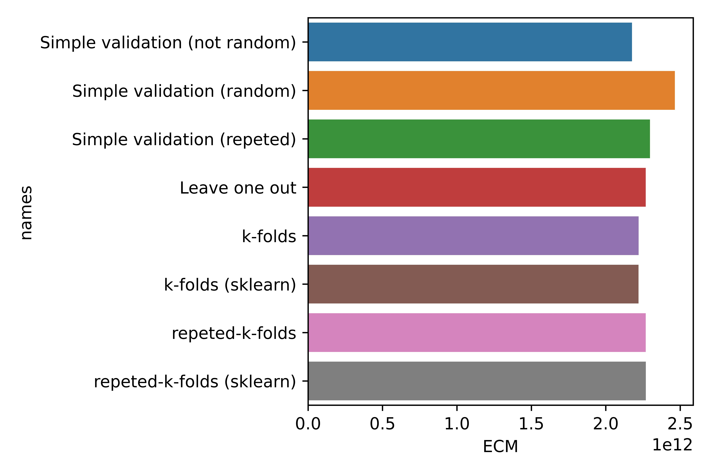

--- 
title: "Algoritmos de validación de modelos de aprendizaje supervisado"
author: "Fabio Scielzo Ortiz"
date: "`r Sys.Date()`"
site: bookdown::bookdown_site
documentclass: book
bibliography: [book.bib]
# url: your book url like https://bookdown.org/yihui/bookdown
# cover-image: path to the social sharing image like images/cover.jpg
description: |
  Esta es una introducción a los algoritmos de validación de modelos de aprendizaje supervisado.
link-citations: yes
github-repo: rstudio/bookdown-demo
---

 
 

<div>
<style scoped>
    .dataframe tbody tr th:only-of-type {
        vertical-align: middle;
    }

    .dataframe tbody tr th {
        vertical-align: top;
    }

    .dataframe thead th {
        text-align: right;
    }
    
 
    table {
     display: block;
     overflow-x: auto;
     border-collapse: collapse;
     border-spacing: 0;
     border: 0px solid;
     color: var(--jp-ui-font-color1);
     font-size: 14px;
     margin-left: auto;
     margin-right: auto;
     
            }
            
</style>


# Introducción


<center>

{width="60%"}

</center>

<br>

<div class="warning" style='background-color:#FCF2EC; color: #000000; border-left: solid #FE9554 7px; border-radius: 3px; size:1px ; padding:0.1em;'>
<span>
 
<p style='margin-left:10em;'>


- **Más artículos:    $\hspace{0.1cm}$ [Estadistica4all](https://estadistica4all.com/)**

- **Autor:** $\hspace{0.1cm}$ [Fabio Scielzo Ortiz](https://estadistica4all.com/creador.html)

- **Si utilizas este artículo, por favor, cítalo:** 

$\hspace{1.5cm}$ Scielzo Ortiz, F. (2022). Algoritmos de validación cruzada. Estadistica4all. 


</p>
 
</p></span>
</div>


<br>


***Se recomienda abrir el artículo en un ordenador, en una tablet o en un móvil en versión de escritorio.***
 
 
 
 <br>
 
Los algoritmos de validación son una familia muy importante de algoritmos dentro del aprendizaje estadístico o machine learning que permiten evaluar la capacidad predictiva de un modelo predictivo.

Distinguiremos dos tipos de algoritmos de validación de modelos:

- Métodos de validación de modelos de **aprendizaje supervisado** $\hspace{0.3cm} \Rightarrow\hspace{0.3cm}$ son algoritmos que permiten evaluar modelos de aprendizaje supervisado usando **muestras de test y train de los predictores y la respuesta**, y una **métrica de evaluación**. 

- Métodos de evaluación de modelos de **aprendizaje no supervisado** $\hspace{0.3cm}\Rightarrow\hspace{0.3cm}$ son algoritmos que permiten evaluar modelos de aprendizaje no supervisado usando una **muestra de train de los predictores** y una **métrica de evaluación**. 


**Observación:**

Los métodos de validación de modelos de **aprendizaje supervisado**
también son llamados **métodos de validación cruzada**. Aunque realmente son mucho más conocidos por su nombre en inglés: **cross validation**

<br>

**¿Por qué no se aplican los mismos métodos de validación a los modelos de aprendizaje supervisado y no supervisado?**

Debido a que tienen unas características diferentes, en particular, en el aprendizaje supervisado se tienen datos de la variable respuesta, mientras que en el no supervisado no se dispone de información alguna.

Si se quiere ver un planteamiento algo más detallado de los problemas de aprendizaje supervisado y no supervisado se recomienda leer el artículo sobre ese tema que tenemos en [Estadistica4all](https://estadistica4all.com/)
<br>

Los métodos de evaluación son usados para dos propósitos, principalmente:

- Para **seleccionar**  modelos.

- Para **optimizar hiper-parametros** de modelos.


En otros artículos estudiaremos métodos para selección de modelos y  ajuste de hiper-parámetros.


<br>

En este articulo vamos a estudiar los **métodos de validación de modelos de aprendizaje supervisado**. Los métodos de validación de modelos de aprendizaje no supervisado serán estudiados en otro artículo.

Por lo que consideraremos que $\hspace{0.01cm} M \hspace{0.01cm}$ representa un **modelo o algoritmo de aprendizaje supervisado**, como por ejemplo el modelo de regresión lineal, regresión logistica, regresión no lineal, regresión lineal penalizada, arboles de regresión y clasificación, KNN , SVM, redes neuronales ...

Notese que en este articulo no se consideran modelos estadísticos predictivos no supervisados como son los modelos de clustering como K-medias, K-medoids, modelos jerarquicos, modelos basados en densidades ...
 
Nos interesa tener un método a través del cual pueda evaluarse la capacidad o poder predictivo del modelo de aprendizaje supervisado $\hspace{0.01cm}M\hspace{0.01cm}$.

Una aproximación naive es evaluar el poder predictivo del modelo usando dos elementos. Por un lado los datos disponibles de la variable respuesta, y por otro las predicciones que el modelo hace para los datos de los predcitores con los que el modelo ha sido entrenado. 

La idea sería comparar los valores reales de la respuesta con los predichos por el modelo, usando alguna métrica.   

Esta aproximación tiende a infra-estimar el error de predicción real del modelo, ya que se está prediciendo la respuesta para observaciones de los predictores que ya han sido "vistas" por el modelo, por ello el rendimiento del modelo al predecir la respuesta para estas observaciones tiende a ser mejor que si fueran observaciones con las que el modelo no ha sido entrenado (observaciones que no ha "visto" aún). 


Los métodos de validación de modelos predictivos **supervisados** tiene tres elementos:

- Muestras de **train** y **test** de los predictores y la respuesta.  

- Una **métrica de evaluación**. 

- Un **algoritmo** para **evaluar el modelo** que usa los anteriores dos elementos de algún modo.


Este artículo es básicamente un tour teórico-práctico sobre estos elementos.


<br>

# Muestras y predicciones de de train y test


En esta sección vamos a fijar algunos conceptos y notación que serán usados en las siguientes secciones.

<div class="warning" style='background-color:#F7EBE8; color: #030000; border-left: solid #CA0B0B 7px; border-radius: 3px; size:1px ; padding:0.1em;'>
<span>
 
<p style='margin-left:1em;'>

- Tenemos una muestra  de $N$ observaciones de $p$ predictores $\mathcal{X}_1,...,\mathcal{X}_p$ y  de una variable respuesta $\mathcal{Y}$ : 


    $$D=[\hspace{0.1cm} X_1,...,X_p,Y \hspace{0.1cm}]=\begin{pmatrix}
    x_{11}&x_{12}&...&x_{1p}& y_1\\
    x_{21}&x_{22}&...&x_{2p} & y_2\\
    ...&...&...&...\\
    x_{N1}&x_{N2}&...&x_{Np}& y_N
    \end{pmatrix} = \begin{pmatrix}
    x_{1}& y_1\\
    x_{2}& y_2\\
    ...&...\\
    x_{N}& y_N
    \end{pmatrix} \\$$

</p>
 
</p></span>
</div>


<br>

Sin entrar aquí en particularidades, para evaluar un modelo de aprendizaje supervisado $M$ este tiene que ser entrenado con un subconjunto de $n$ filas de $D$ , llamado **muestra de entrenamiento** o de **train** $D_{train}$, y testado con el subconjunto de las $h$ filas restantes de $D$, llamado  **muestra de test** $D_{test}$ , de modo  que $n+h=N$ 

Los métodos de validación típicos usan de algún modo $D_{train}$ y  $D_{test}$ , junto con una **métrica de evaluación**, es por ello  que vamos a definir estos elementos con mas precisión a continuación.


<br>

## Train-set


 
Los elementos antes mencionados se definen formalmente como sigue:

<div class="warning" style='background-color:#F7EBE8; color: #030000; border-left: solid #CA0B0B 7px; border-radius: 3px; size:1px ; padding:0.1em;'>
<span>
 
<p style='margin-left:1em;'>

- **Muestra train** de $n$ observaciones  del predictor $\mathcal{X}_j$ :

$$X_j^{train} \hspace{0.1cm}=\hspace{0.1cm} (\hspace{0.1cm} x_{1j}^{train},...,x_{nj}^{train}\hspace{0.1cm} )^t \hspace{0.3cm} , \hspace{0.3cm} j\in \lbrace 1,...,p \rbrace \\[0.4cm]$$

- **Muestra train** de $n$ observaciones de la respuesta $\mathcal{Y}$ :

$$Y^{train} \hspace{0.1cm}=\hspace{0.1cm} \left(\hspace{0.1cm}y_{1}^{train},...,y_n^{train}\hspace{0.1cm}\right)^t \\[0.4cm]$$

- **Train-set** :

$$D_{train}\hspace{0.1cm}=\hspace{0.1cm}[\hspace{0.1cm}X_1^{train}\hspace{0.03cm},...,\hspace{0.03cm}X_p^{train} \hspace{0.03cm},\hspace{0.03cm} Y^{train}\hspace{0.1cm}]\hspace{0.1cm} = \hspace{0.1cm}  \begin{pmatrix}
    x_{11}^{train} &...&x_{1p}^{train}& y_1^{train}\\
    x_{21}^{train}&...&x_{2p}^{train} & y_2^{train}\\
    &...&\\
    x_{n1}^{train}&...&x_{np}^{train}& y_n^{train}
    \end{pmatrix}= \begin{pmatrix}
    x_{1}^{train}& y_1^{train}\\
    x_{2}^{train}& y_2^{train}\\
    ...&...\\
    x_{n}^{train}& y_n^{train}
    \end{pmatrix} \\$$

</p>
 
</p></span>
</div>

<br>

**Observaciones:**

- La fila $i$ de $D_{train}$ , es decir, $\left(x_i^{train},y_i^{train}\right) = \left(x_{i1}^{train}, x_{i2}^{train},...,x_{ip}^{train}, y_i^{train}\right)\hspace{0.1cm}$, es la $\hspace{0.1cm}i$-esima **observación de train** de los predictores y la respuesta $\hspace{0.1cm}\mathcal{X}_1,...,\mathcal{X}_p \hspace{0.1cm},\hspace{0.1cm} \mathcal{Y}$.

- $D_{train}$ también es llamada simplemente **observaciones de train** de $\mathcal{X}_1,...,\mathcal{X}_p\hspace{0.1cm},\hspace{0.1cm} \mathcal{Y}$.


<br>

## Predicciones de train

Como $M$ es un modelo de aprendizaje supervisado es capaz de, una vez es entrenado  con las observaciones de   $D_{train}=[X_1^{train},...,X_p^{train}, Y^{train}]$ , generar predicciones de la variable respuesta $\mathcal{Y}$, tanto para las **observaciones de train** de los predictores como para  **nuevas observaciones**.

Notese que $M$ nos interesa realmente para predecir la variable respuesta para **nuevas observaciones** de los predictores, es decir, para predecir la respuesta para individuos/elementos de los que solo tenemos información de los predictores.  


<br>

<div class="warning" style='background-color:#F7EBE8; color: #030000; border-left: solid #CA0B0B 7px; border-radius: 3px; size:1px ; padding:0.1em;'>
<span>
 
<p style='margin-left:1em;'>

- Las **predicciones de train** de la respuesta $\hspace{0.1cm}\mathcal{Y}\hspace{0.1cm}$ ,  son obtenidas aplicando el modelo de aprendizaje supervisado ya **entrenado** a las **observaciones de train** de los **predictores**:


$$\widehat{Y}^{\hspace{0.1cm} train} \hspace{0.1cm} = \hspace{0.1cm}  M\left(\hspace{0.1cm} X_1^{train},...,X_p^{train} \hspace{0.2cm}|\hspace{0.2cm} X_1^{train},...,X_p^{train}, Y^{train} \hspace{0.1cm}\right)$$

</p>
 
</p></span>
</div>

<br>

**Observaciones:**

- Aqui $M( z \hspace{0.1cm}|\hspace{0.1cm} w)$ representa una función de dos argumentos, el argumento posterior a $\hspace{0.1cm}|\hspace{0.1cm}$ , es decir $w$, son los datos de predictores y respuestas con los que se entrena el modelo de aprendizaje supervisado $M$ , y el argumento previo a $\hspace{0.1cm}|\hspace{0.1cm}$ , es decir $z$, son los datos de los predictores que el modelo $M$ usa para generar predicciones de la variable respuesta. Y devuelve un vector con esas predicciones de la respuesta.


- $\widehat{\hspace{0.01cm} Y}^{\hspace{0.08cm} train}\hspace{0.1cm}=\hspace{0.1cm}(\hat{y}_1^{train},..., \hat{y}_n^{train})^t\hspace{0.15cm}$ es un vector con las predicciones de la respuesta hechas por el modelo entrenado $\hspace{0.08cm}M\hspace{0.1cm}$  para la muestra train de observaciones de los predictores $\hspace{0.1cm}(X_1^{train},...,X_p^{train}) \\$

- $\widehat{y}_i^{train} = M(\hspace{0.1cm} x_i^{train} \hspace{0.15cm}|\hspace{0.15cm} X_1^{train},...,X_p^{train}, Y^{train} \hspace{0.1cm}) = M(\hspace{0.1cm}x_{i1}^{train},...,x_{ip}^{train} \hspace{0.15cm}|\hspace{0.15cm} X_1^{train},...,X_p^{train}, Y^{train}\hspace{0.1cm})\hspace{0.1cm}$ es la predicción de la variable respuesta generada por el modelo entrenado $M$ para la observación de train de los predictores $x_i^{train}=(x_{i1}^{train},...,x_{ip}^{train})$.


<br>

## Test-set

<div class="warning" style='background-color:#F7EBE8; color: #030000; border-left: solid #CA0B0B 7px; border-radius: 3px; size:1px ; padding:0.1em;'>
<span>
 
<p style='margin-left:1em;'>

- **Muestra test** de $\hspace{0.08cm}h\hspace{0.08cm}$ observaciones   del predictor $\mathcal{X}_j$:

$$X_j^{test}=\left(x^{test}_{1j},...,x^{test}_{hj} \right)^t  \hspace{0.3cm} , \hspace{0.3cm} \forall j=1,...,p\\[0.4cm]$$

-  **Muestra test** de $\hspace{0.1cm}h\hspace{0.1cm}$ observaciones  de la respuesta $\mathcal{Y}$:

$$Y^{test}=\left(y^{test}_{1},...,y^{test}_{h} \right)^t  \hspace{0.3cm} , \hspace{0.3cm} \forall j=1,...,p \\[0.4cm]$$


- **Test-set** :

$$D_{test}  \hspace{0.1cm}=\hspace{0.1cm} [\hspace{0.1cm}X_1^{test},...,X_p^{test}, Y^{test}\hspace{0.1cm}] \hspace{0.1cm}=\hspace{0.1cm} \begin{pmatrix}
    x^{test}_{11}&x^{test}_{12}&...&x^{test}_{1p} & y^{test}_1\\
    x^{test}_{21}&x^{test}_{22}&...&x^{test}_{2p} & y^{test}_2\\
    &...&\\
    x^{test}_{h1}&x^{test}_{h2}&...&x^{test}_{hp} & y^{test}_h
    \end{pmatrix}= \begin{pmatrix}
    x_{1}^{test}& y_1^{test}\\
    x_{2}^{test}& y_2^{test}\\
    ...&...\\
    x_{h}^{test}& y_h^{test}
    \end{pmatrix}$$


</p>
 
</p></span>
</div>


<br>

**Observaciones:**

- La fila $i$ de $D_{test}$ , es decir, $(x_i^{test},y_i^{test})= (x^{test}_{i1}, x^{test}_{i2},...,x^{test}_{ip}, y_i^{test})$, es la $i$-esima **observación de test** de los predictores y la respuesta $\mathcal{X}_1,...,\mathcal{X}_p\hspace{0.08cm},\hspace{0.08cm} \mathcal{Y}$.


- $D_{test}$ también es llamada simplemente **observaciones de test** de $\mathcal{X}_1,...,\mathcal{X}_p, \mathcal{Y}$.

<br>

## Predicciones de test  


Puesto que $M$ es un modelo predictivo supervisado es capaz de, una vez es entrenado  con las observaciones de   $D_{train}=[X_1^{train},...,X_p^{train}, Y^{train}]$ , generar predicciones de la respuesta $\mathcal{Y}$  ,  tanto para las **observaciones de train** como  para **nuevas observaciones** de los predictores $\mathcal{X}_1,...,\mathcal{X}_p$ . 


Notese, de nuevo, que $M$ nos interesa realmente para predecir la respuesta para **nuevas observaciones** de los predictores, es decir, para predecir la respuesta para individuos/elementos de los que tenemos información sobre los predictores pero no sobre la respuesta.  


<br>


<div class="warning" style='background-color:#F7EBE8; color: #030000; border-left: solid #CA0B0B 7px; border-radius: 3px; size:1px ; padding:0.1em;'>
<span>
 
<p style='margin-left:1em;'>

- Las **predicciones de test** de la respuesta $\mathcal{Y}$ ,   son obtenidas aplicando el **modelo** predictivo **entrenado** a las observaciones de **test**:


 $$\widehat{Y}\hspace{0.08cm}^{test} \hspace{0.1cm} = \hspace{0.1cm} M\left(\hspace{0.1cm} X_1^{test},...,X_p^{test} \hspace{0.2cm}|\hspace{0.2cm} X_1^{train},...,X_p^{train}, Y^{train} \hspace{0.1cm}\right)$$
</p>
 
</p></span>
</div>

<br>

**Observaciones:**


- Aqui $M( z \hspace{0.1cm}|\hspace{0.1cm} w)$ representa una función de dos argumentos, el argumento posterior a $\hspace{0.1cm}|\hspace{0.1cm}$ , es decir $w$, son los datos de predictores y respuestas con los que se entrena el modelo $M$ , y el argumento previo a $\hspace{0.1cm}|\hspace{0.1cm}$ , es decir $z$, son los datos de los predictores que el modelo $M$ usa para generar predicciones de la respuesta. Y devuelve un vector con esas predicciones de la respuesta. 


- $\widehat{\hspace{0.02cm}Y}^{\hspace{0.1cm}test}= (\hat{y}_1^{\hspace{0.08cm}test},..., \hat{y}_h^{\hspace{0.1cm}test})^t$ es un vector con las predicciones de la respuesta hechas por el modelo entrenado $M$  usando la **muestra test** de observaciones de los predictores $X_1^{test},...,X_p^{test}$.

- $\hat{y}_i^{test} = M \left(\hspace{0.1cm} x_i^{test} \hspace{0.15cm}|\hspace{0.15cm} X_1^{train},...,X_p^{train}, Y^{train}\hspace{0.1cm} \right) = M\left( \hspace{0.08cm} x^{test}_{i1},...,x^{test}_{ip} \hspace{0.15cm}|\hspace{0.15cm} X_1^{train},...,X_p^{train}, Y^{train}\right)$ es la predicción de la respuesta que el modelo entrenado $M$ genera para la observación de test de los predictores $x_i^{test}=(x^{test}_{i1},...,x^{test}_{ip})$ .


<br>

 

Teniendo todo lo anterior en cuenta, la evaluación de los modelos de aprendizaje supervisado $M$ se realiza, sin entrar en particularidades, comparando las **predicciones de test** de la variable respuesta generadas por el modelo $M$, es decir, $\widehat{\hspace{0.02cm}Y}^{\hspace{0.08cm}test}$, con la muestra de **observaciones test** de la respuesta, $Y^{test}$

La muestra test juega el rol de muestra de nuevas observaciones. Y el modelo  $M$ interesa  para predecir nuevas observaciones. 

Por ello se utiliza la muestra test como muestra para evaluar el rendimiento del modelo al predecir la respuesta para nuevas observaciones de los predictores.


<br>


# Métricas para evaluar modelos de regresión


Dado un modelo de regresión  $M$ , existen varias métricas para evaluar la capacidad predictiva del modelo. Cada una de estas métricas tienen una versión de train (son calculadas usando las predicciones de train) y otra de test (son calculadas usando las predicciones de test).


Se recomienda al lector haber leido previamente el articulo sobre **los problemas de regresión y clasificación supervisada y no supervisada**.


 
A continuación vamos a exponer las métricas de evaluación más habituales para **modelos de regresión**:


## Error cuadrático medio (ECM)

<div class="warning" style='background-color:#F7EBE8; color: #030000; border-left: solid #CA0B0B 7px; border-radius: 3px; size:1px ; padding:0.1em;'>
<span>
 
<p style='margin-left:1em;'>


- **ECM de train**:

$$ECM(M)_{train} \hspace{0.15cm}=\hspace{0.15cm} \dfrac{1}{n} \cdot \sum_{i=1}^n \hspace{0.1cm} (\hspace{0.08cm} y_i^{\hspace{0.08cm}train} - \hat{y}_i^{\hspace{0.08cm}train} \hspace{0.08cm} )^2 \\$$


</p>
 
</p></span>
</div>

<br>

Donde:

- $y_i^{test}$ es la **observación de test** $i$-esima de la variable respuesta, es decir,   $y_i^{test} \hspace{0.1cm}=\hspace{0.1cm} Y^{test}[\hspace{0.1cm} i\hspace{0.1cm}]$.

- $\hat{y}_i^{test} \hspace{0.1cm}=\hspace{0.1cm} M\left(\hspace{0.1cm} x_i^{test} \hspace{0.2cm}|\hspace{0.2cm} X_1^{train},...,X_p^{train}, Y^{train}\hspace{0.1cm} \right)$.

- $n \hspace{0.1cm}=\hspace{0.1cm} \# \hspace{0.1cm} Y^{train}$.


<br>


<div class="warning" style='background-color:#F7EBE8; color: #030000; border-left: solid #CA0B0B 7px; border-radius: 3px; size:1px ; padding:0.1em;'>
<span>
 
<p style='margin-left:1em;'>


- **ECM de test**

$$ECM(M)_{test} \hspace{0.15cm} =\hspace{0.15cm} \dfrac{1}{h} \cdot \sum_{i=1}^h \hspace{0.1cm} (\hspace{0.1cm} y_i^{\hspace{0.1cm}test} - \hat{y}_i^{\hspace{0.1cm}test} \hspace{0.1cm} )^2$$

</p>
 
</p></span>
</div>


<br>

Donde:

- $y_i^{test}\hspace{0.1cm}$ es la observación de test $\hspace{0.1cm}i$-esima de la variable respuesta, es decir,   $\hspace{0.15cm}y_i^{test} \hspace{0.1cm}=\hspace{0.1cm} Y^{test}[\hspace{0.1cm} i \hspace{0.1cm}]$.

- $\hat{y}_i^{test} \hspace{0.1cm}=\hspace{0.1cm} M\left(\hspace{0.1cm} x_i^{test} \hspace{0.15cm}|\hspace{0.15cm} X_1^{train},...,X_p^{train}, Y^{train} \hspace{0.1cm} \right)$.

- $h\hspace{0.1cm}=\hspace{0.1cm}\# \hspace{0.1cm} Y^{test}$


<br>


**Observación:**

El $\hspace{0.08cm} ECM\hspace{0.08cm}$ tiene se mide en la unidad de medida que la respuesta **al cuadrado**. 


**Interpretación:**

Cuanto menor sea $\hspace{0.08cm}ECM(M)_{test}\hspace{0.08cm}$ , mayor capacidad predictiva del modelo $\hspace{0.08cm}M\hspace{0.08cm}$, y a la inversa. 


**¿Por qué el ECM es tan usado en la práctica?**

Teóricamente puede demostraste que en un modelo de regresión   el error cuadrático medio de la predicción puede descomponerse como sigue:

$$ECM(\hspace{0.08cm}\widehat{\mathcal{Y}}\hspace{0.08cm}) = E\hspace{0.1cm}[\hspace{0.1cm}(\mathcal{Y} - \widehat{\mathcal{Y}})^2\hspace{0.1cm}]\hspace{0.1cm} =\hspace{0.1cm} Var(\hspace{0.08cm}\widehat{\mathcal{Y}}\hspace{0.08cm}) \hspace{0.1cm}+\hspace{0.1cm} Sesgo(\hspace{0.08cm}\widehat{\mathcal{Y}}\hspace{0.08cm})^2 \hspace{0.1cm}+\hspace{0.1cm} \sigma_{\varepsilon}^2 \\$$


Donde:


- $Var(\hspace{0.08cm}\widehat{\mathcal{Y}}\hspace{0.08cm})\hspace{0.1cm} =\hspace{0.1cm} E[\hspace{0.1cm}(\hspace{0.08cm}\widehat{\mathcal{Y}} - E[\hspace{0.08cm}\widehat{\mathcal{Y}}\hspace{0.08cm}]\hspace{0.08cm})^2\hspace{0.1cm}]\hspace{0.1cm}$ es la varianza de las predicciones del modelo. 

- $Sesgo(\hspace{0.08cm}\widehat{\mathcal{Y}}\hspace{0.08cm})\hspace{0.1cm}=\hspace{0.1cm}E[\hspace{0.08cm}\hspace{0.1cm}\widehat{\mathcal{Y}}\hspace{0.1cm}] \hspace{0.1cm}-\hspace{0.1cm} \mathcal{Y}\hspace{0.15cm}$ es el sesgo de las predicciones del modelo.

- $\sigma_{\varepsilon}^2\hspace{0.1cm}$ es la varianza del ruido aleatorio o perturbación del modelo.


Por tanto, en un modelo de regresion,  el ECM del estimador de la respuesta puede descomponerse como la suma de la varianza y sesgo al cuadrado de dicho estimador de la respuesta, y tambien de la varianza del ruido aleatorio del modelo.

Los dos primeros terminos (varianza y sesgo del estimador de la respuesta) pueden se reducidos, en función del modelo utilizado. En cambio el tercer componente (la varianza del ruido) es irreducible, no depende del modelo.


Esta propiedad del ECM es una de las razones por las que es tan usado, ya que nos da información sobre el ratio varianza-sego de las predicciones de un modelo.

Un modelo con baja varianza y sesgo en sus predicciones tendra bajo ECM.

Un modelo con alta varianza o alto sesgo en sus predicciones tendra alto ECM.

Los modelos con menor ECM de entre una colección de modelos serán aquellos con un mayor equilibrio en el ratio varianza-sesgo en sus predicciones.


Un modelo con mucha varianza en sus predicciones es un modelo cuyas predicciones sobre la respuesta varian mucho de una muestra de train a otra. Es decir, al ser entrenado con múltiples muestras, las predicciones que el modelo hace de la respuesta usando una determinada muestra fija de test varían mucho de un modelo entrenado a otro. En un modelo con poca varianza en sus predicciones ocurre al revés, la precisión de sus predicciones es alta en el sentido de que varian poco en funcion de la muestra de train empleada. Otra cuestión es si estas predicciones son mas o menos acertadas (esto tiene que ver mas con el sesgo).

Un modelo con mucho sesgo en sus predicciones es un modelo cuyas predicciones sobre la respuesta están en media muy lejos de los verdaderos valores de la respuesta. Es decir, si el modelo es entrenado con múltiples muestras de train y se predice la respuesta para una muestra fija de test, la media de las predicciones de la respuesta obtenidas con cada uno de los modelos entrenados aleja bastante de la verdadera respuesta.
En cambio un modelo con bajo sesgo genera predicciones que en media son bastante acertadas. Es decir, si se entrena el modelo con múltiples muestras de train y se predice la respuesta usando una muestra fija de test, la media de esas predicciones obtenidas con cada uno de los modelos entrenados es bastante cercana a la respuesta real.


<br>


## Raiz del error cuadrático medio (RECM)

<div class="warning" style='background-color:#F7EBE8; color: #030000; border-left: solid #CA0B0B 7px; border-radius: 3px; size:1px ; padding:0.1em;'>
<span>
 
<p style='margin-left:1em;'>


- **RECM de train:**

$$RECM(M)_{train} \hspace{0.08cm}=\hspace{0.08cm} \sqrt{\dfrac{1}{n} \cdot \sum_{i=1}^n \hspace{0.1cm} (y_i^{train} - \hat{y}_i^{train})^2 \hspace{0.2cm}} \\$$


- **RECM de test:**


$$RECM(M)_{test} \hspace{0.08cm}=\hspace{0.08cm} \sqrt{ \dfrac{1}{h} \cdot \sum_{i=1}^h \hspace{0.1cm} (\hspace{0.1cm} y_i^{\hspace{0.1cm} test} - \hat{y}_{i} ^{\hspace{0.1cm} test} \hspace{0.1cm} )^2 \hspace{0.2cm}} \\[0.2cm]$$

</p>
 
</p></span>
</div>


<br>

**Observación:**

El $\hspace{0.08cm}RECM\hspace{0.08cm}$ tiene la misma unidad de medida que la respuesta. 


**Interpretación:**

Cuanto menor sea $\hspace{0.08cm}RECM(M)_{test}\hspace{0.08cm}$ , mayor bondad predictiva del modelo $\hspace{0.08cm}M\hspace{0.08cm}$, y a la inversa.

 <br>


## Error cuadratico relativo (ECR)

<div class="warning" style='background-color:#F7EBE8; color: #030000; border-left: solid #CA0B0B 7px; border-radius: 3px; size:1px ; padding:0.1em;'>
<span>
 
<p style='margin-left:1em;'>


- **ECR de train:**

$$ECR(M)_{train} \hspace{0.1cm}=\hspace{0.1cm} \dfrac{\hspace{0.5cm} \sum_{i=1}^n \hspace{0.1cm} ( y_i^{train}- \hat{y}_i^{train} )^2 \hspace{0.5cm}}{\sum_{i=1}^n ( y_i^{train} - \overline{Y \hspace{0.1cm}}^{\hspace{0.1cm} train} )^2 }  \\$$


 


- **ECR de test:**

$$ECR(M)_{test} \hspace{0.1cm}=\hspace{0.1cm} \dfrac{ \hspace{0.5cm} \sum_{i=1}^h \hspace{0.1cm} (\hspace{0.1cm} y_i^{\hspace{0.1cm} test} - \hat{y}_i^{\hspace{0.1cm} test} \hspace{0.1cm})^2 \hspace{0.5cm}    }{\sum_{i=1}^h (\hspace{0.1cm} y_i^{\hspace{0.1cm} test} - \overline{Y \hspace{0.1cm}}^{\hspace{0.1cm} test} \hspace{0.1cm} )^2 } \\$$

</p>
 
</p></span>
</div>


**Interpretación:**

Cuanto menor sea $\hspace{0.08cm}ECR(M)_{test}\hspace{0.08cm}$ , mayor bondad predictiva del modelo $\hspace{0.08cm}M\hspace{0.08cm}$, y a la inversa.

<br>


## Coeficiente de determinación 


<div class="warning" style='background-color:#F7EBE8; color: #030000; border-left: solid #CA0B0B 7px; border-radius: 3px; size:1px ; padding:0.1em;'>
<span>
 
<p style='margin-left:1em;'>

- **Coeficiente de determinación de train:**

$$R(M)^2_{train} \hspace{0.1cm}=\hspace{0.1cm} 1 - ECR(M)_{train} \\$$


- **Coeficiente de determinación de train:**

$$R(M)^2_{test} \hspace{0.1cm}=\hspace{0.1cm} 1 - ECR(M)_{test} \\$$

</p>
 
</p></span>
</div>


<br>

**Interpretación:**

Cuanto mayor sea $\hspace{0.05cm}R(M)^2_{test}\hspace{0.05cm}$ , mayor bondad predictiva del modelo $\hspace{0.05cm}M\hspace{0.05cm}$, y a la inversa.

<br>

 
## Error absoluto medio (EAM)


<div class="warning" style='background-color:#F7EBE8; color: #030000; border-left: solid #CA0B0B 7px; border-radius: 3px; size:1px ; padding:0.1em;'>
<span>
 
<p style='margin-left:1em;'>

- **EAM de train:**

$$EAM(M)_{train} \hspace{0.1cm}=\hspace{0.1cm} \dfrac{1}{n} \cdot \sum_{i=1}^n \hspace{0.1cm} \left|\hspace{0.1cm} y_i^{train} - \hat{y}_i^{train} \hspace{0.1cm}\right| \\$$


- **EAM de test:**


$$EAM(M)_{test} \hspace{0.1cm}=\hspace{0.1cm} \dfrac{1}{h} \cdot \sum_{i=1}^h \hspace{0.1cm} \left| \hspace{0.1cm} y_i^{\hspace{0.1cm}test} - \hat{y}_i^{\hspace{0.1cm}test} \hspace{0.1cm} \right|$$

</p>
 
</p></span>
</div>

<br>

## Error absoluto relativo (EAR) 


<div class="warning" style='background-color:#F7EBE8; color: #030000; border-left: solid #CA0B0B 7px; border-radius: 3px; size:1px ; padding:0.1em;'>
<span>
 
<p style='margin-left:1em;'>

- **EAR de train:**

$$EAR(M)_{train} \hspace{0.1cm}=\hspace{0.1cm} \dfrac{\sum_{i=1}^n \hspace{0.1cm} \left|\hspace{0.1cm} y_i^{train} - \hat{y}_i^{\hspace{0.08cm} train} \hspace{0.1cm} \right| \hspace{0.2cm} }{\sum_{i=1}^n \hspace{0.1cm} \left| \hspace{0.1cm} y_i^{train} - \overline{y}^{train} \hspace{0.1cm} \right| \hspace{0.1cm}}  \\$$


- **EAR de test:**


$$EAR(M)_{test} \hspace{0.1cm}=\hspace{0.1cm} \dfrac{ \sum_{i=1}^h \hspace{0.1cm} \hspace{0.1cm} \left| \hspace{0.1cm} y_i^{\hspace{0.1cm} test} - \hat{y}_i^{\hspace{0.1cm} test} \hspace{0.1cm} \right| \hspace{0.2cm}  }{\sum_{i=1}^h \hspace{0.1cm}\left|\hspace{0.1cm} y_i^{\hspace{0.1cm} test} - \overline{y}^{\hspace{0.1cm} test} \hspace{0.1cm}\right|\hspace{0.1cm}}$$

</p>
 
</p></span>
</div>

 


<br>


# Métricas para evaluar modelos de clasificación supervisada

A continuación vamos a exponer las métricas de evaluación más habituales para **modelos de clasificación supervisada**:


## Tasa de acierto en la clasificación (TAC)


<div class="warning" style='background-color:#F7EBE8; color: #030000; border-left: solid #CA0B0B 7px; border-radius: 3px; size:1px ; padding:0.1em;'>
<span>
 
<p style='margin-left:1em;'>


- **TAC de train:**

$$TAC(M)_{train} \hspace{0.1cm}=\hspace{0.1cm} \dfrac{1}{n} \cdot \sum_{i=1}^{n} \hspace{0.2cm} \mathbf {I} ( \hspace{0.1cm} \hat{y}_i^{train} = y_i^{train} \hspace{0.1cm} )\\$$

- **TAC de test:**

$$TAC(M)_{train} \hspace{0.1cm}=\hspace{0.1cm} \dfrac{1}{n} \cdot \sum_{i=1}^{n} \hspace{0.2cm} \mathbf{I} ( \hspace{0.1cm} \hat{y}_i^{train} = y_i^{train} \hspace{0.1cm})$$

</p>
 
</p></span>
</div>


<br>


 
## Tasa de error en la clasificación (TEC)


<div class="warning" style='background-color:#F7EBE8; color: #030000; border-left: solid #CA0B0B 7px; border-radius: 3px; size:1px ; padding:0.1em;'>
<span>
 
<p style='margin-left:1em;'>

- **TEC de train:**

$$TEC(M)_{train} \hspace{0.1cm}=\hspace{0.1cm} \dfrac{1}{n} \cdot \sum_{i=1}^{n} \hspace{0.2cm} \mathbf {I} \left( \hspace{0.05cm} \hat{y}_i^{train} \neq y_i^{train} \hspace{0.05cm} \right)\\$$


- **TEC de test:**

$$TEC(M)_{test} \hspace{0.1cm}=\hspace{0.1cm} \dfrac{1}{h} \cdot \sum_{i=1}^{h} \hspace{0.2cm} \mathbf {I} \left( \hspace{0.1cm} \hat{y}_i^{\hspace{0.05cm} test} \neq y_i^{\hspace{0.05cm} test} \hspace{0.1cm}\right)$$

</p>
 
</p></span>
</div>

<br>

## Kappa   
Suponemos que una variable respuesta tiene $\hspace{0.05cm}k \geq 2\hspace{0.05cm}$ categorias

Si usamos un modelo de clasificación basado en la distribución de probabilidad uniforme discreta, este predice cada categoria de la respuesta con igual probabilidad $\hspace{0.05cm}1/k\hspace{0.05cm}$, por lo que la tasa de acierto del modelo esperada es $\hspace{0.05cm}1/k$, es decir, si el modelo se aplica muchas veces, la $\hspace{0.08cm} TAC\hspace{0.08cm}$ **media** será de $1/k$.


<div class="warning" style='background-color:#F7EBE8; color: #030000; border-left: solid #CA0B0B 7px; border-radius: 3px; size:1px ; padding:0.1em;'>
<span>
 
<p style='margin-left:1em;'>

- **Kappa de train:**

$$Kappa(M)_{\hspace{0.05cm} train} \hspace{0.1cm} = \hspace{0.1cm} \dfrac{\hspace{0.1cm} TAC_{\hspace{0.05cm} train} \hspace{0.1cm}-\hspace{0.1cm} 1/k \hspace{0.1cm}}{1 \hspace{0.1cm} -\hspace{0.1cm} 1/k} \\$$

 
- **Kappa de test:**

$$Kappa(M)_{\hspace{0.05cm} test} \hspace{0.1cm}=\hspace{0.1cm} \dfrac{\hspace{0.1cm} TAC_{\hspace{0.05cm} test} \hspace{0.1cm}-\hspace{0.1cm} 1/k \hspace{0.1cm}}{1 \hspace{0.1cm}-\hspace{0.1cm} 1/k}$$

</p>
 
</p></span>
</div>


<br>


### Modelo de clasificación aleatoria uniforme

Dada una respuesta $\mathcal{Y}$ con $k\geq 2$ categorías  y  de una serie de predictores $\mathcal{X}_1 , ..., \mathcal{X}_p$.

Dada una muestra de $n$ observaciones de $Y$ del predictor  
y una muestra $X_j$ del predictor $\mathcal{X}_j$.


Un modelo de clasificación aleatorio basado en la distribución discreta $U\lbrace 0,1,..., k-1 \rbrace$ es un modelo tal que:

$$\widehat{y}_i \sim U\lbrace 0,1,..., k-1 \rbrace$$

Por lo que:

$$P(\widehat{y}_i = h) = 1/k = p$$ 

para todo $h=0,1,...,k-1$

<br>


Por tanto, para cada $\hspace{0.15cm}i=1,...,n\hspace{0.15cm}$ tenemos que: $\\[0.15cm]$

- $P\left( \hspace{0.1cm} \mathbf{I}(\hat{y}_i = y_i) = 1\hspace{0.1cm} \right) = P \left( \hspace{0.1cm} \hat{y}_i = y_i \hspace{0.1cm} \right) \hspace{0.1cm}=\hspace{0.1cm} 1/k \hspace{0.1cm}=\hspace{0.1cm} p$.

- $P\left( \hspace{0.1cm} \mathbf{I}(\hat{y}_i = y_i) = 0 \hspace{0.1cm} \right) \hspace{0.1cm} =\hspace{0.1cm} P\left( \hspace{0.1cm} \hat{y}_i \neq y_i \hspace{0.1cm} \right) \hspace{0.1cm}=\hspace{0.1cm} 1- 1/k  \hspace{0.1cm}=\hspace{0.1cm} 1 - p$.

<br>

Por lo que $\mathbf{I}(\hat{y}_i = y_i)$  es una variable binaria, con probabilidad de exito $p$ y de fracaso $1-p$, es decir:

$$\mathbf{I}(\hat{y}_i = y_i)  \hspace{0.1cm}\sim\hspace{0.1cm} Bernoulli\left( \hspace{0.1cm} p=1/k \hspace{0.1cm} \right)$$


Por lo tanto:

$$\sum_{i=1}^n \mathbf{I}(\hat{y}_i = y_i) \hspace{0.1cm}\sim\hspace{0.1cm} Binomial(n\cdot p )$$
<br>

Así que, la tasa de acierto  esperada del modelo de clasificación aleatoria uniforme es: $\\[0.2cm]$


$$E\left[TAC\right] \hspace{0.1cm}=\hspace{0.1cm} E\left[ \dfrac{1}{n} \sum_{i=1}^n \mathbf{I}(\hat{y}_i = y_i) \right] \hspace{0.1cm}=\hspace{0.1cm} E\left[  \dfrac{1}{n} \cdot Binomial(n\cdot p )  \right] \hspace{0.1cm} = \\[1.2cm] = \hspace{0.1cm} \dfrac{1}{n} \cdot E\left[ Binomial(n\cdot p )   \right]  \hspace{0.1cm}=\hspace{0.1cm} \dfrac{1}{n} \cdot (n\cdot p) = p = 1/k$$


<br>


# Algoritmos de validación de  modelos de aprendizaje supervisado


Los algoritmos de validación de modelos de aprendizaje supervisado permiten medir la capacidad predictiva de dichos modelos. Estoas algoritmos se suelen basar en:


- División del data-set inicial de la respuesta y los predictores en parte de train y parte de test.

- Entrenamiento del modelo con la parte de train.

- Obtención de predicciones de la respuesta con la parte de test.

- Cálculo de una métrica de evaluación usando las predicciones obtenidas en el paso 4)  y las observaciones de test de la respuesta. $\\[0.3cm]$

 

Tenemos un modelo de aprendizaje supervisado  $\hspace{0.1cm}M\hspace{0.1cm}$ y una muestra  de $\hspace{0.1cm}N\hspace{0.1cm}$ observaciones de $\hspace{0.1cm}p\hspace{0.1cm}$ predictores $\hspace{0.1cm}\mathcal{X}_1,...,\mathcal{X}_p\hspace{0.1cm}$ y  de la respuesta $\hspace{0.1cm}\mathcal{Y}$. 

 $$D\hspace{0.1cm}=\hspace{0.1cm}[X_1,...,X_p,Y]\hspace{0.1cm}=\hspace{0.1cm}\begin{pmatrix}
    x_{11}&x_{12}&...&x_{1p}& y_1\\
    x_{21}&x_{22}&...&x_{2p} & y_2\\
    &...&\\
    x_{N1}&x_{N2}&...&x_{Np}& y_N
    \end{pmatrix}=\begin{pmatrix}
    x_{1}& y_1\\
    x_{2}& y_2\\
    ...&...\\
    x_{N}& y_N
    \end{pmatrix}$$ 


<br>

<br>

## Validación simple no aleatoria

**Descripción no formal del algoritmo:**


Este algoritmo de validación consiste en dividir el data-set inicial en una parte de train y otra de test de manera no aleatoria.

El $\hspace{0.1cm} k\% \hspace{0.1cm}$ de las primeras filas del data-set serán la parte de train, y el resto la parte de test.

El modelo es entrenado con la muestra train y testado calculando una métrica de evaluación con la muestra test. Este valor de la métrica de evaluación es el que será usado para medir la capacidad predictiva del modelo y compararlo con otros modelos. $\\[0.4cm]$


**Decripción formal del algoritmo:**

El algoritmo de validación simple no aleatoria tiene los siguientes pasos: $\\[0.3cm]$


<div class="warning" style='background-color:#F7EBE8; color: #030000; border-left: solid #CA0B0B 7px; border-radius: 3px; size:1px ; padding:0.1em;'>
<span>
 
<p style='margin-left:1em;'>

- Se divide $D$ en parte de train y parte de test del siguiente modo: 

    Sea $\hspace{0.05cm}k\in (0,1)\hspace{0.05cm}$ la proporción de filas de $D$ que formaran parte del muestra de **train** : 

    - Las primeras $\hspace{0.2cm}\lfloor k  \cdot N \rfloor\hspace{0.2cm}$ observaciones (filas) definen el conjunto de train: $\\[0.15cm]$
    

      $$D_{train}= \begin{pmatrix}
    x_{11}&...&x_{1p}& y_1\\
    x_{21}&...&x_{2p} & y_2\\
    ...&...&...&... \\
    x_{\lfloor k  \cdot N \rfloor1}& ...&x_{\lfloor k  \cdot N \rfloor p}& y_{\lfloor k  \cdot N \rfloor}
    \end{pmatrix}\\$$
    

    
    
       Donde:
     
     
       - $\# D_{train}\hspace{0.01cm}$ es el número de **filas** de $\hspace{0.01cm}D_{train}$. $\\[0.25cm]$


  - Las siguientes $\hspace{0.2cm} N - \lfloor k  \cdot N \rfloor\hspace{0.2cm}$ observaciones definen (filas) el conjunto de test: $\\[0.15cm]$ 

      
      
     $$D_{test}= \begin{pmatrix}
    x_{(\lfloor k  \cdot N \rfloor + 1) \hspace{0.05cm} 1 } &...&x_{(\lfloor k  \cdot N \rfloor + 1) \hspace{0.05cm} p}& y_{\lfloor k  \cdot N \rfloor + 1} \\
    x_{(\lfloor k  \cdot N \rfloor + 2) \hspace{0.05cm} 1 }&...&x_{(\lfloor k  \cdot N \rfloor + 2) \hspace{0.05cm} p}& y_{\lfloor k  \cdot N \rfloor + 2}\\  ...&...&...&... \\
        x_{N \hspace{0.05cm} 1 } &...&x_{N p}& y_{N}
    \end{pmatrix} \\$$
 
    
    
     Donde:

     - $\# D_{test}\hspace{0.1cm}$ es el número de **filas** de $\hspace{0.1cm}D_{test}$ .

     - $\lfloor \cdot \rfloor\hspace{0.1cm}$ es la funcion suelo, que dado un número como argumento te  devuelve el mayor entero menor que dicho número. $\\[0.15cm]$


- Se entrena el modelo $\hspace{0.1cm} M\hspace{0.1cm}$ con la **muestra de train** $\hspace{0.1cm} D_{train}\hspace{0.1cm}$ $\hspace{0.25cm}\Rightarrow\hspace{0.25cm}$ $\widehat{M}$ .

- Se calcula una métrica de evaluación sobre el modelo entrenado $\hspace{0.1cm}\widehat{M}\hspace{0.1cm}$ usando la **muestra de test** $\hspace{0.1cm} D_{test}\hspace{0.1cm}$ $\hspace{0.2cm}\Rightarrow\hspace{0.2cm}$ Si por ejemplo se calcula el $\hspace{0.1cm}ECM\hspace{0.1cm}$ , se obtendria el $\hspace{0.1cm}ECM_{test}$ .


- La métrica de evaluación final del modelo es la obtenida en el paso anterior. 

    - Si la métrica empleada en el paso anterior es el $\hspace{0.1cm}ECM\hspace{0.1cm}$ , entonces la métrica de evaluación calculada con el algoritmo de validación simple no aleatoria es la siguiente:

                     
      $$ECM(M)_{test}^* \hspace{0.1cm}=\hspace{0.1cm} ECM(\widehat{M})_{test} \hspace{0.1cm}=\hspace{0.1cm} \dfrac{1}{\# D_{test}} \cdot \sum_{i=1}^{\# D_{test}} \hspace{0.1cm} ( \hspace{0.1cm} y_i^{test} - \hat{y}_i^{test} \hspace{0.1cm})^2$$


      Donde:

       - $\hat{y}_i^{test} \hspace{0.1cm}=\hspace{0.1cm} \widehat{M}(\hspace{0.1cm} x_i^{test} \hspace{0.1cm}|\hspace{0.1cm} D_{train}) \hspace{0.1cm}=\hspace{0.1cm} M(\hspace{0.1cm} x_i^{test} \hspace{0.1cm}|\hspace{0.1cm} X_1^{train},...,X_p^{train},Y^{train})\hspace{0.1cm}=\hspace{0.1cm} \widehat{M}(\hspace{0.1cm} x_i^{test} \hspace{0.1cm})$

</p>
 
</p></span>
</div>


<br>

**Problemas**

Toda la validación queda condicionada a solo una muestra de train y otra de test. Si alguna de estas muestras tienen defectos, estos se van a trasladar a la validación, que será por tanto defectuosa. Es la primera aproximación naive a los algoritmos de validación.


<br>

---

<br>

## Validación simple aleatoria

**Decripción no formal del algoritmo:**


Este algoritmo de validacion consiste en dividir el data-set inicial en una parte de train y otra de test de manera **aleatoria**.


Se obtiene una muestra aleatoria sin remplazo de un $\hspace{0.1cm} k\% \hspace{0.1cm}$ de las filas del data-set inicial, las cuales serán la parte de train, y el resto la parte de test.

El modelo es entrenado con la muestra train y testado calculando un métrica de evaluación con la muestra de test. Este valor de la métrica de evaluación es el que será usado para medir el poder predictivo del modelo y compararlo con otros modelos. 

<br>


**Decripción formal del algoritmo:**


El algoritmo de validación simple   aleatoria tiene los siguientes pasos: 


<div class="warning" style='background-color:#F7EBE8; color: #030000; border-left: solid #CA0B0B 7px; border-radius: 3px; size:1px ; padding:0.1em;'>
<span>
 
<p style='margin-left:1em;'>

- Se divide $\hspace{0.1cm}D\hspace{0.1cm}$ en parte de train y parte de test del siguiente modo: 

    Sea $\hspace{0.1cm}k\in (0,1)\hspace{0.1cm}$ la proporción de filas de $\hspace{0.1cm}D\hspace{0.1cm}$ que formarán parte de la muestra de **train** (es un hiper-parametro del algoritmo): $\\[0.05cm]$

    - Se genera una muestra aleatoria sin reemplazamiento de tamaño $\lfloor k  \cdot N \rfloor$  del vector $(\hspace{0.05cm}1,2,...,N\hspace{0.05cm})$ :


    $$m=(m_1 ,m_2,...,m_{\lfloor k  \cdot N \rfloor}) \\$$

    - Las observaciones (filas) $\hspace{0.1cm}m=(m_1,m_2 ,...,m_{\lfloor k  \cdot N \rfloor})\hspace{0.1cm}$ de $D$  definen la **muestra de train**: $\\[0.15cm]$

      $$D_{train}= D[m , :] = \begin{pmatrix}
    x_{m_11}& ...&x_{m_1p}& y_{m_1}\\
    x_{m_21}& ...&x_{m_2p} & y_{m_2}\\
    &...&\\
    x_{m_{\lfloor k  \cdot N \rfloor} 1} &...&x_{m_{\lfloor k  \cdot N \rfloor} p}& y_{m_{\lfloor k  \cdot N \rfloor}}
    \end{pmatrix}  =  \begin{pmatrix}
    x_{1}^{train} & y_{1}^{train}\\
    x_{2}^{train} & y_{2}^{train}\\
    ....&...\\
    x_{\# D_{train}}^{train} & y_{\# D_{train}}^{train}\\
    \end{pmatrix} \\$$
    
    
      Donde:

        - $\# D_{train}\hspace{0.1cm}$ es el número de **filas** de $\hspace{0.1cm}D_{train}$ $\\[0.2cm]$


    - Las observaciones (filas) de $D$ complementarias a  $\hspace{0.1cm}m\hspace{0.1cm}$ , es decir, las filas de $D$ que no estan en $D_{train}$, es decir, las filas de $m^c$,
 definen la **muestra de test**:  $\\[0.15cm]$
 
      $$D_{test} = D[m^c , :] =  \begin{pmatrix}
    x_{1}^{test} & y_{1}^{test}\\
    x_{2}^{test} & y_{2}^{test}\\
    ....&...\\
    x_{\# D_{test}}^{test} & y_{\# D_{test}}^{test}\\
    \end{pmatrix} \\$$


      Donde: 
 
        - $\# D_{test}\hspace{0.1cm}$ es el número de **filas** de $\hspace{0.1cm}D_{test}$.

 
        - $\lfloor \cdot \rfloor\hspace{0.1cm}$ es la funcion suelo, que dado un número como argumento te  devuelve el mayor entero menor que dicho número.

        - $m^c \hspace{0.1cm}= \hspace{0.1cm}\bigl(\hspace{0.1cm} i =1,...,N \hspace{0.15cm} : \hspace{0.15cm} i\neq m_j \hspace{0.1cm},\hspace{0.1cm} \forall j=1,...,\lfloor k  \cdot N \rfloor \hspace{0.1cm} \bigr)$ $\\[0.15cm]$


- Se entrena el modelo $\hspace{0.1cm}M\hspace{0.1cm}$ con la **muestra de train** $\hspace{0.1cm}D_{train}\hspace{0.1cm}$ $\hspace{0.1cm}\Rightarrow\hspace{0.2cm}$  $\widehat{M}$.

- Se calcula una métrica de evaluación sobre el modelo entrenado $\hspace{0.1cm}\widehat{M}\hspace{0.1cm}$ con la **muestra de test** $\hspace{0.1cm}D_{test}$ $\hspace{0.2cm}\Rightarrow\hspace{0.2cm}$
  Si por ejemplo se calcula el $\hspace{0.1cm}ECM\hspace{0.1cm}$ , se obtendria el $\hspace{0.1cm}ECM_{test}(\widehat{M})$.

- La métrica de evaluación final del modelo es la obtenida en el paso anterior: 

    - Si la métrica empleada en el paso anterior fue el $\hspace{0.1cm}ECM\hspace{0.1cm}$ , entonces:

       $$ECM(M)_{test}^* \hspace{0.1cm}=\hspace{0.1cm} ECM(\widehat{M})_{test} \hspace{0.1cm}=\hspace{0.1cm} \dfrac{1}{\# D_{test}} \cdot \sum_{i=1}^{\# D_{test}} (y_i^{test} - \hat{y}_i^{test})^2$$


       Donde:

       - $\hat{y}_i^{test} \hspace{0.1cm}=\hspace{0.1cm} M(\hspace{0.1cm} x_i^{test} \hspace{0.15cm}|\hspace{0.15cm} D_{train})\hspace{0.1cm}=\hspace{0.1cm} M(\hspace{0.1cm} x_i^{test} \hspace{0.1cm}|\hspace{0.1cm} X_1^{train},...,X_p^{train},Y^{train})\hspace{0.1cm}=\hspace{0.1cm} \widehat{M}(\hspace{0.1cm} x_i^{test} \hspace{0.1cm})$

</p>
 
</p></span>
</div>


<br>

**Problemas**

Toda la validación queda condicionada a solo una muestra de train y otra de test. Si alguna de estas muestras tienen defectos, estos se van a trasladar a la validación, que será por tanto defectuosa. 

Ademas la métrica de evaluacion calculada por validación simple aleatoria tiene generalmente una varianza alta, en comparación con otros métodos de validación. Esto será ilustrado en la práctica.

La varianza de una metrica de evaluación calculada con un algorimo de validación se puede entender como como la varianza de los valores obtenidos de la métrica al ejecutar el algoritmo un número elevado de veces.

 Es la segunda aproximación naive a los algoritmos de validación.
 
<br>

<br>


## Validación simple aleatoria repetida


**Decripción no formal del algoritmo:**


Este algoritmo de validacion consiste en dividir el data-set inicial en una parte de train y otra de test de manera aleatoria.


Se obtiene una muestra aleatoria sin remplazo de un $\hspace{0.05cm}k\%\hspace{0.05cm}$ de las filas del data-set inicial, las cuales serán la parte de train, y el resto la parte de test.

El modelo es enetrenado con la muestra train y testado con la muestra test a través de una métrica de evaluación como las vistas en la sección anterior.

Este proceso se repite un número $\hspace{0.03cm}B\hspace{0.03cm}$ de veces, asi se obtienen $\hspace{0.03cm}B\hspace{0.03cm}$ valores de la métrica de evaluación.

La métrica de evaluacion calculada usando este método de validación es la media de dichos $\hspace{0.03cm}B\hspace{0.03cm}$ valores obtenidos para la métrica de evaluación escogida. Este valor medio final es la que será usado para medir el poder predictivo del modelo y compararlo con otros modelos.
 
 
<br>


**Decripción formal del algoritmo:**


El algoritmo de validación simple aleatoria tiene los siguientes pasos: 

<div class="warning" style='background-color:#F7EBE8; color: #030000; border-left: solid #CA0B0B 7px; border-radius: 3px; size:1px ; padding:0.1em;'>
<span>
 
<p style='margin-left:1em;'>


- Se obtienen $B$ particiones de la muestra de observaciones $D$ en parte de **train** y parte de **test** del siguiente modo: 
   
   
   
    Sea $\hspace{0.05cm}k\in (0,1)\hspace{0.05cm}$ la proporción de filas de $\hspace{0.05cm}D\hspace{0.05cm}$ que formarán parte de la muestra de **train** : 


    - Se generan $\hspace{0.01cm}B\hspace{0.01cm}$  muestras aleatoria sin reemplazamiento de tamaño $\hspace{0.01cm}\lfloor k  \cdot N \rfloor\hspace{0.01cm}$  del vector $\hspace{0.01cm}(1,2,...,N)\hspace{0.1cm}$ : 

       $$m_1 \hspace{0.1cm},\hspace{0.1cm} m_2 \hspace{0.1cm},\hspace{0.1cm} ...\hspace{0.1cm},\hspace{0.1cm} m_B \\[0.01cm]$$

 
       Donde: 

       - $m_r=(m_{r1} ,...,m_{r\lfloor k  \cdot N \rfloor})\hspace{0.15cm} \hspace{0.25cm} , \hspace{0.25cm} \forall \hspace{0.1cm} r\in\lbrace 1,...,B\rbrace$


       - $\lfloor \cdot \rfloor\hspace{0.1cm}$ es la función suelo, que dado un número como argumento devuelve el mayor entero menor que dicho número. $\\[0.08cm]$

    - Se obtienen las siguientes $\hspace{0.05cm}B\hspace{0.05cm}$ **muestras de train** del data-set original $\hspace{0.05cm}D\hspace{0.1cm}$: $\\[0.03cm]$ 

       $$D_{train, 1}= D[\hspace{0.1cm}m_1\hspace{0.1cm} ,\hspace{0.1cm} :\hspace{0.1cm}] \hspace{0.15cm},\hspace{0.15cm} D_{train, 2}= D[\hspace{0.1cm}m_2\hspace{0.1cm} ,\hspace{0.1cm} :\hspace{0.1cm}] \hspace{0.15cm}, \dots ,\hspace{0.15cm} D_{train, B}= D[\hspace{0.1cm}m_B\hspace{0.1cm} ,\hspace{0.1cm} :\hspace{0.1cm}] \\$$

        
        Donde $D_{train, r}\hspace{0.03cm}$ es la submatriz que resulta de quedarse solo con las filas de $D$ definidas por la muestra $m_r$ de $(1,...,N) \hspace{0.1cm}$ : 


        $$D_{train, r} \hspace{0.1cm}=\hspace{0.1cm} D[\hspace{0.1cm}m_r\hspace{0.1cm} ,\hspace{0.1cm} :\hspace{0.1cm}] \hspace{0.1cm}=\hspace{0.1cm} \begin{pmatrix}
    x_{m_{r1},1}  & ... & x_{m_{r1},p} & y_{m_{r1}} \\
    x_{m_{r2},1} &   ... & x_{m_{r2},p} & y_{m_{r2}} \\
    ....&...\\
    x_{m_{r\lfloor k  \cdot N \rfloor} ,1}   & ... & x_{m_{r\lfloor k  \cdot N \rfloor},p} & y_{m_{r\lfloor k  \cdot N \rfloor}} \end{pmatrix}  \\[1.7cm]$$ 
    
         


    - Se obtienen las siguientes $\hspace{0.01cm}B\hspace{0.01cm}$ **muestras de test** del data-set original $\hspace{0.01cm}D \hspace{0.02cm}:$ 


       $$D_{test, 1}= D[\hspace{0.1cm}m_1^c\hspace{0.1cm} ,\hspace{0.1cm} :\hspace{0.1cm}] \hspace{0.15cm},\hspace{0.15cm} D_{test, 2}= D[\hspace{0.1cm}m_2^c\hspace{0.1cm} ,\hspace{0.1cm} :\hspace{0.1cm}] \hspace{0.15cm}, ... ,\hspace{0.15cm} D_{test, B}= D[\hspace{0.1cm}m_B^c\hspace{0.1cm} , \hspace{0.1cm}:\hspace{0.1cm}] \\$$


       Donde: $\hspace{0.1cm}D_{test, r} \hspace{0.1cm}=\hspace{0.1cm} D[\hspace{0.1cm}m_r^c\hspace{0.1cm} ,\hspace{0.1cm} :\hspace{0.1cm}]\hspace{0.1cm}$ es la submatriz que resulta de quedarse solo con las filas de $\hspace{0.01cm}D\hspace{0.01cm}$ que no están en $\hspace{0.01cm}D_{train}\hspace{0.01cm}$, es decir, las filas de $\hspace{0.01cm}m_r^c$. 
       
       Formalmente:  $\hspace{0.15cm} m_r^c \hspace{0.1cm}=\hspace{0.1cm}\left(\hspace{0.1cm} i \in \lbrace 1,...,N \rbrace \hspace{0.15cm} / \hspace{0.15cm} i\hspace{0.1cm}\neq\hspace{0.1cm} m_{rj} \hspace{0.15cm} , \hspace{0.15cm} \forall \hspace{0.1cm} j\in \lbrace 1,...,\lfloor k  \cdot N \rfloor \rbrace \hspace{0.1cm} \right) \hspace{0.15cm}$   $\\[0.2cm]$

 
  - En conclusión: $\hspace{0.03cm}$ se obtienen $\hspace{0.01cm}B\hspace{0.01cm}$ particiones de **train** y **test** de $\hspace{0.01cm}D\hspace{0.03cm}$ . $\\[0.5cm]$


- Para cada $\hspace{0.01cm}r\in \lbrace 1,...,B\rbrace\hspace{0.03cm}$ :

    - Se entrena el modelo $\hspace{0.01cm}M\hspace{0.01cm}$ con cada una de las **muestras de train** $\hspace{0.01cm} D_{train,r} \hspace{0.1cm}$  $\hspace{0.2cm}\Rightarrow\hspace{0.2cm}$ $\hspace{0.1cm}\widehat{M}_r\hspace{0.03cm}$.

    - Se calcula una misma métrica de evaluación sobre el modelo entrenado $\hspace{0.1cm}\widehat{M}_r\hspace{0.1cm}$ con la **muestra de test** $\hspace{0.01cm}D_{test,r}\hspace{0.03cm}$. 

        - Supongamos que la métrica de evaluación usada es el $\hspace{0.1cm}ECM\hspace{0.1cm}$ , entonces se obtienen $\hspace{0.1cm}B\hspace{0.1cm}$ valores de esta métrica : $\\[0.02cm]$

          $$ECM_{test }(\widehat{M}_1) \hspace{0.1cm},\hspace{0.1cm}  ECM_{test }(\widehat{M}_2)\hspace{0.1cm} , ... ,\hspace{0.1cm} ECM_{test}(\widehat{M}_B)$$

          Donde: 

           $\hspace{0.5cm}$ $ECM_{test , r}  \hspace{0.1cm}$  es el $\hspace{0.1cm}ECM\hspace{0.1cm}$ calculado sobre $\hspace{0.1cm}\widehat{M}_r\hspace{0.1cm}$ usando $\hspace{0.1cm}D_{test,r}\hspace{0.02cm}$ :   

           $$ECM_{test }(\widehat{M}_r) \hspace{0.1cm}=\hspace{0.1cm} \dfrac{1}{\# D_{test,r}} \cdot \sum_{i=1}^{\# D_{test,r}} \hspace{0.1cm} (\hspace{0.1cm} y_i^{\hspace{0.1cm}test,r} - \hat{\hspace{0.1cm}y\hspace{0.1cm}}_i^{\hspace{0.1cm}test,r} \hspace{0.1cm})^2 \\$$


          Teniendo en cuenta que:  
  
          - $\hat{y}_i^{test,r} \hspace{0.1cm}=\hspace{0.1cm} M(\hspace{0.1cm} x_i^{test, r} \hspace{0.1cm}|\hspace{0.1cm} D_{train,r}) \hspace{0.1cm}=\hspace{0.1cm} \widehat{M}_r (\hspace{0.1cm} x_i^{test, r} \hspace{0.1cm} )$ $\\[0.4cm]$ 


 


- Se calcula la métrica final de evaluación del modelo como el promedio de las $B$ métricas calculadas en el apartado anterior. 

    - Si la métrica usada en el apartado anterior es el $ECM$, entonces:  

    $$ECM_{test}^{\hspace{0.08cm}*}( {M}) \hspace{0.07cm} = \hspace{0.07cm} \dfrac{1}{B} \cdot \sum_{r=1}^B ECM_{test}(\widehat{M}_r)$$


</p>
 
</p></span>
</div>


<br>

**Ventajas**

Permite reducir la varianza de la métrica de validación. En la validación simple aleatoria no repetida la métrica de validación obtenida usando validacion simple tiene mayor varianza, en el sentido de que si se implementa el algoritmo un número elevado de veces, la varianza de los valores obtenidos de la métrica es mayor si se aplica el mismo procedimiento con validación simple aleatoria repetida. Esto será ilustrado en la práctica.

<br>


## Leave-one-out

**Descripción no formal del algoritmo:**


Este algoritmo de validación consiste en dividir el data-set inicial en una parte de train y otra de test de una forma tal que la primera observación forma parte del conjunto de test y el resto de la de train. Se entrena el modelo con la muestra de train y se calculan las predicciones de la respuesta para las observaciones de test de los predictores. 

Con las observaciones de test de la respuesta y las predicciones de esta misma se calcula una métrica de validación.

Se repite el proceso anterior, pero tomando la segunda observación como muestra de test y las restantes como muestra de train. Se vuelve a repetir con la tercera observación, luego con la cuarta, y asi sucesivamente hasta llegar al punto en el que la última observación es la muestra de test.

Tras este proceso se habrán obtenido $N$ valores de la métrica de validación. 

El valor final de la métrica por el algoritmo de validación leave-one-out es la media de esos $N$ valores. $\\[0.05cm]$

 


**Decripción formal del algoritmo:**

El algoritmo de validación simple no aleatoria tiene los siguientes pasos: 

 

<div class="warning" style='background-color:#F7EBE8; color: #030000; border-left: solid #CA0B0B 7px; border-radius: 3px; size:1px ; padding:0.1em;'>
<span>
 
<p style='margin-left:1em;'>


- Se obtienen $B$ particiones de $D$ en parte de train y parte de test del siguiente modo:  

    - Se obtienen las siguientes $B$ **muestras  test** del data-set original $D$. 

        $$D_{test,1}=D[1, :] \hspace{0.1cm} ,\hspace{0.15cm} D_{test,2}=D[2, :]\hspace{0.15cm},...,\hspace{0.15cm} D_{test,B}=D[B, :] \\$$


       - Donde :
       
          $D_{test,r}=D[\hspace{0.1cm}r\hspace{0.1cm}, \hspace{0.1cm}:\hspace{0.1cm}]\hspace{0.1cm}$ es la submatriz que resulta de considerar solo la fila $r$ de $D$ , es decir, es la observación $r$-esima del data-set inicial $\hspace{0.1cm}D\hspace{0.03cm}$ :

          $$D_{test,r} \hspace{0.1cm}=\hspace{0.1cm} D[\hspace{0.1cm}r\hspace{0.1cm},\hspace{0.1cm} :\hspace{0.1cm}] \hspace{0.1cm}=\hspace{0.1cm} (x_{r1} , ..., x_{rp} , y_r)=(x_r \hspace{0.1cm} ,\hspace{0.1cm}  y_r) \\[0.4cm]$$


    - Se obtienen las siguientes $B$ **muestras  train** del data-set original $D\hspace{0.03cm}$:

       $$D_{train,1}=D[\hspace{0.1cm}-1 \hspace{0.1cm},\hspace{0.1cm} :\hspace{0.1cm}] \hspace{0.2cm},\hspace{0.2cm} D_{train,2}=D[\hspace{0.1cm}-2\hspace{0.1cm}, \hspace{0.1cm}:\hspace{0.1cm}]\hspace{0.2cm},...,\hspace{0.2cm} D_{train,B}=D[\hspace{0.1cm}-B\hspace{0.1cm},\hspace{0.1cm} :\hspace{0.1cm}] \\$$


       - Donde:
      

           $D_{train,r}\hspace{0.1cm}=\hspace{0.1cm}D[\hspace{0.1cm}-r\hspace{0.1cm},\hspace{0.1cm} :\hspace{0.1cm}]\hspace{0.15cm}$ es la submatriz que resulta de eliminar la fila $i$ de $\hspace{0.1cm} D\hspace{0.1cm}$, es decir: $\\[0.1cm]$


    $$D_{train,r}\hspace{0.1cm}=\hspace{0.1cm}D[\hspace{0.1cm}-r\hspace{0.1cm},\hspace{0.1cm} :\hspace{0.1cm}] \hspace{0.1cm}= \hspace{0.1cm}\begin{pmatrix}
    x_{11}&...&x_{1p}& y_1\\
    ...&...&...&...\\
    x_{(r-1)1}&x_{(r-1)2}&...&x_{(r-1)p} & y_{(r-1)}\\
    x_{(r+1)1}&...&x_{(r+1)p} & y_{(r+1)}\\    ...&...&...&...\\
    x_{N1}&...&x_{Np}& y_N
    \end{pmatrix} \\$$  
    
     


    
- Para $\hspace{0.02cm}r\in \lbrace 1,...,B \rbrace \hspace{0.03cm}$ : 

    - Se entrena el modelo $\hspace{0.1cm}M\hspace{0.1cm}$ con la **muestra de train** $\hspace{0.1cm} D_{train,r}\hspace{0.1cm}$  $\hspace{0.1cm}\Rightarrow\hspace{0.1cm}$ $\hspace{0.1cm}\widehat{M}_r\hspace{0.02cm}$.

    - Se calcula una misma métrica de evaluación sobre el modelo entrenado $\hspace{0.01cm}\widehat{M}_r\hspace{0.01cm}$ con la **muestra de test** $\hspace{0.01cm}D_{test,r}\hspace{0.02cm}$. 

       - Supongamos que la métrica de evaluación usada es el $\hspace{0.01cm}ECM\hspace{0.01cm}$ , entonces se obtienen $\hspace{0.1cm}B\hspace{0.1cm}$ valores de esta métrica :
  
           $$ECM(\widehat{M}_1)_{test } \hspace{0.1cm} ,\hspace{0.1cm}   ECM(\widehat{M}_2)_{test } \hspace{0.1cm} , ... ,\hspace{0.1cm}  ECM(\widehat{M}_B)_{test}\\$$

           Donde: 

           $\hspace{0.5cm} ECM_{test , r}\hspace{0.01cm}$ es el $\hspace{0.01cm}ECM\hspace{0.01cm}$ calculado sobre $\hspace{0.01cm}\widehat{M}_r\hspace{0.01cm}$ usando $\hspace{0.01cm}D_{test,r}\hspace{0.03cm}$: 

           $$ECM(\widehat{M}_r)_{test } =  (\hspace{0.1cm} y_r - \hat{y}_r \hspace{0.1cm})^2$$

           Teniendo en cuenta que:

           - $\hat{y}_r \hspace{0.1cm}=\hspace{0.1cm} M(\hspace{0.1cm} x_r \hspace{0.1cm}|\hspace{0.1cm} D_{train,r}) \hspace{0.1cm}=\hspace{0.1cm} \widehat{M}_r (\hspace{0.03cm} x_r \hspace{0.03cm} )$
    
           - $y_r\hspace{0.1cm}$ es la única observación de la muestra de test $\hspace{0.1cm} r$-esima de la variable respuesta. $\\[0.6cm]$

 
- Se calcula la métrica final de evaluación del modelo como el promedio de las $\hspace{0.01cm}B\hspace{0.01cm}$ métricas calculadas en el paso anterior. 

    - Si la métrica  usada es el $\hspace{0.1cm}ECM\hspace{0.1cm}$, entonces:

    $$ECM( M )_{test}^{\hspace{0.08cm}*} \hspace{0.1cm}=\hspace{0.1cm} \dfrac{1}{B} \cdot \sum_{r=1}^B \hspace{0.1cm} ECM(\widehat{M}_r)_{test}$$
   
   
</p>
 
</p></span>
</div>   
    
<br>

**Ventaja**

Una vez aplicado el algoritmo todas las observaciones han formado parte de conjunto de train (en alguna iteracion), y lo mismo para el conjunto de test.

<br>

**Problema**

Algunos autores (vease la referencia 1) consideran que, al emplearse todas las observaciones como entrenamiento, se puede estar cayendo en overfitting (sobre-ajuste).
    
    
    
    
    
    
    
<br>
    
    
<br>

## k-fold


**Decripción no formal del algoritmo:**


Este algoritmo de validación consiste en dividir el data-set inicial en $\hspace{0.01cm} k\hspace{0.01cm}$ partes, y usar de manera secuencial cada una de esas partes como muestra test, y las unión de las partes restantes como muestra train.

Por tanto con este método se usan $\hspace{0.01cm}k\hspace{0.01cm}$ muestras de test y de train.

El modelo es entrenado secuencialmente con cada una de las $\hspace{0.01cm}k\hspace{0.01cm}$ muestras de train disitntas, y se testea con la correspondiente muestra de test (que es el complementario de la de train), usando una métrica de evaluación.

Es decir, tras dividir el data-set inicial en $\hspace{0.01cm}k\hspace{0.01cm}$ partes, la parte 1 se usa como test y el resto como train, se calcula la métrica de evaluación. Luego la parte 2 se usa como test y el resto como train, y se calcula la métrica de evaluación. Asi sucesivamente hasta haber usado las $\hspace{0.1cm}k\hspace{0.1cm}$ partes como muestras de test.

Tras este proceso se habrán obtenido $\hspace{0.1cm}k\hspace{0.1cm}$ valores de dicha métrica de evaluacion.

La métrica de evaluacion calculada usando este método de validación es la media de dichos $\hspace{0.01cm}k\hspace{0.01cm}$ valores obtenidos para la métrica de evaluación escogida. Este valor medio final es la que será usado para medir el poder predictivo del modelo y compararlo con otros modelos.

<br>


**Decripción formal del algoritmo:**


El algoritmo de validación k-folds tiene los siguientes pasos:

<div class="warning" style='background-color:#F7EBE8; color: #030000; border-left: solid #CA0B0B 7px; border-radius: 3px; size:1px ; padding:0.1em;'>
<span>
 
<p style='margin-left:1em;'>

- Se divide aleatoriamente el data-set inicial $\hspace{0.01cm}D\hspace{0.01cm}$  en $\hspace{0.01cm}k\hspace{0.01cm}$ partes de manera que  cada parte tenga aproximadamente el mismo número de observaciones (sean lo mas balanceadas posibles).

    - Existen diferentes métodos para hacer esta división. La problematica de la división es cómo hacer que las partes resultantes estén lo más balanceadas posibles respecto al numero de observaciones que contienen.  

    - Hemos desarrollado un método basado en cuantiles que permite obtener este balanceo, el cual ha sido implementado en Python con buenos resultados en este aspecto, como se podrá ver posteriormente en la parte de implementación.  


    -  Vamos a explicar la mecánica del método ideado:  


       - Obtenemos una muestra aleatoria sin remplazamiento $\hspace{0.01cm}m=(m_1,...,m_N)\hspace{0.01cm}$ de tamaño $N$ del vector  $\hspace{0.01cm}(1,...,N)\hspace{0.03cm}$.

       - El siguiente paso es dividir la muestra $\hspace{0.01cm}m\hspace{0.01cm}$ en $\hspace{0.01cm}k\hspace{0.01cm}$ partes lo mas balanceadas posibles. No queremos que unas partes tenga muchos elementos, y otras pocos. Queremos que la repartición  de los elementos de $\hspace{0.01cm}m\hspace{0.01cm}$ en las $\hspace{0.01cm}k\hspace{0.01cm}$ partes sea lo mas igualitaria posible.  


       - La idea es que si, por ejemplo $\hspace{0.01cm}k=10\hspace{0.01cm}$, cada una de las 10 partes en las que dividimos $\hspace{0.01cm}m\hspace{0.01cm}$ tenga un 10% de los elementos totales de $m$.

       - Si $\hspace{0.01cm}k=4\hspace{0.01cm}$  se busca que cada una de las 4 partes en las que dividimos $\hspace{0.1cm}m\hspace{0.1cm}$ tenga el 25% de los elementos de $\hspace{0.01cm}m$.

       - En general, se busca que cada una de las $\hspace{0.01cm} k\hspace{0.01cm}$ partes en las que dividimos $\hspace{0.01cm}m\hspace{0.01cm}$ tengan $\hspace{0.01cm}(1/k)\cdot 100 \%\hspace{0.01cm}$ de elementos de $\hspace{0.01cm}m\hspace{0.01cm}$, es decir, $\hspace{0.01cm} N/k\hspace{0.01cm}$ elementos de $\hspace{0.01cm}m\hspace{0.01cm}$ , puesto que $m$ tiene $N$ elementos. 


       - Una forma de hacer esto es usando los cuantiles $\hspace{0.01cm} Q_0 \hspace{0.1cm} , \hspace{0.1cm}  Q_{1/k} \hspace{0.1cm} ,\hspace{0.1cm}  Q_{2/k} \hspace{0.1cm} ,...,\hspace{0.1cm} Q_{(k-1)/k}\hspace{0.1cm} ,\hspace{0.1cm}  Q_1\hspace{0.01cm}$  del vector $\hspace{0.01cm}(1,...,N)\hspace{0.01cm}$ como los limites que definen las partes en las que dividiremos $\hspace{0.01cm} m=(m_1,...,m_N)\hspace{0.01cm}$.

       - Dichos cuantiles permiten separar $\hspace{0.01cm} m \hspace{0.01cm}$ en $\hspace{0.01cm} k \hspace{0.01cm}$ partes de un tamaño aproximadamente igual. 

       - Si $\hspace{0.01cm} k=10\hspace{0.1cm}$, entonces esos cuantiles serian $\hspace{0.01cm} Q_0 \hspace{0.1cm},\hspace{0.1cm} Q_{0.1} \hspace{0.1cm},\hspace{0.1cm} Q_{0.2} \hspace{0.1cm}, ...,\hspace{0.1cm} Q_{0.8} \hspace{0.1cm},\hspace{0.1cm} Q_{0.9} \hspace{0.1cm},\hspace{0.1cm} Q_1\hspace{0.01cm}$.

       - Si $\hspace{0.01cm} k=4\hspace{0.1cm}$ , los cuantiles serían $\hspace{0.1cm} Q_0 \hspace{0.1cm},\hspace{0.1cm} Q_{0.25} \hspace{0.1cm},\hspace{0.1cm} Q_{0.5} \hspace{0.1cm},\hspace{0.1cm}  Q_{0.75} \hspace{0.1cm},\hspace{0.1cm} Q_1\hspace{0.01cm}$.

          Notese que: $\hspace{0.02cm} Q_0 = Min(1,...,N) = 1\hspace{0.2cm}$ y $\hspace{0.2cm} Q_1=Max(1,...,N)=N \hspace{0.01cm}$. $\\[0.25cm]$


    - Definimos las $\hspace{0.01cm} k\hspace{0.01cm}$ particiones de $\hspace{0.01cm} m \hspace{0.01cm}$ usando los cuantiles $\hspace{0.01cm} Q_0\hspace{0.01cm},\hspace{0.01cm} Q_{1/k} \hspace{0.01cm},\hspace{0.01cm} Q_{2/k}\hspace{0.01cm},...,\hspace{0.01cm} Q_{(k-1)/k}\hspace{0.01cm},\hspace{0.01cm} Q_1\hspace{0.02cm}$ como sigue:  

      $\hspace{2cm} p_{1,m} \hspace{0.1cm}=\hspace{0.1cm} m\left[\hspace{0.1cm}1:(\lfloor Q_{1/k} \rfloor -1)\hspace{0.1cm}\right]\hspace{0.1cm}=\hspace{0.1cm}(m_1,...,m_{\lfloor  Q_{1/k} \rfloor - 1} ) \\$

      $\hspace{2cm} p_{2,m} \hspace{0.1cm}=\hspace{0.1cm} m\left[\hspace{0.1cm}\lfloor Q_{1/k} \rfloor:(\lfloor Q_{2/k} \rfloor-1)\hspace{0.1cm}\right]\hspace{0.1cm}=\hspace{0.1cm}(m_{\lfloor  Q_{1/k} \rfloor},...,m_{\lfloor  Q_{2/k} \rfloor - 1})$

      $\hspace{2cm} \dots \\$

      $\hspace{2cm} p_{k,m} \hspace{0.1cm}=\hspace{0.1cm} m\left[\hspace{0.1cm}\lfloor Q_{(k-1)/k} \rfloor : N\hspace{0.1cm}\right]\hspace{0.1cm}=\hspace{0.1cm}(m_{\lfloor  Q_{(k-1)/k} \rfloor},...,m_{N})\\[0.75cm]$


    - Se puede demostrar que $\hspace{0.1cm} p_{1,m}\hspace{0.1cm},...,\hspace{0.1cm} p_{k,m}\hspace{0.1cm}$ tienen un número de elementos aproximadamente igual , por lo que son particiones aproximadamente igualitarias (balanceadas), que era lo que buscabamos. 

    - La siguiente matriz ilustra por qué este método funciona:  $\\[0.02cm]$

    $$\begin{pmatrix}
    1 & m_1\\
    2 & m_2\\
    ... & ... \\
    \lfloor  Q_{1/k} \rfloor - 1  & m_{\lfloor  Q_{1/k} \rfloor - 1} \\
    ----- & ----- \\
    \lfloor  Q_{1/k} \rfloor  & m_{\lfloor  Q_{1/k} \rfloor} \\
    ... & ... \\
    \lfloor  Q_{2/k} \rfloor - 1  & m_{\lfloor  Q_{2/k} \rfloor - 1} \\
    ----- & -----\\
    \lfloor  Q_{2/k} \rfloor  & m_{\lfloor  Q_{2/k} \rfloor} \\
    ... & ... \\
     \lfloor  Q_{3/k} \rfloor - 1  & m_{\lfloor  Q_{3/k} \rfloor - 1} \\
    ----- & -----\\
    ... & ... \\
    ... & ... \\
    ----- & -----\\
    \lfloor  Q_{(k-1)/k} \rfloor  & m_{\lfloor  Q_{(k-1)/k} \rfloor} \\
    ... & ... \\
    N & m_N 
    \end{pmatrix}\hspace{0.1cm} = \hspace{0.1cm} \begin{pmatrix}
    ... & ...\\
    ... & ...\\
    \text{Parte 1} \hspace{0.15cm}(p_{1,m})  & \hspace{0.2cm} \approx N/k \hspace{0.15cm} \text{elementos} \\
    ... & ...\\
    ----- & -----\\
    ... & ...\\ 
    \text{Parte 2}\hspace{0.15cm}(p_{2,m}) & \hspace{0.2cm} \approx N/k \hspace{0.15cm} \text{elementos}  \\
    ... & ...\\
    ----- & -----\\ 
    ... & ...\\
       \text{Parte 3}\hspace{0.15cm}(p_{3,m}) & \hspace{0.2cm} \approx N/k \hspace{0.15cm} \text{elementos} \\
    ... & ...\\
    ----- & -----\\
    ... & ...\\
    ... & ...\\
    ----- & -----\\
    ... & ...\\
    \text{Parte k}\hspace{0.15cm}(p_{k,m}) & \hspace{0.2cm} \approx N/k \hspace{0.15cm} \text{elementos} \\
    ... & ...\\
    \end{pmatrix}$$
    
 $\\[0.35cm]$
 
- Se obtienen la siguientes $\hspace{0.1cm}k\hspace{0.1cm}$ muestras de test: $\\[0.01cm]$


     $\hspace{2cm} D_{test, 1} \hspace{0.1cm}=\hspace{0.1cm} D[\hspace{0.1cm} p_{1,m} \hspace{0.1cm} ,\hspace{0.1cm} : \hspace{0.1cm}] \hspace{0.1cm}=\hspace{0.1cm} D[\hspace{0.12cm}m[1:(\lfloor Q_{1/k} \rfloor -1)] \hspace{0.12cm},\hspace{0.12cm} : \hspace{0.12cm}]$

     $\hspace{2cm}D_{test, 2} \hspace{0.1cm}=\hspace{0.1cm} D[\hspace{0.1cm}p_{2,m} \hspace{0.1cm} ,\hspace{0.1cm} :\hspace{0.1cm}] \hspace{0.1cm}=\hspace{0.1cm} D[\hspace{0.12cm}m[\lfloor Q_{1/k} \rfloor : (\lfloor Q_{2/k} \rfloor - 1 )]\hspace{0.12cm} ,\hspace{0.12cm}:\hspace{0.12cm}]$$

     $\hspace{2cm}\dots$
 

     $\hspace{2cm}D_{test, k}\hspace{0.1cm} =\hspace{0.1cm} D[\hspace{0.1cm}p_{k,m} \hspace{0.12cm} ,\hspace{0.12cm} :\hspace{0.12cm}] \hspace{0.1cm}=\hspace{0.1cm} D[\hspace{0.12cm}m[\lfloor Q_{(k-1)/k} \rfloor : N]\hspace{0.12cm} ,\hspace{0.12cm} :\hspace{0.12cm}] \\[0.7cm]$

   


- Se obtiene las siguientes $\hspace{0.01cm}k\hspace{0.01cm}$ muestras de train: $\\[0.01cm]$  


     $\hspace{2cm}D_{train, 1} \hspace{0.1cm}=\hspace{0.1cm} D[\hspace{0.12cm}-\hspace{0.12cm}p_{1,m} \hspace{0.12cm},\hspace{0.12cm} :\hspace{0.12cm}] \hspace{0.1cm}=\hspace{0.1cm} D[\hspace{0.12cm}-\hspace{0.12cm} m[1:(\lfloor Q_{1/k} \rfloor -1)] \hspace{0.12cm},\hspace{0.12cm}:\hspace{0.12cm}]$

     $\hspace{2cm}D_{train, 2} \hspace{0.1cm}=\hspace{0.1cm} D[\hspace{0.12cm}-\hspace{0.12cm} p_{2,m} \hspace{0.12cm},\hspace{0.12cm} :\hspace{0.12cm}] \hspace{0.1cm}=\hspace{0.1cm} D[\hspace{0.12cm}-\hspace{0.12cm}m[\lfloor Q_{1/k} \rfloor : (\lfloor Q_{2/k} \rfloor - 1 )] \hspace{0.12cm},\hspace{0.12cm}:\hspace{0.12cm}]$

     $\hspace{2cm} \dots$
 

     $\hspace{2cm}D_{train, k} \hspace{0.1cm}=\hspace{0.1cm} D[\hspace{0.12cm}-\hspace{0.12cm} p_{k,m} \hspace{0.12cm},\hspace{0.12cm} : \hspace{0.12cm}] \hspace{0.1cm}=\hspace{0.1cm} D[\hspace{0.12cm}-\hspace{0.12cm} m[\lfloor Q_{(k-1)/k} \rfloor : N] \hspace{0.12cm},\hspace{0.12cm} : \hspace{0.12cm}] \\[0.25cm]$


    


- Para $\hspace{0.03cm}r \in \lbrace 1,...,k \rbrace\hspace{0.1cm}$ : 


    - Se entrena el modelo $\hspace{0.01cm}M\hspace{0.01cm}$ con la **muestra de train** $\hspace{0.01cm} D_{train,r}$  $\hspace{0.02cm}\Rightarrow\hspace{0.2cm}$ $\hspace{0.01cm}\widehat{M}_r\hspace{0.02cm}$  .

    - Se calcula una misma métrica de evaluación sobre el modelo entrenado $\hspace{0.01cm}\widehat{M}_r\hspace{0.01cm}$ con la **muestra de test** $\hspace{0.01cm}D_{test,r}\hspace{0.02cm}$  .

         - Supongamos que la métrica de evaluación usada es el $\hspace{0.1cm}ECM\hspace{0.1cm}$ , entonces se obtienen $\hspace{0.1cm}k\hspace{0.1cm}$ valores de esta métrica :

            $$ECM_{test }\left(\widehat{M}_1\right) \hspace{0.1cm},\hspace{0.1cm}  ECM_{test }\left(\widehat{M}_2\right) \hspace{0.1cm}, ... ,\hspace{0.1cm} ECM_{test}\left( \widehat{M}_k \right)\\$$

            Donde: 
    
            $\hspace{0.5cm} ECM_{test , r}\hspace{0.1cm}$ es el $\hspace{0.1cm}ECM\hspace{0.1cm}$ calculado sobre $\hspace{0.1cm}\widehat{M}_r\hspace{0.1cm}$ usando $\hspace{0.1cm}D_{test,r}\hspace{0.1cm}$ 

            $$ECM_{test }\left( \hspace{0.05cm} \widehat{M}_r \hspace{0.05cm}\right) \hspace{0.1cm}=\hspace{0.1cm} \dfrac{1}{\# D_{test, r}} \cdot \sum_{i=1}^{\# D_{test, r}} \hspace{0.1cm} \left( \hspace{0.1cm} y_i^{\hspace{0.1cm}test,r} - \hat{\hspace{0.1cm}y\hspace{0.1cm}}_i^{\hspace{0.1cm}test,r} \hspace{0.1cm} \right)^2 \\$$

            Teniendo en cuenta que :

            - $\hat{\hspace{0.1cm}y\hspace{0.1cm}}_i^{\hspace{0.1cm}test,r} \hspace{0.1cm}=\hspace{0.1cm} M\left(\hspace{0.1cm} x_i^{test, r} \hspace{0.1cm}|\hspace{0.1cm} D_{train,r} \right) \hspace{0.1cm}=\hspace{0.1cm} \widehat{M}_r \left(\hspace{0.1cm} x_i^{test, r} \hspace{0.1cm} \right)$
    
            - $x_i^{\hspace{0.1cm}test,r}\hspace{0.1cm}$ es la observación $\hspace{0.1cm}i$-esima de la muestra de test $\hspace{0.1cm}r$-esima de los predictores.  
    
            - $y_i^{\hspace{0.1cm}test,r}\hspace{0.1cm}$ es la observación $\hspace{0.1cm}i$-esima de la muestra de test $\hspace{0.1cm}r$-esima de la variable respuesta. $\\[0.25cm]$ 

    

- Se calcula la métrica final de evaluación del modelo como el promedio de las $\hspace{0.01cm}k\hspace{0.01cm}$ métricas calculadas en el paso anterior. Si la métrica usada fuera el ECM, entonces:

    $$ECM({M})_{test}^{\hspace{0.08cm}*} \hspace{0.1cm}=\hspace{0.1cm} \dfrac{1}{k} \cdot \sum_{r=1}^k ECM_{test}(\widehat{M}_r)$$
    

</p>
 
</p></span>
</div>


<br>


**Ventajas**

La metrica de validacion calculada por k-fold tiene menor varianza que con los métodos anteriores, luego es el mas preciso de todos ellos.


<br>

## Repeted k-fold  


Este algoritmo consiste en **repetir** el algoritmo **k-fold** un número $\hspace{0.01cm} B \hspace{0.01cm}$ de veces.

No vamos a hacer aquí una descripción tan detallada del algoritmo como las anteriores, puesto que buena parte es repetir $\hspace{0.01cm}B\hspace{0.01cm}$ veces la estructura del k-fold. $\\[0.1cm]$


Sintetizando, los pasos del algoritmo $\hspace{0.01cm}B$-repeated $\hspace{0.01cm}k$-fold son los siguientes:


<div class="warning" style='background-color:#F7EBE8; color: #030000; border-left: solid #CA0B0B 7px; border-radius: 3px; size:1px ; padding:0.1em;'>
<span>
 
<p style='margin-left:1em;'>


- Se itera el algoritmo $\hspace{0.01cm}k$-fold un total de $\hspace{0.01cm}B\hspace{0.01cm}$ veces. Con ello se obtienen $\hspace{0.01cm}k\cdot B\hspace{0.01cm}$ valores de la métrica de validacion, ya que cada iteracion del algoritmo k-fold produce $\hspace{0.01cm}k\hspace{0.01cm}$ valores de la métrica, y el algoritmo se itera $\hspace{0.08cm}B\hspace{0.08cm}$ veces. $\\[0.04cm]$

 

    - Si la métrica usada para evaluar el modelo fuera el  $\hspace{0.01cm}ECM\hspace{0.01cm}$ , entocnes se obtendrian los siguientes $\hspace{0.01cm}k\cdot B\hspace{0.01cm}$ valores de esta métrica:


       $$ECM_{test }(\hspace{0.1cm}\widehat{M}_1^{\hspace{0.1cm}1}\hspace{0.1cm} ) \hspace{0.05cm}, ... ,\hspace{0.05cm} ECM_{test}\left(\hspace{0.1cm}\widehat{M}_k^{\hspace{0.1cm}1}\hspace{0.1cm}\right) \hspace{0.05cm},...,\hspace{0.05cm}ECM_{test }\left(\hspace{0.1cm}\widehat{M}_1^{\hspace{0.1cm}B}\hspace{0.1cm}\right) \hspace{0.05cm}, ... ,\hspace{0.05cm} ECM_{test}\left(\hspace{0.1cm}\widehat{M}_k^{\hspace{0.1cm}B} \hspace{0.1cm} \hspace{0.1cm}\right) \\$$


      Donde, para $\hspace{0.1cm}r\in \lbrace 1,...,k \rbrace\hspace{0.15cm}$ y $\hspace{0.15cm} j\in \lbrace 1,...,B \rbrace$ :   


      - $\widehat{M}_r^{\hspace{0.1cm}j}\hspace{0.1cm}$ es el modelo $\hspace{0.1cm}M\hspace{0.1cm}$ entrenado con la **muestra de train** $\hspace{0.1cm}r$-esima  obtenida en la iteración $\hspace{0.1cm}j$-esima del algoritmo k-fold, es decir, es el modelo entrenado con la muestra de train $\hspace{0.1cm}D_{train, r}^{\hspace{0.1cm}j}$ . 

      - $ECM_{test }\left(\hspace{0.1cm}\widehat{M}_r^{\hspace{0.1cm}j} \hspace{0.1cm}\right)\hspace{0.1cm}$ es el $\hspace{0.1cm}ECM\hspace{0.1cm}$ calculado sobre el modelo $\hspace{0.1cm}\widehat{M}_r^{\hspace{0.1cm}j}\hspace{0.1cm}$ con la **muestra de test** $\hspace{0.1cm}r$-esima  obtenida en la repetición $\hspace{0.1cm}j$-esima del algoritmo k-fold, es decir,  con la muestra de test $\hspace{0.1cm}D_{test, r}^{\hspace{0.1cm}j}$  :

       $$ECM_{test }\left( \hspace{0.1cm} \widehat{M}_r^{\hspace{0.1cm}j} \hspace{0.1cm}\right) = \dfrac{1}{\# D_{test, r}^{\hspace{0.1cm}j}} \cdot \sum_{i=1}^{\# D_{test, r}^{\hspace{0.1cm}j}} \hspace{0.1cm} \left(\hspace{0.1cm} y_i^{\hspace{0.1cm}test,r,j} - \hat{\hspace{0.1cm}y\hspace{0.1cm}}_i^{\hspace{0.1cm}test,r,j} \hspace{0.1cm} \right)^2  \\[1cm]$$


       Considerando lo siguiente : 
    
 
       - $\hat{y}_i^{\hspace{0.1cm}test,r,j} \hspace{0.1cm}=\hspace{0.1cm} M(\hspace{0.1cm} x_i^{\hspace{0.1cm}test, r,j} \hspace{0.12cm}|\hspace{0.12cm} D_{train,r}^{\hspace{0.1cm}j}) \hspace{0.1cm}=\hspace{0.1cm} \widehat{M}_r^{\hspace{0.1cm}j} (\hspace{0.1cm} x_i^{test, r,j} \hspace{0.1cm} )$

 

      - $( \hspace{0.1cm} x_i^{\hspace{0.1cm} test, r,j} , y_i^{test, r,j}  \hspace{0.1cm})\hspace{0.02cm}$ es la observación (fila) $\hspace{0.01cm}i$-esima de $\hspace{0.01cm}D_{test,r}^{\hspace{0.1cm} j}$

      - $x_i^{\hspace{0.1cm}test, r,j}\hspace{0.01cm}$ es la observación $\hspace{0.01cm}i$-esima de la muestra de test $\hspace{0.01cm}r$-esima de los predictores obtenida en la repetición $\hspace{0.01cm}j$-esima del algoritmo $k$-folds. 

      - $y_i^{\hspace{0.1cm}test, r,j}\hspace{0.1cm}$ es la observacion $\hspace{0.1cm}i$-esima de la muestra de test $\hspace{0.1cm}r$-esima de la variable respuesta obtenida en la repetición $\hspace{0.1cm}j$-esima del algoritmo k-folds. 


    
      Nótese que debido al componente aleatorio presente en el algoritmo k-folds, cada vez que se repita el algoritmo se obtendran muestras de train y test diferentes. $\\[0.5cm]$
    
    

- Se calcula la métrica final de evaluación del modelo como el promedio de las $\hspace{0.01cm}k\cdot B\hspace{0.01cm}$ métricas calculadas en el paso anterior. Es decir, como el promedio de las $\hspace{0.01cm}B\hspace{0.01cm}$ metricas obtenidas al iterar $\hspace{0.01cm}B\hspace{0.01cm}$ veces el algoritmo k-fold.


    - Si la métrica considerada es el $\hspace{0.1cm}ECM\hspace{0.1cm}$, entonces:  
    
    
      En la iteración $\hspace{0.01cm}j$-esima del algoritmo $\hspace{0.01cm}k$-fold se obtiene como métrica de validación final:
    
       $$ECM( {M})_{test}^{\hspace{0.08cm}j \hspace{0.05cm} *} \hspace{0.13cm} = \hspace{0.13cm}\dfrac{1}{k} \hspace{0.1cm} \cdot\hspace{0.1cm}   \sum_{r=1}^k \hspace{0.15cm}   ECM_{test}\left(\hspace{0.1cm}\widehat{M}_r^{\hspace{0.1cm}j}\hspace{0.1cm}\right) \\$$  
    
      Por lo tanto, la métrica de validación final obtenida con el algoritmo $\hspace{0.08cm}B$-repeated $\hspace{0.08cm}k$-fold es: $\\[0.15cm]$

      $$ECM( {M})_{test}^{\hspace{0.08cm}*} \hspace{0.13cm} = \hspace{0.13cm} \dfrac{1}{ B} \hspace{0.1cm} \cdot\hspace{0.1cm} \sum_{j=1}^B ECM( {M})_{test}^{\hspace{0.08cm}j \hspace{0.05cm} *} \hspace{0.13cm} = \hspace{0.13cm} 
    \dfrac{1}{k\cdot B} \hspace{0.1cm} \cdot\hspace{0.1cm} \sum_{j=1}^B \hspace{0.1cm} \sum_{r=1}^k \hspace{0.15cm}   ECM_{test}\left(\hspace{0.1cm}\widehat{M}_r^{\hspace{0.1cm}j}\hspace{0.1cm}\right)\\$$
    

</p>
 
</p></span>
</div>


<br>


**Ventajas**

La métrica de validación calculada por repeted k-fold tiene menor varianza que con los métodos anteriores, luego es el mas preciso de todos ellos. Este debería ser el método empleado en la práctica, siempre que se pueda, ya que también es el que mas requerimientos computacionales tiene.


<br>


# Selección de modelos basada en validación cruzada 


Dado un conjunto de  modelos de aprendizaje supervisado, nos interesa establecer un criterio para seleccionar uno de ellos como el mejor.

A continuación se expone un criterio basado en las métricas y algoritmos de validación que se han visto anteriormente.


<div class="warning" style='background-color:#F7EBE8; color: #030000; border-left: solid #CA0B0B 7px; border-radius: 3px; size:1px ; padding:0.1em;'>
<span>
 
<p style='margin-left:1em;'>


- Supongamos que estamos ante un problema de regresión o clasificación supervisada.

    - Tenemos $\hspace{0.01cm}h\hspace{0.01cm}$ modelos de aprendizaje supervisado $\hspace{0.01cm}M_1\hspace{0.05cm},\hspace{0.05cm}M_2\hspace{0.05cm},...,\hspace{0.05cm}M_h\hspace{0.02cm}$.

- Se validan estos modelos usando un mismo algoritmo de validación, con una misma métrica de evaluación. Se obtendrán $\hspace{0.01cm}h\hspace{0.01cm}$ valores de la métrica, una para cada modelo. 


     - Si la métrica fuera el ECM se tendrian por ejemplo los siguientes valores: $\\[0.05cm]$

    $$ECM(M_1)_{test}^{\hspace{0.05cm} *} \hspace{0.1cm}, ...,\hspace{0.1cm} ECM(M_h)_{test}^{\hspace{0.05cm} *} \\$$


- El criterio es seleccionar el modelo que tienen **mejor** valor de la métrica. Si es una **métrica de error**, el que **menor** valor tiene. Si es una **métrica de acierto**, el que **mayor** valor tiene.  


- Si la métrica es de **error**, como por ejemplo el $\hspace{0.1cm}ECM\hspace{0.1cm}$, entonces:


    - El modelo seleccionado es $\hspace{0.1cm}M_{j^{\hspace{0.08cm}*}}\hspace{0.1cm}$ , donde: $\\[0.01cm]$

    $$j^{\hspace{0.08cm}*} \hspace{0.1cm}=\hspace{0.1cm} arg \hspace{0.1cm} \underset{j \in \lbrace 1,...,h\rbrace }{Min} \hspace{0.15cm}  ECM(M_j)_{test}^{\hspace{0.05cm} *} \\[1cm]$$


- Si la métrica es de **acierto**, como por ejemplo la $\hspace{0.01cm}TAC\hspace{0.01cm}$, entonces:  

    - El modelo seleccionado es $\hspace{0.01cm}M_{j^{\hspace{0.08cm}*}}\hspace{0.01cm}$ , donde: $\\[0.01cm]$


    $$j^{\hspace{0.08cm}*} \hspace{0.1cm}=\hspace{0.1cm} arg \hspace{0.1cm} \underset{j \in \lbrace 1,...,h\rbrace }{Max} \hspace{0.15cm}  TAC(M_j)_{test}^{\hspace{0.05cm} *} \\$$


</p>
 
</p></span>
</div>


<br>


# Algoritmos de validación cruzada programados en `Python`


Importamos las librerias que vamos a utilizar:

```python
import pandas as pd
import numpy as np
import math
import sklearn

from sklearn.utils import resample
from sklearn.neighbors import NearestNeighbors
```

<br>

Cargamos los datos con los que vamos a trabajar, los cuales fueron detallados en nuestro artículo sobre regresión lineal.

```python
Data = pd.read_csv('House_Price_Regression.csv')

Data = Data.loc[:, ['no_of_bedrooms' , 'no_of_bathrooms', 'latitude', 'longitude', 'price', 'size_in_m_2', 'balcony_recode', 'private_garden_recode', 'quality_recode']]

Data.head()
```


<div style="width: 100%; overflow-x: auto;">
<table border="1" class="dataframe">
  <thead>
    <tr style="text-align: right;">
      <th></th>
      <th>no_of_bedrooms</th>
      <th>no_of_bathrooms</th>
      <th>latitude</th>
      <th>longitude</th>
      <th>price</th>
      <th>size_in_m_2</th>
      <th>balcony_recode</th>
      <th>private_garden_recode</th>
      <th>quality_recode</th>
    </tr>
  </thead>
  <tbody>
    <tr>
      <th>0</th>
      <td>1</td>
      <td>2</td>
      <td>25.113208</td>
      <td>55.138932</td>
      <td>2700000</td>
      <td>100.242337</td>
      <td>1.0</td>
      <td>0.0</td>
      <td>2.0</td>
    </tr>
    <tr>
      <th>1</th>
      <td>2</td>
      <td>2</td>
      <td>25.106809</td>
      <td>55.151201</td>
      <td>2850000</td>
      <td>146.972546</td>
      <td>1.0</td>
      <td>0.0</td>
      <td>2.0</td>
    </tr>
    <tr>
      <th>2</th>
      <td>3</td>
      <td>5</td>
      <td>25.063302</td>
      <td>55.137728</td>
      <td>1150000</td>
      <td>181.253753</td>
      <td>1.0</td>
      <td>0.0</td>
      <td>2.0</td>
    </tr>
    <tr>
      <th>3</th>
      <td>2</td>
      <td>3</td>
      <td>25.227295</td>
      <td>55.341761</td>
      <td>2850000</td>
      <td>187.664060</td>
      <td>1.0</td>
      <td>0.0</td>
      <td>1.0</td>
    </tr>
    <tr>
      <th>4</th>
      <td>0</td>
      <td>1</td>
      <td>25.114275</td>
      <td>55.139764</td>
      <td>1729200</td>
      <td>47.101821</td>
      <td>0.0</td>
      <td>0.0</td>
      <td>2.0</td>
    </tr>
  </tbody>
</table>
</div>


<br>


A continuación se van a programar los algoritmos de validación cruzada que se han expuesto a nivel teórico anteriormente.

Además se probarán los algoritmos con el modelo KNN tanto en su versión para regresión como para clasificación.


<br>

## Validación simple no aleatoria

```python
class NotRandomSimpleValidation :
   
    # D --> have to be a pandas data frame.
    # k --> is the proportion of observation of D that define D_train.
    # model --> object containing the initialized model to use.
    # The function has been created thinking that the model to be used will be one from the `sklearn` library.
    # response_name --> have to be a string with the name of the response variable.
    # metric --> It's the name of the validation metric.
    
    def __init__(self, k, metric, model):

        self.k = k
                
        self.metric = metric
        
        self.model = model
    

    def fit(self, D, response_name):
    
        N = len(D)

        self.D_train = D.iloc[0:(math.floor(self.k * N) + 1), :]
        self.D_test = D.iloc[(math.floor(self.k * N) + 1):N, :]

        self.X_train = self.D_train.loc[:, self.D_train.columns != response_name]
        self.Y_train = self.D_train.loc[:, response_name]

        self.X_test = self.D_test.loc[:, self.D_test.columns != response_name]
        self.Y_test = self.D_test.loc[:, response_name]

         self.model.fit(self.X_train, self.Y_train)
        
    
    def predict(self):
    
         self.Y_predict_test = self.model.predict(self.X_test)

    
    def compute_metric(self):
    
         if self.metric == 'ECM':

            self.ECM_test = np.mean((self.Y_predict_test - self.Y_test) ** 2)
            
            return self.ECM_test


        elif self.metric == 'TAC':

            self.TAC_test = np.mean((self.Y_predict_test == self.Y_test))

            return self.TAC_test

```

<br>

### Ejemplo de aplicación a KNN para regresión

Definimos el modelo KNN para regresión con el que vamos a testear el algoritmo que se acaba de programar:

```python
knn_regression_init = sklearn.neighbors.KNeighborsRegressor(n_neighbors=10 ,  p=2, metric='minkowski')
```

<br>

Aplicamos el algoritmo de validación sobre el modelo KNN para regresión, usando como métrica de validación el error cuadratico medio (ECM):


```python
NotRandomSimpleValidation_init = NotRandomSimpleValidation(k=0.75, metric='ECM', model=knn_regression_init)

NotRandomSimpleValidation_init.fit(D=Data, response_name='price')

NotRandomSimpleValidation_init.predict()
```

```python
ECM_test_Not_Random_Simple_Validation = NotRandomSimpleValidation_init.compute_metric()
ECM_test_Not_Random_Simple_Validation
```

    2176125958588.6355

 


<br>

### Ejemplo de aplicación a KNN para clasificación

 

Definimos el modelo KNN para clasificación con el que vamos a testear el algoritmo que se acaba de programar:

```python
knn_classification_init = sklearn.neighbors.KNeighborsClassifier(n_neighbors=10,  p=2, metric='minkowski')
```

<br>


Aplicamos el algoritmo de validación simple no aleatoria sobre el modelo KNN para clasificación, usando como métrica de validación la tasa de acierto (TA):


```python
NotRandomSimpleValidation_init = NotRandomSimpleValidation(k=0.75, metric='TAC', model=knn_classification_init)

NotRandomSimpleValidation_init.fit(D=Data, response_name='quality_recode')

NotRandomSimpleValidation_init.predict()
```

```python
TAC_test_Not_Random_Simple_Validation = NotRandomSimpleValidation_init.compute_metric()
TAC_test_Not_Random_Simple_Validation
```

    0.5609243697478992


<br>


## Validación simple aleatoria


```python
class RandomSimpleValidation :
   
    # D --> have to be a pandas data frame.
    # k --> is the proportion of observation of D that define D_train.
    # response --> have to be a string with the name of the response variable.
    # model --> object containing the initialized model to use.
    # The function has been created thinking that the model to be used will be one from the `sklearn` library.
    # metric --> It's the name of the validation metric.
    # random_seed --> seed to replicate the random process.
    
    
    
    def __init__(self, k, metric, model, random_seed):

        self.k = k
        
        self.metric = metric
        
        self.model = model

        self.random_seed = random_seed
    

    def fit(self, D, response_name):
    
         
        N = len(D)

        self.D_train = D.sample(frac=self.k, replace=False, random_state=self.random_seed)

        self.D_test = D.drop( self.D_train.index , )

        self.X_train = self.D_train.loc[: , self.D_train.columns != response_name]
        self.Y_train = self.D_train.loc[: , response_name]

        self.X_test = self.D_test.loc[: , self.D_test.columns != response_name]
        self.Y_test = self.D_test.loc[: , response_name]


        self.model.fit(self.X_train, self.Y_train)
        
    
    def predict(self):
    
        self.Y_predict_test = self.model.predict(self.X_test)

    
    def compute_metric(self):
    
        if self.metric == 'ECM':

            self.ECM_test = np.mean((self.Y_predict_test - self.Y_test) ** 2)
            
            return self.ECM_test


        elif self.metric == 'TAC':

            self.TAC_test = np.mean((self.Y_predict_test == self.Y_test))

            return self.TAC_test
```

<br>

### Ejemplo de aplicación a KNN para regresión

Definimos el modelo KNN para regresión con el que vamos a testear el algoritmo que se acaba de programar:

```python
knn_regression_init = sklearn.neighbors.KNeighborsRegressor(n_neighbors=10 ,  p=2, metric='minkowski')
```

<br>

Aplicamos el algoritmo de validación simple aleatoria sobre el modelo KNN para regresión, usando como métrica de validación el error cuadratico medio (ECM):

```python
RandomSimpleValidation_init = RandomSimpleValidation(k=0.75, metric='ECM', model=knn_regression_init, random_seed=123)

RandomSimpleValidation_init.fit(D=Data, response_name='price')

RandomSimpleValidation_init.predict()
```


```python
ECM_test_Random_Simple_Validation  = RandomSimpleValidation_init.compute_metric()

ECM_test_Random_Simple_Validation
```


    2464363295205.937


<br>

### Ejemplo de aplicación a KNN para clasifación

Definimos el modelo KNN para clasificacion con el que vamos a testear el algoritmo que se acaba de programar:

```python
knn_classification_init = sklearn.neighbors.KNeighborsClassifier(n_neighbors=10 ,  p=2, metric='minkowski')
```

<br>

Aplicamos el algoritmo de validación simple aleatoria sobre el modelo KNN para clasificación, usando como métrica de validación la tasa de acierto (TA):

```python
RandomSimpleValidation_init = RandomSimpleValidation(k=0.75, metric='TAC', model=knn_classification_init, random_seed=123)

RandomSimpleValidation_init.fit(D=Data, reesponse_name='quality_recode')

RandomSimpleValidation_init.predict()
```

```python
TAC_test_Random_Simple_Validation = RandomSimpleValidation_init.compute_metric()

TAC_test_Random_Simple_Validation
```


    0.5777310924369747


<br>


## Validación simple aleatoria repetida


```python
class RepeatedRandomSimpleValidation :
   
    # D --> It have to be a pandas data frame.
    # B --> It's the number of iterations of the Random Simple Validation algorithm.    
    # k --> It's the proportion of observation of D that define D_train.
    # response --> It have to be a string with the name of the response variable.
    # model --> It's an object containing the initialized model to use.
    # The function has been created thinking that the model to be used will be one from the `sklearn` library.
    # metric --> It's the name of the validation metric.
    # random_seed --> It's the seed to replicate the random process
    
    def __init__(self, B, k, metric, model, random_seed):

        self.B = B

        self.k = k
        
        self.metric = metric
        
        self.model = model

        self.random_seed = random_seed

 

    def fit(self, D, response_name):
    
        self.D = D
        
        self.response_name = response_name

        np.random.seed(self.random_seed)    

        self.seed_array = np.random.randint(9999999, size=(self.B))
 
    
    def compute_metric(self):
    
        Metric_test_list = [ ]

        for b in range(0,self.B) :

            RandomSimpleValidation_init = RandomSimpleValidation(k=self.k, metric=self.metric, model=self.model, random_seed=self.seed_array[b])

            RandomSimpleValidation_init.fit(D=self.D,  response_name=self.response_name)

            RandomSimpleValidation_init.predict()

            Metric_test_list.append( RandomSimpleValidation_init.compute_metric() )


        self.Metric_test = np.mean(Metric_test_list)    

        
        return self.Metric_test
```

<br>

### Ejemplo de aplicación a KNN para regresión

Definimos el modelo KNN para regresión con el que vamos a testear el algoritmo que se acaba de programar:

```python
knn_regression_init = sklearn.neighbors.KNeighborsRegressor(n_neighbors=10 ,  p=2, metric='minkowski')
```

<br>   


Aplicamos el algoritmo de validación simple aleatoria repetida sobre el modelo KNN para regresión, usando como métrica de validación el error cuadrático medio (ECM):

```python
RepeatedRandomSimpleValidation_init = RepeatedRandomSimpleValidation(B=200, k=0.75, metric='ECM', model=knn_regression_init, random_seed=123)


RepeatedRandomSimpleValidation_init.fit(D=Data, response_name='price')
```


```python
ECM_test_Repeated_Random_Simple_Validation = RepeatedRandomSimpleValidation_init.compute_metric()

ECM_test_Repeated_Random_Simple_Validation
```

    2273253730249.1133


<br>

### Ejemplo de aplicación a KNN para clasificación

Definimos el modelo KNN para clasificación con el que vamos a testear el algoritmo que se acaba de programar:

```python
knn_classification_init = sklearn.neighbors.KNeighborsClassifier(n_neighbors=10,  p=2, metric='minkowski')
```

<br>   

Aplicamos el algoritmo de validación simple aleatoria repetida sobre el modelo KNN para clasificación, usando como métrica de validación la tasa de acierto (TA):


```python
RepeatedRandomSimpleValidation_init = RepeatedRandomSimpleValidation(B=200, k=0.75,  metric='TAC', model=knn_classification_init, random_seed=123)

RepeatedRandomSimpleValidation_init.fit(D=Data, response_name='quality_recode')
```


```python
TAC_test_Repeated_Random_Simple_Validation = RepeatedRandomSimpleValidation_init.compute_metric()

TAC_test_Repeated_Random_Simple_Validation
```


    0.5515546218487395 


<br>


## Leave one out


```python
class LeaveOneOutValidation:

  # D --> It have to be a pandas data frame.
    # response_name --> It have to be a string with the name of the response variable.
    # model --> It's an object containing the initialized model to use.
    # The function has been created thinking that the model to be used will be one from the `sklearn` library.
    # metric --> It's the name of the validation metric.
    # random_seed --> It's the seed to replicate the random process.

    def __init__(self, metric, model):
    
        self.metric = metric
    
        self.model = model
    
        self.ECM_test_list = []
    
        self.TA_test_list = []

    
    def fit(self, D, response_name):

            
        N = len(D)
    
        for r in range(0, N):
    
            D_test = D.iloc[r, :]
            D_train = D.drop(r, )

            X_train = D_train.loc[:, D_train.columns != response_name]
            Y_train = D_train.loc[:, response_name]

            X_test = D_test.loc[D_test.index != response_name]
            Y_test = D_test.loc[response_name]

            self.model.fit(X_train, Y_train)

            Y_predict_test = self.model.predict(pd.DataFrame([X_test]))

            if self.metric == 'ECM':
            
                self.ECM_test_list.append(np.mean((Y_predict_test - Y_test)**2))
            
            elif self.metric == 'TAC':
            
                self.TA_test_list.append(np.mean((Y_predict_test == Y_test)))


    def compute_metric(self):

        if self.metric == 'ECM':

            return np.mean(self.ECM_test_list)

        elif self.metric == 'TAC':

            return np.mean(self.TA_test_list)
```

<br>

### Ejemplo de aplicación a KKN para regresión


Definimos el modelo KNN para regresión con el que vamos a testear el algoritmo que se acaba de programar:

```python
knn_regression_init = sklearn.neighbors.KNeighborsRegressor(n_neighbors=10, p=2, metric='minkowski')
```

<br>

Aplicamos el algoritmo de validación leave one out  sobre el modelo KNN para regresión, usando como métrica de validación el error cuadratico medio (ECM):

```python
LeaveOneOutValidation_init = LeaveOneOutValidation(metric='ECM', model=knn_regression_init)

LeaveOneOutValidation_init.fit(D=Data, response_name='price')
```

```python
ECM_test_leave_one_out = LeaveOneOutValidation_init.compute_metric()

ECM_test_leave_one_out
```
 

    2268581861335.2305

<br>


<br>

### Ejemplo de aplicación a KKN para clasificación

Definimos el modelo KNN para clasificación con el que vamos a testear el algoritmo que se acaba de programar:


```python
knn_classification_init = sklearn.neighbors.KNeighborsClassifier(n_neighbors=10, p=2, metric='minkowski')
```

<br>

Aplicamos el algoritmo de validación leave one out  sobre el modelo KNN para clasificación, usando como métrica de validación la tasa de acierto (TAC):

```python
LeaveOneOutValidation_init = LeaveOneOutValidation(metric='TAC', model=knn_classification_init)

LeaveOneOutValidation_init.fit(D=Data, response_name='quality_recode')
```

```python
TAC_test_leave_one_out = LeaveOneOutValidation_init.compute_metric()

TAC_test_leave_one_out
```

    0.5511811023622047


<br>


## k-fold


```python
class KFoldCV:

    # D --> It have to be a pandas data frame.
    # K --> It's the number of folds of K-fold algorithm..
    # response_name --> It have to be a string with the name of the response variable.
    # model --> It's an object containing the initialized model to use.
    # The function has been created thinking that the model to be used will be one from the `sklearn` library.
    # metric --> It's the name of the validation metric.
    # random_seed --> It's the seed to replicate the random process.
   
    def __init__(self, D, K, response_name, random_seed, metric, model):
   
        self.D = D
   
        self.K = K
   
        self.response_name = response_name
   
        self.random_seed = random_seed
   
        self.metric = metric
   
        self.model = model
   
        self.ECM_K_FOLDS_vector = []
   
        self.TA_K_FOLDS_vector = []
   
        self.df_sample = None


    def __resample_df(self):
   
        np.random.seed(self.random_seed)
   
        sample = resample(range(0, len(self.D)), n_samples=len(self.D), replace=False)
   
        self.df_sample = pd.DataFrame({'index': range(0,len(self.D)) , 'sample':sample})


    def __get_quantiles(self):
   
        Q = []
   
        for q in np.arange(0 , 1 + 1/self.K , 1/self.K):
   
            Q.append( np.quantile( range(0, len(self.D)) , q ).round(0) )
   
        return Q
    
   
    def __train_test_split(self, q, Q):
   
        X_test = self.D.loc[self.df_sample.loc[Q[q]:(math.floor(Q[q+1])-1), 'sample'] , self.D.columns != self.response_name ] 
   
        Y_test = self.D.loc[self.df_sample.loc[Q[q]:(math.floor(Q[q+1])-1), 'sample'] , self.D.columns == self.response_name ]
   
        X_train = self.D.loc[ : , self.D.columns != self.response_name ].drop(self.df_sample.loc[Q[q]:(math.floor(Q[q+1])-1), 'sample'] )
   
        Y_train = self.D.loc[ : , self.D.columns == self.response_name ].drop(self.df_sample.loc[Q[q]:(math.floor(Q[q+1])-1), 'sample'])
   
        Y_test = Y_test.to_numpy()
   
        return X_test, Y_test, X_train, Y_train
    
   
    def fit(self):
   
        self.__resample_df()
   
        Q = self.__get_quantiles()
   
        for j in range(0, len(Q)-1):
   
            X_test, Y_test, X_train, Y_train = self.__train_test_split(j, Q)
   
            self.model.fit(X_train, Y_train)
   
            Y_predict_test = self.model.predict(X_test)
   
            if self.metric == 'ECM':
   
                self.ECM_K_FOLDS_vector.append(np.mean((Y_predict_test - Y_test)**2))
   
            elif self.metric == 'TAC':
   
                self.TA_K_FOLDS_vector.append(np.mean((Y_predict_test == Y_test)))


    def get_metric(self):
   
        if self.metric == 'ECM':
   
            return np.mean(self.ECM_K_FOLDS_vector)
   
        elif self.metric == 'TAC':
   
            return np.mean(self.TA_K_FOLDS_vector)
```


<br>

### Ejemplo de aplicación a KKN para regresión


Definimos el modelo KNN para regresión con el que vamos a testear el algoritmo que se acaba de programar:

```python
knn_regression_init = sklearn.neighbors.KNeighborsRegressor(n_neighbors=10 ,  p=2, metric='minkowski')
```

<br>

Aplicamos el algoritmo de validación cruzada K-fold  sobre el modelo KNN para regresión, usando como métrica de validación el error cuadrático medio (ECM):

```python
KFoldCV_init = KFoldCV(D=Data, K=10, response_name='price', random_seed=123, metric='ECM', model=knn_regression_init)

KFoldCV_init.fit()
```


```python
ECM_K_Folds = KFoldCV_init.get_metric()

ECM_K_Folds
```


    2220503635404.005

 

<br>

### Ejemplo de aplicación a KKN para clasificación

Definimos el modelo KNN para clasificación con el que vamos a testear el algoritmo que se acaba de programar:


```python
knn_classification_init = sklearn.neighbors.KNeighborsClassifier(n_neighbors=10 ,  p=2, metric='minkowski')
```

<br>

Aplicamos el algoritmo de validación cruzada K-fold  sobre el modelo KNN para clasificación, usando como métrica de validación la tasa de acierto (TA):


```python
KFoldCV_init = KFoldCV(D=Data, K=10, response_name='quality_recode', random_seed=123, metric='TAC', model=knn_classification_init)

KFoldCV_init.fit()
```

```python
TAC_K_Folds = KFoldCV_init.get_metric()

TAC_K_Folds
```


    0.5363984159477089


<br>

## Repeated k-folds  


```python
class RepeatedKFoldCV:

    # D --> It have to be a pandas data frame.
    # B --> It's the number of iterations of the K-Fold algorithm.    
    # K --> It's the number of folds of K-fold algorithm..
    # response_name --> It have to be a string with the name of the response variable.
    # model --> It's an object containing the initialized model to use.
    # The function has been created thinking that the model to be used will be one from the `sklearn` library.
    # metric --> It's the name of the validation metric.
    # random_seed --> It's the seed to replicate the random process.
    
    def __init__(self, B, K, random_seed, metric, model):
     
     
        self.B = B
     
        self.K = K
         
        self.random_seed = random_seed
     
        self.metric = metric
     
        self.model = model
        

    def fit(self, D, response_name):
       
        self.Metric_Repeted_K_Folds_list = [ ]
       
        np.random.seed(self.random_seed)

        for b in range(0, self.B):
       
            KFoldCV_init = KFoldCV(D=D, K=self.K, response_name=response_name, random_seed=123, metric=self.metric, model=self.model)

            KFoldCV_init.fit()

            self.Metric_Repeted_K_Folds_list.append( KFoldCV_init.get_metric() )


    def get_metric(self):

        return  np.mean(self.Metric_Repeted_K_Folds_list)
```

<br>

### Ejemplo de aplicación a KKN para regresión

Definimos el modelo KNN para regresión con el que vamos a testear el algoritmo que se acaba de programar:


```python
knn_regression_init = sklearn.neighbors.KNeighborsRegressor(n_neighbors=10, p=2, metric='minkowski')
```

<br>


Aplicamos el algoritmo de validación cruzada K-fold repetida sobre el modelo KNN para regresión, usando como métrica de validación el error cuadrático medio (ECM):

```python
RepeatedKFoldCV_init = RepeatedKFoldCV(B=100, K=10, random_seed=123, metric='ECM', model=knn_regression_init)

RepeatedKFoldCV_init.fit(D=Data, response_name='price')
```


```python
ECM_repeated_K_Folds = RepeatedKFoldCV_init.get_metric()

ECM_repeated_K_Folds
```

    2220503635404.004

<br>


### Ejemplo de aplicación a KKN para clasificación

Definimos el modelo KNN para clasificación con el que vamos a testear el algoritmo que se acaba de programar:

```python
knn_classification_init = sklearn.neighbors.KNeighborsClassifier(n_neighbors=10 ,  p=2, metric='minkowski')
```


<br>


Aplicamos el algoritmo de validación cruzada K-fold repetida sobre el modelo KNN para clasificación, usando como métrica la tasa de acierto (TA):

```python
RepeatedKFoldCV_init = RepeatedKFoldCV(B=100, K=10, random_seed=123, metric='TAC', model=knn_classification_init)

RepeatedKFoldCV_init.fit(D=Data, response_name='quality_recode')
```


```python
TAC_repeated_K_Folds = RepeatedKFoldCV_init.get_metric()

TAC_repeated_K_Folds
```


     0.5363984159477088


<br>


# Algoritmos de valicación cruzada con `Sklearn`

Importamos los módulos que usaremos en esta sección:

```python
from sklearn.model_selection import cross_val_score

from sklearn.model_selection import RepeatedKFold

from sklearn.model_selection import KFold
```


## k-fold

Inicializamos el algoritmo k-fold. Usaremos los parámetros k=10 y un inicio aleatorio del algoritmo con semilla 123.

```python
cv_k_fold = KFold(n_splits=10, random_state=123, shuffle=True)
```

<br>


### Aplicación a KNN para regresión

Vamos a aplicar el algoritmo de validación k-fold   a un problema de regresión usando la métrica ECM.


Creamos por un lado el vector de la respuesta y por otro la matriz de los predictores. En este caso la respuesta es la variable *price*, y los predictores son el resto de variables.

```python
Y_reg = Data.loc[:,'price']

X_reg = Data.loc[:, Data.columns != 'price']
```

 
Calculamos la métrica ECM usando el algoritmo de validación cruzada k-folds con k=10:

```python
ECM_K_Folds_sklearn = cross_val_score(knn_regression, X_reg, Y_reg, cv=cv_k_fold, scoring='neg_mean_squared_error')

ECM_K_Folds_sklearn = np.mean( - ECM_K_Folds_sklearn )

ECM_K_Folds_sklearn
```

 
    2220103512647.2095


<br>


### Aplicación a KNN para clasificación

Vamos a aplicar el algoritmo de validación k-fold   a un problema de clasificación supervisada usando la métrica TAC.


Creamos por un lado el vector de la respuesta y por otro la matriz de los predictores. En este caso la respuesta es la variable *quality_recode*, y los predictores son el resto de variables.


```python
Y_class = Data.loc[:,'quality_recode']
 
X_class = Data.loc[:, Data.columns != 'quality_recode']
```


```python
TAC_K_Folds_sklearn = cross_val_score(knn_classification, X_class, Y_class, cv=cv_k_fold, scoring='accuracy')

TAC_K_Folds_sklearn = np.mean( TAC_K_Folds_sklearn )

TAC_K_Folds_sklearn
```


    0.5606558280518048


<br>

## Repeated k-fold  

 
Inicializamos el algoritmo repeated k-fold. Usaremos los parámetros k=10, un número de 100 repeticiones y un inicio aleatorio con semilla 123.

```python
cv_repeated_k_fold = RepeatedKFold(n_splits=10, n_repeats=100, random_state=123)
```

<br>


### Aplicación a KNN para regresión

Vamos a aplicar el algoritmo de validacion k-fold   a un problema de **regresión** usando la métrica TAC.

Calculamos la métrica ECM usando el algoritmo de validación cruzada repeated-k-folds con k=10 y B=100 repeticiones:

```python
ECM_repeated_K_Folds_sklearn = cross_val_score(knn_regression, X_reg, Y_reg, cv=cv_repeated_k_fold, scoring='neg_mean_squared_error')

ECM_repeated_K_Folds_sklearn = np.mean( - ECM_repeated_K_Folds_sklearn )

ECM_repeated_K_Folds_sklearn
```
 


    2269036673148.278


 
<br>


### Aplicación a KNN para regresión

 

Vamos a aplicar el algoritmo de validacion repeated k-fold a un problema de **clasificación supervisada** usando la métrica TAC.

 

Calculamos la métrica TAC usando el algoritmo de validación cruzada repeated-k-folds con k=10 y B=100 repeticiones:

```python
TAC_repeated_K_Folds_sklearn = cross_val_score(knn_classification, X_class, Y_class, cv=cv_repeated_k_fold, scoring='accuracy')

TAC_repeated_K_Folds_sklearn = np.mean( TAC_repeated_K_Folds_sklearn )

TAC_repeated_K_Folds_sklearn
```


    0.554644943510609


<br>


# Comparación final   

Importamos las librerias de visualización de datos que usaremos para realizar la comparación final.

```python
import seaborn as sns
import matplotlib.pyplot as plt
```
<br>

## Visualización aplicada a KNN para regresión

Creamos un data-frame con los distintos valores de la métrica ECM obtenidos con los distintos algoritmos de validación utilizados:

```python
ECM_df = pd.DataFrame({'ECM' : [ECM_test_Simple_Validation_not_random , ECM_test_Simple_Validation_random, ECM_test_Simple_Validation_repeated, ECM_test_leave_one_out, ECM_K_Folds, ECM_K_Folds_sklearn , ECM_repeated_K_Folds, ECM_repeated_K_Folds_sklearn],
 'names' : ['Simple validation (not random)' , 'Simple validation (random)', 'Simple validation (repeted)', 'Leave one out', 'k-folds', 'k-folds (sklearn)', 'repeted-k-folds', 'repeted-k-folds (sklearn)']})
```

```python
fig, ax = plt.subplots()

p3 = sns.barplot(x="ECM", y ='names' , data=ECM_df)

fig.savefig('p3.jpg', format='jpg', dpi=1200)
```


<center>

{width="60%"}

</center>


<br>

## Visualización aplicada a KNN para clasificación


Creamos un data-frame con los distintos valores de la métrica TAC obtenidos con los distintos algoritmos de validación utilizados:

```python
TAC_df = pd.DataFrame({'TAC' : [TAC_test_Simple_Validation_not_random , TAC_test_Simple_Validation_random, TAC_test_Simple_Validation_repeated, TAC_test_leave_one_out, TAC_K_Folds, TAC_K_Folds_sklearn, TAC_repeated_K_Folds, TAC_repeated_K_Folds_sklearn],
 'names' : ['Simple validation (not random)' , 'Simple validation (random)', 'Simple validation (repeted)', 'Leave one out', 'k-folds', 'k-folds (sklearn)', 'repeted-k-folds', 'repeted-k-folds (sklearn)']})
```

```python
fig, ax = plt.subplots()

p4 = sns.barplot(x="TAC", y ='names' , data=TAC_df)

fig.savefig('p4.jpg', format='jpg', dpi=1200)
```


    
<center>

{width="60%"}

</center>


<br>
 

# Bibliografía  


- Amat Rodrigo, J. (Noviembre 2020). Validación de modelos predictivos: Cross-validation, OneLeaveOut, Bootstraping. *Cienciadedatos*.  
https://www.cienciadedatos.net/documentos/30_cross-validation_oneleaveout_bootstrap $\\[0.5cm]$


- Aler Mur, Ricardo. (2022). *Metodología: evaluación de modelos.* [Presentación de PowerPoint]. Aula Global UC3M.

<br>
 
 
 
 
 
 
 
 
 
 
 