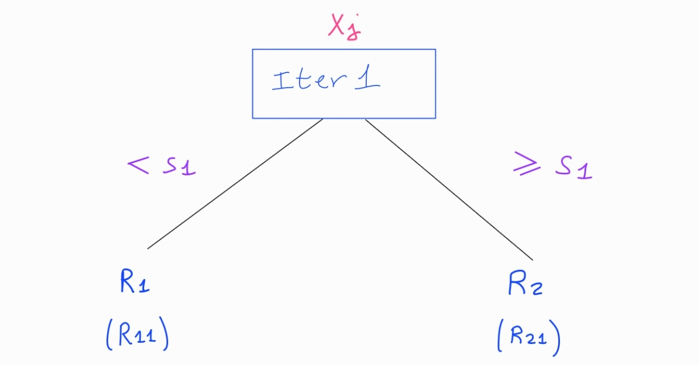
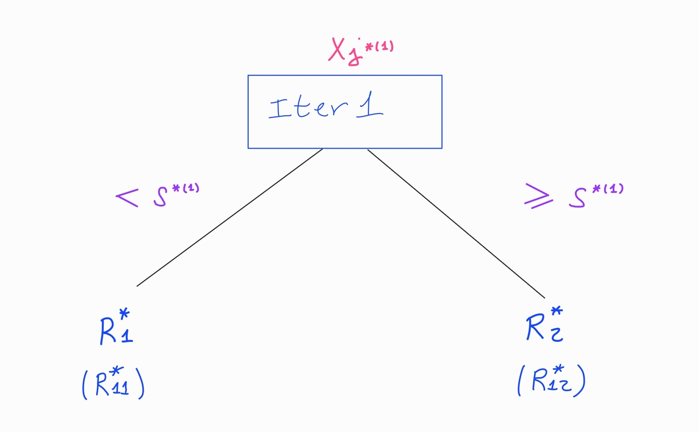
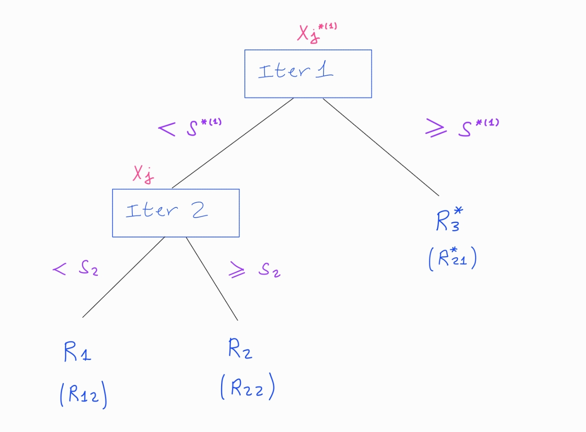
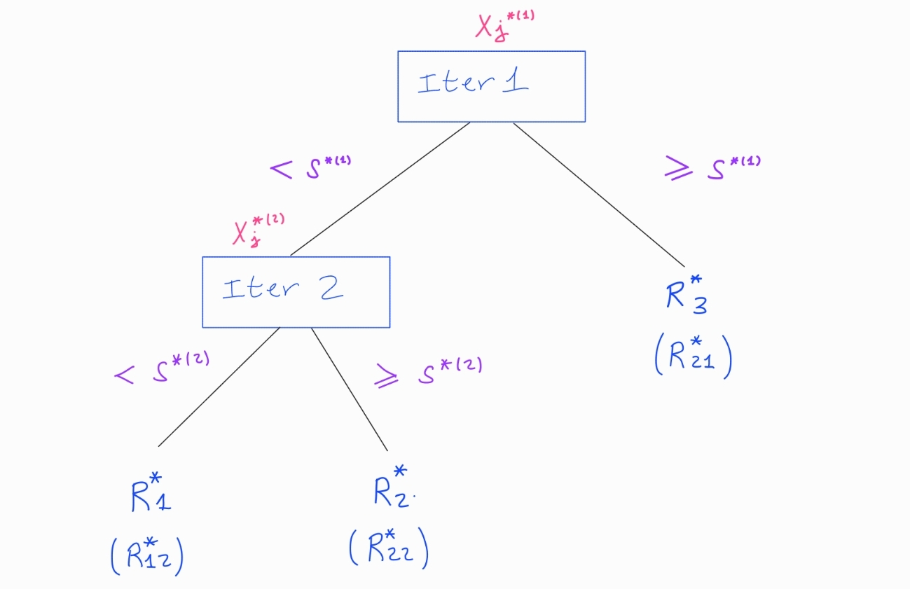
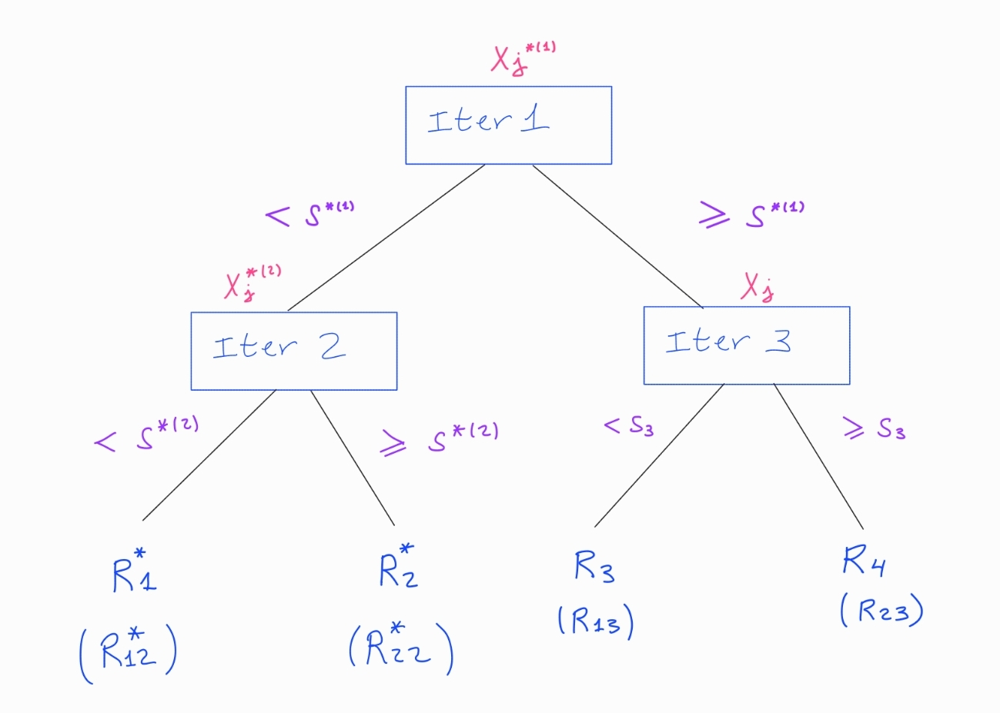
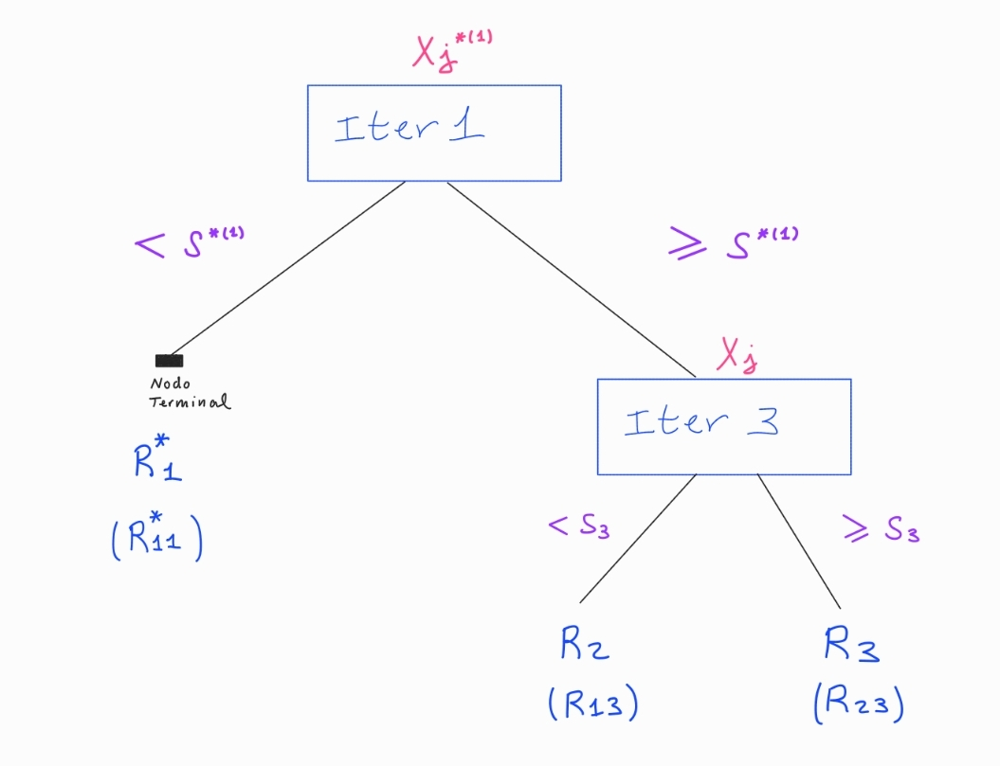
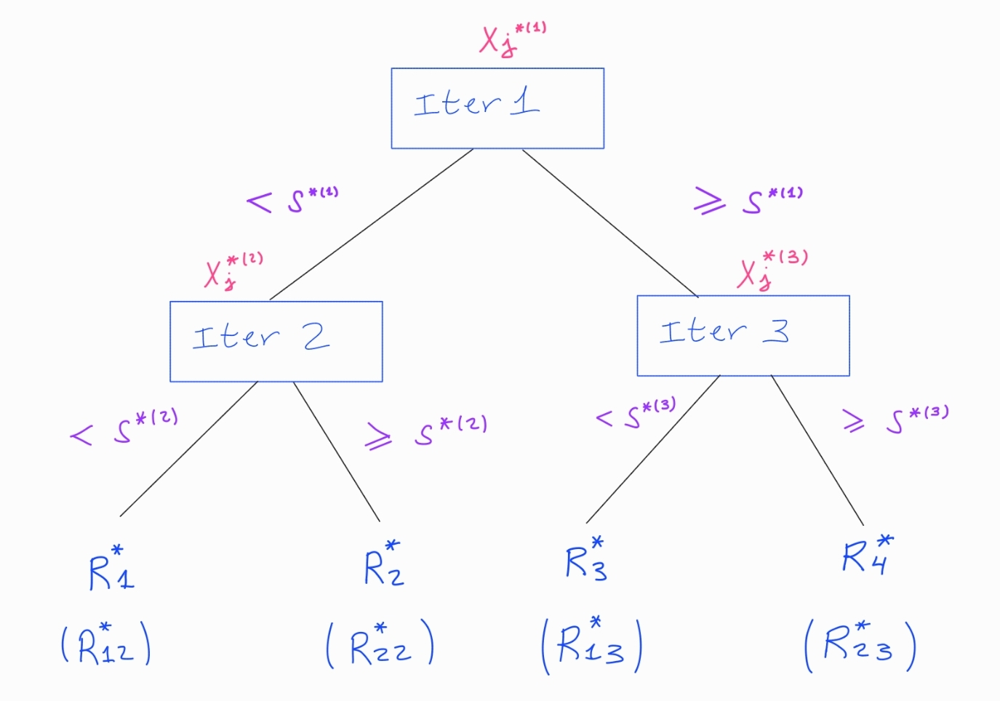
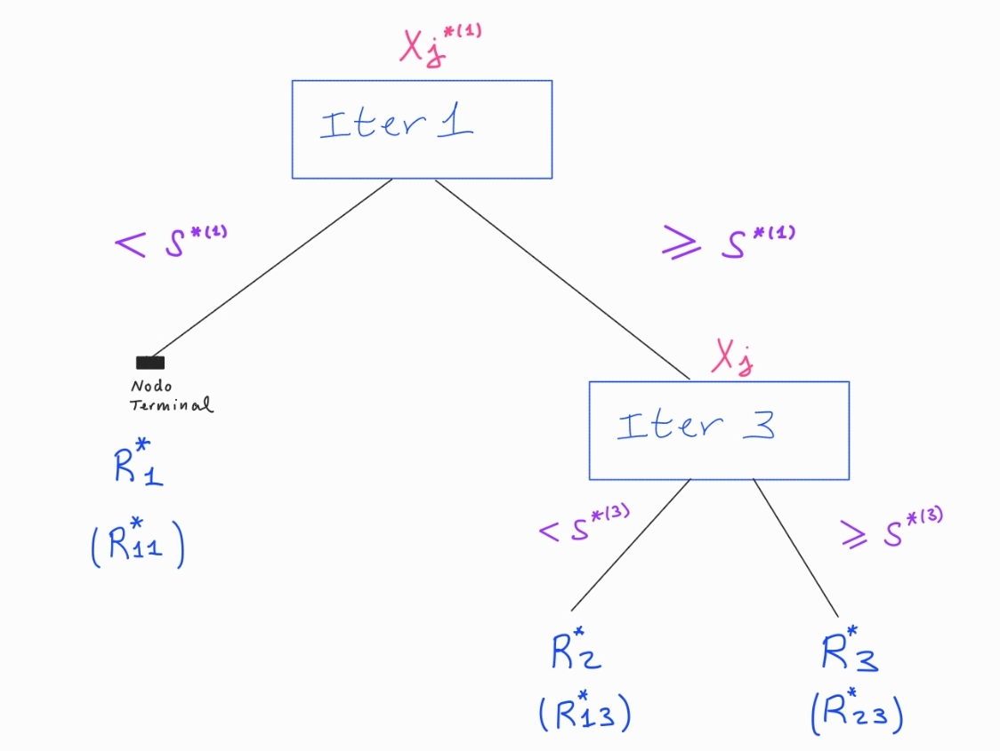

 

$\hspace{0.3cm}$ **Más artículos:    $\hspace{0.1cm}$ [Estadistica4all](https://fabioscielzoortiz.github.io/Estadistica4all.github.io/)**

$\hspace{0.3cm}$ **Autor:** $\hspace{0.1cm}$ [Fabio Scielzo Ortiz](http://estadistica4all.com/autores/autores.html)

$\hspace{0.3cm}$ **Si utilizas este artículo, por favor, cítalo:** 

$\hspace{0.5cm}$ Scielzo Ortiz, F. (2022). Regresión no lineal. http://estadistica4all.com/Articulos/KNN.html

 

***Se recomienda abrir el artículo en un ordenador o en una tablet.***
 
 

 

# Arboles de clasificación  

Los elementos iniciales de los que partimos son los siguientes:

- Se consideran $\hspace{0.1cm} p\hspace{0.1cm}$ predictores $\hspace{0.1cm}\mathcal{X}_1,...,\mathcal{X}_p\hspace{0.1cm}$ y una variable respuesta $\hspace{0.1cm}\mathcal{Y}\hspace{0.1cm}$ **categórica**. $\\[0.5cm]$

- Se tiene una muestra de observaciones $\hspace{0.1cm}X_r = (x_{1r},...,x_{nr})^t\hspace{0.1cm}$ de la variable $\hspace{0.1cm}\mathcal{X}_r\hspace{0.1cm}$ , para cada $\hspace{0.1cm}r \in \lbrace 1,...,p \rbrace$ $\\[0.5cm]$

- Se tiene una muestra de observaciones $\hspace{0.1cm}Y = (y_1,...,y_n)^t\hspace{0.1cm}$ de la variable $\hspace{0.1cm}\mathcal{Y}$ $\\[0.5cm]$

- En conclusión, se tiene una muestra de observaciones $\hspace{0.12cm}D=[\hspace{0.12cm}X_1,...,X_p,Y \hspace{0.12cm}]\hspace{0.12cm}$
de los predictores y la respuesta. 

Vamos a considerar el siguiente tipo de arboles (matemáticos):

    

Es importante tener en cuenta los elementos que estan reflejados, pues los usaremos posteriormente.

Los arboles estan compuestos de iteraciones, que a su vez cada una de ellas se dividen en dos tallos. La union de tallos de distintas iteraciones da lugar a las ramas del arbol.

\newpage

**Definicion formal de los arboles de clasificación**

La idea de los algoritmos de arboles de clasificacion es segmentar las observaciones de los predictores $X_1,...,X_p$ para predecir el valor de la variable respuesta en base a esa informacion segmentada. Es algo asi como predecir la respuesta por grupos/segmentos.
  

  **Elementos Básicos**

- Tenemos unos predictores $\hspace{0.1cm} X_1,...,X_p \hspace{0.1cm}$ y una variable respuesta **categorica** $\hspace{0.1cm} Y$

- Tenemos un arbol $\hspace{0.1cm} T \hspace{0.1cm}$  de la forma del expuesto en la imagen con $\hspace{0.1cm} m-1 \hspace{0.1cm}$ iteraciones y $\hspace{0.1cm} m \hspace{0.1cm}$ ramas.

- $r_{h}$ es la rama $h$-esima del arbol 
  
-  Cada iteracion del arbol tiene asociado uno de los predictores $\hspace{0.07cm} X_1,...,X_n$
  
- Cada iteracion del arbol tiene dos tallos (tallo 1 (izquierdo) y tallo 2 (derecho)).

- En cada tallo de una iteracion se define un intervalo. 

- $\hspace{0.1cm} I_{lt} \hspace{0.1cm}$ es el intervalo asociado al tallo $l$ de la iteracion $\hspace{0.1cm} t$

- Para simplificar el problema consideraremos $\hspace{0.1cm} I_{1t} = (-\infty \hspace{0.03cm},\hspace{0.03cm} s_t)\hspace{0.1cm}$  y $\hspace{0.1cm} I_{2t} = [s_t \hspace{0.03cm},\hspace{0.03cm} \infty]\hspace{0.1cm}$ donde $\hspace{0.1cm} s_t \hspace{0.1cm}$ es llamado punto de corte de la iteracion $\hspace{0.1cm} t \hspace{0.1cm}$ del arbol

- $R_{h} \hspace{0.1cm}$ es la region (rectangulo $n$-dimensional) definida por la rama $\hspace{0.1cm} h \hspace{0.1cm}$    del  arbol

\newpage

 **Criterio de prediccion de la variable respuesta**

Dada una nueva observacion $\hspace{0.1cm} x_{new}= (x_{new,1},x_{new,2},...,x_{new,p} ) \hspace{0.1cm}$ la idea es predecir $\hspace{0.1cm} y_{new} \hspace{0.1cm}$ como sigue:

Sea $\hspace{0.1 cm} f_{r, R_{h}} \hspace{0.1 cm}$ la frecuencia relativa de la clase/grupo $r$ en la rama $h$-esima del arbol. 

Es decir, es la proporcion  de individuos de la muestra de entrenamiento que caen en la rama $h$ del arbol y que pertenecen a la clase $r$ (es decir, para los que $Y=r$ ) : 

$$ \hspace{0.1 cm} f_{r , R_{h }} \hspace{0.1 cm} = \hspace{0.1 cm} \dfrac{\# \hspace{0.1 cm}\lbrace i \hspace{0.1 cm}/\hspace{0.1 cm} x_i \in R_{h } \hspace{0.15 cm}\text{y}\hspace{0.15 cm} y_i = r \rbrace}{\# \hspace{0.1 cm}\lbrace i \hspace{0.1 cm}/\hspace{0.1 cm} x_i \in R_{h }  \rbrace} $$

\vspace{0.5cm}

Donde: $\hspace{0.25cm} r \in Rango(Y) = \lbrace 0,1,..,c-1 \rbrace$

\vspace{0.7cm}

  - $Si \hspace{0.3cm} x_{new} \in R_{h } \hspace{0.15cm}  \Rightarrow  \hspace{0.15cm}$ $x_{new}$ es clasificado en la clase/grupo mayoritaria (más frecuente) en la rama $h$ $(r_h)$

\vspace{0.5cm}

Por tanto:

 - $\hspace{0.4 cm} Si \hspace{0.22 cm} r_{R_{h }}^*  \hspace{0.05 cm}= \hspace{0.05 cm} \underset{\hspace{0.7 cm} r}{arg \hspace{0.1 cm} Max} \hspace{0.05 cm} \left(\hspace{0.1 cm} f_{r, R_{h }} \hspace{0.1 cm}\right) \hspace{0.2 cm} ,\hspace{0.05 cm} entonces:$  

 $$Si \hspace{0.3cm} x_{new} \in R_h \hspace{0.22cm}  \Rightarrow  \hspace{0.22cm}  \widehat{y}_{new} = r_{R_{h }}^*$$

\vspace{0.7cm}

*Observación:*

Definida la region $\hspace{0.05 cm} R_{h} \hspace{0.05 cm}$ , es relativamente sencillo resolver el problema $\hspace{0.05 cm} \underset{  r}{    Max} \hspace{0.05 cm} \left(\hspace{0.1 cm} f_{r, R_{h }} \hspace{0.1 cm}\right)  \hspace{0.05 cm}$  y asi obtener $\hspace{0.05 cm}  r_{R_{h }}^*$

\newpage

 **Objetivo** : Usando la **tasa de error de clasificacion** como métrica a optimizar

\vspace{0.35cm}

Definimos el **error de entrenamiento de la rama $h$ de un arbol de clasificacion** como la tasa de error de clasificacion para las observaciones de entrenamiento que caen en la rama $h$ de dicho arbol, es decir, como:

$$TEC(R_{h }) = 1 - f_{r^*_{R_{h }} , R_{h }}$$

\vspace{0.35cm}

*Observación:*

$f_{r^*_{R_{h}} , R_{h}}$ es la proporcion de individuos de la muestra de entrenamiento que caen en la rama $h$ del arbol y que son de la clase/grupo $r^*_{R_{h}}$ (el valor de la variable respuesta para ellos es $r^*_{R_{h }}$)

Como  el modelo clasifica a los que caen en esa rama como de la clase $r^*_{R_{h }}$ , es decir, como la predición de la respuesta para todo individuo que pertenezaca a esa rama es $r^*_{R_{h}}$ , por parte del modelo, entonces se tiene lo siguiente:

$f_{r^*_{R_{h}} , R_{h}}$ es la proporcion de individuos de la muestra de entrenamiento que caen en la rama $h$ del arbol  que son correctamente clasificados por el modelo (proporcion de individuos de la region $R_{h }$ a los que se les ha predicho bien la respuesta).

$TEC(R_{h})$ es la proporcion de individuos de la muestra de entrenamiento que caen en la rama $h$ del arbol   $($ sus observaciones de los predictores pertenecen a $R_{h}$ $)$ y que han sido clasificados erroneamente. Se les ha clasificado en la clase $r^*_{R_{h}}$ y su clase era otra diferente, es decir, tenian un valor distinto a $r^*_{R_{h}}$ para la variable respeusta, que es el valor que el modelo les predice para la respuesta.

\vspace{0.35cm}

Definimos el **error global de entrenamiento de un arbol de clasificación** como la suma de los errores de entrenamiento de las ramas del arbol de clasificación: 

$$\sum_{h=1}^{m} \hspace{0.1cm} TEC(R_h) $$

\vspace{0.35cm}

El **objetivo** es construir un arbol de regresion con $m$ ramas tal que **minimice** el **error global de entrenamiento**. 

Es decir, formalmente el objetivo es:

$$ \underset{R_1,..,R_m}{Min}  \hspace{0.12cm}  \sum_{h=1}^{m} \hspace{0.1cm} TEC(R_h)  $$

\vspace{0.35cm}

Pero para escoger las regiones $\hspace{0.1cm} R_1,...,R_m \hspace{0.1cm}$ que definen las ramas del arbol  hay que determinar dos elementos que definen a su vez a las regiones:

$1.\hspace{0.1cm}$ Qué predictores estan asociados a cada iteracion del arbol $\hspace{0.1cm} \Rightarrow \hspace{0.1cm}$ Para cada iteracion escoger $X_j \hspace{0.01cm}$ $(\hspace{0.01cm}$ es decir, escoger $j \hspace{0.01cm})$
   
$2.\hspace{0.1cm}$ Qué intervalos estan asociados a cada uno de los dos tallos de cada interaccion $\hspace{0.1cm} \Rightarrow \hspace{0.1cm}$ Para cada iteracion $i$ escoger $I_{1i}$ y $I_{2i}\hspace{0.1cm}$ $(\hspace{0.01cm}$ es decir, escoger el punto de corte $\hspace{0.07cm}s_i \hspace{0.04cm} )$
   

Por tanto el porblema a resolver se puede reformular como:

Para cada iteracion $\hspace{0.1cm} i \hspace{0.1cm}$ escoger $\hspace{0.1cm} X_j\hspace{0.01cm}$ $(\hspace{0.05cm}$ es decir $\hspace{0.01cm}j \hspace{0.05cm})\hspace{0.05cm}$ y  $\hspace{0.1cm} s_i \hspace{0.1cm}$ tal que se acaben formando un arbol cuyas ramas definan unas regiones $\hspace{0.1cm}R_1,...,R_m\hspace{0.1cm}$ que **minimicen** $\hspace{0.1cm}\sum_{h=1}^{m} \hspace{0.1cm} TEC(R_h)$

\vspace{1.5cm}

 **Objetivo** : Usando el **índice de Gini** como métrica a optimizar

\vspace{0.35cm}

Definimos el **error de entrenamiento de la rama $h$ de un arbol de clasificacion con $t$ iteraciones** como el índice de Gini de la respuesta en la rama $h$ del arbol (indice de gini de la respuesta en la region $R_{h }$)  , es decir, como:

$$ G_{R_{ht}} = \sum_{r=0,1,..,c-1}^{} f_{r , R_{ h}}\cdot(1 - f_{r , R_{h }}) $$

\vspace{0.35cm}

Donde: $\hspace{0.15cm} Rango(Y) = \lbrace 0,1,...,c-1 \rbrace$

\vspace{0.35cm}

$G_{R_{h }}$  toma valores pequeños cuando la frecuencia de una clase $r=0,1,...$ en la region $R_{h }$ es alta , y por tanto la del resto baja.

$G_{R_{h }}$ toma valores altos cuando las frecuencias de las clases se reparten de manera "igualitaria" en la region $R_{h }$. Y cuanto mas igualitaria es la reparticion de las classes, mas alto es $G_{R_{h }}$ . Hasta el punto que cuando la reparticion es totalmente igualitaria, esto es, cada clase tiene la misma frecuencia , si hay $c$ clases, cada una tiene una frecuencia relativa de $1/c$ en la region, entonces en indicide de Gini alcanza su maximo valor.

\vspace{0.35cm}

*Ejemplo:*

\vspace{0.2cm}

Para $\hspace{0.1 cm} c=3$  $\hspace{0.15cm} ( Rango(Y)=\lbrace 0,1,2 \rbrace )$ 

Si tenemos: $\hspace{0.15cm} f_{0 , R_{ht}} = 0.40 \hspace{0.15cm}$ , $\hspace{0.15cm} f_{1 , R_{ht}}=0.30 \hspace{0.15cm}$ y $\hspace{0.15cm} f_{2 , R_{ht}}=0.30$ $\hspace{0.15cm} \Rightarrow \hspace{0.15cm}$  $G_{R_{ht}} = 0.66$

Si tenemos: $\hspace{0.15cm} f_{0 , R_{ht}} = 0.80 \hspace{0.15cm}$ , $\hspace{0.15cm} f_{1 , R_{ht}}=0.10 \hspace{0.15cm}$ y $\hspace{0.15cm} f_{2 , R_{ht}}=0.10$ $\hspace{0.15cm} \Rightarrow \hspace{0.15cm}$  $G_{R_{ht}} = 0.34$

Si tenemos: $\hspace{0.15cm} f_{0 , R_{ht}} = 0.9 \hspace{0.15cm}$ , $\hspace{0.15cm} f_{1 , R_{ht}}=0.05 \hspace{0.15cm}$ y $\hspace{0.15cm} f_{2 , R_{ht}}=0.05$ $\hspace{0.15cm} \Rightarrow \hspace{0.15cm}$  $G_{R_{ht}} = 0.185$

\vspace{0.35cm}

Teniendo esto en cuenta nos interesan que en cada rama (region $R_{h }$) la frecuencia de la clase mayoritaria sea lo mayor posible, y eso equivale a que el indice de Gini sea lo menos posible dentro de cada rama, siguiendo la filosofia empleada con la $TEC$, donde nos interesaba que  $f_{r^*_{R_{h }} , R_{h }}$ fuese lo mayor posible en cada rama.

\newpage

Definimos el **error global de entrenamiento de un arbol de clasificación** como la suma de los errores de entrenamiento de las ramas del arbol de clasificación:  

$$\sum_{h=1}^{m} \hspace{0.1cm} G_{R_{h }} $$

\vspace{0.35cm}

El **objetivo** es construir un arbol de regresion con $m$ ramas tal que **minimice** el **error global de entrenamiento**. 

Es decir, formalmente el objetivo es:

$$ \underset{R_1,..,R_m}{Min}  \hspace{0.12cm}  \sum_{h=1}^{m} \hspace{0.1cm} G_{R_{h }}  $$

\vspace{0.35cm}

En el fondo minimizar el error de clasificacion de un arbol de clasificacion equivale a minimizar el indice de Gini en las ramas del arbol conjuntamente (a nivel global).

\vspace{0.35cm}

Pero para escoger las regiones $\hspace{0.1cm} R_1,...,R_m \hspace{0.1cm}$ que definen las ramas del arbol  hay que determinar dos elementos que definen a su vez a las regiones:

$1.\hspace{0.1cm}$ Qué predictores estan asociados a cada iteracion del arbol $\hspace{0.1cm} \Rightarrow \hspace{0.1cm}$ Para cada iteracion $i$ escoger $X_j \hspace{0.01cm}$ $(\hspace{0.01cm}$ es decir, escoger $j \hspace{0.01cm})$
   
$2.\hspace{0.1cm}$ Qué intervalos estan asociados a cada uno de los dos tallos de cada interaccion $\hspace{0.1cm} \Rightarrow \hspace{0.1cm}$ Para cada iteracion $i$  escoger el punto de corte $\hspace{0.07cm}s_i \hspace{0.04cm} )$
   
\vspace{0.35cm}

Por tanto el porblema a resolver se puede reformular como:

Para cada iteracion $\hspace{0.1cm} i \hspace{0.1cm}$ escoger $\hspace{0.1cm} X_j\hspace{0.01cm}$ $(\hspace{0.05cm}$ es decir $\hspace{0.01cm}j \hspace{0.05cm})\hspace{0.05cm}$ y   $\hspace{0.1cm} s_i \hspace{0.1cm}$ tal que se acaben formando un arbol cuyas ramas definan unas regiones $\hspace{0.1cm}R_1,...,R_m\hspace{0.1cm}$ que **minimicen** $\hspace{0.1cm}\sum_{h=1}^{m} \hspace{0.1cm} G_{R_{h }}$

\newpage

**Propuesta de algoritmo para la resolución del problema: algoritmo de partición binaria**

Consiste en ir generando el arbol de manera secuencial, iteracion a iteracion, minimizando en cada paso el error de clasificacion para las observaciones de train que caen en las ramas asociadas a la iteracion en cuestion que esta siendo optimizada.

El algoritmo se basa en la resolucion secuencial de problemas de minimizacion, uno por cada iteracion tenga el arbol que se acabará generando.

\vspace{0.2cm}

Para entender el funcionamiento del algoritmo es recomendable tener en mente un arbol como este:

{height=400px width=520px}

\newpage

**Problema de la Iteración 1**

Arbol en el problema de la Iteración 1:

{height=400px width=520px}

\vspace{0.3cm}

La idea es, determinar las regiones $R_{11}$ y $R_{21}\hspace{0.1cm}$ $($ es decir, $j$ y $s_1 \hspace{0.05cm}) \hspace{0.1cm}$  del arbol de la figura 16  que minimizan el error de entrenamiento global de dicho arbol.

Formalmente:

- Si utilizamos la **TEC** como metrica de error a minimizar:

\begin{gather*}
\underset{R_{11}  ,  R_{21}}  {Min} \hspace{0.15cm} \left(\hspace{0.1cm} TEC(R_{11}) + TEC(R_{21})  \hspace{0.1cm}\right)   \hspace{0.1cm} =   \\ \\
=\hspace{0.2cm} \underset{R_{11}  ,  R_{21}}  {Min} \hspace{0.1cm} \left( \hspace{0.2cm}  \left( 1 - f_{r^*_{R_{11}} , R_{11}} \right)  \hspace{0.3cm} +  \hspace{0.1cm}    \left( 1 - f_{r^*_{R_{21}} , R_{21}} \right)  \hspace{0.2cm} \right)     \\ \\
=\hspace{0.2cm}   \underset{R_{11}  ,  R_{21}}  {Min} \hspace{0.1cm} \left( \hspace{0.2cm}    1 - \dfrac{\# \hspace{0.1 cm}\lbrace i \hspace{0.1 cm}/\hspace{0.1 cm} x_i \in R_{11} \hspace{0.15 cm}\text{y}\hspace{0.15 cm} y_i = r^*_{R_{11}} \rbrace}{\# \hspace{0.1 cm}\lbrace i \hspace{0.1 cm}/\hspace{0.1 cm} x_i \in R_{11}  \rbrace}  \hspace{0.3cm} +  \hspace{0.3cm}      1 - \dfrac{\# \hspace{0.1 cm}\lbrace i \hspace{0.1 cm}/\hspace{0.1 cm} x_i \in R_{21} \hspace{0.15 cm}\text{y}\hspace{0.15 cm} y_i = r^*_{R_{21}} \rbrace}{\# \hspace{0.1 cm}\lbrace i \hspace{0.1 cm}/\hspace{0.1 cm} x_i \in R_{21}  \rbrace}   \hspace{0.2cm} \right)     \\ \\
=\hspace{0.2cm}   \underset{j  ,  s_1}  {Min} \hspace{0.1cm} \left( \hspace{0.2cm}    1 - \dfrac{\# \hspace{0.1 cm}\lbrace i \hspace{0.1 cm}/\hspace{0.1 cm} x_i < s_1 \hspace{0.15 cm}\text{y}\hspace{0.15 cm} y_i = r^*_{R_{11}} \rbrace}{\# \hspace{0.1 cm}\lbrace i \hspace{0.1 cm}/\hspace{0.1 cm} x_i < s_1  \rbrace} \hspace{0.3cm} +  \hspace{0.3cm}      1 - \dfrac{\# \hspace{0.1 cm}\lbrace i \hspace{0.1 cm}/\hspace{0.1 cm} x_i \geqslant s_1 \hspace{0.15 cm}\text{y}\hspace{0.15 cm} y_i = r^*_{R_{21}} \rbrace}{\# \hspace{0.1 cm}\lbrace i \hspace{0.1 cm}/\hspace{0.1 cm} x_i \geqslant s_1 \rbrace}    \hspace{0.2cm} \right)    
\end{gather*}

\newpage

- Si utilizamos el **índice de Gini** como metrica de error a minimizar:

\begin{gather*}
\underset{R_{11}  ,  R_{21}}  {Min} \hspace{0.15cm} \left(\hspace{0.1cm} G_1 = G_{R_{11}} + G_{R_{21}}  \hspace{0.1cm}\right)   \hspace{0.1cm} =   \\ \\
=\hspace{0.2cm} \underset{R_{11}  ,  R_{21}}  {Min} \hspace{0.1cm} \Biggl\{ \hspace{0.2cm}  \sum_{r=0,1,..,c-1}^{} f_{r , R_{11}}\cdot(1 - f_{r , R_{11}})  \hspace{0.1cm} + \hspace{0.1cm}  \sum_{r=0,1,..,c-1}^{} f_{r , R_{21}}\cdot(1 - f_{r , R_{21}})   \hspace{0.2cm} \Biggl\}     \\ \\ 
=\hspace{0.2cm}   \underset{R_{11}  ,  R_{21}}  {Min} \hspace{0.1cm} \Biggl\{\hspace{0.2cm}   \sum_{r=0,1,..,c-1}^{}  \dfrac{\# \hspace{0.1 cm}\lbrace i \hspace{0.1 cm}/\hspace{0.1 cm} x_i \in R_{11} \hspace{0.15 cm}\text{y}\hspace{0.15 cm} y_i = r  \rbrace}{\# \hspace{0.1 cm}\lbrace i \hspace{0.1 cm}/\hspace{0.1 cm} x_i \in R_{11}  \rbrace}  \cdot \left(   1 - \dfrac{\# \hspace{0.1 cm}\lbrace i \hspace{0.1 cm}/\hspace{0.1 cm} x_i \in R_{11} \hspace{0.15 cm}\text{y}\hspace{0.15 cm} y_i = r  \rbrace}{\# \hspace{0.1 cm}\lbrace i \hspace{0.1 cm}/\hspace{0.1 cm} x_i \in R_{11}  \rbrace}  \right) \\ \\
\hspace{0.3cm} +  \hspace{0.3cm}         \sum_{r=0,1,..,c-1}^{}  \dfrac{\# \hspace{0.1 cm}\lbrace i \hspace{0.1 cm}/\hspace{0.1 cm} x_i \in R_{21} \hspace{0.15 cm}\text{y}\hspace{0.15 cm} y_i = r  \rbrace}{\# \hspace{0.1 cm}\lbrace i \hspace{0.1 cm}/\hspace{0.1 cm} x_i \in R_{21}  \rbrace}  \cdot \left(   1 - \dfrac{\# \hspace{0.1 cm}\lbrace i \hspace{0.1 cm}/\hspace{0.1 cm} x_i \in R_{21} \hspace{0.15 cm}\text{y}\hspace{0.15 cm} y_i = r  \rbrace}{\# \hspace{0.1 cm}\lbrace i \hspace{0.1 cm}/\hspace{0.1 cm} x_i \in R_{21}  \rbrace}  \right)            \hspace{0.2cm} \Biggl\}     \\ \\
=\hspace{0.2cm}   \underset{j  ,  s_1}  {Min} \hspace{0.1cm} \Biggl\{     \sum_{r=0,1,..,c-1}^{}  \dfrac{\# \hspace{0.1 cm}\lbrace i \hspace{0.1 cm}/\hspace{0.1 cm} x_{ij} < s_1 \hspace{0.15 cm}\text{y}\hspace{0.15 cm} y_i = r  \rbrace}{\# \hspace{0.1 cm}\lbrace i \hspace{0.1 cm}/\hspace{0.1 cm} x_{ij} < s_1  \rbrace}  \cdot \left(   1 - \dfrac{\# \hspace{0.1 cm}\lbrace i \hspace{0.1 cm}/\hspace{0.1 cm} x_{ij} < s_1 \hspace{0.15 cm}\text{y}\hspace{0.15 cm} y_i = r  \rbrace}{\# \hspace{0.1 cm}\lbrace i \hspace{0.1 cm}/\hspace{0.1 cm} x_{ij} < s_1  \rbrace}  \right) \\ \\
\hspace{0.3cm} +  \hspace{0.3cm}         \sum_{r=0,1,..,c-1}^{}  \dfrac{\# \hspace{0.1 cm}\lbrace i \hspace{0.1 cm}/\hspace{0.1 cm} x_{ij} \geqslant s_1 \hspace{0.15 cm}\text{y}\hspace{0.15 cm} y_i = r \rbrace}{\# \hspace{0.1 cm}\lbrace i \hspace{0.1 cm}/\hspace{0.1 cm} x_{ij} \geqslant s_1 \rbrace}  \cdot \left(   1 - \dfrac{\# \hspace{0.1 cm}\lbrace i \hspace{0.1 cm}/\hspace{0.1 cm} x_{ij} \geqslant s_1 \hspace{0.15 cm}\text{y}\hspace{0.15 cm} y_i = r \rbrace}{\# \hspace{0.1 cm}\lbrace i \hspace{0.1 cm}/\hspace{0.1 cm} x_{ij} \geqslant s_1 \rbrace}  \right)           \Biggl\} 
\end{gather*}

\vspace{1cm}

- Denotaremos por $\hspace{0.1cm} \left(\hspace{0.1cm} j^{*(i)} \hspace{0.05cm},\hspace{0.05cm} s^{*(i)} \hspace{0.1cm}\right) \hspace{0.1cm}$ a una solución del problema de la Iteración $i$  

\vspace{0.3cm}

- Criterio de parada: *hiperparámetro* $k$

\vspace{0.2cm}

  >Si $\hspace{0.1cm} \# \lbrace i=1,..,n \hspace{0.1cm} / \hspace{0.1cm}  x_i \in R_{11}^* \rbrace \hspace{0.1cm}  < k \Rightarrow \hspace{0.1cm}$ No se resuleve el problema de la Iteración 2 (ni por tanto los de aquellas que nazcan bajo la Iteración 2: Iteraciones 4, 5, 8, 9, 10, 11 etc)

 > Si $\hspace{0.1cm} \# \lbrace i=1,..,n \hspace{0.1cm} / \hspace{0.1cm}  x_i \in R_{11}^* \rbrace \hspace{0.1cm} \geqslant k \Rightarrow \hspace{0.1cm}$ Si se resuleve el problema de la Iteración 2 (lo cual no implica que se vayan a resolver los problemas de otras Iteraciones).

  > Si $\hspace{0.1cm} \# \lbrace i=1,..,n \hspace{0.1cm} / \hspace{0.1cm}  x_i \in R_{21}^* \rbrace \hspace{0.1cm}  < k \Rightarrow \hspace{0.1cm}$ No se resuleve el problema de la Iteración 3 (ni por tanto los de aquellas que nazcan bajo la Iteración 3: Iteraciones 6,7,12,13,14,15 etc)

 > Si $\hspace{0.1cm} \# \lbrace i=1,..,n \hspace{0.1cm} / \hspace{0.1cm}  x_i \in R_{21}^* \rbrace \hspace{0.1cm} \geqslant k \Rightarrow \hspace{0.1cm}$ Si se resuleve el problema de la Iteración 3 (lo cual no implica que se vayan a resolver los problemas de otras Iteraciones).

La idea es que si caen menos de k observaciones de entrenamiento en la "nueva" rama optimizada $R_{11}^*$ , entonces el algoritmo no debe partir el nodo Iteracion 2 , es decir, no se debe resolver el porblema de la Iteracion 2, y por tanto no se deben ni tan siqueira generar los nodos que nacen bajo el nodo Iteracion 2 (a saber, los nodos Iteraciones  4, 5, 8, 9, 10, 11 etc). El razonamiento es analogo para el criterio de parada con $R_{21}^*$

\newpage

Arbol tras la resolución del problema de la Iteración 1:

{height=400px width=520px}

\vspace{1cm}

**Observaciones relevantes del problema :**

- $\hspace{0.2cm} j \in \lbrace  1,2,...,p \rbrace$

- Si $X_j$ es cuantitativa:

 $\hspace{1.5cm}$  Ordenamos las observaciones de $X_j$ y quitamos repeticiones, obtenemos $X_j^{order}$, entonces:

$$s_1 \in \Biggl\{ \dfrac{ x_{(1)j} + x_{(2)j} }{2} \hspace{0.1cm}, \hspace{0.1cm} \dfrac{x_{(2)j} + x_{(3)j} }{2} \hspace{0.1cm} ,...,\hspace{0.1cm} \dfrac{x_{(n-1)j} + x_{(n)j} }{2}   \Biggl\}$$

Donde $\hspace{0.1cm} x_{(i)j} \hspace{0.1cm}$ es la observacion que ocupa la posicion $i$-esima en $\hspace{0.1cm}  X_j^{order}$

- Si $X_j$ es categorica con $c$ categorias:

$$ s_1 \in Rango(X_j) = \lbrace 0,1,..., c-1 \rbrace $$ 

\vspace{0.2cm}

Notese que la eleccion de $X_j$ determina el campo de variacion de $s_1$

\vspace{0.5cm}

Notar que:

\vspace{0.3cm}

- $R_{11} = \lbrace  (v_1 ,..., v_p) / v_j < s_1 \rbrace   \hspace{0.3cm}\Rightarrow\hspace{0.3cm}  [\hspace{0.1cm}  x_i=(x_{i1},...,x_{ip}) \in R_{11}  \hspace{0.1cm} \Leftrightarrow \hspace{0.1cm} x_{ij} < s_1 \hspace{0.1cm}] \\ \\ \hspace{0.3cm}\Rightarrow\hspace{0.3cm} \lbrace i/x_i \in R_{11} \rbrace  = \lbrace i / x_{ij} < s_1 \rbrace$  

\vspace{0.2cm}

- $R_{21} = \lbrace  (v_1 ,..., v_p) / v_j \geqslant s_1 \rbrace   \hspace{0.3cm}\Rightarrow\hspace{0.3cm} [\hspace{0.1cm} x_i=(x_{i1},...,x_{ip}) \in R_{21} \hspace{0.1cm} \Leftrightarrow \hspace{0.1cm} x_{ij} \geqslant s_1 \hspace{0.1cm}] \\ \\ \hspace{0.2cm}\Rightarrow\hspace{0.2cm} \lbrace i/x_i \in R_{11} \rbrace  = \lbrace i / x_{ij} \geqslant s_1 \rbrace$  

\vspace{0.5cm}

Notese que determinar $R_{11}$ y $R_{21}$  es equivalente a determinar el predictor $X_j$ $($ es decir $j)$  y el punto de corte $s_1$ asociados a la Iteracion 1, ya que $R_{11}$ y $R_{21}$ quedan determinadas al fijar $X_j$ y $s_1$

\vspace{0.5cm}

Notar también que:

\vspace{0.3cm}

- Fijado $(j, s_1)$ puede calcularse $r_{R_{11}}^*$ como solucion al problema de maximizacion:

$$\underset{  r}{ Max} \hspace{0.05 cm} \left(\hspace{0.1 cm} f_{r, R_{11}} \hspace{0.1 cm}\right) = \underset{ r}{ Max} \hspace{0.05 cm} \left(\hspace{0.1 cm}   \dfrac{\# \hspace{0.1 cm}\lbrace i \hspace{0.1 cm}/\hspace{0.1 cm} x_i \in R_{11} \hspace{0.15 cm}\text{y}\hspace{0.15 cm} y_i = r \rbrace}{\# \hspace{0.1 cm}\lbrace i \hspace{0.1 cm}/\hspace{0.1 cm} x_i \in R_{11}  \rbrace}  \hspace{0.1 cm}\right) = \underset{  r}{ Max} \hspace{0.05 cm} \left(\hspace{0.1 cm}   \dfrac{\# \hspace{0.1 cm}\lbrace i \hspace{0.1 cm}/\hspace{0.1 cm} x_{ij} < s_1 \hspace{0.15 cm}\text{y}\hspace{0.15 cm} y_i = r \rbrace}{\# \hspace{0.1 cm}\lbrace i \hspace{0.1 cm}/\hspace{0.1 cm} x_{ij} < s_1 \rbrace}  \hspace{0.1 cm}\right)$$

\vspace{0.2cm}

- Fijado $(j, s_2)$ puede calcularse $r_{R_{21}}^*$ como solucion al problema de maximizacion:

$$\underset{  r}{ Max} \hspace{0.05 cm} \left(\hspace{0.1 cm} f_{r, R_{21}} \hspace{0.1 cm}\right) = \underset{ r}{ Max} \hspace{0.05 cm} \left(\hspace{0.1 cm}   \dfrac{\# \hspace{0.1 cm}\lbrace i \hspace{0.1 cm}/\hspace{0.1 cm} x_i \in R_{21} \hspace{0.15 cm}\text{y}\hspace{0.15 cm} y_i = r \rbrace}{\# \hspace{0.1 cm}\lbrace i \hspace{0.1 cm}/\hspace{0.1 cm} x_i \in R_{21}  \rbrace}  \hspace{0.1 cm}\right) = \underset{  r}{ Max} \hspace{0.05 cm} \left(\hspace{0.1 cm}   \dfrac{\# \hspace{0.1 cm}\lbrace i \hspace{0.1 cm}/\hspace{0.1 cm} x_{ij} \geqslant s_1 \hspace{0.15 cm}\text{y}\hspace{0.15 cm} y_i = r \rbrace}{\# \hspace{0.1 cm}\lbrace i \hspace{0.1 cm}/\hspace{0.1 cm} x_{ij} \geqslant s_1 \rbrace}  \hspace{0.1 cm}\right)$$

 

  
\vspace{0.5cm}

Estos elementos no volveran a ser definidos ni comentados en los sucesivos problemas de iteracion para no pecar de ser repetitivos, puesto que pueden ser facilmente extrapolados a cualquier problema de iteración. Ademas las definiciones generales de estos elementos han sido expuestas ya anteriormente.

\newpage

**Problema de la Iteración 2**

Si estamos en este problema es porque la rama $R_{11}^*$ del arbol resultante del problema de la Iteracion 1 tiene $k$ o más observaciones de entrenamiento.

\vspace{0.2cm}

Arbol en el problema de la Iteracion 2:

{height=400px width=520px}

\vspace{0.2cm}

La idea ahora es determinar las regiones $R_1=R_{12}$ , $R_2=R_{22}$ y $R_3 = R_{21}^*$  del arbol de la figura 18, (es decir, ya considerando la solucion del problema de la Iteración 1) , que minimizan el error de entrenamiento global de dicho arbol.

Notese que $R_3 = R_{21}^*$ ya esta determinada tras la resolucion del problema anterior, por ello  solo hay que determinar las regiones $R_{12}$ y $R_{22}$ óptimas (es decir, $j$ y $s_2$ óptimos)

\newpage

Mas formalmente el problema planteado es:

- Si utilizamos la **TEC** como metrica de error a minimizar:

\begin{gather*}
\underset{R_{12}  ,  R_{22},  R_{21}^*}  {Min} \hspace{0.15cm}  \Biggl\{ \hspace{0.1cm}  TEC(R_{12})  +  TEC(R_{22}) +  TEC(R_{21}^*) \hspace{0.1cm} \Biggl\}   \hspace{0.1cm} =   \\ \\
=\hspace{0.2cm} \underset{R_{12}  ,  R_{22}, R_{21}^*}  {Min} \hspace{0.1cm} \Biggl\{  \hspace{0.2cm}  \left( 1 - f_{r^*_{R_{12}} , R_{12}} \right)  \hspace{0.3cm} +  \hspace{0.1cm}       \left( 1 - f_{r^*_{R_{22}} , R_{22}} \right) \hspace{0.1cm} +  \hspace{0.1cm} \left( 1 - f_{r^*_{R_{21}^*} , R_{21}^*} \right)  \hspace{0.2cm}  \Biggl\}  \\ \\
=\hspace{0.2cm}   \underset{j \hspace{0.02cm},\hspace{0.02cm} s_2}  {Min} \hspace{0.1cm} \Biggl\{ \hspace{0.2cm}     1 - \dfrac{\# \hspace{0.1 cm}\lbrace i \hspace{0.1 cm}/\hspace{0.1 cm} x_i \in R_{12} \hspace{0.15 cm}\text{y}\hspace{0.15 cm} y_i = r^*_{R_{12}} \rbrace}{\# \hspace{0.1 cm}\lbrace i \hspace{0.1 cm}/\hspace{0.1 cm} x_i \in R_{12}  \rbrace}      \hspace{0.1cm} +  \hspace{0.1cm} 1 - \dfrac{\# \hspace{0.1 cm}\lbrace i \hspace{0.1 cm}/\hspace{0.1 cm} x_i \in R_{22} \hspace{0.15 cm}\text{y}\hspace{0.15 cm} y_i = r^*_{R_{22}} \rbrace}{\# \hspace{0.1 cm}\lbrace i \hspace{0.1 cm}/\hspace{0.1 cm} x_i \in R_{22}  \rbrace} \hspace{0.1cm} +    \hspace{0.1cm}   \\ \\ + \hspace{0.1 cm}   1 - \dfrac{\# \hspace{0.1 cm}\lbrace i \hspace{0.1 cm}/\hspace{0.1 cm} x_i \in R_{21}^* \hspace{0.15 cm}\text{y}\hspace{0.15 cm} y_i = r^*_{R_{21}^*} \rbrace}{\# \hspace{0.1 cm}\lbrace i \hspace{0.1 cm}/\hspace{0.1 cm} x_i \in R_{21}^*  \rbrace}  \hspace{0.2cm}  \Biggl\}   \\ \\
=\hspace{0.2cm}   \underset{j \hspace{0.02cm},\hspace{0.02cm} s_2}  {Min} \hspace{0.1cm} \Biggl\{ \hspace{0.2cm}     1 - \dfrac{\# \hspace{0.1 cm}\lbrace i \hspace{0.1 cm}/\hspace{0.1 cm}  x_{ij^{*(1)}} \hspace{0.05cm}   < \hspace{0.05cm} s^{*(1)} \hspace{0.25 cm}\text{y}\hspace{0.25 cm} x_{ij} \hspace{0.05cm}   < \hspace{0.05cm} s_2 \hspace{0.25 cm}\text{y}\hspace{0.25 cm} y_i = r^*_{R_{12}} \rbrace}{\# \hspace{0.1 cm}\lbrace i \hspace{0.1 cm} / \hspace{0.1 cm}  x_{ij^{*(1)}} \hspace{0.05cm}   < \hspace{0.05cm} s^{*(1)} \hspace{0.25 cm}\text{y}\hspace{0.25 cm} x_{ij} \hspace{0.05cm}   < \hspace{0.05cm} s_2  \hspace{0.1 cm} \rbrace }      \hspace{0.3cm} + 
\\  \\
1 -  \dfrac{\# \hspace{0.1 cm}\lbrace i \hspace{0.1 cm}/\hspace{0.1 cm}  x_{ij^{*(1)}} \hspace{0.05cm}   < \hspace{0.05cm} s^{*(1)} \hspace{0.25 cm}\text{y}\hspace{0.25 cm} x_{ij} \hspace{0.05cm}   \geqslant \hspace{0.05cm} s_2 \hspace{0.25 cm}\text{y}\hspace{0.25 cm} y_i = r^*_{R_{22}} \rbrace}{\# \hspace{0.1 cm}\lbrace i \hspace{0.1 cm} / \hspace{0.1 cm}  x_{ij^{*(1)}} \hspace{0.05cm}   < \hspace{0.05cm} s^{*(1)} \hspace{0.25 cm}\text{y}\hspace{0.25 cm} x_{ij} \hspace{0.05cm}   \geqslant \hspace{0.05cm} s_2  \hspace{0.1 cm} \rbrace } \hspace{0.3cm} +  \\ \\
1 - \dfrac{\# \hspace{0.1 cm}\lbrace i \hspace{0.1 cm}/\hspace{0.1 cm} x_{ij^{*(1)}} \geqslant s^{*(1)} \hspace{0.15 cm}\text{y}\hspace{0.15 cm} y_i = r^*_{R_{32}} \rbrace}{\# \hspace{0.1 cm}\lbrace i \hspace{0.1 cm}/\hspace{0.1 cm} x_{ij^{*(1)}} \geqslant s^{*(1)} \rbrace}  \hspace{0.2cm}  \Biggl\}
\\ \\  =\hspace{0.2cm}   \underset{j \hspace{0.02cm},\hspace{0.02cm} s_2}  {Min} \hspace{0.1cm} \Biggl\{   \hspace{0.2cm}    1 - \dfrac{\# \hspace{0.1 cm}\lbrace i \hspace{0.1 cm}/\hspace{0.1 cm}  x_{ij^{*(1)}} \hspace{0.05cm}   < \hspace{0.05cm} s^{*(1)} \hspace{0.25 cm}\text{y}\hspace{0.25 cm} x_{ij} \hspace{0.05cm}   < \hspace{0.05cm} s_2 \hspace{0.25 cm}\text{y}\hspace{0.25 cm} y_i = r^*_{R_{12}} \rbrace}{\# \hspace{0.1 cm}\lbrace i \hspace{0.1 cm} / \hspace{0.1 cm}  x_{ij^{*(1)}} \hspace{0.05cm}   < \hspace{0.05cm} s^{*(1)} \hspace{0.25 cm}\text{y}\hspace{0.25 cm} x_{ij} \hspace{0.05cm}   < \hspace{0.05cm} s_2  \hspace{0.1 cm} \rbrace }      \hspace{0.4cm} + \\ \\
\hspace{0.4cm}   1 -  \dfrac{\# \hspace{0.1 cm}\lbrace i \hspace{0.1 cm}/\hspace{0.1 cm}  x_{ij^{*(1)}} \hspace{0.05cm}   < \hspace{0.05cm} s^{*(1)} \hspace{0.25 cm}\text{y}\hspace{0.25 cm} x_{ij} \hspace{0.05cm}   \geqslant \hspace{0.05cm} s_2 \hspace{0.25 cm}\text{y}\hspace{0.25 cm} y_i = r^*_{R_{22}} \rbrace}{\# \hspace{0.1 cm}\lbrace i \hspace{0.1 cm} / \hspace{0.1 cm}  x_{ij^{*(1)}} \hspace{0.05cm}   < \hspace{0.05cm} s^{*(1)} \hspace{0.25 cm}\text{y}\hspace{0.25 cm} x_{ij} \hspace{0.05cm}   \geqslant \hspace{0.05cm} s_2  \hspace{0.1 cm} \rbrace }    \hspace{0.2cm}  \Biggl\} \\  \\
=\hspace{0.2cm} \underset{R_{12}  ,  R_{22} }  {Min} \hspace{0.1cm} \Biggl\{  \hspace{0.2cm}  \left( 1 - f_{r^*_{R_{12}} , R_{12}} \right)  \hspace{0.3cm} +  \hspace{0.1cm}       \left( 1 - f_{r^*_{R_{22}} , R_{22}} \right)   \hspace{0.2cm}  \Biggl\} \\ = \hspace{0.15cm} \underset{R_{12}  ,  R_{22} }  {Min} \hspace{0.15cm}  \Biggl\{ \hspace{0.1cm}  TEC(R_{12})  +  TEC(R_{22})   \hspace{0.1cm} \Biggl\}   \hspace{0.1cm}
\end{gather*}

\newpage

- Si utilizamos el **índice de Gini** como metrica de error a minimizar:

\begin{gather*}
\underset{R_{12}  ,  R_{22}, R_{21}^*}  {Min} \hspace{0.15cm} \Biggl\{  \hspace{0.1cm} G_{R_{12}} + G_{R_{22}} +  G_{R_{21}^*}  \hspace{0.1cm} \Biggl\}    \hspace{0.1cm} = \\ \\
=\hspace{0.2cm} \underset{R_{12}  ,  R_{22}, R_{21}^*}  {Min} \hspace{0.1cm} \Biggl\{ \hspace{0.3cm}  \sum_{r=0,1,..,c-1}^{} f_{r , R_{12}}\cdot(1 - f_{r , R_{12}})  \hspace{0.1cm} + \hspace{0.1cm}  \sum_{r=0,1,..,c-1}^{} f_{r , R_{22}}\cdot(1 - f_{r , R_{22}}) \hspace{0.1cm} + \\  \hspace{0.1cm}  \sum_{r=0,1,..,c-1}^{} f_{r , R_{21}^*}\cdot(1 - f_{r , R_{21}^*})  \hspace{0.3cm} \Biggl\} =     \\ \\
=\hspace{0.2cm}   \underset{R_{12}  ,  R_{22}  ,  R_{21}^*}  {Min} \hspace{0.1cm} \Biggl\{ \hspace{0.3cm}   \sum_{r=0,1,..,c-1}^{}  \dfrac{\# \hspace{0.1 cm}\lbrace i \hspace{0.1 cm}/\hspace{0.1 cm} x_i \in R_{12} \hspace{0.15 cm}\text{y}\hspace{0.15 cm} y_i = r  \rbrace}{\# \hspace{0.1 cm}\lbrace i \hspace{0.1 cm}/\hspace{0.1 cm} x_i \in R_{12}  \rbrace}  \cdot \left(   1 - \dfrac{\# \hspace{0.1 cm}\lbrace i \hspace{0.1 cm}/\hspace{0.1 cm} x_i \in R_{12} \hspace{0.15 cm}\text{y}\hspace{0.15 cm} y_i = r  \rbrace}{\# \hspace{0.1 cm}\lbrace i \hspace{0.1 cm}/\hspace{0.1 cm} x_i \in R_{12}  \rbrace}  \right)  \\ \\ 
\hspace{0.3cm} +  \hspace{0.3cm}         \sum_{r=0,1,..,c-1}^{}  \dfrac{\# \hspace{0.1 cm}\lbrace i \hspace{0.1 cm}/\hspace{0.1 cm} x_i \in R_{22} \hspace{0.15 cm}\text{y}\hspace{0.15 cm} y_i = r  \rbrace}{\# \hspace{0.1 cm}\lbrace i \hspace{0.1 cm}/\hspace{0.1 cm} x_i \in R_{22}  \rbrace}  \cdot \left(   1 - \dfrac{\# \hspace{0.1 cm}\lbrace i \hspace{0.1 cm}/\hspace{0.1 cm} x_i \in R_{22} \hspace{0.15 cm}\text{y}\hspace{0.15 cm} y_i = r  \rbrace}{\# \hspace{0.1 cm}\lbrace i \hspace{0.1 cm}/\hspace{0.1 cm} x_i \in R_{22}  \rbrace}  \right)    \\ \\
\hspace{0.3cm} +  \hspace{0.3cm}  \sum_{r=0,1,..,c-1}^{}  \dfrac{\# \hspace{0.1 cm}\lbrace i \hspace{0.1 cm}/\hspace{0.1 cm} x_i \in R_{21}^* \hspace{0.15 cm}\text{y}\hspace{0.15 cm} y_i = r  \rbrace}{\# \hspace{0.1 cm}\lbrace i \hspace{0.1 cm}/\hspace{0.1 cm} x_i \in R_{21}^*  \rbrace}  \cdot \left(   1 - \dfrac{\# \hspace{0.1 cm}\lbrace i \hspace{0.1 cm}/\hspace{0.1 cm} x_i \in R_{21}^* \hspace{0.15 cm}\text{y}\hspace{0.15 cm} y_i = r  \rbrace}{\# \hspace{0.1 cm}\lbrace i \hspace{0.1 cm}/\hspace{0.1 cm} x_i \in R_{21}^*  \rbrace}  \right)    \hspace{0.3cm} \Biggl\} =    \\ \\ 
 \hspace{-2.5 cm}=     \underset{j  ,  s_2}  {Min} \Biggl\{     \hspace{0.3cm}  \sum_{r=0,1,..,c-1}^{}   \dfrac{\# \hspace{0.1 cm}\lbrace i \hspace{0.1 cm}/\hspace{0.1 cm}  x_{ij^{*(1)}} \hspace{0.05cm}   < \hspace{0.05cm} s^{*(1)} \hspace{0.25 cm}\text{y}\hspace{0.25 cm} x_{ij} \hspace{0.05cm}   < \hspace{0.05cm} s_2 \hspace{0.25 cm}\text{y}\hspace{0.25 cm} y_i = r \rbrace}{\# \hspace{0.1 cm}\lbrace i \hspace{0.1 cm} / \hspace{0.1 cm}  x_{ij^{*(1)}} \hspace{0.05cm}   < \hspace{0.05cm} s^{*(1)} \hspace{0.25 cm}\text{y}\hspace{0.25 cm} x_{ij} \hspace{0.05cm}   < \hspace{0.05cm} s_2  \hspace{0.1 cm} \rbrace } \cdot 
\left(   1 -  \dfrac{\# \hspace{0.1 cm}\lbrace i \hspace{0.1 cm}/\hspace{0.1 cm}  x_{ij^{*(1)}} \hspace{0.05cm}   < \hspace{0.05cm} s^{*(1)} \hspace{0.25 cm}\text{y}\hspace{0.25 cm} x_{ij} \hspace{0.05cm}   < \hspace{0.05cm} s_2 \hspace{0.25 cm}\text{y}\hspace{0.25 cm} y_i = r \rbrace}{\# \hspace{0.1 cm}\lbrace i \hspace{0.1 cm} / \hspace{0.1 cm}  x_{ij^{*(1)}} \hspace{0.05cm}   < \hspace{0.05cm} s^{*(1)} \hspace{0.25 cm}\text{y}\hspace{0.25 cm} x_{ij} \hspace{0.05cm}   < \hspace{0.05cm} s_2  \hspace{0.1 cm} \rbrace } \right) \\ \\ 
\hspace{-1.5 cm} +  \hspace{0.3cm}         \sum_{r=0,1,..,c-1}^{}  \dfrac{\# \hspace{0.1 cm}\lbrace i \hspace{0.1 cm}/\hspace{0.1 cm}  x_{ij^{*(1)}} \hspace{0.05cm}   < \hspace{0.05cm} s^{*(1)} \hspace{0.25 cm}\text{y}\hspace{0.25 cm} x_{ij} \hspace{0.05cm}   \geqslant \hspace{0.05cm} s_2 \hspace{0.25 cm}\text{y}\hspace{0.25 cm} y_i = r \rbrace}{\# \hspace{0.1 cm}\lbrace i \hspace{0.1 cm} / \hspace{0.1 cm}  x_{ij^{*(1)}} \hspace{0.05cm}   < \hspace{0.05cm} s^{*(1)} \hspace{0.25 cm}\text{y}\hspace{0.25 cm} x_{ij} \hspace{0.05cm}   \geqslant \hspace{0.05cm} s_2  \hspace{0.1 cm} \rbrace }  \cdot \left(   1 - \dfrac{\# \hspace{0.1 cm}\lbrace i \hspace{0.1 cm}/\hspace{0.1 cm}  x_{ij^{*(1)}} \hspace{0.05cm}   < \hspace{0.05cm} s^{*(1)} \hspace{0.25 cm}\text{y}\hspace{0.25 cm} x_{ij} \hspace{0.05cm}   \geqslant \hspace{0.05cm} s_2 \hspace{0.25 cm}\text{y}\hspace{0.25 cm} y_i = r \rbrace}{\# \hspace{0.1 cm}\lbrace i \hspace{0.1 cm} / \hspace{0.1 cm}  x_{ij^{*(1)}} \hspace{0.05cm}   < \hspace{0.05cm} s^{*(1)} \hspace{0.25 cm}\text{y}\hspace{0.25 cm} x_{ij} \hspace{0.05cm}   \geqslant \hspace{0.05cm} s_2  \hspace{0.1 cm} \rbrace }  \right)  \\ \\
 +  \hspace{0.3cm}         \sum_{r=0,1,..,c-1}^{}  \dfrac{\# \hspace{0.1 cm}\lbrace i \hspace{0.1 cm}/\hspace{0.1 cm} x_{ij^{*(1)}} \geqslant s^{*(1)} \hspace{0.15 cm}\text{y}\hspace{0.15 cm} y_i = r \rbrace}{\# \hspace{0.1 cm}\lbrace i \hspace{0.1 cm}/\hspace{0.1 cm} x_{ij^{*(1)}} \geqslant s^{*(1)} \rbrace}  \cdot \left(   1 - \dfrac{\# \hspace{0.1 cm}\lbrace i \hspace{0.1 cm}/\hspace{0.1 cm} x_{ij^{*(1)}} \geqslant s^{*(1)} \hspace{0.15 cm}\text{y}\hspace{0.15 cm} y_i = r \rbrace}{\# \hspace{0.1 cm}\lbrace i \hspace{0.1 cm}/\hspace{0.1 cm} x_{ij^{*(1)}} \geqslant s^{*(1)} \rbrace}  \right)      \hspace{0.3cm}       \Biggl\}  
\end{gather*}

\begin{gather*}
\hspace{-2.5 cm} =     \underset{j  ,  s_2}  {Min} \hspace{0.1cm} \Biggl\{     \hspace{0.3cm}  \sum_{r=0,1,..,c-1}^{}   \dfrac{\# \hspace{0.1 cm}\lbrace i \hspace{0.1 cm}/\hspace{0.1 cm}  x_{ij^{*(1)}} \hspace{0.05cm}   < \hspace{0.05cm} s^{*(1)} \hspace{0.25 cm}\text{y}\hspace{0.25 cm} x_{ij} \hspace{0.05cm}   < \hspace{0.05cm} s_2 \hspace{0.25 cm}\text{y}\hspace{0.25 cm} y_i = r \rbrace}{\# \hspace{0.1 cm}\lbrace i \hspace{0.1 cm} / \hspace{0.1 cm}  x_{ij^{*(1)}} \hspace{0.05cm}   < \hspace{0.05cm} s^{*(1)} \hspace{0.25 cm}\text{y}\hspace{0.25 cm} x_{ij} \hspace{0.05cm}   < \hspace{0.05cm} s_2  \hspace{0.1 cm} \rbrace } \cdot \left(   1 -  \dfrac{\# \hspace{0.1 cm}\lbrace i \hspace{0.1 cm}/\hspace{0.1 cm}  x_{ij^{*(1)}} \hspace{0.05cm}   < \hspace{0.05cm} s^{*(1)} \hspace{0.25 cm}\text{y}\hspace{0.25 cm} x_{ij} \hspace{0.05cm}   < \hspace{0.05cm} s_2 \hspace{0.25 cm}\text{y}\hspace{0.25 cm} y_i = r \rbrace}{\# \hspace{0.1 cm}\lbrace i \hspace{0.1 cm} / \hspace{0.1 cm}  x_{ij^{*(1)}} \hspace{0.05cm}   < \hspace{0.05cm} s^{*(1)} \hspace{0.25 cm}\text{y}\hspace{0.25 cm} x_{ij} \hspace{0.05cm}   < \hspace{0.05cm} s_2  \hspace{0.1 cm} \rbrace } \right) \\ \\
\hspace{-1.5 cm} +  \hspace{0.1cm}         \sum_{r=0,1,..,c-1}^{}  \dfrac{\# \hspace{0.1 cm}\lbrace i \hspace{0.1 cm}/\hspace{0.1 cm}  x_{ij^{*(1)}} \hspace{0.05cm}   < \hspace{0.05cm} s^{*(1)} \hspace{0.25 cm}\text{y}\hspace{0.25 cm} x_{ij} \hspace{0.05cm}   \geqslant \hspace{0.05cm} s_2 \hspace{0.25 cm}\text{y}\hspace{0.25 cm} y_i = r \rbrace}{\# \hspace{0.1 cm}\lbrace i \hspace{0.1 cm} / \hspace{0.1 cm}  x_{ij^{*(1)}} \hspace{0.05cm}   < \hspace{0.05cm} s^{*(1)} \hspace{0.25 cm}\text{y}\hspace{0.25 cm} x_{ij} \hspace{0.05cm}   \geqslant \hspace{0.05cm} s_2  \hspace{0.1 cm} \rbrace }  \cdot \left(   1 - \dfrac{\# \hspace{0.1 cm}\lbrace i \hspace{0.1 cm}/\hspace{0.1 cm}  x_{ij^{*(1)}} \hspace{0.05cm}   < \hspace{0.05cm} s^{*(1)} \hspace{0.25 cm}\text{y}\hspace{0.25 cm} x_{ij} \hspace{0.05cm}   \geqslant \hspace{0.05cm} s_2 \hspace{0.25 cm}\text{y}\hspace{0.25 cm} y_i = r \rbrace}{\# \hspace{0.1 cm}\lbrace i \hspace{0.1 cm} / \hspace{0.1 cm}  x_{ij^{*(1)}} \hspace{0.05cm}   < \hspace{0.05cm} s^{*(1)} \hspace{0.25 cm}\text{y}\hspace{0.25 cm} x_{ij} \hspace{0.05cm}   \geqslant \hspace{0.05cm} s_2  \hspace{0.1 cm} \rbrace }  \right)    \Biggl\} \\ \\
\hspace{-1.5 cm} =   \underset{R_{12}  ,  R_{22} }  {Min} \hspace{0.1cm} \Biggl\{ \hspace{0.3cm}  \sum_{r=0,1,..,c-1}^{} f_{r , R_{12}}\cdot(1 - f_{r , R_{12}})  \hspace{0.1cm} + \hspace{0.1cm}  \sum_{r=0,1,..,c-1}^{} f_{r , R_{22}}\cdot(1 - f_{r , R_{22}})  \hspace{0.3cm} \Biggl\} \\ \\ = \underset{R_{12}  ,  R_{22}}   {Min} \hspace{0.15cm} \Biggl\{  \hspace{0.1cm} G_{R_{12}} + G_{R_{22}}   \hspace{0.1cm} \Biggl\} 
\end{gather*}

\newpage

- Criterio de parada: *hiperparámetro* $k$

\vspace{0.2cm}

  >Si $\hspace{0.1cm} \# \lbrace i=1,..,n \hspace{0.1cm} / \hspace{0.1cm}  x_i \in R_{12}^* \rbrace \hspace{0.1cm}  < k \Rightarrow \hspace{0.1cm}$ No se resuleve el problema de la Iteración 4 (ni por tanto los de aquellas que nazcan bajo la Iteración 4: Iteraciones  8, 9, 16, 17,18,19 etc)

 > Si $\hspace{0.1cm} \# \lbrace i=1,..,n \hspace{0.1cm} / \hspace{0.1cm}  x_i \in R_{11}^* \rbrace \hspace{0.1cm} \geqslant k \Rightarrow \hspace{0.1cm}$ Si se resuleve el problema de la Iteración 4 (lo cual no implica que se vayan a resolver los problemas de otras Iteraciones).

  > Si $\hspace{0.1cm} \# \lbrace i=1,..,n \hspace{0.1cm} / \hspace{0.1cm}  x_i \in R_{22}^* \rbrace \hspace{0.1cm}  < k \Rightarrow \hspace{0.1cm}$ No se resuleve el problema de la Iteración 5 (ni por tanto los de aquellas que nazcan bajo la Iteración 5: Iteraciones 10,11, 20,21,22,23 etc)

 > Si $\hspace{0.1cm} \# \lbrace i=1,..,n \hspace{0.1cm} / \hspace{0.1cm}  x_i \in R_{22}^* \rbrace \hspace{0.1cm} \geqslant k \Rightarrow \hspace{0.1cm}$ Si se resuleve el problema de la Iteración 5 (lo cual no implica que se vayan a resolver los problemas de otras Iteraciones).

\vspace{0.3cm}

Arbol tras la resolución del problema de la Iteración 2:

{height=400px width=520px}

\vspace{0.25cm}

*Observaciones al problema :*

\vspace{0.15cm}

Notese que $TEC(R_{21}^*)$ y $G(R_{21}^*)$ no 
dependen de $(j, s_2)$ , por lo que puede sacarse de la funcion objetivo de sus respectivos problemas de minimizacion sin que esto altere la solucion del problema.

\vspace{0.55cm}

Fijado $(j, s_2)$ puede calcularse $r_{R_{12}}^*$ como solucion al problema de maximizacion:

\begin{gather*}
\underset{  r}{ Max} \hspace{0.05 cm} \left(\hspace{0.1 cm} f_{r, R_{12}} \hspace{0.1 cm}\right) = \underset{ r}{ Max} \hspace{0.05 cm} \left(\hspace{0.1 cm}   \dfrac{\# \hspace{0.1 cm}\lbrace i \hspace{0.1 cm}/\hspace{0.1 cm} x_i \in R_{12} \hspace{0.15 cm}\text{y}\hspace{0.15 cm} y_i = r \rbrace}{\# \hspace{0.1 cm}\lbrace i \hspace{0.1 cm}/\hspace{0.1 cm} x_i \in R_{12}  \rbrace}  \hspace{0.1 cm}\right) = \\ \\ \underset{  r}{ Max} \hspace{0.05 cm} \left(\hspace{0.1 cm}   \dfrac{\# \hspace{0.1 cm}\lbrace i \hspace{0.1 cm}/\hspace{0.1 cm}  x_{ij^{*(1)}} \hspace{0.05cm}   < \hspace{0.05cm} s^{*(1)} \hspace{0.25 cm}\text{y}\hspace{0.25 cm} x_{ij} \hspace{0.05cm}   < \hspace{0.05cm} s_2 \hspace{0.25 cm}\text{y}\hspace{0.25 cm} y_i = r \rbrace}{\# \hspace{0.1 cm}\lbrace i \hspace{0.1 cm} / \hspace{0.1 cm}  x_{ij^{*(1)}} \hspace{0.05cm}   < \hspace{0.05cm} s^{*(1)} \hspace{0.25 cm}\text{y}\hspace{0.25 cm} x_{ij} \hspace{0.05cm}   < \hspace{0.05cm} s_2  \hspace{0.1 cm} \rbrace }\right)
\end{gather*}

\vspace{0.35cm}

Fijado $(j, s_2)$ puede calcularse $r_{R_{22}}^*$ como solucion al problema de maximizacion:

\begin{gather*}
\underset{  r}{ Max} \hspace{0.05 cm} \left(\hspace{0.1 cm} f_{r, R_{22}} \hspace{0.1 cm}\right) = \underset{ r}{ Max} \hspace{0.05 cm} \left(\hspace{0.1 cm}   \dfrac{\# \hspace{0.1 cm}\lbrace i \hspace{0.1 cm}/\hspace{0.1 cm} x_i \in R_{22} \hspace{0.15 cm}\text{y}\hspace{0.15 cm} y_i = r \rbrace}{\# \hspace{0.1 cm}\lbrace i \hspace{0.1 cm}/\hspace{0.1 cm} x_i \in R_{22}  \rbrace}  \hspace{0.1 cm}\right) = \\ \\ \underset{  r}{ Max} \hspace{0.05 cm} \left(\hspace{0.1 cm}   \dfrac{\# \hspace{0.1 cm}\lbrace i \hspace{0.1 cm}/\hspace{0.1 cm}  x_{ij^{*(1)}} \hspace{0.05cm}   < \hspace{0.05cm} s^{*(1)} \hspace{0.25 cm}\text{y}\hspace{0.25 cm} x_{ij} \hspace{0.05cm}   \geqslant \hspace{0.05cm} s_2 \hspace{0.25 cm}\text{y}\hspace{0.25 cm} y_i = r \rbrace}{\# \hspace{0.1 cm}\lbrace i \hspace{0.1 cm} / \hspace{0.1 cm}  x_{ij^{*(1)}} \hspace{0.05cm}   < \hspace{0.05cm} s^{*(1)} \hspace{0.25 cm}\text{y}\hspace{0.25 cm} x_{ij} \hspace{0.05cm}   \geqslant \hspace{0.05cm} s_2  \hspace{0.1 cm} \rbrace } \right)
\end{gather*}
 

\newpage

**Problema de la Iteración 3**

Si estamos en este problema es porque la rama $R_{21}^*$ del arbol resultante del problema de la Iteracion 1 tiene $k$ o más observaciones de entrenamiento.

\vspace{0.2cm}

Arbol en el problema de la Iteracion 3 si no se cumplió el criterio de parada de la Iteración 2:

{height=300px width=420px}

\vspace{0.2cm}

Arbol en el problema de la Iteracion 3 si  se cumplió el criterio de parada de la Iteración 2:

{height=300px width=420px}

\newpage

La idea es:

Si no se cumplió el criterio de parada para la Iteración 2, entonces determinar las regiones del arbol resultante del problema de la Iteración 2  (arbol de la figura 20)   que minimizan el error de entrenamiento global de dicho arbol.

Si se cumplió el criterio de parada para la Iteración 2, entonces determinar las regiones del arbol resultante del problema de la Iteración 1  (arbol de la figura 21)   que minimizan el error de entrenamiento global de dicho arbol.

Notese que en el arbol de la figura 20 se cumple que $R_{1}=R_{12}^*$ y $R_{2}=R_{22}^*$ ya están determinadas tras la resolucion del problema de la Iteración 2. Y en el arbol de la figura 21 se tiene que $R_1 = R_{11}^*$ también está determinada tras la resolución del problema de la Iteración 1.

Así que, tanto en el caso en el que se haya cumplido el criterio de parada para la Iteración 2 como en el caso de que no, en el problema de la Iteración 3 solo hay que determinar las regiones $R_{13}$ y $R_{23}$ óptimas (es decir, $j$ y $s_3$ óptimos), las que minimizan el error de entrenamiento global.

\newpage

Mas formalmente el problema se plantea como sigue:

- Usando $TEC$ como métrica a optimizar

> a) Si no se cumplió el criterio de parada para la Iteración 2:

\begin{gather*}
\underset{R_{12}^*, R_{22}^*   , R_{13},  R_{23} }  {Min} \hspace{0.15cm}  \Biggl\{\hspace{0.1cm} TEC(R_{12}^*)  \hspace{0.15cm}+\hspace{0.15cm}  TEC(R_{22}^*) \hspace{0.15cm}+\hspace{0.15cm}  TEC(R_{13})\hspace{0.15cm} + \hspace{0.15cm} TEC(R_{23}) \hspace{0.1cm} \Biggl\}   \hspace{0.1cm} = \\
= \underset{R_{13},  R_{23} }  {Min} \hspace{0.15cm}  \Biggl\{\hspace{0.1cm}  TEC(R_{13}) \hspace{0.15cm}+\hspace{0.15cm}  TEC(R_{23}) \hspace{0.1cm} \Biggl\}   \hspace{0.1cm}
\end{gather*}

\vspace{0.15cm}

> Puesto que $TEC(R_{12}^*)$ y $TEC(R_{22}^*)$ ya están fijadas (son constantes), al estar fijadas $R_{12}^*$ y  $R_{22}^*$, luego pueden sacarse del problema de optimización conservandose el resultado.

\vspace{0.3cm}

> b) Si se cumplió el criterio de parada para la Iteración 2:

\begin{gather*}
\underset{R_{11}^* , R_{13},  R_{23} }  {Min} \hspace{0.15cm}  \Biggl\{\hspace{0.1cm} TEC(R_{11}^*)   \hspace{0.15cm}+\hspace{0.15cm}  TEC(R_{13}) \hspace{0.15cm}+\hspace{0.15cm}  TEC(R_{23}) \hspace{0.1cm} \Biggl\}   \hspace{0.1cm} = \underset{R_{13},  R_{23} }  {Min} \hspace{0.15cm}  \Biggl\{\hspace{0.1cm}  TEC(R_{13}) \hspace{0.15cm}+\hspace{0.15cm}  TEC(R_{23}) \hspace{0.1cm} \Biggl\}   \hspace{0.1cm}
\end{gather*}

\vspace{0.15cm}

> Puesto que $TEC(R_{11}^*)$   ya está  fijada  (es una constante), al estar fijada  $R_{11}^*$  , luego puede  sacarse del problema de optimización conservandose el resultado.

\vspace{1cm}

Y en general se tiene que:

\begin{gather*}
\underset{R_{13}  ,  R_{23} }  {Min} \hspace{0.15cm}  \Biggl\{\hspace{0.1cm}  TEC(R_{13})  +  TEC(R_{23})  \hspace{0.1cm} \Biggl\}   \hspace{0.1cm} =   \\ \\
= \underset{R_{13}  ,  R_{23}}  {Min} \hspace{0.1cm}  \Biggl\{ \hspace{0.05cm}   \left( 1 - f_{r^*_{R_{13}} , R_{13}} \right)   \hspace{0.05cm} +  \hspace{0.05cm}    \left( 1 - f_{r^*_{R_{23}} , R_{23}} \right)   \hspace{0.05cm}   \Biggl\}  \\ \\    
=\hspace{0.2cm}   \underset{j \hspace{0.02cm},\hspace{0.02cm} s_3}  {Min} \hspace{0.1cm}  \Biggl\{ \hspace{0.2cm}     1 - \dfrac{\# \hspace{0.1 cm}\lbrace i \hspace{0.1 cm}/\hspace{0.1 cm} x_i \in R_{13} \hspace{0.15 cm}\text{y}\hspace{0.15 cm} y_i = r^*_{R_{13}} \rbrace}{\# \hspace{0.1 cm}\lbrace i \hspace{0.1 cm}/\hspace{0.1 cm} x_i \in R_{12}  \rbrace}      \hspace{0.4cm} +  \hspace{0.4cm}   1 - \dfrac{\# \hspace{0.1 cm}\lbrace i \hspace{0.1 cm}/\hspace{0.1 cm} x_i \in R_{23} \hspace{0.15 cm}\text{y}\hspace{0.15 cm} y_i = r^*_{R_{23}} \rbrace}{\# \hspace{0.1 cm}\lbrace i \hspace{0.1 cm}/\hspace{0.1 cm} x_i \in R_{23}  \rbrace} \hspace{0.2cm}      \Biggl\} 
\\ \\  =\hspace{0.2cm}   \underset{j \hspace{0.02cm},\hspace{0.02cm} s_3}  {Min} \hspace{0.1cm} \Biggl\{   \hspace{0.2cm}    1 -   \dfrac{\# \hspace{0.1 cm}\lbrace i \hspace{0.1 cm}/\hspace{0.1 cm}  x_{ij^{*(1)}} \hspace{0.05cm}   \geqslant \hspace{0.05cm} s^{*(1)} \hspace{0.25 cm}\text{y}\hspace{0.25 cm} x_{ij} \hspace{0.05cm}  < \hspace{0.05cm} s_3 \hspace{0.25 cm}\text{y}\hspace{0.25 cm} y_i = r^*_{R_{33}} \rbrace}{\# \hspace{0.1 cm}\lbrace i \hspace{0.1 cm} / \hspace{0.1 cm}  x_{ij^{*(1)}} \hspace{0.05cm}   < \hspace{0.05cm} s^{*(1)} \hspace{0.25 cm}\text{y}\hspace{0.25 cm} x_{ij} \hspace{0.05cm}   < \hspace{0.05cm} s_3  \hspace{0.1 cm} \rbrace }    \hspace{0.3cm} +    \\ \\  \hspace{0.3cm}      1 -  \dfrac{\# \hspace{0.1 cm}\lbrace i \hspace{0.1 cm}/\hspace{0.1 cm}  x_{ij^{*(1)}} \hspace{0.05cm}   \geqslant \hspace{0.05cm} s^{*(1)} \hspace{0.25 cm}\text{y}\hspace{0.25 cm} x_{ij} \hspace{0.05cm}  \geqslant \hspace{0.05cm} s_3 \hspace{0.25 cm}\text{y}\hspace{0.25 cm} y_i = r^*_{R_{43}} \rbrace}{\# \hspace{0.1 cm}\lbrace i \hspace{0.1 cm} / \hspace{0.1 cm}  x_{ij^{*(1)}} \hspace{0.05cm}   \geqslant \hspace{0.05cm} s^{*(1)} \hspace{0.25 cm}\text{y}\hspace{0.25 cm} x_{ij} \hspace{0.05cm}   \geqslant \hspace{0.05cm} s_3  \hspace{0.1 cm} \rbrace }  \hspace{0.2cm}      \Biggl\} \\ \\
\end{gather*}

- Si utilizamos el **índice de Gini** como metrica de error a minimizar:

> Problema facilmente deducible del problema anterior, solo hay que cambiar $G(\cdot)$
por $TEC(\cdot)$

\vspace{0.5cm}

- Criterio de parada: *hiperparámetro* $k$

\vspace{0.2cm}

  >Si $\hspace{0.1cm} \# \lbrace i=1,..,n \hspace{0.1cm} / \hspace{0.1cm}  x_i \in R_{13}^* \rbrace \hspace{0.1cm}  < k \Rightarrow \hspace{0.1cm}$ No se resuleve el problema de la Iteración 6 (ni por tanto los de aquellas que nazcan bajo la Iteración 6: Iteraciones  12,13,24,25,26,27 etc)

 > Si $\hspace{0.1cm} \# \lbrace i=1,..,n \hspace{0.1cm} / \hspace{0.1cm}  x_i \in R_{13}^* \rbrace \hspace{0.1cm} \geqslant k \Rightarrow \hspace{0.1cm}$ Si se resuleve el problema de la Iteración 6 (lo cual no implica que se vayan a resolver los problemas de otras Iteraciones).

  > Si $\hspace{0.1cm} \# \lbrace i=1,..,n \hspace{0.1cm} / \hspace{0.1cm}  x_i \in R_{23}^* \rbrace \hspace{0.1cm}  < k \Rightarrow \hspace{0.1cm}$ No se resuleve el problema de la Iteración 7 (ni por tanto los de aquellas que nazcan bajo la Iteración 7: Iteraciones 14,15, 28,29,30,31 etc)

 > Si $\hspace{0.1cm} \# \lbrace i=1,..,n \hspace{0.1cm} / \hspace{0.1cm}  x_i \in R_{23}^* \rbrace \hspace{0.1cm} \geqslant k \Rightarrow \hspace{0.1cm}$ Si se resuleve el problema de la Iteración 7 (lo cual no implica que se vayan a resolver los problemas de otras Iteraciones).

\vspace{0.25cm}

Arbol tras la resolución del problema de la Iteración 3 (si no se cumplió el criterio de parada de la Iteración 2):

{height=300px width=420px}

\newpage

Arbol tras la resolución del problema de la Iteración 3 (si se cumplió el criterio de parada de la Iteración 2):

{height=300px width=420px}

\vspace{0.5cm}

No expondremos los problemas de Iteraciones superiores puesto que son facilmente extrapolables de los ya expuestos (y además son infinitos). Hemos ilustrado simplemente tres de ellos para dar una idea del funcionamiento del algoritmo.

