# Descriptive Statistics with `Python` and `R`


## Index


* [Data-set](#1)
* * [Working with `Python`](#2)
* * [Working with `R`](#3)
  


* [Data-set Description ](#4)
 

 
* [Statistical Variable](#5)
 

 
* [Data Martrix ](#6)
* * [Data Martrix Representation by Rows](#7)
* * [ Data Martrix Representation by Columns ](#8)


* [Range of a Statistical Variable](#9)


  
* [Types of Statistical Variable ](#10)
* * [Types of Quantitative Variables](#11)
* * * [Discrete and Continuous Variables](#12)
* * [Types of Categorical Variables](#13)
* * * [Nominal and Ordinal Variables](#14)
  


* [Descriptive Statistic](#15)
* * [Mean](#16)
* * * [Mean in `R`](#17)
* * * [Mean in `Python`](#18)
* * * [Mean Vector](#19)
* * * * [Mean Vector in `Python`](#20)
* * * * [Mean Vector in `R`](#21)
* * * * [Matrix Expression of the Mean Vector](#22)
* * [Ponderate Mean](#23)
* * [Geometric Mean](#24)
* * [Median](#25)
* * * [Median in `R`](#26)
* * * [Median in `Python`](#27)
* * [Quantiles](#28)
* * * [Quantiles in `R`](#29)
* * * [Quantiles in `Python`](#30)
* * [Variance and Standard Deviation](#31)
* * * [Variance and Standard Deviation in `R`](#32)
* * * [Variance and Standard Deviation in `Python`](#33)
 

 
* [Descriptive summary in `Python`](#34)
* [Descriptive summary in `R`](#35)
  


* [Centered Data Matrix](#36)
* [Scaled Variables](#37)
* [Scaled Data Matrix](#38)
 

 
* [Covariance](#39)
* * [Properties of covariance](#40)
* * [Covariance in `R`](#41)
* * [Covariance in `Python`](#42)
* [Covariance Matrix](#43)
* * [Covariance Matrix in `R`](#44)
* * [Covariance Matrix in `Python`](#45)
 

 
* [Pearson Linear Correlation](#46)
* * [Properties of Pearson linear correlation](#47)
* * [Pearson Correlation in `R`](#48)
* * [Pearson Correlation in `Python`](#49)
* [ Pearson Correlation Matrix](#50)
* * [ Pearson Correlation Matrix in `R`](#51)
* * [ Pearson Correlation Matrix in `Python`](#52)


* [Frequency Distribution](#53)
* * [Absolute frequency of an element](#54)
* * * [Absolute frequency of an element in `R`](#55)
* * * [Absolute frequency of an element in `Python`](#56)
* * [Absolute frequency of a set](#57)
* * * [Absolute frequency of an interval in `R`](#58)
* * * [Absolute frequency of an interval in `Python`](#59)
* * * [Absolute frequency of a discrete set in `R`](#60)
* * * [Absolute frequency of a discrete set in `Python`](#61)
* * [Relative frequency of an element](#62)
* * [Relative frequency of a set](#63)
* * * [Relative frequency of an element in `R`](#64)
* * * [Relative frequency of an element in `Python`](#65)
* * * [Relative frequency of an interval in `R`](#66)
* * * [Relative frequency of an interval in `Python`](#67)
* * * [Relative frequency of a discrete set in `R`](#68)
* * * [Relative frequency of a discrete set in `Python`](#69)
* * [Cumulative Frequencies](#70)
* * * [Cumulative Absolute Frequency in `R`](#71)
* * * [Cumulative Absolute Frequency in `Python`](#72)
* * * [Cumulative Relative Frequency in `R`](#73)
* * * [Cumulative Relative Frequency in `Python`](#74)


* [Frequency Table](#75)
* * [Frequency Table in `Python`](#76)
* * [Frequency Table in `R`](#77)
* * [Frequency Table for categorical variables in `Python`](#78)
* * [Frequency Table for categorical variables in `R`](#79)
* * [Frequency Table for quantitative variables](#80)
* * * [Categorization of quantitative variables](#81)
* * * * [Median Rule](#82)
* * * * [Mean Rule](#83)
* * * * [Quartile Rule](#84)
* * * * [Scott's Rule](#85)
* * * * [Modified Scott's Rule](#86)
* * * [Frequency Table for quantitative variables in `Python`](#87)
* * * [Frequency Table for quantitative variables in `R`](#88)


  
* [Histogram](#89)
* * [Histogram in `R`](#90)
* * [Histogram by groups in `R`](#90.2)
* * [Histogram in `Python`](#91)
* * [Histogram by groups in `Python`](#91.2)


  
* [Bar Plot](#92)
* * [Bar Plot in `R`](#93)
* * [Bar Plot by groups in `R`](#93.2)
* * [Bar Plot in `Python`](#94)
* * [Bar Plot by groups in `Python`](#94.2)

  


* [Box-plot](#95)
* * [Box-Plot in `R`](#96)
* * [Box-Plot by groups in `R`](#96.2)
* * [Box-Plot in `Python`](#97)
* * [Box-Plot by groups in `Python`](#97.2)

 * [Scatter  Plot](#.1)
* * [Scatter  Plot in `R`](#.2)
* * [Scatter  Plot in `Python`](#.3)

 * [Scatter Matrix Plot](#.4)
* * [Scatter Matrix Plot in `R`](#.8)
* * [Scatter Matrix Plot in `Python`](#.5)
* * [Scatter Matrix Plot by groups in `Python`](#.6)

* [Skewness and Kurtosis](#98)
*  * [Skewness Coefficient](#99)
*  * * [Skewness coefficient properties](#100)
*  * * [Skewness in `R`](#101)
*  * * [Skewness in `Python`](#102)
*  * * [Skewness Comparison in `R`](#103)
*  * * [Skewness Comparison in `Python`](#104)  
*  * [Kurtosis Coefficient](#105)
*  * * [Kurtosis Coefficient properties](#106)
*  * * [Kurtosis in `R`](#107)
*  * * [Kurtosis in `Python`](#108)
*  * * [Pointing Comparison in `R`](#109)
*  * * [Pointing Comparison in `Python`](#110)

* [Joint Relative Frequencies](#111)
*  * [Joint Relative Frequencies with 2 variables ](#112)
*  * [Joint Relative Frequencies with 3 variables](#113)


* [Joint Relative Frequencies Table](#114)
*  * [Joint Relative Frequencies Table with 2 variables in `R` ](#115)
*  * [Joint Relative Frequencies Table with 2 variables in `Python`](#116)
*  * [Joint Relative Frequencies Table with 3 variables in `R` ](#117)
*  * [Joint Relative Frequencies Table with 3 variables in `Python`](#118)

* [Conditional Relative Frequencies](#119)
*  * [Conditional Relative Frequencies with 2 variables ](#120)
*  * [Conditional Relative Frequencies with 3 variables](#121)


* [Conditional Relative Frequencies Table](#122)
*  * [Conditional Relative Frequencies Table with 2 variables in `R` ](#123)
*  * [Conditional Relative Frequencies Table with 2 variables in `Python` ](#124)
*  * [Conditional Relative Frequencies Table with 3 variables in `R` ](#125)
*  * [Conditional Relative Frequencies Table with 3 variables in `Python` ](#126)


## Data-Set <a class="anchor" id="1"></a>

We load the data-set with which we are going to work :


### Working with `Python` <a class="anchor" id="2"></a>


```python
# pip install pandas
```


```python
# pip install numpy
```


```python
import pandas as pd
import numpy as np

from IPython.display import display
pd.options.display.max_columns = None

import warnings
warnings.filterwarnings('ignore')
```


We load the data-set that we will use in this article using the following link:

https://raw.githubusercontent.com/FabioScielzoOrtiz/Estadistica4all-blog/main/Descriptive%20Statisitcs%20in%20Python%20and%20R/datosAragon.csv


```python
url = 'https://raw.githubusercontent.com/FabioScielzoOrtiz/Estadistica4all-blog/main/Descriptive%20Statisitcs%20in%20Python%20and%20R/datosAragon.csv'

data_Python = pd.read_csv(url)

data_Python
```


<div>
<style scoped>
    .dataframe tbody tr th:only-of-type {
        vertical-align: middle;
    }

    .dataframe tbody tr th {
        vertical-align: top;
    }

    .dataframe thead th {
        text-align: right;
    }
</style>
<table border="1" class="dataframe">
  <thead>
    <tr style="text-align: right;">
      <th></th>
      <th>ca</th>
      <th>datosECVmas16.prov</th>
      <th>nomprov</th>
      <th>gen</th>
      <th>edad</th>
      <th>nac</th>
      <th>neduc</th>
      <th>sitlab</th>
      <th>ingnorm</th>
      <th>horas</th>
      <th>factorel</th>
    </tr>
  </thead>
  <tbody>
    <tr>
      <th>0</th>
      <td>2</td>
      <td>22</td>
      <td>Huesca</td>
      <td>1</td>
      <td>3</td>
      <td>1</td>
      <td>3</td>
      <td>1</td>
      <td>21237.1</td>
      <td>36.42</td>
      <td>393.7</td>
    </tr>
    <tr>
      <th>1</th>
      <td>2</td>
      <td>22</td>
      <td>Huesca</td>
      <td>2</td>
      <td>2</td>
      <td>1</td>
      <td>2</td>
      <td>1</td>
      <td>17810.8</td>
      <td>31.72</td>
      <td>393.7</td>
    </tr>
    <tr>
      <th>2</th>
      <td>2</td>
      <td>22</td>
      <td>Huesca</td>
      <td>1</td>
      <td>1</td>
      <td>1</td>
      <td>2</td>
      <td>1</td>
      <td>11889.1</td>
      <td>31.88</td>
      <td>393.7</td>
    </tr>
    <tr>
      <th>3</th>
      <td>2</td>
      <td>22</td>
      <td>Huesca</td>
      <td>1</td>
      <td>1</td>
      <td>1</td>
      <td>2</td>
      <td>1</td>
      <td>16000.5</td>
      <td>38.18</td>
      <td>393.7</td>
    </tr>
    <tr>
      <th>4</th>
      <td>2</td>
      <td>22</td>
      <td>Huesca</td>
      <td>1</td>
      <td>1</td>
      <td>1</td>
      <td>2</td>
      <td>3</td>
      <td>21169.6</td>
      <td>0.00</td>
      <td>393.7</td>
    </tr>
    <tr>
      <th>...</th>
      <td>...</td>
      <td>...</td>
      <td>...</td>
      <td>...</td>
      <td>...</td>
      <td>...</td>
      <td>...</td>
      <td>...</td>
      <td>...</td>
      <td>...</td>
      <td>...</td>
    </tr>
    <tr>
      <th>1231</th>
      <td>2</td>
      <td>50</td>
      <td>Zaragoza</td>
      <td>1</td>
      <td>2</td>
      <td>1</td>
      <td>2</td>
      <td>1</td>
      <td>11760.6</td>
      <td>28.79</td>
      <td>2206.1</td>
    </tr>
    <tr>
      <th>1232</th>
      <td>2</td>
      <td>50</td>
      <td>Zaragoza</td>
      <td>1</td>
      <td>2</td>
      <td>1</td>
      <td>2</td>
      <td>2</td>
      <td>19321.6</td>
      <td>0.00</td>
      <td>124.4</td>
    </tr>
    <tr>
      <th>1233</th>
      <td>2</td>
      <td>50</td>
      <td>Zaragoza</td>
      <td>2</td>
      <td>2</td>
      <td>1</td>
      <td>2</td>
      <td>1</td>
      <td>19924.8</td>
      <td>37.21</td>
      <td>124.4</td>
    </tr>
    <tr>
      <th>1234</th>
      <td>2</td>
      <td>50</td>
      <td>Zaragoza</td>
      <td>2</td>
      <td>3</td>
      <td>1</td>
      <td>1</td>
      <td>3</td>
      <td>13042.5</td>
      <td>0.00</td>
      <td>246.5</td>
    </tr>
    <tr>
      <th>1235</th>
      <td>2</td>
      <td>50</td>
      <td>Zaragoza</td>
      <td>1</td>
      <td>3</td>
      <td>1</td>
      <td>1</td>
      <td>1</td>
      <td>19618.2</td>
      <td>42.01</td>
      <td>246.5</td>
    </tr>
  </tbody>
</table>
<p>1236 rows × 11 columns</p>
</div>


Throughout this article we will use the Python package `dfply`


```python
# pip install dfply 
```


```python
from dfply import *
```


We prepare the data-set:

We select the columns that we will use:


```python
data_Python = (data_Python.T >> row_slice( list(range(2,10)) ) ).T

data_Python
```


<div>
<style scoped>
    .dataframe tbody tr th:only-of-type {
        vertical-align: middle;
    }

    .dataframe tbody tr th {
        vertical-align: top;
    }

    .dataframe thead th {
        text-align: right;
    }
</style>
<table border="1" class="dataframe">
  <thead>
    <tr style="text-align: right;">
      <th></th>
      <th>nomprov</th>
      <th>gen</th>
      <th>edad</th>
      <th>nac</th>
      <th>neduc</th>
      <th>sitlab</th>
      <th>ingnorm</th>
      <th>horas</th>
    </tr>
  </thead>
  <tbody>
    <tr>
      <th>0</th>
      <td>Huesca</td>
      <td>1</td>
      <td>3</td>
      <td>1</td>
      <td>3</td>
      <td>1</td>
      <td>21237.1</td>
      <td>36.42</td>
    </tr>
    <tr>
      <th>1</th>
      <td>Huesca</td>
      <td>2</td>
      <td>2</td>
      <td>1</td>
      <td>2</td>
      <td>1</td>
      <td>17810.8</td>
      <td>31.72</td>
    </tr>
    <tr>
      <th>2</th>
      <td>Huesca</td>
      <td>1</td>
      <td>1</td>
      <td>1</td>
      <td>2</td>
      <td>1</td>
      <td>11889.1</td>
      <td>31.88</td>
    </tr>
    <tr>
      <th>3</th>
      <td>Huesca</td>
      <td>1</td>
      <td>1</td>
      <td>1</td>
      <td>2</td>
      <td>1</td>
      <td>16000.5</td>
      <td>38.18</td>
    </tr>
    <tr>
      <th>4</th>
      <td>Huesca</td>
      <td>1</td>
      <td>1</td>
      <td>1</td>
      <td>2</td>
      <td>3</td>
      <td>21169.6</td>
      <td>0.0</td>
    </tr>
    <tr>
      <th>...</th>
      <td>...</td>
      <td>...</td>
      <td>...</td>
      <td>...</td>
      <td>...</td>
      <td>...</td>
      <td>...</td>
      <td>...</td>
    </tr>
    <tr>
      <th>1231</th>
      <td>Zaragoza</td>
      <td>1</td>
      <td>2</td>
      <td>1</td>
      <td>2</td>
      <td>1</td>
      <td>11760.6</td>
      <td>28.79</td>
    </tr>
    <tr>
      <th>1232</th>
      <td>Zaragoza</td>
      <td>1</td>
      <td>2</td>
      <td>1</td>
      <td>2</td>
      <td>2</td>
      <td>19321.6</td>
      <td>0.0</td>
    </tr>
    <tr>
      <th>1233</th>
      <td>Zaragoza</td>
      <td>2</td>
      <td>2</td>
      <td>1</td>
      <td>2</td>
      <td>1</td>
      <td>19924.8</td>
      <td>37.21</td>
    </tr>
    <tr>
      <th>1234</th>
      <td>Zaragoza</td>
      <td>2</td>
      <td>3</td>
      <td>1</td>
      <td>1</td>
      <td>3</td>
      <td>13042.5</td>
      <td>0.0</td>
    </tr>
    <tr>
      <th>1235</th>
      <td>Zaragoza</td>
      <td>1</td>
      <td>3</td>
      <td>1</td>
      <td>1</td>
      <td>1</td>
      <td>19618.2</td>
      <td>42.01</td>
    </tr>
  </tbody>
</table>
<p>1236 rows × 8 columns</p>
</div>


We rename some of these columns:


```python
data_Python = data_Python >> rename( genero=X.gen , 
                                     provincia=X.nomprov , 
                                     ingresos=X.ingnorm ) 
    
data_Python
```


<div>
<style scoped>
    .dataframe tbody tr th:only-of-type {
        vertical-align: middle;
    }

    .dataframe tbody tr th {
        vertical-align: top;
    }

    .dataframe thead th {
        text-align: right;
    }
</style>
<table border="1" class="dataframe">
  <thead>
    <tr style="text-align: right;">
      <th></th>
      <th>provincia</th>
      <th>genero</th>
      <th>edad</th>
      <th>nac</th>
      <th>neduc</th>
      <th>sitlab</th>
      <th>ingresos</th>
      <th>horas</th>
    </tr>
  </thead>
  <tbody>
    <tr>
      <th>0</th>
      <td>Huesca</td>
      <td>1</td>
      <td>3</td>
      <td>1</td>
      <td>3</td>
      <td>1</td>
      <td>21237.1</td>
      <td>36.42</td>
    </tr>
    <tr>
      <th>1</th>
      <td>Huesca</td>
      <td>2</td>
      <td>2</td>
      <td>1</td>
      <td>2</td>
      <td>1</td>
      <td>17810.8</td>
      <td>31.72</td>
    </tr>
    <tr>
      <th>2</th>
      <td>Huesca</td>
      <td>1</td>
      <td>1</td>
      <td>1</td>
      <td>2</td>
      <td>1</td>
      <td>11889.1</td>
      <td>31.88</td>
    </tr>
    <tr>
      <th>3</th>
      <td>Huesca</td>
      <td>1</td>
      <td>1</td>
      <td>1</td>
      <td>2</td>
      <td>1</td>
      <td>16000.5</td>
      <td>38.18</td>
    </tr>
    <tr>
      <th>4</th>
      <td>Huesca</td>
      <td>1</td>
      <td>1</td>
      <td>1</td>
      <td>2</td>
      <td>3</td>
      <td>21169.6</td>
      <td>0.0</td>
    </tr>
    <tr>
      <th>...</th>
      <td>...</td>
      <td>...</td>
      <td>...</td>
      <td>...</td>
      <td>...</td>
      <td>...</td>
      <td>...</td>
      <td>...</td>
    </tr>
    <tr>
      <th>1231</th>
      <td>Zaragoza</td>
      <td>1</td>
      <td>2</td>
      <td>1</td>
      <td>2</td>
      <td>1</td>
      <td>11760.6</td>
      <td>28.79</td>
    </tr>
    <tr>
      <th>1232</th>
      <td>Zaragoza</td>
      <td>1</td>
      <td>2</td>
      <td>1</td>
      <td>2</td>
      <td>2</td>
      <td>19321.6</td>
      <td>0.0</td>
    </tr>
    <tr>
      <th>1233</th>
      <td>Zaragoza</td>
      <td>2</td>
      <td>2</td>
      <td>1</td>
      <td>2</td>
      <td>1</td>
      <td>19924.8</td>
      <td>37.21</td>
    </tr>
    <tr>
      <th>1234</th>
      <td>Zaragoza</td>
      <td>2</td>
      <td>3</td>
      <td>1</td>
      <td>1</td>
      <td>3</td>
      <td>13042.5</td>
      <td>0.0</td>
    </tr>
    <tr>
      <th>1235</th>
      <td>Zaragoza</td>
      <td>1</td>
      <td>3</td>
      <td>1</td>
      <td>1</td>
      <td>1</td>
      <td>19618.2</td>
      <td>42.01</td>
    </tr>
  </tbody>
</table>
<p>1236 rows × 8 columns</p>
</div>


We can see the structure of the variables of our data-set:


```python
data_Python.dtypes
```


    provincia    object
    genero       object
    edad         object
    nac          object
    neduc        object
    sitlab       object
    ingresos     object
    horas        object
    dtype: object


We will convert the structure of them in the following way:

- ingresos and horas to 'int' (numeric)

- The rest to 'category' (categorical)


```python
data_Python['ingresos'] = data_Python['ingresos'].astype(float) 
data_Python['horas'] = data_Python['horas'].astype(float) 

data_Python['genero'] = data_Python['genero'].astype('category')
data_Python['edad'] = data_Python['edad'].astype('category')
data_Python['nac'] = data_Python['nac'].astype('category')
data_Python['neduc'] = data_Python['neduc'].astype('category')
data_Python['sitlab'] = data_Python['sitlab'].astype('category')
data_Python['provincia'] = data_Python['provincia'].astype('category')
```


Now we check if changes have been done correctly:


```python
data_Python.dtypes 
```


    provincia    category
    genero       category
    edad         category
    nac          category
    neduc        category
    sitlab       category
    ingresos      float64
    horas         float64
    dtype: object


```python
data_Python
```


<div>
<style scoped>
    .dataframe tbody tr th:only-of-type {
        vertical-align: middle;
    }

    .dataframe tbody tr th {
        vertical-align: top;
    }

    .dataframe thead th {
        text-align: right;
    }
</style>
<table border="1" class="dataframe">
  <thead>
    <tr style="text-align: right;">
      <th></th>
      <th>provincia</th>
      <th>genero</th>
      <th>edad</th>
      <th>nac</th>
      <th>neduc</th>
      <th>sitlab</th>
      <th>ingresos</th>
      <th>horas</th>
    </tr>
  </thead>
  <tbody>
    <tr>
      <th>0</th>
      <td>Huesca</td>
      <td>1</td>
      <td>3</td>
      <td>1</td>
      <td>3</td>
      <td>1</td>
      <td>21237.1</td>
      <td>36.42</td>
    </tr>
    <tr>
      <th>1</th>
      <td>Huesca</td>
      <td>2</td>
      <td>2</td>
      <td>1</td>
      <td>2</td>
      <td>1</td>
      <td>17810.8</td>
      <td>31.72</td>
    </tr>
    <tr>
      <th>2</th>
      <td>Huesca</td>
      <td>1</td>
      <td>1</td>
      <td>1</td>
      <td>2</td>
      <td>1</td>
      <td>11889.1</td>
      <td>31.88</td>
    </tr>
    <tr>
      <th>3</th>
      <td>Huesca</td>
      <td>1</td>
      <td>1</td>
      <td>1</td>
      <td>2</td>
      <td>1</td>
      <td>16000.5</td>
      <td>38.18</td>
    </tr>
    <tr>
      <th>4</th>
      <td>Huesca</td>
      <td>1</td>
      <td>1</td>
      <td>1</td>
      <td>2</td>
      <td>3</td>
      <td>21169.6</td>
      <td>0.00</td>
    </tr>
    <tr>
      <th>...</th>
      <td>...</td>
      <td>...</td>
      <td>...</td>
      <td>...</td>
      <td>...</td>
      <td>...</td>
      <td>...</td>
      <td>...</td>
    </tr>
    <tr>
      <th>1231</th>
      <td>Zaragoza</td>
      <td>1</td>
      <td>2</td>
      <td>1</td>
      <td>2</td>
      <td>1</td>
      <td>11760.6</td>
      <td>28.79</td>
    </tr>
    <tr>
      <th>1232</th>
      <td>Zaragoza</td>
      <td>1</td>
      <td>2</td>
      <td>1</td>
      <td>2</td>
      <td>2</td>
      <td>19321.6</td>
      <td>0.00</td>
    </tr>
    <tr>
      <th>1233</th>
      <td>Zaragoza</td>
      <td>2</td>
      <td>2</td>
      <td>1</td>
      <td>2</td>
      <td>1</td>
      <td>19924.8</td>
      <td>37.21</td>
    </tr>
    <tr>
      <th>1234</th>
      <td>Zaragoza</td>
      <td>2</td>
      <td>3</td>
      <td>1</td>
      <td>1</td>
      <td>3</td>
      <td>13042.5</td>
      <td>0.00</td>
    </tr>
    <tr>
      <th>1235</th>
      <td>Zaragoza</td>
      <td>1</td>
      <td>3</td>
      <td>1</td>
      <td>1</td>
      <td>1</td>
      <td>19618.2</td>
      <td>42.01</td>
    </tr>
  </tbody>
</table>
<p>1236 rows × 8 columns</p>
</div>


### Working with `R` <a class="anchor" id="3"></a>

To work with R inside Python we will use the Python package `rpy2`


```python
# pip install rpy2==3.4.5
```


```python
import rpy2
```


```python
%load_ext rpy2.ipython
```


We prepare the data-set:


```r
%%R

options(warn=-1)

library(tidyverse)

url = 'https://raw.githubusercontent.com/FabioScielzoOrtiz/Estadistica4all-blog/main/Descriptive%20Statisitcs%20in%20Python%20and%20R/datosAragon.csv'

data_R <- read_csv(url)

data_R <- data_R %>% select(3:10)

data_R <- data_R %>% rename("genero"="gen", "provincia"="nomprov", "ingresos"="ingnorm")

data_R <- as.data.frame(data_R)
```

    Rows: 1236 Columns: 11
    -- Column specification --------------------------------------------------------
    Delimiter: ","
    chr  (1): nomprov
    dbl (10): ca, datosECVmas16.prov, gen, edad, nac, neduc, sitlab, ingnorm, ho...
    
    i Use `spec()` to retrieve the full column specification for this data.
    i Specify the column types or set `show_col_types = FALSE` to quiet this message.
    


```r
%%R

head(data_R)
```

      provincia genero edad nac neduc sitlab ingresos horas
    1    Huesca      1    3   1     3      1  21237.1 36.42
    2    Huesca      2    2   1     2      1  17810.8 31.72
    3    Huesca      1    1   1     2      1  11889.1 31.88
    4    Huesca      1    1   1     2      1  16000.5 38.18
    5    Huesca      1    1   1     2      3  21169.6  0.00
    6    Huesca      1    2   1     2      1  16001.3 34.52
    


## Data-set Description  <a class="anchor" id="4"></a>

The definition of the variables are the following:

-   **provincia**: indicates the province of the Aragon community which belong the sample individuals.

-   **genero**: indicates the sex of the sample individuals. Take 1 if it's male and 2 if it's female.

-   **edad**: indicates the age range of the sample individuals.
    Take 1 if age is between 16 and 24 ages,  2 if age is between 25 and 49 ages, and 3 if age is between 50 and 64 ages, and 4 if age is greater or equal than 65 ages.

-   **nacionalidad** (**nac**): indicates the nacionality of the sample individuals. If they are from Spain, it takes 1, and if they are from other country, it takes 2.

-   **situacion laboral** (**sitlab**): indicates the labor situation of the sample individuals. It takes 1 if they are working, 2 if they are unemployed, and 3 if they are inactive.

-   **ingresos** : indicates the incomes of the individuals in the sample.

-   **horas** : indicates the number of working hours of the individuals in the sample.
-   **neduc** : indicates the education level  of the individuals in the sample. It takes 1 if they have low education level, 2 if they have intermediate education level, and 3 if they have high education level. 
  


## Statistical Variable <a class="anchor" id="5"></a>

$$
X_k= \begin{pmatrix}
x_{1k} \\
x_{2k}\\
... \\
x_{nk} 
\end{pmatrix}
$$

is a **statistical variable** because is a vector with the values or observations of  variable $X_k$ for $n$ elements or individuals of a sample.  

Where:  $x_{ik}$  is the value or observation of  $X_k$ variable for the $i$ element of the sample.


## Data Martrix   <a class="anchor" id="6"></a>

In general, if we have observed $p$ variables on a sample $\varepsilon$ with $n$ elements/individuals ,

The data matrix $X$  of the variables $X_1,...,X_p$ measurements on the sample is:

$$
X= \begin{pmatrix}
x_{11} & x_{12}&...&x_{1p}\\
x_{21} & x_{22}&...&x_{2p}\\
...&...&...&...\\
x_{n1}& x_{n2}&...&x_{np}
\end{pmatrix}
$$

Note:  &nbsp;   $X$ is a matrix $nxp$


### Data Martrix Representation by Rows   <a class="anchor" id="7"></a>

$$
X= \begin{pmatrix}
x_{1}^{t} \\
x_{2} ^t \\
... \\
x_{n} ^t 
\end{pmatrix}
$$

Where:

$x_i ^t = (x_{i1}, x_{i2}, ..., x_{ip} )$ is the vector with the values of the $p$ variables $X_1,...,X_p$ for the $i$ element/individual  of the sample, for $i=1,...,n$


### Data Martrix Representation by Columns   <a class="anchor" id="8"></a>


We can express:

$$
X= (X_1 , X_2 ,..., X_p )
$$

Where: 
$$
X_k= \begin{pmatrix}
x_{1k} \\
x_{2k}\\
... \\
x_{nk} 
\end{pmatrix} 
$$

for $k=1,2,...,p$


## Range of a Statistical Variable   <a class="anchor" id="9"></a>


The **range** of a statistical variable  $X_k$ is the set of values that can be taken by the variable. 


Depending on the variable range we can define if the variable is **quantitative** or **categorical** . Clasification that has a particular relevance in statistics.

<br /> 

Examples:

 
$X_k =$ Incomes of 1000 employees of Amazon  &nbsp; $\Rightarrow$  &nbsp;
$Range(X_k) =[0, \infty )$

 
$X_k =$ brand of the car of 50 footballers &nbsp; $\Rightarrow$  &nbsp;
$Range(X_k) = \lbrace Mercedes, Audi, ... \rbrace$

 
$X_k =$ Number of houses of 10 urbanizations  &nbsp; $\Rightarrow$  &nbsp;
$Range(X_k) = \lbrace 0, 1, 2,... \rbrace$


## Types of Statistical Variable   <a class="anchor" id="10"></a>


The variable $X_k$ is **quantitative** if the elements of it´s range are
conceptually numbers.

The variable $X_k$ is **categorical** if the elements of it´s range aree labels or categories (they can be numbers at a symbolic level but not at a conceptual level)


### Types of Quantitative Variables <a class="anchor" id="11"></a>


 

#### Discrete and Continuous Variables <a class="anchor" id="12"></a>
 

Let $X_k$ a **quantitative** variable ,

 

The variable $X_k$ is **discrete** if it´s range is a numerable set .

The variable $X_k$ is **continuous** if it´s range isn´t a numerable set. 

<br /> 

**Note:**

In particular, variables whose  **range** is a **finite** set
will be **discrete**.

variables whose  **range** isn´t a **finite** set
will be **continuous**.

 <br /> 


### Types of Categorical Variables   <a class="anchor" id="13"></a>

Let $X_k$ a **categorical** variable ,

$X_k$ is **r-aria** if it´s range has **r** elements that are categories or labels.

In Statistics **binary** (2-aria) categorical variables are particularly important.
 

 

#### Nominal and Ordinal Variables <a class="anchor" id="14"></a>


Let $X_k$ a  $r$-aria **categorical** variable ,

The variable $X_k$ is **nominal** if **there is no ordering** between the $r$ categories of it´s range.

The variable $X_k$ is **ordinal** if **there is ordering** between the $r$ categories of it´s range.

 <br /> 

**Examples:**  

$Range(X_k)= \lbrace Apple , Samsung, Oppo \rbrace \Rightarrow X_k$
is nominal 

$Range(X_k)= \lbrace mal , regular, bien \rbrace \Rightarrow X_k$ is
  ordinal


## Descriptive Statistic   <a class="anchor" id="15"></a>


A descriptive statistic is a function of a sample elements.

In general, all function applied on a statistical variable is a statistic.

 
We will see some of  most important statistics.
 


### Mean   <a class="anchor" id="16"></a>
 

The arithmetic mean (or simply mean) of a variable $X_k$ is defined as: 

$$
\overline{X_k}=  \frac{1}{n} \cdot \sum_{i=1}^{n} x_{ik} 
$$

 
**Some Properties:**

$$
\sum_{i=1}^{n} \left( x_{ik} - \overline{X_k} \right) = 0
$$
  


#### Mean in `R`  <a class="anchor" id="17"></a>


```r
%%R
head(data_R)
```

      provincia genero edad nac neduc sitlab ingresos horas
    1    Huesca      1    3   1     3      1  21237.1 36.42
    2    Huesca      2    2   1     2      1  17810.8 31.72
    3    Huesca      1    1   1     2      1  11889.1 31.88
    4    Huesca      1    1   1     2      1  16000.5 38.18
    5    Huesca      1    1   1     2      3  21169.6  0.00
    6    Huesca      1    2   1     2      1  16001.3 34.52
    

One way to compute the mean of a variable in R:


```r
%%R
mean(data_R$ingresos)
```

    [1] 14078.77
    


#### Mean in `Python` <a class="anchor" id="18"></a>  


```python
data_Python >> head()
```


<div>
<style scoped>
    .dataframe tbody tr th:only-of-type {
        vertical-align: middle;
    }

    .dataframe tbody tr th {
        vertical-align: top;
    }

    .dataframe thead th {
        text-align: right;
    }
</style>
<table border="1" class="dataframe">
  <thead>
    <tr style="text-align: right;">
      <th></th>
      <th>provincia</th>
      <th>genero</th>
      <th>edad</th>
      <th>nac</th>
      <th>neduc</th>
      <th>sitlab</th>
      <th>ingresos</th>
      <th>horas</th>
    </tr>
  </thead>
  <tbody>
    <tr>
      <th>0</th>
      <td>Huesca</td>
      <td>1</td>
      <td>3</td>
      <td>1</td>
      <td>3</td>
      <td>1</td>
      <td>21237.1</td>
      <td>36.42</td>
    </tr>
    <tr>
      <th>1</th>
      <td>Huesca</td>
      <td>2</td>
      <td>2</td>
      <td>1</td>
      <td>2</td>
      <td>1</td>
      <td>17810.8</td>
      <td>31.72</td>
    </tr>
    <tr>
      <th>2</th>
      <td>Huesca</td>
      <td>1</td>
      <td>1</td>
      <td>1</td>
      <td>2</td>
      <td>1</td>
      <td>11889.1</td>
      <td>31.88</td>
    </tr>
    <tr>
      <th>3</th>
      <td>Huesca</td>
      <td>1</td>
      <td>1</td>
      <td>1</td>
      <td>2</td>
      <td>1</td>
      <td>16000.5</td>
      <td>38.18</td>
    </tr>
    <tr>
      <th>4</th>
      <td>Huesca</td>
      <td>1</td>
      <td>1</td>
      <td>1</td>
      <td>2</td>
      <td>3</td>
      <td>21169.6</td>
      <td>0.00</td>
    </tr>
  </tbody>
</table>
</div>


One way to compute the mean of a variable in Python:


```python
data_Python[['ingresos']].mean() 
```


    ingresos    14078.766909
    dtype: float64


Another way:


```python
( data_Python >> select(X.ingresos) ).mean() 
```


    ingresos    14078.766909
    dtype: float64


### Mean Vector   <a class="anchor" id="19"></a>

Given a data matrix $X$ of size $nxp$,

The means vector of $X$ is: 

$$
\overline{X}=( \overline{X_1} , \overline{X_2} , ... , \overline{X_p} ) ^t
$$


#### Mean Vector in `Python`  <a class="anchor" id="20"></a>


We can also compute the mean of each variable of a data-set in a easy way:


```python
data_Python.mean()
```


    ingresos    14078.766909
    horas          16.922532
    dtype: float64


#### Mean Vector in `R`  <a class="anchor" id="21"></a>


```r
%%R

colMeans(data_R[ , 2:length(data_R)])
```

          genero         edad          nac        neduc       sitlab     ingresos 
        1.502427     2.555016     1.046117     1.805016     1.978155 14078.766909 
           horas 
       16.922532 
    


### Matrix Expression of the Mean Vector   <a class="anchor" id="22"></a>


The matrix expression of means vector of $X$ is:
 
$$
\overline{X}= \dfrac{1}{n} \cdot X\hspace{0.05cm}^t \cdot \overrightarrow{1}_{nx1}
$$


### Ponderate Mean   <a class="anchor" id="23"></a>


Given the variable $X_k=(x_{1k}, x_{2k},...,x_{nk})^t$

Given a weights for each observation of the variable
$X_k$ : $w=(w_1,w_2,...,w_n)^t$

 
The **weighted mean** de la variable $X_k$ con el vector de pesos $w$
es: 
$$
\overline{X_k} (w) =   \dfrac{\sum_{i=1}^{n}  x_{ik}\cdot w_i  }{ \sum_{i=1}^{n}  w_{i} }  
$$


### Geometric Mean   <a class="anchor" id="24"></a>


Given the variable $X_k=(x_{1k}, x_{2k},...,x_{nk})^t$


The **geometric mean** of the variable $X_k$ is:

$$
\overline{X_k}_{geom} =   \sqrt{\Pi_{i=1}^{n}  x_{ik}} = \sqrt{x_{1k}\cdot x_{2k}\cdot...\cdot x_{nk}} 
$$


### Median  <a class="anchor" id="25"></a>


The **median** of a variable $X_k$ is a values such that half of the observations of  $X_k$ are **less** than that value.

 

Given the variable $X_k=(x_{1k}, x_{2k},...,x_{nk})^t$


We order their values ​​from smallest to largest:

$x_{(1)k} < x_{(2)k} < ...< x_{(n)k}$

 <br /> 

The median of the variable $X_k$ is:

$$
Median(X_k)=  \left\lbrace\begin{array}{l} \dfrac{ x_{(n/2)k} + x_{(n/2 + 1)k} }{2} \hspace{0.3cm},\text{ if $n$ is  pair} \\ x_{(\lceil n/2 \rceil)k} \hspace{0.3cm},\text{   if $n$ is  odd  }  \end{array}\right.
$$


#### Median in `R`  <a class="anchor" id="26"></a>


```r
%%R

median(data_R$ingresos) 
```

    [1] 12331
    

It can be verified that it is fulfilled the median definition:


```r
%%R

sum(data_R$ingresos < median(data_R$ingresos))/length(data_R$ingresos)
```

    [1] 0.5
    


#### Median in `Python`   <a class="anchor" id="27"></a>


```python
( data_Python >> select(X.ingresos) ).median() 
```


    ingresos    12331.0
    dtype: float64


```python
data_Python[['ingresos']].median() 
```


    ingresos    12331.0
    dtype: float64


```python
data_Python[['ingresos']] < data_Python[['ingresos']].median()
```


<div>
<style scoped>
    .dataframe tbody tr th:only-of-type {
        vertical-align: middle;
    }

    .dataframe tbody tr th {
        vertical-align: top;
    }

    .dataframe thead th {
        text-align: right;
    }
</style>
<table border="1" class="dataframe">
  <thead>
    <tr style="text-align: right;">
      <th></th>
      <th>ingresos</th>
    </tr>
  </thead>
  <tbody>
    <tr>
      <th>0</th>
      <td>False</td>
    </tr>
    <tr>
      <th>1</th>
      <td>False</td>
    </tr>
    <tr>
      <th>2</th>
      <td>True</td>
    </tr>
    <tr>
      <th>3</th>
      <td>False</td>
    </tr>
    <tr>
      <th>4</th>
      <td>False</td>
    </tr>
    <tr>
      <th>...</th>
      <td>...</td>
    </tr>
    <tr>
      <th>1231</th>
      <td>True</td>
    </tr>
    <tr>
      <th>1232</th>
      <td>False</td>
    </tr>
    <tr>
      <th>1233</th>
      <td>False</td>
    </tr>
    <tr>
      <th>1234</th>
      <td>False</td>
    </tr>
    <tr>
      <th>1235</th>
      <td>False</td>
    </tr>
  </tbody>
</table>
<p>1236 rows × 1 columns</p>
</div>


As in R, we can verify that it is fulfilled the median definition:


```python
( data_Python[['ingresos']] < data_Python[['ingresos']].median() ).sum() / len(data_Python)
```


    ingresos    0.5
    dtype: float64


### Quantiles <a class="anchor" id="28"></a>


The quantile of order $p$ of the variable $X_k$ is the value $Q(p, X_k)$ such that the proportion of observations of $X_k$ that are less than $Q(p, X_k)$ is $p$

<br>

More formally:


$ Q(p, X_k)$   &nbsp; is the quantile of order $p$ of $X_k$
&nbsp; $\Leftrightarrow$ $\hspace{0.3cm} \dfrac{\# \lbrace \hspace{0.05cm} i=1,..,n  \hspace{0.15cm} / \hspace{0.15cm}  x_{ik} < Q(p, X_k) \hspace{0.05cm}   \rbrace}{n}\hspace{0.1cm} = \hspace{0.1cm} p $


<br>

Note:  the median is the quantile of order $\hspace{0.1cm} p=0.5$


#### Quantiles in `R` <a class="anchor" id="29"></a>


```r
%%R

quantile(data_R$ingresos)
```

          0%      25%      50%      75%     100% 
     -999.50  8310.60 12331.00 18269.38 58470.40 
    


```r
%%R

quantile(data_R$ingresos, 0.85)
```

        85% 
    21840.8 
    


```r
%%R

quantile(data_R$ingresos, 0.37)
```

         37% 
    10329.74 
    


#### Quantiles in `Python` <a class="anchor" id="30"></a>


```python
data_Python
```


<div>
<style scoped>
    .dataframe tbody tr th:only-of-type {
        vertical-align: middle;
    }

    .dataframe tbody tr th {
        vertical-align: top;
    }

    .dataframe thead th {
        text-align: right;
    }
</style>
<table border="1" class="dataframe">
  <thead>
    <tr style="text-align: right;">
      <th></th>
      <th>provincia</th>
      <th>genero</th>
      <th>edad</th>
      <th>nac</th>
      <th>neduc</th>
      <th>sitlab</th>
      <th>ingresos</th>
      <th>horas</th>
    </tr>
  </thead>
  <tbody>
    <tr>
      <th>0</th>
      <td>Huesca</td>
      <td>1</td>
      <td>3</td>
      <td>1</td>
      <td>3</td>
      <td>1</td>
      <td>21237.1</td>
      <td>36.42</td>
    </tr>
    <tr>
      <th>1</th>
      <td>Huesca</td>
      <td>2</td>
      <td>2</td>
      <td>1</td>
      <td>2</td>
      <td>1</td>
      <td>17810.8</td>
      <td>31.72</td>
    </tr>
    <tr>
      <th>2</th>
      <td>Huesca</td>
      <td>1</td>
      <td>1</td>
      <td>1</td>
      <td>2</td>
      <td>1</td>
      <td>11889.1</td>
      <td>31.88</td>
    </tr>
    <tr>
      <th>3</th>
      <td>Huesca</td>
      <td>1</td>
      <td>1</td>
      <td>1</td>
      <td>2</td>
      <td>1</td>
      <td>16000.5</td>
      <td>38.18</td>
    </tr>
    <tr>
      <th>4</th>
      <td>Huesca</td>
      <td>1</td>
      <td>1</td>
      <td>1</td>
      <td>2</td>
      <td>3</td>
      <td>21169.6</td>
      <td>0.00</td>
    </tr>
    <tr>
      <th>...</th>
      <td>...</td>
      <td>...</td>
      <td>...</td>
      <td>...</td>
      <td>...</td>
      <td>...</td>
      <td>...</td>
      <td>...</td>
    </tr>
    <tr>
      <th>1231</th>
      <td>Zaragoza</td>
      <td>1</td>
      <td>2</td>
      <td>1</td>
      <td>2</td>
      <td>1</td>
      <td>11760.6</td>
      <td>28.79</td>
    </tr>
    <tr>
      <th>1232</th>
      <td>Zaragoza</td>
      <td>1</td>
      <td>2</td>
      <td>1</td>
      <td>2</td>
      <td>2</td>
      <td>19321.6</td>
      <td>0.00</td>
    </tr>
    <tr>
      <th>1233</th>
      <td>Zaragoza</td>
      <td>2</td>
      <td>2</td>
      <td>1</td>
      <td>2</td>
      <td>1</td>
      <td>19924.8</td>
      <td>37.21</td>
    </tr>
    <tr>
      <th>1234</th>
      <td>Zaragoza</td>
      <td>2</td>
      <td>3</td>
      <td>1</td>
      <td>1</td>
      <td>3</td>
      <td>13042.5</td>
      <td>0.00</td>
    </tr>
    <tr>
      <th>1235</th>
      <td>Zaragoza</td>
      <td>1</td>
      <td>3</td>
      <td>1</td>
      <td>1</td>
      <td>1</td>
      <td>19618.2</td>
      <td>42.01</td>
    </tr>
  </tbody>
</table>
<p>1236 rows × 8 columns</p>
</div>


```python
np.quantile( data_Python[['ingresos']] , [0, 0.25, 0.5, 0.75 , 1])
```


    array([ -999.5  ,  8310.6  , 12331.   , 18269.375, 58470.4  ])


```python
np.quantile( data_Python[['ingresos']] , 0.37)
```


    10329.735


```python
np.quantile( data_Python[['ingresos']] , 0.85)
```


    21840.800000000003


We can create a data-frame with the main quantiles of the cuantitative variables ingresos and horas:


```python
a = np.quantile( data_Python[['ingresos']] , [0, 0.25, 0.5, 0.75 , 1])
b = np.quantile( data_Python[['horas']] , [0, 0.25, 0.5, 0.75 , 1])

a = pd.DataFrame( { 'ingresos' : a } )
b = pd.DataFrame( { 'horas' : b } )

quantiles_table = a >> bind_cols(b , join='inner')

quantiles_table['index']=['Q(0)','Q(0.25)', 'Q(0.5)', 'Q(0.75)', 'Q(1)'] 

quantiles_table = quantiles_table.set_index('index')
```


```python
quantiles_table
```


<div>
<style scoped>
    .dataframe tbody tr th:only-of-type {
        vertical-align: middle;
    }

    .dataframe tbody tr th {
        vertical-align: top;
    }

    .dataframe thead th {
        text-align: right;
    }
</style>
<table border="1" class="dataframe">
  <thead>
    <tr style="text-align: right;">
      <th></th>
      <th>ingresos</th>
      <th>horas</th>
    </tr>
    <tr>
      <th>index</th>
      <th></th>
      <th></th>
    </tr>
  </thead>
  <tbody>
    <tr>
      <th>Q(0)</th>
      <td>-999.500</td>
      <td>0.0000</td>
    </tr>
    <tr>
      <th>Q(0.25)</th>
      <td>8310.600</td>
      <td>0.0000</td>
    </tr>
    <tr>
      <th>Q(0.5)</th>
      <td>12331.000</td>
      <td>12.3850</td>
    </tr>
    <tr>
      <th>Q(0.75)</th>
      <td>18269.375</td>
      <td>33.8625</td>
    </tr>
    <tr>
      <th>Q(1)</th>
      <td>58470.400</td>
      <td>42.7800</td>
    </tr>
  </tbody>
</table>
</div>


### Variance and Standard Deviation <a class="anchor" id="31"></a>


La varianza de la variable $X_k$ es: 
$$
\sigma^2(X_k)=  \dfrac{1}{n} \sum_{i=1}^{n} (x_{ik} - \overline{x_k})^2 
$$


La desviación típica de la variable $X_k$ es: 
$$
\sigma(X_k)= \sqrt{\dfrac{1}{n} \sum_{i=1}^{n} (x_{ik} - \overline{x_k})^2}
$$


#### Variance and Standard Deviation in `R`  <a class="anchor" id="32"></a>


```r
%%R

var(data_R$ingresos)
```

    [1] 67924827
    


```r
%%R

sd(data_R$ingresos)
```

    [1] 8241.652
    


#### Variance and Standard Deviation in `Python`  <a class="anchor" id="33"></a>


```python
round( data_Python[['ingresos']].var( ddof=1 ) ) # ddof=1 --> cuasi-varianza  , ddof=0 --> varianza
```


    ingresos    67924827.0
    dtype: float64


```python
data_Python[['ingresos']].std( ddof=1 ) # ddof=1 --> cuasi-desviacion tipica  , ddof=0 --> cuasi-desviacion tipica
```


    ingresos    8241.651951
    dtype: float64


## Descriptive summary in `Python` <a class="anchor" id="34"></a>


```python
data_Python
```


<div>
<style scoped>
    .dataframe tbody tr th:only-of-type {
        vertical-align: middle;
    }

    .dataframe tbody tr th {
        vertical-align: top;
    }

    .dataframe thead th {
        text-align: right;
    }
</style>
<table border="1" class="dataframe">
  <thead>
    <tr style="text-align: right;">
      <th></th>
      <th>provincia</th>
      <th>genero</th>
      <th>edad</th>
      <th>nac</th>
      <th>neduc</th>
      <th>sitlab</th>
      <th>ingresos</th>
      <th>horas</th>
    </tr>
  </thead>
  <tbody>
    <tr>
      <th>0</th>
      <td>Huesca</td>
      <td>1</td>
      <td>3</td>
      <td>1</td>
      <td>3</td>
      <td>1</td>
      <td>21237.1</td>
      <td>36.42</td>
    </tr>
    <tr>
      <th>1</th>
      <td>Huesca</td>
      <td>2</td>
      <td>2</td>
      <td>1</td>
      <td>2</td>
      <td>1</td>
      <td>17810.8</td>
      <td>31.72</td>
    </tr>
    <tr>
      <th>2</th>
      <td>Huesca</td>
      <td>1</td>
      <td>1</td>
      <td>1</td>
      <td>2</td>
      <td>1</td>
      <td>11889.1</td>
      <td>31.88</td>
    </tr>
    <tr>
      <th>3</th>
      <td>Huesca</td>
      <td>1</td>
      <td>1</td>
      <td>1</td>
      <td>2</td>
      <td>1</td>
      <td>16000.5</td>
      <td>38.18</td>
    </tr>
    <tr>
      <th>4</th>
      <td>Huesca</td>
      <td>1</td>
      <td>1</td>
      <td>1</td>
      <td>2</td>
      <td>3</td>
      <td>21169.6</td>
      <td>0.00</td>
    </tr>
    <tr>
      <th>...</th>
      <td>...</td>
      <td>...</td>
      <td>...</td>
      <td>...</td>
      <td>...</td>
      <td>...</td>
      <td>...</td>
      <td>...</td>
    </tr>
    <tr>
      <th>1231</th>
      <td>Zaragoza</td>
      <td>1</td>
      <td>2</td>
      <td>1</td>
      <td>2</td>
      <td>1</td>
      <td>11760.6</td>
      <td>28.79</td>
    </tr>
    <tr>
      <th>1232</th>
      <td>Zaragoza</td>
      <td>1</td>
      <td>2</td>
      <td>1</td>
      <td>2</td>
      <td>2</td>
      <td>19321.6</td>
      <td>0.00</td>
    </tr>
    <tr>
      <th>1233</th>
      <td>Zaragoza</td>
      <td>2</td>
      <td>2</td>
      <td>1</td>
      <td>2</td>
      <td>1</td>
      <td>19924.8</td>
      <td>37.21</td>
    </tr>
    <tr>
      <th>1234</th>
      <td>Zaragoza</td>
      <td>2</td>
      <td>3</td>
      <td>1</td>
      <td>1</td>
      <td>3</td>
      <td>13042.5</td>
      <td>0.00</td>
    </tr>
    <tr>
      <th>1235</th>
      <td>Zaragoza</td>
      <td>1</td>
      <td>3</td>
      <td>1</td>
      <td>1</td>
      <td>1</td>
      <td>19618.2</td>
      <td>42.01</td>
    </tr>
  </tbody>
</table>
<p>1236 rows × 8 columns</p>
</div>


Numeric description of the **quantitative** variables of the data-set:


```python
data_Python.describe()
```


<div>
<style scoped>
    .dataframe tbody tr th:only-of-type {
        vertical-align: middle;
    }

    .dataframe tbody tr th {
        vertical-align: top;
    }

    .dataframe thead th {
        text-align: right;
    }
</style>
<table border="1" class="dataframe">
  <thead>
    <tr style="text-align: right;">
      <th></th>
      <th>ingresos</th>
      <th>horas</th>
    </tr>
  </thead>
  <tbody>
    <tr>
      <th>count</th>
      <td>1236.000000</td>
      <td>1236.000000</td>
    </tr>
    <tr>
      <th>mean</th>
      <td>14078.766909</td>
      <td>16.922532</td>
    </tr>
    <tr>
      <th>std</th>
      <td>8241.651951</td>
      <td>17.054312</td>
    </tr>
    <tr>
      <th>min</th>
      <td>-999.500000</td>
      <td>0.000000</td>
    </tr>
    <tr>
      <th>25%</th>
      <td>8310.600000</td>
      <td>0.000000</td>
    </tr>
    <tr>
      <th>50%</th>
      <td>12331.000000</td>
      <td>12.385000</td>
    </tr>
    <tr>
      <th>75%</th>
      <td>18269.375000</td>
      <td>33.862500</td>
    </tr>
    <tr>
      <th>max</th>
      <td>58470.400000</td>
      <td>42.780000</td>
    </tr>
  </tbody>
</table>
</div>


Numeric description of the **categorical** variables of the data-set:


```python
( data_Python >> select( ~X.ingresos , ~X.horas ) ).describe()
```


<div>
<style scoped>
    .dataframe tbody tr th:only-of-type {
        vertical-align: middle;
    }

    .dataframe tbody tr th {
        vertical-align: top;
    }

    .dataframe thead th {
        text-align: right;
    }
</style>
<table border="1" class="dataframe">
  <thead>
    <tr style="text-align: right;">
      <th></th>
      <th>provincia</th>
      <th>genero</th>
      <th>edad</th>
      <th>nac</th>
      <th>neduc</th>
      <th>sitlab</th>
    </tr>
  </thead>
  <tbody>
    <tr>
      <th>count</th>
      <td>1236</td>
      <td>1236</td>
      <td>1236</td>
      <td>1236</td>
      <td>1236</td>
      <td>1236</td>
    </tr>
    <tr>
      <th>unique</th>
      <td>3</td>
      <td>2</td>
      <td>4</td>
      <td>2</td>
      <td>3</td>
      <td>3</td>
    </tr>
    <tr>
      <th>top</th>
      <td>Zaragoza</td>
      <td>2</td>
      <td>2</td>
      <td>1</td>
      <td>2</td>
      <td>1</td>
    </tr>
    <tr>
      <th>freq</th>
      <td>932</td>
      <td>621</td>
      <td>529</td>
      <td>1179</td>
      <td>591</td>
      <td>618</td>
    </tr>
  </tbody>
</table>
</div>


## Descriptive summary in `R` <a class="anchor" id="35"></a>


```r
%%R

summary(data_R)
```

      provincia             genero           edad            nac       
     Length:1236        Min.   :1.000   Min.   :1.000   Min.   :1.000  
     Class :character   1st Qu.:1.000   1st Qu.:2.000   1st Qu.:1.000  
     Mode  :character   Median :2.000   Median :2.000   Median :1.000  
                        Mean   :1.502   Mean   :2.555   Mean   :1.046  
                        3rd Qu.:2.000   3rd Qu.:3.000   3rd Qu.:1.000  
                        Max.   :2.000   Max.   :4.000   Max.   :2.000  
         neduc           sitlab         ingresos           horas      
     Min.   :1.000   Min.   :1.000   Min.   : -999.5   Min.   : 0.00  
     1st Qu.:1.000   1st Qu.:1.000   1st Qu.: 8310.6   1st Qu.: 0.00  
     Median :2.000   Median :1.500   Median :12331.0   Median :12.38  
     Mean   :1.805   Mean   :1.978   Mean   :14078.8   Mean   :16.92  
     3rd Qu.:2.000   3rd Qu.:3.000   3rd Qu.:18269.4   3rd Qu.:33.86  
     Max.   :3.000   Max.   :3.000   Max.   :58470.4   Max.   :42.78  
    


## Centered Data Matrix <a class="anchor" id="36"></a>


Given a data matrix $X$ with size $nxp$


$X$ is **centered** &nbsp; $\Leftrightarrow$  &nbsp; data matrix variables **mean** is **zero**


**Centering Operation**

The operation to center $X$ is the following:

$$
X  -  \overrightarrow{1}_{nx1}  \cdot \overline{x}\hspace{0.05cm}^t =H_{n}\cdot X_{nxp}
$$

is a **centered matrix** (the mean of it´s columns is zero).

Where:

$$
H_{n}=I_n - \dfrac{1}{n} \cdot  \overrightarrow{1}_{nx1} \cdot \overrightarrow{1^t}
$$

is the **centered matrix**.


## Scaled Variables <a class="anchor" id="37"></a>

Given the quantitative variable $X_k$


$X_k^{scale}$ is the variable $X_k$ **scaled**, if it´s defined as:

$$
x_{ik}^{scale}= \dfrac{ x_{ik} - \overline{X_k} }{ \sigma(X_k)}   
$$

for $i=1,...,n$


## Scaled Data Matrix <a class="anchor" id="38"></a>

Let &nbsp; $X=(X_1,...,X_p)$ &nbsp; be a data matrix with $p$ variables,


$X^{scale}=(X_1^{scale},...,X_p^{scale})$ &nbsp; is &nbsp; $X$ &nbsp; but **scaled**.  


## Covariance <a class="anchor" id="39"></a>


Given the varu¡iables $X_k=(x_{1k}, x_{2k},...,x_{nk})^t$ and
$X_r=(x_{1r}, x_{2r},...,x_{nr})^t$


The covariance between the variables $X_j$ and $X_r$ is defined as:

$$
S(X_k, X_r) = \frac{1}{n} \cdot \sum_{i=1}^{n} \left(x_{ik} - \overline{X_k}\right)\cdot \left( x_{ir} - \overline{X_r} \right)
$$


### Properties of covariance <a class="anchor" id="40"></a>


-   $S(X_k,X_r) \in (-\infty, \infty)$

-   $S(X_k,X_r) \hspace{0.1cm} = \hspace{0.1cm} \dfrac{1}{n} \sum_{i=1}^{n} (x_{ik} \cdot x_{ir}) - \overline{x_k} \cdot \overline{x_r} \hspace{0.2cm} = \hspace{0.2cm} \overline{x_k\cdot x_r} - \overline{x_k} \cdot \overline{x_r}$

-   $S(X_k, a + b\cdot X_r) = b\cdot S(X_k,X_r)$

-   $S(X_k,X_r) = S(X_r,X_k)$

-   $S(X_k,X_r) > 0 \hspace{0.1cm} \Rightarrow \hspace{0.1cm} $ **Positive Relationship** between  $X_k$ and $X_r$

-   $S(X_k,X_r) < 0 \hspace{0.1cm} \Rightarrow \hspace{0.1cm}$ **Negative Relationship** between  $X_k$ and $X_r$ 

-   $S(X_k,X_r) = 0 \hspace{0.1cm} \Rightarrow \hspace{0.1cm}$ **There is not relationship** between $X_k$ and $X_r$


### Covariance in `R`<a class="anchor" id="41"></a>


```r
%%R

cov(data_R$ingresos , data_R$horas)
```

    [1] 32453.53
    


### Covariance in `Python` <a class="anchor" id="42"></a>

One way using `pandas`:


```python
data_Python[['ingresos' , 'horas']].cov() 
```


<div>
<style scoped>
    .dataframe tbody tr th:only-of-type {
        vertical-align: middle;
    }

    .dataframe tbody tr th {
        vertical-align: top;
    }

    .dataframe thead th {
        text-align: right;
    }
</style>
<table border="1" class="dataframe">
  <thead>
    <tr style="text-align: right;">
      <th></th>
      <th>ingresos</th>
      <th>horas</th>
    </tr>
  </thead>
  <tbody>
    <tr>
      <th>ingresos</th>
      <td>6.792483e+07</td>
      <td>32453.532338</td>
    </tr>
    <tr>
      <th>horas</th>
      <td>3.245353e+04</td>
      <td>290.849550</td>
    </tr>
  </tbody>
</table>
</div>


```python
(data_Python[['ingresos' , 'horas']].cov()).iloc[ [0] , [1] ]
```


<div>
<style scoped>
    .dataframe tbody tr th:only-of-type {
        vertical-align: middle;
    }

    .dataframe tbody tr th {
        vertical-align: top;
    }

    .dataframe thead th {
        text-align: right;
    }
</style>
<table border="1" class="dataframe">
  <thead>
    <tr style="text-align: right;">
      <th></th>
      <th>horas</th>
    </tr>
  </thead>
  <tbody>
    <tr>
      <th>ingresos</th>
      <td>32453.532338</td>
    </tr>
  </tbody>
</table>
</div>


Another way using `numpy`:


```python
np.cov(data_Python['ingresos'], data_Python['horas'])
```


    array([[6.79248269e+07, 3.24535323e+04],
           [3.24535323e+04, 2.90849550e+02]])


## Covariance Matrix <a class="anchor" id="43"></a>


The **covariance matrix** of a given data matrix $X$ is:

$$
S_X = \left( \hspace{0.2cm} S(X_k , X_r) \hspace{0.2cm} \right)_{k,r=1,...,p}
$$


**Matrix expression of the covariance matrix :**

$$
S_X=\dfrac{1}{n} \cdot  X\hspace{0.1cm}^t \cdot H \cdot X
$$

Where:   $H$ is the centered matrix


### Covariance Matrix in `R` <a class="anchor" id="44"></a>


```r
%%R 

X1<-rnorm(30)
X2<-rnorm(30)
X3<-rnorm(30)
X4<-rnorm(30)

cov(cbind(X1,X2,X3,X4))
```

                X1         X2         X3          X4
    X1  0.66359214 0.09238656  0.1690842 -0.40724452
    X2  0.09238656 0.85134518  0.2265132  0.01109576
    X3  0.16908422 0.22651321  0.9667948 -0.21313604
    X4 -0.40724452 0.01109576 -0.2131360  0.89337459
    


### Covariance Matrix in `Python` <a class="anchor" id="45"></a>


```python
X1 = np.random.randn(30)
X2 = np.random.randn(30)
X3 = np.random.randn(30)
X4 = np.random.randn(30)
```


```python
df_example = pd.DataFrame([X1 , X2 , X3, X4]).T
df_example.head(7)
```


<div>
<style scoped>
    .dataframe tbody tr th:only-of-type {
        vertical-align: middle;
    }

    .dataframe tbody tr th {
        vertical-align: top;
    }

    .dataframe thead th {
        text-align: right;
    }
</style>
<table border="1" class="dataframe">
  <thead>
    <tr style="text-align: right;">
      <th></th>
      <th>0</th>
      <th>1</th>
      <th>2</th>
      <th>3</th>
    </tr>
  </thead>
  <tbody>
    <tr>
      <th>0</th>
      <td>-1.070056</td>
      <td>0.635589</td>
      <td>-0.861278</td>
      <td>-1.137869</td>
    </tr>
    <tr>
      <th>1</th>
      <td>-0.901331</td>
      <td>-0.759422</td>
      <td>-0.529718</td>
      <td>1.953304</td>
    </tr>
    <tr>
      <th>2</th>
      <td>-0.130535</td>
      <td>-1.507005</td>
      <td>-0.624032</td>
      <td>-0.197695</td>
    </tr>
    <tr>
      <th>3</th>
      <td>0.705563</td>
      <td>0.757693</td>
      <td>-0.521251</td>
      <td>0.224059</td>
    </tr>
    <tr>
      <th>4</th>
      <td>-1.517254</td>
      <td>0.652519</td>
      <td>-0.676116</td>
      <td>0.048950</td>
    </tr>
    <tr>
      <th>5</th>
      <td>2.338286</td>
      <td>1.209418</td>
      <td>0.193293</td>
      <td>-1.081246</td>
    </tr>
    <tr>
      <th>6</th>
      <td>0.100407</td>
      <td>0.834427</td>
      <td>1.093431</td>
      <td>0.325172</td>
    </tr>
  </tbody>
</table>
</div>


```python
df_example.cov()
```


<div>
<style scoped>
    .dataframe tbody tr th:only-of-type {
        vertical-align: middle;
    }

    .dataframe tbody tr th {
        vertical-align: top;
    }

    .dataframe thead th {
        text-align: right;
    }
</style>
<table border="1" class="dataframe">
  <thead>
    <tr style="text-align: right;">
      <th></th>
      <th>0</th>
      <th>1</th>
      <th>2</th>
      <th>3</th>
    </tr>
  </thead>
  <tbody>
    <tr>
      <th>0</th>
      <td>1.152623</td>
      <td>0.122216</td>
      <td>0.164482</td>
      <td>-0.446131</td>
    </tr>
    <tr>
      <th>1</th>
      <td>0.122216</td>
      <td>0.921290</td>
      <td>0.174539</td>
      <td>-0.251511</td>
    </tr>
    <tr>
      <th>2</th>
      <td>0.164482</td>
      <td>0.174539</td>
      <td>0.827152</td>
      <td>-0.147153</td>
    </tr>
    <tr>
      <th>3</th>
      <td>-0.446131</td>
      <td>-0.251511</td>
      <td>-0.147153</td>
      <td>1.036968</td>
    </tr>
  </tbody>
</table>
</div>


## Pearson Linear Correlation <a class="anchor" id="46"></a>


Given the variables $X_k=(x_{1k}, x_{2k},...,x_{nk})^t$ $\hspace{0.05cm}$ and $\hspace{0.05cm}$
$X_r=(x_{12r}, x_{2r},...,x_{nr})^t$

<br>

The **Pearson linear correlation** between the variables $X_k$ and $X_r$ is defined as:

$$
r(X_k,X_r) = \frac{S(X_k,X_r)}{S(X_k) \cdot S(X_r)} 
$$


### Properties of Pearson linear correlation <a class="anchor" id="47"></a>


-   $r(X_k,X_r) \in [-1,1]$

 

-   $r_{X_k,a + b\cdot X_r} = r(X_k,X_r)$

 

-  The sign of $r(X,X)$ is equal to the sign of $S(X_k,Xr)$

-   $r(X_k,X_r) = \pm 1 \hspace{0.1cm} \Rightarrow \hspace{0.1cm} $ perfecto linear relationship between
    $X_k$ and $X_r$

-   $r(X_k,X_r) = 0 \hspace{0.1cm} \Rightarrow \hspace{0.1cm}$ There is not linear relationship between  $X_k$ and  $X_r$

 

-   $r(X_k,X_r) \rightarrow \pm 1 \hspace{0.1cm} \Rightarrow \hspace{0.1cm}$ hard linear relationship between $X_k$ and $X_r$

 

-   $r(X_k,X_r) \rightarrow 0 \hspace{0.1cm} \Rightarrow \hspace{0.1cm}$ weak linear relationship between
    $X_k$ and $X_r$

 

-   $r(X_k,X_r) >0 \hspace{0.1cm} \Rightarrow \hspace{0.1cm}$ positive relationship between $X_k$ and $X_r$


-   $r(X_k,X_r) <0 \hspace{0.1cm} \Rightarrow \hspace{0.1cm}$ negative relationship between  $X_k$ and $X_r$


### Pearson Correlation in `R` <a class="anchor" id="48"></a>


```r
%%R

cor(data_R$ingresos, data_R$horas  , method = "pearson")
```

    [1] 0.2308945
    


### Pearson Correlation in `Python` <a class="anchor" id="49"></a>


```python
data_Python[['ingresos' , 'horas']].corr(method='pearson')
```


<div>
<style scoped>
    .dataframe tbody tr th:only-of-type {
        vertical-align: middle;
    }

    .dataframe tbody tr th {
        vertical-align: top;
    }

    .dataframe thead th {
        text-align: right;
    }
</style>
<table border="1" class="dataframe">
  <thead>
    <tr style="text-align: right;">
      <th></th>
      <th>ingresos</th>
      <th>horas</th>
    </tr>
  </thead>
  <tbody>
    <tr>
      <th>ingresos</th>
      <td>1.000000</td>
      <td>0.230894</td>
    </tr>
    <tr>
      <th>horas</th>
      <td>0.230894</td>
      <td>1.000000</td>
    </tr>
  </tbody>
</table>
</div>


```python
(data_Python[['ingresos' , 'horas']].corr(method='pearson')).iloc[ [0] , [1] ]
```


<div>
<style scoped>
    .dataframe tbody tr th:only-of-type {
        vertical-align: middle;
    }

    .dataframe tbody tr th {
        vertical-align: top;
    }

    .dataframe thead th {
        text-align: right;
    }
</style>
<table border="1" class="dataframe">
  <thead>
    <tr style="text-align: right;">
      <th></th>
      <th>horas</th>
    </tr>
  </thead>
  <tbody>
    <tr>
      <th>ingresos</th>
      <td>0.230894</td>
    </tr>
  </tbody>
</table>
</div>


## Pearson Correlation Matrix <a class="anchor" id="50"></a>

The Pearson correlation matrix of the data matrix $X=[X_1 ,..., X_p]$ is :

<br>

$$
R_X = \begin{pmatrix}
    r_{11} & r_{12}&...&r_{1p}\\
    r_{21} & r_{22}&...&r_{2p}\\
    &...&\\
    r_{p1}& r_{p2}&...&r_{pp}
\end{pmatrix}
 =\left[ \hspace{0.2cm} r(X_i , X_j) \hspace{0.2cm} \right]_{\hspace{0.1cm} i \hspace{0.02cm},\hspace{0.02cm} j=1,...,p}
$$

<br>

Where: $\hspace{0.2cm} r_{i j} = r(X_i , X_j) \hspace{0.1cm}$ , for $\hspace{0.12cm} i,j=1,...,p$


**Matrix expression of the correlation matrix**


$$
R_X= D_s^{-1} \cdot S_X \cdot D_s^{-1}
$$

Where:
$$
D_s = diag \left( \sigma(X_1) ,  \sigma(X_2) ,..., \sigma(X_p) \right)  
$$

 


### Pearson Correlation Matrix in `R`<a class="anchor" id="51"></a>


```r
%%R

cor(cbind(X1,X2,X3,X4))
```

               X1         X2         X3          X4
    X1  1.0000000 0.12291512  0.2110986 -0.52891737
    X2  0.1229151 1.00000000  0.2496741  0.01272294
    X3  0.2110986 0.24967413  1.0000000 -0.22933638
    X4 -0.5289174 0.01272294 -0.2293364  1.00000000
    


### Pearson Correlation Matrix in `Python` <a class="anchor" id="52"></a>


```python
corr_matrix = ( df_example.corr(method='pearson') >> rename(X1=0 , X2=1 , X3=2 , X4=3 ) )

corr_matrix['']=['X1','X2', 'X3', 'X4'] 

corr_matrix = corr_matrix.set_index('')

corr_matrix
```


<div>
<style scoped>
    .dataframe tbody tr th:only-of-type {
        vertical-align: middle;
    }

    .dataframe tbody tr th {
        vertical-align: top;
    }

    .dataframe thead th {
        text-align: right;
    }
</style>
<table border="1" class="dataframe">
  <thead>
    <tr style="text-align: right;">
      <th></th>
      <th>X1</th>
      <th>X2</th>
      <th>X3</th>
      <th>X4</th>
    </tr>
    <tr>
      <th></th>
      <th></th>
      <th></th>
      <th></th>
      <th></th>
    </tr>
  </thead>
  <tbody>
    <tr>
      <th>X1</th>
      <td>1.000000</td>
      <td>0.118600</td>
      <td>0.168454</td>
      <td>-0.408071</td>
    </tr>
    <tr>
      <th>X2</th>
      <td>0.118600</td>
      <td>1.000000</td>
      <td>0.199941</td>
      <td>-0.257322</td>
    </tr>
    <tr>
      <th>X3</th>
      <td>0.168454</td>
      <td>0.199941</td>
      <td>1.000000</td>
      <td>-0.158889</td>
    </tr>
    <tr>
      <th>X4</th>
      <td>-0.408071</td>
      <td>-0.257322</td>
      <td>-0.158889</td>
      <td>1.000000</td>
    </tr>
  </tbody>
</table>
</div>


## Frequency distribution <a class="anchor" id="53"></a>


### Absolute frequency of an element  <a class="anchor" id="54"></a>


Given a variable $X_k=(x_{1k}, x_{2k},...,x_{nk})^t$ $\hspace{0.03cm}$ and
$\hspace{0.03cm}$ $a \in Range(X_k)$

<br>

The **frequency absolute** of the **element** $a$ in $X_k$ is defined as :

$$
Fabs(a ,X_k) \hspace{0.1cm}=\hspace{0.1cm} \# \lbrace i \hspace{0.05cm} / \hspace{0.05cm} x_{ik}=a \rbrace 
$$

$$
=  \text{ number of observations of $X_k$ that are equal to $a$ }
$$

<br>

For example:  $F(a=1000, X_k)$ it could be the number of employees of a certain company with a salary of $a=1000$ euros.

<br>

**Note:**

If $\hspace{0.05cm}$ $X_k$ $\hspace{0.05cm}$ is continuous, usually $\hspace{0.05cm}$ $Fabs(a , X_k) = 0$ $\hspace{0.05cm}$ for many values $\hspace{0.05cm}$ $a$


#### Absolute frequency of an element in `R` <a class="anchor" id="55"></a>


It´s useful for categorical variables


```r
%%R

frecuencia_absoluta_elemento <- 
function( variable, elemento){
  
frecuencia_absoluta_elemento <-  
sum(variable == elemento)
  
return(frecuencia_absoluta_elemento)  
} 
```


Let's see how the function works :


```r
%%R 

frecuencia_absoluta_elemento( round(data_R$ingresos, 3), 8736.2)  
```

    [1] 1
    


```r
%%R 

frecuencia_absoluta_elemento( round(data_R$ingresos, 3), 8736)  
```

    [1] 0
    


```r
%%R 

frecuencia_absoluta_elemento(data_R$genero , 1)
```

    [1] 615
    


```r
%%R 

frecuencia_absoluta_elemento(data_R$neduc , 3)  
```

    [1] 202
    


#### Absolute frequency  of an element in `Python` <a class="anchor" id="56"></a>


```python
def freq_abs_element_py( variable , element ) :

# variable must be a python vector (like df['X2'])
# element must be a constant (like a number or string)

    freq_abs_element = ( variable == element ).sum() 
    
    return freq_abs_element 
```

Let's see how the function works :


```python
freq_abs_element_py( data_Python['genero'] , 1)
```


    615


We can check it:


```python
(data_Python['genero'] == 1).sum()
```


    615


```python
freq_abs_element_py( data_Python['ingresos'] , 8736.2)
```


    1


```python
freq_abs_element_py( data_Python['ingresos'] , 8736)
```


    0


```python
freq_abs_element_py( data_Python['neduc'] , 3)
```


    202


### Absolute frequency of a set <a class="anchor" id="57"></a>


 Given a variable  $X_k=(x_{1k}, x_{2k},...,x_{nk})^t$ $\hspace{0.05cm}$ and $\hspace{0.05cm}$ $A \subset Range(X_k)$

 <br>

The absolute frequency of the set $A$ in $X_k$ is defined as:

$$
Fabs(A, X_k) = \sum_{a \in A} Fabs(a , X_k ) = 
$$

$$
= \text{ nº of observations of} \hspace{0.1cm} X_k \hspace{0.1cm} \text{that belongs to} \hspace{0.1cm} A
$$
 
<br>

For example:  $Fabs(A=[500,1500] , X_k)$  could be the number of employees with a salary between 500 and 1500 euros.

<br>

**Note :**

$Fabs([b_1,b_2], X_k)$ $\hspace{0.1cm}$ is a particular case of $\hspace{0.1cm}$ $Fabs(A, X_k)$ $\hspace{0.1cm}$ with $\hspace{0.1cm}$ $A=[b_1,b_2]$

 


#### Absolute Frequency of an interval in `R` <a class="anchor" id="58"></a>


 Useful to quantitatives variables (specially continuous)


```r
%%R

frecuencia_absoluta_intervalo <- 
  
function( variable, cota_inferior, cota_superior ){
  
frecuencia_absoluta_intervalo <-  

sum(variable >= cota_inferior & 
variable <= cota_superior)
  
return(frecuencia_absoluta_intervalo)  
}
```


```r
%%R

frecuencia_absoluta_intervalo(data_R$ingresos , 8000, 12000)
```

    [1] 305
    


```r
%%R

frecuencia_absoluta_intervalo(data_R$neduc , 3, 4)
```

    [1] 202
    


#### Absolute Frequency of an interval in `Python` <a class="anchor" id="59"></a>


```python
def freq_abs_interval_py( df, variable , lower_bound , upper_bound) :


# To use this function you have to had intalled the dfply package
# df is a data-frame
# variable is a column of the data frame df
# lower_bound and upper_bound are numbers such that lower_bound <= upper_bound
   
    freq_abs_interval = len( df.loc[ ( df[variable] >= lower_bound ) & ( df[variable] <= upper_bound ) , : ] )
    return freq_abs_interval
```


```python
freq_abs_interval_py(data_Python , 'ingresos' , 8000 , 12000)
```


    305


```python
len(data_Python.loc[ (data_Python['ingresos'] >= 8000) & (data_Python['ingresos'] <= 12000) , : ])
```


    305


To use `freq_abs_interval_py` with categorical variables that are encode with numbers, we have to convert them to integer or float:


```python
## The following code gives an error:

### freq_abs_interval_py(data_Python , 'neduc' , 3 , 4)
```


    202


```python
data_Python['neduc'] = data_Python['neduc'].astype('int')
```


```python
freq_abs_interval_py(data_Python , 'neduc' , 3 , 4)
```


    202


#### Absolute Frequence of a discrete set in `R` <a class="anchor" id="60"></a>


Useful to categorical and discrete quantitatives variables 


```r
%%R

frecuencia_absoluta_conjunto_discreto <- 

function(variable, conjunto){
cont=0
for( i in conjunto){
  
  if( any(variable == i) ) {
   
  cont = cont + sum(variable==i)
  }
}
return(cont)  
}
```


```r
%%R

A=c(3, 4)

frecuencia_absoluta_conjunto_discreto(data_R$neduc , A)
```

    [1] 202
    


```r
%%R

A=c(1,3,4)

frecuencia_absoluta_conjunto_discreto(data_R$neduc , A)
```

    [1] 645
    


#### Absolute frequency of a discrete set in `Python` <a class="anchor" id="61"></a> 


```python
def freq_abs_set_py(variable , A) :

    cont=0

    for i in A : 

        if any(variable == i) :

            cont = cont + (variable == i).sum()

    return cont
```


```python
A = pd.Series([ 3 , 4])

freq_abs_set_py(data_Python['neduc'] , A)
```


    202


```python
A = pd.Series([1 , 3 , 4])

freq_abs_set_py(data_Python['neduc'] , A)
```


    645


### Relative frequency of an element <a class="anchor" id="62"></a>


Given a variable $X_k=(x_{1k}, x_{2k},...,x_{nk})^t$  and 
 $a \in Range(X_k)$

<br>

The **relative frequency** of the **element**  $a$ in $X_k$ is defined as :


$$
Fre(a,X_k) =  \dfrac{Fabs(a,X_k) }{n} =
$$
$$
= \text{ proportion of observations of $X_k$ that are equal to $a$}
$$
 
 <br>

For example:  $Fre(a=1000,X_k)$ could be the proportion of employees of a company that earn 1000 euros.

 


### Relative frequency of a set <a class="anchor" id="63"></a>


Given a variable $X_k=(x_{1k}, x_{2k},...,x_{nk})^t$  and
 $A \subset Range(X_k)$

<br>

The **relative frequency** of the **set** $A$ in $X_k$ is defined as:

$$
Fre(A,X_k) =  \dfrac{Fabs(A ,X_k) }{n} = \\ = \text{ proportion of observation of $X_k$ belonging to $A$}
$$

 <br>

For example:  $Fre(A=[500 , 1500] , X_k)$ could be the proportion of employees of a company that earn between 500 and 1500 euros.
 


#### Relative Frequency of an element in `R` <a class="anchor" id="64"></a>


```r
%%R

frecuencia_relativa_elemento <- 

function( variable , elemento ){
  
frecuencia_relativa_elemento <-

frecuencia_absoluta_elemento(variable , elemento)/
  length(variable)
  
  return(frecuencia_relativa_elemento)

}
```


```r
%%R

frecuencia_relativa_elemento(data_R$genero, 1)
```

    [1] 0.4975728
    


#### Relative Frequency of an element in `Python` <a class="anchor" id="65"></a>


```python
def freq_rel_element_py( variable , element) :

   freq_rel_element = freq_abs_element_py(variable , element) / len(variable)

   return freq_rel_element
```


```python
freq_rel_element_py( data_Python['genero'] , 1)
```


    0.4975728155339806


#### Relative Frequency of an interval in `R`<a class="anchor" id="66"></a>


```r
%%R

frecuencia_relativa_intervalo <- 
  
  function( variable, cota_inferior, cota_superior ){
  
  frecuencia_relativa_intervalo <- 
  frecuencia_absoluta_intervalo(variable , 
    cota_inferior, cota_superior)/
    length(variable)
  
  return(frecuencia_relativa_intervalo)
  
}
```


```r
%%R

frecuencia_relativa_intervalo(data_R$ingresos, 8000, 12000)
```

    [1] 0.2467638
    


#### Relative frequency of an interval in `Python` <a class="anchor" id="67"></a>


```python
def freq_rel_interval_py( df , variable, lower_bound, upper_bound) :

   freq_rel_interval = freq_abs_interval_py( df , variable, lower_bound, upper_bound) / len(df)

   return freq_rel_interval
```


```python
freq_rel_interval_py( data_Python , 'ingresos', 8000, 12000)
```


    0.24676375404530745


#### Relative Frequency of a discrete set in `R` <a class="anchor" id="68"></a>


```r
%%R

frecuencia_relativa_conjunto_discreto <- 
function( variable, conjunto ){
  
frecuencia_relativa_conjunto_discreto <-
frecuencia_absoluta_conjunto_discreto(variable,conjunto)/
  length(variable)
  
  return(frecuencia_relativa_conjunto_discreto)
  
}
```


```r
%%R

A=c(1, 3)

frecuencia_relativa_conjunto_discreto(data_R$neduc, A)

```

    [1] 0.5218447
    


#### Relative Frequency of a discrete set in `Python` <a class="anchor" id="69"></a>


```python
def freq_rel_set_py(variable , A) :

    freq_abs_set = freq_abs_set_py(variable , A) / len(variable)    

    return freq_abs_set
```


```python
A=pd.Series([ 1 , 3 ])

freq_rel_set_py(data_Python['neduc'] , A)
```


    0.5218446601941747


### Cumulative Frequencies <a class="anchor" id="70"></a>


The **cumulative absolute frequency** of the element $a$ in $X_k$ is defined as:

$$
Fabscum(a ,X_k)=Fabs \left( \lbrace   i=1,...,n  / x_{ik} \leq a  \rbrace , X_k \right) = 
$$
$$
= \text{nº of observations of $X_k$ that are lower or equal to $a$}
$$
 
 <br>

The **cumulative relative frequency** of the element $a$ in $X_k$ is defined as:

$$
Frecum(a,X_k)= \dfrac{Fabscum(a,X_k)}{n} = 
$$
$$
= \text{proportion of observations of $X_k$ that are lower or equal to $a$}
$$

 


#### Cumulative absolute frequency in `R` <a class="anchor" id="71"></a>


```r
%%R

frecuencia_absoluta_acumulada <- 

function(variable, elemento){
  
frecuencia_absoluta_acumulada <- 
frecuencia_absoluta_intervalo(variable,-Inf,elemento)
    
 return(frecuencia_absoluta_acumulada)
}
```


```r
%%R

frecuencia_absoluta_acumulada(data_R$ingresos, 8000)
```

    [1] 289
    


#### Cumulative absolute frequency in `Python` <a class="anchor" id="72"></a>


```python
import math
```


```python
def freq_abs_cum_py(df , variable , element) :
  
  # We need import 'math' package

    freq_abs_cum = freq_abs_interval_py(df , variable, -math.inf , element)

    return freq_abs_cum
```


```python
freq_abs_cum_py( data_Python , 'ingresos' , 8000 )
```


    289


```python
freq_abs_interval_py(data_Python , 'ingresos', -10**99 , 8000)
```


    289


#### Cumulative relative frequency in `R` <a class="anchor" id="73"></a>


```r
%%R

frecuencia_relativa_acumulada <- 

function(variable, elemento){
  
frecuencia_relativa_acumulada <-

frecuencia_absoluta_acumulada(variable,elemento)/
  length(variable)
    
  return(frecuencia_relativa_acumulada)
}
```


```r
%%R

frecuencia_relativa_acumulada(data_R$ingresos, 8000)
```

    [1] 0.2338188
    

#### Cumulative relative frequency in `Python` <a class="anchor" id="74"></a>


```python
def freq_rel_cum_py(df , variable , element) :
  
  # We need import 'math' package

    freq_rel_cum = freq_rel_interval_py(df , variable, -math.inf , element)

    return freq_rel_cum
```


```python
freq_rel_cum_py( data_Python , 'ingresos' , 8000 )
```


    0.23381877022653721


## Frequency Table <a class="anchor" id="75"></a>


A frequency table is a table that contains the absolut, relative and also cumulative frequencies of a statistical variable.


### Frequency Table in `Python` <a class="anchor" id="76"></a>


We are going to create a function in Python which has as input essentially a variable, and it gives us a frequency table for that variable. 

The features of the function will be the following:

-   **Input :** `df` is a pandas data frame

-   **Input :** `var1` is a column of the data frame df

-   `var1` can be a *categorical* variable or a *categorized quantitative* variable.

-   The *range* of `var1` must be $\hspace{0.1cm}$ `0:p1` $\hspace{0.1cm}$ , with $\hspace{0.1cm}$ `p1 `$=1,2,3,...$

-   **Input :** `p1`


```python
def Frequency_table_py( df , var1 , p1 , var1_name) :

    table = np.zeros(( p1+1 , 4 ))
    table[:] = np.nan

##########################################################

    for i in range(0, p1+1) :

        table[i , 0] = freq_abs_element_py(var1 , i)

    for i in range(0, p1+1) :

        table[i , 1] = freq_rel_element_py(var1 , i)

    for i in range(0, p1+1) :

        table[i , 2] = freq_abs_cum_py(df, var1_name , i)

    for i in range(0, p1+1) :

        table[i , 3] = freq_rel_cum_py(df, var1_name , i)

##########################################################

    table = pd.DataFrame(table)

    table.columns = [ 'F.abs' , 'F.rel' , 'F.abs.cum', 'F.rel.cum']

    table[var1_name] = range(0, p1+1)

    table = table.set_index(var1_name)

    return table 
```

 **Warning :** `range(0,p1)` is equivalente to `0:(p1-1)` in R , and we want `0:p1`, so we must use `range(0,p1+1)`


```python
for i in range(0,4):
    
    print(i)
```

    0
    1
    2
    3
    


### Frequency Table in `R` <a class="anchor" id="77"></a>

We are going to create a function in R which has as input essentially a variable, and it gives us a frequency table for that variable. 

The features of the function will be the following:

-   **Input :** `df` is a R data frame

-   **Input:** `var1` is a column of the data frame `df`

-   `var1` must be load in R as a vector

-   `var1` can be a categorical variable or a categorized quantitative variable.

-   The range of `var1` must be $\hspace{0.1cm}$ $0:p1$ $\hspace{0.1cm}$ , with $\hspace{0.1cm}$ $p1=1,2,3,...$

-   **Input :** `p1`


```r
%%R

Tabla_Frecuencias  <- function(df, var1 , p1 ){

tabla<- matrix(NA, nrow=p1+1, ncol= 4 )
df<- cbind(df, var1)

for(i in 0:p1){

  tabla[i+1, 1 ] <-  dim( ( df  %>% filter(var1==i ) ) )[1]  
}

for(i in 0:p1){
   
  tabla[i+1, 2 ] <- ( dim( ( df  %>% filter(var1==i ) ) )[1] / dim(df)[1] )
}

for(i in 0:p1){

  tabla[i+1, 3] <- cumsum(tabla[1:(i+1) ,1])[i+1]
}

for(i in 0:p1){
   
  tabla[i+1, 4] <- cumsum(tabla[1:(i+1) ,2])[i+1]
}

 rownames(tabla)<-0:p1
 colnames(tabla)<-c("F.Abs","F.Rel", "F.Abs.Cum","F.Rel.Cum")
 
 tabla <- as.data.frame(tabla)
 
 return(tabla) 
}
```


### Frequency Table for categorical variables in `Python` <a class="anchor" id="78"></a>

In order to be able to use our function, we must redefine the categorical variable that we are going to use. Remember it´s range must be $\hspace{0.1cm}$ $0,1,...,p1$

We have to recode our categorical variable as a standard categorical variable, i.e. set it´s range as $0,1,2,3...$

We are going to compute the frequency table of $genero$ variable. It has $Range(genero)=\lbrace 1, 2 \rbrace$ , so we hace to convert it to $Range(genero)=\lbrace 0, 1 \rbrace$

Let´s do it in Python:


```python
(data_Python['genero_recode']) = 0

for i in range(0 , len(data_Python)) :

    if (data_Python['genero'])[i] == 1 :

        (data_Python['genero_recode'])[i] = 0

    if (data_Python['genero'])[i] == 2 :

        (data_Python['genero_recode'])[i] = 1
```


```python
data_Python.head()
```


<div>
<style scoped>
    .dataframe tbody tr th:only-of-type {
        vertical-align: middle;
    }

    .dataframe tbody tr th {
        vertical-align: top;
    }

    .dataframe thead th {
        text-align: right;
    }
</style>
<table border="1" class="dataframe">
  <thead>
    <tr style="text-align: right;">
      <th></th>
      <th>provincia</th>
      <th>genero</th>
      <th>edad</th>
      <th>nac</th>
      <th>neduc</th>
      <th>sitlab</th>
      <th>ingresos</th>
      <th>horas</th>
      <th>genero_recode</th>
    </tr>
  </thead>
  <tbody>
    <tr>
      <th>0</th>
      <td>Huesca</td>
      <td>1</td>
      <td>3</td>
      <td>1</td>
      <td>3</td>
      <td>1</td>
      <td>21237.1</td>
      <td>36.42</td>
      <td>0</td>
    </tr>
    <tr>
      <th>1</th>
      <td>Huesca</td>
      <td>2</td>
      <td>2</td>
      <td>1</td>
      <td>2</td>
      <td>1</td>
      <td>17810.8</td>
      <td>31.72</td>
      <td>1</td>
    </tr>
    <tr>
      <th>2</th>
      <td>Huesca</td>
      <td>1</td>
      <td>1</td>
      <td>1</td>
      <td>2</td>
      <td>1</td>
      <td>11889.1</td>
      <td>31.88</td>
      <td>0</td>
    </tr>
    <tr>
      <th>3</th>
      <td>Huesca</td>
      <td>1</td>
      <td>1</td>
      <td>1</td>
      <td>2</td>
      <td>1</td>
      <td>16000.5</td>
      <td>38.18</td>
      <td>0</td>
    </tr>
    <tr>
      <th>4</th>
      <td>Huesca</td>
      <td>1</td>
      <td>1</td>
      <td>1</td>
      <td>2</td>
      <td>3</td>
      <td>21169.6</td>
      <td>0.00</td>
      <td>0</td>
    </tr>
  </tbody>
</table>
</div>


```python
Frequency_table_py( data_Python, var1=data_Python['genero_recode'] , p1=1 , var1_name='genero_recode')
```


<div>
<style scoped>
    .dataframe tbody tr th:only-of-type {
        vertical-align: middle;
    }

    .dataframe tbody tr th {
        vertical-align: top;
    }

    .dataframe thead th {
        text-align: right;
    }
</style>
<table border="1" class="dataframe">
  <thead>
    <tr style="text-align: right;">
      <th></th>
      <th>F.abs</th>
      <th>F.rel</th>
      <th>F.abs.cum</th>
      <th>F.rel.cum</th>
    </tr>
    <tr>
      <th>genero_recode</th>
      <th></th>
      <th></th>
      <th></th>
      <th></th>
    </tr>
  </thead>
  <tbody>
    <tr>
      <th>0</th>
      <td>615.0</td>
      <td>0.497573</td>
      <td>615.0</td>
      <td>0.497573</td>
    </tr>
    <tr>
      <th>1</th>
      <td>621.0</td>
      <td>0.502427</td>
      <td>1236.0</td>
      <td>1.000000</td>
    </tr>
  </tbody>
</table>
</div>


Let´s check the result that we have got:


```python
freq_abs_element_py(data_Python['genero'] , 1) 
```


    615


```python
freq_abs_element_py(data_Python['genero'] , 2)
```


    621


```python
freq_rel_element_py(data_Python['genero'] , 1)
```


    0.4975728155339806


```python
freq_rel_element_py(data_Python['genero'] , 2)
```


    0.5024271844660194


### Frequency Table for categorical variables in `R` <a class="anchor" id="79"></a>

In order to be able to use our function, we must redefine the categorical variable that we are going to use and it must be load in Ras a vecto too. Remember it´s range must be $\hspace{0.1cm}$ $0,1,...,p1$

We have to recode our categorical variable as a standard categorical variable, i.e. set it´s range as $0,1,2,3...$

We are going to compute the frequency table of 'neduc' variable. It has $Range(genero)=\lbrace 1, 2, 3 \rbrace$ , so we hace to convert it to $Range(genero)=\lbrace 0, 1, 2 \rbrace$

Let´s do it in R:


```r
%%R

data_R$neduc<-recode(data_R$neduc, "1"="0", "2"="1", "3"="2")

neduc<- data_R$neduc

Tabla_Frecuencias(df=data_R, var1=neduc, p1=2)
```

      F.Abs     F.Rel F.Abs.Cum F.Rel.Cum
    0   443 0.3584142       443 0.3584142
    1   591 0.4781553      1034 0.8365696
    2   202 0.1634304      1236 1.0000000
    


### Frequency Table for quantitative variables <a class="anchor" id="80"></a>

To use this function we must first correctly redefine the
variable used:

- Using a **quantitative variable** , it has to be categorized using some categorization rule, such as the rule of mean, median, quartiles, Scott... In such a way that its categories are of the form $0,1,.. .,p1$


#### Categorization of quantitative variables <a class="anchor" id="81"></a>


Given a quantitative variable $X_k=(x_{1k},...,x_{nk})^t$ , we try to obtain its categorized version $X_k^{cat}=(x_{1k}^{cat}, . . .,x_{nk}^{cat})^t$

The categorized version of a quantitative variable $X_k$ is another
variable $X_k^{cat}$ that is categorical, and that takes values ​​depending on
the observations of $X_k$.


The idea is the following:

Given a quantitative variable $X_k$ ,

You have to define the **categorization intervals** of $X_k$, which are a series of intervals
$[L_{1},L_{2}), [L_{2}, L_{3}),..., [L_{\lambda},L_{\lambda+1})$ , such that:

- They are disjoint two by two (they don't share elements).

- Each observation/value of $X_k$ belongs to some interval.

- They have the same amplitude (same size).


Once the categorization intervals of $X_k$ have been defined, the following rule is applied to define $X_k^{cat}$

$$
x^{cat}_{ik} = \left\lbrace\begin{array}{l} 0, \text{ if $x_{ik} \in [L_{1},L_{2})$} \\ 1, \text{ if $x_{ik} \in [L_{2},L_{3}) $}
\\ ...
\\ \lambda, \text{ if $x_{ik} \in [L_{\lambda},L_{\lambda+1}) $} \end{array}\right.
$$


Definitely:

$$
x_{ik} \in [L_{r}, L_{r+1}] \ \Leftrightarrow \ x_{ik}^{cat} = r-1
$$

for  $\hspace{0.1cm} r=1,...,\lambda > 0$


Where:

$[L_{r}, L_{r+1}]$ is the $r$-th interval of the categorization intervals of $X_k$


There are different rules to define the categorization intervals
of a quantitative variable. In this paper we will see the rules of the
median, mean, quartiles and Scott.


### Median Rule <a class="anchor" id="82"></a>


According to the median rule, the categorization intervals of $X_k$
are:

$$
[\hspace{0.1cm} Min(X_k), Median(X_k)\hspace{0.1cm} ] \hspace{0.2cm},\hspace{0.2cm} (\hspace{0.1cm} Median(X_k), Max(X_k) \hspace{0.1cm} ]
$$

<br>

Therefore, from $X_k$ we obtain the variable $X_k^{cat}$ defined
What:

$$
x^{cat}_{ik} = \left\lbrace\begin{array}{l} 0, \text{ if $x_{ik} \in [Min(X_k), Median(X_k)]$} \\ 1, \text{ if $x_{ik} \in (Median(X_k), Max(X_k)]$} \end{array}\right.
$$


### Mean Rule <a class="anchor" id="83"></a>


According to the mean rule, the categorization intervals of $X_k$
are:

$$
\left[\hspace{0.1cm} Min(X_k) \hspace{0.02cm} ,\hspace{0.02cm} \overline{x_k} \hspace{0.1cm}\right] \hspace{0.2cm},\hspace{0.2cm} \left(\hspace{0.1cm} \overline{x_k} \hspace{0.02cm},\hspace{0.02cm} Max(X_k) \hspace{0.1cm}\right]
$$

<br>

Therefore, from $X_k$ we obtain the variable $X_k^{cat}$ defined
What:

$$
x^{cat}_{ik} = \left\lbrace\begin{array}{l} 0, \text{ if $x_{ik} \in [Min(X_k)\hspace{0.02cm},\hspace{ 0.02cm} \overline{x_k} ]$} \\ 1, \text{ if $x_{ik} \in (\overline{x_k} \hspace{0.02cm},\hspace{0.02cm} Max(X_k)] $} \end{array}\right.
$$


### Quartile Rule  <a class="anchor" id="84"></a>


According to the quartile rule, the categorization intervals of $X_k$
are:

$$
\left[\hspace{0.1cm} Min(X_k) \hspace{0.03cm} ,\hspace{0.03cm} Q(0.25,X_k) \hspace{0.1cm}\right] \hspace{0.1cm},\hspace {0.1cm} \left(\hspace{0.1cm}Q(0.25,X_k) \hspace{0.02cm},\hspace{0.02cm} Q(0.50,X_k) \hspace{0.1cm}\right] \hspace{ 0.1cm}, \hspace{0.1cm}\\ \left(\hspace{0.1cm} Q(0.50,X_k) \hspace{0.02cm},\hspace{0.02cm} Q(0.75,X_k) \hspace{0.1 cm}\right] \hspace{0.1cm},\hspace{0.1cm} \left(\hspace{0.1cm} Q(0.75,X_k) \hspace{0.02cm},\hspace{0.02cm} Max(X_k) \hspace{0.1cm}\right]
$$

<br>

Therefore, from $X_k$ we obtain the variable $X_k^{cat}$ defined
as:

$$
x^{cat}_{ik} = \left\lbrace\begin{array}{l} 0, \text{ if $x_{ik} \in \left[ Min(X_k) \hspace{0.03cm} ,\hspace{0.03cm} Q(0.25,X_k) \right] $} \\ 1, \text{ if $x_{ik} \in \left( Q(0.25 , X_k) , Q(0.50 , X_k)\right] $}   
\\ 2, \text{ if $x_{ik} \in (Q(0.50 , X_k) , Q(0.75 , X_k)] $}    \\ 3, \text{ if $x_{ik} \in \left(Q(0.75,X_k) \hspace{0.02cm},\hspace{0.02cm} Max(X_k)\right] $} \end{array}\right.
$$


### Scott's Rule <a class="anchor" id="85"></a>


According to Scott's rule, the categorization intervals of $X_k$
are: $[L_{1},L_{2}), [L_{2}, L_{3}),...,[L_{ \lambda},L_{ \lambda+1})$

Therefore, from $X_k$ we obtain the variable $X_k^{cat}$ defined
What:

$$
 x^{cat}_{ik} = \left\lbrace\begin{array}{l} 0, \text{ if $x_{ik} \in [L_{1},L_{2})$} \\ 1, \text{ if $x_{ik} \in [L_{2},L_{3}) $}
 ... \lambda, \text{ if $x_{ik} \in [L_{\lambda},L_{\lambda+1}) $} \end{array}\right.
$$

<br>

The procedure for calculating Scott intervals is as follows:


- Determine the number of class intervals:


First you have to determine the **theoretical amplitude** $A_t$ of the
classes, which is calculated as:

$$
A_{t} = 3.5 \cdot S (X_k) \cdot n^{-1/3}
$$

The **number of intervals** will be:

$$
\lambda=\left\lceil \frac{Max(X_k)-Min(X_k)}{A_{t}} \right\rceil
$$

<br>

- Determine the width of the intervals:

The **width** of the intervals $A$ will be the same for all
them and is defined by:

$$
A=\left\lceil \frac{Max(X_k)-Min(X_k)}{\lambda} \right\rceil
$$

<br>

- Determine the ends of the intervals:


The intervals will be:
$[L_{1},L_{2}), [L_{2}, L_{3}),...,[L_{ \lambda},L_{ \lambda+1})$

 

Where $L_{i}, L_{i+1}$ are the lower and upper intervals,
respectively, of the interval $i$-th.

<br>

Scott's rule for determining the **extrems of the intervals** is the next:

$$
   L_{1}= Min(X_k) - c \\
  L_{2}=L_{1} + A \\
  L_{3}=L_{2} + A\\
   ... \\
   L_{\lambda+1}=L_{\lambda} + A
$$

Where: $c \geq 0$ must be chosen at the convenience of the analyst.

<br>

In general:

$$
   L_{i}=L_{1} + (i-1)\cdot A \hspace{0.5cm} i=1,...,\lambda+1
$$


### Modified Scott's Rule <a class="anchor" id="86"></a>


Modified Scott's rule is a variation of Scott's rule that allows you to choose the number of categorization intervals.

<br>

According to the Modified Scott's rule, the categorization intervals of $X_k$
child: $[L_{1},L_{2}), [L_{2}, L_{3}),...,[L_{ \lambda},L_{ \lambda+1})$

Therefore, from $X_k$ we obtain the variable $X_k^{cat}$ defined
What:

$$
x^{cat}_{ik} = \left\lbrace\begin{array}{l} 0, \text{ if $x_{ik} \in [L_{1},L_{2})$} \\ 1, \text{ if $x_{ik} \in [L_{2},L_{3}) $}
\\ ...
\\ \lambda, \text{ if $x_{ik} \in [L_{\lambda},L_{\lambda+1}) $} \end{array}\right.
$$

<br>

The procedure for calculating Modified Scott intervals is as follows:


- Determine the number of class intervals:

This is the big difference between the simple and the modified Scott's rule.

The number of intervals $\lambda$ is chosen at the discretion of the analyst.

<br>

- Determine the width of the intervals:

The **width** of the intervals $A$ will be the same for all
them and is defined by:

$$
A=\left\lceil \frac{Max(X_k)-Min(X_k)}{\lambda} \right\rceil
$$

<br>

- Determine the ends of the intervals:

 
The intervals will be:
$[L_{1},L_{2}), [L_{2}, L_{3}),...,[L_{ \lambda},L_{ \lambda+1})$

 
Where $L_{i}, L_{i+1}$ are the lower and upper intervals,
respectively, of the interval $i$-th.

 
<br>

Scott's rule for determining the **extrems of the intervals** is
The next:

$$
  L_{1}= Min(X_k) - c \\
  L_{2}=L_{1} + A \\
  L_{3}=L_{2} + A\\
   ... \\
   L_{\lambda+1}=L_{\lambda} + A
$$

Where: $c \geq 0$ must be chosen at the convenience of the analyst.

<br>

In general:

$$
   L_{i}=L_{1} + (i-1)\cdot A \hspace{0.5cm} i=1,...,\lambda
$$


### Frequency Table for quantitative variables in `Python` <a class="anchor" id="87"></a>

We are going to compute a frequency table for 'ingresos' variable.

To be able to use our function we have to categorize 'ingresos' because is a quantitative variable. For that propose we will use several rules as examples.

The key Python function in this section is the pandas function `cut`. This functions allows us to categorize quantitative variable in a ridiculous easy way.

You can get more information abutl `cut`in the official `pandas` web page:

https://pandas.pydata.org/docs/reference/api/pandas.cut.html

As a brief introducction to `cut`, here are all it´s available arguments:

pandas.cut(x, bins, right=True, labels=None, retbins=False, precision=3, include_lowest=False, duplicates='raise', ordered=True)


#### Example 1 in `Python`


```python
pd.cut(x=data_Python['ingresos'] , bins=4 )
```


    0       (13867.975, 28735.45]
    1       (13867.975, 28735.45]
    2       (-1058.97, 13867.975]
    3       (13867.975, 28735.45]
    4       (13867.975, 28735.45]
                    ...          
    1231    (-1058.97, 13867.975]
    1232    (13867.975, 28735.45]
    1233    (13867.975, 28735.45]
    1234    (-1058.97, 13867.975]
    1235    (13867.975, 28735.45]
    Name: ingresos, Length: 1236, dtype: category
    Categories (4, interval[float64, right]): [(-1058.97, 13867.975] < (13867.975, 28735.45] < (28735.45, 43602.925] < (43602.925, 58470.4]]


```python
pd.cut(x=data_Python['ingresos'] , bins=4, labels=False ) 
```


    0       1
    1       1
    2       0
    3       1
    4       1
           ..
    1231    0
    1232    1
    1233    1
    1234    0
    1235    1
    Name: ingresos, Length: 1236, dtype: int64


```python
data_Python['ingresos_recode'] = pd.cut(x=data_Python['ingresos'] , bins=4, labels=False ) 
data_Python
```


<div>
<style scoped>
    .dataframe tbody tr th:only-of-type {
        vertical-align: middle;
    }

    .dataframe tbody tr th {
        vertical-align: top;
    }

    .dataframe thead th {
        text-align: right;
    }
</style>
<table border="1" class="dataframe">
  <thead>
    <tr style="text-align: right;">
      <th></th>
      <th>provincia</th>
      <th>genero</th>
      <th>edad</th>
      <th>nac</th>
      <th>neduc</th>
      <th>sitlab</th>
      <th>ingresos</th>
      <th>horas</th>
      <th>genero_recode</th>
      <th>ingresos_recode</th>
    </tr>
  </thead>
  <tbody>
    <tr>
      <th>0</th>
      <td>Huesca</td>
      <td>1</td>
      <td>3</td>
      <td>1</td>
      <td>3</td>
      <td>1</td>
      <td>21237.1</td>
      <td>36.42</td>
      <td>0</td>
      <td>1</td>
    </tr>
    <tr>
      <th>1</th>
      <td>Huesca</td>
      <td>2</td>
      <td>2</td>
      <td>1</td>
      <td>2</td>
      <td>1</td>
      <td>17810.8</td>
      <td>31.72</td>
      <td>1</td>
      <td>1</td>
    </tr>
    <tr>
      <th>2</th>
      <td>Huesca</td>
      <td>1</td>
      <td>1</td>
      <td>1</td>
      <td>2</td>
      <td>1</td>
      <td>11889.1</td>
      <td>31.88</td>
      <td>0</td>
      <td>0</td>
    </tr>
    <tr>
      <th>3</th>
      <td>Huesca</td>
      <td>1</td>
      <td>1</td>
      <td>1</td>
      <td>2</td>
      <td>1</td>
      <td>16000.5</td>
      <td>38.18</td>
      <td>0</td>
      <td>1</td>
    </tr>
    <tr>
      <th>4</th>
      <td>Huesca</td>
      <td>1</td>
      <td>1</td>
      <td>1</td>
      <td>2</td>
      <td>3</td>
      <td>21169.6</td>
      <td>0.00</td>
      <td>0</td>
      <td>1</td>
    </tr>
    <tr>
      <th>...</th>
      <td>...</td>
      <td>...</td>
      <td>...</td>
      <td>...</td>
      <td>...</td>
      <td>...</td>
      <td>...</td>
      <td>...</td>
      <td>...</td>
      <td>...</td>
    </tr>
    <tr>
      <th>1231</th>
      <td>Zaragoza</td>
      <td>1</td>
      <td>2</td>
      <td>1</td>
      <td>2</td>
      <td>1</td>
      <td>11760.6</td>
      <td>28.79</td>
      <td>0</td>
      <td>0</td>
    </tr>
    <tr>
      <th>1232</th>
      <td>Zaragoza</td>
      <td>1</td>
      <td>2</td>
      <td>1</td>
      <td>2</td>
      <td>2</td>
      <td>19321.6</td>
      <td>0.00</td>
      <td>0</td>
      <td>1</td>
    </tr>
    <tr>
      <th>1233</th>
      <td>Zaragoza</td>
      <td>2</td>
      <td>2</td>
      <td>1</td>
      <td>2</td>
      <td>1</td>
      <td>19924.8</td>
      <td>37.21</td>
      <td>1</td>
      <td>1</td>
    </tr>
    <tr>
      <th>1234</th>
      <td>Zaragoza</td>
      <td>2</td>
      <td>3</td>
      <td>1</td>
      <td>1</td>
      <td>3</td>
      <td>13042.5</td>
      <td>0.00</td>
      <td>1</td>
      <td>0</td>
    </tr>
    <tr>
      <th>1235</th>
      <td>Zaragoza</td>
      <td>1</td>
      <td>3</td>
      <td>1</td>
      <td>1</td>
      <td>1</td>
      <td>19618.2</td>
      <td>42.01</td>
      <td>0</td>
      <td>1</td>
    </tr>
  </tbody>
</table>
<p>1236 rows × 10 columns</p>
</div>


```python
table_ingresos = Frequency_table_py(data_Python , data_Python['ingresos_recode'], 3, 'ingresos_recode')
table_ingresos
```


<div>
<style scoped>
    .dataframe tbody tr th:only-of-type {
        vertical-align: middle;
    }

    .dataframe tbody tr th {
        vertical-align: top;
    }

    .dataframe thead th {
        text-align: right;
    }
</style>
<table border="1" class="dataframe">
  <thead>
    <tr style="text-align: right;">
      <th></th>
      <th>F.abs</th>
      <th>F.rel</th>
      <th>F.abs.cum</th>
      <th>F.rel.cum</th>
    </tr>
    <tr>
      <th>ingresos_recode</th>
      <th></th>
      <th></th>
      <th></th>
      <th></th>
    </tr>
  </thead>
  <tbody>
    <tr>
      <th>0</th>
      <td>709.0</td>
      <td>0.573625</td>
      <td>709.0</td>
      <td>0.573625</td>
    </tr>
    <tr>
      <th>1</th>
      <td>461.0</td>
      <td>0.372977</td>
      <td>1170.0</td>
      <td>0.946602</td>
    </tr>
    <tr>
      <th>2</th>
      <td>56.0</td>
      <td>0.045307</td>
      <td>1226.0</td>
      <td>0.991909</td>
    </tr>
    <tr>
      <th>3</th>
      <td>10.0</td>
      <td>0.008091</td>
      <td>1236.0</td>
      <td>1.000000</td>
    </tr>
  </tbody>
</table>
</div>


```python
intervals = ['(-1058.97, 13867.975]' , '(13867.975, 28735.45]',  '(28735.45, 43602.925]', '(43602.925, 58470.4]']

table_ingresos['intervals'] = intervals

table_ingresos = table_ingresos.set_index('intervals')

table_ingresos
```


<div>
<style scoped>
    .dataframe tbody tr th:only-of-type {
        vertical-align: middle;
    }

    .dataframe tbody tr th {
        vertical-align: top;
    }

    .dataframe thead th {
        text-align: right;
    }
</style>
<table border="1" class="dataframe">
  <thead>
    <tr style="text-align: right;">
      <th></th>
      <th>F.abs</th>
      <th>F.rel</th>
      <th>F.abs.cum</th>
      <th>F.rel.cum</th>
    </tr>
    <tr>
      <th>intervals</th>
      <th></th>
      <th></th>
      <th></th>
      <th></th>
    </tr>
  </thead>
  <tbody>
    <tr>
      <th>(-1058.97, 13867.975]</th>
      <td>709.0</td>
      <td>0.573625</td>
      <td>709.0</td>
      <td>0.573625</td>
    </tr>
    <tr>
      <th>(13867.975, 28735.45]</th>
      <td>461.0</td>
      <td>0.372977</td>
      <td>1170.0</td>
      <td>0.946602</td>
    </tr>
    <tr>
      <th>(28735.45, 43602.925]</th>
      <td>56.0</td>
      <td>0.045307</td>
      <td>1226.0</td>
      <td>0.991909</td>
    </tr>
    <tr>
      <th>(43602.925, 58470.4]</th>
      <td>10.0</td>
      <td>0.008091</td>
      <td>1236.0</td>
      <td>1.000000</td>
    </tr>
  </tbody>
</table>
</div>


####  Example 2 : using the median rule in `Python`


```python
intervals = [data_Python['ingresos'].min() - 0.5 , data_Python['ingresos'].median(), data_Python['ingresos'].max() + 0.5]
intervals
```


    [-1000.0, 12331.0, 58470.9]


```python
pd.cut(x=data_Python['ingresos'] , bins=intervals )
```


    0       (12331.0, 58470.9]
    1       (12331.0, 58470.9]
    2       (-1000.0, 12331.0]
    3       (12331.0, 58470.9]
    4       (12331.0, 58470.9]
                   ...        
    1231    (-1000.0, 12331.0]
    1232    (12331.0, 58470.9]
    1233    (12331.0, 58470.9]
    1234    (12331.0, 58470.9]
    1235    (12331.0, 58470.9]
    Name: ingresos, Length: 1236, dtype: category
    Categories (2, interval[float64, right]): [(-1000.0, 12331.0] < (12331.0, 58470.9]]


```python
pd.cut(x=data_Python['ingresos'] , bins=intervals , labels=False)
```


    0       1
    1       1
    2       0
    3       1
    4       1
           ..
    1231    0
    1232    1
    1233    1
    1234    1
    1235    1
    Name: ingresos, Length: 1236, dtype: int64


```python
data_Python['ingresos_recode']  = pd.cut(x=data_Python['ingresos'] , bins=intervals , labels=False)
```


```python
table_ingresos_median_rule = Frequency_table_py(data_Python , data_Python['ingresos_recode'], 1, 'ingresos_recode')

intervals = ['(-1000, 12331.0]' , '(12331.0, 58470.9]']

table_ingresos_median_rule['intervals'] = intervals

table_ingresos_median_rule = table_ingresos_median_rule.set_index('intervals')

table_ingresos_median_rule
```


<div>
<style scoped>
    .dataframe tbody tr th:only-of-type {
        vertical-align: middle;
    }

    .dataframe tbody tr th {
        vertical-align: top;
    }

    .dataframe thead th {
        text-align: right;
    }
</style>
<table border="1" class="dataframe">
  <thead>
    <tr style="text-align: right;">
      <th></th>
      <th>F.abs</th>
      <th>F.rel</th>
      <th>F.abs.cum</th>
      <th>F.rel.cum</th>
    </tr>
    <tr>
      <th>intervals</th>
      <th></th>
      <th></th>
      <th></th>
      <th></th>
    </tr>
  </thead>
  <tbody>
    <tr>
      <th>(-1000, 12331.0]</th>
      <td>618.0</td>
      <td>0.5</td>
      <td>618.0</td>
      <td>0.5</td>
    </tr>
    <tr>
      <th>(12331.0, 58470.9]</th>
      <td>618.0</td>
      <td>0.5</td>
      <td>1236.0</td>
      <td>1.0</td>
    </tr>
  </tbody>
</table>
</div>


#### Example 3: using the Scott rule in `Python`

We compute the Scott intervals for 'ingresos' quantitative variable:


```python
s = data_Python['ingresos'].std()

n = len(data_Python)

max = data_Python['ingresos'].max() + 0.5

min = data_Python['ingresos'].min() - 0.5

#Amplitud teorica
At = 3.5*s*n**-(1/3) 

#Numero de intervalos
lam = math.ceil( (max-min)/At ) 

#Amplitud de los intervalos
A = math.ceil( (max-min)/lam ) 

#Primer extremo
L1 = min

#Vector con los extremos de los intervalos
L = L1 + np.array(range(0,lam + 1))  * A
```


```python
np.array(range(0,4)) * 4
```


    array([ 0,  4,  8, 12])


The number of intervals that  have been obtained is :


```python
lam
```


    23


The vector with the intervals bounds is:


```python
L
```


    array([-1000.,  1586.,  4172.,  6758.,  9344., 11930., 14516., 17102.,
           19688., 22274., 24860., 27446., 30032., 32618., 35204., 37790.,
           40376., 42962., 45548., 48134., 50720., 53306., 55892., 58478.])


```python
pd.cut(x=data_Python['ingresos'] , bins=L)
```


    0       (19688.0, 22274.0]
    1       (17102.0, 19688.0]
    2        (9344.0, 11930.0]
    3       (14516.0, 17102.0]
    4       (19688.0, 22274.0]
                   ...        
    1231     (9344.0, 11930.0]
    1232    (17102.0, 19688.0]
    1233    (19688.0, 22274.0]
    1234    (11930.0, 14516.0]
    1235    (17102.0, 19688.0]
    Name: ingresos, Length: 1236, dtype: category
    Categories (23, interval[float64, right]): [(-1000.0, 1586.0] < (1586.0, 4172.0] < (4172.0, 6758.0] < (6758.0, 9344.0] ... (48134.0, 50720.0] < (50720.0, 53306.0] < (53306.0, 55892.0] < (55892.0, 58478.0]]


```python
pd.cut(x=data_Python['ingresos'] , bins=L , labels=False)
```


    0       8
    1       7
    2       4
    3       6
    4       8
           ..
    1231    4
    1232    7
    1233    8
    1234    5
    1235    7
    Name: ingresos, Length: 1236, dtype: int64


```python
data_Python['ingresos_recode'] = pd.cut(x=data_Python['ingresos'] , bins=L , labels=False)
```


```python
df = data_Python >> select(X.ingresos)
```


```python
df['interval_ingresos'] = pd.cut(x=data_Python['ingresos'] , bins=L )
```


```python
df
```


<div>
<style scoped>
    .dataframe tbody tr th:only-of-type {
        vertical-align: middle;
    }

    .dataframe tbody tr th {
        vertical-align: top;
    }

    .dataframe thead th {
        text-align: right;
    }
</style>
<table border="1" class="dataframe">
  <thead>
    <tr style="text-align: right;">
      <th></th>
      <th>ingresos</th>
      <th>interval_ingresos</th>
    </tr>
  </thead>
  <tbody>
    <tr>
      <th>0</th>
      <td>21237.1</td>
      <td>(19688.0, 22274.0]</td>
    </tr>
    <tr>
      <th>1</th>
      <td>17810.8</td>
      <td>(17102.0, 19688.0]</td>
    </tr>
    <tr>
      <th>2</th>
      <td>11889.1</td>
      <td>(9344.0, 11930.0]</td>
    </tr>
    <tr>
      <th>3</th>
      <td>16000.5</td>
      <td>(14516.0, 17102.0]</td>
    </tr>
    <tr>
      <th>4</th>
      <td>21169.6</td>
      <td>(19688.0, 22274.0]</td>
    </tr>
    <tr>
      <th>...</th>
      <td>...</td>
      <td>...</td>
    </tr>
    <tr>
      <th>1231</th>
      <td>11760.6</td>
      <td>(9344.0, 11930.0]</td>
    </tr>
    <tr>
      <th>1232</th>
      <td>19321.6</td>
      <td>(17102.0, 19688.0]</td>
    </tr>
    <tr>
      <th>1233</th>
      <td>19924.8</td>
      <td>(19688.0, 22274.0]</td>
    </tr>
    <tr>
      <th>1234</th>
      <td>13042.5</td>
      <td>(11930.0, 14516.0]</td>
    </tr>
    <tr>
      <th>1235</th>
      <td>19618.2</td>
      <td>(17102.0, 19688.0]</td>
    </tr>
  </tbody>
</table>
<p>1236 rows × 2 columns</p>
</div>


```python
intervals = ( df.sort_values('interval_ingresos') >> select(X.interval_ingresos)  >> distinct(X.interval_ingresos))

intervals
```


<div>
<style scoped>
    .dataframe tbody tr th:only-of-type {
        vertical-align: middle;
    }

    .dataframe tbody tr th {
        vertical-align: top;
    }

    .dataframe thead th {
        text-align: right;
    }
</style>
<table border="1" class="dataframe">
  <thead>
    <tr style="text-align: right;">
      <th></th>
      <th>interval_ingresos</th>
    </tr>
  </thead>
  <tbody>
    <tr>
      <th>73</th>
      <td>(-1000.0, 1586.0]</td>
    </tr>
    <tr>
      <th>240</th>
      <td>(1586.0, 4172.0]</td>
    </tr>
    <tr>
      <th>15</th>
      <td>(4172.0, 6758.0]</td>
    </tr>
    <tr>
      <th>374</th>
      <td>(6758.0, 9344.0]</td>
    </tr>
    <tr>
      <th>713</th>
      <td>(9344.0, 11930.0]</td>
    </tr>
    <tr>
      <th>882</th>
      <td>(11930.0, 14516.0]</td>
    </tr>
    <tr>
      <th>899</th>
      <td>(14516.0, 17102.0]</td>
    </tr>
    <tr>
      <th>1017</th>
      <td>(17102.0, 19688.0]</td>
    </tr>
    <tr>
      <th>523</th>
      <td>(19688.0, 22274.0]</td>
    </tr>
    <tr>
      <th>357</th>
      <td>(22274.0, 24860.0]</td>
    </tr>
    <tr>
      <th>365</th>
      <td>(24860.0, 27446.0]</td>
    </tr>
    <tr>
      <th>1180</th>
      <td>(27446.0, 30032.0]</td>
    </tr>
    <tr>
      <th>803</th>
      <td>(30032.0, 32618.0]</td>
    </tr>
    <tr>
      <th>977</th>
      <td>(32618.0, 35204.0]</td>
    </tr>
    <tr>
      <th>716</th>
      <td>(35204.0, 37790.0]</td>
    </tr>
    <tr>
      <th>323</th>
      <td>(37790.0, 40376.0]</td>
    </tr>
    <tr>
      <th>534</th>
      <td>(40376.0, 42962.0]</td>
    </tr>
    <tr>
      <th>706</th>
      <td>(42962.0, 45548.0]</td>
    </tr>
    <tr>
      <th>432</th>
      <td>(45548.0, 48134.0]</td>
    </tr>
    <tr>
      <th>829</th>
      <td>(48134.0, 50720.0]</td>
    </tr>
    <tr>
      <th>1153</th>
      <td>(53306.0, 55892.0]</td>
    </tr>
    <tr>
      <th>1085</th>
      <td>(55892.0, 58478.0]</td>
    </tr>
  </tbody>
</table>
</div>


```python
table_ingresos_Scott_rule = Frequency_table_py(data_Python , data_Python['ingresos_recode'], 22, 'ingresos_recode')
table_ingresos_Scott_rule
```


<div>
<style scoped>
    .dataframe tbody tr th:only-of-type {
        vertical-align: middle;
    }

    .dataframe tbody tr th {
        vertical-align: top;
    }

    .dataframe thead th {
        text-align: right;
    }
</style>
<table border="1" class="dataframe">
  <thead>
    <tr style="text-align: right;">
      <th></th>
      <th>F.abs</th>
      <th>F.rel</th>
      <th>F.abs.cum</th>
      <th>F.rel.cum</th>
    </tr>
    <tr>
      <th>ingresos_recode</th>
      <th></th>
      <th></th>
      <th></th>
      <th></th>
    </tr>
  </thead>
  <tbody>
    <tr>
      <th>0</th>
      <td>14.0</td>
      <td>0.011327</td>
      <td>14.0</td>
      <td>0.011327</td>
    </tr>
    <tr>
      <th>1</th>
      <td>57.0</td>
      <td>0.046117</td>
      <td>71.0</td>
      <td>0.057443</td>
    </tr>
    <tr>
      <th>2</th>
      <td>141.0</td>
      <td>0.114078</td>
      <td>212.0</td>
      <td>0.171521</td>
    </tr>
    <tr>
      <th>3</th>
      <td>177.0</td>
      <td>0.143204</td>
      <td>389.0</td>
      <td>0.314725</td>
    </tr>
    <tr>
      <th>4</th>
      <td>199.0</td>
      <td>0.161003</td>
      <td>588.0</td>
      <td>0.475728</td>
    </tr>
    <tr>
      <th>5</th>
      <td>157.0</td>
      <td>0.127023</td>
      <td>745.0</td>
      <td>0.602751</td>
    </tr>
    <tr>
      <th>6</th>
      <td>128.0</td>
      <td>0.103560</td>
      <td>873.0</td>
      <td>0.706311</td>
    </tr>
    <tr>
      <th>7</th>
      <td>117.0</td>
      <td>0.094660</td>
      <td>990.0</td>
      <td>0.800971</td>
    </tr>
    <tr>
      <th>8</th>
      <td>71.0</td>
      <td>0.057443</td>
      <td>1061.0</td>
      <td>0.858414</td>
    </tr>
    <tr>
      <th>9</th>
      <td>61.0</td>
      <td>0.049353</td>
      <td>1122.0</td>
      <td>0.907767</td>
    </tr>
    <tr>
      <th>10</th>
      <td>32.0</td>
      <td>0.025890</td>
      <td>1154.0</td>
      <td>0.933657</td>
    </tr>
    <tr>
      <th>11</th>
      <td>20.0</td>
      <td>0.016181</td>
      <td>1174.0</td>
      <td>0.949838</td>
    </tr>
    <tr>
      <th>12</th>
      <td>15.0</td>
      <td>0.012136</td>
      <td>1189.0</td>
      <td>0.961974</td>
    </tr>
    <tr>
      <th>13</th>
      <td>17.0</td>
      <td>0.013754</td>
      <td>1206.0</td>
      <td>0.975728</td>
    </tr>
    <tr>
      <th>14</th>
      <td>9.0</td>
      <td>0.007282</td>
      <td>1215.0</td>
      <td>0.983010</td>
    </tr>
    <tr>
      <th>15</th>
      <td>5.0</td>
      <td>0.004045</td>
      <td>1220.0</td>
      <td>0.987055</td>
    </tr>
    <tr>
      <th>16</th>
      <td>5.0</td>
      <td>0.004045</td>
      <td>1225.0</td>
      <td>0.991100</td>
    </tr>
    <tr>
      <th>17</th>
      <td>3.0</td>
      <td>0.002427</td>
      <td>1228.0</td>
      <td>0.993528</td>
    </tr>
    <tr>
      <th>18</th>
      <td>4.0</td>
      <td>0.003236</td>
      <td>1232.0</td>
      <td>0.996764</td>
    </tr>
    <tr>
      <th>19</th>
      <td>2.0</td>
      <td>0.001618</td>
      <td>1234.0</td>
      <td>0.998382</td>
    </tr>
    <tr>
      <th>20</th>
      <td>0.0</td>
      <td>0.000000</td>
      <td>1234.0</td>
      <td>0.998382</td>
    </tr>
    <tr>
      <th>21</th>
      <td>1.0</td>
      <td>0.000809</td>
      <td>1235.0</td>
      <td>0.999191</td>
    </tr>
    <tr>
      <th>22</th>
      <td>1.0</td>
      <td>0.000809</td>
      <td>1236.0</td>
      <td>1.000000</td>
    </tr>
  </tbody>
</table>
</div>


We eliminate the rows with frequency $0$ so that it doesn't give us problems when adding the intervals as index:


```python
table_ingresos_Scott_rule = table_ingresos_Scott_rule.loc[ table_ingresos_Scott_rule['F.abs'] != 0  , :]

table_ingresos_Scott_rule
```


<div>
<style scoped>
    .dataframe tbody tr th:only-of-type {
        vertical-align: middle;
    }

    .dataframe tbody tr th {
        vertical-align: top;
    }

    .dataframe thead th {
        text-align: right;
    }
</style>
<table border="1" class="dataframe">
  <thead>
    <tr style="text-align: right;">
      <th></th>
      <th>F.abs</th>
      <th>F.rel</th>
      <th>F.abs.cum</th>
      <th>F.rel.cum</th>
    </tr>
    <tr>
      <th>interval_ingresos</th>
      <th></th>
      <th></th>
      <th></th>
      <th></th>
    </tr>
  </thead>
  <tbody>
    <tr>
      <th>(-1000.0, 1586.0]</th>
      <td>14.0</td>
      <td>0.011327</td>
      <td>14.0</td>
      <td>0.011327</td>
    </tr>
    <tr>
      <th>(1586.0, 4172.0]</th>
      <td>57.0</td>
      <td>0.046117</td>
      <td>71.0</td>
      <td>0.057443</td>
    </tr>
    <tr>
      <th>(4172.0, 6758.0]</th>
      <td>141.0</td>
      <td>0.114078</td>
      <td>212.0</td>
      <td>0.171521</td>
    </tr>
    <tr>
      <th>(6758.0, 9344.0]</th>
      <td>177.0</td>
      <td>0.143204</td>
      <td>389.0</td>
      <td>0.314725</td>
    </tr>
    <tr>
      <th>(9344.0, 11930.0]</th>
      <td>199.0</td>
      <td>0.161003</td>
      <td>588.0</td>
      <td>0.475728</td>
    </tr>
    <tr>
      <th>(11930.0, 14516.0]</th>
      <td>157.0</td>
      <td>0.127023</td>
      <td>745.0</td>
      <td>0.602751</td>
    </tr>
    <tr>
      <th>(14516.0, 17102.0]</th>
      <td>128.0</td>
      <td>0.103560</td>
      <td>873.0</td>
      <td>0.706311</td>
    </tr>
    <tr>
      <th>(17102.0, 19688.0]</th>
      <td>117.0</td>
      <td>0.094660</td>
      <td>990.0</td>
      <td>0.800971</td>
    </tr>
    <tr>
      <th>(19688.0, 22274.0]</th>
      <td>71.0</td>
      <td>0.057443</td>
      <td>1061.0</td>
      <td>0.858414</td>
    </tr>
    <tr>
      <th>(22274.0, 24860.0]</th>
      <td>61.0</td>
      <td>0.049353</td>
      <td>1122.0</td>
      <td>0.907767</td>
    </tr>
    <tr>
      <th>(24860.0, 27446.0]</th>
      <td>32.0</td>
      <td>0.025890</td>
      <td>1154.0</td>
      <td>0.933657</td>
    </tr>
    <tr>
      <th>(27446.0, 30032.0]</th>
      <td>20.0</td>
      <td>0.016181</td>
      <td>1174.0</td>
      <td>0.949838</td>
    </tr>
    <tr>
      <th>(30032.0, 32618.0]</th>
      <td>15.0</td>
      <td>0.012136</td>
      <td>1189.0</td>
      <td>0.961974</td>
    </tr>
    <tr>
      <th>(32618.0, 35204.0]</th>
      <td>17.0</td>
      <td>0.013754</td>
      <td>1206.0</td>
      <td>0.975728</td>
    </tr>
    <tr>
      <th>(35204.0, 37790.0]</th>
      <td>9.0</td>
      <td>0.007282</td>
      <td>1215.0</td>
      <td>0.983010</td>
    </tr>
    <tr>
      <th>(37790.0, 40376.0]</th>
      <td>5.0</td>
      <td>0.004045</td>
      <td>1220.0</td>
      <td>0.987055</td>
    </tr>
    <tr>
      <th>(40376.0, 42962.0]</th>
      <td>5.0</td>
      <td>0.004045</td>
      <td>1225.0</td>
      <td>0.991100</td>
    </tr>
    <tr>
      <th>(42962.0, 45548.0]</th>
      <td>3.0</td>
      <td>0.002427</td>
      <td>1228.0</td>
      <td>0.993528</td>
    </tr>
    <tr>
      <th>(45548.0, 48134.0]</th>
      <td>4.0</td>
      <td>0.003236</td>
      <td>1232.0</td>
      <td>0.996764</td>
    </tr>
    <tr>
      <th>(48134.0, 50720.0]</th>
      <td>2.0</td>
      <td>0.001618</td>
      <td>1234.0</td>
      <td>0.998382</td>
    </tr>
    <tr>
      <th>(53306.0, 55892.0]</th>
      <td>1.0</td>
      <td>0.000809</td>
      <td>1235.0</td>
      <td>0.999191</td>
    </tr>
    <tr>
      <th>(55892.0, 58478.0]</th>
      <td>1.0</td>
      <td>0.000809</td>
      <td>1236.0</td>
      <td>1.000000</td>
    </tr>
  </tbody>
</table>
</div>


```python
intervals['new_index']=table_ingresos_Scott_rule.index
intervals=intervals.set_index('new_index')
intervals
```


<div>
<style scoped>
    .dataframe tbody tr th:only-of-type {
        vertical-align: middle;
    }

    .dataframe tbody tr th {
        vertical-align: top;
    }

    .dataframe thead th {
        text-align: right;
    }
</style>
<table border="1" class="dataframe">
  <thead>
    <tr style="text-align: right;">
      <th></th>
      <th>interval_ingresos</th>
    </tr>
    <tr>
      <th>new_index</th>
      <th></th>
    </tr>
  </thead>
  <tbody>
    <tr>
      <th>0</th>
      <td>(-1000.0, 1586.0]</td>
    </tr>
    <tr>
      <th>1</th>
      <td>(1586.0, 4172.0]</td>
    </tr>
    <tr>
      <th>2</th>
      <td>(4172.0, 6758.0]</td>
    </tr>
    <tr>
      <th>3</th>
      <td>(6758.0, 9344.0]</td>
    </tr>
    <tr>
      <th>4</th>
      <td>(9344.0, 11930.0]</td>
    </tr>
    <tr>
      <th>5</th>
      <td>(11930.0, 14516.0]</td>
    </tr>
    <tr>
      <th>6</th>
      <td>(14516.0, 17102.0]</td>
    </tr>
    <tr>
      <th>7</th>
      <td>(17102.0, 19688.0]</td>
    </tr>
    <tr>
      <th>8</th>
      <td>(19688.0, 22274.0]</td>
    </tr>
    <tr>
      <th>9</th>
      <td>(22274.0, 24860.0]</td>
    </tr>
    <tr>
      <th>10</th>
      <td>(24860.0, 27446.0]</td>
    </tr>
    <tr>
      <th>11</th>
      <td>(27446.0, 30032.0]</td>
    </tr>
    <tr>
      <th>12</th>
      <td>(30032.0, 32618.0]</td>
    </tr>
    <tr>
      <th>13</th>
      <td>(32618.0, 35204.0]</td>
    </tr>
    <tr>
      <th>14</th>
      <td>(35204.0, 37790.0]</td>
    </tr>
    <tr>
      <th>15</th>
      <td>(37790.0, 40376.0]</td>
    </tr>
    <tr>
      <th>16</th>
      <td>(40376.0, 42962.0]</td>
    </tr>
    <tr>
      <th>17</th>
      <td>(42962.0, 45548.0]</td>
    </tr>
    <tr>
      <th>18</th>
      <td>(45548.0, 48134.0]</td>
    </tr>
    <tr>
      <th>19</th>
      <td>(48134.0, 50720.0]</td>
    </tr>
    <tr>
      <th>21</th>
      <td>(53306.0, 55892.0]</td>
    </tr>
    <tr>
      <th>22</th>
      <td>(55892.0, 58478.0]</td>
    </tr>
  </tbody>
</table>
</div>


```python
from pandas import concat

table_ingresos_Scott_rule = concat([table_ingresos_Scott_rule, intervals] , axis=1 )

table_ingresos_Scott_rule
```


<div>
<style scoped>
    .dataframe tbody tr th:only-of-type {
        vertical-align: middle;
    }

    .dataframe tbody tr th {
        vertical-align: top;
    }

    .dataframe thead th {
        text-align: right;
    }
</style>
<table border="1" class="dataframe">
  <thead>
    <tr style="text-align: right;">
      <th></th>
      <th>F.abs</th>
      <th>F.rel</th>
      <th>F.abs.cum</th>
      <th>F.rel.cum</th>
      <th>interval_ingresos</th>
    </tr>
  </thead>
  <tbody>
    <tr>
      <th>0</th>
      <td>14.0</td>
      <td>0.011327</td>
      <td>14.0</td>
      <td>0.011327</td>
      <td>(-1000.0, 1586.0]</td>
    </tr>
    <tr>
      <th>1</th>
      <td>57.0</td>
      <td>0.046117</td>
      <td>71.0</td>
      <td>0.057443</td>
      <td>(1586.0, 4172.0]</td>
    </tr>
    <tr>
      <th>2</th>
      <td>141.0</td>
      <td>0.114078</td>
      <td>212.0</td>
      <td>0.171521</td>
      <td>(4172.0, 6758.0]</td>
    </tr>
    <tr>
      <th>3</th>
      <td>177.0</td>
      <td>0.143204</td>
      <td>389.0</td>
      <td>0.314725</td>
      <td>(6758.0, 9344.0]</td>
    </tr>
    <tr>
      <th>4</th>
      <td>199.0</td>
      <td>0.161003</td>
      <td>588.0</td>
      <td>0.475728</td>
      <td>(9344.0, 11930.0]</td>
    </tr>
    <tr>
      <th>5</th>
      <td>157.0</td>
      <td>0.127023</td>
      <td>745.0</td>
      <td>0.602751</td>
      <td>(11930.0, 14516.0]</td>
    </tr>
    <tr>
      <th>6</th>
      <td>128.0</td>
      <td>0.103560</td>
      <td>873.0</td>
      <td>0.706311</td>
      <td>(14516.0, 17102.0]</td>
    </tr>
    <tr>
      <th>7</th>
      <td>117.0</td>
      <td>0.094660</td>
      <td>990.0</td>
      <td>0.800971</td>
      <td>(17102.0, 19688.0]</td>
    </tr>
    <tr>
      <th>8</th>
      <td>71.0</td>
      <td>0.057443</td>
      <td>1061.0</td>
      <td>0.858414</td>
      <td>(19688.0, 22274.0]</td>
    </tr>
    <tr>
      <th>9</th>
      <td>61.0</td>
      <td>0.049353</td>
      <td>1122.0</td>
      <td>0.907767</td>
      <td>(22274.0, 24860.0]</td>
    </tr>
    <tr>
      <th>10</th>
      <td>32.0</td>
      <td>0.025890</td>
      <td>1154.0</td>
      <td>0.933657</td>
      <td>(24860.0, 27446.0]</td>
    </tr>
    <tr>
      <th>11</th>
      <td>20.0</td>
      <td>0.016181</td>
      <td>1174.0</td>
      <td>0.949838</td>
      <td>(27446.0, 30032.0]</td>
    </tr>
    <tr>
      <th>12</th>
      <td>15.0</td>
      <td>0.012136</td>
      <td>1189.0</td>
      <td>0.961974</td>
      <td>(30032.0, 32618.0]</td>
    </tr>
    <tr>
      <th>13</th>
      <td>17.0</td>
      <td>0.013754</td>
      <td>1206.0</td>
      <td>0.975728</td>
      <td>(32618.0, 35204.0]</td>
    </tr>
    <tr>
      <th>14</th>
      <td>9.0</td>
      <td>0.007282</td>
      <td>1215.0</td>
      <td>0.983010</td>
      <td>(35204.0, 37790.0]</td>
    </tr>
    <tr>
      <th>15</th>
      <td>5.0</td>
      <td>0.004045</td>
      <td>1220.0</td>
      <td>0.987055</td>
      <td>(37790.0, 40376.0]</td>
    </tr>
    <tr>
      <th>16</th>
      <td>5.0</td>
      <td>0.004045</td>
      <td>1225.0</td>
      <td>0.991100</td>
      <td>(40376.0, 42962.0]</td>
    </tr>
    <tr>
      <th>17</th>
      <td>3.0</td>
      <td>0.002427</td>
      <td>1228.0</td>
      <td>0.993528</td>
      <td>(42962.0, 45548.0]</td>
    </tr>
    <tr>
      <th>18</th>
      <td>4.0</td>
      <td>0.003236</td>
      <td>1232.0</td>
      <td>0.996764</td>
      <td>(45548.0, 48134.0]</td>
    </tr>
    <tr>
      <th>19</th>
      <td>2.0</td>
      <td>0.001618</td>
      <td>1234.0</td>
      <td>0.998382</td>
      <td>(48134.0, 50720.0]</td>
    </tr>
    <tr>
      <th>21</th>
      <td>1.0</td>
      <td>0.000809</td>
      <td>1235.0</td>
      <td>0.999191</td>
      <td>(53306.0, 55892.0]</td>
    </tr>
    <tr>
      <th>22</th>
      <td>1.0</td>
      <td>0.000809</td>
      <td>1236.0</td>
      <td>1.000000</td>
      <td>(55892.0, 58478.0]</td>
    </tr>
  </tbody>
</table>
</div>


```python
table_ingresos_Scott_rule = table_ingresos_Scott_rule.set_index('interval_ingresos')
table_ingresos_Scott_rule
```


<div>
<style scoped>
    .dataframe tbody tr th:only-of-type {
        vertical-align: middle;
    }

    .dataframe tbody tr th {
        vertical-align: top;
    }

    .dataframe thead th {
        text-align: right;
    }
</style>
<table border="1" class="dataframe">
  <thead>
    <tr style="text-align: right;">
      <th></th>
      <th>F.abs</th>
      <th>F.rel</th>
      <th>F.abs.cum</th>
      <th>F.rel.cum</th>
    </tr>
    <tr>
      <th>interval_ingresos</th>
      <th></th>
      <th></th>
      <th></th>
      <th></th>
    </tr>
  </thead>
  <tbody>
    <tr>
      <th>(-1000.0, 1586.0]</th>
      <td>14.0</td>
      <td>0.011327</td>
      <td>14.0</td>
      <td>0.011327</td>
    </tr>
    <tr>
      <th>(1586.0, 4172.0]</th>
      <td>57.0</td>
      <td>0.046117</td>
      <td>71.0</td>
      <td>0.057443</td>
    </tr>
    <tr>
      <th>(4172.0, 6758.0]</th>
      <td>141.0</td>
      <td>0.114078</td>
      <td>212.0</td>
      <td>0.171521</td>
    </tr>
    <tr>
      <th>(6758.0, 9344.0]</th>
      <td>177.0</td>
      <td>0.143204</td>
      <td>389.0</td>
      <td>0.314725</td>
    </tr>
    <tr>
      <th>(9344.0, 11930.0]</th>
      <td>199.0</td>
      <td>0.161003</td>
      <td>588.0</td>
      <td>0.475728</td>
    </tr>
    <tr>
      <th>(11930.0, 14516.0]</th>
      <td>157.0</td>
      <td>0.127023</td>
      <td>745.0</td>
      <td>0.602751</td>
    </tr>
    <tr>
      <th>(14516.0, 17102.0]</th>
      <td>128.0</td>
      <td>0.103560</td>
      <td>873.0</td>
      <td>0.706311</td>
    </tr>
    <tr>
      <th>(17102.0, 19688.0]</th>
      <td>117.0</td>
      <td>0.094660</td>
      <td>990.0</td>
      <td>0.800971</td>
    </tr>
    <tr>
      <th>(19688.0, 22274.0]</th>
      <td>71.0</td>
      <td>0.057443</td>
      <td>1061.0</td>
      <td>0.858414</td>
    </tr>
    <tr>
      <th>(22274.0, 24860.0]</th>
      <td>61.0</td>
      <td>0.049353</td>
      <td>1122.0</td>
      <td>0.907767</td>
    </tr>
    <tr>
      <th>(24860.0, 27446.0]</th>
      <td>32.0</td>
      <td>0.025890</td>
      <td>1154.0</td>
      <td>0.933657</td>
    </tr>
    <tr>
      <th>(27446.0, 30032.0]</th>
      <td>20.0</td>
      <td>0.016181</td>
      <td>1174.0</td>
      <td>0.949838</td>
    </tr>
    <tr>
      <th>(30032.0, 32618.0]</th>
      <td>15.0</td>
      <td>0.012136</td>
      <td>1189.0</td>
      <td>0.961974</td>
    </tr>
    <tr>
      <th>(32618.0, 35204.0]</th>
      <td>17.0</td>
      <td>0.013754</td>
      <td>1206.0</td>
      <td>0.975728</td>
    </tr>
    <tr>
      <th>(35204.0, 37790.0]</th>
      <td>9.0</td>
      <td>0.007282</td>
      <td>1215.0</td>
      <td>0.983010</td>
    </tr>
    <tr>
      <th>(37790.0, 40376.0]</th>
      <td>5.0</td>
      <td>0.004045</td>
      <td>1220.0</td>
      <td>0.987055</td>
    </tr>
    <tr>
      <th>(40376.0, 42962.0]</th>
      <td>5.0</td>
      <td>0.004045</td>
      <td>1225.0</td>
      <td>0.991100</td>
    </tr>
    <tr>
      <th>(42962.0, 45548.0]</th>
      <td>3.0</td>
      <td>0.002427</td>
      <td>1228.0</td>
      <td>0.993528</td>
    </tr>
    <tr>
      <th>(45548.0, 48134.0]</th>
      <td>4.0</td>
      <td>0.003236</td>
      <td>1232.0</td>
      <td>0.996764</td>
    </tr>
    <tr>
      <th>(48134.0, 50720.0]</th>
      <td>2.0</td>
      <td>0.001618</td>
      <td>1234.0</td>
      <td>0.998382</td>
    </tr>
    <tr>
      <th>(53306.0, 55892.0]</th>
      <td>1.0</td>
      <td>0.000809</td>
      <td>1235.0</td>
      <td>0.999191</td>
    </tr>
    <tr>
      <th>(55892.0, 58478.0]</th>
      <td>1.0</td>
      <td>0.000809</td>
      <td>1236.0</td>
      <td>1.000000</td>
    </tr>
  </tbody>
</table>
</div>


### Frequency Table for quantitative variables in `R` <a class="anchor" id="88"></a>

#### Example 1: using the median rule in `R`

We are going to compute a frequency table for 'ingresos' variable.

To be able to use our function we have to categorize 'ingresos' because is a quantitative variable. For that propose we will use several rules as examples.

The key R function in this section is the `cut`. This functions allows us to categorize quantitative variable in a ridiculous easy way.

You wil get more information about the R `cut`function in the following page:

https://www.rdocumentation.org/packages/base/versions/3.6.2/topics/cut


```r
%%R

L <- c(min(data_R$ingresos), median(data_R$ingresos), max(data_R$ingresos)) 

levels( cut(data_R$ingresos, breaks = L , include.lowest = T) )

a<-cut(data_R$ingresos, breaks = L , include.lowest = T)
  
ingresos_categorizados_regla_mediana <- ifelse( a == "[-1e+03,1.23e+04]"  , 0 , 1 )

ingresos_categorizados_regla_mediana[1:20]

Tabla_Frecuecias_Ingresos_Regla_Mediana <- Tabla_Frecuencias(data_R,ingresos_categorizados_regla_mediana, p1=1)

rownames(Tabla_Frecuecias_Ingresos_Regla_Mediana) <- levels(cut(data_R$ingresos, breaks = L, include.lowest = T, dig.lab=10))

Tabla_Frecuecias_Ingresos_Regla_Mediana
```

                    F.Abs F.Rel F.Abs.Cum F.Rel.Cum
    [-999.5,12331]    618   0.5       618       0.5
    (12331,58470.4]   618   0.5      1236       1.0
    

#### Example 2: using the Scott rule

We compute the Scott intervals for 'ingresos' quantitative variable:


```r
%%R

s=sd(data_R$ingresos)
n=length(data_R$ingresos)
max=max(data_R$ingresos) 
min=min(data_R$ingresos)

#Amplitud teorica
At = 3.5*s*n^-(1/3) 

#Numero de intervalos
lambda = ceiling((max-min)/At) 

#Amplitud de los intervalos
A = ceiling((max-min)/lambda) 

#Primer extremo
L1 = min

#Vector con los extremos de los intervalos
L = L1 + 0:lambda * A  
```

The number of intervals that  have been obtained is :


```r
%%R

lambda
```

    [1] 23
    

The vector with the intervals bounds is:


```r
%%R

L
```

     [1]  -999.5  1586.5  4172.5  6758.5  9344.5 11930.5 14516.5 17102.5 19688.5
    [10] 22274.5 24860.5 27446.5 30032.5 32618.5 35204.5 37790.5 40376.5 42962.5
    [19] 45548.5 48134.5 50720.5 53306.5 55892.5 58478.5
    


```r
%%R

cut(data_R$ingresos, breaks = L, include.lowest = T, labels=F)[1:30]
```

     [1] 9 8 5 7 9 7 2 6 7 3 2 2 3 6 7 3 3 3 4 5 5 8 8 3 2 6 4 5 3 2
    


```r
%%R

a<-(cut(data_R$ingresos, breaks = L, include.lowest = T,  labels=F))

ingresos_categorizados_regla_Scott <- a-1

ingresos_categorizados_regla_Scott[1:30]
```

     [1] 8 7 4 6 8 6 1 5 6 2 1 1 2 5 6 2 2 2 3 4 4 7 7 2 1 5 3 4 2 1
    


```r
%%R

Tabla_Frecuencias_Ingresos_Regla_Scott <- Tabla_Frecuencias(data_R, ingresos_categorizados_regla_Scott, p1=22)

rownames(Tabla_Frecuencias_Ingresos_Regla_Scott) <- paste(levels(cut(data_R$ingresos, breaks = L,
include.lowest = T,  dig.lab=10 )) , 0:22 , sep = " - ") 

Tabla_Frecuencias_Ingresos_Regla_Scott <- round(Tabla_Frecuencias_Ingresos_Regla_Scott , 3)

Tabla_Frecuencias_Ingresos_Regla_Scott
```

                           F.Abs F.Rel F.Abs.Cum F.Rel.Cum
    [-999.5,1586.5] - 0       14 0.011        14     0.011
    (1586.5,4172.5] - 1       57 0.046        71     0.057
    (4172.5,6758.5] - 2      141 0.114       212     0.172
    (6758.5,9344.5] - 3      177 0.143       389     0.315
    (9344.5,11930.5] - 4     199 0.161       588     0.476
    (11930.5,14516.5] - 5    157 0.127       745     0.603
    (14516.5,17102.5] - 6    128 0.104       873     0.706
    (17102.5,19688.5] - 7    117 0.095       990     0.801
    (19688.5,22274.5] - 8     71 0.057      1061     0.858
    (22274.5,24860.5] - 9     61 0.049      1122     0.908
    (24860.5,27446.5] - 10    32 0.026      1154     0.934
    (27446.5,30032.5] - 11    20 0.016      1174     0.950
    (30032.5,32618.5] - 12    15 0.012      1189     0.962
    (32618.5,35204.5] - 13    17 0.014      1206     0.976
    (35204.5,37790.5] - 14     9 0.007      1215     0.983
    (37790.5,40376.5] - 15     5 0.004      1220     0.987
    (40376.5,42962.5] - 16     5 0.004      1225     0.991
    (42962.5,45548.5] - 17     3 0.002      1228     0.994
    (45548.5,48134.5] - 18     4 0.003      1232     0.997
    (48134.5,50720.5] - 19     2 0.002      1234     0.998
    (50720.5,53306.5] - 20     0 0.000      1234     0.998
    (53306.5,55892.5] - 21     1 0.001      1235     0.999
    (55892.5,58478.5] - 22     1 0.001      1236     1.000
    


## Histogram <a class="anchor" id="89"></a>

A *histogram* is a stacked bar chart used to
represent the absolute or relative frequencies of a quantitative variable.

To represent the histogram of a quantitative variable,
need the absolute or relative frequencies of that variable, for
what is needed the categorization intervals of the
quantitative variable. To do this, you can follow the rules of categorization seen above.

Once we have the categorization intervals of the quantitative variable
, the histogram is constructed as follows:

The *x-axis* contains the path of the quantitative variable. In the
*y-axis* the absolute or relative frequencies of the intervals of
categorization in the quantitative variable.

On the *inside* of the chart are stacked bars, as many as
intervals, and the $i$-th bar is assigned to the $i$-th interval,
with a height equal to the absolute or relative frequency of the interval
i-th in the quantitative variable.


### Histogram in `R` <a class="anchor" id="90"></a>

We generate a histogram of the quantitative variable *income* using
the categorization intervals obtained with Scott's rule :


```r
%%R

ggplot(data = data_R, aes(x=ingresos ))+
geom_histogram(aes(y = after_stat(count / sum(count))) , breaks=L , fill="orange", color="black")+
 scale_y_continuous( n.breaks = 15 )+
  scale_x_continuous(n.breaks = 12)+
  labs(x = "Ingresos",y = "Frecuencia Relativa")
```


    
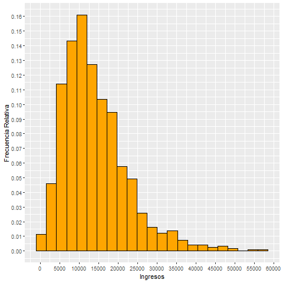
    


We add to the previous histogram associated vertical dashed lines
to the values ​​of some descriptive statistics :


```r
%%R

ggplot(data = data_R, aes(x=ingresos ))+
geom_histogram(aes(y = after_stat(count / sum(count))) , breaks=L , fill="orange", color="black")+
 scale_y_continuous( n.breaks = 10 )+
  scale_x_continuous(n.breaks = 10)+
  labs(x = "Ingresos", y = "Frecuencia Relativa")+
  
  geom_vline(aes(xintercept = median(ingresos),
                  color = "mediana"),
              linetype = "dashed",
              size = 1) +
   geom_vline(aes(xintercept = mean(ingresos),
                  color = "media"),
              linetype = "dashed",
              size = 1) +
   geom_vline(
     aes(xintercept = quantile(ingresos, 0.25),
         color = "cuantil_25"),
     linetype = "dashed",
     size = 1
   ) +
   geom_vline(
     aes(xintercept = quantile(ingresos, 0.75),
         color = "cuantil_75"),
     linetype = "dashed",
     size = 1
   ) + 
    scale_color_manual(
     name = "Statistics",
     values = c(
       mediana = "blue",
       media = "cyan",
       cuantil_25 = "red",
       cuantil_75 = "green"
       
     )
   ) 
```


    
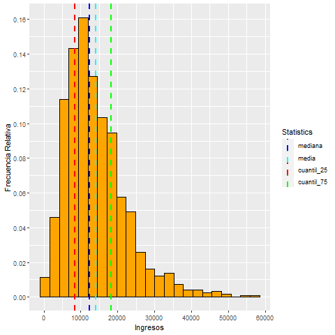
    


### Histogram by groups in `R` <a class="anchor" id="90.2"></a>


```r
%%R

ggplot(data = data_R, aes(x=ingresos ))+
geom_histogram(aes(y = after_stat(count / sum(count))) , breaks=L , fill="orange", color="black")+
 scale_y_continuous( n.breaks = 10 )+
  scale_x_continuous(n.breaks = 8)+
  labs(x = "Ingresos",y = "Frecuencia Relativa") +
  facet_wrap('genero')
```


    
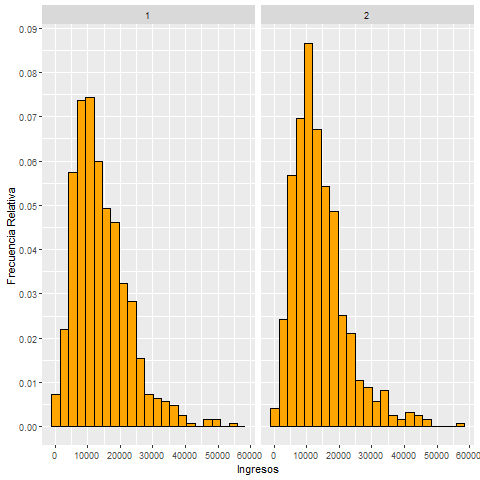
    


### Histogram in `Python` <a class="anchor" id="91"></a>


```python
# pip install plotnine
```


```python
from plotnine import ggplot, aes, geom_line, geom_point, geom_histogram, geom_bar, geom_boxplot, scale_y_continuous, scale_x_continuous, labs, after_stat,  geom_vline, scale_color_manual, theme_gray, theme_xkcd, scale_color_identity, geom_hline, facet_wrap, scale_fill_discrete, scale_fill_manual,  scale_fill_hue, guides, guide_legend, ggtitle
from mizani.formatters import percent_format 
```

We generate a histogram of the quantitative variable *income* using
the categorization intervals obtained with Scott's rule :


```python
(
ggplot( data_Python )
+  aes(x='ingresos' , y =  after_stat('width*density'))
+ geom_histogram(breaks=L , fill="plum", color="black")
+  labs(x = "Ingresos", y = "Frecuencia Relativa")
+ scale_x_continuous( breaks = range(int(data_Python['ingresos'].min()) , int(data_Python['ingresos'].max()) , 8000) ) 
+ scale_y_continuous( breaks = np.arange(0, 0.17, 0.02) )
)
```


    
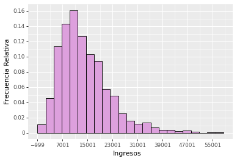
    


    <ggplot: (137444979460)>


We add to the previous histogram associated vertical dashed lines
to the values ​​of some descriptive statistics :


```python
(
ggplot( data_Python )
+  aes(x='ingresos' , y =  after_stat('width*density'))
+ geom_histogram(breaks=L , fill="plum", color="black")
+  labs(x = "Ingresos", y = "Frecuencia Relativa")
+ scale_x_continuous( breaks = range(int(data_Python['ingresos'].min()) , int(data_Python['ingresos'].max()) , 8000) ) 
+ scale_y_continuous( breaks = np.arange(0, 0.17, 0.02) )

+  geom_vline( xintercept=[data_Python['ingresos'].mean(), data_Python['ingresos'].median() , np.quantile( data_Python[['ingresos']] , 0.25), np.quantile( data_Python[['ingresos']] , 0.75)],
                 color=['red','blue','green', 'gray'],     # add colour
                 size=[1,1,1,1],                          # set line thickness
                 linetype='dotted',
                 show_legend = True    # set line type
                               
                )

) 
```


    
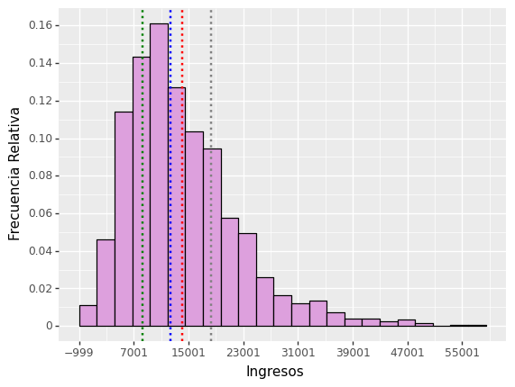
    


    <ggplot: (137552717281)>


We can add a legend as follows :


```python
df = pd.DataFrame({'statistics': ['mean', 'median','Q25', 'Q75' ] ,
                   'value' : [ data_Python['ingresos'].mean(), data_Python['ingresos'].median() , np.quantile( data_Python[['ingresos']] , 0.25), np.quantile( data_Python[['ingresos']] , 0.75) ] 
                   })

df
```


<div>
<style scoped>
    .dataframe tbody tr th:only-of-type {
        vertical-align: middle;
    }

    .dataframe tbody tr th {
        vertical-align: top;
    }

    .dataframe thead th {
        text-align: right;
    }
</style>
<table border="1" class="dataframe">
  <thead>
    <tr style="text-align: right;">
      <th></th>
      <th>statistics</th>
      <th>value</th>
    </tr>
  </thead>
  <tbody>
    <tr>
      <th>0</th>
      <td>mean</td>
      <td>14078.766909</td>
    </tr>
    <tr>
      <th>1</th>
      <td>median</td>
      <td>12331.000000</td>
    </tr>
    <tr>
      <th>2</th>
      <td>Q25</td>
      <td>8310.600000</td>
    </tr>
    <tr>
      <th>3</th>
      <td>Q75</td>
      <td>18269.375000</td>
    </tr>
  </tbody>
</table>
</div>


```python
p = (
ggplot( data_Python )
+  aes(x='ingresos' , y =  after_stat('width*density'))
+ geom_histogram(breaks=L , fill="plum", color="black")
+  labs(x = "Ingresos", y = "Frecuencia Relativa")
+ scale_x_continuous( breaks = range(int(data_Python['ingresos'].min()) , int(data_Python['ingresos'].max()) , 8000) ) 
+ scale_y_continuous( breaks = np.arange(0, 0.17, 0.02) )

+  geom_vline( df, aes(xintercept='value', color='statistics'), show_legend=True , linetype='dotted',size=[1,1,1,1])
+  scale_color_manual(
     name = "Statistics",
     values = [  "red",  "green", "cyan", "blue" ]
     )
) 

p
```


    
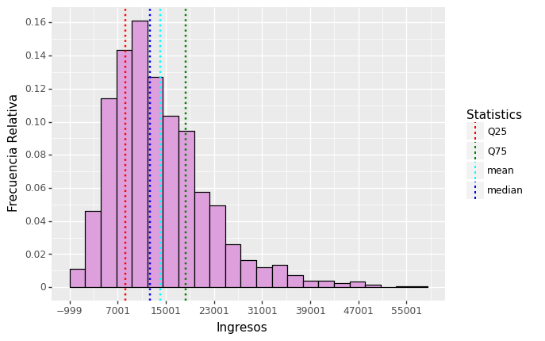
    


    <ggplot: (137445162561)>


In `Python` we can save   images   in **high quality** as follows :


```python
p.save("myplot2.png", dpi=600, path="C:/Users/Usuario/Pictures")
```


### Histogram by groups in `Python` <a class="anchor" id="91.2"></a>


```python
(
ggplot( data_Python )
+  aes(x='ingresos' , y =  after_stat('width*density'))
+ geom_histogram(breaks=L , fill="plum", color="black")
+  labs(x = "Ingresos", y = "Frecuencia Relativa")
+ scale_x_continuous( breaks = range(int(data_Python['ingresos'].min()) , int(data_Python['ingresos'].max()) , 10000) ) 
+ scale_y_continuous( breaks = np.arange(0, 0.17, 0.02) )
+ facet_wrap('genero')
)
```


    
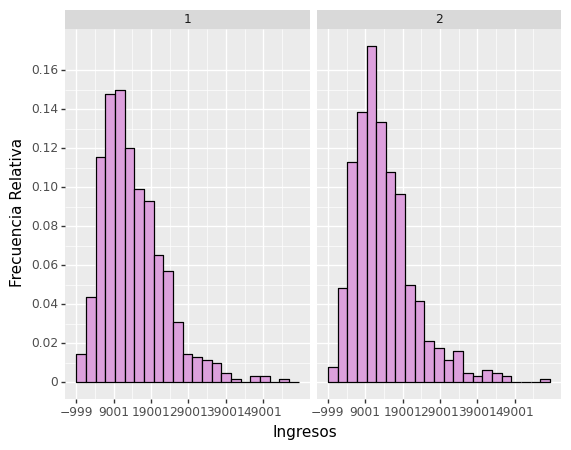
    


    <ggplot: (137445244340)>


## Bar Plot <a class="anchor" id="92"></a>

A *bar plot* is an unstacked bar chart used
to represent the absolute or relative frequencies of a variable
categorical.

The bar chart is constructed as follows:

On the *x-axis* it contains the path of the categorical variable. In the
*y-axis* the absolute or relative frequencies of the intervals of
categorization in the quantitative variable.

Inside the chart there are unstacked bars, as many as
categories has the variable categorica, each bar is assigned to a
category of the variable, and has a height equal to the frequency
absolute or relative of the category in the categorical variable.


### Bar-plot in `R` <a class="anchor" id="93"></a>

We generate a bar plot of the categorical variable *mineduc* (level
of education):


```r
%%R

ggplot(data = data_R, aes(x=neduc ))+
geom_bar(aes(y = after_stat(count / sum(count))) ,
 fill="orange", color="black")+
 scale_y_continuous( n.breaks = 15 )+
  labs(x = "Nivel de Educacion",
  y = "Frecuencia Relativa")
```


    
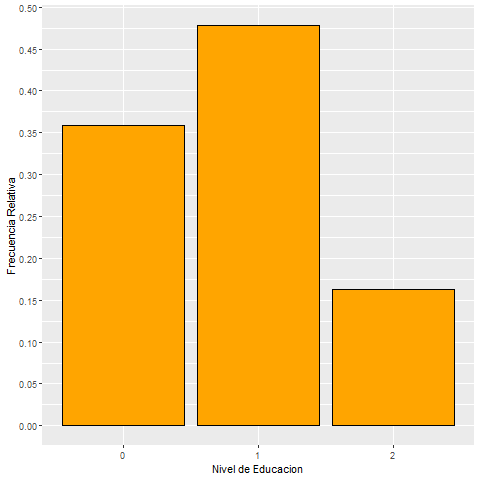
    


### Bar-plot by groups in `R` <a class="anchor" id="93"></a>


```r
%%R

ggplot(data = data_R, aes(x=neduc ))+
geom_bar(aes(y = after_stat(count / sum(count))) ,
 fill="orange", color="black")+
 scale_y_continuous( n.breaks = 15 )+
  labs(x = "Nivel de Educacion",
  y = "Frecuencia Relativa") +
  facet_wrap('genero')
```


    

    


### Bar-plot in `Python` <a class="anchor" id="94"></a>

We generate a bar plot of the categorical variable *mineduc* (level
of education):


```python
(
ggplot( data_Python )
+  aes(x='neduc' , y =  after_stat('prop'))
+ geom_bar( fill="plum", color="black")
+  labs(x = "neduc", y = "Frecuencia Relativa")
+ scale_y_continuous( breaks = np.arange(0, 0.6, 0.08) )
) 
```


    
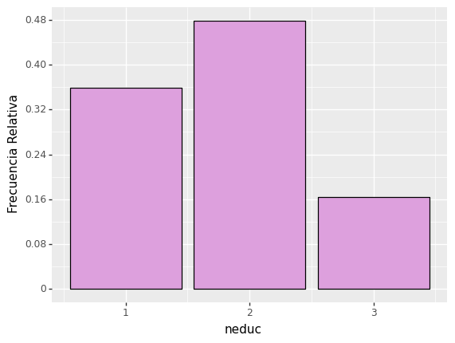
    


    <ggplot: (137445461830)>


### Bar-plot by groups in `Python` <a class="anchor" id="94.2"></a>


```python
(
ggplot( data_Python )
+  aes(x='neduc' , y =  after_stat('prop'))
+ geom_bar( fill="plum", color="black")
+  labs(x = "neduc", y = "Frecuencia Relativa")
+ scale_y_continuous( breaks = np.arange(0, 0.6, 0.08) )
+ ggtitle('Bar plot de nivel de educacion segun el genero')
+ facet_wrap('genero')
) 
```


    
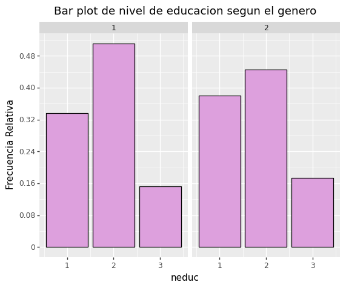
    


    <ggplot: (137445280588)>


## Box-Plot <a class="anchor" id="95"></a>


The **box-plot**  is a plot for quantitative variables
 that contains the following elements:

- The **left end of the box** (box) represents the value
    $Q(0.25, X_k)$

- The **right end of the box** represents the value
    $Q(0.75, X_k)$

- The **line inside the box** represents the value
    $Median(X_k)$

- The **left end of the horizontal line** is:
$$
Max \left( \hspace{0.15cm} Min(X_k) \hspace{0.1cm},\hspace{0.1cm} Q(0.25,X_k) - 1.5\cdot RIC \hspace{0.15cm} \right)
$$

- The **right end of the horizontal line** is:

$$
Min \left( \hspace{0.15cm} Max(X_k) \hspace{0.1cm},\hspace{0.1cm} Q(0.75,X_k) + 1.5\cdot RIC \hspace{0.15cm} \right)
$$

- The points that are beyond the extreme left or right of the
    horizontal line are considered **outlier observations**.


Where: $\hspace{0.15cm} IQR= Q(0.75,X_k) - Q(0.25,X_k)$ is the **interquartile range**
of $X_k$.


### Box-plot in `R` <a class="anchor" id="96"></a>


We generate a box-plot of the quantitative variable *income*


```r
%%R

ggplot(data_R) + 
  geom_boxplot( aes(x = ingresos), fill="orange", 
  color = 'black') + 
  xlab("Ingresos") + 
  ggtitle("Box-plot de la variable Ingresos ")+
  scale_x_continuous(n.breaks = 12)
```


    
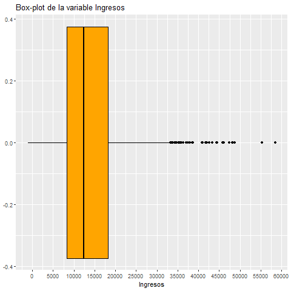
    


We add dashed vertical lines with relevant values ​​on the
previous chart :


```r
%%R

 rango_intercuartilico_ingresos<-quantile(data_R$ingresos, 0.75) - quantile(data_R$ingresos, 0.25)

extremo_izquierdo<- max( min(data_R$ingresos) ,  quantile(data_R$ingresos, 0.25) - 1.5*rango_intercuartilico_ingresos)  
extremo_derecho<- min( max(data_R$ingresos) ,  quantile(data_R$ingresos, 0.75) + 1.5*rango_intercuartilico_ingresos)  

```


```r
%%R

ggplot(data_R) + 
  geom_boxplot( aes(x = ingresos), fill="orange", color = 'black') + 
  xlab("Ingresos") + 
  ggtitle("Box-plot de la variable Ingresos ")+
  scale_x_continuous(n.breaks = 8)+
  
 geom_vline(aes(xintercept = median(ingresos),
                  color = "mediana"),
              linetype = "dashed",
              size = 1) +
   geom_vline(aes(xintercept = mean(ingresos),
                  color = "media"),
              linetype = "dashed",
              size = 1) +
   geom_vline(
     aes(xintercept = quantile(ingresos, 0.25),
         color = "cuantil_25"),
     linetype = "dashed",
     size = 1
   ) +
   geom_vline(
     aes(xintercept = quantile(ingresos, 0.75),
         color = "cuantil_75"),
     linetype = "dashed",
     size = 1
   )   + 
   geom_vline(
     aes(xintercept = extremo_izquierdo,
         color = "extremo_izquierdo"),
     linetype = "dashed",
     size = 1
   )   +
  geom_vline(
     aes(xintercept = extremo_derecho,
         color = "extremo_derecho"),
     linetype = "dashed",
     size = 1
   )  +
   scale_color_manual(
     name = "statistics",
     values = c(
       mediana = "red",
       media = "green",
       cuantil_25 = "purple",
       cuantil_75 = "blue",
       extremo_derecho="orange",
       extremo_izquierdo="cyan4"
     )
   )
```


    
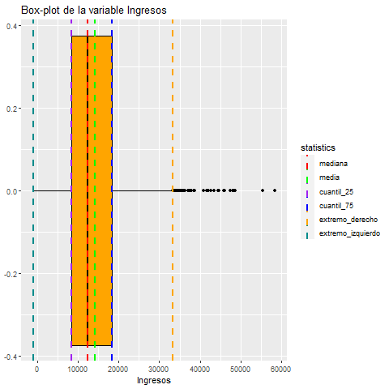
    


### Box-plot by groups in `R` <a class="anchor" id="96.2"></a>


```r
%%R

ggplot(data_R) + 
  geom_boxplot( aes(y = ingresos), fill="orange", 
  color = 'black') + 
  xlab("Ingresos") + 
  ggtitle("Box-plot de la variable Ingresos ")+
  scale_x_continuous(n.breaks = 12) +
  facet_wrap('genero')
```


    
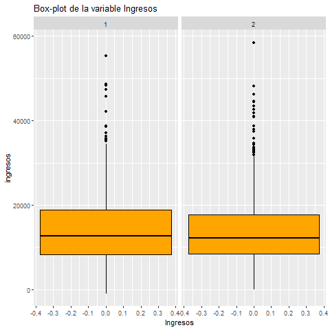
    


### Box-plot in `Python` <a class="anchor" id="97"></a>


```python
df = pd.DataFrame({'statistics': ['mean', 'median','Q25', 'Q75' ] ,
                   'value' : [ data_Python['ingresos'].mean(), data_Python['ingresos'].median() , np.quantile( data_Python[['ingresos']] , 0.25), np.quantile( data_Python[['ingresos']] , 0.75) ] 
                   })
```


```python
(
ggplot( data_Python )
+  aes( x=list(range(0, 1 , len(data_Python))) , y = 'ingresos' )
+ geom_boxplot(fill="plum", color="black" )
+  labs(y = "Ingresos" )
+ scale_y_continuous( breaks = range(int(data_Python['ingresos'].min()) , int(data_Python['ingresos'].max()) , 7000) ) 
+  geom_hline( df, aes(yintercept='value', color='statistics'), show_legend=True , linetype='dotted',size=[1,1,1,1])
+  scale_color_manual(
     name = "Statistics",
     values = [  "red",  "green", "cyan", "blue" ]
     )
) 
```


    
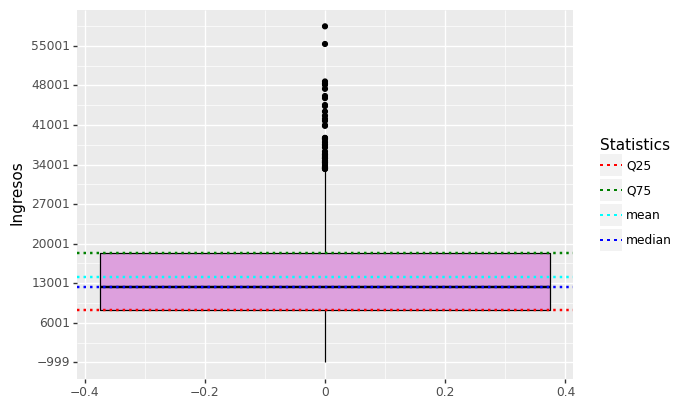
    


    <ggplot: (137445238202)>


### Box-plot by groups in `Python` <a class="anchor" id="97.2"></a>


```python
(
ggplot( data_Python )
+  aes( x=list(range(0, 1 , len(data_Python))) , y = 'ingresos' )
+ geom_boxplot(fill="plum", color="black" )
+  labs(y = "ingresos" )
+ scale_y_continuous( breaks = range(int(data_Python['ingresos'].min()) , int(data_Python['ingresos'].max()) , 8000) ) 
+ facet_wrap('genero')
+ ggtitle("Box-plot de la variable Ingresos segun el genero")
)
```


    

    


    <ggplot: (137445221346)>


##  Scatter Plot <a class="anchor" id=".1"></a>

A scatter plot is a plot used to represent the relation between two variables, and it have   the following features:

In the *x-axis* there are the values of one variable $(X_r\hspace{0.1cm} variable)$, and in the *y-axis* the values of the other variable $(X_h\hspace{0.1cm} variable)$.

Inside of the plot there are points, and the i-th point represent the i-th value of the $X_r$ and $X_h$ variables. $\hspace{0.05cm}$ So $\hspace{0.1cm} point_i = (x_{ri} , x_{hi})$


### Scatter plot in `R` <a class="anchor" id=".2"></a>


```r
%%R

ggplot(data_R) + 
  geom_point( aes(x = ingresos , y=horas), fill="orange", 
  color = 'blue') + 
  xlab("Ingresos") + 
  ggtitle("Scatter plot ingresos vs horas")+
  scale_x_continuous(n.breaks = 12)
```


    
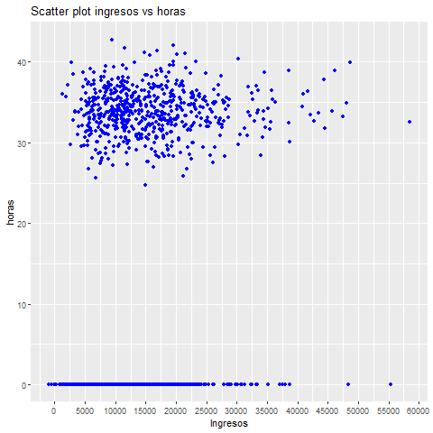
    


```r
%%R

ggplot(data_R) + 
  geom_point( aes(x = ingresos , y=genero), fill="orange", 
  color = 'red') + 
  xlab("Ingresos") + 
  ggtitle("Scatter plot ingresos vs genero")+
  scale_x_continuous(n.breaks = 12)
```


    
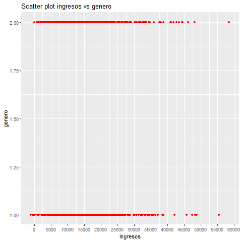
    


### Scatter plot by groups in `R` <a class="anchor" id=".2"></a>


```r
%%R

ggplot(data_R) + 
  geom_point( aes(x = ingresos , y=horas), fill="orange", 
  color = 'blue') + 
  xlab("Ingresos") + 
  ggtitle("Scatter plot ingresos vs horas en funcion del genero")+
  scale_x_continuous(n.breaks = 7) +
  facet_wrap('genero')
```


    
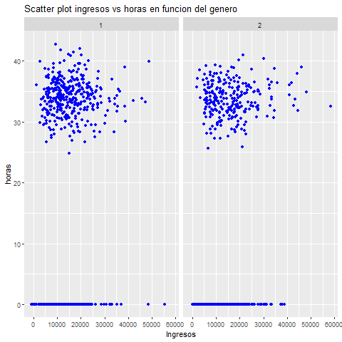
    


### Scatter plot in `Python` <a class="anchor" id=".2"></a>


```python
(
ggplot(data_Python) 

 + geom_point( aes(x = 'ingresos' , y = 'horas'), fill="white", 
  color = 'red') 
 + labs(x = "Ingresos", y = "horas")
 + ggtitle("Scatter plot ingresos vs horas en funcion del genero")
 + scale_x_continuous( breaks = range(int(data_Python['ingresos'].min()) , int(data_Python['ingresos'].max()) , 7000) ) 
 + scale_y_continuous( breaks = range(int(data_Python['horas'].min()) , int(data_Python['horas'].max()) , 10) )
)
```


    
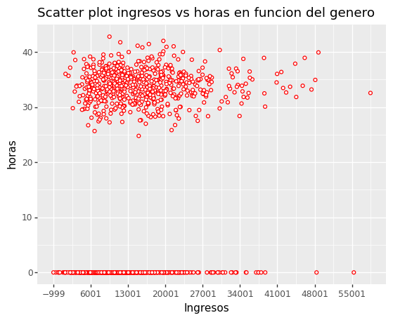
    


    <ggplot: (137447512662)>


### Scatter plot by groups `Python` <a class="anchor" id=".2"></a>


```python
(
ggplot(data_Python) 

 + geom_point( aes(x = 'ingresos' , y = 'horas'), fill="white", 
  color = 'red') 
 + labs(x = "Ingresos", y = "horas")
 + ggtitle("Scatter plot ingresos vs horas en funcion del genero")
 + scale_x_continuous( breaks = range(int(data_Python['ingresos'].min()) , int(data_Python['ingresos'].max()) , 12000) ) 
 + scale_y_continuous( breaks = range(int(data_Python['horas'].min()) , int(data_Python['horas'].max()) , 10) )
 + facet_wrap('genero')
)
```


    
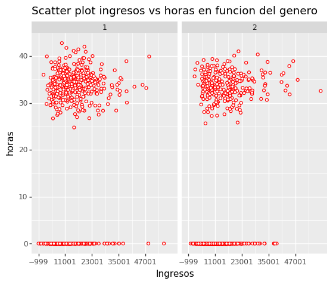
    


    <ggplot: (137445487686)>


## Scatter Matrix Plot   <a class="anchor" id=".4"></a>


This plot is a generalization of scatter ploy by groups.


### Scatter Matrix Plot in `R`  <a class="anchor" id=".8"></a>


```r
%%R

Quantitative_Variables <- data_R[, 7:8]
```


```r
%%R

library(GGally)

ggpairs(Quantitative_Variables) 
```

    R[write to console]: Registered S3 method overwritten by 'GGally':
      method from   
      +.gg   ggplot2
    
    


    
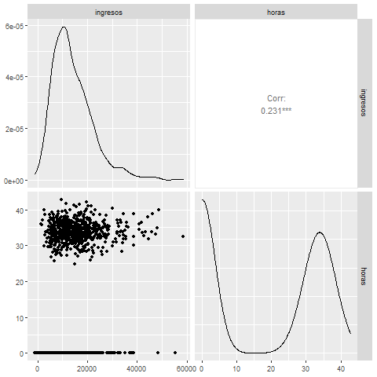
    


### Scatter Matrix Plot in `Python`  <a class="anchor" id=".5"></a>


Using `Seaborn`


```python
import seaborn as sns

sns.set_theme(style="ticks")

sns.pairplot(data_Python,  diag_kind="kde" )
```


    <seaborn.axisgrid.PairGrid at 0x20008367cd0>


    

    


```python

sns.set_theme(style="ticks")

sns.pairplot(data_Python,  diag_kind="hist" )
```


    <seaborn.axisgrid.PairGrid at 0x2000cb928f0>


    
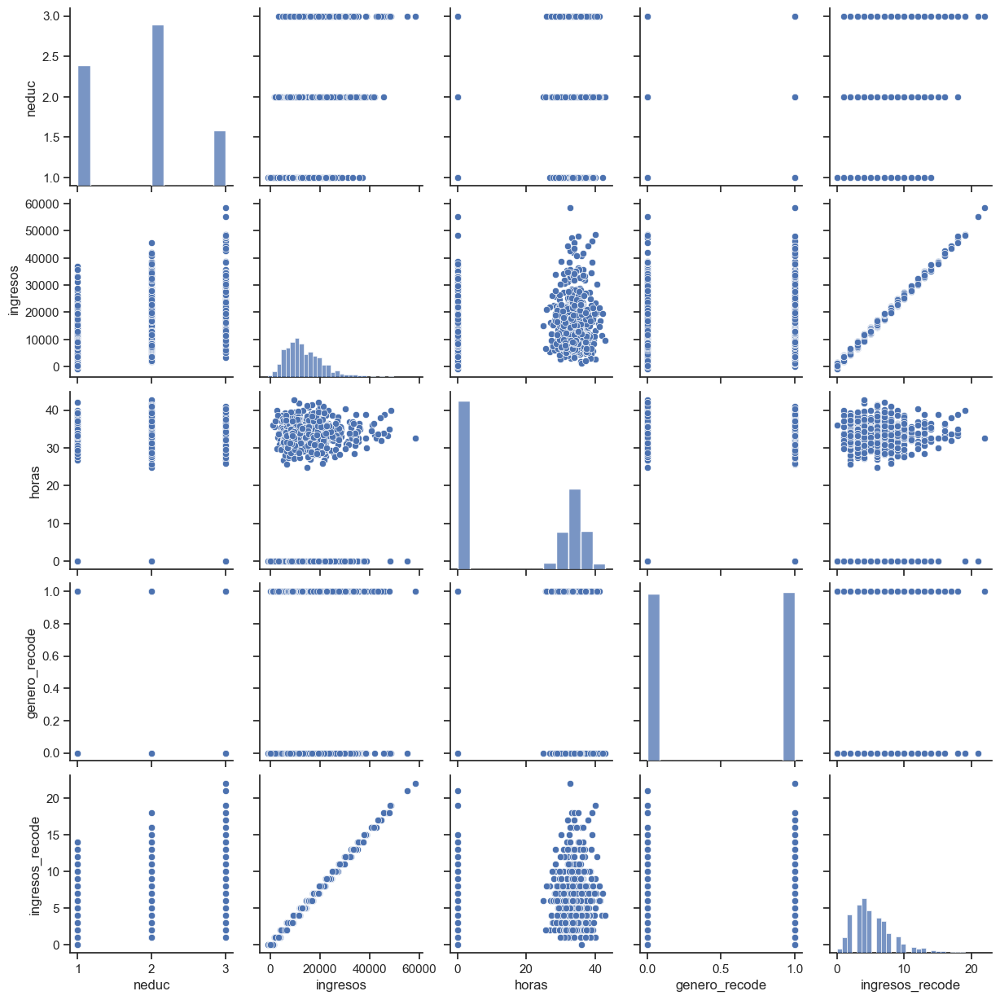
    


### Scatter Matrix Plot by groups in `Python`  <a class="anchor" id=".6"></a>


```python

sns.set_theme(style="ticks")

sns.pairplot(data_Python, hue="genero")
```


    <seaborn.axisgrid.PairGrid at 0x2000cb1ad10>


    
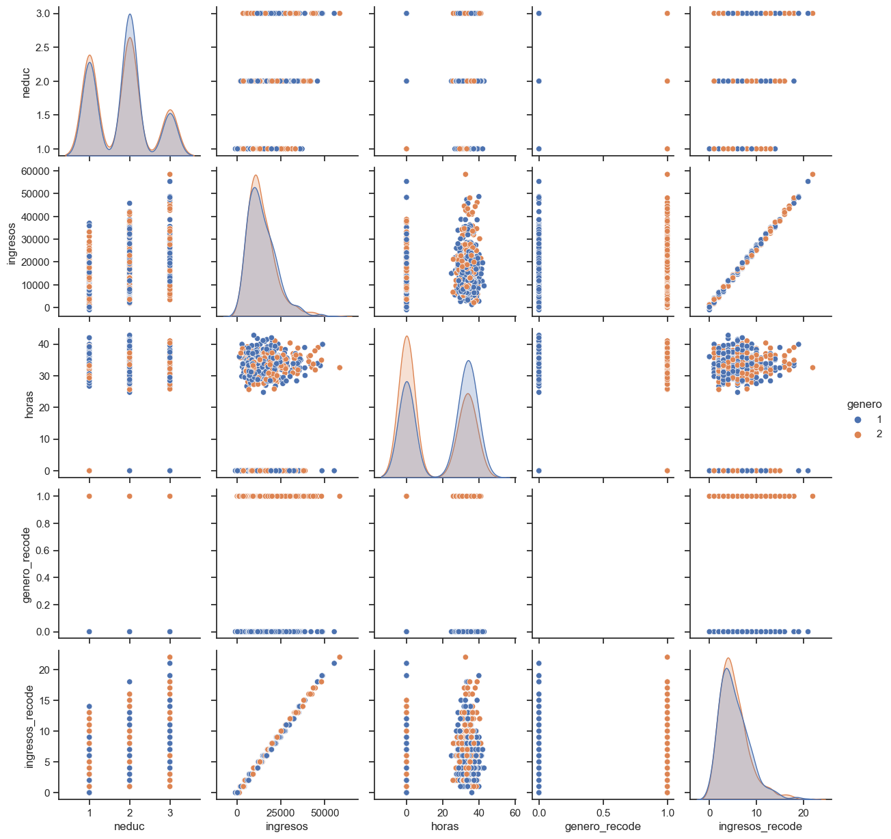
    


## Skewness and Kurtosis <a class="anchor" id="98"></a>


### Skewness Coefficient <a class="anchor" id="99"></a>


The Fisher's Skewness coefficient of the quantitative variable $X_k$ is:

$$
Skewness(X_k) = \dfrac{\overline{x_{k}}_{3}}{S(X_k)^{3}}
$$

Where:
$$
\overline{x_{k}}_{3}=\dfrac{1}{n}\sum_{i=1}^{n} (x_{ik})^{3}
$$


#### Skewness coefficient properties <a class="anchor" id="100"></a>

The **Fisher's skewness coefficient** measures the **degree of symmetry**
of the distribution of the observations of a variable with respect to its
arithmetic means.

- If $Skewness(X_k) > 0$ $\Rightarrow$ the distribution of $X_k$ is
    **asymmetric to the right**.

- If $Skewness(X_k) <0$ $\Rightarrow$ the distribution of $X_k$ is
    **asymmetric to the left**.

- If the distribution is **symmetric** about the means
    $\Rightarrow$ $Skewness(X_k)=0$ . But the converse is not true.


#### Skewness in `R` <a class="anchor" id="101"></a>


```r
%%R

library(moments)
```


```r
%%R 

skewness(data_R$ingresos)
```

    [1] 1.304721
    


#### Skewness in `Python` <a class="anchor" id="102"></a>


```python
import scipy
```


```python
scipy.stats.skew(data_Python['ingresos'])
```


    1.304721100228902


#### Skewness Comparison in `R` <a class="anchor" id="103"></a>


```r
%%R

set.seed(123)

X1 <- rchisq(5000, 2)

skewness(X1)
```

    [1] 2.184111
    


```r
%%R

p1<- ggplot(data = as.data.frame(X1), aes(x=X1 ))+
geom_histogram(aes(y = after_stat(count / sum(count)))   , fill="bisque3", color="black")+
 scale_y_continuous( n.breaks = 15 )+
  scale_x_continuous(n.breaks = 12)+
  xlab("X1") +
  ylab("Frecuencias Relativas") +
  ggtitle("Districución Asimétrica a la derecha : Asimetria = 2.18")+
  
 geom_vline(aes(xintercept = median(X1),
                  color = "mediana"),
              linetype = "dashed",
              size = 1) +
   geom_vline(aes(xintercept = mean(X1),
                  color = "media"),
              linetype = "dashed",
              size = 1)+
  
   scale_color_manual(
     name = "statistics",
     values = c(
       mediana = "red",
       media = "green"
     )
   )

p1
```

    R[write to console]: `stat_bin()` using `bins = 30`. Pick better value with `binwidth`.
    
    


    
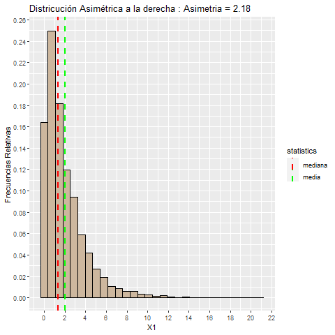
    


```r
%%R

set.seed(123)

X2 <- rnorm(5000, 2)

skewness(X2)
```

    [1] 0.01169851
    


```r
%%R

p2<- ggplot(data = as.data.frame(X2), aes(x=X2))+
geom_histogram(aes(y = after_stat(count / sum(count)))   , fill="bisque3", color="black")+
 scale_y_continuous( n.breaks = 15 )+
  scale_x_continuous(n.breaks = 12)+
  xlab("X2") +
  ylab("Frecuencias Relativas") +
  ggtitle("Distribución Simétrica : Asimetria = 0.011")+
  
  geom_vline(aes(xintercept = median(X2),
                  color = "mediana"),
              linetype = "dashed",
              size = 1) +
   geom_vline(aes(xintercept = mean(X2),
                  color = "media"),
              linetype = "dashed",
              size = 1)+
  
   scale_color_manual(
     name = "statistics",
     values = c(
       mediana = "red",
       media = "green"
     )
   )

p2
```

    R[write to console]: `stat_bin()` using `bins = 30`. Pick better value with `binwidth`.
    
    


    
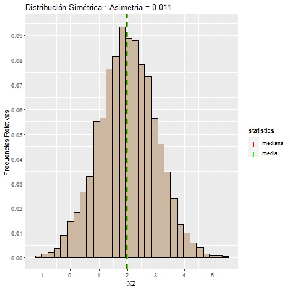
    


```r
%%R

set.seed(123)

X3 <- rbeta(5000, 9, 2)

skewness(X3)
```

    [1] -0.8586165
    


```r
%%R

p3<- ggplot(data = as.data.frame(X3), aes(x=X3))+
geom_histogram(aes(y = after_stat(count / sum(count)))   , fill="bisque3", color="black")+
 scale_y_continuous( n.breaks = 15 )+
  scale_x_continuous(n.breaks = 12)+
  xlab("X3") +
  ylab("Frecuencias Relativas") +
  ggtitle("Distribución Asimétrica a la izquierda : Asimetria = -0.85")+
  
  geom_vline(aes(xintercept = median(X3),
                  color = "mediana"),
              linetype = "dashed",
              size = 1) +
   geom_vline(aes(xintercept = mean(X3),
                  color = "media"),
              linetype = "dashed",
              size = 1)+
  
   scale_color_manual(
     name = "statistics",
     values = c(
       mediana = "red",
       media = "green"
     )
   )

p3
```

    R[write to console]: `stat_bin()` using `bins = 30`. Pick better value with `binwidth`.
    
    


    
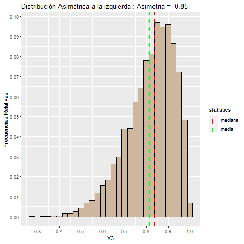
    


```r
%%R

df<-as.data.frame(cbind(c(X1,X2,X3), grupo=c(rep(1,5000), rep(2,5000),rep(3,5000))))

ggplot(data = df , aes(x=V1, fill=factor(grupo)))+
geom_histogram(aes(y = after_stat(count/sum(count))) , color="black")+
  facet_wrap(grupo~., scales="free", ncol = 3)+
 scale_y_continuous( n.breaks = 10 )+
  scale_x_continuous(n.breaks = 5)+
  ggtitle("Comparación asimetria de distribuciones")+
  ylab("Frecuencias Relativas")+ xlab("")+
  scale_fill_discrete(labels = c("A.Der", "Sim", "A.Izq"))+
  guides(fill = guide_legend(title = " "),
         colour = guide_legend(title = " "))
```

    R[write to console]: `stat_bin()` using `bins = 30`. Pick better value with `binwidth`.
    
    


    
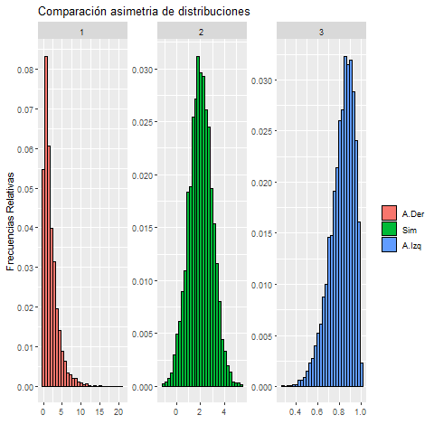
    


#### Skewness Comparison in `Python` <a class="anchor" id="104"></a>


```python
np.random.seed(123)

X1 = np.random.chisquare(df=2, size=5000)

scipy.stats.skew(X1)
```


    1.946984446321499


```python
X1_df = pd.DataFrame({'X1': X1})
X1_df.head()
```


<div>
<style scoped>
    .dataframe tbody tr th:only-of-type {
        vertical-align: middle;
    }

    .dataframe tbody tr th {
        vertical-align: top;
    }

    .dataframe thead th {
        text-align: right;
    }
</style>
<table border="1" class="dataframe">
  <thead>
    <tr style="text-align: right;">
      <th></th>
      <th>X1</th>
    </tr>
  </thead>
  <tbody>
    <tr>
      <th>0</th>
      <td>2.384544</td>
    </tr>
    <tr>
      <th>1</th>
      <td>0.674135</td>
    </tr>
    <tr>
      <th>2</th>
      <td>0.514568</td>
    </tr>
    <tr>
      <th>3</th>
      <td>1.602867</td>
    </tr>
    <tr>
      <th>4</th>
      <td>2.542142</td>
    </tr>
  </tbody>
</table>
</div>


```python
df = pd.DataFrame({'statistics': ['mean', 'median' ] ,
                   'value' : [ X1_df['X1'].mean(), X1_df['X1'].median()] 
                   })

df
```


<div>
<style scoped>
    .dataframe tbody tr th:only-of-type {
        vertical-align: middle;
    }

    .dataframe tbody tr th {
        vertical-align: top;
    }

    .dataframe thead th {
        text-align: right;
    }
</style>
<table border="1" class="dataframe">
  <thead>
    <tr style="text-align: right;">
      <th></th>
      <th>statistics</th>
      <th>value</th>
    </tr>
  </thead>
  <tbody>
    <tr>
      <th>0</th>
      <td>mean</td>
      <td>1.982775</td>
    </tr>
    <tr>
      <th>1</th>
      <td>median</td>
      <td>1.393094</td>
    </tr>
  </tbody>
</table>
</div>


```python
(
ggplot( data=X1_df )
+ aes(x='X1' , y =  after_stat('width*density'))
+ geom_histogram( fill="plum", color="black")
+  labs(x = "X1", y = "Frecuencia Relativa")
+ scale_x_continuous( breaks = np.arange(0, 15, 2) ) 
+ scale_y_continuous( breaks = np.arange(0, 0.13, 0.02) )

+  geom_vline( df, aes(xintercept='value', color='statistics'), show_legend=True , linetype='dotted',size=[2,2])
+  scale_color_manual(
     name = "Statistics",
     values = [  "red",  "green"]
     )
)
```


    
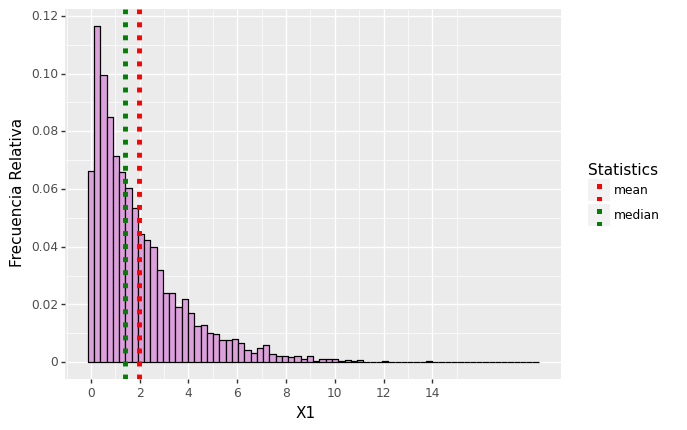
    


    <ggplot: (137447445294)>


```python
np.random.seed(123)

X2 = np.random.normal(0, 1, 5000)

scipy.stats.skew(X2)
```


    -0.03708351858937471


```python
X2_df = pd.DataFrame({'X2': X2})
X2_df.head()
```


<div>
<style scoped>
    .dataframe tbody tr th:only-of-type {
        vertical-align: middle;
    }

    .dataframe tbody tr th {
        vertical-align: top;
    }

    .dataframe thead th {
        text-align: right;
    }
</style>
<table border="1" class="dataframe">
  <thead>
    <tr style="text-align: right;">
      <th></th>
      <th>X2</th>
    </tr>
  </thead>
  <tbody>
    <tr>
      <th>0</th>
      <td>-1.085631</td>
    </tr>
    <tr>
      <th>1</th>
      <td>0.997345</td>
    </tr>
    <tr>
      <th>2</th>
      <td>0.282978</td>
    </tr>
    <tr>
      <th>3</th>
      <td>-1.506295</td>
    </tr>
    <tr>
      <th>4</th>
      <td>-0.578600</td>
    </tr>
  </tbody>
</table>
</div>


```python
df = pd.DataFrame({'statistics': ['mean', 'median' ] ,
                   'value' : [ X2_df['X2'].mean(), X2_df['X2'].median()] 
                   })

df
```


<div>
<style scoped>
    .dataframe tbody tr th:only-of-type {
        vertical-align: middle;
    }

    .dataframe tbody tr th {
        vertical-align: top;
    }

    .dataframe thead th {
        text-align: right;
    }
</style>
<table border="1" class="dataframe">
  <thead>
    <tr style="text-align: right;">
      <th></th>
      <th>statistics</th>
      <th>value</th>
    </tr>
  </thead>
  <tbody>
    <tr>
      <th>0</th>
      <td>mean</td>
      <td>0.021083</td>
    </tr>
    <tr>
      <th>1</th>
      <td>median</td>
      <td>0.029560</td>
    </tr>
  </tbody>
</table>
</div>


```python
(
ggplot( data=X2_df )
+ aes(x='X2' , y =  after_stat('width*density'))
+ geom_histogram( fill="plum", color="black")
+  labs(x = "X2", y = "Frecuencia Relativa")
+ scale_x_continuous( breaks = np.arange(0, 15, 2) ) 
+ scale_y_continuous( breaks = np.arange(0, 0.13, 0.02) )

+  geom_vline( df, aes(xintercept='value', color='statistics'), show_legend=True , linetype='dotted',size=[2,2])
+  scale_color_manual(
     name = "Statistics",
     values = [  "red",  "green"]
     )
)
```


    
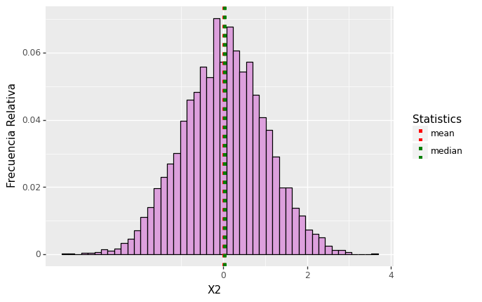
    


    <ggplot: (137447596363)>


```python
np.random.seed(123)

X3 = np.random.beta(9, 2, size=5000)

scipy.stats.skew(X3)
```


    -0.8596198677550896


```python
X3_df = pd.DataFrame({'X3': X3})
X3_df.head()
```


<div>
<style scoped>
    .dataframe tbody tr th:only-of-type {
        vertical-align: middle;
    }

    .dataframe tbody tr th {
        vertical-align: top;
    }

    .dataframe thead th {
        text-align: right;
    }
</style>
<table border="1" class="dataframe">
  <thead>
    <tr style="text-align: right;">
      <th></th>
      <th>X3</th>
    </tr>
  </thead>
  <tbody>
    <tr>
      <th>0</th>
      <td>0.638248</td>
    </tr>
    <tr>
      <th>1</th>
      <td>0.593855</td>
    </tr>
    <tr>
      <th>2</th>
      <td>0.738268</td>
    </tr>
    <tr>
      <th>3</th>
      <td>0.815022</td>
    </tr>
    <tr>
      <th>4</th>
      <td>0.864218</td>
    </tr>
  </tbody>
</table>
</div>


```python
df = pd.DataFrame({'statistics': ['mean', 'median' ] ,
                   'value' : [ X3_df['X3'].mean(), X3_df['X3'].median()] 
                   })

df
```


<div>
<style scoped>
    .dataframe tbody tr th:only-of-type {
        vertical-align: middle;
    }

    .dataframe tbody tr th {
        vertical-align: top;
    }

    .dataframe thead th {
        text-align: right;
    }
</style>
<table border="1" class="dataframe">
  <thead>
    <tr style="text-align: right;">
      <th></th>
      <th>statistics</th>
      <th>value</th>
    </tr>
  </thead>
  <tbody>
    <tr>
      <th>0</th>
      <td>mean</td>
      <td>0.818823</td>
    </tr>
    <tr>
      <th>1</th>
      <td>median</td>
      <td>0.836811</td>
    </tr>
  </tbody>
</table>
</div>


```python
(
ggplot( data=X3_df )
+ aes(x='X3' , y =  after_stat('width*density'))
+ geom_histogram( fill="plum", color="black")
+  labs(x = "X3", y = "Frecuencia Relativa")
+ scale_x_continuous( breaks = np.arange(0, 15, 2) ) 
+ scale_y_continuous( breaks = np.arange(0, 0.13, 0.02) )

+  geom_vline( df, aes(xintercept='value', color='statistics'), show_legend=True , linetype='dotted',size=[2,2])
+  scale_color_manual(
     name = "Statistics",
     values = [  "red",  "green"]
     )
)
```


    
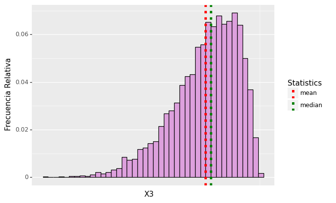
    


    <ggplot: (137447579183)>


```python
import array as arr
```


```python
np.random.seed(123)

X1 = np.random.chisquare(df=2, size=5000)
X2 = np.random.normal(0, 1, 5000)
X3 = np.random.beta(9, 2, size=5000)

X1_df = pd.DataFrame({'X': X1})
X2_df = pd.DataFrame({'X': X2})
X3_df = pd.DataFrame({'X': X3})

df_X1_X2_X3 = concat([X1_df, X2_df, X3_df])

repeat_one = pd.DataFrame({'': arr.array('i', (1 for i in range(0,len(X1_df)))) })
repeat_two = pd.DataFrame({'': arr.array('i',(2 for i in range(0,len(X2_df)))) })
repeat_three = pd.DataFrame({'': arr.array('i',(3 for i in range(0,len(X2_df)))) })

repeat_df = concat([repeat_one, repeat_two, repeat_three])

df_final = concat([df_X1_X2_X3 , repeat_df], axis=1)
df_final.columns = ['X', 'group']


df_final['group'] = df_final['group'].astype('category')
```


```python
df_final
```


<div>
<style scoped>
    .dataframe tbody tr th:only-of-type {
        vertical-align: middle;
    }

    .dataframe tbody tr th {
        vertical-align: top;
    }

    .dataframe thead th {
        text-align: right;
    }
</style>
<table border="1" class="dataframe">
  <thead>
    <tr style="text-align: right;">
      <th></th>
      <th>X</th>
      <th>group</th>
    </tr>
  </thead>
  <tbody>
    <tr>
      <th>0</th>
      <td>2.384544</td>
      <td>1</td>
    </tr>
    <tr>
      <th>1</th>
      <td>0.674135</td>
      <td>1</td>
    </tr>
    <tr>
      <th>2</th>
      <td>0.514568</td>
      <td>1</td>
    </tr>
    <tr>
      <th>3</th>
      <td>1.602867</td>
      <td>1</td>
    </tr>
    <tr>
      <th>4</th>
      <td>2.542142</td>
      <td>1</td>
    </tr>
    <tr>
      <th>...</th>
      <td>...</td>
      <td>...</td>
    </tr>
    <tr>
      <th>4995</th>
      <td>0.776231</td>
      <td>3</td>
    </tr>
    <tr>
      <th>4996</th>
      <td>0.750767</td>
      <td>3</td>
    </tr>
    <tr>
      <th>4997</th>
      <td>0.904833</td>
      <td>3</td>
    </tr>
    <tr>
      <th>4998</th>
      <td>0.864323</td>
      <td>3</td>
    </tr>
    <tr>
      <th>4999</th>
      <td>0.886387</td>
      <td>3</td>
    </tr>
  </tbody>
</table>
<p>15000 rows × 2 columns</p>
</div>


```python
(
ggplot( data=df_final )
+ aes( x='X' , y=after_stat('width*density') , fill='group' )
+ geom_histogram(  )
+ labs(x = " ", y = "Frecuencia Relativa")
+ facet_wrap('group', scales="free", ncol = 3 )
+ scale_fill_manual(values=["dodgerblue","green","orange"] , labels=["A.Der", "Sim", "A.Izq"]  ) 
+ guides(fill = guide_legend(title = " "),
         colour = guide_legend(title = " "))
)
```


    
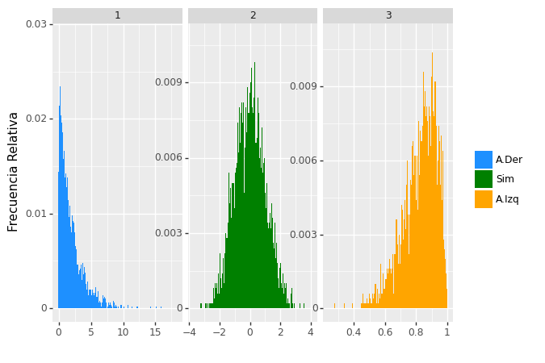
    


    <ggplot: (137449550806)>


## Kurtosis Coefficient <a class="anchor" id="105"></a>


The **kurtosis coefficient** of the quantitative variable $X_k$ is:

$$
Kurtosis(X_k) = \dfrac{\overline{x_k}_{4}}{S(X_k)^{4}}
$$

Where:

\begin{gather*}
\overline{x_k}_{4}=\dfrac{1}{n}\sum_{i=1}^{n} (X_i)^{4} 
\end{gather*}


### Kurtosis coefficient properties <a class="anchor" id="106"></a>

The **coefficient of kurtosis** primarily measures the **degree of
pointing** of the distribution of the observations of a variable.

- If $Kurtosis(X_k) > 3$ $\Rightarrow$ the distribution of $X_k$ is
    **more pointed** and with thicker tails **than the distribution
    normal**.

- If $Kurtosis(X_k) < 3$ $\Rightarrow$ the distribution of $X_k$ is
    **less pointed** and with thinner tails **than the distribution
    normal**.


### Kurtosis in `R` <a class="anchor" id="107"></a>


```r
%%R 

kurtosis(data_R$ingresos)
```

    [1] 5.630726
    


### Kurtosis in `Python` <a class="anchor" id="108"></a>


```python
scipy.stats.kurtosis(data_Python['ingresos'], fisher=False)
```


    5.630725909373049


#### Pointing Comparison in `R` <a class="anchor" id="109"></a>


```r
%%R

set.seed(123)

X4<- rnorm(5000, 0, 2)

X5<-rnorm(5000, 0 , 1)
```


```r
%%R

 df<-as.data.frame(cbind(c(X4,X5), grupo=c(rep(1,5000), rep(2,5000))))
 

ggplot(data = df , aes(x=V1, fill=factor(grupo)))+
geom_histogram(aes(y = after_stat(count / sum(count))) , color="black")+
  facet_wrap(grupo~.)+
 scale_y_continuous( n.breaks = 15 )+
  scale_x_continuous(n.breaks = 12)+
  ggtitle("Comparación apuntamiento de distribuciones")+
   scale_fill_discrete(labels = c("Menos \napuntada\n", "\nMas \napuntada"))+
  guides(fill = guide_legend(title = " "),
         colour = guide_legend(title = " "))+
  xlab("")+
  ylab("Frecuencias Relativas")

```

    R[write to console]: `stat_bin()` using `bins = 30`. Pick better value with `binwidth`.
    
    


    
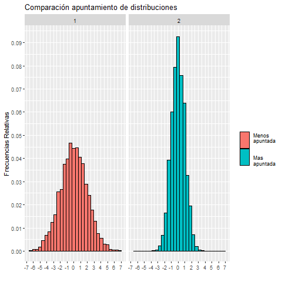
    


#### Pointing Comparison in `Python` <a class="anchor" id="110"></a>


```python
np.random.seed(123)

X1 = np.random.normal(0, 2, 5000)
X2 = np.random.normal(0, 1, 5000)

X1_df = pd.DataFrame({'X': X1})
X2_df = pd.DataFrame({'X': X2})

df_X1_X2 = concat([X1_df, X2_df])

repeat_one = pd.DataFrame({'': arr.array('i', (1 for i in range(0,len(X1_df)))) })
repeat_two = pd.DataFrame({'': arr.array('i',(2 for i in range(0,len(X2_df)))) })

repeat_df = concat([repeat_one, repeat_two])
repeat_df.columns = ['group']

df_final = concat([df_X1_X2 , repeat_df], axis=1)
df_final['group'] = df_final['group'].astype('category')
```


```python
(
ggplot( data=df_final )
+ aes(x='X' , y =  after_stat('width*density'), fill='group')
+ geom_histogram(  )
+ labs(x = " ", y = "Frecuencia Relativa")
+ facet_wrap('group',  ncol = 2 )
+ scale_fill_manual(values=["dodgerblue","green"] , labels=["Menos apuntada", "Mas apuntada"]  ) 
+ guides(fill = guide_legend(title = " "),
         colour = guide_legend(title = " "))
)
```


    
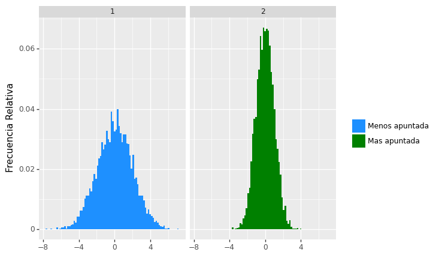
    


    <ggplot: (137450271862)>


## Joint Relative Frequencies <a class="anchor" id="111"></a>


### Joint Relative Frequencies with 2 variables <a class="anchor" id="112"></a>

Given two statistical variables $X_k$ and $X_r$ , such that $a_k \in Range(X_k)$ and $a_r \in Range(X_r)$ : 


$$ Fre(a_k, X_k \hspace{0.05cm} ; \hspace{0.05cm} a_r, X_r) = \dfrac{Fabs(a_k,X_k \hspace{0.05cm} ; \hspace{0.05cm} a_r, X_r)}{n} $$


Where:

$$ Fabs(a_k, X_k \hspace{0.05cm} ; \hspace{0.05cm} a_r, X_r)\hspace{0.05cm} = \hspace{0.05cm} \# \lbrace  i=1,...,n \hspace{0.08cm} /\hspace{0.08cm} x_{ik}=a_k \hspace{0.05cm},\hspace{0.05cm} x_{ir}=a_r \rbrace


### Joint Relative Frequencies with 3 variables <a class="anchor" id="113"></a>

Given tree statistical variables $X_k$ , $X_r$ and $X_h$ , such that $a_k \in Range(X_k)$ , $a_r \in Range(X_r)$ and $a_h \in Range(X_h)$ : 


$$ Fre(a_k, X_k \hspace{0.05cm} ; \hspace{0.05cm} a_r, X_r \hspace{0.05cm} ; \hspace{0.05cm} a_h, X_h) = \dfrac{Fabs(a_k,X_k \hspace{0.05cm} ; \hspace{0.05cm} a_r, X_r \hspace{0.05cm} ; \hspace{0.05cm} a_h, X_h)}{n} $$


Where:

$$ Fabs(a_k, X_k \hspace{0.05cm} ; \hspace{0.05cm} a_r, X_r  \hspace{0.05cm} ; \hspace{0.05cm} a_h, X_h)\hspace{0.05cm} = \hspace{0.05cm} \# \lbrace  i=1,...,n \hspace{0.08cm} /\hspace{0.08cm} x_{ik}=a_k \hspace{0.08cm},\hspace{0.08cm} x_{ir}=a_r \hspace{0.08cm},\hspace{0.08cm} x_{ih}=a_h \rbrace


## Joint Relative Frequencies Table <a class="anchor" id="114"></a>


###  Joint Relative Frequencies Table with 2 variables in `R` <a class="anchor" id="115"></a>

We are going to create a function in R to which we put a couple of variables and
returns a table with the joint relative frequencies for those
two variables.

The characteristics of the function are the following:

- **Input:** dataframe $X$

- **Input:** variables $V1$ and $V2$ of $X$

- $V1$ and $V2$ must be loaded into R as vectors

- $V1$ and $V2$ can be *categorical* or *quantitative variables
    categorized*

- The range of $V1$ must be $0:p1$ , $\hspace{0.1cm}$ with $p1=1,2,3,...$

- The range of $V2$ must be $0:p2$ , $\hspace{0.1cm}$ with $p2=1,2,3,...$

- **Input:** $p1$ , $p2$

- $V1$ is the variable at the top of the table (columns)

- $V2$ is the variable on the left side of the table (rows)


```r
%%R

Table_Join_Rel_Freq_2_Var_R <- function(X, V1, V2, p1, p2){

tabla<- matrix(NA, nrow=p2+1, ncol=p1+1 )

for(i in 0:p2){
  for(j in 0:p1){
    
tabla[i+1,j+1] <- ( dim( ( X %>% select(V1,V2) %>% filter(V1==j & V2==i) ) )[1] / dim(X)[1] )
  }
}

rownames(tabla)<-0:p2
colnames(tabla)<-0:p1
 
print("V1 is in the upper side (columns) of the table and V2 in the left side (rows)")

tabla <- as.data.frame(tabla)

return(tabla) 
}
```


**Example 1:** $\hspace{0.1cm}$ Two *categorical* variables 


Tenemos que recodificar las variables categoricas que utilicemos para que su recorrido sea de la forma $0:p$ , $\hspace{0.1cm}$ con $p \geq 1$. 

Ademas debemos cargarlas en R como vectores.


```r
%%R

data_R$edad <- recode(data_R$edad, "1"="0", "2"="1", "3"="2", "4"="3")
data_R$edad<- as.double( data_R$edad )
edad<-data_R$edad

data_R$genero <- recode(data_R$genero, "1"="0", "2"="1" )
data_R$genero <- as.double( data_R$genero )
genero <- data_R$genero

```


Now we calculate the joint relative frequency table for the categorical variables $age$ and $genero$


```r
%%R

Table_Join_Rel_Freq_2_Var_R(X=data_R, V1=edad , V2=genero, p1=3, p2=1 )

```

    Note: Using an external vector in selections is ambiguous.
    i Use `all_of(V1)` instead of `V1` to silence this message.
    i See <https://tidyselect.r-lib.org/reference/faq-external-vector.html>.
    This message is displayed once per session.
    Note: Using an external vector in selections is ambiguous.
    i Use `all_of(V2)` instead of `V2` to silence this message.
    i See <https://tidyselect.r-lib.org/reference/faq-external-vector.html>.
    This message is displayed once per session.
    [1] "V1 is in the upper side (columns) of the table and V2 in the left side (rows)"
               0         1         2         3
    0 0.06310680 0.2160194 0.1108414 0.1076052
    1 0.05906149 0.2119741 0.1116505 0.1197411
    

For example, the proportion of individuals who are male ($genero=0$) and older than 60 years ($edad=3$) is 0.1076


**Example 2:** $\hspace{0.1cm}$ One *categorical* variable and another *quantitative*


The first thing is to categorize the quantitative variable, for this we apply
a categorization rule like the mean rule:


```r
%%R

L <- c(min(data_R$ingresos), mean(data_R$ingresos), max(data_R$ingresos))

b <- cut(data_R$ingresos, breaks = L, include.lowest = T,  labels=F)

ingresos_categorizados_regla_media <- b-1
```

We hve to add the categorized variable *ingresos*  to the data frame:


```r
%%R

data_R <- cbind(data_R, ingresos_categorizados_regla_media)
```

Now we calculate the joint relative frequencies table for the categorical variable $genero$ and the quantitative variable $ingresos$


```r
%%R

Table_Join_Rel_Freq_2_Var_R(X=data_R, V1=ingresos_categorizados_regla_media , V2=genero, p1=1, p2=1 )
```

    [1] "V1 is in the upper side (columns) of the table and V2 in the left side (rows)"
              0         1
    0 0.2847896 0.2127832
    1 0.2985437 0.2038835
    

For example, the proportion of individuals who are male (gender=0) with above-average income (ingresos superiores a la media) (income_categorized_rule_average=1) is 0.213

Verification:


```r
%%R

# Calculamos manualmente la entrada (V1=0, V2=0)

 ( dim( ( data_R %>% select(ingresos_categorizados_regla_media, genero) %>% filter(ingresos_categorizados_regla_media==1 & genero==0) ) )[1] / dim(data_R)[1] )
```

    [1] 0.2127832
    


For two quantitative variables it would be an analogous procedure.


### Joint Relative Frequencies Table with 2 variables in `Python` <a class="anchor" id="116"></a>


We are going to create a function in Python to which we put a couple of variables and returns a table with the joint relative frequencies for those
two variables.

The characteristics of the function are the following:

- **Input:** data frame $df$

- **Input:** variables $var1$ and $var2$ of $df$

- **Input:** the names $var1_name$ and $var2_name$ of the variables $var1$ and $var2$ of $df$

- $var1$ and $var2$ must be objects of the form $df[var1\_name]$ and $df[var2\_name]$

- $var1$ and $var2$ can be *categorical* or *quantitative variables
    categorized*

- The path of $var1$ must be $0:p1$ , $\hspace{0.1cm}$ with $p1=1,2,3,...$

- The path of $var2$ must be $0:p2$ , $\hspace{0.1cm}$ with $p2=1,2,3,...$

- **Input:** $p1$ , $p2$

- $var1$ is the variable at the top of the table (columns)

- $var2$ is the variable on the left side of the table (rows)


```python
def Table_Join_Rel_Freq_2_Var_Py (df, var1, var2, p1, p2, var1_name='var1' , var2_name='var2') :

    table = np.zeros(( p2+1 , p1+1 ))
    table[:] = np.nan

##########################################################

    for i in range(0, p2+1):
        for j in range(0, p1+1):

            table[i , j] =  len( df.loc[ (var2 == i) & (var1 == j) , : ] ) / len(df)   
    
    table = pd.DataFrame(table)

    print( var1_name , "is in the upper side (columns) of the table and", var2_name ,"in the left side (rows)" )

    return table
```


**Example 1:** $\hspace{0.1cm}$ Two *categorical* variables

We have to recode the categorical variables that we are going to use so that (para que) their range is $0:p$ , $\hspace{0.1cm}$ with $p \geq 1$.


We recode the categorical variable $neduc$ so that its range goes from $\lbrace 1,2,3 \rbrace$ to $\lbrace 0,1,2 \rbrace$


```python
(data_Python['neduc_recode']) = 0

for i in range(0 , len(data_Python)) :

    if (data_Python['neduc'])[i] == 1 :

        (data_Python['neduc_recode'])[i] = 0

    if (data_Python['neduc'])[i] == 2 :

        (data_Python['neduc_recode'])[i] = 1

    if (data_Python['neduc'])[i] == 3 :

        (data_Python['neduc_recode'])[i] = 2
    
```


We will use $neduc\_recode$ instead of $neduc$

We would have to do the same with the categorical variable $genero$ , but this has already been done before, so we will use $genero\_recode$ instead of $genero$

Now we calculate the joint relative frequency table for the variables $genero$ and $neduc$ (actually using $genero\_recode$ and $neduc\_recode$)


```python
Table_Join_Rel_Freq_2_Var_genero_neduc = Table_Join_Rel_Freq_2_Var_Py(data_Python, data_Python['genero_recode'], data_Python['neduc_recode'], 1, 2 , var1_name='*genero*', var2_name='*neduc*' )

Table_Join_Rel_Freq_2_Var_genero_neduc
```

    *genero* is in the upper side (columns) of the table and *neduc* in the left side (rows)
    


<div>
<style scoped>
    .dataframe tbody tr th:only-of-type {
        vertical-align: middle;
    }

    .dataframe tbody tr th {
        vertical-align: top;
    }

    .dataframe thead th {
        text-align: right;
    }
</style>
<table border="1" class="dataframe">
  <thead>
    <tr style="text-align: right;">
      <th></th>
      <th>0</th>
      <th>1</th>
    </tr>
  </thead>
  <tbody>
    <tr>
      <th>0</th>
      <td>0.167476</td>
      <td>0.190939</td>
    </tr>
    <tr>
      <th>1</th>
      <td>0.254045</td>
      <td>0.224110</td>
    </tr>
    <tr>
      <th>2</th>
      <td>0.076052</td>
      <td>0.087379</td>
    </tr>
  </tbody>
</table>
</div>


```python
Table_Join_Rel_Freq_2_Var_genero_neduc = Table_Join_Rel_Freq_2_Var_genero_neduc.style.set_caption("neduc vs genero")

Table_Join_Rel_Freq_2_Var_genero_neduc
```


<style type="text/css">
</style>
<table id="T_ab875">
  <caption>neduc vs genero</caption>
  <thead>
    <tr>
      <th class="blank level0" >&nbsp;</th>
      <th id="T_ab875_level0_col0" class="col_heading level0 col0" >0</th>
      <th id="T_ab875_level0_col1" class="col_heading level0 col1" >1</th>
    </tr>
  </thead>
  <tbody>
    <tr>
      <th id="T_ab875_level0_row0" class="row_heading level0 row0" >0</th>
      <td id="T_ab875_row0_col0" class="data row0 col0" >0.167476</td>
      <td id="T_ab875_row0_col1" class="data row0 col1" >0.190939</td>
    </tr>
    <tr>
      <th id="T_ab875_level0_row1" class="row_heading level0 row1" >1</th>
      <td id="T_ab875_row1_col0" class="data row1 col0" >0.254045</td>
      <td id="T_ab875_row1_col1" class="data row1 col1" >0.224110</td>
    </tr>
    <tr>
      <th id="T_ab875_level0_row2" class="row_heading level0 row2" >2</th>
      <td id="T_ab875_row2_col0" class="data row2 col0" >0.076052</td>
      <td id="T_ab875_row2_col1" class="data row2 col1" >0.087379</td>
    </tr>
  </tbody>
</table>


**Example 2:** One variable *categorical* and another *quantitative*

The first thing is to categorize the quantitative variable, for this we apply
a categorization rule like that of the mean.


The quantitative variable that we will use will be $ingresos$. With the following code we categorize the variable $ingresos$ using the mean rule, and thus (así) we obtain the variable $ingresos\_recode$


```python
L = [ data_Python['ingresos'].min() - 0.5 , data_Python['ingresos'].mean() , data_Python['ingresos'].max() + 0.5 ]

data_Python['ingresos_recode']  = pd.cut(x=data_Python['ingresos'] , bins=L , labels=False)
```

The categorical variable that we will use will be $genero$, which has already been properly recoded ($genero\_recode$)

Ahora calculamos la tabla de frecuencias relativas conjuntas para la variable cuantitativa $ingresos$ y la variable categorica $genero$  (usando realmente $ingresos\_recode$ y $genero\_recode$)

Now we calculate the joint relative frequency table for the quantitative variable $ingresos$ and the categorical variable $genero$ (actually using $ingresos\_recode$ and $genero\_recode$)


```python
Table_Join_Rel_Freq_2_Var_genero_ingresos = Table_Join_Rel_Freq_2_Var_Py(data_Python, data_Python['genero_recode'], data_Python['ingresos_recode'], 1, 1 , var1_name='*genero*', var2_name='*ingresos*')

Table_Join_Rel_Freq_2_Var_genero_ingresos
```

    *genero* is in the upper side (columns) of the table and *ingresos* in the left side (rows)
    


<div>
<style scoped>
    .dataframe tbody tr th:only-of-type {
        vertical-align: middle;
    }

    .dataframe tbody tr th {
        vertical-align: top;
    }

    .dataframe thead th {
        text-align: right;
    }
</style>
<table border="1" class="dataframe">
  <thead>
    <tr style="text-align: right;">
      <th></th>
      <th>0</th>
      <th>1</th>
    </tr>
  </thead>
  <tbody>
    <tr>
      <th>0</th>
      <td>0.284790</td>
      <td>0.298544</td>
    </tr>
    <tr>
      <th>1</th>
      <td>0.212783</td>
      <td>0.203883</td>
    </tr>
  </tbody>
</table>
</div>


We add to the previous table the categorization intervals that define the categorized variable $ingresos$( $ingresos\_recode$ ).

We also add a title to the table that will help it's interpretation.


```python
intervals = pd.DataFrame()
intervals['interval_ingresos'] = pd.cut(x=data_Python['ingresos'] , bins=L )
intervals = (intervals.sort_values('interval_ingresos')  >> distinct(X.interval_ingresos))

Table_Join_Rel_Freq_2_Var_genero_ingresos.index = intervals['interval_ingresos'] 
Table_Join_Rel_Freq_2_Var_genero_ingresos = Table_Join_Rel_Freq_2_Var_genero_ingresos.style.set_caption("ingresos vs genero")
```

The result is as follows


```python
Table_Join_Rel_Freq_2_Var_genero_ingresos
```


<style type="text/css">
</style>
<table id="T_29c18">
  <caption>ingresos vs genero</caption>
  <thead>
    <tr>
      <th class="blank level0" >&nbsp;</th>
      <th id="T_29c18_level0_col0" class="col_heading level0 col0" >0</th>
      <th id="T_29c18_level0_col1" class="col_heading level0 col1" >1</th>
    </tr>
    <tr>
      <th class="index_name level0" >interval_ingresos</th>
      <th class="blank col0" >&nbsp;</th>
      <th class="blank col1" >&nbsp;</th>
    </tr>
  </thead>
  <tbody>
    <tr>
      <th id="T_29c18_level0_row0" class="row_heading level0 row0" >(-1000.0, 14078.767]</th>
      <td id="T_29c18_row0_col0" class="data row0 col0" >0.284790</td>
      <td id="T_29c18_row0_col1" class="data row0 col1" >0.298544</td>
    </tr>
    <tr>
      <th id="T_29c18_level0_row1" class="row_heading level0 row1" >(14078.767, 58470.9]</th>
      <td id="T_29c18_row1_col0" class="data row1 col0" >0.212783</td>
      <td id="T_29c18_row1_col1" class="data row1 col1" >0.203883</td>
    </tr>
  </tbody>
</table>


### Joint Relative Frequencies Table with 3 variables in `R` <a class="anchor" id="117"></a>


We are going to create a function in `R` to which we put three variables and we
returns a table with the joint relative frequencies of the three
variables, but considering a fixed value of one of them.


The characteristics of the function are the following:

- **Input:**  data frame $X$

- **Input:** variables $V1$ , $V2$ and $V3$ of $X$

- $V1$ , $V2$ and $V3$ must be loaded into `R` as vectors

- $V1$ , $V2$ and $V3$ can be *categorical* or *categorized quantitative variables*

- The range of $V1$ has to be $0:p1$ , with $p1=1,2,3,...$

- The range of $V2$ has to be $0:p2$ , with $p2=1,2,3,...$

- The range of $V3$ has to be $0:p2$ , with $p3=1,2,3,...$

- **Input:** $p1$ , $p2$, $p3$

- $V1$ is the variable at the top (columns) of the table

- $V2$ is the variable of the lower part (rows) of the table

- $V3$ is the variable whose value is fixed

- **Input:** *fixed_value_V3* which is the fixed value of $V3$


```r
%%R

Table_Join_Rel_Freq_3_Var_R <- function(X, V1, V2, p1, p2, V3, valor_fijado_V3){

tabla<- matrix(NA, nrow=p2+1, ncol=p1+1 )

    
for(i in 0:p2){
  for(j in 0:p1){
   
    tabla[i+1,j+1] <- ( dim( ( X  %>% filter( V1==j & V2==i & V3==valor_fijado_V3 ) ) )[1] / dim(X)[1] )

  }
}
 rownames(tabla)<-0:p2
 colnames(tabla)<-0:p1
 
 cat("V1 is in the upper side (columns) of the table and V2 in the left side (rows), and V3 always takes the same fixed value" , valor_fijado_V3, "\n"  )
 
 tabla <- as.data.frame(tabla)
 
 return(tabla) 
}
```


**Example:** $\hspace{0.1cm}$ one quantitative variable and two categorical variables


```r
%%R

Table_Join_Rel_Freq_3_Var_R(X=data_R, V1= ingresos_categorizados_regla_media , V2= genero , p1=1, p2=1, V3= edad, valor_fijado_V3=3)

```

    V1 is in the upper side (columns) of the table and V2 in the left side (rows), and V3 always takes the same fixed value 3 
               0          1
    0 0.07766990 0.02993528
    1 0.09385113 0.02588997
    


For example, the proportion of individuals who are men (genero=0) with incomes above the median (ingresos_categorized_rule_media=1) and older than 60 years (edad=3) is 0.0299

Verification:


```r
%%R

# Calculamos manualmente la entrada (V1=0, V2=0, V3=3)

( dim( ( data_R  %>% filter( ingresos_categorizados_regla_media==0 & genero==0 & edad==3 ) ) )[1] / dim(data_R)[1] )

```

    [1] 0.0776699
    


This idea can be extended to more dimensions (4,5,6... variables),
although an analysis with more than 3 variables is not usual.


### Joint Relative Frequencies Table with 3 variables in `Python` <a class="anchor" id="118"></a>


We are going to create a function in `Python` to which we put a couple of variables and returns a table with the joint relative frequencies for those
two variables.

The characteristics of the function are the following:

- **Input:** data frame $df$

- **Input:** variables $var1$ , $var2$ and $var3$ from $df$

- **Input:** the names $var1_name$ , $var2_name$ and $var3_name$ of the variables $var1$ , $var2$ and $var3$ of $df$

- $var1$ , $var2$ and $var3$ must be objects of the form $df[var1\_name]$ , $df[var2\_name]$ and $df[var3\_name]$

- $var1$ , $var2$ and $var3$ can be *categorical* or *categorized quantitative variables*

- The range of $var1$ must be $0:p1$ , $\hspace{0.1cm}$ with $p1=1,2,3,...$

- The range of $var2$ must be $0:p2$ , $\hspace{0.1cm}$ with $p2=1,2,3,...$

- The range of $var3$ must be $0:p3$ , $\hspace{0.1cm}$ with $p3=1,2,3,...$

- **Input:** $p1$ , $p2$ , $p3$

- $var1$ is the variable at the top of the table (columns)

- $var2$ is the variable on the left side of the table (rows)

- $var3$ is the variable whose value is fixed
  
- **Input:** $fixed\_value\_var3$ is the fixed value of $var3$


```python
def Table_Join_Rel_Freq_3_Var_Py (df, var1, var2, p1, p2, var3, fixed_value_var3, var1_name='var1' , var2_name='var2', var3_name='var3') :

    table = np.zeros(( p2+1 , p1+1 ))
    table[:] = np.nan

##########################################################

    for i in range(0, p2+1):
        for j in range(0, p1+1):

            table[i , j] =  len( df.loc[ (var2 == i) & (var1 == j) & (var3 == fixed_value_var3) , :] ) / len(df)  
    
    table = pd.DataFrame(table)

    print( var1_name , "is in the upper side (columns) of the table and", var2_name ,"in the left side (rows)  and", var3_name , "always takes the same fixed value" , fixed_value_var3 )

    return table
```


**Example:** $\hspace{0.1cm}$ one *quantitative* variable and two *categorical* variables


```python
Table_Join_Rel_Freq_3_Var_genero_ingresos_neduc = Table_Join_Rel_Freq_3_Var_Py (data_Python, data_Python['genero_recode'], data_Python['ingresos_recode'], 1, 1, data_Python['neduc_recode'], 0, var1_name='*genero*' , var2_name='*ingresos*', var3_name='*neduc*')
Table_Join_Rel_Freq_3_Var_genero_ingresos_neduc
```

    *genero* is in the upper side (columns) of the table and *ingresos* in the left side (rows)  and *neduc* always takes the same fixed value 0
    


<div>
<style scoped>
    .dataframe tbody tr th:only-of-type {
        vertical-align: middle;
    }

    .dataframe tbody tr th {
        vertical-align: top;
    }

    .dataframe thead th {
        text-align: right;
    }
</style>
<table border="1" class="dataframe">
  <thead>
    <tr style="text-align: right;">
      <th></th>
      <th>0</th>
      <th>1</th>
    </tr>
  </thead>
  <tbody>
    <tr>
      <th>0</th>
      <td>0.123786</td>
      <td>0.144013</td>
    </tr>
    <tr>
      <th>1</th>
      <td>0.043689</td>
      <td>0.046926</td>
    </tr>
  </tbody>
</table>
</div>


```python
Table_Join_Rel_Freq_3_Var_genero_ingresos_neduc.index = intervals['interval_ingresos'] 
Table_Join_Rel_Freq_3_Var_genero_ingresos_neduc = Table_Join_Rel_Freq_3_Var_genero_ingresos_neduc.style.set_caption("ingresos vs genero vs neduc")
```


```python
Table_Join_Rel_Freq_3_Var_genero_ingresos_neduc
```


<style type="text/css">
</style>
<table id="T_eeb8a">
  <caption>ingresos vs genero vs neduc</caption>
  <thead>
    <tr>
      <th class="blank level0" >&nbsp;</th>
      <th id="T_eeb8a_level0_col0" class="col_heading level0 col0" >0</th>
      <th id="T_eeb8a_level0_col1" class="col_heading level0 col1" >1</th>
    </tr>
    <tr>
      <th class="index_name level0" >interval_ingresos</th>
      <th class="blank col0" >&nbsp;</th>
      <th class="blank col1" >&nbsp;</th>
    </tr>
  </thead>
  <tbody>
    <tr>
      <th id="T_eeb8a_level0_row0" class="row_heading level0 row0" >(-1000.0, 14078.767]</th>
      <td id="T_eeb8a_row0_col0" class="data row0 col0" >0.123786</td>
      <td id="T_eeb8a_row0_col1" class="data row0 col1" >0.144013</td>
    </tr>
    <tr>
      <th id="T_eeb8a_level0_row1" class="row_heading level0 row1" >(14078.767, 58470.9]</th>
      <td id="T_eeb8a_row1_col0" class="data row1 col0" >0.043689</td>
      <td id="T_eeb8a_row1_col1" class="data row1 col1" >0.046926</td>
    </tr>
  </tbody>
</table>


## Conditional Relative Frequencies <a class="anchor" id="119"></a>

### Conditional Relative Frequencies with 2 variables <a class="anchor" id="120"></a>

Given two statistical variables $X_k$ and $X_r$ , such that $a_k \in Range(X_k)$ and $a_r \in Range(X_r)$ : 


$$ Fre(a_k, X_k \hspace{0.05cm} | \hspace{0.05cm} a_r, X_r) = \dfrac{Fabs(a_k,X_k \hspace{0.05cm} | \hspace{0.05cm} a_r, X_r)}{n} $$


Where:

$$ Fabs(a_k, X_k \hspace{0.05cm} | \hspace{0.05cm} a_r, X_r)\hspace{0.05cm} = \hspace{0.05cm} \# \lbrace  i=1,...,n  \hspace{0.1cm};\hspace{0.1cm} x_{ir}=a_r \hspace{0.1cm} / \hspace{0.1cm}    x_{ik}=a_k \rbrace


### Conditional Relative Frequencies with 3 variables <a class="anchor" id="121"></a>

Given two statistical variables $X_k$ , $X_r$ and $X_h$ , such that $a_k \in Range(X_k)$ , $a_r \in Range(X_r)$ and $a_h \in Range(X_h)$ : 


$$ Fre(a_k, X_k \hspace{0.1cm} | \hspace{0.1cm} a_r, X_r  \hspace{0.08cm} ; \hspace{0.08cm} a_h , X_h) = \dfrac{Fabs(a_k,X_k \hspace{0.1cm} | \hspace{0.1cm} a_r, X_r \hspace{0.08cm} ; \hspace{0.08cm} a_h , X_h)}{n} $$


Where:

$$ Fabs(a_k, X_k \hspace{0.1cm} | \hspace{0.1cm} a_r, X_r \hspace{0.08cm} ; \hspace{0.08cm} a_h , X_h )\hspace{0.05cm} = \hspace{0.05cm} \# \lbrace  i=1,...,n  \hspace{0.1cm};\hspace{0.1cm} x_{ir}=a_r  \hspace{0.1cm} , \hspace{0.1cm} x_{ih}=a_h \hspace{0.1cm} /\hspace{0.1cm}    x_{ik}=a_k \rbrace


## Conditional Relative Frequencies Table <a class="anchor" id="122"></a>


### Conditional Relative Frequencies Table with 2 variables in `R` <a class="anchor" id="123"></a>


The idea is to obtain a table of relative frequencies for 2 variables,
$V1$ and $V2$, where $V1$ conditions $V2$ , $(V2 | V1)$.


The characteristics of the function are the following:

- **Input:** $X$ data array

- **Input:** variable $V1$

- **Input** $V2\_indice$ is the index of the variable V2 , if the
    variable $V2$ occupies column 6 in $X$, so $V2\_index=6$

- $V1$ must be loaded into R as a vector

- $V1$ and $V2$ can be categorical or quantitative variables
    categorized

- The range of $V1$ has to be $0:p1$ , with $p1=1,2,3,...$

- The range of $V2$ has to be $0:p2$ , with $p2=1,2,3,...$

- **Input:** $p1$ and $p2$

- $V1$ is the variable that **conditions**, the one at the top
    (columns) of the table

- $V2$ is the variable of the lower part (rows) of the table


```r
%%R 

Tabla_Frecuencias_Relativas_Condicionadas_2_Variables <- function(X, V1, V2_indice, p1, p2 ){

tabla<- matrix(NA, nrow=p2+1, ncol=p1+1 )

for(i in 0:p2){
  for(j in 0:p1){
  
    X_new <- X %>% filter( V1==j)
     
    V2_new<- X_new[, V2_indice]
    
    tabla[i+1,j+1] <- (dim( ( X_new  %>% filter(V2_new==i) ) )[1] / dim(X_new)[1])
  }
}

 rownames(tabla)<-0:p2
 colnames(tabla)<-0:p1
 
print(" V1  es la variable que condiciona y esta en la parte superior (columnas) de la tabla y  V2 en la inferior (filas)")
 
 tabla <- as.data.frame(tabla)

 return(tabla) 
}
```


```r
%%R

Tabla_Frecuencias_Relativas_Condicionadas_2_Variables(data_R , V1=genero, V2_indice=9, p1=1, p2=1)
```

    [1] " V1  es la variable que condiciona y esta en la parte superior (columnas) de la tabla y  V2 en la inferior (filas)"
              0         1
    0 0.5723577 0.5942029
    1 0.4276423 0.4057971
    


The variable $V2$ is the one with index 9 of the data matrix (9 column), which is the $ingresos$ variable categorized with the mean rule.

For example, the proportion of people with income above the mean $(ingresos\_categorizados\_regla\_media=1)$, within the group of men $(genero=0)$ is 0.4276

Verification:


```r
%%R
# Comprobamos cual es la variable V2 usada en el codigo anterior

names(data_R %>% select(9))
```

    [1] "ingresos_categorizados_regla_media"
    


```r
%%R
# Calculamos manualmente la entrada (V1=0, V2=1)

dim((data_R %>% filter(genero==0))%>% filter(ingresos_categorizados_regla_media==1))[1] / dim((data_R %>% filter(genero==0)))[1]

```

    [1] 0.4276423
    


### Conditional Relative Frequencies Table with 2 variables in `Python` <a class="anchor" id="124"></a>


The idea is to obtain a table of relative frequencies for 2 variables,
$var1$ and $var2$, where $var1$ conditions $var2$ , $(var2 | var1)$.

The characteristics of the function are the following:

- **Input:** data frame $df$

- **Input:** $var1$ variable from $df$

- **Input:** $var2\_indice$ is the index of the variable $var2$. Then, if the
    variable $var2$ occupies column 6 in $X$, so $V2_index=6$

- $var1$  must be object of the form $df[var1\_name]$ 

- $var1$ and $var2$ can be *categorical* or *categorized quantitative variables*

- The range of $var1$ must be $0:p1$ , $\hspace{0.1cm}$ with $p1=1,2,3,...$

- The range of $var2$ must be $0:p2$ , $\hspace{0.1cm}$ with $p2=1,2,3,...$

- **Input:** $p1$ , $p2$

- $var1$ is the variable that **conditions**, the one at the top
    (columns) of the table

- $var2$ is the variable of the lower part (rows) of the table

- **Input:** $var1_name$ and $var2_name$


```python
def Table_Con_Rel_Freq_2_Var_Py (df, var1, p1, p2, var1_name='var1' , var2_name='var2') :

    table = np.zeros(( p2+1 , p1+1 ))
    table[:] = np.nan

##########################################################

    for i in range(0, p2+1):
        for j in range(0, p1+1):

            df_new = df.loc[ var1 == j   , : ]

            table[i,j] = len( df_new.loc[ df_new[var2_name] == i , :] ) / len(df_new)
    
    table = pd.DataFrame(table)

    return table
```


```python
Table_Con_Rel_Freq_2_Var_Py_genero_ingresos = Table_Con_Rel_Freq_2_Var_Py(data_Python, data_Python['genero_recode'], 1, 1,  var1_name='genero' , var2_name='ingresos_recode')

Table_Con_Rel_Freq_2_Var_Py_genero_ingresos
```


<div>
<style scoped>
    .dataframe tbody tr th:only-of-type {
        vertical-align: middle;
    }

    .dataframe tbody tr th {
        vertical-align: top;
    }

    .dataframe thead th {
        text-align: right;
    }
</style>
<table border="1" class="dataframe">
  <thead>
    <tr style="text-align: right;">
      <th></th>
      <th>0</th>
      <th>1</th>
    </tr>
  </thead>
  <tbody>
    <tr>
      <th>0</th>
      <td>0.572358</td>
      <td>0.594203</td>
    </tr>
    <tr>
      <th>1</th>
      <td>0.427642</td>
      <td>0.405797</td>
    </tr>
  </tbody>
</table>
</div>


We can check that the nine (9) variable of the date-set is $ingresos\_recode$


```python
data_Python.iloc[ : , [9]]
```


<div>
<style scoped>
    .dataframe tbody tr th:only-of-type {
        vertical-align: middle;
    }

    .dataframe tbody tr th {
        vertical-align: top;
    }

    .dataframe thead th {
        text-align: right;
    }
</style>
<table border="1" class="dataframe">
  <thead>
    <tr style="text-align: right;">
      <th></th>
      <th>ingresos_recode</th>
    </tr>
  </thead>
  <tbody>
    <tr>
      <th>0</th>
      <td>1</td>
    </tr>
    <tr>
      <th>1</th>
      <td>1</td>
    </tr>
    <tr>
      <th>2</th>
      <td>0</td>
    </tr>
    <tr>
      <th>3</th>
      <td>1</td>
    </tr>
    <tr>
      <th>4</th>
      <td>1</td>
    </tr>
    <tr>
      <th>...</th>
      <td>...</td>
    </tr>
    <tr>
      <th>1231</th>
      <td>0</td>
    </tr>
    <tr>
      <th>1232</th>
      <td>1</td>
    </tr>
    <tr>
      <th>1233</th>
      <td>1</td>
    </tr>
    <tr>
      <th>1234</th>
      <td>0</td>
    </tr>
    <tr>
      <th>1235</th>
      <td>1</td>
    </tr>
  </tbody>
</table>
<p>1236 rows × 1 columns</p>
</div>


```python
intervals = pd.DataFrame()
intervals['interval_ingresos'] = pd.cut(x=data_Python['ingresos'] , bins=L )
intervals = (intervals.sort_values('interval_ingresos')  >> distinct(X.interval_ingresos))

Table_Con_Rel_Freq_2_Var_Py_genero_ingresos.index = intervals['interval_ingresos'] 
Table_Con_Rel_Freq_2_Var_Py_genero_ingresos = Table_Con_Rel_Freq_2_Var_Py_genero_ingresos.style.set_caption("ingresos vs genero (conditional var)")
```


```python
Table_Con_Rel_Freq_2_Var_Py_genero_ingresos
```


<style type="text/css">
</style>
<table id="T_5b021">
  <caption>ingresos vs genero (conditional var)</caption>
  <thead>
    <tr>
      <th class="blank level0" >&nbsp;</th>
      <th id="T_5b021_level0_col0" class="col_heading level0 col0" >0</th>
      <th id="T_5b021_level0_col1" class="col_heading level0 col1" >1</th>
    </tr>
    <tr>
      <th class="index_name level0" >interval_ingresos</th>
      <th class="blank col0" >&nbsp;</th>
      <th class="blank col1" >&nbsp;</th>
    </tr>
  </thead>
  <tbody>
    <tr>
      <th id="T_5b021_level0_row0" class="row_heading level0 row0" >(-1000.0, 14078.767]</th>
      <td id="T_5b021_row0_col0" class="data row0 col0" >0.572358</td>
      <td id="T_5b021_row0_col1" class="data row0 col1" >0.594203</td>
    </tr>
    <tr>
      <th id="T_5b021_level0_row1" class="row_heading level0 row1" >(14078.767, 58470.9]</th>
      <td id="T_5b021_row1_col0" class="data row1 col0" >0.427642</td>
      <td id="T_5b021_row1_col1" class="data row1 col1" >0.405797</td>
    </tr>
  </tbody>
</table>


### Conditional Relative Frequencies Table with 3 variables in `R` <a class="anchor" id="125"></a>


The idea is to obtain a table of relative frequencies for 3 variables,
$V1$ , $V2$ and $V3$, where $V1$ and $V3$ condition $V2$ ,
$(V2 \hspace{0.1cm} | \hspace{0.1cm} V1 , V3 )$, and $V3$ has a fixed value.


The characteristics of the function are the following:

- **Input:** $X$ data array

- **Input:** variable $V1$ and $V3$

- **Entries** $V2\_index$ is the index of the variable V2 , if the
    variable $V2$ occupies column 6 in $X$, so V2_index=6

- $V1$ and $V3$ must be loaded into R as a vector

- $V1$, $V2$ and $V3$ can be categorical or quantitative variables
    categorized

- The range of $V1$ has to be $0:p1$ , with $p1=1,2,3,...$

- The range of $V2$ has to be $0:p2$ , with $p2=1,2,3,...$

- The range of $V3$ has to be $0:p3$ , with $p3=1,2,3,...$

- **Input:** $p1$ , $p2$

- $V1$ is one of the  **conditional** variables, the one in the top part
     (columns) of the table

- $V3$ is the other **conditional** variable, but it has a fixed value

- **Input:** $V3\_fixed\_value$ 

- $V2$ is the variable of the lower part (rows) of the table


```r
%%R

Tabla_Frecuencias_Relativas_Condicionadas_3_Variables <- function(X, V1, V2_indice, p1, p2 , V3, valor_fijado_V3 ){

tabla<- matrix(NA, nrow=p2+1, ncol=p1+1 )

 
for(i in 0:p2){
  for(j in 0:p1){
  
     X_new <- X %>% filter( V1==j & V3==valor_fijado_V3)
     
     V2_new<- X_new[, V2_indice]
    
     tabla[i+1,j+1] <- ( dim( ( X_new  %>% filter(V2_new==i) ) )[1] / dim(X_new)[1] )

  }
}
 rownames(tabla)<-0:p2
 colnames(tabla)<-0:p1
 
 print("V1 y V3 condicionan a V2, V3 toma valor fijo, V1 está en la parte superior (columnas) de la tabla y V2 en la inferior (filas)")
 
 tabla <- as.data.frame(tabla)
 
 return(tabla) 
}

```


```r
%%R

Tabla_Frecuencias_Relativas_Condicionadas_3_Variables(data_R ,V1=genero, V2_indice=9, p1=1, p2=1, V3=neduc, valor_fijado_V3 = 2 )
```

    [1]
              0         1
    0 0.2553191 0.2314815
    1 0.7446809 0.7685185
    

    Exception ignored from cffi callback <function _consolewrite_ex at 0x00000200617ABF40>:
    Traceback (most recent call last):
      File "c:\Users\Usuario\AppData\Local\Programs\Python\Python310\lib\site-packages\rpy2\rinterface_lib\callbacks.py", line 132, in _consolewrite_ex
        s = conversion._cchar_to_str_with_maxlen(buf, n, _CCHAR_ENCODING)
      File "c:\Users\Usuario\AppData\Local\Programs\Python\Python310\lib\site-packages\rpy2\rinterface_lib\conversion.py", line 133, in _cchar_to_str_with_maxlen
        s = ffi.string(c, maxlen).decode(encoding)
    UnicodeDecodeError: 'utf-8' codec can't decode byte 0xe1 in position 54: invalid continuation byte
    

For example, the proportion of people with income above the mean $(ingresos\_categorizados\_regla\_media=1)$, within the group of men $(genero=0)$ with higher education level $(neduc=3)$ is 0.7447


Verification:


```r
 %%R
# Comprobamos cual es la variable V2 usada en el codigo anterior

names(data_R %>% select(9))
```

    [1] "ingresos_categorizados_regla_media"
    


### Conditional Relative Frequencies Table with 3 variables in `Python` <a class="anchor" id="126"></a>


The idea is to obtain a table of relative frequencies for 3 variables,
$var1$ , $var2$ and $var3$, where $var1$ and $var3$ condition $var2$ ,
$(var2 \hspace{0.1cm} | \hspace{0.1cm} var1 , var3 )$, and $var3$ has a fixed value.


The characteristics of the function are the following:

- **Input:** $df$ data frame

- **Input:** variable $var1$ and $var3$

- **Entries** $var2\_index$ is the index of the variable $var2$ , if the
    variable $var2$ occupies column 6 in $df$, so V2_index=6

- $var1$ and $var3$ must be loaded into R as a vector

- $var1$, $var2$ and $var3$ can be categorical or quantitative variables
    categorized

- The range of $var1$ has to be $0:p1$ , with $p1=1,2,3,...$

- The range of $var2$ has to be $0:p2$ , with $p2=1,2,3,...$

- The range of $var3$ has to be $0:p3$ , with $p3=1,2,3,...$

- **Input:** $p1$ , $p2$

- $var1$ is one of the  **conditional** variables, the one in the top part
     (columns) of the table

- $var3$ is the other **conditional** variable, but it has a fixed value
  
- **Input:** $var3\_fixed\_value$ 

- $var2$ is the variable of the lower part (rows) of the table


```python
def Table_Con_Rel_Freq_3_Var_Py (df, var1, p1, p2, var3, var3_fixed_value, var1_name='var1' , var2_name='var2', var3_name='var3') :

    table = np.zeros(( p2+1 , p1+1 ))
    table[:] = np.nan

##########################################################

    for i in range(0, p2+1):
        for j in range(0, p1+1):

            df_new = df.loc[ (var1 == j) & (var3 == var3_fixed_value) , : ]

            table[i,j] = len( df_new.loc[ df_new[var2_name] == i , :] ) / len(df_new)
    
    table = pd.DataFrame(table)

    print( var1_name , "is in the upper side (columns) of the table and is a conditional variable,", var3_name, "is another conditional variable, and", var2_name ,"is in the left side (rows)" )


    return table
```


```python
Table_Con_Rel_Freq_3_Var_Py_genero_ingresos_neduc = Table_Con_Rel_Freq_3_Var_Py (data_Python, data_Python['genero_recode'], 1, 1, data_Python['neduc_recode'], 2, var1_name='genero' , var2_name='ingresos_recode', var3_name='neduc_recode') 

Table_Con_Rel_Freq_3_Var_Py_genero_ingresos_neduc
```

    genero is in the upper side (columns) of the table and is a conditional variable, neduc_recode is another conditional variable, and ingresos_recode is in the left side (rows)
    


<div>
<style scoped>
    .dataframe tbody tr th:only-of-type {
        vertical-align: middle;
    }

    .dataframe tbody tr th {
        vertical-align: top;
    }

    .dataframe thead th {
        text-align: right;
    }
</style>
<table border="1" class="dataframe">
  <thead>
    <tr style="text-align: right;">
      <th></th>
      <th>0</th>
      <th>1</th>
    </tr>
  </thead>
  <tbody>
    <tr>
      <th>0</th>
      <td>0.255319</td>
      <td>0.231481</td>
    </tr>
    <tr>
      <th>1</th>
      <td>0.744681</td>
      <td>0.768519</td>
    </tr>
  </tbody>
</table>
</div>


```python
intervals = pd.DataFrame()
intervals['interval_ingresos'] = pd.cut(x=data_Python['ingresos'] , bins=L )
intervals = (intervals.sort_values('interval_ingresos')  >> distinct(X.interval_ingresos))

Table_Con_Rel_Freq_3_Var_Py_genero_ingresos_neduc.index = intervals['interval_ingresos'] 
Table_Con_Rel_Freq_3_Var_Py_genero_ingresos_neduc = Table_Con_Rel_Freq_3_Var_Py_genero_ingresos_neduc.style.set_caption("ingresos vs ( genero vs neduc (value=3) ) (conditional variables)")
```


```python
Table_Con_Rel_Freq_3_Var_Py_genero_ingresos_neduc
```


<style type="text/css">
</style>
<table id="T_a2bce">
  <caption>ingresos vs ( genero vs neduc (value=3) ) (conditional variables)</caption>
  <thead>
    <tr>
      <th class="blank level0" >&nbsp;</th>
      <th id="T_a2bce_level0_col0" class="col_heading level0 col0" >0</th>
      <th id="T_a2bce_level0_col1" class="col_heading level0 col1" >1</th>
    </tr>
    <tr>
      <th class="index_name level0" >interval_ingresos</th>
      <th class="blank col0" >&nbsp;</th>
      <th class="blank col1" >&nbsp;</th>
    </tr>
  </thead>
  <tbody>
    <tr>
      <th id="T_a2bce_level0_row0" class="row_heading level0 row0" >(-1000.0, 14078.767]</th>
      <td id="T_a2bce_row0_col0" class="data row0 col0" >0.252632</td>
      <td id="T_a2bce_row0_col1" class="data row0 col1" >0.229358</td>
    </tr>
    <tr>
      <th id="T_a2bce_level0_row1" class="row_heading level0 row1" >(14078.767, 58470.9]</th>
      <td id="T_a2bce_row1_col0" class="data row1 col0" >0.736842</td>
      <td id="T_a2bce_row1_col1" class="data row1 col1" >0.761468</td>
    </tr>
  </tbody>
</table>


