<div>
<style scoped>
    .dataframe tbody tr th:only-of-type {
        vertical-align: middle;
    }

    .dataframe tbody tr th {
        vertical-align: top;
    }

    .dataframe thead th {
        text-align: right;
    }
    
 
    table {
     display: block;
     overflow-x: auto;
     border-collapse: collapse;
     border-spacing: 0;
     border: 0px solid;
     color: var(--jp-ui-font-color1);
     font-size: 14px;
     margin-left: auto;
     margin-right: auto;
     
            }
            
</style>


<div class="warning" style='background-color:#FCF2EC; color: #000000; border-left: solid #FE9554 7px; border-radius: 3px; size:1px ; padding:0.1em;'>
<span>
 
<p style='margin-left:1em;'>


$\hspace{0.3cm}$ **Más artículos:    $\hspace{0.1cm}$ [Estadistica4all](https://fabioscielzoortiz.github.io/Estadistica4all.github.io/)**

$\hspace{0.3cm}$ **Autor:** $\hspace{0.1cm}$ [Fabio Scielzo Ortiz](http://estadistica4all.com/autores/autores.html)

$\hspace{0.3cm}$ **Si utilizas este artículo, cítalo !!**

$\hspace{0.5cm}$ Scielzo Ortiz, F. (2022). Regresión Lineal. http://estadistica4all.com/Articulos/Linear-Regression-new.html

</p>
 
</p></span>
</div>


***Se recomienda abrir el artículo en un ordenador o en una tablet.***
 
 
 
 
 <br>
 
 ----
 
*Para entender plenamente este artículo se recomienda haber tomado al menos un curso de estadística básica.*
 
 ---
 
<br> 


El principal proposito de este articulo es llevar a cabo una exposicion teorico-práctica sobre el modelo de regresión lineal. Sin dudad, el modelo estadístico más popular.
 

Existe la idea de que el modelo de regresión lineal esta anticuado comparado con otros modelos estadísticos más modernos, pero me gustaría defender su validez hoy en dia, primero de todo como técnica estadistica, y segundo como paso previo necesario para aprender otros modelos más complejos.

El modelo de regresión lineal es la base de muchas técnicas modernas de regresión, asi que es recomendable estudiarlo bien antes de profundizar en esas otras técnicas.
 


<br>

#  Data-set  <a class="anchor" id="1"></a>
 

Vamos a describir el data-set que usaremos en este articulo, el cual contiene 1905 observaciones sobre 38 variables de caracteristicas de viviendas.

Usando este [link](https://www.kaggle.com/datasets/dataregress/dubai-properties-dataset?resource=download) pueden descargarse los datos.


<br>

Las variables de nuestro interes son las siguientes:

-   id : identificator

-   neighborhood: the name of the neighborhood

-   latitude: the latitude of the house

-   longitude: the longitude of the house

-   price: the market price of the house

-   size_in_sqft: the size of the house in square foot

    -   1 sqft = 0.092903 $m^2$

-   price_per_sqft: the market price of the house per square foot

-   no_of_bedrooms: number of bedrooms in the house

-   no_of_bathrooms: number of bathrooms in the house

-   quality: quality of the house. Based on the number of services. Her
    categories are Ultra, High, Medium and Low

-   maid_room: indicates if the house has maid room (cuarto de servicio)
    (true/false)

-   unfurnished: indicates if the house is unfurnished (sin amueblar)
    (true/false)

-   balcony: indicates if the house has balcony (true/false)

-   barbecue_area: indicates if the house has barbecue area (true/false)

-   central_ac: indicates if the house has central air conditioning
    (true/false)

-   childrens_play_area: indicatees if the house has childrens game area
    (true/false)

-   childrens_pool: indicates if the house has childrens pool
    (true/false)

-   concierge: indicates if the house has concierge (true/false)

-   covered_parking: indicates if the house has covered parking
    (true/false)

-   kitchen_appliances: indicates if the house has kitchen appliances
    (electrodomesticos de cocina) (true/false)

-   maid_service: indicates if the house has maid service (servicio de
    limpieza) (true/false)

-   pets_allowed: indicates if pets are allowed(true/false)

-   private_garden: indicates if the house has private garden
    (true/false)

-   private_gym: indicates if the house has private gym (true/false)

-   private_jacuzzi: indicates if the house has private jacuzzi
    (true/false)

-   private_pool: indicates if the house has private pool (true/false)

-   security: indicates if the house has private secutity (true/false)

-   shared_gym: indicates if the house has shared gym (true/false)

-   shared_pool: indicates if the house has shared pool (true/false)

-   shared_spa: indicates if the house has shared spa (true/false)

-   view_of_water: indicates if the house has view of the water
    (true/false)


<br>


Vamos a preprocesar el data-set para obtener el que finalmente usaremos a lo largo de este artículo.

```python
import pandas as pd

from dfply import *

import warnings
warnings.filterwarnings('ignore')
```


```python
url = 'https://raw.githubusercontent.com/FabioScielzoOrtiz/Estadistica4all-blog/main/Linear%20Regression%20in%20Python%20and%20R/properties_data.csv'

data_Python = pd.read_csv(url)

data_Python
```


<div>
<style scoped>
    .dataframe tbody tr th:only-of-type {
        vertical-align: middle;
    }

    .dataframe tbody tr th {
        vertical-align: top;
    }

    .dataframe thead th {
        text-align: right;
    }
    

    
</style>
<table border="1" class="dataframe">
  <thead>
    <tr style="text-align: right;">
      <th></th>
      <th>id</th>
      <th>neighborhood</th>
      <th>latitude</th>
      <th>longitude</th>
      <th>price</th>
      <th>size_in_sqft</th>
      <th>price_per_sqft</th>
      <th>no_of_bedrooms</th>
      <th>no_of_bathrooms</th>
      <th>quality</th>
      <th>...</th>
      <th>private_pool</th>
      <th>security</th>
      <th>shared_gym</th>
      <th>shared_pool</th>
      <th>shared_spa</th>
      <th>study</th>
      <th>vastu_compliant</th>
      <th>view_of_landmark</th>
      <th>view_of_water</th>
      <th>walk_in_closet</th>
    </tr>
  </thead>
  <tbody>
    <tr>
      <th>0</th>
      <td>5528049</td>
      <td>Palm Jumeirah</td>
      <td>25.113208</td>
      <td>55.138932</td>
      <td>2700000</td>
      <td>1079</td>
      <td>2502.32</td>
      <td>1</td>
      <td>2</td>
      <td>Medium</td>
      <td>...</td>
      <td>False</td>
      <td>False</td>
      <td>True</td>
      <td>False</td>
      <td>False</td>
      <td>False</td>
      <td>False</td>
      <td>False</td>
      <td>True</td>
      <td>False</td>
    </tr>
    <tr>
      <th>1</th>
      <td>6008529</td>
      <td>Palm Jumeirah</td>
      <td>25.106809</td>
      <td>55.151201</td>
      <td>2850000</td>
      <td>1582</td>
      <td>1801.52</td>
      <td>2</td>
      <td>2</td>
      <td>Medium</td>
      <td>...</td>
      <td>False</td>
      <td>False</td>
      <td>True</td>
      <td>True</td>
      <td>False</td>
      <td>False</td>
      <td>False</td>
      <td>False</td>
      <td>True</td>
      <td>False</td>
    </tr>
    <tr>
      <th>2</th>
      <td>6034542</td>
      <td>Jumeirah Lake Towers</td>
      <td>25.063302</td>
      <td>55.137728</td>
      <td>1150000</td>
      <td>1951</td>
      <td>589.44</td>
      <td>3</td>
      <td>5</td>
      <td>Medium</td>
      <td>...</td>
      <td>False</td>
      <td>True</td>
      <td>True</td>
      <td>True</td>
      <td>False</td>
      <td>False</td>
      <td>False</td>
      <td>True</td>
      <td>True</td>
      <td>True</td>
    </tr>
    <tr>
      <th>3</th>
      <td>6326063</td>
      <td>Culture Village</td>
      <td>25.227295</td>
      <td>55.341761</td>
      <td>2850000</td>
      <td>2020</td>
      <td>1410.89</td>
      <td>2</td>
      <td>3</td>
      <td>Low</td>
      <td>...</td>
      <td>False</td>
      <td>False</td>
      <td>False</td>
      <td>False</td>
      <td>False</td>
      <td>False</td>
      <td>False</td>
      <td>False</td>
      <td>False</td>
      <td>False</td>
    </tr>
    <tr>
      <th>4</th>
      <td>6356778</td>
      <td>Palm Jumeirah</td>
      <td>25.114275</td>
      <td>55.139764</td>
      <td>1729200</td>
      <td>507</td>
      <td>3410.65</td>
      <td>0</td>
      <td>1</td>
      <td>Medium</td>
      <td>...</td>
      <td>False</td>
      <td>True</td>
      <td>True</td>
      <td>True</td>
      <td>True</td>
      <td>False</td>
      <td>False</td>
      <td>True</td>
      <td>True</td>
      <td>False</td>
    </tr>
    <tr>
      <th>...</th>
      <td>...</td>
      <td>...</td>
      <td>...</td>
      <td>...</td>
      <td>...</td>
      <td>...</td>
      <td>...</td>
      <td>...</td>
      <td>...</td>
      <td>...</td>
      <td>...</td>
      <td>...</td>
      <td>...</td>
      <td>...</td>
      <td>...</td>
      <td>...</td>
      <td>...</td>
      <td>...</td>
      <td>...</td>
      <td>...</td>
      <td>...</td>
    </tr>
    <tr>
      <th>1900</th>
      <td>7705450</td>
      <td>Mohammed Bin Rashid City</td>
      <td>25.176892</td>
      <td>55.310712</td>
      <td>1500000</td>
      <td>1087</td>
      <td>1379.94</td>
      <td>2</td>
      <td>2</td>
      <td>Ultra</td>
      <td>...</td>
      <td>False</td>
      <td>True</td>
      <td>True</td>
      <td>True</td>
      <td>True</td>
      <td>True</td>
      <td>True</td>
      <td>True</td>
      <td>True</td>
      <td>True</td>
    </tr>
    <tr>
      <th>1901</th>
      <td>7706287</td>
      <td>Mohammed Bin Rashid City</td>
      <td>25.166145</td>
      <td>55.276684</td>
      <td>1230000</td>
      <td>760</td>
      <td>1618.42</td>
      <td>1</td>
      <td>2</td>
      <td>Medium</td>
      <td>...</td>
      <td>False</td>
      <td>False</td>
      <td>True</td>
      <td>True</td>
      <td>False</td>
      <td>False</td>
      <td>False</td>
      <td>False</td>
      <td>True</td>
      <td>True</td>
    </tr>
    <tr>
      <th>1902</th>
      <td>7706389</td>
      <td>Dubai Creek Harbour (The Lagoons)</td>
      <td>25.206500</td>
      <td>55.345056</td>
      <td>2900000</td>
      <td>1930</td>
      <td>1502.59</td>
      <td>3</td>
      <td>5</td>
      <td>Medium</td>
      <td>...</td>
      <td>False</td>
      <td>False</td>
      <td>False</td>
      <td>True</td>
      <td>False</td>
      <td>False</td>
      <td>False</td>
      <td>False</td>
      <td>False</td>
      <td>False</td>
    </tr>
    <tr>
      <th>1903</th>
      <td>7706591</td>
      <td>Jumeirah Village Circle</td>
      <td>25.073858</td>
      <td>55.229844</td>
      <td>675000</td>
      <td>740</td>
      <td>912.16</td>
      <td>1</td>
      <td>2</td>
      <td>Medium</td>
      <td>...</td>
      <td>False</td>
      <td>True</td>
      <td>True</td>
      <td>True</td>
      <td>False</td>
      <td>False</td>
      <td>False</td>
      <td>False</td>
      <td>True</td>
      <td>True</td>
    </tr>
    <tr>
      <th>1904</th>
      <td>7706643</td>
      <td>Jumeirah Lake Towers</td>
      <td>25.079130</td>
      <td>55.154713</td>
      <td>760887</td>
      <td>800</td>
      <td>951.11</td>
      <td>1</td>
      <td>2</td>
      <td>High</td>
      <td>...</td>
      <td>False</td>
      <td>True</td>
      <td>True</td>
      <td>True</td>
      <td>True</td>
      <td>False</td>
      <td>False</td>
      <td>False</td>
      <td>True</td>
      <td>False</td>
    </tr>
  </tbody>
</table>
<p>1905 rows × 38 columns</p>
</div>

<br>

Transformamos las variables en pies cuadrados a metros cuadrados:
```python
data_Python['size_in_m_2'] = 0.092903*data_Python['size_in_sqft']
data_Python['price_per_m_2'] = data_Python['price_per_sqft']/0.092903
```

Seleccionamos las variables (columnas) con las que vamos a trabajar:

```python
data_Python = data_Python >> select(X.price , X.size_in_m_2, X.longitude, X.latitude, X.no_of_bedrooms, X.no_of_bathrooms, X.quality)
data_Python
```
<div>
<style scoped>
    .dataframe tbody tr th:only-of-type {
        vertical-align: middle;
    }

    .dataframe tbody tr th {
        vertical-align: top;
    }

    .dataframe thead th {
        text-align: right;
    }
    
    
</style>
<table border="1" class="dataframe" align="center">
  <thead>
    <tr style="text-align: right;">
      <th></th>
      <th>price</th>
      <th>size_in_m_2</th>
      <th>longitude</th>
      <th>latitude</th>
      <th>no_of_bedrooms</th>
      <th>no_of_bathrooms</th>
      <th>quality</th>
    </tr>
  </thead>
  <tbody>
    <tr>
      <th>0</th>
      <td>2700000</td>
      <td>100.242337</td>
      <td>55.138932</td>
      <td>25.113208</td>
      <td>1</td>
      <td>2</td>
      <td>Medium</td>
    </tr>
    <tr>
      <th>1</th>
      <td>2850000</td>
      <td>146.972546</td>
      <td>55.151201</td>
      <td>25.106809</td>
      <td>2</td>
      <td>2</td>
      <td>Medium</td>
    </tr>
    <tr>
      <th>2</th>
      <td>1150000</td>
      <td>181.253753</td>
      <td>55.137728</td>
      <td>25.063302</td>
      <td>3</td>
      <td>5</td>
      <td>Medium</td>
    </tr>
    <tr>
      <th>3</th>
      <td>2850000</td>
      <td>187.664060</td>
      <td>55.341761</td>
      <td>25.227295</td>
      <td>2</td>
      <td>3</td>
      <td>Low</td>
    </tr>
    <tr>
      <th>4</th>
      <td>1729200</td>
      <td>47.101821</td>
      <td>55.139764</td>
      <td>25.114275</td>
      <td>0</td>
      <td>1</td>
      <td>Medium</td>
    </tr>
    <tr>
      <th>...</th>
      <td>...</td>
      <td>...</td>
      <td>...</td>
      <td>...</td>
      <td>...</td>
      <td>...</td>
      <td>...</td>
    </tr>
    <tr>
      <th>1900</th>
      <td>1500000</td>
      <td>100.985561</td>
      <td>55.310712</td>
      <td>25.176892</td>
      <td>2</td>
      <td>2</td>
      <td>Ultra</td>
    </tr>
    <tr>
      <th>1901</th>
      <td>1230000</td>
      <td>70.606280</td>
      <td>55.276684</td>
      <td>25.166145</td>
      <td>1</td>
      <td>2</td>
      <td>Medium</td>
    </tr>
    <tr>
      <th>1902</th>
      <td>2900000</td>
      <td>179.302790</td>
      <td>55.345056</td>
      <td>25.206500</td>
      <td>3</td>
      <td>5</td>
      <td>Medium</td>
    </tr>
    <tr>
      <th>1903</th>
      <td>675000</td>
      <td>68.748220</td>
      <td>55.229844</td>
      <td>25.073858</td>
      <td>1</td>
      <td>2</td>
      <td>Medium</td>
    </tr>
    <tr>
      <th>1904</th>
      <td>760887</td>
      <td>74.322400</td>
      <td>55.154713</td>
      <td>25.079130</td>
      <td>1</td>
      <td>2</td>
      <td>High</td>
    </tr>
  </tbody>
</table>
<p>1905 rows × 7 columns</p>
</div>


<br>

Recodificamos la variable categorica **quality** al formato estandar:

```python
data_Python['quality'].unique()
```

    array(['Medium', 'Low', 'High', 'Ultra'], dtype=object)


```python
(data_Python['quality_recode']) = 0

for i in range(0 , len(data_Python)) :

    if (data_Python['quality'])[i] == 'Low' :

        (data_Python['quality_recode'])[i] = 0

    if (data_Python['quality'])[i] == 'Medium' :

        (data_Python['quality_recode'])[i] = 1

    if (data_Python['quality'])[i] == 'High' :

        (data_Python['quality_recode'])[i] = 2

    if (data_Python['quality'])[i] == 'Ultra' :

        (data_Python['quality_recode'])[i] = 3
```

 
Eliminamos la variable **quality** y renombramos la nueva **quality_recode** como **quality**

```python
data_Python = data_Python >> select( ~X.quality )
```


```python
data_Python = data_Python >> rename(quality = X.quality_recode)
```

Convertimos **quality** a tipo categorico:

```python
data_Python['quality'] = data_Python['quality'].astype('category')
```


```python
data_Python.dtypes
```
 
    price                 int64
    size_in_m_2         float64
    longitude           float64
    latitude            float64
    no_of_bedrooms        int64
    no_of_bathrooms       int64
    quality            category
    dtype: object


<br>


El data-set final, con el que vamos a trabajar, es el siguiente:

```python
data_Python
```

<div>
<style scoped>
    .dataframe tbody tr th:only-of-type {
        vertical-align: middle;
    }

    .dataframe tbody tr th {
        vertical-align: top;
    }

    .dataframe thead th {
        text-align: right;
    }
</style>
<table border="1" class="dataframe">
  <thead>
    <tr style="text-align: right;">
      <th></th>
      <th>price</th>
      <th>size_in_m_2</th>
      <th>longitude</th>
      <th>latitude</th>
      <th>no_of_bedrooms</th>
      <th>no_of_bathrooms</th>
      <th>quality</th>
    </tr>
  </thead>
  <tbody>
    <tr>
      <th>0</th>
      <td>2700000</td>
      <td>100.242337</td>
      <td>55.138932</td>
      <td>25.113208</td>
      <td>1</td>
      <td>2</td>
      <td>1</td>
    </tr>
    <tr>
      <th>1</th>
      <td>2850000</td>
      <td>146.972546</td>
      <td>55.151201</td>
      <td>25.106809</td>
      <td>2</td>
      <td>2</td>
      <td>1</td>
    </tr>
    <tr>
      <th>2</th>
      <td>1150000</td>
      <td>181.253753</td>
      <td>55.137728</td>
      <td>25.063302</td>
      <td>3</td>
      <td>5</td>
      <td>1</td>
    </tr>
    <tr>
      <th>3</th>
      <td>2850000</td>
      <td>187.664060</td>
      <td>55.341761</td>
      <td>25.227295</td>
      <td>2</td>
      <td>3</td>
      <td>0</td>
    </tr>
    <tr>
      <th>4</th>
      <td>1729200</td>
      <td>47.101821</td>
      <td>55.139764</td>
      <td>25.114275</td>
      <td>0</td>
      <td>1</td>
      <td>1</td>
    </tr>
    <tr>
      <th>...</th>
      <td>...</td>
      <td>...</td>
      <td>...</td>
      <td>...</td>
      <td>...</td>
      <td>...</td>
      <td>...</td>
    </tr>
    <tr>
      <th>1900</th>
      <td>1500000</td>
      <td>100.985561</td>
      <td>55.310712</td>
      <td>25.176892</td>
      <td>2</td>
      <td>2</td>
      <td>3</td>
    </tr>
    <tr>
      <th>1901</th>
      <td>1230000</td>
      <td>70.606280</td>
      <td>55.276684</td>
      <td>25.166145</td>
      <td>1</td>
      <td>2</td>
      <td>1</td>
    </tr>
    <tr>
      <th>1902</th>
      <td>2900000</td>
      <td>179.302790</td>
      <td>55.345056</td>
      <td>25.206500</td>
      <td>3</td>
      <td>5</td>
      <td>1</td>
    </tr>
    <tr>
      <th>1903</th>
      <td>675000</td>
      <td>68.748220</td>
      <td>55.229844</td>
      <td>25.073858</td>
      <td>1</td>
      <td>2</td>
      <td>1</td>
    </tr>
    <tr>
      <th>1904</th>
      <td>760887</td>
      <td>74.322400</td>
      <td>55.154713</td>
      <td>25.079130</td>
      <td>1</td>
      <td>2</td>
      <td>2</td>
    </tr>
  </tbody>
</table>
<p>1905 rows × 7 columns</p>
</div>


<br>

Podemos grabar como un csv el anterior data-frame como sigue:


```python
data_Python.to_csv('data_Python.csv' , index=False)
```


&nbsp;


# Utilidad del modelo de regresión lineal <a class="anchor" id="5"></a>


La principal utilidad del modelo de regresión lineal es predecir valores de una variable cuantitativa, llamada respuesta, usando una muestra de valores de otras variables, llamadas predictores, y también de la propia respuesta. 

La otra utilidad importante del modelo de regresión lineal es hacer inferencia. En otras palabras, analizar la relacion entre la respuesta y los predictores.

Algunas preguntas relacionadas con hacer inferencia son las siguientes:
 
- ¿Cuáles son los predictores más importantes para explicar la respuesta?

- ¿Cuál es la relacion entre la respuesta y cada predictor? ¿Es positiva, negativa o no depende de los predictores?

- ¿Puede la relación entre respuesta y predictores ser resumida con una ecuación lineal, o es una relación más compleja?


<br>


# El modelo de regresión lineal: aproximación formal <a class="anchor" id="6"></a>


## Elementos básicos

<div class="warning" style='background-color:#F7EBE8; color: #030000; border-left: solid #CA0B0B 7px; border-radius: 3px; size:1px ; padding:0.1em;'>
<span>
 
<p style='margin-left:1em;'>

$\hspace{0.25 cm}$ Tenemos los siguientes elementos básicos:

 
-   ***Variable Respuesta :***  

    - Una variable  **cuantitativa** denominada variable respuesta $\hspace{0.2cm}\Rightarrow \hspace{0.2cm} \mathcal{Y} \\$


    - Una muestra de la variable respuesta $\hspace{0.2cm}\Rightarrow \hspace{0.2cm} Y\hspace{0.1cm}=\hspace{0.1cm}(y_{1} \hspace{0.1cm},\hspace{0.1cm} y_2\hspace{0.1cm},...,\hspace{0.1cm}y_n)^t$


 

<br>

-   ***Predictores :*** 

    - Un conjunto de variables cuantitativas o categoricas denominadas predictores  $\hspace{0.2cm}\Rightarrow \hspace{0.2cm} \mathcal{X}_1,..., \mathcal{X_p} \\$


    - Una muestra de cada predictor  $\mathcal{X_r}$ $\hspace{0.2cm}\Rightarrow \hspace{0.2cm} X_r \hspace{0.1cm}=\hspace{0.1cm} (x_{1r}\hspace{0.1cm},\hspace{0.1cm} x_{2r}\hspace{0.1cm}, ..., \hspace{0.1cm}x_{nr})^t$


<br>

-   ***Matriz de predictores :***


    - Una matriz con un vector de unos y las muestras de los predictores:
    
    \begin{gather*}
    X=[1, X_1, X_2,...,X_p] \hspace{0.1cm}=\hspace{0.1cm} 
    \begin{pmatrix}
    1 & x_{11}&x_{12}&...&x_{1p}\\
    1 & x_{21}&x_{22}&...&x_{2p}\\
    &...&\\
    1& x_{n1}&x_{n2}&...&x_{np}
    \end{pmatrix} = 
    \begin{pmatrix}
    x_{1}\\
    x_{2}\\
    ...\\
    x_{n}
    \end{pmatrix}
    \end{gather*}
    

&nbsp;


-   ***Vector de coeficientes beta :***


    - Un vector con los coeficientes del modelo $\hspace{0.2cm}\Rightarrow \hspace{0.2cm} \beta\hspace{0.1cm}=\hspace{0.1cm}(\beta_{1}\hspace{0.1cm},\hspace{0.1cm} \beta_{2}\hspace{0.1cm}, ...,\hspace{0.1cm} \beta_{n})^t$

&nbsp;

-   ***Vector de residuos :***


     - Un vector con los resuduos (o errores) del modelo $\hspace{0.2cm}\Rightarrow \hspace{0.2cm} \varepsilon\hspace{0.1cm}=\hspace{0.1cm}(\varepsilon_{1}\hspace{0.1cm},\hspace{0.1cm} \varepsilon_{2}\hspace{0.1cm}, ...,\hspace{0.1cm} \varepsilon_{n})^t$


</p>
 
</p></span>
</div>


&nbsp;


## Supuestos básicos del modelo <a class="anchor" id="7"></a>


<div class="warning" style='background-color:#F7EBE8; color: #030000; border-left: solid #CA0B0B 7px; border-radius: 3px; size:1px ; padding:0.1em;'>
<span>
 
<p style='margin-left:1em;'>

$\hspace{0.25cm}$ Los supuestos básicos del modelo son los siguientes:

 
- $\hspace{0.15cm} y_i \hspace{0.1cm} =  \hspace{0.1cm} x_i^t \cdot \beta  +  \varepsilon_i \hspace{0.15cm} =  \hspace{0.15cm}   \beta_0 + \sum_{j=1}^{p} \left( \beta_j \cdot x_{ij} \right) + \varepsilon_i \hspace{0.15cm} =  \hspace{0.15cm}  \beta_0 + \beta_1 \cdot x_{i1} + \beta_2 \cdot x_{i2} + \dots + \beta_p \cdot x_{ip} + \varepsilon_i$
 

&nbsp;

 
-  $\hspace{0.15cm} \varepsilon_i \hspace{0.2cm}$ es una variable aleatoria con las siguientes propiedades:


   - $\hspace{0.15cm} E[\varepsilon_i]=0 \\$
   
   
   
   - $\hspace{0.15cm} Var(\varepsilon_i)=\sigma^2 \\$
  
   - $\hspace{0.15cm} \varepsilon_i \sim N(0,\sigma^2) \\$ 
  
   - $\hspace{0.15cm} cov(\varepsilon_i , \varepsilon_j)=0  \hspace{0.35cm} ,\forall i\neq j$ 


&nbsp;


- $\hspace{0.15cm}$ Supuestos adicionales:

  -  $\hspace{0.15cm} n > p+1 \\$  

  -  $\hspace{0.15cm} Rg(X)=p+1$

</p>
 
</p></span>
</div>

¿ Por qué son importantes estos supuestos adicionales ?
 $\hspace{0.1cm} \Rightarrow\hspace{0.1cm}$ **Problemas de dimensionalidad** (serán comentados con detalle en posteriores artículos)


&nbsp;


## Consecuencias de los supuestos <a class="anchor" id="8"></a>


<div class="warning" style='background-color:#F7EBE8; color: #030000; border-left: solid #CA0B0B 7px; border-radius: 3px; size:1px ; padding:0.1em;'>
<span>


   -  $\hspace{0.15cm} y_i\hspace{0.1cm}$ es una variable aleatoria con las siguientes propiedades:
   

      -  $\hspace{0.15cm} E[y_i]= x_i^t \cdot \beta \\$

      -  $\hspace{0.15cm} Var(y_i) = \sigma^2 \\$

      -  $\hspace{0.15cm} y_i \sim N(\hspace{0.1cm} x_i^t  \cdot \beta \hspace{0.1cm} , \hspace{0.1cm} \sigma^2 \hspace{0.1cm} ) \\$

      -  $\hspace{0.15cm} cov(y_i , y_j)=0  \hspace{0.25cm}, \forall i\neq j$

</p>
 
</p></span>
</div>


&nbsp;


## Representación matricial del modelo   <a class="anchor" id="9"></a>


<div class="warning" style='background-color:#F7EBE8; color: #030000; border-left: solid #CA0B0B 7px; border-radius: 3px; size:1px ; padding:0.1em;'>
<span>

$\hspace{0.25cm}$  La representación matricial del modelo viene dada como:

$$Y=X\cdot \beta + \varepsilon \\$$

$\hspace{0.25cm}$  Donde:

 - $\hspace{0.2cm} \varepsilon_i \sim N(0,\sigma) \hspace{0.4cm} \forall \hspace{0.1cm} i=1,...,n \\$
  
- $\hspace{0.2cm} cov(\varepsilon_i , \varepsilon_j)=0 \hspace{0.4cm} \forall \hspace{0.1cm} i\neq j =1,...,n$


</p>
 
</p></span>
</div>


&nbsp;


## Predicción de la variable respuesta  <a class="anchor" id="10"></a>


<div class="warning" style='background-color:#F7EBE8; color: #030000; border-left: solid #CA0B0B 7px; border-radius: 3px; size:1px ; padding:0.1em;'>
<span>

$\hspace{0.25cm}$ El modelo de regresión lineal predice la variable respuesta del siguiente modo:


$$
\hspace{0.55cm} \widehat{y}_i \hspace{0.15cm}=\hspace{0.15cm} x_i^t \cdot \widehat{\beta}  \hspace{0.15cm}=\hspace{0.15cm} \widehat{\beta}_0 + \sum_{j=1}^{p} \widehat{\beta}_j \cdot x_{ij} \hspace{0.15cm}=\hspace{0.15cm} \widehat{\beta}_0 + \widehat{\beta}_1 \cdot x_{i1} + \widehat{\beta}_2 \cdot x_{i2} + ... + \widehat{\beta}_p \cdot x_{ip}  \\
$$


$\hspace{0.25cm}$ Donde:


- $\hspace{0.2cm}\hat{y}_i\hspace{0.1cm}$  es la estimación de la respuesta para la observación  $\hspace{0.15cm} x_i = (1,x_{i1}, x_{i2}, ..., x_{ip})^t \hspace{0.15cm}$ de los predictores. $\\[0.4cm]$


- $\hspace{0.2cm}\widehat{\beta} = (\widehat{\beta}_1 ,..., \widehat{\beta}_p) \hspace{0.2cm}$ es una estimación del vector de coeficientes betas.

</p>
 
</p></span>
</div>


<br>


## Estimación de los coeficientes del modelo <a class="anchor" id="12"></a>


<div class="warning" style='background-color:#F7EBE8; color: #030000; border-left: solid #CA0B0B 7px; border-radius: 3px; size:1px ; padding:0.1em;'>
<span>

$\hspace{0.25cm}$ La estimación de $\hspace{0.1cm} \beta \hspace{0.1cm}$  en el modelo de regresión lineal ordinario se lleva a cabo mediante el método de mínimos cuadrados ordinarios (MCO). 


$\hspace{0.25cm}$ Formalmente:


$$\hspace{0.15cm} \widehat{\beta}\hspace{0.15cm} =\hspace{0.15cm} arg \hspace{0.15cm} \hspace{0.15cm} \underset{\beta}{Min} \hspace{0.15cm}  RSS(\beta) \hspace{0.15cm}  =  \hspace{0.15cm}  arg \hspace{0.15cm} \underset{\beta}{Min} \hspace{0.2cm}  \sum_{i=1}^{n} \hspace{0.1cm}(y_i - x_i^t \cdot \beta)\hspace{0.02cm}^2  \hspace{0.2cm} = \hspace{0.15cm}  arg \hspace{0.15cm}  \underset{\beta_0,\beta_1,..,\beta_p}{Min} \hspace{0.2cm}  \sum_{i=1}^{n} \hspace{0.1cm}(y_i - \beta_0 - \beta_1 \cdot x_{i1} - \dots - \beta_p \cdot x_{ip})\hspace{0.02cm}^2$$


<br>


$\hspace{0.25cm}$ Existe una solución exacta del problema, que es la siguiente:

$$
\widehat{\beta}\hspace{0.1cm}=\hspace{0.1cm}(X^t \cdot X)^{-1} \cdot X^t \cdot Y
$$

$\hspace{0.25cm}$ Donde:

$$\widehat{\beta}\hspace{0.1cm}=\hspace{0.1cm}(\widehat{\beta}_0\hspace{0.1cm},\hspace{0.1cm} \widehat{\beta}_1 \hspace{0.1cm},...,\hspace{0.1cm}\widehat{\beta}_p)$$

 
</p>
 
</p></span>
</div>
 
 

<br>

**Interpretación :**

$\hspace{0.2cm} \widehat{y} = x^t \cdot \widehat{\beta} \hspace{0.2cm}$ con $\hspace{0.2cm} x\in \mathbb{R}^p \hspace{0.2cm}$ es el hiperplano de dimensión $\hspace{0.1cm}p+1\hspace{0.1cm}$ que **minimiza** la **distancia Euclidea** entre los puntos $\hspace{0.1cm}\lbrace \hspace{0.1cm}(y_i , x_i)\hspace{0.15cm} / \hspace{0.15cm}i\in \lbrace 1,...,n \rbrace \hspace{0.1cm} \rbrace\hspace{0.1cm}$ y los puntos del hiperplano cuya segunda coordenada es $\hspace{0.1cm}x_i\hspace{0.1cm}$ para $\hspace{0.1cm}i\in \lbrace 1,...,n\rbrace\hspace{0.1cm}$ , es decir, los puntos $\hspace{0.1cm}\left\lbrace \hspace{0.1cm}(y_i , x_i)\hspace{0.15cm} / \hspace{0.15cm}  \hat{y}_i = x_i^t \cdot \widehat{\beta}  \hspace{0.2cm} , \hspace{0.2cm} i\in \lbrace 1,...,n \rbrace  \hspace{0.1cm} \right\rbrace\hspace{0.1cm}$ 


<br>

<center>

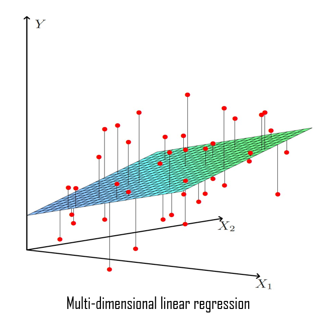{width="45%"}

</center>

<br>


**Observación:**

En este artículo no se va a mostrar los detalles matemáticos sobre cómo se deriva la solución al problema de mínimos cuadrados ordinarios.


&nbsp;


## Estimación de los residuos del modelo <a class="anchor" id="13"></a>


<div class="warning" style='background-color:#F7EBE8; color: #030000; border-left: solid #CA0B0B 7px; border-radius: 3px; size:1px ; padding:0.1em;'>
<span>

$\hspace{0.25cm}$ Los errores del modelo $\varepsilon$ son estimados como sigue:

<br>

$$
\widehat{\varepsilon}_i \hspace{0.1 cm} = \hspace{0.1 cm} y_i - \widehat{y}_i \hspace{0.1 cm} = \hspace{0.1 cm} y_i - x_i^t \cdot \widehat{\beta}  
$$

$\hspace{0.25cm}$ para $\hspace{0.1cm}$ $i=1,...,n$

</p>
 
</p></span>
</div>

<br>


**Observación:**

$\hat{\varepsilon}_i\hspace{0.1cm}$ es el error que comete el modelo cuando predice    $y_i$  como  $\widehat{y}_i=x_i^t \cdot \widehat{\beta}$


&nbsp;


## Suma de cuadrados de los residuos (RSS) <a class="anchor" id="13.1"></a>


<div class="warning" style='background-color:#F7EBE8; color: #030000; border-left: solid #CA0B0B 7px; border-radius: 3px; size:1px ; padding:0.1em;'>
<span>

$\hspace{0.25cm}$ El tamaño de los errores cometidos por el modelo suele cuantificarse como la suma de los errores al cuadrado:


$$RSS(\beta) \hspace{0.1 cm} = \hspace{0.1 cm} \sum_{i=1}^{n} \varepsilon_i\hspace{0.02cm}^2 \hspace{0.1 cm} = \hspace{0.1 cm} \sum_{i=1}^{n} (y_i - x_i^t \cdot \beta)\hspace{0.02cm}^2 $$

</p>
 
</p></span>
</div>

<br>


**Observation:**

Esta expresión juega un rol central en los modelos de regresión. 

Notese que $RSS(\beta)$ es la función objetivo del problema de mínimos cuadrados.


 


&nbsp;


##  Hiperplano de regresión <a class="anchor" id="14"></a>

<div class="warning" style='background-color:#F7EBE8; color: #030000; border-left: solid #CA0B0B 7px; border-radius: 3px; size:1px ; padding:0.1em;'>
<span>

$\hspace{0.25cm}$ El hiperplano de regresión se define como: 


$$\widehat{\hspace{0.1cm} Y} \hspace{0.1cm}=\hspace{0.1cm} X \cdot \widehat{\beta}$$


$\hspace{0.25cm}$ Donde:    $\hspace{0.2cm} \widehat{\hspace{0.1cm} Y}\hspace{0.1cm}=\hspace{0.1cm}(\widehat{y}_1,\widehat{y}_2,...,\widehat{y}_n)^t$


</p>
 
</p></span>
</div>


&nbsp;


### Hat-Matrix <a class="anchor" id="15"></a>


<div class="warning" style='background-color:#F7EBE8; color: #030000; border-left: solid #CA0B0B 7px; border-radius: 3px; size:1px ; padding:0.1em;'>
<span>

$\hspace{0.25cm}$ El hiperplano de regresión puede expresarse alternativamente como sigue:

\begin{gather*}
\widehat{\hspace{0.1cm}Y} = X \cdot \widehat{\beta} = X \cdot (X^t \cdot X)^{-1} \cdot X^t \cdot Y = H \cdot Y  
\end{gather*}

 
$\hspace{0.25cm}$ Donde:  

$$H= X \cdot (X^t \cdot X)^{-1} \cdot X^t$$

$\hspace{0.25cm}$ es llamada **Hat-Matrix**

</p>
 
</p></span>
</div>


&nbsp;


## Precisión de las estimaciones de los coeficientes <a class="anchor" id="19"></a>


<div class="warning" style='background-color:#F7EBE8; color: #030000; border-left: solid #CA0B0B 7px; border-radius: 3px; size:1px ; padding:0.1em;'>
<span>
 
$\hspace{0.25cm}$La precisión de las estimaciones de los coeficientes del modelo es cuantificada con la varianza de los estimadores de los coeficientes, es decir,  $\hspace{0.1cm}$  $Var(\widehat{\beta}_j)$

$\hspace{0.25cm}$Se cumple que:

$$\widehat{\beta}_j \sim N \left( \beta_j \hspace{0.1cm},\hspace{0.1cm}  \sigma^2 \cdot q_{jj}   \right)$$


$\hspace{0.25cm}$Por tanto, se tiene que:

$$Var(\widehat{\beta}_j)\hspace{0.1cm}= \hspace{0.1cm}\sigma^2 \cdot q_{jj}$$


$\hspace{0.25cm}$ Por lo que la estimacion de la varianza de  $\hspace{0.05cm}$  $\widehat{\beta}_j$  $\hspace{0.05cm}$  es : 

<br>

   $$\widehat{Var}(\widehat{\beta}_j) \hspace{0.1cm} = \hspace{0.1cm} \widehat{\sigma}\hspace{0.02cm}^2 \cdot q_{jj}$$
 


$\hspace{0.25cm}$ Donde:


$\hspace{0.35cm} \widehat{\sigma}\hspace{0.02cm}^2 \hspace{0.1cm}$  es la estimacion de la varianza de los residuos  , i.e, $\hspace{0.1cm}$ $\widehat{\sigma}\hspace{0.02cm}^2 = \widehat{Var}(\varepsilon_i)$


$\hspace{0.35cm}q_{jj} \hspace{0.1cm}=\hspace{0.1cm} diag(X^t \cdot X)^{-1}[j+1]$  $\hspace{0.2cm} ,$  $\hspace{0.2cm}\forall j=0,1,...,p$


 </p>
 
</p></span>
</div>


<br>

 ***¿ Por qué la varianza de los estimadores de los coeficientes es importante ?***

La varianza de los estimadores de los coeficientes indica cuanto varian las estimaciones generadas a partir de ellos de una muestra a otra. Cuando la varianza es alta, las estimaciones de los coeficientes varian mucho de una muestra a otra, luego son estimaciones muy imprecisas. Por el contrario cuando la varianza es baja, las estimaciones de los coeficientes varian poco de una muestra a otra, luego las estimaciones son precisas.

 

 <br>


## Estimación de la varianza de los residuos <a class="anchor" id="27"></a>


<div class="warning" style='background-color:#F7EBE8; color: #030000; border-left: solid #CA0B0B 7px; border-radius: 3px; size:1px ; padding:0.1em;'>
<span>


$\hspace{0.25 cm}$ El estimador de la varianza del error $\hspace{0.1cm} Var(\varepsilon_i)=\sigma^2 \hspace{0.1cm}$ se denomina **varianza residual** , y se define como:


$$
 \widehat{Var}(\varepsilon_i) \hspace{0.15cm} =\hspace{0.15cm} \widehat{\sigma}^2  \hspace{0.15cm}=\hspace{0.15cm} \dfrac{1}{n-p-1} \cdot \sum_{i=1}^{n} \hat{\varepsilon}_i\hspace{0.02cm}^2 \hspace{0.15cm}=\hspace{0.15cm}  \dfrac{1}{n-p-1} \cdot (Y^t \cdot Y - \hat{\beta}^t \cdot X^t \cdot Y) \\
$$


 

$\hspace{0.25 cm}$ Además se cumple lo siguiente:


- $\hspace{0.3cm} \dfrac{n-p-1}{\sigma^2} \cdot \widehat{\sigma}^2 \hspace{0.1cm} \sim \hspace{0.1cm} \chi_{n-p-1}^2 \\[0.3cm]$

- $\hspace{0.3cm} E[\widehat{\sigma}^2]=\sigma^2 \\[0.3cm]$


- $\hspace{0.3cm} Var(\widehat{\sigma}^2)=\dfrac{2 \cdot \sigma^4}{n-p-1}$


</p>
 
</p></span>
</div>


<br>


# Modelo de regresión lineal en `Python`   

<br>

## Usando `statsmodels` <a class="anchor" id="17"></a>


Podemos implementar un modelo de regresión lineal en Python con la libreria `statsmodels` siguiendo dos caminos.

<br>

***Primera forma:*** $\hspace{0.1cm}$ usando `statsmodels.formula.api`


```python
# pip install statmodels
```


```python
import statsmodels.formula.api as smf
```


```python
model_Py_smf = smf.ols(formula = 'price ~ size_in_m_2 + no_of_bedrooms + no_of_bathrooms + quality + latitude + longitude', 
                       data =data_Python)

model_Py_smf = model_Py_smf.fit()
 
print(model_Py_smf.summary())
```

                                OLS Regression Results                            
    ==============================================================================
    Dep. Variable:                  price   R-squared:                       0.698
    Model:                            OLS   Adj. R-squared:                  0.697
    Method:                 Least Squares   F-statistic:                     547.4
    Date:               sá., 22 oct. 2022   Prob (F-statistic):               0.00
    Time:                        19:25:11   Log-Likelihood:                -29918.
    No. Observations:                1905   AIC:                         5.985e+04
    Df Residuals:                    1896   BIC:                         5.990e+04
    Df Model:                           8                                         
    Covariance Type:            nonrobust                                         
    ===================================================================================
                          coef    std err          t      P>|t|      [0.025      0.975]
    -----------------------------------------------------------------------------------
    Intercept       -6.207e+07   2.99e+07     -2.073      0.038   -1.21e+08   -3.34e+06
    quality[T.1]       1.4e+05   8.36e+04      1.675      0.094   -2.39e+04    3.04e+05
    quality[T.2]     3.406e+05   1.55e+05      2.196      0.028    3.63e+04    6.45e+05
    quality[T.3]     2.788e+05   1.98e+05      1.410      0.159   -1.09e+05    6.66e+05
    size_in_m_2      3.566e+04    723.831     49.271      0.000    3.42e+04    3.71e+04
    no_of_bedrooms  -8.367e+05   8.28e+04    -10.102      0.000   -9.99e+05   -6.74e+05
    no_of_bathrooms -5.712e+04   6.83e+04     -0.836      0.403   -1.91e+05    7.68e+04
    latitude         6.115e+06   7.81e+05      7.830      0.000    4.58e+06    7.65e+06
    longitude       -1.677e+06   6.91e+05     -2.428      0.015   -3.03e+06   -3.22e+05
    ==============================================================================
    Omnibus:                      779.851   Durbin-Watson:                   1.716
    Prob(Omnibus):                  0.000   Jarque-Bera (JB):            25742.187
    Skew:                           1.273   Prob(JB):                         0.00
    Kurtosis:                      20.828   Cond. No.                     1.34e+05
    ==============================================================================
    
    Notes:
    [1] Standard Errors assume that the covariance matrix of the errors is correctly specified.
    [2] The condition number is large, 1.34e+05. This might indicate that there are
    strong multicollinearity or other numerical problems.
    


<br>


***Segunda forma:***  $\hspace{0.1cm}$ usando  `statsmodels.api`

Una de las diferencias más importantes entre la primera y la segunda forma de usar `statmodels` para estimar un modelo de regresión lineal es que `statsmodels.api` no estima el intercepto $(\beta_0)$ , mientras que `statsmodels.formula.api` si.

Otra importante diferencia es que `statsmodels.api` no entiende si un predictor es categorico, mientras que`statsmodels.formula.api` si.

Para estimar el intercepto e incluir predictores categoricos usando `statsmodels.api` necesitamos añadir tanto el intercepto como un vector de unos, como las variables dummies asociadas a los predictores categoricos, a la  matriz de predictores $X$ como nuevas columnas (y dejar de considerar las columnas asociadas a los predictores categoricos), y esto puede hacerse facilmente usando la función `varcharProcessing` , la cual expondremos a continuación. $\\[0.3cm]$


**Observación :**

Las variables dummies asociadas a los predictores categoricos son las variables que se obtienen al *dummificar* una variable categorica. Este procedimiento será visto con más detalle en otro artículo.


```python
def varcharProcessing(X, varchar_process = "dummy_dropfirst"):
    
    dtypes = X.dtypes

    if varchar_process == "drop":   
        X = X.drop(columns = dtypes[dtypes == np.object].index.tolist())

    elif varchar_process == "dummy":
        X = pd.get_dummies(X,drop_first=False)

    elif varchar_process == "dummy_dropfirst":
        X = pd.get_dummies(X,drop_first=True)

    else: 
        X = pd.get_dummies(X,drop_first=True)
    
    X["intercept"] = 1
    cols = X.columns.tolist()
    cols = cols[-1:] + cols[:-1]
    X = X[cols]
    
    return X
```

<br>

Vamos a ver como funciona `varcharProcessing` :


```python
X = data_Python[['size_in_m_2', 'longitude', 'latitude', 'no_of_bedrooms', 'no_of_bathrooms', 'quality']]
```


```python
X.head()
```


<div>
<style scoped>
    .dataframe tbody tr th:only-of-type {
        vertical-align: middle;
    }

    .dataframe tbody tr th {
        vertical-align: top;
    }

    .dataframe thead th {
        text-align: right;
    }
</style>
<table border="1" class="dataframe">
  <thead>
    <tr style="text-align: right;">
      <th></th>
      <th>size_in_m_2</th>
      <th>longitude</th>
      <th>latitude</th>
      <th>no_of_bedrooms</th>
      <th>no_of_bathrooms</th>
      <th>quality</th>
    </tr>
  </thead>
  <tbody>
    <tr>
      <th>0</th>
      <td>100.242337</td>
      <td>55.138932</td>
      <td>25.113208</td>
      <td>1</td>
      <td>2</td>
      <td>1</td>
    </tr>
    <tr>
      <th>1</th>
      <td>146.972546</td>
      <td>55.151201</td>
      <td>25.106809</td>
      <td>2</td>
      <td>2</td>
      <td>1</td>
    </tr>
    <tr>
      <th>2</th>
      <td>181.253753</td>
      <td>55.137728</td>
      <td>25.063302</td>
      <td>3</td>
      <td>5</td>
      <td>1</td>
    </tr>
    <tr>
      <th>3</th>
      <td>187.664060</td>
      <td>55.341761</td>
      <td>25.227295</td>
      <td>2</td>
      <td>3</td>
      <td>0</td>
    </tr>
    <tr>
      <th>4</th>
      <td>47.101821</td>
      <td>55.139764</td>
      <td>25.114275</td>
      <td>0</td>
      <td>1</td>
      <td>1</td>
    </tr>
  </tbody>
</table>
</div>

```python
varcharProcessing(X, varchar_process = "dummy_dropfirst").head()
```
<div>
<style scoped>
    .dataframe tbody tr th:only-of-type {
        vertical-align: middle;
    }

    .dataframe tbody tr th {
        vertical-align: top;
    }

    .dataframe thead th {
        text-align: right;
    }
</style>
<table border="1" class="dataframe">
  <thead>
    <tr style="text-align: right;">
      <th></th>
      <th>intercept</th>
      <th>size_in_m_2</th>
      <th>longitude</th>
      <th>latitude</th>
      <th>no_of_bedrooms</th>
      <th>no_of_bathrooms</th>
      <th>quality_1</th>
      <th>quality_2</th>
      <th>quality_3</th>
    </tr>
  </thead>
  <tbody>
    <tr>
      <th>0</th>
      <td>1</td>
      <td>100.242337</td>
      <td>55.138932</td>
      <td>25.113208</td>
      <td>1</td>
      <td>2</td>
      <td>1</td>
      <td>0</td>
      <td>0</td>
    </tr>
    <tr>
      <th>1</th>
      <td>1</td>
      <td>146.972546</td>
      <td>55.151201</td>
      <td>25.106809</td>
      <td>2</td>
      <td>2</td>
      <td>1</td>
      <td>0</td>
      <td>0</td>
    </tr>
    <tr>
      <th>2</th>
      <td>1</td>
      <td>181.253753</td>
      <td>55.137728</td>
      <td>25.063302</td>
      <td>3</td>
      <td>5</td>
      <td>1</td>
      <td>0</td>
      <td>0</td>
    </tr>
    <tr>
      <th>3</th>
      <td>1</td>
      <td>187.664060</td>
      <td>55.341761</td>
      <td>25.227295</td>
      <td>2</td>
      <td>3</td>
      <td>0</td>
      <td>0</td>
      <td>0</td>
    </tr>
    <tr>
      <th>4</th>
      <td>1</td>
      <td>47.101821</td>
      <td>55.139764</td>
      <td>25.114275</td>
      <td>0</td>
      <td>1</td>
      <td>1</td>
      <td>0</td>
      <td>0</td>
    </tr>
  </tbody>
</table>
</div>


<br>


Importamos ahora `statsmodels.api`

```python
import statsmodels.api as sm
```

Creamos la matriz $\hspace{0.1cm} X\hspace{0.1cm}$ y el vector $\hspace{0.1cm}Y$

```python
X = data_Python[['size_in_m_2', 'longitude', 'latitude', 'no_of_bedrooms', 'no_of_bathrooms', 'quality']]

Y = data_Python['price']
```

Ahora aplicamos la funcion `varcharProcessing` sobre $X$ para hacer las transformaciones necesarias para poder estimar el intercepto e incluir predictores categoricos en la regresión, como antes se mencionó.

```python
X = varcharProcessing(X, varchar_process = "dummy_dropfirst")
```


Ajustamos el modelo:

```python
model_Py_sm = sm.OLS(y , X).fit()
```

Imprimimos una tabla resumen sobre el modelo ajustado:
```python
print(model_Py_sm.summary())
```


                                OLS Regression Results                            
    ==============================================================================
    Dep. Variable:                  price   R-squared:                       0.698
    Model:                            OLS   Adj. R-squared:                  0.697
    Method:                 Least Squares   F-statistic:                     547.4
    Date:               sá., 22 oct. 2022   Prob (F-statistic):               0.00
    Time:                        19:25:20   Log-Likelihood:                -29918.
    No. Observations:                1905   AIC:                         5.985e+04
    Df Residuals:                    1896   BIC:                         5.990e+04
    Df Model:                           8                                         
    Covariance Type:            nonrobust                                         
    ===================================================================================
                          coef    std err          t      P>|t|      [0.025      0.975]
    -----------------------------------------------------------------------------------
    intercept       -6.207e+07   2.99e+07     -2.073      0.038   -1.21e+08   -3.34e+06
    size_in_m_2      3.566e+04    723.831     49.271      0.000    3.42e+04    3.71e+04
    longitude       -1.677e+06   6.91e+05     -2.428      0.015   -3.03e+06   -3.22e+05
    latitude         6.115e+06   7.81e+05      7.830      0.000    4.58e+06    7.65e+06
    no_of_bedrooms  -8.367e+05   8.28e+04    -10.102      0.000   -9.99e+05   -6.74e+05
    no_of_bathrooms -5.712e+04   6.83e+04     -0.836      0.403   -1.91e+05    7.68e+04
    quality_1          1.4e+05   8.36e+04      1.675      0.094   -2.39e+04    3.04e+05
    quality_2        3.406e+05   1.55e+05      2.196      0.028    3.63e+04    6.45e+05
    quality_3        2.788e+05   1.98e+05      1.410      0.159   -1.09e+05    6.66e+05
    ==============================================================================
    Omnibus:                      779.851   Durbin-Watson:                   1.716
    Prob(Omnibus):                  0.000   Jarque-Bera (JB):            25742.187
    Skew:                           1.273   Prob(JB):                         0.00
    Kurtosis:                      20.828   Cond. No.                     1.34e+05
    ==============================================================================
    
    Notes:
    [1] Standard Errors assume that the covariance matrix of the errors is correctly specified.
    [2] The condition number is large, 1.34e+05. This might indicate that there are
    strong multicollinearity or other numerical problems.
    

<br>

Consideremos la siguiente representación formal de las variables: 

$\hspace{0.1cm} P=\left(\hspace{0.1cm} p_i \hspace{0.1cm} /\hspace{0.1cm}  i\in \lbrace 1,...,n \rbrace\hspace{0.1cm} \right)\hspace{0.15cm}$  es la variable price.

$\hspace{0.1cm} Q=\left(\hspace{0.1cm} q_i \hspace{0.1cm} /\hspace{0.1cm}  i\in \lbrace 1,...,n \rbrace\hspace{0.1cm} \right)\hspace{0.15cm}$  es la variable quality.

$\hspace{0.1cm} S=\left(\hspace{0.1cm} s_i \hspace{0.1cm} /\hspace{0.1cm}  i\in \lbrace 1,...,n \rbrace\hspace{0.1cm} \right)\hspace{0.15cm}$  es la variable size.

$\hspace{0.1cm} BD=\left(\hspace{0.1cm} bd_i \hspace{0.1cm} /\hspace{0.1cm}  i\in \lbrace 1,...,n \rbrace\hspace{0.1cm} \right)\hspace{0.15cm}$  es la variable bedrooms.

$\hspace{0.1cm} BT=\left(\hspace{0.1cm} bt_i \hspace{0.1cm} /\hspace{0.1cm}  i\in \lbrace 1,...,n \rbrace\hspace{0.1cm} \right)\hspace{0.15cm}$  es la variable bathrooms.

$\hspace{0.1cm} LA=\left(\hspace{0.1cm} la_i \hspace{0.1cm} /\hspace{0.1cm}  i\in \lbrace 1,...,n \rbrace\hspace{0.1cm} \right)\hspace{0.15cm}$  es la variable latitude.

$\hspace{0.1cm} LO=\left(\hspace{0.1cm} lo_i \hspace{0.1cm} /\hspace{0.1cm}  i\in \lbrace 1,...,n \rbrace\hspace{0.1cm} \right)\hspace{0.15cm}$  es la variable longitude.

<br>

Esta salida nos da, entre otras cosas, la estimación de los coeficientes (betas) del modelo:


- $\hspace{0.1cm} \widehat{\beta}_0 \hspace{0.1cm} =\hspace{0.1cm} -6.207\cdot 10^7 \\$


- $\hspace{0.1cm}\widehat{\beta}_{s} \hspace{0.1cm} =\hspace{0.1cm} 3.566\cdot 10^4 \\$

- $\hspace{0.1cm}\widehat{\beta}_{lo}= -1.677\cdot 10^6 \\$

- $\hspace{0.1cm}\widehat{\beta}_{la}=6.115\cdot 10^6 \\$

- $\hspace{0.1cm}\widehat{\beta}_{bd} \hspace{0.1cm}=\hspace{0.1cm} -8.367\cdot 10^5 \\$

- $\hspace{0.1cm}\widehat{\beta}_{bt} \hspace{0.1cm}=\hspace{0.1cm} -5.712\cdot 10^4 \\$

- $\hspace{0.1cm}\widehat{\beta}_{q1} \hspace{0.1cm}=\hspace{0.1cm} 1.4\cdot 10^5 \\$

- $\hspace{0.1cm}\widehat{\beta}_{q2} \hspace{0.1cm}=\hspace{0.1cm} 3.406\cdot 10^5 \\$

- $\hspace{0.1cm}\widehat{\beta}_{q3} \hspace{0.1cm}=\hspace{0.1cm} 2.788\cdot 10^5 \\$


 
<br>


El modelo estimado es el siguiente:

$$\widehat{p}_i \hspace{0.15cm}=\hspace{0.15cm} \widehat{\beta}_{0} \hspace{0.1cm}+\hspace{0.1cm} \widehat{\beta}_{q1} \cdot I(q_i = 1) \hspace{0.1cm}+\hspace{0.1cm}\widehat{\beta}_{q2} \cdot I(q_i = 2) \hspace{0.1cm}+\hspace{0.1cm}\widehat{\beta}_{q3} \cdot I(q_i = 3)\hspace{0.1cm}+\hspace{0.1cm}\widehat{\beta}_{s} \cdot s_i \hspace{0.1cm}+\hspace{0.1cm}\widehat{\beta}_{bd}\cdot bd_i\hspace{0.1cm}+\hspace{0.1cm}\widehat{\beta}_{bt}\cdot bt_i \hspace{0.1cm}+\hspace{0.1cm} \widehat{\beta}_{la}\cdot la_i\hspace{0.1cm}+\hspace{0.1cm}\widehat{\beta}_{lo}\cdot lo_i\hspace{0.1cm} \\$$


Sustituyendo los valores obtenidos para las estimaciones de los coeficientes obtenemos lo siguiente:

$$\hat{p}_i \hspace{0.15cm}=\hspace{0.15cm} -6.207\cdot 10^7 \hspace{0.1cm}+\hspace{0.1cm} 1.4\cdot 10^5 \cdot I(q_i = 1)\hspace{0.1cm}+\hspace{0.1cm}  3.406\cdot 10^5 \cdot I(q_i = 2) \hspace{0.1cm}+\hspace{0.1cm} 2.788\cdot 10^5  \cdot I(q_i = 3) \hspace{0.1cm}+\hspace{0.1cm} 3.566\cdot 10^4  \cdot s_i \\[0.5cm] \hspace{0.1cm}-\hspace{0.1cm} 8.367\cdot 10^5 \cdot bd_i \hspace{0.1cm}-\hspace{0.1cm} 5.712\cdot 10^4 \cdot\cdot bt_i \hspace{0.1cm}+\hspace{0.1cm}6.115\cdot 10^6 \cdot la_i \hspace{0.1cm}-\hspace{0.1cm} 1.677\cdot 10^6 \cdot lo_i   \\$$


<br>

**Observación:**

La variable categorica **quality** que tiene 4 categorias (Low (0), Medium (1),
High (2), Ultra (3)), entra en el modelo con 3 variables dummies (quality1 ,
quality2, quality3 ), que se corresponden con las obtenidas al dummificacar la variable **quality**, si se toma como categoria estandar Low (0).

Esto no es algo particular de esta variable, si no que es una caracteristica del modelo de regresión lineal. Posteriormente se verá con más detalle.


<br>


## Usando  `scikit-learn` <a class="anchor" id="18"></a>


Instalamos la libreria:
```python
# pip install sklearn
```

Importamos la libreria y los módulos que vamos a utilizar:
```python
import sklearn

from sklearn.linear_model import LinearRegression

from sklearn.model_selection import train_test_split
```

<br>

Cargamos la matriz $X$ y el vector $Y$

```python
X = data_Python[['size_in_m_2', 'longitude', 'latitude', 'no_of_bedrooms', 'no_of_bathrooms', 'quality']]
y = data_Python['price']
```

Transformamos la matriz $\hspace{0.1cm}X\hspace{0.1cm}$ para poder estimar el intercepto e incluir variables categoricas, al igual que tuvimos que hacer al usar `statsmodels.api`.

```python
X = varcharProcessing(X, varchar_process = "dummy_dropfirst")
```


```python
X.head()
```


<div>
<style scoped>
    .dataframe tbody tr th:only-of-type {
        vertical-align: middle;
    }

    .dataframe tbody tr th {
        vertical-align: top;
    }

    .dataframe thead th {
        text-align: right;
    }
</style>
<table border="1" class="dataframe">
  <thead>
    <tr style="text-align: right;">
      <th></th>
      <th>intercept</th>
      <th>size_in_m_2</th>
      <th>longitude</th>
      <th>latitude</th>
      <th>no_of_bedrooms</th>
      <th>no_of_bathrooms</th>
      <th>quality_1</th>
      <th>quality_2</th>
      <th>quality_3</th>
    </tr>
  </thead>
  <tbody>
    <tr>
      <th>0</th>
      <td>1</td>
      <td>100.242337</td>
      <td>55.138932</td>
      <td>25.113208</td>
      <td>1</td>
      <td>2</td>
      <td>1</td>
      <td>0</td>
      <td>0</td>
    </tr>
    <tr>
      <th>1</th>
      <td>1</td>
      <td>146.972546</td>
      <td>55.151201</td>
      <td>25.106809</td>
      <td>2</td>
      <td>2</td>
      <td>1</td>
      <td>0</td>
      <td>0</td>
    </tr>
    <tr>
      <th>2</th>
      <td>1</td>
      <td>181.253753</td>
      <td>55.137728</td>
      <td>25.063302</td>
      <td>3</td>
      <td>5</td>
      <td>1</td>
      <td>0</td>
      <td>0</td>
    </tr>
    <tr>
      <th>3</th>
      <td>1</td>
      <td>187.664060</td>
      <td>55.341761</td>
      <td>25.227295</td>
      <td>2</td>
      <td>3</td>
      <td>0</td>
      <td>0</td>
      <td>0</td>
    </tr>
    <tr>
      <th>4</th>
      <td>1</td>
      <td>47.101821</td>
      <td>55.139764</td>
      <td>25.114275</td>
      <td>0</td>
      <td>1</td>
      <td>1</td>
      <td>0</td>
      <td>0</td>
    </tr>
  </tbody>
</table>
</div>


<br>

Ajustamos el modelo:

```python
Model_Py_sklearn = LinearRegression().fit(X, y)
```

<br>

Podemos obtener las estimaciones de los coeficientes del siguiente modo:

```python
Model_Py_sklearn.intercept_
```


    -62071412.530511364


```python
Model_Py_sklearn.coef_
```


    array([       0.        ,    35664.04832657, -1677160.95037418,
            6114932.04602611,  -836682.98365871,   -57120.8092927 ,
             140018.66529665,   340613.10347113,   278761.44732511])


Notese que la $\hspace{0.1cm} j$-esima componente de este array es $\hspace{0.1cm}\widehat{\beta}_j\hspace{0.1cm}$ , para $\hspace{0.1cm}j=1,...,p$
Note that the order of the array values follows the order of $\hspace{0.1cm}X\hspace{0.1cm}$ columns.


<br>


 


## Estimación de la varianza de los estimadores de los coeficientes en `Python` <a class="anchor" id="21"></a>


```python
print(model_Py_sm.summary())
```

                                OLS Regression Results                            
    ==============================================================================
    Dep. Variable:                  price   R-squared:                       0.698
    Model:                            OLS   Adj. R-squared:                  0.697
    Method:                 Least Squares   F-statistic:                     547.4
    Date:               sá., 22 oct. 2022   Prob (F-statistic):               0.00
    Time:                        19:25:32   Log-Likelihood:                -29918.
    No. Observations:                1905   AIC:                         5.985e+04
    Df Residuals:                    1896   BIC:                         5.990e+04
    Df Model:                           8                                         
    Covariance Type:            nonrobust                                         
    ===================================================================================
                          coef    std err          t      P>|t|      [0.025      0.975]
    -----------------------------------------------------------------------------------
    intercept       -6.207e+07   2.99e+07     -2.073      0.038   -1.21e+08   -3.34e+06
    size_in_m_2      3.566e+04    723.831     49.271      0.000    3.42e+04    3.71e+04
    longitude       -1.677e+06   6.91e+05     -2.428      0.015   -3.03e+06   -3.22e+05
    latitude         6.115e+06   7.81e+05      7.830      0.000    4.58e+06    7.65e+06
    no_of_bedrooms  -8.367e+05   8.28e+04    -10.102      0.000   -9.99e+05   -6.74e+05
    no_of_bathrooms -5.712e+04   6.83e+04     -0.836      0.403   -1.91e+05    7.68e+04
    quality_1          1.4e+05   8.36e+04      1.675      0.094   -2.39e+04    3.04e+05
    quality_2        3.406e+05   1.55e+05      2.196      0.028    3.63e+04    6.45e+05
    quality_3        2.788e+05   1.98e+05      1.410      0.159   -1.09e+05    6.66e+05
    ==============================================================================
    Omnibus:                      779.851   Durbin-Watson:                   1.716
    Prob(Omnibus):                  0.000   Jarque-Bera (JB):            25742.187
    Skew:                           1.273   Prob(JB):                         0.00
    Kurtosis:                      20.828   Cond. No.                     1.34e+05
    ==============================================================================
    
    Notes:
    [1] Standard Errors assume that the covariance matrix of the errors is correctly specified.
    [2] The condition number is large, 1.34e+05. This might indicate that there are
    strong multicollinearity or other numerical problems.
    


Esta salida nos da entre otras cosas la desviación típica (`std err`) de los estimadores de los coeficientes:


<br>

- $\hspace{0.1cm} \sqrt{\widehat{Var}(\widehat{\beta}_0)}=2.995\cdot 10^7 \\$

- $\hspace{0.1cm}\sqrt{\widehat{Var}(\widehat{\beta}_{q1})}=8.358\cdot 10^4 \\$ 

- $\hspace{0.1cm}\sqrt{\widehat{Var}(\widehat{\beta}_{q2})}=1.551\cdot 10^5 \\$

- $\hspace{0.1cm}\sqrt{\widehat{Var}(\widehat{\beta}_{q3})}= 1.976\cdot 10^5 \\$

- $\hspace{0.1cm}\sqrt{\widehat{Var}(\widehat{\beta}_{s})}= 7.238\cdot 10^2 \\$

- $\hspace{0.1cm}\sqrt{\widehat{Var}(\widehat{\beta}_{bd})}=8.282\cdot 10^4 \\$

- $\hspace{0.1cm}\sqrt{\widehat{Var}(\widehat{\beta}_{bt})}=6.829\cdot 10^4 \\$

- $\hspace{0.1cm}\sqrt{\widehat{Var}(\widehat{\beta}_{la})}=7.809\cdot 10^5 \\$

- $\hspace{0.1cm}\sqrt{\widehat{Var}(\widehat{\beta}_{lo})}=6.908\cdot 10^5 \\$
 
  


<br>


 

## Predicciones del modelo de regresión lineal en `Python`


### Usando   `Statsmodels` <a class="anchor" id="23"></a>


**Opción uno: usar `smf`**


```python
model_Py_smf = smf.ols(formula = 'price ~ size_in_m_2 + no_of_bedrooms + no_of_bathrooms + quality + latitude + longitude', 
                 data =data_Python).fit()
```

<br>


**Usando los datos con los que se entrenó el modelo:**


```python
 model_Py_smf.predict(data_Python)
```


    0       1.781426e+06
    1       2.551625e+06
    2       2.522740e+06
    3       4.222873e+06
    4       7.851530e+05
                ...     
    1900    1.211313e+06
    1901    8.171580e+05
    1902    2.981084e+06
    1903    2.651215e+05
    1904    8.227585e+05
    Length: 1905, dtype: float64

<br>


**Usando nuevos datos:**


```python
size_in_m_2  = pd.Series([100, 140,160,180,98,120,200]) 
longitude  = pd.Series([55.1,55.3,55.2,55.1,55.2,55.1,55.1]) 
latitude = pd.Series([25.1,25.2,25.1,25.1,25.3,25.1,25.2])
no_of_bedrooms = pd.Series([1,3,0,2,3,1,4])
no_of_bathrooms = pd.Series([1,3,2,2,1,2,2])
quality = pd.Series([1,0,2,2,3,2,1])

new_data = pd.DataFrame({'size_in_m_2':size_in_m_2, 'longitude':longitude , 'latitude':latitude, 'no_of_bedrooms':no_of_bedrooms , 'no_of_bathrooms':no_of_bathrooms , 'quality':quality }) 

new_data['quality'] = new_data['quality'].astype('category')
```


```python
new_data.head()
```

<div>
<style scoped>
    .dataframe tbody tr th:only-of-type {
        vertical-align: middle;
    }

    .dataframe tbody tr th {
        vertical-align: top;
    }

    .dataframe thead th {
        text-align: right;
    }
</style>
<table border="1" class="dataframe">
  <thead>
    <tr style="text-align: right;">
      <th></th>
      <th>size_in_m_2</th>
      <th>longitude</th>
      <th>latitude</th>
      <th>no_of_bedrooms</th>
      <th>no_of_bathrooms</th>
      <th>quality</th>
    </tr>
  </thead>
  <tbody>
    <tr>
      <th>0</th>
      <td>100</td>
      <td>55.1</td>
      <td>25.1</td>
      <td>1</td>
      <td>1</td>
      <td>1</td>
    </tr>
    <tr>
      <th>1</th>
      <td>140</td>
      <td>55.3</td>
      <td>25.2</td>
      <td>3</td>
      <td>3</td>
      <td>0</td>
    </tr>
    <tr>
      <th>2</th>
      <td>160</td>
      <td>55.2</td>
      <td>25.1</td>
      <td>0</td>
      <td>2</td>
      <td>2</td>
    </tr>
    <tr>
      <th>3</th>
      <td>180</td>
      <td>55.1</td>
      <td>25.1</td>
      <td>2</td>
      <td>2</td>
      <td>2</td>
    </tr>
    <tr>
      <th>4</th>
      <td>98</td>
      <td>55.2</td>
      <td>25.3</td>
      <td>3</td>
      <td>1</td>
      <td>3</td>
    </tr>
  </tbody>
</table>
</div>

```python
 model_Py_smf.predict(new_data)
```

    0    1.814433e+06
    1    1.589430e+06
    2    4.766717e+06
    3    3.974348e+06
    4    1.263752e+06
    5    2.671188e+06
    6    3.425161e+06
    dtype: float64


<br>


**Opción dos: usar `sm`**


```python
model_Py_sm = sm.OLS(y , X).fit()
```

 
 <br>

**Usando los datos con los que se entrenó el modelo:**


```python
 model_Py_sm.predict(X)
```

    0       1.781426e+06
    1       2.551625e+06
    2       2.522740e+06
    3       4.222873e+06
    4       7.851530e+05
                ...     
    1900    1.211313e+06
    1901    8.171580e+05
    1902    2.981084e+06
    1903    2.651215e+05
    1904    8.227585e+05
    Length: 1905, dtype: float64
    

<br>

**Usando nuevos datos:** 


```python
intercept = 1
size_in_m_2  = pd.Series([100, 140,160,180,98,120,200]) 
longitude  = pd.Series([55.1,55.3,55.2,55.1,55.2,55.1,55.1]) 
latitude = pd.Series([25.1,25.2,25.1,25.1,25.3,25.1,25.2])
no_of_bedrooms = pd.Series([1,3,0,2,3,1,4])
no_of_bathrooms = pd.Series([1,3,2,2,1,2,2])
quality_1 = pd.Series([1,0,0,0,0,0,1])
quality_2 = pd.Series([0,0,1,1,0,1,0])
quality_3 = pd.Series([0,0,0,0,1,0,0])

new_data = pd.DataFrame({'intercept':intercept , 'size_in_m_2':size_in_m_2, 'longitude':longitude , 'latitude':latitude, 'no_of_bedrooms':no_of_bedrooms , 'no_of_bathrooms':no_of_bathrooms , 'quality_1':quality_1, 'quality_2':quality_2, 'quality_3':quality_3 }) 
```


```python
new_data.head()
```


<div>
<style scoped>
    .dataframe tbody tr th:only-of-type {
        vertical-align: middle;
    }

    .dataframe tbody tr th {
        vertical-align: top;
    }

    .dataframe thead th {
        text-align: right;
    }
</style>
<table border="1" class="dataframe">
  <thead>
    <tr style="text-align: right;">
      <th></th>
      <th>intercept</th>
      <th>size_in_m_2</th>
      <th>longitude</th>
      <th>latitude</th>
      <th>no_of_bedrooms</th>
      <th>no_of_bathrooms</th>
      <th>quality_1</th>
      <th>quality_2</th>
      <th>quality_3</th>
    </tr>
  </thead>
  <tbody>
    <tr>
      <th>0</th>
      <td>1</td>
      <td>100</td>
      <td>55.1</td>
      <td>25.1</td>
      <td>1</td>
      <td>1</td>
      <td>1</td>
      <td>0</td>
      <td>0</td>
    </tr>
    <tr>
      <th>1</th>
      <td>1</td>
      <td>140</td>
      <td>55.3</td>
      <td>25.2</td>
      <td>3</td>
      <td>3</td>
      <td>0</td>
      <td>0</td>
      <td>0</td>
    </tr>
    <tr>
      <th>2</th>
      <td>1</td>
      <td>160</td>
      <td>55.2</td>
      <td>25.1</td>
      <td>0</td>
      <td>2</td>
      <td>0</td>
      <td>1</td>
      <td>0</td>
    </tr>
    <tr>
      <th>3</th>
      <td>1</td>
      <td>180</td>
      <td>55.1</td>
      <td>25.1</td>
      <td>2</td>
      <td>2</td>
      <td>0</td>
      <td>1</td>
      <td>0</td>
    </tr>
    <tr>
      <th>4</th>
      <td>1</td>
      <td>98</td>
      <td>55.2</td>
      <td>25.3</td>
      <td>3</td>
      <td>1</td>
      <td>0</td>
      <td>0</td>
      <td>1</td>
    </tr>
  </tbody>
</table>
</div>


```python
 model_Py_sm.predict(new_data)
```


    0    1.814433e+06
    1    1.589430e+06
    2    4.766717e+06
    3    3.974348e+06
    4    1.263752e+06
    5    2.671188e+06
    6    3.425161e+06
    dtype: float64

<br>


### Usando `scikit-learn` <a class="anchor" id="24"></a>


```python
 Model_Py_sklearn = LinearRegression().fit(X, y)
```

<br>


**Usando los datos con los que se entrenó el modelo:**


```python
Model_Py_sklearn.predict(X)
```

    array([1781425.86565974, 2551624.77622508, 2522740.02878734, ...,
           2981084.40367965,  265121.52263755,  822758.48682222])


**Usando nuevos datos:**


```python
intercept = 1
size_in_m_2  = pd.Series([100, 140,160,180,98,120,200]) 
longitude  = pd.Series([55.1,55.3,55.2,55.1,55.2,55.1,55.1]) 
latitude = pd.Series([25.1,25.2,25.1,25.1,25.3,25.1,25.2])
no_of_bedrooms = pd.Series([1,3,0,2,3,1,4])
no_of_bathrooms = pd.Series([1,3,2,2,1,2,2])
quality_1 = pd.Series([1,0,0,0,0,0,1])
quality_2 = pd.Series([0,0,1,1,0,1,0])
quality_3 = pd.Series([0,0,0,0,1,0,0])

new_data = pd.DataFrame({'intercept':intercept , 'size_in_m_2':size_in_m_2, 'longitude':longitude , 'latitude':latitude, 'no_of_bedrooms':no_of_bedrooms , 'no_of_bathrooms':no_of_bathrooms , 'quality_1':quality_1, 'quality_2':quality_2, 'quality_3':quality_3 }) 
```


```python
new_data.head()
```
<div>
<style scoped>
    .dataframe tbody tr th:only-of-type {
        vertical-align: middle;
    }

    .dataframe tbody tr th {
        vertical-align: top;
    }

    .dataframe thead th {
        text-align: right;
    }
</style>
<table border="1" class="dataframe">
  <thead>
    <tr style="text-align: right;">
      <th></th>
      <th>intercept</th>
      <th>size_in_m_2</th>
      <th>longitude</th>
      <th>latitude</th>
      <th>no_of_bedrooms</th>
      <th>no_of_bathrooms</th>
      <th>quality_1</th>
      <th>quality_2</th>
      <th>quality_3</th>
    </tr>
  </thead>
  <tbody>
    <tr>
      <th>0</th>
      <td>1</td>
      <td>100</td>
      <td>55.1</td>
      <td>25.1</td>
      <td>1</td>
      <td>1</td>
      <td>1</td>
      <td>0</td>
      <td>0</td>
    </tr>
    <tr>
      <th>1</th>
      <td>1</td>
      <td>140</td>
      <td>55.3</td>
      <td>25.2</td>
      <td>3</td>
      <td>3</td>
      <td>0</td>
      <td>0</td>
      <td>0</td>
    </tr>
    <tr>
      <th>2</th>
      <td>1</td>
      <td>160</td>
      <td>55.2</td>
      <td>25.1</td>
      <td>0</td>
      <td>2</td>
      <td>0</td>
      <td>1</td>
      <td>0</td>
    </tr>
    <tr>
      <th>3</th>
      <td>1</td>
      <td>180</td>
      <td>55.1</td>
      <td>25.1</td>
      <td>2</td>
      <td>2</td>
      <td>0</td>
      <td>1</td>
      <td>0</td>
    </tr>
    <tr>
      <th>4</th>
      <td>1</td>
      <td>98</td>
      <td>55.2</td>
      <td>25.3</td>
      <td>3</td>
      <td>1</td>
      <td>0</td>
      <td>0</td>
      <td>1</td>
    </tr>
  </tbody>
</table>
</div>


```python
Model_Py_sklearn.predict(new_data)
```


    array([1814433.16412918, 1589429.86052027, 4766716.58122643,
           3974347.67547783, 1263752.19635488, 2671187.75954236,
           3425161.44111995])


<br>


 

 
## Estimación de los residuos en `Python` <a class="anchor" id="26"></a>


```python
predictions = pd.DataFrame( {'predictions':  model_Py_sm.predict(X)} )
```


```python
df_predictions_Python = pd.concat([y, predictions], axis=1)
df_predictions_Python.head()
```

<div>
<style scoped>
    .dataframe tbody tr th:only-of-type {
        vertical-align: middle;
    }

    .dataframe tbody tr th {
        vertical-align: top;
    }

    .dataframe thead th {
        text-align: right;
    }
</style>
<table border="1" class="dataframe">
  <thead>
    <tr style="text-align: right;">
      <th></th>
      <th>price</th>
      <th>predictions</th>
    </tr>
  </thead>
  <tbody>
    <tr>
      <th>0</th>
      <td>2700000</td>
      <td>1.781426e+06</td>
    </tr>
    <tr>
      <th>1</th>
      <td>2850000</td>
      <td>2.551625e+06</td>
    </tr>
    <tr>
      <th>2</th>
      <td>1150000</td>
      <td>2.522740e+06</td>
    </tr>
    <tr>
      <th>3</th>
      <td>2850000</td>
      <td>4.222873e+06</td>
    </tr>
    <tr>
      <th>4</th>
      <td>1729200</td>
      <td>7.851530e+05</td>
    </tr>
  </tbody>
</table>
</div>


```python
estimated_errors = y - model_Py_sm.predict(X)
```


```python
df_predictions_Python['estimated_errors'] = estimated_errors 

df_predictions_Python.head()
```


<div>
<style scoped>
    .dataframe tbody tr th:only-of-type {
        vertical-align: middle;
    }

    .dataframe tbody tr th {
        vertical-align: top;
    }

    .dataframe thead th {
        text-align: right;
    }
</style>
<table border="1" class="dataframe">
  <thead>
    <tr style="text-align: right;">
      <th></th>
      <th>price</th>
      <th>predictions</th>
      <th>estimated_errors</th>
    </tr>
  </thead>
  <tbody>
    <tr>
      <th>0</th>
      <td>2700000</td>
      <td>1.781426e+06</td>
      <td>9.185741e+05</td>
    </tr>
    <tr>
      <th>1</th>
      <td>2850000</td>
      <td>2.551625e+06</td>
      <td>2.983752e+05</td>
    </tr>
    <tr>
      <th>2</th>
      <td>1150000</td>
      <td>2.522740e+06</td>
      <td>-1.372740e+06</td>
    </tr>
    <tr>
      <th>3</th>
      <td>2850000</td>
      <td>4.222873e+06</td>
      <td>-1.372873e+06</td>
    </tr>
    <tr>
      <th>4</th>
      <td>1729200</td>
      <td>7.851530e+05</td>
      <td>9.440470e+05</td>
    </tr>
  </tbody>
</table>
</div>


<br>


 

## Estimación de la varianza de los residuos en `Python` <a class="anchor" id="29"></a>


```python
n = len(data_Python)
p = 6
```


```python
estimated_variance_error = sum(df_predictions_Python['estimated_errors']**2)/(n-p-1) 

estimated_variance_error
```


    2572224474734.977


```python
import math

estimated_standard_deviation_error = math.sqrt(estimated_variance_error)
estimated_standard_deviation_error
```

    1603815.598731655


<br>

<br>


# Interpretación de los coeficientes del modelo de regresión lineal <a class="anchor" id="33"></a>


## Intercept <a class="anchor" id="34"></a>


$\hspace{0.25cm}$ Tenemos el siguiente modelo de regresión lineal estimado: 

$$\widehat{y}_i \hspace{0.15cm}=\hspace{0.15cm} x_i^t \cdot \widehat{\beta}  \hspace{0.15cm}=\hspace{0.15cm} \widehat{\beta}_0 + \widehat{\beta}_1\cdot x_{i1} + ...+ \widehat{\beta}_p\cdot x_{ip}$$


<br>

<div class="warning" style='background-color:#F7EBE8; color: #030000; border-left: solid #CA0B0B 7px; border-radius: 3px; size:1px ; padding:0.1em;'>
<span>


- $\hspace{0.1cm}\widehat{\beta}_0 \hspace{0.1cm}=\hspace{0.1cm} \widehat{y}_i \hspace{0.1cm}|\hspace{0.1cm} x_{i1} = 0 \hspace{0.1cm} , ..,\hspace{0.1cm} x_{ip}=0 \hspace{0.2cm} ,\hspace{0.2cm} \forall i \in \lbrace 1,...,n \rbrace \\$ 

- $\hspace{0.1cm}\widehat{\beta}_0\hspace{0.1cm}$ es la predicción de la respuesta que el modelo hace para  observaciones de los predictores $\hspace{0.05cm} x_i\hspace{0.05cm}$ tales que  $\hspace{0.1cm} x_{i1} = 0 \hspace{0.05cm} \hspace{0.05cm} , ..,\hspace{0.05cm}  \hspace{0.05cm} x_{ip}=0$


</p>
 
</p></span>
</div>


<br>


##  Coeficientes de predictores cuantitativos <a class="anchor" id="35"></a>


$\hspace{0.25cm}$ Sea  $\hspace{0.1cm} \mathcal{X}_k \hspace{0.1cm}$ una variable cuantitativa, y sea $\hspace{0.05cm}$ $h>0$


$\hspace{0.25cm}$ Tenemos el siguiente modelo de regresión lineal estimado:


$$\widehat{y}_i \hspace{0.15cm}=\hspace{0.15cm}  x_i^t \cdot \widehat{\beta}  \hspace{0.15cm}=\hspace{0.15cm} \widehat{\beta}_0 + \widehat{\beta}_1\cdot x_{i1} + .. + \widehat{\beta}_k\cdot x_{ik} + ..+ \widehat{\beta}_p\cdot x_{ip}$$

<br>

<div class="warning" style='background-color:#F7EBE8; color: #030000; border-left: solid #CA0B0B 7px; border-radius: 3px; size:1px ; padding:0.1em;'>
<span>

-   $\hspace{0.15cm}$ Si $\hspace{0.15cm} \widehat{\beta}_k > 0 \hspace{0.15cm}$  , entonces:

    -   Si  $\hspace{0.1cm} x_{ik} \hspace{0.1cm}$  **aumenta** en $\hspace{0.1cm}h\hspace{0.15cm}$ $x_k$-units $\hspace{0.05cm}$  $\Rightarrow$  $\hspace{0.05cm}$ $\widehat{y}_i\hspace{0.1cm}$
        **aumenta** en $\hspace{0.05cm}$ $\widehat{\beta}_k \cdot h$  $\hspace{0.15cm}$ $y$-units.
        
        Y lo contrario si disminuye.
        

<br>

-   Si  $\hspace{0.15cm} \widehat{\beta}_k < 0 \hspace{0.15cm}$  , entonces:

    -  Si $\hspace{0.1cm}x_{ik}\hspace{0.1cm}$ **aumenta** in $\hspace{0.1cm}h\hspace{0.15cm}$ $x_k$-units $\hspace{0.05cm}$ $\Rightarrow$ $\hspace{0.05cm}$  $\widehat{y}_i$
        **disminuye** en $\hspace{0.05cm}$ $\widehat{\beta}_k \cdot h$ $\hspace{0.15cm}$ $y$-units. 

        Y lo contrario si disminuye.

<br>


-   Si  $\hspace{0.1cm} \widehat{\beta}_k = 0 \hspace{0.1cm}$  , entonces:

    -   $\widehat{y}_i$ $\hspace{0.05cm}$ no depende de $\hspace{0.05cm}$  $x_{ik}$


</p>
 
</p></span>
</div>


<br>

**Observación:**

Las anteriores afirmaciones se basan en lo siguiente:

- $(\hat{y}_i \hspace{0.05cm} | \hspace{0.05cm} x_{ik}=c+h ) - (\hat{y}_i  \hspace{0.05cm} | \hspace{0.05cm}  x_{ik}=c ) \hspace{0.15cm}=\hspace{0.15cm}  \widehat{\beta}_k\cdot h$


<br>

## Interpretación de los coeficientes y unidades de medida

En la sección anterior $\hspace{0.15cm} y$-units hace referencia a la unidad de medida de la variable respuesta $\mathcal{Y}$, y $\hspace{0.15cm} x_k$-units hace referencia a la unidad de medida del predictor $\mathcal{X}_k$


Vamos a demostrar que
 $\hspace{0.15cm}\widehat{\beta}_k\cdot h\hspace{0.15cm}$ es medida en $\hspace{0.15cm} y$-units . La cual es una propiedad fundamental para la interpretación de los coeficientes del modelo de regresión lineal.

<br>

Supongamos que tenemos el siguiente modelo de regresión lineal estimado:

$$\widehat{y}_i = \widehat{\beta}_0 + \widehat{\beta}_1\cdot x_{i1} + .. + \widehat{\beta}_k\cdot x_{ik} + .. + \widehat{\beta}_p\cdot x_{ip}$$

<br>

Ahroa consideremos lo siguiente:

$\hspace{0.5cm}\widehat{y}_i \hspace{0.15cm}$ is measured in $\hspace{0.15cm}y$-units

$\hspace{0.5cm}x_{ik} \hspace{0.15cm}$ is measured in $\hspace{0.15cm}x_k$-units

<br>

Entonces tenemos la siguiente **propiedad fundamental**:

$\hspace{0.5cm}\widehat{\beta}_k \hspace{0.15cm}$ es medida en $\hspace{0.15cm}\dfrac{y\text{-units}}{x_k\text{-units} }\hspace{0.25cm}$ 

<br>

Por tanto se cumple que:

$\hspace{0.5cm}\widehat{\beta}_k \cdot x_{ik}\hspace{0.15cm}$ es medida en $\hspace{0.25cm}\dfrac{y\text{-units}}{x_k \text{-units}} \cdot x_k\text{-units} \hspace{0.15cm}= \hspace{0.15cm} y\text{-units}$

<br>

Lo cual implica que si $\hspace{0.15cm} h\hspace{0.15cm}$ es medida en $\hspace{0.15cm}x_k$-units entonces:

$\hspace{0.5cm}\widehat{\beta}_k \cdot h\hspace{0.15cm}$ es medida en $\hspace{0.15cm} and\text{-units}$

Y esto es lo que permite interpretar
$\hspace{0.15cm}(\hat{y}_i \hspace{0.05cm} | \hspace{0.05cm} x_{ik}=c+h ) - (\hat{y} _i \hspace{0.05cm} | \hspace{0.05cm} x_{ik}=c ) \hspace{0.15cm}=\hspace{0.15cm} \widehat{\beta}_k\cdot h\hspace{0.15cm}$  como el número de $\hspace{0.15cm}y$-units en las que la respuesta estimada varia cuando el predictor varia en $\hspace{0.15cm}h\hspace{0.15cm}$ $x_k$-units.


<br>


## Coeficientes de predictores categóricos <a class="anchor" id="36"></a>


### Predictores categóricos con dos categorias


Sea $\hspace{0.1cm} \mathcal{X}_k \hspace{0.1cm}$ una variable categorica con dos categorias 
$\hspace{0.1cm} \lbrace 0 , 1 \rbrace$,

Si la categoria de referencia es  $\hspace{0.1cm} 0 \hspace{0.1cm}$  , entonces  $\hspace{0.1cm} \mathcal{X}_k \hspace{0.1cm}$ entra en el modelo con la variable dummy siguiente:

$$\hspace{0.1cm} D(X_{k}=1) \hspace{0.1cm}=\hspace{0.1cm} \left( \hspace{0.1cm} I(x_{ik}=1) \hspace{0.15cm} /\hspace{0.15cm} i\in  \lbrace 1,..,n\rbrace \hspace{0.1cm} \right) \hspace{0.1cm} \\$$ 

Donde:

$$
I(x_{ik}=1) = \left\lbrace\begin{array}{l}   \hspace{0.12cm} 1 \hspace{0.2cm} , \hspace{0.2cm}\text{si} \hspace{0.2cm} x_{ik}=1   \\[0.1cm] 
\hspace{0.12cm} 0 \hspace{0.2cm} , \hspace{0.2cm} \text{si} \hspace{0.2cm} x_{ik}=0    \end{array}\right.
$$

para $i \in \lbrace 1,...,n \rbrace$

 
<br>
 
 

Tenemos el siguiente modelo de regresión lineal estimado:

$$\hat{y}_i= \widehat{\beta}_0 + \widehat{\beta}_1\cdot x_{i1} + .. + \widehat{\beta}_{k1} \cdot I(x_{ik}=1) + ..+ \widehat{\beta_p}\cdot x_{ip}$$

<br>


<div class="warning" style='background-color:#F7EBE8; color: #030000; border-left: solid #CA0B0B 7px; border-radius: 3px; size:1px ; padding:0.1em;'>
<span>


-   Si $\widehat{\beta}_{k1} > 0$ , entonces:


    -   $\widehat{y}_i$ $\hspace{0.05cm}$ es $\hspace{0.05cm}$ $\widehat{\beta}_{k1}$ $\hspace{0.05cm}$ unidades **mayor** si  $\hspace{0.05cm}$ $x_{ik}=1$ $\hspace{0.05cm}$ que si $\hspace{0.05cm}$ $x_{ik}= 0$

<br>

-   Si $\widehat{\beta}_{k1} < 0$ , entonces:

    -   $\hat{y}_i$ $\hspace{0.05cm}$ es $\hspace{0.05cm}$ $\widehat{\beta}_{k1}$ $\hspace{0.05cm}$ unidades **menos** si $\hspace{0.05cm}$  $x_{ik}= 1$ $\hspace{0.05cm}$ que si $\hspace{0.05cm}$ $x_{ik}=0$


</p>
 
</p></span>
</div>

<br>

**Observación:**


Las anteriores afirmaciones estan basadas en lo siguiente:

- $(\hat{y}_i \hspace{0.1cm} | \hspace{0.1cm} x_{ik1}=1 ) - (\hat{y}_i  \hspace{0.1cm} | \hspace{0.1cm}  x_{ik1}=0 ) \hspace{0.1cm}=\hspace{0.1cm}  \widehat{\beta}_{k1}$


&nbsp;


### Predictores categóricos con tres categorias:


Sea $\hspace{0.1cm} \mathcal{X}_k \hspace{0.1cm}$ una variable categórica con tres categorias 
$\hspace{0.1cm} \lbrace 0 , 1, 2 \rbrace$,

Si la categoria de referencia es $\hspace{0.1cm}0\hspace{0.1cm}$, entonces $\hspace{0.1cm}\mathcal{X}_k\hspace{0.1cm}$ entra en el modelo con las dos variables binarias siguientes:

$$\hspace{0.1cm}D(X_{k}=1)\hspace{0.1cm}=\hspace{0.1cm} \left( \hspace{0.1cm} I(x_{ik}=1) \hspace{0.15cm} /\hspace{0.15cm} i\in  \lbrace 1,..,n\rbrace \hspace{0.1cm} \right) \hspace{0.1cm}$$

$$\hspace{0.1cm}D(X_{k}=2)\hspace{0.1cm}=\hspace{0.1cm} \left( \hspace{0.1cm} I(x_{ik}=2) \hspace{0.15cm} /\hspace{0.15cm} i\in  \lbrace 1,..,n\rbrace \hspace{0.1cm} \right) \\$$

Donde:

$$
\hspace{-2.15cm} I(x_{ik}=1) = \left\lbrace\begin{array}{l}   \hspace{0.12cm} 1 \hspace{0.2cm} , \hspace{0.2cm}\text{si} \hspace{0.2cm} x_{ik}=1   \\[0.1cm] 
\hspace{0.12cm} 0 \hspace{0.2cm} , \hspace{0.2cm} \text{si} \hspace{0.2cm} x_{ik}=0    \end{array}\right.
$$

$$
I(x_{ik}=2) = \left\lbrace\begin{array}{l}   \hspace{0.12cm} 1 \hspace{0.2cm} , \hspace{0.2cm}\text{si} \hspace{0.2cm} x_{ik}=2   \\[0.1cm] 
\hspace{0.12cm} 0 \hspace{0.2cm} , \hspace{0.2cm} \text{si} \hspace{0.2cm} x_{ik}=0\hspace{0.2cm} \vee \hspace{0.2cm} x_{ik}=1    \end{array}\right.
$$

para $i \in \lbrace 1,...,n \rbrace$

 

<br>


Tenemos el siguiente modelo de regresión lineal estimado:


$$\widehat{y}_i= \widehat{\beta}_0 + \widehat{\beta}_1\cdot x_{i1} + .. + \widehat{\beta}_{k1} \cdot I(x_{ik}=1) + \widehat{\beta}_{k2} \cdot I(x_{ik}=2) + ..+ \widehat{\beta}_p\cdot x_{ip}$$

<br>

<div class="warning" style='background-color:#F7EBE8; color: #030000; border-left: solid #CA0B0B 7px; border-radius: 3px; size:1px ; padding:0.1em;'>
<span>


-   Si  $\hspace{0.1cm}\widehat{\beta}_{k1} > 0\hspace{0.1cm}$  , entonces:

    -  $\hspace{0.1cm} \hat{y}_i$ $\hspace{0.05cm}$  es $\hspace{0.05cm}$ $\widehat{\beta}_{k1}$ $\hspace{0.05cm}$ unidades **mayor** si $\hspace{0.05cm}$ $x_{ik}= 1$ $\hspace{0.05cm}$  que si  $\hspace{0.05cm}$ $x_{ik}= 0$

<br>

-   Si  $\hspace{0.1cm}\widehat{\beta}_{k1} < 0\hspace{0.1cm}$  , entonces:

    -   $\hspace{0.1cm} \hat{y}_i$ $\hspace{0.05cm}$ es $\hspace{0.05cm}$ $\widehat{\beta}_{k1}$ $\hspace{0.05cm}$ unidad **menor** si $\hspace{0.05cm}$  $x_{ik}= 1$ $\hspace{0.05cm}$ than if $\hspace{0.05cm}$ $x_{ik}= 0$

<br>

-   Si $\hspace{0.1cm}\widehat{\beta}_{k2} > 0\hspace{0.1cm}$ , entonces:

    -   $\hspace{0.1cm} \hat{y}_i$ $\hspace{0.05cm}$  es $\hspace{0.05cm}$ $\widehat{\beta}_{k2}$ $\hspace{0.05cm}$ unidades **mayor** si $\hspace{0.05cm}$  $x_{ik}= 1$  $\hspace{0.05cm}$ que si $\hspace{0.05cm}$ $x_{ik}= 0$

<br>

-   Si $\hspace{0.1cm}\widehat{\beta}_{k2} < 0\hspace{0.1cm}$  , entonces: 

    -  $\hspace{0.1cm} \hat{y}_i$ $\hspace{0.05cm}$ es $\hspace{0.05cm}$ $\widehat{\beta}_{k2}$ $\hspace{0.05cm}$ unidades **menor** si  $\hspace{0.05cm}$ $x_{ik}= 1$ $\hspace{0.05cm}$ que si $\hspace{0.05cm}$ $x_{ik}= 0$

<br>

-   Si  $\hspace{0.1cm}\widehat{\beta}_{k2} - \widehat{\beta}_{k1} > 0\hspace{0.1cm}$ , entonces:

    -   $\hspace{0.1cm} \hat{y}_i$ $\hspace{0.05cm}$ es $\hspace{0.05cm}$ $\widehat{\beta}_{k2} - \widehat{\beta}_{k1}$  $\hspace{0.05cm}$ unidades   **mayor** si $\hspace{0.05cm}$ $x_{ik}= 2$ $\hspace{0.05cm}$ que si $\hspace{0.05cm}$ $x_{ik}= 1$

<br>

-   Si  $\hspace{0.1cm}\hat{\beta}_{k2} - \widehat{\beta}_{k1} < 0\hspace{0.1cm}$  , entonces:

    -   $\hspace{0.1cm} \hat{y}_i$ $\hspace{0.05cm}$ es $\hspace{0.1cm}$ $\widehat{\beta}_{k2} - \widehat{\beta}_{k1}$ $\hspace{0.1cm}$ unidades
        **menor** si $\hspace{0.05cm}$ $x_{ik}= 2$ $\hspace{0.05cm}$ que si $\hspace{0.05cm}$ $x_{ik}= 1$


</p>
 
</p></span>
</div>


<br>


**Observación:**

Las anterires afirmaciones se fundamentan en las siguientes:

- $(\hat{y}_i \hspace{0.05cm} | \hspace{0.05cm} x_{ik}=1 ) - (\hat{y}_i  \hspace{0.05cm} | \hspace{0.05cm}  x_{ik}=0 ) =  \widehat{\beta}_{k1}$

- $(\hat{y}_i \hspace{0.05cm} | \hspace{0.05cm} x_{ik}=2 ) - (\hat{y}_i  \hspace{0.05cm} | \hspace{0.05cm}  x_{ik}=0 ) =  \widehat{\beta}_{k2}$
  
- $(\hat{y}_i \hspace{0.05cm} | \hspace{0.05cm} x_{ik}=2 ) - (\hat{y}_i  \hspace{0.05cm} | \hspace{0.05cm}  x_{ik}=1 ) =  \widehat{\beta}_{k2} - \widehat{\beta}_{k1} \\$


Lo anterior es facilmente extrapolable al caso de un predictor categorico con $r$ categorias, para $r>3$


&nbsp;


## Ejemplo de interpretación de los coeficientes <a class="anchor" id="37"></a>

 

Consideremos la siguiente representación formal de las variables: 

$\hspace{0.1cm} P=\left(\hspace{0.1cm} p_i \hspace{0.1cm} /\hspace{0.1cm}  i\in \lbrace 1,...,n \rbrace\hspace{0.1cm} \right)\hspace{0.15cm}$  es la variable price.

$\hspace{0.1cm} Q=\left(\hspace{0.1cm} q_i \hspace{0.1cm} /\hspace{0.1cm}  i\in \lbrace 1,...,n \rbrace\hspace{0.1cm} \right)\hspace{0.15cm}$  es la variable quality.

$\hspace{0.1cm} S=\left(\hspace{0.1cm} s_i \hspace{0.1cm} /\hspace{0.1cm}  i\in \lbrace 1,...,n \rbrace\hspace{0.1cm} \right)\hspace{0.15cm}$  es la variable size.

$\hspace{0.1cm} BD=\left(\hspace{0.1cm} bd_i \hspace{0.1cm} /\hspace{0.1cm}  i\in \lbrace 1,...,n \rbrace\hspace{0.1cm} \right)\hspace{0.15cm}$  es la variable bedrooms.

$\hspace{0.1cm} BT=\left(\hspace{0.1cm} bt_i \hspace{0.1cm} /\hspace{0.1cm}  i\in \lbrace 1,...,n \rbrace\hspace{0.1cm} \right)\hspace{0.15cm}$  es la variable bathrooms.

$\hspace{0.1cm} LA=\left(\hspace{0.1cm} la_i \hspace{0.1cm} /\hspace{0.1cm}  i\in \lbrace 1,...,n \rbrace\hspace{0.1cm} \right)\hspace{0.15cm}$  es la variable latitude.

$\hspace{0.1cm} LO=\left(\hspace{0.1cm} lo_i \hspace{0.1cm} /\hspace{0.1cm}  i\in \lbrace 1,...,n \rbrace\hspace{0.1cm} \right)\hspace{0.15cm}$  es la variable longitude.

<br>


El modelo estimado es el siguiente:

$$\widehat{p}_i \hspace{0.15cm}=\hspace{0.15cm} \widehat{\beta}_{0} \hspace{0.1cm}+\hspace{0.1cm} \widehat{\beta}_{q1} \cdot I(q_i = 1) \hspace{0.1cm}+\hspace{0.1cm}\widehat{\beta}_{q2} \cdot I(q_i = 2) \hspace{0.1cm}+\hspace{0.1cm}\widehat{\beta}_{q3} \cdot I(q_i = 3)\hspace{0.1cm}+\hspace{0.1cm}\widehat{\beta}_{s} \cdot s_i \hspace{0.1cm}+\hspace{0.1cm}\widehat{\beta}_{bd}\cdot bd_i\hspace{0.1cm}+\hspace{0.1cm}\widehat{\beta}_{bt}\cdot bt_i \hspace{0.1cm}+\hspace{0.1cm} \widehat{\beta}_{la}\cdot la_i\hspace{0.1cm}+\hspace{0.1cm}\widehat{\beta}_{lo}\cdot lo_i\hspace{0.1cm} \\$$


Sustituyendo los valores obtenidos para las estimaciones de los coeficientes obtenemos lo siguiente:

$$\hat{p}_i \hspace{0.15cm}=\hspace{0.15cm} -6.207\cdot 10^7 \hspace{0.1cm}+\hspace{0.1cm} 1.4\cdot 10^5 \cdot I(q_i = 1)\hspace{0.1cm}+\hspace{0.1cm}  3.406\cdot 10^5 \cdot I(q_i = 2) \hspace{0.1cm}+\hspace{0.1cm} 2.788\cdot 10^5  \cdot I(q_i = 3) \hspace{0.1cm}+\hspace{0.1cm} 3.566\cdot 10^4  \cdot s_i \\[0.5cm] \hspace{0.1cm}-\hspace{0.1cm} 8.367\cdot 10^5 \cdot bd_i \hspace{0.1cm}-\hspace{0.1cm} 5.712\cdot 10^4 \cdot\cdot bt_i \hspace{0.1cm}+\hspace{0.1cm}6.115\cdot 10^6 \cdot la_i \hspace{0.1cm}-\hspace{0.1cm} 1.677\cdot 10^6 \cdot lo_i   \\$$


La interpretación de los coeficientes del modelo estimado es la siguiente: $\\[0.5cm]$


-   $\widehat{\beta}_0 = -6.207\cdot 10^7 \hspace{0.1cm}$   es el **precio** que el modelo predice para casa con los siguientes valores de los predictores $\hspace{0.1cm}s_i \hspace{0.1cm} =\hspace{0.1cm} bt_i \hspace{0.1cm}=\hspace{0.1cm} I(q_i=1)  \hspace{0.1cm}=\hspace{0.1cm}  I(q_i=2)  \hspace{0.1cm}=\hspace{0.1cm}I(q_i=3)\hspace{0.1cm} = \hspace{0.1cm} la_i \hspace{0.1cm}=\hspace{0.1cm} lo_i = 0$

<br>

-   $\widehat{\beta}_{s} =3.566\cdot 10^4 \hspace{0.15cm}$   $\Rightarrow\hspace{0.15cm}$   Si el tamaño de la vivienda en metros cuadrados aumenta en $\hspace{0.1cm}h\hspace{0.1cm}$ unidades, el precio predicho por el modelo para la vivienda  **aumenta** en  $\hspace{0.1cm}h\cdot 3.566\cdot 10^4\hspace{0.15cm}$  unidades.

<br>

-   $\widehat{\beta}_{bd} = -8.367\cdot 10^5$   $\hspace{0.15cm}\Rightarrow\hspace{0.15cm}$   Si el número de habitaciones de la vivienda aumenta en  $\hspace{0.15cm}h\hspace{0.15cm}$  unidades, el precio predicho por el modelo para la vivienda **disminuye** en  $\hspace{0.15cm}-h\cdot 8.367\cdot 10^5\hspace{0.15cm}$  unidades.

<br>

-   $\widehat{\beta}_{bt} = -5.712\cdot 10^4$   $\hspace{0.15cm}\Rightarrow\hspace{0.15cm}$   Si el número de baños de la vivienda aumenta en  $h$  unidades, el precio predicho por el modelo para la vivendia **decrece** en  $\hspace{0.15cm}-h\cdot 5.712\cdot 10^4\hspace{0.15cm}$  unidades.

<br>

-   $\widehat{\beta}_{q1} = 1.4\cdot 10^5$   $\hspace{0.15cm}\Rightarrow\hspace{0.15cm}$    el precio predicho por el modelo para las viviendas con calidad media  $(q_i=1)$  es  $1.4\cdot 10^5$   unidades **mayor** que el precio predicho para viviendas de baja calidad
    $\hspace{0.15cm}(q_i=0)\hspace{0.15cm}$ 

<br>

-   $\widehat{\beta}_{q2} = 3.406\cdot 10^5$  $\hspace{0.15cm}\Rightarrow\hspace{0.15cm}$    el predio predicho por el modelo para las viviendas de calidad media  
    $\hspace{0.15cm}(q_i=2)\hspace{0.15cm}$  es  $\hspace{0.15cm}3.406\cdot 10^5\hspace{0.15cm}$ unidades **mayor** que el precio predicho para viviendas con calidad baja  $\hspace{0.15cm}(q_i=0)$  

<br>

-   $\widehat{\beta}_{q3} = 2.788\cdot 10^5$   $\hspace{0.15cm}\Rightarrow\hspace{0.15cm}$     el precio predicho por el modelo para viviendas de calidad ultra   $\hspace{0.15cm}(q_i=3)\hspace{0.15cm}$   es
  $\hspace{0.15cm}2.788\cdot 10^5\hspace{0.15cm}$  unidades **mayor** que el precio predicho para las viviendas de baja calidad  $\hspace{0.15cm}(q_i=0)$ 

<br>

-    $\widehat{\beta}_{q2} - \widehat{\beta}_{q1} = 3.406\cdot 10^5  - 1.4\cdot 10^5    =2.006\cdot 10^5$     $\hspace{0.15cm}\Rightarrow\hspace{0.15cm}$   el precio predicho por el modelo para viviendas de alta calidad  $\hspace{0.15cm}(q_i=2)\hspace{0.15cm}$   es  $\hspace{0.15cm}2.006\cdot 10^5\hspace{0.15cm}$ unidades  **mayor** que el precio predicho para viviendas de calidad media  $\hspace{0.15cm}(q_i=1)$ 

<br>

-  $\widehat{\beta}_{q3} - \widehat{\beta}_{q2} = 2.788\cdot 10^5   - 3.406\cdot 10^5 =-61800$     $\hspace{0.15cm}\Rightarrow\hspace{0.15cm}$  el precio predicho por el modelo para viviendas de calidad ultra   $\hspace{0.15cm}(q_i=3)\hspace{0.15cm}$   es  $\hspace{0.15cm}61800\hspace{0.15cm}$ unidades **menor**   que el precio predicho para viviendas de calidad alta  $\hspace{0.15cm}(q_i=2)$ 

<br>

Notese que en todos los casos se asume que el resto de las variables del modelo no varían de un escenario a otro.


<br>

## Coeficiente de la interacción  <a class="anchor" id="38"></a>


### Interacción entre predictores binarios y cuantitativos

Sea $\hspace{0.1cm} \mathcal{X}_r\hspace{0.1cm}$ una variable **cuantitativa**, y $\hspace{0.1cm}\mathcal{X}_k\hspace{0.1cm}$ una variable categorica **binaria**.

Si la categoria de referencia es  $\hspace{0.1cm}0\hspace{0.1cm}$  , entonces  $\hspace{0.1cm}X_k\hspace{0.1cm}$ entra en el modelo con la siguiente variable dummy:

 
$$\hspace{0.1cm} D(X_{k}=1) \hspace{0.1cm}=\hspace{0.1cm} \left( \hspace{0.1cm} I(x_{ir}=1) \hspace{0.15cm} /\hspace{0.15cm} i\in  \lbrace 1,..,n\rbrace \hspace{0.1cm} \right) \hspace{0.1cm} \\$$ 

Donde:

$$
I(x_{ik}=1) = \left\lbrace\begin{array}{l}   \hspace{0.12cm} 1 \hspace{0.2cm} , \hspace{0.2cm}\text{si} \hspace{0.2cm} x_{ik}=1   \\[0.1cm] 
\hspace{0.12cm} 0 \hspace{0.2cm} , \hspace{0.2cm} \text{si} \hspace{0.2cm} x_{ik}=0    \end{array}\right.
$$

para $i \in \lbrace 1,...,n \rbrace$

 


<br>

Tenemos el siguiente modelo de regresión lineal estimado:

$$\widehat{y}_i \hspace{0.08cm}=\hspace{0.08cm} \widehat{\beta_0} \hspace{0.08cm}+\hspace{0.08cm} \widehat{\beta}_1\cdot x_{i1} \hspace{0.08cm}+ ...+\hspace{0.08cm} \widehat{\beta}_{r}\cdot x_{ir}  \hspace{0.08cm}+... +\hspace{0.08cm} \widehat{\beta}_p\cdot x_{ip} \hspace{0.08cm}+\hspace{0.08cm} \widehat{\beta}_{k1}\cdot I(x_{ik}=1) \hspace{0.08cm}+\hspace{0.08cm} \widehat{\beta}_{k1,r}\cdot I(x_{ik}=1)\cdot x_{ir}$$


<br> 


<div class="warning" style='background-color:#F7EBE8; color: #030000; border-left: solid #CA0B0B 7px; border-radius: 3px; size:1px ; padding:0.1em;'>
<span>


-   Si  $\hspace{0.1cm} \widehat{\beta}_{k1} + \widehat{\beta}_{k1,r}\cdot x_{ik} \hspace{0.05cm} > \hspace{0.05cm} 0\hspace{0.1cm}$  , entonces:

    -  $\widehat{y}_i\hspace{0.08cm}$   es $\hspace{0.08cm} \widehat{\beta}_{k1} + \widehat{\beta}_{k1,r}\cdot x_{ir} \hspace{0.1cm}$   unidades **mayores** si   $\hspace{0.08cm}x_{ik}= 1\hspace{0.08cm}$    que si    $\hspace{0.08cm}x_{ik}= 0$

<br>

-   Si  $\hspace{0.1cm} \widehat{\beta}_{k1} + \widehat{\beta}_{k1,r}\cdot x_{ir} \hspace{0.05cm} < \hspace{0.05cm} 0$  , entonces

    -  $\widehat{y}_i \hspace{0.08cm}$  es  $\hspace{0.08cm} \widehat{\beta}_{k1} + \widehat{\beta}_{k1,r}\cdot x_{ir} \hspace{0.08cm}$  unidades **menores** si $\hspace{0.08cm}x_{ik}= 1\hspace{0.08cm}$ que si $\hspace{0.08cm}x_{ik}= 0$
    
</p>
 
</p></span>
</div>


    
<br>

Notese que estas magnitudes dependen del valor $\hspace{0.08cm}x_{ir}\hspace{0.08cm}$,
porque hemos establecido una interacción entre $\hspace{0.08cm}X_k\hspace{0.08cm}$ y $\hspace{0.08cm}X_r\hspace{0.08cm}$ en el modelo.

<br> 


**Observación:**

Las anteriores afirmaciones se basan en lo siguiente:

$(\hat{y}_i \hspace{0.05cm} | \hspace{0.05cm} x_{ik}=1 ) - (\widehat{y}_i  \hspace{0.05cm} | \hspace{0.05cm}  x_{ik}=0 ) =  \widehat{\beta}_{k1} + \widehat{\beta}_{k1,r}\cdot x_{ir}$


<br>


### Interacción entre predictores ternarios y cuantitativos

Sea $\hspace{0.1cm} \mathcal{X}_r\hspace{0.1cm}$ una variable cuantitativa, y $\hspace{0.1cm}\mathcal{X}_k\hspace{0.1cm}$ una  variable categórica **ternaria** con categorías $\lbrace 0, 1 , 2 \rbrace$.

<br>

Si la categoria de referencia es $\hspace{0.1cm}0\hspace{0.1cm}$, entonces $\hspace{0.1cm}X_k\hspace{0.1cm}$ entra en el modelo con las dos variables binarias siguientes:

$$\hspace{0.1cm}D(X_{k}=1)\hspace{0.1cm}=\hspace{0.1cm} \left( \hspace{0.1cm} I(x_{ik}=1) \hspace{0.15cm} /\hspace{0.15cm} i\in  \lbrace 1,..,n\rbrace \hspace{0.1cm} \right) \hspace{0.1cm}$$

$$\hspace{0.1cm}D(X_{k}=2)\hspace{0.1cm}=\hspace{0.1cm} \left( \hspace{0.1cm} I(x_{ik}=2) \hspace{0.15cm} /\hspace{0.15cm} i\in  \lbrace 1,..,n\rbrace \hspace{0.1cm} \right) \\$$

Donde:

$$
\hspace{-2.15cm} I(x_{ik}=1) = \left\lbrace\begin{array}{l}   \hspace{0.12cm} 1 \hspace{0.2cm} , \hspace{0.2cm}\text{si} \hspace{0.2cm} x_{ik}=1   \\[0.1cm] 
\hspace{0.12cm} 0 \hspace{0.2cm} , \hspace{0.2cm} \text{si} \hspace{0.2cm} x_{ik}=0    \end{array}\right.
$$

$$
I(x_{ik}=2) = \left\lbrace\begin{array}{l}   \hspace{0.12cm} 1 \hspace{0.2cm} , \hspace{0.2cm}\text{si} \hspace{0.2cm} x_{ik}=2   \\[0.1cm] 
\hspace{0.12cm} 0 \hspace{0.2cm} , \hspace{0.2cm} \text{si} \hspace{0.2cm} x_{ik}=0\hspace{0.2cm} \vee \hspace{0.2cm} x_{ik}=1    \end{array}\right.
$$

para $i \in \lbrace 1,...,n \rbrace$
 

<br>
 
Tenemos el siguiente modelo de regresión lineal estimado:

$$\widehat{y}_i= \widehat{\beta_0} + \widehat{\beta_0}\cdot x_{i1} + ...+ \widehat{\beta}_{r}\cdot x_{ir}+... + \widehat{\beta_p}\cdot x_{ip}   + \widehat{\beta}_{k1}\cdot I(x_{ik}=1) + \widehat{\beta}_{k2}\cdot I(x_{ik}=2) + \widehat{\beta}_{k1,r}\cdot I(x_{ik}=1)\cdot x_{ir} + \widehat{\beta}_{k2, r}\cdot I(x_{ik}=2)\cdot x_{ir}$$

<br>

<div class="warning" style='background-color:#F7EBE8; color: #030000; border-left: solid #CA0B0B 7px; border-radius: 3px; size:1px ; padding:0.1em;'>
<span>


-   Si  $\hspace{0.08cm} \widehat{\beta}_{k1} + \widehat{\beta}_{k1,r}\cdot x_{ki} \hspace{0.05cm} > \hspace{0.05cm} 0\hspace{0.08cm}$  , entonces :

    -  $\widehat{y}_i$ $\hspace{0.08cm}$  is $\hspace{0.05cm}$ $\hspace{0.05cm} \widehat{\beta}_{k1} + \widehat{\beta}_{k1,r}\cdot x_{ri} \hspace{0.05cm}$ $\hspace{0.05cm}$ unidades **mayor** si $\hspace{0.05cm}$ $x_{ik}= 1$ $\hspace{0.05cm}$  que si  $\hspace{0.05cm}$ $x_{ik}= 0$

<br>

-   Si  $\hspace{0.08cm} \widehat{\beta}_{k1} + \widehat{\beta}_{k1,r}\cdot x_{ri} \hspace{0.05cm} < \hspace{0.05cm} 0\hspace{0.08cm}$  , entonces

    -  $\widehat{y}_i$ $\hspace{0.08cm}$  es $\hspace{0.05cm}$ $\hspace{0.05cm} \widehat{\beta}_{k1} + \widehat{\beta}_{k1,r}\cdot x_{ri} \hspace{0.05cm}$ $\hspace{0.05cm}$ unidades **menor** si $\hspace{0.05cm}$ $x_{ik}= 1$ $\hspace{0.05cm}$  que si  $\hspace{0.05cm}$ $x_{ik}= 0$

<br>

-   Si  $\hspace{0.05cm} \widehat{\beta}_{k2} + \widehat{\beta}_{k2,r}\cdot x_{ri} \hspace{0.05cm} > \hspace{0.05cm} 0\hspace{0.08cm}$  , entonces

    -  $\widehat{y}_i$ $\hspace{0.08cm}$  es $\hspace{0.05cm}$ $\hspace{0.05cm} \widehat{\beta}_{k2} + \widehat{\beta}_{k2,r}\cdot x_{ri} \hspace{0.05cm}$ $\hspace{0.05cm}$ units **greater** if $\hspace{0.05cm}$ $x_{ik}= 2$ $\hspace{0.05cm}$  que si  $\hspace{0.05cm}$ $x_{ik}= 0$

<br>

-   Si  $\hspace{0.05cm} \widehat{\beta}_{k2} + \widehat{\beta}_{k2,r}\cdot x_{ri} \hspace{0.05cm} < \hspace{0.05cm} 0\hspace{0.05cm}$  , entonces :

    -  $\widehat{y}_i$ $\hspace{0.08cm}$  es $\hspace{0.05cm}$ $\hspace{0.05cm} \widehat{\beta}_{k2} + \widehat{\beta}_{k2,r}\cdot x_{ri} \hspace{0.05cm}$ $\hspace{0.05cm}$ unidades **menor** si $\hspace{0.05cm}$ $x_{ik}= 2$ $\hspace{0.05cm}$  que si  $\hspace{0.05cm}$ $x_{ik}= 0$

<br>


-   Si  $\hspace{0.05cm} (\widehat{\beta}_{k2} - \widehat{\beta}_{k1} ) + (\widehat{\beta}_{k2, r} - \widehat{\beta}_{k1,r})\cdot x_{ri} \hspace{0.05cm} > \hspace{0.05cm} 0\hspace{0.05cm}$  , entonces

    -  $\widehat{y}_i$ $\hspace{0.05cm}$  es $\hspace{0.05cm}$ $\hspace{0.05cm} (\widehat{\beta}_{k2} - \widehat{\beta}_{k1} ) + (\widehat{\beta}_{k2,r} - \widehat{\beta}_{k1,r})\cdot x_{ri} \hspace{0.05cm}$ $\hspace{0.05cm}$ unidades **mayor** si $\hspace{0.05cm}$ $x_{ik}= 2$ $\hspace{0.05cm}$  que si  $\hspace{0.05cm}$ $x_{ik}= 1$

<br>

-   Si  $\hspace{0.05cm} (\widehat{\beta}_{k2} - \widehat{\beta}_{k1} ) + (\widehat{\beta}_{k2,r} - \widehat{\beta}_{k1,r})\cdot x_{ri} \hspace{0.05cm} < \hspace{0.05cm} 0\hspace{0.05cm}$  , entonces

    -  $\widehat{y}_i$ $\hspace{0.08cm}$  es $\hspace{0.05cm}$ $\hspace{0.05cm} (\widehat{\beta}_{k2} - \widehat{\beta}_{k1} ) + (\widehat{\beta}_{k2,r} - \widehat{\beta}_{k1,r})\cdot x_{ri} \hspace{0.05cm}$ $\hspace{0.05cm}$ unidades **menor** si $\hspace{0.05cm}$ $x_{ik}= 2$ $\hspace{0.05cm}$  que si  $\hspace{0.05cm}$ $x_{ik}= 1$


</p>
 
</p></span>
</div>


<br>

Notese que estas cantidades dependen del valor de $x_{ir}$, porque hemos establecido una interaccion entre la variable cuantitativa $X_r$ y la ternaria $X_k \\$


**Observación:**

Las anteriores afirmaciones están basadas en lo siguiente:

- $(\widehat{y}_i \hspace{0.05cm} | \hspace{0.05cm} x_{ik}=1 ) - (\widehat{y}_i  \hspace{0.05cm} | \hspace{0.05cm}  x_{ik}=0 ) =  \widehat{\beta}_{k1} + \widehat{\beta}_{k1,r}\cdot x_{ir}\\$

- $(\widehat{y}_i \hspace{0.05cm} | \hspace{0.05cm} x_{ik}=2 ) - (\widehat{y}_i  \hspace{0.05cm} | \hspace{0.05cm}  x_{ik}=0 ) =  \widehat{\beta}_{k2} + \widehat{\beta}_{k2, r}\cdot x_{ir}\\$

- $(\widehat{y}_i \hspace{0.05cm} | \hspace{0.05cm} x_{ik}=2 ) - (\widehat{y}_i  \hspace{0.05cm} | \hspace{0.05cm}  x_{ik}=1 ) =  (\widehat{\beta}_{k2} - \widehat{\beta}_{k1} ) + (\widehat{\beta}_{k2,r} - \widehat{\beta}_{k1,r})\cdot x_{ri}\\$


Notese que lo anterior puede ser facilmente extrapolado al caso de un predictor con $g>3$ categorías. 


<br>


## Ejemplo de interpretación de coeficientes de interacción <a class="anchor" id="39"></a>


```python
model_Python_2 = smf.ols(formula = 'price ~  quality*size_in_m_2 + no_of_bedrooms + no_of_bathrooms + latitude + longitude', 
                               data =data_Python)

model_Python_2 = model_Python_2.fit()
 
print(model_Python_2.summary())
```


                                OLS Regression Results                            
    ==============================================================================
    Dep. Variable:                  price   R-squared:                       0.709
    Model:                            OLS   Adj. R-squared:                  0.708
    Method:                 Least Squares   F-statistic:                     420.2
    Date:               sá., 22 oct. 2022   Prob (F-statistic):               0.00
    Time:                        19:26:11   Log-Likelihood:                -29881.
    No. Observations:                1905   AIC:                         5.979e+04
    Df Residuals:                    1893   BIC:                         5.985e+04
    Df Model:                          11                                         
    Covariance Type:            nonrobust                                         
    ============================================================================================
                                   coef    std err          t      P>|t|      [0.025      0.975]
    --------------------------------------------------------------------------------------------
    Intercept                -5.446e+07   2.94e+07     -1.852      0.064   -1.12e+08    3.21e+06
    quality[T.1]             -2.353e+05   1.66e+05     -1.418      0.156   -5.61e+05    9.02e+04
    quality[T.2]             -1.373e+06   2.64e+05     -5.211      0.000   -1.89e+06   -8.56e+05
    quality[T.3]              1.318e+06   5.24e+05      2.518      0.012    2.91e+05    2.34e+06
    size_in_m_2               3.163e+04   1150.872     27.479      0.000    2.94e+04    3.39e+04
    quality[T.1]:size_in_m_2  2908.2719   1105.752      2.630      0.009     739.652    5076.892
    quality[T.2]:size_in_m_2  1.208e+04   1534.808      7.868      0.000    9065.709    1.51e+04
    quality[T.3]:size_in_m_2 -1.145e+04   4817.305     -2.377      0.018   -2.09e+04   -2004.309
    no_of_bedrooms           -7.859e+05   8.16e+04     -9.636      0.000   -9.46e+05   -6.26e+05
    no_of_bathrooms          -4.202e+04   6.71e+04     -0.626      0.531   -1.74e+05    8.96e+04
    latitude                  6.219e+06   7.67e+05      8.105      0.000    4.71e+06    7.72e+06
    longitude                -1.855e+06   6.79e+05     -2.734      0.006   -3.19e+06   -5.24e+05
    ==============================================================================
    Omnibus:                      880.561   Durbin-Watson:                   1.694
    Prob(Omnibus):                  0.000   Jarque-Bera (JB):            31738.629
    Skew:                           1.504   Prob(JB):                         0.00
    Kurtosis:                      22.769   Cond. No.                     1.59e+05
    ==============================================================================
    
    Notes:
    [1] Standard Errors assume that the covariance matrix of the errors is correctly specified.
    [2] The condition number is large, 1.59e+05. This might indicate that there are
    strong multicollinearity or other numerical problems.
    


<br>

Consideremos la siguiente representación formal de las variables: 

$\hspace{0.1cm} P=\left(\hspace{0.1cm} p_i \hspace{0.1cm} /\hspace{0.1cm}  i\in \lbrace 1,...,n \rbrace\hspace{0.1cm} \right)\hspace{0.15cm}$  es la variable price 

$\hspace{0.1cm} Q=\left(\hspace{0.1cm} q_i \hspace{0.1cm} /\hspace{0.1cm}  i\in \lbrace 1,...,n \rbrace\hspace{0.1cm} \right)\hspace{0.15cm}$  es la variable quality

$\hspace{0.1cm} S=\left(\hspace{0.1cm} s_i \hspace{0.1cm} /\hspace{0.1cm}  i\in \lbrace 1,...,n \rbrace\hspace{0.1cm} \right)\hspace{0.15cm}$  es la variable size 

$\hspace{0.1cm} BD=\left(\hspace{0.1cm} bd_i \hspace{0.1cm} /\hspace{0.1cm}  i\in \lbrace 1,...,n \rbrace\hspace{0.1cm} \right)\hspace{0.15cm}$  es la variable bedrooms

$\hspace{0.1cm} BT=\left(\hspace{0.1cm} bt_i \hspace{0.1cm} /\hspace{0.1cm}  i\in \lbrace 1,...,n \rbrace\hspace{0.1cm} \right)\hspace{0.15cm}$  es la variable bathrooms

$\hspace{0.1cm} LA=\left(\hspace{0.1cm} la_i \hspace{0.1cm} /\hspace{0.1cm}  i\in \lbrace 1,...,n \rbrace\hspace{0.1cm} \right)\hspace{0.15cm}$  es la variable latitude

$\hspace{0.1cm} LO=\left(\hspace{0.1cm} lo_i \hspace{0.1cm} /\hspace{0.1cm}  i\in \lbrace 1,...,n \rbrace\hspace{0.1cm} \right)\hspace{0.15cm}$  es la variable longitude

<br>


El modelo estimado es el siguiente:

$$\widehat{p}_i \hspace{0.15cm}=\hspace{0.15cm} \widehat{\beta}_{0} \hspace{0.1cm}+\hspace{0.1cm} \widehat{\beta}_{q1} \cdot I(q_i = 1) \hspace{0.1cm}+\hspace{0.1cm}\widehat{\beta}_{q2} \cdot I(q_i = 2) \hspace{0.1cm}+\hspace{0.1cm}\widehat{\beta}_{q3} \cdot I(q_i = 3)\hspace{0.1cm}+\hspace{0.1cm}\widehat{\beta}_{s} \cdot s_i \hspace{0.1cm}+\hspace{0.1cm}\widehat{\beta}_{bd}\cdot bd_i\hspace{0.1cm}+\hspace{0.1cm}\widehat{\beta}_{bt}\cdot bt_i \hspace{0.1cm}+\hspace{0.1cm} \widehat{\beta}_{la}\cdot la_i\hspace{0.1cm}+\hspace{0.1cm}\widehat{\beta}_{lo}\cdot lo_i\hspace{0.1cm}+\\[0.5cm] \hspace{0.1cm}\widehat{\beta}_{q1, s}\cdot I(q_i = 1)\cdot s_i\hspace{0.1cm}+\hspace{0.1cm}\widehat{\beta}_{q2, s}\cdot I(q_i = 2)\cdot s_i  \hspace{0.1cm}+\hspace{0.1cm}\widehat{\beta}_{q3, s}\cdot I(q_i = 3)\cdot s_i \\$$


Sustituyendo los valores obtenidos para las estimaciones de los coeficientes obtenemos lo siguiente:

$$\hat{p}_i \hspace{0.15cm}=\hspace{0.15cm} -5.446\cdot 10^7 \hspace{0.1cm}-\hspace{0.1cm} 2.353\cdot 10^5 \cdot I(q_i = 1) - 1.373\cdot 10^6 \cdot I(q_i = 2) \hspace{0.1cm}+\hspace{0.1cm}  1.318\cdot 10^6 \cdot I(q_i = 3) \hspace{0.1cm}+\hspace{0.1cm} 3.163\cdot 10^4 \cdot s_i \\[0.5cm] \hspace{0.1cm}-\hspace{0.1cm} 7.859\cdot 10^5 \cdot bd_i \hspace{0.1cm}-\hspace{0.1cm} 4.202\cdot 10^4 \cdot bt_i \hspace{0.1cm}+\hspace{0.1cm} 6.219\cdot 10^6 \cdot la_i \hspace{0.1cm}-\hspace{0.1cm} 1.855\cdot 10^6 \cdot lo_i  \hspace{0.1cm}+ \\[0.5cm] \hspace{0.1cm} 2.908\cdot 10 ^3\cdot I(q_i = 1)\cdot s_i \hspace{0.1cm}+\hspace{0.1cm} 1.208\cdot 10 ^4\cdot I(q_i = 2)\cdot s_i \hspace{0.1cm}-\hspace{0.1cm} 1.145\cdot 10^4 \cdot I(q_i = 3)\cdot s_i \\$$


Del modelo estimado se obtiene lo siguiente:


$\widehat{p}_i\hspace{0.1cm} | \hspace{0.1cm} (q_i=1)   \hspace{0.15cm} - \hspace{0.15cm} \widehat{p}_i \hspace{0.1cm}|\hspace{0.1cm} (q_i=0 ) \hspace{0.2cm} = \hspace{0.2cm} \hat{\beta}_{q1} + \hat{\beta}_{q1,s} \cdot si \hspace{0.2cm}=\hspace{0.2cm} -2.353\cdot 10^5 + 2.908 \cdot 10^3  \cdot s_i \\$  


Notese que esta cantidad depende del valor de $\hspace{0.1cm}s_i \\$


- Por ejemplo si $\hspace{0.1cm} s_i = 100\hspace{0.1cm}$ , entonces:

    - $\widehat{p}_i\hspace{0.1cm} | \hspace{0.1cm} (q_i=1)   \hspace{0.15cm} - \hspace{0.15cm} \widehat{p}_i \hspace{0.1cm}|\hspace{0.1cm} (q_i=0 ) \hspace{0.2cm} = \hspace{0.2cm} 55527.19 \\$

    - El precio estimado por el modelo para una vivienda de 100 metros cuadrados es  55527.19 unidades mayor si es de calidad media $(q_i=1)$ que si es de calidad baja $(q_i=0)$ 


<br>

Del modelo estimado también se desprende lo siguiente:

$\widehat{p}_i\hspace{0.1cm} | \hspace{0.1cm} (q_i=2)   \hspace{0.15cm} - \hspace{0.15cm} \widehat{p}_i \hspace{0.1cm}|\hspace{0.1cm} (q_i=0 ) \hspace{0.2cm}   =  \hat{\beta}_{q2} + \hat{\beta}_{q2,s} \cdot s_i = -1.373\cdot 10^6 + 1.208\cdot 10^4  \cdot s_i$  

Esta cantidad depende del valor de  $\hspace{0.1cm} s_i \\$


- Por ejemplo si $\hspace{0.1cm}s_i = 100\hspace{0.1cm}$ , entonces :

    - $\widehat{p}_i\hspace{0.1cm} | \hspace{0.1cm} (q_i=2)   \hspace{0.15cm} - \hspace{0.15cm} \widehat{p}_i \hspace{0.1cm}|\hspace{0.1cm} (q_i=0 ) \hspace{0.2cm}    = 55527.19 \\$

    - El precio estimado por el modelo para viviendas de 100 metros cuadrados es 165000 unidades menor si la vivienda es de alta calidad $(q_i=2)$ que si es de calidad baja $(q_i = 0)$


<br>


Del modelo estimado también se deduce lo siguiente:

- $\widehat{p}_i\hspace{0.1cm} | \hspace{0.1cm} (q_i=3)   \hspace{0.15cm} - \hspace{0.15cm} \widehat{p}_i \hspace{0.1cm}|\hspace{0.1cm} (q_i=1 ) \hspace{0.2cm}  =\hspace{0.2cm} \left(\hat{\beta}_{q3} - \hat{\beta}_{q1}\right) + \left( \hat{\beta}_{q3,s} - \hat{\beta}_{q1,s}\right)  \cdot s_i = \\ \\ = (1.318e+06 - (-2.353e+05 )) + (-1.145e+04 + 2908.2719 )\cdot s_i$  

Esta cantidad depende del valor de $\hspace{0.1cm}s_i$

<br> 

Por ejemplo si $\hspace{0.1cm}s_i = 100\hspace{0.1cm}$ , entonces:

$\widehat{p}_i\hspace{0.1cm} | \hspace{0.1cm} (q_i=3)   \hspace{0.15cm} - \hspace{0.15cm} \widehat{p}_i \hspace{0.1cm}|\hspace{0.1cm} (q_i=1 ) \hspace{0.2cm} =\hspace{0.2cm} 699127.19$

El precio estimado por el modelo para viviendas de 100 metros cuadrados es 699127.19 unidades mayor si la vivienda es de calidad ultra $(q_3 =1)$ que si es de calidad media $(q_1=1)$ 


Notese que en todos estos casos se asume que el resto de variables del modelo no varian (tienen los mismos valores) de un escenario a otro.
 


<br>


# Inferencia <a class="anchor" id="40"></a>


## Intervalo de confianza para los coeficientes beta  <a class="anchor" id="41"></a>

<div class="warning" style='background-color:#F7EBE8; color: #030000; border-left: solid #CA0B0B 7px; border-radius: 3px; size:1px ; padding:0.1em;'>
<span>

$\hspace{0.25cm}$ Tenemos el siguiente intervalo de confianza de nivel $\hspace{0.1cm}1-\alpha\hspace{0.1cm}$ para $\hspace{0.15cm}\beta_j$

<br>

\begin{gather*}
\hspace{0.25cm} IC\left( \beta_j  \right)_{1-\alpha} \hspace{0.08cm}=\hspace{0.08cm} \left[ \hspace{0.05cm} \widehat{\beta}_j \ \hspace{0.1cm} \pm \hspace{0.1cm}  \ t_{\alpha/2}^{n-p-1} \cdot \sqrt{\widehat{Var}(\widehat{\beta}_j)} \hspace{0.05cm} \right] = \left[\hspace{0.05cm}  \widehat{\beta}_j \ \hspace{0.1cm} \pm \hspace{0.1cm}  \ t_{\alpha/2}^{n-p-1} \cdot \sqrt{\widehat{\sigma}^2 \cdot q_{jj}} \hspace{0.05cm} \right]
\end{gather*}
 
<br>

$\hspace{0.25cm}$ Donde:

 $\hspace{0.25cm}q_{jj} \hspace{0.1cm}$ es el elemento $\hspace{0.1cm} j+1 \hspace{0.1cm}$ de la diagonal principal de la matriz
$\hspace{0.1cm} (X^t \cdot X)^{-1} \hspace{0.1cm}$ para $\hspace{0.1cm} j=0,1,...,p$

</p>
 
</p></span>
</div>


 

<br>


**Observation:**

Cuanto menor sea $\hspace{0.15cm}\sqrt{\widehat{Var}(\widehat{\beta}_j)}\hspace{0.15cm}$ , mayor es el intervalo de confianza de $\hspace{0.1cm}\widehat{\beta}_j\hspace{0.1cm}$


&nbsp;


## Intervalo de confianza para la varianza de los residuos 


<div class="warning" style='background-color:#F7EBE8; color: #030000; border-left: solid #CA0B0B 7px; border-radius: 3px; size:1px ; padding:0.1em;'>
<span>

$\hspace{0.25cm}$ Tenemos el siguiente intervalo de confianza de nivel $\hspace{0.1cm}1-\alpha\hspace{0.1cm}$ para $\hspace{0.1cm}\sigma^2$

<br>
 
\begin{gather*}
IC\left(\sigma^2  \right)_{1-\alpha}   \hspace{0.08cm}= \hspace{0.08cm}  \left[\hspace{0.1cm} 0 \hspace{0.2cm} , \hspace{0.2cm}  \dfrac{n-p-1}{\chi_{\alpha}^{n-p-1}}\cdot \widehat{\sigma}^2  \hspace{0.1cm}\right]
\end{gather*}
 

</p>
 
</p></span>
</div>

<br>


## Intervalo de confianza para coeficientes beta en `Python` <a class="anchor" id="44"></a>


```python
beta_intervals = model_Py_sm.conf_int(alpha=0.05)
beta_intervals.columns = ['2.5%', '97.5%']
beta_intervals
```


<div>
<style scoped>
    .dataframe tbody tr th:only-of-type {
        vertical-align: middle;
    }

    .dataframe tbody tr th {
        vertical-align: top;
    }

    .dataframe thead th {
        text-align: right;
    }
</style>
<table border="1" class="dataframe">
  <thead>
    <tr style="text-align: right;">
      <th></th>
      <th>2.5%</th>
      <th>97.5%</th>
    </tr>
  </thead>
  <tbody>
    <tr>
      <th>intercept</th>
      <td>-1.208060e+08</td>
      <td>-3.336873e+06</td>
    </tr>
    <tr>
      <th>size_in_m_2</th>
      <td>3.424446e+04</td>
      <td>3.708364e+04</td>
    </tr>
    <tr>
      <th>longitude</th>
      <td>-3.031978e+06</td>
      <td>-3.223444e+05</td>
    </tr>
    <tr>
      <th>latitude</th>
      <td>4.583358e+06</td>
      <td>7.646506e+06</td>
    </tr>
    <tr>
      <th>no_of_bedrooms</th>
      <td>-9.991120e+05</td>
      <td>-6.742539e+05</td>
    </tr>
    <tr>
      <th>no_of_bathrooms</th>
      <td>-1.910590e+05</td>
      <td>7.681737e+04</td>
    </tr>
    <tr>
      <th>quality_1</th>
      <td>-2.389075e+04</td>
      <td>3.039281e+05</td>
    </tr>
    <tr>
      <th>quality_2</th>
      <td>3.634981e+04</td>
      <td>6.448764e+05</td>
    </tr>
    <tr>
      <th>quality_3</th>
      <td>-1.088489e+05</td>
      <td>6.663718e+05</td>
    </tr>
  </tbody>
</table>
</div>


<br>


Entonces, por ejemplo, tenemos los siguientes intervalos de confianza:

 
\begin{gather*}
IC(\beta_0)_{0.95}=\left[-1.208060\cdot 10^8 \ , \ -3.336873\cdot 10^6 \right] \\[0.35cm]
IC(\beta_{s})_{0.95}=\left[ 3.424446\cdot 10^4   \ , \ 3.708364\cdot 10^4 \right]
\end{gather*}

 


Tenemos también esta información en la salida obtenida con el comando `print(model_Python_1.summary())`


<br>


##  Intervalo de Confianza para la varianza de los residuos en `Python` <a class="anchor" id="46"></a>


```python
import scipy
```


```python
n=len(data_Python)
p=6

b = ( n-p-1 / scipy.stats.chi2.ppf(0.95, n-p-1))*estimated_variance_error

interval_sigma2 = [0,b]
interval_sigma2
```

    [0, 4884652991709357.0]


&nbsp;


## Contraste de hipótesis para coeficientes beta <a class="anchor" id="47"></a>

 

<div class="warning" style='background-color:#F7EBE8; color: #030000; border-left: solid #CA0B0B 7px; border-radius: 3px; size:1px ; padding:0.1em;'>
<span>

$\hspace{0.25cm}$ Podemos llevar a cabo los siguientes tres contrastes:

$\hspace{1cm} H_0: \beta_j = \beta_j^*$   $\hspace{1cm}H_0: \beta_j = \beta_j^*$  $\hspace{1cm}H_0: \beta_j = \beta_j^*$ 

$\hspace{01cm} H_1: \beta_j \neq \beta_j^*$  $\hspace{1cm}H_1: \beta_j > \beta_j^*$  $\hspace{1cm}H_1: \beta_j < \beta_j^*$ 


</p>
 
</p></span>
</div>


&nbsp;


### Estadístico del contraste:

 


<div class="warning" style='background-color:#F7EBE8; color: #030000; border-left: solid #CA0B0B 7px; border-radius: 3px; size:1px ; padding:0.1em;'>
<span>


$\hspace{0.25cm}$ El estadístico del contraste para cualquiera de los anteriores test es:

  
$$
t_{exp | H_0}\hspace{0.1cm}=\hspace{0.1cm}\dfrac{\widehat{\beta}_j - \beta_j^*}{\sqrt{\widehat{Var}(\beta_j)}} \hspace{0.1cm}=\hspace{0.1cm} \dfrac{\widehat{\beta}_j - \beta_j^*}{\sqrt{\widehat{\sigma}^2 \cdot q_{jj}}} \hspace{0.1cm} \sim\hspace{0.1cm} t_{n-p-1} 
$$


</p>
 
</p></span>
</div>


**Observación:**

En el caso del contraste $\hspace{0.1cm}H_0: \beta_j = \beta_j^* \hspace{0.1cm}$   $\text{vs}$  $\hspace{0.1cm} H_1: \beta_j \neq \beta_j^* \\$

Cuanto mayor sea la diferencia  $| \widehat{\beta}_j - \beta_j^* |$, más evidencia hay  a favor de $H_1 :  \beta_j \neq \beta_j^*$, y mayor será el estadístico $| t_{exp | H_0} |$ en valor absoluto.

Teniendo esto en cuenta, es razonable rechazar $H_0$ en favor de $H_1 :  \beta_j \neq \beta_j^*$ cuando el estadistico en valor absoluto sea suficientemente grande, pues esto indicará que la diferencia  entre $\widehat{\beta}_j$ y $\beta_j^*$, en valor absoluto, es grande, y entonces hay suficiente evidencia en contra de $H_0$ y en favor de $H_1$.


En el resto de casos se pueden aplicar razonamientos similares pero teniendo en cuenta la variacion existente en la hipotesis nula. 

En el segundo caso cuando mas positiva sea la diferencia $\widehat{\beta}_j - \beta_j^*$ mas evidencia a favor de $H_1 : \widehat{\beta}_j > \beta_j^*$. En el tercer caso, cuanto mas negativa sea la diferencia $\widehat{\beta}_j - \beta_j^*$ mas evidencia a favor de $H_1 : \widehat{\beta}_j < \beta_j^*$
 
<br>

 

### Regla de decisión

 

Para un nivel de significación fijado $\hspace{0.1cm}\alpha \\$


<div class="warning" style='background-color:#F7EBE8; color: #030000; border-left: solid #CA0B0B 7px; border-radius: 3px; size:1px ; padding:0.1em;'>
<span>

-   Caso $\hspace{0.1cm}H_0: \beta_j = \beta_j^* \hspace{0.1cm}$   $\text{vs}$  $\hspace{0.1cm} H_1: \beta_j \neq \beta_j^* \\$


    - *Basado en el estadístico del contraste*      

 
       - $\text{Rechazar} \ H_0 \hspace{0.25cm} \Leftrightarrow \hspace{0.25cm} t_{exp|H_0} \hspace{0.1cm} > \hspace{0.1cm} t_{\alpha/2}^{n-p-1} \hspace{0.25cm} \vee \hspace{0.25cm} t_{exp|H_0} < t_{1-\alpha/2}^{n-p-1}  \hspace{0.25cm} 
      \Leftrightarrow  \hspace{0.25cm} t_{exp|H_0} \hspace{0.1cm} > \hspace{0.1cm} t_{\alpha/2}^{n-p-1} \hspace{0.25cm} \vee \hspace{0.25cm} t_{exp|H_0} < - t_{\alpha/2}^{n-p-1}  \hspace{0.25cm} \Leftrightarrow \hspace{0.25cm} | t_{exp|H_0} | \hspace{0.1cm} > \hspace{0.1cm} t_{\alpha/2}^{n-p-1}  \\$
 
 
    - *Basado en el p-valor*

       -  $\text{p-valor} \hspace{0.15cm}=\hspace{0.15cm} 2\cdot P\left( t_{n-p} \hspace{0.2cm} \geqslant \hspace{0.2cm} \mid t_{exp|H_0} \mid \right)\\$
       
       
       - $\text{Rechazar} \ H_0  \hspace{0.2cm} \Leftrightarrow \hspace{0.2cm} \text{p-valor} \hspace{0.1cm}<\hspace{0.1cm} \alpha$
 
 
</p>
 
</p></span>
</div>


<br>

<div class="warning" style='background-color:#F7EBE8; color: #030000; border-left: solid #CA0B0B 7px; border-radius: 3px; size:1px ; padding:0.1em;'>
<span>

-   Caso   $H_0: \beta_j = \beta_j^*$ $\hspace{0.2cm} \text{vs} \hspace{0.2cm}$ $H_1: \beta_j > \beta_j^* \\$


    - *Basado en el estadístico del contraste* 

 
        - $\text{Rechazar} \ H_0 \ \Leftrightarrow \ t_{exp|H_0} > t_{\alpha}^{n-p} \\$
 

    - *Basado en el p-valor* 

 
         - $\text{p-valor}\hspace{0.15cm}=\hspace{0.15cm} P( t_{n-p} \hspace{0.2cm} \geqslant\hspace{0.2cm} t_{exp|H_0} ) \\$
         
         - $\text{Rechazar} \ H_0  \ \Leftrightarrow \ \text{p-valor} < \alpha$
 

</p>
 
</p></span>
</div>


<br>

<div class="warning" style='background-color:#F7EBE8; color: #030000; border-left: solid #CA0B0B 7px; border-radius: 3px; size:1px ; padding:0.1em;'>
<span>

-   Caso   $H_0: \beta_j = \beta_j^*$ $\hspace{0.2cm} \text{vs} \hspace{0.2cm}$  $H_1: \beta_j < \beta_j^* \\$


    - *Based in the test statistic:*

 
        - $\text{Rechazar} \ H_0 \ \Leftrightarrow \ t_{exp|H_0} < t_{1-\alpha}^{n-p} \\$
 
 
 
 
    - *Based in p-value:*

 
        - $\text{p-valor} \hspace{0.15cm}=\hspace{0.15cm} P( t_{n-p} \hspace{0.2cm} \leqslant \hspace{0.2cm} t_{exp|H_0} )\\$
    
        -  $\text{Rechazar} \ H_0  \ \Leftrightarrow \ \text{p-valor} < \alpha$

 
</p>
 
</p></span>
</div>
 


<br>


## Contraste de significación para los coeficientes beta <a class="anchor" id="48"></a>

 

<div class="warning" style='background-color:#F7EBE8; color: #030000; border-left: solid #CA0B0B 7px; border-radius: 3px; size:1px ; padding:0.1em;'>
<span>

$\hspace{0.25cm}$ El contraste de significación para el coeficiente $\beta_j$ es el siguiente: $\\[0.5cm]$

\begin{gather*}
H_0: \beta_j=0 \\
H_1: \beta_j \neq 0
\end{gather*}
 
 </p>
 
</p></span>
</div>


<br>

### Estadístico del contraste:


<div class="warning" style='background-color:#F7EBE8; color: #030000; border-left: solid #CA0B0B 7px; border-radius: 3px; size:1px ; padding:0.1em;'>
<span>

$\hspace{0.25cm}$ El estadístico del contraste es el expuesto previamente, teniendo en cuenta que ahora $\hspace{0.15cm} \beta_j^*=0$ $\\[0.5cm]$

 

\begin{gather*}
t_{exp | H_0}=\dfrac{\hat{\beta}_j - 0}{\sqrt{S_R \cdot q_{jj}}} = \dfrac{\hat{\beta}_j}{\sqrt{\widehat{Var}(\widehat{\beta}_j) }} \sim t_{n-p-1}
\end{gather*}
 
</p>
 
</p></span>
</div>

<br>
 

### Regla de decisión

<div class="warning" style='background-color:#F7EBE8; color: #030000; border-left: solid #CA0B0B 7px; border-radius: 3px; size:1px ; padding:0.1em;'>
<span>

$\hspace{0.25cm}$ La regla de decisión son las mismas que las expuestas en el contraste anterior.

$\hspace{0.25cm}$ En concreto la regla de decisión basada en el p-valor es : $\\[0.5cm]$

 
\begin{gather*}
\text{Rechazar} \ H_0  \ \Leftrightarrow \ \text{p-valor} < \alpha
\end{gather*}
 
</p>
 
</p></span>
</div>


<br>


## Contraste de significación en `Python` <a class="anchor" id="50"></a>

El valor del estadístico del contraste $\hspace{0.1cm} t_{exp|H_0} \hspace{0.1cm}$ y también el p-valor del contraste de significación para  $\hspace{0.1cm}\beta_j\hspace{0.1cm}$ pueden ser encontrados en la salida obtenida con el comando `print(model_Python_1.summary())`


```python
print(model_Py_sm.summary())
```


                                OLS Regression Results                            
    ==============================================================================
    Dep. Variable:                  price   R-squared:                       0.698
    Model:                            OLS   Adj. R-squared:                  0.697
    Method:                 Least Squares   F-statistic:                     547.4
    Date:               sá., 22 oct. 2022   Prob (F-statistic):               0.00
    Time:                        19:26:23   Log-Likelihood:                -29918.
    No. Observations:                1905   AIC:                         5.985e+04
    Df Residuals:                    1896   BIC:                         5.990e+04
    Df Model:                           8                                         
    Covariance Type:            nonrobust                                         
    ===================================================================================
                          coef    std err          t      P>|t|      [0.025      0.975]
    -----------------------------------------------------------------------------------
    intercept       -6.207e+07   2.99e+07     -2.073      0.038   -1.21e+08   -3.34e+06
    size_in_m_2      3.566e+04    723.831     49.271      0.000    3.42e+04    3.71e+04
    longitude       -1.677e+06   6.91e+05     -2.428      0.015   -3.03e+06   -3.22e+05
    latitude         6.115e+06   7.81e+05      7.830      0.000    4.58e+06    7.65e+06
    no_of_bedrooms  -8.367e+05   8.28e+04    -10.102      0.000   -9.99e+05   -6.74e+05
    no_of_bathrooms -5.712e+04   6.83e+04     -0.836      0.403   -1.91e+05    7.68e+04
    quality_1          1.4e+05   8.36e+04      1.675      0.094   -2.39e+04    3.04e+05
    quality_2        3.406e+05   1.55e+05      2.196      0.028    3.63e+04    6.45e+05
    quality_3        2.788e+05   1.98e+05      1.410      0.159   -1.09e+05    6.66e+05
    ==============================================================================
    Omnibus:                      779.851   Durbin-Watson:                   1.716
    Prob(Omnibus):                  0.000   Jarque-Bera (JB):            25742.187
    Skew:                           1.273   Prob(JB):                         0.00
    Kurtosis:                      20.828   Cond. No.                     1.34e+05
    ==============================================================================
    
    Notes:
    [1] Standard Errors assume that the covariance matrix of the errors is correctly specified.
    [2] The condition number is large, 1.34e+05. This might indicate that there are
    strong multicollinearity or other numerical problems.
    


<br>

Consideremos la siguiente representación formal de las variables: 

$\hspace{0.1cm} P=\left(\hspace{0.1cm} p_i \hspace{0.1cm} /\hspace{0.1cm}  i\in \lbrace 1,...,n \rbrace\hspace{0.1cm} \right)\hspace{0.15cm}$  es la variable price 

$\hspace{0.1cm} Q=\left(\hspace{0.1cm} q_i \hspace{0.1cm} /\hspace{0.1cm}  i\in \lbrace 1,...,n \rbrace\hspace{0.1cm} \right)\hspace{0.15cm}$  es la variable quality

$\hspace{0.1cm} S=\left(\hspace{0.1cm} s_i \hspace{0.1cm} /\hspace{0.1cm}  i\in \lbrace 1,...,n \rbrace\hspace{0.1cm} \right)\hspace{0.15cm}$  es la variable size 

$\hspace{0.1cm} BD=\left(\hspace{0.1cm} bd_i \hspace{0.1cm} /\hspace{0.1cm}  i\in \lbrace 1,...,n \rbrace\hspace{0.1cm} \right)\hspace{0.15cm}$  es la variable bedrooms

$\hspace{0.1cm} BT=\left(\hspace{0.1cm} bt_i \hspace{0.1cm} /\hspace{0.1cm}  i\in \lbrace 1,...,n \rbrace\hspace{0.1cm} \right)\hspace{0.15cm}$  es la variable bathrooms

$\hspace{0.1cm} LA=\left(\hspace{0.1cm} la_i \hspace{0.1cm} /\hspace{0.1cm}  i\in \lbrace 1,...,n \rbrace\hspace{0.1cm} \right)\hspace{0.15cm}$  es la variable latitude

$\hspace{0.1cm} LO=\left(\hspace{0.1cm} lo_i \hspace{0.1cm} /\hspace{0.1cm}  i\in \lbrace 1,...,n \rbrace\hspace{0.1cm} \right)\hspace{0.15cm}$  es la variable longitude

<br>


Los p-valores obtenidos para cada uno de los contrastes son los siguientes:

<br>

$$
H_0: \beta_{q1}=0 \\
H_1: \beta_{q1} \neq 0 \\
$$

- $\text{p-valor} = 0.094 \\$  

- Para $\hspace{0.1cm} \alpha = 0.05 < 0.094$ $\hspace{0.2cm} \Rightarrow \hspace{0.2cm}$ $\text{No Rechazar}  \hspace{0.25cm} H_0 : \hspace{0.05cm} \beta_{q1}=0 \hspace{0.2cm} \Rightarrow \hspace{0.2cm}$ $D( Q=1 ) \hspace{0.15cm}$ no es una variable significativa.

---

<br>

$$
H_0: \beta_{quality2}=0 \\
H_1: \beta_{quality2} \neq 0 \\
$$


- $\text{p-valor} = 0.028$


- Para $\hspace{0.05cm} \alpha = 0.05 > 0.028$ $\hspace{0.1cm} \Rightarrow \hspace{0.1cm}$ $\text{Rechazar}  \hspace{0.25cm} H_0 : \hspace{0.05cm} \beta_{q2}=0 \hspace{0.2cm} \Rightarrow \hspace{0.2cm}$ $\Rightarrow \hspace{0.2cm} \text{Aceptar}  \hspace{0.25cm} H_1 : \hspace{0.05cm} \beta_{q2}\neq 0$ $\hspace{0.15cm} \Rightarrow \hspace{0.1cm}$  $D(Q=2) \hspace{0.15cm}$ es una variable significativa.

---

<br>

$$
H_0: \beta_{quality3}=0 \\
H_1: \beta_{quality3} \neq 0 \\
$$


- $\text{p-valor} = 0.159\\$

- Para  $\hspace{0.05cm} \alpha = 0.05 < 0.159$ $\hspace{0.1cm} \Rightarrow \hspace{0.1cm}$ $\text{No Rechazar}  \hspace{0.15cm} H_0 : \hspace{0.05cm} \beta_{q3}=0 \hspace{0.1cm} \Rightarrow \hspace{0.1cm}$ $D(Q=3) \hspace{0.15cm}$ no es una variable significativa.

---

<br>


$$
H_0: \beta_{size\_in\_m\_2}=0 \\
H_1: \beta_{size\_in\_m\_2} \neq 0 \\
$$

- $p-valor \simeq 0\\$


- Para $\hspace{0.05cm} \alpha = 0.05 < 0$ $\hspace{0.1cm} \Rightarrow \hspace{0.1cm}$ $\text{Rechazar}  \hspace{0.08cm} H_0 : \hspace{0.05cm} \beta_{s}=0 \hspace{0.1cm} \Rightarrow \hspace{0.1cm}$ $S  \hspace{0.15cm}$ es una variable significativa

---

<br>


\begin{gather*}
H_0: \beta_{bd}=0 \\
H_1: \beta_{bd} \neq 0 \\ 
\end{gather*}


- $p-valor \simeq 0\\$

- Para $\hspace{0.05cm} \alpha = 0.05 < 0$ $\hspace{0.1cm} \Rightarrow \hspace{0.1cm}$ $\text{Rechazar}  \hspace{0.08cm} H_0 : \hspace{0.05cm} \beta_{bd}=0 \hspace{0.1cm} \Rightarrow \hspace{0.1cm}$ $BD  \hspace{0.15cm}$ es una variable significativa.

---

<br>

\begin{gather*}
H_0: \beta_{bt}=0 \\
H_1: \beta_{bt} \neq 0 \\ 
\end{gather*}


- $\text{p-valor} =  0.403 \\$

- Para $\hspace{0.05cm} \alpha = 0.05 < 0.403$ $\hspace{0.1cm} \Rightarrow \hspace{0.1cm}$ $\text{No Rechazar}  \hspace{0.08cm} H_0 : \hspace{0.05cm} \beta_{bt}=0 \hspace{0.1cm} \Rightarrow \hspace{0.1cm}$ $BT  \hspace{0.15cm}$ no es una variable significativas.

---

<br>

\begin{gather*}
H_0: \beta_{la}=0 \\
H_1: \beta_{la} \neq 0 \\ 
\end{gather*}


- $\text{p-valor} \simeq 0\\$


- Para $\hspace{0.05cm} \alpha = 0.05 > 0$ $\hspace{0.1cm} \Rightarrow \hspace{0.1cm}$ $\text{Rechazar}  \hspace{0.15cm} H_0 : \hspace{0.05cm} \beta_{la}=0 \hspace{0.1cm} \Rightarrow \hspace{0.1cm}$ $LA \hspace{0.1cm}$ es una variable significativa.

---

<br>

\begin{gather*}
H_0: \beta_{lo}=0 \\
H_1: \beta_{lo} \neq 0 \\
\end{gather*}


- $\text{p-valor} = 0.015$

- Para $\hspace{0.05cm} \alpha = 0.05 > 0.015$ $\hspace{0.1cm} \Rightarrow \hspace{0.1cm}$ $\text{Rechazar}  \hspace{0.15cm} H_0 : \hspace{0.05cm} \beta_{lo}=0 \hspace{0.1cm} \Rightarrow \hspace{0.1cm}$ $LO  \hspace{0.15cm}$ es una variable significativa.


<br>


## Contraste ANOVA  <a class="anchor" id="51"></a>


<div class="warning" style='background-color:#F7EBE8; color: #030000; border-left: solid #CA0B0B 7px; border-radius: 3px; size:1px ; padding:0.1em;'>
<span>

$\hspace{0.25cm}$ El contraste ANOVA, también llamado **test de significación global del modelo**, es el siguiente: $\\[0.5cm]$


\begin{gather*}
\hspace{-1 cm} H_0: \hspace{0.15cm} \beta_1=\dots =\beta_p=0 \\
H_1: \hspace{0.15cm} \exists \ j=1,...,p , \hspace{0.2cm} \beta_j \neq 0
\end{gather*}
 
</p>
 
</p></span>
</div>


 
<br>


### Estadístico del contraste 

<div class="warning" style='background-color:#F7EBE8; color: #030000; border-left: solid #CA0B0B 7px; border-radius: 3px; size:1px ; padding:0.1em;'>
<span> 


$\hspace{0.25cm}$ Para definir el estadistico del contraste primero tenemos que definir algunos elementos: $\\[0.7cm]$


-   Total Sum Squares $(TSS)$

 \begin{gather*}
TSS =  \sum_{i=1}^n ( y_i - \overline{y} \hspace{0.03cm})\hspace{0.02cm}^2
\end{gather*}
 
 <br>
 
-   Residual Sum Squares $(RSS)$

 \begin{gather*}
RSS=  \sum_{i=1}^n \widehat{\varepsilon}_i\hspace{0.01cm}^2 =  \sum_{i=1}^n ( y_i - \hat{y}_i)\hspace{0.02cm}^2
\end{gather*}
 
 
 <br>
 
-   Regression Sum Squares $(RegSS)$

 
\begin{gather*}
RegSS =  \sum_{i=1}^n ( \hat{y}_i - \overline{y} \hspace{0.03cm} )\hspace{0.02cm}^2
\end{gather*}
 

<br>

$\hspace{0.25cm}$ Puede demostrarse que se cumple lo siguiente:

 
\begin{gather*}
TSS\hspace{0.1cm}=\hspace{0.1cm}RSS\hspace{0.1cm}+\hspace{0.1cm}RegSS
\end{gather*}


</p>
 
</p></span>
</div>


<br>


**Observaciones:**


-   $TSS \hspace{0.1cm}$ is the total variance of the response variable $Y \\$

-   $RegSS \hspace{0.1cm}$ is the variance of the response variable $Y$ **explained** by the
    model using $X \\$

-   $RSS \hspace{0.1cm}$ is the variance of the response variable $Y$ **not explained** by the
    model using $X$

<br>

---

<center>

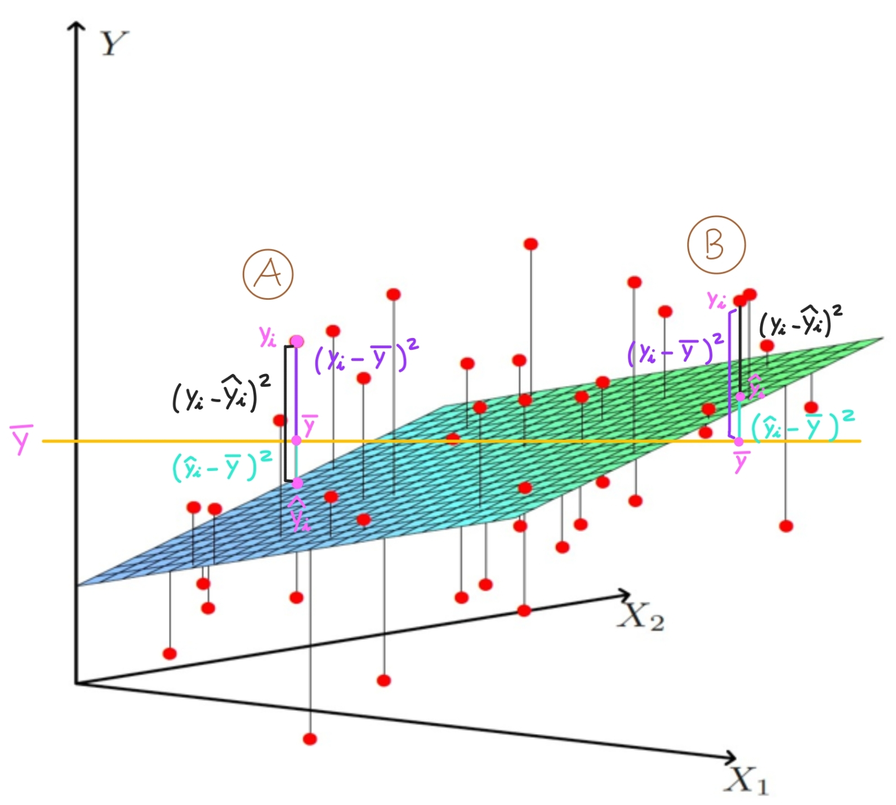{width="60%"}

</center>

<br>

Esta imagen nos da información muy relevante:

- El caso A es suficiente para probar que la siguiente proposición es falsa:

$$(y_i - \overline{y})^2 \hspace{0.1cm}= \hspace{0.1cm} (y_i - \widehat{y}_i)^2 + (\widehat{y}_i - \overline{ y})^2 \hspace{0.2cm} , \forall i=1,..,n \\$$

- Aunque si que se cumple lo siguiente, como hemos comentado ante:

$$\sum_{i=1}^{n} (y_i - \overline{y})^2 \hspace{0.1cm}= \hspace{0.1cm} \sum_{i=1}^{n} (y_i - \widehat{y}_i)^2 + \sum_{i=1}^{n} (\widehat{y}_i - \overline{y})^2$$

 
----

<br>

<div class="warning" style='background-color:#F7EBE8; color: #030000; border-left: solid #CA0B0B 7px; border-radius: 3px; size:1px ; padding:0.1em;'>
<span> 


$\hspace{0.25cm}$ Ahora podemos definir el estadístico del contraste como: $\\[0.5cm]$

 
\begin{gather*}
F_{exp|H_0} \hspace{0.1cm}=\hspace{0.1cm} \dfrac{(TSS-RSS)/p}{RSS/(n-p-1)} \hspace{0.1cm}=\hspace{0.1cm} \dfrac{(RegSS)/p}{RSS/(n-p-1) }\hspace{0.1cm} \sim\hspace{0.1cm} F_{\hspace{0.05cm}p,\hspace{0.05cm} n-p-1}
\end{gather*}
 
 
$\hspace{0.25cm}$ Donde:  $\hspace{0.1cm} p \hspace{0.1cm}$ es el numero de predicores del modelo.


</p>
 
</p></span>
</div>


<br>

**Observación:**

Si $\hspace{0.1cm}RegSS\hspace{0.1cm}$ es grande comparado con $\hspace{0.1cm}RSS\hspace{0.1cm}$ entonces la varianza de la respuesta $\hspace{0.1cm}Y\hspace{0.1cm}$ explicada por el modelo usando los predictores $\hspace{0.1cm}X\hspace{0.1cm}$ será grande comparada con la varianza no explicada y el estadistico del contraste $\hspace{0.1cm}F_{exp|H_0}\hspace{0.1cm}$ será grande.

Así que un valor grande del estadístico $\hspace{0.1cm}F_{exp|H_0}\hspace{0.1cm}$ indican un valor grande de $\hspace{0.1cm}RegSS\hspace{0.1cm}$ comparado con $\hspace{0.1cm}RSS\hspace{0.1cm}$ , lo cual es un indicador de que el modelo explica la respuesta bien, así que será razonable rechazar  $\hspace{0.1cm}H_0\hspace{0.1cm}$ en favor de $\hspace{0.1cm}H_1\hspace{0.1cm}$, esto es, rechazar que todos los predictores en conjunto no son significativos para explicar la respuesta, y aceptar que algunos de los predictores son significativos.

La regla de decisión que veremos a continuación esta basada en este razonamiento. Cuanto mayor sea el estadístico  $\hspace{0.1cm}F_{exp|H_0}\hspace{0.1cm}$ , mas facil será rechazar $\hspace{0.1cm}H_0\hspace{0.1cm}$ en favor de $\hspace{0.1cm}H_1\hspace{0.1cm}$


$H_0\hspace{0.1cm}$ es rechazado cuando  $\hspace{0.1cm}F_{exp|H_0}\hspace{0.1cm}$ es suficientemente grande, esto es, cuando $\hspace{0.1cm}RegSS\hspace{0.1cm}$ es suficiente grande comparado con $\hspace{0.1cm}RSS$


<br>


### Regla de decisión 


<div class="warning" style='background-color:#F7EBE8; color: #030000; border-left: solid #CA0B0B 7px; border-radius: 3px; size:1px ; padding:0.1em;'>
<span> 

-   *Basada en el estadístico del contraste*

 
\begin{gather*}
\text{Rechazar} \ H_0 \ \Leftrightarrow \ F_{exp|H_0} > F_{\alpha}^{\hspace{0.1cm}p,\hspace{0.05cm} n-p-1}
\end{gather*}
 
-   *Basada en el p-valor*

 
\begin{gather*}
\text{Rechazar} \ H_0  \ \Leftrightarrow \ \text{p-valor} < \alpha
\end{gather*}
 

</p>
 
</p></span>
</div>


<br>


## Contraste ANOVA en `Python`  <a class="anchor" id="53"></a>

El valor del estadístico del contraste $\hspace{0.1cm} F_{exp|H_0}$ y también el p-valor del contraste pueden ser encontrados en la salida obtenida con el comando `print(model_Python_1.summary())`


```python
print(model_Py_sm.summary())
```

                                OLS Regression Results                            
    ==============================================================================
    Dep. Variable:                  price   R-squared:                       0.698
    Model:                            OLS   Adj. R-squared:                  0.697
    Method:                 Least Squares   F-statistic:                     547.4
    Date:               sá., 22 oct. 2022   Prob (F-statistic):               0.00
    Time:                        19:26:26   Log-Likelihood:                -29918.
    No. Observations:                1905   AIC:                         5.985e+04
    Df Residuals:                    1896   BIC:                         5.990e+04
    Df Model:                           8                                         
    Covariance Type:            nonrobust                                         
    ===================================================================================
                          coef    std err          t      P>|t|      [0.025      0.975]
    -----------------------------------------------------------------------------------
    intercept       -6.207e+07   2.99e+07     -2.073      0.038   -1.21e+08   -3.34e+06
    size_in_m_2      3.566e+04    723.831     49.271      0.000    3.42e+04    3.71e+04
    longitude       -1.677e+06   6.91e+05     -2.428      0.015   -3.03e+06   -3.22e+05
    latitude         6.115e+06   7.81e+05      7.830      0.000    4.58e+06    7.65e+06
    no_of_bedrooms  -8.367e+05   8.28e+04    -10.102      0.000   -9.99e+05   -6.74e+05
    no_of_bathrooms -5.712e+04   6.83e+04     -0.836      0.403   -1.91e+05    7.68e+04
    quality_1          1.4e+05   8.36e+04      1.675      0.094   -2.39e+04    3.04e+05
    quality_2        3.406e+05   1.55e+05      2.196      0.028    3.63e+04    6.45e+05
    quality_3        2.788e+05   1.98e+05      1.410      0.159   -1.09e+05    6.66e+05
    ==============================================================================
    Omnibus:                      779.851   Durbin-Watson:                   1.716
    Prob(Omnibus):                  0.000   Jarque-Bera (JB):            25742.187
    Skew:                           1.273   Prob(JB):                         0.00
    Kurtosis:                      20.828   Cond. No.                     1.34e+05
    ==============================================================================
    
    Notes:
    [1] Standard Errors assume that the covariance matrix of the errors is correctly specified.
    [2] The condition number is large, 1.34e+05. This might indicate that there are
    strong multicollinearity or other numerical problems.
    


Tenemos lo siguiente: $\\[0.5cm]$
<br>

- $F_{exp|H_0} = 547.4 \\$ 

- $\text{p-valor} \simeq 0 \\$


Así que para cualquier $\hspace{0.1cm} \alpha > 0 \hspace{0.1cm}$ podemos rechazar $\hspace{0.15cm}  H_0:   \hspace{0.05cm} \beta_1=\dots =\beta_p=0  \hspace{0.15cm}$, en favor de $\hspace{0.15cm} H_1 :  \exists \ j=1,...,p , \hspace{0.2cm} \beta_j \neq 0\hspace{0.15cm}$  , así que podemos aceptar que el modelo es globalmente significativo. 


&nbsp;


## Intervalo de confianza para la media de la predicción de la respuesta <a class="anchor" id="53.1"></a>

<div class="warning" style='background-color:#F7EBE8; color: #030000; border-left: solid #CA0B0B 7px; border-radius: 3px; size:1px ; padding:0.1em;'>
<span> 

$\hspace{0.25cm}$ Se cumple lo siguiente: $\\[0.5cm]$

 $$\hat{y}_i \hspace{0.1cm}=\hspace{0.1cm} x_i^t \cdot \widehat{\beta} \hspace{0.15cm} \sim \hspace{0.15cm} N \left( \hspace{0.1cm} x_i^t \cdot \beta \hspace{0.25cm},\hspace{0.25cm} \sigma^2 \cdot v_{hh} \hspace{0.1cm} \right) \\[0.7cm]$$
 
$\hspace{0.25cm}$ Donde:  

 $$v_{hh}=x_i^t \cdot (X^t \cdot X)^{-1} \cdot x_i \\$$

 $$E[\hat{y}_i ] = x_i^t \cdot \beta\\$$

 $$Var(\hat{y}_i) = \sigma^2 \cdot v_{hh}\\$$


</p>
 
</p></span>
</div>


<div class="warning" style='background-color:#F7EBE8; color: #030000; border-left: solid #CA0B0B 7px; border-radius: 3px; size:1px ; padding:0.1em;'>
<span> 


$\hspace{0.25cm}$  Podemos usar la anterior expresión como cantidad pivotal para construir el siguiente intervalo de confianza para un nivel:

$$\dfrac{\hat{y}_i - E[\hat{y}_i ]}{\sqrt{\widehat{Var}(\hat{y}_i) }} \hspace{0.1cm} =\hspace{0.1cm}  \dfrac{\hat{y}_i -  x_i^t \cdot \beta }{\sqrt{\hat{\sigma}^2 \cdot v_{hh}}} \hspace{0.1cm} \sim \hspace{0.1cm} t_{n-p-1} \\$$

$\hspace{0.25cm}$ Podemos usar la anterior expresion como cantidad pivotal para construir el siguiente intervalo de confianza para un nivel $1-\alpha \\$

 

$$\hspace{0.45cm} IP\left( \hspace{0.05cm} E[\hat{y}_i ] \hspace{0.05cm} \right)_{1-\alpha}\hspace{0.1cm} =\hspace{0.1cm}IP\left( \hspace{0.05cm} x_i^t \cdot \beta \hspace{0.05cm} \right)_{1-\alpha}\hspace{0.1cm} =\hspace{0.1cm} \left[\hspace{0.15cm} \hat{y}_i  \hspace{0.15cm}\pm\hspace{0.15cm} t_{\alpha/2}^{n-p-1} \cdot \sqrt{ \widehat{\sigma}^2 \cdot v_{hh} } \hspace{0.15cm} \right]$$

</p>
 
</p></span>
</div>


<br>


## Intervalo de probabilidad para la respuesta <a class="anchor" id="53.1"></a>

<div class="warning" style='background-color:#F7EBE8; color: #030000; border-left: solid #CA0B0B 7px; border-radius: 3px; size:1px ; padding:0.1em;'>
<span>

$\hspace{0.25cm}$ Se cumple lo siguiente: $\\[0.5cm]$

 $$y_i  \hspace{0.15cm} \sim \hspace{0.15cm} N \left( \hspace{0.1cm} x_i^t \cdot \beta \hspace{0.25cm},\hspace{0.25cm} \sigma^2  \hspace{0.1cm} \right) \\[0.5cm]$$

 $$\hat{y}_i \hspace{0.1cm}=\hspace{0.1cm} x_i^t \cdot \widehat{\beta} \hspace{0.15cm} \sim \hspace{0.15cm} N \left( \hspace{0.1cm} x_i^t \cdot \beta \hspace{0.25cm},\hspace{0.25cm} \sigma^2 \cdot v_{hh} \hspace{0.1cm} \right) \\[0.5cm]$$
 
$\hspace{0.25cm}$ Donde:  

- $\hspace{0.1cm} v_{hh}=x_i^t \cdot (X^t \cdot X)^{-1} \cdot x_i \\$

- $\hspace{0.1cm}E[y_i ] = E[\hat{y}_i ] = x_i^t \cdot \beta\\$

- $\hspace{0.1cm}Var(y_i) = \sigma^2 \\$

- $\hspace{0.1cm}Var(\hat{y}_i) = \sigma^2 \cdot v_{hh}\\$

</p>
 
</p></span>
</div>


<div class="warning" style='background-color:#F7EBE8; color: #030000; border-left: solid #CA0B0B 7px; border-radius: 3px; size:1px ; padding:0.1em;'>
<span>

$\hspace{0.25cm}$ Por tanto, se tiene lo siguiente:


$$y_i - \hat{y}_i \sim N(0 , \sigma^2 \cdot (1 + v_{hh}))$$


$\hspace{0.25cm}$ Donde:


- $\hspace{0.1cm}E[y_i - \hat{y}_i] = 0\\$

- $\hspace{0.1cm}Var(y_i - \hat{y}_i) = \sigma^2 \cdot (1 + v_{hh})$

</p>
 
</p></span>
</div>


<div class="warning" style='background-color:#F7EBE8; color: #030000; border-left: solid #CA0B0B 7px; border-radius: 3px; size:1px ; padding:0.1em;'>
<span>


$\hspace{0.25cm}$ Así que, se tiene la siguiente cantidad pivotal:$\\[0.5cm]$


$$\dfrac{ ( y_i - \hat{y}_i ) - E[y_i - \hat{y}_i]}{\sqrt{\widehat{Var}(y_i - \hat{y}_i ) }} \hspace{0.1cm} =\hspace{0.1cm}  \dfrac{y_i - \hat{y}_i }{\sqrt{\hat{\sigma}^2 \cdot (1 +  v_{hh} ) }} \hspace{0.1cm} \sim \hspace{0.1cm} t_{n-p-1}\\$$


$\hspace{0.25cm}$ Podemos usar la anterior expresión como cantidad pivotal para construir el siguiente intervalo de confianza para un nivel $1-\alpha \\$


$$\hspace{0.25cm} IP\left( \hspace{0.05cm} y_i \hspace{0.05cm} \right)_{1-\alpha}\hspace{0.1cm} =\hspace{0.1cm} \left[\hspace{0.15cm} \hat{y}_i  \hspace{0.15cm}\pm\hspace{0.15cm} t_{\alpha/2}^{n-p-1} \cdot \sqrt{ \widehat{\sigma}^2 \cdot (1 + v_{hh} ) } \hspace{0.15cm} \right] \\$$


</p>
 
</p></span>
</div>


<br>


**Observación:**

En el intervalo anterior $y_i$ es considerada una variable aleatroria y no un parámetro, por tanto no se puede hablar de intervalo de confianza para $y_i$, por eso se habla de intervalo de probabilidad, porque al ser $y_i$ una v.a. si se puede hablar de que la probabilidad de que $y_i$ caiga en el intervalo es $1-\alpha$


<br>

## Intervalo de probabilidad para la respuesta en `Python` <a class="anchor" id="53.2"></a>


```python
Y = data_Python[['price']]

X = data_Python[['size_in_m_2', 'longitude', 'latitude', 'no_of_bedrooms', 'no_of_bathrooms', 'quality']]

X = varcharProcessing(X, varchar_process = "dummy_dropfirst")
```


```python
Probability_Intervals_Response = pd.DataFrame({ 'y': 0 , 'y_predict': 0 ,  'Prob_Interval_lower': 0, 'Prob_Interval_upper': 0}, index= range(0,len(data_Python)))
```


```python
n=len(data_Python)

p=model_Py_smf.df_model

t = scipy.stats.t.ppf(0.95, n-p-1)

XtX_inv = np.linalg.inv(X.T @ X)

Probability_Intervals_Response.iloc[:, 0] = Y
Probability_Intervals_Response.iloc[:, 1] = predictions


for i in range(0, len(data_Python)-1):

    x_i = X.to_numpy()[i, ]
    x_i = np.array([x_i]) # necessary step to transpose a 1D array

    hat_y_i = predictions.to_numpy()[i, ]
        
    a = hat_y_i - np.sqrt( estimated_variance_error * ( 1 + x_i @ XtX_inv @ x_i.T ) )
    b = hat_y_i + np.sqrt( estimated_variance_error * ( 1 + x_i @ XtX_inv @ x_i.T ) )

    a = float(a)
    b = float(b)

    Probability_Intervals_Response.iloc[i, 2] = a
    Probability_Intervals_Response.iloc[i, 3] = b
```


```python
 Probability_Intervals_Response
```


<div>
<style scoped>
    .dataframe tbody tr th:only-of-type {
        vertical-align: middle;
    }

    .dataframe tbody tr th {
        vertical-align: top;
    }

    .dataframe thead th {
        text-align: right;
    }
</style>
<table border="1" class="dataframe">
  <thead>
    <tr style="text-align: right;">
      <th></th>
      <th>y</th>
      <th>y_predict</th>
      <th>Prob_Interval_lower</th>
      <th>Prob_Interval_upper</th>
    </tr>
  </thead>
  <tbody>
    <tr>
      <th>0</th>
      <td>2700000</td>
      <td>1.781426e+06</td>
      <td>1.756811e+05</td>
      <td>3.387171e+06</td>
    </tr>
    <tr>
      <th>1</th>
      <td>2850000</td>
      <td>2.551625e+06</td>
      <td>9.459896e+05</td>
      <td>4.157260e+06</td>
    </tr>
    <tr>
      <th>2</th>
      <td>1150000</td>
      <td>2.522740e+06</td>
      <td>9.137789e+05</td>
      <td>4.131701e+06</td>
    </tr>
    <tr>
      <th>3</th>
      <td>2850000</td>
      <td>4.222873e+06</td>
      <td>2.615568e+06</td>
      <td>5.830179e+06</td>
    </tr>
    <tr>
      <th>4</th>
      <td>1729200</td>
      <td>7.851530e+05</td>
      <td>-8.220643e+05</td>
      <td>2.392370e+06</td>
    </tr>
    <tr>
      <th>...</th>
      <td>...</td>
      <td>...</td>
      <td>...</td>
      <td>...</td>
    </tr>
    <tr>
      <th>1900</th>
      <td>1500000</td>
      <td>1.211313e+06</td>
      <td>-4.053818e+05</td>
      <td>2.828007e+06</td>
    </tr>
    <tr>
      <th>1901</th>
      <td>1230000</td>
      <td>8.171580e+05</td>
      <td>-7.881622e+05</td>
      <td>2.422478e+06</td>
    </tr>
    <tr>
      <th>1902</th>
      <td>2900000</td>
      <td>2.981084e+06</td>
      <td>1.371368e+06</td>
      <td>4.590800e+06</td>
    </tr>
    <tr>
      <th>1903</th>
      <td>675000</td>
      <td>2.651215e+05</td>
      <td>-1.340281e+06</td>
      <td>1.870524e+06</td>
    </tr>
    <tr>
      <th>1904</th>
      <td>760887</td>
      <td>8.227585e+05</td>
      <td>0.000000e+00</td>
      <td>0.000000e+00</td>
    </tr>
  </tbody>
</table>
<p>1905 rows × 4 columns</p>
</div>


&nbsp;


# Bondad de ajuste: $\hspace{0.1cm}$ Coeficiente de determinación  <a class="anchor" id="54"></a>

 
## Coeficiente de determinación

<div class="warning" style='background-color:#F7EBE8; color: #030000; border-left: solid #CA0B0B 7px; border-radius: 3px; size:1px ; padding:0.1em;'>
<span>

$\hspace{0.25cm}$ El coeficiente de determinación, denotado por $R^2$ , es definido como: $\\[0.7cm]$

\begin{gather*}
R^2 \hspace{0.1cm}=\hspace{0.1cm} \dfrac{RegSS}{TSS} \hspace{0.1cm}=\hspace{0.1cm} \dfrac{TSS-RSS}{TSS} \hspace{0.1cm}=\hspace{0.1cm} 1 - \dfrac{RSS}{TSS}
\end{gather*}

</p>
 
</p></span>
</div>

 


<br>
<div class="warning" style='background-color:#F7EBE8; color: #030000; border-left: solid #CA0B0B 7px; border-radius: 3px; size:1px ; padding:0.1em;'>
<span>

$\hspace{0.25cm}$ **Propiedades:**

-   $R^2$ es la proporción de varianza total de la respuesta que es explicada por el modelo a través de los predictores $\\[0.6cm]$

-   $R^2 \in \left[ 0 , 1 \right]$

$\hspace{0.25cm}$ Por esta razón $\hspace{0.1cm}R^2\hspace{0.1cm}$ es usado como una medida de como de bien el modelo se ajusta a la variable respuesta.

 
</p>
 
</p></span>
</div>


<br>


<div class="warning" style='background-color:#F7EBE8; color: #030000; border-left: solid #CA0B0B 7px; border-radius: 3px; size:1px ; padding:0.1em;'>
<span>

$\hspace{0.25cm}$ **Interpretación:**

$\hspace{0.25cm}$La interpretación de $\hspace{0.1cm}R^2\hspace{0.1cm}$ es la siguiente:

-   Si $\hspace{0.1cm}R^2\hspace{0.1cm}$ está cerca de $1$, esto indica que el modelo se ajusta bien a los datos de la respuesta.  $\\[0.5cm]$


-   Si $\hspace{0.1cm}R^2\hspace{0.1cm}$ está cerca de $0$, esto indica que el modelo se ajusta mal a los datos de la respuesta.

</p>
 
</p></span>
</div>


&nbsp;


## Calcular el coeficiente de determinación en `Python` <a class="anchor" id="56"></a>


El valor de $\hspace{0.1cm} R^2$  puede ser encontrado en la salida obtenida con el comando `print(model_Py_smf.summary())`


```python
model_Py_smf.rsquared
```

    0.6978674339747218


También podemos calcular $R^2$ con `sk-learn` como sigue:


```python
Model_Py_sklearn.score(X, y)
```

    0.6978674339747218


Se obtiene lo siguiente:

$$ R^2 = 0.698$$


<br>


## Coeficiente de determinación ajustado  


El $R^2$ tiene algunos problemas.

-  $\hspace{0.1cm} R^2$ always increase when increase the number of predictors,
    although they are not significative.

-  It´s possible estimate two models with the same prediction power but
    with different $\hspace{0.1cm}R^2$


<br>


For avoid the disadvantages of $\hspace{0.1cm}R^2\hspace{0.1cm}$ was created the adjusted $\hspace{0.1cm}R^2\hspace{0.1cm}$ ,
denoted as $\widehat{R^2}$, and defined as: 

<br>


\begin{gather*}
\widehat{R}^2 =  1 - \dfrac{RSS/(n-p-1)}{TSS/(n-1)} = 1 - \left( 1- R^2 \right) \cdot \dfrac{n-1}{n-p}
\end{gather*}

<br>


This metric doesn't grow when including irrelevant predictors, because if $\hspace{0.1cm} RSS\hspace{0.1cm}$ is small because of $\hspace{0.1cm}p\hspace{0.1cm}$ is large, then  $\hspace{0.1cm}1/(n-p-1)\hspace{0.1cm}$ will be large compensating the $\hspace{0.1cm}RSS\hspace{0.1cm}$ value


&nbsp;


## Calcular el coeficiente de determinación ajustado en `Python` <a class="anchor" id="59"></a>


El valor de $\hspace{0.1cm} \widehat{R^2}$  puede ser encontrado en la salida obtenida al ejecutar la sentencia `print(model_Py_smf.summary())`


```python
model_Py_smf.rsquared_adj
```

    0.6965926130210287


Hemos obtenido lo siguiente:

$$ \widehat{R^2} = 0.697$$


&nbsp;

<br>


# Problemas del modelo <a class="anchor" id="60"></a>


## Multicolinealidad <a class="anchor" id="61"></a>

El porblema de multicolinealidad ocurre cuando algunos de los predictotres son linealmente dependientes.

**¿ Por que la multicolinealidad es un problema ?**

- En el peor de los casos la existencia de multicolinealidad hace imposible la estimación del modelo.

- En el mejor de los casos la existencia de multicolinealidad hace que los estimadores de los coeficientes betas tengan mucha varianza y por tanto sean muy imprecisos y además se acepten como no significativos predictores que realmente son significativos, puesto que el estadistico del contraste de significacion se ve afectado por la varianza de los estimador. Si esta es muy alta el estadistico será bajo, y esto facilita no rechazar la hipotesis nula de que el predictor no es significativo.
 
<br>


### Tipos de multicolinealidad  <a class="anchor" id="62"></a>

<br>

#### Multicolinealidad perfecta

Al menos uno de los predictores es una combinación lineal del reso, asi que $\hspace{0.1cm}Rg(X) < p+1 \hspace{0.1cm}$ , es decir, la matriz $X$ no es de rango completo.

Por el teorema del rango-nulidad se tiene que $\hspace{0.1cm}R(X^t \cdot X) < p+1\hspace{0.1cm}$. Por tanto,  $\hspace{0.1cm}X^t \cdot X\hspace{0.1cm}$ no tiene rango completo, así que no existe la inversa $\hspace{0.1cm}(X^t \cdot X)^{-1}\hspace{0.1cm}$ , por lo que no se puede estimar $\hspace{0.1cm}\beta\hspace{0.1cm}$ con el método de mínimos cuadrados ordinarios.

<br>

#### Multicolinealidad alta

Hay pares de predictores con una alta correlacion lineal entre ellos. 
En este caso aún es posible estimar los $\hspace{0.1cm}\beta_j\hspace{0.1cm}$, pero la varianza de los estimadores $\hspace{0.1cm}\widehat{\beta}_j\hspace{0.1cm}$ será muy grande, por tanto las estimaciones serán muy imprecisas y saldran como no significativos predictores que si lo son. 


&nbsp;


### Identificación de la multicolinealidad 

La identificación de la multicolinealidad puede llevarse a cabo de diferentes maneras:

- Si el modelo de regresión lineal solo tieene predictores **cuantitativos**:

    - $\hspace{0.1cm}$ Con la matriz de correlaciones lineales de los predictores $\hspace{0.05cm} R\\$

    - $\hspace{0.1cm}$ Con el factor de incremento de la varianza $\hspace{0.1cm} VIF\hspace{0.1cm}$ $\\[0.5cm]$

    - $\hspace{0.1cm}$ Con el número de condicionamiento de $\hspace{0.05cm} R \\$


- Si el modelo de regresión lineal tiene predictores **cuantitativos** y **categoricos**:

    -  $\hspace{0.1cm}$  Con el factor de incremento de la varianza generalizado $\hspace{0.1cm}GVIF\hspace{0.1cm}$ 


<br>


### Identificación de multicolinealidad con la matriz de correlaciones lineales <a class="anchor" id="64"></a>

La matriz de correlaciones lineales (de Pearson) de una matriz de datos $\hspace{0.1cm}X=[X_1 ,..., X_p]\hspace{0.1cm}$ de las variables estadisticas $\hspace{0.1cm}\mathcal{X}_1,...,\mathcal{X}_p\hspace{0.1cm}$   se define como sigue:

<br>

$$
R= \begin{pmatrix}
    r_{11} & r_{12}&...&r_{1p}\\
    r_{21} & r_{22}&...&r_{2p}\\
    &...&\\
    r_{p1}& r_{p2}&...&r_{pp}
\end{pmatrix} = [r_{ih} ]\hspace{0.05cm}_{i,h=1,..,p}
$$ 

<br>

Donde: $\hspace{0.2cm} r_{i h} \hspace{0.1cm}$ es el coeficiente de correlación lineal de Pearson entre las muestras $\hspace{0.1cm}X_i\hspace{0.1cm}$ y $\hspace{0.1cm}X_h\hspace{0.1cm}$ de las variables $\hspace{0.1cm}\mathcal{X}_i\hspace{0.1cm}$  y $\hspace{0.1cm}\mathcal{X}_h\hspace{0.1cm}$ , respectivamente.

<br>

<div class="warning" style='background-color:#F7EBE8; color: #030000; border-left: solid #CA0B0B 7px; border-radius: 3px; size:1px ; padding:0.1em;'>
<span>

**Criterio :  Indentificación de multicolinealidad con $R$**

Tenemos un modelo de regresión lineal estimado $\hspace{0.2cm} Y=X\cdot \widehat{\beta}   \hspace{0.2cm}$  con predictores exclusivamente **cuantitativos**. 

Calculamos la matriz de correlaciones lineales para la matriz de datos $\hspace{0.1cm}[X_1,...,X_n]\hspace{0.1cm}$ de los predictores $\hspace{0.2cm} \Rightarrow \hspace{0.2cm} R = [r_{ih} ]\hspace{0.05cm}_{i,h=1,..,p} \\$


- Si hay algún $\hspace{0.2cm} r_{ih}\hspace{0.2cm} \hspace{0.1cm} > 0.75 \hspace{0.1cm}$  $\hspace{0.2cm} \Rightarrow\hspace{0.2cm}$ probablemente hay problemas de multicolinealidad.


</p>
 
</p></span>
</div>


&nbsp;


### Identificación de la multicolinealidad con la matriz de correlaciones en `Python`


```python
X = data_Python.loc[: , ['size_in_m_2',	'longitude', 'latitude', 'no_of_bedrooms', 'no_of_bathrooms']]
```


```python
R = X.corr()

R
```

<div>
<style scoped>
    .dataframe tbody tr th:only-of-type {
        vertical-align: middle;
    }

    .dataframe tbody tr th {
        vertical-align: top;
    }

    .dataframe thead th {
        text-align: right;
    }
</style>
<table border="1" class="dataframe">
  <thead>
    <tr style="text-align: right;">
      <th></th>
      <th>size_in_m_2</th>
      <th>longitude</th>
      <th>latitude</th>
      <th>no_of_bedrooms</th>
      <th>no_of_bathrooms</th>
    </tr>
  </thead>
  <tbody>
    <tr>
      <th>size_in_m_2</th>
      <td>1.000000</td>
      <td>-0.066657</td>
      <td>0.137518</td>
      <td>0.775113</td>
      <td>0.725397</td>
    </tr>
    <tr>
      <th>longitude</th>
      <td>-0.066657</td>
      <td>1.000000</td>
      <td>0.605875</td>
      <td>-0.045668</td>
      <td>-0.025000</td>
    </tr>
    <tr>
      <th>latitude</th>
      <td>0.137518</td>
      <td>0.605875</td>
      <td>1.000000</td>
      <td>0.124162</td>
      <td>0.141160</td>
    </tr>
    <tr>
      <th>no_of_bedrooms</th>
      <td>0.775113</td>
      <td>-0.045668</td>
      <td>0.124162</td>
      <td>1.000000</td>
      <td>0.854384</td>
    </tr>
    <tr>
      <th>no_of_bathrooms</th>
      <td>0.725397</td>
      <td>-0.025000</td>
      <td>0.141160</td>
      <td>0.854384</td>
      <td>1.000000</td>
    </tr>
  </tbody>
</table>
</div>


```python
import seaborn as sb

corr = R

sb.heatmap(corr, cmap="Blues", annot=True)
```

<center>

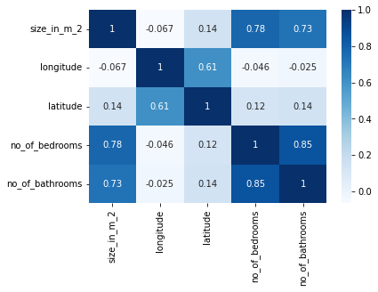

</center>

<br>


Podemos ver que hay varios pares de predictores que tienen alta correlación lineal para la muestra de datos con la que estamos trabajando. 

Por ejemplo: **(no\_of\_bathrooms ,  no\_of\_bedrooms )** , **(size\_in\_m\_2 , no\_of\_bedrooms)**  , **(size\_in\_m\_2 , no\_of\_bathrooms)** 

Asi que siguiendo estre criterio el modelo de regresión lineal  **price ~ size\_in\_m\_2  + longitude + latitude + no\_of\_bedrooms + no\_of\_bathrooms**  posiblemente tenga problemas de multicolinealidad.  


&nbsp;


### Identificacion de la multicolinealidad con VIF <a class="anchor" id="64"></a>

Tenemos un modelo de regresión lineal estimado  $\hspace{0.2cm} Y=X\cdot \widehat{\beta}   \hspace{0.2cm}$  con predictores exclusivamente **cuantitativos** 

Calculamos la inversa de la matriz de correlaciones lineales de la matriz de datos de los predictores  $\hspace{0.1cm} [ X_1 ,..., X_p] \hspace{0.2cm} \Rightarrow \hspace{0.2cm} R\hspace{0.07cm}^{-1}$ 


<div class="warning" style='background-color:#F7EBE8; color: #030000; border-left: solid #CA0B0B 7px; border-radius: 3px; size:1px ; padding:0.1em;'>
<span>

$\hspace{0.25cm}$ El factor de incremento de la varianzaThe variance increase factor $\hspace{0.1cm}\left(VIF\right)\hspace{0.1cm}$ de la muestra $\hspace{0.1cm}X_j\hspace{0.1cm}$ del predictor **cuantitativo** $\mathcal{X}_j$ es:

<br>

$$VIF(X_j) \hspace{0.05cm}=\hspace{0.05cm} Diag\left(R\hspace{0.07cm}^{-1}\right)[\hspace{0.1cm} j \hspace{0.1cm}]$$

</p>
 
</p></span>
</div>

<br>


<div class="warning" style='background-color:#F7EBE8; color: #030000; border-left: solid #CA0B0B 7px; border-radius: 3px; size:1px ; padding:0.1em;'>
<span>

$\hspace{0.25cm}$ El VIF puede expresarse de forma equivalente del siguiente modo:

<br>

$$ VIF(X_j) = \dfrac{1}{1- R^2_{X_j}}$$

$\hspace{0.25cm}$ Donde:

- $R^2_{X_j}\hspace{0.1cm}$ es el coeficiente de determinacion de siguiente modelo de regresión lineal $\hspace{0.1cm} X_j = \beta_0 + \beta_1 \cdot  X_1 +...+ \beta_{j-1}\cdot X_{j-1} + \beta_{i+1}\cdot X_{i+1} + ... + \beta_p \cdot X_p + \varepsilon$

- Así que $\hspace{0.07cm} R^2_{X_i} \hspace{0.07cm}$  es la proporción de la variabilidad de  $\hspace{0.07cm}{X}_j\hspace{0.07cm}$ explicada por   $\hspace{0.07cm}{X}_1,..,{X}_{j-1},{X}_{j+1},..,{X}_p$, considerando las muestras que tenemos de los predictores.

</p>
 
</p></span>
</div>


<br>

<div class="warning" style='background-color:#F7EBE8; color: #030000; border-left: solid #CA0B0B 7px; border-radius: 3px; size:1px ; padding:0.1em;'>
<span>

$\hspace{0.25cm}$ **Criterio: Identificación de multicolinearidad con $VIF$** 


- Si $\hspace{0.2cm}VIF(X_j) \hspace{0.1cm}>\hspace{0.1cm} 10$ $\hspace{0.25cm}\left( R^2_{X_j} > 0.90 \right)$ $\hspace{0.25cm}\Rightarrow\hspace{0.25cm}$ Multicolinealidad **alta**  $\\[0.7cm]$

- Si $\hspace{0.2cm}VIF(X_j)  \in [4, 10]$  $\hspace{0.25cm}\left(R^2_{X_j} \in [0.75 , 0.90]\right)$ $\hspace{0.25cm}\Rightarrow\hspace{0.25cm}$ Multicolinealidad **media** $\\[0.7cm]$


- Si  $\hspace{0.2cm}VIF(X_j) \hspace{0.1cm}<\hspace{0.1cm} 4$ $\hspace{0.15cm}\left(R^2_{X_j} < 0.75 \right)$ $\hspace{0.25cm}\Rightarrow\hspace{0.25cm}$ Multicolinealidad **baja**

</p>
 
</p></span>
</div>


&nbsp;


### Identificación de multicolinearidad con VIF en `Python`


```python
X = data_Python.loc[: , ['size_in_m_2',	'longitude', 'latitude', 'no_of_bedrooms', 'no_of_bathrooms']]

R = X.corr()
```


```python
R_inv_diag = np.diagonal( np.linalg.inv( R ) )
```


```python
predictors_names = X.columns
```


```python
VIF_Python = pd.DataFrame({'predictor': predictors_names , 'VIF': R_inv_diag })
VIF_Python = VIF_Python.set_index('predictor')
VIF_Python
```


<div>
<style scoped>
    .dataframe tbody tr th:only-of-type {
        vertical-align: middle;
    }

    .dataframe tbody tr th {
        vertical-align: top;
    }

    .dataframe thead th {
        text-align: right;
    }
</style>
<table border="1" class="dataframe">
  <thead>
    <tr style="text-align: right;">
      <th></th>
      <th>VIF</th>
    </tr>
    <tr>
      <th>predictor</th>
      <th></th>
    </tr>
  </thead>
  <tbody>
    <tr>
      <th>size_in_m_2</th>
      <td>2.642728</td>
    </tr>
    <tr>
      <th>longitude</th>
      <td>1.639554</td>
    </tr>
    <tr>
      <th>latitude</th>
      <td>1.667913</td>
    </tr>
    <tr>
      <th>no_of_bedrooms</th>
      <td>4.565980</td>
    </tr>
    <tr>
      <th>no_of_bathrooms</th>
      <td>3.857961</td>
    </tr>
  </tbody>
</table>
</div>

Hay un predictor cuantitativo con $\hspace{0.1cm} VIF > 4 \hspace{0.1cm}$ , pero ninguno con $\hspace{0.1cm} VIF > 10 \hspace{0.1cm}$ , asi que siguiendo este criterio el modelo de regresión lineal $\hspace{0.1cm}$  **price ~ size\_in\_m\_2  + longitude + latitude + no\_of\_bedrooms + no\_of\_bathrooms** $\hspace{0.1cm}$ tiene multicolinearidad **media**.


&nbsp;


### Identificación de multicolinearidad con el número de condicionamiento de la matriz de correlaciones lineales <a class="anchor" id="66"></a>

Si tenemos el  modelo de regresión lineal estimado $\hspace{0.2cm} Y=X\cdot \widehat{\beta}   \hspace{0.2cm}$  con predictores exclusivamente **cuantitativos**. 

Calculamos la matriz de correlaciones lineales para la matriz de datos de los predictores $\hspace{0.2cm} [ X_1 ,..., X_p] \hspace{0.2cm} \Rightarrow \hspace{0.2cm} R = [r_{ih} ]\hspace{0.05cm}_{i,h=1,..,p}$

<br>

<div class="warning" style='background-color:#F7EBE8; color: #030000; border-left: solid #CA0B0B 7px; border-radius: 3px; size:1px ; padding:0.1em;'>
<span>


$\hspace{0.25cm}$ El número de condicionamiento de la matriz $\hspace{0.1cm} R \hspace{0.1cm}$ se define como:

$$cond(R) = \sqrt{\dfrac{max\lbrace eigenvalues(R)\rbrace}{min\lbrace eigenvalues(R)\rbrace}} $$


</p>
 
</p></span>
</div>


<br>


<div class="warning" style='background-color:#F7EBE8; color: #030000; border-left: solid #CA0B0B 7px; border-radius: 3px; size:1px ; padding:0.1em;'>
<span>


$\hspace{0.25cm}$ **Criterio :  Identificación de multicolinearidad con número de condicionamiento de $\hspace{0.05cm} R$**


- Si $\hspace{0.1cm} cond(R) > 30$ $\hspace{0.1cm} \Rightarrow\hspace{0.1cm}$ Multicolinearidad **alta**  $\\[0.5cm]$

- Si $\hspace{0.1cm}cond(R) \in (10 , 30)$ $\hspace{0.1cm} \Rightarrow\hspace{0.1cm}$ Multicolinearidad **media**  $\\[0.5cm]$

- Si $\hspace{0.1cm}cond(R) < 10$ $\hspace{0.1cm} \Rightarrow\hspace{0.1cm}$ Multicolinearidad **baja** $\\[0.5cm]$

</p>
 
</p></span>
</div>

&nbsp;


### Identificación de multicolineariedad con número de condicionamiento de $\hspace{0.05cm} R\hspace{0.05cm}$ en `Python`


```python
X = data_Python.loc[: , ['size_in_m_2',	'longitude', 'latitude', 'no_of_bedrooms', 'no_of_bathrooms']]

R = X.corr()
```


```python
from numpy import linalg as LA

eigenvalues , eigenvectors = LA.eig(R)
```


```python
cond_R = math.sqrt(max(eigenvalues)/min(eigenvalues))
cond_R
```

    4.325045221905223
    

Hemos obtenido que $\hspace{0.1cm} cond(R) = 4.33 < 10  \hspace{0.1cm}$ , así que siguiendo este criterio el modelo de regresión lineal $\hspace{0.1cm}$ **price ~ size\_in\_m\_2  + longitude + latitude + no\_of\_bedrooms + no\_of\_bathrooms** $\hspace{0.1cm}$ tiene multicolinearidad  **baja**.


&nbsp;


### Identificación de multicolinearidad con GVIF <a class="anchor" id="67"></a>

$VIF\hspace{0.2cm}$ es una buena medida de multicolinearidad solo cuando todos los predictores que se consideran en el modelo son **cuantitativos**.


$GVIF\hspace{0.2cm}$ es la medida propuesta por Fox y Monette (1992) para lidiar con modelos de regresión lineal que tienen algún predictor **categórico**.

Supongamos que tenemos un modelo de regresión lineal estimado $\hspace{0.2cm} Y=X\cdot \widehat{\beta}  \hspace{0.2cm}$  con algún predictor **cuantitativo** y también alguno **categórico**.


&nbsp;


<div class="warning" style='background-color:#F7EBE8; color: #030000; border-left: solid #CA0B0B 7px; border-radius: 3px; size:1px ; padding:0.1em;'>
<span>

- Si $\hspace{0.1cm}\mathcal{X}_j\hspace{0.1cm}$ es un predictor **cuantitativo**:


    - Tenemos que considerar las siguientes matrices:

         - $\hspace{0.2cm}\mathbb{X}_1 = [\hspace{0.1cm} X_j \hspace{0.1cm}]\\[0.45cm]$

         - $\hspace{0.2cm}\mathbb{X}_2 = [\hspace{0.1cm} X_1 , .. , X_{j-1}, X_{j+1},.., X_p \hspace{0.1cm}]\\[0.45cm]$

         - $\hspace{0.2cm}\mathbb{X}_3 = [\hspace{0.1cm} X_1,..,X_j,.., X_p \hspace{0.1cm}] \\$


 
     - Y las siguientes matrices de correlaciones lineales:

          - $\hspace{0.2cm}R_1\hspace{0.1cm}$ es la matriz de correlaciones lineales para la matriz de datos $\hspace{0.2cm}\mathbb{X}_1 \\[0.45cm]$

          - $\hspace{0.2cm}R_2\hspace{0.1cm}$ es la matriz de correlaciones lineales para la matriz de datos $\hspace{0.2cm}\mathbb{X}_2\\[0.45cm]$

          - $\hspace{0.2cm}R_3\hspace{0.1cm}$ es la matriz de correlaciones lineales para la matriz de datos $\hspace{0.2cm}\mathbb{X}_3$

 

<br>


$\hspace{0.35cm}$ El  $\hspace{0.1cm} GVIF \hspace{0.1cm}$ del predictor **cuantitativo**  $\hspace{0.1cm} \mathcal{X}_j \hspace{0.1cm}$ se define como:


$$GVIF(X_j) \hspace{0.1cm}=\hspace{0.1cm} det(R_1) \cdot \dfrac{det(R_2)}{det(R_3)} $$ 

 
</p>
 
</p></span>
</div>


&nbsp;


<div class="warning" style='background-color:#F7EBE8; color: #030000; border-left: solid #CA0B0B 7px; border-radius: 3px; size:1px ; padding:0.1em;'>
<span>

- Si $\hspace{0.1cm}\mathcal{X}_j\hspace{0.1cm}$ es un predictor **categorico** con $r$ categorias, $\hspace{0.2cm} Rango(\mathcal{X}_j) = \lbrace 0,1,..., r-1 \rbrace \hspace{0.2cm}$ , que entra en el modelo de regresión lineal con las variables dummy $\hspace{0.2cm} D(X_{j}=1)\hspace{0.1cm},\hspace{0.1cm}D(X_{j}=2)\hspace{0.1cm},...,\hspace{0.1cm}D(X_{j}=r-1) \\$


    - Tenemos que considerar las siguientes matrices:

         - $\mathbb{X}_1 = [\hspace{0.1cm} X_{j1},X_{j2},..,X_{j(r-1)} \hspace{0.1cm}]\\[0.45cm]$

         - $\mathbb{X}_2 = [\hspace{0.1cm} X_1 , .. , X_{j-1}, X_{j+1},.., X_p \hspace{0.1cm}]\\[0.45cm]$

         - $\mathbb{X}_3 = [\hspace{0.1cm} X_1,..,X_{j-1},X_{j1},X_{j2},..,X_{j(r-1)}, X_{j+1},.., X_p \hspace{0.1cm}] \\$


    - Tenemos las siguientes matrices de correlaciones lineales:

       - $R_1$ es la matriz de correlaciones lineales para la matriz de datos $\mathbb{X}_1\\[0.45cm]$ 

       - $R_2$ es la matriz de correlaciones lineales para la matriz de datos $\mathbb{X}_2\\[0.45cm]$

       - $R_3$ es la matriz de correlaciones lineales para la matriz de datos $\mathbb{X}_3$


<br>


$\hspace{0.35cm}$ El  $\hspace{0.1cm} GVIF \hspace{0.1cm}$ del predictor **categorico**  $\hspace{0.1cm} \mathcal{X}_j \hspace{0.1cm}$ se define como:


$$GVIF(X_j) = det(R_1) \cdot \dfrac{det(R_2)}{det(R_3)}$$ 

</p>
 
</p></span>
</div>


&nbsp;

<div class="warning" style='background-color:#F7EBE8; color: #030000; border-left: solid #CA0B0B 7px; border-radius: 3px; size:1px ; padding:0.1em;'>
<span>


$\hspace{0.25cm}$ **Criterio: Identificación de multicolinealidad con $\hspace{0.1cm} GVIF$**

$\hspace{0.25cm}$ En este criterio la cantidad clave es $\hspace{0.2cm} GVIF(X_j)^{1/2 df}$

$\hspace{0.25cm}$ Donde: $\hspace{0.2cm}df\hspace{0.2cm}$ es el número de coeficientes que entran en el modelo de regresión lineal cuando  $\hspace{0.2cm} \mathcal{X}_j\hspace{0.2cm}$ es añadido como predictor.


<br>

- Si $\hspace{0.2cm}\mathcal{X}_j\hspace{0.2cm}$ es un predictor **cuantitativo**  $\hspace{0.1cm} \Rightarrow\hspace{0.1cm} df=1$  :


    - Si $\hspace{0.2cm} GVIF(X_j)^{1/2} \hspace{0.1cm} > \hspace{0.1cm} \sqrt{10} = 3.16$  $\hspace{0.3cm}\Rightarrow\hspace{0.3cm}$ Multicolinealidad **alta**  $\\[0.45cm]$

    - Si $\hspace{0.2cm} GVIF(X_j)^{1/2}  \in [\sqrt{4}, \sqrt{10}]= [2 \hspace{0.1cm},\hspace{0.1cm} 3.16]$    $\hspace{0.3cm}  \Rightarrow\hspace{0.3cm}$ Multicolinealidad **media**   $\\[0.45cm]$


    - Si  $\hspace{0.2cm} GVIF(X_j)^{1/2}  \hspace{0.1cm}< \hspace{0.1cm} \sqrt{4} = 2$  $\hspace{0.3cm}\Rightarrow\hspace{0.3cm}$ Multicolinealidad **baja** 


<br>

- Si $\hspace{0.2cm}\mathcal{X}_j\hspace{0.2cm}$ es un predictor **categórico** con $2$ categorias $\hspace{0.2cm} \Rightarrow \hspace{0.2cm} df=2-1=1$ 


    - Si $\hspace{0.2cm} GVIF(X_j)^{1/2} \hspace{0.1cm}>\hspace{0.1cm} 10^{1/2} = 3.16$  $\hspace{0.2cm}\Rightarrow\hspace{0.2cm}$ Multicolinealidad **alta**    $\\[0.45cm]$

    - If $\hspace{0.2cm} GVIF(X_j)^{1/2}  \in [4^{1/2}, 10^{1/2}] = [2 \hspace{0.1cm} , \hspace{0.1cm}  3.16]$    $\hspace{0.2cm}  \Rightarrow\hspace{0.2cm}$ Multicolinealidad **media** multicollinearity  $\\[0.45cm]$


    - If  $\hspace{0.2cm} GVIF(X_j)^{1/2} \hspace{0.1cm}<\hspace{0.1cm} 4^{1/2} = 2$  $\hspace{0.2cm}\Rightarrow\hspace{0.2cm}$ Multicolinealidad **baja**  

<br>

- Si $\hspace{0.2cm}\mathcal{X}_j\hspace{0.2cm}$ es un predictor **categorico** con $3$ categorias $\hspace{0.2cm} \Rightarrow\hspace{0.2cm} df=3-1=2$ 


    - Si $\hspace{0.2cm} GVIF(X_j)^{1/4} \hspace{0.1cm}>\hspace{0.1cm} 10^{1/4} = 1.78$  $\hspace{0.2cm}\Rightarrow\hspace{0.2cm}$ Multicolinealidad **alta**  $\\[0.45cm]$

    - Si $\hspace{0.2 cm} GVIF(X_j)^{1/4}  \in [4^{1/4}, 10^{1/4}] = [1.41 \hspace{0.1cm} , \hspace{0.1cm}  1.78]$    $\hspace{0.2cm}  \Rightarrow\hspace{0.2cm}$ Multicolinealidad **media** $\\[0.45cm]$


    - Si  $\hspace{0.2cm} GVIF(X_j)^{1/4} \hspace{0.1cm}<\hspace{0.1cm} 4^{1/4} = 1.41$  $\hspace{0.2cm}\Rightarrow\hspace{0.2cm}$ Multicolinealidad **baja**

<br>

- Si $\hspace{0.2cm}\mathcal{X}_j\hspace{0.2cm}$ es un predictor a **categorico** con $4$ categorias $\hspace{0.2cm} \Rightarrow\hspace{0.2cm} df=4-1=3$ 


    - Si $\hspace{0.2cm} GVIF(X_j)^{1/6} \hspace{0.1cm}>\hspace{0.1cm} 10^{1/6} = 1.47$  $\hspace{0.2cm}\Rightarrow\hspace{0.2cm}$ **High** multicollinearity $\\[0.45cm]$

    - Si $\hspace{0.2cm} GVIF(X_j)^{1/6}  \in [4^{1/6}, 10^{1/6}] = [1.26 \hspace{0.1cm} , \hspace{0.1cm}  1.47]$    $\hspace{0.2cm}  \Rightarrow\hspace{0.2cm}$ **Medium** multicollinearity $\\[0.45cm]$


    - Si  $\hspace{0.2cm} GVIF(X_j)^{1/6}\hspace{0.1cm} <\hspace{0.1cm} 4^{1/6} = 1.26$  $\hspace{0.2cm}\Rightarrow\hspace{0.2cm}$ **Low** multicollinearity


<br>

- Si $\hspace{0.2cm}\mathcal{X}_j\hspace{0.2cm}$ es un predictor categorico con  $r$ categorias $\hspace{0.2cm} \Rightarrow\hspace{0.2cm} df=r-1$


    - Si $\hspace{0.2cm} GVIF(X_j)^{1/(2(r-1))} \hspace{0.1cm}>\hspace{0.1cm} 10^{1/(2(r-1))}$  $\hspace{0.2cm}\Rightarrow\hspace{0.2cm}$ Multicolinealidad **alta**  $\\[0.45cm]$

    - Si $\hspace{0.2cm} GVIF(X_j)^{1/(2(r-1))}  \in [4^{1/(2(r-1))}, 10^{1/(2(r-1))}]$    $\hspace{0.2cm}  \Rightarrow\hspace{0.2cm}$ Multicolinealidad **media** $\\[0.45cm]$


    - Si  $\hspace{0.2cm} GVIF(X_j)^{1/(2(r-1))} \hspace{0.1cm}<\hspace{0.1cm} 4^{1/(2(r-1))}$  $\hspace{0.2cm}\Rightarrow\hspace{0.2cm}$ Multicolinealidad **baja**

</p>
 
</p></span>
</div>

&nbsp;


### Identificación de multicolinealidad con GVIF en `Python`


- $GVIF$ para el predictor **categorico** quality


```python
X = data_Python.loc[: , ['size_in_m_2',	'longitude', 'latitude', 'no_of_bedrooms', 'no_of_bathrooms', 'quality']]
```


```python
X1 = varcharProcessing(X).loc[:, ['quality_1', 'quality_2', 'quality_3']]
X2 = X.drop({'quality'}, axis=1)
X3 = varcharProcessing(X).drop({'intercept'}, axis=1)

GVIF_quality = np.linalg.det(X1.corr()) * np.linalg.det(X2.corr()) / np.linalg.det(X3.corr())

df_quality = X1.shape[1]

GVIF_quality_scaled = GVIF_quality**(1/(2*df_quality))
```

<br>

- $GVIF$ para el resto de predictores **cuantitativos**


```python
X = data_Python.loc[: , ['size_in_m_2',	'longitude', 'latitude', 'no_of_bedrooms', 'no_of_bathrooms', 'quality']]
```


```python
X1 = X[['size_in_m_2']]  
X2 = X.drop(['size_in_m_2'], axis=1) 
X3 = X
 
GVIF_size_in_m_2 = np.linalg.det(X1.corr()) * np.linalg.det(X2.corr()) / np.linalg.det( X3.corr() )

df_size_in_m_2 = X1.shape[1]

GVIF_size_in_m_2_scaled = GVIF_size_in_m_2**(1/(2*df_size_in_m_2))
```


```python
X1 = X[['longitude']]  
X2 = X.drop(['longitude'], axis=1) 
X3 = X

 
GVIF_longitude = np.linalg.det(X1.corr()) * np.linalg.det(X2.corr()) / np.linalg.det( X3.corr() )

df_longitude = X1.shape[1]

GVIF_longitude_scaled = GVIF_longitude**(1/(2*df_longitude))
```


```python
X1 = X[['latitude']]  
X2 = X.drop(['latitude'], axis=1) 
X3 = X
 
GVIF_latitude = np.linalg.det(X1.corr()) * np.linalg.det(X2.corr()) / np.linalg.det(  X3.corr() )

df_latitude = X1.shape[1]

GVIF_latitude_scaled = GVIF_latitude**(1/(2*df_latitude))
```


```python
X1 = X[['no_of_bedrooms']]  
X2 = X.drop(['no_of_bedrooms'], axis=1) 
X3 = X

GVIF_no_of_bedrooms = np.linalg.det(X1.corr()) * np.linalg.det(X2.corr()) / np.linalg.det( X3.corr() )

df_no_of_bedrooms = X1.shape[1]

GVIF_no_of_bedrooms_scaled = GVIF_no_of_bedrooms**(1/(2*df_no_of_bedrooms))
```


```python
X1 = X[['no_of_bathrooms']]  
X2 = X.drop(['no_of_bathrooms'], axis=1) 
X3 = X

GVIF_no_of_bathrooms = np.linalg.det(X1.corr()) * np.linalg.det(X2.corr()) / np.linalg.det( X3.corr())

df_no_of_bathrooms = X1.shape[1]

GVIF_no_of_bathrooms_scaled = GVIF_no_of_bathrooms**(1/(2*df_no_of_bathrooms))
```


```python
a = X.columns

b = [GVIF_size_in_m_2, GVIF_longitude, GVIF_latitude, GVIF_no_of_bedrooms, GVIF_no_of_bathrooms, GVIF_quality]

c = [GVIF_size_in_m_2_scaled, GVIF_longitude_scaled, GVIF_latitude_scaled, GVIF_no_of_bedrooms_scaled, GVIF_no_of_bathrooms_scaled, GVIF_quality_scaled]

d = [df_size_in_m_2, df_longitude, df_latitude, df_no_of_bedrooms, df_no_of_bathrooms, df_quality]

GVIF_Python_df = pd.DataFrame({'predictor': a , 'GVIF': b , 'GVIF^(1/(2*df))': c , 'df': d})

GVIF_Python_df
```


<div>
<style scoped>
    .dataframe tbody tr th:only-of-type {
        vertical-align: middle;
    }

    .dataframe tbody tr th {
        vertical-align: top;
    }

    .dataframe thead th {
        text-align: right;
    }
</style>
<table border="1" class="dataframe">
  <thead>
    <tr style="text-align: right;">
      <th></th>
      <th>predictor</th>
      <th>GVIF</th>
      <th>GVIF^(1/(2*df))</th>
      <th>df</th>
    </tr>
  </thead>
  <tbody>
    <tr>
      <th>0</th>
      <td>size_in_m_2</td>
      <td>2.642728</td>
      <td>1.625647</td>
      <td>1</td>
    </tr>
    <tr>
      <th>1</th>
      <td>longitude</td>
      <td>1.639554</td>
      <td>1.280451</td>
      <td>1</td>
    </tr>
    <tr>
      <th>2</th>
      <td>latitude</td>
      <td>1.667913</td>
      <td>1.291477</td>
      <td>1</td>
    </tr>
    <tr>
      <th>3</th>
      <td>no_of_bedrooms</td>
      <td>4.565980</td>
      <td>2.136815</td>
      <td>1</td>
    </tr>
    <tr>
      <th>4</th>
      <td>no_of_bathrooms</td>
      <td>3.857961</td>
      <td>1.964169</td>
      <td>1</td>
    </tr>
    <tr>
      <th>5</th>
      <td>quality</td>
      <td>1.080988</td>
      <td>1.013064</td>
      <td>3</td>
    </tr>
  </tbody>
</table>
</div>


<br>

En este caso todos los predictores cuantitativos tienen un $\hspace{0.15cm} GVIF^{1/2df} < 3.16 \hspace{0.1cm}$, pero el $\hspace{0.1cm} GVIF^{1/2df} \hspace{0.1cm}$ de $\hspace{0.1cm}$ **no\_of\_bathrooms** $\hspace{0.1cm}$ es $\hspace{0.1cm} 2.14 > 2$ $\hspace{0.15cm} \Rightarrow \hspace{0.15cm}$  Multicolinealidad **media** 

Por otro lado el predictor **quality** tiene $\hspace{0.15cm} GVIF^{1/2df}\hspace{0.1cm} = 1.01 < 1.26$ $\hspace{0.15cm} \Rightarrow \hspace{0.15cm}$  Multicolinealidad **baja** 

Así que usando el criterio del GVIF, se puede concluir que hay multicolinealidad media en el modelo  $\hspace{0.1cm}$ **price ~ size\_in\_m\_2  + longitude + latitude + no\_of\_bedrooms + no\_of\_bathrooms** $\hspace{0.1cm}$


&nbsp;


## Incumplimiento de los supuestos de los residuos <a class="anchor" id="68"></a>


Recordemos los supuestos que el modelo de regresión lineal impone sobre los residuos:

- $\hspace{0.2cm} \varepsilon_i \sim N(0,\sigma^2) \hspace{0.25cm} , \hspace{0.25cm} \forall \hspace{0.1cm} i=1,...,n \\[0.35cm]$
  
- $\hspace{0.2cm} corr(\varepsilon_i , \varepsilon_j)=0 \hspace{0.25cm} , \hspace{0.25cm} \forall \hspace{0.1cm} i\neq j =1,...,n$


<br>

### Incumplimiento del supuesto de varianza constante de los residuos <a class="anchor" id="69"></a>

No es posible comprobar el suspuesto de varianza constante de los residuos examinando unicamente los residuos, porque algunos serán altos y otros serán bajos, pero esto no prueba nada.

Se necesita comprobar si la varianza de los residuos está relacionada con alguna otra cantidad, de modo que para ciertos valores de esa cantidad sea mas grande que para otros, y por tanto pueda confirmarse que no es constante.


- El diagnostico mas útil es el gráfico de dispersión para $\hat{\varepsilon}$ vs $\hat{Y} \\$


**Interpretación del gráfico de dispersión de $\hat{\varepsilon}$ vs $\hat{Y}$**

  - Si la dispersión entre los puntos es aleatoria uniforme $\Rightarrow$ Evidencia de varianza de los residuos constante.

    
  - Si la dispersión entre los puntos tiene una forma no aleatoria uniforme (normalmente una forma cónica) $\Rightarrow$ Evidencia de varianza de los residuos no constante.


<br>

Además este tipo de gráfico puede también proporcionar evidencia de no linealidad en la relacion entre la respuesta y los predictores.


- Si se puede ver una forma no lineal en los puntos  $\Rightarrow$ Evidencia de relación no lineal entrw la variable respuesta y los predictores.


&nbsp;


### Comprobando del supuesto de varianza constante de los residuos en `Python`


```python
from plotnine import ggplot, aes, geom_line, geom_point, geom_smooth, geom_histogram, geom_bar, geom_boxplot, scale_y_continuous, scale_x_continuous, scale_x_discrete, scale_y_discrete, labs, after_stat,  geom_vline, scale_color_manual, theme_gray, theme_xkcd, scale_color_identity, geom_hline, facet_wrap, scale_fill_discrete, scale_fill_manual,  scale_fill_hue, guides, guide_legend, geom_hline, stat_function 
```


```python
(
ggplot()
+ geom_point(mapping = aes(x=predictions , y = df_predictions_Python['estimated_errors'] ), color="green")
+ geom_hline(yintercept =0 , color="red")
+ labs(x='response predictions' , y='estimated errors')
)
```

 

<center>

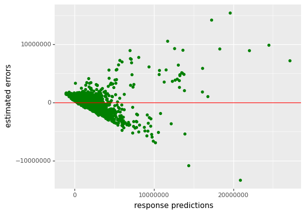{width="45%"}

</center>

Como podemos ver una forma cónica en los puntos, y por tanto no aleatoria uniforme, no podemos aceptar que la varianza de los residuos sea constate.


&nbsp;


### Incumplimiento del supuesto de media de los residuos nula <a class="anchor" id="70"></a>

Vamos a usar el contraste t-test para contrastastar el supuesto de que la media de los residuos es nula.

Primero calculamos la media de los residuos estimados para hacernos una idea de cual será el resultado del contraste:


```python
df_predictions_Python['estimated_errors'].mean()
```

    -1.5501118707531706e-07

&nbsp;


###  Comprobando el supuesto de media de los residuos nula en `Python`


```python
import pingouin as pg

pg.ttest(x= df_predictions_Python['estimated_errors'] , y=0)
```


<div>
<style scoped>
    .dataframe tbody tr th:only-of-type {
        vertical-align: middle;
    }

    .dataframe tbody tr th {
        vertical-align: top;
    }

    .dataframe thead th {
        text-align: right;
    }
</style>
<table border="1" class="dataframe">
  <thead>
    <tr style="text-align: right;">
      <th></th>
      <th>T</th>
      <th>dof</th>
      <th>alternative</th>
      <th>p-val</th>
      <th>CI95%</th>
      <th>cohen-d</th>
      <th>BF10</th>
      <th>power</th>
    </tr>
  </thead>
  <tbody>
    <tr>
      <th>T-test</th>
      <td>-4.225144e-12</td>
      <td>1904</td>
      <td>two-sided</td>
      <td>1.0</td>
      <td>[-71952.49, 71952.49]</td>
      <td>9.680415e-14</td>
      <td>0.026</td>
      <td>0.05</td>
    </tr>
  </tbody>
</table>
</div>


Para cualquier nivel de significación puede aceptarse la hipotesis de que la media de los residuos es nula (cero).


&nbsp;


### Incumplimiento del supuesto de distribución normal de los residuos  <a class="anchor" id="71"></a>
 
Primero vamos a comprobar el supuesto de normalidad de los residuos usando el método del histograma, que consiste en comparar el histograma de la muestra de la variable (en este caso el histograma de los residuos estimados) con el histograma de una v.a. normal con media y varianza igual a la de la muestra.

Posteriormente aplicaremos el contraste de Shapiro para normalidad.

&nbsp;

### Comprobando el supuesto de distribución normal de los residuos en `Python` con el método del histograma


```python
import scipy.stats as stats
(
ggplot(data = df_predictions_Python ,
 mapping = aes(x = df_predictions_Python['estimated_errors'])) 
+ geom_histogram(aes(y = after_stat('density')), color="black", fill="pink", position = 'identity', bins=35) 
+ stat_function( fun = stats.norm.pdf , args = dict( loc=mean(df_predictions_Python['estimated_errors']), scale=sd(df_predictions_Python['estimated_errors'])) , color='blue', size=1 )
)
```


<center>

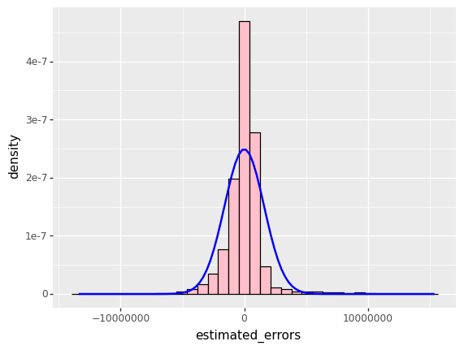{width="45%"}

</center>

&nbsp;


 


### Comprobando el supuesto de distribución normal de los residuos en `Python` con el contraste de Shapiro

Ahora vamos a comprobar el supuesto de normalidad de los residuos a través del contraste de Shapiro.

```python
shapiro_test = stats.shapiro(df_predictions_Python['estimated_errors'])
shapiro_test
```

    ShapiroResult(statistic=0.7914911508560181, pvalue=4.203895392974451e-44)


Para cualquier nivel de significación se puede rechazar la hipotesis nula de normalidad de los residuos.


&nbsp;


### Incumplimiento del supuesto de correlación nula de los residuos  <a class="anchor" id="72"></a>

Vamos a comprobar la hipotesis de correlación nula de los residuos a través del test de **Durban-Watson**.


&nbsp;

<div class="warning" style='background-color:#F7EBE8; color: #030000; border-left: solid #CA0B0B 7px; border-radius: 3px; size:1px ; padding:0.1em;'>
<span>

$\hspace{0.25cm}$  Las hipótesis del test de **Durban-Watson** son las siguientes:$\\[0.5cm]$


$$H_0: \hspace{0.1cm} corr\left(\varepsilon_{i}\hspace{0.05cm},\hspace{0.05cm} \varepsilon_{i+1}\right) = 0 \hspace{0.25cm} ,\hspace{0.25cm} \forall \hspace{0.25cm}i =1,...,n-1 $$ 

$$H_1: \hspace{0.1cm}  corr\left(\varepsilon_{i}\hspace{0.05cm},\hspace{0.05cm} \varepsilon_{i+1}\right) \neq 0 \hspace{0.25cm} ,\hspace{0.25cm} \exists \hspace{0.25cm}i =1,...,n-1 \\$$


$\hspace{0.25cm}$  **Estadístico del contraste :**

\begin{gather*}
DW \hspace{0.1cm}=\hspace{0.1cm} \dfrac{\sum_{i=1}^{n-1} (\hat{\varepsilon}_i - \hat{\varepsilon}_{i+1})^2 }{\sum_{i=1}^{n} \hat{\varepsilon}_{i}^2 }
\end{gather*}

</p>
 
</p></span>
</div>
 


<br>

<div class="warning" style='background-color:#F7EBE8; color: #030000; border-left: solid #CA0B0B 7px; border-radius: 3px; size:1px ; padding:0.1em;'>
<span>

$\hspace{0.25cm}$ **Interpretación:**

$\hspace{0.25cm}$  Se cumple lo siguiente:

$$DW \hspace{0.1cm}\simeq \hspace{0.1cm} 2\cdot (1- r_{12})$$

$\hspace{0.25cm}$  Donde:

$\hspace{0.25cm}$ $r_{12}\hspace{0.1cm}$  es la correlación lineal entre $\hspace{0.1cm}\hat{\varepsilon}_{(1)} = (\hat{\varepsilon}_1 , \hat{\varepsilon}_2 ,..., \hat{\varepsilon}_{n-1})\hspace{0.15cm}$ y $\hspace{0.15cm}\hat{\varepsilon}_{(2)} = (\hat{\varepsilon}_2  ,...,\hat{\varepsilon}_{n-1}, \hat{\varepsilon}_{n})\\$


- El estadístico del contraste está entre $0$ y $4$ , puesto que $r_{12}$ esta entre $-1$ y $1\\$.

- Un estadístico  $DW=2$ indica evidencia de que los residuos no están autocorrelados, es decir, evidencia a favor de $H_0\\$

- Un estadístico $DW$ cercano a $0$ indica evidencia de que los residuos están autocorrelados positivamente, es decir, evidencia favor de $H_1\\$

- Un estadístico $DW$ cercano a $4$ indica evidencia de que los residuos están autocorrelados negativamente, es decir, evidencia favor de $H_1$

</p>
 
</p></span>
</div>


&nbsp;


### Contraste de Durban-Watson en `Python`


```python
train_errors_1 = pd.DataFrame({ 'train_errors_1': df_predictions_Python.iloc[range(1, len(df_predictions_Python)) , 2 ] } )
train_errors_2 = pd.DataFrame({ 'train_errors_1': df_predictions_Python.iloc[range(0, len(df_predictions_Python)-1) , 2 ] } )  

train_errors_2['index']=range(1,len(train_errors_2)+1)
train_errors_2 = train_errors_2.set_index('index')

(
ggplot() 
+ geom_point(mapping = aes(x=train_errors_1 , y = train_errors_2 ), color="green")
+ labs(x='estimated errors 1' , y='estimated errors 2')
)
```

 
<center>

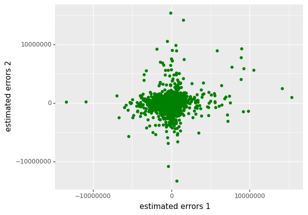{width="45%"}

</center>

```python
import statsmodels

statsmodels.stats.stattools.durbin_watson(df_predictions_Python['estimated_errors'], axis=0)
```

    1.7158064595327671

<br>

Otra alternativa para hacer el test de Durban-Watson en `Python` que nos da el p-valor: 


```python
# pip install dwtest
```

Más información sobre este paquete en el siguiente enlace https://github.com/JackywithaWhiteDog/dwtest


```python
from dwtest import dwtest
```


```python
statistic, pvalue = dwtest( 'price ~ size_in_m_2  + longitude + latitude + no_of_bedrooms + no_of_bathrooms'  , data_Python)
```


```python
statistic, pvalue
```

    (1.720186802122348, 5.373510268400102e-10)


Para cualquier nivel de significación $\alpha$ rechazamos la hipotesis nula de que los residuos no están autocorrelados.


&nbsp;


## Supuesto de relación lineal entre respuesta y predictores <a class="anchor" id="73"></a>

El modelo de regresión lineal asume que hay una relación lineal entre la respuesta y los predictores.

Si la relación real entre predictores y respuestas no es lineal, entonces todas las conclusiones que obtengamos del modelo serán cuestionables.


<br>

<div class="warning" style='background-color:#F7EBE8; color: #030000; border-left: solid #CA0B0B 7px; border-radius: 3px; size:1px ; padding:0.1em;'>
<span>

$\hspace{0.25cm}$ **¿ Cómo identificar no linealidad en la relación entre respuesta y predictores ?**


- Hacer un gráfico de dispersión de $\hspace{0.2cm} \widehat{\varepsilon}\hspace{0.2cm} \text{vs} \hspace{0.2cm}\widehat{Y}$

    - Es el mismo gráfico de dispersión que el usado para diagnosticar si la varianza de los residuos es constante. 

    - Si se observa una relación no lineal en el gráfico, esto indica una relación no lineal entre la respuesta y los predictores. response. $\\[0.5cm]$
    
   
 
- La no linealidad en la relación entre respuesta y predictores también puede ser detecctada graficando  $\hspace{0.2cm}Y \hspace{0.2cm} \text{vs} \hspace{0.2cm} X_j$ , para cada $\hspace{0.1cm} j\in \lbrace 1,...,p\rbrace$


</p>
 
</p></span>
</div>


<br>

**Soluciones:**

Una transformación logaritmica de la variable respuesta puede ser útil. Pero la mejor opción es usar un modelo de regresión alternativo que funcione bien con relaciones no lineales. 

<br>

**Identificación de no linealidad con scatter plots de la respuesta vs predictores (uno a uno)**


```python
(
ggplot(aes(x = 'size_in_m_2' , y = 'price') , data_Python) 

 + geom_point(fill="white", color = 'red') 
 + geom_smooth(method='lm', color = 'blue')
 + labs(x = "size_in_m_2", y = "price")
 + scale_x_continuous( breaks = range(int(data_Python['size_in_m_2'].min()) , int(data_Python['size_in_m_2'].max()) , 50) ) 
 + scale_y_continuous( breaks = range(int(data_Python['price'].min()) , int(data_Python['price'].max()) , 2000000) )
)
```
 

<center>

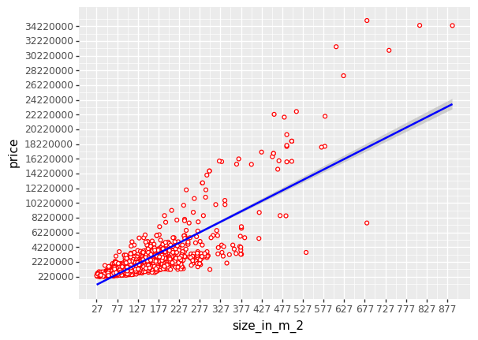{width="45%"}

</center>

<br>

```python
(
ggplot(aes(x = 'longitude' , y = 'price') , data_Python) 

 + geom_point(fill="white", color = 'red') 
 + geom_smooth(method='lm', color = 'blue')
 + labs(x = "longitude", y = "price")
 + scale_x_continuous( breaks = np.arange (data_Python['longitude'].min() , data_Python['longitude'].max() , 0.05) )
 + scale_y_continuous( breaks = range(int(data_Python['price'].min()) , int(data_Python['price'].max()) , 2000000) )
)
```

<center>

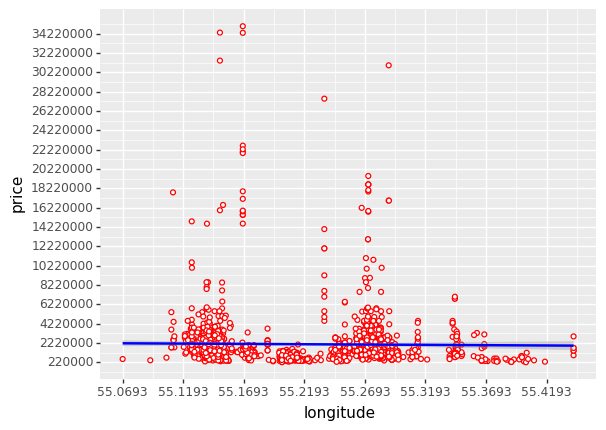{width="45%"}

</center>

 
<br>

```python
(
ggplot(aes(x = 'latitude' , y = 'price') , data_Python) 

 + geom_point(fill="white", color = 'red') 
 + geom_smooth(method='lm', color = 'blue')
 + labs(x = "latitude", y = "price")
 + scale_x_continuous( breaks =  np.arange (data_Python['latitude'].min() , data_Python['latitude'].max() , 0.05)  ) 
 + scale_y_continuous( breaks = range(int(data_Python['price'].min()) , int(data_Python['price'].max()) , 2000000) )
)
```
 

<center>

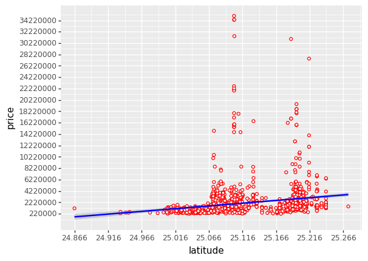{width="45%"}

</center>


<br>

```python
(
ggplot(aes(x = 'no_of_bedrooms' , y = 'price') , data_Python) 

 + geom_point(fill="white", color = 'red') 
 + geom_smooth(method='lm', color = 'blue')
 + labs(x = "no_of_bedrooms", y = "price")
 + scale_x_continuous( breaks =  np.arange (data_Python['no_of_bedrooms'].min() , data_Python['no_of_bedrooms'].max()+1 , 1)  ) 
 + scale_y_continuous( breaks = range(int(data_Python['price'].min()) , int(data_Python['price'].max()) , 2000000) )
)
```
 
<center>

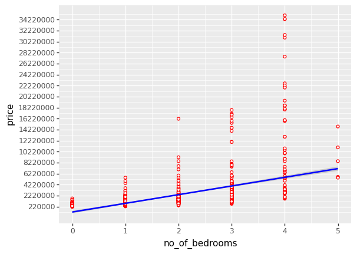{width="45%"}

</center>


<br>


```python
(
ggplot(aes(x = 'no_of_bathrooms' , y = 'price') , data_Python) 

 + geom_point(fill="white", color = 'red') 
 + geom_smooth(method='lm', color = 'blue')
 + labs(x = "no_of_bathrooms", y = "price")
 + scale_x_continuous( breaks =  np.arange (data_Python['no_of_bathrooms'].min() , data_Python['no_of_bathrooms'].max()+1 , 1)  ) 
 + scale_y_continuous( breaks = range(int(data_Python['price'].min()) , int(data_Python['price'].max()) , 2000000) )
)
```
 
<center>

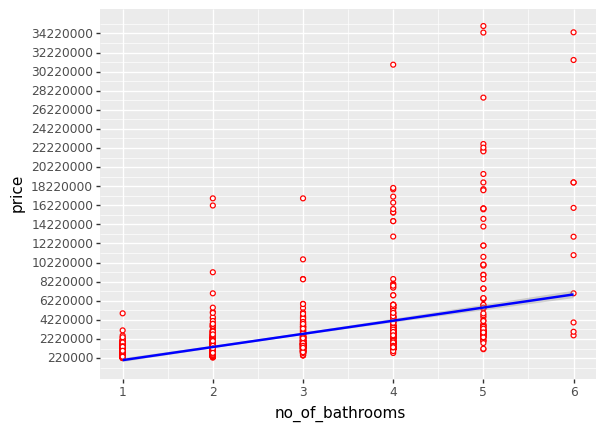{width="45%"}

</center>


<br>

```python
data_Python['quality'] = data_Python['quality'].astype('int')
```


```python
(
ggplot(aes(x = 'quality' , y = 'price') , data_Python) 

 + geom_point(fill="white", color = 'red') 
 + geom_smooth(method='lm', color = 'blue')
 + labs(x = "quality", y = "price")
 + scale_x_continuous( breaks = np.arange (data_Python['quality'].min() , data_Python['quality'].max()+1 , 1) ) 
 + scale_y_continuous( breaks = range(int(data_Python['price'].min()) , int(data_Python['price'].max()) , 2000000) )
)
```

 

<center>

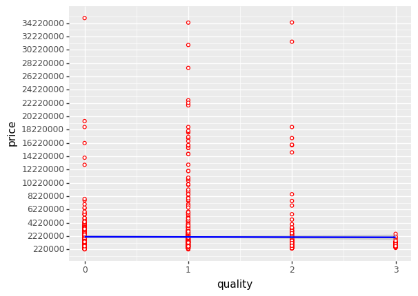{width="45%"}

</center>

&nbsp;


<br>

##  Datos atípicos: outliers <a class="anchor" id="74"></a>

Un dato atípico, también denominado outlier, es una observación que se desvia claramente de la relación entre la respuesta y los predictores.

Los outliers pueden afectar mucho a la estimación del modelo.


<div class="warning" style='background-color:#F7EBE8; color: #030000; border-left: solid #CA0B0B 7px; border-radius: 3px; size:1px ; padding:0.1em;'>
<span>
 
<p style='margin-left:1em;'>

$\hspace{0.25cm}$ **¿ Cómo identificar outliers ?**

$\hspace{0.25cm}$ Una opción simple es usar los residuos estandarizados, definidos como:

$$\widetilde{\varepsilon_i} = \dfrac{\hat{\varepsilon}_i}{\sqrt{\widehat{Var}(\hat{\varepsilon}_i)}} = \dfrac{\hat{y}_i - y_i}{ \sqrt{ \widehat{\sigma}^2 \cdot (1-h_{ii})} }  $$

<br>
 

$\hspace{0.25cm}$ Donde:

$\hspace{0.35cm} h_{ii} \hspace{0.1cm}$ es el $i$-esimo elemento de la diagonal principal de $\hspace{0.1cm} H=X \cdot (X^t \cdot X)^{-1} \cdot X^t \hspace{0.1cm}$


</p>
 
</p></span>
</div>


<br>

**Observación:**

$$\widehat{Var}(\hat{ \varepsilon }_i)\hspace{0.1cm} \neq\hspace{0.1cm} \widehat{Var}(\varepsilon_i)  $$

Porque  $\hspace{0.1cm}\varepsilon_i\hspace{0.1cm}$ es una variable aleatoria tal que $\hspace{0.1cm}\varepsilon_i \sim N \left(0\hspace{
0.1cm},\hspace{0.1cm} \sigma^2\right) \hspace{0.1cm}$, por hipotesis inicial del modelo.

Sin embargo $\hspace{0.15cm} \hat{\varepsilon}_i = y_i - \hat{y}_i \hspace{0.15cm}$ es otra variable aleatoria tal que  $\hspace{0.1cm} \hat{\varepsilon}_i \sim N\left(0\hspace{0.1cm},\hspace{0.1cm}\sigma^2 \cdot (1-h_{ii})\right) \hspace{0.1cm}$  

<br>

<div class="warning" style='background-color:#F7EBE8; color: #030000; border-left: solid #CA0B0B 7px; border-radius: 3px; size:1px ; padding:0.1em;'>
<span>
 
<p style='margin-left:1em;'>

$\hspace{0.25cm}$ **Criterio: Identificación de outliers**

$\hspace{0.25cm}$ Las observaciones cuyo **residuo estandarizado** sea **mayor que 3** (en valor absoluto) serán consideradas observaciones atípicas (outliers).

$\hspace{0.25cm}$ Es decir:

$\hspace{0.35cm}$ Si $\hspace{0.1cm}| \widetilde{\varepsilon_i} | > 3 \hspace{0.2cm}\Rightarrow\hspace{0.2cm} (y_i,x_i)\hspace{0.1cm}$ es una observación atípica (outlier)


</p>
 
</p></span>
</div>

<br>

**¿ Qué hacer con los outliers ?**

Si son el resultado de un error en la recolección de los datos, pueden ser eliminados.

Pero si el caso no es el anterior, no deberían eliminarse puesto que forman parte de la realidad reflejada por la muestra, y es por tanto información relevante.


<br>

### Identificación de outliers en `Python`

```python
H = np.dot(X @ np.linalg.inv( X.T @ X ) , X.T) 

standardized_estimated_errors = estimated_errors / np.sqrt(estimated_variance_error*(1-np.diag(H)) )
```


```python
Outliers_df = pd.DataFrame({'standardized_estimated_errors > 3' : standardized_estimated_errors > 3})
```


```python
Outliers_df.head()
```


<div>
<style scoped>
    .dataframe tbody tr th:only-of-type {
        vertical-align: middle;
    }

    .dataframe tbody tr th {
        vertical-align: top;
    }

    .dataframe thead th {
        text-align: right;
    }
</style>
<table border="1" class="dataframe">
  <thead>
    <tr style="text-align: right;">
      <th></th>
      <th>standardized_estimated_errors &gt; 3</th>
    </tr>
  </thead>
  <tbody>
    <tr>
      <th>0</th>
      <td>False</td>
    </tr>
    <tr>
      <th>1</th>
      <td>False</td>
    </tr>
    <tr>
      <th>2</th>
      <td>False</td>
    </tr>
    <tr>
      <th>3</th>
      <td>False</td>
    </tr>
    <tr>
      <th>4</th>
      <td>False</td>
    </tr>
  </tbody>
</table>
</div>


```python
Outliers = Outliers_df.loc[ Outliers_df['standardized_estimated_errors > 3'] == True , : ].index
```


```python
Outliers
```

    Int64Index([  60,  216,  235,  336,  343,  427,  456,  460,  461,  462, 463, 464,  465,  475,  476,  517,  576,  790,  836,  970,  989, 1189, 1259, 1487, 1515, 1690, 1697, 1869, 1885], dtype='int64')


<br>

<br>


# Bibliography

Benitez Peña, S. (2021). *El modelo de regresión lineal múltiple* [Presentación de PowerPoint]. Aula Global UC3M.

Benitez Peña, S. (2021). *Inferencia en el modelo de regresión lineal múltiple* [Presentación de PowerPoint]. Aula Global UC3M.

Benitez Peña, S. (2021). *Diagnosis y validacion del modelo de regresión lineal múltiple* [Presentación de PowerPoint]. Aula Global UC3M.

Galeano, P. (2022). *Regresion Lineal Múltiple* [Presentación de PowerPoint]. Aula Global UC3M.

Fox, J. (2022). *Diagnosing Collinearity* [Presentación de PowerPoint]. McMaster University

Faraway, J (2015). *Linear Models with R* (second edition). CRC Press.


 
