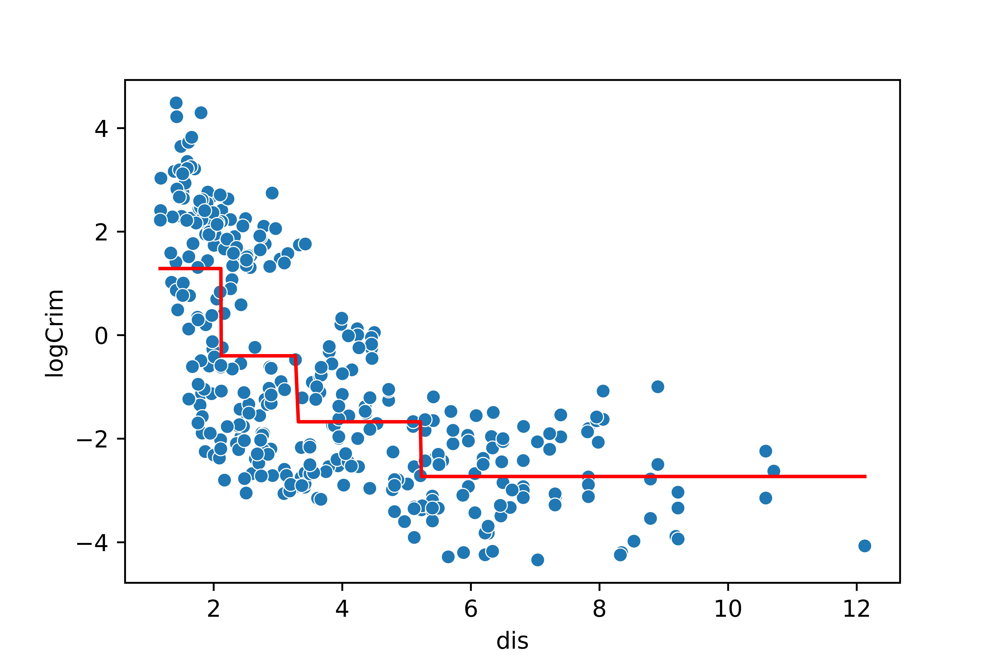
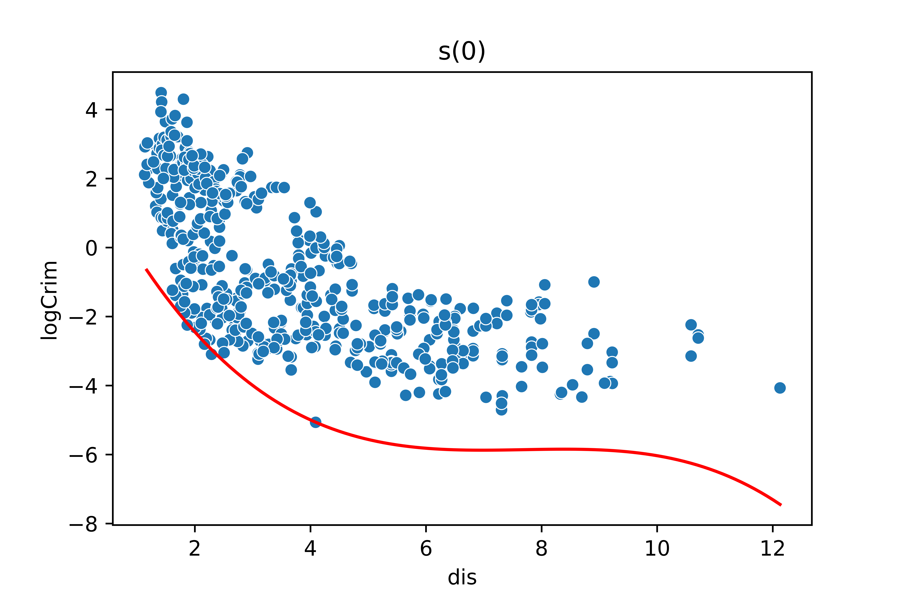
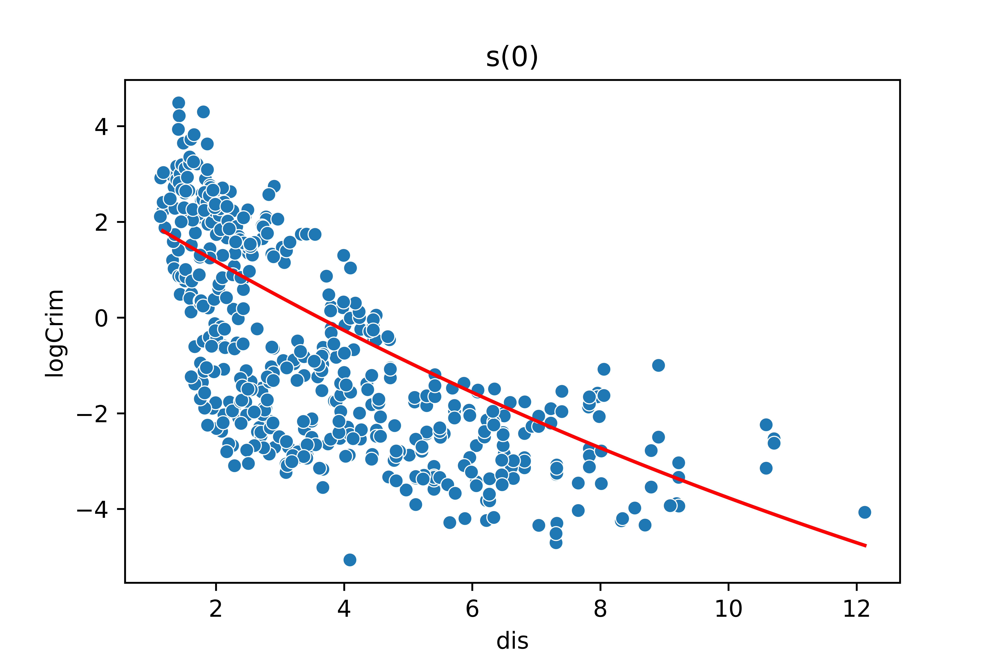
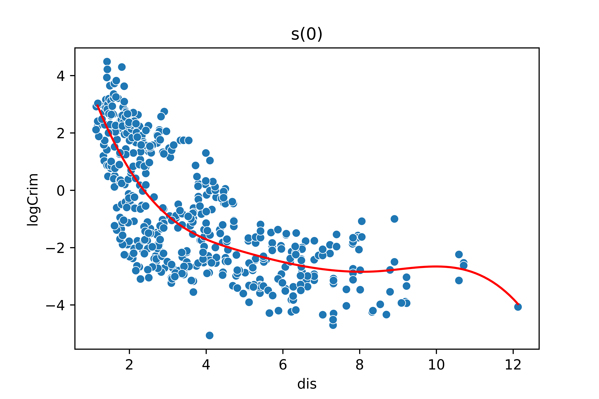

El modelo de regresión lineal ordinario es relativamente sencillo de describir e implementar, y tiene ventajas sobre otros enfoques en términos de interpretación e inferencia.

Sin embargo puede tener limitaciones significativas en términos de predicción, ya que el supuesto de linealidad casi nunca se cumple, y en ocasiones de manera demasiado fuerte.

En este artícullo vamos a relajar el supuesto de linealidad, aunque esto tendrá un alto coste en términos de interpretación.

Vamos a ver varios modelos en los que solo disponemos de un predictor.

Posterirmente veremis un modelo que permite incluir varios predictores.


# Modelo de Regresión Polinómica


Tenemos una variable respuesta $\mathcal{Y}$ y un predictor $\mathcal{X}_1$

Tenemos una muestra de $n$ observaciones de la respuesta  $\mathcal{Y}$ :

$$Y=(y_1,...,y_n)^t$$


Tenemos una muestra de $n$ observaciones del predictor  $\mathcal{X}_1$ : 

$$X_1=(x_{11},...,x_{n1})^t \\[1.5cm]$$


**Modelo de Regresión Lineal Simple (recordatorio)**

El modelo de **regresión lineal** simple ordinario tiene la siguiente forma:


$$y_i = \beta_0 + \beta_1 \cdot x_{i1} + \varepsilon_i \\$$

Matricialmente:

$$Y = \beta_0 + \beta_1 \cdot X_1 + \varepsilon$$

Donde  $\hspace{0.1cm}\varepsilon=( \varepsilon_1,..., \varepsilon_n)^t \\$

Y ahora $\beta_0$ es un vector con $n$ repeticiones de $\beta_0 \\$


En el que el término de error cumple las siguientes hipotesis:

$\varepsilon_i \sim N(0,\sigma^2)$

$cov(\varepsilon_i , \varepsilon_{i+1}) = 0$ 

para $\hspace{0.1cm}i=1,...,n \\$


Y los coeficientes $\hspace{0.1cm} \beta=(\beta_0 , \beta_1)^t\hspace{0.1cm}$ son estimados por mínimos cuadrados ordinarios (MCO):


$$\widehat{\beta} \hspace{0.1cm} =\hspace{0.1cm}  arg\hspace{0.1cm}  Min\hspace{0.1cm}  \lbrace RSS(\beta) \hspace{0.1cm} =\hspace{0.1cm}  \sum_{i=1}^n (y_i - (\beta_0 + \beta_1 \cdot x_{i1}))^2 \hspace{0.1cm} \rbrace$$


<br>

**Modelo de Regresión Polinómica**

El modelo de regresión polinómica de grado $d$ basado en el modelo de regrsión simple anterior tiene la siguiente forma:


$$y_i = \beta_0 + \beta_1 \cdot x_{i1} + \beta_2 \cdot x_{i1}^2  +...+ \beta_d \cdot x_{i1}^d + \varepsilon_i$$

para $\hspace{0.1cm} i=1,...,n \\$

 

Matricialmente:

$$Y = \beta_0 + \beta_1 \cdot X_1 +  \beta_2 \cdot X_1^2 +...+ \beta_d \cdot X_1^d + \varepsilon$$

Donde  $\hspace{0.1cm} X_1^k = (x_{11}^k , x_{21}^k,...,x_{n1}^k)^t\hspace{0.1cm}$ , $\hspace{0.1cm}\varepsilon=( \varepsilon_1,..., \varepsilon_n)^t \\$

Y ahora $\beta_0$ es un vector con $n$ repeticiones de $\beta_0 \\$


En el que el término de error cumple las siguientes hipotesis:


$\varepsilon_i \sim N(0,\sigma^2)$

$cov(\varepsilon_i , \varepsilon_{i+1}) = 0$ 

para $i=1,...,n\\$


Y los coeficientes $\hspace{0.1cm} \beta=(\beta_0 , \beta_1)^t\hspace{0.1cm}$ son estimados por minimos cuadrados ordinarios.


$$\widehat{\beta} \hspace{0.1cm} =\hspace{0.1cm}  arg\hspace{0.1cm}  Min\hspace{0.1cm}  \lbrace RSS(\beta) \hspace{0.1cm} =\hspace{0.1cm}  \sum_{i=1}^n (y_i - (\beta_0 +  \beta_1 \cdot x_{i1} + \beta_2 \cdot x_{i1}^2  +...+ \beta_d \cdot x_{i1}^d ))^2 \hspace{0.1cm} \rbrace$$


<br>


>Por tanto el modelos de regresión polinómica de grado $d$ basado en el modelo de regresión lineal simple con predictor $X_1$ es simplemente un modelo de regresión lineal *múltiple* con predictores $X_1, X_1^2 ,...,X_1^d$


<br>


## Seleccion del grado del polinomio

En la práctica lo habitual es no seleccionar un grado $d > 4$, ya que cuanto mayor sea el grado, mayor es la flexibilidad del polinomio y mayor el sobre-ajuste.

<br>


## Problemas

Los coeficientes estimados no son fáciles de interpretar. 


<br>


## Regresión Polinomica en `Python`

```python
import pandas as pd
import numpy as np

url = 'https://raw.githubusercontent.com/JWarmenhoven/ISLR-python/master/Notebooks/Data/Boston.csv'

Boston = pd.read_csv(url)
```


```python
Boston['logCrim'] =  np.log( Boston['crim'] )

Y = Boston['logCrim']

X = Boston['dis']

```


```python
from sklearn.model_selection import train_test_split

X_train, X_test, Y_train, Y_test = train_test_split( X, Y, test_size=0.3 , random_state=123)
```


```python
from sklearn.preprocessing import PolynomialFeatures
from sklearn.linear_model import LinearRegression

```


```python
X_train_1 = PolynomialFeatures(degree=1).fit_transform(np.array(X_train).reshape(-1, 1))
X_train_2 = PolynomialFeatures(degree=2).fit_transform(np.array(X_train).reshape(-1, 1))
X_train_3 = PolynomialFeatures(degree=3).fit_transform(np.array(X_train).reshape(-1, 1))
```


```python
X_train.head()
```

```
273    4.3665
52     6.8147
181    2.5979
452    2.3682
381    1.5192
Name: dis, dtype: float64
```


```python
X_train_2
```
```
array([[ 1.        ,  4.3665    , 19.06632225],
       [ 1.        ,  6.8147    , 46.44013609],
       [ 1.        ,  2.5979    ,  6.74908441],
       ...,
       [ 1.        ,  4.7211    , 22.28878521],
       [ 1.        ,  1.5804    ,  2.49766416],
       [ 1.        ,  1.6132    ,  2.60241424]])
```

```python
X_train_3
```

```
array([[  1.        ,   4.3665    ,  19.06632225,  83.2530961 ],
       [  1.        ,   6.8147    ,  46.44013609, 316.47559541],
       [  1.        ,   2.5979    ,   6.74908441,  17.53344639],
       ...,
       [  1.        ,   4.7211    ,  22.28878521, 105.22758385],
       [  1.        ,   1.5804    ,   2.49766416,   3.94730844],
       [  1.        ,   1.6132    ,   2.60241424,   4.19821465]])

```


```python

fit = LinearRegression().fit(X=X_train_3, y=Y_train)
```


```python

fit.intercept_
```
         
    5.950341959209399


```python

fit.coef_
```
          
    array([ 0.        , -3.43113265,  0.45071005, -0.01956285])


```python

X_test_3 = PolynomialFeatures(degree=3).fit_transform(np.array(X_test).reshape(-1, 1))

ECM_test_polinomio_3 = sum( ( Y_test - fit.predict(X_test_3)  )**2 ) / len(Y_test)

ECM_test_polinomio_3

```
```
  2.0835991159477456
```         
           

```python

Y_pred_train = fit.predict(X_train_3)

sns.scatterplot(x=X_train, y=Y_train)
sns.lineplot(x=X_train, y=Y_pred_train , color='red')

```


<br>

<center>

{width="60%"}

</center>

<br>


<br>


<br>


# Regresión con funciones escalón <a class="anchor" id="52"></a>


Tenemos una variable respuesta $\hspace{0.1cm}\mathcal{Y}\hspace{0.1cm}$ y un predictor $\hspace{0.1cm}\mathcal{X}_1$

Tenemos una muestra de $n$ observaciones de la respuesta  $\hspace{0.1cm}\mathcal{Y}$ :

$$Y=(y_1,...,y_n)^t$$


Tenemos una muestra de $n$ observaciones del predictor  $\hspace{0.1cm}\mathcal{X}_1$ : 

$$X_1=(x_{11},...,x_{n1})^t \\[1.5cm]$$


Tenemos una serie de $\hspace{0.1cm} k+1\hspace{0.1cm}$ intervalos $\hspace{0.1cm} L = \lbrace \hspace{0.1cm} [L_0 , L_1),[L_1 , L_2),...,[L_{k-1} , L_k)[L_k , L_{k+1}) \rbrace \hspace{0.1cm} \hspace{0.1cm}$ tales que: $\\[0.4cm]$

- Son disjuntos dos a dos, es decir, no comparten elementos dos a dos. $$[L_h , L_{h+1})\cap [L_{r} , L_{r+1}) = \emptyset  \hspace{0.45cm} \forall h\neq r =0,1,...,k \\[0.5cm]$$

- Toda observación de la muestra $X_1$ pertenece a alguno de los intervalos:

$$x_{i1} \in [L_0 , L_1)\cup ... \cup [L_{k-1} , L_k)\cup [L_k , L_{k+1}) \hspace{0.5cm} \forall i =1,..,n \\$$


Se definen las siguientes variables binarias (**dummies**):


$$I_h(X_{1})\hspace{0.15cm} = \hspace{0.15cm} \left(\hspace{0.2cm} \Upsilon (\hspace{0.15cm} x_{i1} \in [L_h , L_{h+1}) \hspace{0.15cm} ) \hspace{0.2cm} / \hspace{0.2cm} i=1,...,n    \hspace{0.2cm} \right)^t \hspace{0.45cm} \forall \hspace{0.1cm} h=0,1,...,k \\$$  


Donde: $\hspace{0.2cm} \Upsilon (\cdot) \hspace{0.15cm}$ es la función indicatriz o indicadora.

<br>

El modelo de regresión con funciones escalón tiene la siguiente forma:


$$y_i = \beta_0 \hspace{0.1cm}+\hspace{0.1cm} \beta_1 \cdot \Upsilon (\hspace{0.15cm} x_{i1} \in [L_1 , L_{2}) \hspace{0.15cm} ) \hspace{0.1cm}+\hspace{0.1cm} \beta_2 \cdot \Upsilon (\hspace{0.15cm} x_{i1} \in [L_2 , L_{3}) \hspace{0.15cm} ) \hspace{0.1cm} + ... +\hspace{0.1cm} \beta_k \cdot \Upsilon (\hspace{0.15cm} x_{i1} \in [L_k , L_{k+1}) \hspace{0.15cm} ) \hspace{0.1cm}+ \hspace{0.1cm}\varepsilon_i$$

para $\hspace{0.1cm}i=1,..,n \\$


Matricialmente:


$$Y= \beta_0 \hspace{0.1cm}+\hspace{0.1cm} \beta_1 \cdot I_1(X_1) \hspace{0.1cm}+\hspace{0.1cm} \beta_2 \cdot I_2(X_1) \hspace{0.1cm}+ ... +\hspace{0.1cm} \beta_k \cdot I_k(X_1) \hspace{0.1cm}+\hspace{0.1cm} \varepsilon \\$$


Donde ahora $\hspace{0.1cm}\beta_0\hspace{0.1cm}$ es un vector con $n$ repeticiones de $\hspace{0.1cm}\beta_0 \\$


**Observaciones**

- No se incluye $\hspace{0.1cm}I_0(X_1)\hspace{0.1cm}$ en el modelo porque si no habría problemas de multicolinealidad perfecta. $\\[0.5cm]$

- Una cuestión en la regresion con fucniones escalón es la de cómo determinar los intervalos. Para ello se suelen usar los cuantiles del predictor. Si se quieren $k$ intervalos se usan los cuantiles que van de $100/k$ en $100/k$ para definir los extremos de los intervalos. 

    - Por ejemplo si queremos $\hspace{0.12cm}k=5\hspace{0.12cm}$ , entonces se usan los cuantiles que van de $\hspace{0.12cm}100/5=20\hspace{0.12cm}$ en $\hspace{0.12cm}20\hspace{0.12cm}$ , es decir, los cuantiles $\hspace{0.12cm}Q_0, Q_{20},Q_{40},Q_{60},Q_{80}, Q_{100}\hspace{0.12cm}$  para definir los extremos de los intervalos. Así  los intervalos serían los siguientes:
    
    $$[Q_0 , Q_{20}) , [Q_{20} , Q_{40}) , [Q_{40}, Q_{60}) , [Q_{60} , Q_{80}) , [Q_{80}, Q_{100} + c)$$
    
$\hspace{1.8cm}$ Donde: $\hspace{0.15cm} c>0$ , $\hspace{0.15cm}Q_0 = Min(X_1)$, $\hspace{0.15cm}Q_{100}=Max(X_1)$
    
 
- Notese que se añade $\hspace{0.12cm}c>0\hspace{0.12cm}$ para cumplir la condición de que toda observacion de $\hspace{0.12cm}X_1\hspace{0.12cm}$ pertenezca a alguno de os intervalos. Si no se añadiese, entonces la observacion $\hspace{0.12cm}Max(X_1)\hspace{0.12cm}$ no estaria en ninguno de los intervalos, al ser el último abierto en su extremo superior. $\\[0.5cm]$


- El número de intervalos no debe ser excesivo, puesto cuanto mayor sea menos observaciones caen en cada intervalo, y menos precisas son las estimaciones. $\\[0.5cm]$

- Es un modelo muy fácil de interpretar:

    - $\beta_0 \hspace{0.15cm}$ es la media  de $\hspace{0.15cm}X_1\hspace{0.15cm}$ en el intervalo $[L_0 , L_1)$ . Mientras que  $\hspace{0.15cm}\beta_j\hspace{0.15cm}$ es la media de $\hspace{0.15cm}X_1\hspace{0.15cm}$ en el intervalo $\hspace{0.15cm}[L_0 , L_1)\hspace{0.15cm}$ y algo mas (o algo menos). $\\[0.5cm]$

- El modelo de regresión con funciones escalón con el predictor cuantitativo** $\hspace{0.1cm}X_1\hspace{0.1cm}$  y los intervalos $\hspace{0.1cm} L = \lbrace \hspace{0.1cm} [L_0 , L_1),[L_1 , L_2),...,[L_{k-1} , L_k)[L_k , L_k+1] \hspace{0.1cm}\rbrace\hspace{0.1cm}$ es equivalente al modelo de regresión lineal con el predictor **cuantitativo** $\hspace{0.1cm}X_1\hspace{0.1cm}$ categoricazdo en base a los intervalos de $\hspace{0.1cm}L \\[0.6cm]$


Veamos este último punto con más detalle:

Sea $\hspace{0.1cm}X_1\hspace{0.1cm}$ una muestra de tamaño $n$ de una variable cuantitativa $\hspace{0.1cm}\mathcal{X}_1$

La versión categorizada de $\hspace{0.1cm}X_1\hspace{0.1cm}$ se puede definir como: $\\[0.5cm]$


$$X_1^{cat} \hspace{0.1cm}=\hspace{0.1cm} (\hspace{0.1cm} x^{cat}_{i1} \hspace{0.1cm}/\hspace{0.1cm} i=1,..,n \hspace{0.1cm}\hspace{0.1cm}) \\$$

Donde: 

$$
x^{cat}_{i1}\hspace{0.1cm} =\hspace{0.1cm} \left\lbrace\begin{array}{l} 0, \hspace{0.1cm}\text{ Si} \hspace{0.2cm} x_{ik} \in [L_{0},L_{1}) \\ 1, \hspace{0.2cm}\text{ Si} \hspace{0.2cm} x_{ik} \in [L_{1},L_{2}) 
\\ ...
\\ k, \hspace{0.2cm}\text{ Si } \hspace{0.2cm} x_{ik} \in [L_{k},L_{k+1})  \end{array}\right. 
$$

<br>

El modelo de regresión lineal con el predictor $X_1^{cat}$ es de la forma: $\\[0.5cm]$


$$Y = \beta_0 + \beta_1 \cdot I(X_1^{cat} = 1) + \beta_2 \cdot I(X_1^{cat} = 2) + ... + \beta_k \cdot I(X_1^{cat}=k) + \varepsilon \\$$


Donde:

$$I(X_1^{cat} = h)  \hspace{0.15cm} = \hspace{0.15cm} \left(\hspace{0.2cm} \Upsilon (\hspace{0.15cm} x_{i1}^{cat} = h\hspace{0.15cm} ) \hspace{0.2cm} / \hspace{0.2cm} i=1,...,n    \hspace{0.2cm} \right)^t  \hspace{0.15cm} = \hspace{0.15cm} \left(\hspace{0.2cm} \Upsilon (\hspace{0.15cm} x_{i1} \in [L_h , L_{h+1} ) \hspace{0.15cm} ) \hspace{0.2cm} / \hspace{0.2cm} i=1,...,n    \hspace{0.2cm} \right)^t \hspace{0.15cm} = \hspace{0.15cm} I_h(X_{1}) \hspace{0.45cm} \forall \hspace{0.1cm} h=0,1,...,k \\$$


Por tanto, queda demostrado que son el mismo modelo.


<br>

## Regresión con funciones escalón en `Python`


```python
intervals = [X_train.min(), X_train.quantile(0.25), X_train.quantile(0.5), X_train.quantile(0.75), X_train.max() + 0.1]

pd.cut(x=X_train , bins=intervals )
```

```
273     (3.295, 5.227]
52     (5.227, 12.226]
181     (2.114, 3.295]
452     (2.114, 3.295]
381     (1.169, 2.114]
            ...       
98      (3.295, 5.227]
476     (2.114, 3.295]
322     (3.295, 5.227]
382     (1.169, 2.114]
365     (1.169, 2.114]
Name: dis, Length: 354, dtype: category
Categories (4, interval[float64, right]): [(1.169, 2.114] < (2.114, 3.295] < (3.295, 5.227] < (5.227, 12.226]]

```

```python
pd.cut(x=X_train , bins=intervals , labels=False)
```
```
273    2.0
52     3.0
181    1.0
452    1.0
381    0.0
      ... 
98     2.0
476    1.0
322    2.0
382    0.0
365    0.0
Name: dis, Length: 354, dtype: float64

```


```python
X_train_cat = pd.cut(x=X_train , bins=intervals , labels=False)
```

```python
def varcharProcessing(X, varchar_process = "dummy_dropfirst"):
    
    dtypes = X.dtypes

    if varchar_process == "drop":   
        X = X.drop(columns = dtypes[dtypes == np.object].index.tolist())

    elif varchar_process == "dummy":
        X = pd.get_dummies(X,drop_first=False)

    elif varchar_process == "dummy_dropfirst":
        X = pd.get_dummies(X,drop_first=True)

    else: 
        X = pd.get_dummies(X,drop_first=True)
    
    X["intercept"] = 1
    cols = X.columns.tolist()
    cols = cols[-1:] + cols[:-1]
    X = X[cols]
    
    return X
```

```python
X_train_cat_dummies = varcharProcessing(X_train_cat , varchar_process = "dummy_dropfirst")

X_train_cat_dummies
```

```
     intercept  1.0  2.0  3.0
273          1    0    1    0
52           1    0    0    1
181          1    1    0    0
452          1    1    0    0
381          1    0    0    0
..         ...  ...  ...  ...
98           1    0    1    0
476          1    1    0    0
322          1    0    1    0
382          1    0    0    0
365          1    0    0    0
```

```python
fit_escalon = LinearRegression().fit(X=X_train_cat_dummies , y=Y_train)
```

```python
intervals = [X_test.min(), X_test.quantile(0.25), X_test.quantile(0.5), X_test.quantile(0.75), X_test.max() + 0.1]

X_test_cat = pd.cut(x=X_test , bins=intervals , labels=False)

X_test_cat_dummies = varcharProcessing(X_test_cat , varchar_process = "dummy_dropfirst")
```

```python
ECM_test_escalon = sum( ( Y_test - fit.predict(X_test_cat_dummies)  )**2 ) / len(Y_test)

ECM_test_escalon
```

       42.0037997826327


```python
Y_pred_train = fit_escalon.predict(X_train_cat_dummies)

fig, ax = plt.subplots()

sns.scatterplot(x=X_train, y=Y_train)
sns.lineplot(x=X_train, y=Y_pred_train , color='red')

fig.savefig('p2.jpg', format='jpg', dpi=1200)
```

<br>

<center>

{width="60%"}

</center>

 


<br>

<br>

# Regresión con Polinomios a trozos

Surgue como combinación de la regresion polinomica y la regresion con funcioens escalon.

La idea es usar la filosofia de la regresicon con funciones escalon pero en lugar de usar una funcion costante en cada intervalo, usar una función polinomica.


PONER GRAFICO PARA ILUSTRAR LA IDEA

<br>


Tenemos una variable respuesta $\hspace{0.1cm}\mathcal{Y}\hspace{0.1cm}$ y un predictor $\hspace{0.1cm}\mathcal{X}_1$

Tenemos una muestra de $n$ observaciones de la respuesta  $\hspace{0.1cm}\mathcal{Y}$ :

$$Y=(y_1,...,y_n)^t$$


Tenemos una muestra de $n$ observaciones del predictor  $\hspace{0.1cm}\mathcal{X}_1$ : 

$$X_1=(x_{11},...,x_{n1})^t \\[1.5cm]$$


Tenemos una serie de $\hspace{0.1cm} k+1\hspace{0.1cm}$ intervalos $\hspace{0.1cm} L = \lbrace \hspace{0.1cm} [L_0 , L_1),[L_1 , L_2),...,[L_{k-1} , L_k)[L_k , L_{k+1}) \rbrace \hspace{0.1cm} \hspace{0.1cm}$ tales que: $\\[0.4cm]$

- Son disjuntos dos a dos, es decir, no comparten elementos dos a dos. $$[L_h , L_{h+1})\cap [L_{r} , L_{r+1}) = \emptyset  \hspace{0.45cm} \forall h\neq r =0,1,...,k \\[0.5cm]$$

- Toda observación de la muestra $X_1$ pertenece a alguno de los intervalos:

$$x_{i1} \in [L_0 , L_1)\cup ... \cup [L_{k-1} , L_k)\cup [L_k , L_{k+1}) \hspace{0.5cm} \forall i =1,..,n \\$$


La idea es, en cada intervalo ajustar una regresión polinómica, con ciertas restricciones.


Supongamos que se ajusta un polinomio de grado $d_h$ en el intervalo $[L_h , L_{h+1})$ , para $h=0,1,...,k$, el modelo de regresión sería de la forma: $\\[0.5cm]$


$$y_i \hspace{0.1cm} =\hspace{0.1cm} \left[ \beta_{00} + \beta_{10}\cdot x_{i1} + \beta_{20}\cdot x_{i1}^2 + ... + \beta_{d_0 0}\cdot x_{i1}^{d_0} \right] \cdot \Upsilon(x_{i1} \in [L_0 ,L_1) ) \hspace{0.15cm}+\hspace{0.15cm} \left[ \beta_{01} + \beta_{11}\cdot x_{i1} + \beta_{21}\cdot x_{i1}^2 + ... + \beta_{d_1 1}\cdot x_{i1}^{d_1} \right] \cdot \Upsilon(x_{i1} \in [L_1 ,L_2) ) \\[0.7cm]             +\hspace{0.15cm} ... \hspace{0.15cm}+\hspace{0.15cm}  \left[ \beta_{0k} + \beta_{1k}\cdot x_{i1} + \beta_{2k}\cdot x_{i1}^2 + ... + \beta_{d_k k}\cdot x_{i1}^{d_k} \right] \cdot \Upsilon(x_{i1} \in [L_k ,L_{k+1}) ) \hspace{0.12cm}+\hspace{0.12cm} \varepsilon \\[0.7cm] 
=\hspace{0.12cm} \sum_{h=0}^k \hspace{0.12cm} \left[ \beta_{0h} + \beta_{1h}\cdot x_{i1} + \beta_{2h}\cdot x_{i1}^2 + ... + \beta_{d_h h}\cdot x_{i1}^{d_h}  \right] \cdot \Upsilon(x_{i1} \in [L_h ,L_{h+1}) ) \hspace{0.12cm}+\hspace{0.12cm} \varepsilon \\[0.5cm]$$

Donde: $\hspace{0.15cm}\Upsilon(\cdot) \hspace{0.1cm}$ es una función indicadoro o indicatriz. $\\[0.6cm]$


Matricialmente: $\\[0.5cm]$

$$
Y  \hspace{0.1cm} =\hspace{0.1cm} \left\lbrace\begin{array}{l} \beta_{00} + \beta_{10}\cdot X_1 + \beta_{20}\cdot X_1^2 + ... + \beta_{d_0 0}\cdot X_1^{d_0} + \varepsilon , \hspace{0.1cm}\text{ Si} \hspace{0.2cm} X_1 \in [L_0 , L1) \\ \beta_{01} + \beta_{11}\cdot X_1 + \beta_{21}\cdot X_1^2 + ... + \beta_{d_1 1}\cdot X_1^{d_1} + \varepsilon, \hspace{0.2cm}\text{ Si} \hspace{0.2cm} X_1 \in [L_{1},L_{2}) 
\\ ...
\\ \beta_{0k} + \beta_{1k}\cdot X_1 + \beta_{2k}\cdot X_1^2 + ... + \beta_{d_k k}\cdot X_1^{d_k} + \varepsilon, \hspace{0.2cm}\text{ Si } \hspace{0.2cm} X_1 \in [L_{k},L_{k+1})  \end{array}\right. 
$$


<br>


La estimación de los coeficientes se sigue realizando por el método de mínimos cuadrados ordinarios: $\\[0.4cm]$


Sea $\hspace{0.15cm} \beta_h^* = ( \beta_{0h} , \beta_{1h} ,..., \beta_{d_h h} )^t \\[0.4cm]$


Para cada $\hspace{0.1cm} h=0,1,...,k\hspace{0.1cm}$ el vector de coeficientes $\hspace{0.1cm} \beta_h^*\hspace{0.1cm}$ se estima como sigue: $\\[0.5cm]$

$$\widehat{\beta}_h^* \hspace{0.15cm}=\hspace{0.15cm} arg\hspace{0.1cm} Min \hspace{0.1cm} \left\{ \hspace{0.1cm} \sum_{i / x_{i1} \in [L_h , L_{h+1})} \left(y_i - (\beta_{0h} + \beta_{1h}\cdot x_{i1} + \beta_{2h}\cdot x_{i1}^2 + ... + \beta_{d_h h}\cdot x_{i1}^{d_h}) \right)^2   \hspace{0.1cm}  \right\} \\$$


Que es equivalente a lo siguiente:

Sea $\hspace{0.15cm} \beta = ( \beta_{00} , \beta_{10} ,..., \beta_{d_0 0} , \beta_{01} , \beta_{11} ,..., \beta_{d_1 1}, ... , \beta_{0k} , \beta_{1k} ,..., \beta_{d_k k}   )^t = (\beta_0^* , \beta_1^* ,..., \beta_k^*)^t \\[0.4cm]$ 


$$\widehat{\beta} \hspace{0.15cm}=\hspace{0.15cm} arg\hspace{0.1cm} Min \hspace{0.1cm} \left\{ \hspace{0.1cm} \sum_{i=1}^n \left(y_i - \sum_{h=0}^k \hspace{0.12cm} \left[ \beta_{0h} + \beta_{1h}\cdot x_{i1} + \beta_{2h}\cdot x_{i1}^2 + ... + \beta_{d_h h}\cdot x_{i1}^{d_h}  \right] \cdot \Upsilon \left(x_{i1} \in [L_h ,L_{h+1}) \right) \hspace{0.1cm}\right)^2   \hspace{0.1cm}  \right\} \\$$


Puede demostrarse que:

$$\widehat{\beta} = (\widehat{\beta}_0^* , \widehat{\beta}_1^* ,..., \widehat{\beta}_k^*)^t$$

<br>

# Regresión con Splines


Nace de un refinamiento del modelo de regresión con polinomios a trozos.

Antes de explicar el modelo en sí vamos a hacer notar algunas peculariedades del modelo anterior:


El polinomio ajustado en el intervalo $\hspace{0.1cm} [L_h , L_{h+1}) \hspace{0.1cm}$ ,a saber,   $\hspace{0.1cm} \hat{p}_h(x) = \widehat{\beta}_{0h} + \widehat{\beta}_{1h}\cdot x + \widehat{\beta}_{2h}\cdot x^2 + ... + \widehat{\beta}_{d_h h}\cdot x^{d_h} \hspace{0.1cm}$ no tiene porque coincidir en su extremo derecho con el extremo izquierdo del polinomio ajustado en el intervalo siguiente $\hspace{0.1cm} [L_{h+1} , L_{h+2}) \hspace{0.1cm}$ , a saber, $\hspace{0.1cm} \hat{p}_{h+1}(x) = \widehat{\beta}_{0 (h+1)} + \widehat{\beta}_{1(h+1)}\cdot x + \widehat{\beta}_{2(h+1)}\cdot x^2 + ... + \widehat{\beta}_{d_{h+1} (h+1)}\cdot x^{d_{h+1}} \hspace{0.1cm}$

En otras palabras, podria ser que $\hspace{0.1cm}p_h(L_{h+1}) \neq p_{h+1}(L_{h+1})$


Geometricamente, esto significa que la siguiente situación es posible:


PONER GRAFICO PARA ILUSTRAR LA IDEA


El modelo de regresión con Splines es un modelo de regresion con polinomios a trozos sobre los que se imponen restricciones que garantizan que lo anterior no pueda pasar, y además el comportamiento de los polinomios cerca del extremo $L_{h+1]$ es suave.


Las restricciones que garantizan esto son:

Si $\hat{f}(x) = \sum_{h=0}^n \hat{p}_h(x)\cdot \Upsilon(x \in [L_h , L_{h+1}) )$

- $\hat{f}$  es continua en $[L_0 , L_{k+1})$

- $\hat{f}^{'}$ y $\hat{f}^{''}$ son continuas al menos en los extremos de los intervalos $\lbrace L_h / h=1,...,k \rbrace \\$


<br>


El modelo de regresión con Splines de grado $\hspace{0.1cm} d=3\hspace{0.1cm}$ y  $\hspace{0.1cm} k+1\hspace{0.1cm}$ intervalos $\hspace{0.1cm}[L_0 , L_1),[L_1,L_2),...,[L_k, L_{k+1})\hspace{0.1cm}$ tiene la siguiente forma: $\\[0.5cm]$


$$y_i = \beta_0 + \beta_1 \cdot x_{i1} + \beta_2 \cdot x_{i1}^2 +  \beta_3 \cdot x_{i1}^3   + \beta_{3+1} \cdot \phi (x_{i1} \geq L_1) + \beta_{3+2} \cdot \phi (x_{i1} \geq L_2) + ... + \beta_{3+k} \cdot \phi (x_{i1} \geq L_k) + \varepsilon \hspace{0.12cm} = \\ =\hspace{0.12cm}   \beta_0 + \beta_1 \cdot x_{i1} + \beta_2 \cdot x_{i1}^2 +  \beta_3 \cdot x_{i1}^3   +   \sum_{h=1}^k \beta_{3+h} \cdot \phi (x_{i1} \geq L_h) \hspace{0.12cm} +\hspace{0.12cm}  \varepsilon $$ 


Donde:

$$ 
\phi (x_{i1} \geq L_h) = \left\lbrace\begin{array}{l} 0 , \hspace{0.1cm}\text{ Si} \hspace{0.2cm} x_{i1} < L_h \\ (x_{i1} -  L_1)^3 , \hspace{0.2cm} \text{ Si} \hspace{0.2cm} x_{i1} \geq L_h  \end{array}\right.
$$

para $\hspace{0.1cm} h=1,...,k$

<br>


La estimación del modelo se puede hacer por minimos cuadrados ordinarios:


$$\widehat{\beta} = arg Min ( y_i - ( \beta_0 + \beta_1 \cdot x_{i1} + \beta_2 \cdot x_{i1}^2 +  \beta_3 \cdot x_{i1}^3   +   \sum_{h=1}^k \beta_{3+h} \cdot \phi (x_{i1} \geq L_h) ) )^2$$


**Observaciones**

- El nº de intervalos que contempla el modelo es $k+1 \\$

- El grado de los polinomios splines que se ajustan en cada intervalo es $3 \\$

- Posteriormente usaremos la libreria `PyGAM`que construye splines a traves de la funcion `s(n_spline_order , n_splines, ...)`, en la cual `n_spline_order` es el grado del spline (en el caso canonico es 3) , y `n_splines` es el nº de coeficientes betas sin contar el intercept , en nuestra exposicion seria `n_splines` = k + 3 = k + `n_spline_order`  . Por lo que hay que notar que el nº de intervalos del modelo es k+1 = `n_splines` - `n_spline_order` + 1 . Esto será relevante cuando usemos `PyGAM` para crear modelos con splines controlando el grado y el nº de intervalos.


<br>


DUDA: PUEDE HABER SPLINES QUE TENGAN DIFERENTE GRADO $d$ EN CADA INTERVALO ??


<br>


## Regresión con splines en `Python`


```python
from pygam import GAM, s, f
```


```python
gam_1 = GAM(s(0, n_splines=4, spline_order=3 , penalties='none' )).fit(X_train, Y_train)

# n_splines = k + spline_order = nº de betas (sin contar beta0)
# k + 1 = nº intervalos = n_splines - spline_order + 1 = 4 - 3 + 1 = 2 (en este caso)
# Los intervalos que supongo que se usan son:  [Q0, Q50),[Q50, Q100)
# k = n_splines - spline_order = numero de nudos/nodos del spline
```


```python
gam_1.summary()
```


```
GAM                                                                                                       
=============================================== ==========================================================
Distribution:                        NormalDist Effective DoF:                                         4.0
Link Function:                     IdentityLink Log Likelihood:                                  -660.1278
Number of Samples:                          354 AIC:                                             1330.2555
                                                AICc:                                             1330.428
                                                GCV:                                                2.0564
                                                Scale:                                              2.0147
                                                Pseudo R-Squared:                                   0.5516
==========================================================================================================
Feature Function                  Lambda               Rank         EDoF         P > x        Sig. Code   
================================= ==================== ============ ============ ============ ============
s(0)                              [0.6]                4            4.0          1.11e-16     ***         
intercept                                              1            0.0          4.91e-02     *           
==========================================================================================================
Significance codes:  0 '***' 0.001 '**' 0.01 '*' 0.05 '.' 0.1 ' ' 1

WARNING: Fitting splines and a linear function to a feature introduces a model identifiability problem
         which can cause p-values to appear significant when they are not.

WARNING: p-values calculated in this manner behave correctly for un-penalized models or models with
         known smoothing parameters, but when smoothing parameters have been estimated, the p-values
         are typically lower than they should be, meaning that the tests reject the null too readily.
```


```python
for i, term in enumerate(gam_1.terms):
    if term.isintercept:
        continue

    XX = gam_1.generate_X_grid(term=i)
    pdep, confi = gam_1.partial_dependence(term=i, X=XX, width=0.95)

    plt.figure()
    plt.plot(XX[:, term.feature], pdep, color='red')
    sns.scatterplot(data=Boston, x="dis", y="logCrim")
    plt.title(repr(term))
    plt.savefig('p3.png', format='png', dpi=1200)
    plt.show()
```

<br>

<center>

{width="60%"}

</center>

<br>


```python
ECM_test_GAM_1 = sum(( Y_test - gam_1.predict(X_test) )**2) / len(Y_test)

ECM_test_GAM_1
```

         2.0835966012179585

```python
gam_1_penalizado = GAM(s(0, n_splines=4, spline_order=3 , lam=0.6 )).fit(X_train, Y_train)
```


```python
gam_1_penalizado.summary()
```

```
GAM                                                                                                       
=============================================== ==========================================================
Distribution:                        NormalDist Effective DoF:                                      2.1451
Link Function:                     IdentityLink Log Likelihood:                                  -711.2983
Number of Samples:                          354 AIC:                                             1428.8868
                                                AICc:                                            1428.9613
                                                GCV:                                                2.4505
                                                Scale:                                              2.4238
                                                Pseudo R-Squared:                                   0.4577
==========================================================================================================
Feature Function                  Lambda               Rank         EDoF         P > x        Sig. Code   
================================= ==================== ============ ============ ============ ============
s(0)                              [0.6]                4            2.1          1.11e-16     ***         
intercept                                              1            0.0          1.39e-04     ***         
==========================================================================================================
Significance codes:  0 '***' 0.001 '**' 0.01 '*' 0.05 '.' 0.1 ' ' 1

WARNING: Fitting splines and a linear function to a feature introduces a model identifiability problem
         which can cause p-values to appear significant when they are not.

WARNING: p-values calculated in this manner behave correctly for un-penalized models or models with
         known smoothing parameters, but when smoothing parameters have been estimated, the p-values
         are typically lower than they should be, meaning that the tests reject the null too readily.
```


```python
for i, term in enumerate(gam_1_penalizado.terms):
    if term.isintercept:
        continue

    XX = gam_1_penalizado.generate_X_grid(term=i)
    pdep, confi = gam_1_penalizado.partial_dependence(term=i, X=XX, width=0.95)

    plt.figure()
    plt.plot(XX[:, term.feature], pdep, color='red')
    sns.scatterplot(data=Boston, x="dis", y="logCrim")
    plt.title(repr(term))
    plt.savefig('p4.png', format='png', dpi=1200)
    plt.show()
```


<br>

<center>

{width="60%"}

</center>

<br>


```python
ECM_test_GAM_1_penalizado = sum(( Y_test - gam_1_penalizado.predict(X_test) )**2) / len(Y_test)

ECM_test_GAM_1_penalizado
```

       2.3755932909152495
       
       
       

```python
gam_2 = GAM(s(0, n_splines=6, spline_order=3 , penalties='none')).fit(X_train, Y_train)

# n_splines = k + spline_order = nº de betas (sin contar beta0)
# k + 1 = nº intervalos = n_splines - spline_order + 1 = 6 - 3 + 1 = 4 (en este caso)
# Los intervalos que supongo que se usan son:  [Q0, Q25),[Q25, Q50),[Q50, Q75),[Q75,Q100)
# k = n_splines - spline_order = numero de nudos/nodos del spline
```


```python
for i, term in enumerate(gam_2.terms):
    if term.isintercept:
        continue

    XX = gam_2.generate_X_grid(term=i)
    pdep, confi = gam_2.partial_dependence(term=i, X=XX, width=0.95)

    plt.figure()
    plt.plot(XX[:, term.feature], pdep, color='red')
    sns.scatterplot(data=Boston, x="dis", y="logCrim")
    plt.title(repr(term))
    plt.savefig('p5.png', format='png', dpi=1200)
    plt.show()
```


<br>

<center>

{width="60%"}

</center>

<br>

```python
ECM_test_GAM_2 = sum(( Y_test - gam_2.predict(X_test) )**2) / len(Y_test)

ECM_test_GAM_2
```

          2.0582018952364134
          
          
          
```python
gam_2_penalizado = GAM(s(0, n_splines=6, spline_order=3 , lam=0.6 )).fit(X_train, Y_train)

```


```python


for i, term in enumerate(gam_2_penalizado.terms):
    if term.isintercept:
        continue

    XX = gam_2_penalizado.generate_X_grid(term=i)

     
    plt.figure()
    plt.plot(XX[:, term.feature], pdep, color='red')
    sns.scatterplot(data=Boston, x="dis", y="logCrim")
    plt.savefig('p6.png', format='png', dpi=1200)
    plt.title(repr(term))
    plt.show()
```


<br>

<center>

{width="60%"}

</center>

<br>


```python
ECM_test_GAM_2_penalizado = sum(( Y_test - gam_2_penalizado.predict(X_test) )**2) / len(Y_test)

ECM_test_GAM_2_penalizado
```

      2.0803886687764868


<br>

<br>


# Resumen


| Modelo                                                     |    ECM test     |  
|------------------------------------------------------------|-------------|
| Regresión polinomica (grado 3)                             | 2.084    |
| Regresión con funcion escalón                              | 42.004      |        
| Regresión con splines (n_splines=4, spline_order=3 , penalties='none' )                                                        |   2.084     |        
| Regresión con splines      (n_splines=4, spline_order=3 , lam=0.6 )                                                     | 2.376            |                  
| Regresión con splines    (n_splines=6, spline_order=3 , penalties='none')                                              | 2.058     |        
| Regresión con splines   ( n_splines=6, spline_order=3 , lam=0.6 )                                                     |2.080   |        


<br>

<br>

# Regresión con Splines suavizados


# Regresión Local


# Modelos Aditivos Generalizados (GAM)


<br>

<br>

# Bibliografía 

https://www.iartificial.net/regresion-polinomica-en-python-con-scikit-learn/


