# Variables aleatorias i.i.d. <a class="anchor" id="1"></a>


$\mathcal{X}_1,...,\mathcal{X}_n$ son variables aleatorias mutuamente independientes e idénticamente distribuidas  *(i.i.d.)* $\hspace{0.3cm}\Leftrightarrow$

- $\mathcal{X}_1,...,\mathcal{X}_n\hspace{0.08cm}$ son mutuamente independientes , es decir:

\vspace{-0.5cm}

$$P(\mathcal{X}_1=x_1,...,\mathcal{X}_n=x_n) \hspace{0.1cm}=\hspace{0.1cm} \prod_{i=1}^n P(\mathcal{X}_i=x_i)$$

Lo que implica que también son independientes dos a dos , es decir, $\hspace{0.05cm} \mathcal{X}_i \perp \mathcal{X}_j \hspace{0.12cm} , \hspace{0.12cm} \forall i\neq j$

-  $\mathcal{X}_1,...,\mathcal{X}_n\hspace{0.12cm}$ tienen la misma distribución de probabilidad, es decir, $\hspace{0.12cm}\mathcal{X}_i \sim F( \cdot ) \hspace{0.15cm}, \hspace{0.1cm} \forall i\in \lbrace 1,...,n\rbrace$ 


    Donde $\hspace{0.08cm}F( \cdot )\hspace{0.08cm}$ es una distribucion de probabilidad con parametros no especificados. 


Usaremos la siguiente notación: 


$$(\mathcal{X}_1,...,\mathcal{X}_n) \underset{i.i.d.}{\sim} F(\cdot) \hspace{0.3cm} \Leftrightarrow
\left\lbrace\begin{array}{l}   \hspace{0.12cm}\mathcal{X}_1,...,\mathcal{X}_n \hspace{0.2cm} \text{son mutuamente independientes} \\[0.1cm] 
\hspace{0.12cm}\mathcal{X}_i \sim F(\cdot) \hspace{0.12cm} , \hspace{0.12cm} \forall i=1,...,n    \end{array}\right. \\[1cm]$$


<br>

# Muestra Aleatoria Simple

 

Sea $\mathcal{X}$ una v.a. tal que $\mathcal{X} \sim F(\cdot)$ 


$\mathcal{X}_1,...,\mathcal{X}_n \hspace{0.1cm}$ es una muestra aleatoria simple de tamaño $n$ de $\mathcal{X}$ $\hspace{0.2cm}\Leftrightarrow\hspace{0.2cm}$ $(\mathcal{X}_1,...,\mathcal{X}_n) \underset{i.i.d.}{\sim} F(\cdot) \\$

 

**Observación:**

Una m.a.s de una v.a $\mathcal{X}$ es un vector de v.a.'s mutuamente independientes y que se distribuyen probabilisticamente igual que la v.a $\mathcal{X}$


<br>

# Muestra de Observaciones


 

Sea $\mathcal{X}$ una v.a. tal que $\mathcal{X} \sim F(\cdot)$ 


 $X=(x_1,...,x_n)\hspace{0.05cm}$ es una muestra de $\hspace{0.08cm}n\hspace{0.08cm}$ observaciones de la v.a. $\mathcal{X}\hspace{0.12cm}  \Leftrightarrow$ $\\[0.2cm] \Leftrightarrow\hspace{0.2cm}$ $x_i \in Im(\mathcal{X}) \hspace{0.12cm} ,\hspace{0.12cm} \forall i\in \lbrace 1,...,n \rbrace$ 
 
$\Leftrightarrow\hspace{0.2cm}$ $x_i$ es una realización de la v.a. $\mathcal{X}$  , $\hspace{0.12cm}\forall i\in \lbrace 1,...,n \rbrace \\$


 
Donde:

$Im(\mathcal{X})\hspace{0.1cm}$ es la imagen de $\mathcal{X}$, es decir, su campo de variación.


\newpage


**Observaciones:**

- Una muestra de observaciones de una v.a. es un vector de números, no son v.a.'s. 

- Si $\hspace{0.08cm} X=(x_1,...,x_n)\hspace{0.08cm}$ es una muestra de $\hspace{0.08cm}n\hspace{0.08cm}$ observaciones de $\hspace{0.08cm}\mathcal{X}\sim F(\cdot)$ , entonces $\hspace{0.08cm}x_i\hspace{0.08cm}$ es una observación que ha sido generada por la distribución de probabilidad $\hspace{0.08cm}F(\cdot)\hspace{0.08cm}$, es decir, $\hspace{0.08cm}x_i\hspace{0.08cm}$ puede verse como un numero aleatorio generado en base a la distribución de probabilidad $\hspace{0.08cm} F(\cdot)$ 

- Si $\hspace{0.08cm}X=(x_1,...,x_n)\hspace{0.08cm}$ es una muestra de $\hspace{0.08cm}n\hspace{0.08cm}$ observaciones de $\mathcal{X}\sim F(\cdot)$ , entonces:


    -- $P(\mathcal{X}= x_i)$ es la probabilidad de  observar $x_i$ al extraer una muestra de observaciones de $\mathcal{X}$ $\\[0.2cm]$


- Si $\hspace{0.08cm}(\mathcal{X}_1,...,\mathcal{X}_n)\hspace{0.08cm}$ es una muestra aleatoria simple (m.a.s.) de tamaño $\hspace{0.08cm}n\hspace{0.08cm}$ de $\hspace{0.08cm}\mathcal{X}\sim F(\cdot)\hspace{0.08cm}$ , entonces:

    -- $P(\mathcal{X}_1 = x_1 , ..., \mathcal{X}_n=x_n)\hspace{0.08cm}$ es la probabilidad de obtener como valores $\hspace{0.08cm}(x_1,...,x_n)\hspace{0.08cm}$ al extraer una muestra de observaciones de $\hspace{0.08cm}\mathcal{X}\\$

 


# Estadístico


<div class="warning" style='background-color:#F7EBE8; color: #030000; border-left: solid #CA0B0B 7px; border-radius: 3px; size:1px ; padding:0.1em;'>
<span>
 
 
 $T\hspace{0.1cm}$ es un estadístico de una m.a.s $\hspace{0.1cm}(\mathcal{X}_1,...,\mathcal{X}_n)\hspace{0.1cm}$ de la v.a. $\hspace{0.1cm}\mathcal{X}\sim F(\theta)$ $\hspace{0.25cm}\Leftrightarrow\hspace{0.25cm}$ $T\hspace{0.1cm}$ es una función de la m.a.s que no depende  del parámetro $\hspace{0.1cm}\theta$

 \vspace{0.2cm}

Por tanto:

 \vspace{-0.2cm}


- $T(\mathcal{X}_1,...,\mathcal{X}_n)\hspace{0.1cm}$ es un estadístico.  


\vspace{0.2cm}

**Observaciones:**

- $T(\mathcal{X}_1,...,\mathcal{X}_n)\hspace{0.1cm}$ es una v.a. al ser una función de v.a.'s 

- Dada una muestra de observaciones $(x_1 ,..., x_n)$ de  la v.a $\mathcal{X} \sim D(\theta)$ 

    -- $T(x_1,...,x_n)$ es una observación de la v.a. $T(\mathcal{X}_1,...,\mathcal{X}_n)$


- Dadas $B$ muestras de observaciones $(x_1^1 , ..., x_n^1) ,...,(x_1^B,...,x_n^B)$ de la v.a $\mathcal{X} \sim D(\theta)$ 

     -- $T(x_1^1 , ..., x_n^1) ,..., T(x_1^B,...,x_n^B)$ es una muestra de observaciones de la v.a. $T(\mathcal{X}_1,...,\mathcal{X}_n)$


\newpage

## Ejemplos de estadisticos


Sea $\mathcal{X}$ una v.a. tal que $\mathcal{X} \sim D(\theta)$ , y sea $(\mathcal{X}_1,...,\mathcal{X}_n)$ una m.a.s. de $\mathcal{X} \\$


- **Media muestral**

\vspace{-0.7cm}


$$T(\mathcal{X}_1,...,\mathcal{X}_n) = \overline{\mathcal{X}} = \dfrac{1}{n} \sum_{i=1}^n \mathcal{X}_i$$


\vspace{0.4cm}

- **Varianza muestral**

\vspace{-0.7cm}


$$T(\mathcal{X}_1,...,\mathcal{X}_n) = S^2_n = \dfrac{1}{n} \sum_{i=1}^n (\mathcal{X}_i - \overline{\mathcal{X}})^2$$

\vspace{0.4cm}

- **Cuasi-Varianza muestral**

\vspace{-0.7cm}

$$T(\mathcal{X}_1,...,\mathcal{X}_n) = S^2_{n-1} = \dfrac{1}{n-1} \sum_{i=1}^n (\mathcal{X}_i - \overline{X})^2$$


\vspace{0.2cm}


# Estimador Puntual

 
Dada una v.a. $\mathcal{X}\sim D(\theta)$ y una m.a.s. $(\mathcal{X}_1,...,\mathcal{X}_n)$ de $\mathcal{X}$, 

Un estimador puntual para el parámetro $\theta$ es un estadístico $\widehat{\theta}(\mathcal{X}_1,...,\mathcal{X}_n)$ que se propone para estimar $\theta$

 


\vspace{0.2cm}


# Estimación Puntual
 

$\hspace{0.25cm}$ Dada una v.a. $\hspace{0.1cm}\mathcal{X}\sim D(\theta)\hspace{0.1cm}$ , una m.a.s. $\hspace{0.1cm}(\mathcal{X}_1,...,\mathcal{X}_n)\hspace{0.1cm}$ de $\hspace{0.1cm}\mathcal{X}\hspace{0.1cm}$ y un estadístico $\hspace{0.1cm}\widehat{\theta}(\mathcal{X}_1,...,\mathcal{X}_n)$

$\hspace{0.25cm}$ Si  $\hspace{0.1cm}X=(x_1,...,x_n)\hspace{0.1cm}$ es una muestra de observaciones  de $\hspace{0.1cm}\mathcal{X}\hspace{0.1cm}$ , entonces:

- $\hspace{0.1cm}$$\widehat{\theta}(X) = \widehat{\theta}(x_1,...,x_n)\hspace{0.1cm}$ es una estimación puntual del parámetro $\hspace{0.1cm}\theta$

\vspace{0.2cm}


**Observaciones:**

Un estimador puntual es una v.a. y una estimación puntual un número.


\newpage

# Propiedades básicas de los estimadores

Dada una v.a. $\mathcal{X}\sim D(\theta)$ , una m.a.s. $(\mathcal{X}_1,...,\mathcal{X}_n)$ de $\mathcal{X}$ y un estimador $\widehat{\theta}(\mathcal{X}_1,...,\mathcal{X}_n)$


 

## Sesgo

 

$\hspace{0.25cm}$ El sesgo del estimador $\widehat{\theta}$ se define como:

$$Sesgo(\widehat{\theta}) = E \left[ \hspace{0.05cm} \widehat{\theta} \hspace{0.05cm} \right]- \theta$$


\vspace{0.3cm}


## Varianza 

 

$\hspace{0.25cm}$ La varianza del estimador $\widehat{\theta}$ se define como:

$$Var(\widehat{\theta}) = E \left[ \hspace{0.05cm} \left( \widehat{\theta} - E [ \hspace{0.05cm} \widehat{\theta} \hspace{0.05cm}  ] \right)^2 \hspace{0.05cm} \right]$$


$\hspace{0.25cm}$ El error estandar (desviación típica) del estimador $\widehat{\theta}$ se define como:

$$s.e.(\widehat{\theta}) = \sqrt{Var(\widehat{\theta})}$$


\vspace{0.3cm}

## Error Cuadratico Medio


El error cuadrático medio del estimador $\widehat{\theta}$ se define como:

$$ECM(\widehat{\theta}) = E\left[\hspace{0.1cm} (\widehat{\theta} - \theta)^2 \hspace{0.1cm} \right] $$


 

**Propiedades**

- $ECM(\widehat{\theta}) = Var(\hat{\theta} ) + Sesgo(\widehat{\theta})^2$


\newpage


# Estimación del sesgo y varianza por Jacknife

Tenemos una v.a. $\mathcal{X}\sim D(\theta)$ , una m.a.s. $(\mathcal{X}_1,...,\mathcal{X}_n)$ de $\mathcal{X}$ y un estimador $\widehat{\theta}(\mathcal{X}_1,...,\mathcal{X}_n)$ del parámetro $\theta$


Además tenemos una muestra de observaciones $\hspace{0.1cm}X=(x_1,...,x_n)\hspace{0.1cm}$   de la variable de interés $\mathcal{X}$ , por lo que tenemos la estimación  $\widehat{\theta}(X)=\widehat{\theta}(x_1,...,x_n)$ del parámetro $\theta \\$


 

 Se define $X_{(r)}$ como la muestra que contiene todos los valores de $X$ excepto $x_{r}$

Es decir:


$$X_{(r)} = (\hspace{0.05cm}x_{1}\hspace{0.05cm},\hspace{0.05cm} x_{2}\hspace{0.05cm},..,\hspace{0.05cm} x_{r-1}\hspace{0.05cm},\hspace{0.05cm}x_{r+1}\hspace{0.05cm} ,..,\hspace{0.05cm} x_{n}\hspace{0.05cm}) \hspace{0.25cm} , \hspace{0.25cm} \forall r\in \lbrace 1,..., \rbrace$$  

 
 

Se define la replica $r$-esima del estimador $\hspace{0.1cm}\widehat{\theta}\hspace{0.1cm}$ como:  

$$\widehat{\theta}_{(r)} = \widehat{\theta}(X_{(r)})= \widehat{\theta}(\hspace{0.05cm}x_{1}\hspace{0.05cm},\hspace{0.05cm} x_{2}\hspace{0.05cm},..,\hspace{0.05cm} x_{r-1}\hspace{0.05cm},\hspace{0.05cm}x_{r+1}\hspace{0.05cm} ,..,\hspace{0.05cm} x_{n}\hspace{0.05cm})$$


 
 
\vspace{1cm}


## Estimación Jacknife del sesgo

 

 La **estimación Jacknife** del **sesgo** del estimador $\widehat{\theta}$ se define como: 

$$\widehat{Sesgo}(\widehat{\theta})_{Jack} \hspace{0.1cm}=\hspace{0.1cm}  (n-1) \cdot \left(   \dfrac{1}{n}  \sum_{r=1}^{n} \widehat{\theta}_{(r)} \hspace{0.1cm} -\hspace{0.1cm} \widehat{\theta}(X) \right)$$


donde:

$$\widehat{\theta}(X) \hspace{0.1cm}=\hspace{0.1cm} \widehat{\theta}(x_1,...,x_n)$$

\vspace{-0.3cm}

$$\widehat{\theta}_{(r)} = \widehat{\theta}(X_{(r)})= \widehat{\theta}(\hspace{0.05cm}x_{1}\hspace{0.05cm},\hspace{0.05cm} x_{2}\hspace{0.05cm},..,\hspace{0.05cm} x_{r-1}\hspace{0.05cm},\hspace{0.05cm}x_{r+1}\hspace{0.05cm} ,..,\hspace{0.05cm} x_{n}\hspace{0.05cm})$$


 

\newpage


## Estimación Jacknife de la varianza

<div class="warning" style='background-color:#F7EBE8; color: #030000; border-left: solid #CA0B0B 7px; border-radius: 3px; size:1px ; padding:0.1em;'>
<span>

$\hspace{0.25cm}$ La **estimación Jacknife** de la **varianza** del estimador $\widehat{\theta}$ se define como:  


$$\widehat{ Var}(\widehat{\theta})_{Jack} \hspace{0.1cm}= \hspace{0.1cm} \dfrac{n-1}{n} \cdot \sum_{r=1}^{n} \left( \widehat{\theta}_{(r)} \hspace{0.1cm}-\hspace{0.1cm} \dfrac{1}{n} \sum_{r=1}^{n} \widehat{\theta}_{(r)}  \right)^2$$

$\hspace{0.25cm}$ donde:

 
$$\widehat{\theta}_{(r)} = \widehat{\theta}(X_{(r)})= \widehat{\theta}(\hspace{0.05cm}x_{1}\hspace{0.05cm},\hspace{0.05cm} x_{2}\hspace{0.05cm},..,\hspace{0.05cm} x_{r-1}\hspace{0.05cm},\hspace{0.05cm}x_{r+1}\hspace{0.05cm} ,..,\hspace{0.05cm} x_{n}\hspace{0.05cm})$$

</p>
 
</p></span>
</div>


\vspace{0.5cm}


<div class="warning" style='background-color:#F7EBE8; color: #030000; border-left: solid #CA0B0B 7px; border-radius: 3px; size:1px ; padding:0.1em;'>
<span>

$\hspace{0.25cm}$ La **estimación Jacknife** del **error estandar** del estimador $\widehat{\theta}$ se define como:  

$$\widehat{ s.e.}(\widehat{\theta})_{Jack} \hspace{0.1cm}=\hspace{0.1cm} \sqrt{ \widehat{ Var}(\widehat{\theta})_{Jack} \hspace{0.1cm}}$$


</p>
 
</p></span>
</div>


<br>


\vspace{0.5cm}

**Observación:**

El Jacknife funciona bien cuando el estimador es suave (smooth). 

Un estimador es suave cuando ante pequeños cambios en la muestra de datos genera pequeños cambios en el estimador.

Ejemplo de estimador suave es el estimador plug-in de la media poblacional, es decir la media muestral.

Ejemplo de estimador no suave es el estimador plug-in de la mediana poblacional, es decir la mediana muestral.


 


\newpage


## Estimación Jacknife de un parámetro con corrección de sesgo


Tenemos una v.a $\mathcal{X}\sim D(\theta)$ , una m.a.s $(\mathcal{X}_1,...,\mathcal{X}_n)$ de $\mathcal{X}$ y un estimador $\widehat{\theta}(\mathcal{X}_1,...,\mathcal{X}_n)$ del parámetro $\theta$


Además tenemos una muestra de observaciones $X=(x_1,...,x_n)$   de la variable de interés $\mathcal{X}$ , por lo que tenemos la estimación  $\widehat{\theta}(X)=\widehat{\theta}(x_1,...,x_n)$ del parámetro $\theta \\[0.5cm]$


 
  La **estimación Jacknife con sesgo corregido** del parámetro $\theta$ se define como:  

$$
\widehat{\theta}_{Jack} \hspace{0.1cm}=\hspace{0.1cm} \widehat{\theta}(X) \hspace{0.1cm}-\hspace{0.1cm} \widehat{Sesgo}(\widehat{\theta})_{Jack} \ \hspace{0.1cm}=\hspace{0.1cm} \widehat{\theta}(X) -  (n-1) \cdot \left(    \dfrac{1}{n} \cdot \sum_{r=1}^{n} \widehat{\theta}_{(r)}
 - \widehat{\theta} \right) \hspace{0.1cm}=\hspace{0.1cm}   n  \widehat{\theta}(X) \hspace{0.05cm} -\hspace{0.05cm} (n-1)  \dfrac{1}{n}  \sum_{r=1}^{n} \widehat{\theta}_{(r)} \\
$$

donde:

$$\widehat{\theta} \hspace{0.1cm} =\hspace{0.1cm} \widehat{\theta}(X)\hspace{0.1cm} =\hspace{0.1cm} \widehat{\theta}(x_1,...,x_n)$$

\vspace{-0.3cm}

$$\widehat{\theta}_{(r)} = \widehat{\theta}(X_{(r)})= \widehat{\theta}(\hspace{0.05cm}x_{1}\hspace{0.05cm},\hspace{0.05cm} x_{2}\hspace{0.05cm},..,\hspace{0.05cm} x_{r-1}\hspace{0.05cm},\hspace{0.05cm}x_{r+1}\hspace{0.05cm} ,..,\hspace{0.05cm} x_{n}\hspace{0.05cm})$$

 

\newpage


## Jacknife en `Python`


```python
def Jacknife(Variable , estimator_function, q=0.75):

#######################################################

    def Jacknife_sample(X , r):

            X_sample_r = np.delete(X, r)

            return(X_sample_r)


    if estimator_function == np.quantile :  estimation = estimator_function(Variable , q=q)

    else :  estimation = estimator_function(Variable)

        
    replicas_estimador = []

    for r in range(0, len(Variable)):

        if estimator_function == np.quantile :  Jack_estimation = estimator_function( Jacknife_sample(Variable, r) , q=q )

        else :  Jack_estimation = estimator_function( Jacknife_sample(Variable, r) )

        replicas_estimador.append( Jack_estimation )

    
    n = len(Variable)

    sesgo = (n-1) * ( np.mean( replicas_estimador ) - estimation )

    estimacion_sesgo_corregido = estimation - sesgo

    standard_error = np.sqrt( ((n-1)/n) * sum( (replicas_estimador - np.mean( replicas_estimador ))**2 ) )


#######################################################
    
    return(sesgo, estimacion_sesgo_corregido, standard_error)
```


\newpage

```python
import numpy as np
```

```python
np.random.seed(123)

X = np.random.normal(loc=10, scale=15, size=50)
```

\vspace{0.4cm}

**Jacknife para la mediana:**

```python
np.median(X)
```

    8.23916733155832


```python
sesgo, estimacion_sesgo_corregido, standard_error = Jacknife(X , estimator_function=np.median , q=0.75)
```

```python
sesgo
```

    8.704148513061227e-14


```python
estimacion_sesgo_corregido
```

    8.239167331558233


```python
standard_error
```

    2.381386940718188
 

\vspace{0.4cm}


**Jacknife para la media:**


```python
np.mean(X)
```


```python
sesgo, estimacion_sesgo_corregido, standard_error = Jacknife(X , estimator_function=np.mean)
```


```python
sesgo
```

    -8.704148513061227e-14

```python
estimacion_sesgo_corregido
```

    10.199071616256864

```python
standard_error
```
      
    2.5491917443460235
 
 
\vspace{0.4cm}


**Jacknife para la desviación típica:**
 
```python
np.std(X)
``` 
 
```python
sesgo, estimacion_sesgo_corregido, standard_error = Jacknife(X , estimator_function=np.std)
``` 

```python
sesgo
``` 

    -0.26116994703598806

```python
estimacion_sesgo_corregido
``` 

    18.105512157458175

```python
standard_error
``` 

    1.6795955569730596


\vspace{0.4cm}

 

**Jacknife para los cuantiless:**

```python
np.quantile(X , q=0.75)
``` 

    23.835596841535178

```python
sesgo, estimacion_sesgo_corregido, standard_error = Jacknife(X , np.quantile, q=0.75)
``` 


```python
sesgo
``` 

    -0.14962568429344003
    

```python
estimacion_sesgo_corregido
``` 

    23.98522252582862
    
    
```python
standard_error
``` 

    0.9375849844484524

\vspace{0.4cm}


**Jacknife para la curtosis:**

```python
import scipy

from scipy.stats import  kurtosis
``` 

```python
kurtosis(X)
``` 

    -0.37420768292897266


```python
sesgo, estimacion_sesgo_corregido, standard_error = Jacknife(X , estimator_function=kurtosis) 
``` 


```python
sesgo
``` 

    -0.03624894442748883

```python
estimacion_sesgo_corregido 
``` 

    -0.33795873850148384

```python
standard_error 
``` 

    0.3609496287814513


\vspace{0.4cm}


**Jacknife para la asimetria:**

```python
from scipy.stats import  skew
``` 


```python
skew(X) 
``` 
    
    0.025587358812510053


```python
sesgo, estimacion_sesgo_corregido, standard_error = Jacknife(X , estimator_function=skew) 
``` 


```python
sesgo 
``` 

    0.021610720628010085

```python
estimacion_sesgo_corregido 
``` 

    0.0039766381844999685

```python
standard_error 
``` 


    0.27115376266443825
    
    
    

\newpage


# Estimación del sesgo, varianza y error cuadratico medio de un estimador por Bootstrap


Tenemos una v.a $\mathcal{X}\sim D(\theta)$ , una m.a.s $\mathcal{X}_1,...,\mathcal{X}_n)$ de $\mathcal{X}$ y un estimador $\widehat{\theta}(\mathcal{X}_1,...,\mathcal{X}_n)$ del parámetro $\theta$


Además tenemos una muestra de observaciones $X=(x_1,...,x_n)$   de la variable de interés $\mathcal{X}$ , por lo que tenemos la estimación $\widehat{\theta}(X)=\widehat{\theta}(x_1,...,x_n)$ del parametro $\theta\\$ 


Una **muestra bootstrap**  de $X=(x_1,...,x_n)$ se define como una **muestra aleatoria con reemplazamiento** de tamaño $n$ de $X$ 


Tenemos $B$ muestras bootstrap de $X$ : 

$$X_{(1)},X_{(2)},...,X_{(B)} \\$$

\vspace{0.2cm}


Se define la replica bootstap $\hspace{0.1cm}b$-esima del estimador $\hspace{0.1cm}\widehat{\theta}$ como: 

$$\widehat{\theta}_{(b)} = \widehat{\theta}(X_{(b)})$$


\vspace{0.3cm}


## Estimación bootstrap del sesgo de un estimador


 

 La **estimación bootstrap** del **sesgo** del estimador $\hspace{0.1cm}\widehat{\theta}\hspace{0.1cm}$ se define como: $\\[0.5cm]$


$$\widehat{Sesgo}(\widehat{\theta})_{Boot} \hspace{0.12cm} =\hspace{0.12cm}  \dfrac{1}{B} \cdot \sum_{b=1}^{B} \left( \widehat{\theta}_{(b)}  - \widehat{\theta}(X) \right) \hspace{0.12cm}=\hspace{0.12cm}  \dfrac{1}{B} \cdot \sum_{b=1}^{B}  \widehat{\theta}_{(b)}  \hspace{0.1cm} -\hspace{0.1cm} \widehat{\theta}(X)$$


donde:

$$\widehat{\theta}_{(b)} = \widehat{\theta}(X_{(b)})$$

\vspace{-0.2cm}

$$\widehat{\theta}(X) \hspace{0.12cm} =\hspace{0.12cm}  \widehat{\theta}(x_1,...,x_n)\\$$


\vspace{0.3cm}

**Observación:**

La estimación bootstrap del sesgo del estimador $\hspace{0.12cm}\widehat{\theta}\hspace{0.12cm}$ es la media del vector de replicas bootstrap $\hspace{0.12cm}(\widehat{\theta}_{(1)},\widehat{\theta}_{(2)},...,\widehat{\theta}_{(B)})\hspace{0.12cm}$ menos la estimación $\widehat{\theta}(X)$


\newpage


## Estimación bootstrap de la varianza de un estimador


 

$\hspace{0.25cm}$ La **estimación Bootstrap** de la **varianza** del estimador $\hspace{0.1cm}\widehat{\theta}\hspace{0.1cm}$ se define como: $\\[0.5cm]$

$$\widehat{Var}(\widehat{\theta})_{Boot} \hspace{0.12cm} =\hspace{0.12cm}   \dfrac{1}{B-1} \cdot \sum_{b=1}^{B} \left( \widehat{\theta}_{(b)}  \hspace{0.1cm}-\hspace{0.1cm} \dfrac{1}{B} \cdot \sum_{b=1}^{B} \widehat{\theta}_{(b)} \right)^2 \\[0.8cm]$$

donde:

\vspace{-0.4cm}
 
$$\widehat{\theta}_{(b)} = \widehat{\theta}(X_{(b)})$$

 
\vspace{0.7cm}
 

 
La **estimación bootstrap** de la **desviación típica** del estimador $\hspace{0.1cm}\widehat{\theta}\hspace{0.1cm}$ se define como:  

$$\widehat{s.e.}(\widehat{\theta})_{Boot} \hspace{0.12cm} =\hspace{0.12cm}   \sqrt{ \widehat{Var}(\widehat{\theta})_{Boot}   }\\$$


 
\vspace{0.4cm}


**Observación:**

La estimación bootstrap de la varianza del estimador $\hspace{0.12cm}\widehat{\theta}\hspace{0.12cm}$ es la cuasi-varianza del vector de replicas bootstrap $\hspace{0.12cm}(\widehat{\theta}_{(1)},\widehat{\theta}_{(2)},...,\widehat{\theta}_{(B)})$


\vspace{0.5cm}


## Estimación bootstrap del error cuadratico medio de un estimador

<div class="warning" style='background-color:#F7EBE8; color: #030000; border-left: solid #CA0B0B 7px; border-radius: 3px; size:1px ; padding:0.1em;'>
<span>


$\hspace{0.25cm}$ La **estimación Bootstrap** del **error cuadrático medio** del estimador $\hspace{0.1cm}\widehat{\theta}\hspace{0.1cm}$ se define como:  

$$\widehat{ECM}(\widehat{\theta})_{Boot} \hspace{0.12cm} =\hspace{0.12cm}   \dfrac{1}{B} \cdot \sum_{b=1}^{B} \left( \widehat{\theta}_{(b)}  - \widehat{\theta}(X) \right)^2\\$$


donde:

$$\widehat{\theta}_{(b)} = \widehat{\theta}(X_{(b)})$$

\vspace{-0.3cm}

$$\widehat{\theta}(X) \hspace{0.12cm} =\hspace{0.12cm}  \widehat{\theta}(x_1,...,x_n)\\$$


\newpage


## Estimación bootstrap  de un parametro con corrección de sesgo
 

$\hspace{0.25cm}$ La **estimación Bootstrap con sesgo corregido** del parametro $\hspace{0.1cm} \theta\hspace{0.1cm}$ se define como:

$$
\widehat{\theta}_{Boot} \hspace{0.2cm}=\hspace{0.2cm} \widehat{\theta}(X) \hspace{0.1cm}-\hspace{0.1cm} \widehat{Sesgo}(\widehat{\theta})_{Boot} \ \hspace{0.2cm}=\hspace{0.2cm}  \widehat{\theta}(X) \hspace{0.1cm} -\hspace{0.1cm}\hspace{0.1cm} \dfrac{1}{B} \cdot \sum_{b=1}^{B} \left( \widehat{\theta}_{(b)}  - \widehat{\theta}(X) \right) \\
$$

donde:

$$\widehat{\theta}_{(b)} = \widehat{\theta}(X_{(b)})$$

\vspace{-0.2cm}

$$\widehat{\theta}(X)\hspace{0.1cm} =\hspace{0.1cm} \widehat{\theta}(x_1,...,x_n)$$


 
\vspace{0.5cm}

## Número de muestras bootstrap posibles

### Breve introducción a la combinatoria

Dada una muestra de $n$ elementos $(x_1,...,x_n)$ y sea $r \leq n$,


**Permutaciones**

Una permutacion de $(x_1,...,x_n)$ es la imagen de una función biyectiva $f: (x_1,...,x_n) \rightarrow (x_1,...,x_n)$.

El número de permutaciones posibles de los elementos de $(x_1,...,x_n)$ es $n!$


**Variaciones sin repetición**

Una variación sin repeticion de $r$ elementos de los $n$ elementos de $(x_1,...,x_n)$ es una muestra **ordenada** de $r$ elementos **distintos** de $(x_1,...,x_n)$

El número de variaciones sin repetición de $r$ elementos de los $n$ elementos de $(x_1,...,x_n)$ es $\dfrac{n!}{(n-r)!}$

Es decir, el número de muestras ordenadas distintas que pueden definirse tomando $r$ elementos distintos  de la muestra $(x_1,...,x_n)$ es $\dfrac{n!}{(n-r)!}$

A este tipo de variaciones se les denomina variaciones sin repetición, ya que no se permite la repetición de elementos al extraer las muestras.

Ejemplo:

Dada la muestra A=(a_1 , a_2 , a_3) 

Todas las variaciones sin repeticiones $r=2$ elementos de los $n=3$ elementos de A son:


$$(a_1 , a_2) , (a_2,a_1) , (a_2, a_3), (a_3,a_2), (a_1,a_3), (a_3, a_2)$$


Como se puede ver, en este caso $\dfrac{n!}{(n-r)!} = \dfrac{3!}{(3-2)!} = \dfrac{6}{1}=6$ es el número de posibles variaciones sin repetición.

\vspace{0.5cm}

**Variaciones con repetición**

Una variación con repeticion de $r$ elementos de los $n$ de $(x_1,...,x_n)$ es una muestra **ordenada** de $r$ elementos **(no necesariamente distintos)** de $(x_1,...,x_n)$

El número de variaciones con repetición de $r$ elementos de los $n$ de $(x_1,...,x_n)$ es $\dfrac{n!}{(n-r)!}$

Es decir, el número de muestras ordenadas posibles que pueden definirse tomando $r$ elementos (no necesariamente distintos)  de la muestra $(x_1,...,x_n)$ es $n^r$

A este tipo de variaciones se les denomina variaciones con repetición, ya que se permite la repetición de elementos al extraer las muestras.


Ejemplo:

Dada la muestra A=(a_1 , a_2 , a_3) 

Todas las variaciones con repeticiones $r=2$ elementos de los $n=3$ elementos de A son:


$$(a_1,a_1), (a_2,a_2), (a_3,a_3), (a_1 , a_2) , (a_2,a_1) , (a_2, a_3), (a_3,a_2), (a_1,a_3), (a_3, a_2)$$


Como se puede ver, en este caso $n^r = 3^2 = 9$ es el número de posibles variaciones con repetición.


\vspace{0.5cm}


**Combinaciones sin repetición**

Una combinacion sin repeticion de $r$ elementos de los $n$ de $(x_1,...,x_n)$ es una muestra **no ordenada** de $r$ elementos distintos de $(x_1,...,x_n)$

El número de combinaciones sin repetición de $r$ elementos de los $n$ de $(x_1,...,x_n)$ es $\binom{n}{r} = dfrac{n!}{r!(n-r)!}$

Es decir, el número de muestras (no ordenadas) distintas que pueden definirse tomando $r$ elementos distintos  de la muestra $(x_1,...,x_n)$ es $\binom{n}{r} = dfrac{n!}{r!(n-r)!}$

A este tipo de combinaciones se les denomina combinaciones sin repetición, ya que no se permite la repetición de elementos al extraer las muestras.


Ejemplo:

Dada la muestra A=(a_1 , a_2 , a_3) 

Todas las combinaciones sin repeticiones $r=2$ elementos de los $n=3$ elementos de A son:


$$(a_1 , a_2) , (a_2, a_3), (a_1,a_3)$$


Como se puede ver, en este caso $\binom{n}{r} = \dfrac{n!}{r!(n-r)!}=\dfrac{3!}{2!(3-2)!}=3$ es el número de posibles combinaciones sin repetición.


\vspace{0.5cm}


**Combinaciones con repetición**

Una combinación con repetición de $r$ elementos de los $n$ de $(x_1,...,x_n)$ es una muestra **no ordenada** de $r$ elementos (no necesariamente distintos) de $(x_1,...,x_n)$

El número de combinaciones con repetición de $r$ elementos de los $n$ de $(x_1,...,x_n)$ es $\binom{n+r-1}{r} = dfrac{(n+r-1)!}{r!( (n+r-1) -r)!} =dfrac{(n+r-1)!}{r!( n-1)!}=\binom{n+r-1}{n-1}$

Es decir, el número de muestras (no ordenadas) distintas que pueden definirse tomando $r$ elementos (no necesariamente distintos)  de la muestra $(x_1,...,x_n)$ es $\binom{n+r-1}{r}$

A este tipo de combinaciones se les denomina combinaciones con repetición, ya que  se permite la repetición de elementos al extraer las muestras.


Ejemplo:

Dada la muestra A=(a_1 , a_2 , a_3) 

Todas las combinaciones sin repeticiones $r=2$ elementos de los $n=3$ elementos de A son:


$$(a_1,a_1), (a_2,a_2), (a_3,a_3), (a_1 , a_2) , (a_2, a_3), (a_1,a_3)$$


Como se puede ver, en este caso $\binom{n+r-1}{r} = dfrac{(n+r-1)!}{r!( (n+r-1) -r)!} = dfrac{(3+2-1)!}{2!( (3+2-1) -2)!}=\dfrac{24}{4}=6$ es el número de posibles combinaciones con repetición.

\vspace{0.5cm}


### Aplicación a las muestras bootstrap

Una muestra bootstrap  de una muestra de  $n$ elementos $(x_1,...,x_n)$ es otra muestra de $n$ elementos de $(x_1,...,x_n)$  tal que no importa su orden y puede contener elementos repetidos.

Una muestra bootstrap  de la muestra  $(x_1,...,x_n)$  es una muestra **no ordenada** de $n$ elementos (no necesariamente distintos) de $(x_1,...,x_n)$.

Por tanto, una muestra bootstrap de $(x_1,...,x_n)$ es una combinación con repeticion de $n$ elementos   de $(x_1,...,x_n)$ .

En conclusión, el numero de muestras bootstrap distintas que pueden definirse a partir de una muestra  $(x_1,...,x_n)$ es el numero de combinaciones con repetición de $n$ elementos   de $(x_1,...,x_n)$ , y este numero, considerando que $r=n$ en este caso,  viene dado por:

$$\binom{n+r-1}{r} = \binom{n+n-1}{n} =\binom{2n -1}{n} = \dfrac{(2n-1)!}{n!(n-1)!}$$

 

\newpage


## Bootstrap en `Python`

 
```python
def Bootstrap(Variable , B, estimator_function, q=0.75, random_seed=123 ):

#######################################################

    np.random.seed(random_seed)

#######################################################


    def Bootstrap_sample(X):

            from sklearn.utils import resample

            sample = resample( X, n_samples=len(X))

            return sample


    if estimator_function == np.quantile : estimation = estimator_function(Variable , q)
            
    else:  estimation = estimator_function(Variable)


    replicas_estimador = []

    for b in range(0, B):

        if estimator_function == np.quantile : estimation_Boot = estimator_function(Bootstrap_sample(Variable) , q=q)
            
        else:  estimation_Boot = estimator_function(Bootstrap_sample(Variable))

        replicas_estimador.append( estimation_Boot )

    
    sesgo = np.mean( replicas_estimador ) - estimation

    estimacion_sesgo_corregido = estimation - sesgo

    standard_error = np.std( replicas_estimador ) 


#######################################################

    return sesgo , estimacion_sesgo_corregido , standard_error, replicas_estimador
```


\newpage


**Bootstrap para la mediana:**
 
```python
np.median(X)
```

    8.23916733155832

```python
sesgo , estimacion_sesgo_corregido , standard_error, replicas_estimador = Bootstrap(X , B=20000, estimator_function=np.median)
```

```python
sesgo
```

    0.4499295142913571

```python
estimacion_sesgo_corregido
```

    7.789237817266963

```python
standard_error
```


    3.7580290713770914


\vspace{0.4cm}

**Bootstrap para la media:**


```python
np.mean(X)
```

```python
sesgo , estimacion_sesgo_corregido , standard_error, replicas_estimador = Bootstrap(X , B=20000, estimator_function=np.mean)
```


```python
sesgo
```

    0.02044617187141995

```python
estimacion_sesgo_corregido
```

    10.178625444385357

```python
standard_error
```

    2.5121071650105433


\newpage


**Bootstrap para la desviación típica:**

```python
np.std(X)
```


    17.844342210422187

```python
sesgo , estimacion_sesgo_corregido , standard_error, replicas_estimador = Bootstrap(X , B=20000, estimator_function=np.std)
```

```python
replicas_estimador[0:10]
```

```
[17.290069166352062,
 17.734700491052042,
 18.091905056508867,
 19.296946848609828,
 16.371718686759674,
 17.889036386608268,
 16.84496188781967,
 18.60024334635148,
 20.188328416078278,
 19.38523325913237]
```

```python
sesgo
```

    -0.24900263565758252


```python
estimacion_sesgo_corregido
```

    18.09334484607977

```python
standard_error
```

    1.6154115156505968


 

\newpage


**Bootstrap para los cuantiles:**

```python
np.quantile(X, q=0.75)
```

    23.835596841535178

```python
sesgo , estimacion_sesgo_corregido , standard_error, replicas_estimador = Bootstrap(X , B=20000, estimator_function=np.quantile, q=0.75)
```

```python
sesgo
```

    -1.006032620023607

```python
estimacion_sesgo_corregido
```

    24.841629461558785

```python
standard_error
```

    3.4665427821179793
    


\vspace{0.4cm}


**Bootstrap para la asimetría:**

```python
skew(X)
```

    0.025587358812510053

```python
sesgo , estimacion_sesgo_corregido , standard_error, replicas_estimador = Bootstrap(X , B=20000, estimator_function=skew)
```


```python
sesgo
```

    0.019212954042191917

```python
estimacion_sesgo_corregido
```
    
    0.006374404770318136

```python
standard_error
```

    0.253427740069774


\newpage


**Bootstrap para la curtosis:**

```python
kurtosis(X)
```

    -0.37420768292897266

```python
sesgo , estimacion_sesgo_corregido , standard_error, replicas_estimador = Bootstrap(X , B=20000, estimator_function=kurtosis)
```


```python
sesgo
```

    -0.022470288214714473


```python
estimacion_sesgo_corregido
```

    -0.3517373947142582

```python
standard_error
```

    0.35103721258189574


\newpage


# Fundamentos del Bootstrap

## La función de distribución  

Dada una v.a. $\mathcal{X}\sim D(\theta)$ y una m.a.s. $(\mathcal{X}_1,...,\mathcal{X}_n)$ de $\mathcal{X}$  

 

La **función de distribución** de la v.a. $\mathcal{X}$ es : 

$$F_{X}(z) = P(X \leq z)  \hspace{0.2cm}, \hspace{0.2cm}\forall z \in \mathbb{R}$$

 
\vspace{0.3cm}


**Observación:**

La función de distribución de la v.a. $\mathcal{X}$ coincide con las funciones de distribución de las v.a's $\mathcal{X}_1,...,\mathcal{X}_n \\$ , porque tienen la misma distribución de probabilidad.

$$F_{X}(z) = F_{X_i}(z) \hspace{0.2cm}, \hspace{0.2cm}\forall z \in \mathbb{R} \hspace{0.2cm},\hspace{0.2cm} \forall i \in \lbrace 1,...,n \rbrace$$


\vspace{0.3cm}


## La función de distribución empírica

Dada una v.a. $\mathcal{X}\sim D(\theta)\hspace{0.1cm}$


 

 La función de distribución empírica basada en una m.a.s. $\hspace{0.1cm}(\mathcal{X}_1,...,\mathcal{X}_n)\hspace{0.1cm}$ de $\hspace{0.1cm}\mathcal{X}\hspace{0.1cm}$ se define como:


$$\widehat{F}_n(z) \hspace{0.1cm} = \hspace{0.1cm} \dfrac{1}{n} \sum_{i=1}^n  I(\mathcal{X}_i \geq z) $$

   donde:

$$I(X_i \geq z) =  \left\lbrace\begin{array}{l}   \hspace{0.12cm} 1 \hspace{0.2cm},\hspace{0.3cm} \text{si} \hspace{0.3cm} X_i \geq z \\[0.1cm] 
\hspace{0.12cm} 0 \hspace{0.2cm},\hspace{0.3cm} \text{si} \hspace{0.3cm} X_i > z \\[0.1cm] 
\end{array}\right.$$

   para $\hspace{0.1cm} z\in \mathbb{R}$

  
 
\vspace{0.7cm}


**Observaciones:**

- $\widehat{F}_n(z)\hspace{0.1cm}$ es una v.a.  

- $\widehat{F}_n(z)\hspace{0.1cm}$ es usada como estimador de $\hspace{0.1cm}F_X(z)$


\newpage


### Porpiedades de la función de distribución empírica como v.a.

 

 Algunas propiedades de la distribución empírica como variable aleatoria:

- $\hspace{0.2cm} I(X_i \geq z) \hspace{0.2cm}\sim\hspace{0.2cm} Bernoulli\left( p \right) \hspace{0.2cm} ,\hspace{0.2cm}  \text{con}\hspace{0.2cm} \hspace{0.2cm} p=F_X(z)=P(X<z)\\[0.2cm]$

- $\hspace{0.2cm}  \sum_{i=1}^n  I(X_i \geq z) \hspace{0.2cm}\sim\hspace{0.2cm} Binomial(n , p  ) \hspace{0.2cm} ,\hspace{0.2cm}  \text{con}\hspace{0.2cm} \hspace{0.2cm} p=F_X(z)=P(X<z) \\[0.2cm]$

- $\hspace{0.2cm} \widehat{F}_n(z) \hspace{0.1cm} = \hspace{0.1cm}   \dfrac{1}{n} \sum_{i=1}^n  I(X_i \geq z) \hspace{0.2cm}\sim\hspace{0.2cm}  \dfrac{1}{n} \cdot Binomial(n , p  )\\$

    $\hspace{0.2cm} \text{donde}\hspace{0.2cm} p\hspace{0.1cm}=\hspace{0.1cm}F_X(z)\hspace{0.1cm}=\hspace{0.1cm}P(X<z) \\[0.2cm]$


- $E\left[ \widehat{F}_n(z)  \right] \hspace{0.1cm}=\hspace{0.1cm}  E \left[ \dfrac{1}{n} \cdot Binomial(n , p  ) \right] \hspace{0.1cm}=\hspace{0.1cm} \dfrac{1}{n}  n   p  \hspace{0.1cm}=\hspace{0.1cm} p \hspace{0.1cm}=\hspace{0.1cm} F_X(z)=P(X<z) \\[0.2cm]$


- $Var\left[ \widehat{F}_n(z)  \right] \hspace{0.1cm}=\hspace{0.1cm} Var \left[ \dfrac{1}{n} \cdot Binomial(n , p  ) \right]\hspace{0.1cm}=\hspace{0.1cm} \dfrac{1}{n^2}  n   p  (1-p) = \\[0.25cm] \hspace{0.1cm}=\hspace{0.1cm} \dfrac{1}{n}  F_X(z) (1- F_X(z))  \hspace{0.1cm}=\hspace{0.1cm} F_X(z)=P(X<z) \\[0.2cm]$


 

\newpage


## Función de distribución empírica como estimación de la función de distribución


 Si tenemos una muestra de observaciones $\hspace{0.1cm}X=(x_1,...,x_n)\hspace{0.1cm}$   de la variable de interés $\hspace{0.1cm}\mathcal{X}\hspace{0.1cm}$  


  Tenemos la siguiente **estimación** de la función de distribución de $\mathcal{X}$ a través de la función de distribución emprica:

$$\widehat{F}_n(z) \hspace{0.1cm}=\hspace{0.1cm} \dfrac{1}{n} \sum_{i=1}^n  I(x_i \geq z) \hspace{0.1cm} = \hspace{0.1cm} \dfrac{\# \lbrace \hspace{0.1cm}  i=1,..,n\hspace{0.1cm}  / \hspace{0.1cm}  x_i \geq z\hspace{0.1cm}  \rbrace}{n} \hspace{0.3cm} , \hspace{0.3cm} z\in \mathbb{R}\\$$


 

\vspace{0.5cm}
 


**Propiedades de la función de distribución empírica como estimación**

 

- $\widehat{F}_n(z) = Q(X , z)\\$

    Donde $Q(X , z)$  es el cuantil de orden $z$ de $X=(x_1,...,x_n) \\$


- Si se ordena la muestra $X=(x_1,...,x_n)$ de menor a mayor $x_{(1)}<\hspace{0.1cm}x_{(2)}<...<x_{(n)}\hspace{0.1cm}$ , entonces: 


$$\hspace{0.2cm} \widehat{F}_n(z) = \left\lbrace\begin{array}{l}   \hspace{0.12cm} 0 \hspace{0.2cm},\hspace{0.3cm} \text{si} \hspace{0.3cm} z < x_{(1)} \\[0.1cm] 
\hspace{0.12cm} 1/n   \hspace{0.2cm},\hspace{0.3cm} \text{si} \hspace{0.3cm} z = x_{(1)}  \\[0.1cm] 
\hspace{0.12cm} 1/n   \hspace{0.2cm},\hspace{0.3cm} \text{si} \hspace{0.3cm}  x_{(1)} \leq z < x_{(2)} \\[0.1cm] 
\hspace{0.12cm} 2/n   \hspace{0.2cm},\hspace{0.3cm} \text{si} \hspace{0.3cm}  z = x_{(2)} \\[0.1cm] 
\hspace{0.12cm} 2/n   \hspace{0.2cm},\hspace{0.3cm} \text{si} \hspace{0.3cm}  x_{(2)} \leq z < x_{(3)} \\[0.1cm]
\dots \\[0.15cm]
\hspace{0.12cm} (n-1)/n   \hspace{0.2cm},\hspace{0.3cm} \text{si} \hspace{0.3cm}   z = x_{(n-1)} \\[0.1cm]
\hspace{0.12cm} (n-1)/n   \hspace{0.2cm},\hspace{0.3cm} \text{si} \hspace{0.3cm}   x_{(n-1)} \leq z < x_{(n)} \\[0.1cm] 
\hspace{0.12cm} 1   \hspace{0.2cm},\hspace{0.3cm} \text{si} \hspace{0.3cm}   z \geq x_{(n)}
\end{array}\right.$$

 

\newpage


## Ley debil de los grandes números

La ley debil de los grandes números afirma lo siguiente:

Dada una v.a. $\mathcal{X}\sim D(\theta)$ tal que $E[\mathcal{X}]=\mu$

Si $\widehat{F}_n(z)$ es la función de distribución empírica basada en la m.a.s. $(\mathcal{X}_1,...,\mathcal{X}_n)$ de $\mathcal{X}$ , se cumple que:

$$\dfrac{1}{n} \sum_{i=1}^n \mathcal{X}_i \hspace{0.15cm}\underset{p}{\rightarrow}\hspace{0.15cm} E[X]=\mu$$


\vspace{0.3cm}


**Observación:** $E[X]=E[X_i] \hspace{0.25cm},\hspace{0.25 cm} \forall i \in \lbrace 1,...,n \rbrace$


 \vspace{1cm}
 
Podemos aplicar la ley de los grandes números a la distribución empírica:

  Como $\hspace{0.1cm}I(\mathcal{X}_i \geq z) \sim Bernoulli(p)\hspace{0.1cm}$ , con $\hspace{0.1cm}E\left[I(\mathcal{X}_i \geq z)\right]\hspace{0.05cm} =\hspace{0.05cm} p\hspace{0.05cm}=\hspace{0.05cm}F_X(z)\hspace{0.05cm}=\hspace{0.05cm}P(X \leq z)\\$

 Aplicando la ley debil de los grandes números tenemos lo siguiente:


$$\widehat{F}_n(z) \hspace{0.1cm} = \hspace{0.1cm} \dfrac{1}{n} \sum_{i=1}^n  I(\mathcal{X}_i \geq z) \hspace{0.25cm}\underset{p}{\rightarrow} \hspace{0.25cm} p=F_X(z) \\$$

 En conclusión:

$$\widehat{F}_n(z) \hspace{0.15cm}\underset{p}{\rightarrow} \hspace{0.15cm} F_X(z)$$

\vspace{0.25cm}


  Usando la definición de convergencia en probabilidad, se tiene que:  


$$\underset{n\rightarrow \infty}{lim} \hspace{0.1cm} P\left( \hspace{0.1cm} | \widehat{F}_n(z) - F_X(z) |\hspace{0.1cm} \leq \varepsilon \right) \hspace{0.1cm}=\hspace{0.1cm} 1 \hspace{0.25cm},\hspace{0.25cm} \forall \varepsilon > 0 \\$$

 
\vspace{0.55cm}

Pero se cumple un resultado más fuerte aun, el **teorema de Glivenko-Cantelli**.


## Teorema de Glivenko-Cantelli

Dada una v.a. $\mathcal{X}\sim D(\theta)$ tal que $E[\mathcal{X}]=\mu \\$ 

Si $\widehat{F}_n(z)$ es la función de distribución empírica basada en la m.a.s. $(\mathcal{X}_1,...,\mathcal{X}_n)$ de $\mathcal{X}$ , se cumple que: 

$$sup \left\lbrace \hspace{0.1cm}\left|\hspace{0.1cm} \widehat{F}_n(z)  - F_X(z)\hspace{0.1cm} \right| \hspace{0.15cm}  : \hspace{0.15cm} z \in \mathbb{R} \hspace{0.1cm}\right\rbrace \hspace{0.15cm}\underset{p}{\rightarrow} \hspace{0.15cm} 0\\$$


\newpage

### Demostración del teorema de Glivenko-Cantelli


El Teorema de Glivenko-Cantelli establece que, para una distribución de probabilidad dada y una secuencia de variables aleatorias independientes y idénticamente distribuidas (i.i.d.) con dicha distribución, la función de distribución empírica de la secuencia converge uniformemente a la función de distribución de la distribución de probabilidad dada.

La demostración del teorema se basa en el teorema del límite central y en el hecho de que la función de distribución empírica es una función Lipschitz.

La demostración completa en LaTeX del teorema de Glivenko-Cantelli es la siguiente:

Sea $X_1, X_2, \dots, X_n$ una secuencia de variables aleatorias independientes y idénticamente distribuidas con distribución de probabilidad $F$.

Se define la función de distribución empírica como:

$$F_n(x) = \frac{1}{n} \sum_{i=1}^{n} [X_i \leq x]$$

donde $[\cdot]$ es el operador de indicador que toma el valor 1 si su argumento es verdadero y 0 en caso contrario.

El teorema del límite central establece que, para cualquier $x \in \mathbb{R}$:

$$\frac{F_n(x) - F(x)}{\sqrt{\frac{F(x)(1-F(x))}{n}}} \xrightarrow{d} N(0,1)$$

donde $\xrightarrow{d}$ significa que la distribución de la expresión a la izquierda converge en distribución a la distribución a la derecha y $N(0,1)$ es la distribución normal estándar.

Además, la función de distribución empírica es una función Lipschitz con una constante de Lipschitz de 1, es decir:

$$|F_n(x) - F_n(y)| \leq |x-y|$$

para todo $x,y \in \mathbb{R}$.

Utilizando estos hechos, podemos demostrar el teorema de Glivenko-Cantelli.

Para cualquier $\varepsilon > 0$, queremos demostrar que:

$$\lim_{n \to \infty} P(||F_n - F||_\infty \geq \varepsilon) = 0$$

donde $||\cdot||_\infty$ es la norma infinita.

Utilizando la definición de la norma infinita y el hecho de que la función de distribución empírica es una función Lipschitz con una constante de Lipschitz de 1, tenemos:

$$\begin{aligned} P(||F_n - F||\infty \geq \varepsilon) &= P(\max{x \in \mathbb{R}} |F_n(x) - F(x)| \geq \varepsilon) \ &\leq \max_{x \in \mathbb{R}} P(|F_n(x) - F(x)| \geq \varepsilon) \ &\leq \max_{x \in \mathbb{R}} \frac{E(|F_n(x) - F(x)|)}{\varepsilon} \ &= \frac{1}{\varepsilon} \max_{x \in \mathbb{R}} E(|F_n(x) - F(x)|) \ &= \frac{1}{\varepsilon} \max_{x \in \mathbb{R}} \sqrt{\frac{F(x)(1-F(x))}{n}} \ &= \frac{1}{\varepsilon} \sqrt{\frac{1}{n}} \end{aligned}$$

Por lo tanto, para cualquier $\varepsilon > 0$, tenemos:

$$\lim_{n \to \infty} P(||F_n - F||_\infty \geq \varepsilon) = 0$$

y, por lo tanto, demostramos el teorema de Glivenko-Cantelli.


## Relación entre el teorema de Glivenko-Cantelli y el Bootstrap


El teorema de Glivenko-Cantelli y el bootstrap están relacionados en el sentido de que ambos se utilizan para obtener estimaciones de las propiedades de la distribución de una población a partir de una muestra aleatoria.

El teorema de Glivenko-Cantelli establece que, para una distribución de probabilidad dada y una secuencia de variables aleatorias independientes e idénticamente distribuidas (i.i.d.) con dicha distribución, la función de distribución empírica de la secuencia converge uniformemente a la función de distribución de la distribución de probabilidad dada. Esto significa que, a medida que el tamaño de la muestra aumenta, la función de distribución empírica se aproxima cada vez más a la función de distribución de la población.

El bootstrap es un método de resampling que se utiliza para obtener estimaciones de las propiedades de la distribución de una población a partir de una muestra aleatoria. Consiste en obtener muestras bootstrap de la muestra original mediante un proceso de muestreo con reemplazo y calcular estadísticos sobre cada una de estas muestras. A partir de la distribución de estos estadísticos en las muestras bootstrap, se pueden obtener estimaciones de las propiedades de distribución de la población.

En resumen, el teorema de Glivenko-Cantelli proporciona una base teórica para la utilización del bootstrap como un método para obtener estimaciones de las propiedades de distribución de una población a partir de una muestra aleatoria. Sin embargo, el bootstrap es un método empírico y el teorema de Glivenko-Cantelli es un resultado teórico.


 
\newpage
 


# Intervalos de confianza basados en bootstrap

Las desviaciones típicas o errores estándar se pueden usar para calcular intervalos de confianza aproximados para los parametros de interés.


## Intervalos cuantil-bootstrap con una población

Primero vamos a fijar una vez mas el contexto en el que no estamos moviendo, puesto que es importante recordarlo:


Tenemos una v.a. $\mathcal{X}\sim D(\theta)$ , una m.a.s. $(\mathcal{X}_1,...,\mathcal{X}_n)$ de $\mathcal{X}$ y un estimador $\widehat{\theta}(\mathcal{X}_1,...,\mathcal{X}_n)$ del parámetro $\theta$


Además tenemos una muestra de observaciones $X=(x_1,...,x_n)$   de la variable de interés $\mathcal{X}$ , por lo que tenemos la estimación $\widehat{\theta}(X)=\widehat{\theta}(x_1,...,x_n)$ del parámetro $\theta$ 


\vspace{0.25cm}


- Se obtienen $B$ muestras bootstrap (aleatorias y con reemplazamiento) de $X$ :

\vspace{-0.25cm}

$$X_{(1)},X_{(2)},...,X_{(B)} \\$$


- Se calcula para $b\in \lbrace 1,...,B \rbrace$ la replica bootstrap $\hspace{0.1cm}b$-esima del estimador $\hspace{0.1cm}\widehat{\theta}$ como: 

\vspace{-0.25cm}

$$\widehat{\theta}_{(b)} = \widehat{\theta}(X_{(b)}) \\$$


Asi que se tiene:

\vspace{-0.25cm}


$$\widehat{\theta}_{boot} = \left(\widehat{\theta}_{(1)},...,\widehat{\theta}_{(B)} \right)$$


\vspace{1cm}
 
Sea $\hspace{0.1cm}Q(\alpha \hspace{0.05cm} ,  \hspace{0.05cm} \widehat{\theta}_{boot})\hspace{0.1cm}$  el cuantil de orden $\hspace{0.1cm}\alpha\hspace{0.1cm}$ de la variable $\hspace{0.15cm}\widehat{\theta}_{boot}$ , entonces se cumple lo siguiente:


$$\dfrac{\# \hspace{0.15cm} \left\lbrace \hspace{0.1cm}  b = 1,...,B \hspace{0.25cm} / \hspace{0.25cm} \widehat{\theta}_{(b)} \hspace{0.05cm} \leq \hspace{0.05cm} Q(\alpha \hspace{0.05cm} , \hspace{0.05cm} \widehat{\theta}_{boot}) \hspace{0.1cm}  \right\rbrace \hspace{0.1cm} }{B}  \hspace{0.15cm} = \hspace{0.15cm} \alpha$$


\vspace{0.25cm}

- El intervalo cuantil-bootstrap para el parámetro $\theta$ a un nivel $1-\alpha$ es : 

    $$IC(\theta )_{1-\alpha}^{boot} \hspace{0.1cm} = \hspace{0.1cm} \left[ \hspace{0.1cm} Q(\alpha/2 \hspace{0.1cm} , \hspace{0.1cm} \widehat{\theta}_{boot}) \hspace{0.2cm} ;  \hspace{0.2cm} Q(1-\alpha/2 \hspace{0.1cm} , \hspace{0.1cm} \widehat{\theta}_{boot}) \hspace{0.1cm} \right] \\[1cm]$$


 

\newpage


## Intervalos cuantil-bootstrap con dos poblaciones


Tenemos dos v.a's $\mathcal{X}_1\sim D_1(\theta_1)$ y $\mathcal{X}_2\sim D_2(\theta_2)$ , una m.a.s. $(\mathcal{X}_{11},...,\mathcal{X}_{n_1 1})$ de $\mathcal{X}_1$ , otra  m.a.s. $(\mathcal{X}_{12},...,\mathcal{X}_{n_2 2})$ de $\mathcal{X}_2$ y un par de estimadores $\widehat{\theta}_1(\mathcal{X}_{11},...,\mathcal{X}_{n_1 1})$ y $\widehat{\theta}_2(\mathcal{X}_{12},...,\mathcal{X}_{n_2 2})$ de los parámetros $\theta_1$ y  $\theta_2$, respectivamente.


Además tenemos una muestras de observaciones $X_1=(x_{11},...,x_{n_1 1})$   de la v.a.  $\mathcal{X}_1$ y otra $X_1=(x_{11},...,x_{n_1 1})$  de  $\mathcal{X}_2$, por lo que tenemos las estimaciones $\widehat{\theta}_1(X_1)=\widehat{\theta}_1(x_{1 1},...,x_{n_1 1})$ de los parámetros $\theta_1$ y  $\theta_2$ , respectivamente.


 

- Se obtienen $B$ muestras bootstrap (aleatorias y con reemplazamiento) de $X_1$ y $X_2$:  
\vspace{-0.35cm}


$$X_{1(1)},X_{1(2)},...,X_{1(B)}$$

$$X_{2(1)},X_{2(2)},...,X_{2(B)} \\$$


- Se calcula para $b\in \lbrace 1,...,B \rbrace$ la replica bootstrap $\hspace{0.1cm}b$-esima de los estimadores $\hspace{0.1cm}\widehat{\theta}_1$ y $\hspace{0.1cm}\widehat{\theta}_2$ como: 


\vspace{-0.25cm}

  $$\widehat{\theta}_{1(b)} = \widehat{\theta}(X_{1(b)})$$

  $$\widehat{\theta}_{2(b)} = \widehat{\theta}(X_{2(b)}) \\$$


- Así que se tiene:

  $$\widehat{\theta}_{1 \hspace{0.05cm},\hspace{0.05cm} boot} = \left(\widehat{\theta}_{1(1)},...,\widehat{\theta}_{1(B)} \right)$$

  $$\widehat{\theta}_{2 \hspace{0.05cm},\hspace{0.05cm} boot} = \left(\widehat{\theta}_{2(1)},...,\widehat{\theta}_{2(B)} \right)\\$$


\vspace{0.45cm}
 
 
Sea $\hspace{0.1cm}Q(\alpha \hspace{0.05cm} ,  \hspace{0.05cm} \widehat{\theta}_{1 \hspace{0.05cm},\hspace{0.05cm} boot} - \widehat{\theta}_{2 \hspace{0.05cm},\hspace{0.05cm} boot} )\hspace{0.1cm}$  el cuantil de orden $\hspace{0.1cm}\alpha\hspace{0.1cm}$ de la variable $\hspace{0.15cm} \widehat{\theta}_{1 \hspace{0.05cm},\hspace{0.05cm} boot} - \widehat{\theta}_{2 \hspace{0.05cm},\hspace{0.05cm} boot}\\$ 


Por tanto, se cumple lo siguiente: 


$$\dfrac{\# \hspace{0.15cm} \left\lbrace \hspace{0.1cm}  b = 1,...,B \hspace{0.25cm} / \hspace{0.25cm} \widehat{\theta}_{1(b)} - \widehat{\theta}_{2(b)} \hspace{0.05cm} \leq \hspace{0.05cm} Q(\alpha \hspace{0.05cm} , \hspace{0.05cm}  \widehat{\theta}_{1 \hspace{0.05cm},\hspace{0.05cm} boot} - \widehat{\theta}_{2 \hspace{0.05cm},\hspace{0.05cm} boot}) \hspace{0.1cm}  \right\rbrace \hspace{0.1cm} }{B}  \hspace{0.15cm} = \hspace{0.15cm} \alpha \\$$
    
    
\vspace{0.35cm}

- El intervalo cuantil-bootstrap para la diferencia de parametros $\hspace{0.1cm}\theta_1 - \theta_2\hspace{0.1cm}$ a un nivel $\hspace{0.1cm} 1-\alpha \hspace{0.1cm}$ es : 

\vspace{-0.3cm}

$$IC(\theta_1 - \theta_2 )_{1-\alpha}^{boot} \hspace{0.1cm} = \hspace{0.1cm} \left[ \hspace{0.1cm} Q(\alpha/2 \hspace{0.1cm} , \hspace{0.1cm}  \widehat{\theta}_{1 \hspace{0.05cm},\hspace{0.05cm} boot} - \widehat{\theta}_{2 \hspace{0.05cm},\hspace{0.05cm} boot}) \hspace{0.2cm} ;  \hspace{0.2cm} Q(1-\alpha/2 \hspace{0.1cm} , \hspace{0.1cm}  \widehat{\theta}_{1 \hspace{0.05cm},\hspace{0.05cm} boot} - \widehat{\theta}_{2 \hspace{0.05cm},\hspace{0.05cm} boot}) \hspace{0.1cm} \right] \\$$


 

Los intervalos cuantil-bootstrap pueden conducir a estimaciones del intervalo de confianza algo erráticas cuando el estimador del parametro de interés es sesgado.

Se pueden considerar una versión mejorada del intervalo cuantil-bootstrap llamada BCa, abreviatura que procede de sesgo-corregido (bias-corrected) y acelerado (accelerated).


\newpage

## Intervalo BCa-bootstrap


En la determinación de los intervalos BCa-bootstrap juegan un rol central dos cantidades: $\hspace{0.15cm} \Rightarrow \hspace{0.15cm} \hat{z}_0\hspace{0.1cm}$ y $\hspace{0.1cm}\hat{a}$


$\hat{z}_0$ se introduce para corregir el sesgo del estimador $\hat{\theta}$

 \vspace{0.35cm}

$\hat{z}_0\hspace{0.1cm}$ se define como :


$$\hat{z}_0 \hspace{0.1cm}=\hspace{0.1cm} F^{-1}_{N(0,1)} \left(  \dfrac{\# \hspace{0.15cm} \left\lbrace \hspace{0.1cm}  b = 1,...,B \hspace{0.25cm} / \hspace{0.25cm} \widehat{\theta}_{(b)} \hspace{0.05cm} \leq \hspace{0.05cm}  \hat{\theta}(X) \hspace{0.1cm}  \right\rbrace \hspace{0.1cm} }{B}  \right) \\$$


\vspace{0.35cm}


Aclaremos esto un poco.


Si $\hspace{0.05cm}\rho\hspace{0.05cm}$ es la proporción de replicas bootstrap del estimador $\hat{\theta}_{(1)},...,\hat{\theta}_{(B)}$ que son menores o iguales que la estimacion $\hat{\theta}(X)$  , entonces:

 
$$\rho \hspace{0.1cm}=\hspace{0.1cm}  \dfrac{ \# \hspace{0.1cm} \left\lbrace \hspace{0.1cm}  b = 1,...,B \hspace{0.25cm} / \hspace{0.25cm} \widehat{\theta}_{(b)} \hspace{0.05cm} \leq \hspace{0.05cm}  \hat{\theta}(X) \hspace{0.1cm}  \right\rbrace \hspace{0.1cm} }{B}$$


\vspace{0.35cm}


Por tanto:

$$\hat{z}_0 \hspace{0.1cm}=\hspace{0.1cm} F^{-1}_{N(0,1)} ( \hspace{0.05cm}\rho\hspace{0.05cm} ) \hspace{0.15cm}\Rightarrow\hspace{0.15cm} F_{N(0,1)}(\hat{z}_0) \hspace{0.1cm}=\hspace{0.1cm} P\left( \hspace{0.1cm}N(0,1) \leq \hat{z}_0\hspace{0.1cm} \right) \hspace{0.1cm} =\hspace{0.1cm} \rho$$

\vspace{0.35cm}


En conclusión:

$\hat{z}_0\hspace{0.05cm}$ es el cuantil de orden $\hspace{0.05cm}\rho\hspace{0.05cm}$ de la distribucion $\hspace{0.05cm}N(0,1)\hspace{0.15cm}$ $\Rightarrow\hspace{0.15cm}$ $\hat{z}_0 \hspace{0.1cm} = \hspace{0.1cm} Q\left(\hspace{0.1cm}\rho \hspace{0.1cm},\hspace{0.1cm} N(0,1)\hspace{0.1cm}\right)$


 

\vspace{1cm}


La segunda cantidad, $\hspace{0.1cm}\hat{a}\hspace{0.1cm}$, denominada aceleración, corrige el caso en el que el error estandar del estimador del parámetro de interés $\hspace{0.1cm}s.e.(\hat{\theta})\hspace{0.1cm}$ no sea constante, y se define en términos de estimaciones Jacknife.

\vspace{0.35cm}

Recordemos el contexto Jacknife:

$\hspace{0.25cm}$ Se define $\hspace{0.1cm}X_{(r)}\hspace{0.1cm}$ como la muestra que contiene todos los valores de la muestra $\hspace{0.1cm}X=(x_1,...,x_n)\hspace{0.1cm}$ del la variable aleatoria de interés $\hspace{0.1cm}\mathcal{X}\hspace{0.1cm}$ excepto el valor $\hspace{0.1cm}x_{r}$

$\hspace{0.25cm}$ Es decir:

\vspace{-0.25cm}

$$X_{(r)} = (\hspace{0.05cm}x_{1}\hspace{0.05cm},\hspace{0.05cm} x_{2}\hspace{0.05cm},..,\hspace{0.05cm} x_{r-1}\hspace{0.05cm},\hspace{0.05cm}x_{r+1}\hspace{0.05cm} ,..,\hspace{0.05cm} x_{n}\hspace{0.05cm})$$  

$\hspace{0.35cm}$ para  $\hspace{0.2cm} r=1,...,n \\$

\vspace{0.35cm} 

Se define la replica $\hspace{0.1cm}r$-esima del estimador $\hspace{0.1cm}\widehat{\theta}\hspace{0.1cm}$ como:  

\vspace{-0.25cm}

$$\widehat{\theta}_{(r)} = \widehat{\theta}(X_{(r)})= \widehat{\theta}(\hspace{0.05cm}x_{1}\hspace{0.05cm},\hspace{0.05cm} x_{2}\hspace{0.05cm},..,\hspace{0.05cm} x_{r-1}\hspace{0.05cm},\hspace{0.05cm}x_{r+1}\hspace{0.05cm} ,..,\hspace{0.05cm} x_{n}\hspace{0.05cm})\\$$


\vspace{0.35cm}

Teniendo todo esto en cuenta, $\hspace{0.1cm}\hat{a}\hspace{0.1cm}$ se define como sigue:

$$\hat{a} \hspace{0.1cm} = \hspace{0.1cm} \dfrac{ \sum_{r=1}^n \left( \hspace{0.1cm} \hat{\theta}_{(\cdot)} - \hat{\theta}_{(r)}  \right)^3   }{ 6 \cdot \left[ \sum_{r=1}^n \left( \hspace{0.1cm} \hat{\theta}_{(\cdot)} - \hat{\theta}_{(r)}  \right)^2 \right]^{3/2}  }$$


donde:

 $$\hat{\theta}_{(\cdot)} = \frac{1}{n} \cdot \sum_{r=1}^n \hat{\theta}_{(r)} \\$$


\vspace{0.35cm}


El intervalo BCa-bootstrap de nivel $\hspace{0.1cm} 1-\alpha\hspace{0.1cm}$ es: 


$$\left[ \hspace{0.1cm}Q(\alpha_1 \hspace{0.1cm} ,\hspace{0.1cm}  \hat{\theta}_{boot})   \hspace{0.2cm}  ; \hspace{0.2cm}   Q(\alpha_2 \hspace{0.1cm} ,\hspace{0.1cm}  \hat{\theta}_{boot})  \hspace{0.1cm} \right] \\$$


donde:

- $\alpha_1 \hspace{0.1cm}=\hspace{0.1cm} F_{N(0,1)}\left( \hat{z}_0 + \dfrac{\hat{z}_0 + z_{1-\alpha/2} }{1 - \hat{a}\cdot(\hat{z}_0 + z_{1-\alpha/2} )} \right)\\$

- $\alpha_2 \hspace{0.1cm}=\hspace{0.1cm} F_{N(0,1)}\left( \hat{z}_0 + \dfrac{\hat{z}_0 + z_{\alpha/2} }{1 - \hat{a}\cdot(\hat{z}_0 + z_{\alpha/2} )} \right) \\$


- $z_{\alpha}$ el valor tal que $P(N(0,1) \leq z_{\alpha}) = \alpha\\$


- $\hat{a} \hspace{0.1cm} = \hspace{0.1cm} \dfrac{ \sum_{r=1}^n \left( \hspace{0.1cm} \hat{\theta}_{(\cdot)} - \hat{\theta}_{(r)}  \right)^3   }{ 6 \cdot \left[ \sum_{r=1}^n \left( \hspace{0.1cm} \hat{\theta}_{(\cdot)} - \hat{\theta}_{(r)}  \right)^2 \right]^{3/2}  } \\$

- $\hat{z}_0  \hspace{0.1cm} = \hspace{0.1cm} Q\left(\hspace{0.1cm}\rho \hspace{0.1cm},\hspace{0.1cm} N(0,1)\hspace{0.1cm}\right) \\$

- $\rho \hspace{0.1cm}=\hspace{0.1cm}  \dfrac{ \# \hspace{0.1cm} \left\lbrace \hspace{0.1cm}  b = 1,...,B \hspace{0.25cm} / \hspace{0.25cm} \widehat{\theta}_{(b)} \hspace{0.05cm} \leq \hspace{0.05cm}  \hat{\theta}(X) \hspace{0.1cm}  \right\rbrace \hspace{0.1cm} }{B} \\$


\vspace{0.4cm}


Si $\hspace{0.1cm}\hat{z}_0 = \hat{a} = 0\hspace{0.1cm}$ , entonces: 

$$\alpha_1 \hspace{0.1cm} = \hspace{0.1cm} F_{N(0,1)}(z_{1-\alpha/2}) \hspace{0.1cm} = \hspace{0.1cm} \alpha/2$$

$$\alpha_2 \hspace{0.1cm} = \hspace{0.1cm} F_{N(0,1)}(z_{\alpha/2}) \hspace{0.1cm}=\hspace{0.1cm} 1- \alpha/2 \\$$


\vspace{0.4cm}


Por lo que en este caso particular el intervalo BCa coincide con el intervalo percentil.

El valor de $\hat{z}_0$ traslada el intervalo a la derecha o a la izquierda, y $\hat{a}$ hace que sea más ancho o más estrecho.


Con este intervalo se recomienda usar $B \geq 1000$.


\newpage


## Intervalos cuantil-bootstrap en `Python`


```python
def cuantil_boot_interval(Variable1, Variable2, alpha, estimator , B,  q=0.75, random_seed=123):

    from itertools import chain 

######################################################################

    np.random.seed(random_seed)

######################################################################

    def Bootstrap_sample(Variable):

        from sklearn.utils import resample

        sample = resample( Variable, n_samples=len(Variable))

        return sample

######################################################################

    replicas_estimador = []


    if estimator == 'mean':

        for b in range(0, B):

            replicas_estimador.append( np.mean( Bootstrap_sample(Variable1) ) )

        estimation = np.mean(Variable1)

######################################################################
    
    if estimator == 'median':

        for b in range(0, B):

            replicas_estimador.append( np.median( Bootstrap_sample(Variable1) ) )

        estimation = np.median(Variable1)

######################################################################

    if estimator == 'std':

        for b in range(0, B):

            replicas_estimador.append( np.std( Bootstrap_sample(Variable1) ) )

        estimation = np.std(Variable1)

######################################################################

    if estimator == 'skewness':

        from scipy.stats import skew

        for b in range(0, B):

            replicas_estimador.append( skew( Bootstrap_sample(Variable1) ) )

        estimation = skew(Variable1)

######################################################################

    if estimator == 'kurtosis':

        from scipy.stats import kurtosis

        for b in range(0, B):

            replicas_estimador.append( kurtosis( Bootstrap_sample(Variable1) ) )

        estimation = kurtosis(Variable1)

######################################################################

    if estimator == 'quantile':

        for b in range(0, B):

            replicas_estimador.append( np.quantile( Bootstrap_sample(Variable1) , q=q ) )

        estimation = np.quantile(Variable1 , q=q)

######################################################################

    if estimator == 'proportion': # Variable1 debe ser una variable categorica **binaria**.

        for b in range(0, B):

            replicas_estimador.append( np.mean( Bootstrap_sample(Variable1) ) )

        estimation = np.mean(Variable1)


######################################################################

######################################################################

    replicas_estimador_1 , replicas_estimador_2 = [] , []

    
    if estimator == 'mean_diff':

        for b in range(0, B):

            replicas_estimador_1.append( np.mean( Bootstrap_sample(Variable1) ) )

            replicas_estimador_2.append( np.mean( Bootstrap_sample(Variable2) ) )
        
        replicas_estimador_diff = np.array(replicas_estimador_1) - np.array(replicas_estimador_2)

        estimation = np.mean(Variable1) - np.mean(Variable2)      

######################################################################

    if estimator == 'median_diff':

        for b in range(0, B):

            replicas_estimador_1.append( np.median( Bootstrap_sample(Variable1) ) )

            replicas_estimador_2.append( np.median( Bootstrap_sample(Variable2) ) )
        
        replicas_estimador_diff = np.array(replicas_estimador_1) - np.array(replicas_estimador_2)

        estimation = np.median(Variable1) - np.median(Variable2)      

######################################################################

    if estimator == 'std_diff':

        for b in range(0, B):

            replicas_estimador_1.append( np.std( Bootstrap_sample(Variable1) ) )

            replicas_estimador_2.append( np.std( Bootstrap_sample(Variable2) ) )
        
        replicas_estimador_diff = np.array(replicas_estimador_1) - np.array(replicas_estimador_2)

        estimation = np.std(Variable1) - np.std(Variable2)      

######################################################################

    if estimator == 'quantile_diff':

        for b in range(0, B):

            replicas_estimador_1.append( np.quantile( Bootstrap_sample(Variable1), q=q) )

            replicas_estimador_2.append( np.quantile( Bootstrap_sample(Variable2), q=q ) )
        
        replicas_estimador_diff = np.array(replicas_estimador_1) - np.array(replicas_estimador_2)

        estimation = np.quantile(Variable1, q=q) - np.quantile(Variable2, q=q)      

######################################################################

    if estimator == 'skewness_diff':

        from scipy.stats import skew

        for b in range(0, B):

            replicas_estimador_1.append( skew( Bootstrap_sample(Variable1) ) )

            replicas_estimador_2.append( skew( Bootstrap_sample(Variable2) ) )
        
        replicas_estimador_diff = np.array(replicas_estimador_1) - np.array(replicas_estimador_2)

        estimation = skew(Variable1) - skew(Variable2)      

######################################################################

    if estimator == 'kurtosis_diff':

        from scipy.stats import kurtosis

        for b in range(0, B):

            replicas_estimador_1.append( kurtosis( Bootstrap_sample(Variable1) ) )

            replicas_estimador_2.append( kurtosis( Bootstrap_sample(Variable2) ) )
        
        replicas_estimador_diff = np.array(replicas_estimador_1) - np.array(replicas_estimador_2)

        estimation = kurtosis(Variable1) - kurtosis(Variable2)   

######################################################################

    if estimator == 'proportion_diff': # Variable1 y Variable2 deben ser variables categoricas **binarias**.

        for b in range(0, B): 

            replicas_estimador_1.append( np.mean( Bootstrap_sample(Variable1) ) )

            replicas_estimador_2.append( np.mean( Bootstrap_sample(Variable2) ) )
        
        replicas_estimador_diff = np.array(replicas_estimador_1) - np.array(replicas_estimador_2)

        estimation = np.mean(Variable1) - np.mean(Variable2)       

######################################################################
######################################################################

    if estimator in ['mean','median','std','quantile','kurtosis',
    'skewness','proportion']:

        L1_1 = np.quantile( replicas_estimador  , q=alpha/2)

        L2_1 = np.quantile( replicas_estimador  , q=1-alpha/2)

        interval = [L1_1 , L2_1]

######################################################################

    if estimator in ['mean_diff','median_diff','std_diff','quantile_diff',
    'kurtosis_diff','skewness_diff', 'proportion_diff']:
   
        L1_2 = np.quantile( replicas_estimador_diff  , q=alpha/2)

        L2_2 = np.quantile( replicas_estimador_diff  , q=1-alpha/2)

        interval = [L1_2 , L2_2]

######################################################################
######################################################################

    return interval , estimation
```


\newpage


**Intervalo para la media:**

```python
interval , estimation = cuantil_boot_interval(Variable1=X, Variable2='no', alpha=0.05, estimator='mean' , B=20000, random_seed=123)
```

```python
interval
```

    [5.274553626813773, 15.146375204290525]

```python
estimation
```

    10.199071616256777
    
    
\vspace{0.3cm}    
    
    
Comparación con el intervalo de confianza clásico frecuentista:

```python
def CI_Mean(Variable , alpha=0.05):

    n = len(Variable)

    t_alpha_medios = scipy.stats.t.ppf( 1 - alpha/2 , df=n-1)

    X_mean = Variable.mean()

    X_cuasi_var = Variable.std()**2 
    
    # std() esta definida por defecto como la cuasi-desviacion-tipica

    L1 = X_mean - t_alpha_medios * np.sqrt(X_cuasi_var/n)

    L2 = X_mean + t_alpha_medios * np.sqrt(X_cuasi_var/n)

    interval = [L1 , L2]

    return interval , X_mean
```


```python
interval , X_mean = CI_Mean(X , alpha=0.05)
```


```python
interval
```

    [5.127765678327374, 15.27037755418618]


\newpage


**Intervalo para la desviación típica:**


```python
interval , estimation = cuantil_boot_interval(Variable1=X, Variable2='no', alpha=0.05, estimator='std' , B=20000, random_seed=123)
```


```python
interval
```

    [14.427214668666169, 20.756590926218593]


```python
estimation
```

    17.844342210422187


\vspace{0.3cm}

Comparación con el intervalo de confianza clásico frecuentista:

```python
def CI_Variance(Variable , alpha=0.05):

    n = len(Variable)

    chi_alpha_medios = scipy.stats.chi2.ppf( 1 - alpha/2 , df=n-1)

    chi_1_alpha_medios = scipy.stats.chi2.ppf(alpha/2 , df=n-1)

    X_cuasi_var = Variable.std()**2 

    X_var = ( (n-1)/n )*X_cuasi_var
    
    # std() esta definida por defecto como la cuasi-desviacion-tipica

    L1 =  (n*X_var) / chi_alpha_medios

    L2 = (n*X_var) / chi_1_alpha_medios

    interval = [L1 , L2]

    return interval , X_var 
```


```python
interval , X_var = CI_Variance(Variable=X , alpha=0.05)
```


```python
np.sqrt(interval)
```

    array([14.90598594, 22.23643012])

 
 
 
\newpage

**Intervalo para la mediana:**

```python
interval , estimation = cuantil_boot_interval(Variable1=X, Variable2='no', alpha=0.05, estimator='median' , B=20000, random_seed=123)
```

```python
interval
```

    [2.4028635430970975, 15.99323919612726]


```python
estimation
```

    8.23916733155832


\vspace{0.35cm}


**Intervalo para el coeficiente de asimetria:**


```python
interval , estimation = cuantil_boot_interval(Variable1=X, Variable2='no', alpha=0.05, estimator='skewness' , B=20000, random_seed=123)
```

```python
interval
```

    [-0.43998686459545305, 0.5624134382838676]


```python
estimation
```

    0.025587358812510053


\vspace{0.35cm}


**Intervalo para el coeficiente de curtosis:**

```python
interval , estimation = cuantil_boot_interval(Variable1=X, Variable2='no', alpha=0.05, estimator='kurtosis' , B=20000, random_seed=123)
```

```python
interval 
```
      
    [-0.9952663071794702, 0.38601833503542765]


```python
estimation
```
 
    -0.37420768292897266


\newpage


**Intervalo para los cuantiles:**

```python
interval , estimation = cuantil_boot_interval(Variable1=X, Variable2='no', alpha=0.05, estimator='quantile' , B=20000, random_seed=123, q=0.75)
```

```python
interval
```

    [15.078835764997024, 28.98904388058301]

 
```python
estimation
``` 
 
    23.835596841535178
 


\vspace{0.35cm}


**Intervalo para la proporción:**


```python
X_dummy = np.random.uniform(low=0 , high=1, size=50).round()
```

```python
interval , estimation = cuantil_boot_interval(Variable1=X_dummy, Variable2='no', alpha=0.05, estimator='proportion' , B=20000, random_seed=123)
```

```python
interval
```

    [0.46, 0.74]

```python
estimation
```

    0.6


\vspace{0.35cm}


**Intervalo para la diferencia de medias:**

```python
np.random.seed(123)

X_1 = np.random.normal(loc=10, scale=15, size=50)

X_2 = np.random.normal(loc=13, scale=15, size=100)
```

```python
interval , estimation = cuantil_boot_interval(Variable1=X_1, Variable2=X_2, alpha=0.05, estimator='mean_diff' , B=20000,  q=0.75, random_seed=123)
```

```python
interval
```

    [-9.788335434742939, 1.810648408844556]


```python
estimation
```

    -4.001757444976697


 


Comparación con el intervalo de confianza clásico frecuentista:

```python
def CI_Mean_Diference(Variable1 , Variable2 , alpha=0.05):

    X1 = Variable1
    X2 = Variable2

    n1 = len(X1) 
    n2 = len(X2)   

    X1_mean = X1.mean()
    X2_mean = X2.mean()

    X1_cuasi_var = X1.std()**2 
    X2_cuasi_var = X2.std()**2 

    X1_var = ( (n1-1)/n1 )*X1_cuasi_var
    X2_var = ( (n2-1)/n2 )*X2_cuasi_var

    v = ( X1_var/n1 + X2_var/n2 )**2 / ( (X1_var/n1)**2 / (n1-1)  + (X2_var/n2)**2 / (n2-1)  )

    t_alpha_medios = scipy.stats.chi.ppf( 1 - alpha/2 , df=v)
  
  
    L1 =  (X1_mean - X2_mean) - t_alpha_medios * np.sqrt(X1_var/n1 + X2_var/n2)

    L2 =  (X1_mean - X2_mean) + t_alpha_medios * np.sqrt(X1_var/n1 + X2_var/n2)

    interval = [L1 , L2]

    return interval , (X1_mean - X2_mean)  
```

```python
interval , estimation = CI_Mean_Diference(Variable1=X_1 , Variable2=X_2 , alpha=0.05) 
```

```python
interval
```

    [-35.535058586780195, 27.531543696826805]


```python
estimation
```

    -4.001757444976697


\newpage


**Intervalo para la diferencia de medianas:**


```python
interval , estimation = cuantil_boot_interval(Variable1=X_1, Variable2=X_2, alpha=0.05, estimator='median_diff' , B=20000,  q=0.75, random_seed=123)
```

```python
interval
```

    [-13.881285812364158, 3.1918214145850397]


```python
estimation
```

    -6.812252818435496

 

\vspace{0.35cm}


**Intervalo para la diferencia de desviaciones típicas:**

```python
interval , estimation = cuantil_boot_interval(Variable1=X_1, Variable2=X_2, alpha=0.05, estimator='std_diff' , B=20000,  q=0.75, random_seed=123)
```

```python
interval
```

    [-1.440066276291272, 5.750492255040537]


```python
estimation
```

    2.297921770341434


 
\vspace{0.35cm}


**Intervalo para la diferencia de cuantiles:**

```python
interval , estimation = cuantil_boot_interval(Variable1=X_1, Variable2=X_2, alpha=0.05, estimator='quantile_diff' , B=20000,  q=0.75, random_seed=123)
```

```python
interval
```

    [-12.249938782339909, 4.819498365231816]


```python
estimation
```

    -1.2929002407485939


 

\newpage


**Intervalo para la diferencia de curtosis:**

```python
interval , estimation = cuantil_boot_interval(Variable1=X_1, Variable2=X_2, alpha=0.05, estimator='kurtosis_diff' , B=20000,  q=0.75, random_seed=123)
```

```python
interval
```

     [-0.504742036075702, 1.1320430654741647]


```python
estimation
```

    0.2817371126835462

 

\vspace{0.35cm}

**Intervalo para la diferencia de asimetría:**

```python
interval , estimation = cuantil_boot_interval(Variable1=X_1, Variable2=X_2, alpha=0.05, estimator='skewness_diff' , B=20000,  q=0.75, random_seed=123)
```

```python
interval
```

    [-0.5445430937619894, 0.6394836839729549]


```python
estimation
```

    0.019079758603481104

 
\vspace{0.35cm}


**Intervalo para la diferencia de proporciones:**

```python
np.random.seed(123)

X_dummy_1 = np.random.uniform(low=0 , high=1, size=40).round()

X_dummy_2 = np.random.uniform(low=0 , high=1, size=300).round()
```

```python
interval , estimation = cuantil_boot_interval(Variable1=X_dummy_1, Variable2=X_dummy_2, alpha=0.05, estimator='proportion_diff' , B=20000,  q=0.75, random_seed=123)
```

```python
interval
```

    [-0.22499999999999998, 0.10666666666666663]


```python
estimation
```

    -0.06
    
    
    
    
\vspace{0.5cm}


## Intervalos BCa en `Python`


```python
def BCa_boot_interval(Variable, estimator_function, B, alpha, random_seed, q=0.75):

    np.random.seed(random_seed)


    def Bootstrap_sample(Variable):

        from sklearn.utils import resample

        sample = resample( Variable, n_samples=len(Variable))

        return sample


    def Jacknife_sample(X , r):

            X_sample_r = np.delete(X, r)

            return(X_sample_r)


    z_1_alpha_medios = scipy.stats.norm.ppf(q=alpha/2, loc=0, scale=1)

    z_alpha_medios = scipy.stats.norm.ppf(q=1-alpha/2, loc=0, scale=1)

#################################################################

    if estimator_function == np.quantile:  estimation = estimator_function(Variable, q=q)

    else :  estimation = estimator_function(Variable)

    replicas_boot_estimador = []

    for b in range(0, B):

        replicas_boot_estimador.append( np.mean( Bootstrap_sample(Variable) ) )


    replicas_boot_estimador = np.array(replicas_boot_estimador)


    rho = sum( replicas_boot_estimador <= estimation ) / B

    z_0 = scipy.stats.norm.ppf(q=rho, loc=0, scale=1)

#################################################################

    replicas_jack_estimador = []

    for r in range(0, len(Variable)):

        if estimator_function == np.quantile :  Jack_estimation = estimator_function( Jacknife_sample(Variable, r) , q=q )

        else :  Jack_estimation = estimator_function( Jacknife_sample(Variable, r) )

        replicas_jack_estimador.append( Jack_estimation )

    replicas_jack_estimador = np.array(replicas_jack_estimador)


    a_numerator = sum( (np.mean(replicas_jack_estimador) - replicas_jack_estimador )**3 )

    a_denominator = sum( (np.mean(replicas_jack_estimador) - replicas_jack_estimador )**2 )

    a_denominator = 6*a_denominator**(3/2)

    a = a_numerator / a_denominator


    x_1 = z_0 + (z_0 + z_1_alpha_medios)/(1-a*(z_0 + z_1_alpha_medios))

    x_2 = z_0 + (z_0 + z_alpha_medios)/(1-a*(z_0 + z_alpha_medios))


    alpha_1 = scipy.stats.norm.cdf(x=x_1, loc=0, scale=1)

    alpha_2 = scipy.stats.norm.cdf(x=x_2, loc=0, scale=1)


#################################################################

    L1 = np.quantile( replicas_boot_estimador  , q=alpha_1)

    L2 = np.quantile( replicas_boot_estimador  , q=alpha_2)

    interval = [L1,L2]

    return interval , estimation
```
\vspace{0.25cm}


**Intervalo para la media:**

```python
np.random.seed(123)

X = np.random.normal(loc=10, scale=15, size=50)
```

```python
interval , estimation = BCa_boot_interval(Variable=X, estimator_function=np.mean, B=200000, alpha=0.05, random_seed=123)
```

```python
interval
```

    [5.262399300501412, 15.148561429340479]


```python
estimation
```

    10.199071616256777

\vspace{0.25cm}

**Intervalo para la mediana:**

```python
interval , estimation = BCa_boot_interval(Variable=X, estimator_function=np.median, B=200000, alpha=0.05, random_seed=123)
```

```python
interval
```

    [1.1580146455412295, 11.197676226492618]


```python
estimation
```

    8.23916733155832

\vspace{0.25cm}

**Intervalo para la desviación típica:**

```python
interval , estimation = BCa_boot_interval(Variable=X, estimator_function=np.std, B=200000, alpha=0.05, random_seed=123)
```

```python
interval
```

    [20.774957571314236, 21.430372642336394]


```python
estimation
```

    17.844342210422187
    
    
Como puede verse el intervalo no incluye a la estimación. Es posible que haya algún defecto en la función programada.

\vspace{0.25cm}


**Intervalo para los cuantiles:**

```python
interval , estimation = BCa_boot_interval(Variable=X, estimator_function=np.quantile , B=200000, alpha=0.05, random_seed=123, q=0.6)
```

```python
interval
```

    [14.014587566665833, 21.42972709983565]


```python
estimation
```

    14.584180220264427


\vspace{0.25cm}


```python
interval , estimation = BCa_boot_interval(Variable=X, estimator_function=np.quantile , B=200000, alpha=0.05, random_seed=123, q=0.3)
```


```python
interval
```

    [-0.6003612573539066, -0.600281655451849]


```python
estimation
```

    0.23654135251192027
    
    
Como puede verse el intervalo no incluye a la estimación. Es posible que haya algún defecto en la función programada.

    
\vspace{0.25cm}

**Intervalo para la asimetría:**

```python
interval , estimation = BCa_boot_interval(Variable=X, estimator_function=skew , B=200000, alpha=0.05, random_seed=123, q=0.5)
```

```python
interval
```

    [-0.6003612573539066, -0.6003362491509903]

```python
estimation
```

    0.025587358812510053
    
Como puede verse el intervalo no incluye a la estimación. Es posible que haya algún defecto en la función programada.


\vspace{0.25cm}

**Intervalo para la curtosis:**

```python
interval , estimation = BCa_boot_interval(Variable=X, estimator_function=kurtosis , B=200000, alpha=0.05, random_seed=123, q=0.5)
```

```python
interval
```
     
    [-0.6003612573539066, -0.6003597491211978]

```python
estimation
```

    -0.37420768292897266

Como puede verse el intervalo no incluye a la estimación. Es posible que haya algún defecto en la función programada.  
  
  
    
    
    

\newpage


# Contrastes de hipótesis basados en bootstrap

Existen múltiples aproximaciones a los contrastes de hipótesis desde una perspectiva bootstrap. En este caso nos aproximaremos usando los intervalos cuantil-bootstrap, por simplicidad.

Vamos a diferenciar contrastes de hipótesis sobre una población y sobre dos poblaciones.


## Contraste de hipótesis sobre una población


Tenemos una v.a. $\mathcal{X}\sim D(\theta)$ , una m.a.s. $(\mathcal{X}_1,...,\mathcal{X}_n)$ de $\mathcal{X}$ y un estimador $\widehat{\theta}(\mathcal{X}_1,...,\mathcal{X}_n)$ del parámetro $\theta$


Además tenemos una muestra de observaciones $X=(x_1,...,x_n)$   de la variable de interés $\mathcal{X}$ , por lo que tenemos la estimación $\widehat{\theta}(X)=\widehat{\theta}(x_1,...,x_n)$ del parámetro $\theta$. 


Se quieren resolver los siguientes contrastes:  

$$
H_0: \theta = \theta_0  \hspace{0.5cm} H_0: \theta = \theta_0  \hspace{0.5cm}  H_0: \theta = \theta_0$$
\vspace{-0.25cm}
$$H_1: \theta \neq \theta_0 \hspace{0.5cm}  H_1: \theta < \theta_0  \hspace{0.5cm}   H_1: \theta > \theta_0
$$

\vspace{0.3cm}

La regla de decisión  para resolver estos contrastes  basada en los intervalos cuantil-bootstrap  es la siguiente:

Para un nivel de significación $\alpha$, partimos del intervalo cuantil-bootstrap del parametro $\theta$ para un nivel de confianza $1 -\alpha$ $\hspace{0.15cm}\Rightarrow\hspace{0.15cm}$ $IC(\theta )_{1-\alpha}^{boot} = [ L1 , L2]$ 


- Caso $H_0: \theta = \theta_0 \hspace{0.25cm} \text{vs} \hspace{0.25cm} H_1: \theta \neq \theta_0$

    $$\text{Rechazar} \hspace{0.12cm} H_0  \hspace{0.25cm}  \Leftrightarrow \hspace{0.25cm} \theta_0 \notin IC(\theta )_{1-\alpha}^{boot}$$
    
    
    
\vspace{0.2cm}


- Caso $H_0: \theta = \theta_0 \hspace{0.25cm} \text{vs} \hspace{0.25cm} H_1: \theta < \theta_0$

    $$\text{Rechazar} \hspace{0.12cm} H_0  \hspace{0.25cm}  \Leftrightarrow \hspace{0.25cm} IC(\theta )_{1-\alpha}^{boot} \hspace{0.1 cm}<<\hspace{0.1 cm} \theta_0  \hspace{0.25cm}  \Leftrightarrow \hspace{0.25cm}  L2 \hspace{0.1 cm}<\hspace{0.1 cm} \theta_0$$
    


\vspace{0.2cm}


- Caso $H_0: \theta = \theta_0 \hspace{0.25cm} \text{vs} \hspace{0.25cm} H_1: \theta > \theta_0$

    $$\text{Rechazar} \hspace{0.12cm} H_0  \hspace{0.25cm}  \Leftrightarrow \hspace{0.25cm} IC(\theta )_{1-\alpha}^{boot} \hspace{0.1 cm}>>\hspace{0.1 cm} \theta_0  \hspace{0.25cm}  \Leftrightarrow \hspace{0.25cm}  L1 \hspace{0.1 cm} > \hspace{0.1 cm} \theta_0$$


 
\newpage

 

## Contraste de hipótesis sobre dos poblaciones


Tenemos dos v.a's $\mathcal{X}_1\sim D_1(\theta_1)$ y $\mathcal{X}_2\sim D_2(\theta_2)$ , una m.a.s. $(\mathcal{X}_{11},...,\mathcal{X}_{n_1 1})$ de $\mathcal{X}_1$ , otra  m.a.s. $(\mathcal{X}_{12},...,\mathcal{X}_{n_2 2})$ de $\mathcal{X}_2$ y un par de estimadores $\widehat{\theta}_1(\mathcal{X}_{11},...,\mathcal{X}_{n_1 1})$ y $\widehat{\theta}_2(\mathcal{X}_{12},...,\mathcal{X}_{n_2 2})$ de los parámetros $\theta_1$ y  $\theta_2$, respectivamente.


Además tenemos una muestras de observaciones $X_1=(x_{11},...,x_{n_1 1})$   de la v.a.  $\mathcal{X}_1$ y otra $X_1=(x_{11},...,x_{n_1 1})$  de  $\mathcal{X}_2$, por lo que tenemos las estimaciones $\widehat{\theta}_1(X_1)=\widehat{\theta}_1(x_{1 1},...,x_{n_1 1})$ de los parámetros $\theta_1$ y  $\theta_2$ , respectivamente.


Se quieren resolver los siguientes contrastes: 

$$
H_0: \theta_1 = \theta_2  \hspace{0.5cm} H_0: \theta_1 = \theta_2  \hspace{0.5cm}  H_0: \theta_1 = \theta_2$$
\vspace{-0.2cm}
$$H_1: \theta_1 \neq \theta_2 \hspace{0.5cm}  H_1: \theta_1 < \theta_2  \hspace{0.5cm}   H_1: \theta_1 > \theta_2
$$

\vspace{0.35cm}


La regla de decisión  para resolver estos contrastes  basada en los intervalos cuantil-bootstrap  es la siguiente:

Para un nivel de significación $\alpha$.

Partimos del intervalo cuantil-bootstrap de la diferencia de parámetros $\theta_1 - \theta_2$ para un nivel de confianza $1 -\alpha$ $\hspace{0.15cm}\Rightarrow\hspace{0.15cm}$ $IC(\theta_1 - \theta_2 )_{1-\alpha}^{boot} = [ L1 , L2]$ 


- Caso $H_0: \theta_1 = \theta_2 \hspace{0.25cm} \text{vs} \hspace{0.25cm} H_1: \theta_1 \neq \theta_2$

    $$\text{Rechazar} \hspace{0.12cm} H_0  \hspace{0.25cm}  \Leftrightarrow \hspace{0.25cm} 0 \notin IC(\theta_1 - \theta_2 )_{1-\alpha}^{boot}$$
    
\vspace{0.2cm}


- Caso $H_0: \theta_1 = \theta_2 \hspace{0.25cm} \text{vs} \hspace{0.25cm} H_1: \theta_1 < \theta_2$

    $$\text{Rechazar} \hspace{0.12cm} H_0  \hspace{0.25cm}  \Leftrightarrow \hspace{0.25cm} IC(\theta_1 - \theta_2 )_{1-\alpha}^{boot} \hspace{0.1 cm}<<\hspace{0.1 cm} 0 \hspace{0.25cm}  \Leftrightarrow \hspace{0.25cm}  L2 \hspace{0.1 cm}<\hspace{0.1 cm} 0$$

\vspace{0.2cm}

- Caso $H_0: \theta_1 = \theta_2 \hspace{0.25cm} \text{vs} \hspace{0.25cm} H_1: \theta_1 > \theta_2$

    $$\text{Rechazar} \hspace{0.12cm} H_0  \hspace{0.25cm}  \Leftrightarrow \hspace{0.25cm} IC(\theta_1 - \theta_2 )_{1-\alpha}^{boot} \hspace{0.1 cm}>>\hspace{0.1 cm} 0 \hspace{0.25cm}  \Leftrightarrow \hspace{0.25cm}  L1 \hspace{0.1 cm} > \hspace{0.1 cm} 0$$


\newpage


## Contrastes de hipotesis bootstrap en `Python`


```python
def bootstrap_cuantil_test(Variable1, Variable2, estimator, H1_type, theta_0,  alpha , B, random_seed, q):


    interval , estimation = cuantil_boot_interval(Variable1=Variable1, Variable2=Variable2, alpha=alpha, estimator=estimator , B=B, random_seed=random_seed, q=q)

    
    if estimator in ['mean','median','std','quantile','kurtosis',
    
    'skewness','proportion']:


        if H1_type == 'greater':

            if interval[0] > theta_0 : result = 'Reject H0: theta = theta_0  -->  Accept H1: theta > theta_0'

            else : result = 'Not reject H0: theta = theta_0  -->  Not accept H1: theta > theta_0'


        if H1_type == 'less':

            if interval[1] < theta_0 : result = 'Reject H0: theta = theta_0  -->  Accept H1: theta < theta_0'

            else : result = 'Not reject H0: theta = theta_0  -->  Not accept H1: theta < theta_0'

        
        if H1_type == 'two.sided':

            if (interval[1] < theta_0)  | (interval[0] > theta_0) : result = 'Reject H0: theta = theta_0  -->  Accept H1: theta =/= theta_0'

            else : result = 'Not reject H0: theta = theta_0  -->  Not accept H1: theta =/= theta_0'

    

    if estimator in ['mean_diff','median_diff','std_diff','quantile_diff',
    'kurtosis_diff','skewness_diff', 'proportion_diff']:


        if H1_type == 'greater':

            if interval[0] > 0 : result = 'Reject H0: theta_1 = theta_2  -->  Accept H1: theta_1 > theta_2'

            else : result = 'Not reject H0: theta_1 = theta_2 -->  Not accept H1: theta_1 > theta_2'


        if H1_type == 'less':

            if interval[1] < 0 : result = 'Reject H0: theta_1 = theta_2  -->  Accept H1: theta_1 < theta_2'

            else : result = 'Not reject H0: theta_1 = theta_2  -->  Not accept H1: theta_1 < theta_2'

        
        if H1_type == 'two.sided':

            if (interval[1] < 0)  | (interval[0] >  0)  : result = 'Reject H0: theta_1 = theta_2  -->  Accept H1: theta_1 =/= theta_2'

            else : result = 'Not reject H0: theta_1 = theta_2  -->  Not accept H1: theta_1 =/= theta_2'


    return result , interval
```

\vspace{0.3cm}

```python
np.random.seed(123)

X_1 = np.random.normal(loc=62, scale=25, size=150)

X_2 = np.random.normal(loc=80, scale=25, size=150)
```

\vspace{0.35cm}


**Contraste para la media de una población:**


```python
np.mean(X_1)
```

    63.44484985484652

\vspace{0.3cm}

```python
resultado , intervalo = bootstrap_cuantil_test(Variable1=X_1, Variable2='no', estimator='mean', H1_type='greater', theta_0=50,  alpha=0.05 , B=1000, random_seed=123, q='no')
```

```python
resultado
```

    'Reject H0: theta = theta_0  -->  Accept H1: theta > theta_0'

```python
intervalo
```

    [59.300517176372914, 68.0853420655662]

\vspace{0.3cm}


```python
resultado , intervalo = bootstrap_cuantil_test(Variable1=X_1, Variable2='no', estimator='mean', H1_type='greater', theta_0=60,  alpha=0.05 , B=1000, random_seed=123, q='no')
```

```python
resultado
```

    'Not reject H0: theta = theta_0  -->  Not accept H1: theta > theta_0'


\vspace{0.3cm}


```python
bootstrap_cuantil_test(Variable1=X_1, Variable2='no', estimator='mean', H1_type='two.sided', theta_0=60,  alpha=0.05 , B=1000, random_seed=123, q='no')
```

```python
resultado
```

    'Not reject H0: theta = theta_0  -->  Not accept H1: theta =/= theta_0'
 
 
 


\newpage


**Contraste para la desviación típica de una población:**

```python
np.std(X_1)
```

    27.258568783722534

```python
resultado , intervalo = bootstrap_cuantil_test(Variable1=X_1, Variable2='no', estimator='std', H1_type='less', theta_0=30,  alpha=0.05 , B=1000, random_seed=123, q='no')
```


```python
resultado
```

     'Reject H0: theta = theta_0  -->  Accept H1: theta < theta_0'

```python
intervalo
```

     [24.53136884527364, 29.84312683035364]
     


```python
resultado , intervalo = bootstrap_cuantil_test(Variable1=X_1, Variable2='no', estimator='std', H1_type='less', theta_0=26,  alpha=0.05 , B=1000, random_seed=123, q='no')
```


```python
resultado
```

    'Not reject H0: theta = theta_0  -->  Not accept H1: theta < theta_0'

 

\vspace{0.5cm}

**Contraste para los cuantiles de una población:**


```python
np.quantile(X_1, q=0.6)
```

    70.37736516880977


\vspace{0.3cm}

```python
resultado , intervalo = bootstrap_cuantil_test(Variable1=X_1, Variable2='no', estimator='quantile', H1_type='greater', theta_0=50,  alpha=0.05 , B=1000, random_seed=123, q=0.6)
```


```python
resultado
```

    'Reject H0: theta = theta_0  -->  Accept H1: theta > theta_0'

```python
intervalo
```

    [65.5777835208156, 76.34514656012644]


\vspace{0.5cm}

**Contraste para la curtosis de una población:**

```python
kurtosis(X_1)
```

    -0.4799399747044939


```python
resultado , intervalo = bootstrap_cuantil_test(Variable1=X_1, Variable2='no', estimator='kurtosis', H1_type='less', theta_0=0,  alpha=0.05 , B=1000, random_seed=123, q='no')
```


```python
resultado
```

    'Reject H0: theta = theta_0  -->  Accept H1: theta < theta_0'

```python
intervalo
```

    [-0.8726641157248832, -0.03722884140184115]


\vspace{0.5cm}

**Contraste para la asimetría de una población:**

```python
skew(X_1)
```
 
    0.0030735881326157516


```python
resultado , intervalo = bootstrap_cuantil_test(Variable1=X_1, Variable2='no', estimator='skewness', H1_type='two.sided', theta_0=0,  alpha=0.05 , B=1000, random_seed=123, q='no')
```

```python
resultado
```

    'Not reject H0: theta = theta_0  -->  Not accept H1: theta =/= theta_0'

```python
intervalo
```

    [-0.26701282609616306, 0.27862278159471443]


\newpage


**Contraste para la media de dos poblaciones:**

```python
np.mean(X_1)
```

    63.44484985484652


```python
np.mean(X_2)
```

    77.09585348416586
    
    
\vspace{0.3cm}

```python
resultado , intervalo = bootstrap_cuantil_test(Variable1=X_1, Variable2=X_2, estimator='mean_diff', H1_type='greater', theta_0='no',  alpha=0.05 , B=1000, random_seed=123, q='no')
```

```python
resultado
```

    'Not reject H0: theta_1 = theta_2 -->  Not accept H1: theta_1 > theta_2'

```python
intervalo
```

    [-19.673858833181058, -7.98554491914148]
    
    
\vspace{0.3cm}


```python
resultado , intervalo = bootstrap_cuantil_test(Variable1=X_1, Variable2=X_2, estimator='mean_diff', H1_type='less', theta_0='no',  alpha=0.05 , B=1000, random_seed=123, q='no')
```

```python
resultado
```

    'Reject H0: theta_1 = theta_2  -->  Accept H1: theta_1 < theta_2'

 

\vspace{0.5cm}


**Contraste para la desviación típica de dos poblaciones:**


```python
np.std(X_1)
```

    27.258568783722534


```python
np.std(X_2)
```

    23.76463767935987
    

\vspace{0.3cm}
    
```python
resultado , intervalo = bootstrap_cuantil_test(Variable1=X_1, Variable2=X_2, estimator='std_diff', H1_type='greater', theta_0='no',  alpha=0.05 , B=1000, random_seed=123, q='no')
```
    
```python
resultado
```

    'Not reject H0: theta_1 = theta_2 -->  Not accept H1: theta_1 > theta_2'
 
```python
intervalo
```

    [-0.4051994934727355, 7.849597038849807]


\vspace{0.3cm}


```python
resultado , intervalo = bootstrap_cuantil_test(Variable1=X_1, Variable2=X_2, estimator='std_diff', H1_type='two.sided', theta_0='no',  alpha=0.05 , B=1000, random_seed=123, q='no')
```

```python
resultado
```

    'Not reject H0: theta_1 = theta_2  -->  Not accept H1: theta_1 =/= theta_2'


**Contraste para la mediana de dos poblaciones:**


```python
np.median(X_1)
```

    62.99540261926173

```python
np.median(X_2)
```

    77.7284396794982

```python
resultado , intervalo = bootstrap_cuantil_test(Variable1=X_1, Variable2=X_2, estimator='median_diff', H1_type='less', theta_0='no',  alpha=0.05 , B=1000, random_seed=123, q='no')
```

```python
resultado
```

     'Reject H0: theta_1 = theta_2  -->  Accept H1: theta_1 < theta_2'

```python
intervalo
```

    [-23.9186359851631, -7.0611603691117395]
 
 
 

\newpage

**Contraste para la curtosis de dos poblaciones:**

 

```python
kurtosis(X_1)
```

    -0.4799399747044939

```python
kurtosis(X_2)
```

     0.6321922906256292

```python
bootstrap_cuantil_test(Variable1=X_1, Variable2=X_2, estimator='kurtosis_diff', H1_type='less', theta_0='no',  alpha=0.05 , B=1000, random_seed=123, q='no')
```
```python
resultado
```

    'Not reject H0: theta_1 = theta_2  -->  Not accept H1: theta_1 < theta_2'


```python
intervalo
```

    [-2.145917163300932, 0.03602423829734017]


\vspace{0.5cm}

```python
bootstrap_cuantil_test(Variable1=X_1, Variable2=X_2, estimator='kurtosis_diff', H1_type='less', theta_0='no',  alpha=0.1 , B=1000, random_seed=123, q='no')
```

```python
resultado
```

    'Reject H0: theta_1 = theta_2  -->  Accept H1: theta_1 < theta_2'


```python
intervalo
```

    [-1.9699920673146376, -0.10952260840217383]


\newpage

**Contraste para los cuantiles de dos poblaciones:**

```python
np.quantile(X_1, 0.70)
```

    79.99489543995588


```python
np.quantile(X_2, 0.70)
```

    87.39568341964177

\vspace{0.3cm}

```python
resultado , intervalo = bootstrap_cuantil_test(Variable1=X_1, Variable2=X_2, estimator='quantile_diff', H1_type='less', theta_0='no',  alpha=0.05 , B=1000, random_seed=123, q=0.70)
```


```python
resultado
```

    'Reject H0: theta_1 = theta_2  -->  Accept H1: theta_1 < theta_2'

```python
intervalo
```

    [-17.07794746423375, -1.5905138337254294]


\vspace{0.5cm}

**Contraste para la asimetría de dos poblaciones:**


```python
skew(X_1)
```

    0.0030735881326157516


```python
skew(X_2)
```

    -0.026878668133587646


\vspace{0.3cm}


```python
resultado , intervalo = bootstrap_cuantil_test(Variable1=X_1, Variable2=X_2, estimator='skewness_diff', H1_type='two.sided', theta_0='no',  alpha=0.05 , B=1000, random_seed=123, q='no')
```


```python
resultado
```

    'Not reject H0: theta_1 = theta_2  -->  Not accept H1: theta_1 =/= theta_2'


```python
intervalo
```

    [-0.5568062631492594, 0.6399990949904947]


\vspace{0.3cm}


```python
resultado , intervalo = bootstrap_cuantil_test(Variable1=X_1, Variable2=X_2, estimator='skewness_diff', H1_type='greater', theta_0='no',  alpha=0.05 , B=1000, random_seed=123, q='no')
```

```python
resultado
```

    'Not reject H0: theta_1 = theta_2 -->  Not accept H1: theta_1 > theta_2'

 


\newpage


# Bootstrap en Regresión Lineal 


## Botstrap en Regresión Lineal basado en residuos

Tenemos un modelo de regresión lineal:

$$y_i =  x_i^t \cdot \beta + \varepsilon_i \hspace{0.25cm} , \hspace{0.25cm} \forall \hspace{0.1cm} i \in \lbrace 1,...,n \rbrace\\[0.25cm]$$

donde  $\hspace{0.15cm} x_i \in \mathbb{R}^{p+1} \hspace{0.15cm} , \hspace{0.15cm}  \varepsilon_i \in \mathbb{R} \hspace{0.15cm} , \hspace{0.15cm}  y_i \in \mathbb{R} \\$

El modelo de regresión lineal estimado por mínimos cuadrados ordinarios es:

$$\hat{y}_i =  x_i^t  \cdot \widehat{\beta} \hspace{0.25cm} , \hspace{0.25cm} \forall \hspace{0.1cm} i \in \lbrace 1,...,n \rbrace\\$$

Donde:

$$\widehat{\beta} = (X \cdot X^t)^{-1} \cdot X^t \cdot y\\$$

\vspace{0.25cm}

Recordemos que en el modelo de regresión lineal los residuos estimados del modelo son:  


$$\widehat{\varepsilon} = (\widehat{\varepsilon}_1,...,\widehat{\varepsilon}_n)^t\\$$

donde:

$$\widehat{\varepsilon}_i \hspace{0.1cm}=\hspace{0.1cm} y_i - x_i^t  \cdot \widehat{\beta} \hspace{0.1cm}=\hspace{0.1cm} y_i - \hat{y}_i \hspace{0.25cm} , \hspace{0.25cm} \forall \hspace{0.1cm} i \in \lbrace 1,...,n \rbrace\\$$

Se toman $\hspace{0.1cm}B\hspace{0.1cm}$  muestras *bootstrap* (aleatorias y con reemplazamiento) del vector de residuos estimados $\hspace{0.1cm}\hat{\varepsilon}\hspace{0.1cm}$ del modelo:  


$$\widehat{\varepsilon}_{(1)}\hspace{0.05cm},....,\hspace{0.05cm}\widehat{\varepsilon}_{(B)}\\$$

\vspace{0.25cm}

Se generan  $\hspace{0.1cm}B\hspace{0.1cm}$  replicas *bootstrap* de las respuestas del siguiente modo:  


$$Y_{(b)} \hspace{0.1cm} = \hspace{0.1cm} X \cdot \widehat{\beta} \hspace{0.05cm} + \hspace{0.05cm} \varepsilon_{(b)}
\hspace{0.25cm} , \hspace{0.25cm} \forall   \hspace{0.15cm} b \in  \lbrace 1,...,B \rbrace \\$$

\vspace{0.3cm}

Para cada  $\hspace{0.1cm} b \in  \lbrace 1,...,B \rbrace\hspace{0.1cm}$

Se entrenan el modelo de regresion lineal $\hspace{0.1cm} M \hspace{0.1cm}$ con la muestra $\hspace{0.1cm}\left(X, Y_{(b)}\right)\hspace{0.1cm}$ de los predictores y la respuesta $\hspace{0.25cm}\Rightarrow\hspace{0.25cm}$  $\widehat{M}_{(b)}$

Se obtienen así $\hspace{0.1cm} B\hspace{0.1cm}$ modelos de regresión lineal entrenados $\hspace{0.1cm}\widehat{M}_{(1)}\hspace{0.05cm},...,\hspace{0.05cm}\widehat{M}_{(B)}\hspace{0.1cm}$, que son las replicas bootstrap del modelo inicial (el entrenado con los datos iniciales).

Podemos usar estos modelos para obtener intervalos de confianza bootstrap de los coeficientes betas y de otros parámetros como el coeficiente de determinación (R-cuadrado).


<br>


### Intervalo de confianza bootstrap para los coeficientes betas


Para cada modelo $\hspace{0.1cm} M_{(b)} \hspace{0.1cm}$ se tiene la estimación $\hspace{0.1cm} \widehat{\beta}_{(b)} \hspace{0.1cm}$ del vector de coeficientes betas, y con ello se tiene la estimación $\hspace{0.1cm}\widehat{\beta}_{j(b)}\hspace{0.1cm}$ del coeficiente   $\hspace{0.1cm}\beta_j\hspace{0.1cm}$, para cada predictor. 

\vspace{0.25cm}

Así que para cada estimador $\hspace{0.1cm}\widehat{\beta}_j\hspace{0.1cm}$ se tiene   un vector de replicas bootstrap: $\hspace{0.1cm} \widehat{\beta}_{j \hspace{0.05cm} , \hspace{0.05cm} boot} \hspace{0.1cm} = \hspace{0.1cm} \left( \widehat{\beta}_{j(1)} \hspace{0.05cm} , \hspace{0.05cm} \widehat{\beta}_{j(2)} \hspace{0.05cm},...,\hspace{0.05cm} \widehat{\beta}_{j(B)} \right) \hspace{0.25cm} , \hspace{0.25cm} \forall \hspace{0.1cm} j \in \lbrace 0,1,...,p\rbrace$

\vspace{0.25cm}

Se puede usar la filosofía de los intervalos cuantil-bootstrap para obtener el intervalos bootstrap para los coeficientes betas del modelo: 


$$IC(\beta_j)_{1-\alpha}^{boot} \hspace{0.1cm} =\hspace{0.1cm} \left[ \hspace{0.1cm} Q \left( \hspace{0.1cm} \alpha/2 \hspace{0.1cm} , \hspace{0.1cm} \widehat{\beta}_{j \hspace{0.05cm} , \hspace{0.05cm}boot} \hspace{0.1cm} \right) \hspace{0.1cm} , \hspace{0.1cm}  Q \left( \hspace{0.1cm} 1-\alpha/2 \hspace{0.1cm} , \hspace{0.1cm} \widehat{\beta}_{j \hspace{0.05cm} , \hspace{0.05cm}boot} \hspace{0.1cm} \right)  \hspace{0.1cm} \right]$$


\vspace{0.5cm}


### Intervalo de confianza bootstrap para los coeficientes betas


Para cada modelo $\hspace{0.1cm} M_{(b)} \hspace{0.1cm}$ se tiene la estimación $\hspace{0.1cm} R^2_{adj\hspace{0.05cm} (b)} \hspace{0.1cm}$ del coeficiente de determinación ajustado. 

\vspace{0.25cm}

Así que para el estimador $\hspace{0.1cm}R^2_{adj \hspace{0.05cm} , \hspace{0.05cm} boot}\hspace{0.1cm}$ se tiene   un vector de replicas bootstrap: $\hspace{0.1cm} R^2_{adj \hspace{0.05cm} , \hspace{0.05cm} boot} \hspace{0.1cm} = \hspace{0.1cm} \left(  R^2_{adj\hspace{0.05cm} (1)} \hspace{0.05cm} , \hspace{0.05cm}  R^2_{adj\hspace{0.05cm} (2)} \hspace{0.05cm},...,\hspace{0.05cm}  R^2_{adj\hspace{0.05cm} (B)} \right) \hspace{0.25cm} , \hspace{0.25cm} \forall \hspace{0.1cm} j \in \lbrace 0,1,...,p\rbrace$

\vspace{0.25cm}

Se puede usar la filosofía de los intervalos cuantil-bootstrap para obtener el intervalos bootstrap para los coeficientes betas del modelo: 


$$IC(R^2_{adj})_{1-\alpha}^{boot} \hspace{0.1cm} =\hspace{0.1cm} \left[ \hspace{0.1cm} Q \left( \hspace{0.1cm} \alpha/2 \hspace{0.1cm} , \hspace{0.1cm} R^2_{adj \hspace{0.05cm} , \hspace{0.05cm} boot} \hspace{0.1cm} \right) \hspace{0.1cm} , \hspace{0.1cm}  Q \left( \hspace{0.1cm} 1-\alpha/2 \hspace{0.1cm} , \hspace{0.1cm} R^2_{adj \hspace{0.05cm} , \hspace{0.05cm} boot} \hspace{0.1cm} \right)  \hspace{0.1cm} \right]$$


\newpage

## Botstrap en Regresión Lineal basado en pares


En este caso se obtienen $\hspace{0.1cm} B\hspace{0.1cm}$ muestras bootstrap (aleatorias y con reemplazamiento) de las observaciones de los predictores y la respuesta $\hspace{0.1cm}\left( X , Y \right) = \left( \hspace{0.1cm} (x_i , y_i)  \hspace{0.15cm} / \hspace{0.15cm} i \in \lbrace 1,...,n \rbrace \hspace{0.1cm} \right)$ 

Con ello se obtienen las siguientes $\hspace{0.1cm}B\hspace{0.1cm}$ muestras:

$$\left(X , Y \right)_{(1)} \hspace{0.05cm} ,..., \hspace{0.05cm} \left(X , Y \right)_{(B)}$$
 
 \vspace{0.25cm}
 
Para cada $\hspace{0.1cm} b \in \lbrace 1,...,B \rbrace$

Se entrena el modelo de regresión lineal $\hspace{0.1cm}M\hspace{0.1cm}$ con la muestra  $\hspace{0.1cm}\left(X , Y \right)_{(b)}\hspace{0.1cm}$ de los predictores y la respueta $\hspace{0.25cm} \Rightarrow \hspace{0.25cm} \widehat{M}_{(b)}$


Se obtienen así $\hspace{0.1cm} B\hspace{0.1cm}$ modelos de regresión lineal entrenados $\hspace{0.1cm}\widehat{M}_{(1)}\hspace{0.05cm},...,\hspace{0.05cm}\widehat{M}_{(B)}\hspace{0.1cm}$, que son las replicas bootstrap del modelo inicial (el entrenado con los datos iniciales).

Podemos usar estos modelos para obtener intervalos de confianza bootstrap de los coeficientes betas y de otros parámetros como el coeficiente de determinación (R-cuadrado).


\vspace{0.25cm}


### Intervalo de confianza bootstrap para los coeficientes betas


Para cada modelo $\hspace{0.1cm} M_{(b)} \hspace{0.1cm}$ se tiene la estimación $\hspace{0.1cm} \widehat{\beta}_{(b)} \hspace{0.1cm}$ del vector de coeficientes betas, y con ello se tiene la estimación $\hspace{0.1cm}\widehat{\beta}_{j(b)}\hspace{0.1cm}$ del coeficiente   $\hspace{0.1cm}\beta_j\hspace{0.1cm}$, para cada predictor. 

\vspace{0.25cm}

Así que para cada estimador $\hspace{0.1cm}\widehat{\beta}_j\hspace{0.1cm}$ se tiene   un vector de replicas bootstrap: $\hspace{0.1cm} \widehat{\beta}_{j \hspace{0.05cm} , \hspace{0.05cm} boot} \hspace{0.1cm} = \hspace{0.1cm} \left( \widehat{\beta}_{j(1)} \hspace{0.05cm} , \hspace{0.05cm} \widehat{\beta}_{j(2)} \hspace{0.05cm},...,\hspace{0.05cm} \widehat{\beta}_{j(B)} \right) \hspace{0.25cm} , \hspace{0.25cm} \forall \hspace{0.1cm} j \in \lbrace 0,1,...,p\rbrace$

\vspace{0.25cm}

Se puede usar la filosofía de los intervalos cuantil-bootstrap para obtener el intervalos bootstrap para los coeficientes betas del modelo:


$$IC(\beta_j)_{1-\alpha}^{boot} \hspace{0.1cm} =\hspace{0.1cm} \left[ \hspace{0.1cm} Q \left( \hspace{0.1cm} \alpha/2 \hspace{0.1cm} , \hspace{0.1cm} \widehat{\beta}_{j \hspace{0.05cm} , \hspace{0.05cm}boot} \hspace{0.1cm} \right) \hspace{0.1cm} , \hspace{0.1cm}  Q \left( \hspace{0.1cm} 1-\alpha/2 \hspace{0.1cm} , \hspace{0.1cm} \widehat{\beta}_{j \hspace{0.05cm} , \hspace{0.05cm}boot} \hspace{0.1cm} \right)  \hspace{0.1cm} \right]$$


\vspace{0.25cm}


### Intervalo de confianza bootstrap para los coeficientes betas


Para cada modelo $\hspace{0.1cm} M_{(b)} \hspace{0.1cm}$ se tiene la estimación $\hspace{0.1cm} R^2_{adj\hspace{0.05cm} (b)} \hspace{0.1cm}$ del coeficiente de determinación ajustado. 

\vspace{0.25cm}

Así que para el estimador $\hspace{0.1cm}R^2_{adj \hspace{0.05cm} , \hspace{0.05cm} boot}\hspace{0.1cm}$ se tiene   un vector de replicas bootstrap: $\hspace{0.1cm} R^2_{adj \hspace{0.05cm} , \hspace{0.05cm} boot} \hspace{0.1cm} = \hspace{0.1cm} \left(  R^2_{adj\hspace{0.05cm} (1)} \hspace{0.05cm} , \hspace{0.05cm}  R^2_{adj\hspace{0.05cm} (2)} \hspace{0.05cm},...,\hspace{0.05cm}  R^2_{adj\hspace{0.05cm} (B)} \right) \hspace{0.25cm} , \hspace{0.25cm} \forall \hspace{0.1cm} j \in \lbrace 0,1,...,p\rbrace$

\vspace{0.25cm}

Se puede usar la filosofía de los intervalos cuantil-bootstrap para obtener el intervalos bootstrap para los coeficientes betas del modelo:  


$$IC(R^2_{adj})_{1-\alpha}^{boot} \hspace{0.1cm} =\hspace{0.1cm} \left[ \hspace{0.1cm} Q \left( \hspace{0.1cm} \alpha/2 \hspace{0.1cm} , \hspace{0.1cm} R^2_{adj \hspace{0.05cm} , \hspace{0.05cm} boot} \hspace{0.1cm} \right) \hspace{0.1cm} , \hspace{0.1cm}  Q \left( \hspace{0.1cm} 1-\alpha/2 \hspace{0.1cm} , \hspace{0.1cm} R^2_{adj \hspace{0.05cm} , \hspace{0.05cm} boot} \hspace{0.1cm} \right)  \hspace{0.1cm} \right]$$


 
 


\newpage


## Regresión lineal bootstrap en `Python`


```python
import pandas as pd

import sklearn

from sklearn.linear_model import LinearRegression
```


```python
Data = pd.read_csv('House_Price_Regression.csv')

Data = Data.loc[:, ['latitude', 'longitude', 'price', 'size_in_m_2','no_of_bedrooms', 'no_of_bathrooms', 'quality_recode']]

Data['quality_recode'] = Data['quality_recode'].astype('category')

Data.head()
```
```
    latitude  longitude    price  size_in_m_2  no_of_bedrooms  
0  25.113208  55.138932  2700000   100.242337               1   
1  25.106809  55.151201  2850000   146.972546               2   
2  25.063302  55.137728  1150000   181.253753               3   
3  25.227295  55.341761  2850000   187.664060               2   
4  25.114275  55.139764  1729200    47.101821               0   

   no_of_bathrooms  quality_recode  
0                2             2.0  
1                2             2.0  
2                5             2.0  
3                3             1.0  
4                1             2.0 
```

 
 

 
 
 
\vspace{0.25cm}

```python
X = Data[['size_in_m_2', 'longitude', 'latitude', 'no_of_bedrooms', 'no_of_bathrooms', 'quality_recode']]
Y = Data['price']
```
 

```python
X.head()
```
```
   size_in_m_2  longitude   latitude  no_of_bedrooms  no_of_bathrooms  
0   100.242337  55.138932  25.113208               1                2   
1   146.972546  55.151201  25.106809               2                2   
2   181.253753  55.137728  25.063302               3                5   
3   187.664060  55.341761  25.227295               2                3   
4    47.101821  55.139764  25.114275               0                1   

  quality_recode  
0            2.0  
1            2.0  
2            2.0  
3            1.0  
4            2.0  
```


```python
Y.head()
```

```
0    2700000
1    2850000
2    1150000
3    2850000
4    1729200
Name: price, dtype: int64
```

\vspace{0.25cm}

```python
def varcharProcessing(X, varchar_process = "dummy_dropfirst"):
    
    dtypes = X.dtypes

    if varchar_process == "drop":   
        X = X.drop(columns = dtypes[dtypes == np.object].index.tolist())

    elif varchar_process == "dummy":
        X = pd.get_dummies(X,drop_first=False)

    elif varchar_process == "dummy_dropfirst":
        X = pd.get_dummies(X,drop_first=True)

    else: 
        X = pd.get_dummies(X,drop_first=True)
    
    X["intercept"] = 1
    cols = X.columns.tolist()
    cols = cols[-1:] + cols[:-1]
    X = X[cols]
    
    return X
```

\vspace{0.25cm}

```python
X = varcharProcessing(X, varchar_process = "dummy_dropfirst")

X.head()
```


```
   intercept  size_in_m_2  longitude   latitude  no_of_bedrooms  
0          1   100.242337  55.138932  25.113208               1   
1          1   146.972546  55.151201  25.106809               2   
2          1   181.253753  55.137728  25.063302               3   
3          1   187.664060  55.341761  25.227295               2   
4          1    47.101821  55.139764  25.114275               0   

   no_of_bathrooms  quality_recode_1.0  quality_recode_2.0  quality_recode_3.0  
0                2                   0                   1                   0  
1                2                   0                   1                   0  
2                5                   0                   1                   0  
3                3                   1                   0                   0  
4                1                   0                   1                   0 
```

\vspace{0.25cm}

```python
def boot_interval_linear_regression(X, Y, method, parameter, j, B, alpha) :

    model_b_list , beta_hat_j_boot, R_2_adj_boot = [] , [] , []

    n = len(X)
    
    p = X.shape[1] - 1  # Si X no contiene el intercept --> p = X.shape[1]

    model = LinearRegression().fit(X, Y)

    residuals = Y - model.predict(X) 

    def Bootstrap_sample(X):

        from sklearn.utils import resample

        sample = resample( X, n_samples=len(X))

        return sample

    
    beta_hat = np.concatenate( ( np.array([model.intercept_]) , model.coef_[1:len(X)]) )

#######################################################################

    if method == 'residuals':

        if parameter == 'beta' :

            for b in range(0, B):
 
                residuals_b = Bootstrap_sample(residuals)

                Y_b = X.to_numpy() @ beta_hat + residuals_b

                model_b = LinearRegression().fit(X, Y_b) 

                beta_hat_j_boot.append( model_b.coef_[j] )
 
 
            L1 = np.quantile( beta_hat_j_boot  , q=alpha/2)

            L2 = np.quantile( beta_hat_j_boot  , q=1-alpha/2)

            interval = [L1,L2]

#######################################################################

        elif parameter == 'adj_R2' :

            for b in range(0, B):
 
                residuals_b = Bootstrap_sample(residuals)

                Y_b = X.to_numpy() @ beta_hat + residuals_b

                model_b = LinearRegression().fit(X, Y_b) 

                R_2_adj_boot.append( 1 - (1 - model_b.score(X , Y_b))*( (n-1) / (n-p-1) ) )
 
 
            L1 = np.quantile( R_2_adj_boot  , q=alpha/2)

            L2 = np.quantile( R_2_adj_boot  , q=1-alpha/2)

            interval = [L1,L2]

#######################################################################
       
    if method == 'pairs' :

        X_Y = pd.concat([X,Y], axis=1)

        if parameter == 'beta' :

            for b in range(0, B):
 
                X_Y_b = Bootstrap_sample(X_Y)

                X = X_Y_b.iloc[: , 0:(X_Y_b.shape[1]-1)]

                Y = X_Y_b.iloc[: , X_Y_b.shape[1]-1]

                model_b = LinearRegression().fit(X, Y) 

                beta_hat_j_boot.append( model_b.coef_[j] )
 
 
            L1 = np.quantile( beta_hat_j_boot  , q=alpha/2)

            L2 = np.quantile( beta_hat_j_boot  , q=1-alpha/2)

            interval = [L1,L2]

#######################################################################

        elif parameter == 'adj_R2' :

            for b in range(0, B):

                X_Y_b = Bootstrap_sample(X_Y)

                X = X_Y_b.iloc[: , 0:(X_Y_b.shape[1]-1)]

                Y = X_Y_b.iloc[: , X_Y_b.shape[1]-1]
 
                model_b = LinearRegression().fit(X, Y) 

                R_2_adj_boot.append( 1 - (1 - model_b.score(X , Y))*( (n-1) / (n-p-1) ) )
 
 
            L1 = np.quantile( R_2_adj_boot  , q=alpha/2)

            L2 = np.quantile( R_2_adj_boot  , q=1-alpha/2)

            interval = [L1,L2]

#######################################################################

    return interval
```


\vspace{0.5cm}

**Intervalo de confianza para los coeficientes beta del modelo de regresión lineal:**


```python
boot_interval_linear_regression(X=X, Y=Y, method='residuals', parameter='beta', j=1, B=500, alpha=0.05) 
```

    [34457.35430762553, 37169.50119078313]


\vspace{0.25cm}

```python
boot_interval_linear_regression(X=X, Y=Y, method='pairs', parameter='beta', j=1, B=500, alpha=0.05) 
```

    [29306.688429798087, 40389.149018568656]


\vspace{0.25cm}

```python
boot_interval_linear_regression(X=X, Y=Y, method='residuals', parameter='beta', j=2, B=500, alpha=0.05) 
```

    [-2949083.96469503, -297017.35523746273]

\vspace{0.25cm}

```python
boot_interval_linear_regression(X=X, Y=Y, method='pairs', parameter='beta', j=2, B=500, alpha=0.05) 
```

    [-2906726.4973525056, -394604.81858878786]

\newpage


Calculamos los intervalos de confianza para los coeficientes betas del modelo de regresión lineal con la libería `statmodels`

```python
import statsmodels.api as sm
```


```python
model_SM = sm.OLS(Y , X).fit()
```

```python
model_SM.conf_int(alpha=0.05)
```
```
                                0             1
intercept           -1.204625e+08 -2.999117e+06
size_in_m_2          3.424446e+04  3.708364e+04
longitude           -3.031978e+06 -3.223444e+05
latitude             4.583358e+06  7.646506e+06
no_of_bedrooms      -9.991120e+05 -6.742539e+05
no_of_bathrooms     -1.910590e+05  7.681737e+04
quality_recode_1.0  -6.448764e+05 -3.634981e+04
quality_recode_2.0  -4.884944e+05  8.730549e+04
quality_recode_3.0  -5.140369e+05  3.903336e+05
```

\vspace{0.5cm}


**Intervalo de confianza para el coeficiente de determinación ajustado:**

```python 
boot_interval_linear_regression(X=X, Y=Y, method='residuals', parameter='adj_R2', j='none', B=500, alpha=0.05) 
```

     [0.6536518705306413, 0.7417060490432771]

\vspace{0.25cm}

```python
boot_interval_linear_regression(X=X, Y=Y, method='pairs', parameter='adj_R2', j='none', B=500, alpha=0.05) 
```

     [0.6248263646856418, 0.7629699519613915]

\vspace{0.25cm}

```python
model_SM.rsquared_adj
```

     0.6965926130210288 
 


\newpage
 

# Estimación bootstrap de la varianza de las predicciones de un modelo de aprendizaje supervisado

Consideraremos que una estimacion de la varianza de las predicciones de un modelo de regresion (variable respuesta cuantitativa) $M$ es:

\vspace{-0.4cm}

$$\dfrac{1}{h} \sum_{i=1}^{h} \widehat{Var}(\hat{y}_i)$$ 

Cálculo de $\widehat{Var}(\hat{y}_i)$ por remuestreo (en algunos modelos no habra expresiones cerradas para este estimacion, por eso veo interesante un procedimiento general que no dependa del modelo usado):

Tenemos una muestra inicial de predictores y de la respuesta $(X,Y)=(X_1,...,X_p, Y)$ con $n$ filas (observaciones)

Tomamos $B$ muestras bootstrap (muestras aleatorias con reemplazamiento) de $(X,Y)$:

\vspace{-0.4cm}

$$(X,Y)_1 ,...,(X,Y)_B$$


Entrenamos el modelo $M$ con cada una de las $B$ muestras bootstrap , asi obtenemos $B$ modelos entrenados diferentes $M_1,..,.M_B$

Notese que el modelo $M_r$ ha sido entrenado con la muestra train de observaciones $(X,Y)_r$

Con cada uno de los $B$ modelos entrenados  $M_1,..,.M_B$ obtener la prediccion de test de la respuesta, es decir $\widehat{Y}^{test}$ , usando una misma muestra fija de test de los predictores $(X_1^{test},...,X_p^{test})$, asi se obtienen $B$ vectores de predcciones de la respuesta $(\widehat{Y}^{test}_1 ,...,\widehat{Y}^{test}_B)$  y con ellos se obtienen $B$ predicciones de la respuesta para la $i$-esima observacion de test de los predictores $x_i^{test} = (x_{i1}^{test} ,..., x_{ip}^{test})^t$  , esto es, se obtiene $\hat{y}_{i}^{boot}=( \hat{y}_{i1}^{test} , ...,\hat{y}_{iB}^{test})$ ,  para $i=1,...,h$


Notese que:

$\widehat{Y}^{test}_r$ es el vector con las predicciones de la respuesta que el modelo entrenado $M_r$ genera usando la muestra test de observaciones de los predictores $(X_1^{test},...,X_p^{test})$ , , para $r=1,...,B$

$\hat{y}_{ir}^{test}$ es la prediccion  de la variable respuesta que el modelo entrenado $M_r$ genera usando la observacion  test de los predictores $x_i^{test}=(x_{i1}^{test} ,..., x_{ip}^{test})^t$ , para $r=1,...,B$

$\hat{y}_{i}^{boot}=( \hat{y}_{i1}^{test} , ...,\hat{y}_{iB}^{test})$ es la prediccion de la respuesta para la observacion de test $x_i^{test}$ hecha por los distintos modelos $M_1,...,M_B$ entrenados. 


Estimamos ${Var}(\hat{y}_i)$ como la varianza de  $\hat{y}_{i}^{boot}=( \hat{y}_{i1}^{test} , ...,\hat{y}_{iB}^{test})$

$$ \widehat{Var}(\hat{y}_i) = \dfrac{1}{B} \sum_{r=1}^{B} \left( {y}_{ir}^{test} - \overline{\hat{y}_{i}^{boot}} \right)^2   $$

Repetimos el proceso con cada $i=1,...,h$, donde $h$ es el tamaño de la muestra de test.

Asi obtenderemos: $\hspace{0.2cm} \widehat{Var}(\hat{y}_1),\widehat{Var}(\hat{y}_2),..., \widehat{Var}(\hat{y}_h)$

Promediamos y obtenimos asi una estimacion de la varianza de las predcciones del modelo:

\vspace{-0.4cm}

$$\dfrac{1}{h} \sum_{i=1}^{h} \widehat{Var}(\hat{y}_i)$$  


\newpage


# Estimación bootstrap del sesgo de las predicciones de un modelo de aprendizaje supervisado

Consideraremos que una estimacion del sesgo de las predicciones de un modelo de regresion (variable respuesta cuantitativa) $M$ es:

\vspace{-0.4cm}

$$\dfrac{1}{h} \sum_{i=1}^{h} \widehat{Sesgo}(\hat{y}_i)$$ 


Cálculo de $\widehat{Sesgo}(\hat{y}_i)$ por remuestreo (en algunos modelos no habra expresiones cerradas para este estimacion, por eso veo interesante un procedimiento general que no dependa del modelo usado):

Tenemos una muestra inicial de predictores y de la respuesta $(X,Y)=(X_1,...,X_p, Y)$ con $n$ filas (observaciones)

Tomamos $B$ muestras bootstrap (muestras aleatorias con reemplazamiento) de $(X,Y)$:

\vspace{-0.4cm}

$$(X,Y)_1 ,...,(X,Y)_B$$


Entrenamos el modelo $M$ con cada una de las $B$ muestras bootstrap , asi obtenemos $B$ modelos entrenados diferentes $M_1,..,.M_B$

Notese que el modelo $M_r$ ha sido entrenado con la muestra train de observaciones $(X,Y)_r$

Con cada uno de los $B$ modelos entrenados  $M_1,..,.M_B$ obtener la prediccion de test de la respuesta, es decir $\widehat{Y}^{test}$ , usando una misma muestra fija de test de los predictores $(X_1^{test},...,X_p^{test})$, asi se obtienen $B$ vectores de predcciones de la respuesta $(\widehat{Y}^{test}_1 ,...,\widehat{Y}^{test}_B)$  y con ellos se obtienen $B$ predicciones de la respuesta para la $i$-esima observacion de test de los predictores $x_i^{test} = (x_{i1}^{test} ,..., x_{ip}^{test})^t$  , esto es, se obtiene $\hat{y}_{i}^{boot}=( \hat{y}_{i1}^{test} , ...,\hat{y}_{iB}^{test})$ ,  para $i=1,...,h$

Notese que:

$\widehat{Y}^{test}_r$ es el vector con las predicciones de la respuesta que el modelo entrenado $M_r$ genera usando la muestra test de observaciones de los predictores $(X_1^{test},...,X_p^{test})$ , , para $r=1,...,B$

$\hat{y}_{ir}^{test}$ es la prediccion  de la variable respuesta que el modelo entrenado $M_r$ genera usando la observacion  test de los predictores $x_i^{test}=(x_{i1}^{test} ,..., x_{ip}^{test})^t$ , para $r=1,...,B$

$\hat{y}_{i}^{boot}=( \hat{y}_{i1}^{test} , ...,\hat{y}_{iB}^{test})$ es la prediccion de la respuesta para la observacion de test $x_i^{test}$ hecha por los distintos modelos $M_1,...,M_B$ entrenados. 

Notese que sabemos que $y_i^{test}$ es el verdadero valor de la respuesta en la muestra de test para la observacion $x_i^{test}$ 


Estimamos ${Sesgo}(\hat{y}_i)$ como la diferencia entre la media de  $\hat{y}_{i}^{boot}=( \hat{y}_{i1}^{test} , ...,\hat{y}_{iB}^{test})$ y el verdadero valor $y_i^{test}$ de la respuesta en la muestra de test para  la observacion de test $x_i^{test}$

\vspace{-0.4cm}
$$\widehat{Sesgo}(\hat{y}_i) = \left( \dfrac{1}{h} \sum_{r=1}^{B}  \hat{y}_{ir}^{test}    \right)- y_i^{test}$$

Repetimos el proceso con cada $i=1,...,h$, donde $h$ es el tamaño de la muestra de test.

Asi obtenderemos: $\hspace{0.2cm} \widehat{Sesgo}(\hat{y}_1),\widehat{Sesgo}(\hat{y}_2),..., \widehat{Sesgo}(\hat{y}_h)$

Promediamos y obtenimos asi una estimacion de la varianza de las predcciones del modelo:

\vspace{-0.4cm}
$$ \dfrac{1}{h} \sum_{i=1}^{h} \widehat{Sesgo}(\hat{y}_i) $$  


\newpage


# Tareas parte 1


## Ejercicio 1

Supongamos que tienes una muestra de tamaño 25 que ha sido obtenida cuando ejecutas:
```{r, eval=FALSE}
rpois(25,10)
```
Utiliza el jackknife para estimar el error de muestreo y el sesgo de la estimación de:

1. La varianza muestral.
2. La media recortada (trimmed) al 20%.
3. La mediana.


\vspace{0.3cm}


**Varianza muestral:**

**Forma 1:**

```python
set.seed(100428853) # Semilla para reproductibilidad de este ejercicio

numero_observaciones<-25 # numero observaciones 

n<-1:numero_observaciones # Secuencia del 1 a número de observaciones

muestra<-rpois(25,10) # Creación de muestra

data<-data.frame(n,muestra) # Creación data.frame con el vector n y la muestra de la poisson

theta_gorro<-var(muestra) # Varianza muestral (estadístico de interés)

library(ggplot2)
library(ggthemes)

ggplot(data, aes(x=n,y=muestra))+
  geom_point(colour = 4, show.legend = FALSE)+
  theme_stata()+
  ggtitle("Gráfico dispersión de la muestra poisson") # Gráfico de dispersión de los datos.

jackknife<-sapply(n, function(i) with(data[-i,], var(muestra))) # Aplicación del jackknife
jackknife

(Sesgo_jack<-(numero_observaciones-1)*(mean(jackknife)-theta_gorro)) # Sesgo de la estimación con jackknife

Error_muestreo <- sqrt((numero_observaciones-1)*mean((jackknife - mean(jackknife))^2)) # Error de muestreo

Error_muestreo 
```


    
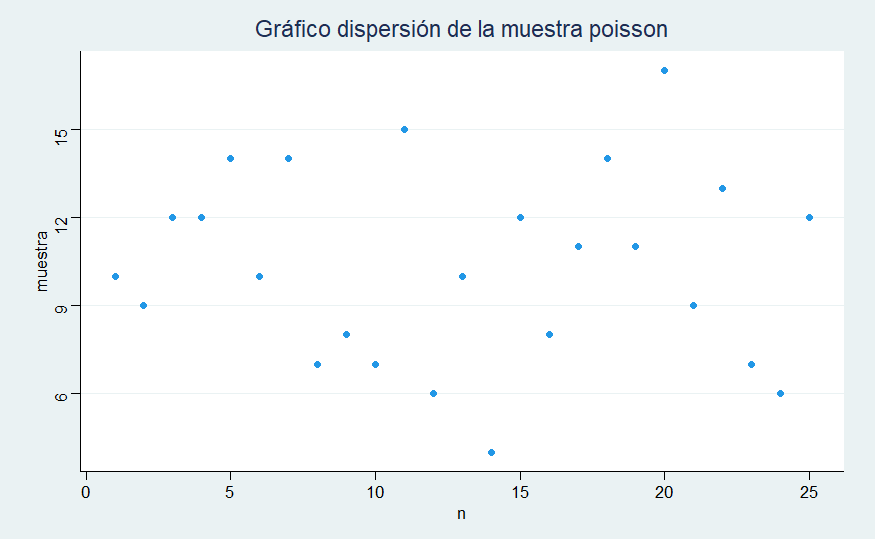
    

\vspace{0.35cm}


```python
cat("Se puede ver como tenemos un sesgo de:",Sesgo_jack," y un error de muestreo de:",Error_muestreo)
```

Se puede ver como tenemos un sesgo de: 0  y un error de muestreo de: 2.547805


\vspace{0.3cm}

**Forma 2:**

```python
theta_jackknife=numeric(numero_observaciones) # theta va a ser númerico

for(i in 1:numero_observaciones){
  theta_jackknife[i] = var(muestra[-i]) # Bucle que nos calcula las varianzas muestrales en cada muestra jackknife
}

(Sesgo_jack=(numero_observaciones-1)*(mean(theta_jackknife)-theta_gorro)) # Calculamos el sesgo

Error_muestreo <- sqrt((numero_observaciones-1)*mean((theta_jackknife - mean(theta_jackknife))^2)) # Calculamos el error de muestreo

Error_muestreo
```


```python
cat("Como era de esperar, sale un sesgo de:",Sesgo_jack," y un error de muestreo de:",Error_muestreo)
```

Como era de esperar, sale un sesgo de: 0  y un error de muestreo de: 2.547805


\newpage

**Forma 3:**


```python
library(bootstrap) # Cargamos librería

numero_observaciones<-25 # Numero observaciones

data<-as.matrix(cbind(n,muestra)) # Matriz de datos

theta<-var(muestra) # Varianza de muestra

fun_aux = function(nmuestra,data){
  var(data[nmuestra,2]) #función auxiliar
}

jack = jackknife(1:numero_observaciones,fun_aux,data) # jackknife

jack

Estadis_correg_bias = theta - jack$jack.bias # Estadístico corregido por el sesgo

Estadis_correg_bias
```

```python
cat("El error de muestreo es: ",jack$jack.se,", el sesgo es: ",jack$jack.bias," y el estadístico corregido por el sesgo es:",Estadis_correg_bias, "que es igual a la media de los valores jackknife al ser el sesgo igual a 0 (en este caso).")
```

El error de muestreo es:  2.547805 , el sesgo es:  0  y el estadístico corregido por el sesgo es: 10.47667 que es igual a la media de los valores jackknife al ser el sesgo igual a 0 (en este caso).


\newpage


**Media recortada:**

**Forma 1:**

```python
set.seed(100428853) # Semilla para reproductibilidad de este ejercicio

numero_observaciones<-25 # numero observaciones 

n<-1:numero_observaciones # Secuencia del 1 a número de observaciones

muestra<-rpois(25,10) # Creación de muestra

data<-data.frame(n,muestra) # Creación data.frame con el vector n y la muestra de la poisson

theta_gorro<-mean(muestra, trim = 0.2) # Media recortada al 20% (estadístico de interés)

jackknife<-sapply(n, function(i) with(data[-i,], mean(muestra, trim = 0.2))) # Aplicación del jackknife

jackknife

(Sesgo_jack<-(numero_observaciones-1)*(mean(jackknife)-theta_gorro)) # Sesgo de la estimación con jackknife

Error_muestreo <- sqrt((numero_observaciones-1)*mean((jackknife - mean(jackknife))^2)) # Error de muestreo

Error_muestreo
```


```python
cat("Se puede ver como tenemos un sesgo de:",Sesgo_jack," y un error de muestreo de:",Error_muestreo)
```

Se puede ver como tenemos un sesgo de: 0.56  y un error de muestreo de: 0.7931582


\newpage

**Forma 2:**

```python
theta_jackknife=numeric(numero_observaciones) # theta va a ser númerico
for(i in 1:numero_observaciones){
  theta_jackknife[i] = mean(muestra[-i],trim = 0.2) # Bucle que nos calcula las medias recortadas en cada muestra jackknife
}

(Sesgo_jack=(numero_observaciones-1)*(mean(theta_jackknife)-theta_gorro)) # Calculamos el sesgo

Error_muestreo <- sqrt((numero_observaciones-1)*mean((theta_jackknife - mean(theta_jackknife))^2)) # Calculamos el error de muestreo

Error_muestreo
```

```python
cat("Como era de esperar, sale un sesgo de:",Sesgo_jack," y un error de muestreo de:",Error_muestreo)
```

Como era de esperar, sale un sesgo de: 0.56  y un error de muestreo de: 0.7931582


\vspace{0.34cm}

**Forma 3.**


```python
library(bootstrap) # Cargamos librería

numero_observaciones<-25 # Numero observaciones

data<-as.matrix(cbind(n,muestra)) # Matriz de datos

theta<-mean(muestra, trim = 0.2) # Media recortada

fun_aux = function(nmuestra,data){
  mean(data[nmuestra,2],trim=0.2) #función auxiliar
}

jack = jackknife(1:numero_observaciones,fun_aux,data) # jackknife

jack

Estadis_correg_bias = theta - jack$jack.bias # Estadístico corregido por el sesgo

Estadis_correg_bias
```

```python
cat("El error de muestreo es: ",jack$jack.se,", el sesgo es: ",jack$jack.bias," y el estadístico corregido por el sesgo es:",Estadis_correg_bias)
```

El error de muestreo es:  0.7931582 , el sesgo es:  0.56  y el estadístico corregido por el sesgo es: 9.706667


\newpage

**Mediana:**

**Forma 1:**


```python
set.seed(100428853) # Semilla para reproductibilidad de este ejercicio
numero_observaciones<-25 # numero observaciones 

n<-1:numero_observaciones # Secuencia del 1 a número de observaciones

muestra<-rpois(25,10) # Creación de muestra

data<-data.frame(n,muestra) # Creación data.frame con el vector n y la muestra de la poisson

theta_gorro<-median(muestra) # Mediana (estadístico de interés)

jackknife<-sapply(n, function(i) with(data[-i,], median(muestra))) # Aplicación del jackknife

jackknife

(Sesgo_jack<-(numero_observaciones-1)*(mean(jackknife)-theta_gorro)) # Sesgo de la estimación con jackknife

Error_muestreo <- sqrt((numero_observaciones-1)*mean((jackknife - mean(jackknife))^2)) # Error de muestreo

Error_muestreo 
```

```python
cat("Se puede ver como tenemos un sesgo de:",Sesgo_jack," y un error de muestreo de:",Error_muestreo)
```

Se puede ver como tenemos un sesgo de: 6.24  y un error de muestreo de: 1.223765


\vspace{0.5cm}


**Forma 2.**

```python
theta_jackknife=numeric(numero_observaciones) # theta va a ser númerico
for(i in 1:numero_observaciones){
  theta_jackknife[i] = median(muestra[-i]) # Bucle que nos calcula las medianas en cada muestra jackknife
}

(Sesgo_jack=(numero_observaciones-1)*(mean(theta_jackknife)-theta_gorro)) # Calculamos el sesgo

Error_muestreo <- sqrt((numero_observaciones-1)*mean((theta_jackknife - mean(theta_jackknife))^2)) # Calculamos el error de muestreo

Error_muestreo
```

```python
cat("Como era de esperar, sale un sesgo de:",Sesgo_jack," y un error de muestreo de:",Error_muestreo)
```

Como era de esperar, sale un sesgo de: 6.24  y un error de muestreo de: 1.223765


\vspace{0.4cm}

**Forma 3.**

```python
library(bootstrap) # Cargamos librería

numero_observaciones<-25 # Numero observaciones

data<-as.matrix(cbind(n,muestra)) # Matriz de datos

theta<-median(muestra) # Mediana

fun_aux = function(nmuestra,data){
  median(data[nmuestra,2]) #función auxiliar
}

jack = jackknife(1:numero_observaciones,fun_aux,data) # jackknife

jack

Estadis_correg_bias = theta - jack$jack.bias # Estadístico corregido por el sesgo

Estadis_correg_bias
```


```python
cat("El error de muestreo es: ",jack$jack.se,", el sesgo es: ",jack$jack.bias," y el estadístico corregido por el sesgo es:",Estadis_correg_bias)
```
El error de muestreo es:  1.223765 , el sesgo es:  6.24  y el estadístico corregido por el sesgo es: 3.76


\newpage


## Ejercicio 2.

Se consideran dos variables: en la primera se recogen 4 tipos diferentes de tratamientos y en la segunda se recogen los valores obtenidos de productividad.
Los datos simulados son:


```python
set.seed(100428853)

grupos = c(rep("A",6), rep("B",6), rep("C",6), rep("D",6))

invento = c(rgamma(6,8,2),rgamma(6,7.5,2),rgamma(6,10,3),rgamma(6,4,1.5))

misdatos = data.frame(tratamiento=grupos, productividad=invento)

misdatos
```

Estudia si el factor tratamiento es significativo mediante dos procedimientos ANOVA: uno por permutaciones y otro mediante ANOVA estándar. Compara y explica los resultados y cuáles son las condiciones que han de cumplirse en ambos casos.
Haz un estudio post-hoc de los tratamientos por parejas de niveles del factor, tanto con el modelo clásico como en el de permutaciones. Compara y explica los resultados.

\vspace{0.3cm}


```python
set.seed(100428853)
grupos = c(rep("A",6), rep("B",6), rep("C",6), rep("D",6))
invento = c(rgamma(6,8,2),rgamma(6,7.5,2),rgamma(6,10,3),rgamma(6,4,1.5))
misdatos = data.frame(tratamiento=grupos, productividad=invento)
knitr::kable(head(misdatos))
```
```
tratamiento	    productividad
    A	             3.891097
    A	             3.508428
    A	             2.969455
    A	             5.837342
    A	             4.178984
    A              5.942017
```


\newpage


**ANOVA tradicional**


```python
misdatos$tratamiento<-as.factor(misdatos$tratamiento) # Convertir a factor

ANOVA<-aov(productividad~tratamiento,data=misdatos) # ANOVA

summary(ANOVA) # Resumen del anova

library(gplots)

plotmeans(productividad ~ tratamiento, data= misdatos,xlab="tratamiento", ylab="productividad",main="Mean Plot\nwith 95% CI") # Gráfico de las medias con intervalo de confianza al 95%

TukeyHSD(ANOVA) # Test de Tukey HSD

plot(TukeyHSD(ANOVA)) # Gráfico de las diferencias entre grupos

pairwise.t.test(misdatos$productividad, misdatos$tratamiento, p.adjust.method = "bonferroni") # Análisis post-hoc Bonferroni.
```

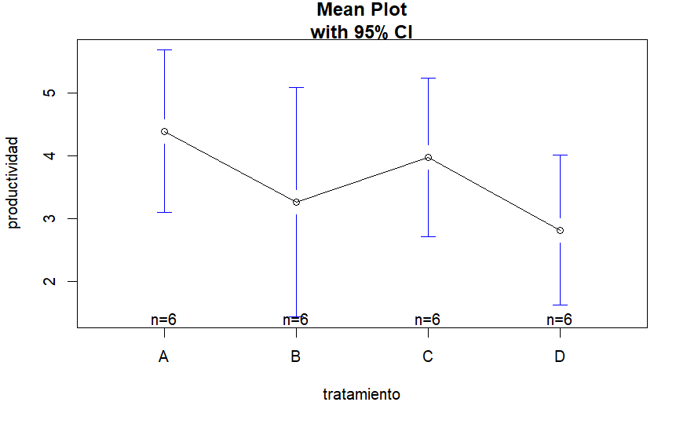


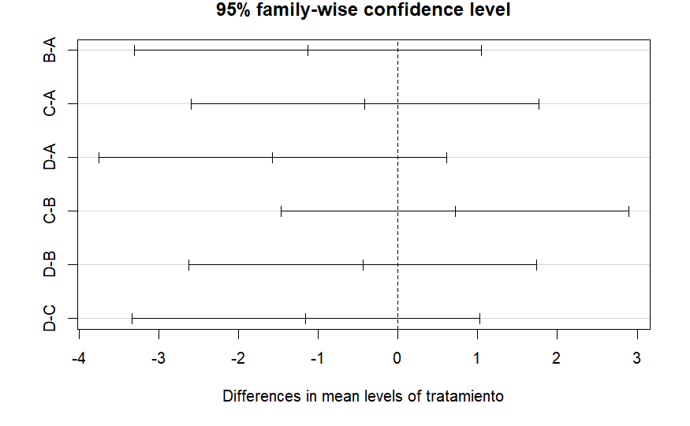


\vspace{0.4cm}

```
            Df Sum Sq Mean Sq F value Pr(>F)
tratamiento  3   8.97   2.990   1.641  0.212
Residuals   20  36.44   1.822               
  Tukey multiple comparisons of means
    95% family-wise confidence level

Fit: aov(formula = productividad ~ tratamiento, data = misdatos)

$tratamiento
          diff       lwr       upr     p adj
B-A -1.1305813 -3.311771 1.0506087 0.4841387
C-A -0.4138374 -2.595027 1.7673525 0.9504948
D-A -1.5735024 -3.754692 0.6076876 0.2143195
C-B  0.7167438 -1.464446 2.8979338 0.7946766
D-B -0.4429212 -2.624111 1.7382688 0.9403282
D-C -1.1596650 -3.340855 1.0215250 0.4627329


	Pairwise comparisons using t tests with pooled SD 

data:  misdatos$productividad and misdatos$tratamiento 

  A    B    C   
B 0.97 -    -   
C 1.00 1.00 -   
D 0.34 1.00 0.91

P value adjustment method: bonferroni 
```

\newpage

A la vista de los resultados anteriores, podemos ver que los tratamientos no son significativos, es decir, el tratamiento no influye en la productividad.
Recordatorio: Lo que estamos contrastando en el ANOVA es:

$$H_{0}:\mu_{A}=\mu_{B}=\mu_{C}=\mu_{D}$$


Además vistos los gráficos no parece haber diferencias entre los grupos, y lo comprobamos con los test de Tukey y Bonferroni que nos arrojan los mismos resultados, es decir, técnicamente, no podemos rechazar la hipótesis nula de igualdad de medias, por lo que estadísticamente, las medias de los 4 grupos son iguales.


Comprobación de supuestos:

Los supuestos que deben cumplirse son:

1. Normalidad. Cada muestra se extrajo de una población distribuida normalmente.

2. Varianzas iguales. Las varianzas de las poblaciones de las que provienen las muestras son iguales.

3. Independencia, las observaciones de cada grupo son independientes entre sí y las observaciones dentro de los grupos se obtuvieron mediante una muestra aleatoria.


**Normalidad:**


```python
# Histograma de la productividad
ggplot(misdatos,aes(x=productividad, fill = 4))+
  geom_histogram(bins = 5, show.legend = FALSE, colour="black")+
  theme_stata()+
  ggtitle("Histograma de la productividad")
# Densidades de la productividad por grupos
library(ggridges)
ggplot(misdatos, aes(x = productividad, y = tratamiento, fill = stat(x))) +
  geom_density_ridges_gradient() +
  scale_fill_viridis_c(name = "productividad", option = "C")+
  theme_stata()+
  ggtitle("Densidades de la productividad por grupo")
# Grafico QQ.
resid<-data.frame(residuos=as.vector(ANOVA$residuals))
ggplot(resid, aes(sample = residuos,)) +geom_qq(colour="blue")+ 
  stat_qq_line(colour="black")+
  ggtitle("Gráfico QQ de los residuos")+
  theme_stata()
# Test de shapiro-wilk para los residuos
shapiro.test(ANOVA$residuals)
# Test de Kolmogorov-Smirnov-Lilliefors
library(nortest)
lillie.test(ANOVA$residuals)
# Test de Jarque-Bera
library(tseries)
jarque.bera.test(ANOVA$residuals)
```


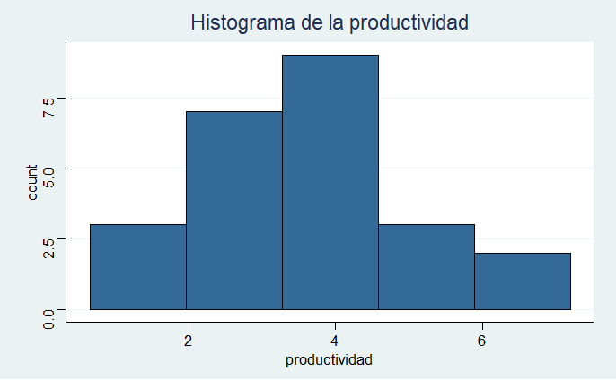


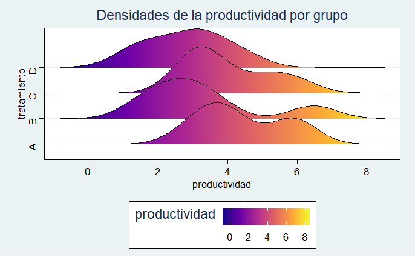


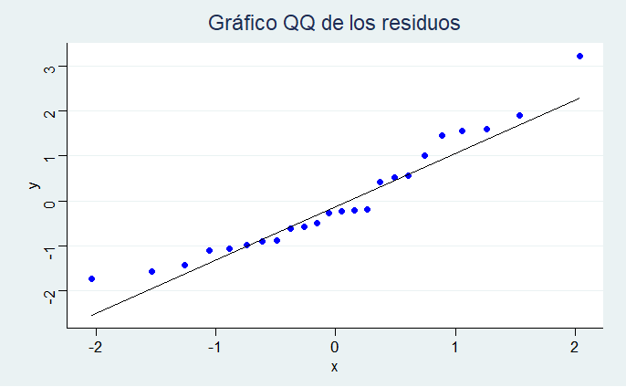

```python
	Shapiro-Wilk normality test

data:  ANOVA$residuals
W = 0.93474, p-value = 0.1245


	Lilliefors (Kolmogorov-Smirnov) normality test

data:  ANOVA$residuals
D = 0.18459, p-value = 0.0337


	Jarque Bera Test

data:  ANOVA$residuals
X-squared = 2.4272, df = 2, p-value = 0.2971
```

Podemos decir que se cumple el supuesto de normalidad necesario para aplicar el ANOVA. Salvo en el Lilliefors que no se cumple, los residuos son normales.


\newpage


**Homocedasticidad**

```python
# Boxplot por grupos
ggplot(misdatos,aes(x=tratamiento,y=productividad,fill=tratamiento))+
  stat_boxplot(geom = "errorbar",width = 0.15)+
  geom_boxplot()+
  geom_jitter(position = position_jitter(0.2))+
  stat_summary(fun = "mean", geom = "point", shape = 8,size = 2, color = "white")+ 
  theme_stata()+
  ggtitle("Boxplot de productividad por grupos según tratamiento")
# Test de Bartlett
bartlett.test(productividad~tratamiento,data = misdatos)
```


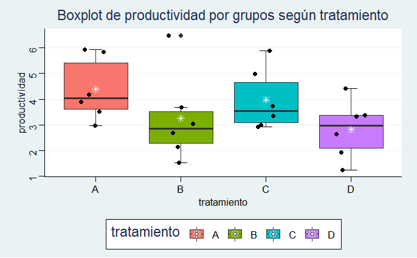


```python
Bartlett test of homogeneity of variances

data:  productividad by tratamiento
Bartlett's K-squared = 1.1431, df = 3, p-value = 0.7667
```

No podemos rechazar la hipótesis nula de igualdad varianzas en los grupos. Por lo tanto se cumple el segundo de los supuestos necesarios para la validez del ANOVA tradicional. Es decir, las varianzas de los grupos son estadísticamente iguales.


\vspace{0.3cm}


**Independencia.**

Viendo que son datos aleatorios podemos concluir que sí son independientes, por lo que los tres supuestos se cumplen y el análisis es válido.

\newpage

**ANOVA con permutaciones**

En estadística, la prueba de Kruskal-Wallis es un método no paramétrico para probar si un grupo de datos proviene de la misma población. Intuitivamente, es idéntico al ANOVA con los datos reemplazados por categorías. Es una extensión de la prueba de la U de Mann-Whitney para 3 o más grupos.

Ya que es una prueba no paramétrica, la prueba de Kruskal-Wallis no asume normalidad en los datos, en oposición al tradicional ANOVA. Sí asume, bajo la hipótesis nula, que los datos vienen de la misma distribución. Una forma común en que se viola este supuesto es con datos heterocedásticos.

```python
# Número posible de permutaciones
choose(24,6)
library(coin)
# Anova no parámetrico.
kruskal_test(productividad ~ as.factor(tratamiento), data = misdatos, distribution=approximate(nresample = 1000))
# Post-hoc 1
pairwise.wilcox.test(misdatos$productividad, misdatos$tratamiento, p.adjust.method = "bonferroni")
# Post-hoc2
library(FSA)
dunnTest(productividad ~ as.factor(tratamiento), data = misdatos, method="bonferroni")
```


```python
Comparison        Z         P.unadj      P.adj     
 A - B     	  1.6329932	  0.10247043	 0.6148226	
 A - C     	  0.6123724  	0.54029137	 1.0000000	
 B - C	      1.0206207  	0.30743417	 1.0000000	
 A - D	      2.0004166	  0.04545529   0.2727318	
 B - D	      0.3674235	  0.71330317	 1.0000000	
 C - D	      1.3880442	  0.16512359	 0.9907415	
```


Como dijimos antes, no es necesario la normalidad en este test, pero sí que habría que ver si son las varianzas iguales, pero como ya se hizo en el apartado anterior, podemos ver que las varianzas entre los grupos son iguales. Por lo tanto llegamos a que este test también es válido para este problema. Como la evidencia de que las medias de los grupos son iguales es muy fuerte, tanto con el test de wilcox y como con el de dunn, nos sale lo mismo.


\vspace{0.3cm}

```python
# Tabla de resultados del ejercicio
Resultado_final<-data.frame(SIG=c("No","No"), DIF=c("No","No"), NOR=c("Si","No necesario"), VAR=c("Si","Si"), IND=c("Si","Si"))
colnames(Resultado_final)<-c("Significatividad tratamiento","Diferencia entre grupos","Normalidad","Homocedasticidad","Independencia")
rownames(Resultado_final)<-c("ANOVA tradicional","ANOVA no paramétrico")
knitr::kable(Resultado_final)
```


 

Por lo tanto podemos concluir este ejercicio diciendo que en este caso, nos da igual utilizar uno u otro.


\vspace{0.3cm}

## Ejercicio 3

Simula una muestra aleatoria simple de 100 de una v.a. X con distribución gamma de parámetros a = 10, b = 5.

1. Calcula la asimetría muestral de la muestra y el error estándar del estimador, mediante un bootstrap.

2. Calcula el coeficiente de variación muestral de la muestra y el error estándar del estimador, mediante un procedimiento bootstrap.

3. Programa ambos procedimientos mediante un programa escrito en Rcpp.

```python
set.seed(100428853) # Semilla
Datos<-rgamma(100,10,5) # Creación de datos
B=2000 # Número de réplicas
```

\vspace{0.3cm}

**Asimetría**

**Forma 1**

```python
# Función para la asimetría
moment_skewness <- function(x) {
  n <- length(x)
  mean_x <- mean(x)
  sd_x <- sd(x)
  z <- (x - mean_x) / sd_x
  mean(z^3)
}

moment_skewness(Datos) # Asimetría muestral
sd(replicate(B,moment_skewness(sample(Datos,replace = TRUE)))) # Error estándar bootstrap
```


    [1] 0.4573946

    [1] 0.1853091
    
    
\vspace{0.3cm}    
    
**Forma 2**

```python
library(moments)
skewness(Datos) # Asimetría muestral
sd(replicate(B,skewness(sample(Datos,replace=TRUE)))) # Error estándar bootstrap
```

    [1] 0.4643423
    
    [1] 0.186493


\vspace{0.3cm}      

**Forma 3.**
 
```python
library(bootstrap)
bootskew<-bootstrap(Datos,B,skewness) # Aplicación bootstrap
sd(bootskew$thetastar) # Error estándar bootstrap
```

   
    [1]  0.1828968


\vspace{0.3cm}

**Forma 4.**

```python
# Aplicación bootstrap con librería boot
library(boot)
n=length(Datos)
# Función auxiliar
funskew = function(data, i, n){
  cosa = data[i]
  skewness(cosa[1:n])
}

resultado = boot(Datos, funskew, R=2000, n=n)
resultado
```

```
ORDINARY NONPARAMETRIC BOOTSTRAP


Call:
boot(data = Datos, statistic = funskew, R = 2000, n = n)


Bootstrap Statistics :
     original      bias    std. error
t1* 0.4643423 -0.01547586   0.1847539
```

Aunque los resultados no son exactamente iguales en todas las formas, lo cierto es que la asimetría muestral está en torno a 0.46 y su error sobre 0.19.


\newpage

```python
plot(resultado, t0=resultado$t0, nclass = 10) # Plot réplicas bootstrap
```

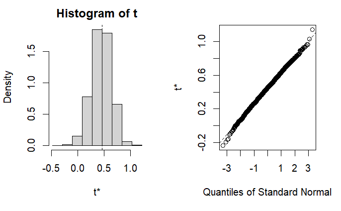

Podemos ver como el histograma de las réplicas bootstrap es bastante simétrico en torno al valor muestral original y podemos ver que además estas réplicas son normales ya que se ajustan muy bien al qqplot salvo en las colas.


\vspace{0.3cm}


**Coeficiente de variación**

**Forma 1**


```python
set.seed(100428853) # Semilla
cv=function(data){ # Función que calcula el coeficiente de variación
  sd(data)/mean(data)*100
} 
cv(Datos) # Aplicación de cv a la muestra
sd(replicate(B,cv(sample(Datos,replace=TRUE)))) # Error estándar bootstrap
```

    [1] 34.84712
    
    [1] 2.191089


\vspace{0.3cm}


**Forma 2**

```python
library(bootstrap)
bootcv<-bootstrap(Datos,B,cv) # Aplicación bootstrap
sd(bootcv$thetastar) # Error estándar bootstrap
```

    [1] 2.255368
    
\newpage

**Forma 3.**

```python 
library(boot)
n=length(Datos)
# Función auxiliar
funcv = function(data, i, n){
  cosa = data[i]
  sd(cosa[1:n])/mean(cosa[1:n])*100
} 

resultado = boot(Datos, funcv, R=2000, n=n) # Aplicación bootstrap
resultado
```
```
ORDINARY NONPARAMETRIC BOOTSTRAP


Call:
boot(data = Datos, statistic = funcv, R = 2000, n = n)


Bootstrap Statistics :
    original     bias    std. error
t1* 34.84712 -0.2148447     2.26003
```

Aunque los resultados no son exactamente iguales en todas las formas, lo cierto es que el coeficiente de variación muestral es 34.8 y su error sobre 2.2.


```python
plot(resultado, t0=resultado$t0, nclass = 10) # Plot de las réplicas bootstrap
```


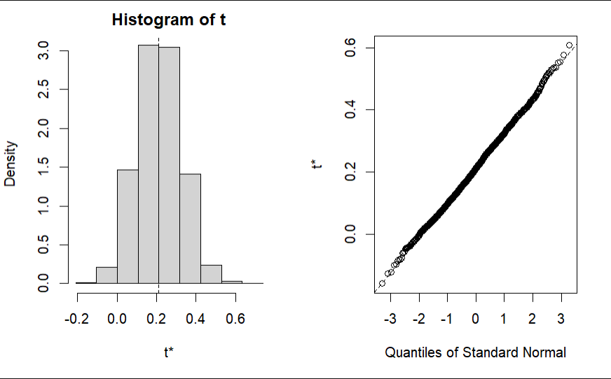


Podemos ver como el histograma de las réplicas bootstrap es bastante simétrico en torno al valor muestral original y podemos ver que además estas réplicas son normales ya que se ajustan muy bien al qqplot salvo en las colas. Exactamente igual que pasó con la asimetría.


\vspace{0.3cm}


## Ejercicio 4

Simula una población artificial consistente en 1000 observaciones de una distribución normal de media 0 y varianza = 10 y otra población X2 con 1000 observaciones de una distribución normal de media 0 y varianza = 2. Se trata de estudiar el cociente de ambas que dan lugar a una distribución $Z=X1/X2$

Considera, a continuación una muestra de tamaño 200 de Z, digamos $z=z_{1},...,z_{200}$

Calcula la mediana muestral de z muestral y el error estándar del estimado mediante un procedimiento de bootstrap paramétrico.

```python
# Creación de datos
set.seed(100428853)
X1<-rnorm(1000,0,10)
X2<-rnorm(1000,0,2)
Z<-X1/X2

muestra<-sample(Z, size = 200, replace = FALSE) # muestreo
n<-length(muestra) # tamaño de la muestra

B<-2000 # número réplicas
library(boot)
# Función generadora
ran.gen.cauchy<-function(data,mle){
  out<-rcauchy(n,mle)
  out
}
# Estadístico de interés
statistic<-function(data){
  median(data)
}
set.seed(100428853)
# Bootstrap paramétrico
res.boot<-boot(muestra,statistic,R=B,sim = "parametric", ran.gen = ran.gen.cauchy, mle = median(muestra))
# Intervalos de confianza
boot.ci(res.boot, type = "norm")
boot.ci(res.boot, type = "basic")
boot.ci(res.boot, type = "perc")
# Gráfico réplicas bootstrap
plot(res.boot, nclass = 10)
```


Hemos sacado también los intervalos de confianza según distintos métodos para la mediana mediante un proceso de remuestreo bootstrap. Además se puede ver como el histograma es muy simétrico y además, en el qqplot podemos ver como las replicas bootstrap son normales.

\vspace{0.3cm}

## Ejercicio 5

Se quiere determinar si las clases de repaso tienen un efecto significativo en el resultado de los exámenes finales. Para ello, un conjunto de estudiantes se reparte al azar en dos grupos (uno que asiste a clases de repaso y otro que no) y se evalúa su conocimiento en un examen.

Los datos simulados son:
```python
# Generación datos
set.seed(100428853)
grupos = c(rep("clases repaso",21), rep("control",21))
invento = c(rnorm(21,62,2), rnorm(21,51.5,2))
misdatos = data.frame(trata=grupos, productividad=invento)
knitr::kable(head(misdatos))
```

```
    trata	       productividad
clases repaso	      62.20418
clases repaso	      61.64129
clases repaso	      63.62980
clases repaso	      63.35761
clases repaso	      64.71284
clases repaso	      62.60961
```

¿Existe una diferencia significativa en el promedio entre ambos grupos?

Usa para resolverlo un test clásico de la t-student y un test de permutaciones.
Contrasta normalidad de los datos mediante los test de Shapiro-Wilks y de Jarque-Bera. Muestra los correspondientes QQ-plots y explica como se pueden interpretar.
Muestra histogramas múltiples, diagramas de caja múltiples y gráficos de densidad múltiples.
Calcula y compara los p-valores obtenidos mediante el test t-student y el de permutaciones.


```python
# Boxplot por grupos
ggplot(misdatos,aes(x=grupos,y=invento,fill=grupos))+
  stat_boxplot(geom = "errorbar",width = 0.15)+
  geom_boxplot()+
  geom_jitter(position = position_jitter(0.2))+
  stat_summary(fun = "mean", geom = "point", shape = 8,size = 2, color = "white")+ 
  theme_stata()+
  ggtitle("Boxplot por grupos según si asiste o no a clases de repaso")
# Densidades por grupos
ggplot(data=misdatos, aes(x=invento, fill=grupos))+
  geom_density(colour="black")+
  theme_stata()+
  ggtitle("Densidades por grupos según si asiste o no a clases de repaso")
# Histograma por grupos
ggplot(data=misdatos, aes(x=invento, fill=grupos))+
  geom_histogram(bins = 15,colour="black")+
  theme_stata()+
  ggtitle("Histograma por grupos según si asiste o no a clases de repaso")
```


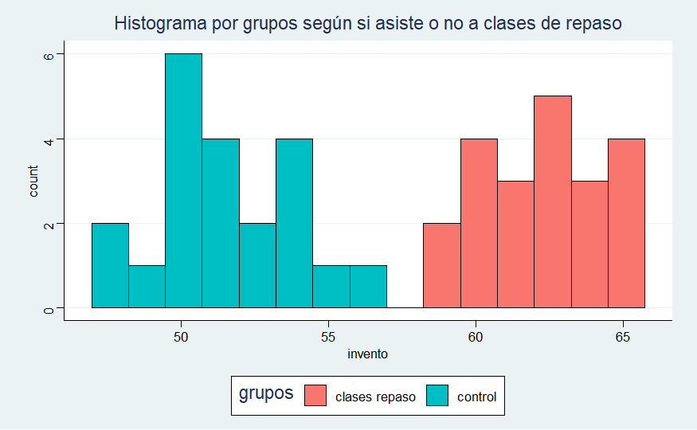 

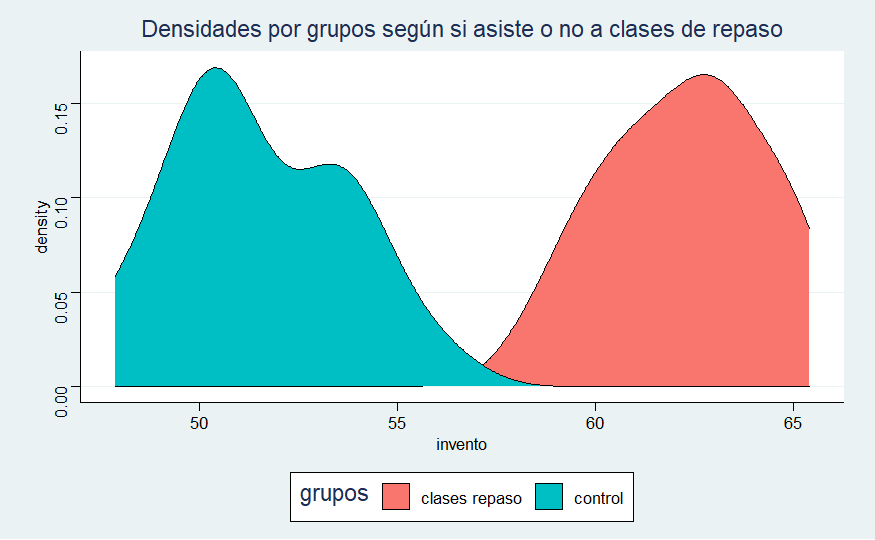 

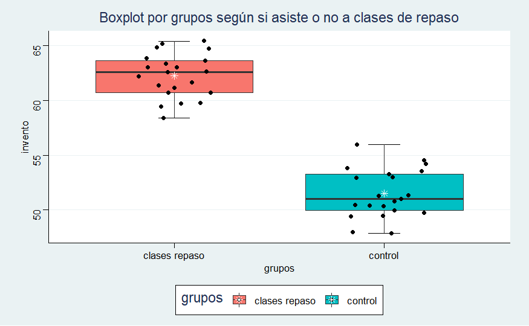 

A la vista de los anteriores gráficos parece claro que hay diferencias entre los dos grupos.


\vspace{0.3cm}


**Estadísticos media y varianza de cada uno de los grupos:**

```python
tapply(misdatos$productividad,misdatos$trata, mean) # Medias por grupos
tapply(misdatos$productividad,misdatos$trata, sd) # Desviaciones típicas por grupos
```
```
clases repaso       control 
     62.24549      51.50000 
clases repaso       control 
     2.007912      2.206692 
```

\newpage

**Contraste de igualdad de varianzas:**

```python
bartlett.test(misdatos$productividad~misdatos$trata) # Test de bartlet
var.test(misdatos$productividad[misdatos$trata=="clases repaso"],misdatos$productividad[misdatos$trata=="control"]) # Test de la F
```

```
	Bartlett test of homogeneity of variances

data:  misdatos$productividad by misdatos$trata
Bartlett's K-squared = 0.17362, df = 1, p-value = 0.6769


	F test to compare two variances

data:  misdatos$productividad[misdatos$trata == "clases repaso"] and

misdatos$productividad[misdatos$trata == "control"]

F = 0.82795, num df = 20, denom df = 20, p-value = 0.677
alternative hypothesis: true ratio of variances is not equal to 1
95 percent confidence interval:
 0.335954 2.040478
sample estimates:
ratio of variances 
         0.8279535 
```

No podemos rechazar la hipótesis nula de igualdad de varianzas entre los grupos.


```python
# Test de Shapiro-Wilks para los datos en general y por grupos (Estos son los que de verdad nos interesan)
shapiro.test(misdatos$productividad) 
shapiro.test(misdatos$productividad[misdatos$trata=="clases repaso"])
shapiro.test(misdatos$productividad[misdatos$trata=="control"])
```

```
	Shapiro-Wilk normality test

data:  misdatos$productividad
W = 0.89589, p-value = 0.001087


	Shapiro-Wilk normality test

data:  misdatos$productividad[misdatos$trata == "clases repaso"]
W = 0.97097, p-value = 0.7544


	Shapiro-Wilk normality test

data:  misdatos$productividad[misdatos$trata == "control"]
W = 0.96175, p-value = 0.5521
```


Podemos ver como los datos en sí no son normales, pero cada uno de los grupos sí que lo son.


```python
# Test de Jarque Bera para los datos en general y por grupos (Estos son los que de verdad nos interesan)
jarque.bera.test(misdatos$productividad)
jarque.bera.test(misdatos$productividad[misdatos$trata=="clases repaso"])
jarque.bera.test(misdatos$productividad[misdatos$trata=="control"])
```

```
	Jarque Bera Test

data:  misdatos$productividad
X-squared = 4.3135, df = 2, p-value = 0.1157


	Jarque Bera Test

data:  misdatos$productividad[misdatos$trata == "clases repaso"]
X-squared = 0.83715, df = 2, p-value = 0.658


	Jarque Bera Test

data:  misdatos$productividad[misdatos$trata == "control"]
X-squared = 0.77118, df = 2, p-value = 0.68
```

Nos sale exactamente lo mismo que con el Shapiro-Wilk salvo que ahora todos los datos juntos sin distinción por grupos sí que es normal. Aunque tiene sentido ya que los datos en general tienen una forma relativamente simétrica.

\vspace{0.3cm}

T-Student test:

```python
# Test de la t-student
t.test(misdatos$productividad~misdatos$trata,var.equal=TRUE)
```
```
Two Sample t-test

data:  misdatos$productividad by misdatos$trata
t = 16.505, df = 40, p-value < 2.2e-16
alternative hypothesis: true difference in means between group clases repaso and group control is not equal to 0
95 percent confidence interval:
  9.429668 12.061312
sample estimates:
mean in group clases repaso       mean in group control 
                   62.24549                    51.50000 
```

Podemos ver que se puede rechazar la igualdad de medias, por lo tanto la media en las puntuaciones no son iguales según si asisten o no a clases de repaso.

\vspace{0.3cm}

Contraste de permutaciones:

Un hecho a tener en cuenta es que el muestreo no ha sido aleatorio, ya que se ha basado en voluntarios. Una vez obtenidos los voluntarios, sí que se han dividido al azar entre repaso y control.
```python
# Diferencia de medias.
dif_obs<-mean(misdatos$productividad[misdatos$trata=="clases repaso"])-mean(misdatos$productividad[misdatos$trata=="control"])
dif_obs
```

    [1] 10.74549

Determinar si la diferencia observada es significativa es equivalente a preguntarse cómo de probable es obtener esta diferencia si las clases de repaso no tienen efecto y los estudiantes se han asignado de forma aleatoria en cada grupo.

Para obtener la probabilidad exacta, se requiere calcular todas las posibles permutaciones en las que 42 personas pueden repartirse en dos grupos y calcular la diferencia de medias para cada una.


```python
# Número de permutaciones posibles
choose(42,2)
```

    [1] 861
    
    
El número de permutaciones posibles es de 861.

```python
# Distribución exacta de permutaciones
distribucion_permutaciones<-rep(NA,861)
n_control<-length(misdatos$productividad[misdatos$trata=="control"])
n_repaso<-length(misdatos$productividad[misdatos$trata=="clases repaso"])
for(i in 1:861){
  datos_aleatorizados<-sample(misdatos$productividad)
  distribucion_permutaciones[i]<-mean(datos_aleatorizados[1:n_control])-mean(datos_aleatorizados[n_control+1:n_repaso])
}
# Gráfico de la distribución de las permutaciones.
library(ggplot2)
qplot(distribucion_permutaciones, geom = "blank")+geom_line(aes(y=..density..),stat = "density",colour="cadetblue4")+geom_histogram(aes(y=..density..),alpha=0.7, fill="firebrick3",colour="black",bins = 25)+geom_vline(xintercept = mean(distribucion_permutaciones))+geom_vline(xintercept = dif_obs,colour="gold2")+geom_vline(xintercept = -dif_obs,colour="gold2")+labs(title = "Distribución exacta de permutaciones", x="Diferencia de medias")+theme_stata()
```    
    
    
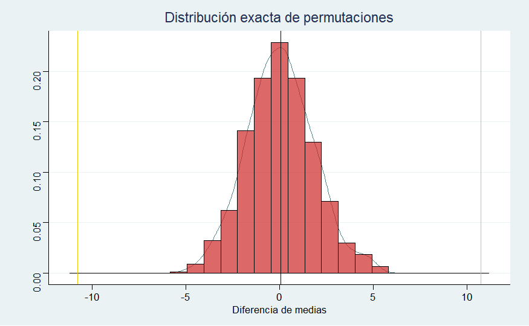     
    
    
```python
summary(distribucion_permutaciones) # Resumen numérico de la distribución de permutaciones
sd(distribucion_permutaciones) # Desviación típica de la distribución de permutaciones
```
    
```
Min.  1st Qu.   Median     Mean  3rd Qu.     Max. 
-5.02614 -1.11697  0.04259  0.05696  1.21818  5.16530 
[1] 1.789423
```


```python
pvalor<-(sum(abs(distribucion_permutaciones)>abs(dif_obs)))/861 # Calculo del p-valor
pvalor
```

    [1] 0
    


A la vista de los resultados anteriores podemos ver como el hecho de asistir o no a clases de repaso sí que influye en las posteriores calificaciones del examen. En media, los que asisten a clases de repaso obtienen mejores notas que los que no.

En este caso, da igual utilizar un procedimiento u otro porque los resultados son los mismos.


\newpage


# Tareas parte 2


## Ejercicio 1

Simula 1200 observaciones de un modelo de serie temporal ARMA(1,1) con los valores de los parámetros no muy cerca de 1 en valor absoluto.
Estima por máxima verosimilitud los parámetros del modelo.
Calcula los errores estándar de los parámetros, usando un procedimiento bootstrap basado en residuos y otro procedimiento bootstrap por bloques. Usa varios tamaños de bloques y compara los resultados.
Usa alternativas o programas para hacerlo: programas a mano y con la librería boot.

Se considera un modelo de serie ARMA(1,1) simple
$$y_{t}=\phi y_{t-1}+\epsilon_{t}+\theta\epsilon_{t-1}$$
donde $\epsilon_{t}\sim N(0,1)$


\vspace{0.3cm}


**Simulamos los datos:**

```python
set.seed(100428853)

N = 1200 

epsilon = rnorm(N)

y = epsilon

for(i in 2:N){
  y[i]=y[i-1]*0.6+epsilon[i]+epsilon[i-1]*0.5
}
```

\vspace{0.3cm}

**Forma alternativa de simular los datos.**

Ahora vamos a hacer uso de la función de R arima.sim para simular exactamente lo mismo que hicimos antes.

```python
set.seed(100428853)

N = 1200

y = arima.sim(n=N, list(ar=0.7, ma=0.6), innov = epsilon)

# Ploteamos la serie temporal

library(ggplot2)

df<-data.frame(serie=as.vector(y))

ggplot(df,aes(y=y,x=1:N))+
  geom_line(colour="chocolate3",size=1)+
  labs(x="Observaciones", y="Valor de la serie")+
  ggtitle("Serie temporal simulada de 1200 observaciones")+
  theme_classic()
```


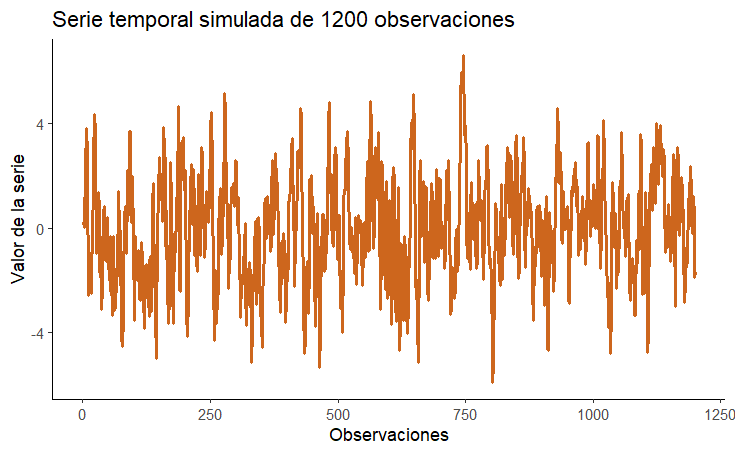  


\vspace{0.3cm}

**Estimación de parámetros:**

Se puede estimar $\phi$ y $\theta$ por máxima verosimilitud, usando el comando arima
Remarcar que esto que estamos haciendo no es muy realista, puesto que en la práctica normalmente no sabemos qué modelo de series temporales es el que se ajusta a la serie.

```python
(est.arima = arima(y, order=c(1,0,1), include.mean = FALSE))
```
```
Call:
arima(x = y, order = c(1, 0, 1), include.mean = FALSE)

Coefficients:
         ar1     ma1
      0.6966  0.6095
s.e.  0.0228  0.0266

sigma^2 estimated as 0.9643:  log likelihood = -1681.86,  aic = 3369.72
```

Por lo que podemos ver de la salida anterior, estima el parámetro del autorregresivo con un valor de 0.6966, cuando el valor real que le metimos fue de 0.7 y el de la media móvil como 0.6095, cuando el valor metido fue de 0.6, por lo que ha hecho un buen trabajo. Sin embargo hemos estado haciendo algunas pruebas antes y los resultados no han sido tan buenos como con esta semilla.


\newpage


**Boostrap en series temporales con residuos**

```python
kk = residuals(est.arima)
param = coef(est.arima)
set.seed(100428853)
paramBoot = replicate(2000,{
  epsilon = sample(kk, size = N, replace = TRUE)
  eso = arima.sim(n=N, list(ar=param[1],ma=param[2]),innov = epsilon)
  coef(arima(eso,order = c(1,0,1),include.mean = FALSE))
})
```


Comparamos los estimadores bootstrap del error estándar, con el obtenido de la serie original por máxima verosimilitud.

```python
sd(paramBoot[1,])
sd(paramBoot[2,])
sqrt(vcov(est.arima))
cat("El error bootstrap para el autorregresivo es:",sd(paramBoot[1,]),", mientras que el de la serie original por máxima verosimilitud era de:",sqrt(vcov(est.arima))[1,1],". El error bootstrap para la media móvil es:",sd(paramBoot[2,]),"y el de la serie original por máxima verosimilitud es:",sqrt(vcov(est.arima))[2,2])
```
```
[1] 0.02283523
[1] 0.02479358
           ar1       ma1
ar1 0.02276935       NaN
ma1        NaN 0.0265878
```

El error bootstrap para el autorregresivo es: 0.02283523 , mientras que el de la serie original por máxima verosimilitud era de: 0.02276935 . El error bootstrap para la media móvil es: 0.02479358 y el de la serie original por máxima verosimilitud es: 0.0265878


Y como se puede ver bootstrap hace un gran trabajo para ambos coeficientes, es más, en uno de ellos, el error es menor incluso que en la serie original estimada por máxima verosimilitud.


```python
library(latticeExtra)  

sdparam=sqrt(vcov(est.arima))

densityplot(~paramBoot[1,],plot.points=FALSE)+layer(panel.abline(v=0.7))
+layer(panel.mathdensity(args=list(mean=param[1],
sd=sdparam[1,1]),col="black",n=100))

densityplot(~paramBoot[2,],plot.points=FALSE)+layer(panel.abline(v=0.6))+
layer(panel.mathdensity(args=list(mean=param[2],
sd=sdparam[2,2]),col="black",n=100))
```

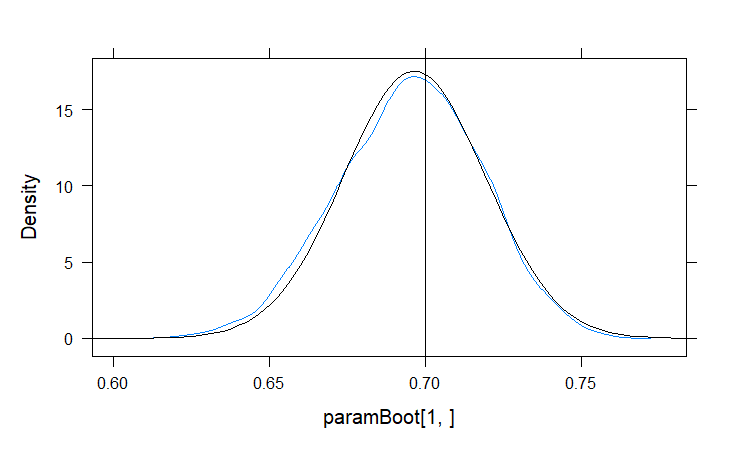  

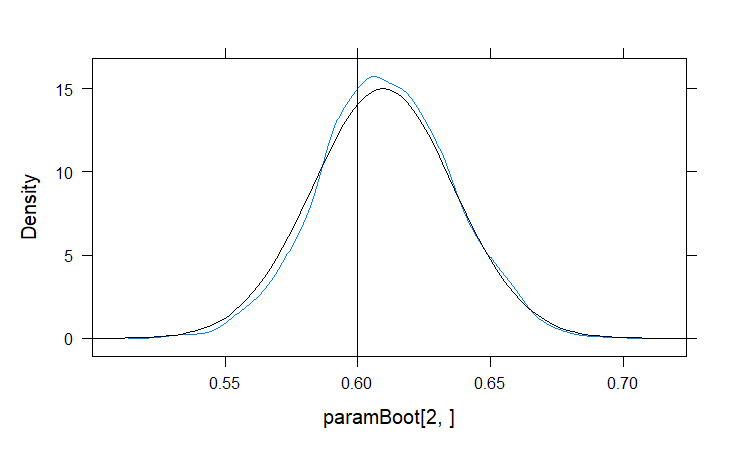  


Se puede ver como las densidades azules se ajustan muy bien a las negras, por lo tanto el trabajo del bootstrap ha sido más que bueno con el proceso de remuestreo de residuos.


\newpage

**Bootstrap en series temporales con bloques móviles:**

**Prueba con bloques de tamaño 12:**

```python
N = 1200
blocklen = 12
blocknum = N/blocklen
set.seed(100428853)
paramBlock = replicate(2000,{
  start = sample(1:(N-blocklen+1), size = blocknum, replace = TRUE)
  blockedIndices = c(sapply(start, function(x) seq(x,x+blocklen-1)))
  eso=y[blockedIndices]
  coef(arima(eso, order = c(1,0,1), include.mean = FALSE))
})
```

Comparamos los estimadores bootstrap del error estándar, con el obtenido de la serie original por máxima verosimilitud.

```python
sd(paramBlock[1,])
sd(paramBlock[2,])
sqrt(vcov(est.arima))
cat("El error bootstrap para el autorregresivo es:",sd(paramBlock[1,]),", mientras que el de la serie original por máxima verosimilitud era de:",sqrt(vcov(est.arima))[1,1],". El error bootstrap para la media móvil es:",sd(paramBlock[2,]),"y el de la serie original por máxima verosimilitud es:",sqrt(vcov(est.arima))[2,2])
```
```
[1] 0.02706307
[1] 0.03291176
           ar1       ma1
ar1 0.02276935       NaN
ma1        NaN 0.0265878
```

El error bootstrap para el autorregresivo es: 0.02706307 , mientras que el de la serie original por máxima verosimilitud era de: 0.02276935 . El error bootstrap para la media móvil es: 0.03291176 y el de la serie original por máxima verosimilitud es: 0.0265878


```python
densityplot(~paramBoot[1,] + paramBlock[1,], xlab = "", plot.points = FALSE, auto.key =
list(columns = 2),
par.settings = list(superpose.line = list(col = c("violet", "orange"))), panel =
function(...) {
panel.densityplot(...)
panel.abline(v = 0.7, col.line = "yellow", lwd = 2)
})
```


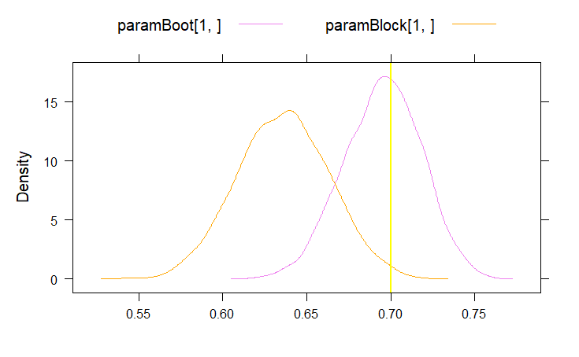 


Prueba con bloques de tamaño 24

```python
N = 1200
blocklen = 24
blocknum = N/blocklen
set.seed(100428853)
paramBlock = replicate(2000,{
  start = sample(1:(N-blocklen+1), size = blocknum, replace = TRUE)
  blockedIndices = c(sapply(start, function(x) seq(x,x+blocklen-1)))
  eso=y[blockedIndices]
  coef(arima(eso, order = c(1,0,1), include.mean = FALSE))
})
```

Comparamos los estimadores bootstrap del error estándar, con el obtenido de la serie original por máxima verosimilitud.

```python
sd(paramBlock[1,])
sd(paramBlock[2,])
sqrt(vcov(est.arima))
cat("El error bootstrap para el autorregresivo es:",sd(paramBlock[1,]),", mientras que el de la serie original por máxima verosimilitud era de:",sqrt(vcov(est.arima))[1,1],". El error bootstrap para la media móvil es:",sd(paramBlock[2,]),"y el de la serie original por máxima verosimilitud es:",sqrt(vcov(est.arima))[2,2])
```


```python
densityplot(~paramBoot[1,] + paramBlock[1,], xlab = "", plot.points = FALSE, auto.key =
list(columns = 2),
par.settings = list(superpose.line = list(col = c("violet", "orange"))), panel =
function(...) {
panel.densityplot(...)
panel.abline(v = 0.7, col.line = "yellow", lwd = 2)
})
```


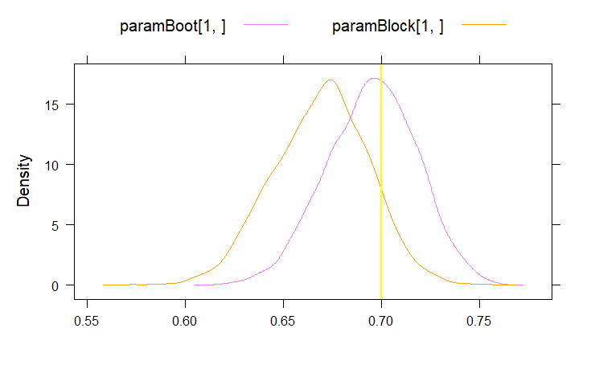 


```python
N = 1200
blocklen = 6
blocknum = N/blocklen
set.seed(100428853)
paramBlock = replicate(2000,{
  start = sample(1:(N-blocklen+1), size = blocknum, replace = TRUE)
  blockedIndices = c(sapply(start, function(x) seq(x,x+blocklen-1)))
  eso=y[blockedIndices]
  coef(arima(eso, order = c(1,0,1), include.mean = FALSE))
})
```

Comparamos los estimadores bootstrap del error estándar, con el obtenido de la serie original por máxima verosimilitud.


```python
sd(paramBlock[1,])
sd(paramBlock[2,])
sqrt(vcov(est.arima))
cat("El error bootstrap para el autorregresivo es:",sd(paramBlock[1,]),", mientras que el de la serie original por máxima verosimilitud era de:",sqrt(vcov(est.arima))[1,1],". El error bootstrap para la media móvil es:",sd(paramBlock[2,]),"y el de la serie original por máxima verosimilitud es:",sqrt(vcov(est.arima))[2,2])
```
```
[1] 0.02844405
[1] 0.02866434
           ar1       ma1
ar1 0.02276935       NaN
ma1        NaN 0.0265878
```

El error bootstrap para el autorregresivo es: 0.02844405 , mientras que el de la serie original por máxima verosimilitud era de: 0.02276935 . El error bootstrap para la media móvil es: 0.02866434 y el de la serie original por máxima verosimilitud es: 0.0265878


```python
densityplot(~paramBoot[1,] + paramBlock[1,], xlab = "", plot.points = FALSE, auto.key =
list(columns = 2),
par.settings = list(superpose.line = list(col = c("violet", "orange"))), panel =
function(...) {
panel.densityplot(...)
panel.abline(v = 0.7, col.line = "yellow", lwd = 2)
})
```

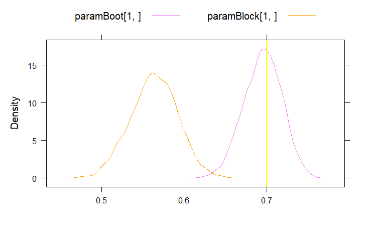


Con estas pruebas hemos podido ver como los mejores resultados los hemos obtenido con bloques de tamaño 6.

\newpage

**Aplicación de bootstrap para series temporales con boot**

Ahora vamos a usar la función tsboot de la librería boot:

**Bloques móviles:**

```python
N = 1200
blocklen =60
blocknum = N/blocklen
set.seed(100428853)
# función auxiliar
bootf = function(miserie){
  start = sample(1:(N-blocklen+1), size = blocknum, replace = TRUE)
  blockedIndices = c(sapply(start, function(x) seq(x,x+blocklen-1)))
  eso=y[blockedIndices]
  coef(arima(eso, order = c(1,0,1), include.mean = FALSE))
}
```

```python
library(boot)
boot2 = tsboot(y,bootf, R=2000, l=blocklen, sim="fixed")
teta.star2=boot2$t
summary(teta.star2[,1])
summary(teta.star2[,2])
```
```
  Min. 1st Qu.  Median    Mean 3rd Qu.    Max. 
 0.6240  0.6769  0.6905  0.6898  0.7027  0.7472 
   Min. 1st Qu.  Median    Mean 3rd Qu.    Max. 
 0.3880  0.4979  0.5214  0.5206  0.5430  0.6379 
```

\vspace{0.3cm}


**IC del percentil:**

```python
quantile(teta.star2[,1],probs=c(0.025,0.975))
quantile(teta.star2[,2],probs=c(0.025,0.975))
```
```
     2.5%     97.5% 
0.6524409 0.7261972 
     2.5%     97.5% 
0.4541231 0.5854594 
```

También podemos considerar un bootstrap estacionario con longitud media de bloque 6:
Esto quiere decir que ahora los tamaños de los bloques no siempre son de 6 pero en media sí que lo es.


```python
boot3 = tsboot(y, bootf, R=2000, l=blocklen, sim = "geom")
teta.star3 = boot3$t
summary(teta.star3[,1])
summary(teta.star3[,2])
```
```
   Min. 1st Qu.  Median    Mean 3rd Qu.    Max. 
 0.6262  0.6769  0.6902  0.6897  0.7033  0.7536 
   Min. 1st Qu.  Median    Mean 3rd Qu.    Max. 
 0.4131  0.4987  0.5209  0.5209  0.5437  0.6198 
```

\vspace{0.3cm}

**IC del percentil:**

```python
quantile(teta.star3[,1],probs=c(0.025,0.975))
quantile(teta.star3[,2],probs=c(0.025,0.975))
```

```
     2.5%     97.5% 
0.6516371 0.7242696 
     2.5%     97.5% 
0.4533103 0.5886679 
```


Hemos modificado el número de bloques para que salgan buenos resultados, pero a la vista de pruebas que hemos realizado antes, bootstrap en series temporales no hace demasiado buen trabajo.


\newpage


## Ejercicio 2

Resume las ideas básicas de la regresión loess.
Considera un conjunto de datos cualesquiera y aplica una regresión loess. Explica e interpreta los resultados.

Aplica un método bootstrap con alguna de las librerías de R que lo desarrollan (e.j. busca en Google: loess bootstrap R.


Muestra las gráficas correspondientes.

\vspace{0.3cm}

La regresión local o regresión polínomica local, también conocida como regresión móvil, es una generalización de la media móvil y la regresión polinómica. Sus métodos más comunes, desarrollados inicialmente para el suavizado de diagramas de dispersión, son LOESS y LOWESS.

La regresión local es un enfoque diferente para ajustar funciones no lineales flexibles. La idea es estimar el valor de $f(X_{1})$ en un punto objetivo $x_{01}$, dado por $f(x_{01})$, utilizando solo las observaciones cercanas de entrenamiento carcanas a $x_{01}$.
Además dentro del conkunto de observaciones más cercanas, se da mayor peso en la estimación a las observaciones que estén más cerca de $x_{01}$.

\vspace{0.3cm}

**Algoritmo de la regresión local:**

**1. Selección de observaciones:**

Encontrar las k observaciones de la muestra de entrenamiento más cercanas con la distancia Euclídea a la observación objetivo $x_{01}$.

\vspace{0.3cm}

**2. Ponderación de observaciones:**


Para las k observaciones seleccionadas, asignar un peso $w_{i0}$ tal que la más lejana de $x_{01}$ tenga peso 0, y el más cercano tenga el máximo peso posible.
Para el resto de observaciones, asignar peso $w_{i0} = 0$.


\vspace{0.3cm}


**3. Ajustar por mínimos cuadrados ponderados:**

Encontrar los valores de $\beta_{0}$ y $\beta_{1}$ que proporcionan el menor valor de:
$$\sum_{i=1}^{n} w_{i0} (y_{i}-\beta_{0}-\beta_{1}x_{i1})^{2}$$

\vspace{0.3cm}


**4. Predicción:**

$$\widehat{f}\left ( x_{01} \right )=\widehat{\beta_{0}}-\widehat{\beta_{1}}x_{01}$$


\newpage

**Observaciones sobre el algoritmo de regresión local:**

**1. El valor de k:**

La selección habitual es tomar un valor entre un 20% y un 50% de las observaciones ya que tomar un valor menor puede dar lugar a sobreajuste.


**2. Pesos:**

Existen funciones específicas para asignar los pesos pero son complejas ya que requieren verificar las hipótesis descritas ene el algoritmo, así que no vamos a entrar en el detalle.


**3. Estimador por mínimos cuadrados ponderados:**

$$\widehat{\beta}=(X_{n}^{'}W_{n}X_{n})^{-1} X_{n}^{'}W_{n}Y_{n}$$
donde:

$\widehat{\beta}=\left ( \widehat\beta_{0},\widehat\beta_{1} \right )^{'}$
y:
$W_{n}$ es la matriz diagonal que contiene los pesos.


**4. Modelo lineal:**
 
Estamos ajustando un modelo lineal en cada observación objetivo $x_{01}$, pero se puede considerar también un polinomio de grado superior.


\vspace{0.5cm}


**Datos y Regresión LOESS.**

Vamos a realizar regresión local con el conjunto de datos llamado **Wage**, que contiene información salarial y demográfica de un conjunto de trabajadores. Cargamos el conjunto de datos en memoria y comprobamos que `Wage` es un `data.frame` con dimensión $3000\times 11$, es decir, que tenemos una matriz con $3000$ filas y $11$ columnas. Por un lado, cada fila contiene los valores de las $11$ variables consideradas en la encuesta de uno de los $3000$ trabajadores encuestados. Por otro lado, cada columna contiene los valores de una de las variables de los $3000$ trabajadores encuestados. Las $11$ variables consideradas se definen a continuación:

1.  `year`, es el año en el que se registró la información salarial.

2.  `age`, es la edad del trabajador.

3.  `maritl`, es un factor indicando el estado civil del trabajador con niveles `1. Nunca casado`, `2. Casado`, `3. Viudo`, `4. Divorciado`, y `5. Separado`.

4.  `race`, es un factor indicando la raza del trabajador con niveles `1. Blanco`, `2. Negro`, `3. Asiático` y `4. Otro`.

5.  `education`, es un factor indicando el nivel de educación del trabajador con niveles `1. Menos que secundaria`, `2. Secundaria`, `3. Comenzó grado`, `4. Grado` y `5. Postgrado`.

6.  `region`, es la región donde reside el trabajador.

7.  `jobclass`, es un factor indicando el tipo de labor realizada por el trabajador con niveles `1. Industrial` y `2. Información`.

8.  `health`, es un factor indicando el nivel de salud del trabajador con niveles `1. Bueno o peor que bueno`, `2. Muy bueno o mejor que muy bueno`.

9.  `health_ins`, es un factor indicando si el trabajador tiene un seguro de salud con niveles `1. Si` y `2. No`.

10. `logwage`, es el logaritmo del salario del trabajador.

11. `wage`, es el salario del trabajador.

Además, vemos las primeras filas de la matriz de datos:

```python
library(ISLR2)
data(Wage)

library(ggplot2)
color_1 <- "deepskyblue2"
ggplot(Wage,aes(x=age,y=wage)) + 
  theme_light(base_size=15) +
  geom_point(size=2,color=color_1)+
  theme_classic()
```


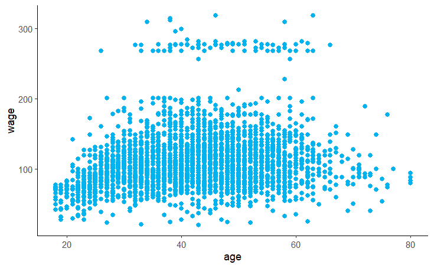


En el gráfico se ve claramente que existen dos grupos de salarios, uno por encima de $Wage=250$ y otro por debajo de $Wage=250$. Por sencillez en la exposición, vamos a considerar en estos apartados únicamente los trabajadores con salarios por debajo de $Wage=250$. Para ello, definimos un nuevo `data.frame` para estos datos y volvemos a realizar el gráfico. Además, hacemos un `attach` del conjunto de datos para que podamos utilizar todas las variables con su propio nombre:


```python
Wage250 <- Wage[Wage$wage<=250,]
ggplot(Wage250,aes(x=age,y=wage)) + 
  theme_light(base_size=15) +
  geom_point(size=2,color=color_1)+
  theme_classic()
attach(Wage250)
```

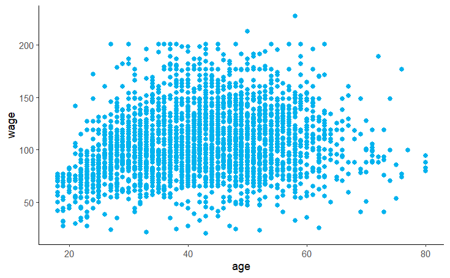


Vamos a utilizar regresión local para predecir wage con age, tomando las 20%, 30%, 40% y 50% observaciones más cercanas de la muestra de entrenamiento para realizar el ajuste en cada observación objetivo.


```python
fit_age_wage_loc_20 <- loess(wage~age,span=.2,data=Wage250)
summary(fit_age_wage_loc_20)
fit_age_wage_loc_30 <- loess(wage~age,span=.3,data=Wage250)
summary(fit_age_wage_loc_30)
fit_age_wage_loc_40 <- loess(wage~age,span=.4,data=Wage250)
summary(fit_age_wage_loc_40)
fit_age_wage_loc_50 <- loess(wage~age,span=.5,data=Wage250)
summary(fit_age_wage_loc_50)
```

```
Call:
loess(formula = wage ~ age, data = Wage250, span = 0.2)

Number of Observations: 2921 
Equivalent Number of Parameters: 16.27 
Residual Standard Error: 30.18 
Trace of smoother matrix: 17.99  (exact)

Control settings:
  span     :  0.2 
  degree   :  2 
  family   :  gaussian
  surface  :  interpolate	  cell = 0.2
  normalize:  TRUE
 parametric:  FALSE
drop.square:  FALSE 
Call:
loess(formula = wage ~ age, data = Wage250, span = 0.3)

Number of Observations: 2921 
Equivalent Number of Parameters: 11.05 
Residual Standard Error: 30.16 
Trace of smoother matrix: 12.2  (exact)

Control settings:
  span     :  0.3 
  degree   :  2 
  family   :  gaussian
  surface  :  interpolate	  cell = 0.2
  normalize:  TRUE
 parametric:  FALSE
drop.square:  FALSE 
Call:
loess(formula = wage ~ age, data = Wage250, span = 0.4)

Number of Observations: 2921 
Equivalent Number of Parameters: 8.55 
Residual Standard Error: 30.16 
Trace of smoother matrix: 9.42  (exact)

Control settings:
  span     :  0.4 
  degree   :  2 
  family   :  gaussian
  surface  :  interpolate	  cell = 0.2
  normalize:  TRUE
 parametric:  FALSE
drop.square:  FALSE 
Call:
loess(formula = wage ~ age, data = Wage250, span = 0.5)

Number of Observations: 2921 
Equivalent Number of Parameters: 7.11 
Residual Standard Error: 30.17 
Trace of smoother matrix: 7.82  (exact)

Control settings:
  span     :  0.5 
  degree   :  2 
  family   :  gaussian
  surface  :  interpolate	  cell = 0.2
  normalize:  TRUE
 parametric:  FALSE
drop.square:  FALSE
```


A continuación, vemos los ajustes. Como se puede comprobar, el ajuste para el $20\%$ presenta varias subidas y bajadas que no parecen muy justificables, mientras que el resto de ajustes parecen más suaves y similares.

```python
ggplot(Wage250,aes(x=age,y=wage)) + 
  theme_light(base_size=15) +
  geom_point(size=2,color="deepskyblue2") +
  geom_line(aes(y=predict(fit_age_wage_loc_20)),col="red3",size=2) + 
  geom_line(aes(y=predict(fit_age_wage_loc_30)),col="turquoise",size=2) +
  geom_line(aes(y=predict(fit_age_wage_loc_40)),col="blue4",size=2) + 
  geom_line(aes(y=predict(fit_age_wage_loc_50)),col="yellow",size=2)
```

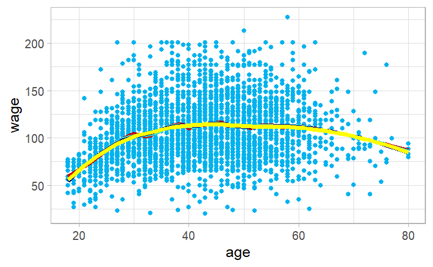

También podemos ver como para el 40% obtenemos el menor error estándar residual. El resto de parámetros que nos saca el summary, son el número de observaciones, el número equivalente de parámetros y la traza de la matriz de suavizado. El resto son salidas del control del algoritmo.

\newpage

**Bootstrap con regressión LOESS:**

Para hacer este apartado, lo que vamos a hacer es usar la función loess.boot de la librería spatialEco.
```python
library(spatialEco)
bootLOESS<-loess.boot(x=age,y=wage, nreps=250, confidence=0.95)
summary(bootLOESS)
plot(bootLOESS)
```

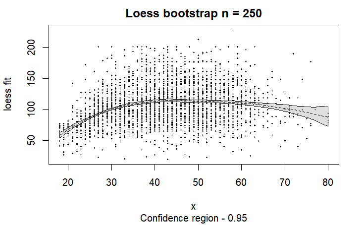


En el gráfico anterior podemos ver la estimación de las bandas de confianza para esta regresión local con 250 réplicas bootstrap y un nivel de confianza del 95%.

\vspace{0.5cm}

## Ejercicio 3.

Ocho pacientes usaron parches médicos con objeto de incrementar los niveles en la sangre de una cierta hormona. Se midió en cada persona su nivel en sangre después de llevar 3 diferentes parches, sobre los que el paciente no tenía información: un parche placebo, un parche de la marca A y otro de la marca B. Para cada persona se obtuvieron los valores de las diferencias de niveles:
Z=(parche A - parche placebo),
Y=(parche B - parche A)
cuyos valores se obtienen al correr este código:

```python
z0 = c(8406,2342,8187,8459,4795,3516,4796,11222)
y0 = c(-1200,2601,-2705,1982,-1290,351,-638,-3114)
Z = z0 + rnorm(length(z0), 0, 20)
Y = y0 + rnorm(length(y0), 0, 20)
```
El propósito del experimento es determinar si ambos parches son bioequivalentes.
Escribe un programa para calcular el estimador mejorado del sesgo y aplícalo en los datos anteriores.


```python
qplot(Z,Y, geom = c("point","line"))+theme_classic()
```

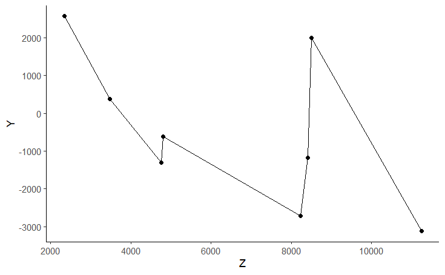


Aplicando la librería boot tenemos que:
```python
library(boot)

data=data.frame(Y=Y,Z=Z)
ratiofun=function(datos,ind){
  Y=datos[ind,1]
  Z=datos[ind,2]
  return(mean(Y)/mean(Z))
}

parchesboot<-boot(data = data, statistic = ratiofun, R=2000)
(ratio=ratiofun(data,1:8)) ## Estimador plug-in original
```


    [1] -0.07631909


```python
hist(parchesboot$t, xlab = expression(theta^"*"), col = "lightyellow", main = "")
abline(v = c(-0.2, 0.2), col = "violet")
abline(v = ratio, col = "blue")
```


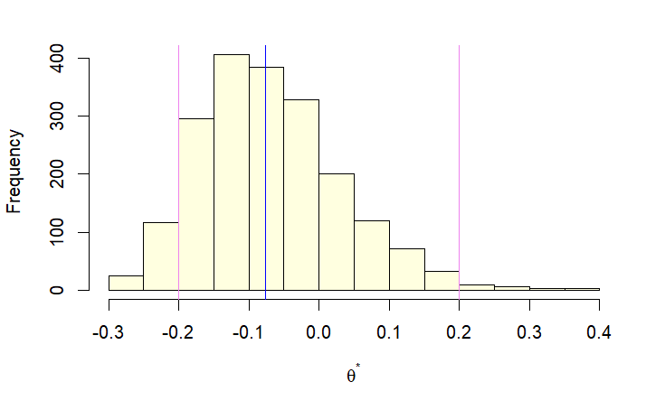


A la vista del gráfico anterior parece ser que sí que son bioequivalentes.

Obtenemos el error estándar bootstrap.
```python
sd(parchesboot$t)
```

    [1] 0.1006569


Ahora también vamos a obtener el estimador bootstrap del sesgo (bias).
```python
(mean(parchesboot$t)-ratio)
```

    [1] 0.006752222

Esto ha sido a mano, también lo podríamos haber sacado a partir de la propia salida de boot.
```python
parchesboot
```
```
ORDINARY NONPARAMETRIC BOOTSTRAP


Call:
boot(data = data, statistic = ratiofun, R = 2000)


Bootstrap Statistics :
       original      bias    std. error
t1* -0.07631909 0.006752222   0.1006569
```

\newpage

Alternativamente:
```python
N=dim(data)[1]
B=2000

ratioGorroBoot = replicate(B,{
  ind=sample(1:N, replace = TRUE)
  with(data[ind,], mean(Y)/mean(Z))
})
```

Estimador plug-in original
```python
(thetaGorro = with(data, mean(Y)/mean(Z)))
```

    [1] -0.07631909


Estimador bootstrap del sesgo (bias):

```python
(bias = mean(ratioGorroBoot) - thetaGorro)
```

     [1] 0.007275499


Y como se puede ver obtenemos resultados muy similares, no son iguales porque las remuestras bootstrap no son las mismas.

Bioequivalencia:
Probabilidad que $|\widehat{\theta}|>0.2$
```python
(sum(abs(ratioGorroBoot) > 0.2)/B)
```
        
    [1] 0.082


Por tanto sí que son bioequivalentes.

```python
hist(ratioGorroBoot, main = paste("Sesgo = ", round(abs(thetaGorro - mean(ratioGorroBoot)),
2), "
Sdev = ", round(sd(ratioGorroBoot), 2)), col = "lightgreen",
xlab = expression(hat(theta)^B))
abline(v = thetaGorro, col = "red", lwd = 2)
abline(v = c(-0.2, 0.2), col = "orange")
```


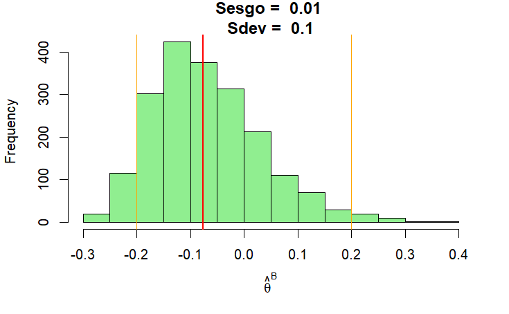


Y lo podemos confirmar con el gráfico anterior.

También vamos a estimar el sesgo mediante jackknife
```python
library(bootstrap)
ratiofun = function(x,data){
  return(mean(data[x,1]/mean(data[x,2])))
}
jackknife(1:N, theta = ratiofun, data)
```
```
$jack.se
[1] 0.1066384

$jack.bias
[1] 0.009201775

$jack.values
[1] -0.06403757 -0.13201737 -0.02844234 -0.13766187 -0.05641640 -0.08970924 -0.07110326 -0.02064835

$call
jackknife(x = 1:N, theta = ratiofun, data)
```


En la salida anterior podemos ver el error estándar, el sesgo y los valores del ratio en las muestras jackknife.

Corrección del sesgo:

Media ponderada por pesos
```python
mediaPond=function(p,x){
  sum(x*p)
}
```


\newpage


Cálculo del ratio usando medias ponderadas
```python
elratioP = function(p,x,y){
  mediaPond(p,x)/mediaPond(p,y)
}
```

Estimador plug-in de $\theta$:
```python
p.hat = rep(1/N, N)
(theta.hat = elratioP(p.hat, Y, Z))
```

[1] -0.07631909


Calculamos el vector $\bar{P}^{*}$
```python
nboot=1000
theta.star=numeric(nboot)

n=N
p.barpre=rep(0,n)

for(i in 1:nboot){
  k.star=sample(n,replace = TRUE)
  p.star=tabulate(k.star)/n
  theta.star[i]=elratioP(p.star,Y,Z)
  p.barpre=p.barpre+p.star
}

(P.bar.ast=p.barpre/nboot)
```

[1] 0.125250 0.127625 0.124375 0.122750 0.128875 0.127250 0.136750 0.183750


Y así hemos corregido el sesgo.

Ahora vamos a utilizar el estimador del sesgo mejorado para este conjunto de datos.

Estimador de $\hat{\theta}$:
```python
(theta.bar=elratioP(P.bar.ast,Y,Z))

hist(theta.star, xlab = expression(theta^"*"), col = "lightyellow", main = "")
abline(v = theta.bar, col = "orange", lwd = 2)
```

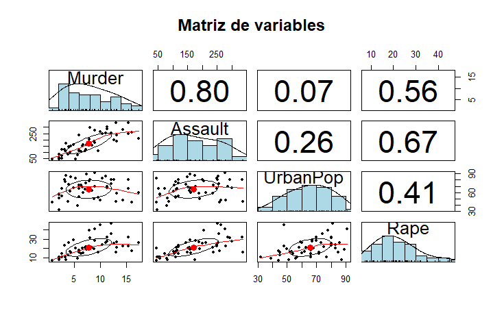


Estimador del sesgo:
```python
(bias.hat = mean(theta.star) - theta.bar)
```

[1] 0.006648998


Estimador corregido del sesgo para $\hat{\theta}$:
```python
theta.hat-bias.hat
```

[1] -0.08296809


Y con esto habríamos terminado este ejercicio, en resumen los parches sí que son bioequivalentes y el estimador corregido del sesgo para $\hat{\theta}$ está en torno a -0.08.


\newpage

## Ejercicio 4

Escribe algún problema para aplicar un método bootstrap en un problema de Análisis de Componentes Principales, calculando los errores estándar del mayor autovalor y de su autovector asociado.
Toma algún ejemplo de datos de la librería psych de R.
Explica los resultados obtenidos.

Hemos probado con alguno de los conjuntos de datos de la librería psych pero algunos tenían demasiadas variables o el porcentaje explicado por las componentes era muy bajo. Además la relación de las variables era prácticamente inexistente, por lo que es normal que obtiviéramos esos resultados. Entonces aunque no es un fichero de datos de esta librería vamos a utilizar bootstrap para PCA sobre el data.frame USArrests.

```python
library(psych)
data(USArrests)
pairs.panels(USArrests, method = "pearson", hist.col = "lightblue", density = TRUE,
ellipses = TRUE, main = "Matriz de variables")
```

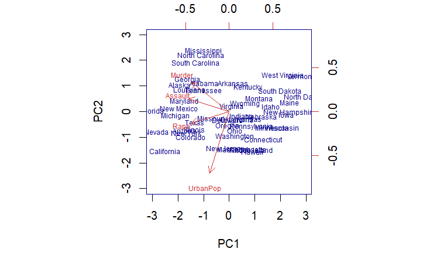


El vector de medias y la correspondiente matriz de covarianzas.
Usamos la matriz de covarianzas porque están en las mismas escalas.
Como podemos ver son preguntas con respuestas del 1 al 5 (escalas de likert).
```python
colMeans(USArrests)
```
```
  Murder  Assault UrbanPop     Rape 
   7.788  170.760   65.540   21.232 
```
\newpage

```{r}
cov(USArrests)
cor(USArrests)
```

```
             Murder   Assault   UrbanPop      Rape
Murder    18.970465  291.0624   4.386204  22.99141
Assault  291.062367 6945.1657 312.275102 519.26906
UrbanPop   4.386204  312.2751 209.518776  55.76808
Rape      22.991412  519.2691  55.768082  87.72916
             Murder   Assault   UrbanPop      Rape
Murder   1.00000000 0.8018733 0.06957262 0.5635788
Assault  0.80187331 1.0000000 0.25887170 0.6652412
UrbanPop 0.06957262 0.2588717 1.00000000 0.4113412
Rape     0.56357883 0.6652412 0.41134124 1.0000000
```

Ahora calculamos los autovalores y autovectores de la matriz de covarianzas.

```python
eigen(cov(USArrests))$values
eigen(cov(USArrests))$vectors
```

```
[1] 7011.114851  201.992366   42.112651    6.164246
            [,1]        [,2]        [,3]        [,4]
[1,] -0.04170432  0.04482166  0.07989066  0.99492173
[2,] -0.99522128  0.05876003 -0.06756974 -0.03893830
[3,] -0.04633575 -0.97685748 -0.20054629  0.05816914
[4,] -0.07515550 -0.20071807  0.97408059 -0.07232502
```


En componente principales svd es numéricamente más estable que la descomposición por autovectores y
autovalores, pero para aplicar bootstrap esta última es mas rápida.
La función prcomp() es una de las múltiples funciones en R que realizan PCA.
Por defecto, prcomp() centra las variables para que tengan media cero, pero si se quiere además que su
desviación estándar sea de uno, hay que indicar scale = TRUE.

Vamos a ello:
```python
pca=prcomp(USArrests,scale. = TRUE)
names(pca)
```

    [1] "sdev"     "rotation" "center"   "scale"    "x"       


Proporción de variabilidad explicada por cada componente.

```python
prop_varianza = pca$sdev^2/sum(pca$sdev^2)
prop_varianza
```

    [1] 0.62006039 0.24744129 0.08914080 0.04335752


La primera componente explica un 62% de la variabilidad, la segunda un 24,74%...

Analizar con detalle el vector de loadings que forma cada componente puede ayudar a interpretar que tipo
de información recoge cada una de ellas.

```python
pca$rotation
```
```
                PC1        PC2        PC3         PC4
Murder   -0.5358995  0.4181809 -0.3412327  0.64922780
Assault  -0.5831836  0.1879856 -0.2681484 -0.74340748
UrbanPop -0.2781909 -0.8728062 -0.3780158  0.13387773
Rape     -0.5434321 -0.1673186  0.8177779  0.08902432
```

```python
head(pca$x)
```
```
                  PC1        PC2         PC3          PC4
Alabama    -0.9756604  1.1220012 -0.43980366  0.154696581
Alaska     -1.9305379  1.0624269  2.01950027 -0.434175454
Arizona    -1.7454429 -0.7384595  0.05423025 -0.826264240
Arkansas    0.1399989  1.1085423  0.11342217 -0.180973554
California -2.4986128 -1.5274267  0.59254100 -0.338559240
Colorado   -1.4993407 -0.9776297  1.08400162  0.001450164
```

La función prcomp() calcula automáticamente el valor de las componentes principales para cada observación
(principal component scores) multiplicando los datos por los vectores de loadings. El resultado se almacena
en la matriz x.
Mediante la función biplot() se puede obtener una representación bidimensional de las dos primeras componentes. Es recomendable indicar el argumento scale = 0 para que las flechas estén en la misma escala
que las componentes


```python
biplot(x = pca, scale = 0, cex = 0.6, col = c("blue4", "brown3"))
```


Una vez calculadas las componentes principales, se puede conocer la varianza explicada por cada una de
ellas, la proporción respecto al total y la proporción de varianza acumulada.

```python
library(ggplot2)
ggplot(data = data.frame(prop_varianza, pc = 1:4), aes(x = pc, y = prop_varianza)) +
geom_col(width = 0.3) + scale_y_continuous(limits = c(0, 1)) + theme_classic() +
labs(x = "Componente principal", y = "Prop. de varianza explicada")
```


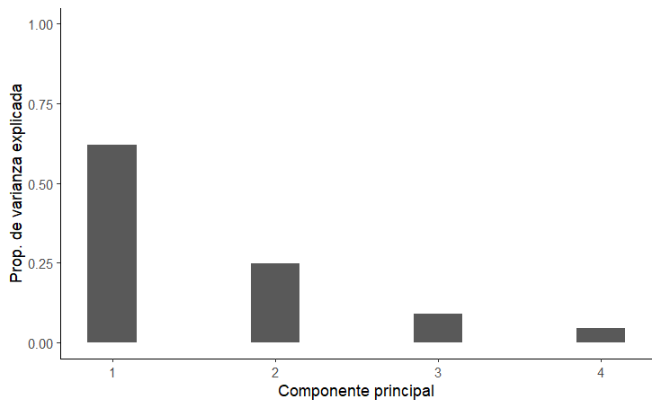


```python
prop_varianza_acum = cumsum(prop_varianza)
prop_varianza_acum
```

     [1] 0.6200604 0.8675017 0.9566425 1.0000000


```python
ggplot(data = data.frame(prop_varianza_acum, pc = 1:4), aes(x = pc, y =prop_varianza_acum, group = 1)) + geom_point() + geom_line() + theme_classic() + labs(x = "Componente principal", y = "Prop. varianza explicada acumulada")
```

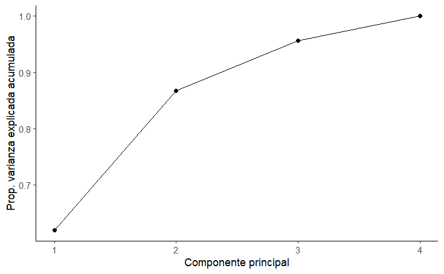


Podemos ver que para tener un porcentaje de variabilidad explicado alto nos basta con coger la primera o las dos primeras.

Ahora empezamos con bootstrap para componentes principales.

```python
library(boot)
autovals = eigen(var(USArrests), symmetric = TRUE, only.values = TRUE)$values
(teta = autovals[1]/sum(autovals))
```

     [1] 0.9655342


```python
autoval = function(X, ind) {
vals = eigen(var(X[ind, ]), symmetric = TRUE, only.values = TRUE)$values
vals[1]/sum(vals)
}
USA.boot = boot(USArrests, statistic = autoval, R = 500)
names(USA.boot)
```

```
 [1] "t0"        "t"         "R"         "data"      "seed"      "statistic" "sim"       "call"     
 [9] "stype"     "strata"    "weights"  
```
 
 
Error estándar del bootstrap:
```python
sd(USA.boot$t)
``` 
 
    [1] 0.006265236


Es bastante bajo.


\newpage

Distribución bootstrap:
```python
library(ggplot2)
qplot(USA.boot$t, geom = "histogram", fill = I("turquoise"),colour=I("black"),
xlab = "Samples") + geom_vline(xintercept = teta, col = "red")+theme_classic()
```


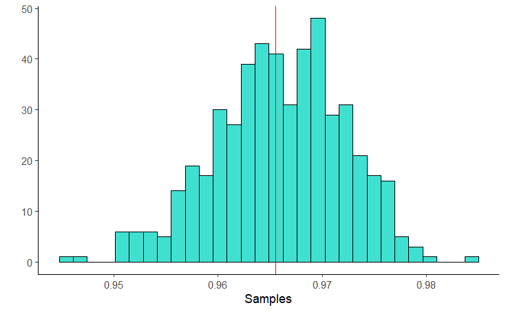


Otra forma de hacerlo:

```python
library(bootstrap)
X = USArrests
```

```python
eigenTeta = function(X) {
   ee = eigen(cov(X))[["values"]]
   ee[1]/sum(ee)
}

ind = 1:dim(X)[[1]]
```

```python
eigendist = replicate(5000,
eigenTeta(X[sample(ind, replace=TRUE),]))

library(latticeExtra)

densityplot(eigendist, plot.points=FALSE,
xlab=expression(theta))
```

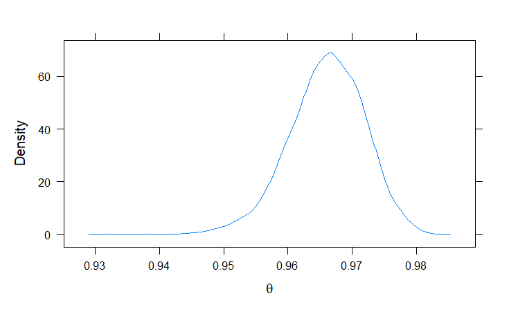


```python
if (!require(data4PCCAR)) remotes::install_github("HerveAbdi/data4PCCAR")

booteig = boot.eigen(USArrests, nIter = 1000)
booteig$fixed.eigs
```

     [1] 2.4802416 0.9897652 0.3565632 0.1734301


De modo manual:
```python
eigen(cor(USArrests))$values
```

     [1] 2.4802416 0.9897652 0.3565632 0.1734301


Intervalo de confianza para la primera componente.
```python
quantile(booteig$boot.eigs.sorted[, 1], c(0.025, 0.975))
```
```
 2.5%    97.5% 
2.185652 2.862928 
```


Tanto $\hat{v_{1}}$ como $\hat{v_{2}}$ son estadísticos del mismo modo que lo es $\hat{\theta}$, y de este modo se puede aplicar el bootstrap para calcular su variabilidad.

```python
library(bootstrap)

X = USArrests

eigenVec = function(X) {
ee = eigen(cov(X))[["vectors"]]
return(cbind(ee[, 1], ee[, 2]))
}
```

```python
ind = 1:dim(X)[[1]]
eigendist = replicate(500, eigenVec(X[sample(ind, replace = TRUE), ]))
apply(eigendist[1:4, 1, ], 1, sd)
```

    [1] 0.003944485 0.002139868 0.029344118 0.013623333


Podemos ver los errores estándar bootstrap de las componentes principales.
```python
apply(eigendist[1:4, 2, ], 1, sd)
```

    [1] 0.03260708 0.04674695 0.63176408 0.16665860


```python
boxplot(cbind(eigendist[1, 1, ], eigendist[2, 1, ], eigendist[3, 1, ], eigendist[4,
1, ]), main = "Componente 1", col = "lightblue")
```

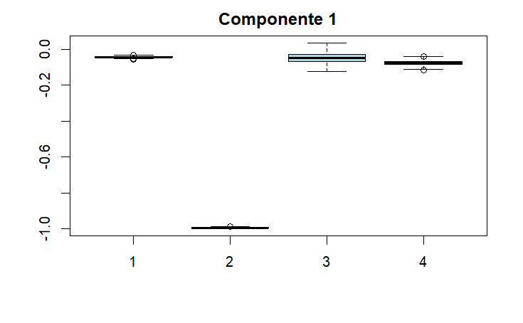


Con esto habríamos terminado este ejercicio en el que hemos visto como hacer un análisis PCA en R y aplicarle bootstrap para el cálculo de errores estándar.


\newpage

## Ejercicio 5.

Se ha medido en 13 personas la fuerza de su dentadura, y se deseaa predecir dicha fuerza a partir de ciertas medidas que no requieren de pruebas destructivas. Se miden cuatro variables en cada persona: (D1,D2) que son difíciles de obtener y (E1,E2) que son fáciles de obtener.
Los datos obtenidos se obtienen a partir del siguiente código:

```python
library(bootstrap)
data(tooth)
df=tooth
set.seed(100428853)
df_jit = df[,2:6] + matrix(rnorm(nrow(df[,2:6])*ncol(df[,2:6]), sd=0.5), ncol=ncol(df[,2:6]))
(myteeth = cbind(df[,1],df_jit))
```


Escribe los dos posibles modelos de regresión lineal (con variables fáciles y difíciles) de la variable fuerza en términos de las variables (D1,D2) y (E1,E2). Calcula los parámetros correspondientes y sus intervalos de confianza al 95% asumiendo normalidad.
Para ambos modelos, calcula también (usando remuestreos de residuos y también de casos) intervalos de confianza bootstrap (usa varios tipos de intervalos).
Describe de manera teórica en qué consisten dichos intervalos.
Calcula la suma de cuadrados residual en ambos modelos, $SCE=\sum_{i=1}^{n} \left ( y_{i}-\hat{y_{i}} \right )^{2}$ y calcula estadístico diferencia media respecto a los dos modelos
$$\hat{\theta}=\frac{1}{n}\left (SCM_{MD}-SCE_{ME}  \right )$$,
así como su correspondiente error estándar mediante bootstrap.
Esto daría una idea de cuál es el modelo que presenta mejor comportamiento. Justifícalo.
Estudia la variabilidad de $\hat{\theta}$ mediante intervalos de confianza percentil y BCa.

Modelos de regresión:
```python
ModD<-lm(strength~D1+D2,data=myteeth)
summary(ModD)
plot(ModD)
ModE<-lm(strength~E1+E2,data=myteeth)
summary(ModE)
plot(ModE)
```

```
Call:
lm(formula = strength ~ D1 + D2, data = myteeth)

Residuals:
     Min       1Q   Median       3Q      Max 
-1.45304 -0.31127 -0.07818  0.62017  1.27062 

Coefficients:
            Estimate Std. Error t value Pr(>|t|)    
(Intercept)  31.4187     3.5942   8.741 5.37e-06 ***
D1            0.5912     0.4000   1.478    0.170    
D2            0.6788     0.3763   1.804    0.101    
---
Signif. codes:  0 ‘***’ 0.001 ‘**’ 0.01 ‘*’ 0.05 ‘.’ 0.1 ‘ ’ 1

Residual standard error: 0.9094 on 10 degrees of freedom
Multiple R-squared:  0.2847,	Adjusted R-squared:  0.1417 
F-statistic: 1.991 on 2 and 10 DF,  p-value: 0.1872


Call:
lm(formula = strength ~ E1 + E2, data = myteeth)

Residuals:
     Min       1Q   Median       3Q      Max 
-1.73417 -0.49069 -0.02641  0.82872  1.23917 

Coefficients:
            Estimate Std. Error t value Pr(>|t|)   
(Intercept)  29.8008     8.1508   3.656  0.00442 **
E1            0.8269     0.5171   1.599  0.14086   
E2           -0.3546     0.5189  -0.683  0.50994   
---
Signif. codes:  0 ‘***’ 0.001 ‘**’ 0.01 ‘*’ 0.05 ‘.’ 0.1 ‘ ’ 1

Residual standard error: 0.9529 on 10 degrees of freedom
Multiple R-squared:  0.2146,	Adjusted R-squared:  0.05754 
F-statistic: 1.366 on 2 and 10 DF,  p-value: 0.2988
```


Intervalos de confianza asumiendo normalidad:
```python
confint(ModD)
confint(ModE)
```
```
                 2.5 %    97.5 %
(Intercept) 23.4102440 39.427142
D1          -0.3000667  1.482382
D2          -0.1596955  1.517361
                 2.5 %    97.5 %
(Intercept) 11.6396470 47.961899
E1          -0.3252196  1.979073
E2          -1.5108262  0.801663
```


Intervalos de confianza bootstrap:
Modelo 1:

```python
## Bootstrap con residuos.
N=13
x=as.matrix(myteeth[,c(2,3)])
y=as.vector(myteeth[,6])
kk=residuals(ModD)
betas=coef(ModD)

bootResid=replicate(2000,{
  epsilon=sample(kk, replace = TRUE)
  coef(lm((cbind(1,x)%*%betas+epsilon)~x))
})

library(latticeExtra)
densityplot(~bootResid[1,], plot.points=FALSE, auto.key = list(columns=2), xlab = expression(beta[0]))
densityplot(~bootResid[2,], plot.points=FALSE, auto.key = list(columns=2), xlab = expression(beta[1]))
densityplot(~bootResid[3,], plot.points=FALSE, auto.key = list(columns=2), xlab = expression(beta[2]))
```


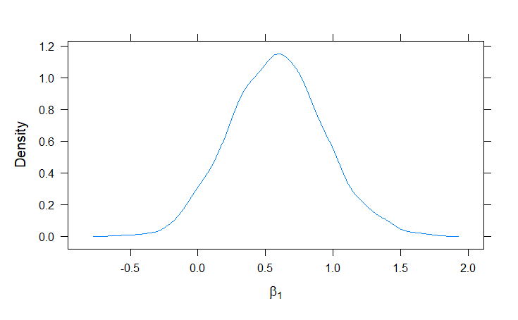

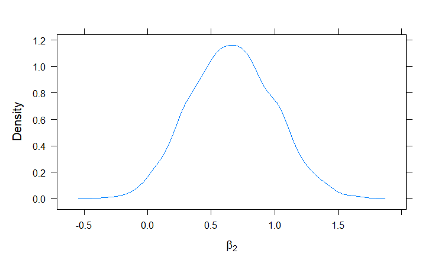


```python
## Bootstrap con residuos opción 2.
bootResid2=replicate(2000, coef(lm(simulate(ModD)[,1]~x)))

library(latticeExtra)
densityplot(~bootResid2[1,], plot.points=FALSE, auto.key = list(columns=2), xlab = expression(beta[0]))
densityplot(~bootResid2[2,], plot.points=FALSE, auto.key = list(columns=2), xlab = expression(beta[1]))
densityplot(~bootResid2[3,], plot.points=FALSE, auto.key = list(columns=2), xlab = expression(beta[2]))
```


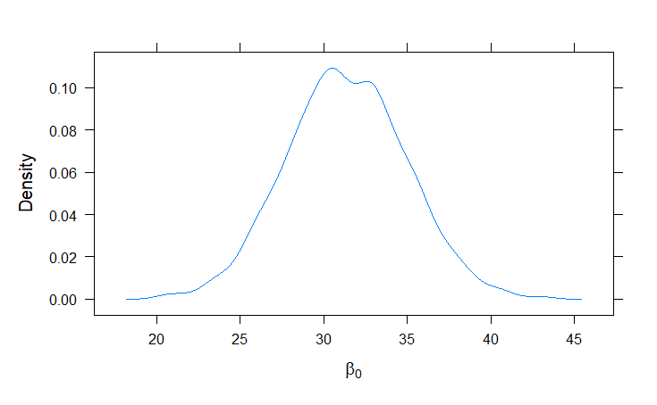

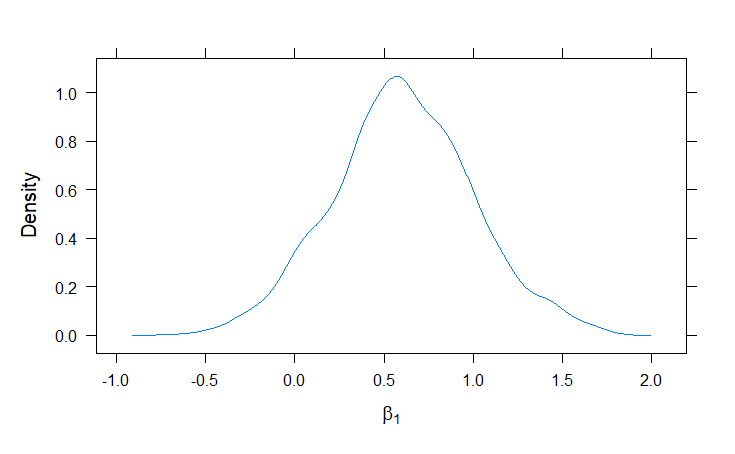

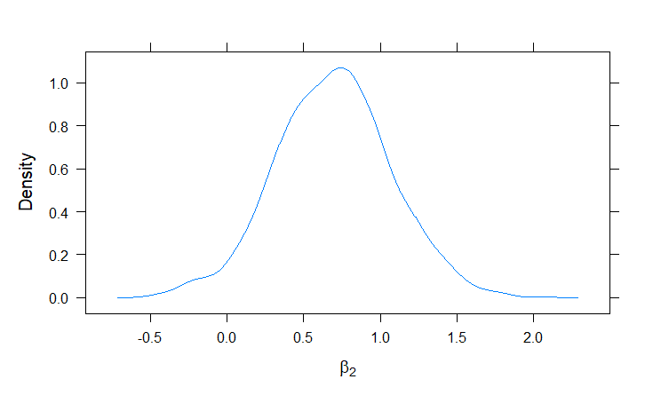


```python
## Bootstrap con librería simpleboot con residuos.
library(simpleboot)
lboot1=lm.boot(ModD,R=1000,rows=FALSE)
summary(lboot1)
```
```
BOOTSTRAP OF LINEAR MODEL  (method = residuals)

Original Model Fit
------------------
Call:
lm(formula = strength ~ D1 + D2, data = myteeth)

Coefficients:
(Intercept)           D1           D2  
    31.4187       0.5912       0.6788  

Bootstrap SD's:
(Intercept)           D1           D2  
  3.2106935    0.3537843    0.3375528  
```  
  
  
 
```python
## Bootstrap con librería boot con residuos.
library(boot)
boot.reg=function(losdatos, i){
  modelo=lm(y~x, data = losdatos)
  yhat=fitted(modelo)
  e=resid(modelo)
  y.star=yhat+e[i]
  modelB=lm(y.star~x)
  coef(modelB)
}
bootbootr=boot(data = as.data.frame(x), statistic = boot.reg, R=1000)
bootbootr

plot(bootbootr, index = 1, nclass = 15)
plot(bootbootr, index = 2, nclass = 15)
plot(bootbootr, index = 3, nclass = 15)

boot.ci(bootbootr,index = 1, type = "all")
boot.ci(bootbootr,index = 2, type = "all")
boot.ci(bootbootr,index = 3, type = "all")
``` 
  
  
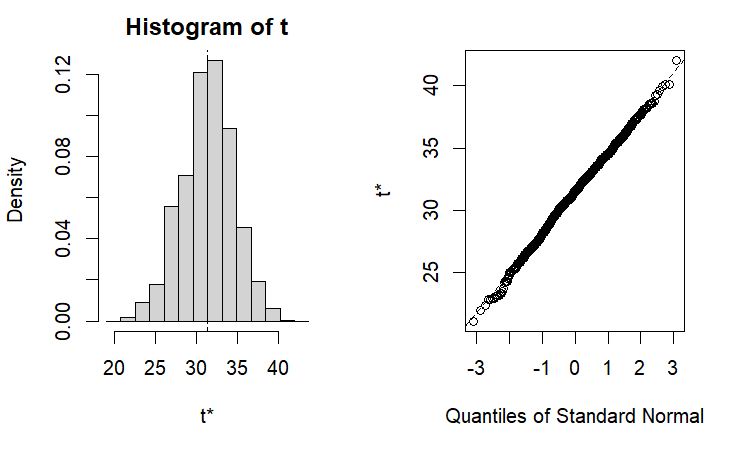
  
  
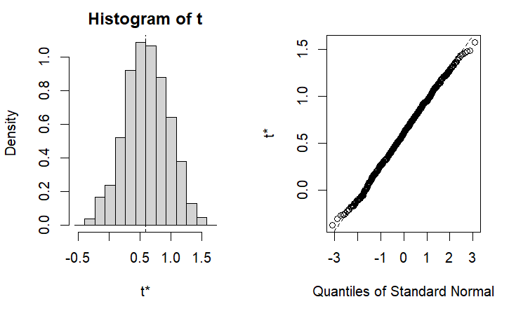
  
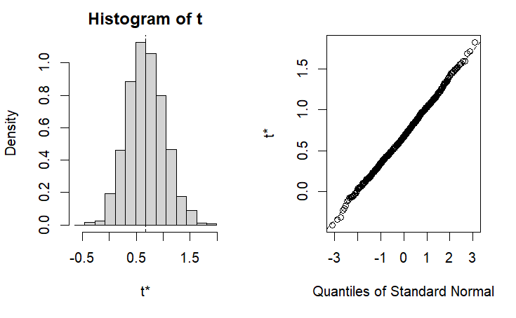
  


```python
## Bootstrap con librería car para los residuos.
library(car)
betahat.boot=Boot(ModD, method="residual",R=2000)
summary(betahat.boot)
confint(betahat.boot)
hist(betahat.boot)
```


```
Number of bootstrap replications R = 2000 
            original   bootBias  bootSE  bootMed
(Intercept) 31.41869 -0.0343238 3.77290 31.43432
D1           0.59116  0.0088582 0.42046  0.58837
D2           0.67883  0.0086891 0.39506  0.68144
Bootstrap bca confidence intervals


                    2.5 %        97.5 %
 
(Intercept)	    24.1184335	   39.038938		
D1            	-0.1946184	   1.497955		
D2             	-0.1179729     1.439213	
```


```python
## Bootstrap basado en pares de valores.
x1=x[,1]
x2=x[,2]
bootPair=replicate(2000,{
  ind=sample(1:N, replace = TRUE)
  coef(lm(y[ind]~x1[ind]+x2[ind]))
})

(betaEst = coef(ModD))
(sdBeta = sqrt(vcov(ModD)))

densityplot(~bootPair[1,], plot.points=FALSE, auto.key = list(columns=2), xlab = expression(beta[0]))
densityplot(~bootPair[2,], plot.points=FALSE, auto.key = list(columns=2), xlab = expression(beta[1]))
densityplot(~bootPair[3,], plot.points=FALSE, auto.key = list(columns=2), xlab = expression(beta[2]))

## Gráficos de la distribución del estadístico beta original y el estadístico beta remuestreado.
densityplot(bootPair[1,], plot.points = FALSE, xlab = expression(beta[0])) + layer(panel.abline(v = betaEst[1])) +layer(panel.mathdensity(args = list(mean = betaEst[1], sd = sdBeta[1,1]), col = "orange",n = 100))
densityplot(bootPair[2,], plot.points = FALSE, xlab = expression(beta[1])) + layer(panel.abline(v = betaEst[2])) +layer(panel.mathdensity(args = list(mean = betaEst[2], sd = sdBeta[2,2]), col = "orange",n = 100))
densityplot(bootPair[3,], plot.points = FALSE, xlab = expression(beta[2])) + layer(panel.abline(v = betaEst[3])) +layer(panel.mathdensity(args = list(mean = betaEst[3], sd = sdBeta[3,3]), col = "orange",n = 100))

## Comparación de errores estándar.
sd(bootPair[1,])
sqrt(vcov(ModD)[1,1])
sd(bootPair[2,])
sqrt(vcov(ModD)[2,2])
sd(bootPair[3,])
sqrt(vcov(ModD)[3,3])
```

```
(Intercept)          D1          D2 
 31.4186930   0.5911574   0.6788327 
            (Intercept)        D1        D2
(Intercept)   3.5942325 0.5641584       NaN
D1            0.5641584 0.3999859 0.2399557
D2                  NaN 0.2399557 0.3763357
[1] 6.161511
[1] 3.594232
[1] 0.5530538
[1] 0.3999859
[1] 0.5471134
[1] 0.3763357
```


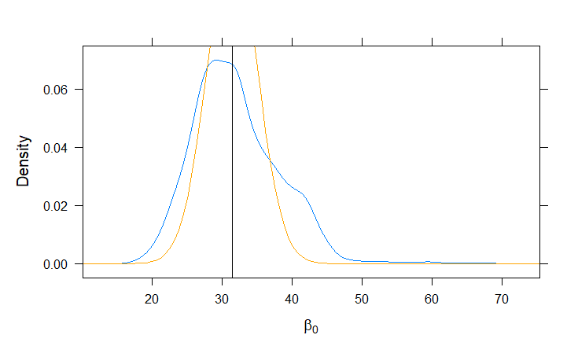

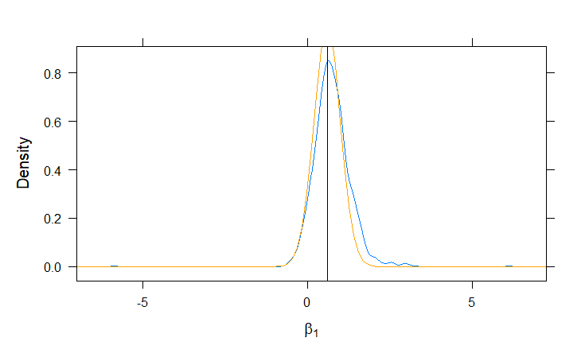


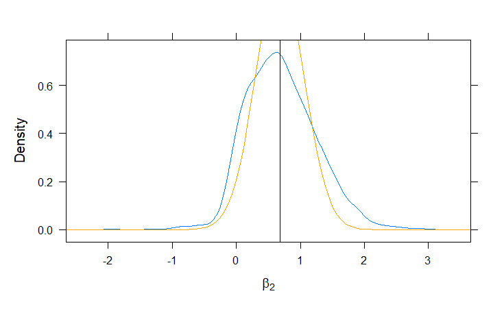


```python
## Bootstrap basado en pares de valores con boot.
boot.reg2=function(data,i){
  mod=lm(y~x, data[i,])
  coef(mod)
}
library(boot)
bootbootp=boot(data = data.frame(y=y,x=x), statistic = boot.reg2, R=2000)
bootbootp

plot(bootbootp, index = 1, nclass = 15)
plot(bootbootp, index = 2, nclass = 15)
plot(bootbootp, index = 3, nclass = 15)

boot.ci(bootbootp,index = 1, type = "all")
boot.ci(bootbootp,index = 2, type = "all")
boot.ci(bootbootp,index = 3, type = "all")
```


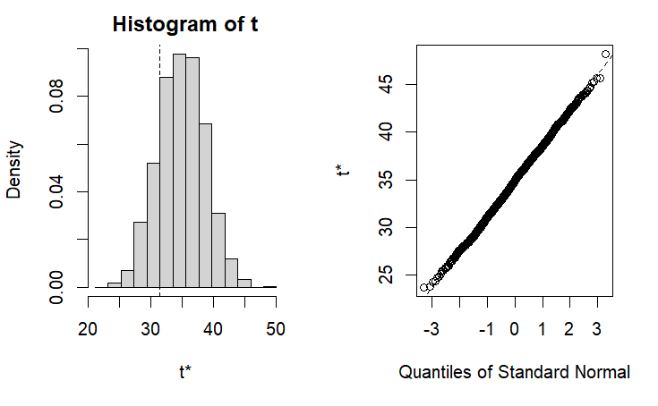

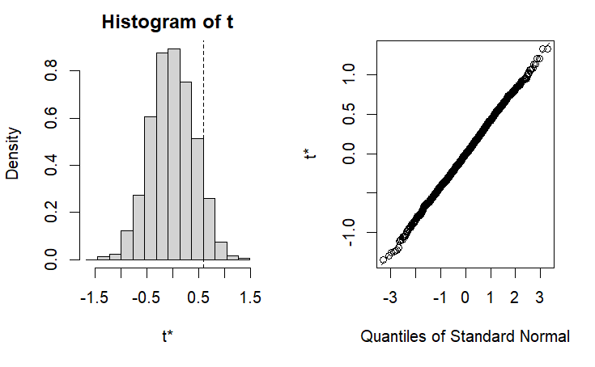


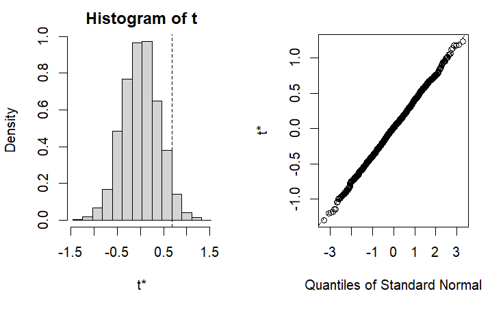


Hemos podido ver las distribuciónes bootstrap de cada uno de los parámetros.

```python
## Bootstrap con librería car para pares de valores.
library(car)
betahat.boot2=Boot(ModD,R=2000)
summary(betahat.boot2)
confint(betahat.boot2)
hist(betahat.boot2)
```

```
Number of bootstrap replications R = 2000 
            original bootBias  bootSE  bootMed
(Intercept) 31.41869 0.525355 5.87540 31.28942
D1           0.59116 0.134945 0.51140  0.67852
D2           0.67883 0.024932 0.52401  0.65195
Bootstrap bca confidence intervals


                   2.5 %        97.5 %
            
(Intercept)	    20.70841644	   42.547287		
D1	            -0.41401693	   1.533183		
D2	            -0.07292803	   1.961772	
```


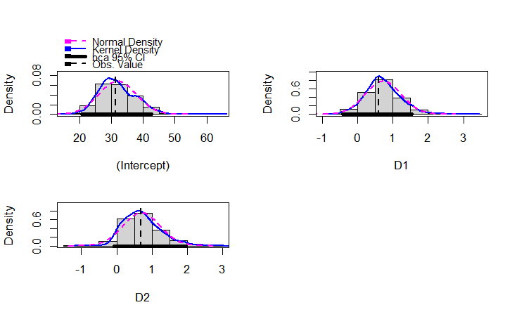


Modelo 2:
```python
## Bootstrap con residuos.

N=13
x=as.matrix(myteeth[,4:5])
y=as.vector(myteeth[,6])

kk=residuals(ModE)
betas=coef(ModE)

bootResid=replicate(2000,{
  epsilon=sample(kk, replace = TRUE)
  coef(lm((cbind(1,x)%*%betas+epsilon)~x))
})

library(latticeExtra)
densityplot(~bootResid[1,], plot.points=FALSE, auto.key = list(columns=2), xlab = expression(beta[0]))
densityplot(~bootResid[2,], plot.points=FALSE, auto.key = list(columns=2), xlab = expression(beta[1]))
densityplot(~bootResid[3,], plot.points=FALSE, auto.key = list(columns=2), xlab = expression(beta[2]))
```


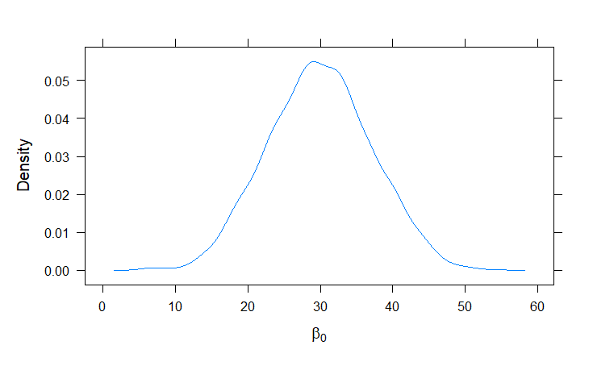

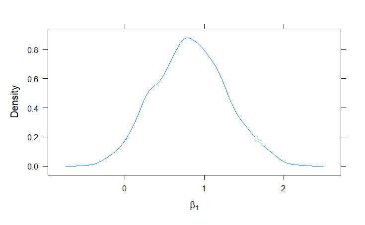


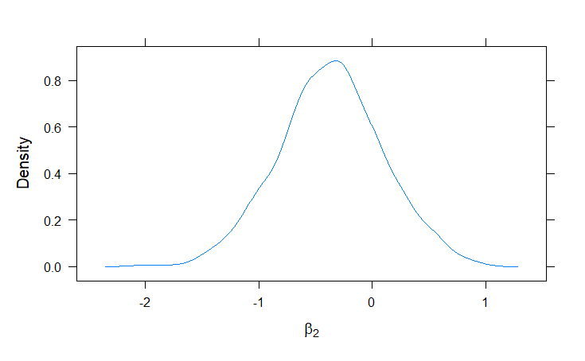


```python
## Bootstrap con residuos opción 2.
bootResid2=replicate(2000, coef(lm(simulate(ModE)[,1]~x)))

library(latticeExtra)
densityplot(~bootResid2[1,], plot.points=FALSE, auto.key = list(columns=2), xlab = expression(beta[0]))
densityplot(~bootResid2[2,], plot.points=FALSE, auto.key = list(columns=2), xlab = expression(beta[1]))
densityplot(~bootResid2[3,], plot.points=FALSE, auto.key = list(columns=2), xlab = expression(beta[2]))
```
 


 


```python
## Bootstrap con librería simpleboot con residuos.
library(simpleboot)
lboot1=lm.boot(ModD,R=1000,rows=FALSE)
summary(lboot1)
```
```
BOOTSTRAP OF LINEAR MODEL  (method = residuals)

Original Model Fit
------------------
Call:
lm(formula = strength ~ D1 + D2, data = myteeth)

Coefficients:
(Intercept)           D1           D2  
    31.4187       0.5912       0.6788  

Bootstrap SD's:
(Intercept)           D1           D2  
  3.2106935    0.3537843    0.3375528  
```


```python
## Bootstrap con librería boot con residuos.
library(boot)
boot.reg=function(losdatos, i){
  modelo=lm(y~x, data = losdatos)
  yhat=fitted(modelo)
  e=resid(modelo)
  y.star=yhat+e[i]
  modelB=lm(y.star~x)
  coef(modelB)
}
bootbootr=boot(data = as.data.frame(x), statistic = boot.reg, R=1000)
bootbootr

plot(bootbootr, index = 1, nclass = 15)
plot(bootbootr, index = 2, nclass = 15)
plot(bootbootr, index = 3, nclass = 15)

boot.ci(bootbootr,index = 1, type = "all")
boot.ci(bootbootr,index = 2, type = "all")
boot.ci(bootbootr,index = 3, type = "all")
```

```
ORDINARY NONPARAMETRIC BOOTSTRAP


Call:
boot(data = as.data.frame(x), statistic = boot.reg, R = 1000)


Bootstrap Statistics :
      original      bias    std. error
t1* 31.4186930 0.010280859   3.2005925
t2*  0.5911574 0.014729109   0.3447007
t3*  0.6788327 0.004842572   0.3425400
BOOTSTRAP CONFIDENCE INTERVAL CALCULATIONS
Based on 1000 bootstrap replicates

CALL : 
boot.ci(boot.out = bootbootr, type = "all", index = 1)

Intervals : 
Level      Normal              Basic         
95%   (25.14, 37.68 )   (25.26, 37.71 )  

Level     Percentile            BCa          
95%   (25.12, 37.58 )   (25.13, 37.58 )  
Calculations and Intervals on Original Scale
BOOTSTRAP CONFIDENCE INTERVAL CALCULATIONS
Based on 1000 bootstrap replicates

CALL : 
boot.ci(boot.out = bootbootr, type = "all", index = 2)

Intervals : 
Level      Normal              Basic         
95%   (-0.0992,  1.2520 )   (-0.0801,  1.2748 )  

Level     Percentile            BCa          
95%   (-0.0925,  1.2625 )   (-0.1054,  1.2509 )  
Calculations and Intervals on Original Scale
BOOTSTRAP CONFIDENCE INTERVAL CALCULATIONS
Based on 1000 bootstrap replicates

CALL : 
boot.ci(boot.out = bootbootr, type = "all", index = 3)

Intervals : 
Level      Normal              Basic         
95%   ( 0.0026,  1.3454 )   (-0.0361,  1.3161 )  

Level     Percentile            BCa          
95%   ( 0.0416,  1.3938 )   ( 0.0587,  1.4188 )  
Calculations and Intervals on Original Scale
```


```python
## Bootstrap con librería car para los residuos.
library(car)
betahat.boot=Boot(ModD, method="residual",R=2000)
summary(betahat.boot)
confint(betahat.boot)
hist(betahat.boot)
```

```
Number of bootstrap replications R = 2000 
            original   bootBias  bootSE  bootMed
(Intercept) 31.41869 -0.0343238 3.77290 31.43432
D1           0.59116  0.0088582 0.42046  0.58837
D2           0.67883  0.0086891 0.39506  0.68144
Bootstrap bca confidence intervals


                   2.5 %       97.5 %  
(Intercept)	   24.1184335	   39.038938		
D1	           -0.1946184	   1.497955		
D2	           -0.1179729	   1.439213	
```


```python
## Bootstrap basado en pares de valores.
x1=x[,1]
x2=x[,2]
bootPair=replicate(2000,{
  ind=sample(1:N, replace = TRUE)
  coef(lm(y[ind]~x1[ind]+x2[ind]))
})

(betaEst = coef(ModD))
(sdBeta = sqrt(vcov(ModD)))

densityplot(~bootPair[1,], plot.points=FALSE, auto.key = list(columns=2), xlab = expression(beta[0]))
densityplot(~bootPair[2,], plot.points=FALSE, auto.key = list(columns=2), xlab = expression(beta[1]))
densityplot(~bootPair[3,], plot.points=FALSE, auto.key = list(columns=2), xlab = expression(beta[2]))

## Gráficos de la distribución del estadístico beta original y el estadístico beta remuestreado.
densityplot(bootPair[1,], plot.points = FALSE, xlab = expression(beta[0])) + layer(panel.abline(v = betaEst[1])) +layer(panel.mathdensity(args = list(mean = betaEst[1], sd = sdBeta[1,1]), col = "orange",n = 100))
densityplot(bootPair[2,], plot.points = FALSE, xlab = expression(beta[1])) + layer(panel.abline(v = betaEst[2])) +layer(panel.mathdensity(args = list(mean = betaEst[2], sd = sdBeta[2,2]), col = "orange",n = 100))
densityplot(bootPair[3,], plot.points = FALSE, xlab = expression(beta[2])) + layer(panel.abline(v = betaEst[3])) +layer(panel.mathdensity(args = list(mean = betaEst[3], sd = sdBeta[3,3]), col = "orange",n = 100))

## Comparación de errores estándar.
sd(bootPair[1,])
sqrt(vcov(ModD)[1,1])
sd(bootPair[2,])
sqrt(vcov(ModD)[2,2])
sd(bootPair[3,])
sqrt(vcov(ModD)[3,3])
```

```
(Intercept)          D1          D2 
 31.4186930   0.5911574   0.6788327 
            (Intercept)        D1        D2
(Intercept)   3.5942325 0.5641584       NaN
D1            0.5641584 0.3999859 0.2399557
D2                  NaN 0.2399557 0.3763357
[1] 6.161511
[1] 3.594232
[1] 0.5530538
[1] 0.3999859
[1] 0.5471134
[1] 0.3763357
```


```python
## Bootstrap basado en pares de valores con boot.
boot.reg2=function(data,i){
  mod=lm(y~x, data[i,])
  coef(mod)
}
library(boot)
bootbootp=boot(data = data.frame(y=y,x=x), statistic = boot.reg2, R=2000)
bootbootp

plot(bootbootp, index = 1, nclass = 15)
plot(bootbootp, index = 2, nclass = 15)
plot(bootbootp, index = 3, nclass = 15)

boot.ci(bootbootp,index = 1, type = "all")
boot.ci(bootbootp,index = 2, type = "all")
boot.ci(bootbootp,index = 3, type = "all")
```


Hemos podido ver las distribuciónes bootstrap de cada uno de los parámetros.

```python
## Bootstrap con librería car para pares de valores.
library(car)
betahat.boot2=Boot(ModD,R=2000)
summary(betahat.boot2)
confint(betahat.boot2)
hist(betahat.boot2)
```


```
Number of bootstrap replications R = 2000

            original bootBias  bootSE  bootMed
(Intercept) 31.41869 0.525355 5.87540 31.28942
D1           0.59116 0.134945 0.51140  0.67852
D2           0.67883 0.024932 0.52401  0.65195
Bootstrap bca confidence intervals


                  2.5 %         97.5 %

(Intercept)    20.70841644	  42.547287		
D1	           -0.41401693	  1.533183		
D2	           -0.07292803  	1.961772
```


Modelo 2
```python
## Bootstrap con residuos.

N=13
x=as.matrix(myteeth[,4:5])
y=as.vector(myteeth[,6])

kk=residuals(ModE)
betas=coef(ModE)

bootResid=replicate(2000,{
  epsilon=sample(kk, replace = TRUE)
  coef(lm((cbind(1,x)%*%betas+epsilon)~x))
})

library(latticeExtra)
densityplot(~bootResid[1,], plot.points=FALSE, auto.key = list(columns=2), xlab = expression(beta[0]))
densityplot(~bootResid[2,], plot.points=FALSE, auto.key = list(columns=2), xlab = expression(beta[1]))
densityplot(~bootResid[3,], plot.points=FALSE, auto.key = list(columns=2), xlab = expression(beta[2]))
```


```python
## Bootstrap con residuos opción 2.
bootResid2=replicate(2000, coef(lm(simulate(ModE)[,1]~x)))

library(latticeExtra)
densityplot(~bootResid2[1,], plot.points=FALSE, auto.key = list(columns=2), xlab = expression(beta[0]))
densityplot(~bootResid2[2,], plot.points=FALSE, auto.key = list(columns=2), xlab = expression(beta[1]))
densityplot(~bootResid2[3,], plot.points=FALSE, auto.key = list(columns=2), xlab = expression(beta[2]))
```

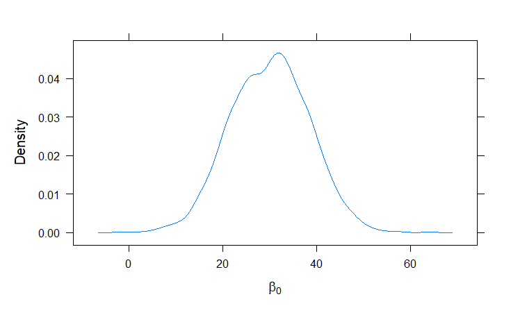

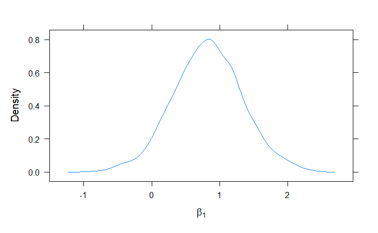

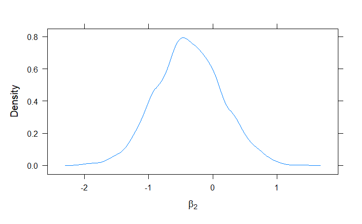


```python
## Bootstrap con librería simpleboot con residuos.
library(simpleboot)
lboot1=lm.boot(ModE,R=1000,rows=FALSE)
summary(lboot1)
```
```
BOOTSTRAP OF LINEAR MODEL  (method = residuals)

Original Model Fit
------------------
Call:
lm(formula = strength ~ E1 + E2, data = myteeth)

Coefficients:
(Intercept)           E1           E2  
    29.8008       0.8269      -0.3546  

Bootstrap SD's:
(Intercept)           E1           E2  
  7.2068262    0.4472661    0.4563058 
```


```python
## Bootstrap con librería boot con residuos.
library(boot)
boot.reg=function(losdatos, i){
  modelo=lm(y~x, data = losdatos)
  yhat=fitted(modelo)
  e=resid(modelo)
  y.star=yhat+e[i]
  modelB=lm(y.star~x)
  coef(modelB)
}
bootbootr=boot(data = as.data.frame(x), statistic = boot.reg, R=1000)
bootbootr

plot(bootbootr, index = 1, nclass = 15)
plot(bootbootr, index = 2, nclass = 15)
plot(bootbootr, index = 3, nclass = 15)

boot.ci(bootbootr,index = 1, type = "all")
boot.ci(bootbootr,index = 2, type = "all")
boot.ci(bootbootr,index = 3, type = "all")
```
```
CALL : 
boot.ci(boot.out = bootbootr, type = "all", index = 2)

Intervals : 
Level      Normal              Basic         
95%   (-0.0626,  1.7283 )   (-0.0628,  1.7373 )  

Level     Percentile            BCa          
95%   (-0.0834,  1.7167 )   (-0.0705,  1.7183 )  
Calculations and Intervals on Original Scale
BOOTSTRAP CONFIDENCE INTERVAL CALCULATIONS
Based on 1000 bootstrap replicates

CALL : 
boot.ci(boot.out = bootbootr, type = "all", index = 3)

Intervals : 
Level      Normal              Basic         
95%   (-1.3029,  0.5283 )   (-1.3450,  0.5234 )  

Level     Percentile            BCa          
95%   (-1.2326,  0.6358 )   (-1.2337,  0.6264 )  
Calculations and Intervals on Original Scale
```


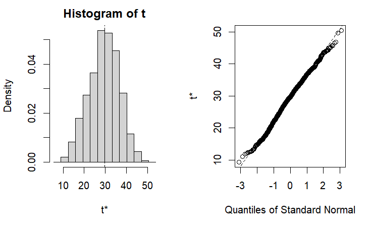

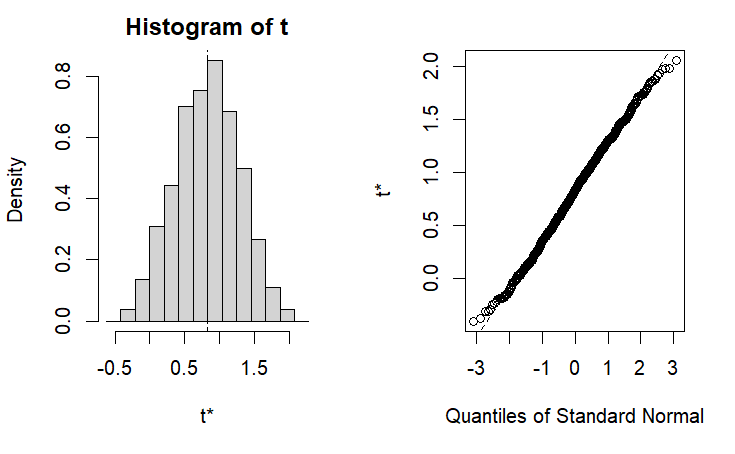

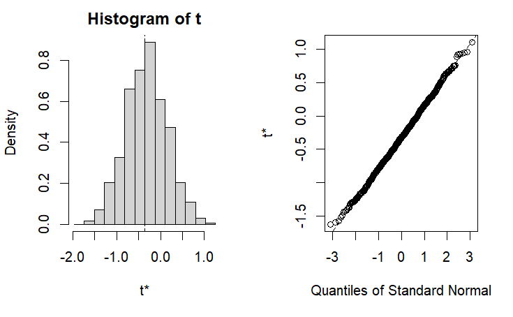


```python
## Bootstrap con librería car para los residuos.
library(car)
betahat.boot=Boot(ModE, method="residual",R=2000)
summary(betahat.boot)
confint(betahat.boot)
hist(betahat.boot)
```
```
Number of bootstrap replications R = 2000 
            original   bootBias  bootSE  bootMed
(Intercept) 29.80077 -0.0035836 8.94780 29.87609
E1           0.82693 -0.0063686 0.57149  0.82434
E2          -0.35458  0.0069833 0.55465 -0.34719
Bootstrap bca confidence intervals
```

```
                    2.5 %      97.5 %   
(Intercept)	    12.9561074	 48.2449235		
E1	            -0.3321568	 1.9003622		
E2	            -1.4607125   0.7132267	
```


```python
## Bootstrap basado en pares de valores.
x1=x[,1]
x2=x[,2]
bootPair=replicate(2000,{
  ind=sample(1:N, replace = TRUE)
  coef(lm(y[ind]~x1[ind]+x2[ind]))
})

(betaEst = coef(ModE))
(sdBeta = sqrt(vcov(ModE)))

densityplot(~bootPair[1,], plot.points=FALSE, auto.key = list(columns=2), xlab = expression(beta[0]))
densityplot(~bootPair[2,], plot.points=FALSE, auto.key = list(columns=2), xlab = expression(beta[1]))
densityplot(~bootPair[3,], plot.points=FALSE, auto.key = list(columns=2), xlab = expression(beta[2]))

## Gráficos de la distribución del estadístico beta original y el estadístico beta remuestreado.
densityplot(bootPair[1,], plot.points = FALSE, xlab = expression(beta[0])) + layer(panel.abline(v = betaEst[1])) +layer(panel.mathdensity(args = list(mean = betaEst[1], sd = sdBeta[1,1]), col = "orange",n = 100))
densityplot(bootPair[2,], plot.points = FALSE, xlab = expression(beta[1])) + layer(panel.abline(v = betaEst[2])) +layer(panel.mathdensity(args = list(mean = betaEst[2], sd = sdBeta[2,2]), col = "orange",n = 100))
densityplot(bootPair[3,], plot.points = FALSE, xlab = expression(beta[2])) + layer(panel.abline(v = betaEst[3])) +layer(panel.mathdensity(args = list(mean = betaEst[3], sd = sdBeta[3,3]), col = "orange",n = 100))

## Comparación de errores estándar.
sd(bootPair[1,])
sqrt(vcov(ModE)[1,1])
sd(bootPair[2,])
sqrt(vcov(ModE)[2,2])
sd(bootPair[3,])
sqrt(vcov(ModE)[3,3])
```

```
(Intercept)          E1          E2 
 29.8007732   0.8269266  -0.3545816 
            (Intercept)       E1        E2
(Intercept)    8.150805      NaN       NaN
E1                  NaN 0.517089       NaN
E2                  NaN      NaN 0.5189284
[1] 12.84318
[1] 8.150805
[1] 1.002647
[1] 0.517089
[1] 0.621148
[1] 0.5189284
```


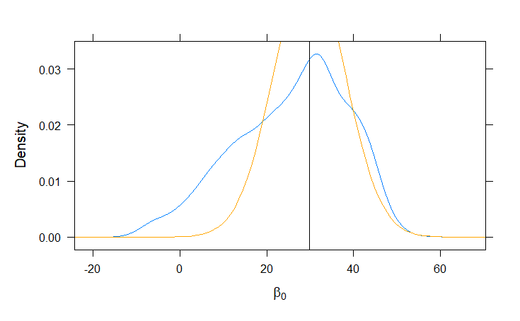

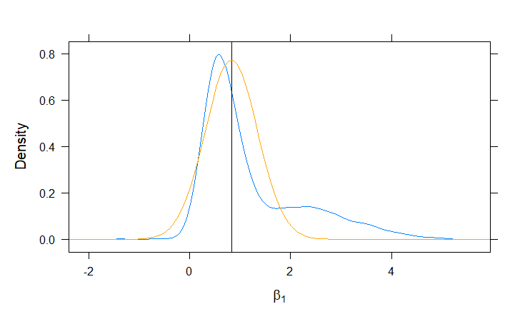

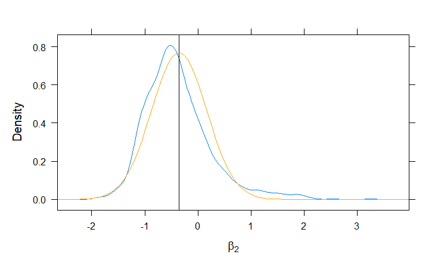


```python
## Bootstrap basado en pares de valores con boot.
boot.reg2=function(data,i){
  mod=lm(y~x, data[i,])
  coef(mod)
}
library(boot)
bootbootp=boot(data = data.frame(y=y,x=x), statistic = boot.reg2, R=2000)
bootbootp

plot(bootbootp, index = 1, nclass = 15)
plot(bootbootp, index = 2, nclass = 15)
plot(bootbootp, index = 3, nclass = 15)

boot.ci(bootbootp,index = 1, type = "all")
boot.ci(bootbootp,index = 2, type = "all")
boot.ci(bootbootp,index = 3, type = "all")
```


```
ORDINARY NONPARAMETRIC BOOTSTRAP


Call:
boot(data = data.frame(y = y, x = x), statistic = boot.reg2, 
    R = 2000)


Bootstrap Statistics :
      original     bias    std. error
t1* 29.8007732  4.9370854   7.9657497
t2*  0.8269266 -0.8247282   0.5221080
t3* -0.3545816  0.3681972   0.5057608
BOOTSTRAP CONFIDENCE INTERVAL CALCULATIONS
Based on 2000 bootstrap replicates

CALL : 
boot.ci(boot.out = bootbootp, type = "all", index = 1)

Intervals : 
Level      Normal              Basic         
95%   ( 9.25, 40.48 )   ( 9.44, 40.31 )  

Level     Percentile            BCa          
95%   (19.29, 50.17 )   ( 4.61, 39.83 )  
Calculations and Intervals on Original Scale
Warning : BCa Intervals used Extreme Quantiles
Some BCa intervals may be unstable
BOOTSTRAP CONFIDENCE INTERVAL CALCULATIONS
Based on 2000 bootstrap replicates

CALL : 
boot.ci(boot.out = bootbootp, type = "all", index = 2)

Intervals : 
Level      Normal              Basic         
95%   ( 0.6283,  2.6750 )   ( 0.6851,  2.6792 )  

Level     Percentile            BCa          
95%   (-1.0253,  0.9687 )   ( 0.6537,  1.5048 )  
Calculations and Intervals on Original Scale
Warning : BCa Intervals used Extreme Quantiles
Some BCa intervals may be unstable
BOOTSTRAP CONFIDENCE INTERVAL CALCULATIONS
Based on 2000 bootstrap replicates

CALL : 
boot.ci(boot.out = bootbootp, type = "all", index = 3)

Intervals : 
Level      Normal              Basic         
95%   (-1.7141,  0.2685 )   (-1.7500,  0.2762 )  

Level     Percentile            BCa          
95%   (-0.9854,  1.0408 )   (-1.5277,  0.3007 )  
Calculations and Intervals on Original Scale
Some BCa intervals may be unstable
```


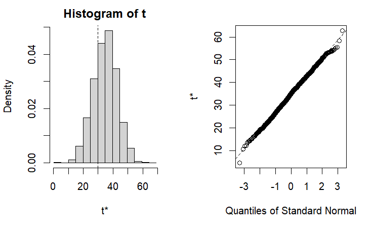

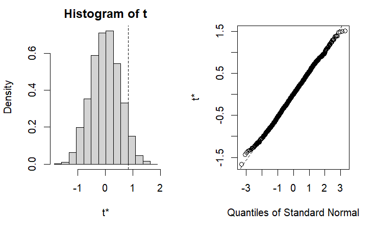

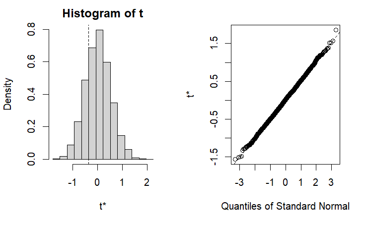


```python
## Bootstrap con librería car para pares de valores.
library(car)
betahat.boot2=Boot(ModE,R=2000)
summary(betahat.boot2)
confint(betahat.boot2)
hist(betahat.boot2)
```

```
Number of bootstrap replications R = 2000 
            original  bootBias   bootSE  bootMed
(Intercept) 29.80077 -3.410833 12.34338 27.80991
E1           0.82693  0.322234  0.94627  0.80200
E2          -0.35458 -0.028238  0.61937 -0.47207
Bootstrap bca confidence intervals
```

```
                  2.5 %        97.5 % 

(Intercept)	    3.4865752  	  47.690204		
E1	            0.0158614	    3.365666		
E2	           -1.1493481   	1.895784
```


Estadístico SCE y $\hat{\theta}$, así como su correspondiente error bootstrap. 

```python
ModD
summary(ModD)
ModE
summary(ModE)

library(boot)
mydata1<-myteeth[,c(2,3,6)]
mydata2<-myteeth[,c(4,5,6)]

bootstrapping<-function(formula,data,regressors){
  dat<-data[regressors,]
  reg<-lm(formula,data = dat)
  return(reg$residuals^2)
}

bs.reg1<-boot(R=1000,formula=strength~D1+D2,data = mydata1,statistic = bootstrapping)
SCED<-apply(bs.reg1$t, 1, sum)

bs.reg2<-boot(R=1000,formula=strength~E1+E2,data = mydata2,statistic = bootstrapping)
SCEE<-apply(bs.reg2$t, 1, sum)

teta<-(1/13)*(SCED-SCEE)
mean(teta)
sd(teta)
```


```
Call:
lm(formula = strength ~ D1 + D2, data = myteeth)

Coefficients:
(Intercept)           D1           D2  
    31.4187       0.5912       0.6788  


Call:
lm(formula = strength ~ D1 + D2, data = myteeth)

Residuals:
     Min       1Q   Median       3Q      Max 
-1.45304 -0.31127 -0.07818  0.62017  1.27062 

Coefficients:
            Estimate Std. Error t value Pr(>|t|)    
(Intercept)  31.4187     3.5942   8.741 5.37e-06 ***
D1            0.5912     0.4000   1.478    0.170    
D2            0.6788     0.3763   1.804    0.101    
---
Signif. codes:  0 ‘***’ 0.001 ‘**’ 0.01 ‘*’ 0.05 ‘.’ 0.1 ‘ ’ 1

Residual standard error: 0.9094 on 10 degrees of freedom
Multiple R-squared:  0.2847,	Adjusted R-squared:  0.1417 
F-statistic: 1.991 on 2 and 10 DF,  p-value: 0.1872


Call:
lm(formula = strength ~ E1 + E2, data = myteeth)

Coefficients:
(Intercept)           E1           E2  
    29.8008       0.8269      -0.3546  


Call:
lm(formula = strength ~ E1 + E2, data = myteeth)

Residuals:
     Min       1Q   Median       3Q      Max 
-1.73417 -0.49069 -0.02641  0.82872  1.23917 

Coefficients:
            Estimate Std. Error t value Pr(>|t|)   
(Intercept)  29.8008     8.1508   3.656  0.00442 **
E1            0.8269     0.5171   1.599  0.14086   
E2           -0.3546     0.5189  -0.683  0.50994   
---
Signif. codes:  0 ‘***’ 0.001 ‘**’ 0.01 ‘*’ 0.05 ‘.’ 0.1 ‘ ’ 1

Residual standard error: 0.9529 on 10 degrees of freedom
Multiple R-squared:  0.2146,	Adjusted R-squared:  0.05754 
F-statistic: 1.366 on 2 and 10 DF,  p-value: 0.2988
```

    [1] -0.03816239

    [1] 0.309951


Si el teta es negativo es porque el SCE del modelo E es más grande que el del modelo D, por lo tanto sabiendo que el estadístico SCE es la suma de residuos. El mejor modelo es el D. Por lo tanto presenta un mejor comportamiento que el modelo E.

Ahora vamos a estudiar la varibilidad de $\hat{\theta}$ mediante intervalos de confianza percentil y BCa.


```python
## Percentil
meanboot<-replicate(1000,mean(sample(teta,replace = TRUE)))
quantile(meanboot,c(0.025,0.975))
## BCa
library(boot)
mean.boot=function(teta,ind){
  return(mean(teta[ind]))
}
eso=boot(teta,mean.boot,1000)
boot.ci(eso)
```

```
  2.5%       97.5% 
-0.05717035 -0.01959516 
BOOTSTRAP CONFIDENCE INTERVAL CALCULATIONS
Based on 1000 bootstrap replicates

CALL : 
boot.ci(boot.out = eso)

Intervals : 
Level      Normal              Basic         
95%   (-0.0578, -0.0190 )   (-0.0571, -0.0192 )  

Level     Percentile            BCa          
95%   (-0.0571, -0.0192 )   (-0.0586, -0.0198 )  
Calculations and Intervals on Original Scale
```


Por lo tanto podemos ver que ninguno de los intervalos contiene al 0, por lo que se concluye que presenta un mejor comportamiento el modelo D.


\newpage


# Bibliografía


<br>

