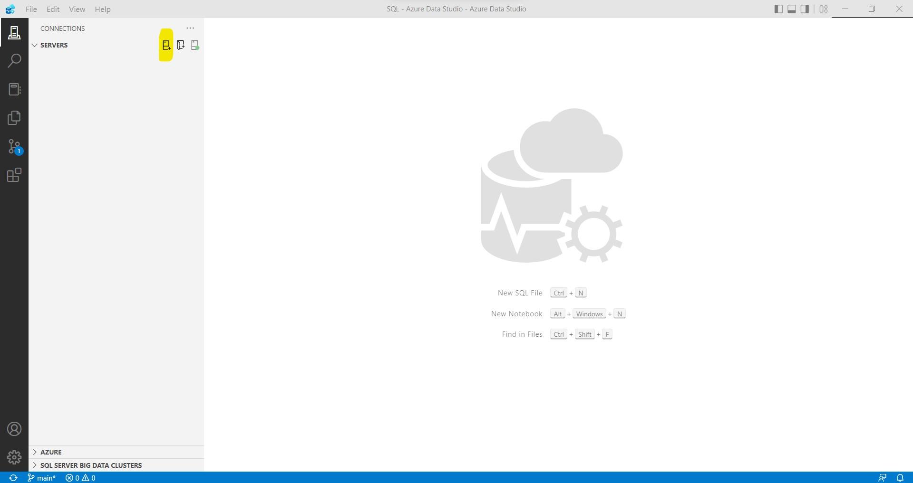
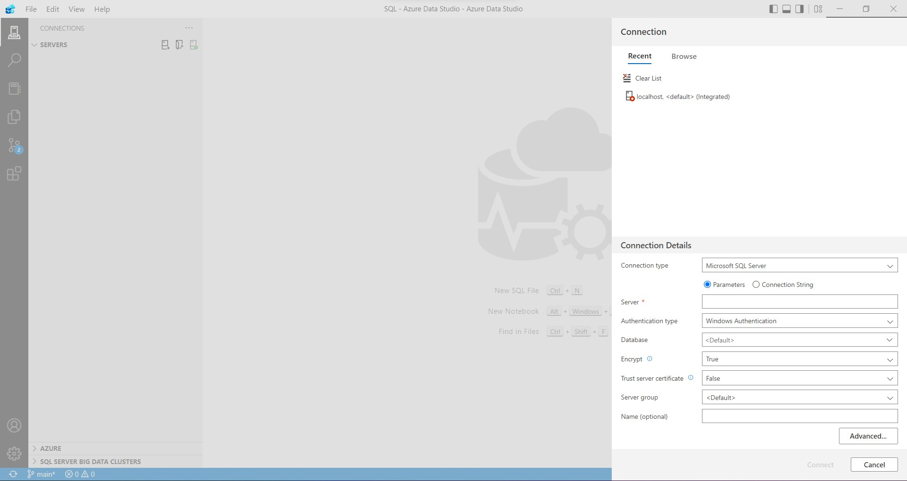
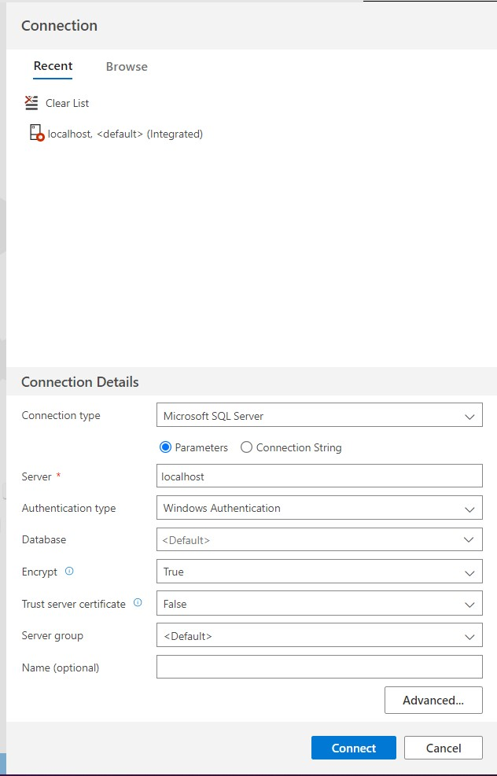
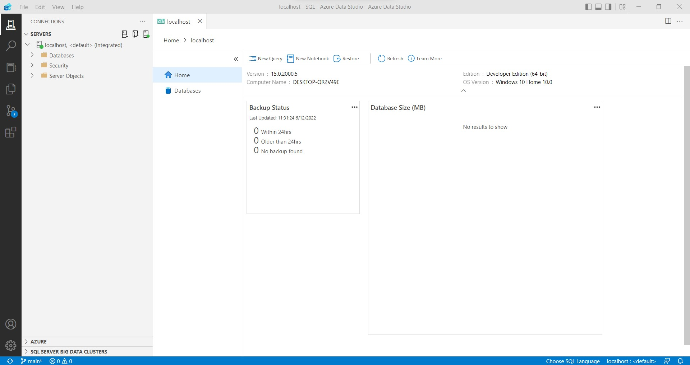
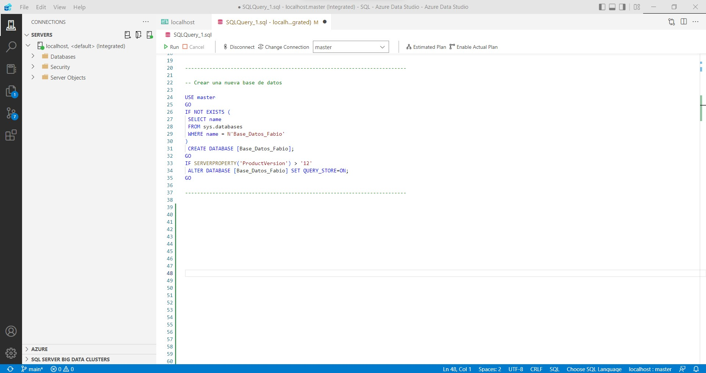
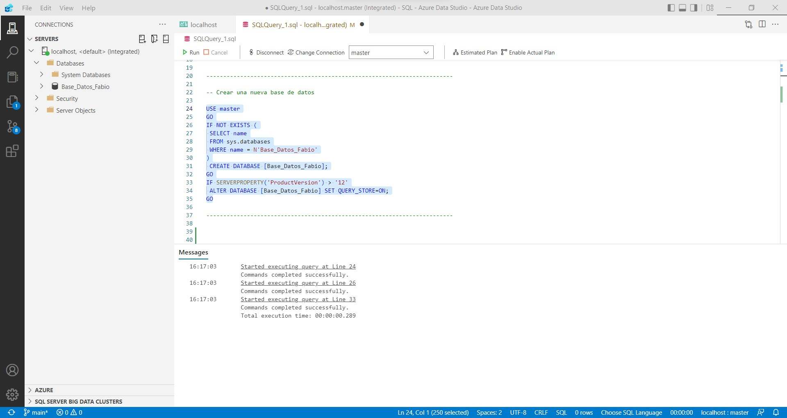
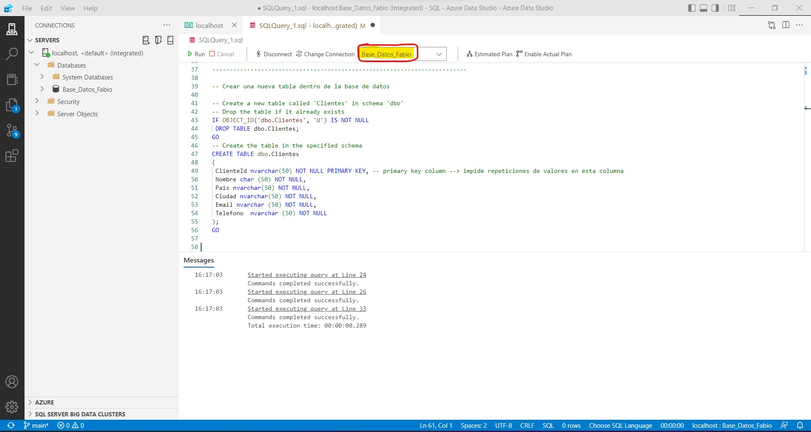
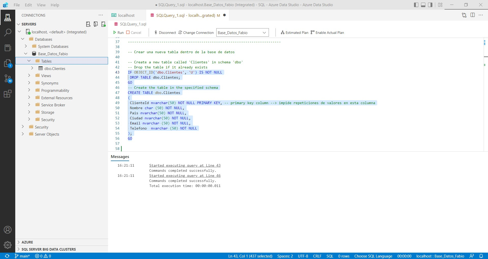
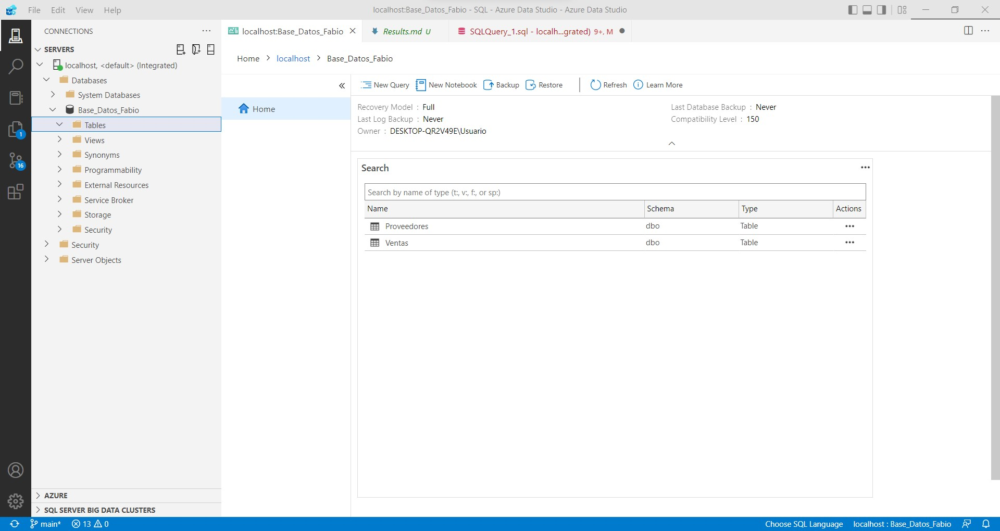

<div>
<style scoped>
    .dataframe tbody tr th:only-of-type {
        vertical-align: middle;
    }

    .dataframe tbody tr th {
        vertical-align: top;
    }

    .dataframe thead th {
        text-align: right;
    }
    
 
    table {
     display: block;
     overflow-x: auto;
     border-collapse: collapse;
     border-spacing: 0;
     border: 0px solid;
     color: var(--jp-ui-font-color1);
     font-size: 14px;
     margin-left: auto;
     margin-right: auto;
     
            }
            
</style>


>Más articulos en     [Estadistica4all](https://fabioscielzoortiz.github.io/Estadistica4all.github.io/)

***Se recomienda abrir el artículo en un ordenador o en una tablet.***
 
 
<br>

# Instalación de Azure Data Studio <a class="anchor" id="1"></a>


Primero hay que descargar Azure Data Studio. Ello puede hacerse facilmente desde el siguiente [link](https://learn.microsoft.com/es-es/sql/azure-data-studio/download-azure-data-studio?view=sql-server-ver16) 

También es necesario descargar SQL Server 2019 Developer Edition. Lo podemos hacer desde el siguiente [link](https://www.microsoft.com/es-es/sql-server/sql-server-downloads?rtc=1)


Una vez que hemos instalado correctamente ambos programas, abrilos Azure Data Studio.

Nos encontraremos una pantalla similar a la siguiente. 

<center>

{width="95%"}

</center> 
 
 
Debemos establecer una conexión con un servidor para poder trabajar con bases de datos. En nuestro caso será un servidor alojado en local en nuestro propio ordinador. Para establecer la conexion debemos pinchar en la parte subrayada de amarillo.

Tras pulsar ahi nos encontraremos con una pantalla similar a la siguiente:

<center>

{width="95%"}

</center> 
 


Debemos rellenar el campo Server con "localhost", tal y como se muestra en la siguiente imagen:


<center>

{width="95%"}

</center> 


Posteriormente saldrá un mensaje como este. Le daos al boton azul (Enable Trust server certificate):

<center>

{width="95%"}

</center> 


Si se ha conectado correctamente al servidor en la pantalla debe aparecer algo similar a lo siguiente:


<center>

{width="95%"}

</center> 


Pinchando en New Query se abrirá un script de SQL donde podemos empezar a trabajar usando sentencias de SQL.


<br>


# Crear una nueva base de datos en Azure Data Studio


Vamos a crear una nueva base de datos llamada Base_Datos_Fabio:

<center>

{width="95%"}

</center> 

El codigo empleado en la imagen para crear una nueva base de datos es el siguiente:


```sql
-- Crear una nueva base de datos

USE master
GO
IF NOT EXISTS (
 SELECT name
 FROM sys.databases
 WHERE name = N'Base_Datos_Fabio'
)
 CREATE DATABASE [Base_Datos_Fabio];
GO
IF SERVERPROPERTY('ProductVersion') > '12'
 ALTER DATABASE [Base_Datos_Fabio] SET QUERY_STORE=ON;
GO
```


Tras la ejecución del codigo SQL anterior se deberia crear la base de datos, y ello deberia reflejarase en la parte izquierda del entorno, tal y como se muestra en la imagen:

<center>

{width="95%"}

</center> 


<br>

# Crear una nueva tabla en una base de datos en Azure Data Studio

Ahora vamos a crear una nueva tabla dentro de la base de datos que acabamos de crear. Para ello se puede usar el mismo script de SQL pero modificando el elemento señalado en la parte superior de la pantalla. Este elemento permite fijar en que base de datos vamos a realizar los cambios. En este caso seleccionamos la base de datos Base_Datos_Fabio, que es la que hemos creado en el paso anterior.

<center>

{width="95%"}

</center> 

El codigo utilizado para crear la nueva tabla es el siguiente:

```SQL
-- Crear una nueva tabla dentro de la base de datos

-- Create a new table called 'Clientes' in schema 'dbo'
-- Drop the table if it already exists
IF OBJECT_ID('dbo.Clientes', 'U') IS NOT NULL
 DROP TABLE dbo.Clientes;
GO
-- Create the table in the specified schema
CREATE TABLE dbo.Clientes
(
 ClienteId nvarchar(50) NOT NULL PRIMARY KEY, -- primary key column --> impide repeticiones de valores en esta columna
 Nombre char (50) NOT NULL,
 Pais nvarchar(50) NOT NULL,
 Ciudad nvarchar(50) NOT NULL,
 Email nvarchar (50) NOT NULL,
 Telefono  nvarchar (50) NOT NULL
);
GO
```


Ejecutamos el codigo anterior y verificamos que se ha creado la tabla Clientes dentro de la base de datos Base_Datos_Fabio:

<center>

{width="95%"}

</center> 


A partir de ahora todas las operaciones que hagamos usando codigo SQL serán ejecutadas desde un script de SQL dentro del entorno Azure Data Studio, pero no se van a mostrar más capturas de pantalla sobre ello. Lo que haremos es mostrar el codigo que se debe ejecutar en cada ocasión y las salidas obtenidas tras su ejecución.


Vamos a crear otras dos tablas más (proveedores y ventas) dentro de la base de datos Base_Datos_Fabio.

El codigo empleado para crearlas es el siguiente:

```SQL
IF OBJECT_ID('dbo.Proveedores', 'U') IS NOT NULL
 DROP TABLE dbo.Proveedores;
GO
-- Create the table in the specified schema
CREATE TABLE dbo.Proveedores
(
 ProveedorId nvarchar (50) NOT NULL PRIMARY KEY, -- primary key column
 Nombre nvarchar (50) NOT NULL,
 Email nvarchar(50) NOT NULL,
 Telefono nvarchar (50) NOT NULL
);
GO
```


```SQL
IF OBJECT_ID('dbo.Ventas', 'U') IS NOT NULL
 DROP TABLE dbo.Ventas;
GO
-- Create the table in the specified schema
CREATE TABLE dbo.Ventas
(
 VentasId nvarchar (50) NOT NULL PRIMARY KEY, -- primary key column
 Producto char (50) NOT NULL,
 Precio float (50) NOT NULL,
 Cliente nvarchar (50) NOT NULL,
 Proveedor  nvarchar (50) NOT NULL
);
GO
```

<br>

## Tipos de datos

Algunos de los tipos de datos que pueden utilizarse al crear una tabla son los siguientes:

-- char(n) --> n caracteres fijos
-- varchar(n) --> n caracteres variables
-- nvarchar(n) --> cadena alfanumerica con n elementos variables
-- numeric(n, h) --> numero de n cifras con h decimales
-- int --> entero
-- float --> real
-- data --> fecha

<br>

## Clave primaria 

La sentencia **PRIMARY KEY** se asocia a las columnas que son  identificadores únicos principales.

La sentencia PRIMARY KEY asociada en una columna impide que haya valores repetidos en esa columna.

Este tipo de columnas son fundamentales en las bases de datos puesto que permitirán unir tablas mediante diferentes operaciones que se verán mas adelante.

<br>

## Not Null y Null

La sentencia NOT NULL asociada en una columna  impide que esta tenga valores nulos. 

La sentencia NULL asociada en una columna permite que esta tenga valores nulos.


<br>


# Insertar filas en una tabla

```SQL
-- Insert rows into table 'Clientes'
INSERT INTO dbo.Clientes
 ([ClienteId], [Nombre], [Pais], [Ciudad], [Email], [Telefono])
VALUES
 ( 'C1', N'Orlando', N'Australia', N'', N'' , N'917755028'),
 ( 'C2', N'Keith', N'India', N'', N'keith0@adventure-works.com', N''),
 ( 'C3', N'Donna', N'Germany', N'Berlin', N'donna0@adventure-works.com', N'915547890'),
 ( 'C4', N'Janet', N'United States', N'California',  N'janet1@adventure-works.com', N''),
 ( 'C5', N'Fabio', N'España', N'Madrid', N'fabio@gmail.com', N'')
GO
```

|ClienteId|Nombre|Pais|Ciudad|Email|Telefono|
|---|---|---|---|---|---|
|C1|Orlando                                           |Australia|||917755028|
|C2|Keith                                             |India||keith0@adventure-works.com||
|C3|Donna                                             |Germany|Berlin|donna0@adventure-works.com|915547890|
|C4|Janet                                             |United States|California|janet1@adventure-works.com||
|C5|Fabio                                             |Espa&#241;a|Madrid|fabio@gmail.com||

<br>

```SQL
-- Insert rows into table 'Ventas'
INSERT INTO dbo.Ventas
 ([VentasId], [Producto], [Precio], [Cliente], [Proveedor])
VALUES
 ( 'V1', N'Alfombra', N'1500', N'C2' , N'P1'),
 ( 'V2', N'Killim', N'699.50', N'C3', N'P1'),
 ( 'V3', N'Killim', N'475', N'C2', N'P3')
GO
```
|VentasId|Producto|Precio|Cliente|Proveedor|
|---|---|---|---|---|
|V1|Alfombra                                          |1500|C2|P1|
|V2|Killim                                            |699,5|C3|P1|
|V3|Killim                                            |475|C2|P3|


<br>

```SQL
-- Insert rows into table 'Proveedores'
INSERT INTO dbo.Proveedores
 ([ProveedorId], [Nombre], [Email], [Telefono])
VALUES
 ( 'P1', N'Intertrade', N'Intertrade@gmail.com', N'912223344'),
 ( 'P2', N'SaidKarpet', N'SaidKarpet@gmail.com', N'912783794'),
 ( 'P3', N'OrientKillim', N'OrientKillim@gmail.com', N'9100155475')
GO
```

|ProveedorId|Nombre|Email|Telefono|
|---|---|---|---|
|P1|Intertrade|Intertrade@gmail.com|912223344|
|P2|SaidKarpet|SaidKarpet@gmail.com|912783794|
|P3|OrientKillim|OrientKillim@gmail.com|9100155475|


<br>

## Comprobación de la restricción PRIMARY KEY

```SQL
INSERT INTO dbo.Proveedores
 ([ProveedorId], [Nombre], [Email], [Telefono])
VALUES
 ( 'P3' , 'AlfombrasSA', N'AlfombrasSA@gmail.com', N'91235344')
GO
```
```
Infracción de la restricción PRIMARY KEY 'PK__Proveedo__61266A5981C729E1'. No se puede insertar una clave duplicada en el objeto 'dbo.Proveedores'. El valor de la clave duplicada es (P3).
```


## Comprobación de la restricción NOT NULL


```SQL
INSERT INTO dbo.Proveedores
 ([ProveedorId], [Nombre], [Email], [Telefono])
VALUES
 ( 'P4' , NULL, N'AlfombrasSA@gmail.com', N'91235344')
GO
```
```
No se puede insertar el valor NULL en la columna 'Nombre', tabla 'Base_Datos_Fabio.dbo.Proveedores'. La columna no admite valores NULL. Error de INSERT.
```

<br>


# Vista completa de una tabla


```SQL
SELECT * FROM dbo.Clientes;
```

|ClienteId|Nombre|Pais|Ciudad|Email|Telefono|
|---|---|---|---|---|---|
|C1|Orlando                                           |Australia|||917755028|
|C2|Keith                                             |India||keith0@adventure-works.com||
|C3|Donna                                             |Germany|Berlin|donna0@adventure-works.com|915547890|
|C4|Janet                                             |United States|California|janet1@adventure-works.com||
|C5|Fabio                                             |Espa&#241;a|Madrid|fabio@gmail.com||

<br>


# Filtrar filas de una tabla

```SQL
SELECT * FROM dbo.Clientes WHERE Nombre = 'Fabio' ;
```
|ClienteId|Nombre|Pais|Ciudad|Email|Telefono|
|---|---|---|---|---|---|
|C5|Fabio                                             |Espa&#241;a|Madrid|fabio@gmail.com||

<br>


```SQL
SELECT * FROM dbo.Clientes WHERE Nombre != 'Fabio' ;
```

|ClienteId|Nombre|Pais|Ciudad|Email|Telefono|
|---|---|---|---|---|---|
|C1|Orlando                                           |Australia|||917755028|
|C2|Keith                                             |India||keith0@adventure-works.com||
|C3|Donna                                             |Germany|Berlin|donna0@adventure-works.com|915547890|
|C4|Janet                                             |United States|California|janet1@adventure-works.com||

<br>

```SQL
SELECT * FROM dbo.Ventas WHERE Precio < 500 ;
```

|VentasId|Producto|Precio|Cliente|Proveedor|
|---|---|---|---|---|
|V3|Killim                                            |475|C2|P3|


<br>


```SQL
SELECT * FROM dbo.Ventas WHERE Precio < 2000 AND Precio > 500 ;
```
|VentasId|Producto|Precio|Cliente|Proveedor|
|---|---|---|---|---|
|V1|Alfombra                                          |1500|C2|P1|
|V2|Killim                                            |699,5|C3|P1|


<br>


```SQL
SELECT * FROM dbo.Ventas WHERE Precio <= 2000 OR Precio > 500 ;
```
|VentasId|Producto|Precio|Cliente|Proveedor|
|---|---|---|---|---|
|V1|Alfombra                                          |1500|C2|P1|
|V2|Killim                                            |699,5|C3|P1|
|V3|Killim                                            |475|C2|P3|


<br>


```SQL
SELECT Nombre , Email  FROM dbo.Proveedores WHERE Email = 'Intertrade@gmail.com' ;
```
|Nombre|Email|
|---|---|
|Intertrade|Intertrade@gmail.com|


<br>

```SQL
SELECT Producto , Cliente, Proveedor FROM dbo.Ventas WHERE Precio < 2000 AND Precio > 500 ;
```

|Producto|Cliente|Proveedor|
|---|---|---|
|Alfombra                                          |C2|P1|
|Killim                                            |C3|P1|


<br>

```SQL
SELECT*FROM Clientes WHERE Nombre is NOT NULL
```
|ClienteId|Nombre|Pais|Ciudad|Email|Telefono|
|---|---|---|---|---|---|
|C1|Orlando                                           |Australia|||917755028|
|C2|Keith                                             |India||keith0@adventure-works.com||
|C3|Donna                                             |Germany|Berlin|donna0@adventure-works.com|915547890|
|C4|Janet                                             |United States|California|janet1@adventure-works.com||
|C5|Fabio                                             |Espa&#241;a|Madrid|fabio@gmail.com||

<br>

```SQL
SELECT*FROM Clientes WHERE Nombre is NULL
```
|ClienteId|Nombre|Pais|Ciudad|Email|Telefono|
|---|---|---|---|---|---|


<br>


```SQL
SELECT * FROM dbo.Clientes WHERE Nombre in ( 'Orlando' , 'Fabio') ;
```

|ClienteId|Nombre|Pais|Ciudad|Email|Telefono|
|---|---|---|---|---|---|
|C1|Orlando                                           |Australia|||917755028|
|C5|Fabio                                             |Espa&#241;a|Madrid|fabio@gmail.com||


```SQL
SELECT * FROM dbo.Clientes WHERE Nombre not in ( 'Orlando' , 'Fabio') ;
```

|ClienteId|Nombre|Pais|Ciudad|Email|Telefono|
|---|---|---|---|---|---|
|C2|Keith                                             |India||keith0@adventure-works.com||
|C3|Donna                                             |Germany|Berlin|donna0@adventure-works.com|915547890|
|C4|Janet                                             |United States|California|janet1@adventure-works.com||


# Eliminar filas de una tabla

```SQL
DELETE from Ventas
```

|VentasId|Producto|Precio|Cliente|Proveedor|
|---|---|---|---|---|


<br>


```SQL
Delete from Clientes WHERE Nombre = 'Fabio'
```

|ClienteId|Nombre|Pais|Ciudad|Email|Telefono|
|---|---|---|---|---|---|
|C1|Orlando                                           |Australia|||917755028|
|C2|Keith                                             |India||keith0@adventure-works.com||
|C3|Donna                                             |Germany|Berlin|donna0@adventure-works.com|915547890|
|C4|Janet                                             |United States|California|janet1@adventure-works.com||


<br>

# Eliminar una tabla


```SQL
DROP TABLE Clientes 
```


<center>

{width="95%"}

</center> 

 


<br>


# Actualizar columnas de una table

Primero volvemos a cargar las tablas Ventas y Clientes para recuperar su estado original, puesto que hemos eliminado todas las filas de Ventas y una de Clientes.


Una vez hecho lo anterior, continuamos.


```SQL
UPDATE Clientes set Nombre = 'Pedrito' WHERE ClienteId = 'C1'
```


|ClienteId|Nombre|Pais|Ciudad|Email|Telefono|
|---|---|---|---|---|---|
|C1|Pedrito                                           |Australia|||917755028|
|C2|Keith                                             |India||keith0@adventure-works.com||
|C3|Donna                                             |Germany|Berlin|donna0@adventure-works.com|915547890|
|C4|Janet                                             |United States|California|janet1@adventure-works.com||
|C5|Fabio                                             |Espa&#241;a|Madrid|fabio@gmail.com||

<br>

```SQL
UPDATE Clientes set Nombre = 'Pedrito' , Pais = 'Ecuador' WHERE ClienteId = 'C1'

```
|ClienteId|Nombre|Pais|Ciudad|Email|Telefono|
|---|---|---|---|---|---|
|C1|Pedrito                                           |Ecuador|||917755028|
|C2|Keith                                             |India||keith0@adventure-works.com||
|C3|Donna                                             |Germany|Berlin|donna0@adventure-works.com|915547890|
|C4|Janet                                             |United States|California|janet1@adventure-works.com||
|C5|Fabio                                             |Espa&#241;a|Madrid|fabio@gmail.com||


<br>


## Fijar un valor por defecto para una columna


```SQL
IF OBJECT_ID('dbo.Tabla_Prueba', 'U') IS NOT NULL
 DROP TABLE dbo.Tabla_Prueba;
GO
-- Create the table in the specified schema
CREATE TABLE dbo.Tabla_Prueba
(
 Id nvarchar (50) NOT NULL PRIMARY KEY, -- primary key column
 Nombre nvarchar (50) NOT NULL,
 Email nvarchar(50) NOT NULL DEFAULT 'desconocido',
 Telefono nvarchar (50) NOT NULL DEFAULT '-------'
);
GO
```

```SQL
INSERT INTO dbo.Tabla_Prueba
 ([Id], [Nombre], [Email], [Telefono])
VALUES
 ( 1 , 'Juan', DEFAULT , DEFAULT)
GO
```


|Id|Nombre|Email|Telefono|
|---|---|---|---|
|1|Juan|desconocido|-------|


# Columnas calculadas a partir de otras

```SQL
IF OBJECT_ID('dbo.Ventas', 'U') IS NOT NULL
 DROP TABLE dbo.Ventas;
GO
-- Create the table in the specified schema
CREATE TABLE dbo.Ventas
(
 VentasId nvarchar (50) NOT NULL PRIMARY KEY, -- primary key column
 Producto char (50) NOT NULL,
 Precio float (50) NOT NULL,
 Descuento float (50) NOT NULL,
 Cliente nvarchar (50) NOT NULL,
 Proveedor  nvarchar (50) NOT NULL
);
GO

-- Insert rows
INSERT INTO dbo.Ventas
 ([VentasId], [Producto], [Precio], [Descuento], [Cliente], [Proveedor])
VALUES
 ( 'V1', 'Alfombra', 1500, 0.5 ,'C2' , 'P1'),
 ( 'V2', 'Killim', 699.50, 0.25, 'C3', 'P1'),
 ( 'V3', 'Killim', 475, 0.10, 'C2', 'P3')
GO
```


|VentasId|Producto|Precio|Descuento|Cliente|Proveedor|
|---|---|---|---|---|---|
|V1|Alfombra                                          |1500|0,5|C2|P1|
|V2|Killim                                            |699,5|0,25|C3|P1|
|V3|Killim                                            |475|0,1|C2|P3|


<br>

```SQL
SELECT VentasId, Producto, Precio, Descuento, 'Precio_Final' = Precio - Precio*Descuento, Cliente, Proveedor FROM Ventas
```

|VentasId|Producto|Precio|Descuento|Precio_Final|Cliente|Proveedor|
|---|---|---|---|---|---|---|
|V1|Alfombra                                          |1500|0,5|750|C2|P1|
|V2|Killim                                            |699,5|0,25|524,625|C3|P1|
|V3|Killim                                            |475|0,1|427,5|C2|P3|


<br>


# Concatenar strings de filas distintas

```SQL
SELECT 'nueva_columna' = Pais + ' - ' + Ciudad  FROM Clientes
```

|nueva_columna|
|---|
|Australia - |
|India - |
|Germany - Berlin|
|United States - California|
|España - Madrid|


<br>

# Ordenar tabla por columnas

```SQL
SELECT*FROM Ventas ORDER BY Precio ASC
```
|VentasId|Producto|Precio|Descuento|Cliente|Proveedor|
|---|---|---|---|---|---|
|V3|Killim                                            |475|0,1|C2|P3|
|V2|Killim                                            |699,5|0,25|C3|P1|
|V1|Alfombra                                          |1500|0,5|C2|P1|

<br>

```SQL
SELECT*FROM Ventas ORDER BY Precio DESC
```

|VentasId|Producto|Precio|Descuento|Cliente|Proveedor|
|---|---|---|---|---|---|
|V1|Alfombra                                          |1500|0,5|C2|P1|
|V2|Killim                                            |699,5|0,25|C3|P1|
|V3|Killim                                            |475|0,1|C2|P3|


<br>


# Seleccionar filas por strings con Like y Not Like


```SQL
SELECT * FROM dbo.Clientes WHERE Nombre like '%lan%' ;
```
|ClienteId|Nombre|Pais|Ciudad|Email|Telefono|
|---|---|---|---|---|---|
|C1|Orlando                                           |Australia|||917755028|


```SQL
SELECT * FROM dbo.Clientes WHERE Nombre like '%i%' ;
```
|ClienteId|Nombre|Pais|Ciudad|Email|Telefono|
|---|---|---|---|---|---|
|C2|Keith                                             |India||keith0@adventure-works.com||
|C5|Fabio                                             |Espa&#241;a|Madrid|fabio@gmail.com||


```SQL
SELECT * FROM dbo.Clientes WHERE Nombre not like '%i%' ;
```

|ClienteId|Nombre|Pais|Ciudad|Email|Telefono|
|---|---|---|---|---|---|
|C1|Orlando                                           |Australia|||917755028|
|C3|Donna                                             |Germany|Berlin|donna0@adventure-works.com|915547890|
|C4|Janet                                             |United States|California|janet1@adventure-works.com||


```SQL
SELECT * FROM dbo.Clientes WHERE Nombre like 'o%' ; -- empieza por 'o'
```
|ClienteId|Nombre|Pais|Ciudad|Email|Telefono|
|---|---|---|---|---|---|
|C1|Orlando                                           |Australia|||917755028|


```SQL
SELECT * FROM dbo.Clientes WHERE Nombre like '%o' ; -- acaba por 'o'
```
|ClienteId|Nombre|Pais|Ciudad|Email|Telefono|
|---|---|---|---|---|---|
|C1|Orlando                                           |Australia|||917755028|
|C5|Fabio                                             |Espa&#241;a|Madrid|fabio@gmail.com||


<br>


```SQL
SELECT * FROM dbo.Clientes WHERE Nombre like '%lan%o' ; -- contiene 'lan' y acaba por 'o'
```
|ClienteId|Nombre|Pais|Ciudad|Email|Telefono|
|---|---|---|---|---|---|
|C1|Orlando                                           |Australia|||917755028|


<br>


```SQL
SELECT * FROM dbo.Clientes WHERE Nombre like '%b%o' ; -- contiene 'b' y acaba por 'o'
```
|ClienteId|Nombre|Pais|Ciudad|Email|Telefono|
|---|---|---|---|---|---|
|C5|Fabio                                             |Espa&#241;a|Madrid|fabio@gmail.com||


<br>


```SQL
SELECT * FROM dbo.Clientes WHERE Nombre like '%F____' ; -- empieza por 'F' seguida de 4 caracteres
```

|ClienteId|Nombre|Pais|Ciudad|Email|Telefono|
|---|---|---|---|---|---|
|C5|Fabio                                             |Espa&#241;a|Madrid|fabio@gmail.com||


```SQL
SELECT * FROM dbo.Clientes WHERE Nombre like '%F__' ; -- empieza por 'F' seguida de 2 caracteres
```

|ClienteId|Nombre|Pais|Ciudad|Email|Telefono|
|---|---|---|---|---|---|


```SQL

```


```SQL

```


