--- 
title: "Introducción a SQL en Azure Data Studio"
author: "Fabio Scielzo Ortiz"
date: "`r Sys.Date()`"
site: bookdown::bookdown_site
documentclass: book
bibliography: book.bib
description: |
  Este artículo es una introducción a SQL en Azure Data Studio.
link-citations: yes
github-repo: "rstudio/bookdown-demo"
---

# Introducción 


<center>

{width="45%"}

</center>


<br>


<div class="warning" style='background-color:#FCF2EC; color: #000000; border-left: solid #FE9554 7px; border-radius: 3px; size:1px ; padding:0.1em;'>
<span>
 
<p style='margin-left:10em;'>


- **More articles:    $\hspace{0.1cm}$ [Estadistica4all](https://fabioscielzoortiz.github.io/Estadistica4all.github.io/)**

- **Author:** $\hspace{0.1cm}$ [Fabio Scielzo Ortiz](https://estadistica4all.com/creador.html)

- **If you use this article, please cite it:**

$\hspace{0.5cm}$ Scielzo Ortiz, F. (2023). Introducción a Pandas. Estadistica4all. 


- ***It is recommended to open the article on a computer or tablet.***

</p>
 
</p></span>
</div>


 <br>
 
 
Este artículo es una introducción a SQL en Azure Data Studio.
 
 
 <br>
 

# Instalación de Azure Data Studio  

<br>

- First, we need to download Azure Data Studio. It can be done easily from the following [link](https://learn.microsoft.com/es-es/sql/azure-data-studio/download-azure-data-studio?view=sql-server-ver16)

- You also need to download SQL Server 2019 Developer Edition. We can do that from the following [link](https://www.microsoft.com/es-es/sql-server/sql-server-downloads?rtc=1).


- Once we have successfully installed both programs, we open Azure Data Studio.

 

    We will find a screen similar to the following:

<center>

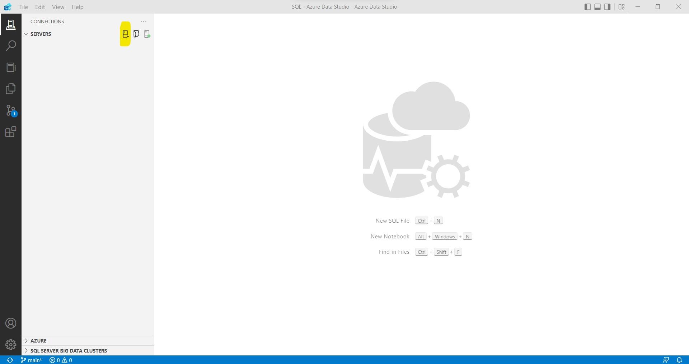{width="100%"}

</center> 
 
<br>

- We must establish a connection with the server, to be able to work with databases. In our case it will be a server hosted on our local computer. To establish the connection we must click on the yellow part.

    After clicking on it, we will find a screen similar to the following:

<center>

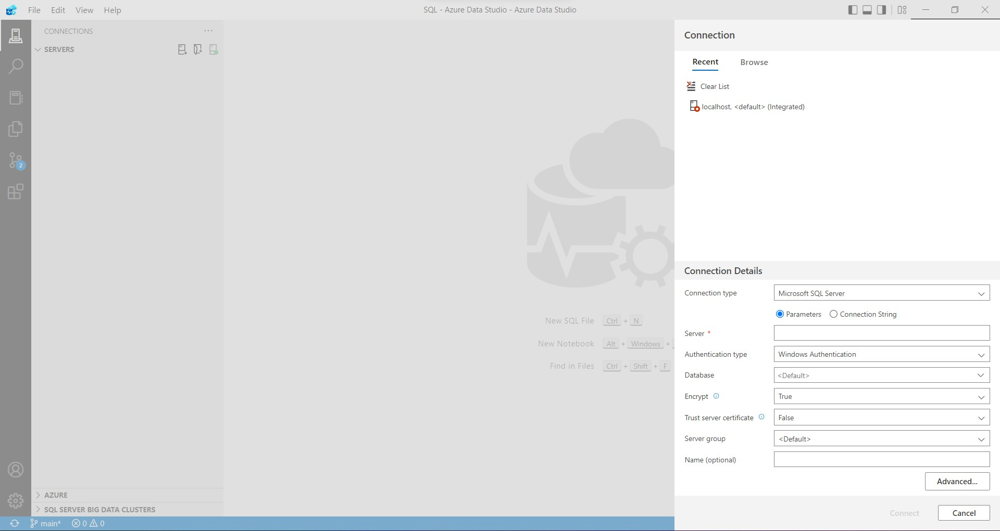{width="100%"}

</center> 
 

<br>

- We must fill the Server field with "localhost", as shown in the following image:


<center>

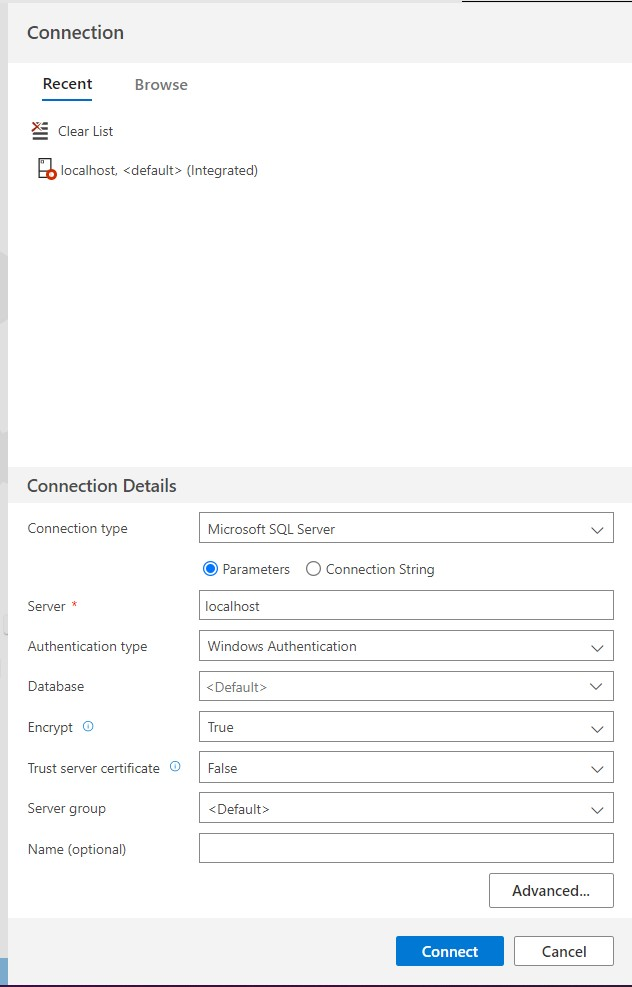{width="50%"}

</center> 


<br>

- Then a message like this will be displayed. We click on the blue button (Enable trusted server certificate):

<center>

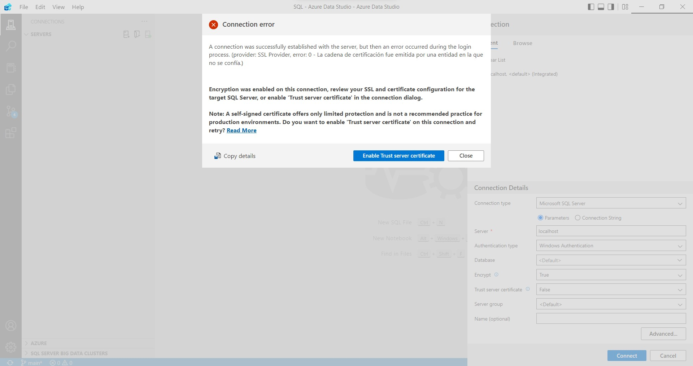{width="100%"}

</center> 


<br>

- If the server has connected successfully, the screen will show something like this:


<center>

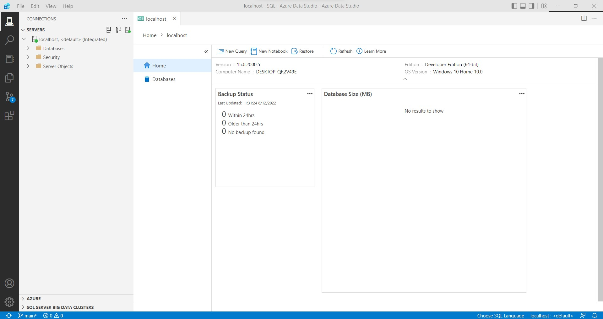{width="100%"}

</center> 


<br>


- Clicking on New Query, It will open an SQL script where we can start working with SQL.

 

<br>


# Create a database

<br>

- We are going to create a new database, which will be called **Fabio_Database**:


<center>

{width="100%"}

</center> 


<br>

The code used to create the new database is the following:


```sql
USE master
GO
IF NOT EXISTS (
 SELECT name
 FROM sys.databases
 WHERE name = N'Base_Datos_Fabio'
)
 CREATE DATABASE [Base_Datos_Fabio];
GO
IF SERVERPROPERTY('ProductVersion') > '12'
 ALTER DATABASE [Base_Datos_Fabio] SET QUERY_STORE=ON;
GO
```

<br>

After the execution of the above SQL code, the database should be created, and it should appear on the left side of the environment, as shown in the following image:

 
<center>

{width="100%"}

</center> 


<br>


# Delete a database

We can delete a database as follows:

```sql
-- Drop the database 'Base_Datos_Fabio'
-- Connect to the 'master' database to run this snippet
USE master
GO
-- Uncomment the ALTER DATABASE statement below to set the database to SINGLE_USER mode if the drop database command fails because the database is in use.
ALTER DATABASE Base_Datos_Fabio SET SINGLE_USER WITH ROLLBACK IMMEDIATE;
-- Drop the database if it exists
IF EXISTS (
  SELECT [name]
   FROM sys.databases
   WHERE [name] = N'Base_Datos_Fabio'
)
DROP DATABASE Base_Datos_Fabio
GO
```


<br>


# Create a table

Now we are going to create a new table inside the database that we have just defined.

To do this, the same SQL script can be used but modifying the element indicated at the top of the screen. This element allows us to set the database in which we are going to make the changes.

In this case we select the database **Base_Datos_Fabio**, which is the one we created in the previous step.

<center>

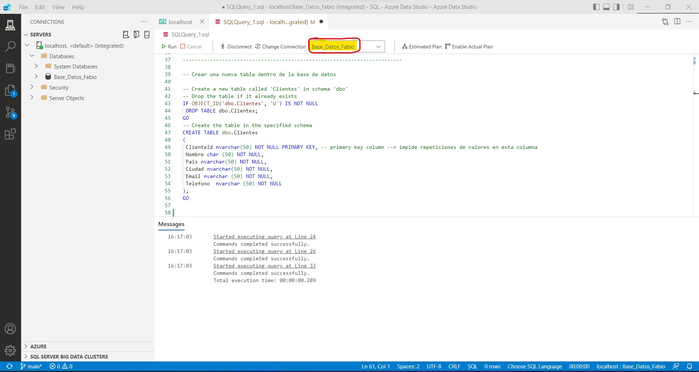{width="100%"}

</center> 

<br>

The code used to create the new table is the following:

```sql
-- Create a new table called 'Alumnos' in schema 'dbo'
-- Drop the table if it already exists
IF OBJECT_ID('dbo.Alumnos', 'U') IS NOT NULL
 DROP TABLE dbo.Alumnos;
GO
-- Create the table in the specified schema
CREATE TABLE dbo.Alumnos
(
 ClienteId nvarchar(50) NOT NULL PRIMARY KEY, 
 Nombre char (50) NOT NULL,
 Pais nvarchar(50) NOT NULL,
 Ciudad nvarchar(50) NOT NULL,
 Email nvarchar (50) NOT NULL,
 Telefono  nvarchar (50) NOT NULL
);
GO
```

<br>

We execute the last code and check if the table **Alumnos** has been created inside **Database_Fabio**:
<center>

{width="100%"}

</center> 


<br>


From now on, all the operations we do with SQL code will be executed from a SQL script within the Azure Data Studio environment, but no more screenshots will be shown about it. 

What we will do is show the code that must be executed each time and the outputs that are obtained after its execution.


We are going to create two more tables (**Profesores** and **Examenes**) inside the database **Base_Datos_Fabio**.

The code used to create them is as follows:

```sql
IF OBJECT_ID('dbo.Profesores', 'U') IS NOT NULL
 DROP TABLE dbo.Profesores;
GO
-- Create the table in the specified schema
CREATE TABLE dbo.Profesores
(
 ProfesorId nvarchar (50) NOT NULL PRIMARY KEY, -- primary key column
 Nombre nvarchar (50) NOT NULL,
 Estudios nvarchar(50) NOT NULL,
 Email nvarchar(50) NOT NULL,
);
GO
```


```sql
IF OBJECT_ID('dbo.Examenes', 'U') IS NOT NULL
 DROP TABLE dbo.Examenes;
GO
-- Create the table in the specified schema
CREATE TABLE dbo.Examenes
(
 ExamenId nvarchar (50) NOT NULL PRIMARY KEY, -- primary key column
 Nota DECIMAL(5,2) NOT NULL,
 Asignatura nvarchar (50) NOT NULL,
 AlumnoID nvarchar (50) NOT NULL,
 ProfesorID  nvarchar (50) NOT NULL
);
GO
```

<br>

## Primary Key 

The **PRIMARY KEY** statement is associated with columns that are unique identifiers.

If the **PRIMARY KEY** statement is attached to a column, it prevents repeating values in that column.

These types of columns are essential in databases since they will allow joining tables through different operations that will be seen later.

<br>

## Not Null and Null

If the **NOT NULL** statement is associated with a column, it prevents this column from having null values.

If the **NULL** statement is associated with a column, it allows this column to have null values.


<br>


# Insert rows into a table

Inserting rows into **Alumnos** table:

```sql
INSERT INTO dbo.Alumnos
 ([AlumnoID], [Nombre], [Pais], [Ciudad], [Email], [Telefono])
VALUES
 ( 'A1', N'Orlando', N'Australia', N'', N'' , N'917755028'),
 ( 'A2', N'Keith', N'India', N'', N'keith0@adventure-works.com', N''),
 ( 'A3', N'Donna', N'Germany', N'Berlin', N'donna0@adventure-works.com', N'915547890'),
 ( 'A4', N'Janet', N'United States', N'California',  N'janet1@adventure-works.com', N''),
 ( 'A5', N'Fabio', N'España', N'Madrid', N'fabio10@gmail.com', N''),
 ( 'A6', N'Juan', N'España', N'Sevilla', N'' , N'915869028'),
 ( 'A7', N'Lucia', N'España', N'', N'LuciaPerez@hotmail.com', N''),
 ( 'A8', N'Pedro', N'Italia', N'Roma', N'Pedro99@gmail.com', N'910007890'),
 ( 'A9', N'Sergio', N'United States', N'New York',  N'sergio_as@gmail.com', N''),
 ( 'A10', N'Grecia', N'Peru', N'Lima', N'Grecia89@gmail.com', N''),
 ( 'A11', N'Ismael', N'España', N'Madrid', N'Isma98@gmail.com', N'912234543'),
 ( 'A12', N'Luis', N'España', N'Murcia', N'Luismiguel123@gmail.com', N''),
 ( 'A13', N'Pedro', N'Argentina', N'Buenos Aires', N'Pedro120@gmail.com', N'')
GO
```

|AlumnoID|Nombre|Pais|Ciudad|Email|Telefono|
|---|---|---|---|---|---|
|A1|Orlando                                           |Australia|||917755028|
|A10|Grecia                                            |Peru|Lima|Grecia89@gmail.com||
|A11|Ismael                                            |Espa&#241;a|Madrid|Isma98@gmail.com|912234543|
|A12|Luis                                              |Espa&#241;a|Murcia|Luismiguel123@gmail.com||
|A13|Pedro                                             |Argentina|Buenos Aires|Pedro120@gmail.com||
|A2|Keith                                             |India||keith0@adventure-works.com||
|A3|Donna                                             |Germany|Berlin|donna0@adventure-works.com|915547890|
|A4|Janet                                             |United States|California|janet1@adventure-works.com||
|A5|Fabio                                             |Espa&#241;a|Madrid|fabio10@gmail.com||
|A6|Juan                                              |Espa&#241;a|Sevilla||915869028|
|A7|Lucia                                             |Espa&#241;a||LuciaPerez@hotmail.com||
|A8|Pedro                                             |Italia|Roma|Pedro99@gmail.com|910007890|
|A9|Sergio                                            |United States|New York|sergio_as@gmail.com||


<br>

Inserting rows into **Profesores** table:


```sql
INSERT INTO dbo.Profesores
 ([ProfesorID], [Nombre], [Estudios], [Email])
VALUES
 ( 'P1', N'Juan', N'Matemáticas', N'JuanPerez@colegio.es'),
 ( 'P2', N'Sonia', N'Física', N'SoniDiaz@colegio.es'),
 ( 'P3', N'Lucia', N'Lengua', N'LuciaPerez@colegio.es'),
  ( 'P4', N'Marcos', N'Biología', N'MarcosSanz@colegio.es'),
 ( 'P5', N'Carlos', N'Educación Física', N'CarlosFernandez@colegio.es'),
 ( 'P6', N'Daniel', N'Geografía', N'DanielOrtiz@colegio.es'),
 ( 'P7', N'Garazi', N'Inglés', N'GaraziGarcia@colegio.es')
GO
```
|ProfesorID|Nombre|Estudios|Email|
|---|---|---|---|
|P1|Juan|Matem&#225;ticas|JuanPerez@colegio.es|
|P2|Sonia|F&#237;sica|SoniDiaz@colegio.es|
|P3|Lucia|Lengua|LuciaPerez@colegio.es|
|P4|Marcos|Biolog&#237;a|MarcosSanz@colegio.es|
|P5|Carlos|Educaci&#243;n F&#237;sica|CarlosFernandez@colegio.es|
|P6|Daniel|Geograf&#237;a|DanielOrtiz@colegio.es|
|P7|Garazi|Ingl&#233;s|GaraziGarcia@colegio.es|


<br>

Inserting rows into **Examenes** table:

```sql
INSERT INTO dbo.Examenes
 ([ExamenID], [Nota], [Asignatura], [AlumnoID], [ProfesorID])
VALUES
 ( 'E1', 6.7, N'Matemáticas', N'A2', N'P1'),
 ( 'E2', 8, N'Física', N'A4', N'P2'),
 ( 'E3', 4.25, N'Matemáticas', N'A1', N'P1'),
 ( 'E4', 6.5, N'Matemáticas', N'A7', N'P7'),
 ( 'E5', 7, N'Matemáticas', N'A9', N'P3')
GO
```

|ExamenID|Nota|Asignatura|AlumnoID|ProfesorID|
|---|---|---|---|---|
|E1|6.70|Matem&#225;ticas|A2|P1|
|E2|8.00|F&#237;sica|A4|P2|
|E3|4.25|Matem&#225;ticas|A1|P1|
|E4|6.50|Matem&#225;ticas|A7|P7|
|E5|7.00|Matem&#225;ticas|A9|P3|


<br>


## Cheking Primary Key restriction

```sql
INSERT INTO dbo.Profesores
 ([ProfesorID], [Nombre], [Estudios], [Email])
VALUES
 ( 'P1' , N'Juan', N'Filosofía', N'JuanDiaz@colegio.es')
GO
```

```
Infracción de la restricción PRIMARY KEY 'PK__Profesor__4DF3F028228525F7'. No se puede insertar una clave duplicada en el objeto 'dbo.Profesores'. El valor de la clave duplicada es (P1).
```

<br>


## Checking Not Null restriction


```sql
INSERT INTO dbo.Profesores
 ([ProfesorID], [Nombre], [Estudios], [Email])
VALUES
 ( 'P8' , NULL, N'Filosofía', N'JuanDiaz@colegio.es')
GO
```

```
No se puede insertar el valor NULL en la columna 'Nombre', tabla 'Base_Datos_Fabio.dbo.Profesores'. La columna no admite valores NULL. Error de INSERT.
```


<br>


# Import a CSV as table

First of all, we must intall the **SQL Server Import** Azure Data Studio extension. 


<center>

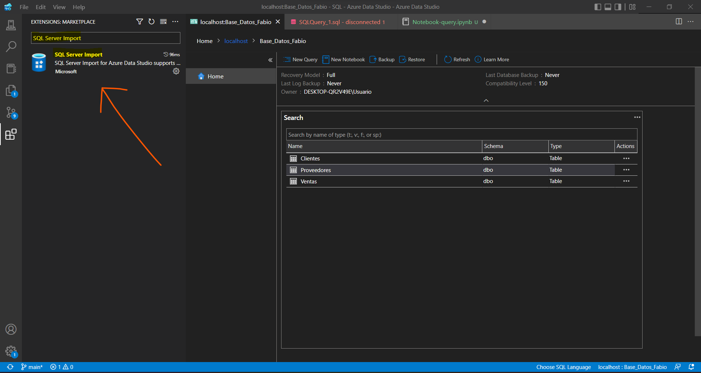{width="100%"}

</center> 


Next we import a CSV following the following steps:


<center>

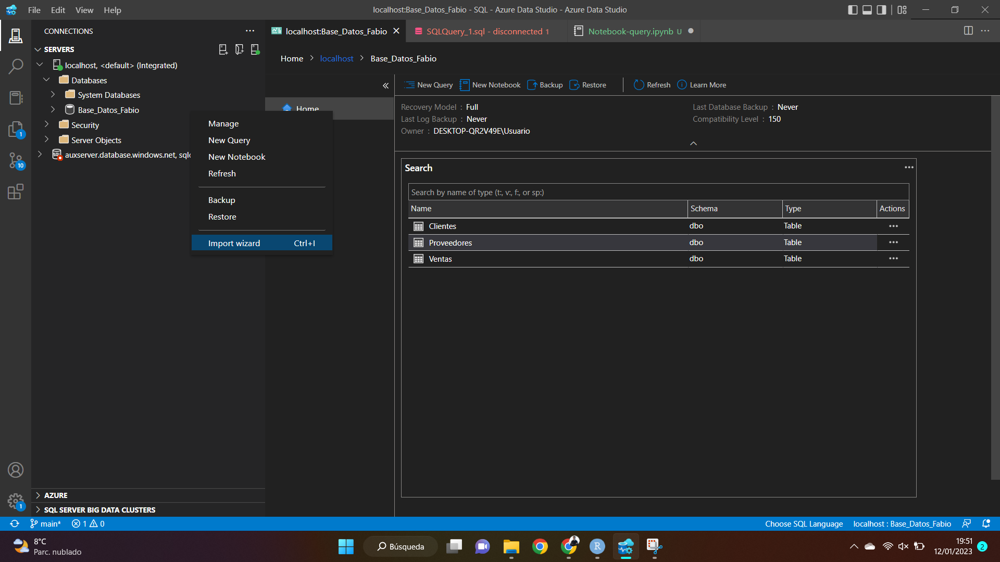{width="100%"}

</center> 


<center>

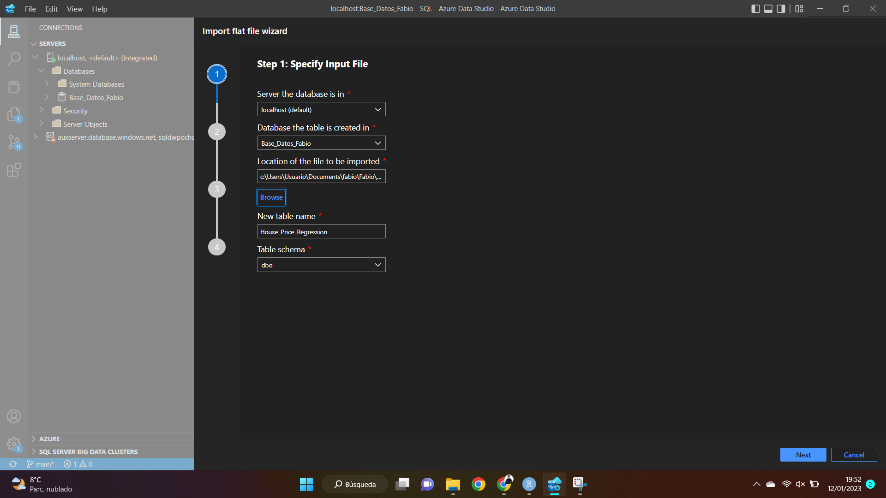{width="100%"}

</center> 


<center>

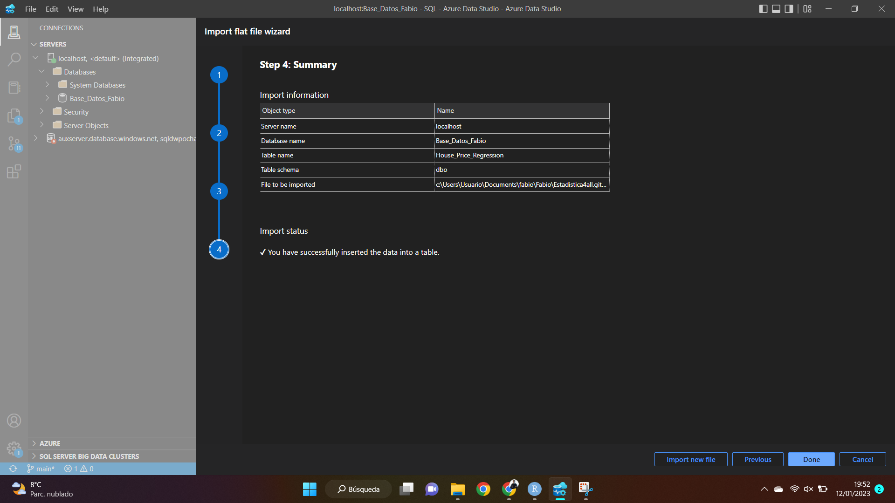{width="100%"}

</center> 


<center>

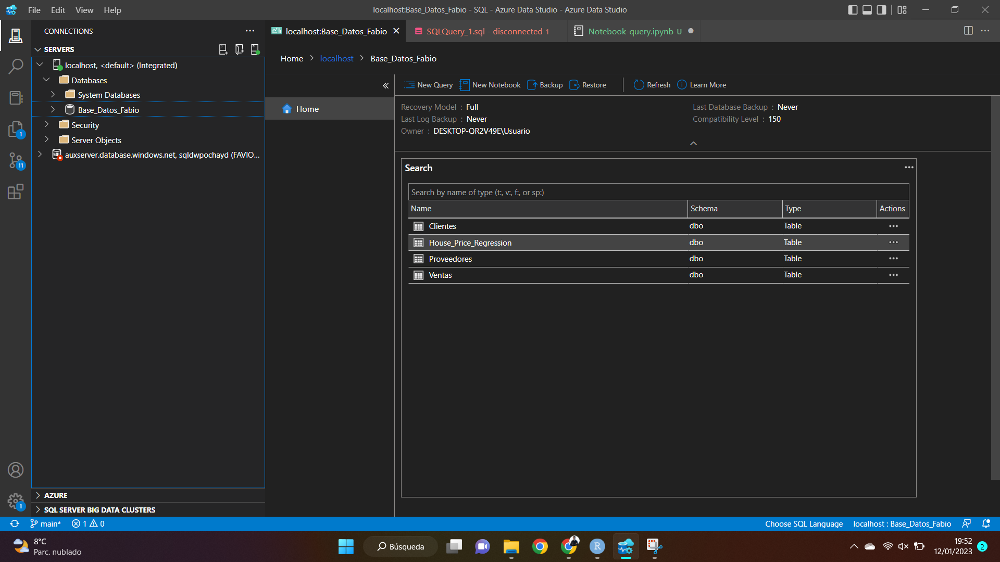{width="100%"}

</center> 


<br>


# Full view of a table


```sql
SELECT * FROM dbo.Alumnos;
```

|AlumnoID|Nombre|Pais|Ciudad|Email|Telefono|
|---|---|---|---|---|---|
|A1|Orlando                                           |Australia|||917755028|
|A10|Grecia                                            |Peru|Lima|Grecia89@gmail.com||
|A11|Ismael                                            |Espa&#241;a|Madrid|Isma98@gmail.com|912234543|
|A12|Luis                                              |Espa&#241;a|Murcia|Luismiguel123@gmail.com||
|A13|Pedro                                             |Argentina|Buenos Aires|Pedro120@gmail.com||
|A2|Keith                                             |India||keith0@adventure-works.com||
|A3|Donna                                             |Germany|Berlin|donna0@adventure-works.com|915547890|
|A4|Janet                                             |United States|California|janet1@adventure-works.com||
|A5|Fabio                                             |Espa&#241;a|Madrid|fabio10@gmail.com||
|A6|Juan                                              |Espa&#241;a|Sevilla||915869028|
|A7|Lucia                                             |Espa&#241;a||LuciaPerez@hotmail.com||
|A8|Pedro                                             |Italia|Roma|Pedro99@gmail.com|910007890|
|A9|Sergio                                            |United States|New York|sergio_as@gmail.com||


<br>

# Number of columns

```sql
SELECT count(*) 
FROM information_schema.columns 
WHERE table_name ='House_Price_Regression';
```

|(No column name)|
|---|
|29|


<br>

# Number of rows


```sql
SELECT COUNT(*) FROM House_Price_Regression;
```

|(No column name)|
|---|
|1905|


<br>

# Head of a table

```sql
SELECT TOP (4) [neighborhood_recode]
       [price]
      ,[no_of_bedrooms]
      ,[no_of_bathrooms]
      ,[quality_recode]
      ,[size_in_m_2]
  FROM [Base_Datos_Fabio].[dbo].[House_Price_Regression]
```


|price|no_of_bedrooms|no_of_bathrooms|quality_recode|size_in_m_2|
|---|---|---|---|---|
|460|1|2|20|100242337|
|460|2|2|20|146972546|
|360|3|5|20|181253753|
|110|2|3|10|18766406|


<br>


# Select columns  of a table

```SQL
SELECT Nombre, Pais, Ciudad FROM dbo.Alumnos;
```

 
 |Nombre|Pais|Ciudad|
|---|---|---|
|Orlando                                           |Australia||
|Grecia                                            |Peru|Lima|
|Ismael                                            |Espa&#241;a|Madrid|
|Luis                                              |Espa&#241;a|Murcia|
|Pedro                                             |Argentina|Buenos Aires|
|Keith                                             |India||
|Donna                                             |Germany|Berlin|
|Janet                                             |United States|California|
|Fabio                                             |Espa&#241;a|Madrid|
|Juan                                              |Espa&#241;a|Sevilla|
|Lucia                                             |Espa&#241;a||
|Pedro                                             |Italia|Roma|
|Sergio                                            |United States|New York|

 
 
 <br>
 
 
```sql
SELECT quality_recode, balcony_recode,size_in_m_2, private_jacuzzi_recode, view_of_water_recode FROM House_Price_Regression
```
 
|quality_recode|balcony_recode|size_in_m_2|private_jacuzzi_recode|view_of_water_recode|
|---|---|---|---|---|
|20|10|100242337|0|10|
|20|10|146972546|0|10|
|20|10|181253753|10|10|
|10|10|18766406|0|0|
|20|0|47101821|0|10|
|20|0|94296545|0|10|
|0|0|191565986|0|10|
|20|0|94296545|0|10|
|10|0|203085958|0|0|
|20|10|141305463|0|10|
|10|10|178187954|0|10|
|10|10|98291374|0|0|
|10|0|56577927|0|0|
|...|...|...|...|...|
 
 
 
<br>


# Assign alias to a column

```SQL
SELECT Nombre AS Nombre_Alumnos
FROM dbo.Alumnos;
```
 
|Nombre_Alumnos|
|---|
|Orlando                                           |
|Grecia                                            |
|Ismael                                            |
|Luis                                              |
|Pedro                                             |
|Keith                                             |
|Donna                                             |
|Janet                                             |
|Fabio                                             |
|Juan                                              |
|Lucia                                             |
|Pedro                                             |
|Sergio                                            |

 
 
 
 
 
<br>

# Filter rows of a table

```sql
SELECT * FROM dbo.House_Price_Regression WHERE price < 500000 ;
```

|neighborhood_recode|latitude|longitude|price|no_of_bedrooms|no_of_bathrooms|...|private_pool_recode|security_recode|shared_gym_recode|shared_pool_recode|shared_spa_recode|view_of_water_recode|size_in_m_2|
|---|---|---|---|---|---|---|---|---|---|---|---|---|---|---|---|---|---|---|---|---|---|---|---|---|---|---|---|---|
|120|25016736|5525101|365000|0|1|...|0|0|0|0|0|0|69026929|
|...|...|...|...|...|...|...|...|...|...|


<br>


```SQL
SELECT * FROM dbo.Clientes WHERE Nombre = 'Fabio' ;
```
|ClienteId|Nombre|Pais|Ciudad|Email|Telefono|
|---|---|---|---|---|---|
|C5|Fabio                                             |Espa&#241;a|Madrid|fabio10@gmail.com||


<br>


```SQL
SELECT * FROM dbo.Clientes WHERE Nombre != 'Fabio' ;
```

|ClienteId|Nombre|Pais|Ciudad|Email|Telefono|
|---|---|---|---|---|---|
|C1|Orlando                                           |Australia|||917755028|
|C10|Grecia                                            |Peru|Lima|Grecia89@gmail.com||
|C2|Keith                                             |India||keith0@adventure-works.com||
|C3|Donna                                             |Germany|Berlin|donna0@adventure-works.com|915547890|
|C4|Janet                                             |United States|California|janet1@adventure-works.com||
|C6|Juan                                              |Espa&#241;a|Sevilla||915869028|
|C7|Lucia                                             |Espa&#241;a||LuciaPerez@hotmail.com||
|C8|Pedro                                             |Italia|Roma|Pedro99@gmail.com|910007890|
|C9|Sergio                                            |United States|New York|sergio_as@gmail.com||

<br>

```SQL
SELECT * FROM dbo.Ventas WHERE Precio < 500 ;
```

|VentasId|Producto|Precio|Cliente|Proveedor|
|---|---|---|---|---|
|V15|Killim                                            |350|C10|P3|
|V3|Killim                                            |475|C9|P3|
|V5|Killim                                            |499,5|C8|P1|
|V8|Killim                                            |299,5|C10|P1|


<br>


```SQL
SELECT * FROM dbo.Ventas WHERE Precio < 2000 AND Precio > 500 ;
```
|VentasId|Producto|Precio|Cliente|Proveedor|
|---|---|---|---|---|
|V1|Alfombra                                          |1500|C1|P1|
|V10|Alfombra                                          |1200|C7|P1|
|V12|Killim                                            |650|C9|P3|
|V14|Killim                                            |1000|C6|P1|
|V2|Killim                                            |699,5|C3|P1|
|V6|Killim                                            |555|C5|P3|
|V9|Killim                                            |600|C2|P3|


<br>


```SQL
SELECT * FROM dbo.Ventas WHERE Precio <= 2000 OR Precio > 500 ;
```
|VentasId|Producto|Precio|Cliente|Proveedor|
|---|---|---|---|---|
|V1|Alfombra                                          |1500|C1|P1|
|V10|Alfombra                                          |1200|C7|P1|
|V11|Killim                                            |500|C8|P1|
|V12|Killim                                            |650|C9|P3|
|V13|Alfombra                                          |3500|C7|P1|
|V14|Killim                                            |1000|C6|P1|
|V15|Killim                                            |350|C10|P3|
|V2|Killim                                            |699,5|C3|P1|
|V3|Killim                                            |475|C9|P3|
|V4|Alfombra                                          |5000|C4|P1|
|V5|Killim                                            |499,5|C8|P1|
|V6|Killim                                            |555|C5|P3|
|V7|Alfombra                                          |2500|C2|P1|
|V8|Killim                                            |299,5|C10|P1|
|V9|Killim                                            |600|C2|P3|

<br>


```SQL
SELECT Nombre , Email  FROM dbo.Proveedores WHERE Email = 'Intertrade@gmail.com' ;
```
|Nombre|Email|
|---|---|
|Intertrade|Intertrade@gmail.com|


<br>

```SQL
SELECT Producto , Cliente, Proveedor FROM dbo.Ventas WHERE Precio < 2000 AND Precio > 500 ;
```

|Producto|Cliente|Proveedor|
|---|---|---|
|Alfombra                                          |C1|P1|
|Alfombra                                          |C7|P1|
|Killim                                            |C9|P3|
|Killim                                            |C6|P1|
|Killim                                            |C3|P1|
|Killim                                            |C5|P3|
|Killim                                            |C2|P3|


<br>

```SQL
SELECT*FROM Clientes WHERE Nombre is NOT NULL
```
|ClienteId|Nombre|Pais|Ciudad|Email|Telefono|
|---|---|---|---|---|---|
|C1|Orlando                                           |Australia|||917755028|
|C2|Keith                                             |India||keith0@adventure-works.com||
|C3|Donna                                             |Germany|Berlin|donna0@adventure-works.com|915547890|
|C4|Janet                                             |United States|California|janet1@adventure-works.com||
|C5|Fabio                                             |Espa&#241;a|Madrid|fabio@gmail.com||

 
<br>


```SQL
SELECT * FROM dbo.Clientes WHERE Nombre in ( 'Orlando' , 'Fabio') ;
```

|ClienteId|Nombre|Pais|Ciudad|Email|Telefono|
|---|---|---|---|---|---|
|C1|Orlando                                           |Australia|||917755028|
|C5|Fabio                                             |Espa&#241;a|Madrid|fabio10@gmail.com||


```SQL
SELECT * FROM dbo.Clientes WHERE Nombre not in ( 'Orlando' , 'Fabio') ;
```
|ClienteId|Nombre|Pais|Ciudad|Email|Telefono|
|---|---|---|---|---|---|
|C10|Grecia                                            |Peru|Lima|Grecia89@gmail.com||
|C2|Keith                                             |India||keith0@adventure-works.com||
|C3|Donna                                             |Germany|Berlin|donna0@adventure-works.com|915547890|
|C4|Janet                                             |United States|California|janet1@adventure-works.com||
|C6|Juan                                              |Espa&#241;a|Sevilla||915869028|
|C7|Lucia                                             |Espa&#241;a||LuciaPerez@hotmail.com||
|C8|Pedro                                             |Italia|Roma|Pedro99@gmail.com|910007890|
|C9|Sergio                                            |United States|New York|sergio_as@gmail.com||


<br>


# Eliminar filas de una tabla

```SQL
DELETE from Ventas
```

|VentasId|Producto|Precio|Cliente|Proveedor|
|---|---|---|---|---|


<br>


```SQL
Delete from Clientes WHERE Nombre = 'Fabio'
```

|ClienteId|Nombre|Pais|Ciudad|Email|Telefono|
|---|---|---|---|---|---|
|C1|Orlando                                           |Australia|||917755028|
|C10|Grecia                                            |Peru|Lima|Grecia89@gmail.com||
|C2|Keith                                             |India||keith0@adventure-works.com||
|C3|Donna                                             |Germany|Berlin|donna0@adventure-works.com|915547890|
|C4|Janet                                             |United States|California|janet1@adventure-works.com||
|C6|Juan                                              |Espa&#241;a|Sevilla||915869028|
|C7|Lucia                                             |Espa&#241;a||LuciaPerez@hotmail.com||
|C8|Pedro                                             |Italia|Roma|Pedro99@gmail.com|910007890|
|C9|Sergio                                            |United States|New York|sergio_as@gmail.com||


<br>

# Eliminar una tabla


```SQL
DROP TABLE Clientes 
```


<center>

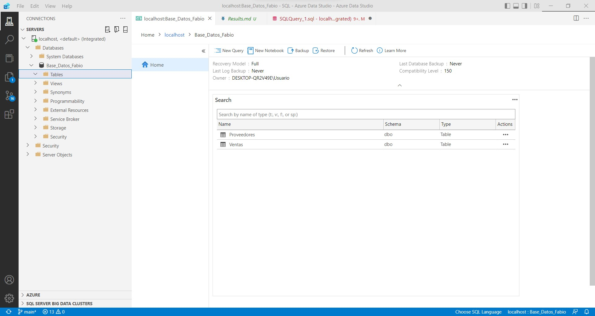{width="95%"}

</center> 

 


<br>


# Actualizar columnas de una table

Primero volvemos a cargar las tablas Ventas y Clientes para recuperar su estado original, puesto que hemos eliminado todas las filas de Ventas y una de Clientes.


Una vez hecho lo anterior, continuamos.


```SQL
UPDATE Clientes set Nombre = 'Messi' WHERE ClienteId = 'C1'
```

|ClienteId|Nombre|Pais|Ciudad|Email|Telefono|
|---|---|---|---|---|---|
|C1|Messi                                             |Australia|||917755028|
|C10|Grecia                                            |Peru|Lima|Grecia89@gmail.com||
|C2|Keith                                             |India||keith0@adventure-works.com||
|C3|Donna                                             |Germany|Berlin|donna0@adventure-works.com|915547890|
|C4|Janet                                             |United States|California|janet1@adventure-works.com||
|C5|Fabio                                             |Espa&#241;a|Madrid|fabio10@gmail.com||
|C6|Juan                                              |Espa&#241;a|Sevilla||915869028|
|C7|Lucia                                             |Espa&#241;a||LuciaPerez@hotmail.com||
|C8|Pedro                                             |Italia|Roma|Pedro99@gmail.com|910007890|
|C9|Sergio                                            |United States|New York|sergio_as@gmail.com||


<br>

```SQL
UPDATE Clientes set Nombre = 'Messi' , Pais = 'Argentina' WHERE ClienteId = 'C1'
```
|ClienteId|Nombre|Pais|Ciudad|Email|Telefono|
|---|---|---|---|---|---|
|C1|Messi                                             |Argentina|||917755028|
|C10|Grecia                                            |Peru|Lima|Grecia89@gmail.com||
|C2|Keith                                             |India||keith0@adventure-works.com||
|C3|Donna                                             |Germany|Berlin|donna0@adventure-works.com|915547890|
|C4|Janet                                             |United States|California|janet1@adventure-works.com||
|C5|Fabio                                             |Espa&#241;a|Madrid|fabio10@gmail.com||
|C6|Juan                                              |Espa&#241;a|Sevilla||915869028|
|C7|Lucia                                             |Espa&#241;a||LuciaPerez@hotmail.com||
|C8|Pedro                                             |Italia|Roma|Pedro99@gmail.com|910007890|
|C9|Sergio                                            |United States|New York|sergio_as@gmail.com||


<br>

```SQL
UPDATE Clientes set Nombre = 'Messi' 
```

|ClienteId|Nombre|Pais|Ciudad|Email|Telefono|
|---|---|---|---|---|---|
|C1|Messi                                             |Argentina|||917755028|
|C10|Messi                                             |Peru|Lima|Grecia89@gmail.com||
|C2|Messi                                             |India||keith0@adventure-works.com||
|C3|Messi                                             |Germany|Berlin|donna0@adventure-works.com|915547890|
|C4|Messi                                             |United States|California|janet1@adventure-works.com||
|C5|Messi                                             |Espa&#241;a|Madrid|fabio10@gmail.com||
|C6|Messi                                             |Espa&#241;a|Sevilla||915869028|
|C7|Messi                                             |Espa&#241;a||LuciaPerez@hotmail.com||
|C8|Messi                                             |Italia|Roma|Pedro99@gmail.com|910007890|
|C9|Messi                                             |United States|New York|sergio_as@gmail.com||


<br>


## Fijar un valor por defecto para una columna


```SQL
IF OBJECT_ID('dbo.Otra_Tabla_1', 'U') IS NOT NULL
 DROP TABLE dbo.Otra_Tabla_1;
GO
-- Create the table in the specified schema
CREATE TABLE dbo.Otra_Tabla_1
(
 Id nvarchar (50) NOT NULL PRIMARY KEY, -- primary key column
 Nombre nvarchar (50) NOT NULL,
 Email nvarchar(50) NOT NULL DEFAULT 'no tiene',
 Telefono nvarchar (50) NOT NULL DEFAULT 'desconocido'
);
GO
```

```SQL
INSERT INTO dbo.Otra_Tabla_1
 ([Id], [Nombre], [Email], [Telefono])
VALUES
 ( 1 , 'Juan', DEFAULT , DEFAULT),
 ( 2 , 'Rodrigo', DEFAULT , '915568799'),
 ( 3 , 'Sofia', DEFAULT , DEFAULT),
 ( 4 , 'Irene', 'Irene99@hotmail.es' , '914478236'),
 ( 5 , 'Luis', 'LuisMP@gmail.com' , DEFAULT)
GO 
```


|Id|Nombre|Email|Telefono|
|---|---|---|---|
|1|Juan|no tiene|desconocido|
|2|Rodrigo|no tiene|915568799|
|3|Sofia|no tiene|desconocido|
|4|Irene|Irene99@hotmail.es|914478236|
|5|Luis|LuisMP@gmail.com|desconocido|


<br>


# Columnas calculadas a partir de otras

```SQL

IF OBJECT_ID('dbo.Otra_Tabla_Ventas', 'U') IS NOT NULL
 DROP TABLE dbo.Otra_Tabla_Ventas;
GO

-- Create the table in the specified schema

CREATE TABLE dbo.Otra_Tabla_Ventas
(
 VentasId nvarchar (50) NOT NULL PRIMARY KEY, -- primary key column
 Producto char (50) NOT NULL,
 Precio float (50) NOT NULL,
 Descuento float (50) NOT NULL,
 Cliente nvarchar (50) NOT NULL,
 Proveedor  nvarchar (50) NOT NULL
);
GO

-- Insert rows

INSERT INTO dbo.Otra_Tabla_Ventas
 ([VentasId], [Producto], [Precio], [Descuento], [Cliente], [Proveedor])
VALUES
 ( 'V1', 'Alfombra', 1500, 0.5 ,'C2' , 'P1'),
 ( 'V2', 'Killim', 699.50, 0.25, 'C3', 'P1'),
 ( 'V3', 'Killim', 475, 0.10, 'C2', 'P3'),
  ( 'V4', 'Alfombra', 1500, 0.5 ,'C7' , 'P1'),
 ( 'V5', 'Alfombra', 5000, 0.30, 'C5', 'P1'),
 ( 'V6', 'Killim', 250, 0.10, 'C9', 'P3')
GO
```


|VentasId|Producto|Precio|Descuento|Cliente|Proveedor|
|---|---|---|---|---|---|
|V1|Alfombra                                          |1500|0,5|C2|P1|
|V2|Killim                                            |699,5|0,25|C3|P1|
|V3|Killim                                            |475|0,1|C2|P3|
|V4|Alfombra                                          |1500|0,5|C7|P1|
|V5|Alfombra                                          |5000|0,3|C5|P1|
|V6|Killim                                            |250|0,1|C9|P3|
                                           |475|0,1|C2|P3|


<br>

```SQL
SELECT VentasId, Producto, Precio, Descuento, 'Precio_Final' = Precio - Precio*Descuento, Cliente, Proveedor FROM Otra_Tabla_Ventas
```

|VentasId|Producto|Precio|Descuento|Precio_Final|Cliente|Proveedor|
|---|---|---|---|---|---|---|
|V1|Alfombra                                          |1500|0,5|750|C2|P1|
|V2|Killim                                            |699,5|0,25|524,625|C3|P1|
|V3|Killim                                            |475|0,1|427,5|C2|P3|
|V4|Alfombra                                          |1500|0,5|750|C7|P1|
|V5|Alfombra                                          |5000|0,3|3500|C5|P1|
|V6|Killim                                            |250|0,1|225|C9|P3|


<br>


# Concatenar strings de filas distintas

Primero volvemos a cargar la tabla clientes tal y como la teniamos en un inicio:

```SQL
IF OBJECT_ID('dbo.Clientes', 'U') IS NOT NULL
 DROP TABLE dbo.Clientes;
GO
-- Create the table in the specified schema
CREATE TABLE dbo.Clientes
(
 ClienteId nvarchar(50) NOT NULL PRIMARY KEY, -- primary key column --> impide repeticiones de valores en esta columna
 Nombre char (50) NOT NULL,
 Pais nvarchar(50) NOT NULL,
 Ciudad nvarchar(50) NOT NULL,
 Email nvarchar (50) NOT NULL,
 Telefono  nvarchar (50) NOT NULL
);
GO

INSERT INTO dbo.Clientes
 ([ClienteId], [Nombre], [Pais], [Ciudad], [Email], [Telefono])
VALUES
 ( 'C1', N'Orlando', N'Australia', N'', N'' , N'917755028'),
 ( 'C2', N'Keith', N'India', N'', N'keith0@adventure-works.com', N''),
 ( 'C3', N'Donna', N'Germany', N'Berlin', N'donna0@adventure-works.com', N'915547890'),
 ( 'C4', N'Janet', N'United States', N'California',  N'janet1@adventure-works.com', N''),
 ( 'C5', N'Fabio', N'España', N'Madrid', N'fabio10@gmail.com', N''),
 ( 'C6', N'Juan', N'España', N'Sevilla', N'' , N'915869028'),
 ( 'C7', N'Lucia', N'España', N'', N'LuciaPerez@hotmail.com', N''),
 ( 'C8', N'Pedro', N'Italia', N'Roma', N'Pedro99@gmail.com', N'910007890'),
 ( 'C9', N'Sergio', N'United States', N'New York',  N'sergio_as@gmail.com', N''),
 ( 'C10', N'Grecia', N'Peru', N'Lima', N'Grecia89@gmail.com', N'')
GO
```
<br>

```SQL
SELECT Nombre, 'nueva_columna' = Pais + ' - ' + Ciudad   FROM Clientes
```

|Nombre|nueva_columna|
|---|---|
|Orlando                                           |Australia - |
|Grecia                                            |Peru - Lima|
|Keith                                             |India - |
|Donna                                             |Germany - Berlin|
|Janet                                             |United States - California|
|Fabio                                             |Espa&#241;a - Madrid|
|Juan                                              |Espa&#241;a - Sevilla|
|Lucia                                             |Espa&#241;a - |
|Pedro                                             |Italia - Roma|
|Sergio                                            |United States - New York|


<br>

# Ordenar tabla por columnas

```SQL
SELECT*FROM Ventas ORDER BY Precio ASC
```
|VentasId|Producto|Precio|Descuento|Cliente|Proveedor|
|---|---|---|---|---|---|
|V3|Killim                                            |475|0,1|C2|P3|
|V2|Killim                                            |699,5|0,25|C3|P1|
|V1|Alfombra                                          |1500|0,5|C2|P1|

<br>

```SQL
SELECT*FROM Ventas ORDER BY Precio DESC
```

|VentasId|Producto|Precio|Descuento|Cliente|Proveedor|
|---|---|---|---|---|---|
|V1|Alfombra                                          |1500|0,5|C2|P1|
|V2|Killim                                            |699,5|0,25|C3|P1|
|V3|Killim                                            |475|0,1|C2|P3|


<br>


# Seleccionar filas por strings con Like y Not Like


```SQL
SELECT * FROM dbo.Clientes WHERE Nombre like '%lan%' ;
```
|ClienteId|Nombre|Pais|Ciudad|Email|Telefono|
|---|---|---|---|---|---|
|C1|Orlando                                           |Australia|||917755028|


```SQL
SELECT * FROM dbo.Clientes WHERE Nombre like '%i%' ;
```
|ClienteId|Nombre|Pais|Ciudad|Email|Telefono|
|---|---|---|---|---|---|
|C2|Keith                                             |India||keith0@adventure-works.com||
|C5|Fabio                                             |Espa&#241;a|Madrid|fabio@gmail.com||


```SQL
SELECT * FROM dbo.Clientes WHERE Nombre not like '%i%' ;
```

|ClienteId|Nombre|Pais|Ciudad|Email|Telefono|
|---|---|---|---|---|---|
|C1|Orlando                                           |Australia|||917755028|
|C3|Donna                                             |Germany|Berlin|donna0@adventure-works.com|915547890|
|C4|Janet                                             |United States|California|janet1@adventure-works.com||


```SQL
SELECT * FROM dbo.Clientes WHERE Nombre like 'o%' ; -- empieza por 'o'
```
|ClienteId|Nombre|Pais|Ciudad|Email|Telefono|
|---|---|---|---|---|---|
|C1|Orlando                                           |Australia|||917755028|


```SQL
SELECT * FROM dbo.Clientes WHERE Nombre like '%o' ; -- acaba por 'o'
```
|ClienteId|Nombre|Pais|Ciudad|Email|Telefono|
|---|---|---|---|---|---|
|C1|Orlando                                           |Australia|||917755028|
|C5|Fabio                                             |Espa&#241;a|Madrid|fabio@gmail.com||


<br>


```SQL
SELECT * FROM dbo.Clientes WHERE Nombre like '%lan%o' ; -- contiene 'lan' y acaba por 'o'
```
|ClienteId|Nombre|Pais|Ciudad|Email|Telefono|
|---|---|---|---|---|---|
|C1|Orlando                                           |Australia|||917755028|


<br>


```SQL
SELECT * FROM dbo.Clientes WHERE Nombre like '%b%o' ; -- contiene 'b' y acaba por 'o'
```
|ClienteId|Nombre|Pais|Ciudad|Email|Telefono|
|---|---|---|---|---|---|
|C5|Fabio                                             |Espa&#241;a|Madrid|fabio@gmail.com||


<br>


```SQL
SELECT * FROM dbo.Clientes WHERE Nombre like '%F____' ; -- empieza por 'F' seguida de 4 caracteres
```

|ClienteId|Nombre|Pais|Ciudad|Email|Telefono|
|---|---|---|---|---|---|
|C5|Fabio                                             |Espa&#241;a|Madrid|fabio@gmail.com||


```SQL
SELECT * FROM dbo.Clientes WHERE Nombre like '%F__' ; -- empieza por 'F' seguida de 2 caracteres
```

|ClienteId|Nombre|Pais|Ciudad|Email|Telefono|
|---|---|---|---|---|---|


# Count


```SQL
SELECT COUNT(*) FROM Clientes ;
```

|(No column name)|
|---|
|5|


```SQL
SELECT COUNT(Nombre) FROM Clientes ;
```

|(No column name)|
|---|
|5|


<br>

# Min, Max, Sum, Avg

```SQL
SELECT Min(Precio) FROM Ventas ;
```
|(No column name)|
|---|
|475|


```SQL
SELECT Max(Precio) FROM Ventas ;
```
|(No column name)|
|---|
|1500|


```SQL
SELECT Sum(Precio) FROM Ventas ;
```
|(No column name)|
|---|
|2674,5|


```SQL
SELECT Avg(Precio) FROM Ventas ;
```
|(No column name)|
|---|
|891,5|


<br>

# Group by


<br>

# Having


