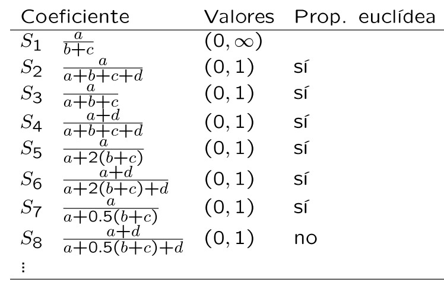
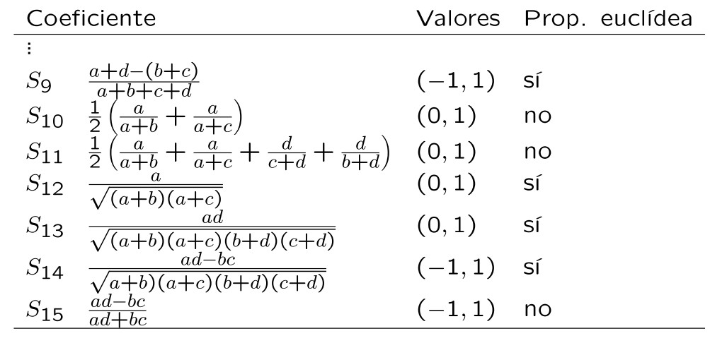
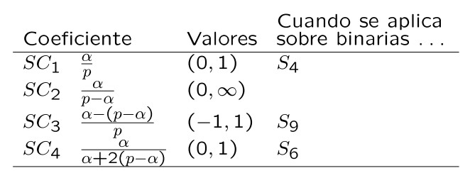

 


> More articles in my blog:   $\hspace{0.1cm}$   [Estadistica4all](https://fabioscielzoortiz.github.io/Estadistica4all.github.io/)

<br>

El concepto de distancia entre observaciones de variables estadisticas tiene un papel relevante en muchas tecnicas y modelos estadistico tales como KNN, PCA, MDS, Clustering , Regresión  y Clasificacion (supervisada). Es por ello de especial relevancia para todo cientifico de datos saber que son las distancias estadisticas, que tipos hay y como implementarlas.


<br>


# Data-set de trabajo


## Carga de los datos en  `Python` <a class="anchor" id="1"></a>


```python
import numpy as np
```


```python
np.random.seed(123)

# Quantitative

X1 = np.random.normal(loc=10, scale=15, size=50)
X2 = np.random.normal(loc=10, scale=15, size=50)
X3 = np.random.normal(loc=10, scale=15, size=50)
X4 = np.random.normal(loc=10, scale=15, size=50)

# Binary Categorical / Dummies ( categories: 0,1)

X5 = np.random.uniform(low=0.0, high=1.0, size=50).round()
X6 = np.random.uniform(low=0.0, high=1.0, size=50).round() 
X7 = np.random.uniform(low=0.0, high=1.0, size=50).round() 


# Multiple categorical

X8 = np.random.uniform(low=0, high=4, size=50).round()   # categories: 0,1,2,3,4
X9 = np.random.uniform(low=0, high=3, size=50).round()   # categories: 0,1,2,3
X10 = np.random.uniform(low=0, high=5, size=50).round()  # categories: 0,1,2,3,4,5
```


```python
import pandas as pd
```


```python
Data_set_Python = pd.DataFrame({'X1': X1 , 'X2': X2, 'X3': X3 , 'X4': X4 , 'X5': X5 , 
                         'X6': X6 , 'X7': X7 , 'X8': X8 , 'X9': X9 , 'X10': X10 })
```


<br>


## Carga de los datos en  `R`


```python
import rpy2

%load_ext rpy2.ipython

import rpy2.robjects as robjects
```

    c:\Users\Usuario\AppData\Local\Programs\Python\Python310\lib\site-packages\rpy2\robjects\packages.py:366: UserWarning: The symbol 'quartz' is not in this R namespace/package.
      warnings.warn(
    


```r
%%R

# Quantitative

X1 <- c(-6.28445905,  24.9601817 ,  14.24467747, -12.59442071,
         1.32099622,  34.77154806, -26.40018865,   3.56631057,
        28.98904388,  -3.00110603,  -0.18329227,   8.57936547,
        32.37084439,   0.41647005,   3.34027061,   3.48473087,
        43.08895124,  42.80179133,  25.06080847,  15.79279599,
        21.06052864,  32.36098042,  -4.03750803,  27.63743567,
        -8.80821002,   0.43372746,  23.60657794, -11.4302105 ,
         7.8989692 ,  -2.92632344,   6.16570944, -31.97883658,
       -16.57299657,  -0.49815852,  23.91193648,   7.39546476,
        10.04268874,  20.32334067,  -3.19304515,  14.25440986,
        -2.08049777, -15.91504241,   4.13650309,  18.60708794,
        15.07883576,   9.82254258,  45.88547899,  16.1936824 ,
        24.68104009,  43.57215008)

X2 <- c(-9.41127985,  -5.58182315,  36.15568338,  -1.97094103,
        10.44524845,  26.03973954,  23.36059587,  36.32329273,
        32.43466206,  26.04089005,  -1.59063071,  21.92294002,
        14.71407992,  -9.8939819 ,  31.2594857 ,  22.10854802,
        10.68235121,   6.50361909,  -7.97451717,  12.9928611 ,
        17.02658679,  -2.46732476,  27.43306074,  -6.4580457 ,
       -21.84650525,  25.59590636,   3.94950943,   8.10955622,
        -2.56275084, -14.08944141,  28.82856062,  -0.33303476,
        34.91428732,  22.10962279,   5.2786278 ,  -6.28853602,
        -0.9869298 ,  -8.18784697,  41.30670039,  12.46661845,
        27.25308314,  -9.01028074,  12.71552694,  27.66792908,
         4.97483857,  25.46671688,  -6.26851868, -10.45207317,
        15.69100918,   4.31235348)

X3 <- c(19.63082034, -19.66831897,  20.68396953,  48.97455891,
         9.63061028,  10.51213193,  12.69324227, -17.92963566,
        16.3921996 , -14.08114616,   3.58480603,  28.64304324,
        -1.02825434,  17.51873484,  25.19108581,  14.18111284,
       -10.56422705,   5.01287087,  39.39117014, -20.37568644,
         5.86320979,   1.71837893,  11.81121045,  21.22323426,
        34.13036452,   5.94651412,  22.18511995,  17.49610217,
        17.11520947,   1.54114103,  -4.95982203,  -6.50064669,
        -1.34655814,  14.82529864,  21.4142409 ,  14.85203272,
         1.76567356,  37.08955165,  32.78298435,   4.68999831,
        -2.35147109,  11.95322431,  29.00947968,  14.99147466,
        18.34823057,   6.81879817,  16.84406343,  33.16816677,
         6.40496828,  12.14961599)

X4 <- c(13.80724715,  14.25588034, -11.17833314, -18.15302984,
        -5.29482606,  12.51913443,  18.30784249,   2.0398816 ,
        30.65886224,   7.85236039,  10.30473997,   7.09054194,
        12.01040189,  20.56711111,  19.98480157,  -3.47634411,
        32.85495665,  -6.42539686,  11.18840521,   5.8840514 ,
        -5.73487516,   8.87319118,  -1.1122066 ,  11.09360865,
        16.04628942,  32.07894053,  14.61076328,   0.8316199 ,
         4.12570284,  12.09967159,  11.40191244,  31.89383902,
        30.93029395,   4.61596111,   1.77036808, -28.35581906,
         1.7661938 ,  -4.67086559,   4.67763313,  15.87376364,
        12.65788494,   9.55047989,  12.99373167,   8.1082334 ,
        12.95528399, -38.46582512,   5.96059765,   8.33723918,
         4.88107426,   6.73080607)


# Binary Categorical / Dummies ( categories: 0,1)

X5 <- c(0., 1., 1., 0., 0., 1., 1., 1., 0., 0., 1., 0., 0., 0., 1., 0., 1.,
       1., 0., 0., 1., 0., 0., 1., 1., 1., 0., 0., 1., 0., 1., 0., 0., 0.,
       0., 0., 0., 1., 0., 0., 0., 0., 1., 0., 1., 0., 1., 0., 1., 0.)

X6 <- c(0., 1., 0., 1., 1., 1., 1., 1., 0., 1., 0., 1., 0., 1., 1., 1., 0.,
       1., 0., 1., 0., 0., 0., 1., 0., 1., 1., 0., 1., 1., 0., 0., 0., 1.,
       1., 1., 1., 1., 0., 0., 1., 0., 0., 0., 0., 1., 0., 1., 1., 1.)    

X7 <- c(1., 1., 0., 0., 0., 1., 0., 0., 1., 1., 0., 1., 0., 0., 0., 0., 1.,
       1., 1., 1., 0., 0., 0., 0., 0., 0., 1., 0., 1., 0., 1., 0., 0., 1.,
       1., 0., 1., 1., 1., 1., 0., 1., 1., 0., 1., 0., 1., 0., 0., 1.) 


# Multiple categorical

X8 <- c(3., 3., 3., 1., 2., 3., 3., 0., 0., 1., 4., 2., 1., 1., 1., 2., 1.,
       3., 2., 1., 4., 1., 4., 0., 3., 2., 2., 0., 0., 1., 4., 2., 1., 2.,
       1., 1., 1., 3., 2., 1., 4., 3., 1., 4., 4., 2., 3., 2., 1., 0.) 

X9 <- c(1., 1., 1., 1., 3., 0., 2., 1., 1., 1., 3., 1., 0., 3., 3., 1., 2.,
       0., 0., 3., 1., 2., 3., 1., 0., 0., 2., 3., 1., 1., 2., 3., 2., 1.,
       2., 0., 0., 2., 1., 2., 1., 1., 3., 0., 2., 0., 2., 1., 0., 2.)       
        
X10 <- c(4., 3., 0., 1., 2., 1., 4., 1., 3., 5., 5., 1., 0., 5., 4., 5., 2.,
       4., 1., 2., 4., 1., 4., 2., 2., 2., 5., 3., 4., 4., 5., 2., 2., 3.,
       2., 5., 2., 2., 3., 2., 5., 0., 1., 2., 1., 1., 4., 3., 0., 5.)        
```


```r
%%R

Data_set_R <- cbind(X1,X2,X3,X4,X5,X6,X7,X8,X9,X10)
```


<br>


# Distancias  <a class="anchor" id="3"></a>

Es un concepto que permite expresar una medida de distancia entre un par de elementos cualesquiera.


Dada un conjunto cualquiera $\hspace{0.1cm}A$


## Casi-métrica <a class="anchor" id="1"></a>

Denominamos casi-metrica o disimilaridad a cualquier función $\hspace{0.1cm}\delta : A \hspace{0.05cm}x\hspace{0.05cm} A \rightarrow \mathbb{R}\hspace{0.1cm}$ que tiene las siguientes propiedades:


1) $\hspace{0.25cm}\delta (i,j) \geq 0 \hspace{0.45cm} \forall i,j \in A \\$

2) $\hspace{0.25cm}\delta (i,i) = 0 \hspace{0.45cm} \forall i \in  A \\$

3) $\hspace{0.25cm}\delta (i,j) = \delta (j, i) \hspace{0.45cm} \forall i,j \in A$


<br>

## Semi-métrica <a class="anchor" id="6"></a>


Es denominada **semi-métrica**  a toda disimilaridad (casi-métrica) que tiene la propiedad siguiente (desigualdad triangular):


4) $\hspace{0.25cm} \delta (i,j) \hspace{0.1 cm}\leq \hspace{0.1 cm} \delta (i,k) + \delta (k,j) \hspace{0.45cm} \forall i,j,k \in A$


<br>


## Métrica <a class="anchor" id="7"></a>


Se denomina **metrica**  a toda semi-metrica que tiene la siguiente propiedad:

5) $\hspace{0.25cm} \delta (i,j)=0 \hspace{0.15cm}\Leftrightarrow\hspace{0.15cm} i=j \hspace{0.45cm} \forall i,j \in A$


<br>


## Distancia <a class="anchor" id="9"></a>

Una **distancia** es una metrica o semi-metrica
 
<br>

Expresandolo de otra manera:

Sea $\hspace{0.1cm}\delta : A \hspace{0.05cm}x\hspace{0.05cm} A \rightarrow \mathbb{R}\hspace{0.1cm}$

$\delta$ es una distancia si y solo si : 

Cumple las siguientes cuatro propiedades:

1) $\hspace{0.25cm}\delta (i,j) \geq 0 \hspace{0.45cm} \forall i,j \in A \\$

2) $\hspace{0.25cm}\delta (i,i) = 0 \hspace{0.45cm} \forall i \in  A \\$

3) $\hspace{0.25cm}\delta (i,j) = \delta (j, i) \hspace{0.45cm} \forall i,j \in A \\$

4) $\hspace{0.25cm} \delta (i,j) \hspace{0.1 cm}\leq \hspace{0.1 cm} \delta (i,k) + \delta (k,j) \hspace{0.45cm} \forall i,j,k \in A$


o bien, cumple las cuatro anteriores y además la siguiente propiedad:

5) $\hspace{0.25cm} \delta (i,j)=0 \hspace{0.15cm}\Leftrightarrow\hspace{0.15cm} i=j \hspace{0.45cm} \forall i,j \in A \\$


<br>

## Matriz de distancias <a class="anchor" id="10"></a>


Dada una distanccia $\delta$ definida sobre el conjutno  $\hspace{0.1cm} A=\lbrace a_1,...,a_n\rbrace$ 

Se define la matriz de distancias $\delta$ sobre $A$ como: $\\[0.7cm]$


$$
D(\delta , A) = \begin{pmatrix}
0 & \delta_{12}&...&\delta_{1n}\\
\delta_{21} & 0&...&\delta_{2n}\\
...&...&...&...\\
\delta_{n1}& \delta_{n2}&...& 0\\
\end{pmatrix}
$$


Donde:
 
$\delta_{ir} = \delta(a_i,a_r) \hspace{0.45cm} \forall i,r \in A$

$\delta_{ir}\hspace{0.1cm}$ puede interpretarse como la distancia $\hspace{0.1cm}\delta\hspace{0.1cm}$ entre el par de elementos $\hspace{0.1cm}(a_i,a_r)\hspace{0.1cm}$ de $\hspace{0.1cm}A$


<br>

Tambien es relevante en algunas técnicas estadisticas la matrid de cuadrados de las distancias: $\\[0.7cm]$


$$
D(\delta , A)^{(2)}= 
\begin{pmatrix}
0 & \delta^2_{12}&...&\delta^2_{1n}\\
\delta^2_{21} & 0&...&\delta^2_{2n}\\
...&...&...&...\\
\delta^2_{n1}& \delta^2_{n2}&...& 0\\
\end{pmatrix} \\[2cm]
$$


No debe confundirse con  $\hspace{0.1cm} D^2=D\cdot D$


<br>


# Distancias con variables estadísticas cuantitativas <a class="anchor" id="11"></a>

Dada una muestra de $n$  elementos/individuos $\hspace{0.1cm}\Omega = \lbrace e_1,e_2,...,e_n \rbrace$ 

Dada una serie de variables estadisticas **cuantitativas** $\hspace{0.1cm}\mathcal{X}_1,...,\mathcal{X}_p$

Para cada variable cuantitativa $\mathcal{X}_j$ tenemos una muestra de $n$ observaciones $X_j$  basada en la muestra de $n$ individuos $\hspace{0.1cm}\Omega$

 
Es decir, tenemos lo siguiente:

- $\hspace{0.1cm}X_j=(x_{j1},...,x_{jn})^t$ , para $j=1,...,p \\$

- $\hspace{0.1cm}x_{ji}\hspace{0.1cm}$ es la observación de la variable $\hspace{0.1cm}\mathcal{X}_j\hspace{0.1cm}$ para el individuo $\hspace{0.1cm}e_i\hspace{0.1cm}$ de la muestra $\hspace{0.1cm}\Omega$ , para $\hspace{0.1cm}j=1,...,p\hspace{0.1cm}$ y $\hspace{0.1cm}i=1,...,n \\$

Por tanto

- $\hspace{0.1cm}X_j=(x_{j1},...,x_{jn})^t\hspace{0.1cm}$ es el vector con las observaciones de l avariable para los individuos de la meustra $\Omega$  , para $j=1,...,p \\$

- $\hspace{0.1cm}x_i = (x_{1i} , x_{2i} ,..., x_{pi})^t\hspace{0.1cm}$ es el vector con las observaciones de las variables  $\hspace{0.1cm}\mathcal{X}_1,...,\mathcal{X}_p\hspace{0.1cm}$ para el individuo $\hspace{0.1cm}e_i\hspace{0.1cm}$ de $\hspace{0.1cm}\Omega$ , para $\hspace{0.1cm}i=1,...,n$


<br>


## Distancia Euclidea <a class="anchor" id="12"></a>


La distancia Euclidea entre el par de observaciones $\hspace{0.1cm}(x_i , x_r)\hspace{0.1cm}$ de las variables cuantitativas $\hspace{0.1cm}\mathcal{X}_1,...,\mathcal{X}_p\hspace{0.1cm}$ se define como: $\\[0.5cm]$


$$
\delta(i,r)_{Euclidea} = \delta(x_i,x_r)_{Euclidea} =\sqrt{\sum_{k=1}^{p} (x_{ik} - x_{rk})\hspace{0.05cm}^2 \hspace{0.1cm} }  \hspace{0.1cm}=\hspace{0.1cm} \sqrt{(x_i - x_r)\hspace{0.05cm}^t\cdot (x_i - x_r)\hspace{0.1cm}} \hspace{0.1cm}=\hspace{0.1cm} \sqrt{ \text{sum} \left( \hspace{0.05cm} (x_i - x_r)^2  \hspace{0.05cm} \right) \hspace{0.1cm} } \\[0.6cm]
$$


$$
\delta^2(i,r)_{Euclidea} = \delta^2(x_i,x_r)_{Euclidea} \hspace{0.1cm}=\hspace{0.1cm} \sum_{k=1}^{p} (x_{ik} - x_{jk})\hspace{0.05cm}^2 \hspace{0.1cm}=\hspace{0.1cm} (x_i - x_j)\hspace{0.05cm}^t\cdot (x_i - x_j) \hspace{0.1cm}=\hspace{0.1cm} \text{sum} \left( \hspace{0.05cm} (x_i - x_j)^2 \hspace{0.05cm} \right) \\
$$


para $i,r = 1,...,n$


<br>


<br>
 
**Observaciones:**


$\delta(i,r)_{Euclidea}$ puede interpretarse como la distancia Euclidea entre el par de individuos $(e_i , e_r)$ respecto de las variables estadisticas  $\mathcal{X}_1,...,\mathcal{X}_p$  

Nos da una medida de distancia entre individuos basada en datos de esos individuos sobre variables estadisticas.  


<br>


**Distancia Euclidea entre vectores**

La distancia Euclidea no se circusncribe solamente al campo de la estadística, una definicion mas general que contiene a la anteriormente dada es la siguiente:

Dados dos vectores  $v=(v_1,...,v_n)^t$ y $w=(w_1,...,w_n)^t$ de $\mathbb{R}^n$

La distancia Euclidea entre esos vectores es:

$$
\delta^2(v,w)_{Euclidean} \hspace{0.07cm}=\hspace{0.07cm}  sum( (v-w)^2)  \hspace{0.07cm}=\hspace{0.07cm}  \sum_{i=1}^{n} (v_{i} - w_{i})\hspace{0.05cm}^2   
$$


Asi que $\hspace{0.1cm} \delta(x_i,x_r)_{Euclidea}\hspace{0.1cm}$ es la distancia Euclidea entre los vectores (de observaciones) $\hspace{0.1cm} x_i=(x_{i1},x_{i2},...,x_{ip})\hspace{0.1cm}$ y $\hspace{0.1cm} x_r=(x_{r1},x_{r2},...,x_{rp})\hspace{0.1cm}$ de las variables estadisticas $\hspace{0.1cm} \mathcal{X}_1,...,\mathcal{X}_p$


<br>


**Desventajas de la distancia Euclidea** <a class="anchor" id="13"></a>


 
Aunque es una de las distancias mas usadas en la práctica, en muchos casos no es la más adecuada desde un punto de vista estadistico por las siguientes razones: 

-  Asume que las variables están incorreladas y tienen varianza uno. 

-  No es invariante ante cambios de escala de las variables.


 
Vamos a ver que significa esto último:

Si cambiamos la escala de las variables, es decir, aplicamos la siguiente transformación sobre las variables:

$$a\cdot \mathcal{X}_j + b$$ 

con $a\neq 1$ y $b\neq 0$

Ahora las observaciones de los elementos $i$ y $r$ son $a\cdot x_i + b$ y $a\cdot x_r + b$

Por lo que la distancia Euclidea entre el par de observaciones de los elementos $i$ y $r$ es:

$$
\delta^2(i, r) = \delta^2(a\cdot x_i + b, a\cdot x_r + b)_{Euclidea} = a^2 \cdot (x_i - x_r)^t\cdot (x_i - x_r)
$$

<br>

**Ventajas de la distancia Euclidea**

- Facilidad de cálculo

- Facilidad de interpretación geométrica. Dados dos puntos en un espacio de dos o tres dimensiones, la distancia Euclidea entre ese par de puntos es la longitud del segmento que los une. Es una distancia fácil de visualizar e intuitiva.


<br>


### Euclidean Distance in `R` <a class="anchor" id="14"></a>


```r
%%R 

Dist_Euclidea_R <- function(i,j, Quantitative_Data_set){

Quantitative_Data_set=as.matrix(Quantitative_Data_set)  
  
Dist_Euclidea = sum( (Quantitative_Data_set[i,] - Quantitative_Data_set[j,])^2 )

Dist_Euclidea = sqrt(Dist_Euclidea)

return(Dist_Euclidea)

}
```


```r
%%R

library(tidyverse)

Data_set_R <- as.data.frame(Data_set_R)

Quantitative_Data_R <- Data_set_R %>% select(1:4)
```
    


```r
%%R 

Dist_Euclidea_R(1,2, Quantitative_Data_R)
```

    [1] 50.35391
    


<br>


### Euclidean Distance in `Python` <a class="anchor" id="15"></a>


```python
def Dist_Euclidea_Python(i, j, Quantitative_Data_set):

    Quantitative_Data_set = Quantitative_Data_set.to_numpy()

    Dist_Euclidea = ( ( Quantitative_Data_set[i-1, ] - Quantitative_Data_set[j-1, ] )**2 ).sum()

    Dist_Euclidea = np.sqrt(Dist_Euclidea)

    return Dist_Euclidea
```


```python
Quantitative_Data_Python = Data_set_Python.iloc[ : , [0,1,2,3] ] 
```


```python
Dist_Euclidea_Python(1, 2, Quantitative_Data_Python)
```


    50.35390686386084


<br>


### Euclidean Distance Matrix in `R` <a class="anchor" id="16"></a>


```r
%%R

Dist_Euclidea_Matrix_R <- function( Quantitative_Data_set ){
  
  Quantitative_Data_set=as.matrix(Quantitative_Data_set)
  
  M <- matrix(NA, ncol =dim(Quantitative_Data_set)[1] , nrow=dim(Quantitative_Data_set)[1] )
  
  for(i in 1:dim(Quantitative_Data_set)[1] ){
    for(j in 1:dim(Quantitative_Data_set)[1]){
    
      M[i,j]=Dist_Euclidea_R(i,j, Quantitative_Data_set)
  
   }
  }
  return(M)
}
```


```r
%%R

Dist_Euclidea_Matrix_R(Quantitative_Data_R)[1:10,1:10]
```

              [,1]     [,2]     [,3]     [,4]     [,5]     [,6]     [,7]     [,8]
     [1,]  0.00000 50.35391 55.88544 44.47121 30.28231 55.01982 39.33222 61.13876
     [2,] 50.35391  0.00000 64.28101 84.76773 45.34684 44.83372 67.37388 48.64144
     [3,] 55.88544 64.28101  0.00000 54.98164 31.38217 34.47783 52.43096 42.18753
     [4,] 44.47121 84.76773 54.98164  0.00000 45.39912 73.81242 58.97470 81.31139
     [5,] 30.28231 45.34684 31.38217 45.39912  0.00000 40.99075 38.75224 38.57564
     [6,] 55.01982 44.83372 34.47783 73.81242 40.99075  0.00000 61.54206 44.70198
     [7,] 39.33222 67.37388 52.43096 58.97470 38.75224 61.54206  0.00000 47.62804
     [8,] 61.13876 48.64144 42.18753 81.31139 38.57564 44.70198 47.62804  0.00000
     [9,] 57.35650 55.05364 44.72150 79.73168 50.86690 20.92743 57.58937 51.56037
    [10,] 49.39225 43.05869 44.39039 74.35722 31.57531 45.31425 37.16027 14.05185
              [,9]    [,10]
     [1,] 57.35650 49.39225
     [2,] 55.05364 43.05869
     [3,] 44.72150 44.39039
     [4,] 79.73168 74.35722
     [5,] 50.86690 31.57531
     [6,] 20.92743 45.31425
     [7,] 57.58937 37.16027
     [8,] 51.56037 14.05185
     [9,]  0.00000 50.12994
    [10,] 50.12994  0.00000
    


```r
%%R

Dist_Euclidea_Matrix_R(Quantitative_Data_R)[1,2]
```

    [1] 50.35391
    


```r
%%R

Dist_Euclidea_Matrix_R(Quantitative_Data_R)[5,3]
```

    [1] 31.38217
    


<br>


### Euclidean Distance Matrix in `Python` <a class="anchor" id="17"></a>


```python
def Dist_Euclidea_Matrix_Python( Quantitative_Data_set ):

    M = np.zeros((Quantitative_Data_set.shape[0] , Quantitative_Data_set.shape[0]))

    for i in range(0 , Quantitative_Data_set.shape[0]):
        for j in range(0 , Quantitative_Data_set.shape[0]):

            M[i,j]=Dist_Euclidea_Python(i+1,j+1, Quantitative_Data_set)
                 
    return M
```


 


```python
Dist_Euclidea_Matrix_Python(Quantitative_Data_Python)
```


    array([[ 0.        , 50.35390686, 55.88543575, 44.47121042, 30.28230619,
            55.0198165 , 39.33222296, 61.13875643, 57.35650319, 49.39224756,
            19.18668603, 36.45683618, 50.06287534,  9.76176818, 42.61250194,
            37.64782144, 64.1564009 , 57.32179616, 37.17418244, 51.50386721,
            44.92383319, 43.43833526, 40.57450703, 34.19526501, 19.39727407,
            42.32909321, 32.85049264, 22.50294156, 18.65831141, 19.06081274,
            47.19933709, 41.86399342, 52.95147825, 33.684141  , 35.71670108,
            44.692872  , 28.3142343 , 36.82009972, 53.27475603, 33.58550615,
            42.97081537, 13.03742629, 26.20711906, 45.25990645, 25.80158224,
            66.12512498, 52.92367433, 26.82407183, 42.9370094 , 52.72631243],
           [50.35390686,  0.        , 64.28100719, 84.76773428, 45.34683551,
            44.83371544, 67.37388444, 48.6414443 , 55.05364378, 43.05869447,
            34.70508944, 58.39668596, 28.6240421 , 45.20726822, 62.20843455,
            51.84754056, 31.96851235, 38.74606183, 59.1875643 , 22.35280172,
            39.72199341, 23.46989799, 56.19597349, 41.11027296, 65.59228669,
            50.4715655 , 42.94781526, 55.43572387, 41.90284275, 36.1182387 ,
            41.97370265, 61.27060276, 63.07664266, 51.9392045 , 44.30251635,
            57.58845657, 29.30960502, 60.06637365, 76.38075584, 32.19169089,
            45.95384888, 52.00577911, 56.03159566, 48.83648924, 40.6943939 ,
            68.3688932 , 42.89878088, 54.1044858 , 34.93300177, 38.90125738],
           [55.88543575, 64.28100719,  0.        , 54.98163803, 31.38216703,
            34.47783324, 52.4309611 , 42.18752564, 44.72149983, 44.39038925,
            48.85544352, 25.1349437 , 42.39620719, 57.70253837, 33.67987385,
            20.36433753, 66.30432249, 44.30493658, 53.98790262, 50.15908015,
            25.7228365 , 50.81037734, 24.29763794, 49.91619051, 69.40947427,
            48.89412591, 42.33454579, 40.00233232, 42.26505327, 61.05513266,
            35.86680901, 77.86048533, 56.65466196, 26.42776544, 34.85757618,
            46.66370093, 43.84852476, 48.11225507, 26.98897872, 39.35473221,
            38.00742631, 58.78335325, 36.1278142 , 22.25867797, 39.50731648,
            32.72093332, 55.76236247, 52.08449226, 31.4565573 , 47.62006684],
        
            ...
            
           [52.72631243, 38.90125738, 47.62006684, 71.89885378, 44.42672192,
            24.2015702 , 73.43900208, 59.59810046, 39.92596416, 57.71055582,
            45.11665913, 42.50635583, 20.86134129, 47.79647956, 51.87003366,
            45.07791714, 35.20227636, 15.14641555, 35.43457945, 43.6538202 ,
            29.38259587, 16.88356842, 53.5058316 , 21.70901233, 63.22910366,
            54.7258579 , 23.69727394, 55.70514994, 36.75985004, 51.40134777,
            48.11276668, 81.91789635, 72.94983858, 47.65046423, 22.31360358,
            51.57039595, 35.84383931, 38.06258869, 63.13094801, 32.63834398,
            53.44018266, 61.02628764, 44.1504566 , 34.33235655, 29.82406403,
            60.47889042, 11.82951411, 37.57564225, 22.86417126,  0.        ]])


Cuidado con la salida de las matrices en `Python`

Cada array representa una fila, y cada elemento dentro de un array esta asociado a una columnas. De modo que el elemento 3 del aray 5 es el elemento de la fila 5 y columna 3 de la matriz de distancias.


<br>


```python
Dist_Euclidea_Matrix_Python(Quantitative_Data_Python)[1,2]
```


    64.28100718719624


```python
Dist_Euclidea_Matrix_Python(Quantitative_Data_Python)[5,3]
```


    73.81241882537256


<br>

<br>


##  Distancia de Minkowski <a class="anchor" id="18"></a>


La distancia de Minkowski de parametro $\hspace{0.1cm} q=1,2,3,... \hspace{0.1cm}$ entre el par de observaciones (x_i , x_r) de las variables estadisticas $\hspace{0.1cm} \mathcal{X}_1,. ..,\mathcal{X}_k\hspace{0.1cm}$  se define como: $\\[0.5cm]$


$$
\delta_q(i,r)_{Minkow} = \delta_q(x_i,x_r)_{Minkow} \hspace{0.1cm} = \hspace{0.1cm}  \left( \sum_{k=1}^{p}  \mid x_{ik} - x_{jk} \mid  ^q  \right)^{(1/q)} \hspace{0.1cm} = \hspace{0.1cm} \text{sum} \left( \hspace{0.1cm} \mid x_i - x_j \mid  ^q \hspace{0.1cm}\right)^{(1/q)}    
$$

<br>


**Distancia Minkowski entre vectores**


La distancia de Minkowski puede definirse de un modo mas general no sujeto al contexto estadistico.

Dados dos vectores $\hspace{0.1cm} v=(v_1,...,v_n)^t\hspace{0.1cm}$ y $\hspace{0.1cm} w=(w_1,...,w_n)^t\hspace{0.1cm}$ de $\hspace{0.1cm}\mathbb{R}^2 \\$


La distancia de Minkowski entre  esos vectores se define como:

$$
\delta_q(v,w)_{Minkowski} \hspace{0.07cm}=\hspace{0.07cm}  sum \left( \hspace{0.1cm} \mid v - w \mid  ^q \hspace{0.1cm}\right)^{(1/q)}  \hspace{0.07cm}=\hspace{0.07cm}  \left( \sum_{i=1}^{n}  \mid v_{i } - w_{i} \mid  ^q  \right)^{(1/q)} $$


Asi que $\hspace{0.1cm} \delta_q(x_i,x_r)_{Minkowski}\hspace{0.1cm}$ es la distancia de Minkowski entre los vectores (de observaciones) $\hspace{0.1cm} x_i=(x_{i1},x_{i2},...,x_{ip})\hspace{0.1cm}$ y $\hspace{0.1cm} x_r=(x_{r1},x_{r2},...,x_{rp})\hspace{0.1cm}$ de las variables estadisticas $\hspace{0.1cm} \mathcal{X}_1,...,\mathcal{X}_p$


<br>


**Desventajas de la distancia de Minkowski**


1) Asume que las variables son incorreladas y tienen varianza uno.

2) No es invariante ante cambios de escala (cambios en las unidades de medida) de las variables.

3) Es dificilmente euclideanizable.


<br>


### Casos particulares de la distancia de Minkowski <a class="anchor" id="20"></a>

<br>

**Distancia Euclidea** 


\begin{gather*}
 \delta_2(i,j)_{Minkowski }=\delta (i,j)_{Euclidea }   \hspace{1cm} (q=2) \\
 \end{gather*}
 


<br>

**Distancia Manhattan**


\begin{gather*}
 \delta_1(i,j)_{Minkowski } \hspace{0.1cm}=\hspace{0.1cm} \sum_{k=1}^{p}  \mid x_{ik} - x_{jk}  \mid  \hspace{0.1cm}=\hspace{0.1cm}  sum \left( \hspace{0.1cm} \mid x_i - x_j \mid \hspace{0.1cm} \right) \hspace{1cm} (q=1) \\
 \end{gather*}


<br>

**Distancia Dominante** <a class="anchor" id="23"></a>


\begin{gather*}
 \delta_{\infty}(i,j)_{Minkowski } \hspace{0.1cm}=\hspace{0.1cm} max \lbrace  \hspace{0.1cm} \mid x_{i1} - x_{j1} \mid \hspace{0.1cm},...,\hspace{0.1cm} \mid x_{ip} - x_{jp} \mid \hspace{0.1cm}  \rbrace \hspace{0.1cm}=\hspace{0.1cm} max \left( \mid x_i - x_j \mid \right) \hspace{1cm} (q\rightarrow \infty) 
 \end{gather*}


<br>

<br>


### Distancia de Minkowski in `R` <a class="anchor" id="24"></a>


```r
%%R

Dist_Minkowski_R <- function(i,j, q , Quantitative_Data_set){
  
Quantitative_Data_set=as.matrix(Quantitative_Data_set)  

Dist_Minkowski = ( sum( ( abs(Quantitative_Data_set[i,] - Quantitative_Data_set[j,]) )^q ) )^(1/q)
  
return(Dist_Minkowski)
}
```

<br>

Casos particulares:


**Distancia Euclidea** $\hspace{0.1cm} (q=2)$


```r
%%R

Dist_Minkowski_R(1,2, q=2, Quantitative_Data_R)
```

    [1] 50.35391
    

<br>

**Distancia Manhattan** $\hspace{0.1cm} (q=1)$


```r
%%R

Dist_Minkowski_R(1,2, q=1, Quantitative_Data_R)
```

    [1] 74.82187
    


<br>


### Distancia de Minkowski in `Python` <a class="anchor" id="25"></a>


```python
def Dist_Minkowski_Python(i,j, q , Quantitative_Data_set):

    Quantitative_Data_set = Quantitative_Data_set.to_numpy()

    Dist_Minkowski = ( ( ( abs( Quantitative_Data_set[i-1, ] - Quantitative_Data_set[j-1, ] ) )**q ).sum() )**(1/q)

    return Dist_Minkowski
```


<br>

Casos Particulares:

**Euclidean Distance** $\hspace{0.1cm} (q=2)$


```python
Dist_Minkowski_Python(1,2, 2 , Quantitative_Data_Python)
```


    50.35390686386084


<br>

**Manhattan Distance** $\hspace{0.1cm} (q=1)$


```python
Dist_Minkowski_Python(1,2, 1 , Quantitative_Data_Python)
```


    74.821869942812


<br>


### Matriz de distancias de Minkowski en `R` <a class="anchor" id="26"></a>


```r
%%R

Dist_Minkowski_Matrix_R <- function(q , Quantitative_Data_set ){
  
  Quantitative_Data_set=as.matrix(Quantitative_Data_set)
  
  M<-matrix(NA, ncol =dim(Quantitative_Data_set)[1] , nrow=dim(Quantitative_Data_set)[1] )
  
  for(i in 1:dim(Quantitative_Data_set)[1] ){
    for(j in 1:dim(Quantitative_Data_set)[1]){
    
  M[i,j]=Dist_Minkowski_R(i,j, q , Quantitative_Data_set)
  
   }
  }
 return(M)
}
```


```r
%%R

Dist_Minkowski_Matrix_R(q=2 , Quantitative_Data_R)[1:10,1:10]
```

              [,1]     [,2]     [,3]     [,4]     [,5]     [,6]     [,7]     [,8]
     [1,]  0.00000 50.35391 55.88544 44.47121 30.28231 55.01982 39.33222 61.13876
     [2,] 50.35391  0.00000 64.28101 84.76773 45.34684 44.83372 67.37388 48.64144
     [3,] 55.88544 64.28101  0.00000 54.98164 31.38217 34.47783 52.43096 42.18753
     [4,] 44.47121 84.76773 54.98164  0.00000 45.39912 73.81242 58.97470 81.31139
     [5,] 30.28231 45.34684 31.38217 45.39912  0.00000 40.99075 38.75224 38.57564
     [6,] 55.01982 44.83372 34.47783 73.81242 40.99075  0.00000 61.54206 44.70198
     [7,] 39.33222 67.37388 52.43096 58.97470 38.75224 61.54206  0.00000 47.62804
     [8,] 61.13876 48.64144 42.18753 81.31139 38.57564 44.70198 47.62804  0.00000
     [9,] 57.35650 55.05364 44.72150 79.73168 50.86690 20.92743 57.58937 51.56037
    [10,] 49.39225 43.05869 44.39039 74.35722 31.57531 45.31425 37.16027 14.05185
              [,9]    [,10]
     [1,] 57.35650 49.39225
     [2,] 55.05364 43.05869
     [3,] 44.72150 44.39039
     [4,] 79.73168 74.35722
     [5,] 50.86690 31.57531
     [6,] 20.92743 45.31425
     [7,] 57.58937 37.16027
     [8,] 51.56037 14.05185
     [9,]  0.00000 50.12994
    [10,] 50.12994  0.00000
    


<br>


### Matriz de distancias de Minkowski en  `Python` <a class="anchor" id="27"></a>


```python
def Dist_Minkowski_Matrix_Python(q , Quantitative_Data_set):

    M = np.zeros((Quantitative_Data_set.shape[0] , Quantitative_Data_set.shape[0]))

    for i in range(0 , Quantitative_Data_set.shape[0]):
        for j in range(0 , Quantitative_Data_set.shape[0]):

            M[i,j] = Dist_Minkowski_Python(i+1,j+1, q, Quantitative_Data_set)
                 
    return M
```

<br>

```python
Dist_Minkowski_Matrix_Python(2 , Quantitative_Data_Python)
```


```
array([[ 0.        , 50.35390686, 55.88543575, 44.47121042, 30.28230619,
            55.0198165 , 39.33222296, 61.13875643, 57.35650319, 49.39224756,
            19.18668603, 36.45683618, 50.06287534,  9.76176818, 42.61250194,
            37.64782144, 64.1564009 , 57.32179616, 37.17418244, 51.50386721,
            44.92383319, 43.43833526, 40.57450703, 34.19526501, 19.39727407,
            42.32909321, 32.85049264, 22.50294156, 18.65831141, 19.06081274,
            47.19933709, 41.86399342, 52.95147825, 33.684141  , 35.71670108,
            44.692872  , 28.3142343 , 36.82009972, 53.27475603, 33.58550615,
            42.97081537, 13.03742629, 26.20711906, 45.25990645, 25.80158224,
            66.12512498, 52.92367433, 26.82407183, 42.9370094 , 52.72631243],
           [50.35390686,  0.        , 64.28100719, 84.76773428, 45.34683551,
            44.83371544, 67.37388444, 48.6414443 , 55.05364378, 43.05869447,
            34.70508944, 58.39668596, 28.6240421 , 45.20726822, 62.20843455,
            51.84754056, 31.96851235, 38.74606183, 59.1875643 , 22.35280172,
            39.72199341, 23.46989799, 56.19597349, 41.11027296, 65.59228669,
            50.4715655 , 42.94781526, 55.43572387, 41.90284275, 36.1182387 ,
            41.97370265, 61.27060276, 63.07664266, 51.9392045 , 44.30251635,
            57.58845657, 29.30960502, 60.06637365, 76.38075584, 32.19169089,
            45.95384888, 52.00577911, 56.03159566, 48.83648924, 40.6943939 ,
            68.3688932 , 42.89878088, 54.1044858 , 34.93300177, 38.90125738],
          
            
    ...
           
           [52.72631243, 38.90125738, 47.62006684, 71.89885378, 44.42672192,
            24.2015702 , 73.43900208, 59.59810046, 39.92596416, 57.71055582,
            45.11665913, 42.50635583, 20.86134129, 47.79647956, 51.87003366,
            45.07791714, 35.20227636, 15.14641555, 35.43457945, 43.6538202 ,
            29.38259587, 16.88356842, 53.5058316 , 21.70901233, 63.22910366,
            54.7258579 , 23.69727394, 55.70514994, 36.75985004, 51.40134777,
            48.11276668, 81.91789635, 72.94983858, 47.65046423, 22.31360358,
            51.57039595, 35.84383931, 38.06258869, 63.13094801, 32.63834398,
            53.44018266, 61.02628764, 44.1504566 , 34.33235655, 29.82406403,
            60.47889042, 11.82951411, 37.57564225, 22.86417126,  0.        ]])

```


<br>


### Distancia Dominante en `R` <a class="anchor" id="28"></a>


```r
%%R

Dist_Dominant_R <- function(i,j, Quantitative_Data_set){
  
  Quantitative_Data_set=as.matrix(Quantitative_Data_set)  

  Dist_Dominante =  max( abs(Quantitative_Data_set[i,] - Quantitative_Data_set[j,]) )
  
return(Dist_Dominante)
}
```


```r
%%R

Dist_Dominant_R(1,2, Quantitative_Data_R)
```

    [1] 39.29914
    


<br>


### Distancia Dominante en `Python` <a class="anchor" id="29"></a>


```python
def Dist_Dominant_Python(i, j, Quantitative_Data_set):

    Quantitative_Data_set = Quantitative_Data_set.to_numpy()

    Dist_Dominante = ( abs(Quantitative_Data_set[i-1,] - Quantitative_Data_set[j-1,]) ).max()

    return Dist_Dominante
```


```python
Dist_Dominant_Python(1, 2, Quantitative_Data_Python)
```


    39.299139311884204


<br>


### Matriz de distancias dominantes en `R` <a class="anchor" id="30"></a>


```r
%%R

Dist_Dominant_Matrix_R <- function( Quantitative_Data_set ){
  
  Quantitative_Data_set=as.matrix(Quantitative_Data_set)
  
  M<-matrix(NA, ncol =dim(Quantitative_Data_set)[1] , nrow=dim(Quantitative_Data_set)[1] )
  
  for(i in 1:dim(Quantitative_Data_set)[1] ){
    for(j in 1:dim(Quantitative_Data_set)[1]){
    
       M[i,j]=Dist_Dominant_R(i,j,  Quantitative_Data_set)
  
   }
  }
 return(M)
}
```


```r
%%R

Dist_Dominant_Matrix_R(Quantitative_Data_R)[1:10,1:10]
```

              [,1]     [,2]     [,3]     [,4]     [,5]     [,6]     [,7]     [,8]
     [1,]  0.00000 39.29914 45.56696 31.96028 19.85653 41.05601 32.77188 45.73457
     [2,] 39.29914  0.00000 41.73751 68.64288 29.29893 31.62156 51.36037 41.90512
     [3,] 45.56696 41.73751  0.00000 38.12662 25.71043 23.69747 40.64487 38.61361
     [4,] 31.96028 68.64288 38.12662  0.00000 39.34395 47.36597 36.46087 66.90419
     [5,] 19.85653 29.29893 25.71043 39.34395  0.00000 33.45055 27.72118 27.56025
     [6,] 41.05601 31.62156 23.69747 47.36597 33.45055  0.00000 61.17174 31.20524
     [7,] 32.77188 51.36037 40.64487 36.46087 27.72118 61.17174  0.00000 30.62288
     [8,] 45.73457 41.90512 38.61361 66.90419 27.56025 31.20524 30.62288  0.00000
     [9,] 41.84594 38.01649 41.83720 48.81189 35.95369 18.13973 55.38923 34.32184
    [10,] 35.45217 31.62271 34.76512 63.05571 23.71176 37.77265 26.77439 10.28240
              [,9]    [,10]
     [1,] 41.84594 35.45217
     [2,] 38.01649 31.62271
     [3,] 41.83720 34.76512
     [4,] 48.81189 63.05571
     [5,] 35.95369 23.71176
     [6,] 18.13973 37.77265
     [7,] 55.38923 26.77439
     [8,] 34.32184 10.28240
     [9,]  0.00000 31.99015
    [10,] 31.99015  0.00000
    


<br>


### Matriz de distancias dominantes en `Python` <a class="anchor" id="31"></a>


```python
def Dist_Dominant_Matrix_Python(Quantitative_Data_set):

    M = np.zeros((Quantitative_Data_set.shape[0] , Quantitative_Data_set.shape[0]))

    for i in range(0 , Quantitative_Data_set.shape[0]):
        for j in range(0 , Quantitative_Data_set.shape[0]):

            M[i,j] = Dist_Dominant_Python(i+1,j+1, Quantitative_Data_set)
                 
    return M
```


```python
Dist_Dominant_Matrix_Python(Quantitative_Data_Python)
```


    array([[ 0.        , 39.29913931, 45.56696322, 31.96027699, 19.8565283 ,
            41.05600711, 32.77187572, 45.73457258, 41.8459419 , 35.45216989,
            16.04601431, 31.33421986, 38.65530344,  6.75986396, 40.67076554,
            31.51982787, 49.37341029, 49.08625038, 31.34526752, 40.00650678,
            27.34498769, 38.64543947, 36.84434058, 33.92189472, 14.49954418,
            35.00718621, 29.89103699, 17.52083607, 14.18342825, 18.08967931,
            38.23984047, 26.13146703, 44.32556717, 31.52090264, 30.19639553,
            42.16306621, 17.86514678, 26.60779972, 50.71798024, 21.8778983 ,
            36.66436299,  9.63058336, 22.12680679, 37.07920893, 21.36329481,
            52.27307227, 52.16993804, 22.47814145, 30.96549914, 49.85660913],
           [39.29913931,  0.        , 41.73750653, 68.64287788, 29.29892925,
            31.62156269, 51.36037035, 41.90511588, 38.01648521, 31.6227132 ,
            25.14347397, 48.31136222, 20.29590307, 37.18705382, 44.85940478,
            33.84943181, 18.59907631, 24.68118984, 59.05948911, 18.57468426,
            25.53152876, 21.3866979 , 33.01488389, 40.89155323, 53.79868349,
            31.17772952, 41.85343892, 37.16442115, 36.78352844, 27.88650514,
            34.41038377, 56.93901828, 41.53317827, 34.49361761, 41.08255987,
            42.6116994 , 21.43399253, 56.75787062, 52.45130333, 24.35831728,
            32.83490629, 40.87522411, 48.67779865, 34.65979363, 38.01654955,
            52.72170546, 36.5123824 , 52.83648574, 26.07328725, 31.81793496],
          
            ...
            
           [49.85660913, 31.81793496, 31.8433299 , 56.16657079, 42.25115386,
            21.72738606, 69.97233873, 40.00583951, 28.12230857, 46.57325611,
            43.75544235, 34.99278461, 13.17787033, 43.15568003, 40.23187947,
            40.08741921, 26.12415058, 13.15620293, 27.24155415, 32.52530243,
            22.51162144, 11.21116966, 47.6096581 , 15.93471441, 52.38036009,
            43.13842261, 19.96557214, 55.00236058, 35.67318088, 46.49847352,
            37.40644064, 75.55098666, 60.14514665, 44.0703086 , 19.6602136 ,
            36.17668532, 33.52946134, 24.93993566, 46.76519522, 29.31774022,
            45.65264785, 59.48719249, 39.43564698, 24.96506214, 28.49331431,
            45.19663119, 10.58087216, 27.37846767, 18.89110999,  0.        ]])


<br>


## Distancia de Canberra  <a class="anchor" id="32"></a>


La distancia de Canberraentre el par de observaciones $\hspace{0.1cm}(x_i , x_r)\hspace{0.1cm}$ de las variables estadisticas $\hspace{0.1cm} \mathcal{X}_1,. ..,\mathcal{X}_k\hspace{0.1cm}$  se define como: $\\[0.5cm]$


\begin{gather*}
\delta(i,r)_{Canberra} = \delta(x_i,x_r)_{Canberra}\hspace{0.1cm}= \hspace{0.1cm} \sum_{k=1}^{p} \dfrac{\mid x_{ik} - x_{jk} \mid}{\mid x_{ik} \mid + \mid x_{jk} \mid}  \hspace{0.1cm}= \hspace{0.1cm} sum \left( \dfrac{\mid x_i - x_r \mid }{ \mid x_i \mid + \mid x_r \mid} \right)
 \end{gather*}


<br>

**Distancia Canberra entre vectores**

La distancia de Canberra se puede definir de forma más general no sujeta a un contexto estadístico.

Dados dos vectores $\hspace{0.07cm}v=(v_1,...,v_n)^t\hspace{0.07cm}$ y $\hspace{0.07cm}w=(w_1,...,w_n)^t$ de $\hspace{0.07cm}\mathbb{R}^2$


La distancia Canberra entre esos dos vectores es:

$$
\delta (v,w)_{Canberra}  \hspace{0.07cm}=\hspace{0.07cm}  sum \left( \dfrac{ \mid v-w \mid }{\mid v \mid + \mid w \mid} \right)  \hspace{0.07cm}=\hspace{0.07cm}  \sum_{i=1}^{n} \dfrac{ \mid v_i - w_i \mid }{\mid v_i \mid + \mid w_i \mid} \\
$$


Asi que $\hspace{0.1cm} \delta_q(x_i,x_r)_{Minkowski}\hspace{0.1cm}$ es la distancia de Minkowski entre los vectores (de observaciones) $\hspace{0.1cm} x_i=(x_{i1},x_{i2},...,x_{ip})\hspace{0.1cm}$ y $\hspace{0.1cm} x_r=(x_{r1},x_{r2},...,x_{rp})\hspace{0.1cm}$ de las variables estadisticas $\hspace{0.1cm} \mathcal{X}_1,...,\mathcal{X}_p$


<br>

**Desventajas de la distancia de Canberra**

1) Asumen que las variables son incorreladas y tienen varianza uno.


**Ventajas de la distancia de Canberra**

1) Es invariante ante cambios de escala (cambios en las unidades de medida) de las variables.


<br>


### Canberra Distance in `R` <a class="anchor" id="33"></a>


```r
%%R

Dist_Canberra_R <- function(i,j,   Quantitative_Data_set){

Quantitative_Data_set=as.matrix(Quantitative_Data_set)  

Dist_Canberra =   sum( abs(Quantitative_Data_set[i,] - Quantitative_Data_set[j,])/(abs(Quantitative_Data_set[i,])+ abs(Quantitative_Data_set[j,])) ) 
  
return(Dist_Canberra)
}
```


```r
%%R

Dist_Canberra_R(1,2, Quantitative_Data_R)
```

    [1] 2.271401
    


<br>


### Canberra Distance in `Python` <a class="anchor" id="34"></a>


```python
def Dist_Canberra_Python(i,j, Quantitative_Data_set):

    Quantitative_Data_set = Quantitative_Data_set.to_numpy()

    numerator =  abs( Quantitative_Data_set[i-1, ] - Quantitative_Data_set[j-1, ] )

    denominator =  ( abs(Quantitative_Data_set[i-1, ]) + abs(Quantitative_Data_set[j-1, ]) )
       
    numerator=np.array([numerator], dtype=float)

    denominator=np.array([denominator], dtype=float)

    # The following code is to eliminate zero division problems

    Dist_Canberra = ( np.divide( numerator , denominator , out=np.zeros_like(numerator), where=denominator!=0) ).sum() 

    return Dist_Canberra
```


```python
Dist_Canberra_Python(1,2, Quantitative_Data_Python)
```


    2.2714011238550422


<br>


### Canberra Distances Matrix in `R` <a class="anchor" id="35"></a>


```r
%%R

Dist_Canberra_Matrix_R <- function( Quantitative_Data_set ){
  
  Quantitative_Data_set=as.matrix(Quantitative_Data_set)
  
  M <- matrix(NA, ncol =dim(Quantitative_Data_set)[1] , nrow=dim(Quantitative_Data_set)[1] )
  
  for(i in 1:dim(Quantitative_Data_set)[1] ){
    for(j in 1:dim(Quantitative_Data_set)[1]){
    
  M[i,j]=Dist_Canberra_R(i,j,  Quantitative_Data_set)
  
   }
  }
 return(M)
}
```


```r
%%R

Dist_Canberra_Matrix_R(Quantitative_Data_R)[1:10,1:10]
```

              [,1]     [,2]     [,3]     [,4]     [,5]      [,6]     [,7]     [,8]
     [1,] 0.000000 2.271401 3.026123 2.415632 3.341754 2.3514434 1.970214 3.742555
     [2,] 2.271401 0.000000 3.273321 3.478087 3.899472 2.2291216 3.124432 2.545852
     [3,] 3.026123 3.273321 0.000000 2.643922 2.103762 1.9074860 2.454391 2.601851
     [4,] 2.415632 3.478087 2.643922 0.000000 3.219714 3.6465720 2.942378 4.000000
     [5,] 3.341754 3.899472 2.103762 3.219714 0.000000 2.3979854 2.519236 3.012739
     [6,] 2.351443 2.229122 1.907486 3.646572 2.397985 0.0000000 1.336006 2.698629
     [7,] 1.970214 3.124432 2.454391 2.942378 2.519236 1.3360055 0.000000 3.016687
     [8,] 3.742555 2.545852 2.601851 4.000000 3.012739 2.6986294 3.016687 0.000000
     [9,] 2.468881 2.439881 1.511044 3.498455 2.685481 0.8387234 1.542040 2.712695
    [10,] 2.628528 2.455193 3.162626 3.615132 3.427440 2.2291056 2.249779 1.872681
               [,9]    [,10]
     [1,] 2.4688808 2.628528
     [2,] 2.4398814 2.455193
     [3,] 1.5110440 3.162626
     [4,] 3.4984546 3.615132
     [5,] 2.6854815 3.427440
     [6,] 0.8387234 2.229106
     [7,] 1.5420401 2.249779
     [8,] 2.7126951 1.872681
     [9,] 0.0000000 2.701545
    [10,] 2.7015450 0.000000
    


<br>


### Canberra Distances Matrix in `Python` <a class="anchor" id="36"></a>


```python
def Dist_Canberra_Matrix_Python(Quantitative_Data_set):

    M = np.zeros((Quantitative_Data_set.shape[0] , Quantitative_Data_set.shape[0]))

    for i in range(0 , Quantitative_Data_set.shape[0]):
        for j in range(0 , Quantitative_Data_set.shape[0]):

            M[i,j] = Dist_Canberra_Python(i+1,j+1, Quantitative_Data_set)
                 
    return M
```


```python
Dist_Canberra_Matrix_Python(Quantitative_Data_Python)
```


    array([[0.        , 2.27140112, 3.02612315, 2.41563242, 3.34175397,
            2.35144336, 1.97021427, 3.74255505, 2.4688808 , 2.62852805,
            2.49059882, 2.50809694, 3.06959756, 1.2785115 , 2.3068633 ,
            3.16117705, 3.40820424, 3.59317208, 1.52220832, 3.4023704 ,
            3.54003272, 2.64114513, 2.46638558, 1.33405285, 0.90974886,
            2.93321284, 2.08935924, 2.23435946, 2.18028251, 1.48398078,
            3.09541511, 2.9989188 , 2.83286184, 2.49147232, 2.81615389,
            2.33748768, 3.4183086 , 2.37732022, 2.07101008, 2.68394653,
            2.5459975 , 0.88091472, 2.22317059, 2.39404391, 2.06560516,
            3.48439346, 1.67377591, 1.55580616, 2.98562112, 2.57995549],
           [2.27140112, 0.        , 3.27332082, 3.4780875 , 3.89947207,
            2.22912162, 3.12443178, 2.54585179, 2.4398814 , 2.45519252,
            2.71733421, 2.82407231, 2.11538526, 2.42705311, 2.93125554,
            3.75498389, 1.96233654, 3.26329826, 1.29906823, 1.65829792,
            3.08473692, 1.74877024, 4.        , 1.24842438, 2.65207363,
            3.35049805, 2.04016487, 3.88976041, 2.44101241, 2.51430196,
            2.31227638, 2.77275933, 3.24086299, 3.51080968, 2.80051517,
            2.60239997, 2.90521679, 2.29165403, 3.50588853, 2.32670219,
            2.84579667, 2.43260601, 2.7619899 , 2.42071154, 2.29458934,
            3.43520568, 1.76363472, 1.77873131, 2.49550291, 2.63014358],
            
            
            ...
            
           [2.57995549, 2.63014358, 2.55405167, 3.60246119, 2.47238025,
            1.20112892, 2.17258364, 3.17128413, 1.75488057, 2.79276297,
            2.75412859, 1.77258961, 1.97590548, 2.66889894, 2.4605071 ,
            2.60261091, 2.09033025, 1.62734819, 2.04701958, 2.03667789,
            2.29312012, 2.03712312, 2.74243973, 1.74042381, 2.88393624,
            2.68784014, 1.00263349, 2.2660972 , 2.1027074 , 3.05997975,
            2.74943481, 3.65147609, 3.42269063, 1.95915283, 1.25160947,
            2.80988089, 2.95588017, 2.87036285, 2.45011743, 1.84042975,
            3.03246511, 2.18133303, 2.04723434, 1.32934474, 1.07657876,
            2.62349139, 1.24845969, 2.02851116, 1.31452152, 0.        ]])


<br>


## Distancia de Karl Pearson  <a class="anchor" id="37"></a>


Dada una serie de muestras $X_1,...,X_p$ de las variables estadisticas  $\mathcal{X}_1,...,\mathcal{X}_p$

La distancia de Karl Pearson entre el par de observaciones $(x_i,x_r)$ de las variables estadisticas $\mathcal{X}_1,...,\mathcal{X}_p$ se define como: $\\[0.5cm]$

$$
\delta(i,r)_{KP} \hspace{0.05cm} =\hspace{0.05cm} \delta(x_i,x_r)_{KP} \hspace{0.1cm}=\hspace{0.1cm} \sqrt{ \sum_{k=1}^{p} \hspace{0.08cm} \dfrac{1}{s\hspace{0.03cm}^2_k} \cdot ( x_{ik} - x_{rk} )\hspace{0.03cm}^2 } \hspace{0.1cm} =\hspace{0.1cm} \sqrt{(x_i - x_r)\hspace{0.03cm}^t \cdot S_0^{-1} \cdot (x_i - x_r )}  \hspace{0.1cm} = \hspace{0.1cm} \sqrt{  sum \left( \hspace{0.07cm} \left(  \dfrac{ x_i - x_r  }{ \overrightarrow{s}   }\right)^2 \hspace{0.07cm} \right)} \\[0.8cm]
$$
  
$$
\delta^2(i,r)_{KP} \hspace{0.05cm}=\hspace{0.05cm}  \delta(x_i,x_r)_{KP}  \hspace{0.1cm}=\hspace{0.1cm} \sum_{k=1}^{p}  \hspace{0.08cm} \dfrac{1}{s\hspace{0.03cm}^2_k} \cdot  ( x_{ik} - x_{rk} )\hspace{0.03cm}^2 \hspace{0.1cm} = \hspace{0.1cm} (x_i - x_r)\hspace{0.03cm}^t \cdot S_0^{-1} \cdot (x_i - x_r)   \hspace{0.1cm} = \hspace{0.1cm} sum \left( \hspace{0.07cm} \left(  \dfrac{ x_i - x_r  }{ \overrightarrow{s}   }\right)^2 \hspace{0.07cm} \right) \\[0.6cm]
$$


Donde:
 
 $S_0 = \text{diag}(s_1 ^2 ,..., s_p ^2)$
 
 $s_k ^2\hspace{0.08cm}$ es la varianza de la muestra $\hspace{0.08cm}X_k\hspace{0.08cm}$ , es decir, $\hspace{0.08cm} s_k ^2 = \dfrac{1}{n}\cdot \sum_{i=1}^n ( x_{ik} - \overline{X}_k )^2$

 $\overrightarrow{s} = ( s_1 ,..., s_p )$


<br>


**Observación:**

Con la distancia de Karl Pearson, el peso que se le da a la diferencia entre las observaciones de una variable para un par de  individuos decrece cuanto mayor es la varianza de la variable, y aumenta cuanto menor es la varianza.

Es decir, si la variable $\hspace{0.08cm}\mathcal{X}_k\hspace{0.08cm}$ tiene mucha varianza muestral, es decir, mucha $\hspace{0.08cm}s_k ^2\hspace{0.08cm}$ , entonces $\hspace{0.08cm}(x_{ik} - x_{rk})\hspace{0.08cm}$ tiene muy poco peso en la distancia de Pearson. Cuanto menor sea la varianza, mas peso tendrá, y a la inversa.


<br>


**Desventajas**
 
1) Asume que las variables estan incorreladas y tienen varianza uno.


**Ventajas**

1) La distancia de Pearson es invariante ante cambios de escala (cambios en las unidades de medida).


<br>


#### Pearson Distance in `R` <a class="anchor" id="38"></a>


```r
%%R

Dist_Pearson_R <- function(i,j, Quantitative_Data_set){

Quantitative_Data_set=as.matrix(Quantitative_Data_set)  
  
Dist_Pearson = sum( ((Quantitative_Data_set[i,] - Quantitative_Data_set[j,])^2)/diag(cov(Quantitative_Data_set)) ) 

Dist_Pearson = sqrt(Dist_Pearson)

return( Dist_Pearson )
}
```


```r
%%R

Dist_Pearson_R(1,2, Quantitative_Data_R)
```

    [1] 3.112755
    


<br>


#### Pearson Distance in `Python` <a class="anchor" id="39"></a>


```python
def Dist_Pearson_Python(i, j, Quantitative_Data_set):

    Quantitative_Data_set = Quantitative_Data_set.to_numpy()

    Dist_Pearson = ( ( Quantitative_Data_set[i-1, ] - Quantitative_Data_set[j-1, ] )**2 / np.var(Quantitative_Data_Python.to_numpy() , axis=0, ddof=1) ).sum()

    # np.var(Quantitative_Data_Python.to_numpy() , axis=0, ddof=1)  calcula la cuasi-varianza (ddof=1) por columnas (axis=0)

    Dist_Pearson = np.sqrt(Dist_Pearson)

    return Dist_Pearson
```


```python
Dist_Pearson_Python(1, 2, Quantitative_Data_Python)
```


    3.1127552054306986


<br>


#### Pearson Distance Matrix in `R` <a class="anchor" id="40"></a>


```r
%%R

Dist_Pearson_Matrix_R <- function( Quantitative_Data_set ){
  
  Quantitative_Data_set=as.matrix(Quantitative_Data_set)
  
  M<-matrix(NA, ncol =dim(Quantitative_Data_set)[1] , nrow=dim(Quantitative_Data_set)[1] )
  
  for(i in 1:dim(Quantitative_Data_set)[1] ){
    for(j in 1:dim(Quantitative_Data_set)[1]){
    
  M[i,j]=Dist_Pearson_R(i,j,  Quantitative_Data_set)
  
   }
  }
 return(M)
}
```


```r
%%R

Dist_Pearson_Matrix_R(Quantitative_Data_R)[1:10,1:10]
```

              [,1]     [,2]     [,3]     [,4]     [,5]     [,6]     [,7]      [,8]
     [1,] 0.000000 3.112755 3.547553 3.066054 2.011176 3.224333 2.386857 3.8910984
     [2,] 3.112755 0.000000 4.177840 5.489200 2.898739 2.841462 3.990835 2.9955236
     [3,] 3.547553 4.177840 0.000000 3.392456 1.941028 2.255526 3.249619 2.7690344
     [4,] 3.066054 5.489200 3.392456 0.000000 2.949829 4.606760 3.961906 5.2731237
     [5,] 2.011176 2.898739 1.941028 2.949829 0.000000 2.460189 2.444760 2.4775568
     [6,] 3.224333 2.841462 2.255526 4.606760 2.460189 0.000000 3.426500 2.7300081
     [7,] 2.386857 3.990835 3.249619 3.961906 2.444760 3.426500 0.000000 2.9709441
     [8,] 3.891098 2.995524 2.769034 5.273124 2.477557 2.730008 2.970944 0.0000000
     [9,] 3.480684 3.551576 3.162818 5.192758 3.348337 1.462445 3.258870 3.3775867
    [10,] 3.152730 2.570858 2.898238 4.891168 2.077519 2.664770 2.315938 0.8839344
              [,9]     [,10]
     [1,] 3.480684 3.1527300
     [2,] 3.551576 2.5708579
     [3,] 3.162818 2.8982378
     [4,] 5.192758 4.8911681
     [5,] 3.348337 2.0775192
     [6,] 1.462445 2.6647698
     [7,] 3.258870 2.3159381
     [8,] 3.377587 0.8839344
     [9,] 0.000000 3.1664429
    [10,] 3.166443 0.0000000
    


<br>


#### Pearson Distance Matrix in `Python` <a class="anchor" id="41"></a>


```python
def Dist_Pearson_Matrix_Python(Quantitative_Data_set):

    M = np.zeros((Quantitative_Data_set.shape[0] , Quantitative_Data_set.shape[0]))

    for i in range(0 , Quantitative_Data_set.shape[0]):
        for j in range(0 , Quantitative_Data_set.shape[0]):

            M[i,j] = Dist_Pearson_Python(i+1,j+1, Quantitative_Data_set)
                 
    return M
```


```python
Dist_Pearson_Matrix_Python(Quantitative_Data_Python)
```


    array([[0.        , 3.11275521, 3.54755307, 3.06605427, 2.0111755 ,
            3.22433312, 2.38685702, 3.89109837, 3.48068378, 3.15272998,
            1.2327125 , 2.2470448 , 2.94788998, 0.63124268, 2.64435459,
            2.41249275, 3.85722343, 3.38535513, 2.17794449, 3.26071449,
            2.79568825, 2.50739623, 2.5844437 , 1.90386099, 1.24257151,
            2.72399308, 1.86255996, 1.47280383, 1.14882692, 1.2403834 ,
            2.95588632, 2.64563481, 3.36552558, 2.11542827, 2.10076775,
            3.17133764, 1.79601957, 2.29948959, 3.33503   , 2.03054531,
            2.7046437 , 0.79640872, 1.61301797, 2.7327908 , 1.48762823,
            4.53384449, 2.96169368, 1.58205611, 2.55905853, 2.97982428],
           
            ...
            
           [2.97982428, 2.46682348, 2.92460987, 4.35149596, 2.53507687,
            1.4983999 , 4.14401454, 3.58782965, 2.60565206, 3.38439989,
            2.53151313, 2.47622953, 1.30184395, 2.76402082, 3.07134479,
            2.59455741, 2.4410632 , 1.07183535, 2.21928612, 2.68488766,
            1.78020653, 1.02713182, 3.05941211, 1.29685735, 3.68925951,
            3.31903298, 1.40923475, 3.10998208, 2.05918042, 2.93149516,
            2.82726474, 4.74043972, 4.31305295, 2.69300729, 1.30033462,
            3.31124141, 2.03972901, 2.37025207, 3.72206602, 1.89204776,
            3.08698287, 3.40837885, 2.54644847, 2.0161511 , 1.6937921 ,
            4.01137204, 0.73863292, 2.24861292, 1.32547297, 0.        ]])


<br>


## Distancia de Mahalanobis  <a class="anchor" id="42"></a>


Dada una matriz de datos $X=(X_1,...,X_p)$ de las variables estadisticas  $\mathcal{X}_1,...,\mathcal{X}_p$


La distancia de Mahalanobis entre el par de observaciones $(x_i,x_r)$ de las variables estadisticas $\mathcal{X}_1,...,\mathcal{X}_p$ se define como: $\\[0.5cm]$

 
$$
\delta^2(i,j)_{Maha} \hspace{0.08cm}= \hspace{0.08cm} (x_i - x_j)\hspace{0.03cm}^t \cdot S^{-1} \cdot (x_i - x_j ) \\[0.6cm]
$$

 $$
 \delta(i,j)_{Maha} \hspace{0.08cm}= \hspace{0.08cm}\sqrt{(x_i - x_j)\hspace{0.03cm}^t \cdot S^{-1} \cdot (x_i - x_j ) }   \\[0.6cm]
$$


Donde:

$S \hspace{0.08cm}$ es la matriz de covarianzas de la matriz de datos $\hspace{0.08cm}X=(X_1,...,X_p)$


<br>


**Ventajas**

La distancia de Mahalanobis es adecuada como distancia estadística por las siguientes razones: 

1) Es invariante ante cambios de escala (cambios en las unidades de medida) de las variables.

2) Tiene en cuenta la correlación entre las variables. No aumenta al incrementar el número de variables observadas. Solo aumenta cuando estas nuevas variables no estan correladas con las anteriores. Asi que solo cuando las nuevas variables no son redundantes con respecto a la infromacion provista por las anteriores, la distancia de Mahalanobis aumentará.

<br>

***Observaciones***

1) The Euclidean distance is equal to the Mahalanobis distance when $\hspace{0.1cm} S=I$

2) The Karl Pearson distance is equal to the Mahalanobis distance when $\hspace{0.1cm} S=\text{diag}(s_1^2 ,..., s_p^2)$


<br>


#### Mahalanobis Distance in `R` <a class="anchor" id="43"></a>


```r
%%R

Dist_Mahalanobis_R <- function(i,j,   Quantitative_Data_set){
  
Quantitative_Data_set=as.matrix(Quantitative_Data_set)  

Dist_Mahalanobis  =    t( Quantitative_Data_set[i,] - Quantitative_Data_set[j,] )  %*% solve(cov(Quantitative_Data_set)) %*% ( Quantitative_Data_set[i,] - Quantitative_Data_set[j,] ) 
  
Dist_Mahalanobis <- sqrt(Dist_Mahalanobis)

return( Dist_Mahalanobis )
}
```


```r
%%R

Dist_Mahalanobis_R(1,2, Quantitative_Data_R)
```

             [,1]
    [1,] 3.065756
    


<br>


#### Mahalanobis Distance in `Python` <a class="anchor" id="44"></a>


```python
def Dist_Mahalanobis_Python(i, j, Quantitative_Data_set):

    Quantitative_Data_set = Quantitative_Data_set.to_numpy()

    # All the columns of Quantitative_Data_set must be type = 'float' or 'int' (specially not 'object'), in other case we will find 
    # dimensional problems when Python compute   x @ S_inv @ x.T

    x = (Quantitative_Data_set[i-1, ] - Quantitative_Data_set[j-1, ])

    x = np.array([x]) # necessary step to transpose a 1D array

    S_inv = np.linalg.inv( np.cov(Quantitative_Data_set , rowvar=False) ) # inverse of covariance matrix

    Dist_Maha = np.sqrt( x @ S_inv @ x.T )  # x @ S_inv @ x.T = np.matmul( np.matmul(x , S_inv) , x.T )

    Dist_Maha = float(Dist_Maha)

    return Dist_Maha
```


```python
Dist_Mahalanobis_Python(1, 2, Quantitative_Data_Python)
```


    3.0657555948686936


<br>


#### Mahalanobis Distance Matrix in `R` <a class="anchor" id="45"></a>


```r
%%R

Dist_Mahalanobis_Matrix_R <- function( Quantitative_Data_set ){
  
  Quantitative_Data_set=as.matrix(Quantitative_Data_set)
  
  M<-matrix(NA, ncol =dim(Quantitative_Data_set)[1] , nrow=dim(Quantitative_Data_set)[1] )
  
  for(i in 1:dim(Quantitative_Data_set)[1] ){
    for(j in 1:dim(Quantitative_Data_set)[1]){
    
  M[i,j]=Dist_Mahalanobis_R(i,j,  Quantitative_Data_set)
  
   }
  }
  
 return(M)
}
```


```r
%%R

Dist_Mahalanobis_Matrix_R(Quantitative_Data_R)[1:10,1:10]
```

              [,1]     [,2]     [,3]     [,4]     [,5]     [,6]     [,7]      [,8]
     [1,] 0.000000 3.065756 3.659457 2.911593 2.028289 3.313878 2.253666 3.6675947
     [2,] 3.065756 0.000000 4.436090 5.245863 2.881512 3.354759 4.104878 2.9974192
     [3,] 3.659457 4.436090 0.000000 3.164140 2.185135 2.240367 3.213737 2.7465299
     [4,] 2.911593 5.245863 3.164140 0.000000 2.706227 4.320227 3.470171 4.7088505
     [5,] 2.028289 2.881512 2.185135 2.706227 0.000000 2.697824 2.405110 2.1860227
     [6,] 3.313878 3.354759 2.240367 4.320227 2.697824 0.000000 3.431404 2.9277000
     [7,] 2.253666 4.104878 3.213737 3.470171 2.405110 3.431404 0.000000 2.9839682
     [8,] 3.667595 2.997419 2.746530 4.708851 2.186023 2.927700 2.983968 0.0000000
     [9,] 3.748082 4.311350 3.234364 4.978094 3.769488 1.577960 3.479996 3.8924861
    [10,] 2.930631 2.564855 2.959137 4.364786 1.807781 2.922094 2.380072 0.8814192
              [,9]     [,10]
     [1,] 3.748082 2.9306312
     [2,] 4.311350 2.5648551
     [3,] 3.234364 2.9591366
     [4,] 4.978094 4.3647858
     [5,] 3.769488 1.8077812
     [6,] 1.577960 2.9220938
     [7,] 3.479996 2.3800718
     [8,] 3.892486 0.8814192
     [9,] 0.000000 3.7528693
    [10,] 3.752869 0.0000000
    


<br>


#### Mahalanobis Distance Matrix in `Python` <a class="anchor" id="46"></a>


```python
def Dist_Mahalanobis_Matrix_Python(Quantitative_Data_set):

    M = np.zeros((Quantitative_Data_set.shape[0] , Quantitative_Data_set.shape[0]))

    for i in range(0 , Quantitative_Data_set.shape[0]):
        for j in range(0 , Quantitative_Data_set.shape[0]):

            M[i,j] = Dist_Mahalanobis_Python(i+1,j+1, Quantitative_Data_set)
                 
    return M
```


```python
Dist_Mahalanobis_Matrix_Python(Quantitative_Data_Python)
```


    array([[0.        , 3.06575559, 3.65945678, 2.91159323, 2.02828882,
            3.31387783, 2.2536659 , 3.6675947 , 3.74808193, 2.93063116,
            1.20777713, 2.48924638, 2.86494136, 0.63744005, 2.92199743,
            2.43287692, 3.68741867, 3.3598746 , 2.31702225, 3.1452949 ,
            2.78518099, 2.45834183, 2.57188489, 1.9361286 , 1.16208643,
            2.60123211, 2.0085199 , 1.48198231, 1.14724136, 1.38300327,
            2.75642098, 2.44253703, 3.04833307, 2.1301019 , 2.1528517 ,
            3.24154747, 1.82217706, 2.21775338, 3.62872004, 1.94193856,
            2.49822145, 0.90434336, 1.86265239, 2.83403814, 1.56739763,
            4.61260177, 2.9518337 , 1.59849624, 2.5369823 , 2.99682363],
           [3.06575559, 0.        , 4.43609031, 5.24586333, 2.8815118 ,
            3.35475863, 4.10487849, 2.9974192 , 4.31135044, 2.56485509,
            2.07776841, 4.09745691, 2.12327037, 2.88009606, 4.45812274,
            3.43374003, 2.4125535 , 2.56302348, 4.01420404, 1.3951464 ,
            2.72827177, 1.60001479, 3.64219098, 2.79561475, 3.98995513,
            3.52946946, 3.10850847, 3.4010338 , 2.66080375, 2.05758269,
            2.73123324, 3.47404815, 3.95190752, 3.43178787, 3.04218663,
            3.68803333, 1.8239665 , 3.84311551, 5.26323693, 2.30340147,
            2.90529163, 2.99770507, 3.87176616, 3.52540537, 2.85688533,
            4.65050417, 2.80129999, 3.5254465 , 2.50016053, 2.69734064],
            
            ...
            
           [2.99682363, 2.69734064, 2.9336163 , 4.16519135, 2.61653857,
            1.473196  , 4.01652656, 3.44619088, 2.7042963 , 3.28980179,
            2.63911787, 2.49434219, 1.16892187, 2.7702455 , 3.09804015,
            2.57530536, 2.20392346, 1.18068456, 2.15129206, 2.77883055,
            1.82686142, 1.16573092, 3.00970777, 1.26774315, 3.63220222,
            3.11869355, 1.41203872, 3.11916253, 2.09166124, 3.15895906,
            2.6424331 , 4.71328699, 4.01615843, 2.63627118, 1.26926797,
            3.52221651, 2.24580273, 2.18635429, 3.77902074, 1.7971082 ,
            2.92216261, 3.51650149, 2.53526236, 1.98068595, 1.66707395,
            4.18425128, 0.67961767, 2.1516245 , 1.28303147, 0.        ]])


<br>

<br>


# Similaridades

## Similaridad <a class="anchor" id="48"></a>

Es un concepto que expresa la proximidad o similaridad entre un par de elementos cualesquiera.


Dado un conjunto cualquiera $\hspace{0.1cm}A$


Se denomina similaridad a toda función $\hspace{0.1cm} \phi : A \text{x} A \rightarrow \mathbb{R}\hspace{0.1cm}$   such that:

1) $\hspace{0.2cm} \phi(i , r) \in [0,1] \hspace{0.45cm}  \forall i,r \in A \\$

2) $\hspace{0.2cm} \phi(i, i) = 1  \hspace{0.45cm}  \forall i,r \in A \\$

3)  $\hspace{0.2cm} \phi(i , r) = \phi(r, i)  \hspace{0.45cm}  \forall i,r \in A$

 

<br>


## Matriz de Similaridades  <a class="anchor" id="49"></a>

Dada una similaridad $s$ definida sobre el conjunto $A=\lbrace a_1 ,..., a_n \rbrace$

Se define la matriz de similaridades $\phi$ sobre $A$ como:
Definimos la matriz de similaridades 

$$
\mathcal{S}= \begin{pmatrix}
\phi_{11} &\phi_{12}&...&\phi_{1n}\\
\phi_{21} & \phi_{22}&...&\phi_{2n}\\
...&...&...&...\\
\phi_{n1}& \phi_{n2}&...& \phi_{nn}\\
\end{pmatrix} \\
$$


Donde:

$\phi_{ir} = \phi(a_i , a_r) \hspace{0.45cm}  \forall i, j =1,...,n$


## Pasar de similaridad a distancia  <a class="anchor" id="50"></a>

 
Las siguientes transformaciones nos permiten pasar de una similaridad a una distancia:

1) $\hspace{0.25cm} \phi_{ir}=1- \phi_{ir} \\$


2) $\hspace{0.25cm} \phi_{ir}=\sqrt{1-\phi_{ir}} \\$

3) Gower transformation: $\hspace{0.25cm} \phi^2_{ir} = \phi_{ii} + \phi_{jj} - 2\cdot \phi_{ij}$


<br>


# Similaridades con variables categoricas binarias <a class="anchor" id="51"></a>

Dada una muestra de $n$  elementos/individuos $\hspace{0.1cm}\Omega = \lbrace e_1,e_2,...,e_n \rbrace$ 

Dada una serie de variables estadisticas **categóricas binarias** $\hspace{0.1cm}\mathcal{X}_1,...,\mathcal{X}_p$

Para cada variable binaria $\mathcal{X}_j$ tenemos una muestra de $n$ observaciones $X_j$  basada en la muestra de $n$ individuos $\hspace{0.1cm}\Omega$

 
Es decir, tenemos lo siguiente:

- $\hspace{0.1cm}X_j=(x_{j1},...,x_{jn})^t$ , para $j=1,...,p \\$

- $\hspace{0.1cm}x_{ji}\hspace{0.1cm}$ es la observación de la variable $\hspace{0.1cm}\mathcal{X}_j\hspace{0.1cm}$ para el individuo $\hspace{0.1cm}e_i\hspace{0.1cm}$ de la muestra $\hspace{0.1cm}\Omega$ , para $\hspace{0.1cm}j=1,...,p\hspace{0.1cm}$ y $\hspace{0.1cm}i=1,...,n \\$


Por tanto:

- $\hspace{0.1cm}X_j=(x_{j1},...,x_{jn})^t\hspace{0.1cm}$ es el vector con las observaciones de la variable para los individuos de la muestra $\Omega$  , para $j=1,...,p \\$

- $\hspace{0.1cm}x_i = (x_{1i} , x_{2i} ,..., x_{pi})^t\hspace{0.1cm}$ es el vector con las observaciones de las variables  $\hspace{0.1cm}\mathcal{X}_1,...,\mathcal{X}_p\hspace{0.1cm}$ para el individuo $\hspace{0.1cm}e_i\hspace{0.1cm}$ de $\hspace{0.1cm}\Omega$ , para $\hspace{0.1cm}i=1,...,n$


<br>


Los principales coeficientes de similaridad involucran algunos de los siguientes parametros:

 - $\hspace{0.2cm} a_{ir}\hspace{0.1cm}=\hspace{0.1cm}$ nº de variables binarias $\hspace{0.1cm}\mathcal{X}_j\hspace{0.1cm}$ tales que $\hspace{0.1cm} x_{ij} = x_{rj}=1 \\$ 
 
  
 $$\hspace{0.2cm} a_{ir} \hspace{0.15cm} = \hspace{0.15cm} \#\hspace{0.1cm} \lbrace \hspace{0.1cm}  j= 1,..,p \hspace{0.15cm}/\hspace{0.15cm} x_{ij}=x_{rj}=1  \hspace{0.1cm}  \rbrace \\[0.5cm]$$

 - $\hspace{0.2cm} b_{ir}\hspace{0.1cm}=\hspace{0.1cm}$ nº de variables binarias  $\hspace{0.1cm}\mathcal{X}_j\hspace{0.1cm}$ tales que $\hspace{0.1cm}x_{ij} =0\hspace{0.15cm}$ y $\hspace{0.15cm}x_{rj}=1 \\$ 


 $$\hspace{0.2cm} b_{ir} \hspace{0.15cm} = \hspace{0.15cm} \#\hspace{0.1cm} \lbrace \hspace{0.1cm}  j= 1,..,p \hspace{0.15cm}/\hspace{0.15cm} x_{ij}=0 \hspace{0.2cm}\text{y}\hspace{0.2cm} x_{rj}=1  \hspace{0.1cm}  \rbrace \\[0.5cm]$$


 - $\hspace{0.2cm} c_{ir}\hspace{0.1cm}=\hspace{0.1cm}$ nº  de variables binarias $\hspace{0.1cm}\mathcal{X}_j\hspace{0.1cm}$ tales que $\hspace{0.1cm}x_{ij} =1\hspace{0.15cm}$ y $\hspace{0.15cm}x_{rj}=0 \\$


 $$\hspace{0.2cm} c_{ir} \hspace{0.15cm} = \hspace{0.15cm} \#\hspace{0.1cm} \lbrace \hspace{0.1cm}  j= 1,..,p \hspace{0.15cm}/\hspace{0.15cm} x_{ij}=1 \hspace{0.2cm}\text{y}\hspace{0.2cm} x_{rj}=0  \hspace{0.1cm}  \rbrace \\[0.5cm]$$


 - $\hspace{0.2cm} d_{ij}\hspace{0.1cm}=\hspace{0.1cm}$ nº  de variables binarias $\hspace{0.1cm}\mathcal{X}_j\hspace{0.1cm}$ tales que $\hspace{0.1cm}x_{ij} =0 \hspace{0.15cm}$ y $\hspace{0.15cm}x_{rj}=0 \\$
 
 $$\hspace{0.2cm} d_{ir} \hspace{0.15cm} = \hspace{0.15cm} \#\hspace{0.1cm} \lbrace \hspace{0.1cm}  j= 1,..,p \hspace{0.15cm}/\hspace{0.15cm} x_{ij}=0 \hspace{0.2cm}\text{y}\hspace{0.2cm} x_{rj}=0  \hspace{0.1cm}  \rbrace \\[0.5cm]$$
 
 

 **Observación:**

$\hspace{0.2cm} a_{ij} + b_{ij} + c_{ij} +d_{ij} =p$


<br>


## Matrices con los parametros a, b, c y d <a class="anchor" id="52"></a>


Dada una matriz de datos $\hspace{0.05cm}X=(X_1,...,X_p)\hspace{0.05cm}$  de  variables  **categoricas binarias**

Dadas las matrices $\hspace{0.1cm} a=(a_{ir})_{i,r=1:n}\hspace{0.1cm}$ ,  $\hspace{0.1cm}b=(b_{ir})_{i,r=1:n}\hspace{0.1cm}$,  $\hspace{0.1cm}c=(c_{ir})_{i,r=1:n}\hspace{0.1cm}$ y  $\hspace{0.1cm}d=(d_{ir})_{i,r=1:n}$ 

Estas matrices pueden expresarse del siguiente modo: $\\[0.4cm]$


- $a = X\cdot X^t \\$

- $b=(\overrightarrow{1}_{nxp} - X)\cdot X\hspace{0.03cm}^t\\$

- $c=b\hspace{0.03cm}^t \\$

- $d=(\overrightarrow{1}_{nxp} - X)\cdot(\overrightarrow{1}_{nxp} - X)\hspace{0.03cm}^t \\$


  


<br>


### Calculo las matrices a, b , c y d en `R`   <a class="anchor" id="53"></a>


```r
%%R

Binary_Data <- Data_set_R %>% select(5:7)

Binary_Data <- as.matrix(Binary_Data)
```


```r
%%R

head(Binary_Data)
```

         X5 X6 X7
    [1,]  0  0  1
    [2,]  1  1  1
    [3,]  1  0  0
    [4,]  0  1  0
    [5,]  0  1  0
    [6,]  1  1  1
    


```r
%%R

a = Binary_Data %*% t(Binary_Data)

unos<- rep(1, dim(Binary_Data)[2])

Ones_Matrix <- matrix( rep(unos, dim(Binary_Data)[1]), ncol=dim(Binary_Data)[2]) #Matriz de unos de tamano nxp

b = (Ones_Matrix-Binary_Data)%*%t(Binary_Data)

c = t(b)

d = (Ones_Matrix - Binary_Data)%*%t(Ones_Matrix - Binary_Data) 
```


```r
%%R

a[1:10,1:10]
```

          [,1] [,2] [,3] [,4] [,5] [,6] [,7] [,8] [,9] [,10]
     [1,]    1    1    0    0    0    1    0    0    1     1
     [2,]    1    3    1    1    1    3    2    2    1     2
     [3,]    0    1    1    0    0    1    1    1    0     0
     [4,]    0    1    0    1    1    1    1    1    0     1
     [5,]    0    1    0    1    1    1    1    1    0     1
     [6,]    1    3    1    1    1    3    2    2    1     2
     [7,]    0    2    1    1    1    2    2    2    0     1
     [8,]    0    2    1    1    1    2    2    2    0     1
     [9,]    1    1    0    0    0    1    0    0    1     1
    [10,]    1    2    0    1    1    2    1    1    1     2
    


```r
%%R

b[1:10,1:10]
```

          [,1] [,2] [,3] [,4] [,5] [,6] [,7] [,8] [,9] [,10]
     [1,]    0    2    1    1    1    2    2    2    0     1
     [2,]    0    0    0    0    0    0    0    0    0     0
     [3,]    1    2    0    1    1    2    1    1    1     2
     [4,]    1    2    1    0    0    2    1    1    1     1
     [5,]    1    2    1    0    0    2    1    1    1     1
     [6,]    0    0    0    0    0    0    0    0    0     0
     [7,]    1    1    0    0    0    1    0    0    1     1
     [8,]    1    1    0    0    0    1    0    0    1     1
     [9,]    0    2    1    1    1    2    2    2    0     1
    [10,]    0    1    1    0    0    1    1    1    0     0
    


```r
%%R

c[1:10,1:10]
```

          [,1] [,2] [,3] [,4] [,5] [,6] [,7] [,8] [,9] [,10]
     [1,]    0    0    1    1    1    0    1    1    0     0
     [2,]    2    0    2    2    2    0    1    1    2     1
     [3,]    1    0    0    1    1    0    0    0    1     1
     [4,]    1    0    1    0    0    0    0    0    1     0
     [5,]    1    0    1    0    0    0    0    0    1     0
     [6,]    2    0    2    2    2    0    1    1    2     1
     [7,]    2    0    1    1    1    0    0    0    2     1
     [8,]    2    0    1    1    1    0    0    0    2     1
     [9,]    0    0    1    1    1    0    1    1    0     0
    [10,]    1    0    2    1    1    0    1    1    1     0
    


```r
%%R

d[1:10,1:10]
```

          [,1] [,2] [,3] [,4] [,5] [,6] [,7] [,8] [,9] [,10]
     [1,]    2    0    1    1    1    0    0    0    2     1
     [2,]    0    0    0    0    0    0    0    0    0     0
     [3,]    1    0    2    1    1    0    1    1    1     0
     [4,]    1    0    1    2    2    0    1    1    1     1
     [5,]    1    0    1    2    2    0    1    1    1     1
     [6,]    0    0    0    0    0    0    0    0    0     0
     [7,]    0    0    1    1    1    0    1    1    0     0
     [8,]    0    0    1    1    1    0    1    1    0     0
     [9,]    2    0    1    1    1    0    0    0    2     1
    [10,]    1    0    0    1    1    0    0    0    1     1
    


<br>


### Cálculo las matrices a, b , c y d en   `Python`   <a class="anchor" id="54"></a>


```python
Binary_Data_Py = Data_set_Python.iloc[ : , 4:7]
```


```python
Binary_Data_Py.head()
```


<div>
<style scoped>
    .dataframe tbody tr th:only-of-type {
        vertical-align: middle;
    }

    .dataframe tbody tr th {
        vertical-align: top;
    }

    .dataframe thead th {
        text-align: right;
    }
</style>
<table border="1" class="dataframe">
  <thead>
    <tr style="text-align: right;">
      <th></th>
      <th>X5</th>
      <th>X6</th>
      <th>X7</th>
    </tr>
  </thead>
  <tbody>
    <tr>
      <th>0</th>
      <td>0.0</td>
      <td>0.0</td>
      <td>1.0</td>
    </tr>
    <tr>
      <th>1</th>
      <td>1.0</td>
      <td>1.0</td>
      <td>1.0</td>
    </tr>
    <tr>
      <th>2</th>
      <td>1.0</td>
      <td>0.0</td>
      <td>0.0</td>
    </tr>
    <tr>
      <th>3</th>
      <td>0.0</td>
      <td>1.0</td>
      <td>0.0</td>
    </tr>
    <tr>
      <th>4</th>
      <td>0.0</td>
      <td>1.0</td>
      <td>0.0</td>
    </tr>
  </tbody>
</table>
</div>


```python
X = Binary_Data_Py

a = X @ X.T

n = X.shape[0]

p = X.shape[1]

ones_matrix = np.ones((n, p)) 

b = (ones_matrix - X) @ X.T

c = b.T

d = (ones_matrix - X) @ (ones_matrix - X).T
```


```python
a.iloc[0:10 , 0:10]
```


<div>
<style scoped>
    .dataframe tbody tr th:only-of-type {
        vertical-align: middle;
    }

    .dataframe tbody tr th {
        vertical-align: top;
    }

    .dataframe thead th {
        text-align: right;
    }
</style>
<table border="1" class="dataframe">
  <thead>
    <tr style="text-align: right;">
      <th></th>
      <th>0</th>
      <th>1</th>
      <th>2</th>
      <th>3</th>
      <th>4</th>
      <th>5</th>
      <th>6</th>
      <th>7</th>
      <th>8</th>
      <th>9</th>
    </tr>
  </thead>
  <tbody>
    <tr>
      <th>0</th>
      <td>1.0</td>
      <td>1.0</td>
      <td>0.0</td>
      <td>0.0</td>
      <td>0.0</td>
      <td>1.0</td>
      <td>0.0</td>
      <td>0.0</td>
      <td>1.0</td>
      <td>1.0</td>
    </tr>
    <tr>
      <th>1</th>
      <td>1.0</td>
      <td>3.0</td>
      <td>1.0</td>
      <td>1.0</td>
      <td>1.0</td>
      <td>3.0</td>
      <td>2.0</td>
      <td>2.0</td>
      <td>1.0</td>
      <td>2.0</td>
    </tr>
    <tr>
      <th>2</th>
      <td>0.0</td>
      <td>1.0</td>
      <td>1.0</td>
      <td>0.0</td>
      <td>0.0</td>
      <td>1.0</td>
      <td>1.0</td>
      <td>1.0</td>
      <td>0.0</td>
      <td>0.0</td>
    </tr>
    <tr>
      <th>3</th>
      <td>0.0</td>
      <td>1.0</td>
      <td>0.0</td>
      <td>1.0</td>
      <td>1.0</td>
      <td>1.0</td>
      <td>1.0</td>
      <td>1.0</td>
      <td>0.0</td>
      <td>1.0</td>
    </tr>
    <tr>
      <th>4</th>
      <td>0.0</td>
      <td>1.0</td>
      <td>0.0</td>
      <td>1.0</td>
      <td>1.0</td>
      <td>1.0</td>
      <td>1.0</td>
      <td>1.0</td>
      <td>0.0</td>
      <td>1.0</td>
    </tr>
    <tr>
      <th>5</th>
      <td>1.0</td>
      <td>3.0</td>
      <td>1.0</td>
      <td>1.0</td>
      <td>1.0</td>
      <td>3.0</td>
      <td>2.0</td>
      <td>2.0</td>
      <td>1.0</td>
      <td>2.0</td>
    </tr>
    <tr>
      <th>6</th>
      <td>0.0</td>
      <td>2.0</td>
      <td>1.0</td>
      <td>1.0</td>
      <td>1.0</td>
      <td>2.0</td>
      <td>2.0</td>
      <td>2.0</td>
      <td>0.0</td>
      <td>1.0</td>
    </tr>
    <tr>
      <th>7</th>
      <td>0.0</td>
      <td>2.0</td>
      <td>1.0</td>
      <td>1.0</td>
      <td>1.0</td>
      <td>2.0</td>
      <td>2.0</td>
      <td>2.0</td>
      <td>0.0</td>
      <td>1.0</td>
    </tr>
    <tr>
      <th>8</th>
      <td>1.0</td>
      <td>1.0</td>
      <td>0.0</td>
      <td>0.0</td>
      <td>0.0</td>
      <td>1.0</td>
      <td>0.0</td>
      <td>0.0</td>
      <td>1.0</td>
      <td>1.0</td>
    </tr>
    <tr>
      <th>9</th>
      <td>1.0</td>
      <td>2.0</td>
      <td>0.0</td>
      <td>1.0</td>
      <td>1.0</td>
      <td>2.0</td>
      <td>1.0</td>
      <td>1.0</td>
      <td>1.0</td>
      <td>2.0</td>
    </tr>
  </tbody>
</table>
</div>


```python
b.iloc[0:10 , 0:10]
```


<div>
<style scoped>
    .dataframe tbody tr th:only-of-type {
        vertical-align: middle;
    }

    .dataframe tbody tr th {
        vertical-align: top;
    }

    .dataframe thead th {
        text-align: right;
    }
</style>
<table border="1" class="dataframe">
  <thead>
    <tr style="text-align: right;">
      <th></th>
      <th>0</th>
      <th>1</th>
      <th>2</th>
      <th>3</th>
      <th>4</th>
      <th>5</th>
      <th>6</th>
      <th>7</th>
      <th>8</th>
      <th>9</th>
    </tr>
  </thead>
  <tbody>
    <tr>
      <th>0</th>
      <td>0.0</td>
      <td>2.0</td>
      <td>1.0</td>
      <td>1.0</td>
      <td>1.0</td>
      <td>2.0</td>
      <td>2.0</td>
      <td>2.0</td>
      <td>0.0</td>
      <td>1.0</td>
    </tr>
    <tr>
      <th>1</th>
      <td>0.0</td>
      <td>0.0</td>
      <td>0.0</td>
      <td>0.0</td>
      <td>0.0</td>
      <td>0.0</td>
      <td>0.0</td>
      <td>0.0</td>
      <td>0.0</td>
      <td>0.0</td>
    </tr>
    <tr>
      <th>2</th>
      <td>1.0</td>
      <td>2.0</td>
      <td>0.0</td>
      <td>1.0</td>
      <td>1.0</td>
      <td>2.0</td>
      <td>1.0</td>
      <td>1.0</td>
      <td>1.0</td>
      <td>2.0</td>
    </tr>
    <tr>
      <th>3</th>
      <td>1.0</td>
      <td>2.0</td>
      <td>1.0</td>
      <td>0.0</td>
      <td>0.0</td>
      <td>2.0</td>
      <td>1.0</td>
      <td>1.0</td>
      <td>1.0</td>
      <td>1.0</td>
    </tr>
    <tr>
      <th>4</th>
      <td>1.0</td>
      <td>2.0</td>
      <td>1.0</td>
      <td>0.0</td>
      <td>0.0</td>
      <td>2.0</td>
      <td>1.0</td>
      <td>1.0</td>
      <td>1.0</td>
      <td>1.0</td>
    </tr>
    <tr>
      <th>5</th>
      <td>0.0</td>
      <td>0.0</td>
      <td>0.0</td>
      <td>0.0</td>
      <td>0.0</td>
      <td>0.0</td>
      <td>0.0</td>
      <td>0.0</td>
      <td>0.0</td>
      <td>0.0</td>
    </tr>
    <tr>
      <th>6</th>
      <td>1.0</td>
      <td>1.0</td>
      <td>0.0</td>
      <td>0.0</td>
      <td>0.0</td>
      <td>1.0</td>
      <td>0.0</td>
      <td>0.0</td>
      <td>1.0</td>
      <td>1.0</td>
    </tr>
    <tr>
      <th>7</th>
      <td>1.0</td>
      <td>1.0</td>
      <td>0.0</td>
      <td>0.0</td>
      <td>0.0</td>
      <td>1.0</td>
      <td>0.0</td>
      <td>0.0</td>
      <td>1.0</td>
      <td>1.0</td>
    </tr>
    <tr>
      <th>8</th>
      <td>0.0</td>
      <td>2.0</td>
      <td>1.0</td>
      <td>1.0</td>
      <td>1.0</td>
      <td>2.0</td>
      <td>2.0</td>
      <td>2.0</td>
      <td>0.0</td>
      <td>1.0</td>
    </tr>
    <tr>
      <th>9</th>
      <td>0.0</td>
      <td>1.0</td>
      <td>1.0</td>
      <td>0.0</td>
      <td>0.0</td>
      <td>1.0</td>
      <td>1.0</td>
      <td>1.0</td>
      <td>0.0</td>
      <td>0.0</td>
    </tr>
  </tbody>
</table>
</div>


```python
c.iloc[0:10 , 0:10]
```


<div>
<style scoped>
    .dataframe tbody tr th:only-of-type {
        vertical-align: middle;
    }

    .dataframe tbody tr th {
        vertical-align: top;
    }

    .dataframe thead th {
        text-align: right;
    }
</style>
<table border="1" class="dataframe">
  <thead>
    <tr style="text-align: right;">
      <th></th>
      <th>0</th>
      <th>1</th>
      <th>2</th>
      <th>3</th>
      <th>4</th>
      <th>5</th>
      <th>6</th>
      <th>7</th>
      <th>8</th>
      <th>9</th>
    </tr>
  </thead>
  <tbody>
    <tr>
      <th>0</th>
      <td>0.0</td>
      <td>0.0</td>
      <td>1.0</td>
      <td>1.0</td>
      <td>1.0</td>
      <td>0.0</td>
      <td>1.0</td>
      <td>1.0</td>
      <td>0.0</td>
      <td>0.0</td>
    </tr>
    <tr>
      <th>1</th>
      <td>2.0</td>
      <td>0.0</td>
      <td>2.0</td>
      <td>2.0</td>
      <td>2.0</td>
      <td>0.0</td>
      <td>1.0</td>
      <td>1.0</td>
      <td>2.0</td>
      <td>1.0</td>
    </tr>
    <tr>
      <th>2</th>
      <td>1.0</td>
      <td>0.0</td>
      <td>0.0</td>
      <td>1.0</td>
      <td>1.0</td>
      <td>0.0</td>
      <td>0.0</td>
      <td>0.0</td>
      <td>1.0</td>
      <td>1.0</td>
    </tr>
    <tr>
      <th>3</th>
      <td>1.0</td>
      <td>0.0</td>
      <td>1.0</td>
      <td>0.0</td>
      <td>0.0</td>
      <td>0.0</td>
      <td>0.0</td>
      <td>0.0</td>
      <td>1.0</td>
      <td>0.0</td>
    </tr>
    <tr>
      <th>4</th>
      <td>1.0</td>
      <td>0.0</td>
      <td>1.0</td>
      <td>0.0</td>
      <td>0.0</td>
      <td>0.0</td>
      <td>0.0</td>
      <td>0.0</td>
      <td>1.0</td>
      <td>0.0</td>
    </tr>
    <tr>
      <th>5</th>
      <td>2.0</td>
      <td>0.0</td>
      <td>2.0</td>
      <td>2.0</td>
      <td>2.0</td>
      <td>0.0</td>
      <td>1.0</td>
      <td>1.0</td>
      <td>2.0</td>
      <td>1.0</td>
    </tr>
    <tr>
      <th>6</th>
      <td>2.0</td>
      <td>0.0</td>
      <td>1.0</td>
      <td>1.0</td>
      <td>1.0</td>
      <td>0.0</td>
      <td>0.0</td>
      <td>0.0</td>
      <td>2.0</td>
      <td>1.0</td>
    </tr>
    <tr>
      <th>7</th>
      <td>2.0</td>
      <td>0.0</td>
      <td>1.0</td>
      <td>1.0</td>
      <td>1.0</td>
      <td>0.0</td>
      <td>0.0</td>
      <td>0.0</td>
      <td>2.0</td>
      <td>1.0</td>
    </tr>
    <tr>
      <th>8</th>
      <td>0.0</td>
      <td>0.0</td>
      <td>1.0</td>
      <td>1.0</td>
      <td>1.0</td>
      <td>0.0</td>
      <td>1.0</td>
      <td>1.0</td>
      <td>0.0</td>
      <td>0.0</td>
    </tr>
    <tr>
      <th>9</th>
      <td>1.0</td>
      <td>0.0</td>
      <td>2.0</td>
      <td>1.0</td>
      <td>1.0</td>
      <td>0.0</td>
      <td>1.0</td>
      <td>1.0</td>
      <td>1.0</td>
      <td>0.0</td>
    </tr>
  </tbody>
</table>
</div>


```python
d.iloc[0:10 , 0:10]
```


<div>
<style scoped>
    .dataframe tbody tr th:only-of-type {
        vertical-align: middle;
    }

    .dataframe tbody tr th {
        vertical-align: top;
    }

    .dataframe thead th {
        text-align: right;
    }
</style>
<table border="1" class="dataframe">
  <thead>
    <tr style="text-align: right;">
      <th></th>
      <th>0</th>
      <th>1</th>
      <th>2</th>
      <th>3</th>
      <th>4</th>
      <th>5</th>
      <th>6</th>
      <th>7</th>
      <th>8</th>
      <th>9</th>
    </tr>
  </thead>
  <tbody>
    <tr>
      <th>0</th>
      <td>2.0</td>
      <td>0.0</td>
      <td>1.0</td>
      <td>1.0</td>
      <td>1.0</td>
      <td>0.0</td>
      <td>0.0</td>
      <td>0.0</td>
      <td>2.0</td>
      <td>1.0</td>
    </tr>
    <tr>
      <th>1</th>
      <td>0.0</td>
      <td>0.0</td>
      <td>0.0</td>
      <td>0.0</td>
      <td>0.0</td>
      <td>0.0</td>
      <td>0.0</td>
      <td>0.0</td>
      <td>0.0</td>
      <td>0.0</td>
    </tr>
    <tr>
      <th>2</th>
      <td>1.0</td>
      <td>0.0</td>
      <td>2.0</td>
      <td>1.0</td>
      <td>1.0</td>
      <td>0.0</td>
      <td>1.0</td>
      <td>1.0</td>
      <td>1.0</td>
      <td>0.0</td>
    </tr>
    <tr>
      <th>3</th>
      <td>1.0</td>
      <td>0.0</td>
      <td>1.0</td>
      <td>2.0</td>
      <td>2.0</td>
      <td>0.0</td>
      <td>1.0</td>
      <td>1.0</td>
      <td>1.0</td>
      <td>1.0</td>
    </tr>
    <tr>
      <th>4</th>
      <td>1.0</td>
      <td>0.0</td>
      <td>1.0</td>
      <td>2.0</td>
      <td>2.0</td>
      <td>0.0</td>
      <td>1.0</td>
      <td>1.0</td>
      <td>1.0</td>
      <td>1.0</td>
    </tr>
    <tr>
      <th>5</th>
      <td>0.0</td>
      <td>0.0</td>
      <td>0.0</td>
      <td>0.0</td>
      <td>0.0</td>
      <td>0.0</td>
      <td>0.0</td>
      <td>0.0</td>
      <td>0.0</td>
      <td>0.0</td>
    </tr>
    <tr>
      <th>6</th>
      <td>0.0</td>
      <td>0.0</td>
      <td>1.0</td>
      <td>1.0</td>
      <td>1.0</td>
      <td>0.0</td>
      <td>1.0</td>
      <td>1.0</td>
      <td>0.0</td>
      <td>0.0</td>
    </tr>
    <tr>
      <th>7</th>
      <td>0.0</td>
      <td>0.0</td>
      <td>1.0</td>
      <td>1.0</td>
      <td>1.0</td>
      <td>0.0</td>
      <td>1.0</td>
      <td>1.0</td>
      <td>0.0</td>
      <td>0.0</td>
    </tr>
    <tr>
      <th>8</th>
      <td>2.0</td>
      <td>0.0</td>
      <td>1.0</td>
      <td>1.0</td>
      <td>1.0</td>
      <td>0.0</td>
      <td>0.0</td>
      <td>0.0</td>
      <td>2.0</td>
      <td>1.0</td>
    </tr>
    <tr>
      <th>9</th>
      <td>1.0</td>
      <td>0.0</td>
      <td>0.0</td>
      <td>1.0</td>
      <td>1.0</td>
      <td>0.0</td>
      <td>0.0</td>
      <td>0.0</td>
      <td>1.0</td>
      <td>1.0</td>
    </tr>
  </tbody>
</table>
</div>


<br>

<br>


## Similaridad de Sokal <a class="anchor" id="55"></a>

El coeficiente de similaridad de Sokal (o simplemente la similaridad de Sokal) entre el par de observaciones $\hspace{0.1cm}(x_i , x_r)\hspace{0.1cm}$ de las variables binarias $\hspace{0.1cm}\mathcal{X}_1,..., \mathcal{X}_p\hspace{0.1cm}$ se define como: $\\[0.4cm]$


\begin{gather*}
\phi (i,r)_{Sokal}  =\dfrac{a_{ir}+d_{ir} }{ a_{ir} + b_{ir} + c_{ir} +d_{ir}} = \dfrac{a_{ir}+d_{ir}}{p} 
\end{gather*}


<br>


## Distancia de Sokal   <a class="anchor" id="56"></a>


Podemos obtener la distancia de Sokal entre el par de observaciones $\hspace{0.1cm}(x_i , x_r)\hspace{0.1cm}$ de las variables binarias $\hspace{0.1cm}\mathcal{X}_1,..., \mathcal{X}_p\hspace{0.1cm}$ como sigue:  $\\[0.4cm]$


\begin{gather*}
\delta(i,r)_{Sokal} = \sqrt{\phi(i,i)_{Sokal} + \phi(r,r)_{Sokal} - 2\cdot \phi(i,r)_{Sokal} }
\end{gather*}


<br>


###  Similaridad de Sokal en `R` <a class="anchor" id="57"></a>


```r
%%R

Sokal_Similarity_R <- function(i,j,   Binary_Data_Matrix){
  
  Binary_Data_Matrix=as.matrix(Binary_Data_Matrix)

  
  a= Binary_Data_Matrix %*% t(Binary_Data_Matrix)
  
  Ones <- rep(1, dim(Binary_Data_Matrix)[2])

  #Matriz de unos de tamano nxp :
  Ones_Matrix <- matrix( rep(Ones, dim(Binary_Data_Matrix)[1]), ncol=dim(Binary_Data_Matrix)[2]) 
  
  b=(Ones_Matrix-Binary_Data_Matrix)%*%t(Binary_Data_Matrix)
  
  c= t(b)
  
  d= (Ones_Matrix - Binary_Data_Matrix)%*%t(Ones_Matrix -     
      Binary_Data_Matrix) 


Sokal_Similarity  = (a[i,j] + d[i,j]) /  dim(Binary_Data_Matrix)[2] 
  
return(Sokal_Similarity)
}
```


```r
%%R

Sokal_Similarity_R(1, 2, Binary_Data)
```

    [1] 0.3333333
    


```r
%%R

Sokal_Similarity_R(7,8, Binary_Data)
```

    [1] 1
    


 


###  Similaridad de Sokal en `Python` <a class="anchor" id="587"></a>


```python
X = Binary_Data_Py.to_numpy()

a = X @ X.T

n = X.shape[0]

p = X.shape[1]

ones_matrix = np.ones((n, p)) 

b = (ones_matrix - X) @ X.T

c = b.T

d = (ones_matrix - X) @ (ones_matrix - X).T
```


```python
def Sokal_Similarity_Py(i, j):

    if a[i-1,j-1] + d[i-1,j-1] == 0 :

        Sokal_Similarity = 0

        
    else :

        Sokal_Similarity = (a[i-1,j-1] + d[i-1,j-1]) / p
        

    return Sokal_Similarity
```


```python
Sokal_Similarity_Py(1, 2)
```


    0.3333333333333333


```python
Sokal_Similarity_Py(7, 8)
```


    1.0


<br>


###  Matriz de similaridades de Sokal en `R` <a class="anchor" id="59"></a>


```r
%%R

Sokal_Similarity_Matrix <- function( Binary_Data_Matrix ){
  
  Binary_Data_Matrix=as.matrix(Binary_Data_Matrix)

  M<-matrix(NA, ncol =dim(Binary_Data_Matrix)[1] , nrow=dim(Binary_Data_Matrix)[1] )
  
  for(i in 1:dim(Binary_Data_Matrix)[1] ){
    for(j in 1:dim(Binary_Data_Matrix)[1]){
    
  M[i,j]=Sokal_Similarity_R(i,j,  Binary_Data_Matrix)
  
   }
  }
 return(M)
}
```


```r
%%R

Sokal_Similarity_Matrix(Binary_Data)[1:10,1:10]
```

               [,1]      [,2]      [,3]      [,4]      [,5]      [,6]      [,7]
     [1,] 1.0000000 0.3333333 0.3333333 0.3333333 0.3333333 0.3333333 0.0000000
     [2,] 0.3333333 1.0000000 0.3333333 0.3333333 0.3333333 1.0000000 0.6666667
     [3,] 0.3333333 0.3333333 1.0000000 0.3333333 0.3333333 0.3333333 0.6666667
     [4,] 0.3333333 0.3333333 0.3333333 1.0000000 1.0000000 0.3333333 0.6666667
     [5,] 0.3333333 0.3333333 0.3333333 1.0000000 1.0000000 0.3333333 0.6666667
     [6,] 0.3333333 1.0000000 0.3333333 0.3333333 0.3333333 1.0000000 0.6666667
     [7,] 0.0000000 0.6666667 0.6666667 0.6666667 0.6666667 0.6666667 1.0000000
     [8,] 0.0000000 0.6666667 0.6666667 0.6666667 0.6666667 0.6666667 1.0000000
     [9,] 1.0000000 0.3333333 0.3333333 0.3333333 0.3333333 0.3333333 0.0000000
    [10,] 0.6666667 0.6666667 0.0000000 0.6666667 0.6666667 0.6666667 0.3333333
               [,8]      [,9]     [,10]
     [1,] 0.0000000 1.0000000 0.6666667
     [2,] 0.6666667 0.3333333 0.6666667
     [3,] 0.6666667 0.3333333 0.0000000
     [4,] 0.6666667 0.3333333 0.6666667
     [5,] 0.6666667 0.3333333 0.6666667
     [6,] 0.6666667 0.3333333 0.6666667
     [7,] 1.0000000 0.0000000 0.3333333
     [8,] 1.0000000 0.0000000 0.3333333
     [9,] 0.0000000 1.0000000 0.6666667
    [10,] 0.3333333 0.6666667 1.0000000
    


<br>


###  Matriz de similaridades de Sokal en `Python` <a class="anchor" id="59"></a>


```python
def Sim_Sokal_Matrix_Python(Binary_Data_set):

    M = np.zeros((Binary_Data_set.shape[0] , Binary_Data_set.shape[0]))

    for i in range(0 , Binary_Data_set.shape[0]):
        for j in range(0 , Binary_Data_set.shape[0]):
 
            M[i,j] = Sokal_Similarity_Py(i+1, j+1)
                
    return M
```


```python
Sim_Sokal_Matrix_Python(Binary_Data_Py)
```


    array([[1.        , 0.33333333, 0.33333333, 0.33333333, 0.33333333,
            0.33333333, 0.        , 0.        , 1.        , 0.66666667,
            0.33333333, 0.66666667, 0.66666667, 0.33333333, 0.        ,
            0.33333333, 0.66666667, 0.33333333, 1.        , 0.66666667,
            0.33333333, 0.66666667, 0.66666667, 0.        , 0.33333333,
            0.        , 0.66666667, 0.66666667, 0.33333333, 0.33333333,
            0.66666667, 0.66666667, 0.66666667, 0.66666667, 0.66666667,
            0.33333333, 0.66666667, 0.33333333, 1.        , 1.        ,
            0.33333333, 1.        , 0.66666667, 0.66666667, 0.66666667,
            0.33333333, 0.66666667, 0.33333333, 0.        , 0.66666667],
           [0.33333333, 1.        , 0.33333333, 0.33333333, 0.33333333,
            1.        , 0.66666667, 0.66666667, 0.33333333, 0.66666667,
            0.33333333, 0.66666667, 0.        , 0.33333333, 0.66666667,
            0.33333333, 0.66666667, 1.        , 0.33333333, 0.66666667,
            0.33333333, 0.        , 0.        , 0.66666667, 0.33333333,
            0.66666667, 0.66666667, 0.        , 1.        , 0.33333333,
            0.66666667, 0.        , 0.        , 0.66666667, 0.66666667,
            0.33333333, 0.66666667, 1.        , 0.33333333, 0.33333333,
            0.33333333, 0.33333333, 0.66666667, 0.        , 0.66666667,
            0.33333333, 0.66666667, 0.33333333, 0.66666667, 0.66666667],
           [0.33333333, 0.33333333, 1.        , 0.33333333, 0.33333333,
            0.33333333, 0.66666667, 0.66666667, 0.33333333, 0.        ,
            1.        , 0.        , 0.66666667, 0.33333333, 0.66666667,
            0.33333333, 0.66666667, 0.33333333, 0.33333333, 0.        ,
            1.        , 0.66666667, 0.66666667, 0.66666667, 1.        ,
            0.66666667, 0.        , 0.66666667, 0.33333333, 0.33333333,
            0.66666667, 0.66666667, 0.66666667, 0.        , 0.        ,
            0.33333333, 0.        , 0.33333333, 0.33333333, 0.33333333,
            0.33333333, 0.33333333, 0.66666667, 0.66666667, 0.66666667,
            0.33333333, 0.66666667, 0.33333333, 0.66666667, 0.        ],
            
                ...
   
           [0.66666667, 0.66666667, 0.        , 0.66666667, 0.66666667,
            0.66666667, 0.33333333, 0.33333333, 0.66666667, 1.        ,
            0.        , 1.        , 0.33333333, 0.66666667, 0.33333333,
            0.66666667, 0.33333333, 0.66666667, 0.66666667, 1.        ,
            0.        , 0.33333333, 0.33333333, 0.33333333, 0.        ,
            0.33333333, 1.        , 0.33333333, 0.66666667, 0.66666667,
            0.33333333, 0.33333333, 0.33333333, 1.        , 1.        ,
            0.66666667, 1.        , 0.66666667, 0.66666667, 0.66666667,
            0.66666667, 0.66666667, 0.33333333, 0.33333333, 0.33333333,
            0.66666667, 0.33333333, 0.66666667, 0.33333333, 1.        ]])


<br>


###  Distancia de Sokal en `R` <a class="anchor" id="61"></a>


```r
%%R

Dist_Sokal_R <- function(i,j,   Binary_Data){

Binary_Data=as.matrix(Binary_Data)
  
Dist_Sokal  = sqrt( Sokal_Similarity_R(i,i,   Binary_Data) + Sokal_Similarity_R(j,j,   Binary_Data) - 2*Sokal_Similarity_R(i,j,   Binary_Data)  )
  
return( Dist_Sokal )
}
```


```r
%%R

Dist_Sokal_R(1, 2, Binary_Data)
```

    [1] 1.154701
    


<br>


### Distancia de Sokal en `Python` <a class="anchor" id="62"></a>


```python
def Dist_Sokal_Python(i, j):

    dist_Sokal = np.sqrt( 2 - 2*Sokal_Similarity_Py(i,j) )

    return dist_Sokal    
```


```python
Dist_Sokal_Python(1,2)
```


    1.1547005383792517


<br>


###  Matriz de distancias de Sokal en `R` <a class="anchor" id="63"></a>


```r
%%R

Dist_Sokal_Matrix_R <- function( Binary_Data ){
  
  Binary_Data=as.matrix(Binary_Data)

  M<-matrix(NA, ncol =dim(Binary_Data)[1] , nrow=dim(Binary_Data)[1] )
  
  for(i in 1:dim(Binary_Data)[1] ){
    for(j in 1:dim(Binary_Data)[1]){
    
  M[i,j]=Dist_Sokal_R(i,j,  Binary_Data)
  
   }
  }
 return(M)
}
```


```r
%%R

Dist_Sokal_Matrix_R(Binary_Data)[1:10,1:10]
```

               [,1]      [,2]      [,3]      [,4]      [,5]      [,6]      [,7]
     [1,] 0.0000000 1.1547005 1.1547005 1.1547005 1.1547005 1.1547005 1.4142136
     [2,] 1.1547005 0.0000000 1.1547005 1.1547005 1.1547005 0.0000000 0.8164966
     [3,] 1.1547005 1.1547005 0.0000000 1.1547005 1.1547005 1.1547005 0.8164966
     [4,] 1.1547005 1.1547005 1.1547005 0.0000000 0.0000000 1.1547005 0.8164966
     [5,] 1.1547005 1.1547005 1.1547005 0.0000000 0.0000000 1.1547005 0.8164966
     [6,] 1.1547005 0.0000000 1.1547005 1.1547005 1.1547005 0.0000000 0.8164966
     [7,] 1.4142136 0.8164966 0.8164966 0.8164966 0.8164966 0.8164966 0.0000000
     [8,] 1.4142136 0.8164966 0.8164966 0.8164966 0.8164966 0.8164966 0.0000000
     [9,] 0.0000000 1.1547005 1.1547005 1.1547005 1.1547005 1.1547005 1.4142136
    [10,] 0.8164966 0.8164966 1.4142136 0.8164966 0.8164966 0.8164966 1.1547005
               [,8]      [,9]     [,10]
     [1,] 1.4142136 0.0000000 0.8164966
     [2,] 0.8164966 1.1547005 0.8164966
     [3,] 0.8164966 1.1547005 1.4142136
     [4,] 0.8164966 1.1547005 0.8164966
     [5,] 0.8164966 1.1547005 0.8164966
     [6,] 0.8164966 1.1547005 0.8164966
     [7,] 0.0000000 1.4142136 1.1547005
     [8,] 0.0000000 1.4142136 1.1547005
     [9,] 1.4142136 0.0000000 0.8164966
    [10,] 1.1547005 0.8164966 0.0000000
    


<br>


###  Matriz de distancias de Sokal en `Python` <a class="anchor" id="63"></a>


```python
def Dist_Sokal_Matrix_Python(Binary_Data_set):

    M = np.zeros((Binary_Data_set.shape[0] , Binary_Data_set.shape[0]))

    for i in range(0 , Binary_Data_set.shape[0]):
        for j in range(0 , Binary_Data_set.shape[0]):

            M[i,j] = Dist_Sokal_Python(i+1, j+1)
                 
    return M
```


```python
Dist_Sokal_Matrix_Python(Binary_Data_Py)
```


    array([[0.        , 1.15470054, 1.15470054, 1.15470054, 1.15470054,
            1.15470054, 1.41421356, 1.41421356, 0.        , 0.81649658,
            1.15470054, 0.81649658, 0.81649658, 1.15470054, 1.41421356,
            1.15470054, 0.81649658, 1.15470054, 0.        , 0.81649658,
            1.15470054, 0.81649658, 0.81649658, 1.41421356, 1.15470054,
            1.41421356, 0.81649658, 0.81649658, 1.15470054, 1.15470054,
            0.81649658, 0.81649658, 0.81649658, 0.81649658, 0.81649658,
            1.15470054, 0.81649658, 1.15470054, 0.        , 0.        ,
            1.15470054, 0.        , 0.81649658, 0.81649658, 0.81649658,
            1.15470054, 0.81649658, 1.15470054, 1.41421356, 0.81649658],
           [1.15470054, 0.        , 1.15470054, 1.15470054, 1.15470054,
            0.        , 0.81649658, 0.81649658, 1.15470054, 0.81649658,
            1.15470054, 0.81649658, 1.41421356, 1.15470054, 0.81649658,
            1.15470054, 0.81649658, 0.        , 1.15470054, 0.81649658,
            1.15470054, 1.41421356, 1.41421356, 0.81649658, 1.15470054,
            0.81649658, 0.81649658, 1.41421356, 0.        , 1.15470054,
            0.81649658, 1.41421356, 1.41421356, 0.81649658, 0.81649658,
            1.15470054, 0.81649658, 0.        , 1.15470054, 1.15470054,
            1.15470054, 1.15470054, 0.81649658, 1.41421356, 0.81649658,
            1.15470054, 0.81649658, 1.15470054, 0.81649658, 0.81649658],
           [1.15470054, 1.15470054, 0.        , 1.15470054, 1.15470054,
            1.15470054, 0.81649658, 0.81649658, 1.15470054, 1.41421356,
            0.        , 1.41421356, 0.81649658, 1.15470054, 0.81649658,
            1.15470054, 0.81649658, 1.15470054, 1.15470054, 1.41421356,
            0.        , 0.81649658, 0.81649658, 0.81649658, 0.        ,
            0.81649658, 1.41421356, 0.81649658, 1.15470054, 1.15470054,
            0.81649658, 0.81649658, 0.81649658, 1.41421356, 1.41421356,
            1.15470054, 1.41421356, 1.15470054, 1.15470054, 1.15470054,
            1.15470054, 1.15470054, 0.81649658, 0.81649658, 0.81649658,
            1.15470054, 0.81649658, 1.15470054, 0.81649658, 1.41421356],
            
            ...
            
           [0.81649658, 0.81649658, 1.41421356, 0.81649658, 0.81649658,
            0.81649658, 1.15470054, 1.15470054, 0.81649658, 0.        ,
            1.41421356, 0.        , 1.15470054, 0.81649658, 1.15470054,
            0.81649658, 1.15470054, 0.81649658, 0.81649658, 0.        ,
            1.41421356, 1.15470054, 1.15470054, 1.15470054, 1.41421356,
            1.15470054, 0.        , 1.15470054, 0.81649658, 0.81649658,
            1.15470054, 1.15470054, 1.15470054, 0.        , 0.        ,
            0.81649658, 0.        , 0.81649658, 0.81649658, 0.81649658,
            0.81649658, 0.81649658, 1.15470054, 1.15470054, 1.15470054,
            0.81649658, 1.15470054, 0.81649658, 1.15470054, 0.        ]])


<br>

<br>
 


## Similaridad de Jaccard  <a class="anchor" id="65"></a>

El coeficiente de similaridad de Jaccard (o simplemente la similaridad de Sokal) entre el par de observaciones $\hspace{0.1cm}(x_i , x_r)\hspace{0.1cm}$ de las variables binarias $\hspace{0.1cm}\mathcal{X}_1,..., \mathcal{X}_p\hspace{0.1cm}$ se define como: $\\[0.4cm]$


\begin{gather*}
\phi(i,r)_{Jaccard}  = \dfrac{a_{ir} }{a_{ir} + b_{ir}+ c_{ir}} 
\end{gather*}


<br>


## Distancia de Jaccard    <a class="anchor" id="66"></a>


Podemos obtener la distancia de Jaccard entre el par de observaciones $\hspace{0.1cm}(x_i , x_r)\hspace{0.1cm}$ de las variables binarias $\hspace{0.1cm}\mathcal{X}_1,..., \mathcal{X}_p\hspace{0.1cm}$ como sigue:  $\\[0.4cm]$

\begin{gather*}
\delta(i,r)_{Jaccard} = \sqrt{\phi(i,i)_{Jaccard} + \phi(r,r)_{Jaccard} - 2\cdot \phi(i,r)_{Jaccard} }
\end{gather*}


<br>


### Similaridad de Jaccard en `R` <a class="anchor" id="67"></a>


```r
%%R

Jaccard_Similarity_R <- function(i,j,   Binary_Data_Matrix){
  
  Binary_Data_Matrix=as.matrix(Binary_Data_Matrix)
  
  a= Binary_Data_Matrix %*% t(Binary_Data_Matrix)
  
  Ones <- rep(1, dim(Binary_Data_Matrix)[2])

  #Matriz de unos de tamano nxp :
  Ones_Matrix <- matrix( rep(Ones, dim(Binary_Data_Matrix)[1]), ncol=dim(Binary_Data_Matrix)[2]) 
  
  b=(Ones_Matrix-Binary_Data_Matrix)%*%t(Binary_Data_Matrix)
  
  c= t(b)
  
  d= (Ones_Matrix - Binary_Data_Matrix)%*%t(Ones_Matrix -     
      Binary_Data_Matrix) 


Similaridad_Jaccard  = a[i,j]/(a[i,j] + b[i,j] + c[i,j])
  
return(Similaridad_Jaccard)
}
```


```r
%%R

Jaccard_Similarity_R(1,2, Binary_Data)
```

    [1] 0.3333333
    


```r
%%R

Jaccard_Similarity_R(8,9, Binary_Data)
```

    [1] 0
    


<br>


### Similaridad de Jaccard en `Python` <a class="anchor" id="67"></a>


```python
X = Binary_Data_Py.to_numpy()

a = X @ X.T

n = X.shape[0]

p = X.shape[1]

ones_matrix = np.ones((n, p)) 

b = (ones_matrix - X) @ X.T

c = b.T

d = (ones_matrix - X) @ (ones_matrix - X).T
```


```python
def Jaccard_Similarity_Py(i, j):

    if a[i-1,j-1] == 0 :

        Jaccard_Similarity = 0

    else :

        Jaccard_Similarity = a[i-1,j-1] / (a[i-1,j-1] + b[i-1,j-1] + c[i-1,j-1])


    return Jaccard_Similarity
```


```python
Jaccard_Similarity_Py(1, 2)
```


    0.3333333333333333


```python
Jaccard_Similarity_Py(8, 9)
```


    0.0


<br>


### Matriz de similaridades de Jaccard en `R` <a class="anchor" id="67"></a>


```r
%%R
Sim_Jaccard_Matrix_R <- function( Binary_Data_set ){
  
 Binary_Data_set=as.matrix(Binary_Data_set)

  
  M<-matrix(NA, ncol =dim(Binary_Data_set)[1] , nrow=dim(Binary_Data_set)[1] )
  
  for(i in 1:dim(Binary_Data_set)[1] ){
    for(j in 1:dim(Binary_Data_set)[1]){
    
  M[i,j]=Jaccard_Similarity_R(i,j,  Binary_Data_set)
  
   }
  }
 return(M)
}
```


```r
%%R

Sim_Jaccard_Matrix_R(Binary_Data)[1:10 , 1:10]
```

               [,1]      [,2]      [,3]      [,4]      [,5]      [,6]      [,7]
     [1,] 1.0000000 0.3333333 0.0000000 0.0000000 0.0000000 0.3333333 0.0000000
     [2,] 0.3333333 1.0000000 0.3333333 0.3333333 0.3333333 1.0000000 0.6666667
     [3,] 0.0000000 0.3333333 1.0000000 0.0000000 0.0000000 0.3333333 0.5000000
     [4,] 0.0000000 0.3333333 0.0000000 1.0000000 1.0000000 0.3333333 0.5000000
     [5,] 0.0000000 0.3333333 0.0000000 1.0000000 1.0000000 0.3333333 0.5000000
     [6,] 0.3333333 1.0000000 0.3333333 0.3333333 0.3333333 1.0000000 0.6666667
     [7,] 0.0000000 0.6666667 0.5000000 0.5000000 0.5000000 0.6666667 1.0000000
     [8,] 0.0000000 0.6666667 0.5000000 0.5000000 0.5000000 0.6666667 1.0000000
     [9,] 1.0000000 0.3333333 0.0000000 0.0000000 0.0000000 0.3333333 0.0000000
    [10,] 0.5000000 0.6666667 0.0000000 0.5000000 0.5000000 0.6666667 0.3333333
               [,8]      [,9]     [,10]
     [1,] 0.0000000 1.0000000 0.5000000
     [2,] 0.6666667 0.3333333 0.6666667
     [3,] 0.5000000 0.0000000 0.0000000
     [4,] 0.5000000 0.0000000 0.5000000
     [5,] 0.5000000 0.0000000 0.5000000
     [6,] 0.6666667 0.3333333 0.6666667
     [7,] 1.0000000 0.0000000 0.3333333
     [8,] 1.0000000 0.0000000 0.3333333
     [9,] 0.0000000 1.0000000 0.5000000
    [10,] 0.3333333 0.5000000 1.0000000
    


<br>


### Matriz de similaridades de Jaccard en `Python` <a class="anchor" id="67"></a>


```python
def Sim_Jaccard_Matrix_Python(Binary_Data_set):

    M = np.zeros((Binary_Data_set.shape[0] , Binary_Data_set.shape[0]))

    for i in range(0 , Binary_Data_set.shape[0]):
        for j in range(0 , Binary_Data_set.shape[0]):

            M[i,j] =  Jaccard_Similarity_Py(i+1, j+1)
                 
    return M
```


```python
Sim_Jaccard_Matrix_Python(Binary_Data_Py)
```


    array([[1.        , 0.33333333, 0.        , 0.        , 0.        ,
            0.33333333, 0.        , 0.        , 1.        , 0.5       ,
            0.        , 0.5       , 0.        , 0.        , 0.        ,
            0.        , 0.5       , 0.33333333, 1.        , 0.5       ,
            0.        , 0.        , 0.        , 0.        , 0.        ,
            0.        , 0.5       , 0.        , 0.33333333, 0.        ,
            0.5       , 0.        , 0.        , 0.5       , 0.5       ,
            0.        , 0.5       , 0.33333333, 1.        , 1.        ,
            0.        , 1.        , 0.5       , 0.        , 0.5       ,
            0.        , 0.5       , 0.        , 0.        , 0.5       ],
           [0.33333333, 1.        , 0.33333333, 0.33333333, 0.33333333,
            1.        , 0.66666667, 0.66666667, 0.33333333, 0.66666667,
            0.33333333, 0.66666667, 0.        , 0.33333333, 0.66666667,
            0.33333333, 0.66666667, 1.        , 0.33333333, 0.66666667,
            0.33333333, 0.        , 0.        , 0.66666667, 0.33333333,
            0.66666667, 0.66666667, 0.        , 1.        , 0.33333333,
            0.66666667, 0.        , 0.        , 0.66666667, 0.66666667,
            0.33333333, 0.66666667, 1.        , 0.33333333, 0.33333333,
            0.33333333, 0.33333333, 0.66666667, 0.        , 0.66666667,
            0.33333333, 0.66666667, 0.33333333, 0.66666667, 0.66666667],
           [0.        , 0.33333333, 1.        , 0.        , 0.        ,
            0.33333333, 0.5       , 0.5       , 0.        , 0.        ,
            1.        , 0.        , 0.        , 0.        , 0.5       ,
            0.        , 0.5       , 0.33333333, 0.        , 0.        ,
            1.        , 0.        , 0.        , 0.5       , 1.        ,
            0.5       , 0.        , 0.        , 0.33333333, 0.        ,
            0.5       , 0.        , 0.        , 0.        , 0.        ,
            0.        , 0.        , 0.33333333, 0.        , 0.        ,
            0.        , 0.        , 0.5       , 0.        , 0.5       ,
            0.        , 0.5       , 0.        , 0.5       , 0.        ],
           [0.        , 0.33333333, 0.        , 1.        , 1.        ,
            0.33333333, 0.5       , 0.5       , 0.        , 0.5       ,
            0.        , 0.5       , 0.        , 1.        , 0.5       ,
            1.        , 0.        , 0.33333333, 0.        , 0.5       ,
            0.        , 0.        , 0.        , 0.5       , 0.        ,
            0.5       , 0.5       , 0.        , 0.33333333, 1.        ,
            0.        , 0.        , 0.        , 0.5       , 0.5       ,
            1.        , 0.5       , 0.33333333, 0.        , 0.        ,
            1.        , 0.        , 0.        , 0.        , 0.        ,
            1.        , 0.        , 1.        , 0.5       , 0.5       ],
          
            ...
           
           [0.5       , 0.66666667, 0.        , 0.5       , 0.5       ,
            0.66666667, 0.33333333, 0.33333333, 0.5       , 1.        ,
            0.        , 1.        , 0.        , 0.5       , 0.33333333,
            0.5       , 0.33333333, 0.66666667, 0.5       , 1.        ,
            0.        , 0.        , 0.        , 0.33333333, 0.        ,
            0.33333333, 1.        , 0.        , 0.66666667, 0.5       ,
            0.33333333, 0.        , 0.        , 1.        , 1.        ,
            0.5       , 1.        , 0.66666667, 0.5       , 0.5       ,
            0.5       , 0.5       , 0.33333333, 0.        , 0.33333333,
            0.5       , 0.33333333, 0.5       , 0.33333333, 1.        ]])


<br>


### Distancia de Jaccard en `R` <a class="anchor" id="71"></a>


```r
%%R

Dist_Jaccard_R <- function(i,j,   Binary_Data_set){

Binary_Data_set=as.matrix(Binary_Data_set)
  
Dist_Jaccard  = sqrt( Jaccard_Similarity_R(i,i,   Binary_Data_set) + Jaccard_Similarity_R(j,j,   Binary_Data_set) - 2*Jaccard_Similarity_R(i,j,   Binary_Data_set)  )
  
return( Dist_Jaccard )
}
```


```r
%%R

Dist_Jaccard_R(1,2, Binary_Data) 
```

    [1] 1.154701
    


<br>


### Distancia de Jaccard  en `Python` <a class="anchor" id="72"></a>


```python
def Dist_Jaccard_Python(i, j):

    dist_Jaccard = np.sqrt( Jaccard_Similarity_Py(i,i) + Jaccard_Similarity_Py(j,j) - 2*Jaccard_Similarity_Py(i,j) )

    return dist_Jaccard
```


```python
Dist_Jaccard_Python(1, 2)
```


    1.1547005383792517


<br>


### Matriz de distancias de Jaccard en `R` <a class="anchor" id="73"></a>


```r
%%R

Dist_Jaccard_Matrix_R <- function( Binary_Data_set ){
  
 Binary_Data_set=as.matrix(Binary_Data_set)

  
  M<-matrix(NA, ncol =dim(Binary_Data_set)[1] , nrow=dim(Binary_Data_set)[1] )
  
  for(i in 1:dim(Binary_Data_set)[1] ){
    for(j in 1:dim(Binary_Data_set)[1]){
    
  M[i,j]=Dist_Jaccard_R(i,j,  Binary_Data_set)
  
   }
  }
 return(M)
}
```


```r
%%R

Dist_Jaccard_Matrix_R(Binary_Data)[1:10 , 1:10]
```

              [,1]      [,2]     [,3]     [,4]     [,5]      [,6]      [,7]
     [1,] 0.000000 1.1547005 1.414214 1.414214 1.414214 1.1547005 1.4142136
     [2,] 1.154701 0.0000000 1.154701 1.154701 1.154701 0.0000000 0.8164966
     [3,] 1.414214 1.1547005 0.000000 1.414214 1.414214 1.1547005 1.0000000
     [4,] 1.414214 1.1547005 1.414214 0.000000 0.000000 1.1547005 1.0000000
     [5,] 1.414214 1.1547005 1.414214 0.000000 0.000000 1.1547005 1.0000000
     [6,] 1.154701 0.0000000 1.154701 1.154701 1.154701 0.0000000 0.8164966
     [7,] 1.414214 0.8164966 1.000000 1.000000 1.000000 0.8164966 0.0000000
     [8,] 1.414214 0.8164966 1.000000 1.000000 1.000000 0.8164966 0.0000000
     [9,] 0.000000 1.1547005 1.414214 1.414214 1.414214 1.1547005 1.4142136
    [10,] 1.000000 0.8164966 1.414214 1.000000 1.000000 0.8164966 1.1547005
               [,8]     [,9]     [,10]
     [1,] 1.4142136 0.000000 1.0000000
     [2,] 0.8164966 1.154701 0.8164966
     [3,] 1.0000000 1.414214 1.4142136
     [4,] 1.0000000 1.414214 1.0000000
     [5,] 1.0000000 1.414214 1.0000000
     [6,] 0.8164966 1.154701 0.8164966
     [7,] 0.0000000 1.414214 1.1547005
     [8,] 0.0000000 1.414214 1.1547005
     [9,] 1.4142136 0.000000 1.0000000
    [10,] 1.1547005 1.000000 0.0000000
    


<br>


### Matriz de distancias de Jaccard en `Python` <a class="anchor" id="73"></a>


```python
def Dist_Jaccard_Matrix_Python(Binary_Data_set):

    M = np.zeros((Binary_Data_set.shape[0] , Binary_Data_set.shape[0]))

    for i in range(0 , Binary_Data_set.shape[0]):
        for j in range(0 , Binary_Data_set.shape[0]):

            M[i,j] = Dist_Jaccard_Python(i+1, j+1)
                 
    return M
```


```python
Dist_Jaccard_Matrix_Python(Binary_Data_Py)
```

    C:\Users\Usuario\AppData\Local\Temp\ipykernel_2220\2914781101.py:3: RuntimeWarning: invalid value encountered in double_scalars
      Jaccard_Similarity = a[i-1,j-1] / (a[i-1,j-1] + b[i-1,j-1] + c[i-1,j-1])
    


    array([[0.        , 1.15470054, 1.41421356, 1.41421356, 1.41421356,
            1.15470054, 1.41421356, 1.41421356, 0.        , 1.        ,
            1.41421356, 1.        , 1.41421356, 1.41421356, 1.41421356,
            1.41421356, 1.        , 1.15470054, 0.        , 1.        ,
            1.41421356, 1.41421356, 1.41421356, 1.41421356, 1.41421356,
            1.41421356, 1.        , 1.41421356, 1.15470054, 1.41421356,
            1.        , 1.41421356, 1.41421356, 1.        , 1.        ,
            1.41421356, 1.        , 1.15470054, 0.        , 0.        ,
            1.41421356, 0.        , 1.        , 1.41421356, 1.        ,
            1.41421356, 1.        , 1.41421356, 1.41421356, 1.        ],
           [1.15470054, 0.        , 1.15470054, 1.15470054, 1.15470054,
            0.        , 0.81649658, 0.81649658, 1.15470054, 0.81649658,
            1.15470054, 0.81649658, 1.41421356, 1.15470054, 0.81649658,
            1.15470054, 0.81649658, 0.        , 1.15470054, 0.81649658,
            1.15470054, 1.41421356, 1.41421356, 0.81649658, 1.15470054,
            0.81649658, 0.81649658, 1.41421356, 0.        , 1.15470054,
            0.81649658, 1.41421356, 1.41421356, 0.81649658, 0.81649658,
            1.15470054, 0.81649658, 0.        , 1.15470054, 1.15470054,
            1.15470054, 1.15470054, 0.81649658, 1.41421356, 0.81649658,
            1.15470054, 0.81649658, 1.15470054, 0.81649658, 0.81649658],
           [1.41421356, 1.15470054, 0.        , 1.41421356, 1.41421356,
            1.15470054, 1.        , 1.        , 1.41421356, 1.41421356,
            0.        , 1.41421356, 1.41421356, 1.41421356, 1.        ,
            1.41421356, 1.        , 1.15470054, 1.41421356, 1.41421356,
            0.        , 1.41421356, 1.41421356, 1.        , 0.        ,
            1.        , 1.41421356, 1.41421356, 1.15470054, 1.41421356,
            1.        , 1.41421356, 1.41421356, 1.41421356, 1.41421356,
            1.41421356, 1.41421356, 1.15470054, 1.41421356, 1.41421356,
            1.41421356, 1.41421356, 1.        , 1.41421356, 1.        ,
            1.41421356, 1.        , 1.41421356, 1.        , 1.41421356],
           
            ...
           
           [1.        , 0.81649658, 1.41421356, 1.        , 1.        ,
            0.81649658, 1.15470054, 1.15470054, 1.        , 0.        ,
            1.41421356, 0.        , 1.41421356, 1.        , 1.15470054,
            1.        , 1.15470054, 0.81649658, 1.        , 0.        ,
            1.41421356, 1.41421356, 1.41421356, 1.15470054, 1.41421356,
            1.15470054, 0.        , 1.41421356, 0.81649658, 1.        ,
            1.15470054, 1.41421356, 1.41421356, 0.        , 0.        ,
            1.        , 0.        , 0.81649658, 1.        , 1.        ,
            1.        , 1.        , 1.15470054, 1.41421356, 1.15470054,
            1.        , 1.15470054, 1.        , 1.15470054, 0.        ]])


<br>


## Más coeficientes de similaridad para variables binarias


<br>

<center>

{width="50%"}

</center>

 

<br>

<center>

{width="60%"}

</center>


<br>

<br>


# Similaridades con variables categoricas multiclase   <a class="anchor" id="76"></a>


Dada una muestra de $n$  elementos/individuos $\hspace{0.1cm}\Omega = \lbrace e_1,e_2,...,e_n \rbrace$ 

Dada una serie de variables estadisticas **categóricas multiclase** con no necesariamente igual número de categorias $\hspace{0.1cm}\mathcal{X}_1,...,\mathcal{X}_p$

Para cada variable categórica multiclase $\hspace{0.1cm}\mathcal{X}_j\hspace{0.1cm}$ tenemos una muestra de $n$ observaciones $\hspace{0.1cm}X_j\hspace{0.1cm}$  basada en la muestra de $n$ individuos $\hspace{0.1cm}\Omega$

 
Es decir, tenemos lo siguiente:

- $\hspace{0.1cm}X_j=(x_{j1},...,x_{jn})^t$ , para $j=1,...,p \\$

- $\hspace{0.1cm}x_{ji}\hspace{0.1cm}$ es la observación de la variable $\hspace{0.1cm}\mathcal{X}_j\hspace{0.1cm}$ para el individuo $\hspace{0.1cm}e_i\hspace{0.1cm}$ de la muestra $\hspace{0.1cm}\Omega$ , para $\hspace{0.1cm}j=1,...,p\hspace{0.1cm}$ y $\hspace{0.1cm}i=1,...,n \\$


Por tanto:

- $\hspace{0.1cm}X_j=(x_{j1},...,x_{jn})^t\hspace{0.1cm}$ es el vector con las observaciones de la variable para los individuos de la muestra $\hspace{0.1cm}\Omega$  , para $\hspace{0.1cm}j=1,...,p \\$

- $\hspace{0.1cm}x_i = (x_{1i} , x_{2i} ,..., x_{pi})^t\hspace{0.1cm}$ es el vector con las observaciones de las variables  $\hspace{0.1cm}\mathcal{X}_1,...,\mathcal{X}_p\hspace{0.1cm}$ para el individuo $\hspace{0.1cm}e_i\hspace{0.1cm}$ de $\hspace{0.1cm}\Omega$ , para $\hspace{0.1cm}i=1,...,n$


<br>

Los parametros que habitualmente se usan para construir las similaridades con variables multiclase son:


$\alpha_{ir} =$ número de variables multiclase $\hspace{0.1cm}\mathcal {X}_j\hspace{0.1cm}$ tales que  $\hspace{0.1cm}x_{ij} = x_{rj}\\$

$$\alpha_{ir} = \# \lbrace j=1,...,p / x_{ij} = x_{rj}  \rbrace\\$$

$p-\alpha_{ir} =$  número de variables multiclase $\hspace{0.1cm}\mathcal {X}_j\hspace{0.1cm}$ tales que  $\hspace{0.1cm}x_{ij} \neq x_{rj} \\$ 

$$p - \alpha_{ir} = \# \lbrace j=1,...,p / x_{ij} \neq x_{rj}  \rbrace\\$$


**Observación:**

$$\alpha_{ij}=a_{ij}+b_{ij}$$


<br>

## Similaridad por coincidencias  <a class="anchor" id="77"></a>

La medida de similaridad mas común con variables categoricas multiclase es la similaridad por coincidencias


La similaridad por coincidencias entre el par de observaciones $\hspace{0.1cm}(x_i , x_r)\hspace{0.1cm}$ de las variables categoricas multiclase $\hspace{0.1cm}\mathcal{X}_1,..., \mathcal{X}_p\hspace{0.1cm}$ se define como: $\\[0.4cm]$


 
\begin{gather*}
\phi(i,r)_{Matches}= \dfrac{\alpha_{ir}}{p}
\end{gather*}


**Observación:**

Cuando las variables son binarias, el la similaridad por coincidencias es igual a la similaridad de Sokal, ya que $\hspace{0.1cm} \alpha_{ij}=a_{ij}+b_{ij}$


<br>

## Distancia por coincidencias   <a class="anchor" id="78"></a>

La distancia por coincidencias entre el par de observaciones $\hspace{0.1cm}(x_i , x_r)\hspace{0.1cm}$ de las variables categoricas multiclase $\hspace{0.1cm}\mathcal{X}_1,..., \mathcal{X}_p\hspace{0.1cm}$ se obtiene como: $\\[0.4cm]$

\begin{gather*}
\delta(i,r)_{Coincidencias} = \sqrt{S(i,i)_{Coincidencias} +S(r,r)_{Coincidencias} - 2\cdot S(i,r)_{Coincidencias} }
\end{gather*}


<br>


### Similaridad por coincidencias en `R`   <a class="anchor" id="79"></a>


```r
%%R

Multiple_Categorical_Data_R <- Data_set_R %>% select(8:10)
```


Creamos una función para calcular el parametro $\hspace{0.1cm}\alpha_{ij}$  


```r
%%R

alpha<- function(i,j, Multiple_Categorical_Data){
  
  X=as.matrix(Multiple_Categorical_Data)
  
  alpha=ifelse( X[i,]==X[j,] , 1 , 0)
  
  # Otra forma de hacer lo mismo, pero menos eficiente:
    
  # alpha=rep(0, dim(Multiple_Categorical_Data)[2])

  # for(k in 1:dim(X)[2]){
  # if( X[i,k]==X[j,k] ){ alpha[k]=1 } else { alpha[k]=0 }
  # }
  
  alpha=sum(alpha)
  
  return(alpha)
}
```


```r
%%R

alpha(1,2 , Multiple_Categorical_Data_R)
```

    [1] 2
    


Ahora desarrollamos una función para calcular la similaridad por coincidencias:


```r
%%R

Matches_Similarity_R <- function(i,j, Multiple_Categorical_Data){

Multiple_Categorical_Data=as.matrix(Multiple_Categorical_Data)
  
Matches_Similarity  =  alpha(i,j, Multiple_Categorical_Data) / dim(Multiple_Categorical_Data)[2] 
  
return(Matches_Similarity )
}
```


```r
%%R

Matches_Similarity_R(1,2, Multiple_Categorical_Data_R)
```

    [1] 0.6666667
    


<br>


### Similaridad por coincidencias en `Python`  <a class="anchor" id="79.1"></a>


```python
Multiple_Categorical_Data_Py = Data_set_Python.iloc[: , 7:10]
```


```python
def alpha_py(i,j, Multiple_Categorical_Data):

    X = Multiple_Categorical_Data

    alpha = np.repeat(0, X.shape[1])

    for k in range(0, X.shape[1]) :

        if X[i-1, k] == X[j-1, k] :

            alpha[k] = 1

        else :

            alpha[k] = 0

    alpha = alpha.sum()

    return(alpha)
```


```python
def matches_similarity_py(i, j, Multiple_Categorical_Data):

    X = Multiple_Categorical_Data.to_numpy()

    p = X.shape[1]

    matches_similarity = alpha_py(i,j, X) / p

    return(matches_similarity)
```


```python
matches_similarity_py(1, 2, Multiple_Categorical_Data_Py)
```


    0.6666666666666666


<br>


### Distancia por coincidencias en `R`   <a class="anchor" id="80"></a>


```r
%%R

Dist_Matches_R <- function(i,j,   Multiple_Categorical_Data){

Multiple_Categorical_Data=as.matrix(Multiple_Categorical_Data)
  
Dist_Matches  = sqrt( Matches_Similarity_R(i,i,   Multiple_Categorical_Data) + Matches_Similarity_R(j,j,   Multiple_Categorical_Data) - 2*Matches_Similarity_R(i,j,   Multiple_Categorical_Data)  )
  
return( Dist_Matches )
}
```


```r
%%R

Dist_Matches_R(1,3, Multiple_Categorical_Data_R)
```

    [1] 0.8164966
    


<br>


### Distancia por coincidencias en `Python`   <a class="anchor" id="80"></a>


```python
def Dist_Matches_Py(i,j, Multiple_Categorical_Data):

    Dist_Matches = np.sqrt( matches_similarity_py(i, i, Multiple_Categorical_Data) +  matches_similarity_py(j, j, Multiple_Categorical_Data) - 2*matches_similarity_py(i, j, Multiple_Categorical_Data) )

    return( Dist_Matches )
```


```python
Dist_Matches_Py(1,3, Multiple_Categorical_Data_Py)
```


    0.816496580927726


<br>


### Matriz de similaridades por coincidencias en `R`   <a class="anchor" id="80"></a>


```r
%%R

Matches_Similarity_Matrix_R <- function( Multiple_Categorical_Data ){
  
  Multiple_Categorical_Data=as.matrix(Multiple_Categorical_Data)

  M<-matrix(NA, ncol =dim(Multiple_Categorical_Data)[1] , nrow=dim(Multiple_Categorical_Data)[1] )
  
  for(i in 1:dim(Multiple_Categorical_Data)[1] ){
    for(j in 1:dim(Multiple_Categorical_Data)[1]){
    
  M[i,j]=Matches_Similarity_R(i,j,  Multiple_Categorical_Data)
  
   }
  }
 return(M)
}
```


```r
%%R

Matches_Similarity_Matrix_R(Multiple_Categorical_Data_R)[1:10 , 1:10]
```

               [,1]      [,2]      [,3]      [,4] [,5]      [,6]      [,7]
     [1,] 1.0000000 0.6666667 0.6666667 0.3333333    0 0.3333333 0.6666667
     [2,] 0.6666667 1.0000000 0.6666667 0.3333333    0 0.3333333 0.3333333
     [3,] 0.6666667 0.6666667 1.0000000 0.3333333    0 0.3333333 0.3333333
     [4,] 0.3333333 0.3333333 0.3333333 1.0000000    0 0.3333333 0.0000000
     [5,] 0.0000000 0.0000000 0.0000000 0.0000000    1 0.0000000 0.0000000
     [6,] 0.3333333 0.3333333 0.3333333 0.3333333    0 1.0000000 0.3333333
     [7,] 0.6666667 0.3333333 0.3333333 0.0000000    0 0.3333333 1.0000000
     [8,] 0.3333333 0.3333333 0.3333333 0.6666667    0 0.3333333 0.0000000
     [9,] 0.3333333 0.6666667 0.3333333 0.3333333    0 0.0000000 0.0000000
    [10,] 0.3333333 0.3333333 0.3333333 0.6666667    0 0.0000000 0.0000000
               [,8]      [,9]     [,10]
     [1,] 0.3333333 0.3333333 0.3333333
     [2,] 0.3333333 0.6666667 0.3333333
     [3,] 0.3333333 0.3333333 0.3333333
     [4,] 0.6666667 0.3333333 0.6666667
     [5,] 0.0000000 0.0000000 0.0000000
     [6,] 0.3333333 0.0000000 0.0000000
     [7,] 0.0000000 0.0000000 0.0000000
     [8,] 1.0000000 0.6666667 0.3333333
     [9,] 0.6666667 1.0000000 0.3333333
    [10,] 0.3333333 0.3333333 1.0000000
    


<br>


### Matriz de similaridades por coincidencias en `Python`   <a class="anchor" id="80"></a>


```python
def Sim_Matches_Matrix_Python(Multiple_Categorical_Data):

    M = np.zeros((Multiple_Categorical_Data.shape[0] , Multiple_Categorical_Data.shape[0]))

    for i in range(0 , Multiple_Categorical_Data.shape[0]):
        for j in range(0 , Multiple_Categorical_Data.shape[0]):

            M[i,j] = matches_similarity_py(i+1, j+1, Multiple_Categorical_Data)
                 
    return M
```


```python
Sim_Matches_Matrix_Python(Multiple_Categorical_Data_Py)
```


    array([[1.        , 0.66666667, 0.66666667, 0.33333333, 0.        ,
            0.33333333, 0.66666667, 0.33333333, 0.33333333, 0.33333333,
            0.        , 0.33333333, 0.        , 0.        , 0.33333333,
            0.33333333, 0.        , 0.66666667, 0.        , 0.        ,
            0.66666667, 0.        , 0.33333333, 0.33333333, 0.33333333,
            0.        , 0.        , 0.        , 0.66666667, 0.66666667,
            0.        , 0.        , 0.        , 0.33333333, 0.        ,
            0.        , 0.        , 0.33333333, 0.33333333, 0.        ,
            0.33333333, 0.66666667, 0.        , 0.        , 0.        ,
            0.        , 0.66666667, 0.33333333, 0.        , 0.        ],
           [0.66666667, 1.        , 0.66666667, 0.33333333, 0.        ,
            0.33333333, 0.33333333, 0.33333333, 0.66666667, 0.33333333,
            0.        , 0.33333333, 0.        , 0.        , 0.        ,
            0.33333333, 0.        , 0.33333333, 0.        , 0.        ,
            0.33333333, 0.        , 0.        , 0.33333333, 0.33333333,
            0.        , 0.        , 0.33333333, 0.33333333, 0.33333333,
            0.        , 0.        , 0.        , 0.66666667, 0.        ,
            0.        , 0.        , 0.33333333, 0.66666667, 0.        ,
            0.33333333, 0.66666667, 0.        , 0.        , 0.        ,
            0.        , 0.33333333, 0.66666667, 0.        , 0.        ],
            
            ...
            
           [0.        , 0.        , 0.        , 0.        , 0.        ,
            0.        , 0.33333333, 0.33333333, 0.33333333, 0.33333333,
            0.33333333, 0.        , 0.        , 0.33333333, 0.        ,
            0.33333333, 0.33333333, 0.        , 0.        , 0.        ,
            0.        , 0.33333333, 0.        , 0.33333333, 0.        ,
            0.        , 0.66666667, 0.33333333, 0.33333333, 0.        ,
            0.66666667, 0.        , 0.33333333, 0.        , 0.33333333,
            0.33333333, 0.        , 0.33333333, 0.        , 0.33333333,
            0.33333333, 0.        , 0.        , 0.        , 0.33333333,
            0.        , 0.33333333, 0.        , 0.        , 1.        ]])


<br>


###  Matriz de distancias por coincidencias en `R`   <a class="anchor" id="83"></a>


```r
%%R

Matches_Dist_Matrix_R <- function( Multiple_Categorical_Data ){
  
  Multiple_Categorical_Data=as.matrix(Multiple_Categorical_Data)

  M<-matrix(NA, ncol =dim(Multiple_Categorical_Data)[1] , nrow=dim(Multiple_Categorical_Data)[1] )
  
  for(i in 1:dim(Multiple_Categorical_Data)[1] ){
    for(j in 1:dim(Multiple_Categorical_Data)[1]){
    
  M[i,j]=Dist_Matches_R(i,j,  Multiple_Categorical_Data)
  
   }
  }
 return(M)
}
```


```r
%%R

Matches_Dist_Matrix_R(Multiple_Categorical_Data_R)[1:10 , 1:10]
```

               [,1]      [,2]      [,3]      [,4]     [,5]     [,6]      [,7]
     [1,] 0.0000000 0.8164966 0.8164966 1.1547005 1.414214 1.154701 0.8164966
     [2,] 0.8164966 0.0000000 0.8164966 1.1547005 1.414214 1.154701 1.1547005
     [3,] 0.8164966 0.8164966 0.0000000 1.1547005 1.414214 1.154701 1.1547005
     [4,] 1.1547005 1.1547005 1.1547005 0.0000000 1.414214 1.154701 1.4142136
     [5,] 1.4142136 1.4142136 1.4142136 1.4142136 0.000000 1.414214 1.4142136
     [6,] 1.1547005 1.1547005 1.1547005 1.1547005 1.414214 0.000000 1.1547005
     [7,] 0.8164966 1.1547005 1.1547005 1.4142136 1.414214 1.154701 0.0000000
     [8,] 1.1547005 1.1547005 1.1547005 0.8164966 1.414214 1.154701 1.4142136
     [9,] 1.1547005 0.8164966 1.1547005 1.1547005 1.414214 1.414214 1.4142136
    [10,] 1.1547005 1.1547005 1.1547005 0.8164966 1.414214 1.414214 1.4142136
               [,8]      [,9]     [,10]
     [1,] 1.1547005 1.1547005 1.1547005
     [2,] 1.1547005 0.8164966 1.1547005
     [3,] 1.1547005 1.1547005 1.1547005
     [4,] 0.8164966 1.1547005 0.8164966
     [5,] 1.4142136 1.4142136 1.4142136
     [6,] 1.1547005 1.4142136 1.4142136
     [7,] 1.4142136 1.4142136 1.4142136
     [8,] 0.0000000 0.8164966 1.1547005
     [9,] 0.8164966 0.0000000 1.1547005
    [10,] 1.1547005 1.1547005 0.0000000
    


<br>


###  Matriz de distancias por coincidencias en `Python`   <a class="anchor" id="83"></a>


```python
def Dist_Matches_Matrix_Python(Multiple_Categorical_Data):

    M = np.zeros((Multiple_Categorical_Data.shape[0] , Multiple_Categorical_Data.shape[0]))

    for i in range(0 , Multiple_Categorical_Data.shape[0]):
        for j in range(0 , Multiple_Categorical_Data.shape[0]):

            M[i,j] = Dist_Matches_Py(i+1, j+1, Multiple_Categorical_Data)
                 
    return M
```


```python
Dist_Matches_Matrix_Python(Multiple_Categorical_Data_Py)
```


    array([[0.        , 0.81649658, 0.81649658, 1.15470054, 1.41421356,
            1.15470054, 0.81649658, 1.15470054, 1.15470054, 1.15470054,
            1.41421356, 1.15470054, 1.41421356, 1.41421356, 1.15470054,
            1.15470054, 1.41421356, 0.81649658, 1.41421356, 1.41421356,
            0.81649658, 1.41421356, 1.15470054, 1.15470054, 1.15470054,
            1.41421356, 1.41421356, 1.41421356, 0.81649658, 0.81649658,
            1.41421356, 1.41421356, 1.41421356, 1.15470054, 1.41421356,
            1.41421356, 1.41421356, 1.15470054, 1.15470054, 1.41421356,
            1.15470054, 0.81649658, 1.41421356, 1.41421356, 1.41421356,
            1.41421356, 0.81649658, 1.15470054, 1.41421356, 1.41421356],
           [0.81649658, 0.        , 0.81649658, 1.15470054, 1.41421356,
            1.15470054, 1.15470054, 1.15470054, 0.81649658, 1.15470054,
            1.41421356, 1.15470054, 1.41421356, 1.41421356, 1.41421356,
            1.15470054, 1.41421356, 1.15470054, 1.41421356, 1.41421356,
            1.15470054, 1.41421356, 1.41421356, 1.15470054, 1.15470054,
            1.41421356, 1.41421356, 1.15470054, 1.15470054, 1.15470054,
            1.41421356, 1.41421356, 1.41421356, 0.81649658, 1.41421356,
            1.41421356, 1.41421356, 1.15470054, 0.81649658, 1.41421356,
            1.15470054, 0.81649658, 1.41421356, 1.41421356, 1.41421356,
            1.41421356, 1.15470054, 0.81649658, 1.41421356, 1.41421356],
           
               ...
           
           [1.41421356, 1.41421356, 1.41421356, 1.41421356, 1.41421356,
            1.41421356, 1.15470054, 1.15470054, 1.15470054, 1.15470054,
            1.15470054, 1.41421356, 1.41421356, 1.15470054, 1.41421356,
            1.15470054, 1.15470054, 1.41421356, 1.41421356, 1.41421356,
            1.41421356, 1.15470054, 1.41421356, 1.15470054, 1.41421356,
            1.41421356, 0.81649658, 1.15470054, 1.15470054, 1.41421356,
            0.81649658, 1.41421356, 1.15470054, 1.41421356, 1.15470054,
            1.15470054, 1.41421356, 1.15470054, 1.41421356, 1.15470054,
            1.15470054, 1.41421356, 1.41421356, 1.41421356, 1.15470054,
            1.41421356, 1.15470054, 1.41421356, 1.41421356, 0.        ]])


<br>


## Mas coeficentes de similaridad con variables categoricas multiclase:

 
<br>

<center>

{width="60%"}

</center>

<br>


<br>


# Conjuntos de variables estadisticas de tipo mixto  <a class="anchor" id="76"></a>


Un conjunto de variables estadisticas $\hspace{0.1cm} (\mathcal{X}_1,...,\mathcal{X}_p)\hspace{0.1cm}$ es de tipo mixto si hay al menos un par de variables de tipo (cuantitativo, binario, multiclase) distinto. 


Distnguimos cuatro cuatro tipos de conjuntos de variables mixtos:

- Conunto de variables de tipo cuantitativo-binario-multiclase: en el conjunto hay alguna variable cuantitativa, alguna binaria y tambien alguna multiclase. $\\[0.5cm]$

- Conjunto de variables de tipo cuantitativo-binario: en el conjunto hay alguna variable cuantitativa, y también alguna binaria, pero no hay multiclase. $\\[0.5cm]$

- Conjunto de variables de tipo cuantitativo-multiclase:  en el conjunto hay alguna variable cuantitativa, y también alguna multiclase, pero no hay binarias. $\\[0.5cm]$

- Conjunto de variables de tipo binario-multiclase:  en el conjunto hay alguna variable binaria, y también alguna multiclase, pero no hay cuantitativas.


<br>


# Distancias con conjuntos de variables de tipo cuantitativo-binario-multiclase 


Tenemos un conjunto de variables estadisticas $\hspace{0.1cm}(\mathcal{X}_1,...,\mathcal{X}_p)\hspace{0.1cm}$ tales que:


- $X_1,...,X_{p_1} \hspace{0.1cm}$ son **cuantitativas**. $\\[0.5cm]$

- $X_{p_1 + 1},...,X_{p_1 + p_2} \hspace{0.1cm}$ son **binarias**.$\\[0.5cm]$

- $X_{p_1 + p_2 + 1},...,X_{p_1 + p_2 + p_3} \hspace{0.1cm}$ son **multiclase** (no binarias).$\\[0.5cm]$

Donde: $\hspace{0.2cm} p=p_1 + p_2 + p_3 \\$


**Observación:**

$\hspace{0.1cm}(\mathcal{X}_1,...,\mathcal{X}_p)\hspace{0.1cm}$ forman un conjunto de variables de tipo cuantitativo-binario-multiclase


<br>

## Similaridad de Gower  <a class="anchor" id="86"></a>


La similaridad de Gower entre el par de observaciones $\hspace{0.1cm} (x_i , X_r)\hspace{0.1cm}$ de las variables $\hspace{0.1cm}(\mathcal{X}_1,...,\mathcal{X}_p)\hspace{0.1cm}$ (que forman un conjunto de variables de tipo cuantitativo-binario-multiclase )  se define como : $\\[0.7cm]$


\begin{gather*}
\phi(i,r)_{Gower}=\dfrac{\sum_{j=1}^{p_1} \left(1- \dfrac{\mid x_{ij} - x_{rj} \mid}{G_j} \right) + a_{ir} + \alpha_{ir} }{p_1 + (p_2 - d_{ir}) + p_3} \\
\end{gather*}


Donde:

- $p_1 \hspace{0.05cm}$ es el número de variables cuantitativas. $\\[0.5cm]$

- $p_2 \hspace{0.05cm}$ es el número de variables categoricas binarias.
$\\[0.5cm]$

- $p_3 \hspace{0.05cm}$ es el número de variables categoricas múltiples (no binarias).$\\[0.5cm]$

- $p_1+p_2+p_3=p \\$

- $G_j \hspace{0.1cm}=\hspace{0.1cm} Max(X_j) - Min(X_j) \\$ es el rango de $X_j$


 - $\hspace{0.2cm} a_{ir}\hspace{0.1cm}$ es el número de variables binarias $\hspace{0.1cm}\mathcal{X}_j\hspace{0.1cm}$ tales que $\hspace{0.1cm} x_{ij} = x_{rj}=1 \\$ 


 - $\hspace{0.2cm} d_{ij}\hspace{0.1cm}$ es el número  de variables binarias $\hspace{0.1cm}\mathcal{X}_j\hspace{0.1cm}$ tales que $\hspace{0.1cm}x_{ij} =0 \hspace{0.15cm}$ y $\hspace{0.15cm}x_{rj}=0 \\$
 

- $\alpha_{ir} =$ número de variables multiclase $\hspace{0.1cm}\mathcal {X}_j\hspace{0.1cm}$ tales que  $\hspace{0.1cm}x_{ij} = x_{rj}\\$

 
<br>


## Distancia de Gower    <a class="anchor" id="87"></a>


La distancia de Gower entre el par de observaciones $\hspace{0.1cm}(x_i , X_r)\hspace{0.1cm}$ de las variables $\hspace{0.1cm}(\mathcal{X}_1,...,\mathcal{X}_p)\hspace{0.1cm}$ (que forman un conjunto de variables de tipo cuantitativo-binario-multiclase )  entre el par de observaciones (x_i , X_r) de las variables $\hspace{0.1cm}(\mathcal{X}_1,...,\mathcal{X}_p)\hspace{0.1cm}$ (que forman un conjunto de variables de tipo cuantitativo-binario-multiclase )   es obtenida como:


$$
\delta(i,j)_{Gower} = \sqrt{1 - \phi(i,j)_{Gower}}
$$


<br>

**Propiedades:**  

- La similaridad de Gower es la suma de diferentes similaridades apropiadas para cada tipo de variable (cuantitativas, binarias y multiclase).

- Si consideramos un conjunto de variables cuantitativas, la similaridad de Gower es la transformación a similaridad de la distancia Manhattan (Minkowski con $q=2$)
normalizada por el rango, para que tome valores en $[0,1]$ :
 
$$
\dfrac{1}{p} \sum_{k=1}^{p} \left(1- \dfrac{\mid x_{ik} - x_{jk} \mid}{G_k} \right)
$$

- Si consideramos un conjunto de variables binarias, la similaridad de Gower coincide con la de Jaccard.

-  Si consideramos un conjunto de variables multiclase (no binarias), la similaridad de Gower coincide con la similaridad por coincidencias.


<br>


Siguiendo esta idea pueden crearse otras similaridades para conjuntos de variables de tipo mixto. Algunas recomendaciones para ello son las siguientes:

- Si queremos que la similaridad resultante tenga la propiedad Euclidea, todos las similaridades que se han combinado deben tenerla.

- Para variables cuantitativas, se debe usar una distancia normalizada, para que así esté contenida en $[0,1]$ y pueda convertirse en similaridad usando la transformacion $1 - \delta$

- Para variables categoricas es preferible usar similaridades contenidas en $[0,1]$ para evitar tener que normalizarlas.


<br>


### Similaridad de Gower en `R`   <a class="anchor" id="88"></a>


```r
%%R
 
Similaridad_Gower <- function(i,j,   Matriz_Datos_Mixtos, p1, p2, p3){

  X=as.matrix(Matriz_Datos_Mixtos) #tienen que estar las variables ordenadas del siguiente modo: las p1 primeras son cuantitativas, las p2 siguientes son binarias, las p3 siguientes son categoricas multiples (no binarias). De modo que p=p1+p2+p3
  
###################### 
  G <- function(k, X){

  G = max(X[ ,k])-min(X[ ,k])

  return(G)
  }
######################
  
  G_vector <- rep(0, p1)
  
  for(r in 1:p1){
  G_vector[r]=G(r, X)
  }

######################

  Matriz_Datos_Binarios = X[ , (p1+1):(p2+p1)]
  
  a = Matriz_Datos_Binarios %*% t(Matriz_Datos_Binarios)
  
  unos <- rep(1, dim(Matriz_Datos_Binarios)[2])

  Matriz_Unos <- matrix( rep(unos, dim(Matriz_Datos_Binarios)[1]), ncol=dim(Matriz_Datos_Binarios)[2])
                
  d = (Matriz_Unos - Matriz_Datos_Binarios)%*%t(Matriz_Unos - Matriz_Datos_Binarios)   
  
  Matriz_Datos_Categoricos_Multiples = X[ , (p1+p2+1):(p1+p2+p3)]
  
  Matriz_Datos_Cuantitativos = X[ , 1:p1]
  
Similaridad_Gower = (  sum( 1 - abs(Matriz_Datos_Cuantitativos[i,] - Matriz_Datos_Cuantitativos[j,])/G_vector ) + a[i,j] + alpha(i,j,Matriz_Datos_Categoricos_Multiples)  ) / (p1+p2- d[i,j] + p3)
  
return(Similaridad_Gower)

}
```


```r
%%R

Mixed_Data_R <- Data_set_R 
```


```r
%%R

head(Mixed_Data_R)
```

              X1        X2        X3         X4 X5 X6 X7 X8 X9 X10
    1  -6.284459 -9.411280  19.63082  13.807247  0  0  1  3  1   4
    2  24.960182 -5.581823 -19.66832  14.255880  1  1  1  3  1   3
    3  14.244677 36.155683  20.68397 -11.178333  1  0  0  3  1   0
    4 -12.594421 -1.970941  48.97456 -18.153030  0  1  0  1  1   1
    5   1.320996 10.445248   9.63061  -5.294826  0  1  0  2  3   2
    6  34.771548 26.039740  10.51213  12.519134  1  1  1  3  0   1
    


```r
 %%R

 Similaridad_Gower(1,3, Mixed_Data_R, p1=4, p2=3, p3=3)
```

    [1] 0.5165893
    


<br>


### Similaridad de Gower en `Python`   <a class="anchor" id="89"></a>

We define the following functions out of Gower similarity function in order to make the code more efficient.


```python
def a(Binary_Data) :

            X = Binary_Data

            a = X @ X.T

            return(a)

##########################################################################################

def d(Binary_Data):

            X = Binary_Data

            ones_matrix = np.ones(( X.shape[0] , X.shape[1])) 

            d = (ones_matrix - X) @ (ones_matrix - X).T

            return(d)

##########################################################################################

def alpha_py(i,j, Multiple_Categorical_Data):

                X = Multiple_Categorical_Data

                alpha = np.repeat(0, X.shape[1])

                for k in range(0, X.shape[1]) :

                    if X[i-1, k] == X[j-1, k] :

                        alpha[k] = 1

                    else :

                        alpha[k] = 0


                alpha = alpha.sum()

                return(alpha)
```


```python
def Gower_Similarity_Python(i,j, Mixed_Data_Set, p1, p2, p3):

    X = Mixed_Data_Set.to_numpy()

   # The data matrix X have to be order in the following way:
   # The p1 first are quantitative, the following p2 are binary categorical, and the following p3 are multiple categorical.

##########################################################################################
    def G(k, X):

        range = X[:,k].max() - X[:,k].min() 

        return(range)

    G_vector = np.repeat(0.5, p1)

    for r in range(0, p1):

        G_vector[r] = G(r, X)
##########################################################################################
    
    ones = np.repeat(1, p1)

    Quantitative_Data = X[: , 0:p1]

    Binary_Data = X[: , (p1):(p1+p2)]

    Multiple_Categorical_Data = X[: , (p1+p2):(p1+p2+p3) ]

##########################################################################################

    numerator_part_1 = ( ones - ( abs(Quantitative_Data[i-1,:] - Quantitative_Data[j-1,:]) / G_vector ) ).sum() 

    numerator_part_2 = a(Binary_Data)[i-1,j-1] + alpha_py(i,j, Multiple_Categorical_Data)

    numerator = numerator_part_1 + numerator_part_2
 
    denominator = p1 + (p2 - d(Binary_Data)[i-1,j-1]) + p3

    Similarity_Gower = numerator / denominator  

    return(Similarity_Gower)
```


```python
Mixed_Data_Py = Data_set_Python

```


```python
Gower_Similarity_Python(1, 3, Mixed_Data_Py, 4, 3, 3) 
```


    0.5165893428273731


<br>


### Matriz de similaridades de Gower en `R`   <a class="anchor" id="90"></a>


```r
%%R

Matriz_Similaridad_Gower <- function( Matriz_Datos_Mixtos, p1, p2, p3 ){
  
  Matriz_Datos_Mixtos=as.matrix(Matriz_Datos_Mixtos)
  
  M<-matrix(NA, ncol =dim(Matriz_Datos_Mixtos)[1] , nrow=dim(Matriz_Datos_Mixtos)[1] )
  
  for(i in 1:dim(Matriz_Datos_Mixtos)[1] ){
    for(j in 1:dim(Matriz_Datos_Mixtos)[1]){
    
  M[i,j]=Similaridad_Gower(i,j,  Matriz_Datos_Mixtos, p1, p2, p3)
  
   }
  }
 return(M)
}
```


```r
%%R

Matriz_Similaridad_Gower(Mixed_Data_R, p1=4, p2=3, p3=3)[1:10 , 1:10]
```

               [,1]      [,2]      [,3]      [,4]      [,5]      [,6]      [,7]
     [1,] 1.0000000 0.5965125 0.5165893 0.4366560 0.3528749 0.4761826 0.5059590
     [2,] 0.5965125 1.0000000 0.5263010 0.4016305 0.3746023 0.6913742 0.5358645
     [3,] 0.5165893 0.5263010 1.0000000 0.3939846 0.3538925 0.5097256 0.5274163
     [4,] 0.4366560 0.4016305 0.3939846 1.0000000 0.4846341 0.3963480 0.3763553
     [5,] 0.3528749 0.3746023 0.3538925 0.4846341 1.0000000 0.4060985 0.4515971
     [6,] 0.4761826 0.6913742 0.5097256 0.3963480 0.4060985 1.0000000 0.6059342
     [7,] 0.5059590 0.5358645 0.5274163 0.3763553 0.4515971 0.6059342 1.0000000
     [8,] 0.3442706 0.5865341 0.5686755 0.5486914 0.4512389 0.5879352 0.5266914
     [9,] 0.5751749 0.5596320 0.4559143 0.3074368 0.2994289 0.4485348 0.2918448
    [10,] 0.5363176 0.5969818 0.3850222 0.5732644 0.4634767 0.5094815 0.4124375
               [,8]      [,9]     [,10]
     [1,] 0.3442706 0.5751749 0.5363176
     [2,] 0.5865341 0.5596320 0.5969818
     [3,] 0.5686755 0.4559143 0.3850222
     [4,] 0.5486914 0.3074368 0.5732644
     [5,] 0.4512389 0.2994289 0.4634767
     [6,] 0.5879352 0.4485348 0.5094815
     [7,] 0.5266914 0.2918448 0.4124375
     [8,] 1.0000000 0.4715748 0.5615848
     [9,] 0.4715748 1.0000000 0.5254141
    [10,] 0.5615848 0.5254141 1.0000000
    


<br>


### Matriz de similaridades de Gower en `Python`   <a class="anchor" id="91"></a>


```python
def Sim_Gower_Matrix_Python(Mixed_Data,  p1, p2, p3):

    M = np.zeros((Mixed_Data.shape[0] , Mixed_Data.shape[0]))

    for i in range(0 , Mixed_Data.shape[0]):
        for j in range(0 , Mixed_Data.shape[0]):

            M[i,j] = Gower_Similarity_Python(i+1,j+1, Mixed_Data , p1, p2, p3)
                 
    return M
```


```python
Sim_Gower_Matrix_Python(Mixed_Data_Py,  4, 3, 3)
```


    array([[1.        , 0.59651254, 0.51658934, 0.43665601, 0.35287489,
            0.47618259, 0.50595897, 0.34427062, 0.57517487, 0.53631762,
            0.39081353, 0.56542398, 0.34980672, 0.4201179 , 0.40655964,
            0.45050182, 0.37169572, 0.56231184, 0.53162902, 0.4081931 ,
            0.5286284 , 0.38328218, 0.50822342, 0.44565728, 0.50335679,
            0.29058857, 0.48405046, 0.43047063, 0.65373807, 0.62200091,
            0.42736482, 0.36198276, 0.32792784, 0.58093371, 0.46501083,
            0.34608673, 0.47005337, 0.51280757, 0.60494337, 0.51817269,
            0.44803962, 0.83744673, 0.48546171, 0.36829829, 0.49637748,
            0.25813238, 0.68111357, 0.49143752, 0.2888966 , 0.43725514],
           [0.59651254, 1.        , 0.52630101, 0.40163047, 0.37460234,
            0.69137421, 0.53586446, 0.58653412, 0.55963199, 0.59698178,
            0.42231881, 0.55570042, 0.32831846, 0.39917961, 0.44117956,
            0.45490103, 0.51175821, 0.69336284, 0.40661991, 0.54605609,
            0.49434773, 0.34717778, 0.24354131, 0.6317765 , 0.45079173,
            0.45720717, 0.52232079, 0.3591729 , 0.70606407, 0.51710801,
            0.49616478, 0.27484519, 0.23273731, 0.66020162, 0.50471139,
            0.36679948, 0.52514703, 0.68153862, 0.50053527, 0.42027983,
            0.48606888, 0.58988136, 0.47232258, 0.28059386, 0.5139518 ,
            0.31927992, 0.6077584 , 0.59654301, 0.51521592, 0.50399889],
            
            ...
            
           [0.43725514, 0.50399889, 0.27449596, 0.36658538, 0.461703  ,
            0.54381618, 0.46295736, 0.44798316, 0.55230368, 0.62931603,
            0.41709729, 0.55876288, 0.38082132, 0.5499318 , 0.36827246,
            0.55899553, 0.51991141, 0.56680348, 0.45693256, 0.55832325,
            0.32441324, 0.50757902, 0.32306703, 0.54327997, 0.24655074,
            0.36641087, 0.83140511, 0.45263094, 0.63248624, 0.43146625,
            0.58191876, 0.25937876, 0.35656493, 0.56488508, 0.72545149,
            0.53740061, 0.58512589, 0.59839969, 0.38747802, 0.58428872,
            0.5286923 , 0.44252115, 0.40295484, 0.36102909, 0.54469187,
            0.39122362, 0.57242563, 0.45433251, 0.44684381, 1.        ]])


<br>


### Distancia de Gower en `R`   <a class="anchor" id="92"></a>


```r
 %%R 
 
Dist_Gower <- function(i, j, Matriz_Datos_Mixtos , p1, p2, p3) {

Dist_Gower <- sqrt( 1 - Similaridad_Gower(i, j, Matriz_Datos_Mixtos , p1, p2, p3) )

return(Dist_Gower)

}
```


```r
 %%R 

Dist_Gower(1,3, Mixed_Data_R, p1=4, p2=3, p3=3)
```

    [1] 0.6952774
    


<br>


### Distancia de Gower en `Python`   <a class="anchor" id="93"></a>


```python
def Dist_Gower_Py(i, j, Mixed_Data , p1, p2, p3):

    Dist_Gower = np.sqrt( 1 - Gower_Similarity_Python(i, j, Mixed_Data , p1, p2, p3) )

    return(Dist_Gower)
```


```python
Dist_Gower_Py(1, 3, Mixed_Data_Py , 4, 3, 3)
```


    0.6952773958447283


<br>


### Matriz de distancias de Gower en `R`   <a class="anchor" id="94"></a>


```r
%%R

 Matriz_Dist_Gower <- function( Matriz_Datos_Mixtos, p1, p2, p3 ){
  
  Matriz_Datos_Mixtos=as.matrix(Matriz_Datos_Mixtos)
  
  M<-matrix(NA, ncol =dim(Matriz_Datos_Mixtos)[1] , nrow=dim(Matriz_Datos_Mixtos)[1] )
  
  for(i in 1:dim(Matriz_Datos_Mixtos)[1] ){
    for(j in 1:dim(Matriz_Datos_Mixtos)[1]){
    
  M[i,j]=Dist_Gower(i,j,  Matriz_Datos_Mixtos, p1, p2, p3)
  
   }
  }
 return(M)
}
```


```r
 %%R

 Matriz_Dist_Gower(Mixed_Data_R, p1=4, p2=3, p3=3)[1:10 , 1:10]
```

               [,1]      [,2]      [,3]      [,4]      [,5]      [,6]      [,7]
     [1,] 0.0000000 0.6352066 0.6952774 0.7505625 0.8044409 0.7237523 0.7028805
     [2,] 0.6352066 0.0000000 0.6882579 0.7735435 0.7908209 0.5555410 0.6812749
     [3,] 0.6952774 0.6882579 0.0000000 0.7784699 0.8038081 0.7001960 0.6874472
     [4,] 0.7505625 0.7735435 0.7784699 0.0000000 0.7178899 0.7769505 0.7897118
     [5,] 0.8044409 0.7908209 0.8038081 0.7178899 0.0000000 0.7706501 0.7405423
     [6,] 0.7237523 0.5555410 0.7001960 0.7769505 0.7706501 0.0000000 0.6277466
     [7,] 0.7028805 0.6812749 0.6874472 0.7897118 0.7405423 0.6277466 0.0000000
     [8,] 0.8097712 0.6430131 0.6567530 0.6717951 0.7407841 0.6419228 0.6879743
     [9,] 0.6517861 0.6636023 0.7376217 0.8322038 0.8370012 0.7426070 0.8415196
    [10,] 0.6809423 0.6348372 0.7842052 0.6532500 0.7324775 0.7003702 0.7665263
               [,8]      [,9]     [,10]
     [1,] 0.8097712 0.6517861 0.6809423
     [2,] 0.6430131 0.6636023 0.6348372
     [3,] 0.6567530 0.7376217 0.7842052
     [4,] 0.6717951 0.8322038 0.6532500
     [5,] 0.7407841 0.8370012 0.7324775
     [6,] 0.6419228 0.7426070 0.7003702
     [7,] 0.6879743 0.8415196 0.7665263
     [8,] 0.0000000 0.7269286 0.6621293
     [9,] 0.7269286 0.0000000 0.6889019
    [10,] 0.6621293 0.6889019 0.0000000
    


<br>


### Matriz de distancias de Gower en `Python`   <a class="anchor" id="95"></a>


```python
def Dist_Gower_Matrix_Python(Mixed_Data,  p1, p2, p3):

    M = np.zeros((Mixed_Data.shape[0] , Mixed_Data.shape[0]))

    for i in range(0 , Mixed_Data.shape[0]):
        for j in range(0 , Mixed_Data.shape[0]):

            M[i,j] = Dist_Gower_Py(i+1,j+1, Mixed_Data , p1, p2, p3)
                 
    return M
```


```python
Dist_Gower_Matrix_Python(Mixed_Data_Py,  4, 3, 3)
```


    array([[0.        , 0.63520662, 0.6952774 , 0.75056245, 0.80444087,
            0.72375231, 0.70288052, 0.80977119, 0.65178611, 0.68094228,
            0.78050398, 0.6592238 , 0.80634563, 0.7614999 , 0.77035081,
            0.74128145, 0.79265647, 0.66158005, 0.68437634, 0.76928987,
            0.68656507, 0.78531383, 0.70126784, 0.74454195, 0.70472917,
            0.84226565, 0.71829628, 0.7546717 , 0.58844025, 0.61481631,
            0.75672662, 0.79875981, 0.81980007, 0.6473533 , 0.73142954,
            0.80864904, 0.72797433, 0.69799171, 0.62853531, 0.69413782,
            0.74294036, 0.40317896, 0.71731324, 0.79479665, 0.70966367,
            0.86131737, 0.5647003 , 0.71313567, 0.84326947, 0.75016322],
           [0.63520662, 0.        , 0.68825794, 0.77354349, 0.79082088,
            0.55554099, 0.68127494, 0.64301313, 0.6636023 , 0.63483716,
            0.76005341, 0.66655801, 0.8195618 , 0.77512605, 0.74754293,
            0.73830818, 0.69874301, 0.55374828, 0.77031168, 0.67375359,
            0.71109231, 0.80797415, 0.86974634, 0.60681423, 0.74108587,
            0.73674475, 0.69114341, 0.80051677, 0.54215858, 0.6949043 ,
            0.70981351, 0.85156022, 0.87593532, 0.58292228, 0.70376744,
            0.79573898, 0.68909576, 0.56432382, 0.70672819, 0.76139357,
            0.71688989, 0.64040506, 0.72641408, 0.84817813, 0.69717157,
            0.82505762, 0.62629194, 0.63518265, 0.69626437, 0.70427346],
           [0.6952774 , 0.68825794, 0.        , 0.77846988, 0.8038081 ,
            0.70019597, 0.68744722, 0.656753  , 0.73762168, 0.7842052 ,
            0.73576241, 0.75293057, 0.72547593, 0.84311042, 0.7241475 ,
            0.71199072, 0.80565939, 0.71616288, 0.84465951, 0.84958524,
            0.5788423 , 0.8214973 , 0.76174093, 0.68042659, 0.68830524,
            0.75745228, 0.83746292, 0.78963572, 0.70431702, 0.79011583,
            0.73832782, 0.8780187 , 0.81574552, 0.75615384, 0.82493419,
            0.82225902, 0.84240081, 0.71470476, 0.72282589, 0.81548605,
            0.7466222 , 0.62530466, 0.74236497, 0.75356888, 0.73609389,
            0.80336648, 0.69712122, 0.76133576, 0.65736419, 0.85176525],
           
            ...
           
           [0.75016322, 0.70427346, 0.85176525, 0.7958735 , 0.73368726,
            0.67541381, 0.73283193, 0.74297836, 0.66910113, 0.60883821,
            0.76348065, 0.66425682, 0.78687907, 0.67087122, 0.79481289,
            0.66408167, 0.69288426, 0.65817666, 0.73693109, 0.66458766,
            0.82194085, 0.70172714, 0.82275936, 0.67581065, 0.86801455,
            0.79598312, 0.41060309, 0.73984394, 0.60622913, 0.75401177,
            0.64659202, 0.86059354, 0.80214405, 0.65963241, 0.52397377,
            0.6801466 , 0.64410722, 0.63371943, 0.78263783, 0.64475676,
            0.68651853, 0.74664506, 0.77268698, 0.79935656, 0.67476524,
            0.78024123, 0.65389171, 0.73869309, 0.7437447 , 0.        ]])


<br>

## Similaridad de Gower-Mahalanobis   <a class="anchor" id="96"></a>

Dada una matriz de datos $X=(X_1,...,X_p)$ de las variables estadisticas  $\mathcal{X}_1,...,\mathcal{X}_p$

La similaridad de Gower-Mahalanobis entre el par de observaciones $\hspace{0.1cm} (x_i , x_r)\hspace{0.1cm}$ de las variables $\hspace{0.1cm}(\mathcal{X}_1,...,\mathcal{X}_p)\hspace{0.1cm}$ (que forman un conjunto de variables de tipo cuantitativo-binario-multiclase )  se define como : $\\[1cm]$

$$
\phi(i,r)_{GowerMaha} \hspace{0.1cm}=\hspace{0.1cm} \dfrac{ \left(1- \dfrac{\delta(i,r)_{Maha}}{max(D_{Maha})} \right) + a_{ir} + \alpha_{ir} }{ \left( p_2 - d_{ir} \right) + p_3} \\[1cm]
$$


Donde:

- $p_1 \hspace{0.05cm}$ es el número de variables cuantitativas. $\\[0.5cm]$

- $p_2 \hspace{0.05cm}$ es el número de variables categoricas binarias.
$\\[0.5cm]$

- $p_3 \hspace{0.05cm}$ es el número de variables categoricas múltiples (no binarias).$\\[0.5cm]$

- $p_1+p_2+p_3=p \\$

- $G_j \hspace{0.1cm}=\hspace{0.1cm} Max(X_j) - Min(X_j) \\$ es el rango de $X_j$


 - $\hspace{0.2cm} a_{ir}\hspace{0.1cm}$ es el número de variables binarias $\hspace{0.1cm}\mathcal{X}_j\hspace{0.1cm}$ tales que $\hspace{0.1cm} x_{ij} = x_{rj}=1 \\$ 


 - $\hspace{0.2cm} d_{ij}\hspace{0.1cm}$ es el número  de variables binarias $\hspace{0.1cm}\mathcal{X}_j\hspace{0.1cm}$ tales que $\hspace{0.1cm}x_{ij} =0 \hspace{0.15cm}$ y $\hspace{0.15cm}x_{rj}=0 \\$
 

- $\alpha_{ir} =$ número de variables multiclase $\hspace{0.1cm}\mathcal {X}_j\hspace{0.1cm}$ tales que  $\hspace{0.1cm}x_{ij} = x_{rj}\\$


- $Max(D_{Maha})$ es el valor máximo de las distancias de Mahalanobis entre las observaciones de la matriz de datos $X=(X_1,...,X_p)$, es decir, el máximo del conjunto de las distancias de Mahalanobis entre cada par de observaciones $x_1,x_2,....,x_n$ de las variables  $\mathcal{X}_1,...,\mathcal{X}_p$
 
<br>


**Diferencias entre la similaridad de Gower-Mahalanobis y la de Gower**

La diferencia radica en que en la similaridad de Gower-Mahalanobis la similaridad que se aplica a las variables cuantitativas es la transformación a similaridad de la distancia de Mahalanobis normalizada, mientras que en el caso de la similaridad de Gower era la transformacion a similaridad de la distancia Manhattan normalizada.


<br>


## Distancia de Gower-Mahalanobis    <a class="anchor" id="87"></a>


La distancia de Gower-Mahalanobis entre el par de observaciones $\hspace{0.1cm}(x_i , X_r)\hspace{0.1cm}$ de las variables $\hspace{0.1cm}(\mathcal{X}_1,...,\mathcal{X}_p)\hspace{0.1cm}$ (que forman un conjunto de variables de tipo cuantitativo-binario-multiclase )  entre el par de observaciones $\hspace{0.1cm}(x_i , X_r)\hspace{0.1cm}$ de las variables $\hspace{0.1cm}(\mathcal{X}_1,...,\mathcal{X}_p)\hspace{0.1cm}$ (que forman un conjunto de variables de tipo cuantitativo-binario-multiclase )   es obtenida como: $\\[0.7cm]$


$$
\delta(i,r)_{Gower-Maha} = \sqrt{\phi(i,i)_{Gower-Maha} + \phi(r,r)_{Gower-Maha} - 2\cdot \phi(r,j)_{Gower-Maha} }
$$

 


<br>


### Similaridad de Gower-Mahalanobis en `R`   <a class="anchor" id="98"></a>


```r
%%R

Gower_Maha_Similarity_R <- function(i,j, Mixed_Data_Set, p1, p2, p3){

  # X tiene que ser tal que: las p1 primeras variables son cuantitativas, las p2 siguientes son binarias,# tienen que estar las variables ordenadas del siguiente mod las p3 siguientes son categoricas multiples (no binarias). De modo que p=p1+p2+p3

  X=as.matrix(Mixed_Data_Set) 

############################################

  Binary_Data_set = X[ , (p1+1):(p2+p1)]

############################################

  a= Binary_Data_set %*% t(Binary_Data_set)
  
  unos<- rep(1, dim(Binary_Data_set)[2])

  Ones_Matrix <- matrix( rep(unos, dim(Binary_Data_set)[1]),      
                ncol=dim(Binary_Data_set)[2])
                
  d= (Ones_Matrix - Binary_Data_set)%*%t(Ones_Matrix -     
      Binary_Data_set)   

############################################ 

  Multiple_Categorical_Data_set = X[ , (p1+p2+1):(p1+p2+p3)]

############################################

  Quantitative_Data_set  = X[ , 1:p1]

############################################ 

  max_maha = max(Dist_Mahalanobis_Matrix_R(Quantitative_Data_set))
  
############################################
  
  Similaridad_Gower_Mahalanobis = (  1 - Dist_Mahalanobis_R(i,j, Quantitative_Data_set)/max_maha  + a[i,j] + alpha(i,j, Multiple_Categorical_Data_set)  ) / ( p2- d[i,j] + p3 )
  
  return(Similaridad_Gower_Mahalanobis)
} 
```


```r
%%R  

 Gower_Maha_Similarity_R(1,2, Mixed_Data_R, p1=4, p2=3, p3=3)
```

              [,1]
    [1,] 0.5789689
    


<br>


### Similaridad de Gower-Mahalanobis en `Python`   <a class="anchor" id="99"></a>


```python
def Gower_Maha_Similarity_Python(i,j, Mixed_Data_Set, p1, p2, p3):

    X = Mixed_Data_Set.to_numpy()
    X_pandas = Mixed_Data_Set

    # The variable must to be order in the following way: 
    # the p1 first are quantitative, the following p2 are binary categorical, and the following p3 are multiple categorical.

##########################################################################################
    
    ones = np.repeat(1, p1)

    Quantitative_Data = X_pandas.iloc[: , 0:p1]

    Binary_Data = X[: , (p1):(p1+p2)]
    
    Multiple_Categorical_Data = X[: , (p1+p2):(p1+p2+p3) ]

    a = Binary_Data @ Binary_Data.T

    ones_matrix = np.ones(( Binary_Data.shape[0] , Binary_Data.shape[1])) 
   
    d = (ones_matrix - Binary_Data) @ (ones_matrix - Binary_Data).T

    max_maha = Dist_Mahalanobis_Matrix_Python(Quantitative_Data).max()

##########################################################################################

    numerator =  1 - ( Dist_Mahalanobis_Python(i,j, Quantitative_Data) / max_maha ) + a[i,j] + alpha_py(i,j, Multiple_Categorical_Data)

    denominator = (p2 - d[i,j]) + p3

    Gower_Maha_Similarity = numerator / denominator  

    return(Gower_Maha_Similarity) 
```


```python
Gower_Maha_Similarity_Python(1,2, Mixed_Data_Py, 4, 3, 3)
```


    0.5789689030957912


<br>


### Matriz de similaridades de Gower-Mahalanobis en `R`   <a class="anchor" id="100"></a>


```r
%%R

Sim_Gower_Maha_Matrix_R <- function( Matriz_Datos_Mixtos, p1, p2, p3 ){
  
  Matriz_Datos_Mixtos=as.matrix(Matriz_Datos_Mixtos)
  
  M<-matrix(NA, ncol =dim(Matriz_Datos_Mixtos)[1] , nrow=dim(Matriz_Datos_Mixtos)[1] )
  
  for(i in 1:dim(Matriz_Datos_Mixtos)[1] ){
    for(j in 1:dim(Matriz_Datos_Mixtos)[1]){
    
  M[i,j]=Gower_Maha_Similarity_R(i,j,  Matriz_Datos_Mixtos, p1, p2, p3)
  
   }
  }
 return(M)
}
```

El coste computacional de implementar este codigo es demasiado largo (en torno a 40 minutos)


```r
%%R

# Sim_Gower_Maha_Matrix_R(Mixed_Data_R , p1=4, p2=3, p3=3) 
```

    


<br>


### Matriz de similaridades de Gower-Mahalanobis en `Python`   <a class="anchor" id="101"></a>


```python
def Sim_Gower_Maha_Matrix_Python(Mixed_Data,  p1, p2, p3):

    M = np.zeros((Mixed_Data.shape[0] , Mixed_Data.shape[0]))

    for i in range(0 , Mixed_Data.shape[0]):
        for j in range(0 , Mixed_Data.shape[0]):

            M[i,j] = Gower_Maha_Similarity_Python(i,j, Mixed_Data , p1, p2, p3) 
                 
    return M
```

<br>

De nuevo el coste computacional de implementar el siguiente codigo es demasiado largo (en torno a 40 minutos):

```python
# Sim_Gower_Maha_Matrix_Python(Mixed_Data_Py, 4, 3, 3)[1:3,1:3]
```


<br>


### Distancia de Gower-Mahalanobis en `R`   <a class="anchor" id="102"></a>


```r
%%R

Dist_Gower_Maha_R <- function(i, j, Mixed_Data , p1, p2, p3) {

Dist_Gower_Mahalanobis <- sqrt( Gower_Maha_Similarity_R(i, i, Mixed_Data , p1, p2, p3) + Gower_Maha_Similarity_R(j, j, Mixed_Data , p1, p2, p3) - 2*Gower_Maha_Similarity_R(i, j, Mixed_Data , p1, p2, p3))

return(Dist_Gower_Mahalanobis)
}
```


```r
%%R 

Dist_Gower_Maha_R(1,2, Mixed_Data_R , p1=4, p2=3, p3=3)
```

             [,1]
    [1,] 1.121931
    


<br>


### Distancia de Gower-Mahalanobis en `Python`   <a class="anchor" id="103"></a>


```python
def Dist_Gower_Maha_Python(i, j, Mixed_Data, p1, p2, p3):

    Dist_Gower_Mahalanobis = np.sqrt( Gower_Maha_Similarity_Python(i, i, Mixed_Data , p1, p2, p3) + Gower_Maha_Similarity_Python(j, j, Mixed_Data , p1, p2, p3) - 2*Gower_Maha_Similarity_Python(i, j, Mixed_Data , p1, p2, p3) )

    return Dist_Gower_Mahalanobis
```


```python
Dist_Gower_Maha_Python(1, 2, Mixed_Data_Py, 4, 3, 3)
```


    1.1219308626092273


<br>


### Matriz de distancia de Gower-Mahalanobis en `R`   <a class="anchor" id="104"></a>


```r
%%R

 Dist_Gower_Maha_Matrix_R <- function( Mixed_Data, p1, p2, p3 ){
  
  Mixed_Data=as.matrix(Mixed_Data)
  
  M<-matrix(NA, ncol = dim(Mixed_Data)[1] , nrow = dim(Mixed_Data)[1] )
  
  for(i in 1:dim(Mixed_Data)[1] ){
    for(j in 1:dim(Mixed_Data)[1]){
    
  M[i,j]=Dist_Gower_Maha_R(i,j,  Mixed_Data, p1, p2, p3)
  
   }
  }
 return(M)
}
```

El coste computacional de aplicar este programa es damasiado largo.

```r
%%R 

# Dist_Gower_Maha_Matrix_R(Mixed_Data_R, p1=4, p2=3, p3=3)
```


<br>


### Matriz de distancias de Gower-Mahalanobis en `Python`   <a class="anchor" id="105"></a>


```python
def Dist_Gower_Maha_Matrix_Python(Mixed_Data,  p1, p2, p3):

    M = np.zeros((Mixed_Data.shape[0] , Mixed_Data.shape[0]))

    for i in range(0 , Mixed_Data.shape[0]):
        for j in range(0 , Mixed_Data.shape[0]):

            M[i,j] = Dist_Gower_Maha_Python(i,j, Mixed_Data , p1, p2, p3) 
                 
    return M
```

El coste computacional de aplicar este código es demasiado grande.

```python
# Dist_Gower_Maha_Matrix_Python(Mixed_Data_Py , 4, 3, 3)
```


<br>

<br>

# Distancias con conjuntos de variables de tipo binario-multiclase 


Tenemos un conjunto de variables estadisticas $\hspace{0.1cm}(\mathcal{X}_1,...,\mathcal{X}_p)\hspace{0.1cm}$ tales que:


- $X_1,...,X_{p_2} \hspace{0.1cm}$ son **binarias**. $\\[0.5cm]$

- $X_{p_2 + 1},...,X_{p_2 + p_3} \hspace{0.1cm}$ son **multiclase**. $\\[0.5cm]$

 
Donde: $\hspace{0.2cm} p = p_2 + p_3 \\$


**Observación:**

$\hspace{0.1cm}(\mathcal{X}_1,...,\mathcal{X}_p)\hspace{0.1cm}$ forman un conjunto de variables de tipo binario-multiclase


<br>


## Similaridad de Gower Binaria-Multiclase 

La similaridad de Gower binaria-multiclase entre el par de observaciones $\hspace{0.1cm} (x_i , X_r)\hspace{0.1cm}$ de las variables $\hspace{0.1cm}(\mathcal{X}_1,...,\mathcal{X}_p)\hspace{0.1cm}$ (que forman un conjunto de variables de tipo binario-multiclase )  se define como : $\\[0.7cm]$

$$
\phi(i,r)_{GowerBM}=\dfrac{ a_{ir} + \alpha_{ir} }{  (p_2 - d_{ij}) + p_3} \\
$$


Donde:

 
- $p_2 \hspace{0.05cm}$ es el número de variables binarias $\\[0.5cm]$

- $p_3 \hspace{0.05cm}$ es el número de variables multiclase $\\[0.5cm]$

- $p_2 + p_3 = p \\$ 


- $\hspace{0.2cm} a_{ir}\hspace{0.1cm}$ es el número de variables binarias $\hspace{0.1cm}\mathcal{X}_j\hspace{0.1cm}$ tales que $\hspace{0.1cm} x_{ij} = x_{rj}=1 \\$ 


- $\hspace{0.2cm} d_{ij}\hspace{0.1cm}$ es el número  de variables binarias $\hspace{0.1cm}\mathcal{X}_j\hspace{0.1cm}$ tales que $\hspace{0.1cm}x_{ij} =0 \hspace{0.15cm}$ y $\hspace{0.15cm}x_{rj}=0 \\$
 

- $\alpha_{ir} =$ número de variables multiclase $\hspace{0.1cm}\mathcal {X}_j\hspace{0.1cm}$ tales que  $\hspace{0.1cm}x_{ij} = x_{rj}$


<br>


## Distancia de Gower Binaria-Multiclase   <a class="anchor" id="95.1.1"></a>


$$
\delta(i,j)_{GowerBM} = \sqrt{1 - S(i,j)_{GowerBM}}
$$


<br>


### Similaridad de Gower Binaria-Multiclase en `Python`  <a class="anchor" id="95.2"></a>


```python
def a(Binary_Data) :

            X = Binary_Data

            a = X @ X.T

            return(a)

##########################################################################################

def d(Binary_Data):

            X = Binary_Data

            ones_matrix = np.ones(( X.shape[0] , X.shape[1])) 

            d = (ones_matrix - X) @ (ones_matrix - X).T

            return(d)

##########################################################################################

def alpha_py(i,j, Multiple_Categorical_Data):

                X = Multiple_Categorical_Data

                alpha = np.repeat(0, X.shape[1])

                for k in range(0, X.shape[1]) :

                    if X[i-1, k] == X[j-1, k] :

                        alpha[k] = 1

                    else :

                        alpha[k] = 0


                alpha = alpha.sum()

                return(alpha)
```


```python
def GowerBM_Similarity_Python(i,j, BM_Data_Set, p2, p3):

    X = BM_Data_Set.to_numpy()

   # The data matrix X have to be order in the following way:
   # The p2 first are binary categorical, and the following p3 are multiple categorical.

##########################################################################################
       
    Binary_Data = X[: , 0:p2]

    Multiple_Categorical_Data = X[: , (p2):(p2+p3)]
 
##########################################################################################

 
    numerator_part_2 = a(Binary_Data)[i-1,j-1] + alpha_py(i,j, Multiple_Categorical_Data)

    numerator = numerator_part_2

    denominator = (p2 - d(Binary_Data)[i-1,j-1]) + p3

    Similarity_Gower = numerator / denominator  

    return(Similarity_Gower)
```


```python
BM_Data_Py = Mixed_Data_Py.iloc[: , 4:10]

BM_Data_Py.head()
```


<div>
<style scoped>
    .dataframe tbody tr th:only-of-type {
        vertical-align: middle;
    }

    .dataframe tbody tr th {
        vertical-align: top;
    }

    .dataframe thead th {
        text-align: right;
    }
</style>
<table border="1" class="dataframe">
  <thead>
    <tr style="text-align: right;">
      <th></th>
      <th>X5</th>
      <th>X6</th>
      <th>X7</th>
      <th>X8</th>
      <th>X9</th>
      <th>X10</th>
    </tr>
  </thead>
  <tbody>
    <tr>
      <th>0</th>
      <td>0.0</td>
      <td>0.0</td>
      <td>1.0</td>
      <td>3.0</td>
      <td>1.0</td>
      <td>4.0</td>
    </tr>
    <tr>
      <th>1</th>
      <td>1.0</td>
      <td>1.0</td>
      <td>1.0</td>
      <td>3.0</td>
      <td>1.0</td>
      <td>3.0</td>
    </tr>
    <tr>
      <th>2</th>
      <td>1.0</td>
      <td>0.0</td>
      <td>0.0</td>
      <td>3.0</td>
      <td>1.0</td>
      <td>0.0</td>
    </tr>
    <tr>
      <th>3</th>
      <td>0.0</td>
      <td>1.0</td>
      <td>0.0</td>
      <td>1.0</td>
      <td>1.0</td>
      <td>1.0</td>
    </tr>
    <tr>
      <th>4</th>
      <td>0.0</td>
      <td>1.0</td>
      <td>0.0</td>
      <td>2.0</td>
      <td>3.0</td>
      <td>2.0</td>
    </tr>
  </tbody>
</table>
</div>


```python
GowerBM_Similarity_Python(1, 4, BM_Data_Py, 3, 3)
```

    0.2


<br>


### Matriz de similaridades de  Gower Binarias-Multiclase en `Python`  <a class="anchor" id="95.3"></a>


```python
def Sim_GowerBM_Matrix_Python(BM_Data,  p2, p3):

    M = np.zeros((BM_Data.shape[0] , BM_Data.shape[0]))

    for i in range(0 , BM_Data.shape[0]):
        for j in range(0 , BM_Data.shape[0]):

            M[i,j] = GowerBM_Similarity_Python(i+1,j+1, BM_Data, p2, p3)
                 
    return M
```


```python
Sim_GowerBM_Matrix_Python(BM_Data_Py,  3, 3)
```


    array([[1.        , 0.5       , 0.4       , 0.2       , 0.        ,
            0.33333333, 0.33333333, 0.16666667, 0.5       , 0.4       ,
            0.        , 0.4       , 0.        , 0.        , 0.16666667,
            0.2       , 0.2       , 0.5       , 0.25      , 0.2       ,
            0.4       , 0.        , 0.25      , 0.16666667, 0.2       ,
            0.        , 0.2       , 0.        , 0.5       , 0.4       ,
            0.2       , 0.        , 0.        , 0.4       , 0.2       ,
            0.        , 0.2       , 0.33333333, 0.5       , 0.25      ,
            0.2       , 0.75      , 0.2       , 0.        , 0.2       ,
            0.        , 0.6       , 0.2       , 0.        , 0.2       ],
           [0.5       , 1.        , 0.5       , 0.33333333, 0.16666667,
            0.66666667, 0.5       , 0.5       , 0.5       , 0.5       ,
            0.16666667, 0.5       , 0.        , 0.16666667, 0.33333333,
            0.33333333, 0.33333333, 0.66666667, 0.16666667, 0.33333333,
            0.33333333, 0.        , 0.        , 0.5       , 0.33333333,
            0.33333333, 0.33333333, 0.16666667, 0.66666667, 0.33333333,
            0.33333333, 0.        , 0.        , 0.66666667, 0.33333333,
            0.16666667, 0.33333333, 0.66666667, 0.5       , 0.16666667,
            0.33333333, 0.5       , 0.33333333, 0.        , 0.33333333,
            0.16666667, 0.5       , 0.5       , 0.33333333, 0.33333333],
           [0.4       , 0.5       , 1.        , 0.2       , 0.        ,
            0.33333333, 0.4       , 0.4       , 0.2       , 0.16666667,
            0.25      , 0.16666667, 0.25      , 0.        , 0.2       ,
            0.2       , 0.2       , 0.33333333, 0.        , 0.        ,
            0.5       , 0.        , 0.        , 0.4       , 0.5       ,
            0.2       , 0.        , 0.        , 0.33333333, 0.2       ,
            0.2       , 0.        , 0.        , 0.16666667, 0.        ,
            0.        , 0.        , 0.33333333, 0.2       , 0.        ,
            0.2       , 0.6       , 0.2       , 0.        , 0.2       ,
            0.        , 0.4       , 0.2       , 0.4       , 0.        ],
           
            ...
           
           [0.2       , 0.33333333, 0.        , 0.2       , 0.2       ,
            0.33333333, 0.33333333, 0.33333333, 0.4       , 0.6       ,
            0.16666667, 0.4       , 0.        , 0.4       , 0.16666667,
            0.4       , 0.33333333, 0.33333333, 0.2       , 0.4       ,
            0.        , 0.2       , 0.        , 0.33333333, 0.        ,
            0.16666667, 0.8       , 0.2       , 0.5       , 0.2       ,
            0.5       , 0.        , 0.2       , 0.4       , 0.6       ,
            0.4       , 0.4       , 0.5       , 0.2       , 0.4       ,
            0.4       , 0.2       , 0.16666667, 0.        , 0.33333333,
            0.2       , 0.33333333, 0.2       , 0.16666667, 1.        ]])


<br>


### Distancia de Gower Binaria-Multiclase en `Python`  <a class="anchor" id="95.4"></a>


```python
def Dist_GowerBM_Py(i, j, BM_Data ,  p2, p3):

    Dist_Gower = np.sqrt( 1 - GowerBM_Similarity_Python(i, j, BM_Data , p2, p3) )

    return(Dist_Gower)
```


```python
Dist_GowerBM_Py(1, 2, BM_Data_Py,  3, 3)
```

    0.7071067811865476


<br>


### Matriz de distancias de Gower Binaria-Multiclase en `Python`  <a class="anchor" id="95.5"></a>


```python
def Dist_GowerBM_Matrix_Python(BM_Data,  p2, p3):

    M = np.zeros((BM_Data.shape[0] , BM_Data.shape[0]))

    for i in range(0 , BM_Data.shape[0]):
        for j in range(0 , BM_Data.shape[0]):

            M[i,j] = Dist_GowerBM_Py(i+1,j+1, BM_Data, p2, p3)
                 
    return M
```


```python
Dist_GowerBM_Matrix_Python(BM_Data_Py,  3, 3)
```


    array([[0.        , 0.70710678, 0.77459667, 0.89442719, 1.        ,
            0.81649658, 0.81649658, 0.91287093, 0.70710678, 0.77459667,
            1.        , 0.77459667, 1.        , 1.        , 0.91287093,
            0.89442719, 0.89442719, 0.70710678, 0.8660254 , 0.89442719,
            0.77459667, 1.        , 0.8660254 , 0.91287093, 0.89442719,
            1.        , 0.89442719, 1.        , 0.70710678, 0.77459667,
            0.89442719, 1.        , 1.        , 0.77459667, 0.89442719,
            1.        , 0.89442719, 0.81649658, 0.70710678, 0.8660254 ,
            0.89442719, 0.5       , 0.89442719, 1.        , 0.89442719,
            1.        , 0.63245553, 0.89442719, 1.        , 0.89442719],
           [0.70710678, 0.        , 0.70710678, 0.81649658, 0.91287093,
            0.57735027, 0.70710678, 0.70710678, 0.70710678, 0.70710678,
            0.91287093, 0.70710678, 1.        , 0.91287093, 0.81649658,
            0.81649658, 0.81649658, 0.57735027, 0.91287093, 0.81649658,
            0.81649658, 1.        , 1.        , 0.70710678, 0.81649658,
            0.81649658, 0.81649658, 0.91287093, 0.57735027, 0.81649658,
            0.81649658, 1.        , 1.        , 0.57735027, 0.81649658,
            0.91287093, 0.81649658, 0.57735027, 0.70710678, 0.91287093,
            0.81649658, 0.70710678, 0.81649658, 1.        , 0.81649658,
            0.91287093, 0.70710678, 0.70710678, 0.81649658, 0.81649658],
            
            ...
            
           [0.89442719, 0.81649658, 1.        , 0.89442719, 0.89442719,
            0.81649658, 0.81649658, 0.81649658, 0.77459667, 0.63245553,
            0.91287093, 0.77459667, 1.        , 0.77459667, 0.91287093,
            0.77459667, 0.81649658, 0.81649658, 0.89442719, 0.77459667,
            1.        , 0.89442719, 1.        , 0.81649658, 1.        ,
            0.91287093, 0.4472136 , 0.89442719, 0.70710678, 0.89442719,
            0.70710678, 1.        , 0.89442719, 0.77459667, 0.63245553,
            0.77459667, 0.77459667, 0.70710678, 0.89442719, 0.77459667,
            0.77459667, 0.89442719, 0.91287093, 1.        , 0.81649658,
            0.89442719, 0.81649658, 0.89442719, 0.91287093, 0.        ]])


<br>

<br>


# Distancias con conjuntos de variables de tipo binario-cuantitativo 


Tenemos un conjunto de variables estadisticas $\hspace{0.1cm}(\mathcal{X}_1,...,\mathcal{X}_p)\hspace{0.1cm}$ tales que:


- $X_1,...,X_{p_1} \hspace{0.1cm}$ son **cuantitativas**. $\\[0.5cm]$

- $X_{p_1 + 1},...,X_{p_2} \hspace{0.1cm}$ son **binarias**. $\\[0.5cm]$

 
Donde: $\hspace{0.2cm} p = p_1 + p_2 \\$


**Observación:**

$\hspace{0.1cm}(\mathcal{X}_1,...,\mathcal{X}_p)\hspace{0.1cm}$ forman un conjunto de variables de tipo binario-cuantitativo


<br>


## Similaridad de Gower Binaria-Cuantitativa 

La similaridad de Gower binaria-cuantitativa entre el par de observaciones $\hspace{0.1cm} (x_i , X_r)\hspace{0.1cm}$ de las variables $\hspace{0.1cm}(\mathcal{X}_1,...,\mathcal{X}_p)\hspace{0.1cm}$ (que forman un conjunto de variables de tipo binario-cuantitativo )  se define como : $\\[0.7cm]$


$$
\phi(i,r)_{GowerBQ}=\dfrac{\sum_{k=1}^{p_1} \left(1- \dfrac{\mid x_{ik} - x_{jk} \mid}{G_k} \right) + a_{ir}   }{p_1 + (p_2 - d_{ir}) } \\
$$

<br>


Donde:

 
- $p_1 \hspace{0.05cm}$ es el número de variables cuantitativas. $\\[0.5cm]$

- $p_2 \hspace{0.05cm}$ es el número de variables categoricas binarias.
$\\[0.5cm]$

 

- $p_1+p_2=p \\$

- $G_j \hspace{0.1cm}=\hspace{0.1cm} Max(X_j) - Min(X_j) \\$ es el rango de $X_j$


 - $\hspace{0.2cm} a_{ir}\hspace{0.1cm}$ es el número de variables binarias $\hspace{0.1cm}\mathcal{X}_j\hspace{0.1cm}$ tales que $\hspace{0.1cm} x_{ij} = x_{rj}=1 \\$ 


 - $\hspace{0.2cm} d_{ij}\hspace{0.1cm}$ es el número  de variables binarias $\hspace{0.1cm}\mathcal{X}_j\hspace{0.1cm}$ tales que $\hspace{0.1cm}x_{ij} =0 \hspace{0.15cm}$ y $\hspace{0.15cm}x_{rj}=0 \\$
 


 


## Distancia de Gower Binaria-Cuantitativa   <a class="anchor" id="96.1.1"></a>

La similaridad de Gower binaria-cuantitativa entre el par de observaciones $\hspace{0.1cm} (x_i , X_r)\hspace{0.1cm}$ de las variables $\hspace{0.1cm}(\mathcal{X}_1,...,\mathcal{X}_p)\hspace{0.1cm}$ (que forman un conjunto de variables de tipo binario-cuantitativo )  se obtiene como : $\\[0.7cm]$

$$
\delta(i,j)_{GowerBQ} = \sqrt{1 - \phi(i,j)_{GowerBQ}}
$$


<br>


### Similaridad  de Gower Binaria-Cuantitativa en `Python`  <a class="anchor" id="96.2"></a>


```python
def a(Binary_Data) :

            X = Binary_Data

            a = X @ X.T

            return(a)

##########################################################################################

def d(Binary_Data):

            X = Binary_Data

            ones_matrix = np.ones(( X.shape[0] , X.shape[1])) 

            d = (ones_matrix - X) @ (ones_matrix - X).T

            return(d)
```


```python
def GowerBQ_Similarity_Python(i,j, BQ_Data_Set, p1, p2):

    X = BQ_Data_Set.to_numpy()

   

   # The data matrix X have to be order in the following way:
   # The p1 first are quantitative, the following p2 are binary categorical 

##########################################################################################
    def G(k, X):

        range = X[:,k].max() - X[:,k].min() 

        return(range)

    G_vector = np.repeat(0.5, p1)

    for r in range(0, p1):

        G_vector[r] = G(r, X)
##########################################################################################
    
    ones = np.repeat(1, p1)

    Quantitative_Data = X[: , 0:p1]

    Binary_Data = X[: , (p1):(p1+p2)]
         
 
##########################################################################################

    numerator_part_1 = ( ones - ( abs(Quantitative_Data[i-1,:] - Quantitative_Data[j-1,:]) / G_vector ) ).sum() 

    numerator_part_2 = a(Binary_Data)[i-1,j-1] 
     
    numerator = numerator_part_1 + numerator_part_2

    denominator = p1 + (p2 - d(Binary_Data)[i-1,j-1])  

    Similarity_Gower = numerator / denominator  

    return(Similarity_Gower)
```


```python
BQ_Data_Py = Mixed_Data_Py.iloc[: , 0:7]

BQ_Data_Py.head()
```


<div>
<style scoped>
    .dataframe tbody tr th:only-of-type {
        vertical-align: middle;
    }

    .dataframe tbody tr th {
        vertical-align: top;
    }

    .dataframe thead th {
        text-align: right;
    }
</style>
<table border="1" class="dataframe">
  <thead>
    <tr style="text-align: right;">
      <th></th>
      <th>X1</th>
      <th>X2</th>
      <th>X3</th>
      <th>X4</th>
      <th>X5</th>
      <th>X6</th>
      <th>X7</th>
    </tr>
  </thead>
  <tbody>
    <tr>
      <th>0</th>
      <td>-6.284459</td>
      <td>-9.411280</td>
      <td>19.630820</td>
      <td>13.807247</td>
      <td>0.0</td>
      <td>0.0</td>
      <td>1.0</td>
    </tr>
    <tr>
      <th>1</th>
      <td>24.960182</td>
      <td>-5.581823</td>
      <td>-19.668319</td>
      <td>14.255880</td>
      <td>1.0</td>
      <td>1.0</td>
      <td>1.0</td>
    </tr>
    <tr>
      <th>2</th>
      <td>14.244677</td>
      <td>36.155683</td>
      <td>20.683970</td>
      <td>-11.178333</td>
      <td>1.0</td>
      <td>0.0</td>
      <td>0.0</td>
    </tr>
    <tr>
      <th>3</th>
      <td>-12.594421</td>
      <td>-1.970941</td>
      <td>48.974559</td>
      <td>-18.153030</td>
      <td>0.0</td>
      <td>1.0</td>
      <td>0.0</td>
    </tr>
    <tr>
      <th>4</th>
      <td>1.320996</td>
      <td>10.445248</td>
      <td>9.630610</td>
      <td>-5.294826</td>
      <td>0.0</td>
      <td>1.0</td>
      <td>0.0</td>
    </tr>
  </tbody>
</table>
</div>


```python
GowerBQ_Similarity_Python(1,2, BQ_Data_Py, 4, 3)
```

    0.5653669852832306


<br>


### Matriz de similaridades de Gower Binaria-Cuantitativa en `Python`  <a class="anchor" id="96.3"></a>


```python
def Sim_GowerBQ_Matrix_Python(BQ_Data,  p1, p2):

    M = np.zeros((BQ_Data.shape[0] , BQ_Data.shape[0]))

    for i in range(0 , BQ_Data.shape[0]):
        for j in range(0 , BQ_Data.shape[0]):

            M[i,j] = GowerBQ_Similarity_Python(i+1,j+1, BQ_Data, p1, p2)
                 
    return M
```


```python
Sim_GowerBQ_Matrix_Python(BQ_Data_Py,  4, 3) 
```


    array([[1.        , 0.56536699, 0.44048835, 0.48742259, 0.5286785 ,
            0.53625617, 0.43637643, 0.34800434, 0.71867961, 0.63702922,
            0.58579079, 0.68073022, 0.55806526, 0.62991562, 0.43740635,
            0.50840009, 0.5556589 , 0.51615395, 0.84936917, 0.61104373,
            0.45840831, 0.61175906, 0.61250544, 0.49304007, 0.58802756,
            0.41448716, 0.72523212, 0.68827406, 0.64775356, 0.59931862,
            0.64017731, 0.57775   , 0.52352251, 0.70423691, 0.69654762,
            0.51827792, 0.70428863, 0.58882063, 0.76712146, 0.82807074,
            0.50477616, 0.93946769, 0.72767719, 0.58813392, 0.74393596,
            0.38587954, 0.68694654, 0.56971996, 0.41171455, 0.65443078],
           [0.56536699, 1.        , 0.46504191, 0.42909635, 0.53408791,
            0.84411301, 0.62107153, 0.6942489 , 0.51294239, 0.7091078 ,
            0.60249392, 0.64994195, 0.46854687, 0.56928145, 0.6290877 ,
            0.50589246, 0.73035682, 0.84678205, 0.58022506, 0.779706  ,
            0.56270134, 0.49552637, 0.34666912, 0.75916456, 0.4997674 ,
            0.65204736, 0.7456514 , 0.36891216, 0.86496155, 0.5950062 ,
            0.70805086, 0.39113719, 0.33106129, 0.65630635, 0.72039237,
            0.52288706, 0.74954041, 0.82989487, 0.42786324, 0.59981066,
            0.55059394, 0.5557395 , 0.67369663, 0.40011657, 0.733546  ,
            0.45487755, 0.72447758, 0.56567664, 0.7355425 , 0.71915989],
           
            ...
            
           [0.65443078, 0.71915989, 0.39110662, 0.5477763 , 0.69134229,
            0.77650999, 0.51685425, 0.49576185, 0.66095359, 0.7757171 ,
            0.45194065, 0.83698554, 0.5706796 , 0.6568914 , 0.52487043,
            0.6706167 , 0.59935453, 0.80949766, 0.68449584, 0.836356  ,
            0.46273539, 0.59423911, 0.48322133, 0.63273533, 0.35067858,
            0.52214437, 0.91308667, 0.51080636, 0.75984665, 0.64577798,
            0.54447183, 0.38672991, 0.36611911, 0.84609957, 0.9208666 ,
            0.63809359, 0.87667013, 0.71108804, 0.57958262, 0.70882215,
            0.62488821, 0.66223478, 0.57455842, 0.54074471, 0.63456252,
            0.58534656, 0.67473185, 0.68047283, 0.63781986, 1.        ]])


<br>


### Distancia de Gower Binaria-Cuantitativa en `Python`  <a class="anchor" id="96.4"></a>


```python
def Dist_GowerBQ_Py(i, j, BQ_Data ,  p1, p2):

    Dist_Gower = np.sqrt( 1 - GowerBQ_Similarity_Python(i, j, BQ_Data , p1, p2) )

    return(Dist_Gower)
```


```python
Dist_GowerBQ_Py(1, 2, BQ_Data_Py,  4, 3)
```


    0.6592670283858957


<br>


### Matriz de distancias de Gower Binaria-Quantitativa en `Python`  <a class="anchor" id="96.5"></a>


```python
def Dist_GowerBQ_Matrix_Python(BQ_Data,  p1, p2):

    M = np.zeros((BQ_Data.shape[0] , BQ_Data.shape[0]))

    for i in range(0 , BQ_Data.shape[0]):
        for j in range(0 , BQ_Data.shape[0]):

            M[i,j] = Dist_GowerBQ_Py(i+1,j+1, BQ_Data, p1, p2)
                 
    return M
```


```python
Dist_GowerBQ_Matrix_Python(BQ_Data_Py,  4, 3)
```


    array([[0.        , 0.65926703, 0.74800511, 0.71594512, 0.68652859,
            0.6809874 , 0.75074868, 0.80746248, 0.53039645, 0.60247056,
            0.64359087, 0.56503962, 0.66478172, 0.60834561, 0.75006243,
            0.70114186, 0.66658916, 0.69559043, 0.38811187, 0.62366359,
            0.73592913, 0.62308983, 0.62249061, 0.71201119, 0.64185079,
            0.76518811, 0.52418306, 0.55832423, 0.59350353, 0.63299398,
            0.59985223, 0.64980766, 0.69027349, 0.54384105, 0.55086512,
            0.69406202, 0.5437935 , 0.6412327 , 0.48257491, 0.41464353,
            0.70372142, 0.24603315, 0.52184559, 0.64176793, 0.5060277 ,
            0.78365838, 0.5595118 , 0.65595735, 0.76699768, 0.58785136],
           [0.65926703, 0.        , 0.73140829, 0.75558166, 0.68257753,
            0.39482527, 0.61557166, 0.55294764, 0.69789513, 0.53934423,
            0.63048083, 0.59165704, 0.72900832, 0.65629151, 0.60902569,
            0.70292783, 0.51927178, 0.39143064, 0.64790041, 0.46935488,
            0.66128561, 0.71026307, 0.80828886, 0.49074987, 0.70727123,
            0.5898751 , 0.50432985, 0.79441037, 0.36747578, 0.63639123,
            0.54032318, 0.78029662, 0.81788674, 0.58625391, 0.52877937,
            0.69073363, 0.50045938, 0.41243803, 0.75639722, 0.6326052 ,
            0.67037755, 0.6665287 , 0.5712297 , 0.77452142, 0.51619182,
            0.73832408, 0.5249023 , 0.65903214, 0.51425431, 0.52994349],
           
           ...
           
           [0.58785136, 0.52994349, 0.7803162 , 0.6724758 , 0.55556972,
            0.4727473 , 0.69508686, 0.71009728, 0.58227692, 0.47358516,
            0.74031031, 0.40375049, 0.65522546, 0.58575473, 0.68929643,
            0.57391924, 0.63296562, 0.43646574, 0.56169757, 0.40452935,
            0.73298336, 0.63699363, 0.71887319, 0.60602366, 0.80580483,
            0.69127103, 0.29481067, 0.69942379, 0.49005443, 0.59516554,
            0.67492827, 0.78311563, 0.79616637, 0.39230145, 0.28130659,
            0.60158658, 0.35118352, 0.53750531, 0.64839601, 0.53960898,
            0.61246371, 0.58117572, 0.65225883, 0.67768377, 0.60451425,
            0.6439359 , 0.57032285, 0.56526734, 0.60181404, 0.        ]])


<br>


# Distancias con conjuntos de variables de tipo multiclase-cuantitativo 


Tenemos un conjunto de variables estadisticas $\hspace{0.1cm}(\mathcal{X}_1,...,\mathcal{X}_p)\hspace{0.1cm}$ tales que:


- $X_1,...,X_{p_1} \hspace{0.1cm}$ son **cuantitativas**. $\\[0.5cm]$

- $X_{p_1 + 1},...,X_{p_1 + p_3 } \hspace{0.1cm}$ son **multiclase**. $\\[0.5cm]$

 
Donde: $\hspace{0.2cm} p = p_1 + p_3 \\$


**Observación:**

$\hspace{0.1cm}(\mathcal{X}_1,...,\mathcal{X}_p)\hspace{0.1cm}$ forman un conjunto de variables de tipo multiclase-cuantitativo


<br>


## Similaridad de Gower Multiclase-Cuantitativa 

La similaridad de Gower multiclase-cuantitativa entre el par de observaciones $\hspace{0.1cm} (x_i , X_r)\hspace{0.1cm}$ de las variables $\hspace{0.1cm}(\mathcal{X}_1,...,\mathcal{X}_p)\hspace{0.1cm}$ (que forman un conjunto de variables de tipo multiclase-cuantitativo ) se define como : $\\[0.7cm]$


$$
\phi(i,j)_{GowerMQ}=\dfrac{\sum_{k=1}^{p_1} \left(1- \dfrac{\mid x_{ik} - x_{jk} \mid}{G_k} \right)   + \alpha_{ij} }{p_1 +   p_3}
$$

<br>


Donde:

 
- $p_1 \hspace{0.05cm}$ es el número de variables cuantitativas. $\\[0.5cm]$

- $p_3 \hspace{0.05cm}$ es el número de variables categoricas multiclase (no binarias).
$\\[0.5cm]$

 

- $p_1+p_3=p \\$

- $G_j \hspace{0.1cm}=\hspace{0.1cm} Max(X_j) - Min(X_j) \\$ es el rango de $X_j$


- $\alpha_{ir} =$ número de variables multiclase $\hspace{0.1cm}\mathcal {X}_j\hspace{0.1cm}$ tales que  $\hspace{0.1cm}x_{ij} = x_{rj}$

 
<br>
  
 
 
## Distancia de Gower Multiclase-Cuantitativo   <a class="anchor" id="97.1.1"></a>


$$
\delta(i,j)_{GowerMQ} = \sqrt{1 - S(i,j)_{GowerMQ}}
$$


<br>


### Similaridad de Gower Multiclase-Cuantitativo en `Python`  <a class="anchor" id="97.2"></a>


```python
def alpha_py(i,j, Multiple_Categorical_Data):

                X = Multiple_Categorical_Data

                alpha = np.repeat(0, X.shape[1])

                for k in range(0, X.shape[1]) :

                    if X[i-1, k] == X[j-1, k] :

                        alpha[k] = 1

                    else :

                        alpha[k] = 0


                alpha = alpha.sum()

                return(alpha)
```


```python
def GowerMQ_Similarity_Python(i,j, MQ_Data_Set, p1, p3):

    X = MQ_Data_Set.to_numpy()

   # The data matrix X have to be order in the following way:
   # The p1 first are quantitative, the following p2 are binary categorical, and the following p3 are multiple categorical.

##########################################################################################
    def G(k, X):

        range = X[:,k].max() - X[:,k].min() 

        return(range)

    G_vector = np.repeat(0.5, p1)

    for r in range(0, p1):

        G_vector[r] = G(r, X)
##########################################################################################
    
    ones = np.repeat(1, p1)

    Quantitative_Data = X[: , 0:p1]
    
    Multiple_Categorical_Data = X[: , (p1):(p1+p3)]
 
    
##########################################################################################

    numerator_part_1 = ( ones - ( abs(Quantitative_Data[i-1,:] - Quantitative_Data[j-1,:]) / G_vector ) ).sum() 

    numerator_part_2 =   alpha_py(i,j, Multiple_Categorical_Data)

    numerator = numerator_part_1 + numerator_part_2

    denominator = p1 + p3

    Similarity_Gower = numerator / denominator  

    return(Similarity_Gower)
```


```python
MQ_Data_Py = Mixed_Data_Py.loc[:, ['X1', 'X2', 'X3', 'X4', 'X8', 'X9', 'X10'] ]

MQ_Data_Py.head()
```


<div>
<style scoped>
    .dataframe tbody tr th:only-of-type {
        vertical-align: middle;
    }

    .dataframe tbody tr th {
        vertical-align: top;
    }

    .dataframe thead th {
        text-align: right;
    }
</style>
<table border="1" class="dataframe">
  <thead>
    <tr style="text-align: right;">
      <th></th>
      <th>X1</th>
      <th>X2</th>
      <th>X3</th>
      <th>X4</th>
      <th>X8</th>
      <th>X9</th>
      <th>X10</th>
    </tr>
  </thead>
  <tbody>
    <tr>
      <th>0</th>
      <td>-6.284459</td>
      <td>-9.411280</td>
      <td>19.630820</td>
      <td>13.807247</td>
      <td>3.0</td>
      <td>1.0</td>
      <td>4.0</td>
    </tr>
    <tr>
      <th>1</th>
      <td>24.960182</td>
      <td>-5.581823</td>
      <td>-19.668319</td>
      <td>14.255880</td>
      <td>3.0</td>
      <td>1.0</td>
      <td>3.0</td>
    </tr>
    <tr>
      <th>2</th>
      <td>14.244677</td>
      <td>36.155683</td>
      <td>20.683970</td>
      <td>-11.178333</td>
      <td>3.0</td>
      <td>1.0</td>
      <td>0.0</td>
    </tr>
    <tr>
      <th>3</th>
      <td>-12.594421</td>
      <td>-1.970941</td>
      <td>48.974559</td>
      <td>-18.153030</td>
      <td>1.0</td>
      <td>1.0</td>
      <td>1.0</td>
    </tr>
    <tr>
      <th>4</th>
      <td>1.320996</td>
      <td>10.445248</td>
      <td>9.630610</td>
      <td>-5.294826</td>
      <td>2.0</td>
      <td>3.0</td>
      <td>2.0</td>
    </tr>
  </tbody>
</table>
</div>


```python
GowerMQ_Similarity_Python(1,2, MQ_Data_Py, 4, 3)
```


    0.7093036354516592


```python
def Sim_GowerMQ_Matrix_Python(MQ_Data,  p1, p3):

    M = np.zeros((MQ_Data.shape[0] , MQ_Data.shape[0]))

    for i in range(0 , MQ_Data.shape[0]):
        for j in range(0 , MQ_Data.shape[0]):

            M[i,j] = GowerMQ_Similarity_Python(i+1,j+1, MQ_Data, p1, p3)
                 
    return M
```


```python
Sim_GowerMQ_Matrix_Python(MQ_Data_Py, 4, 3)
```


    array([[1.        , 0.70930364, 0.6641863 , 0.56141487, 0.45369629,
            0.5374037 , 0.72279853, 0.49181517, 0.51448557, 0.54669408,
            0.50247454, 0.58411655, 0.39977911, 0.54015159, 0.58079948,
            0.57921662, 0.33503736, 0.66044548, 0.46471888, 0.38196255,
            0.67966509, 0.43803678, 0.58082676, 0.63665326, 0.64717302,
            0.41512653, 0.47949345, 0.49196643, 0.79105439, 0.79971545,
            0.40661191, 0.41369459, 0.37477467, 0.60405763, 0.45501393,
            0.44496865, 0.46149719, 0.5897251 , 0.5485067 , 0.44934022,
            0.57605094, 0.81422483, 0.48130792, 0.42091233, 0.49534247,
            0.33188449, 0.7328603 , 0.63184824, 0.41270942, 0.41932804],
           [0.70930364, 1.        , 0.60900144, 0.43090066, 0.39228905,
            0.55910602, 0.47980638, 0.5521916 , 0.65661713, 0.56711683,
            0.46045544, 0.50814346, 0.46902636, 0.42739944, 0.34454223,
            0.50700147, 0.44536887, 0.56194692, 0.43802845, 0.49436585,
            0.5633539 , 0.49596825, 0.34791616, 0.61682357, 0.50113104,
            0.36743882, 0.46045827, 0.51310414, 0.58009153, 0.59586859,
            0.42309255, 0.39263598, 0.33248188, 0.65743089, 0.43530198,
            0.38114211, 0.46449576, 0.54505517, 0.57219324, 0.45754262,
            0.55152698, 0.69983052, 0.38903225, 0.40084836, 0.44850257,
            0.31325702, 0.582512  , 0.70934715, 0.45030846, 0.43428413],
           
            ...
           
           [0.41932804, 0.43428413, 0.39213708, 0.32846691, 0.450761  ,
            0.49116597, 0.51851052, 0.4971188 , 0.56724759, 0.52340632,
            0.59585327, 0.43269513, 0.48962741, 0.56419803, 0.38324638,
            0.5758514 , 0.59987344, 0.52400498, 0.44462758, 0.43212989,
            0.46344749, 0.65260159, 0.4153719 , 0.6332571 , 0.35221535,
            0.38058696, 0.78323514, 0.58195407, 0.61783749, 0.41188518,
            0.68845537, 0.33348698, 0.45844062, 0.44056653, 0.64700905,
            0.54808649, 0.46659043, 0.56914241, 0.35532888, 0.60837122,
            0.53689011, 0.42609862, 0.43279262, 0.46418026, 0.6352741 ,
            0.36014466, 0.67489375, 0.44128466, 0.49549116, 1.        ]])


<br>


### Distancia de Gower Multiclase-Cuantitativa en `Python`  <a class="anchor" id="97.4"></a>


```python
def Dist_GowerMQ_Py(i, j, MQ_Data ,  p1, p3):

    Dist_Gower = np.sqrt( 1 - GowerMQ_Similarity_Python(i, j, MQ_Data , p1, p3) )

    return(Dist_Gower)
```


```python
Dist_GowerMQ_Py(1, 2, MQ_Data_Py , 4, 3)
```


    0.5391626512921132


<br>


### Matriz de distancias de Gower Multiclase-Cuantitativa en `Python`  <a class="anchor" id="97.5"></a>


```python
def Dist_GowerMQ_Matrix_Python(MQ_Data,  p1, p3):

    M = np.zeros((MQ_Data.shape[0] , MQ_Data.shape[0]))

    for i in range(0 , MQ_Data.shape[0]):
        for j in range(0 , MQ_Data.shape[0]):

            M[i,j] = Dist_GowerMQ_Py(i+1,j+1, MQ_Data, p1, p3)
                 
    return M
```


```python
Dist_GowerMQ_Matrix_Python(MQ_Data_Py,  4, 3)
```


    array([[0.        , 0.53916265, 0.57949435, 0.6622576 , 0.73912361,
            0.68014432, 0.52649926, 0.71287084, 0.69678866, 0.67327997,
            0.70535484, 0.64489027, 0.77473924, 0.67812124, 0.64745696,
            0.64867818, 0.81545242, 0.58271307, 0.73162909, 0.78615358,
            0.56598137, 0.74964206, 0.64743589, 0.6027825 , 0.59399241,
            0.76477021, 0.7214614 , 0.71276474, 0.45710569, 0.44753162,
            0.77031687, 0.76570583, 0.79071191, 0.62923952, 0.73823172,
            0.74500426, 0.73382751, 0.64052705, 0.67193251, 0.74206454,
            0.6511137 , 0.43101643, 0.72020281, 0.7609781 , 0.71039251,
            0.81738333, 0.51685559, 0.60675511, 0.76634886, 0.76201834],
           [0.53916265, 0.        , 0.62529878, 0.75438673, 0.77955817,
            0.66399848, 0.7212445 , 0.66918488, 0.58598879, 0.65793858,
            0.73453697, 0.70132484, 0.72867938, 0.75670375, 0.80960346,
            0.70213854, 0.74473561, 0.66185579, 0.74964762, 0.71107957,
            0.66079202, 0.70995193, 0.80751708, 0.61901247, 0.70630656,
            0.79533715, 0.73453505, 0.69777923, 0.64800345, 0.63571331,
            0.75954424, 0.77933562, 0.81701782, 0.58529404, 0.75146392,
            0.78667521, 0.73178155, 0.67449598, 0.65406939, 0.73651706,
            0.66968129, 0.54787725, 0.78164426, 0.77404886, 0.74262873,
            0.82869957, 0.64613311, 0.5391223 , 0.74141186, 0.75214086],
           
             ...
             
            [0.76201834, 0.75214086, 0.77965564, 0.81947122, 0.74110661,
            0.71332603, 0.69389443, 0.70914117, 0.6578392 , 0.69035764,
            0.63572535, 0.75319643, 0.71440366, 0.66015299, 0.78533663,
            0.65126692, 0.63255558, 0.68992392, 0.74523313, 0.75357157,
            0.73249745, 0.58940513, 0.76460977, 0.60559302, 0.8048507 ,
            0.78702798, 0.46558014, 0.64656471, 0.61819294, 0.76688644,
            0.55816183, 0.81640249, 0.73590718, 0.74795285, 0.59413041,
            0.67224512, 0.73034894, 0.65639743, 0.80291414, 0.62580251,
            0.68052178, 0.75756279, 0.75313171, 0.73199709, 0.60392541,
            0.79990958, 0.57018089, 0.74747264, 0.71028785, 0.        ]])


<br>

<br>


## Bibliography <a class="anchor" id="1"></a>

Grané, A. (2022). *Distancias Estadisticas* [Presentación de PowerPoint]. Aula Global UC3M.

Grané, A., Manzi, G. and Salini, S. (2021) *Smart visualization of mixed data*. Stats 4(2), 472-485; https://doi.org/10.3390/stats4020029 (S.I. Robust Statistics in Action).


NumPy Developers. Legacy Random Generation. *NumPy*.  https://numpy.org/doc/stable/reference/random/legacy.html

<br>

<br>
