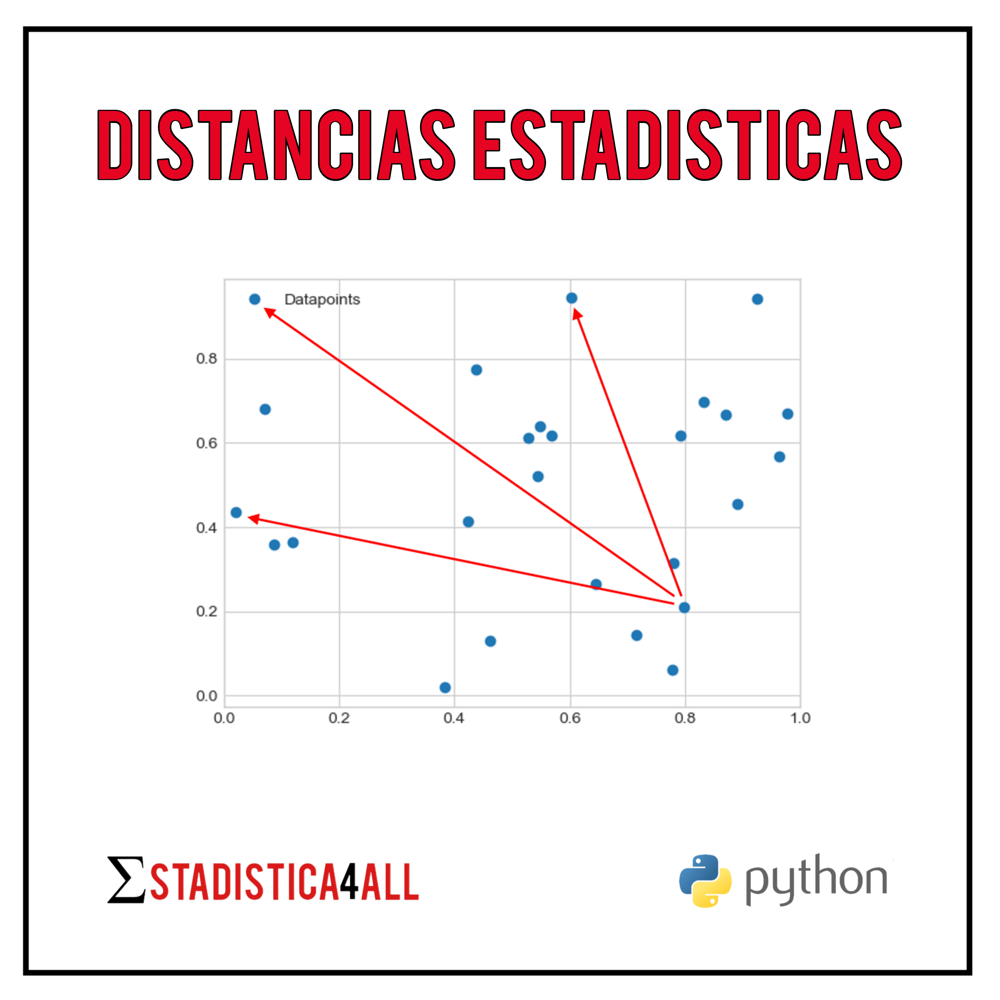

--- 
title: "Distancias Estadísticas"
author: "Fabio Scielzo Ortiz"
date: "`r Sys.Date()`"
site: bookdown::bookdown_site
documentclass: book
bibliography: book.bib
description: |
  Esta es una introducción a las distancias estadísticas.
link-citations: yes
github-repo: "rstudio/bookdown-demo"
---

# Introducción

<center>

{width="45%"}
</center>

 <br>

<div class="warning" style='background-color:#FCF2EC; color: #000000; border-left: solid #FE9554 7px; border-radius: 3px; size:1px ; padding:0.1em;'>
<span>
 
<p style='margin-left:10em;'>


- **Más artículos:    $\hspace{0.1cm}$ [Estadistica4all](https://fabioscielzoortiz.github.io/Estadistica4all.github.io/)**

- **Autor:** $\hspace{0.1cm}$ [Fabio Scielzo Ortiz](http://estadistica4all.com/autores/información.html)

- **Si utilizas este artículo, cítalo, por favor.**

$\hspace{0.75cm}$ Scielzo Ortiz, Fabio. (2023). Distancias Estadísticas. Estadistica4all. 


- ***Se recomienda abrir el artículo en un ordenador o en una tablet.***

</p>
 
</p></span>
</div>


 
 
 

<br>

El concepto de distancia entre observaciones de variables estadisticas tiene un papel relevante en muchas tecnicas y modelos estadistico tales como KNN, PCA, MDS, Clustering , Regresión  y Clasificacion (supervisada). Es por ello de especial relevancia para todo cientifico de datos saber que son las distancias estadisticas, que tipos hay y como implementarlas.


<br>

# Data-sets 

Vamos a cargar el data set con el que vamos a trabajar a lo largo de este artículo.

```python
import pandas as pd
import numpy as np
```


```python
Data = pd.read_csv('House_Price_Regression.csv')

np.random.seed(123)

Data['type'] = np.random.uniform(low=0, high=3, size=len(Data)).round()

Data['rating'] = np.random.uniform(low=0, high=5, size=len(Data)).round()

Data.head()
```


<div style="overflow-x: auto;" >
<table border="1" class="dataframe">
  <thead>
    <tr style="text-align: right;">
      <th></th>
      <th>neighborhood_recode</th>
      <th>latitude</th>
      <th>longitude</th>
      <th>price</th>
      <th>no_of_bedrooms</th>
      <th>no_of_bathrooms</th>
      <th>quality_recode</th>
      <th>maid_room_recode</th>
      <th>unfurnished_recode</th>
      <th>balcony_recode</th>
      <th>...</th>
      <th>private_jacuzzi_recode</th>
      <th>private_pool_recode</th>
      <th>security_recode</th>
      <th>shared_gym_recode</th>
      <th>shared_pool_recode</th>
      <th>shared_spa_recode</th>
      <th>view_of_water_recode</th>
      <th>size_in_m_2</th>
      <th>type</th>
      <th>rating</th>
    </tr>
  </thead>
  <tbody>
    <tr>
      <th>0</th>
      <td>46.0</td>
      <td>25.113208</td>
      <td>55.138932</td>
      <td>2700000</td>
      <td>1</td>
      <td>2</td>
      <td>2.0</td>
      <td>0.0</td>
      <td>0.0</td>
      <td>1.0</td>
      <td>...</td>
      <td>0.0</td>
      <td>0.0</td>
      <td>0.0</td>
      <td>1.0</td>
      <td>0.0</td>
      <td>0.0</td>
      <td>1.0</td>
      <td>100.242337</td>
      <td>2.0</td>
      <td>3.0</td>
    </tr>
    <tr>
      <th>1</th>
      <td>46.0</td>
      <td>25.106809</td>
      <td>55.151201</td>
      <td>2850000</td>
      <td>2</td>
      <td>2</td>
      <td>2.0</td>
      <td>0.0</td>
      <td>0.0</td>
      <td>1.0</td>
      <td>...</td>
      <td>0.0</td>
      <td>0.0</td>
      <td>0.0</td>
      <td>1.0</td>
      <td>1.0</td>
      <td>0.0</td>
      <td>1.0</td>
      <td>146.972546</td>
      <td>1.0</td>
      <td>2.0</td>
    </tr>
    <tr>
      <th>2</th>
      <td>36.0</td>
      <td>25.063302</td>
      <td>55.137728</td>
      <td>1150000</td>
      <td>3</td>
      <td>5</td>
      <td>2.0</td>
      <td>1.0</td>
      <td>1.0</td>
      <td>1.0</td>
      <td>...</td>
      <td>1.0</td>
      <td>0.0</td>
      <td>1.0</td>
      <td>1.0</td>
      <td>1.0</td>
      <td>0.0</td>
      <td>1.0</td>
      <td>181.253753</td>
      <td>1.0</td>
      <td>5.0</td>
    </tr>
    <tr>
      <th>3</th>
      <td>11.0</td>
      <td>25.227295</td>
      <td>55.341761</td>
      <td>2850000</td>
      <td>2</td>
      <td>3</td>
      <td>1.0</td>
      <td>0.0</td>
      <td>1.0</td>
      <td>1.0</td>
      <td>...</td>
      <td>0.0</td>
      <td>0.0</td>
      <td>0.0</td>
      <td>0.0</td>
      <td>0.0</td>
      <td>0.0</td>
      <td>0.0</td>
      <td>187.664060</td>
      <td>2.0</td>
      <td>5.0</td>
    </tr>
    <tr>
      <th>4</th>
      <td>46.0</td>
      <td>25.114275</td>
      <td>55.139764</td>
      <td>1729200</td>
      <td>0</td>
      <td>1</td>
      <td>2.0</td>
      <td>0.0</td>
      <td>0.0</td>
      <td>0.0</td>
      <td>...</td>
      <td>0.0</td>
      <td>0.0</td>
      <td>1.0</td>
      <td>1.0</td>
      <td>1.0</td>
      <td>1.0</td>
      <td>1.0</td>
      <td>47.101821</td>
      <td>2.0</td>
      <td>1.0</td>
    </tr>
  </tbody>
</table>
<p>5 rows × 31 columns</p>
</div>

<br>

<br>

Ahora vamos a hacer una distinción entre variables cuantitativas, binarias y multiclase (no binarias).

Creamos un data-set con las variables **cuantitativas**:

```python
Data_quant = Data.loc[: , ['latitude', 'longitude', 'price', 'size_in_m_2', 'no_of_bedrooms', 'no_of_bathrooms']]
```


```python
Data_quant.head()
```


<div style="overflow-x: auto;">
<table border="1" class="dataframe">
  <thead>
    <tr style="text-align: right;">
      <th></th>
      <th>latitude</th>
      <th>longitude</th>
      <th>price</th>
      <th>size_in_m_2</th>
      <th>no_of_bedrooms</th>
      <th>no_of_bathrooms</th>
    </tr>
  </thead>
  <tbody>
    <tr>
      <th>0</th>
      <td>25.113208</td>
      <td>55.138932</td>
      <td>2700000</td>
      <td>100.242337</td>
      <td>1</td>
      <td>2</td>
    </tr>
    <tr>
      <th>1</th>
      <td>25.106809</td>
      <td>55.151201</td>
      <td>2850000</td>
      <td>146.972546</td>
      <td>2</td>
      <td>2</td>
    </tr>
    <tr>
      <th>2</th>
      <td>25.063302</td>
      <td>55.137728</td>
      <td>1150000</td>
      <td>181.253753</td>
      <td>3</td>
      <td>5</td>
    </tr>
    <tr>
      <th>3</th>
      <td>25.227295</td>
      <td>55.341761</td>
      <td>2850000</td>
      <td>187.664060</td>
      <td>2</td>
      <td>3</td>
    </tr>
    <tr>
      <th>4</th>
      <td>25.114275</td>
      <td>55.139764</td>
      <td>1729200</td>
      <td>47.101821</td>
      <td>0</td>
      <td>1</td>
    </tr>
  </tbody>
</table>
</div>

<br>

<br>

Creamos un data-set con las variables **binarias**:

```python
Data_binary = Data.loc[: , ['private_garden_recode', 'private_gym_recode', 'private_jacuzzi_recode', 'balcony_recode']]

Data_binary.head()
```


<div style="overflow-x: auto;">
<table border="1" class="dataframe">
  <thead>
    <tr style="text-align: right;">
      <th></th>
      <th>private_garden_recode</th>
      <th>private_gym_recode</th>
      <th>private_jacuzzi_recode</th>
      <th>balcony_recode</th>
    </tr>
  </thead>
  <tbody>
    <tr>
      <th>0</th>
      <td>0.0</td>
      <td>0.0</td>
      <td>0.0</td>
      <td>1.0</td>
    </tr>
    <tr>
      <th>1</th>
      <td>0.0</td>
      <td>0.0</td>
      <td>0.0</td>
      <td>1.0</td>
    </tr>
    <tr>
      <th>2</th>
      <td>0.0</td>
      <td>0.0</td>
      <td>1.0</td>
      <td>1.0</td>
    </tr>
    <tr>
      <th>3</th>
      <td>0.0</td>
      <td>0.0</td>
      <td>0.0</td>
      <td>1.0</td>
    </tr>
    <tr>
      <th>4</th>
      <td>0.0</td>
      <td>0.0</td>
      <td>0.0</td>
      <td>0.0</td>
    </tr>
  </tbody>
</table>
</div>

<br>

<br>

Creamos un data-set con las variables **multiclase** (no binarias):

```python
Data_multiclass = Data.loc[: , ['quality_recode', 'rating', 'type']]

Data_multiclass.head()
```


<div style="overflow-x: auto;">
<table border="1" class="dataframe">
  <thead>
    <tr style="text-align: right;">
      <th></th>
      <th>quality_recode</th>
      <th>rating</th>
      <th>type</th>
    </tr>
  </thead>
  <tbody>
    <tr>
      <th>0</th>
      <td>2.0</td>
      <td>3.0</td>
      <td>2.0</td>
    </tr>
    <tr>
      <th>1</th>
      <td>2.0</td>
      <td>2.0</td>
      <td>1.0</td>
    </tr>
    <tr>
      <th>2</th>
      <td>2.0</td>
      <td>5.0</td>
      <td>1.0</td>
    </tr>
    <tr>
      <th>3</th>
      <td>1.0</td>
      <td>5.0</td>
      <td>2.0</td>
    </tr>
    <tr>
      <th>4</th>
      <td>2.0</td>
      <td>1.0</td>
      <td>2.0</td>
    </tr>
  </tbody>
</table>
</div>


<br>

<br>

Creamos un data-set que incluye las variables cuantitativas, binarias y multiclase que hemos considerado en los casos anteriores.

```python
Data_mixed = Data.loc[: , ['latitude', 'longitude', 'price', 'size_in_m_2', 'no_of_bedrooms', 'no_of_bathrooms','private_garden_recode', 'private_gym_recode', 'private_jacuzzi_recode', 'balcony_recode','quality_recode', 'rating', 'type']]

Data_mixed.head()
```


<div style="overflow-x: auto;">
<table border="1" class="dataframe">
  <thead>
    <tr style="text-align: right;">
      <th></th>
      <th>latitude</th>
      <th>longitude</th>
      <th>price</th>
      <th>size_in_m_2</th>
      <th>no_of_bedrooms</th>
      <th>no_of_bathrooms</th>
      <th>private_garden_recode</th>
      <th>private_gym_recode</th>
      <th>private_jacuzzi_recode</th>
      <th>balcony_recode</th>
      <th>quality_recode</th>
      <th>rating</th>
      <th>type</th>
    </tr>
  </thead>
  <tbody>
    <tr>
      <th>0</th>
      <td>25.113208</td>
      <td>55.138932</td>
      <td>2700000</td>
      <td>100.242337</td>
      <td>1</td>
      <td>2</td>
      <td>0.0</td>
      <td>0.0</td>
      <td>0.0</td>
      <td>1.0</td>
      <td>2.0</td>
      <td>3.0</td>
      <td>2.0</td>
    </tr>
    <tr>
      <th>1</th>
      <td>25.106809</td>
      <td>55.151201</td>
      <td>2850000</td>
      <td>146.972546</td>
      <td>2</td>
      <td>2</td>
      <td>0.0</td>
      <td>0.0</td>
      <td>0.0</td>
      <td>1.0</td>
      <td>2.0</td>
      <td>2.0</td>
      <td>1.0</td>
    </tr>
    <tr>
      <th>2</th>
      <td>25.063302</td>
      <td>55.137728</td>
      <td>1150000</td>
      <td>181.253753</td>
      <td>3</td>
      <td>5</td>
      <td>0.0</td>
      <td>0.0</td>
      <td>1.0</td>
      <td>1.0</td>
      <td>2.0</td>
      <td>5.0</td>
      <td>1.0</td>
    </tr>
    <tr>
      <th>3</th>
      <td>25.227295</td>
      <td>55.341761</td>
      <td>2850000</td>
      <td>187.664060</td>
      <td>2</td>
      <td>3</td>
      <td>0.0</td>
      <td>0.0</td>
      <td>0.0</td>
      <td>1.0</td>
      <td>1.0</td>
      <td>5.0</td>
      <td>2.0</td>
    </tr>
    <tr>
      <th>4</th>
      <td>25.114275</td>
      <td>55.139764</td>
      <td>1729200</td>
      <td>47.101821</td>
      <td>0</td>
      <td>1</td>
      <td>0.0</td>
      <td>0.0</td>
      <td>0.0</td>
      <td>0.0</td>
      <td>2.0</td>
      <td>1.0</td>
      <td>2.0</td>
    </tr>
  </tbody>
</table>
</div>


<br>


 


# Distancias  

Es un concepto que permite expresar una medida de distancia entre un par de elementos cualesquiera.


Consideremos un conjunto cualquiera $\hspace{0.01cm}A\hspace{0.03cm}$.


## Casi-métrica 

<div class="warning" style='background-color:#F7EBE8; color: #030000; border-left: solid #CA0B0B 7px; border-radius: 3px; size:1px ; padding:0.1em;'>
<span>
 
<p style='margin-left:1em;'>


$\hspace{0.25cm}$ Denominamos casi-métrica o disimilaridad a cualquier función $\hspace{0.02cm}\delta : A \hspace{0.05cm}\text{x}\hspace{0.05cm} A \rightarrow \mathbb{R}\hspace{0.03cm}$ que tiene las siguientes propiedades: 


- $\delta (i,j) \geq 0 \hspace{0.3cm} , \hspace{0.3cm}   \forall \hspace{0.08cm} i,j \in A$

- $\delta (i,i) = 0 \hspace{0.3cm} , \hspace{0.3cm} \forall \hspace{0.08cm} i \in  A$

- $\delta (i,j) = \delta (j, i) \hspace{0.3cm} , \hspace{0.3cm} \forall \hspace{0.08cm} i,j \in A$


</p>
 
</p></span>
</div>

<br>

<br>

## Semi-métrica  

<div class="warning" style='background-color:#F7EBE8; color: #030000; border-left: solid #CA0B0B 7px; border-radius: 3px; size:1px ; padding:0.1em;'>
<span>
 
<p style='margin-left:1em;'>


$\hspace{0.25cm}$ Es denominada **semi-métrica**  a toda casi-métrica que tiene la siguiente propiedad (desigualdad triangular) :


- $\delta (i,j) \hspace{0.15cm}\leq \hspace{0.15cm} \delta (i,k) \hspace{0.1cm} + \hspace{0.1cm} \delta (k,j) \hspace{0.3cm} , \hspace{0.3cm} \forall \hspace{0.08cm} i,j,k \in A$

</p>
 
</p></span>
</div>


<br>

<br>

## Métrica  


<div class="warning" style='background-color:#F7EBE8; color: #030000; border-left: solid #CA0B0B 7px; border-radius: 3px; size:1px ; padding:0.1em;'>
<span>
 
<p style='margin-left:1em;'>

$\hspace{0.25cm}$ Se denomina **metrica**  a toda semi-métrica que tiene la siguiente propiedad:

- $\delta (i,j)=0 \hspace{0.25cm}\Leftrightarrow\hspace{0.25cm} i=j \hspace{0.35cm} , \hspace{0.35cm} \forall \hspace{0.08cm} i,j \in A$

</p>
 
</p></span>
</div>

<br>

<br>

## Distancia  

Una **distancia** es una métrica o semi-métrica.
 

Podemos expresar esto de otra forma equivalente:

Sea $\hspace{0.02cm}\delta : A \hspace{0.05cm}x\hspace{0.05cm} A \rightarrow \mathbb{R}\hspace{0.02cm}$ ,

<div class="warning" style='background-color:#F7EBE8; color: #030000; border-left: solid #CA0B0B 7px; border-radius: 3px; size:1px ; padding:0.1em;'>
<span>
 
<p style='margin-left:1em;'>


- $\delta$ es una **distancia**, si y solo si : 

  
    Cumple las siguientes cuatro propiedades:

    -  $\delta (i,j)\hspace{0.1cm} \geq \hspace{0.1cm} 0 \hspace{0.3cm} , \hspace{0.3cm} \forall \hspace{0.08cm} i,j \in A$

    - $\delta (i,i) \hspace{0.08cm}=\hspace{0.08cm} 0 \hspace{0.3cm} , \hspace{0.3cm} \forall\hspace{0.08cm} i \in  A$

    -  $\delta (i,j) \hspace{0.1cm}=\hspace{0.1cm} \delta (j, i) \hspace{0.3cm} , \hspace{0.3cm} \forall\hspace{0.08cm} i,j \in A$

   - $\delta (i,j) \hspace{0.1 cm}\leq \hspace{0.1 cm} \delta (i,k) \hspace{0.1cm}+\hspace{0.1cm} \delta (k,j) \hspace{0.3cm} , \hspace{0.3cm} \forall\hspace{0.08cm} i,j,k \in A$


    o bien, cumple las cuatro anteriores y además la siguiente propiedad:

    - $\delta (i,j) \hspace{0.1cm}= \hspace{0.1cm} 0 \hspace{0.25cm}\Leftrightarrow\hspace{0.25cm} i=j \hspace{0.3cm} , \hspace{0.3cm} \forall\hspace{0.08cm} i,j \in A$

</p>
 
</p></span>
</div>

<br>

<br>

## Matriz de distancias


 Dada una distancia $\hspace{0.02cm}\delta\hspace{0.02cm}$ definida sobre el conjunto  $\hspace{0.02cm} A=\lbrace a_1,...,a_n\rbrace\hspace{0.02cm}$ .

<div class="warning" style='background-color:#F7EBE8; color: #030000; border-left: solid #CA0B0B 7px; border-radius: 3px; size:1px ; padding:0.1em;'>
<span>
 
<p style='margin-left:1em;'>

$\hspace{0.25cm}$ Se define la **matriz de distancias** $\hspace{0.02cm}\delta\hspace{0.02cm}$ sobre el conjunto de elementos $\hspace{0.02cm}A\hspace{0.02cm}$ como: $\\$

$$
D(\delta , A) \hspace{0.08cm}=\hspace{0.08cm} \begin{pmatrix}
0 & \delta_{12}& \delta_{13}&...&\delta_{1\hspace{0.07cm} n-1}&\delta_{1n}\\
\delta_{21} & 0& \delta_{23}&...&\delta_{2\hspace{0.07cm} n-1}&\delta_{2n}\\
\delta_{31} & \delta_{32} & 0&...&\delta_{3\hspace{0.07cm} n-1}&\delta_{3n}\\
...&...&...&...&...&...\\
\delta_{n1}& \delta_{n2}& \delta_{n3}&...&\delta_{n \hspace{0.07cm} n-1}& 0\\
\end{pmatrix}
$$


$\hspace{0.25cm}$ Donde:
 
$\hspace{0.6cm} \delta_{ir} = \delta(a_i,a_r) \hspace{0.25cm} , \hspace{0.25cm} \forall i,r \in \lbrace 1,...,n \rbrace$

$\hspace{0.6cm} \delta(a_i,a_r)\hspace{0.02cm}$ puede interpretarse como la distancia $\hspace{0.02cm}\delta\hspace{0.02cm}$ entre el par de elementos $\hspace{0.02cm}(a_i,a_r)\hspace{0.02cm}$ de $\hspace{0.02cm}A\hspace{0.02cm}.$

</p>
 
</p></span>
</div>

<br>

<br>

 

También es relevante en algunas técnicas estadísticas la **matriz de cuadrados de las distancias**:  $\\$


$$
D(\delta , A)^{(2)} \hspace{0.08cm}=\hspace{0.08cm} \begin{pmatrix}
0 & \delta_{12}^2& \delta_{13}^2&... &\delta_{1n}^2 \\
\delta_{21}^2 & 0& \delta_{23}^2 &... &\delta_{2n}^2 \\
...&...&...&...&...\\
\delta_{n1}^2 & \delta_{n2}^2 & \delta_{n3}^2 &...& 0 \\
\end{pmatrix} \\[0.25cm]
$$


 

**Observación:**

No debe confundirse $\hspace{0.02cm}D^{(2)}\hspace{0.02cm}$ con  $\hspace{0.02cm} D\hspace{0.05cm}^2=D\cdot D \hspace{0.02cm}$.


<br>


# Distancias con variables estadísticas cuantitativas 

El marco teórico en el que nos vamos a mover en esta sección es el siguiente:

 
- Tenemos una serie de variables estadísticas **cuantitativas** $\hspace{0.03cm}\mathcal{X}_1,...,\mathcal{X}_p\hspace{0.05cm} .$

- Para cada variable cuantitativa $\hspace{0.03cm}\mathcal{X}_j\hspace{0.03cm}$ tenemos una muestra de $\hspace{0.03cm}n\hspace{0.03cm}$ observaciones $\hspace{0.03cm}X_j\hspace{0.05cm}.$  

 
    Es decir, tenemos la siguiente muestra:

    - $X_j=(x_{1j},...,x_{nj})^t\hspace{0.03cm}$ , para $\hspace{0.03cm} j=1,...,p$ $\\$

    Donde $\hspace{0.03cm}x_{ij}\hspace{0.03cm}$ es la $\hspace{0.03cm} i$-esima observación de la variable $\hspace{0.03cm}\mathcal{X}_j\hspace{0.02cm}$   , para $\hspace{0.03cm}j=1,...,p\hspace{0.06cm}$ y $\hspace{0.06cm}i=1,...,n \hspace{0.05cm} .$ $\\$

    Por tanto :

    - $X_j=(x_{1j},...,x_{nj})^t\hspace{0.04cm}$ es el vector con las observaciones de la variable $\hspace{0.03cm}\mathcal{X}_j\hspace{0.03cm}$   , para $\hspace{0.03cm}j=1,...,p\hspace{0.04cm}$.

    - $x_i = (x_{i1} , x_{i2} ,..., x_{ip})^t\hspace{0.04cm}$ es el vector con las $\hspace{0.03cm} i$-esimas observaciones de las variables  $\hspace{0.03cm}\mathcal{X}_1,...,\mathcal{X}_p\hspace{0.03cm}$   , para $\hspace{0.03cm}i=1,...,n\hspace{0.04cm}$.


<br>


## Distancia Euclidea  


<div class="warning" style='background-color:#F7EBE8; color: #030000; border-left: solid #CA0B0B 7px; border-radius: 3px; size:1px ; padding:0.1em;'>
<span>
 
<p style='margin-left:1em;'>

$\hspace{0.25cm}$ La distancia **Euclidea** entre el par de observaciones $\hspace{0.03cm}(x_i , x_r)\hspace{0.03cm}$ de las variables cuantitativas $\hspace{0.03cm}\mathcal{X}_1,...,\mathcal{X}_p\hspace{0.03cm}$ se define como: $\\$


$$
\delta(x_i,x_r)_{Euclidea} \hspace{0.15cm} = \hspace{0.15cm} \sqrt{\sum_{k=1}^{p} (x_{ik} - x_{rk})\hspace{0.05cm}^2 \hspace{0.1cm} }  \hspace{0.15cm}=\hspace{0.15cm} \sqrt{(x_i - x_r)\hspace{0.05cm}^t\cdot (x_i - x_r)\hspace{0.1cm}}  \\[0.6cm]
$$


$\hspace{0.35cm}$ para $\hspace{0.15cm} i,r \hspace{0.08cm}=\hspace{0.08cm}  1,...,n \hspace{0.08cm} .$


</p>
 
</p></span>
</div>


<br>
 
**Observaciones:**


- $\delta(x_i,x_r)_{Euclidea}\hspace{0.03cm}$ puede interpretarse como la distancia Euclidea entre  los individuos $\hspace{0.03cm}i\hspace{0.03cm}$ y $\hspace{0.03cm}r\hspace{0.03cm}$ respecto de las variables estadísticas  $\hspace{0.03cm}\mathcal{X}_1,...,\mathcal{X}_p\hspace{0.05cm}.$  

    Nos da una medida de distancia entre individuos basada en  datos de esos individuos respecto a unas variables estadísticas.  


<br>


**Distancia Euclidea entre vectores**

 La distancia Euclidea no se circunscribe solamente al campo de la estadística, una definición mas general que contiene a la anteriormente dada es la siguiente:
 
 


Dados dos vectores  $\hspace{0.03cm}v=(v_1,...,v_n)^t\hspace{0.1cm}$ y $\hspace{0.1cm}w=(w_1,...,w_n)^t\hspace{0.1cm}$ de $\hspace{0.04cm}\mathbb{R}^n\hspace{0.04cm}$.

La distancia Euclidea entre esos vectores es: $\\$

$$
\hspace{0.25cm} \delta(v,w)_{Euclidea} \hspace{0.15cm}=\hspace{0.15cm}  \sqrt{ \hspace{0.1cm} \sum_{i=1}^{n} \hspace{0.08cm}  (v_{i} - w_{i})^2 \hspace{0.1cm}} \hspace{0.15cm} = \hspace{0.15cm} \sqrt{ \hspace{0.1cm} (v-w)^t \cdot (v-w) \hspace{0.1cm}} \\
$$

</p>
 
</p></span>
</div>


<br>


**Observación:**

$\delta(x_i,x_r)_{Euclidea}\hspace{0.03cm}$ es la distancia Euclidea entre los vectores (de observaciones) $\hspace{0.03cm} x_i=(x_{i1},x_{i2},...,x_{ip})\hspace{0.1cm}$ y $\hspace{0.1cm} x_r=(x_{r1},x_{r2},...,x_{rp})\hspace{0.03cm}$ de las variables estadísticas $\hspace{0.03cm} \mathcal{X}_1,...,\mathcal{X}_p\hspace{0.05cm}$.


<br>


**Desventajas de la distancia Euclidea** 


 
Aunque es una de las distancias más usadas en la práctica, en muchos casos no es la más adecuada desde un punto de vista estadístico por las siguientes razones: 

-  Asume que las variables están incorreladas y tienen varianza uno. 

-  No es invariante ante cambios de escala de las variables.


 
    Vamos a ver que significa esto último con mayor detalle:

    Si cambiamos la escala de las variables, es decir, aplicamos la siguiente transformación sobre las variables:

    $$a\cdot \mathcal{X}_j + b$$ 

    con $\hspace{0.1cm}a\neq 1\hspace{0.1cm}$ y $\hspace{0.1cm}b\neq 0$

    Ahora las observaciones de los elementos $\hspace{0.1cm}i\hspace{0.1cm}$ y $\hspace{0.1cm}r\hspace{0.1cm}$ son $\hspace{0.1cm}\hat{x}_i = a\cdot x_i + b\hspace{0.2cm}$ y $\hspace{0.2cm}\hat{x}_r = a\cdot x_r + b$

    Por lo que la distancia Euclidea entre el par de observaciones $\hat{x}_i$ y $\hat{x}_r$  es:

    $$
    \delta(\hat{x}_i , \hat{x}_r)_{Euclidea} \hspace{0.1cm}=\hspace{0.1cm} \delta(a\cdot x_i + b \hspace{0.1cm},\hspace{0.1cm} a\cdot x_r + b)_{Euclidea} \hspace{0.1cm}=\hspace{0.1cm} \sqrt{ a^2 \cdot (x_i - x_r)^t\cdot (x_i - x_r) }$$


<br>


**Ventajas de la distancia Euclidea**

- Facilidad de cálculo.  

- Facilidad de interpretación geométrica. Dados dos puntos en un espacio de dos o tres dimensiones, la distancia Euclidea entre ese par de puntos es la longitud del segmento que los une. Es una distancia fácil de visualizar e intuitiva.


<br>

<br>


### Distancia Euclidea en `Python` 


Definimos una función que calcula la distancia Euclidea entre dos observaciones dadas como argumento:

```python
def Dist_Euclidea(x_i, x_r):

        Dist_Euclidea = ( ( x_i - x_r )**2 ).sum()
        Dist_Euclidea = np.sqrt(Dist_Euclidea)
        
        return Dist_Euclidea
```

<br>

Probamos la función que acabamos de definir:
```python
Dist_Euclidea(Data_quant.iloc[2,:] , Data_quant.iloc[5,:])
```


    1969900.0019225744


<br>

Definimos una función que calcula la matriz de distancias euclideas entre las observaciones de un data-set dado como argumento. La función devuelve la matriz triangular superior de distancias euclideas.

```python
def Matrix_Dist_Euclidea(Data):

    Data = Data.to_numpy()
    n = len(Data)
    M =  np.empty((n , n))
    
    for i in range(0, n):
         for r in range(0, n):
             if i >= r :
                 M[i,r] = 0
             else :
                 M[i,r] = Dist_Euclidea(Data[i,:] , Data[r,:])   
                 
    return M 
```

<br>

Probamos la función:
```python
M_Euclidean = Matrix_Dist_Euclidea(Data=Data_quant)
```


```python
M_Euclidean
```


    array([[      0.        ,  150000.00728238, 1550000.00212124, ...,
             200000.01565902, 2025000.00024491, 1939113.00017324],
           [      0.        ,       0.        , 1700000.00034859, ...,
              50000.01055292, 2175000.00140691, 2089113.00126347],
           [      0.        ,       0.        ,       0.        , ...,
            1750000.00000111,  475000.01333737,  389113.0147095 ],
           ...,
           [      0.        ,       0.        ,       0.        , ...,
                  1.        , 2225000.00274952, 2139113.00257909],
           [      0.        ,       0.        ,       0.        , ...,
                  2.        ,       0.        ,   85887.00018092],
           [      0.        ,       0.        ,       0.        , ...,
                  3.        ,       0.        ,       0.        ]])


<br>


Completamos la matriz que hemos obtenido en el paso anterior, puesto que era solo la matriz triangular superior de distancias.
```python
M_Euclidean = M_Euclidean + M_Euclidean.T

M_Euclidean
```


    array([[      0.        ,  150000.00728238, 1550000.00212124, ...,
             200000.01565902, 2025000.00024491, 1939113.00017324],
           [ 150000.00728238,       0.        , 1700000.00034859, ...,
              50000.01055292, 2175000.00140691, 2089113.00126347],
           [1550000.00212124, 1700000.00034859,       0.        , ...,
            1750000.00000111,  475000.01333737,  389113.0147095 ],
           ...,
           [ 200000.01565902,   50000.01055292, 1750000.00000111, ...,
                  0.        , 2225000.00274952, 2139113.00257909],
           [2025000.00024491, 2175000.00140691,  475000.01333737, ...,
            2225000.00274952,       0.        ,   85887.00018092],
           [1939113.00017324, 2089113.00126347,  389113.0147095 , ...,
            2139113.00257909,   85887.00018092,       0.        ]])


<br>

<br>

##  Distancia de Minkowski 

<div class="warning" style='background-color:#F7EBE8; color: #030000; border-left: solid #CA0B0B 7px; border-radius: 3px; size:1px ; padding:0.1em;'>
<span>
 
<p style='margin-left:1em;'>

$\hspace{0.25cm}$ La distancia de **Minkowski** con parametro $\hspace{0.03cm} q=1,2,3,\dots \hspace{0.03cm}$ entre el par de observaciones $\hspace{0.03cm}(x_i , x_r)\hspace{0.03cm}$ de las variables estadisticas $\hspace{0.03cm} \mathcal{X}_1,. ..,\mathcal{X}_k\hspace{0.03cm}$  se define como: $\\$


$$
 \delta_q(x_i,x_r)_{Minkowski} \hspace{0.15cm} = \hspace{0.15cm}  \left(  \sum_{k=1}^{p} \hspace{0.08cm}  \mid x_{ik} - x_{rk} \mid  ^q  \right)^{(1/q)}     
$$

</p>
 
</p></span>
</div>


<br>


**Distancia Minkowski entre vectores**


La distancia de Minkowski puede definirse de un modo más general no sujeto al contexto estadístico.


Dados dos vectores $\hspace{0.1cm} v=(v_1,...,v_n)^t\hspace{0.1cm}$ y $\hspace{0.1cm} w=(w_1,...,w_n)^t\hspace{0.03cm}$ de $\hspace{0.1cm}\mathbb{R}^n\hspace{0.03cm}$.


 La distancia de Minkowski entre  esos vectores se define como:

$$
\delta_q(v,w)_{Minkowski}   \hspace{0.15cm}=\hspace{0.15cm}  \left( \sum_{i=1}^{n}  \mid v_{i } - w_{i} \mid  ^q  \right)^{(1/q)} \\
$$


**Observación:**

$\delta_q(x_i,x_r)_{Minkowski }\hspace{0.04cm}$ es la distancia de Minkowski entre los vectores (de observaciones) $\hspace{0.03cm} x_i=(x_{i1},x_{i2},...,x_{ip})\hspace{0.1cm}$ y $\hspace{0.1cm} x_r=(x_{r1},x_{r2},...,x_{rp})\hspace{0.03cm}$ de las variables estadísticas $\hspace{0.03cm} \mathcal{X}_1,...,\mathcal{X}_p \hspace{0.07cm}.$


<br>


**Desventajas de la distancia de Minkowski**


- Asume que las variables son incorreladas y tienen varianza uno. 

- No es invariante ante cambios de escala (cambios en las unidades de medida) de las variables. 

- Es difícilmente euclideanizable.


<br>

**Ventajas de la distancia de Minkowski**

- Es el caso general de varias distancias populares como la Euclidea o la Manhattan.


<br>


### Casos particulares de la distancia de Minkowski  


<div class="warning" style='background-color:#F7EBE8; color: #030000; border-left: solid #CA0B0B 7px; border-radius: 3px; size:1px ; padding:0.1em;'>
<span>
 
<p style='margin-left:1em;'>

$\hspace{0.25cm}$  **Distancia Euclidea** 


$$
 \delta_2(i,j)_{Minkowski }=\delta (i,j)_{Euclidea }   \hspace{1cm} (q=2) \\
$$
 
 
 </p>
 
</p></span>
</div>


<br>

<div class="warning" style='background-color:#F7EBE8; color: #030000; border-left: solid #CA0B0B 7px; border-radius: 3px; size:1px ; padding:0.1em;'>
<span>
 
<p style='margin-left:1em;'>

$\hspace{0.25cm}$  **Distancia Manhattan**


$$
 \delta_1(i,j)_{Minkowski } \hspace{0.1cm}=\hspace{0.1cm} \sum_{k=1}^{p}  \mid x_{ik} - x_{jk}  \mid   \hspace{1cm} (q=1) \\
$$

</p>
 
</p></span>
</div>


<br>

<div class="warning" style='background-color:#F7EBE8; color: #030000; border-left: solid #CA0B0B 7px; border-radius: 3px; size:1px ; padding:0.1em;'>
<span>
 
<p style='margin-left:1em;'>

$\hspace{0.25cm}$  **Distancia Dominante** <a class="anchor" id="23"></a>


$$
 \delta_{\infty}(i,j)_{Minkowski } \hspace{0.1cm}=\hspace{0.1cm} max \lbrace  \hspace{0.1cm} \mid x_{i1} - x_{j1} \mid \hspace{0.1cm},...,\hspace{0.1cm} \mid x_{ip} - x_{jp} \mid \hspace{0.1cm}  \rbrace \hspace{1cm} (q\rightarrow \infty) 
$$


</p>
 
</p></span>
</div>

<br>

<br>


### Distancia de Minkowski en `Python`

Definimos una función que calcula la distancia de Minkowski entre dos observaciones dadas como argumentos.
```python
def Dist_Minkowski(x_i, x_r, q):

    Dist_Minkowski = ( ( ( abs( x_i - x_r) )**q ).sum() )**(1/q)

    return Dist_Minkowski
```

<br>

Probamos la función para $\hspace{0.03cm} q=1$ :
```python
Dist_Minkowski(Data_quant.iloc[2,:], Data_quant.iloc[5,:], q=1)
```


```
1969992.0102169998
```

<br>

Probamos la función para $\hspace{0.03cm} q=2$ :
```python
Dist_Minkowski(Data_quant.iloc[2,:], Data_quant.iloc[5,:], q=2)
```


```
1969900.0019225744
```

<br>

Probamos la función para $\hspace{0.03cm} q=3$ :
```python
Dist_Minkowski(Data_quant.iloc[2,:], Data_quant.iloc[5,:], q=3)
```


```
1969900.000000055
```

<br>

Probamos la función para $\hspace{0.03cm} q=10$ :
```python
Dist_Minkowski(Data_quant.iloc[2,:], Data_quant.iloc[5,:], q=10)
```


```
1969900.0000000016
```

<br>

Definimos una función que calcula la matriz triangular superior de distancias de Minkowski entre las observaciones de un data-set pasado como argumento.

```python
def Matrix_Dist_Minkowski(Data, q):

    Data = Data.to_numpy()
    n = len(Data)
    M =  np.empty((n , n))

    for i in range(0, n):
         for r in range(0, n):
             if i >= r :
                 M[i,r] = 0
             else :
                 M[i,r] = Dist_Minkowski(Data[i,:] , Data[r,:], q)  
                      
    return M 
```

<br>

Probamos la función:
```python
M_Minkowski = Matrix_Dist_Minkowski(Data=Data_quant, q=1)

M_Minkowski
```


```
    array([[      0.      ,  150047.748877, 1550086.062526, ...,
             200084.359869, 2025031.624379, 1939138.969796],
           [      0.      ,       0.      , 1700038.338187, ...,
              50036.62379 , 2175079.33592 , 2089186.681337],
           [      0.      ,       0.      ,       0.      , ...,
            1750002.301489,  475117.608205,  389224.964166],
           ...,
           [      0.      ,       0.      ,       0.      , ...,
                  0.      , 2225115.802424, 2139223.298103],
           [      0.      ,       0.      ,       0.      , ...,
                  0.      ,       0.      ,   85892.654583],
           [      0.      ,       0.      ,       0.      , ...,
                  0.      ,       0.      ,       0.      ]])
```


<br>

Completamos la matriz triangular superior de distancias obtenidas:
```python
M_Minkowski = M_Minkowski + M_Minkowski.T

M_Minkowski
```


```
    array([[      0.      ,  150047.748877, 1550086.062526, ...,
             200084.359869, 2025031.624379, 1939138.969796],
           [ 150047.748877,       0.      , 1700038.338187, ...,
              50036.62379 , 2175079.33592 , 2089186.681337],
           [1550086.062526, 1700038.338187,       0.      , ...,
            1750002.301489,  475117.608205,  389224.964166],
           ...,
           [ 200084.359869,   50036.62379 , 1750002.301489, ...,
                  0.      , 2225115.802424, 2139223.298103],
           [2025031.624379, 2175079.33592 ,  475117.608205, ...,
            2225115.802424,       0.      ,   85892.654583],
           [1939138.969796, 2089186.681337,  389224.964166, ...,
            2139223.298103,   85892.654583,       0.      ]])
```

<br>

 
<br>


## Distancia de Canberra  


<div class="warning" style='background-color:#F7EBE8; color: #030000; border-left: solid #CA0B0B 7px; border-radius: 3px; size:1px ; padding:0.1em;'>
<span>
 
<p style='margin-left:1em;'>


$\hspace{0.25cm}$ La distancia de **Canberra** entre el par de observaciones $\hspace{0.03cm}(x_i , x_r)\hspace{0.03cm}$ de las variables estadísticas $\hspace{0.03cm} \mathcal{X}_1,. ..,\mathcal{X}_k\hspace{0.03cm}$  se define como: $\\$


$$
\delta(x_i,x_r)_{Canberra}\hspace{0.15cm}= \hspace{0.15cm} \sum_{k=1}^{p} \hspace{0.08cm} \dfrac{\hspace{0.08cm} \mid x_{ik} - x_{jk} \mid \hspace{0.08cm}}{\mid x_{ik} \mid + \mid x_{jk} \mid}  \\
$$

</p>
 
</p></span>
</div>


<br>


**Distancia Canberra entre vectores**

La distancia de Canberra se puede definir de forma más general no sujeta a un contexto estadístico.

Dados dos vectores $\hspace{0.03cm}v=(v_1,...,v_n)^t\hspace{0.08cm}$ y $\hspace{0.07cm}w=(w_1,...,w_n)^t\hspace{0.03cm}$ de $\hspace{0.03cm}\mathbb{R}^n\hspace{0.03cm}$.


La distancia Canberra entre esos dos vectores es: 

$$
\delta (v,w)_{Canberra}  \hspace{0.07cm}=\hspace{0.07cm}   \sum_{i=1}^{n}\hspace{0.07cm} \dfrac{\hspace{0.07cm} \mid v_i - w_i \mid \hspace{0.07cm}}{\mid v_i \mid + \mid w_i \mid} \\
$$


**Observación:**

$\delta_q(x_i,x_r)_{Canberra}\hspace{0.1cm}$ es la distancia de Canberra entre los vectores (de observaciones) $\hspace{0.03cm} x_i=(x_{i1},x_{i2},...,x_{ip})\hspace{0.12cm}$ y $\hspace{0.12cm} x_r=(x_{r1},x_{r2},...,x_{rp})\hspace{0.03cm}$ de las variables estadísticas $\hspace{0.03cm} \mathcal{X}_1,...,\mathcal{X}_p\hspace{0.05cm}$.


<br>

**Desventajas de la distancia de Canberra**

- Asumen que las variables son incorreladas y tienen varianza uno.


<br>


**Ventajas de la distancia de Canberra**

- Es invariante ante cambios de escala (cambios en las unidades de medida) de las variables.


<br>

<br>


### Distancia de Canberra en `Python`  

Definimos una función que calcula la distancia de Canberra entre un par de observaciones pasadas como argumentos.
```python
def Dist_Canberra(x_i, x_r):

    numerator =  abs( x_i - x_r )
    denominator =  ( abs(x_i) + abs(x_r) )
    numerator=np.array([numerator], dtype=float)
    denominator=np.array([denominator], dtype=float)

    # The following code is to eliminate zero division problems
    Dist_Canberra = ( np.divide( numerator , denominator , out=np.zeros_like(numerator), where=denominator!=0) ).sum() 

    return Dist_Canberra
```

<br>

Probamos la función:
```python
Dist_Canberra(Data.iloc[2,:] , Data.iloc[5,:])
```


    8.8284791957755


<br>

Definimos una función que calcula la matriz triangular superior de distancias de Canberra entre las observaciones de un data-set pasado como argumento:
```python
def Matrix_Dist_Canberra(Data):

    Data = Data.to_numpy()
    n = len(Data)
    M =  np.empty((n , n))

    for i in range(0, n):
         for r in range(0, n):
             if i >= r :
                 M[i,r] = 0
             else :
                 M[i,r] = Dist_Canberra(Data[i,:] , Data[r,:])   
                     
    return M 
```
<br>

Probamos la función:
```python
M_Canberra = Matrix_Dist_Canberra(Data=Data_quant)

M_Canberra
```


    array([[0.        , 0.5496257 , 1.61996314, ..., 1.25082356, 0.78797391,
            0.70959891],
           [0.        , 0.        , 1.15900459, ..., 0.74009173, 1.31434216,
            1.24077176],
           [0.        , 0.        , 0.        , ..., 0.44223489, 1.63990915,
            1.55106392],
           ...,
           [0.        , 0.        , 0.        , ..., 0.        , 2.00032192,
            1.93106183],
           [0.        , 0.        , 0.        , ..., 0.        , 0.        ,
            0.09956138],
           [0.        , 0.        , 0.        , ..., 0.        , 0.        ,
            0.        ]])


<br>

Completamos la matriz obtenida:
```python
M_Canberra = M_Canberra + M_Canberra.T

M_Canberra
```


    array([[0.        , 0.5496257 , 1.61996314, ..., 1.25082356, 0.78797391,
            0.70959891],
           [0.5496257 , 0.        , 1.15900459, ..., 0.74009173, 1.31434216,
            1.24077176],
           [1.61996314, 1.15900459, 0.        , ..., 0.44223489, 1.63990915,
            1.55106392],
           ...,
           [1.25082356, 0.74009173, 0.44223489, ..., 0.        , 2.00032192,
            1.93106183],
           [0.78797391, 1.31434216, 1.63990915, ..., 2.00032192, 0.        ,
            0.09956138],
           [0.70959891, 1.24077176, 1.55106392, ..., 1.93106183, 0.09956138,
            0.        ]])


<br>

<br>

## Distancia de Pearson  

 Dada una matriz de datos $\hspace{0.03cm} X = (X_1,...,X_p)\hspace{0.03cm}$ de las variables estadísticas  $\hspace{0.03cm}\mathcal{X}_1,...,\mathcal{X}_p\hspace{0.03cm}.$
 
<div class="warning" style='background-color:#F7EBE8; color: #030000; border-left: solid #CA0B0B 7px; border-radius: 3px; size:1px ; padding:0.1em;'>
<span>
 
<p style='margin-left:1em;'>


$\hspace{0.25cm}$ La distancia de  **Pearson** entre el par de observaciones $\hspace{0.03cm}(x_i,x_r)\hspace{0.03cm}$ de las variables estadísticas $\hspace{0.03cm}\mathcal{X}_1,...,\mathcal{X}_p\hspace{0.03cm}$ se define como: $\\$

$$
\delta(x_i,x_r)_{Pearson} \hspace{0.15cm}=\hspace{0.15cm} \sqrt{ \hspace{0.1cm} \sum_{k=1}^{p} \hspace{0.1cm} \dfrac{1}{s\hspace{0.03cm}^2_k} \cdot ( x_{ik} - x_{rk} )\hspace{0.03cm}^2 \hspace{0.1cm} } \hspace{0.12cm} =\hspace{0.12cm} \sqrt{\hspace{0.1cm}(x_i - x_r)\hspace{0.03cm}^t \cdot S_0^{-1} \cdot (x_i - x_r )\hspace{0.1cm}}   \\
$$
  
$\hspace{0.35cm}$ Donde:
 
- $S_0 \hspace{0.1cm}=\hspace{0.1cm} \text{diag}(s_1 ^2 ,..., s_p ^2)$
 
- $s_k ^2\hspace{0.1cm}$ es la varianza de la muestra $\hspace{0.08cm}X_k\hspace{0.08cm}$ , es decir, $\hspace{0.1cm} s_k ^2 \hspace{0.1cm}=\hspace{0.1cm} \dfrac{1}{n}\cdot \sum_{i=1}^n ( x_{ik} - \overline{X}_k )^2\hspace{0.07cm}.$

</p>
 
</p></span>
</div>


<br>


**Observación:**

Con la distancia de Karl Pearson, el peso que se le da a la diferencia entre las observaciones de una variable para un par de  individuos decrece cuanto mayor es la varianza de la variable, y aumenta cuanto menor es la varianza.

Es decir, si la variable $\hspace{0.03cm}\mathcal{X}_k\hspace{0.03cm}$ tiene mucha varianza muestral, es decir, mucha $\hspace{0.03cm}s_k ^2\hspace{0.03cm}$ , entonces $\hspace{0.03cm}(x_{ik} - x_{rk})\hspace{0.03cm}$ tiene muy poco peso en la distancia de Pearson. Cuanto menor sea la varianza, mas peso tendrá, y a la inversa.


<br>


**Desventajas de la distancia de Pearson**
 
- Asume que las variables estan incorreladas y tienen varianza uno.


<br>


**Ventajas de la distancia de Pearson**

- La distancia de Pearson es invariante ante cambios de escala (cambios en las unidades de medida).


<br>

<br>


### Distancia de Pearson en `Python`  

Definimos una función que calcula la distancia de Pearson entre un par de observaciones pasadas como argumento.
```python
def Dist_Pearson(x_i, x_r, variance) :
# variance es un vector con las varianzas muestrales de las variables que se están considerando.

    Dist_Pearson = ( ( x_i - x_r )**2 / variance ).sum()
    Dist_Pearson = np.sqrt(Dist_Pearson)

    return Dist_Pearson
```

<br>

Probamos la función:

```python
Dist_Pearson(x_i=Data_quant.iloc[2,:], x_r=Data_quant.iloc[5,:], variance = np.var(Data_quant , axis=0, ddof=1))
```


    3.8239347754243425


<br>


Definimos una función que calcula la matriz triangular superior de distanciass de Pearson entre las observaciones de un data-set que se pasa como argumento.
```python
def Matrix_Dist_Pearson(Data):

    Data = Data.to_numpy()
    n = len(Data)
    M =  np.empty((n , n))

    for i in range(0, n):
         for r in range(0, n):
             if i >= r :
                 M[i,r] = 0
             else :
                 M[i,r] = Dist_Pearson(Data[i,:] , Data[r,:], variance=np.var(Data, axis=0, ddof=1))   
                     
    return M 
```

<br>

Probamos la función:
```python
M_Pearson = Matrix_Dist_Pearson(Data=Data_quant)

M_Pearson
```


    array([[0.        , 1.21345279, 3.77819153, ..., 4.95085256, 1.66393723,
            0.94314867],
           [0.        , 0.        , 3.17880538, ..., 4.43821303, 2.03523139,
            1.60958264],
           [0.        , 0.        , 0.        , ..., 3.82999056, 4.01162596,
            3.76955491],
           ...,
           [0.        , 0.        , 0.        , ..., 0.        , 4.69603617,
            5.13174853],
           [0.        , 0.        , 0.        , ..., 0.        , 0.        ,
            1.09780835],
           [0.        , 0.        , 0.        , ..., 0.        , 0.        ,
            0.        ]])


<br>


Completamos la matriz obtenida:
```python
M_Pearson = M_Pearson + M_Pearson.T

M_Pearson
```


    array([[0.        , 1.21345279, 3.77819153, ..., 4.95085256, 1.66393723,
            0.94314867],
           [1.21345279, 0.        , 3.17880538, ..., 4.43821303, 2.03523139,
            1.60958264],
           [3.77819153, 3.17880538, 0.        , ..., 3.82999056, 4.01162596,
            3.76955491],
           ...,
           [4.95085256, 4.43821303, 3.82999056, ..., 0.        , 4.69603617,
            5.13174853],
           [1.66393723, 2.03523139, 4.01162596, ..., 4.69603617, 0.        ,
            1.09780835],
           [0.94314867, 1.60958264, 3.76955491, ..., 5.13174853, 1.09780835,
            0.        ]])


<br>


<br>


## Distancia de Mahalanobis  

Dada una matriz de datos $\hspace{0.03cm} X=(X_1,...,X_p)\hspace{0.03cm}$ de las variables estadísticas  $\hspace{0.03cm}\mathcal{X}_1,...,\mathcal{X}_p$


<div class="warning" style='background-color:#F7EBE8; color: #030000; border-left: solid #CA0B0B 7px; border-radius: 3px; size:1px ; padding:0.1em;'>
<span>
 
<p style='margin-left:1em;'>

 
$\hspace{0.25cm}$ La distancia de Mahalanobis entre el par de observaciones $\hspace{0.1cm}(x_i,x_r)\hspace{0.1cm}$ de las variables estadísticas $\hspace{0.1cm}\mathcal{X}_1,...,\mathcal{X}_p$ se define como: $\\$

 
$$
 \delta(x_i,x_r)_{Maha} \hspace{0.15cm}= \hspace{0.15cm} \sqrt{\hspace{0.1cm}(x_i - x_r)\hspace{0.03cm}^t \cdot S^{-1} \cdot (x_i - x_r ) \hspace{0.1cm}}   \\
$$

</p>
 
</p></span>
</div>

<br>

Donde:

- $S \hspace{0.03cm}$ es la estimación de la matriz de covarianzas de las variables  $\hspace{0.03cm}(\mathcal{X}_1,\dots , \mathcal{X}_p)\hspace{0.03cm}$ basada en la matriz de datos $\hspace{0.03cm}X=(X_1,...,X_p)\hspace{0.03cm}.$

  
    Es decir: 

    $$S  \hspace{0.1cm}= \hspace{0.1cm} \bigl(  \hspace{0.1cm} s_{jk}   \hspace{0.2cm} :  \hspace{0.2cm} j,k = 1,\dots , p  \hspace{0.1cm} \bigr)$$

    donde:

    $$s_{jk}  \hspace{0.1cm}= \hspace{0.1cm} S(X_j, X_k)  \hspace{0.1cm}= \hspace{0.1cm} \dfrac{1}{n}\cdot \sum_{i=1}^n  \hspace{0.1cm} (x_{ij}-\overline{X}_j)\cdot (x_{ik}-\overline{X}_k)$$


<br>


**Ventajas**

La distancia de Mahalanobis es adecuada como distancia estadística por las siguientes razones: 

- Es invariante ante cambios de escala (cambios en las unidades de medida) de las variables. 

- Tiene en cuenta la correlación entre las variables. No aumenta al incrementar el número de variables observadas. Solo aumenta cuando estas nuevas variables no están correladas con las anteriores. Así que solo cuando las nuevas variables no son redundantes con respecto a la infromación provista por las anteriores, la distancia de Mahalanobis aumentará. 

 
<br>

**Observaciones**

- La distancia Euclidea es igual a la de Mahalanobis cuando $\hspace{0.03cm} S=I$.

- La distancia de Pearson es igual a la de Mahalanobis cuando $\hspace{0.03cm} S=\text{diag}(s_1^2 ,..., s_p^2)$.


<br>

**Distancia Mahalanobis entre los vectores $\hspace{0.05cm}x_i\hspace{0.1cm}$ y $\hspace{0.1cm}v\hspace{0.1cm}$**

La distancia de Mahalanobis puede definirse de forma más general, para abordar el caso en el que uno de los vectores del par considerado no pertenecen a la matriz de datos a partir de la que se calcula la matriz de covarianzas $\hspace{0.03cm}S\hspace{0.03cm}$.

Dada una matriz de datos $\hspace{0.03cm}X=(X_1,...,X_p)\hspace{0.03cm}$ de las variables estadísticas $\hspace{0.03cm}\mathcal{X}_1,...,\mathcal{X}_n\hspace{0.03cm}$.

Dada una observación $\hspace{0.03cm}x_i\hspace{0.03cm}$ de esas variables estadísticas tal que $\hspace{0.03cm}x_i = X[i,:]\hspace{0.1cm}$  y dado un vector  $\hspace{0.03cm}v=(v_1,...,v_p)^t\hspace{0.03cm} \in \hspace{0.03cm}\mathbb{R}^p\hspace{0.03cm}$ , que no está incluido en la matriz de datos $\hspace{0.03cm}X\hspace{0.03cm}$.


La distancia Mahalanobis entre $\hspace{0.03cm}x_i\hspace{0.1cm}$ y $\hspace{0.1cm}v\hspace{0.03cm}$ es: $\\$

$$
\delta (x_i, v)_{Mahalanobis}  \hspace{0.09cm}=\hspace{0.09cm}  \sqrt{\hspace{0.07cm}(x_i - v)\hspace{0.03cm}^t \cdot S^{-1} \cdot (x_i - v) \hspace{0.07cm}} \\
$$


 Vamos a considerar dos alternativas para definir $\hspace{0.03cm} S\hspace{0.03cm}$ : 

- $S\hspace{0.03cm}$ es la matriz de covarianzas de la matriz de datos $\hspace{0.03cm} X=(X_1,...,X_p)$.

- $S\hspace{0.03cm}$ es la matriz de covarianzas de la matriz de datos $\hspace{0.03cm} \begin{pmatrix}
    X\\
    v^t
    \end{pmatrix}.$
    
  


<br>


**Observaciones:**


Esta ampliación de la distancia de Mahalanobis a vectores que no necesariamente forman parte de la matriz de datos permite ampliar su capacidad de aplicación. Vamos a dar varios ejemplos en donde la distancia de Gower definida estrictamente entre pares de observaciones de una matriz de datos no podria aplicarse, y que en cambio su versión ampliada si permite hacerlo.

- En el algoritmo KNN se requiere de una distancia que pueda aplicarse a un vector de observaciones de las variables que no pertenece a la matriz de datos de entrenamiento. Ese vector juega el papel de $\hspace{0.03cm}v\hspace{0.03cm}$ en la definición anterior. 

- En el algoritmo k-medias se requiere de una distancia que pueda aplicarse sobre el vector de medias $\hspace{0.03cm}\bar{x}\hspace{0.03cm}$ de la matriz de datos de entrenamiento. Tomando $\hspace{0.03cm}v=\bar{x}\hspace{0.03cm}$ se podría aplicar también en este caso la distancia de Mahalanobis. 

Además esto no solo amplia la aplicabilidad de la distancia de Mahalanobis, sino también aquellas relacionadas con ella, como la distancia de Gower-Mahalanobis, que veremos mas adelante.


Por último señalar que las alternativas para definir $\hspace{0.03cm}S\hspace{0.03cm}$ son las que consideramos más razonables. En el caso de que $\hspace{0.03cm}v\hspace{0.03cm}$ fuese un vector de observaciones de las variables estadísticas, consideramos que los mas razonable es seguir la segunda definición. Pero en el caso de que $\hspace{0.03cm}v\hspace{0.03cm}$ fuese el vector de medias de las variables, lo más razonable sería seguir la primera definición.
 
<br>

<br>

### Distancia de Mahalanobis en `Python` 


Definimos una función que calcula la distancia de Mahalanobis entre un par de observaciones pasadas como argumentos.
```python
def Dist_Mahalanobis_1(x_i, x_r, Data):

    # All the columns of Data must be type = 'float' or 'int' (specially not 'object') ,
    # in other case we will find dimensional problems when Python compute   x @ S_inv @ x.T

    x = (x_i - x_r)
    x = np.array([x]) # necessary step to transpose a 1D array
    S_inv = np.linalg.inv( np.cov(Data , rowvar=False) ) # inverse of covariance matrix
    Dist_Maha = np.sqrt( x @ S_inv @ x.T )  # x @ S_inv @ x.T = np.matmul( np.matmul(x , S_inv) , x.T )
    Dist_Maha = float(Dist_Maha)

    return Dist_Maha
```

<br>

Probamos la función:
```python
Dist_Mahalanobis_1(Data_quant.iloc[2,:] , Data_quant.iloc[5,:] , Data=Data_quant)
```


    3.931396144771864


<br>


Definimos otra función que calcula la distancia de Mahalanobis entre un par de observaciones pasadas como argumentos, en este caso es más eficiente computacionalmente que la anterior.
```python
def Dist_Mahalanobis_2(x_i, x_r, S_inv):  # Más eficiente que la anterior

    # All the columns of Data must be type = 'float' or 'int' (specially not 'object'), in other case we will find 
    # dimensional problems when Python compute   x @ S_inv @ x.T

    x = x_i - x_r
    x = np.array([x]) # necessary step to transpose a 1D array
    Dist_Maha = np.sqrt( x @ S_inv @ x.T )  # x @ S_inv @ x.T = np.matmul( np.matmul(x , S_inv) , x.T )
    Dist_Maha = float(Dist_Maha)

    return Dist_Maha
```

<br>

Probamos la función:
```python
Dist_Mahalanobis_2(x_i = Data_quant.iloc[2,:] , x_r = Data_quant.iloc[5,:] , S_inv = np.linalg.inv( np.cov(Data_quant, rowvar=False) ) )
```


    3.931396144771864

<br>


Definimos otra función que calcula la distancia de Mahalanobis entre un par de observaciones pasadas como argumentos, en este caso es más eficiente computacionalmente que las dos anteriores.
```python
def Dist_Mahalanobis(x, S_inv):  # Más eficiente que la anterior

    # All the columns of Data must be type = 'float' or 'int' (specially not 'object'), in other case we will find 
    # dimensional problems when Python compute   x @ S_inv @ x.T
    # x = (x_i - x_r)
    # x = np.array([x]) # necessary step to transpose a 1D array

    Dist_Maha = np.sqrt( x @ S_inv @ x.T )  # x @ S_inv @ x.T = np.matmul( np.matmul(x , S_inv) , x.T )
    Dist_Maha = float(Dist_Maha)

    return Dist_Maha
```

<br>

Probamos la función:
```python
Dist_Mahalanobis(x = Data_quant.iloc[2,:] - Data_quant.iloc[5,:] , S_inv=np.linalg.inv( np.cov(Data_quant, rowvar=False) ))
```


    3.931396144771864


<br>

Definimos una función para calcular la matriz de distancias de Mahalanobis entre las observaciones de un data-set pasado como argumento, usando `Dist_Mahalanobis_1` como función interna para el cálculo de las distancias.
```python
def Matrix_Dist_Mahalanobis_1(Data):

    Data = Data.to_numpy()
    n = len(Data)
    M =  np.empty((n , n))

    for i in range(0, n):
         for r in range(0, n):
             if i >= r :
                 M[i,r] = 0
             else :
                 M[i,r] = Dist_Mahalanobis_1(x_i = Data[i,:] , x_r = Data[r,:] , Data=Data )

    return M 
```

<br>

Probamos la función con un subconjunto del data-set original:
```python
Matrix_Dist_Mahalanobis_1(Data=Data_quant.iloc[0:1000, :]) # 2.25 mins
```


    array([[0.        , 2.16321817, 3.81131086, ..., 2.74083537, 3.84799958,
            1.06041471],
           [0.        , 0.        , 4.29953104, ..., 2.76698155, 2.78100414,
            2.20791581],
           [0.        , 0.        , 0.        , ..., 2.63546884, 4.34269664,
            3.32469143],
           ...,
           [0.        , 0.        , 0.        , ..., 0.        , 2.18534065,
            1.8408748 ],
           [0.        , 0.        , 0.        , ..., 0.        , 0.        ,
            3.09496075],
           [0.        , 0.        , 0.        , ..., 0.        , 0.        ,
            0.        ]])


<br>

Probamos la función con todas las filas del data-set:
```python
Matrix_Dist_Mahalanobis_1(Data=Data_quant) # 8.52 mins
```


    array([[0.        , 2.11289055, 3.7975463 , ..., 4.51559865, 2.31688444,
            1.10588047],
           [0.        , 0.        , 4.35615967, ..., 4.93340427, 2.74011739,
            2.12938584],
           [0.        , 0.        , 0.        , ..., 3.17779509, 3.49432487,
            3.23723317],
           ...,
           [0.        , 0.        , 0.        , ..., 0.        , 3.58695453,
            4.11275247],
           [0.        , 0.        , 0.        , ..., 0.        , 0.        ,
            1.46894947],
           [0.        , 0.        , 0.        , ..., 0.        , 0.        ,
            0.        ]])

<br>

Definimos una función para calcular la matriz de distancias de Mahalanobis entre las observaciones de un data-set pasado como argumento, usando `Dist_Mahalanobis_2` como función interna para el cálculo de las distancias.
```python
def Matrix_Dist_Mahalanobis_2(Data):

    Data = Data.to_numpy()
    n = len(Data)
    M =  np.empty((n , n))
    S_inv = np.linalg.inv( np.cov(Data , rowvar=False) )

    for i in range(0, n):
         for r in range(0, n):
             if i >= r :
                 M[i,r] = 0
             else :
                 M[i,r] = Dist_Mahalanobis_2(x_i = Data[i,:] , x_r = Data[r,:] , S_inv = S_inv  )
                      
    return M 
```


<br>

Probamos la función con un subconjunto del data-set original:
```python
Matrix_Dist_Mahalanobis_2(Data=Data_quant.iloc[0:1000, :]) # 6.8 seg
```


    array([[0.        , 2.16321817, 3.81131086, ..., 2.74083537, 3.84799958,
            1.06041471],
           [0.        , 0.        , 4.29953104, ..., 2.76698155, 2.78100414,
            2.20791581],
           [0.        , 0.        , 0.        , ..., 2.63546884, 4.34269664,
            3.32469143],
           ...,
           [0.        , 0.        , 0.        , ..., 0.        , 2.18534065,
            1.8408748 ],
           [0.        , 0.        , 0.        , ..., 0.        , 0.        ,
            3.09496075],
           [0.        , 0.        , 0.        , ..., 0.        , 0.        ,
            0.        ]])


<br>

Probamos la función con un todas las filas del data-set original:
```python
Matrix_Dist_Mahalanobis_2(Data=Data_quant) # 22.5 seg
```


    array([[0.        , 2.11289055, 3.7975463 , ..., 4.51559865, 2.31688444,
            1.10588047],
           [0.        , 0.        , 4.35615967, ..., 4.93340427, 2.74011739,
            2.12938584],
           [0.        , 0.        , 0.        , ..., 3.17779509, 3.49432487,
            3.23723317],
           ...,
           [0.        , 0.        , 0.        , ..., 0.        , 3.58695453,
            4.11275247],
           [0.        , 0.        , 0.        , ..., 0.        , 0.        ,
            1.46894947],
           [0.        , 0.        , 0.        , ..., 0.        , 0.        ,
            0.        ]])


<br>

Definimos una función para calcular la matriz de distancias de Mahalanobis entre las observaciones de un data-set pasado como argumento, usando `Dist_Mahalanobis` como función interna para el cálculo de las distancias.
```python
def Matrix_Dist_Mahalanobis(Data):

    Data = Data.to_numpy()
    n = len(Data)
    M =  np.empty((n , n))
    S_inv=np.linalg.inv( np.cov(Data , rowvar=False) )
   
    for i in range(0, n):
         for r in range(0, n):
             if i >= r :
                 M[i,r] = 0
             else :
                 M[i,r] = Dist_Mahalanobis(x = np.array([Data[i,:] - Data[r,:]]) , S_inv=S_inv ) 
                      
    return M 
```

<br>

Probamos la función con un subconjunto del data-set original:
```python
Matrix_Dist_Mahalanobis(Data=Data_quant.iloc[0:1000, :]) # 4.8 seg
```


    array([[0.        , 2.16321817, 3.81131086, ..., 2.74083537, 3.84799958,
            1.06041471],
           [0.        , 0.        , 4.29953104, ..., 2.76698155, 2.78100414,
            2.20791581],
           [0.        , 0.        , 0.        , ..., 2.63546884, 4.34269664,
            3.32469143],
           ...,
           [0.        , 0.        , 0.        , ..., 0.        , 2.18534065,
            1.8408748 ],
           [0.        , 0.        , 0.        , ..., 0.        , 0.        ,
            3.09496075],
           [0.        , 0.        , 0.        , ..., 0.        , 0.        ,
            0.        ]])


<br>

Probamos la función con todas las filas del data-set original:
```python
M_Mahalanobis = Matrix_Dist_Mahalanobis(Data=Data_quant) # 19.7 seg

M_Mahalanobis
```


    array([[0.        , 2.11289055, 3.7975463 , ..., 4.51559865, 2.31688444,
            1.10588047],
           [0.        , 0.        , 4.35615967, ..., 4.93340427, 2.74011739,
            2.12938584],
           [0.        , 0.        , 0.        , ..., 3.17779509, 3.49432487,
            3.23723317],
           ...,
           [0.        , 0.        , 0.        , ..., 0.        , 3.58695453,
            4.11275247],
           [0.        , 0.        , 0.        , ..., 0.        , 0.        ,
            1.46894947],
           [0.        , 0.        , 0.        , ..., 0.        , 0.        ,
            0.        ]])


<br>

Completamos la matriz:
```python
M_Mahalanobis = M_Mahalanobis + M_Mahalanobis.T

M_Mahalanobis
```


    array([[0.        , 2.11289055, 3.7975463 , ..., 4.51559865, 2.31688444,
            1.10588047],
           [2.11289055, 0.        , 4.35615967, ..., 4.93340427, 2.74011739,
            2.12938584],
           [3.7975463 , 4.35615967, 0.        , ..., 3.17779509, 3.49432487,
            3.23723317],
           ...,
           [4.51559865, 4.93340427, 3.17779509, ..., 0.        , 3.58695453,
            4.11275247],
           [2.31688444, 2.74011739, 3.49432487, ..., 3.58695453, 0.        ,
            1.46894947],
           [1.10588047, 2.12938584, 3.23723317, ..., 4.11275247, 1.46894947,
            0.        ]])


<br>

 

# Similaridades

## Similaridad  

Es un concepto que expresa la proximidad o similaridad entre un par de elementos cualesquiera.

 Dado un conjunto cualquiera $\hspace{0.03cm}A\hspace{0.03cm}.$
 
<div class="warning" style='background-color:#F7EBE8; color: #030000; border-left: solid #CA0B0B 7px; border-radius: 3px; size:1px ; padding:0.1em;'>
<span>
 
<p style='margin-left:1em;'>


$\hspace{0.25cm}$ Se denomina similaridad a toda función $\hspace{0.04cm} \phi \hspace{0.08cm} : \hspace{0.08cm} A \hspace{0.08cm}\text{x}\hspace{0.08cm} A \hspace{0.08cm} \rightarrow\hspace{0.08cm} \mathbb{R}\hspace{0.03cm}$   tal que:

- $\phi(i , r) \in [0,1] \hspace{0.3cm} , \hspace{0.3cm}  \forall \hspace{0.08cm} i,r \in A$

- $\phi(i, i) \hspace{0.08cm}=\hspace{0.08cm} 1  \hspace{0.3cm} , \hspace{0.3cm}  \forall \hspace{0.08cm} i,r \in A$

- $\phi(i , r) \hspace{0.08cm}=\hspace{0.08cm} \phi(r, i)  \hspace{0.3cm} , \hspace{0.3cm} \forall\hspace{0.08cm} i,r \in A$

</p>
 
</p></span>
</div>


<br>

<br>


## Pasar de similaridad a distancia  

Las siguientes transformaciones nos permiten pasar de una similaridad a una distancia:

<div class="warning" style='background-color:#F7EBE8; color: #030000; border-left: solid #CA0B0B 7px; border-radius: 3px; size:1px ; padding:0.1em;'>
<span>
 
<p style='margin-left:1em;'>

- $\delta(i,r) \hspace{0.08cm}=\hspace{0.08cm} 1- \phi(i,r)$


-  $\delta(i,r) \hspace{0.08cm}=\hspace{0.08cm} \sqrt{1-\phi(i,r)}$

- $\delta(i,r) \hspace{0.08cm}=\hspace{0.08cm} \sqrt{\hspace{0.08cm} \phi(i,i) \hspace{0.08cm}+\hspace{0.08cm} \phi(r,r) \hspace{0.08cm}-\hspace{0.08cm} 2\cdot \phi(i,r) \hspace{0.08cm}}$

</p>
 
</p></span>
</div>


<br> 

<br>


## Matriz de Similaridades   


 Dada una similaridad $\hspace{0.1cm}\phi\hspace{0.1cm}$ definida sobre el conjunto $\hspace{0.1cm}A=\lbrace a_1 ,..., a_n \rbrace\hspace{0.08cm}.$
 
<div class="warning" style='background-color:#F7EBE8; color: #030000; border-left: solid #CA0B0B 7px; border-radius: 3px; size:1px ; padding:0.1em;'>
<span>
 
<p style='margin-left:1em;'>

 

$\hspace{0.25cm}$ Se define la matriz de similaridades $\hspace{0.1cm}\phi\hspace{0.1cm}$ sobre el conjunto de elementos $\hspace{0.1cm} A\hspace{0.1cm}$ como: $\\$
 

$$
\mathcal{S}= \begin{pmatrix}
\phi_{11} &\phi_{12}&...&\phi_{1n}\\
\phi_{21} & \phi_{22}&...&\phi_{2n}\\
...&...&...&...\\
\phi_{n1}& \phi_{n2}&...& \phi_{nn}\\
\end{pmatrix} \\
$$


$\hspace{0.25cm}$ Donde:

$\hspace{0.5cm} \phi_{ir} \hspace{0.08cm}=\hspace{0.08cm} \phi(a_i , a_r) \hspace{0.3cm} , \hspace{0.3cm}  \forall \hspace{0.08cm} i, j \in \lbrace 1,...,n\rbrace$


</p>
 
</p></span>
</div>


<br>


# Similaridades con variables categoricas binarias 


## Parámetros a, b , c y d

Supongamos que las variables $\hspace{0.03cm}\mathcal{X}_1 , \dots , \mathcal{X}_p\hspace{0.03cm}$ son **categóricas binarias**.


 Los principales coeficientes de similaridad involucran algunos de los siguientes parámetros:

<div class="warning" style='background-color:#F7EBE8; color: #030000; border-left: solid #CA0B0B 7px; border-radius: 3px; size:1px ; padding:0.1em;'>
<span>
 
<p style='margin-left:1em;'>

 -  $a(x_i, x_r) \hspace{0.03cm}=\hspace{0.03cm}$ nº de variables binarias $\hspace{0.03cm}\mathcal{X}_j\hspace{0.03cm}$ tales que $\hspace{0.03cm} x_{ij} = x_{rj}=1$ 
 
  
 $$a(x_i, x_r) \hspace{0.15cm} = \hspace{0.15cm} \#\hspace{0.1cm} \bigl\{ \hspace{0.1cm}  j =  1,..,p \hspace{0.2cm} : \hspace{0.2cm} x_{ij}=x_{rj}=1  \hspace{0.1cm}  \bigr\}  \hspace{0.35cm} \Rightarrow \hspace{0.35cm} \text{# coincidencias (1,1)} \\$$

 - $b(x_i, x_r)\hspace{0.03cm}=\hspace{0.03cm}$ nº de variables binarias  $\hspace{0.03cm}\mathcal{X}_j\hspace{0.03cm}$ tales que $\hspace{0.03cm}x_{ij} =0\hspace{0.15cm}$ y $\hspace{0.15cm}x_{rj}=1$ 


 $$b(x_i, x_r) \hspace{0.15cm} = \hspace{0.15cm} \#\hspace{0.1cm} \bigl\{ \hspace{0.1cm}  j = 1,..,p \hspace{0.2cm} : \hspace{0.2cm} x_{ij}=0 \hspace{0.25cm}\text{y}\hspace{0.25cm} x_{rj}=1  \hspace{0.1cm}  \bigr\}  \hspace{0.35cm} \Rightarrow \hspace{0.35cm} \text{# no coincidencias (0,1)} \\$$


 - $c(x_i, x_r)\hspace{0.03cm}=\hspace{0.03cm}$ nº  de variables binarias $\hspace{0.03cm}\mathcal{X}_j\hspace{0.03cm}$ tales que $\hspace{0.1cm}x_{ij} =1\hspace{0.15cm}$ y $\hspace{0.15cm}x_{rj}=0$


 $$c(x_i, x_r) \hspace{0.15cm} = \hspace{0.15cm} \#\hspace{0.1cm} \bigl\{ \hspace{0.1cm}  j =  1,..,p \hspace{0.2cm}:\hspace{0.2cm} x_{ij}=1 \hspace{0.25cm}\text{y}\hspace{0.25cm} x_{rj}=0  \hspace{0.1cm}  \bigr\}  \hspace{0.35cm} \Rightarrow \hspace{0.35cm} \text{# no coincidencias (1,0)} \\$$


 - $d(x_i, x_r)\hspace{0.03cm}=\hspace{0.03cm}$ nº  de variables binarias $\hspace{0.03cm}\mathcal{X}_j\hspace{0.03cm}$ tales que $\hspace{0.03cm}x_{ij} =0 \hspace{0.15cm}$ y $\hspace{0.15cm}x_{rj}=0$
 
 $$d(x_i, x_r) \hspace{0.15cm} = \hspace{0.15cm} \#\hspace{0.1cm} \bigl\{ \hspace{0.1cm} j = 1,..,p \hspace{0.2cm}:\hspace{0.2cm} x_{ij}= x_{rj}=0  \hspace{0.1cm}  \bigr\}  \hspace{0.35cm} \Rightarrow \hspace{0.35cm} \text{# coincidencias (0,0)} \\$$
 
 

</p>
 
</p></span>
</div>


<br>


**Observación:**

$$a(x_i, x_r) \hspace{0.08cm} +  \hspace{0.08cm} b(x_i, x_r)  \hspace{0.08cm} +  \hspace{0.08cm} c(x_i, x_r)  \hspace{0.08cm} +  \hspace{0.08cm} d(x_i, x_r)  \hspace{0.1cm} =  \hspace{0.1cm} p$$


<br>


## Matrices con los parámetros a, b, c y d  

 Dada una matriz de datos $\hspace{0.03cm}X=(X_1,...,X_p )\hspace{0.03cm}$  de  variables  **categóricas binarias**.

<div class="warning" style='background-color:#F7EBE8; color: #030000; border-left: solid #CA0B0B 7px; border-radius: 3px; size:1px ; padding:0.1em;'>
<span>
 
<p style='margin-left:1em;'>


$\hspace{0.25cm}$ Las matrices $\hspace{0.1cm}a \hspace{0.1cm},\hspace{0.1cm} b\hspace{0.1cm},\hspace{0.1cm} c\hspace{0.1cm}$ y $\hspace{0.1cm}d ,\hspace{0.12cm}$ tales que $\hspace{0.1cm} a[i,r]=a(x_i, x_r)  \hspace{0.1cm} ,  \hspace{0.1cm}b[i,r]=b(x_i, x_r)  \hspace{0.1cm},  \hspace{0.1cm} c[i,r]=c(x_i, x_r)\hspace{0.15cm}$ y  $\hspace{0.15cm}d[i,r]=d(x_i, x_r) ,\hspace{0.15cm}$  para $\hspace{0.15cm}i \hspace{0.1cm}, \hspace{0.1cm} r  \hspace{0.08cm}=\hspace{0.08cm} 1,...,n \hspace{0.2cm}$
pueden expresarse del siguiente modo: $\\$


- $\hspace{0.05cm} a \hspace{0.08cm}=\hspace{0.08cm} X\cdot X^t$

- $\hspace{0.05cm} b\hspace{0.08cm}=\hspace{0.08cm}(\mathbf{1}_{nxp} - X)\cdot X\hspace{0.03cm}^t$

- $\hspace{0.05cm} c\hspace{0.08cm}=\hspace{0.08cm}b\hspace{0.03cm}^t$

- $\hspace{0.05cm} d\hspace{0.08cm}=\hspace{0.08cm}(\mathbf{1}_{nxp} - X)\cdot(1_{nxp} - X)\hspace{0.03cm}^t$

</p>
 
</p></span>
</div>


  


<br>


### Cálculo de las matrices a, b , c y d en `Python`  


Definimos una función que calcula las matrices $a$, $b$, $c$ y $d$, dandole un data-set como argumento.
```python
def a_b_c_d_Matrix(Data):

    X = Data.to_numpy()
    a = X @ X.T
    n = X.shape[0]
    p = X.shape[1]
    ones_matrix = np.ones((n, p)) 
    b = (ones_matrix - X) @ X.T
    c = b.T
    d = (ones_matrix - X) @ (ones_matrix - X).T

    return a , b , c , d , p
```


<br>

Probamos la función. Para ello vamos a usar como ejemplo las observaciones 30, 40 y 1903 de las variables binarias.

```python
Data_binary.iloc[[30,1903], :]
```


<div style="overflow-x: auto;">
<table border="1" class="dataframe">
  <thead>
    <tr style="text-align: right;">
      <th></th>
      <th>private_garden_recode</th>
      <th>private_gym_recode</th>
      <th>private_jacuzzi_recode</th>
      <th>balcony_recode</th>
    </tr>
  </thead>
  <tbody>
    <tr>
      <th>30</th>
      <td>0.0</td>
      <td>1.0</td>
      <td>0.0</td>
      <td>1.0</td>
    </tr>
    <tr>
      <th>1903</th>
      <td>1.0</td>
      <td>0.0</td>
      <td>0.0</td>
      <td>1.0</td>
    </tr>
  </tbody>
</table>
</div>


<br>


```python
Data_binary.iloc[[40,1903], :]
```


<div style="overflow-x: auto;">
<table border="1" class="dataframe">
  <thead>
    <tr style="text-align: right;">
      <th></th>
      <th>private_garden_recode</th>
      <th>private_gym_recode</th>
      <th>private_jacuzzi_recode</th>
      <th>balcony_recode</th>
    </tr>
  </thead>
  <tbody>
    <tr>
      <th>40</th>
      <td>0.0</td>
      <td>0.0</td>
      <td>0.0</td>
      <td>1.0</td>
    </tr>
    <tr>
      <th>1903</th>
      <td>1.0</td>
      <td>0.0</td>
      <td>0.0</td>
      <td>1.0</td>
    </tr>
  </tbody>
</table>
</div>


<br>

Aplicamos la función al data-set con las variables binarias.
```python
a, b, c, d, p = a_b_c_d_Matrix(Data_binary)
```

<br>

La matriz con los parámetros $a(x_i,x_j)$ esta contenida en el objeto $a$ :
```python
a
```


    array([[1., 1., 1., ..., 1., 1., 1.],
           [1., 1., 1., ..., 1., 1., 1.],
           [1., 1., 2., ..., 1., 1., 1.],
           ...,
           [1., 1., 1., ..., 1., 1., 1.],
           [1., 1., 1., ..., 1., 2., 1.],
           [1., 1., 1., ..., 1., 1., 1.]])

<br>

Comprobamos si el valor del parámetro $a(x_{30}, x_{1903})$, que es el número de coincidencias (1,1) en los vectores $x_{30}$ y $x_{1903}$ de observaciones de las variables binarias, es 1, ya que solo hay coincidencia (1,1) para la variable binaria *balcony_recode*.
```python
a[30 , 1903]
```

    1.0


<br>

Comprobamos si el valor del parámetro $a(x_{40}, x_{1903})$, que es el número de coincidencias (1,1) en los vectores $x_{40}$ y $x_{1903}$ de observaciones de las variables binarias, es 1, ya que solo hay coincidencia (1,1) para la variable binaria *balcony_recode*.

```python
a[40 , 1903]
```


    1.0


<br>

---

<br>

La matriz con los parámetros $b(x_i,x_j)$ está contenida en el objeto $b$ :
```python
b
```


    array([[0., 0., 1., ..., 0., 1., 0.],
           [0., 0., 1., ..., 0., 1., 0.],
           [0., 0., 0., ..., 0., 1., 0.],
           ...,
           [0., 0., 1., ..., 0., 1., 0.],
           [0., 0., 1., ..., 0., 0., 0.],
           [0., 0., 1., ..., 0., 1., 0.]])


<br>
 

Comprobamos si el valor del parámetro $a(x_{30}, x_{1903})$, que es el número de no coincidencias (0,1) en los vectores $x_{30}$ y $x_{1903}$ de observaciones de las variables binarias, es 1, ya que solo hay no coincidencia (0,1) para la variable binaria *private_garden_recode*.
```python
b[30 , 1903]
```

    1.0


<br>


Comprobamos si el valor del parámetro $a(x_{40}, x_{1903})$, que es el número de no coincidencias (0,1) en los vectores $x_{40}$ y $x_{1903}$ de observaciones de las variables binarias, es 1, ya que solo hay no coincidencia (0,1) para la variable binaria *private_garden_recode*.
```python
b[40,1903]
```


    1.0


<br>

---

<br>

La matriz con los parámetros $c(x_i,x_j)$ esta contenida en el objeto $c$ :
```python
c
```


    array([[0., 0., 0., ..., 0., 0., 0.],
           [0., 0., 0., ..., 0., 0., 0.],
           [1., 1., 0., ..., 1., 1., 1.],
           ...,
           [0., 0., 0., ..., 0., 0., 0.],
           [1., 1., 1., ..., 1., 0., 1.],
           [0., 0., 0., ..., 0., 0., 0.]])


<br>

Comprobamos si el valor del parámetro $c(x_{30}, x_{1903})$, que es el número de no coincidencias (1,0) en los vectores $x_{30}$ y $x_{1903}$ de observaciones de las variables binarias, es 1, ya que solo hay no coincidencia (1,0) para la variable binaria *private_gym_recode*.
```python
c[30, 1903]
```


    1.0


<br>

Comprobamos si el valor del parámetro $c(x_{40}, x_{1903})$, que es el número de no coincidencias (1,0) en los vectores $x_{40}$ y $x_{1903}$ de observaciones de las variables binarias, es 0, ya que no hay no coincidencias (1,0) entre esos vectores de observaciones. 
```python
c[40, 1903]
```


    0.0


<br>

---

<br>

La matriz con los parámetros $d(x_i,x_j)$ esta contenida en el objeto $d$ :
```python
d
```


    array([[3., 3., 2., ..., 3., 2., 3.],
           [3., 3., 2., ..., 3., 2., 3.],
           [2., 2., 2., ..., 2., 1., 2.],
           ...,
           [3., 3., 2., ..., 3., 2., 3.],
           [2., 2., 1., ..., 2., 2., 2.],
           [3., 3., 2., ..., 3., 2., 3.]])


<br>


Comprobamos si el valor del parámetro $d(x_{30}, x_{1903})$, que es el número de   coincidencias (0,0) en los vectores $x_{30}$ y $x_{1903}$ de observaciones de las variables binarias, es 1, ya que solo hay  coincidencia (0,0) para la variable binaria *private_jacuzzi_recode*.
```python
d[30,1903]
```


    1.0


<br>
 

Comprobamos si el valor del parámetro $d(x_{40}, x_{1903})$, que es el número de   coincidencias (0,0) en los vectores $x_{40}$ y $x_{1903}$ de observaciones de las variables binarias, es 2, ya que solo hay  coincidencia (0,0) para las variable binarias *private_gym_recode* y *private_jacuzzi_recode*.
```python
d[40,1903]
```


    2.0


<br>

<br>


## Similaridad de Sokal  


<div class="warning" style='background-color:#F7EBE8; color: #030000; border-left: solid #CA0B0B 7px; border-radius: 3px; size:1px ; padding:0.1em;'>
<span>
 
<p style='margin-left:1em;'>


$\hspace{0.25cm}$ El coeficiente de similaridad de Sokal (o simplemente la similaridad de Sokal) entre el par de observaciones $\hspace{0.03cm}(x_i , x_r)\hspace{0.03cm}$ de las variables binarias $\hspace{0.03cm}\mathcal{X}_1,..., \mathcal{X}_p\hspace{0.03cm}$ se define como: $\\$


$$
\hspace{0.35cm} \phi (x_i,x_r)_{Sokal}  \hspace{0.15cm}=\hspace{0.15cm}\dfrac{a(x_i,x_r) + d(x_i,x_r) }{ a(x_i,x_r) + b(x_i,x_r) + c(x_i,x_r) + d(x_i,x_r) } = \dfrac{a(x_i,x_r) + d(x_i,x_r) }{p} \\
$$

</p>
 
</p></span>
</div>


<br>


**Observaciones:**

- La similaridad de Sokal coincide con la similaridad simple matching aplicada a variables binarias. La similaridad simple matching es una medida de similaridad definida para variables categóricas multiclase, la cual veremos posteriormente.  


- Es fácil ver que si $\hspace{0.05cm}x_i = x_r\hspace{0.05cm}$, entonces $\hspace{0.05cm}\phi(x_i, x_r)_{Sokal} = 1\hspace{0.05cm}$ , puesto que $\hspace{0.05cm}a(x_i,x_r)+d(x_i,x_r) = p\hspace{0.09cm}.$


<br>


**Similaridad de Sokal entre vectores**

La distancia de Sokal puede definirse de forma más general, sin estar sujeta a un contexto estadístico. 


 Dada una matriz de datos $\hspace{0.05cm}X=(X_1,...,X_p)\hspace{0.05cm}$ de las variables estadísticas $\hspace{0.04cm}\mathcal{X}_1,...,\mathcal{X}_n \hspace{0.08cm}.$

 
 Dados dos vectores **binarios**  $\hspace{0.1cm}v=(v_1,...,v_p)^t\hspace{0.15cm} ,\hspace{0.15cm} w=(w_1,...,w_p)^t \hspace{0.1cm}\in \hspace{0.1cm} \mathbb{R}^p\hspace{0.07cm}.$


 La similaridad entre los vectores binarios $\hspace{0.1cm}v\hspace{0.1cm}$ y $\hspace{0.1cm}w\hspace{0.1cm}$ es: 
 
$$
\phi (v,w)_{Sokal}  \hspace{0.1cm}=\hspace{0.1cm}  \dfrac{\hspace{0.1cm} a(v,w) + d(v,w) \hspace{0.1cm}}{p} 
$$


<br>

<br>


### Distancia de Sokal   


<div class="warning" style='background-color:#F7EBE8; color: #030000; border-left: solid #CA0B0B 7px; border-radius: 3px; size:1px ; padding:0.1em;'>
<span>
 
<p style='margin-left:1em;'>


$\hspace{0.25cm}$ Podemos obtener la distancia de Sokal entre el par de observaciones $\hspace{0.03cm}(x_i , x_r)\hspace{0.03cm}$ de las variables binarias $\hspace{0.03cm}\mathcal{X}_1,..., \mathcal{X}_p\hspace{0.03cm}$ como sigue:  $\\$


$$
\delta(x_i,x_r)_{Sokal} \hspace{0.09cm}=\hspace{0.09cm} \sqrt{\hspace{0.09cm}\phi(x_i,x_i)_{Sokal} \hspace{0.09cm}+\hspace{0.09cm} \phi(x_r,x_r)_{Sokal} \hspace{0.09cm}-\hspace{0.09cm} 2\cdot \phi(x_i,x_r)_{Sokal} \hspace{0.12cm}} \\
$$

</p>
 
</p></span>
</div>


<br>

<br>


###  Similaridad de Sokal en `Python` 


Definimos una función que calcula la similaridad de Sokal entre vectores de observaciones de un data-set.
```python
def Sokal_Similarity_1(i , r, Data):

    a, b, c, d, p = a_b_c_d_Matrix(Data)
    if a[i,r] + d[i,r] == 0 :
        Sokal_Similarity = 0
    else :
        Sokal_Similarity = (a[i,r] + d[i,r]) / p

    return Sokal_Similarity
```

<br>

Probamos la función:
```python
Sokal_Similarity_1(i=1 , r=2, Data=Data_binary)
```


    0.75

<br>


Definimos una función que calcula la similaridad de Sokal entre vectores de observaciones de un data-set. Esta versión es computacionalmente más eficiente que la anterior.
```python
def Sokal_Similarity_2(i , r, a, d, p):

    if a[i,r] + d[i,r] == 0 :
        Sokal_Similarity = 0
    else :
        Sokal_Similarity = (a[i,r] + d[i,r]) / p

    return Sokal_Similarity
```
<br>

Probamos la función:
```python
a, b, c, d, p = a_b_c_d_Matrix(Data_binary)

Sokal_Similarity_2(i=1, r=2, a=a, d=d, p=p)
```


    0.75


<br>

Definimos una función que calcula la matriz de similaridades de Sokal entre las observaciones de un data-set que se pasa como argumento, usando como función interna `Sokal_Similarity_1` :
```python
def Matrix_Sim_Sokal_1(Data):

    n = len(Data)
    M =  np.empty((n , n))
   
    for i in range(0, n):
         for r in range(0, n):
            if i > r :
                 M[i,r] = 0
            elif i == r :
                 M[i,r] = 1
            else :
                 M[i,r] = Sokal_Similarity_1(i, r, Data)
                      
    return M 
```

<br>

Probamos la función para un subconjunto del data-set de variables binarias:
```python
Matrix_Sim_Sokal_1(Data=Data_binary.iloc[0:300 , 0:300]) # 1.29 mins
```


    array([[1.  , 1.  , 0.75, ..., 0.75, 0.75, 1.  ],
           [0.  , 1.  , 0.75, ..., 0.75, 0.75, 1.  ],
           [0.  , 0.  , 1.  , ..., 0.5 , 0.5 , 0.75],
           ...,
           [0.  , 0.  , 0.  , ..., 1.  , 1.  , 0.75],
           [0.  , 0.  , 0.  , ..., 0.  , 1.  , 0.75],
           [0.  , 0.  , 0.  , ..., 0.  , 0.  , 1.  ]])


<br>

Definimos una función que calcula la matriz de similaridades de Sokal entre las observaciones de un data-set que se pasa como argumento, usando como función interna `Sokal_Similarity_2` :
```python
def Matrix_Sim_Sokal_2(Data):

    n = len(Data)
    M =  np.empty((n , n))
    a, b, c, d, p = a_b_c_d_Matrix(Data)
   
    for i in range(0, n):
         for r in range(0, n):
            if i > r :
                 M[i,r] = 0
            elif i == r :
                 M[i,r] = 1
            else :
                 M[i,r] = Sokal_Similarity_2(i=i, r=r, a=a, d=d, p=p)
                      
    return M 
```

<br>

Probamos la función para un subconjunto del data-set de variables binarias:
```python
Matrix_Sim_Sokal_2(Data=Data_binary.iloc[0:500 , 0:500]) # 0.2 seg
```


    array([[1.  , 1.  , 0.75, ..., 1.  , 1.  , 0.75],
           [0.  , 1.  , 0.75, ..., 1.  , 1.  , 0.75],
           [0.  , 0.  , 1.  , ..., 0.75, 0.75, 0.5 ],
           ...,
           [0.  , 0.  , 0.  , ..., 1.  , 1.  , 0.75],
           [0.  , 0.  , 0.  , ..., 0.  , 1.  , 0.75],
           [0.  , 0.  , 0.  , ..., 0.  , 0.  , 1.  ]])


<br>

Probamos la función para con el data-set  de variables binarias completo:
```python
M_Sim_Sokal = Matrix_Sim_Sokal_2(Data=Data_binary) # 3.4 seg

M_Sim_Sokal
```


    array([[1.  , 1.  , 0.75, ..., 1.  , 0.75, 1.  ],
           [0.  , 1.  , 0.75, ..., 1.  , 0.75, 1.  ],
           [0.  , 0.  , 1.  , ..., 0.75, 0.5 , 0.75],
           ...,
           [0.  , 0.  , 0.  , ..., 1.  , 0.75, 1.  ],
           [0.  , 0.  , 0.  , ..., 0.  , 1.  , 0.75],
           [0.  , 0.  , 0.  , ..., 0.  , 0.  , 1.  ]])


<br>

Completamos la matriz de similaridades obtenida:
```python
M_Sim_Sokal = M_Sim_Sokal + M_Sim_Sokal.T - np.diag(np.repeat(1 , len(M_Sim_Sokal)), k=0)

M_Sim_Sokal
```


    array([[1.  , 1.  , 0.75, ..., 1.  , 0.75, 1.  ],
           [1.  , 1.  , 0.75, ..., 1.  , 0.75, 1.  ],
           [0.75, 0.75, 1.  , ..., 0.75, 0.5 , 0.75],
           ...,
           [1.  , 1.  , 0.75, ..., 1.  , 0.75, 1.  ],
           [0.75, 0.75, 0.5 , ..., 0.75, 1.  , 0.75],
           [1.  , 1.  , 0.75, ..., 1.  , 0.75, 1.  ]])


<br>

<br>


###  Distancia de Sokal en `Python`  

Definimos una función que calcula la distancia de Sokal entre un par de observaciones de un data-set :
```python
def Dist_Sokal(i, r, a, d, p):

    dist_Sokal = np.sqrt( Sokal_Similarity_2(i , i, a , d, p) + Sokal_Similarity_2(r , r, a , d, p) - 2*Sokal_Similarity_2(i , r, a , d, p) )

    return dist_Sokal  
```

<br>

Probamos la función:
```python
a, b, c, d, p = a_b_c_d_Matrix(Data_binary)

Dist_Sokal(i=1, r=2, a=a, d=d, p=p)
```


    0.7071067811865476


<br>

Definimos una función que calcula la matriz de distancias de Sokal entre las observaciones de un data-set que se pasa como argumento, usando internamente la función `Dist_Sokal` :
```python
def Matrix_Dist_Sokal(Data):

    n = len(Data)
    M =  np.empty((n , n))
    a, b, c, d, p = a_b_c_d_Matrix(Data)
   
    for i in range(0, n):
         for r in range(0, n):
             if i >= r :
                 M[i,r] = 0
             else :
                 M[i,r] = Dist_Sokal(i=i, r=r, a=a, d=d, p=p)
                      
    return M 
```

<br>

Probamos la función:
```python
M_Dist_Sokal = Matrix_Dist_Sokal(Data=Data_binary)

M_Dist_Sokal
```


    array([[0.        , 0.        , 0.70710678, ..., 0.        , 0.70710678,
            0.        ],
           [0.        , 0.        , 0.70710678, ..., 0.        , 0.70710678,
            0.        ],
           [0.        , 0.        , 0.        , ..., 0.70710678, 1.        ,
            0.70710678],
           ...,
           [0.        , 0.        , 0.        , ..., 0.        , 0.70710678,
            0.        ],
           [0.        , 0.        , 0.        , ..., 0.        , 0.        ,
            0.70710678],
           [0.        , 0.        , 0.        , ..., 0.        , 0.        ,
            0.        ]])


<br>

Completamos la matriz de distancias:
```python
M_Dist_Sokal = M_Dist_Sokal + M_Dist_Sokal.T

M_Dist_Sokal
```


    array([[0.        , 0.        , 0.70710678, ..., 0.        , 0.70710678,
            0.        ],
           [0.        , 0.        , 0.70710678, ..., 0.        , 0.70710678,
            0.        ],
           [0.70710678, 0.70710678, 0.        , ..., 0.70710678, 1.        ,
            0.70710678],
           ...,
           [0.        , 0.        , 0.70710678, ..., 0.        , 0.70710678,
            0.        ],
           [0.70710678, 0.70710678, 1.        , ..., 0.70710678, 0.        ,
            0.70710678],
           [0.        , 0.        , 0.70710678, ..., 0.        , 0.70710678,
            0.        ]])


<br>

<br>


## Similaridad de Jaccard   


<div class="warning" style='background-color:#F7EBE8; color: #030000; border-left: solid #CA0B0B 7px; border-radius: 3px; size:1px ; padding:0.1em;'>
<span>
 
<p style='margin-left:1em;'>

$\hspace{0.25cm}$ El coeficiente de similaridad de Jaccard (o simplemente la similaridad de Sokal) entre el par de observaciones $\hspace{0.03cm}(x_i , x_r)\hspace{0.03cm}$ de las variables **binarias** $\hspace{0.03cm}\mathcal{X}_1,..., \mathcal{X}_p\hspace{0.03cm}$ se define como: $\\$


$$
\phi(x_i,x_r)_{Jaccard}  \hspace{0.1cm}=\hspace{0.1cm} \dfrac{\hspace{0.1cm} a(x_i,x_r) \hspace{0.1cm}}{a(x_i,x_r) \hspace{0.1cm}+\hspace{0.1cm} b(x_i,x_r) \hspace{0.1cm}+\hspace{0.1cm} c(x_i,x_r)} \hspace{0.1cm}=\hspace{0.1cm} \dfrac{\hspace{0.2cm} a(x_i,x_r) \hspace{0.2cm}}{ p \hspace{0.1cm}-\hspace{0.1cm} d(x_i,x_r) }  \\
$$


</p>
 
</p></span>
</div>

<br>

**Observación:**

Tal y como hemos definido la similaridad de Jaccard, esta no está definida para el caso en el que ambos vectores de observaciones son nulos.

Es fácil ver que  $\hspace{0.05cm} x_i = x_r = (0,\dots , 0)\hspace{0.05cm}$ equivale a que  $\hspace{0.05cm}a(x_i,x_r)=0\hspace{0.15cm}$ y $\hspace{0.15cm}d(x_i,x_r)=p\hspace{0.05cm}$, por lo que $\hspace{0.05cm}\phi(x_i, x_r) = \dfrac{\hspace{0.15cm}0\hspace{0.15cm}}{0}\hspace{0.05cm}$ , lo cual no está definido. Además, toda similaridad debe ser igual a $\hspace{0.03cm}1\hspace{0.03cm}$ para un par de vectores iguales.

Para solventar este problema, en la práctica, vamos a considerar la siguiente modificación del coeficiente de Jaccard original: 


- Si $\hspace{0.05cm}x_i\hspace{0.05cm}$ o $\hspace{0.05cm}x_r\hspace{0.05cm}$ es distinto del vector nulo :
$$
\phi(x_i,x_r)_{Jaccard}  \hspace{0.15cm}=\hspace{0.15cm}   \dfrac{\hspace{0.2cm} a(x_i,x_r) \hspace{0.2cm}}{ p \hspace{0.1cm}-\hspace{0.1cm} d(x_i,x_r) } \\
$$

- Si $\hspace{0.05cm}x_i = x_ r = (0,\dots , 0)\hspace{0.05cm}$ :


$$
\phi(x_i,x_r)_{Jaccard}  \hspace{0.15cm}=\hspace{0.15cm}  1 
$$

<br>


**Similaridad de Jaccard entre vectores**

La distancia de Jaccard puede definirse de forma más general, sin estar sujeta a un contexto estadístico. 


 Dada una matriz de datos $\hspace{0.1cm}X=(X_1,...,X_p)\hspace{0.1cm}$ de las variables estadisticas $\hspace{0.1cm}\mathcal{X}_1,...,\mathcal{X}_n$

Dados dos vectores **binarios**  $\hspace{0.07cm}v=(v_1,...,v_p)^t\hspace{0.07cm} ,\hspace{0.07cm} w=(w_1,...,w_p)^t \hspace{0.07cm}\in \hspace{0.07cm} \mathbb{R}^p\hspace{0.03cm}$.


La similaridad entre $\hspace{0.03cm}v\hspace{0.08cm}$ y $\hspace{0.08cm}w\hspace{0.03cm}$ es: $\\$

$$
\phi (v,w)_{Jaccard}  \hspace{0.1cm}=\hspace{0.1cm}  \dfrac{\hspace{0.1cm} a(v,w) + d(v,w) \hspace{0.1cm}}{p} \\
$$


<br>


### Distancia de Jaccard     

<div class="warning" style='background-color:#F7EBE8; color: #030000; border-left: solid #CA0B0B 7px; border-radius: 3px; size:1px ; padding:0.1em;'>
<span>
 
<p style='margin-left:1em;'>


$\hspace{0.25cm}$ Podemos obtener la distancia de Jaccard entre el par de observaciones $\hspace{0.03cm}(x_i , x_r)\hspace{0.03cm}$ de las variables binarias $\hspace{0.03cm}\mathcal{X}_1,..., \mathcal{X}_p\hspace{0.03cm}$ como sigue:  $\\$

$$
 \delta(x_i,x_r)_{Jaccard} \hspace{0.1cm} = \hspace{0.1cm} \sqrt{\phi(x_i,x_i)_{Jaccard} \hspace{0.08cm}+\hspace{0.08cm} \phi(x_r,x_r)_{Jaccard} \hspace{0.08cm}-\hspace{0.08cm} 2\cdot \phi(x_i,x_r)_{Jaccard} }
$$


</p>
 
</p></span>
</div>

<br>

<br>


### Similaridad de Jaccard en `Python`  


Definimos una función que calcula la similaridad de Jaccard entre un par de observaciones de variables binarias.
```python
def Jaccard_Similarity_1(i, r, Data):

    a, b, c, d, p = a_b_c_d_Matrix(Data)
    if a[i,r] == 0 and  (p-d[i,r]) == 0 :
        Jaccard_Similarity = 1
    else :
        Jaccard_Similarity = a[i,r] / (p-d[i,r])

    return Jaccard_Similarity
```

<br>

Probamos la función:
```python
Jaccard_Similarity_1(i=2, r=5, Data=Data_binary)
```

    0


<br>

Definimos una función que calcula la similaridad de Jaccard entre un par de observaciones de variables binarias. Esta versión es computacionalmente más eficiente que la anterior.
```python
def Jaccard_Similarity_2(i , r, a, d, p):

    if a[i,r] == 0 and  (p-d[i,r]) == 0 :
        Jaccard_Similarity = 1
    else 
        Jaccard_Similarity = a[i,r] / (p-d[i,r])

    return Jaccard_Similarity
```

<br>

Probamos la función:
```python
a, b, c, d, p = a_b_c_d_Matrix(Data=Data_binary)

Jaccard_Similarity_2(i=2, r=5, a=a , d=d, p=p)
```

    0

<br>

Definimos una función que calcula la matriz de similaridades de Jaccard entre las observaciones de un data-set pasado como argumento. Utiliza internamente la función `Jaccard_Similarity_1` :
```python
def Matrix_Sim_Jaccard_1(Data):

    n = len(Data)
    M =  np.empty((n , n))
   
    for i in range(0, n):
         for r in range(0, n):
            if i > r :
                 M[i,r] = 0
            elif i == r :
                 M[i,r] = 1
            else :
                 M[i,r] = Jaccard_Similarity_1(i, r, Data)
                      
    return M 
```

<br>

Probamos la función con un subconjunto del data-set de las variables binarias:

```python
Matrix_Sim_Jaccard_1(Data=Data_binary.iloc[0:300, 0:300])  # 1.52 min
```

```
array([[1. , 1. , 0.5, ..., 0. , 0. , 1. ],
       [0. , 1. , 0.5, ..., 0. , 0. , 1. ],
       [0. , 0. , 1. , ..., 0. , 0. , 0.5],
       ...,
       [0. , 0. , 0. , ..., 1. , 1. , 0. ],
       [0. , 0. , 0. , ..., 0. , 1. , 0. ],
       [0. , 0. , 0. , ..., 0. , 0. , 1. ]])
  
``` 
  
       
<br>

Definimos una función que calcula la matriz de similaridades de Jaccard entre las observaciones de un data-set pasado como argumento. Utiliza internamente la función `Jaccard_Similarity_2`:
```python
def Matrix_Sim_Jaccard_2(Data):

    n = len(Data)
    M =  np.empty((n , n))
    a, b, c, d, p = a_b_c_d_Matrix(Data=Data)
   
    for i in range(0, n):
         for r in range(0, n):
            if i > r :
                 M[i,r] = 0
            elif i == r :
                 M[i,r] = 1
            else :
                 M[i,r] = Jaccard_Similarity_2(i, r, a, d, p)
                      
    return M 
```

<br>


Probamos la función con un subconjunto del data-set con las variables binarias:
```python
Matrix_Sim_Jaccard_2(Data=Data_binary.iloc[0:300,0:300])
```

```
array([[1. , 1. , 0.5, ..., 0. , 0. , 1. ],
       [0. , 1. , 0.5, ..., 0. , 0. , 1. ],
       [0. , 0. , 1. , ..., 0. , 0. , 0.5],
       ...,
       [0. , 0. , 0. , ..., 1. , 1. , 0. ],
       [0. , 0. , 0. , ..., 0. , 1. , 0. ],
       [0. , 0. , 0. , ..., 0. , 0. , 1. ]])
```


<br>


Probamos la función con data-set completo con las variables binarias:
```python
M_Jaccard = Matrix_Sim_Jaccard_2(Data=Data_binary)

M_Jaccard 
```

```
array([[1.        , 1.        , 0.5       , ..., 1.        , 0.5       ,
        1.        ],
       [0.        , 1.        , 0.5       , ..., 1.        , 0.5       ,
        1.        ],
       [0.        , 0.        , 1.        , ..., 0.5       , 0.33333333,
        0.5       ],
       ...,
       [0.        , 0.        , 0.        , ..., 1.        , 0.5       ,
        1.        ],
       [0.        , 0.        , 0.        , ..., 0.        , 1.        ,
        0.5       ],
       [0.        , 0.        , 0.        , ..., 0.        , 0.        ,
        1.        ]])
```

<br>

Completamos la matriz de similaridades de Jaccard:
```python
M_Jaccard = M_Jaccard + M_Jaccard.T - np.diag(np.repeat(1 , len(M_Jaccard)), k=0)

M_Jaccard 
```


```

array([[1.        , 1.        , 0.5       , ..., 1.        , 0.5       ,
        1.        ],
       [1.        , 1.        , 0.5       , ..., 1.        , 0.5       ,
        1.        ],
       [0.5       , 0.5       , 1.        , ..., 0.5       , 0.33333333,
        0.5       ],
       ...,
       [1.        , 1.        , 0.5       , ..., 1.        , 0.5       ,
        1.        ],
       [0.5       , 0.5       , 0.33333333, ..., 0.5       , 1.        ,
        0.5       ],
       [1.        , 1.        , 0.5       , ..., 1.        , 0.5       ,
        1.        ]])

```

<br>


### Distancia de Jaccard en `Python`

Definimos una función que calcula la distancia de Jaccard entre un par de observaciones de variables binarias.
```python
def Dist_Jaccard(i , r, a , b, c):

    Dist_Jaccard = np.sqrt( Jaccard_Similarity_2(i , i, a, d, p) + Jaccard_Similarity_2(r , r, a, d, p) - 2*Jaccard_Similarity_2(i , r, a, d, p) )

    return Dist_Jaccard  
```

<br>

Probamos la función:
```python
a, b, c, d, p = a_b_c_d_Matrix(Data_binary)

Dist_Jaccard(i=2 , r=5, a=a, d=d, p=p)
```


    1.4142135623730951


<br>

Definimos una función que calcula la matriz de distancias de Jaccard entre observaciones de un data-set de variables binarias que se pasa como argumento.
```python
def Matrix_Dist_Jaccard(Data):

    n = len(Data)
    M =  np.empty((n , n))
    a, b, c, d, p = a_b_c_d_Matrix(Data)
   
    for i in range(0, n):
         for r in range(0, n):
             if i >= r :
                 M[i,r] = 0
             else :
                 M[i,r] = Dist_Jaccard(i=i, r=r, a=a, d=d, p=p)
                      
    return M 
```

<br>


Probamos la función con el data-set de variables binarias:
```python
M_Dist_Jaccard = Matrix_Dist_Jaccard(Data=Data_binary)

M_Dist_Jaccard
```


    array([[0.        , 0.        , 1.        , ..., 0.        , 1.        ,
            0.        ],
           [0.        , 0.        , 1.        , ..., 0.        , 1.        ,
            0.        ],
           [0.        , 0.        , 0.        , ..., 1.        , 1.15470054,
            1.        ],
           ...,
           [0.        , 0.        , 0.        , ..., 0.        , 1.        ,
            0.        ],
           [0.        , 0.        , 0.        , ..., 0.        , 0.        ,
            1.        ],
           [0.        , 0.        , 0.        , ..., 0.        , 0.        ,
            0.        ]])


<br>

Completamos la matriz de distanciass de Jaccard que hemos obtenido en el paso anterior.
```python
M_Dist_Jaccard = M_Dist_Jaccard + M_Dist_Jaccard.T 

M_Dist_Jaccard
```


    array([[0.        , 0.        , 1.        , ..., 0.        , 1.        ,
            0.        ],
           [0.        , 0.        , 1.        , ..., 0.        , 1.        ,
            0.        ],
           [1.        , 1.        , 0.        , ..., 1.        , 1.15470054,
            1.        ],
           ...,
           [0.        , 0.        , 1.        , ..., 0.        , 1.        ,
            0.        ],
           [1.        , 1.        , 1.15470054, ..., 1.        , 0.        ,
            1.        ],
           [0.        , 0.        , 1.        , ..., 0.        , 1.        ,
            0.        ]])


<br>

<br>


# Similaridades con variables categoricas multiclase    


## Parámetro alpha

El parámetro que habitualmente se usan para construir las similaridades con variables multiclase es el siguiente:

<div class="warning" style='background-color:#F7EBE8; color: #030000; border-left: solid #CA0B0B 7px; border-radius: 3px; size:1px ; padding:0.1em;'>
<span>
 
<p style='margin-left:1em;'>


- $\alpha(x_i, x_r) \hspace{0.05cm} =\hspace{0.05cm}$ número de variables multiclase $\hspace{0.03cm}\mathcal {X}_j\hspace{0.03cm}$ tales que  $\hspace{0.03cm}x_{ij} \hspace{0.05cm}=\hspace{0.05cm} x_{rj}$ $\\$

$$\alpha(x_i, x_r) \hspace{0.09cm}=\hspace{0.09cm} \# \hspace{0.08cm} \bigl\{\hspace{0.1cm} j = 1,...,p \hspace{0.2cm} : \hspace{0.2cm} x_{ij} = x_{rj}  \hspace{0.1cm}\bigr\}  \hspace{0.25cm} \Rightarrow \hspace{0.25cm} \text{# de coincidencias} \\[0.7cm]$$

- $p-\alpha(x_i, x_r) \hspace{0.05cm}=\hspace{0.05cm}$  número de variables multiclase $\hspace{0.03cm}\mathcal {X}_j\hspace{0.03cm}$ tales que  $\hspace{0.03cm}x_{ij} \neq x_{rj}$ $\\$ 

$$p - \alpha(x_i, x_r) \hspace{0.09cm}=\hspace{0.09cm} \# \hspace{0.09cm} \bigl\{ \hspace{0.1cm} j = 1,...,p \hspace{0.2cm} : \hspace{0.2cm} x_{ij} \neq x_{rj}  \hspace{0.1cm}\bigr\} \hspace{0.25cm} \Rightarrow \hspace{0.25cm} \text{# de no coincidencias}\\$$


</p>
 
</p></span>
</div>

<br>

**Observación:**

$$\alpha(x_i, x_r) \hspace{0.09cm}=\hspace{0.09cm} a(x_i, x_r)\hspace{0.08cm} +\hspace{0.08cm} b(x_i, x_r)$$


<br>

<br>

### Parámetro alpha en `Python`

Definimos una función que calcula el parámetro alpha para un par de vectores de observaciones de variables multiclase.
```python
def alpha(x_i, x_r):
    alpha = sum(x_i == x_r)
    return(alpha)   
```

<br>

Vamos a probar la función usando las observaciones $x_2$ y $x_5$ de las variables multiclase del data-set.

El vector $x_2$ es :
```python
Data_multiclass.iloc[2,:] 
```


    quality_recode    2.0
    rating            5.0
    type              1.0
    Name: 2, dtype: float64


El vector $x_5$ es :

```python
Data_multiclass.iloc[5,:] 
```


    quality_recode    2.0
    rating            5.0
    type              1.0
    Name: 5, dtype: float64


Como el número coincidencias entre los vectores de observaciones $x_2$ y $x_5$ es 3 (hay coincidencia en las tres variables multiclase), el parámetro alpha aplicado a esas observaciones debe ser $3$.
```python
alpha(x_i=Data_multiclass.iloc[2,:] , x_r=Data_multiclass.iloc[5,:])
```

    3


<br>

Ahora vamos a probar la función usando las observaciones $x_{14}$ y $x_{15}$ de las variables multiclase del data-set.

El vector $x_{15}$ es :
```python
Data_multiclass.iloc[15,:] 
```


    quality_recode    2.0
    rating            3.0
    type              2.0
    Name: 15, dtype: float64


El vector $x_{14}$ es :
```python
Data_multiclass.iloc[14,:]
```


    quality_recode    2.0
    rating            4.0
    type              1.0
    Name: 14, dtype: float64


Como el número coincidencias entre los vectores de observaciones $x_{14}$ y $x_{15}$ es 1 (solo hay coincidencia en la variable *quality_recode*), el parámetro alpha aplicado a esas observaciones debe ser $1$.
```python
alpha(x_i=Data_multiclass.iloc[14,:] , x_r=Data_multiclass.iloc[15,:])
```

    1


<br>

<br>

## Similaridad simple matching  

La medida de similaridad mas común con variables categóricas multiclase es el coeficiente de similaridad simple matching.

<div class="warning" style='background-color:#F7EBE8; color: #030000; border-left: solid #CA0B0B 7px; border-radius: 3px; size:1px ; padding:0.1em;'>
<span>
 
<p style='margin-left:1em;'>

$\hspace{0.25cm}$La similaridad simple matching entre el par de observaciones $\hspace{0.1cm}(x_i , x_r)\hspace{0.1cm}$ de las variables categóricas multiclase $\hspace{0.1cm}\mathcal{X}_1,..., \mathcal{X}_p\hspace{0.1cm}$ se define como: $\\$


 
$$
\phi(x_i,x_r)_{Matching}\hspace{0.08cm}=\hspace{0.08cm} \dfrac{\hspace{0.08cm}\alpha(x_i, x_r)\hspace{0.08cm}}{p} \\
$$

</p>
 
</p></span>
</div>


<br>


**Observación:**

La similaridad simple matching aplicada a variables binarias coincide con la similaridad de Sokal, ya que $\hspace{0.1cm} \alpha(x_i, x_r)=a(x_i, x_r)+b(x_i, x_r)\hspace{0.08cm}$.


<br>


**Similaridad de simple matching entre vectores**

La distancia de Coincidencias puede definirse de forma más general, sin estar sujeta a un contexto estadístico. 


 

 Dados dos vectores **multiclase**  $\hspace{0.07cm}v=(v_1,...,v_p)^t\hspace{0.07cm} ,\hspace{0.07cm} w=(w_1,...,w_p)^t \hspace{0.07cm}\in \hspace{0.07cm} \mathbb{R}^p\hspace{0.07cm}$


 La similaridad entre $\hspace{0.05cm}v\hspace{0.05cm}$ y $\hspace{0.05cm}w\hspace{0.05cm}$ es: 

$$
\phi (v,w)_{Matching}  \hspace{0.07cm}=\hspace{0.07cm}  \dfrac{ \alpha(v,w) }{p}
$$

<br>


<br>

### Distancia simple matching   


<div class="warning" style='background-color:#F7EBE8; color: #030000; border-left: solid #CA0B0B 7px; border-radius: 3px; size:1px ; padding:0.1em;'>
<span>
 
<p style='margin-left:1em;'>

$\hspace{0.25cm}$ La distancia por coincidencias entre el par de observaciones $\hspace{0.03cm}(x_i , x_r)\hspace{0.03cm}$ de las variables categóricas multiclase $\hspace{0.03cm}\mathcal{X}_1,..., \mathcal{X}_p\hspace{0.03cm}$ se obtiene como: $\\$

$$
 \delta(x_i,x_r)_{Matching} \hspace{0.1cm}=\hspace{0.1cm} \sqrt{ \hspace{0.1cm} \phi(x_i,x_i)_{Matching} \hspace{0.07cm}+\hspace{0.07cm} \phi(x_r,x_r)_{Matching} \hspace{0.07cm}-\hspace{0.07cm} 2\cdot \phi(x_i,x_r)_{Matching} \hspace{0.1cm}} \\
$$

</p>
 
</p></span>
</div>


<br>


<br>


### Similaridad simple matching en `Python`  


Definimos  una función que calcula la similaridad simple matching para un par de vectores de observaciones multiclase que son pasado como argumentos.
```python
def matching_similarity(x_i, x_r, Data):

    p = Data.shape[1]
    matching_similarity = alpha(x_i, x_r) / p

    return(matching_similarity)
```

<br>


Probamos la función :

```python
matching_similarity(x_i=Data_multiclass.iloc[2,:] , x_r=Data_multiclass.iloc[5,:], Data=Data_multiclass)
```


    1.0


```python
matching_similarity(x_i=Data_multiclass.iloc[14,:] , x_r=Data_multiclass.iloc[15,:], Data=Data_multiclass)
```


    0.3333333333333333


<br>


Definimos una función que calcula la matriz de similaridades simple matching entre las observaciones de un data-set se variables multiclase que se pasa como argumento.
```python
def Matrix_Sim_Matching(Data):
    
    Data = Data.to_numpy()
    n = len(Data)
    M =  np.empty((n , n))

    for i in range(0, n):
         for r in range(0, n):
            if i > r :
                 M[i,r] = 0
            elif i == r :
                 M[i,r] = 1
            else :
                 M[i,r] = matching_similarity(x_i=Data[i,:], x_r=Data[r,:], Data=Data)
                      
    return M 
```

<br>

Probamos la función :
```python
M_matching = Matrix_Sim_Matching(Data=Data_multiclass)

M_matching 
```


    array([[1.        , 0.33333333, 0.33333333, ..., 0.33333333, 0.33333333,
            0.33333333],
           [0.        , 1.        , 0.66666667, ..., 1.        , 0.66666667,
            0.        ],
           [0.        , 0.        , 1.        , ..., 0.66666667, 0.66666667,
            0.        ],
           ...,
           [0.        , 0.        , 0.        , ..., 1.        , 0.66666667,
            0.        ],
           [0.        , 0.        , 0.        , ..., 0.        , 1.        ,
            0.        ],
           [0.        , 0.        , 0.        , ..., 0.        , 0.        ,
            1.        ]])

<br>


Completamos la matriz de similaridades simple matching obtenida en el paso anterior :
```python
M_matching = M_matching + M_matching.T - np.diag(np.repeat(1 , len(M_matching)), k=0)

M_matching
```


    array([[1.        , 0.33333333, 0.33333333, ..., 0.33333333, 0.33333333,
            0.33333333],
           [0.33333333, 1.        , 0.66666667, ..., 1.        , 0.66666667,
            0.        ],
           [0.33333333, 0.66666667, 1.        , ..., 0.66666667, 0.66666667,
            0.        ],
           ...,
           [0.33333333, 1.        , 0.66666667, ..., 1.        , 0.66666667,
            0.        ],
           [0.33333333, 0.66666667, 0.66666667, ..., 0.66666667, 1.        ,
            0.        ],
           [0.33333333, 0.        , 0.        , ..., 0.        , 0.        ,
            1.        ]])


<br>

<br>


### Distancia simple matching en `Python`

Definimos una función que calcula la distancia simple matching entre dos vectores de observaciones de un data-set de variables multiclase que son pasadas como argumentos.
```python
def Dist_Matching(x_i, x_r, Data):

    Dist_Matching = np.sqrt(matches_similarity(x_i, x_i, Data) +  matches_similarity(x_r, x_r, Data) - 2*matches_similarity(x_i, x_r, Data) )

    return( Dist_Matching )
```

<br>

Probamos la función:
```python
matching_similarity(x_i=Data_multiclass.iloc[2,:] , x_r=Data_multiclass.iloc[5,:], Data=Data_multiclass)
```


    1.0


<br>

Definimos una función que calcula la matriz de distancias simple matching entre las observaciones de un data-set que es pasado como parámetros.
```python
def Matrix_Dist_Matching(Data):

    Data = Data.to_numpy()
    n = len(Data)
    M =  np.empty((n , n))
    
    for i in range(0, n):
         for r in range(0, n):
             if i >= r :
                M[i,r] = 0
             else :
                M[i,r] = Dist_Matching(x_i=Data[i,:], x_r=Data[r,:], Data=Data)
                      
    return M 
```

<br>

Probamos la función:
```python
M_Dist_Matching = Matrix_Dist_Matching(Data=Data_multiclass)

M_Dist_Matching
```


    array([[0.        , 1.15470054, 1.15470054, ..., 1.15470054, 1.15470054,
            1.15470054],
           [0.        , 0.        , 0.81649658, ..., 0.        , 0.81649658,
            1.41421356],
           [0.        , 0.        , 0.        , ..., 0.81649658, 0.81649658,
            1.41421356],
           ...,
           [0.        , 0.        , 0.        , ..., 0.        , 0.81649658,
            1.41421356],
           [0.        , 0.        , 0.        , ..., 0.        , 0.        ,
            1.41421356],
           [0.        , 0.        , 0.        , ..., 0.        , 0.        ,
            0.        ]])


<br>

Completamos la matriz de distancias simple matching que hemos obtenido en el paso anterior.
```python
M_Dist_Matching = M_Dist_Matching + M_Dist_Matching.T

M_Dist_Matching
```


    array([[0.        , 1.15470054, 1.15470054, ..., 1.15470054, 1.15470054,
            1.15470054],
           [1.15470054, 0.        , 0.81649658, ..., 0.        , 0.81649658,
            1.41421356],
           [1.15470054, 0.81649658, 0.        , ..., 0.81649658, 0.81649658,
            1.41421356],
           ...,
           [1.15470054, 0.        , 0.81649658, ..., 0.        , 0.81649658,
            1.41421356],
           [1.15470054, 0.81649658, 0.81649658, ..., 0.81649658, 0.        ,
            1.41421356],
           [1.15470054, 1.41421356, 1.41421356, ..., 1.41421356, 1.41421356,
            0.        ]])


<br>

<br>


# Conjuntos de variables estadisticas de tipo mixto   


Un conjunto de variables estadísticas $\hspace{0.03cm} (\mathcal{X}_1,...,\mathcal{X}_p)\hspace{0.03cm}$ es de tipo mixto si hay al menos un par de variables de distinto tipo  (cuantitativo, binario, multiclase). 


Distinguimos cuatro cuatro tipos de conjuntos de variables mixtos:

- Conjunto de variables de tipo **cuantitativo-binario-multiclase**$\hspace{0.15cm} \Rightarrow \hspace{0.15cm}$ en el conjunto hay alguna variable cuantitativa, alguna binaria y también alguna multiclase.

- Conjunto de variables de tipo **cuantitativo-binario** $\hspace{0.15cm} \Rightarrow \hspace{0.15cm}$ en el conjunto hay alguna variable cuantitativa, y también alguna binaria, pero no hay multiclase.

- Conjunto de variables de tipo **cuantitativo-multiclase** $\hspace{0.15cm} \Rightarrow \hspace{0.15cm}$  en el conjunto hay alguna variable cuantitativa, y también alguna multiclase, pero no hay binarias. 

- Conjunto de variables de tipo **binario-multiclase** $\hspace{0.15cm} \Rightarrow \hspace{0.15cm}$  en el conjunto hay alguna variable binaria, y también alguna multiclase, pero no hay cuantitativas.


<br>


# Distancias con conjuntos de variables de tipo cuantitativo-binario-multiclase 


Tenemos un conjunto de variables estadísticas $\hspace{0.03cm}(\mathcal{X}_1,...,\mathcal{X}_p )\hspace{0.03cm}$ tales que las $\hspace{0.03cm}p_1\hspace{0.03cm}$ primeras son cuantitativas, las $\hspace{0.03cm}p_2\hspace{0.03cm}$ siguientes son binarias y las últimas $\hspace{0.03cm}p_3\hspace{0.03cm}$ son multiclase, es decir:  $\\$


- $\mathcal{X}_1,...,\mathcal{X}_{p_1} \hspace{0.05cm}$ son **cuantitativas**. 

- $\mathcal{X}_{p_1 + 1},...,\mathcal{X}_{p_1 + p_2} \hspace{0.05cm}$ son **binarias**.

- $\mathcal{X}_{p_1 + p_2 + 1},...,\mathcal{X}_{p_1 + p_2 + p_3} \hspace{0.05cm}$ son **multiclase** (no binarias). $\\$

    
Donde: $\hspace{0.08cm} p=p_1 + p_2 + p_3\hspace{0.08cm}.$ $\\$

Además, tenemos las siguientes muestras de datos para cada uno de los tipos de variables estadísticas:


- Conjunto de datos de las variables **cuantitativas**: 

    $$X_Q = (X_1,...,X_{p_1}) = ( x_i^Q \hspace{0.05cm}:\hspace{0.05cm} i=1,...,n )$$


    - $\hspace{0.03cm}x_i^Q= (x_{i, 1},....,x_{i p_1})\hspace{0.1cm}$ es $i$-esimo vector de observaciones de las variables **cuantitativas**. $\\[0.75cm]$


-  Conjunto de datos de las variables **binarias**: 

    $$X_B = (X_{p_1 +1},..., X_{p_1+p_2})= ( x_i^B \hspace{0.05cm}:\hspace{0.05cm} i=1,...,n )$$


    - $\hspace{0.03cm}x_i^B= (x_{i, (p_1+1)},....,x_{i (p_1+p_2)})\hspace{0.1cm}$ es el $i$-esimo vector de observaciones de las variables **binarias**. $\\[0.75cm]$

-  Conjunto de datos de las variables **multiclase**: 

    $$X_M = (X_{p_1+p_2+1},...,X_{p_1+p_2+p_3})= ( x_i^M   \hspace{0.05cm}: \hspace{0.05cm}  i=1,...,n )$$


    - $\hspace{0.03cm}x_i^M= (x_{i, (p_1+p_2+1)},....,x_{i (p_1+p_2+p_3)})\hspace{0.1cm}$ es el $i$-esimo vector de observaciones de las variables **multiclase**. $\\$


Donde: $\hspace{0.1cm} X_j = (x_{1j},...,x_{nj})^t\hspace{0.07cm}$  es una muestra de $n$ observaciones de la variable $X_j\hspace{0.05cm},$ para $\hspace{0.03cm}j=1,...,p\hspace{0.05cm}$.

<br>


**Observación:**

$\mathcal{X}_1,...,\mathcal{X}_p \hspace{0.1cm}$ forman un conjunto de variables de tipo **cuantitativo-binario-multiclase**.


<br>

<br>

## Similaridad de Gower  

<div class="warning" style='background-color:#F7EBE8; color: #030000; border-left: solid #CA0B0B 7px; border-radius: 3px; size:1px ; padding:0.1em;'>
<span>
 
<p style='margin-left:1em;'>


$\hspace{0.25cm}$ La similaridad de **Gower** entre el par de observaciones $\hspace{0.03cm} (x_i , x_r)\hspace{0.03cm}$ de las variables $\hspace{0.03cm}(\mathcal{X}_1,...,\mathcal{X}_p)\hspace{0.03cm}$ descritas anteriormente,  se define como : $\\$


$$
\phi(x_i,x_r)_{Gower} \hspace{0.15cm} = \hspace{0.15cm} \dfrac{ \hspace{0.15cm}\sum_{j=1}^{p_1} \left(1- \dfrac{\mid x_{ij} - x_{rj} \mid}{G_j} \right) \hspace{0.1cm} +\hspace{0.1cm} a(x_i^B , x_r^B) \hspace{0.1cm}+\hspace{0.1cm} \alpha(x_i^M , x_r^M)  \hspace{0.15cm}}{p  \hspace{0.05cm}-\hspace{0.05cm}   d(x_i^B , x_r^B)  }   \\[1cm]
$$


$\hspace{0.25cm}$ Donde:


- $\hspace{0.1cm}G_j \hspace{0.1cm}=\hspace{0.1cm} Max(X_j) \hspace{0.03cm}-\hspace{0.03cm} Min(X_j)\hspace{0.03cm}$ es el rango de la muestra $\hspace{0.03cm}X_j\hspace{0.03cm}$. 


- $\hspace{0.1cm} a(x_i^B, x_r^B)\hspace{0.06cm}$ es el número de coincidencias $\hspace{0.03cm}(1,1)\hspace{0.03cm}$ entre las observaciones $\hspace{0.03cm} x_{ij}\hspace{0.1cm}$ y $\hspace{0.1cm}x_{rj}\hspace{0.03cm}$ de las variables **cuantitativas**. 


- $\hspace{0.1cm} d(x_i^B, x_r^B)\hspace{0.06cm}$ es el número de coincidencias $\hspace{0.03cm}(0,0)\hspace{0.03cm}$ entre las observaciones $\hspace{0.03cm} x_{ij}\hspace{0.1cm}$ y $\hspace{0.1cm}x_{rj}\hspace{0.03cm}$ de las variables **binarias**. 

 

- $\hspace{0.1cm}\alpha(x_i^M, x_r^M)\hspace{0.06cm}$  es el número de coincidencias entre las observaciones $\hspace{0.03cm} x_{ij}^M\hspace{0.1cm}$ y $\hspace{0.1cm}x_{rj}^M\hspace{0.03cm}$ de las variables **multiclase**.   


</p>
 
</p></span>
</div>


<br>

<br>

### Distancia de Gower    


<div class="warning" style='background-color:#F7EBE8; color: #030000; border-left: solid #CA0B0B 7px; border-radius: 3px; size:1px ; padding:0.1em;'>
<span>
 
<p style='margin-left:1em;'>

$\hspace{0.25cm}$ La distancia de Gower entre el par de observaciones $\hspace{0.1cm}(x_i , x_r)\hspace{0.1cm}$ de las variables $\hspace{0.1cm}(\mathcal{X}_1,...,\mathcal{X}_p)\hspace{0.1cm}$  es obtenida como sigue: $\\$


$$
\delta(x_i,x_r)_{Gower} \hspace{0.1cm}=\hspace{0.1cm} \sqrt{ \hspace{0.1cm} 1 - \phi(x_i,x_r)_{Gower} \hspace{0.1cm}} \\
$$

</p>
 
</p></span>
</div>


<br>
 
 
**Propiedades:**  

- La similaridad de Gower es la suma de diferentes similaridades apropiadas para cada tipo de variable (cuantitativas, binarias y multiclase).  

- Si consideramos un conjunto de variables cuantitativas, la similaridad de Gower es la transformación a similaridad de la distancia Manhattan  normalizada por el rango, para que tome valores en $\hspace{0.03cm} [0,1]\hspace{0.03cm}$ : $\\$
 
$$
\dfrac{1}{p} \cdot \sum_{k=1}^{p} \left(1- \dfrac{\mid x_{ik} - x_{jk} \mid}{G_k} \right)   \\
$$

- Si consideramos un conjunto de variables binarias, la similaridad de Gower coincide con la de Jaccard.

-  Si consideramos un conjunto de variables multiclase (no binarias), la similaridad de Gower coincide con la similaridad por coincidencias.


<br>


Siguiendo esta idea pueden crearse otras similaridades para conjuntos de variables de tipo mixto. Algunas recomendaciones para ello son las siguientes:

- Si queremos que la similaridad resultante tenga la propiedad Euclidea, todos las similaridades que se han combinado deben tenerla. 

- Para variables cuantitativas, se debe usar una distancia normalizada, para que así esté contenida en $\hspace{0.03cm}[0,1]\hspace{0.03cm}$ y pueda convertirse en similaridad usando la transformacion $\hspace{0.03cm}1 - \delta\hspace{0.03cm}$ . 

- Para variables categóricas es preferible usar similaridades contenidas en $\hspace{0.05cm}[0,1]\hspace{0.05cm}$ para evitar tener que normalizarlas.

<br>

<br>


### Similaridad de Gower en `Python`    

Definimos una función que calcula la matriz de similaridades de Gower entre las observaciones de un data-set de tipo mixto, es decir, de variables cuantitativas, binarias y multiclase, el cual es pasado como argumento.
```python
def Matrix_Gower_Similarity(Data, p1, p2, p3 ):
    # Data tiene que ser un pandas data-frame tal que:
    # las primeras p1 tiene que ser variables cuantitativas, 
    # las siguientes p2 binarias y las restantes p3 multiclase.
    # Si Data no contiene variables cuantitativas --> p1=0
    # Si Data no contiene variables binarias --> p2=0
    # Si Data no contiene variables multiclase --> p3=0
    Data_pd = Data
    Data = Data.to_numpy()
    n = len(Data)
    M =  np.empty((n , n))
    G_vector = np.repeat(0.5, p1)
    for k in range(0, p1):
        G_vector[k] = Data[:,k].max() - Data[:,k].min()
    ones = np.repeat(1, p1)
    Quant_Data = Data[: , 0:p1]
    Binary_Data_pd = Data_pd.iloc[: , (p1):(p1+p2)]
    Multiple_Data = Data[: , (p1+p2):(p1+p2+p3) 
    a, b, c, d, p = a_b_c_d_Matrix(Binary_Data_pd)

    for i in range(0, n):
         for r in range(0, n):
            if i > r :
                 M[i,r] = 0
            elif i == r :
                 M[i,r] = 1
            else :
                numerator_part_1 = ( ones - ( abs(Quant_Data[i,:] - Quant_Data[r,:]) / G_vector ) ).sum() 
                numerator_part_2 = a[i,r] 
                numerator_part_3 = alpha(Multiple_Data[i,:], Multiple_Data[r,:])
                numerator = numerator_part_1 + numerator_part_2 + numerator_part_3
                denominator = p1 + (p2 - d[i,r]) + p3
                if denominator == 0:
                    M[i,r] = 0
                else:    
                    M[i,r] = numerator / denominator
                    
    return M  
```

<br>

Vamos a probar la función usando el data-set de tipo mixto que se definió al inicio del artículo. Vamos a recordar el aspecto que tenia:
```python
Data_mixed.head()
```


<div style="overflow-x: auto;">
<table border="1" class="dataframe">
  <thead>
    <tr style="text-align: right;">
      <th></th>
      <th>latitude</th>
      <th>longitude</th>
      <th>price</th>
      <th>size_in_m_2</th>
      <th>no_of_bedrooms</th>
      <th>no_of_bathrooms</th>
      <th>private_garden_recode</th>
      <th>private_gym_recode</th>
      <th>private_jacuzzi_recode</th>
      <th>balcony_recode</th>
      <th>quality_recode</th>
      <th>rating</th>
      <th>type</th>
    </tr>
  </thead>
  <tbody>
    <tr>
      <th>0</th>
      <td>25.113208</td>
      <td>55.138932</td>
      <td>2700000</td>
      <td>100.242337</td>
      <td>1</td>
      <td>2</td>
      <td>0.0</td>
      <td>0.0</td>
      <td>0.0</td>
      <td>1.0</td>
      <td>2.0</td>
      <td>3.0</td>
      <td>2.0</td>
    </tr>
    <tr>
      <th>1</th>
      <td>25.106809</td>
      <td>55.151201</td>
      <td>2850000</td>
      <td>146.972546</td>
      <td>2</td>
      <td>2</td>
      <td>0.0</td>
      <td>0.0</td>
      <td>0.0</td>
      <td>1.0</td>
      <td>2.0</td>
      <td>2.0</td>
      <td>1.0</td>
    </tr>
    <tr>
      <th>2</th>
      <td>25.063302</td>
      <td>55.137728</td>
      <td>1150000</td>
      <td>181.253753</td>
      <td>3</td>
      <td>5</td>
      <td>0.0</td>
      <td>0.0</td>
      <td>1.0</td>
      <td>1.0</td>
      <td>2.0</td>
      <td>5.0</td>
      <td>1.0</td>
    </tr>
    <tr>
      <th>3</th>
      <td>25.227295</td>
      <td>55.341761</td>
      <td>2850000</td>
      <td>187.664060</td>
      <td>2</td>
      <td>3</td>
      <td>0.0</td>
      <td>0.0</td>
      <td>0.0</td>
      <td>1.0</td>
      <td>1.0</td>
      <td>5.0</td>
      <td>2.0</td>
    </tr>
    <tr>
      <th>4</th>
      <td>25.114275</td>
      <td>55.139764</td>
      <td>1729200</td>
      <td>47.101821</td>
      <td>0</td>
      <td>1</td>
      <td>0.0</td>
      <td>0.0</td>
      <td>0.0</td>
      <td>0.0</td>
      <td>2.0</td>
      <td>1.0</td>
      <td>2.0</td>
    </tr>
  </tbody>
</table>
</div>


<br>

Calculamos la matriz de distancias de Gower entre las observaciones del data-set de tipo mixto:
```python
M_Gower = Matrix_Gower_Similarity(Data=Data_mixed_numpy, p1=6, p2=4, p3=3)

M_Gower
```

```
array([[1.        , 0.76928447, 0.61234779, ..., 0.61200705, 0.68768535,
        0.77882015],
       [0.        , 1.        , 0.72440439, ..., 0.83958297, 0.75951698,
        0.65783494],
       [0.        , 0.        , 1.        , ..., 0.73084198, 0.63188025,
        0.52548719],
       ...,
       [0.        , 0.        , 0.        , ..., 1.        , 0.65208854,
        0.4993045 ],
       [0.        , 0.        , 0.        , ..., 0.        , 1.        ,
        0.61603067],
       [0.        , 0.        , 0.        , ..., 0.        , 0.        ,
        1.        ]])
```


<br>

Completamos la matriz de similaridades de Gower obtenida en el paso anterior:
```python
M_Gower = M_Gower  + M_Gower.T - np.diag(np.repeat(1 , len(M_Gower)), k=0)

M_Gower
```

```
array([[1.        , 0.76928447, 0.61234779, ..., 0.61200705, 0.68768535,
        0.77882015],
       [0.76928447, 1.        , 0.72440439, ..., 0.83958297, 0.75951698,
        0.65783494],
       [0.61234779, 0.72440439, 1.        , ..., 0.73084198, 0.63188025,
        0.52548719],
       ...,
       [0.61200705, 0.83958297, 0.73084198, ..., 1.        , 0.65208854,
        0.4993045 ],
       [0.68768535, 0.75951698, 0.63188025, ..., 0.65208854, 1.        ,
        0.61603067],
       [0.77882015, 0.65783494, 0.52548719, ..., 0.4993045 , 0.61603067,
        1.        ]])
```


<br>


<br>


### Distancia de Gower en `Python` 

Definimos una función que calcula la matriz de distancias de Gower entre las observaciones de un data-set de tipo mixto que es pasado como argumento.
```python
def Matrix_Dist_Gower(Data, p1, p2, p3 ):

    M = Matrix_Gower_Similarity(Data, p1, p2, p3)
    M = M + M.T - np.diag(np.repeat(1 , len(M)), k=0)
    M = np.sqrt( 1 - M )

    return M
```

<br>

Probamos la función con el data-set de tipo mixto, la cual ya nos devuelve la matriz de distancias de Gower completa.
```python
M_Gower_Dist = Matrix_Gower_Distance(Data=Data_mixed_numpy, p1=6, p2=4, p3=3)

M_Gower_Dist
```

```
array([[0.        , 0.48032856, 0.62261723, ..., 0.6228908 , 0.55885118,
        0.47029762],
       [0.48032856, 0.        , 0.52497201, ..., 0.40052095, 0.49039069,
        0.58494877],
       [0.62261723, 0.52497201, 0.        , ..., 0.51880441, 0.60672873,
        0.6888489 ],
       ...,
       [0.6228908 , 0.40052095, 0.51880441, ..., 0.        , 0.5898402 ,
        0.70759841],
       [0.55885118, 0.49039069, 0.60672873, ..., 0.5898402 , 0.        ,
        0.61965259],
       [0.47029762, 0.58494877, 0.6888489 , ..., 0.70759841, 0.61965259,
        0.        ]])
```


<br>

Vamos a probar ahora la función con conjuntos de datos que no son cuantitativos-binarios-multiclase, si no una combinación de pares de estos.

Usando un data-set cuantitativo:
```python
Matrix_Gower_Similarity(Data=Data_quant, p1=6, p2=0, p3=0)
```

```
array([[1.        , 0.94880745, 0.78930428, ..., 0.68667841, 0.92742315,
        0.96470026],
       [0.        , 1.        , 0.82807471, ..., 0.73263828, 0.89244779,
        0.92972489],
       [0.        , 0.        , 1.        , ..., 0.83987697, 0.76376051,
        0.79672652],
       ...,
       [0.        , 0.        , 0.        , ..., 1.        , 0.69549566,
        0.6655075 ],
       [0.        , 0.        , 0.        , ..., 0.        , 1.        ,
        0.96272289],
       [0.        , 0.        , 0.        , ..., 0.        , 0.        ,
        1.        ]])
```

<br>

Usando un data-set binario:
```python
Matrix_Gower_Similarity(Data=Data_binary, p1=0, p2=4, p3=0)

# Coincide con la matriz de similaridades de Jaccard que se ha obtenido anteriormente.
```
```
array([[1.        , 1.        , 0.5       , ..., 1.        , 0.5       ,
        1.        ],
       [0.        , 1.        , 0.5       , ..., 1.        , 0.5       ,
        1.        ],
       [0.        , 0.        , 1.        , ..., 0.5       , 0.33333333,
        0.5       ],
       ...,
       [0.        , 0.        , 0.        , ..., 1.        , 0.5       ,
        1.        ],
       [0.        , 0.        , 0.        , ..., 0.        , 1.        ,
        0.5       ],
       [0.        , 0.        , 0.        , ..., 0.        , 0.        ,
        1.        ]])
```


<br>

Usando un data-set multiclase:

```python
Matrix_Gower_Similarity(Data=Data_multiclass, p1=0, p2=0, p3=3)

# Coincide con la matriz de similaridades por coincidencias que se ha obtenido anteriormente.
```


```
array([[1.        , 0.33333333, 0.33333333, ..., 0.33333333, 0.33333333,
        0.33333333],
       [0.        , 1.        , 0.66666667, ..., 1.        , 0.66666667,
        0.        ],
       [0.        , 0.        , 1.        , ..., 0.66666667, 0.66666667,
        0.        ],
       ...,
       [0.        , 0.        , 0.        , ..., 1.        , 0.66666667,
        0.        ],
       [0.        , 0.        , 0.        , ..., 0.        , 1.        ,
        0.        ],
       [0.        , 0.        , 0.        , ..., 0.        , 0.        ,
        1.        ]])
```


<br>

Usando un data-set binario-multiclase :

```python
Data_binary_multiclass = pd.concat([Data_binary,Data_multiclass], axis=1)
```


```python
Matrix_Gower_Similarity(Data=Data_binary_multiclass , p1=0, p2=4, p3=3)
```
```
array([[1.  , 0.5 , 0.4 , ..., 0.5 , 0.4 , 0.5 ],
       [0.  , 1.  , 0.6 , ..., 1.  , 0.6 , 0.25],
       [0.  , 0.  , 1.  , ..., 0.6 , 0.5 , 0.2 ],
       ...,
       [0.  , 0.  , 0.  , ..., 1.  , 0.6 , 0.25],
       [0.  , 0.  , 0.  , ..., 0.  , 1.  , 0.2 ],
       [0.  , 0.  , 0.  , ..., 0.  , 0.  , 1.  ]])
```

<br>

Usando un data-set cuantitativo-multiclase :
```python
Data_quant_multiclass = pd.concat([Data_quant,Data_multiclass], axis=1)
```


```python
Matrix_Gower_Similarity(Data=Data_quant_multiclass , p1=6, p2=0, p3=3)
```
```
array([[1.        , 0.74364941, 0.63731397, ..., 0.56889672, 0.72939321,
        0.75424461],
       [0.        , 1.        , 0.77427203, ..., 0.82175886, 0.81718741,
        0.6198166 ],
       [0.        , 0.        , 1.        , ..., 0.7821402 , 0.73139589,
        0.53115102],
       ...,
       [0.        , 0.        , 0.        , ..., 1.        , 0.68588599,
        0.44367166],
       [0.        , 0.        , 0.        , ..., 0.        , 1.        ,
        0.64181526],
       [0.        , 0.        , 0.        , ..., 0.        , 0.        ,
        1.        ]])
```

<br>

Usando un data-set cuantitativo-binario :
```python
Data_quant_binary = pd.concat([Data_quant,Data_binary], axis=1)
```

```python
Matrix_Gower_Similarity(Data=Data_quant_binary, p1=6, p2=4, p3=0)
```


```
array([[1.        , 0.95612067, 0.71697821, ..., 0.73143864, 0.82056736,
        0.96974308],
       [0.        , 1.        , 0.74605603, ..., 0.77083282, 0.79433584,
        0.9397642 ],
       [0.        , 0.        , 1.        , ..., 0.75490772, 0.62028478,
        0.72254489],
       ...,
       [0.        , 0.        , 0.        , ..., 1.        , 0.64662174,
        0.71329214],
       [0.        , 0.        , 0.        , ..., 0.        , 1.        ,
        0.84704217],
       [0.        , 0.        , 0.        , ..., 0.        , 0.        ,
        1.        ]])
```


<br>

<br>


## Similaridad de Gower-Mahalanobis


Dada la matriz de datos $\hspace{0.03cm}X=(X_1,...,X_n)\hspace{0.03cm}$ de las variables estadísticas $\hspace{0.03cm}(\mathcal{X}_1,...,\mathcal{X}_p)\hspace{0.03cm}$ descritas en al inicio de esta sección.


<div class="warning" style='background-color:#F7EBE8; color: #030000; border-left: solid #CA0B0B 7px; border-radius: 3px; size:1px ; padding:0.1em;'>
<span>
 
<p style='margin-left:1em;'>

 

$\hspace{0.25cm}$ La similaridad de Gower-Mahalanobis entre el par de observaciones $\hspace{0.1cm} (x_i , x_r)\hspace{0.1cm}$ de las variables $\hspace{0.1cm}(\mathcal{X}_1,...,\mathcal{X}_p)\hspace{0.1cm}$  ,  se define como :  $\\$
 
$$
 \phi(x_i,x_r)_{GM} \hspace{0.15cm} = \hspace{0.15cm} \dfrac{ \hspace{0.15cm} p_1 \hspace{0.1cm}-\hspace{0.1cm} \dfrac{ \delta(x_i^Q , x_r^Q)_{Maha} }{Max(D_{Maha})} \hspace{0.1cm} +\hspace{0.1cm} a(x_i^B , x_r^B) \hspace{0.1cm}+\hspace{0.1cm} \alpha(x_i^M , x_r^M)  \hspace{0.15cm}}{p \hspace{0.05cm}-\hspace{0.05cm} d(x_i^B , x_r^B) }  \\
$$
 


$\hspace{0.25cm}$ Donde:

 

- $\hspace{0.1cm}\delta(x_i^Q , x_r^Q)_{Maha} = \sqrt{ (x_i^Q - x_r^Q)^t \cdot S^{-1} \cdot (x_i^Q - x_r^Q) \hspace{0.25cm}}\hspace{0.05cm}$ 

- $\hspace{0.1cm}S\hspace{0.03cm}$ es la estimación de matriz de covarianzas de las variables $\hspace{0.03cm}(\mathcal{X}_1,...,\mathcal{X}_{p_1})\hspace{0.03cm}$ en base a la matriz de datos  $\hspace{0.03cm}X^Q=(X_1,...,X_{p_1})\hspace{0.1cm}$.  

- $\hspace{0.1cm}D_{Maha} \hspace{0.1cm}=\hspace{0.1cm} \left(\hspace{0.1cm} \delta(x_i^Q , x_r^Q)_{Maha} \hspace{0.2cm} :  \hspace{0.2cm} i,r=1,...,n \hspace{0.1cm}\right) \hspace{0.1cm}$  


 - $\hspace{0.1cm} a(x_i^B, x_r^B)\hspace{0.03cm}$ es el número de coincidencias $\hspace{0.03cm}(1,1)\hspace{0.03cm}$ entre las observaciones $\hspace{0.03cm} x_{ij}^B\hspace{0.1cm}$ y $\hspace{0.1cm}x_{rj}^B\hspace{0.05cm}$ de las variables binarias. 


- $\hspace{0.1cm} d(x_i^B, x_r^B)\hspace{0.03cm}$ es el número de coincidencias $\hspace{0.03cm}(0,0)\hspace{0.1cm}$ entre las observaciones $\hspace{0.1cm} x_{ij}^B\hspace{0.1cm}$ y $\hspace{0.1cm}x_{rj}^B\hspace{0.1cm}$ de las variables binarias. 

 

- $\hspace{0.1cm}\alpha(x_i^M, x_r^M)\hspace{0.03cm}$  es el número de coincidencias entre las observaciones $\hspace{0.03cm} x_{ij}^M\hspace{0.1cm}$ y $\hspace{0.1cm}x_{rj}^M\hspace{0.05cm}$ de las variables multiclase.  
 
 
</p>
 
</p></span>
</div>


<br>

<br>

### Distancia de Gower-Mahalanobis

<div class="warning" style='background-color:#F7EBE8; color: #030000; border-left: solid #CA0B0B 7px; border-radius: 3px; size:1px ; padding:0.1em;'>
<span>
 
<p style='margin-left:1em;'>

$\hspace{0.25cm}$ La distancia de Gower-Mahalanobis   entre el par de observaciones $\hspace{0.03cm}(x_i , x_r)\hspace{0.03cm}$ de las variables $\hspace{0.03cm}(\mathcal{X}_1,...,\mathcal{X}_p)\hspace{0.03cm}$   es obtenida como: $\\$


$$
\delta(x_i,x_r)_{GM} \hspace{0.1cm}= \hspace{0.1cm} \sqrt{ \hspace{0.13cm}1 \hspace{0.1cm}-\hspace{0.1cm} \phi(x_i,x_r)_{GM} \hspace{0.2cm}} \\
$$

</p>
 
</p></span>
</div>


<br>

<br>


### Similaridad de Gower-Mahalanobis en `Python`

Definimos una función que calcula la matriz de similaridades de Gower-Mahalanobis entre las observaciones de un data-set de tipo mixto que es pasado como argumento.
```python
def Matrix_Gower_Maha_Similarity(Data, p1, p2, p3):
    # Data tiene que ser un pandas data-frame tal que:
    # las primeras p1 tiene que ser variables cuantitativas, 
    # las siguientes p2 binarias y las restantes p3 multiclase.
    # Si Data no contiene variables cuantitativas --> p1=0
    # Si Data no contiene variables binarias --> p2=0
    # Si Data no contiene variables multiclase --> p3=0
    Data_pd = Data
    Data = Data.to_numpy()
    n = len(Data)
    M =  np.empty((n , n))
    G_vector = np.repeat(0.5, p1)
    for k in range(0, p1):
        G_vector[k] = Data[:,k].max() - Data[:,k].min()
    Quant_Data = Data[: , 0:p1]
    Quant_Data_pd = Data_pd.iloc[: , 0:p1]
    Binary_Data_pd = Data_pd.iloc[: , (p1):(p1+p2)]
    Multiple_Data = Data[: , (p1+p2):(p1+p2+p3)]
    a, b, c, d, p = a_b_c_d_Matrix(Binary_Data_pd)
    S_inv = np.linalg.inv(np.cov(Quant_Data , rowvar=False))
    D_maha = Matrix_Dist_Mahalanobis(Data=Quant_Data_pd) 
    Max_D_maha = D_maha.max()

    for i in range(0, n):
         for r in range(0, n):
            if i > r :
                 M[i,r] = 0
            elif i == r :
                 M[i,r] = 1
            else :
                x = (Quant_Data[i,:] - Quant_Data[r,:])
                x = np.array([x])
                numerator_part_1 = p1 - float( np.sqrt( x @ S_inv @ x.T ) ) / Max_D_maha  
                numerator_part_2 = a[i,r] + alpha(Multiple_Data[i,:], Multiple_Data[r,:])
                numerator = numerator_part_1 + numerator_part_2
                denominator = p1 + (p2 - d[i,r]) + p3
                M[i,r] = numerator / denominator
                      
    return M  
```

<br>

Probamos la función con el data-set de tipo mixto que se definió inicialmente:
```python
M_Gower_Maha = Matrix_Gower_Maha_Similarity(Data=Data_mixed, p1=6, p2=4, p3=3)

M_Gower_Maha
```
```
array([[1.        , 0.78829544, 0.70814829, ..., 0.7749854 , 0.7156049 ,
        0.79387387],
       [0.        , 1.        , 0.79624421, ..., 0.97267093, 0.80438259,
        0.68820406],
       [0.        , 0.        , 1.        , ..., 0.80217845, 0.73386904,
        0.62006094],
       ...,
       [0.        , 0.        , 0.        , ..., 1.        , 0.80011792,
        0.67721701],
       [0.        , 0.        , 0.        , ..., 0.        , 1.        ,
        0.62896601],
       [0.        , 0.        , 0.        , ..., 0.        , 0.        ,
        1.        ]])
```

<br>

Completamos la matriz de similaridades de Gower-Mahalanobis obtenida en el paso anterior:
```python
M_Gower_Maha = M_Gower_Maha  + M_Gower_Maha.T - np.diag(np.repeat(1 , len(M_Gower_Maha)), k=0)

M_Gower_Maha
```
```
array([[1.        , 0.78829544, 0.70814829, ..., 0.7749854 , 0.7156049 ,
        0.79387387],
       [0.78829544, 1.        , 0.79624421, ..., 0.97267093, 0.80438259,
        0.68820406],
       [0.70814829, 0.79624421, 1.        , ..., 0.80217845, 0.73386904,
        0.62006094],
       ...,
       [0.7749854 , 0.97267093, 0.80217845, ..., 1.        , 0.80011792,
        0.67721701],
       [0.7156049 , 0.80438259, 0.73386904, ..., 0.80011792, 1.        ,
        0.62896601],
       [0.79387387, 0.68820406, 0.62006094, ..., 0.67721701, 0.62896601,
        1.        ]])
```


<br>

<br>


### Distancia de Gower-Mahalanobis en `Python` 

Definimos una función que calcula la matriz de distancias de Gower-Mahalanobis entre las observaciones de un data-set de tipo mixto que es pasado como argumento.
```python
def Matrix_Gower_Maha_Distance(Data, p1, p2, p3):

    M = Matrix_Gower_Maha_Similarity(Data, p1, p2, p3)
    M = M + M.T - np.diag(np.repeat(1 , len(M)), k=0)
    M = np.sqrt( 1 - M )

    return M
```

<br>


Probamos la función con el data-set de tipo mixto que se definió inicialmente. Se obtiene la matriz de distancias de Gower-Mahalanobis completa ya directamente.
```python
M_Gower_Maha_Distance = Matrix_Gower_Maha_Distance(Data=Data_mixed, p1=6, p2=4, p3=3)

M_Gower_Maha_Distance
```

```
array([[0.        , 0.46011364, 0.54023301, ..., 0.47435704, 0.53328707,
        0.45401116],
       [0.46011364, 0.        , 0.45139317, ..., 0.16531507, 0.44228657,
        0.55838691],
       [0.54023301, 0.45139317, 0.        , ..., 0.44477135, 0.51587882,
        0.61639197],
       ...,
       [0.47435704, 0.16531507, 0.44477135, ..., 0.        , 0.44708173,
        0.56813994],
       [0.53328707, 0.44228657, 0.51587882, ..., 0.44708173, 0.        ,
        0.60912559],
       [0.45401116, 0.55838691, 0.61639197, ..., 0.56813994, 0.60912559,
        0.        ]])
```


<br>


<br>


# Anexo

# Distancia de Gower Generalizada

Tenemos un conjunto de variables estadísticas $\hspace{0.03cm}(\mathcal{X}_1,...,\mathcal{X}_p )\hspace{0.03cm}$ tales que las $\hspace{0.03cm}p_1\hspace{0.03cm}$ primeras son cuantitativas, las $\hspace{0.03cm}p_2\hspace{0.03cm}$ siguientes son binarias y las últimas $\hspace{0.03cm}p_3\hspace{0.03cm}$ son multiclase, es decir:  $\\$


- $\mathcal{X}_1,...,\mathcal{X}_{p_1} \hspace{0.05cm}$ son **cuantitativas**. 

- $\mathcal{X}_{p_1 + 1},...,\mathcal{X}_{p_1 + p_2} \hspace{0.05cm}$ son **binarias**.

- $\mathcal{X}_{p_1 + p_2 + 1},...,\mathcal{X}_{p_1 + p_2 + p_3} \hspace{0.05cm}$ son **multiclase** (no binarias). $\\$

    
Donde: $\hspace{0.1cm} p=p_1 + p_2 + p_3\hspace{0.08cm}.$ $\\$

Además, tenemos las siguientes muestras de datos para cada uno de los tipos de variables estadísticas:


- Conjunto de datos de las variables **cuantitativas**: 

    $$X_Q = (X_1,...,X_{p_1}) = ( x_i^Q \hspace{0.05cm}:\hspace{0.05cm} i=1,...,n )$$


    - $\hspace{0.03cm}x_i^Q= (x_{i, 1},....,x_{i p_1})\hspace{0.1cm}$ es $i$-esimo vector de observaciones de las variables **cuantitativas**. $\\[0.75cm]$


-  Conjunto de datos de las variables **binarias**: 

    $$X_B = (X_{p_1 +1},..., X_{p_1+p_2})= ( x_i^B \hspace{0.05cm}:\hspace{0.05cm} i=1,...,n )$$


    - $\hspace{0.03cm}x_i^B= (x_{i, (p_1+1)},....,x_{i (p_1+p_2)})\hspace{0.1cm}$ es el $i$-esimo vector de observaciones de las variables **binarias**. $\\[0.75cm]$

-  Conjunto de datos de las variables **multiclase**: 

    $$X_M = (X_{p_1+p_2+1},...,X_{p_1+p_2+p_3})= ( x_i^M   \hspace{0.05cm}: \hspace{0.05cm}  i=1,...,n )$$


    - $\hspace{0.03cm}x_i^M= (x_{i, (p_1+p_2+1)},....,x_{i (p_1+p_2+p_3)})\hspace{0.1cm}$ es el $i$-esimo vector de observaciones de las variables **multiclase**. $\\$


Donde $\hspace{0.02cm} X_j = (x_{1j},...,x_{nj})^t\hspace{0.04cm}$  es una muestra de $n$ observaciones de la variable $X_j\hspace{0.06cm},$ para $\hspace{0.03cm}j=1,...,p\hspace{0.08cm}$.

<br>


**Observación:**

$\mathcal{X}_1,...,\mathcal{X}_p \hspace{0.1cm}$ forman un conjunto de variables de tipo **cuantitativo-binario-multiclase**.


<br>


## Versión simple

El algoritmo que define la versión simple de la distancia de Gower generalizada es el siguiente:


- Se calcula una matriz de distancias para cada conjunto de datos $X_Q$ , $\hspace{0.05cm}X_B\hspace{0.06cm}$ y $\hspace{0.05cm}X_M\hspace{0.05cm}$.


    - $D_1\hspace{0.05cm}$ es la matriz de distancias $\hspace{0.05cm}\delta_1\hspace{0.05cm}$ entre las observaciones de las variables cuantitativas, es decir, las observaciones de $\hspace{0.02cm}X_Q\hspace{0.05cm}$.
    
    $$D_1 \hspace{0.03cm}=\hspace{0.03cm} \Bigl( \hspace{0.05cm} \delta_1(x_i^Q, x_r^Q) \hspace{0.07cm} : \hspace{0.07cm} i,r=1,...,n \hspace{0.05cm}\Bigr)\\$$
    
    
    - $D_2\hspace{0.05cm}$ es la matriz de distancias $\hspace{0.05cm}\delta_2\hspace{0.05cm}$ entre las observaciones de las variables cuantitativas, es decir, las observaciones de $\hspace{0.02cm}X_B\hspace{0.05cm}$.
    
    $$D_2 \hspace{0.03cm}=\hspace{0.03cm} \Bigl( \hspace{0.05cm} \delta_2(x_i^B, x_r^B) \hspace{0.07cm} : \hspace{0.07cm} i,r=1,...,n \hspace{0.05cm}\Bigr)\\$$
    
    
    - $D_3\hspace{0.05cm}$ es la matriz de distancias $\hspace{0.05cm}\delta_3\hspace{0.05cm}$ entre las observaciones de las variables cuantitativas, es decir, las observaciones de $\hspace{0.02cm}X_M\hspace{0.05cm}$.
    
    $$D_3 \hspace{0.03cm}=\hspace{0.03cm} \Bigl( \hspace{0.05cm} \delta_3(x_i^M, x_r^M) \hspace{0.07cm} : \hspace{0.07cm} i,r=1,...,n \hspace{0.05cm}\Bigr)$$


<br>


- Se calculan las variabilidades geométricas
para cada una de las matrices de distancias $D_1$, $D_2$ y $D_3$ .


    - La variabilidad geométrica de $D_1$ es:
     
    $$VG_1  \hspace{0.05cm}=\hspace{0.05cm} \dfrac{1}{2\cdot n^2} \cdot \sum_{i=1}^n \sum_{r=1}^n \hspace{0.03cm}\delta_1^2 (x_i^Q , x_r^Q) \\$$
     
     
    - La variabilidad geométrica de $D_2$ es:
     
    $$VG_2  \hspace{0.05cm}=\hspace{0.05cm} \dfrac{1}{2\cdot n^2} \cdot \sum_{i=1}^n \sum_{r=1}^n \hspace{0.03cm}\delta_2^2 (x_i^B , x_r^B) \\$$
     
     
     
    - La variabilidad geométrica de $D_3$ es:
     
    $$VG_3  \hspace{0.05cm}=\hspace{0.05cm}\dfrac{1}{2\cdot n^2} \cdot \sum_{i=1}^n \sum_{r=1}^n \hspace{0.03cm}\delta_3^2 (x_i^M , x_r^M)$$


<br>


- Se estandarizan las matrices de distancias al cuadrado $\hspace{0.02cm} D_j^{(2)} \hspace{0.02cm}$ a variabilidad geométrica uno, para $\hspace{0.03cm} j =1,2,3 \hspace{0.05cm} .$


    - La estandarización de $\hspace{0.02cm} D_1^{(2)} \hspace{0.02cm}$ es :
    
    $$D_1^{(2)'} \hspace{0.05cm}=\hspace{0.05cm} \dfrac{1}{VG_1} \cdot D_1^{(2)} \hspace{0.05cm}=\hspace{0.05cm}  \Bigl( \hspace{0.05cm} \delta_1^2(x_i^Q,x_r^Q) \hspace{0.04cm}/\hspace{0.04cm} VG_1  \hspace{0.1cm}:\hspace{0.1cm} i,r=1,...,n \hspace{0.05cm}\Bigr)\\$$
    
    
    
    - La estandarización de $\hspace{0.02cm} D_2^{(2)} \hspace{0.02cm}$ es :
    
    $$D_2^{(2)'} \hspace{0.05cm}=\hspace{0.05cm} \dfrac{1}{VG_2} \cdot D_2^{(2)} \hspace{0.05cm}=\hspace{0.05cm}  \Bigl( \hspace{0.05cm} \delta_2^2(x_i^B,x_r^B) \hspace{0.04cm}/\hspace{0.04cm} VG_2  \hspace{0.1cm}:\hspace{0.1cm} i,r=1,...,n \hspace{0.05cm}\Bigr)\\$$
    
    
    
    - La estandarización de $\hspace{0.02cm} D_3^{(2)} \hspace{0.02cm}$ es :
    
    $$D_3^{(2)'} \hspace{0.05cm}=\hspace{0.05cm} \dfrac{1}{VG_3} \cdot D_3^{(2)} \hspace{0.05cm}=\hspace{0.05cm} \Bigl( \hspace{0.05cm} \delta_3^2(x_i^M,x_r^M) \hspace{0.04cm}/\hspace{0.04cm} VG_3  \hspace{0.1cm}:\hspace{0.1cm} i,r=1,...,n \hspace{0.05cm}\Bigr)\\$$


<br>

- Se combinan las $D_j^{(2)'}$ , para $j=1,2,3,$ para obtener la **matriz de cuadrados de distancias de Gower Generalizada simple** para el conjunto de datos $X=(X_Q,X_B,X_M)$ :

    $$D_{GG}^{(2)} \hspace{0.13cm}=\hspace{0.13cm} \sum_{j=1}^n \hspace{0.03cm} D_j^{(2)'} \hspace{0.13cm}=\hspace{0.13cm} \Bigl(\hspace{0.05cm} \delta^2_{GG}(x_i,x_r) \hspace{0.06cm}:\hspace{0.06cm} i,r=1,...,n \hspace{0.05cm}\Bigr) \\$$
    
    
    La **distancia de Gower Generalizada simple al cuadrado** es :
    
    $$\delta^2_{GG}(x_i,x_r) \hspace{0.12cm}=\hspace{0.12cm}  \dfrac{ \delta_1^2(x_i^Q,x_r^Q)}{VG_1} \hspace{0.08cm}+\hspace{0.08cm} \dfrac{ \delta_2^2(x_i^B,x_r^B)}{VG_2} \hspace{0.08cm}+\hspace{0.08cm} \dfrac{ \delta_3^2(x_i^M,x_r^M)}{VG_3} \hspace{0.4cm} , \hspace{0.4cm} i,r = 1,...,n \\$$  
    
    
    La **distancia de Gower Generalizada simple** es :
    
    $$\delta_{GG}(x_i,x_r) \hspace{0.12cm}=\hspace{0.12cm} \sqrt{\hspace{0.1cm}  \dfrac{ \delta_1^2(x_i^Q,x_r^Q)}{VG_1} \hspace{0.07cm}+\hspace{0.07cm} \dfrac{ \delta_2^2(x_i^B,x_r^B)}{VG_2} \hspace{0.07cm}+\hspace{0.07cm} \dfrac{ \delta_3^2(x_i^M,x_r^M)}{VG_3} \hspace{0.03cm}}  \hspace{0.4cm} , \hspace{0.4cm} i,r = 1,...,n$$ 


<br>

**¿Por qué estandarizamos usando la variabilidad geométrica?**

Para que todas las matrices de distancia que se combinan sean directamente comparables, es decir, que todas tengan la misma dispersión.


<br>

**Observación:**

Hay que notar que el algoritmo anterior requiere que las medidas de similitud empleadas para las variables binarias y multiclase sean transformadas a medidas de distancia, puesto que el algoritmo considera de partida matrices de distancia. Se puede ver como paso previo a la aplicación del algoritmo esta transformación de similaridades a distancias para el caso de las binarias y multiclase.


<br>

## Versión related metric scaling


El algoritmo que define la versión simple de la distancia de Gower generalizada es el siguiente:


- Se calcula una matriz de distancias para cada conjunto de datos $X_Q$ , $\hspace{0.05cm}X_B\hspace{0.06cm}$ y $\hspace{0.05cm}X_M\hspace{0.05cm}$.


    - $D_1\hspace{0.05cm}$ es la matriz de distancias $\hspace{0.05cm}\delta_1\hspace{0.05cm}$ entre las observaciones de las variables cuantitativas, es decir, las observaciones de $\hspace{0.02cm}X_Q\hspace{0.05cm}$.
    
    $$D_1 \hspace{0.03cm}=\hspace{0.03cm} \Bigl( \hspace{0.05cm} \delta_1(x_i^Q, x_r^Q) \hspace{0.07cm} : \hspace{0.07cm} i,r=1,...,n \hspace{0.05cm}\Bigr)\\$$
    
    
    - $D_2\hspace{0.05cm}$ es la matriz de distancias $\hspace{0.05cm}\delta_2\hspace{0.05cm}$ entre las observaciones de las variables cuantitativas, es decir, las observaciones de $\hspace{0.02cm}X_B\hspace{0.05cm}$.
    
    $$D_2 \hspace{0.03cm}=\hspace{0.03cm} \Bigl( \hspace{0.05cm} \delta_2(x_i^B, x_r^B) \hspace{0.07cm} : \hspace{0.07cm} i,r=1,...,n \hspace{0.05cm}\Bigr)\\$$
    
    
    - $D_3\hspace{0.05cm}$ es la matriz de distancias $\hspace{0.05cm}\delta_3\hspace{0.05cm}$ entre las observaciones de las variables cuantitativas, es decir, las observaciones de $\hspace{0.02cm}X_M\hspace{0.05cm}$.
    
    $$D_3 \hspace{0.03cm}=\hspace{0.03cm} \Bigl( \hspace{0.05cm} \delta_3(x_i^M, x_r^M) \hspace{0.07cm} : \hspace{0.07cm} i,r=1,...,n \hspace{0.05cm}\Bigr)$$


<br>


- Se calculan las variabilidades geométricas
para cada una de las matrices de distancias $D_1$, $D_2$ y $D_3$ .


    - La variabilidad geométrica de $D_1$ es:
     
    $$VG_1  \hspace{0.05cm}=\hspace{0.05cm} \dfrac{1}{2\cdot n^2} \cdot \sum_{i=1}^n \sum_{r=1}^n \hspace{0.03cm}\delta_1^2 (x_i^Q , x_r^Q) \\$$
     
     
    - La variabilidad geométrica de $D_2$ es:
     
    $$VG_2  \hspace{0.05cm}=\hspace{0.05cm} \dfrac{1}{2\cdot n^2} \cdot \sum_{i=1}^n \sum_{r=1}^n \hspace{0.03cm}\delta_2^2 (x_i^B , x_r^B) \\$$
     
     
     
    - La variabilidad geométrica de $D_3$ es:
     
    $$VG_3  \hspace{0.05cm}=\hspace{0.05cm}\dfrac{1}{2\cdot n^2} \cdot \sum_{i=1}^n \sum_{r=1}^n \hspace{0.03cm}\delta_3^2 (x_i^M , x_r^M)$$


<br>


- Se estandarizan las matrices de distancias al cuadrado  $\hspace{0.02cm} D_j^{(2)} \hspace{0.02cm}$ a variabilidad geométrica uno, para $\hspace{0.03cm} j =1,2,3 \hspace{0.05cm} .$


    - La estandarización de $\hspace{0.02cm} D_1^{(2)} \hspace{0.02cm}$ es :
    
    $$D_1^{(2)'} \hspace{0.05cm}=\hspace{0.05cm} \dfrac{1}{VG_1} \cdot D_1^{(2)} \hspace{0.05cm}=\hspace{0.05cm}  \Bigl( \hspace{0.05cm} \delta_1^2(x_i^Q,x_r^Q) \hspace{0.04cm}/\hspace{0.04cm} VG_1  \hspace{0.1cm}:\hspace{0.1cm} i,r=1,...,n \hspace{0.05cm}\Bigr)\\$$
    
    
    
    - La estandarización de $\hspace{0.02cm} D_2^{(2)} \hspace{0.02cm}$ es :
    
    $$D_2^{(2)'} \hspace{0.05cm}=\hspace{0.05cm} \dfrac{1}{VG_2} \cdot D_2^{(2)} \hspace{0.05cm}=\hspace{0.05cm}  \Bigl( \hspace{0.05cm} \delta_2^2(x_i^B,x_r^B) \hspace{0.04cm}/\hspace{0.04cm} VG_2  \hspace{0.1cm}:\hspace{0.1cm} i,r=1,...,n \hspace{0.05cm}\Bigr)\\$$
    
    
    
    - La estandarización de $\hspace{0.02cm} D_3^{(2)} \hspace{0.02cm}$ es :
    
    $$D_3^{(2)'} \hspace{0.05cm}=\hspace{0.05cm} \dfrac{1}{VG_3} \cdot D_3^{(2)} \hspace{0.05cm}=\hspace{0.05cm} \Bigl( \hspace{0.05cm} \delta_3^2(x_i^M,x_r^M) \hspace{0.04cm}/\hspace{0.04cm} VG_3  \hspace{0.1cm}:\hspace{0.1cm} i,r=1,...,n \hspace{0.05cm}\Bigr)\\$$


<br>


- Se calculan las matrices de Gram, $G_j$, de las matrices de distancias al cuadrado estandarizadas $\hspace{0.03cm}D_j^{(2)'}\hspace{0.03cm},$  para $\hspace{0.03cm}j =1,2,3 \hspace{0.03cm}.$


    $$G_j \hspace{0.1cm}=\hspace{0.1cm}  -\dfrac{1}{2} \cdot H \cdot D_j^{(2)'} \cdot H \hspace{0.4cm} ,  \hspace{0.4cm} j=1,2,3 $$


    Donde: $\hspace{0.1cm} H \hspace{0.1cm}=\hspace{0.1cm} I \hspace{0.03cm}-\hspace{0.03cm} \dfrac{1}{n}\cdot \mathbf{1}\cdot \mathbf{1}^t\hspace{0.08cm}$ es la matriz de centrado.


<br>

- Se calcula la matriz $\hspace{0.03cm}G\hspace{0.03cm}$ combinando las matrices $\hspace{0.03cm}G_1\hspace{0.03cm}$, $\hspace{0.03cm}G_2\hspace{0.03cm}$ y $\hspace{0.03cm}G_3\hspace{0.03cm}$ del siguiente modo:


    $$G \hspace{0.12cm}=\hspace{0.12cm}  \sum_{j=1}^3 \hspace{0.03cm} G_j  \hspace{0.05cm}-\hspace{0.05cm} \dfrac{1}{3} \cdot \sum_{k\neq j = 1}^3 G_k^{1/2} \cdot G_j^{1/2}$$


    Donde: 
    
    $$\sum_{k\neq j =1}^{3}  G_k^{1/2} \cdot G_j^{1/2} \hspace{0.2cm}=\hspace{0.2cm} G_1^{1/2} \cdot G_2^{1/2} \hspace{0.07cm}+\hspace{0.07cm} G_1^{1/2} \cdot G_3^{1/2} \hspace{0.07cm} + \hspace{0.07cm} G_2^{1/2} \cdot G_1^{1/2} \hspace{0.05cm}+ \\[0.6cm] +\hspace{0.1cm} G_2^{1/2} \cdot G_3^{1/2} \hspace{0.07cm} +\hspace{0.07cm} G_3^{1/2} \cdot G_1^{1/2} \hspace{0.07cm}+\hspace{0.07cm} G_3^{1/2} \cdot G_2^{1/2}$$
    
<br>

-  Se calcula la **matriz de cuadrados de distancias de Gower Generalizada related metric scaling** para el conjunto de datos $X=(X_Q,X_B,X_M)$, del siguiente modo:


    $$D^{(2)}_{GG} \hspace{0.13cm} = \hspace{0.13cm} \mathbf{g} \cdot \mathbf{1}^t + \mathbf{1}\cdot \mathbf{g}^t - 2\cdot G \hspace{0.13cm}=\hspace{0.13cm} \Bigl(\hspace{0.07cm} \delta^2_{GG}(x_i,x_r) \hspace{0.12cm}:\hspace{0.12cm} i,r=1,...,n \hspace{0.07cm}\Bigr)$$

    Donde: $\hspace{0.1cm}\mathbf{g} \hspace{0.07cm}=\hspace{0.07cm} diag(G)\hspace{0.03cm}.$
    
    
    
    A partir de esta matriz de cuadrados de distancias podemos obtener la **distancia de Gower Generalizada related metric scaling al cuadrado** del siguiente modo:
    
    
    $$\delta^2_{GG}(x_i,x_r) \hspace{0.07cm}=\hspace{0.07cm} D^{(2)}_{GG}[i,r] \hspace{0.4cm} , \hspace{0.4cm} i,r = 1,...,n$$

    A partir de esta matriz de cuadrados de distancias podemos obtener la **distancia de Gower Generalizada related metric scaling** del siguiente modo:
    
    
    $$\delta_{GG}(x_i,x_r) \hspace{0.07cm}=\hspace{0.07cm} \sqrt{\hspace{0.07cm}D^{(2)}_{GG}[i,r]\hspace{0.1cm}} \hspace{0.4cm} , \hspace{0.4cm} i,r = 1,...,n$$
    
    
<br>

**¿Por que related metric scaling?**

Este procedimiento permite eliminar redundancia de información entre grupos de variables.
    
    
<br>

**¿Cómo calcular $G^{1/2}_j$?**

- ***Usando la descomposición en valores singulares (SVD)***

    $G_j$ debe ser simétrica $(G_j = G_j^t)$ y semi-definida positiva (autovalores de $G_j$ son $> 0$ y alguno $=0$).

    En este caso, como $G_j$ es una matriz $n\text{x}q$ con $n \geq q=n$, entonces:

    La **descomposición en valores singulares** (SVD) de $G_j$ es:

    $$G_j \hspace{0.05cm} = \hspace{0.05cm} U \cdot \Sigma \cdot V^t$$
    Usando la descomposición en valores singulares $\hspace{0.02cm}G_j\hspace{0.02cm}$ puede calcularse $\hspace{0.04cm}G_j^{1/2}\hspace{0.04cm}$ del siguiente modo:
    
    $$G_j^{1/2} \hspace{0.05cm} = \hspace{0.05cm} U \cdot \Sigma^{1/2} \cdot V^t \\$$
    

    Donde:

    Si $\hspace{0.03cm}\lambda_1 \geq \lambda_2 \geq \dots \geq \lambda_n\hspace{0.03cm}$ son los autovalores de $\hspace{0.03cm}G_j\hspace{0.02cm}^t \cdot G_j\hspace{0.03cm}$ ordenados de mayor a menor, y $\hspace{0.02cm}w(\lambda_i)\hspace{0.02cm}$ es el autovector asociado al autovalor $\hspace{0.02cm}\lambda_i\hspace{0.02cm}$, entonces:

    - Los valores singulares de $\hspace{0.02cm}G_j\hspace{0.02cm}$ son $\hspace{0.02cm}\sqrt{\lambda_1},...,\sqrt{\lambda_n}\hspace{0.02cm}$. 
    
    - La matriz $\hspace{0.02cm}\Sigma\hspace{0.02cm}$ se define como:
    
    $$\Sigma \hspace{0.04cm} = \hspace{0.04cm}  diag\bigl( \hspace{0.04cm}\sqrt{\lambda_1}\hspace{0.02cm},...,\hspace{0.02cm}\sqrt{\lambda_n} \hspace{0.04cm} \bigr)$$

    - La matriz $\hspace{0.02cm}V\hspace{0.02cm}$ se define como:
    
    $$V \hspace{0.04cm} = \hspace{0.04cm} \Bigl(\hspace{0.03cm} w(\lambda_1) \hspace{0.02cm}\dots\hspace{0.02cm} w(\lambda_m) \hspace{0.03cm}\Bigr)$$
    
    
    - La matriz $\hspace{0.02cm}U\hspace{0.02cm}$ se define como:
    
    $$U \hspace{0.04cm} = \hspace{0.04cm} G\cdot V \cdot \Sigma^{-1}$$
    
    
<br>   
    
- ***Usando la descomposición espectral***

    $G_j\hspace{0.02cm}$ debe ser cuadrada  $(n\text{x}n)$, simétrica, es decir $G_j = G_j^t$, y semi-definida positiva, es decir autovalores de $\hspace{0.02cm}G_j\hspace{0.02cm}$ son $\hspace{0.02cm}> 0\hspace{0.02cm}$ excepto alguno que es $=0$ .
    
    La **descomposición espectral** de $\hspace{0.02cm}G_j\hspace{0.02cm}$ es:

    $$G_j \hspace{0.05cm} = \hspace{0.05cm} Q \cdot \Lambda \cdot Q^t$$
    Usando la descomposición espectral $\hspace{0.02cm}G_j\hspace{0.02cm}$ puede calcularse $\hspace{0.033cm}G_j^{1/2}\hspace{0.033cm}$ del siguiente modo:
    
    $$G_j^{1/2} \hspace{0.05cm} = \hspace{0.05cm} Q\cdot \Lambda^{1/2} \cdot Q^t$$
    
    
    Donde:

    Si $\hspace{0.03cm}\lambda_1 \geq \lambda_2 \geq \dots \geq \lambda_n\hspace{0.03cm}$ son los autovalores de $\hspace{0.03cm}G_j\hspace{0.03cm}$ ordenados de mayor a menor, y $\hspace{0.02cm}w(\lambda_i)\hspace{0.02cm}$ es el autovector asociado al autovalor $\hspace{0.02cm}\lambda_i\hspace{0.02cm}$, entonces:


    La matriz $\hspace{0.02cm}\Lambda\hspace{0.02cm}$ se define como:

    $$\Lambda \hspace{0.05cm}=\hspace{0.05cm} diag\bigl( \hspace{0.04cm} \lambda_1,...,\lambda_n \hspace{0.04cm}\bigr)$$

    La matriz $\hspace{0.02cm}Q\hspace{0.02cm}$ se define como:

    $$Q \hspace{0.05cm}=\hspace{0.05cm} \Bigl(\hspace{0.05cm} w(\lambda_1) \dots w(\lambda_n) \hspace{0.05cm}\Bigr)$$
    
    
    
    
<br>

<br>   
    
    
## Distancia de Gower Generalizada en `Python`


    
    
    
    
<br>

<br>


# Distancia de Mahalanobis Robusta

Dada una matriz de datos $\hspace{0.03cm} X=(X_1,...,X_p)\hspace{0.03cm}$ de las variables estadísticas  $\hspace{0.03cm}\mathcal{X}_1,...,\mathcal{X}_p$


<div class="warning" style='background-color:#F7EBE8; color: #030000; border-left: solid #CA0B0B 7px; border-radius: 3px; size:1px ; padding:0.1em;'>
<span>
 
<p style='margin-left:1em;'>

 
$\hspace{0.25cm}$ La distancia de Mahalanobis **robusta** entre el par de observaciones $\hspace{0.1cm}(x_i,x_r)\hspace{0.1cm}$ de las variables estadísticas $\hspace{0.1cm}\mathcal{X}_1,...,\mathcal{X}_p$ se define como: $\\$

 
$$
 \delta(x_i,x_r)_{Maha} \hspace{0.15cm}= \hspace{0.15cm} \sqrt{\hspace{0.1cm}(x_i - x_r)\hspace{0.03cm}^t \cdot S^{-1}_R \cdot (x_i - x_r ) \hspace{0.1cm}}   \\
$$

</p>
 
</p></span>
</div>

<br>

Donde:

- $S_R \hspace{0.03cm}$ es la estimación **robusta** de la matriz de covarianzas de las variables  $\hspace{0.03cm}(\mathcal{X}_1,\dots , \mathcal{X}_p)\hspace{0.03cm}$ basada en la matriz de datos $\hspace{0.03cm}X=(X_1,...,X_p)\hspace{0.03cm}.$

<br>

## Estimación robusta de la matriz de covarianzas  
    
### Estimación robusta de la varianza

#### Propuesta 1: Desviación absoluta mediana

Siguiendo esta propuesta;

Dada la muestra $\hspace{0.03cm} X_j\hspace{0.03cm}$ de la variable estadística $\mathcal{X}_j\hspace{0.03cm}$,


<div class="warning" style='background-color:#F7EBE8; color: #030000; border-left: solid #CA0B0B 7px; border-radius: 3px; size:1px ; padding:0.1em;'>
<span>
 
<p style='margin-left:1em;'>

- La estimación robusta de la varianza de $\mathcal{X}_j$
 se define como: 
 
 $$\sigma^2_R(X_j) \hspace{0.05cm} = \hspace{0.05cm} MAD(X_j)^2 \hspace{0.05cm} = \hspace{0.05cm} Me\hspace{0.05cm} \Bigl[ \hspace{0.05cm} \bigl( \hspace{0.1cm} | \hspace{0.1cm}  x_{ij} - Me(X_j) \hspace{0.1cm} |  \hspace{0.1cm} : \hspace{0.1cm} i = 1,...,n \hspace{0.1cm} \bigr)  \hspace{0.05cm} \Bigr]$$
 </p>
 
</p></span>
</div>
 
 <br>
 
 
#### Propuesta 2: Varianza recortada


Siguiendo esta propuesta;

Dada la muestra $\hspace{0.03cm}X_j\hspace{0.03cm}$ de la variable estadística $\hspace{0.03cm}\mathcal{X}_j\hspace{0.03cm}$,


- La muestra $\alpha$-recortada de $X_j$ se define como: 

$$X_j^\alpha \hspace{0.1cm}=\hspace{0.1cm} \Bigl(\hspace{0.1cm} x_{ij} \hspace{0.3cm} \mathbf{:} \hspace{0.3cm} i\in \lbrace 1,...,n \rbrace \hspace{0.12cm} , \hspace{0.15cm}  x_{ij} \hspace{0.05cm}\geq\hspace{0.05cm} Q(\alpha/2\hspace{0.05cm} ,\hspace{0.05cm} X_j) \hspace{0.12cm} , \hspace{0.15cm} x_{ij} \hspace{0.05cm}\leq\hspace{0.05cm} Q(1-\alpha/2 \hspace{0.05cm},\hspace{0.05cm} X_j)   \hspace{0.1cm} \Bigr) \\$$
<div class="warning" style='background-color:#F7EBE8; color: #030000; border-left: solid #CA0B0B 7px; border-radius: 3px; size:1px ; padding:0.1em;'>
<span>
 
<p style='margin-left:1em;'>

- La estimación robusta de la varianza de $\mathcal{X}_j$
 se define como:  
 
 $$\sigma^2_R(X_j) \hspace{0.07cm} = \hspace{0.07cm} \sigma^2(X_j^\alpha) \hspace{0.07cm} = \hspace{0.07cm} \dfrac{1}{n} \cdot \sum_{i=1}^n \hspace{0.05cm} \Bigl( \hspace{0.05cm} x_{ij} - \overline{X_j^\alpha} \hspace{0.05cm} \Bigr)^2$$

 </p>
 
</p></span>
</div>

<br>

#### Propuesta 3: Varianza Winsorizada


Siguiendo esta propuesta;

Dada la muestra $X_j$ de la variable estadística $\mathcal{X}_j$,


- La muestra $\alpha$-winsorizada de $X_j$ se define como:


    $$X_j^{w,\alpha} \hspace{0.07cm}=\hspace{0.07cm}   \Bigl(\hspace{0.1cm} g(x) \hspace{0.25cm} \mathbf{:} \hspace{0.25cm}  x \in X_j  \hspace{0.1cm} \Bigr)$$
    Donde:

    - $g$ es una función definida del siguiente modo:

    $$g(x) \hspace{0.05cm} = \hspace{0.05cm}  \begin{cases}
    a  \hspace{0.2cm},\hspace{0.2cm} \text{si }\hspace{0.2cm} x \in A \\
    b \hspace{0.2cm},\hspace{0.2cm} \text{si }\hspace{0.2cm}   x \in B \\
    x \hspace{0.2cm},\hspace{0.2cm} \text{si }\hspace{0.2cm}   x \not\in A,B \hspace{0.12cm} \text{y} \hspace{0.12cm} x\in X_j  \end{cases}$$


    - Los conjunto $A$ y $B$ son definidos como sigue:

    $$A \hspace{0.05cm}=\hspace{0.05cm} \lbrace \hspace{0.1cm} x_{ij} \hspace{0.15cm}:\hspace{0.15cm} x_{ij} \hspace{0.05cm}\leq\hspace{0.05cm} Q(\alpha/2 \hspace{0.05cm},\hspace{0.05cm} X_j) \hspace{0.1cm}\rbrace$$
    $$B \hspace{0.05cm}=\hspace{0.05cm} \lbrace \hspace{0.1cm} x_{ij} \hspace{0.15cm}:\hspace{0.15cm} x_{ij} \hspace{0.05cm}\leq\hspace{0.05cm} Q(\alpha/2 \hspace{0.05cm},\hspace{0.05cm} X_j) \hspace{0.1cm}\rbrace$$

    - Los valores $a$ y $b$ se definen de la siguiente manera:

      - $a$ es el valor de $X_j$ que es inmediatamente superior a $\hspace{0.05cm}Q(\alpha/2 \hspace{0.05cm},\hspace{0.05cm} X_j)$


      - $b$ es el valor de $X_j$ que es inmediatamente inferior a $\hspace{0.05cm}Q(1-\alpha/2 \hspace{0.05cm},\hspace{0.05cm} X_j)$


<br>

<div class="warning" style='background-color:#F7EBE8; color: #030000; border-left: solid #CA0B0B 7px; border-radius: 3px; size:1px ; padding:0.1em;'>
<span>
 
<p style='margin-left:1em;'>

- La estimación robusta de la varianza de $\mathcal{X}_j$
 se define como:
 
 $$\sigma^2_R(X_j) \hspace{0.07cm} = \hspace{0.07cm} \sigma^2(X_j^w) \hspace{0.07cm} = \hspace{0.07cm} \dfrac{1}{n} \cdot \sum_{i=1}^n \hspace{0.05cm} \Bigl( \hspace{0.05cm} x_{ij} - \overline{X}_j^w \hspace{0.05cm} \Bigr)^2$$
 </p>
 
</p></span>
</div>

<br>

## Estimación robusta de la correlación

Sean $X_j$  y $X_k$ muestras de las variable estadística $\mathcal{X_j}$ y  $\mathcal{X_k}$, respectivamente.

Se define la muestra auxiliar $Z_j$ como  $Z_j = \dfrac{X_j}{ \sqrt{\sigma^2_R(X_j)} }$.


<div class="warning" style='background-color:#F7EBE8; color: #030000; border-left: solid #CA0B0B 7px; border-radius: 3px; size:1px ; padding:0.1em;'>
<span>
 
<p style='margin-left:1em;'>

- La estimación robusta del coeficiente de correlación lineal entre $\mathcal{X}_j$ y $\mathcal{X}_k$ se define como :

$$r\hspace{0.05cm}(X_j,X_k)_R \hspace{0.1cm}=\hspace{0.1cm} \dfrac{\hspace{0.2cm}\sigma^2_R(Z_j+Z_k)\hspace{0.1cm}-\hspace{0.1cm}\sigma^2_R(Z_j-Z_k)\hspace{0.2cm}}{\sigma^2_R(Z_j+Z_k)\hspace{0.1cm}+\hspace{0.1cm}\sigma^2_R(Z_j-Z_k)}$$


 </p>
 
</p></span>
</div>

<br>

## Estimación robusta de la covarianza

Sean $X_j$  y $X_k$ muestras de las variable estadística $\mathcal{X_j}$ y  $\mathcal{X_k}$, respectivamente.

Usando la anterior definición de estimación robusta del coeficiente de correlación lineal y la relación existente entre la correlación y la covarianza, se tiene lo siguiente.


<div class="warning" style='background-color:#F7EBE8; color: #030000; border-left: solid #CA0B0B 7px; border-radius: 3px; size:1px ; padding:0.1em;'>
<span>
 
<p style='margin-left:1em;'>

- La estimación robusta de la covarianza entre $\mathcal{X}_j$ y $\mathcal{X}_k$ es:

$$s\hspace{0.05cm}(X_j,X_k)_R \hspace{0.1cm}=\hspace{0.1cm} r\hspace{0.05cm}(X_j,X_k)_R \cdot \sqrt{ \hspace{0.06cm}\sigma_R^2(X_j) \cdot \sigma_R^2(X_k) \hspace{0.1cm}  }$$
 </p>
 
</p></span>
</div>


<br>

## Estimación robusta de la matriz de correlaciones

Usando la aproximación anterior para estimar de forma robusta el coeficiente de correlación lineal, la estimación robusta de la matriz de correlaciones entre $p$ variables estadísticas $\mathcal{X}_1,...,\mathcal{X}_p$ sería la  matriz formada por tales estimaciones robustas del coeficiente de correlación entre cada par de esas variables, es decir, la siguiente matriz:

$$R_R \hspace{0.1cm}=\hspace{0.1cm} \Bigr( \hspace{0.1cm}  r(X_j, X_k)_R  \hspace{0.2cm}:\hspace{0.2cm} k,j = 1,...,p  \hspace{0.1cm}\Bigl)$$

<br>

## Estimación robusta de la matriz de covarianzas

Usando la aproximación anterior para estimar de forma robusta la covarianza, la estimación robusta de la matriz de covarianzas entre $p$ variables estadísticas $\mathcal{X}_1,...,\mathcal{X}_p$ sería la  matriz formada por tales estimaciones robustas de la covarianza entre cada par de esas variables, es decir, la siguiente matriz:

$$S_R \hspace{0.1cm}=\hspace{0.1cm} \Bigr( \hspace{0.1cm}  s(X_j, X_k)_R  \hspace{0.2cm}:\hspace{0.2cm} k,j = 1,...,p  \hspace{0.1cm}\Bigl)$$

<br>

## Inversa de la estimación robusta de la matriz de covarianzas

Para calcular la distancia de Mahalanobis robusta es necesario calcular la inversa de $S_R$, es decir,  $S_R^{-1}$.

<div class="warning" style='background-color:#F7EBE8; color: #030000; border-left: solid #CA0B0B 7px; border-radius: 3px; size:1px ; padding:0.1em;'>
<span>
 
<p style='margin-left:1em;'>

- Si $S_R$ es **definida positiva** (autovalores $> 0$) $\hspace{0.15cm}\Rightarrow\hspace{0.1cm}$ tiene inversa $\bigl( \hspace{0.05cm} \exists \hspace{0.15cm} S_R^{-1} \hspace{0.05cm} \bigr)$ 

- Si es  $S_R$ es **semidefinida positiva** (autovalores $> 0$ y alguno $= 0$) $\hspace{0.15cm}\Rightarrow\hspace{0.1cm}$ no tiene inversa $\bigl( \hspace{0.05cm} \neg\hspace{0.1cm} \exists \hspace{0.15cm} S_R^{-1}\hspace{0.05cm} \bigr)$ , pero se podría calcular la g-inversa o pseudo-inversa.

- Si $S_R$ es **no definida positiva** (algún autovalor $< 0$) $\hspace{0.15cm}\Rightarrow\hspace{0.1cm}$ puede ser invertible (si no tiene autovalores $=0$) o no invertible ( si tiene autovalores $=0$). Pero aún en el primer caso, pese a que tuviera inversa, al usarla con la distancia de Mahalanobis podrían salir distancias negativas  o incluso imaginarias, lo que no tendría sentido.

 </p>
 
</p></span>
</div>


<br>


**Observación:**

- La condición para que una matriz sea invertible es que su determinante sea diferente de cero, y como el determinante de una matriz se puede descomponer en el producto de sus autovalores, entonces, una matriz es invertible si y solo si todos sus autovalores son distintos de cero.


$$\exists \hspace{0.15cm} S_R^{-1} \hspace{0.15cm}\Leftrightarrow\hspace{0.15cm} det(S_R) = \lambda_1 \cdot ... \cdot \lambda_n \neq 0   \hspace{0.15cm}\Leftrightarrow\hspace{0.15cm} \\[0.3cm]
\hspace{0.15cm}\Leftrightarrow\hspace{0.15cm} \neg \hspace{0.06cm} \exists \hspace{0.05cm} i =1,...,n \hspace{0.05cm},\hspace{0.05cm} \lambda_i = 0 \hspace{0.15cm}\Leftrightarrow \\[0.3cm]
\hspace{0.15cm}\Leftrightarrow\hspace{0.15cm}\hspace{0.15cm} S_R \hspace{0.15cm} \text{no tiene autovalores iguales a cero} \\$$


- Que sea $R_R$ definida positiva equivale a que $S_R$ también lo es.


<br>


## Transformación  de Delvin para obtener $S_R$ definida positiva

Como hemos visto en la sección anterior es importante que $S_R$ sea definida positiva para poder calcular su inversa y que no encontrar problemas en el cálculo de la distancia de Mahalanobis.

Delvin et al. (1975) proponen una transformación para cuando $S_R$ no es definida positiva, obtener una transformación que sea definida positiva.


<div class="warning" style='background-color:#F7EBE8; color: #030000; border-left: solid #CA0B0B 7px; border-radius: 3px; size:1px ; padding:0.1em;'>
<span>
 
<p style='margin-left:1em;'> 

- La transformación $G$ de $R_R$  propuesta es el siguiente:

 

    $$G(R_R) = \Bigl( \hspace{0.15cm}  g \hspace{0.05cm} \bigl( \hspace{0.1 cm} r(X_j,X_k)_R \hspace{0.1 cm} \bigr)  \hspace{0.15cm} : \hspace{0.15cm} k,j=1,...,p  \hspace{0.15cm} \Bigr)$$
    Donde:

    $$r_{jk}^R \hspace{0.1 cm} =\hspace{0.1 cm}  r(X_j,X_k)_R$$

    $$g \hspace{0.05cm} \bigl( \hspace{0.1 cm} r_{j,k}^R \hspace{0.1 cm} \bigr)  \hspace{0.15cm} \hspace{0.05cm} = \hspace{0.05cm}  \begin{cases}
    0  \hspace{0.2cm},\hspace{0.2cm} \text{si }\hspace{0.2cm} | \hspace{0.1cm} r_{j,k}^R \hspace{0.1cm} | \hspace{0.1cm}\leq\hspace{0.1cm} z(\Delta)   \\
    z^{-1}(\hspace{0.1cm} z(\hspace{0.05cm}r_{j,k}^R\hspace{0.05cm})  \hspace{0.1cm}+\hspace{0.1cm} \Delta\hspace{0.1cm}) \hspace{0.2cm},\hspace{0.2cm} \text{si }\hspace{0.2cm}   r_{j,k}^R \hspace{0.1cm}<\hspace{0.1cm} -z(\Delta) \\
     z^{-1}(\hspace{0.1cm} z(\hspace{0.05cm}r_{j,k}^R\hspace{0.05cm})  \hspace{0.1cm}-\hspace{0.1cm} \Delta\hspace{0.1cm}) \hspace{0.2cm},\hspace{0.2cm} \text{si }\hspace{0.2cm}   r_{j,k}^R \hspace{0.1cm} > \hspace{0.1cm} z(\Delta)   \end{cases}$$

    $\Delta$ es un número positivo pequeño, por ejemplo, $\Delta=0$

    $$z \hspace{0.05cm} (x) \hspace{0.1cm}=\hspace{0.1cm} tan \hspace{0.1cm} h\hspace{0.05cm} ^{-1}\hspace{0.05cm} (x) \hspace{0.1cm}=\hspace{0.1cm} arc \hspace{0.1cm} tan\hspace{0.05cm} h\hspace{0.05cm}(x) \hspace{0.1cm}= \hspace{0.1cm} \dfrac{1}{2} \cdot log \left(\dfrac{1+x}{1-x}\right)$$
    $$z^{-1} \hspace{0.05cm} (x) \hspace{0.1cm}=\hspace{0.1cm} tan \hspace{0.1cm} h\hspace{0.05cm} \hspace{0.01cm} (x)$$

    $$z(\Delta) = z(0.05) \approx 0.05$$
<br>

- ¿Cómo funciona la transformación $g$?

    - Si $r_{jk}>0.05$, entonces, $g(r_{jk}) = r_{jk} - \varepsilon$, con $\varepsilon >0$ pequeño. Es decir, $g$ transforma $r_{jk}$ en una correlación un poco menor.


    - Si $r_{jk}<-0.05$, entonces, $g(r_{jk}) = r_{jk} + \varepsilon$, con $\varepsilon >0$ pequeño.  Es decir, $g$ transforma $r_{jk}$ en una correlación un poco mayor.


    - Si $r_{jk} \in [-0.05,0.05]$, entonces, $g(r_{jk}) =0$. Es decir, $g$ transforma $r_{jk}$ en cero.


    Este comportamiento podría ser ilustrado con algunos ejemplos.

<br>


### Algoritmo de Delvin para obtener $S_R$ definida positiva

El siguiente algoritmo utiliza la transformación de Delvin para, dada la matriz $S_R$, obtener una transformación que se definida positva, y por tanto invertible, y que por ello pueda usarse sin problemas para el cálculo de la distancia de Mahalanobis robusta.


- Se calcula $G(R_R)$ .

- Se comprueba si $G(R_R)$ es definida positiva.

    - Si $G(R_R)$ es definida positiva, entonces:
    
        - Se obtiene la transformacion definida positiva de $\hspace{0.06cm}S_R\hspace{0.06cm}$ como  $\hspace{0.06cm}T\cdot G(R_R) \cdot  T$ , donde $\hspace{0.06cm}T=diag\bigl( \hspace{0.06cm}\sigma_R(X_1),...,\sigma_R(X_p)\hspace{0.061cm}\bigr)\hspace{0.06cm}$ y $\hspace{0.06cm}\sigma_R(X_j) = \sqrt{\sigma_R^2(X_j)}$.
        
        - Se detiene el algoritmo.
    
    - Si $G(R_R)$ no es definida positiva, entonces:
    
        - Se actualiza: $\hspace{0.1cm}R_R \leftarrow G(R_R)$
        
        - Se vuelve al paso inicial del algoritmo.


<br>


### Distancia de Mahalanobis Robusta en `Python`


<br>


<br>


# Bibliografía

- Grané, A. (2022). *Distancias Estadisticas* [Presentación de PowerPoint]. Aula Global UC3M. 

- Grané, A., Manzi, G. and Salini, S. (2021) *Smart visualization of mixed data*. Stats 4(2), 472-485; https://doi.org/10.3390/stats4020029 (S.I. Robust Statistics in Action).


<br>


