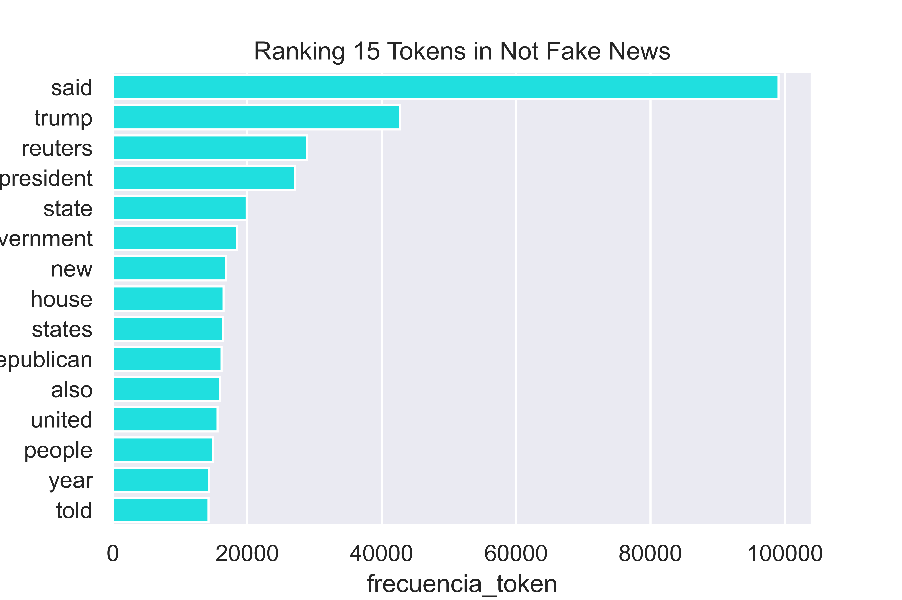

# Introducción

En este trabajo se va a realizar un análisis y clasificación de textos. Para ellos se utilizaran dos lenguajes de programación, `Python` y `R`. El trabajo puede dividirse en dos partes bien diferenciadas, una primera parte en la que se trabaja con `Python` y una segunda en la que se usa `R`.

En la primera parte, en la que trabajamos con `Python`, se llevará acabo una descripción y preprocesado del data-set con el que trabajaremos, posteriormente se llevara acabo un análisis de texto, y para finalizar se realizaran tareas de clasificación aplicando algoritmos de clasificación supervisada, especialmente el algoritmo de clasificación ingenua bayesiana.

En la parte en la que trabajamos con `R` se seguirán los pasos del ejemplo ilustrado en clase.


# Carga de los datos (`Python`)

El data-set con el que vamos a trabajar contiene como observaciones noticias fechadas entre el 31 de marzo de 2015 y el 18 de febrero de 2018, y como variables la fecha, el título y el texto de la noticia, y si es una noticia falsa (fake new) o es verdadera (no fake new). La variable respuesta será `Fake` . Las variables predictoras que se usaran en el apartado de aplicación de algoritmos de clasificación   no aparecen en el data-set original, pero serán creadas usando la información de la variable `texto`.

El data set ha sido obtenido de la pagina web [Kaggle](https://www.kaggle.com/datasets/clmentbisaillon/fake-and-real-news-dataset)

Importamos la libreria `pandas`, que es la liberia de `Python` mas usada para la manipulación y manejo de datos en formato de tabla, es decir, data-frames.


```python
import pandas as pd
```


Ahora importamos los datos, que originalmente estan distribuidos en dos data-sets, uno que contiene las fake news (`df_Fake`) y otro que contiene las no fake news (`df_True`):

```python
df_Fake = pd.read_csv('Fake.csv')
df_True = pd.read_csv('True.csv')
```

Creamos una variable que indicará en nuestro data-set final si la noticia es fake o no fake:

```python
df_Fake['Fake'] = 1
df_True['Fake'] = 0
```

Si para una noticia la nueva variable creada `Fake` toma el valor 1 , indica que es fake new, y si toma el 0 indica que no es fake new.


Ahora concatenamos (por filas) los dos data-sets anteriores, para generar el data-set con el que trabajaremos:

```python
Fake_News_Data = pd.concat([df_Fake, df_True])
```

Seleccionamos las columnas (variables) de nuestro interés:

```python
Fake_News_Data = Fake_News_Data.loc[: , ['Fake', 'title', 'text', 'date'] ]
```

Añadimos un índice al data-set:

```python
Fake_News_Data.index = range(0 , len(Fake_News_Data))
```


Ahora vamos a ver de qué tipo son nuestras variables en `Python` :


```python
Fake_News_Data.dtypes
```


    Fake      int64
    title    object
    text     object
    date     object
    dtype: object


El tipo `object` es propio de variables no cuantitativos, como categoricas o texto, y el tipo `int64` es propio de variables enteras.

En este caso dejaremos los types como están, salvo el de la variable `Fake` que es categorica y por tanto es más adecuado que su type sea `object`


```python
Fake_News_Data['Fake'] = Fake_News_Data['Fake'].astype('object')
```

Calculamos el numero de valores faltantes (NA) en cada una de las variables:

```python
Fake_News_Data.isnull().sum()
```


    Fake     0
    title    0
    text     0
    date     0
    

Vamos a imprimir el data set para hacernos una mejor idea de su contenido:

```python
Fake_News_Data 
```
```
      Fake                                              title  
      
0        1   Donald Trump Sends Out Embarrassing New Year’...   
1        1   Drunk Bragging Trump Staffer Started Russian ...   
2        1   Sheriff David Clarke Becomes An Internet Joke...   
3        1   Trump Is So Obsessed He Even Has Obama’s Name...   
4        1   Pope Francis Just Called Out Donald Trump Dur...   
...    ...                                                ...   
44893    0  'Fully committed' NATO backs new U.S. approach...   
44894    0  LexisNexis withdrew two products from Chinese ...   
44895    0  Minsk cultural hub becomes haven from authorities   
44896    0  Vatican upbeat on possibility of Pope Francis ...   
44897    0  Indonesia to buy $1.14 billion worth of Russia...   

                                                    text               date 
                                                    
0      Donald Trump just couldn t wish all Americans ...  December 31, 2017  
1      House Intelligence Committee Chairman Devin Nu...  December 31, 2017  
2      On Friday, it was revealed that former Milwauk...  December 30, 2017  
3      On Christmas day, Donald Trump announced that ...  December 29, 2017  
4      Pope Francis used his annual Christmas Day mes...  December 25, 2017  
...                                                  ...                ...  
44893  BRUSSELS (Reuters) - NATO allies on Tuesday we...   August 22, 2017   
44894  LONDON (Reuters) - LexisNexis, a provider of l...   August 22, 2017   
44895  MINSK (Reuters) - In the shadow of disused Sov...   August 22, 2017   
44896  MOSCOW (Reuters) - Vatican Secretary of State ...   August 22, 2017   
44897  JAKARTA (Reuters) - Indonesia will buy 11 Sukh...   August 22, 2017  
```

# Descripción estadistica de los datos (`Python`)

Hacemos una breve descripción estadistica de las variables del data-set:

```python
Fake_News_Data.describe(include='all')
```

```

              Fake                title       
count         44898               44898        
unique        2                   38729        
top           1                   Factbox: Trump fills top jobs for his administ...          
freq          23481               14         


              date                  text 
count         44898                 44898
unique        2397                  38646
top           December 20, 2017     (no se muestra por tamaño excesivo)
freq          182                   627

```

Esta tabla nos da alguna informacion relevante, como que en el data-set hay mas fake news que no fake news. Concretamente hay 44898 noticias, de las cuales 23481 son fakes y 44898-23481 = 21417 son no fakes. 


Vamos ahora a realizar un análisis descriptivo del data-set algo más profundo.


## Gráfico de barras de la variable respuesta (`Fake`)

Importamos algunas librerias necesarias para realizar este análisis en `Python`

Concretamente la libreria `numpy` da soporte para crear vectores y matrices grandes multidimensionales, junto con una gran colección de funciones matemáticas de alto nivel para operar con ellas. En general es una de las librerias de `Python` más empleadas junto con `pandas`

Tambien importamos las librerias `seaborn` y `matplotlib`que son muy empleadas para visualización de datos (creación de gráficos).

```python
import numpy as np

import seaborn as sns
import matplotlib as mpl
import matplotlib.pyplot as plt

sns.set(rc={'figure.figsize':(8,8)})
```


Vamos a calcular un gráfico de barras para la variable `Fake`:


```python
prop_Fake_yes = len( Fake_News_Data.loc[ Fake_News_Data['Fake']== 1 , :] ) / len(Fake_News_Data)

prop_Fake_no = len( Fake_News_Data.loc[ Fake_News_Data['Fake']== 0 , :] ) / len(Fake_News_Data)
```


```python
Fake_News_Data['proportion_Fakes'] = 0


for i in range(0, len(Fake_News_Data)):

    if Fake_News_Data['Fake'][i] == 1 :

        Fake_News_Data['proportion_Fakes'][i] = prop_Fake_yes

    else :

        Fake_News_Data['proportion_Fakes'][i] = prop_Fake_no
```


```python
import matplotlib.pyplot as plt

fig, ax = plt.subplots()


p = sns.barplot(x='Fake', y='proportion_Fakes', data=Fake_News_Data, palette="Spectral") 
p.set_yticks( np.arange(0, 0.85, 0.1)  )
p.set_xticklabels(['No', 'Yes'])
p.axes.set(xlabel='Fakes', ylabel='proportion')

fig.savefig('p.png', format='png', dpi=1200)
```


    

    


Las proporciones exactas de fake y no fake news son:

```python
[prop_Fake_no , prop_Fake_yes]
```

    [0.47701456635039424, 0.5229854336496058]


El número exacto de fake y no fake news es:

```python
[prop_Fake_no*len(Fake_News_Data) , prop_Fake_yes*len(Fake_News_Data)]
```


    [21417.0, 23481.0]


Eliminamos la columna `proportion_Fakes` del data-set, que ha sido creada solamente de manera auxiliar para poder generar el gráfico de barras anterior:

```python
Fake_News_Data = Fake_News_Data.loc[ : , Fake_News_Data.columns != 'proportion_Fakes']
```


## Número de palabras por noticia

Una forma de calcular en `Python` el número de palabras de cada notica es la siguiente:

```python
Fake_News_Data['word_count'] = Fake_News_Data['text'].str.split().str.len()
```

Vamos a ver el data-set con la nueva columna `word_count` que contiene el nº de palabras por noticia

```python
Fake_News_Data
```
```
      Fake   title        
      
0        1   Donald Trump Sends Out Embarrassing New Year’...   
1        1   Drunk Bragging Trump Staffer Started Russian ...   
2        1   Sheriff David Clarke Becomes An Internet Joke...   
3        1   Trump Is So Obsessed He Even Has Obama’s Name...   
4        1   Pope Francis Just Called Out Donald Trump Dur...

...    ...                                                ...   

44893    0  'Fully committed' NATO backs new U.S. approach...   
44894    0  LexisNexis withdrew two products from Chinese ...   
44895    0  Minsk cultural hub becomes haven from authorities   
44896    0  Vatican upbeat on possibility of Pope Francis ...   
44897    0  Indonesia to buy $1.14 billion worth of Russia...   


       text                                               date               
       
0      Donald Trump just couldn t wish all Americans ...  December 31, 2017   
1      House Intelligence Committee Chairman Devin Nu...  December 31, 2017   
2      On Friday, it was revealed that former Milwauk...  December 30, 2017   
3      On Christmas day, Donald Trump announced that ...  December 29, 2017   
4      Pope Francis used his annual Christmas Day mes...  December 25, 2017   

...                                                  ...                ...   

44893  BRUSSELS (Reuters) - NATO allies on Tuesday we...   August 22, 2017    
44894  LONDON (Reuters) - LexisNexis, a provider of l...   August 22, 2017    
44895  MINSK (Reuters) - In the shadow of disused Sov...   August 22, 2017    
44896  MOSCOW (Reuters) - Vatican Secretary of State ...   August 22, 2017    
44897  JAKARTA (Reuters) - Indonesia will buy 11 Sukh...   August 22, 2017    


       word_count
       
0             495  
1             305  
2             580  
3             444  
4             420  

...           ...  

44893         466  
44894         125  
44895         320  
44896         205  
44897         210  

```


## Numero medio de palabras por noticia en función de si son fake o no

Calculamos ahora la media de palabras de las fakes news y de la sno fake news. Es decir, el nº medio de palabras en el cojuntos de las noticias fake, y por otro lado en el conjutno de las no fake:


```python
Fake_News_Data.groupby('Fake')['word_count'].mean()
```

    Fake   Mean word_count
    
    0        385.640099
    
    1        423.197905
    


# Preprocesado de texto

En este apartado se vana a hacer una serie de operaciones orientadas al preprocesado de texto, para poder posteriormente realizar analasis mas profundos, y para poder implementar algoritmos de clasificación sobre texto.

Este tipo de preprocesado es básico y fundamental en areas de la ciencia de datos que trabajan con texto, como son la mineria de texto (text minning), el procesamiento del lenguaje natural (PLN) y la recuperación de información (information retrival).


Una de las operaciones centrales del preproceso de textos es la `tokenización`.


## Tokenizacion


Existen algunas librerias de `Python` que tienen funciones para realizar operaciones de tokenizacion, como por ejemplo las librerias `sklearn`, `nltk` o `spaCy`

En este caso no usaremos ninguna función de alguna de esas librerias, sino que crearemos nuestra propia función para realizar la tokenización.

Esta función esta totalmente inspirada en la función creada por el cientifico de datos [Joaquín Amat Rodrigo](), el cual es el creador del excelente blog sobre ciencia de datos  [Cienciadedatos.net](https://www.cienciadedatos.net/). En este blog Joaquin tiene un articulo sobre analisis de texto en `Python` en el cual se encuentra la función que ahora vamos a presentar. Ademas muchas otras partes de este trabajo estan basadas en dicho articulo, es por ello que s ele hace una especial mención tanto aqui como en el apartado de bibliografia. 

La función `limpiar_tokenizar` toma como input texto y devuelve como output un vector de tokens asociado a ese texto, es decir, un vector con las cadenas caracteres del texto, pero no con cualquier tipo, sino que la función no considera signos de puntuación , palabras que empiezan por "http", números, espacios en blancos múltiples, tokens con longitud menor que 2.

Un token aqui es considerado como una cadena de caracteres, es decir, una concatenacion de símbolos (sin considerar el espacio en blanco como un símbolo). 


Veamos un ejemplo de lo que consideramos tokens:

Dado el siguiente texto:

" Esto es 1 ejemplo de l'limpieza de6 TEXTO  https://t.co/rnHPgyhx4Z @cienciadedatos #textmining "

Los tokens (en sentido estricto, no en el sentido restrictivo que considera la función `limpiar_tokenizar` ) asociados a dicho texto  son:

[ Esto , es , 1 , ejemplo , de , l'limpieza , de6 , TEXTO , https://t.co/rnHPgyhx4Z , @cienciadedatos , #textmining ]

```python
def limpiar_tokenizar(texto):

    import re
    
    '''
    Esta función limpia y tokeniza el texto en palabras individuales.
    El orden en el que se va limpiando el texto no es arbitrario.
    El listado de signos de puntuación se ha obtenido de: print(string.punctuation)
    y re.escape(string.punctuation)
    '''
    
    # Se convierte todo el texto a minúsculas:

    nuevo_texto = texto.lower()
    
    
    # Eliminacion de paginas web (palabras que empiezan por "http"):
    
    ## Las cadenas de caracteres que sean enlaces a webs no serán consideradas como tokens
    
    nuevo_texto = re.sub('http\S+', ' ', nuevo_texto)
    
    
    # Eliminacion de signos de puntuación:
    
    ## Si una cadena de caractrer contiene un signo de puntuacion estos serán eliminados y sustituidos por un   espacio en blanco. Si  por ejemplo tenemos las cadenas  '@FabioScielzo' y 'Fabio@Scielzo' ,
    ## la funcion las transforma en  'FabioScielzo' en el primer caso  y en el par de cadenas 'Fabio' , 'Scielzo' en el segundo. Y si tenemos
    ## una cadena de signos d puntuacion   como '@#!' la elimina directamente.
    
    regex = '[\\!\\"\\#\\$\\%\\&\\\'\\(\\)\\*\\+\\,\\-\\.\\/\\:\\;\\<\\=\\>\\?\\@\\[\\\\\\]\\^_\\`\\{\\|\\}\\~]'
    
    nuevo_texto = re.sub(regex , ' ', nuevo_texto)
    
    
    # Eliminacion de numeros:
    
    ## Si una cadena de caracter tiene numeros estos serán eliminados y sustituidos por un espacio en blanco. Si por ejemplo tenemos las cadenas '4FabioScielzo' y 'Fabio44Scielzo' la funcion las transforma en 'FabioScielzo' y 'Fabio' , 'Scielzo' , respectivamente. Ademas si una cadena solo contienen numeros, por ejemplo '123' la elimina directamente.
    
    nuevo_texto = re.sub("\d+", ' ', nuevo_texto)
    
    
    
    # Eliminacion de espacios en blanco multiples:
    
    ## Si tenemos en un texto dos o mas espacios en blanco consecutivos la funcion los transforma en un solo espacio en blanco. Por ejemplo si tenemos el texto "Fabio     es abogado" la funcion lo transforma en "Fabio es abogado".
    
    nuevo_texto = re.sub("\\s+", ' ', nuevo_texto)
    
    
    # Una vez que a un texto se le han aplicado las operaciones anteriores ya solo quede considerar las cadenas de caracteres de ese texto como tokens, ya que son cadenas con buenas propiedades, a saber, sin signos de puntuacion, sin numeros, sin links de web. Ademas la eliminacion de espacios en blanco multiples es fundamental para que la siguiente operacion funcione bien, ya que en el texto final resultante todas las cadenas estan separadas entre si por un solo espacio, y la siguiente operacion utiliza esa propiedad para identificar a las cadenas, que ya serán considerados tokens en sentido estricto.
    
    # Obtención de tokens:
    
    nuevo_texto = nuevo_texto.split(sep = ' ')
    
    
    # Eliminacion de tokens con una longitud menor que  2:
    
    ## Una ultima operacion es solo considerar los tokens obteenidos tras las operaciones anteriores que tengan un tamaño (nº de caracteres) igual o superior a 2 , es decir, dejar fuera tokens con solo un caracter.
    
    nuevo_texto = [token for token in nuevo_texto if len(token) >=  2]
    
    return(nuevo_texto)
```


 Probamos el funcionamiento de la función `limpiar_tokenizar` con el mismo texto que fue usado antes como ejemplo ilustrativo.

```python

test = "Esto es 1 ejemplo de l'limpieza de6 TEXTO  https://t.co/rnHPgyhx4Z @cienciadedatos #textmining"

print(limpiar_tokenizar(texto=test))
```

    ['esto', 'es', 'ejemplo', 'de', 'limpieza', 'de', 'texto', 'cienciadedatos', 'textmining']
    

Ahora probamos la función `limpiar_tokenizar` con la primera noticia del data-set `Fake_News_Data`:

```python
Fake_News_Data['text'][0]
```


    'Donald Trump just couldn t wish all Americans a Happy New Year and leave it at that. Instead, he had to give a shout out to his enemies, haters and  the very dishonest fake news media.  The former reality show star had just one job to do and he couldn t do it. As our Country rapidly grows stronger and smarter, I want to wish all of my friends, supporters, enemies, haters, and even the very dishonest Fake News Media, a Happy and Healthy New Year,  President Angry Pants tweeted.  2018 will be a great year for America! As our Country rapidly grows stronger and smarter, I want to wish all of my friends, supporters, enemies, haters, and even the very dishonest Fake News Media, a Happy and Healthy New Year. 2018 will be a great year for America!  Donald J. Trump (@realDonaldTrump) December 31, 2017Trump s tweet went down about as welll as you d expect.What kind of president sends a New Year s greeting like this despicable, petty, infantile gibberish? Only Trump! His lack of decency won t even allow him to rise above the gutter long enough to wish the American citizens a happy new year!  Bishop Talbert Swan (@TalbertSwan) December 31, 2017no one likes you  Calvin (@calvinstowell) December 31, 2017Your impeachment would make 2018 a great year for America, but I ll also accept regaining control of Congress.  Miranda Yaver (@mirandayaver) December 31, 2017Do you hear yourself talk? When you have to include that many people that hate you you have to wonder? Why do the they all hate me?  Alan Sandoval (@AlanSandoval13) December 31, 2017Who uses the word Haters in a New Years wish??  Marlene (@marlene399) December 31, 2017You can t just say happy new year?  Koren pollitt (@Korencarpenter) December 31, 2017Here s Trump s New Year s Eve tweet from 2016.Happy New Year to all, including to my many enemies and those who have fought me and lost so badly they just don t know what to do. Love!  Donald J. Trump (@realDonaldTrump) December 31, 2016This is nothing new for Trump. He s been doing this for years.Trump has directed messages to his  enemies  and  haters  for New Year s, Easter, Thanksgiving, and the anniversary of 9/11. pic.twitter.com/4FPAe2KypA  Daniel Dale (@ddale8) December 31, 2017Trump s holiday tweets are clearly not presidential.How long did he work at Hallmark before becoming President?  Steven Goodine (@SGoodine) December 31, 2017He s always been like this . . . the only difference is that in the last few years, his filter has been breaking down.  Roy Schulze (@thbthttt) December 31, 2017Who, apart from a teenager uses the term haters?  Wendy (@WendyWhistles) December 31, 2017he s a fucking 5 year old  Who Knows (@rainyday80) December 31, 2017So, to all the people who voted for this a hole thinking he would change once he got into power, you were wrong! 70-year-old men don t change and now he s a year older.Photo by Andrew Burton/Getty Images.'


```python
print(limpiar_tokenizar(texto=Fake_News_Data['text'][0]))
```

    ['donald', 'trump', 'just', 'couldn', 'wish', 'all', 'americans', 'happy', 'new', 'year', 'and', 'leave', 'it', 'at', 'that', 'instead', 'he', 'had', 'to', 'give', 'shout', 'out', 'to', 'his', 'enemies', 'haters', 'and', 'the', 'very', 'dishonest', 'fake', 'news', 'media', 'the', 'former', 'reality', 'show', 'star', 'had', 'just', 'one', 'job', 'to', 'do', 'and', 'he', 'couldn', 'do', 'it', 'as', 'our', 'country', 'rapidly', 'grows', 'stronger', 'and', 'smarter', 'want', 'to', 'wish', 'all', 'of', 'my', 'friends', 'supporters', 'enemies', 'haters', 'and', 'even', 'the', 'very', 'dishonest', 'fake', 'news', 'media', 'happy', 'and', 'healthy', 'new', 'year', 'president', 'angry', 'pants', 'tweeted', 'will', 'be', 'great', 'year', 'for', 'america', 'as', 'our', 'country', 'rapidly', 'grows', 'stronger', 'and', 'smarter', 'want', 'to', 'wish', 'all', 'of', 'my', 'friends', 'supporters', 'enemies', 'haters', 'and', 'even', 'the', 'very', 'dishonest', 'fake', 'news', 'media', 'happy', 'and', 'healthy', 'new', 'year', 'will', 'be', 'great', 'year', 'for', 'america', 'donald', 'trump', 'realdonaldtrump', 'december', 'trump', 'tweet', 'went', 'down', 'about', 'as', 'welll', 'as', 'you', 'expect', 'what', 'kind', 'of', 'president', 'sends', 'new', 'year', 'greeting', 'like', 'this', 'despicable', 'petty', 'infantile', 'gibberish', 'only', 'trump', 'his', 'lack', 'of', 'decency', 'won', 'even', 'allow', 'him', 'to', 'rise', 'above', 'the', 'gutter', 'long', 'enough', 'to', 'wish', 'the', 'american', 'citizens', 'happy', 'new', 'year', 'bishop', 'talbert', 'swan', 'talbertswan', 'december', 'no', 'one', 'likes', 'you', 'calvin', 'calvinstowell', 'december', 'your', 'impeachment', 'would', 'make', 'great', 'year', 'for', 'america', 'but', 'll', 'also', 'accept', 'regaining', 'control', 'of', 'congress', 'miranda', 'yaver', 'mirandayaver', 'december', 'do', 'you', 'hear', 'yourself', 'talk', 'when', 'you', 'have', 'to', 'include', 'that', 'many', 'people', 'that', 'hate', 'you', 'you', 'have', 'to', 'wonder', 'why', 'do', 'the', 'they', 'all', 'hate', 'me', 'alan', 'sandoval', 'alansandoval', 'december', 'who', 'uses', 'the', 'word', 'haters', 'in', 'new', 'years', 'wish', 'marlene', 'marlene', 'december', 'you', 'can', 'just', 'say', 'happy', 'new', 'year', 'koren', 'pollitt', 'korencarpenter', 'december', 'here', 'trump', 'new', 'year', 'eve', 'tweet', 'from', 'happy', 'new', 'year', 'to', 'all', 'including', 'to', 'my', 'many', 'enemies', 'and', 'those', 'who', 'have', 'fought', 'me', 'and', 'lost', 'so', 'badly', 'they', 'just', 'don', 'know', 'what', 'to', 'do', 'love', 'donald', 'trump', 'realdonaldtrump', 'december', 'this', 'is', 'nothing', 'new', 'for', 'trump', 'he', 'been', 'doing', 'this', 'for', 'years', 'trump', 'has', 'directed', 'messages', 'to', 'his', 'enemies', 'and', 'haters', 'for', 'new', 'year', 'easter', 'thanksgiving', 'and', 'the', 'anniversary', 'of', 'pic', 'twitter', 'com', 'fpae', 'kypa', 'daniel', 'dale', 'ddale', 'december', 'trump', 'holiday', 'tweets', 'are', 'clearly', 'not', 'presidential', 'how', 'long', 'did', 'he', 'work', 'at', 'hallmark', 'before', 'becoming', 'president', 'steven', 'goodine', 'sgoodine', 'december', 'he', 'always', 'been', 'like', 'this', 'the', 'only', 'difference', 'is', 'that', 'in', 'the', 'last', 'few', 'years', 'his', 'filter', 'has', 'been', 'breaking', 'down', 'roy', 'schulze', 'thbthttt', 'december', 'who', 'apart', 'from', 'teenager', 'uses', 'the', 'term', 'haters', 'wendy', 'wendywhistles', 'december', 'he', 'fucking', 'year', 'old', 'who', 'knows', 'rainyday', 'december', 'so', 'to', 'all', 'the', 'people', 'who', 'voted', 'for', 'this', 'hole', 'thinking', 'he', 'would', 'change', 'once', 'he', 'got', 'into', 'power', 'you', 'were', 'wrong', 'year', 'old', 'men', 'don', 'change', 'and', 'now', 'he', 'year', 'older', 'photo', 'by', 'andrew', 'burton', 'getty', 'images']
    


Ahora aplicamos la función `limpiar_tokenizar` a cada una de las noticias del data-set `Fake_News_Data`

```python
Fake_News_Data['text_tokenizado'] = Fake_News_Data['text'].apply( limpiar_tokenizar )
```

Creamos una columna que identifique las noticias:

```python
Fake_News_Data['id_text'] = range(0, len(Fake_News_Data))
```


Vemos como queda tras estos cambios el data-set `Fake_News_Data`:

```python
Fake_News_Data
```
```
      Fake                    title                                            
      
0        1   Donald Trump Sends Out Embarrassing New Year’...   
1        1   Drunk Bragging Trump Staffer Started Russian ...   
2        1   Sheriff David Clarke Becomes An Internet Joke...   
3        1   Trump Is So Obsessed He Even Has Obama’s Name...   
4        1   Pope Francis Just Called Out Donald Trump Dur...   

...    ...                     ...   

44893    0  'Fully committed' NATO backs new U.S. approach...   
44894    0  LexisNexis withdrew two products from Chinese ...   
44895    0  Minsk cultural hub becomes haven from authorities   
44896    0  Vatican upbeat on possibility of Pope Francis ...   
44897    0  Indonesia to buy $1.14 billion worth of Russia...   


                         text                                   date                

0      Donald Trump just couldn t wish all Americans ...  December 31, 2017   
1      House Intelligence Committee Chairman Devin Nu...  December 31, 2017   
2      On Friday, it was revealed that former Milwauk...  December 30, 2017   
3      On Christmas day, Donald Trump announced that ...  December 29, 2017   
4      Pope Francis used his annual Christmas Day mes...  December 25, 2017 

...                     ...                                      ...   

44893  BRUSSELS (Reuters) - NATO allies on Tuesday we...   August 22, 2017    
44894  LONDON (Reuters) - LexisNexis, a provider of l...   August 22, 2017    
44895  MINSK (Reuters) - In the shadow of disused Sov...   August 22, 2017    
44896  MOSCOW (Reuters) - Vatican Secretary of State ...   August 22, 2017    
44897  JAKARTA (Reuters) - Indonesia will buy 11 Sukh...   August 22, 2017   


       word_count              text_tokenizado                        id_text  

0         495     [donald, trump, just, couldn, wish, all, ameri...      0  
1         305     [house, intelligence, committee, chairman, dev...      1  
2         580     [on, friday, it, was, revealed, that, former, ...      2  
3         444     [on, christmas, day, donald, trump, announced,...      3  
4         420     [pope, francis, used, his, annual, christmas, ...      4  

...       ...                        ...                                ...  

44893     466     [brussels, reuters, nato, allies, on, tuesday,...    44893  
44894     125     [london, reuters, lexisnexis, provider, of, le...    44894  
44895     320     [minsk, reuters, in, the, shadow, of, disused,...    44895  
44896     205     [moscow, reuters, vatican, secretary, of, stat...    44896  
44897     210     [jakarta, reuters, indonesia, will, buy, sukho...    44897  

```


Creamos un nuevo data-frame solo con las columnas (variables) `id_text` , `text_tokenizado` y `Fake`, en ell que la columna `text_tokenizado` esta expandida, es decir, al ser una columna cuyos elementos son vectores, lo que se hace con la operacion `explode` es expandir cada uno de esos vectores en un nuevo data-frame, es decir, para cada uno de esos vectores se crean tantas filas en el nuevo data-frame como elementos hay en el vector, y en cada una de esas filas la columna `text_tokenizado` contendra un elemento del vector expandido. Visualmente es mas facil de entenderlo como se verá a continuación:

```python
Fake_News_Tokens = Fake_News_Data.loc[:, ['id_text', 'text_tokenizado', 'Fake'] ].explode(column='text_tokenizado')


# Renombramos la columna `text_tokenizado` como `token` :

Fake_News_Tokens = Fake_News_Tokens.rename(columns={'text_tokenizado':'token'})
```

Imprimimos el nuevo data-frame creado `Fake_News_Tokens`  al expandir la columna `text_tokenizado` del data-frame `Fake_News_Data`

```python
Fake_News_Tokens
```
```
       id_text       token    Fake
0            0      donald      1
0            0       trump      1
0            0        just      1
0            0      couldn      1
0            0        wish      1

...        ...         ...     ...

44897    44897  technology      0
44897    44897         and      0
44897    44897    aviation      0
44897    44897       among      0
44897    44897      others      0

```

\newpage

# Descripción estadística de los datos tras la `tokenización`


## Numero de tokens del conjunto de noticias en funcion de si son fake o no

```python
# nº de palabras (tokens) en el conjunto de textos clasificados como fake y en los no fake

Fake_News_Tokens.groupby(by='Fake')['token'].count()
```


    Fake
    0    7891501
    1    9611544
    Name: token, dtype: int64


## Numero de tokens *únicos* del conjunto de noticias en funcion de si son fake o no


```python
# nº de palabras (tokens) *unicos* en el conjunto de textos clasificados como fake y en los no fake

Fake_News_Tokens.groupby(by='Fake')['token'].nunique()
```


    Fake
    0    78020
    1    85642
    Name: token, dtype: int64


## Numero de tokens en cada una de las noticias individualmente

```python
# nº de palabras (tokens) en cada texto individual clasificados como fake y en los no fake

df1 = pd.DataFrame( Fake_News_Tokens.groupby(by = ["id_text" , "Fake"] )["token"].count().rename('nº_tokens') )
```


```python
df1
```

```
                     nº_tokens
id_text   Fake           
  0         1           447
  1         1           294
  2         1           563
  3         1           426
  4         1           415

 ...       ...          ...

44893       0           433
44894       0           120
44895       0           307
44896       0           196
44897       0           197

```


Hay noticias que no tienen tokens :

```python
df1.loc[df1['nº_tokens'] == 0, :]
```

```
                 nº_tokens
id_text  Fake           

9358      1           0
10923     1           0
11041     1           0
11190     1           0
11225     1           0

 ...     ...         ...

21857     1           0
21869     1           0
21870     1           0
21873     1           0
32451     0           0

```

Algunos ejemplos de estas noticias son los siguientes:

```python
Fake_News_Data.loc[Fake_News_Data.id_text == 9358]
```

```
        Fake   title  
9358     1     https://100percentfedup.com/served-roy-moore-v...   


        text  
9358    https://100percentfedup.com/served-roy-moore-v...   


        date  word_count  
9358              1   


      text_tokenizado   id_text  
9358        []           9358  
```


```python
Fake_News_Data.loc[Fake_News_Data.id_text == 10923]
```
```
       Fake      title 
10923    1       TAKE OUR POLL: Who Do You Think President Trum...        

       text     date            word_count   text_tokenizado   id_text  
10923           May 10, 2017        0              []           10923

```


Nos quedamos por tanto solo con las noticias que tienen algun token :

```python
df2 = df1.loc[df1['nº_tokens'] != 0, :]

df2
```
```
                 nº_tokens
id_text   Fake           

0          1           447
1          1           294
2          1           563
3          1           426
4          1           415

...       ...          ...

44893      0           433
44894      0           120
44895      0           307
44896      0           196
44897      0           197

```

 
Calculamos el numero medio de tokens para las noticas que tienen uno o mas tokens en funcion se si son fake o no:

```python
df2.groupby("Fake")["nº_tokens"].agg(['mean'])
```

```
            mean
Fake            
0     368.486225
1     422.169983
```
 
Se puede interpretar como la longitud media de las noticas fake y de las no fake

\vspace{0.5cm}


Hay diferencias entre lo obtenido mediante esta operación y lo obtenido al usar el siguiente código, que fue visto anteriormente:

```python
Fake_News_Data['word_count'] = Fake_News_Data['text'].str.split().str.len()

Fake_News_Data.groupby('Fake')['word_count'].mean()
```
```
Fake   Mean word_count
    
0        385.640099
    
1        423.197905
```

Y esto es debido a que el  código `Fake_News_Data['text'].str.split()` hace una operacion  similar a la realizada por nuestra funcion `limpiar_tokenizar` pero **no exactamente igual**, y esto lleva a que con la primera opcion se obtiene un conjunto de tokens diferente al obtenido con la funcion `limpiar_tokenizar`, en los distintos documentos, y esto lleva a que la longitud de los documentos sea diferente si se consideran los tokens obtenidos con  `Fake_News_Data['text'].str.split()`    a si se usan los obtenidos con `limpiar_tokenizar`, llo que lleva a diferencias en las longitudes medias obtenidas.


```python
Fake_News_Data['text'].str.split()
```

```
0        [Donald, Trump, just, couldn, t, wish, all, Am...
1        [House, Intelligence, Committee, Chairman, Dev...
2        [On, Friday,, it, was, revealed, that, former,...
3        [On, Christmas, day,, Donald, Trump, announced...
4        [Pope, Francis, used, his, annual, Christmas, ...
                               ...                        
44893    [BRUSSELS, (Reuters), -, NATO, allies, on, Tue...
44894    [LONDON, (Reuters), -, LexisNexis,, a, provide...
44895    [MINSK, (Reuters), -, In, the, shadow, of, dis...
44896    [MOSCOW, (Reuters), -, Vatican, Secretary, of,...
44897    [JAKARTA, (Reuters), -, Indonesia, will, buy, ...
```

Como se pueden ver con el código anterior se obtiene por ejemplo que '-' y ', Donald' son tokens , cuando con la función `limpiar_tokenizar`  no serían  considerados un tokens.

\vspace{0.5cm}


Otra forma de calcular lo anterior:


```python
m0 = ( Fake_News_Tokens.loc[Fake_News_Tokens['Fake']==0].groupby('id_text')['token'].count() ).mean()
```


```python
m1 = ( Fake_News_Tokens.loc[Fake_News_Tokens['Fake']==1].groupby('id_text')['token'].count() ).mean()
```


```python
pd.DataFrame({'fake_new': [0,1] , 'tokens_mean':[m0 , m1]})
```
```
   fake_new  tokens_mean
0         0   368.469020
1         1   409.332822

```


 
 
 
 
 
 

## Número de veces que aparece cada token en el conjunto de las noticias en funcion de si es fake o no


```python
df = pd.DataFrame(  (Fake_News_Tokens.groupby(by = ["Fake", "token"] )["token"].count().unstack(fill_value=0).stack().reset_index(name='frecuencia_token')))

# .unstack(fill_value=0).stack() para que tambien aparezcan los tokens con count = 0 , si no solo aprecerian los que tienen count > 0.

df
```


```
        Fake       token  frecuencia_token
0          0          aa                22
1          0         aaa                 7
2          0  aaaaaaaand                 0
3          0   aaaaackkk                 0
4          0  aaaaapkfhk                 0

...      ...         ...               ...

251605     1        ””it                 0
251606     1      ””when                 0
251607     1         •if                 0
251608     1      $emoji1$               0
251609     1      $emoji2$               0

```

La salida anterior nos da para cada token el numero de veces que aparece en el conjunto de las fake news por un lado (Fake = 1), y por otro lado en el conjunto de las no fake (Fake=0)

Veamos algunos ejemplos para tokens concretos:


En la siguiente salida vemos el nº de veces que aparece el token 'yes' en eñ conjunto de las fake news (1775), asi como en el conjunto de las no fake news (336).
```python
df.loc[df['token']=='yes' , ] # El token 'yes' aprece 1775 veces en el conjunto de las fake news y 336 en el de las no fake news
```

```
        Fake token  frecuencia_token
116577     0   yes               336
242382     1   yes              1775

```


En la siguiente salida vemos el nº de veces que aparece el token 'true' en eñ conjunto de las fake news (2595), asi como en el conjunto de las no fake news (412).

```python
df.loc[df['token']=='true' , ] # El token 'true' aparece 2595 veces en el conjunto de las fake news y 412 en el de las no fake news
```
```
        Fake token  frecuencia_token
106608     0  true               412
232413     1  true              2595
```


En la siguiente salida podemos ver el nº de veces que aparece cada token en el conjunto de las no fake news.


```python
df.loc[df['Fake']==0 , ] 
```

``` 
         Fake       token  frecuencia_token
         
0          0          aa                22
1          0         aaa                 7
2          0  aaaaaaaand                 0
3          0   aaaaackkk                 0
4          0  aaaaapkfhk                 0

...      ...         ...               ...

125800     0        ””it                 1
125801     0      ””when                 1
125802     0         •if                 3
125803     0      $emoji1$               3
125804     0      $emoji2$               1
```
 
 

Y en la siguiente salida podemos ver el nº de veces que aparece cada token en el conjunto de las fake news.


```python
df.loc[df['Fake']==1 , ] 
```


```
        Fake       token  frecuencia_token
125805     1          aa                24
125806     1         aaa                 9
125807     1  aaaaaaaand                 1
125808     1   aaaaackkk                 1
125809     1  aaaaapkfhk                 1
...      ...         ...               ...
251605     1        ””it                 0
251606     1      ””when                 0
251607     1         •if                 0
251608     1      $emoji1$               0
251609     1      $emoji2$               0
```


## Ranking de tokens mas frecuentes en el conjunto de las noticas en funcion de si son fake y no fake 


Ahora vamos a ordenar los dos data-frames anteriores en función de la columna `frecuencia_token` , de mayor a menor, para así poder ver cuales son los tokens con mayor frecuencia tanto en el conjunto de las fake news, como en el de las no fake news.

```python
df_fake_sort = df.loc[df['Fake']==1 , ].sort_values(by=["frecuencia_token"], ascending=False).reset_index(drop=False)
```


```python
df_no_fake_sort = df.loc[df['Fake']==0 , ].sort_values(by=["frecuencia_token"], ascending=False).reset_index(drop=False)
```


Imprimimos las primeras 15 filas de cada uno de los nuevos data-frames ordenados:

```python
df_fake_sort.head(15)
```

```
     index  Fake  token  frecuencia_token
     
0   229301     1    the            544521
1   230713     1     to            290882
2   199217     1     of            236735
3   129697     1    and            227349
4   174372     1     in            171433
5   229261     1   that            151789
6   176603     1     is            111278
7   162672     1    for             93538
8   176868     1     it             83693
9   199777     1     on             83661
10  232444     1  trump             79922
11  169936     1     he             79124
12  238650     1    was             67865
13  240547     1   with             63441
14  229776     1   this             58581

```


```python
df_no_fake_sort.head(15)
```

```
     index  Fake token  frecuencia_token
     
0   103496     0   the            478548
1   104908     0    to            245378
2    73412     0    of            205193
3     3892     0   and            181715
4    48567     0    in            181082
5    73972     0    on            108459
6    90350     0  said             99054
7   103456     0  that             86723
8    36867     0   for             79705
9    50798     0    is             55298
10  114742     0  with             54327
11   44131     0    he             52605
12  112845     0   was             47892
13   14219     0    by             47871
14    5659     0    as             46935

```

Se puede observar que en ambas tablas la mayoria de los 15 tokens mas frecuentees se corresponden con artículos, preposiciones, pronombres, etc. En general, palabras que no aportan información relevante sobre el texto. A estas palabras se les conoce como **stopwords**. Para cada idioma existen distintos listados de stopwords, además, dependiendo del contexto, puede ser necesario adaptar el listado. Con frecuencia, a medida que se realiza un análisis se encuentran palabras que deben incluirse en el listado de stopwords.


### Stop words


Vamos a obtener un listado de **stopwords** en ingles, ya que nuestros textos (noticias) están en ingles. Si estuvieran en varios idiosmas habra que formar un listado de stopwords para todos esos idomas.

Para ontener el listado de stopwords usaremos la libreria `nltk` (Natural Language Toolki) , una de las librerias mas importantes en `Python` en el área de procesamiento de lenguaje natural.


```python
# pip install nltk
```


```python
import nltk
nltk.download('stopwords')
from nltk.corpus import stopwords
```
    
    
Obtenemos el listado de stopwords que provee `nltk` para el idioma inglés, y ademas le añadimos una lista extra de palabras que también vamos a considerar stopwords:

```python
# Obtencion de listado de stopwords del ingles

stop_words = stopwords.words('english') + ["pic" , "getty", "quot", "acr", "filessupport", "flickr", "fjs", "js", "somodevilla", "var", "henningsen",
"ck", "cdata", "subscribing", "mcnamee", "amp", "wfb", "screenshot", "hesher","nyp", "cking", "helton", "raedle", "donnell",
"getelementbyid", "src", "behar", "createelement", "getelementsbytagname", "parentnode", "wnd","insertbefore",
"jssdk", "nowicki", "xfbml", "camerota", "sdk",  "“i" , "“the", "“we", "it’s", "don’t", "“this", "“it", "“a",
"“if",  "“it’s", "we’re", "that’s",  "“he", "“there", "i’m",  "he’s",  "“we’re", "doesn’t", "can’t", "“i’m", "“in",
"suu", "“they", "you’re", "“but", "didn’t", "“you", "they’re", "“no", "“as", "“very" , "there’s", "“what",  "“and", "won’t",
  "“to", "“that", "“one", "we’ve", "“when" , "“our", "“not", "’”" ,"“that’s", "“these", "“there’s", "“he’s", "we’ll", 'one',
   'would', 'like', 'us', 'even', 'could', 'two', 'many', 'angerer', 'reilly']
```


Imprimimos la lista de stopwords que se van a considerar en este trabajo:

```python
print(stop_words)
```
```
    ['i', 'me', 'my', 'myself', 'we', 'our', 'ours', 'ourselves', 'you', "you're", "you've", "you'll", "you'd", 'your', 'yours', 'yourself', 'yourselves', 'he', 'him', 'his', 'himself', 'she', "she's", 'her', 'hers', 'herself', 'it', "it's", 'its', 'itself', 'they', 'them', 'their', 'theirs', 'themselves', 'what', 'which', 'who', 'whom', 'this', 'that', "that'll", 'these', 'those', 'am', 'is', 'are', 'was', 'were', 'be', 'been', 'being', 'have', 'has', 'had', 'having', 'do', 'does', 'did', 'doing', 'a', 'an', 'the', 'and', 'but', 'if', 'or', 'because', 'as', 'until', 'while', 'of', 'at', 'by', 'for', 'with', 'about', 'against', 'between', 'into', 'through', 'during', 'before', 'after', 'above', 'below', 'to', 'from', 'up', 'down', 'in', 'out', 'on', 'off', 'over', 'under', 'again', 'further', 'then', 'once', 'here', 'there', 'when', 'where', 'why', 'how', 'all', 'any', 'both', 'each', 'few', 'more', 'most', 'other', 'some', 'such', 'no', 'nor', 'not', 'only', 'own', 'same', 'so', 'than', 'too', 'very', 's', 't', 'can', 'will', 'just', 'don', "don't", 'should', "should've", 'now', 'd', 'll', 'm', 'o', 're', 've', 'y', 'ain', 'aren', "aren't", 'couldn', "couldn't", 'didn', "didn't", 'doesn', "doesn't", 'hadn', "hadn't", 'hasn', "hasn't", 'haven', "haven't", 'isn', "isn't", 'ma', 'mightn', "mightn't", 'mustn', "mustn't", 'needn', "needn't", 'shan', "shan't", 'shouldn', "shouldn't", 'wasn', "wasn't", 'weren', "weren't", 'won', "won't", 'wouldn', "wouldn't", 'pic', 'getty', 'quot', 'acr', 'filessupport', 'flickr', 'fjs', 'js', 'somodevilla', 'var', 'henningsen', 'ck', 'cdata', 'subscribing', 'mcnamee', 'amp', 'wfb', 'screenshot', 'hesher', 'nyp', 'cking', 'helton', 'raedle', 'donnell', 'getelementbyid', 'src', 'behar', 'createelement', 'getelementsbytagname', 'parentnode', 'wnd', 'insertbefore', 'jssdk', 'nowicki', 'xfbml', 'camerota', 'sdk', '“i', '“the', '“we', 'it’s', 'don’t', '“this', '“it', '“a', '“if', '“it’s', 'we’re', 'that’s', '“he', '“there', 'i’m', 'he’s', '“we’re', 'doesn’t', 'can’t', '“i’m', '“in', 'suu', '“they', 'you’re', '“but', 'didn’t', '“you', 'they’re', '“no', '“as', '“very', 'there’s', '“what', '“and', 'won’t', '“to', '“that', '“one', 'we’ve', '“when', '“our', '“not', '’”', '“that’s', '“these', '“there’s', '“he’s', 'we’ll', 'one', 'would', 'like', 'us', 'even', 'could', 'two', 'many', 'angerer', 'reilly']
    
```


De los data-frames `df_fake_sort` y `df_no_fake_sort` eliminamos aquellos tokens que estan en la lista de stopwords:

```python
df_fake_sort_not_StopWords = df_fake_sort[ ~ df_fake_sort['token'].isin(stop_words) ] # ranking de tokens para las fake news sin stop words
```


```python
df_no_fake_sort_not_StopWords = df_no_fake_sort[ ~ df_no_fake_sort['token'].isin(stop_words) ] # ranking de tokens para las no fake news sin stop words
```

Imprimimos las primeras 15 filas de los nuevos data-frames creados:

```python
df_fake_sort_not_StopWords.head(15)
```
```
     index  Fake      token  frecuencia_token
     
10  232444     1      trump             79922
31  216155     1       said             33763
34  206880     1  president             27801
35  203392     1     people             26591
56  144568     1    clinton             19209
59  198761     1      obama             18833
62  154174     1     donald             17789
67  128977     1       also             15420
69  196554     1       news             14688
73  196507     1        new             14414
75  171064     1    hillary             14184
77  230293     1       time             13854
79  224427     1      state             13471
82  239806     1      white             13194
84  237031     1        via             12830

```


```python
df_no_fake_sort_not_StopWords.head(15)
```
```

     index  Fake       token  frecuencia_token
     
6    90350     0        said             99054
17  106639     0       trump             42755
26   87534     0     reuters             28880
28   81075     0   president             27128
36   98622     0       state             19912
41   41076     0  government             18484
44   70702     0         new             16849
47   46493     0       house             16480
48   98655     0      states             16380
49   86922     0  republican             16175
50    3172     0        also             15948
51  109089     0      united             15584
53   77587     0      people             14945
54  116463     0        year             14276
55  105051     0        told             14245

```

Ahora vamos a crear unos graficos de barras para representar el ranking de los 15 tokens mas frecuentes en el conjunto de las fake news por un lado, y por otro las no fake news:


```python
fig, ax = plt.subplots()

sns.barplot(data=df_fake_sort_not_StopWords.head(15), x='frecuencia_token', y='token', color='tomato').set(title='Ranking 15 Tokens in Fake News') 

fig.savefig('p1.png', format='png', dpi=1200)
```


    

    


```python
fig, ax = plt.subplots()

sns.barplot(data=df_no_fake_sort_not_StopWords.head(15), x='frecuencia_token', y='token', color='cyan').set(title='Ranking 15 Tokens in Not Fake News') 

fig.savefig('p2.png', format='png', dpi=1200)
```


    

    


## Odds Ratio


A continuación, se estudia qué palabras se utilizan de forma más diferenciada en cada tipo de noticia (fake / no fake), es decir, palabras que utiliza mucho en las fake news y que no se utilizan tanto en las no fakes, y viceversa. 

Una forma de hacer este análisis es mediante el odds ratio de las frecuencias.

Sea  $\hspace{0.2cm}p_k1 = \cfrac{n_{k1} + 1}{N_1 + 1}\hspace{0.2cm}$ y $\hspace{0.2cm}p_k0 = \cfrac{n_{k0} + 1}{N_0 +1}$

 
$$OR(Fake|NoFake , k) = \dfrac{ p_{k1} }{ p_{k0} }$$
 


Donde:

$n_{k1}$  el número de veces que aparece el token $k$ en las **fake news**.

$n_{k0}$ el numero de veces  que aparece el termino $k$ en las **no fake news**.

$N_1$ es el número de tokens, contando repeticiones, que aparecen en las **fake news**. 

$N_0$ es el número de tokens, contando repeticiones, que aparecen en las **no fake news** 


Por tanto:

$p_{k1} \approx$ proporcion de apariciones del token $k$ en las **fake news**


$p_{k0} \approx$ proporcion de apariciones del token $k$ en las **no fake news**

Si $OddsRatio(k) = \dfrac{ p_k1 }{  p_k0  } = h$ , entonces:

Si $h>1$  $\Rightarrow$ el token $k$ es $h$ veces mas frecuente en las **fake news** que en las **no fake news**, ya que $p_{k1} = h \cdot p_{k0}$

Si $h \in (0 , 1)$ $\Rightarrow$ el token $k$ es $1/h$ veces mas frecuente en las **no fake news** que en las **fake news**, ya que $p_{k0} = (1/h) \cdot p_{k1}$ , donde $(1/h)>1$

Si $h= 1$ $\Rightarrow$ el token $k$ es igual de frecuente en las **fake news** que en las **no fake news**, ya que $p_{k1} =  p_{k0}$ 


A continuacion definimos funciones para calcular $n_{k1}$ y $n_{k0}$ en `Python` 

```python
def n_k1(token) : 

    n_k1 = df_fake_sort_not_StopWords.loc[ df_fake_sort_not_StopWords['token']==token , 'frecuencia_token']

    return(n_k1)
```


```python
def n_k0(token) : 

    n_k0 = df_no_fake_sort_not_StopWords.loc[ df_no_fake_sort_not_StopWords['token']==token , 'frecuencia_token']

    return(n_k0)
```

 
Probamos las funciones para algunos tokens concretos:
 


```python
n_k0('trump') 
```

    17    42755
    Name: frecuencia_token 


```python
n_k1('trump') 
```


    10    79922
    Name: frecuencia_token 


Estas salidas nos indican que el nº de veces que aparece el token 'trump' en el conjunto de las fake news es 79922 , mientras que en el conjunto de las no fake news es 42755.


$N_0$ y $N_1$ coinciden con el nº de tokens, contando repeticiones y sin considerar las stopwords, que aparecen el las no fake  y  fake news, respectivamente:


```python
Fake_News_Tokens_not_StopWords = Fake_News_Tokens[ ~ Fake_News_Tokens['token'].isin(stop_words) ]

Fake_News_Tokens_not_StopWords
```
```
       id_text       token Fake
       
0            0      donald    1
0            0       trump    1
0            0        wish    1
0            0   americans    1
0            0       happy    1

...        ...         ...  ...

44897    44897      energy    0
44897    44897  technology    0
44897    44897    aviation    0
44897    44897       among    0
44897    44897      others    0
```


```python
Fake_News_Tokens_not_StopWords.groupby(by='Fake')['token'].count()
```
```
Fake
0    4782198
1    5396339

Name: token
```

```python
N0 = Fake_News_Tokens_not_StopWords.groupby(by='Fake')['token'].count()[0]

N1 = Fake_News_Tokens_not_StopWords.groupby(by='Fake')['token'].count()[1]
```


```python
N0
```

    4782198


```python
N1
```

    5396339


 

Como ejemplo vamos a calcular el Odds Ratio fake - no fake para el toke 'trump' : 


```python
n_k0('trump') / N0 
```


    17    0.00894
    Name: frecuencia_token, dtype: float64


```python
n_k1('trump') / N1
```


    10    0.01481
    Name: frecuencia_token, dtype: float64


```python
# Odds Ratio fake - no fake para el token 'trump'

float( n_k0('trump') / N0 ) / float( n_k1('trump') / N1 )
```


    1.6565622548396417


Por tanto el token 'trump' es 1.66 veces mas frecuente en las fake news que en las no fake.


```python
df1 = df_fake_sort_not_StopWords.sort_values(by=["token"]).reset_index(drop=True)
df1
```

```
         index  Fake       token  frecuencia_token
0       125805     1          aa                24
1       125806     1         aaa                 9
2       125807     1  aaaaaaaand                 1
3       125808     1   aaaaackkk                 1
4       125809     1  aaaaapkfhk                 1
...        ...   ...         ...               ...
125561  251605     1        ””it                 0
125562  251606     1      ””when                 0
125563  251607     1          if                 0
125564  251608     1      emoji1                 0
125565  251609     1      emoji2                 0
```


```python
df0 = df_no_fake_sort_not_StopWords.sort_values(by=["token"]).reset_index(drop=True)
df0
```

``` 
         index  Fake       token  frecuencia_token
0            0     0          aa                22
1            1     0         aaa                 7
2            2     0  aaaaaaaand                 0
3            3     0   aaaaackkk                 0
4            4     0  aaaaapkfhk                 0
...        ...   ...         ...               ...
125561  125800     0        ””it                 1
125562  125801     0      ””when                 1
125563  125802     0          if                 3
125564  125803     0       emoji1                3
125565  125804     0       emoji2                1
```


```python

n_k0_vector = df0['frecuencia_token']

n_k1_vector = df1['frecuencia_token']


Odds_ratio = ( ( n_k1_vector + 1 ) / ( N1 + 1) ) / ( ( n_k0_vector + 1 ) / ( N0 + 1) )

```

```python
df0['Odds_ratio_Fake_NotFake'] = Odds_ratio  
df1['Odds_ratio_Fake_NotFake'] = Odds_ratio  

df0['Odds_ratio_NotFake_Fake'] = 1 / df0["Odds_ratio_Fake_NotFake"] 
df1['Odds_ratio_NotFake_Fake'] = 1 / df1["Odds_ratio_Fake_NotFake"]  
```


```python
df0
```
```
         index  Fake       token  frecuencia_token  Odds_ratio_Fake_NotFake  \
0            0     0          aa                22                 0.963253   
1            1     0         aaa                 7                 1.107741   
2            2     0  aaaaaaaand                 0                 1.772386   
3            3     0   aaaaackkk                 0                 1.772386   
4            4     0  aaaaapkfhk                 0                 1.772386   
...        ...   ...         ...               ...                      ...   
125561  125800     0        ””it                 1                 0.443097   
125562  125801     0      ””when                 1                 0.443097   
125563  125802     0          if                 3                 0.221548   
125564  125803     0    $emoji1$                 3                 0.221548   
125565  125804     0    $emoji2$                 1                 0.443097   

        Odds_ratio_NotFake_Fake  
0                      1.038149  
1                      0.902738  
2                      0.564211  
3                      0.564211  
4                      0.564211  
...                         ...  
125561                 2.256845  
125562                 2.256845  
125563                 4.513689  
125564                 4.513689  
125565                 2.256845  
```


```python
df1
```

```
         index  Fake       token  frecuencia_token  Odds_ratio_Fake_NotFake  \
0       125805     1          aa                24                 0.963253   
1       125806     1         aaa                 9                 1.107741   
2       125807     1  aaaaaaaand                 1                 1.772386   
3       125808     1   aaaaackkk                 1                 1.772386   
4       125809     1  aaaaapkfhk                 1                 1.772386   
...        ...   ...         ...               ...                      ...   
125561  251605     1        ””it                 0                 0.443097   
125562  251606     1      ””when                 0                 0.443097   
125563  251607     1          if                 0                 0.221548   
125564  251608     1    $emoji1$                 0                 0.221548   
125565  251609     1    $emoji2$                 0                 0.443097   

        Odds_ratio_NotFake_Fake  
0                      1.038149  
1                      0.902738  
2                      0.564211  
3                      0.564211  
4                      0.564211  
...                         ...  
125561                 2.256845  
125562                 2.256845  
125563                 4.513689  
125564                 4.513689  
125565                 2.256845  

```


 
```python
df0.sort_values(by=["Odds_ratio_Fake_NotFake"], ascending=False).reset_index(drop=True).head(5)
```

```
    index  Fake            token  frecuencia_token  Odds_ratio_Fake_NotFake  \
0   35830     0          finicum                 0               320.801884   
1  114264     0        wikimedia                 0               200.279629   
2  109040     0  uninterruptible                 0               189.645313   
3   78372     0     philosophers                 0               186.100540   
4   60711     0          lovable                 0               183.441961   

   Odds_ratio_NotFake_Fake  
0                 0.003117  
1                 0.004993  
2                 0.005273  
3                 0.005373  
4                 0.005451
```

```python
df0.sort_values(by=["Odds_ratio_NotFake_Fake"], ascending=False).reset_index(drop=True).head(5)

```
```
    index  Fake      token  frecuencia_token  Odds_ratio_Fake_NotFake  \
0  106864     0    trump’s             11629                 0.000076   
1   72989     0    obama’s              2132                 0.000415   
2   18791     0  clinton’s              1604                 0.000552   
3   76630     0    party’s              1101                 0.000804   
4   98675     0    state’s              1010                 0.000877   

   Odds_ratio_NotFake_Fake  
0             13123.551362  
1              2406.924768  
2              1811.117793  
3              1243.521376  
4              1140.834946
```

```python
df1.sort_values(by=["Odds_ratio_Fake_NotFake"], ascending=False).reset_index(drop=True).head(5)
```
```
    index  Fake            token  frecuencia_token  Odds_ratio_Fake_NotFake  \
0  161635     1          finicum               361               320.801884   
1  240069     1        wikimedia               225               200.279629   
2  234845     1  uninterruptible               213               189.645313   
3  204177     1     philosophers               209               186.100540   
4  186516     1          lovable               206               183.441961   

   Odds_ratio_NotFake_Fake  
0                 0.003117  
1                 0.004993  
2                 0.005273  
3                 0.005373  
4                 0.005451
```

```python
df1.sort_values(by=["Odds_ratio_NotFake_Fake"], ascending=False).reset_index(drop=True).head(5)
```
```
    index  Fake      token  frecuencia_token  Odds_ratio_Fake_NotFake  \
0  232669     1    trump’s                 0                 0.000076   
1  198794     1    obama’s                 0                 0.000415   
2  144596     1  clinton’s                 0                 0.000552   
3  202435     1    party’s                 0                 0.000804   
4  224480     1    state’s                 0                 0.000877   

   Odds_ratio_NotFake_Fake  
0             13123.551362  
1              2406.924768  
2              1811.117793  
3              1243.521376  
4              1140.834946 

```

Notese que en ambos data sets las columnas Odds_ratio_Fake_NotFake  y Odds_ratio_NotFake_Fake son las mismas, por tanto podemos construir un nuevo data set solo con esas columnas y otra para los tokens, a partir de cualquiera de esos dos data-sets.

```python
Odds_ratio_df = df1.loc[: , ['token', 'Odds_ratio_Fake_NotFake' , 'Odds_ratio_NotFake_Fake']]  

Odds_ratio_df
```

```
             token  Odds_ratio_Fake_NotFake  Odds_ratio_NotFake_Fake
0               aa                 0.963253                 1.038149
1              aaa                 1.107741                 0.902738
2       aaaaaaaand                 1.772386                 0.564211
3        aaaaackkk                 1.772386                 0.564211
4       aaaaapkfhk                 1.772386                 0.564211
...            ...                      ...                      ...
125561        ””it                 0.443097                 2.256845
125562      ””when                 0.443097                 2.256845
125563          if                 0.221548                 4.513689
125564    $emoji2$                 0.221548                 4.513689
125565    $emoji1$                 0.443097                 2.256845

```


```python
Odds_ratio_df.sort_values(by=["Odds_ratio_Fake_NotFake"], ascending=False).head(15)
```
```
                  token  Odds_ratio_Fake_NotFake  Odds_ratio_NotFake_Fake
35775           finicum               320.801884                 0.003117
114071        wikimedia               200.279629                 0.004993
108870  uninterruptible               189.645313                 0.005273
78242      philosophers               186.100540                 0.005373
60612           lovable               183.441961                 0.005451
91113           savants               182.555768                 0.005478
67583         moralists               182.555768                 0.005478
97785             spore               182.555768                 0.005478
84324           rascals               181.669575                 0.005504
32976       evangelists               181.669575                 0.005504
63302        masochists               181.669575                 0.005504
11482            boiler               172.586096                 0.005794
13727             bundy               170.813710                 0.005854
92025        screengrab               167.490486                 0.005970
113747           whined               166.604293                 0.006002

```


```python
Odds_ratio_df.sort_values(by=["Odds_ratio_NotFake_Fake"], ascending=False).head(15)
```
```
                   token  Odds_ratio_Fake_NotFake  Odds_ratio_NotFake_Fake
106696           trump’s                 0.000076             13123.551362
72874            obama’s                 0.000415              2406.924768
18756          clinton’s                 0.000552              1811.117793
76500            party’s                 0.000804              1243.521376
98529            state’s                 0.000877              1140.834946
80975        president’s                 0.000979              1021.222183
83999            rakhine                 0.000987              1013.323226
1242    administration’s                 0.001157               864.371483
88673           rohingya                 0.001294               772.969276
117944              zuma                 0.001298               770.712432
82344         puigdemont                 0.001372               728.960807
17524            china’s                 0.001400               714.291317
89715           russia’s                 0.001439               695.108137
21888          country’s                 0.001541               648.842823
69047            myanmar                 0.001579               633.496280
```


```python
fig, ax = plt.subplots()

sns.barplot(data=Odds_ratio_df.sort_values(by=["Odds_ratio_Fake_NotFake"], ascending=False).head(15) ,
                 x='Odds_ratio_Fake_NotFake', y='token', color='tomato').set(title='Ranking 15 most representative tokens in Fake News') 

fig.savefig('p3.png', format='png', dpi=1200)
```


Vamos a hacer un pequeño analisis de los tokens que son los mas representativos para las fake news, es decir, aquellos tokens con mayor odds ratio fake - no fake, esto es, aquellos que son mucho mas frecuentes en las fake news que en las no fake news.

- El token mas representativa de las fake news analizadas es 'finicum'

    - El token 'finicum' podria hace referencia a Robert LaVoy Finicum, que según [Wikipedia](https://en.wikipedia.org/wiki/LaVoy_Finicum) fue uno de los militantes estadounidenses que organizaron una ocupación armada del Refugio Nacional de Vida Silvestre Malheur en enero de 2016. Después de que comenzó, la fuerza de ocupación se organizó como Ciudadanos por la Libertad Constitucional. , de la que Finicum fue portavoz. Fue la única víctima mortal de la ocupación. El 26 de enero de 2016, agentes del orden público intentaron arrestar a Finicum y a otros líderes de la ocupación mientras viajaban por una carretera remota para reunirse con simpatizantes en el condado vecino. Cuando el camión de Finicum finalmente fue detenido por una barricada, salió del vehículo hacia la nieve profunda y le dispararon, pero los oficiales fallaron. Finicum hizo dos movimientos a su chaqueta mientras le gritaba a la policía que tendrían que dispararle. Luego, Finicum fue asesinado a tiros. Más tarde, los oficiales encontraron un arma cargada en su bolsillo.


- El segundo token mas representativo de las fakes news es 'wikipedia'

     - La Fundación Wikimedia (en inglés: Wikimedia Foundation, Inc.) es una organización sin ánimo de lucro. Es la organización matriz de Wikipedia
     
     
- El tercer token mas representativo de las fakes news es 'uninterruptible' que significa 'ininterrumpible' en español.

- El cuarto token mas representativo de las fakes news es 'philosophers' que significa 'filosofos' en español.

- El quinto token mas representativo de las fakes news es 'lovable' que significa 'amable' en español.

- El sexto token mas representativo de las fakes news es 'savants' que significa 'sabios' en español.

- El septimo token mas representativo de las fakes news es 'moralist' que significa 'moralistas' en español.

- El octavo token mas representativo de las fakes news es 'spore' que significa 'espora' en español.

- El noveno token mas representatico de las fake news es 'rascals' que podria hacer alusion a la pelicula 'The Little Rascals' en la cual participo como parte del elenco de actores el ex-presidente de Estados Unidos Donald Trump.

- El decimo token mas representativo es 'evangelist' que significa 'evangelistas' en español.

- El undecimo token mas representativo es 'masochist' que significa 'masoquista' en español.


- El duodecimo token mas representativo es 'boiler' que significa 'caldera' en español.

 - El decimotercero token mas representativo es 'bundy' que significa 'paquete' en español.

- El decimocuarto token mas representativo es 'screengrab' que significa 'captura de pantalla' en español.

- El decimoquinto token mas representativo es 'whined' que significa 'quejarse' en español.


```python
fig, ax = plt.subplots()

sns.barplot(data=Odds_ratio_df.sort_values(by=["Odds_ratio_NotFake_Fake"], ascending=False).head(15) ,
                 x='Odds_ratio_NotFake_Fake', y='token', color='cyan').set(title='Ranking 15 most representative tokens in Not Fake News') 
                 
fig.savefig('p4.png', format='png', dpi=1200)
```


Vamos a hacer un pequeño analisis de los tokens que son los mas representativos para las fake news, es decir, aquellos tokens con mayor odds ratio fake - no fake, esto es, aquellos que son mucho mas frecuentes en las fake news que en las no fake news.

- El token mas representativa de las fake news analizadas es 'trump's'

    - Este token hace referencia a Donald John Trump es un empresario, director ejecutivo, inversor en bienes inmuebles, personalidad televisiva y político estadounidense que ejerció como el 45.º presidente de los Estados Unidos de América desde el 20 de enero de 2017 hasta el 20 de enero de 2021


- El segundo token mas representativo de las fakes news es 'obama's'

    - Este token hace referencia a Barack Hussein Obama  es un político estadounidense que ejerció como el 44.º presidente de los Estados Unidos de América desde el 20 de enero de 2009 hasta el 20 de enero de 2017

  
     
     
- El tercer token mas representativo de las fakes news es 'clinton's'

    - William Jefferson Clinton  es un político y abogado estadounidense que ejerció como el 42.º presidente de los Estados Unidos de América de 1993 a 2001


- El cuarto token mas representativo de las fakes news es 'party's'  que hace referencia a 'partidos politicos' en español.

    

- El quinto token mas representativo de las fakes news es 'state's' que significa 'estados' en español.

- El sexto token mas representativo de las fakes news es 'president's' que significa 'presidentes' en español.

- El septimo token mas representativo de las fakes news es 'rakhine'

    - Rakhine es un estado de Birmania. 

- El octavo token mas representativo de las fakes news es 'administration's' que significa 'gobierno' en español.

- El noveno token mas representatico de las fake news es 'rohingya'

     - Los rohingya  son un grupo étnico musulmán de Birmania (Myanmar) que desde 2017 fue objeto, según la ONU, de una limpieza étnica por parte de las autoridades birmanas que obligó a la mayoría de sus integrantes a refugiarse en la vecina Bangladés.  
     
- El decimo token mas representativo es 'zuma' que podria hacer referencia a Jacob Zuma

      - Jacob Gedleyihlekisa Zuma  es un político sudafricano que ejerció como el cuarto Presidente de la República de Sudáfrica. Fue también presidente del Congreso Nacional Africano (ANC), partido político en el poder en la República de Sudáfrica, elegido por la Conferencia Nacional el 18 de diciembre de 2007, puesto que mantuvo hasta diciembre de 2017. Zuma fue vicepresidente de la República de 1999 a 2005. El 14 de febrero de 2018 renunció a su cargo como presidente.

- El undecimo token mas representativo es 'puigdemont' que hace referencia a Carles Puigdemont

           - Carles Puigdemont i Casamajón es un político y periodista español, diputado al Parlamento Europeo y presidente de la Generalidad de Cataluña entre 2016 y 2017. Durante su mandato como presidente de la Generalidad se impulsó la celebración ilegal del referéndum de independencia de Cataluña el 1 de octubre de 2017 y se efectuó una pretendida declaración unilateral de independencia del territorio el día 27 del mismo mes. Así, fue cesado en el cargo el 28 de octubre de 2017, al amparo de la Orden PRA/1034/2017, de 27 de octubre, en aplicación del artículo 155 de la Constitución española de 1978.12​ Fue puesto entonces en busca y captura en territorio español acusado de presuntos delitos de rebelión, sedición y malversación de caudales públicos por actos que se le imputan en la organización del referéndum y la declaración unilateral de independencia


- El duodecimo token mas representativo es 'china's' que hace referencia a China.

 - El decimotercero token mas representativo es 'russia's' que hace referencia a Rusia.

- El decimocuarto token mas representativo es 'county's' que significa 'país' en español.

- El decimoquinto token mas representativo es 'myanmar'

       - Birmania o Myanmar  denominada oficialmente República de la Unión de Myanmar, es un Estado soberano del Sudeste Asiático. 


>La interpretacion de estos términos no es una tarea en la que necesariamente el cientifico de datos que los ha obtenido pueda aportar un gran valor. Desde mi punto de vista, es mas adecuado que la interpretacion de estas palabras se haga por parte de expertos en el contexto en el que se encuentran las noticias analizadas, a saber, en el contexto politico, economico y social que rodeaba a Estados Unidos entre los años 2015 y 2018.


# Term frequency – Inverse document frequency (Tf - Idf)


Siguiendo a [Joaquin Amat Rodrigo](https://www.linkedin.com/in/joaquin-amat-rodrigo/?originalSubdomain=es) , creador de [Cienciadedatos.net](https://www.cienciadedatos.net/ ) :

Uno de los principales intereses en **text mining**, **natural language processing** e **information retrieval** es cuantificar la temática de un texto, así como la importancia de cada término que lo forma. Una manera sencilla de medir la importancia de un término dentro de un documento es utilizando la frecuencia con la que aparece (tf, term-frequency). Esta aproximación, aunque simple, tiene la limitación de atribuir mucha importancia a aquellas palabras que aparecen muchas veces aunque no aporten información selectiva. Por ejemplo, si la palabra matemáticas aparece 5 veces en un documento y la palabra página aparece 50, la segunda tendrá 10 veces más peso a pesar de que no aporte tanta información sobre la temática del documento. Para solucionar este problema se pueden ponderar los valores tf multiplicándolos por la inversa de la frecuencia con la que el término en cuestión aparece en el resto de documentos (idf). De esta forma, se consigue reducir el valor de aquellos términos que aparecen en muchos documentos y que, por lo tanto, no aportan información selectiva.


El estadístico tf-idf mide cómo de informativo es un término en un documento teniendo en cuenta la frecuencia con la que ese término aparece en otros documentos.


Term Frequency (tf)

$$tf (k, d)= \dfrac{n_k}{longitud( d)}$$
 
donde  $n_k$  es el número de veces que aparece el término  $k$  en el documento  $d$ , y longitudd(d) es el nº de terminos del documento d


Inverse Document Frequency

$$idf (k)=log(\dfrac{n(d)}{n(d,k)})$$
 
donde  $n(d)$  es el número total de documentos y $n(d,k)$  el número de documentos que contienen el término  $k$ .


Estadístico tf-idf

$$tf\_idf(k, d)=tf (k, d)∗idf (k)$$
 


En la práctica, para evitar problemas con el logaritmo cuando aparecen valores de 0, se emplea una versión corregida del  idf (t) . Esta es la versión implementada en Scikit Learn.

$$idf (k)=log(\dfrac{1+n(d)}{1+n(d,k)})+1$$
 


