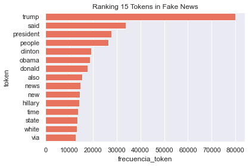
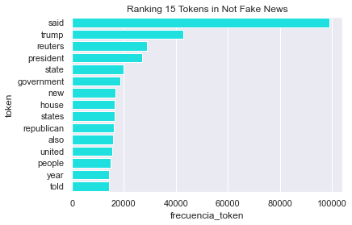
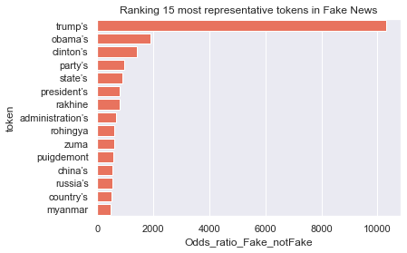
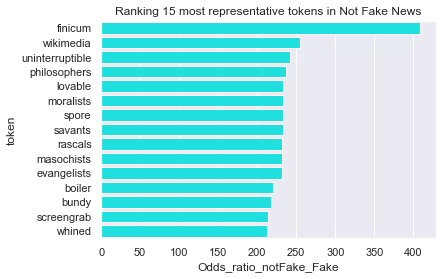

```python
import pandas as pd
```


```python
df_Fake = pd.read_csv('Fake.csv')
df_True = pd.read_csv('True.csv')
```


```python
df_Fake['Fake'] = 1
df_True['Fake'] = 0
```


```python
Fake_News_Data = pd.concat([df_Fake, df_True])
```


```python
Fake_News_Data = Fake_News_Data.loc[: , ['Fake', 'title', 'text', 'date'] ]
```


```python
Fake_News_Data.index = range(0 , len(Fake_News_Data))
```

Fake = 1 --> yes 

Fake = 0 --> no


```python
Fake_News_Data.dtypes
```


    Fake      int64
    title    object
    text     object
    date     object
    dtype: object


```python
Fake_News_Data['Fake'] = Fake_News_Data['Fake'].astype('object')
```


```python
Fake_News_Data.describe(include='all')
```


<div>
<style scoped>
    .dataframe tbody tr th:only-of-type {
        vertical-align: middle;
    }

    .dataframe tbody tr th {
        vertical-align: top;
    }

    .dataframe thead th {
        text-align: right;
    }
</style>
<table border="1" class="dataframe">
  <thead>
    <tr style="text-align: right;">
      <th></th>
      <th>Fake</th>
      <th>title</th>
      <th>text</th>
      <th>date</th>
    </tr>
  </thead>
  <tbody>
    <tr>
      <th>count</th>
      <td>44898</td>
      <td>44898</td>
      <td>44898</td>
      <td>44898</td>
    </tr>
    <tr>
      <th>unique</th>
      <td>2</td>
      <td>38729</td>
      <td>38646</td>
      <td>2397</td>
    </tr>
    <tr>
      <th>top</th>
      <td>1</td>
      <td>Factbox: Trump fills top jobs for his administ...</td>
      <td></td>
      <td>December 20, 2017</td>
    </tr>
    <tr>
      <th>freq</th>
      <td>23481</td>
      <td>14</td>
      <td>627</td>
      <td>182</td>
    </tr>
  </tbody>
</table>
</div>


```python
Fake_News_Data.isnull().sum()
```


    Fake     0
    title    0
    text     0
    date     0
    dtype: int64


```python
import numpy as np

import seaborn as sns
import matplotlib as mpl
import matplotlib.pyplot as plt

sns.set(rc={'figure.figsize':(8,8)})
```


```python
prop_Fake_yes = len( Fake_News_Data.loc[ Fake_News_Data['Fake']== 1 , :] ) / len(Fake_News_Data)

prop_Fake_no = len( Fake_News_Data.loc[ Fake_News_Data['Fake']== 0 , :] ) / len(Fake_News_Data)
```


```python
Fake_News_Data['proportion_Fakes'] = 0


for i in range(0, len(Fake_News_Data)):

    if Fake_News_Data['Fake'][i] == 1 :

        Fake_News_Data['proportion_Fakes'][i] = prop_Fake_yes

    else :

        Fake_News_Data['proportion_Fakes'][i] = prop_Fake_no
```

    C:\Users\Usuario\AppData\Local\Temp\ipykernel_19644\2699169446.py:8: SettingWithCopyWarning: 
    A value is trying to be set on a copy of a slice from a DataFrame
    
    See the caveats in the documentation: https://pandas.pydata.org/pandas-docs/stable/user_guide/indexing.html#returning-a-view-versus-a-copy
      Fake_News_Data['proportion_Fakes'][i] = prop_Fake_yes
    


```python
p1 = sns.barplot(x='Fake', y='proportion_Fakes', data=Fake_News_Data, palette="Spectral") 
p1.set_yticks( np.arange(0, 0.85, 0.1)  )
p1.set_xticklabels(['No', 'Yes'])
p1.axes.set(xlabel='Fakes', ylabel='proportion')
```


    [Text(0.5, 0, 'Fakes'), Text(0, 0.5, 'proportion')]


    

    


```python
[prop_Fake_no , prop_Fake_yes]
```


    [0.47701456635039424, 0.5229854336496058]


```python
[prop_Fake_no*len(Fake_News_Data) , prop_Fake_yes*len(Fake_News_Data)]
```


    [21417.0, 23481.0]


```python
Fake_News_Data = Fake_News_Data.loc[ : , Fake_News_Data.columns != 'proportion_Fakes']
```


```python
Fake_News_Data['word_count'] = Fake_News_Data['text'].str.split().str.len()
```


```python
Fake_News_Data
```


<div>
<style scoped>
    .dataframe tbody tr th:only-of-type {
        vertical-align: middle;
    }

    .dataframe tbody tr th {
        vertical-align: top;
    }

    .dataframe thead th {
        text-align: right;
    }
</style>
<table border="1" class="dataframe">
  <thead>
    <tr style="text-align: right;">
      <th></th>
      <th>Fake</th>
      <th>title</th>
      <th>text</th>
      <th>date</th>
      <th>word_count</th>
    </tr>
  </thead>
  <tbody>
    <tr>
      <th>0</th>
      <td>1</td>
      <td>Donald Trump Sends Out Embarrassing New Year’...</td>
      <td>Donald Trump just couldn t wish all Americans ...</td>
      <td>December 31, 2017</td>
      <td>495</td>
    </tr>
    <tr>
      <th>1</th>
      <td>1</td>
      <td>Drunk Bragging Trump Staffer Started Russian ...</td>
      <td>House Intelligence Committee Chairman Devin Nu...</td>
      <td>December 31, 2017</td>
      <td>305</td>
    </tr>
    <tr>
      <th>2</th>
      <td>1</td>
      <td>Sheriff David Clarke Becomes An Internet Joke...</td>
      <td>On Friday, it was revealed that former Milwauk...</td>
      <td>December 30, 2017</td>
      <td>580</td>
    </tr>
    <tr>
      <th>3</th>
      <td>1</td>
      <td>Trump Is So Obsessed He Even Has Obama’s Name...</td>
      <td>On Christmas day, Donald Trump announced that ...</td>
      <td>December 29, 2017</td>
      <td>444</td>
    </tr>
    <tr>
      <th>4</th>
      <td>1</td>
      <td>Pope Francis Just Called Out Donald Trump Dur...</td>
      <td>Pope Francis used his annual Christmas Day mes...</td>
      <td>December 25, 2017</td>
      <td>420</td>
    </tr>
    <tr>
      <th>...</th>
      <td>...</td>
      <td>...</td>
      <td>...</td>
      <td>...</td>
      <td>...</td>
    </tr>
    <tr>
      <th>44893</th>
      <td>0</td>
      <td>'Fully committed' NATO backs new U.S. approach...</td>
      <td>BRUSSELS (Reuters) - NATO allies on Tuesday we...</td>
      <td>August 22, 2017</td>
      <td>466</td>
    </tr>
    <tr>
      <th>44894</th>
      <td>0</td>
      <td>LexisNexis withdrew two products from Chinese ...</td>
      <td>LONDON (Reuters) - LexisNexis, a provider of l...</td>
      <td>August 22, 2017</td>
      <td>125</td>
    </tr>
    <tr>
      <th>44895</th>
      <td>0</td>
      <td>Minsk cultural hub becomes haven from authorities</td>
      <td>MINSK (Reuters) - In the shadow of disused Sov...</td>
      <td>August 22, 2017</td>
      <td>320</td>
    </tr>
    <tr>
      <th>44896</th>
      <td>0</td>
      <td>Vatican upbeat on possibility of Pope Francis ...</td>
      <td>MOSCOW (Reuters) - Vatican Secretary of State ...</td>
      <td>August 22, 2017</td>
      <td>205</td>
    </tr>
    <tr>
      <th>44897</th>
      <td>0</td>
      <td>Indonesia to buy $1.14 billion worth of Russia...</td>
      <td>JAKARTA (Reuters) - Indonesia will buy 11 Sukh...</td>
      <td>August 22, 2017</td>
      <td>210</td>
    </tr>
  </tbody>
</table>
<p>44898 rows × 5 columns</p>
</div>


```python
Fake_News_Data.groupby('Fake')['word_count'].mean()
```


    Fake
    0    385.640099
    1    423.197905
    Name: word_count, dtype: float64


```python
def limpiar_tokenizar(texto):

    import re
    
    '''
    Esta función limpia y tokeniza el texto en palabras individuales.
    El orden en el que se va limpiando el texto no es arbitrario.
    El listado de signos de puntuación se ha obtenido de: print(string.punctuation)
    y re.escape(string.punctuation)
    '''
    
    # Se convierte todo el texto a minúsculas

    nuevo_texto = texto.lower()
    
    # Eliminacion de paginas web (palabras que empiezan por "http")
    
    nuevo_texto = re.sub('http\S+', ' ', nuevo_texto)
    
    # Eliminacion de signos de puntuación
    
    regex = '[\\!\\"\\#\\$\\%\\&\\\'\\(\\)\\*\\+\\,\\-\\.\\/\\:\\;\\<\\=\\>\\?\\@\\[\\\\\\]\\^_\\`\\{\\|\\}\\~]'
    
    nuevo_texto = re.sub(regex , ' ', nuevo_texto)
    
    # Eliminacion de numeros
    
    nuevo_texto = re.sub("\d+", ' ', nuevo_texto)
    
    # Eliminacion de espacios en blanco multiples
    
    nuevo_texto = re.sub("\\s+", ' ', nuevo_texto)
    
    # Tokenizacion por palabras individuales
    
    nuevo_texto = nuevo_texto.split(sep = ' ')
    
    # Eliminacion de tokens con una longitud <= 1
    
    nuevo_texto = [token for token in nuevo_texto if len(token) >=  2]
    
    return(nuevo_texto)
```


```python

test = "Esto es 1 ejemplo de l'limpieza de6 TEXTO  https://t.co/rnHPgyhx4Z @cienciadedatos #textmining"

print(limpiar_tokenizar(texto=test))
```

    ['esto', 'es', 'ejemplo', 'de', 'limpieza', 'de', 'texto', 'cienciadedatos', 'textmining']
    


```python
Fake_News_Data['text'][0]
```


    'Donald Trump just couldn t wish all Americans a Happy New Year and leave it at that. Instead, he had to give a shout out to his enemies, haters and  the very dishonest fake news media.  The former reality show star had just one job to do and he couldn t do it. As our Country rapidly grows stronger and smarter, I want to wish all of my friends, supporters, enemies, haters, and even the very dishonest Fake News Media, a Happy and Healthy New Year,  President Angry Pants tweeted.  2018 will be a great year for America! As our Country rapidly grows stronger and smarter, I want to wish all of my friends, supporters, enemies, haters, and even the very dishonest Fake News Media, a Happy and Healthy New Year. 2018 will be a great year for America!  Donald J. Trump (@realDonaldTrump) December 31, 2017Trump s tweet went down about as welll as you d expect.What kind of president sends a New Year s greeting like this despicable, petty, infantile gibberish? Only Trump! His lack of decency won t even allow him to rise above the gutter long enough to wish the American citizens a happy new year!  Bishop Talbert Swan (@TalbertSwan) December 31, 2017no one likes you  Calvin (@calvinstowell) December 31, 2017Your impeachment would make 2018 a great year for America, but I ll also accept regaining control of Congress.  Miranda Yaver (@mirandayaver) December 31, 2017Do you hear yourself talk? When you have to include that many people that hate you you have to wonder? Why do the they all hate me?  Alan Sandoval (@AlanSandoval13) December 31, 2017Who uses the word Haters in a New Years wish??  Marlene (@marlene399) December 31, 2017You can t just say happy new year?  Koren pollitt (@Korencarpenter) December 31, 2017Here s Trump s New Year s Eve tweet from 2016.Happy New Year to all, including to my many enemies and those who have fought me and lost so badly they just don t know what to do. Love!  Donald J. Trump (@realDonaldTrump) December 31, 2016This is nothing new for Trump. He s been doing this for years.Trump has directed messages to his  enemies  and  haters  for New Year s, Easter, Thanksgiving, and the anniversary of 9/11. pic.twitter.com/4FPAe2KypA  Daniel Dale (@ddale8) December 31, 2017Trump s holiday tweets are clearly not presidential.How long did he work at Hallmark before becoming President?  Steven Goodine (@SGoodine) December 31, 2017He s always been like this . . . the only difference is that in the last few years, his filter has been breaking down.  Roy Schulze (@thbthttt) December 31, 2017Who, apart from a teenager uses the term haters?  Wendy (@WendyWhistles) December 31, 2017he s a fucking 5 year old  Who Knows (@rainyday80) December 31, 2017So, to all the people who voted for this a hole thinking he would change once he got into power, you were wrong! 70-year-old men don t change and now he s a year older.Photo by Andrew Burton/Getty Images.'


```python
print(limpiar_tokenizar(texto=Fake_News_Data['text'][0]))
```

    ['donald', 'trump', 'just', 'couldn', 'wish', 'all', 'americans', 'happy', 'new', 'year', 'and', 'leave', 'it', 'at', 'that', 'instead', 'he', 'had', 'to', 'give', 'shout', 'out', 'to', 'his', 'enemies', 'haters', 'and', 'the', 'very', 'dishonest', 'fake', 'news', 'media', 'the', 'former', 'reality', 'show', 'star', 'had', 'just', 'one', 'job', 'to', 'do', 'and', 'he', 'couldn', 'do', 'it', 'as', 'our', 'country', 'rapidly', 'grows', 'stronger', 'and', 'smarter', 'want', 'to', 'wish', 'all', 'of', 'my', 'friends', 'supporters', 'enemies', 'haters', 'and', 'even', 'the', 'very', 'dishonest', 'fake', 'news', 'media', 'happy', 'and', 'healthy', 'new', 'year', 'president', 'angry', 'pants', 'tweeted', 'will', 'be', 'great', 'year', 'for', 'america', 'as', 'our', 'country', 'rapidly', 'grows', 'stronger', 'and', 'smarter', 'want', 'to', 'wish', 'all', 'of', 'my', 'friends', 'supporters', 'enemies', 'haters', 'and', 'even', 'the', 'very', 'dishonest', 'fake', 'news', 'media', 'happy', 'and', 'healthy', 'new', 'year', 'will', 'be', 'great', 'year', 'for', 'america', 'donald', 'trump', 'realdonaldtrump', 'december', 'trump', 'tweet', 'went', 'down', 'about', 'as', 'welll', 'as', 'you', 'expect', 'what', 'kind', 'of', 'president', 'sends', 'new', 'year', 'greeting', 'like', 'this', 'despicable', 'petty', 'infantile', 'gibberish', 'only', 'trump', 'his', 'lack', 'of', 'decency', 'won', 'even', 'allow', 'him', 'to', 'rise', 'above', 'the', 'gutter', 'long', 'enough', 'to', 'wish', 'the', 'american', 'citizens', 'happy', 'new', 'year', 'bishop', 'talbert', 'swan', 'talbertswan', 'december', 'no', 'one', 'likes', 'you', 'calvin', 'calvinstowell', 'december', 'your', 'impeachment', 'would', 'make', 'great', 'year', 'for', 'america', 'but', 'll', 'also', 'accept', 'regaining', 'control', 'of', 'congress', 'miranda', 'yaver', 'mirandayaver', 'december', 'do', 'you', 'hear', 'yourself', 'talk', 'when', 'you', 'have', 'to', 'include', 'that', 'many', 'people', 'that', 'hate', 'you', 'you', 'have', 'to', 'wonder', 'why', 'do', 'the', 'they', 'all', 'hate', 'me', 'alan', 'sandoval', 'alansandoval', 'december', 'who', 'uses', 'the', 'word', 'haters', 'in', 'new', 'years', 'wish', 'marlene', 'marlene', 'december', 'you', 'can', 'just', 'say', 'happy', 'new', 'year', 'koren', 'pollitt', 'korencarpenter', 'december', 'here', 'trump', 'new', 'year', 'eve', 'tweet', 'from', 'happy', 'new', 'year', 'to', 'all', 'including', 'to', 'my', 'many', 'enemies', 'and', 'those', 'who', 'have', 'fought', 'me', 'and', 'lost', 'so', 'badly', 'they', 'just', 'don', 'know', 'what', 'to', 'do', 'love', 'donald', 'trump', 'realdonaldtrump', 'december', 'this', 'is', 'nothing', 'new', 'for', 'trump', 'he', 'been', 'doing', 'this', 'for', 'years', 'trump', 'has', 'directed', 'messages', 'to', 'his', 'enemies', 'and', 'haters', 'for', 'new', 'year', 'easter', 'thanksgiving', 'and', 'the', 'anniversary', 'of', 'pic', 'twitter', 'com', 'fpae', 'kypa', 'daniel', 'dale', 'ddale', 'december', 'trump', 'holiday', 'tweets', 'are', 'clearly', 'not', 'presidential', 'how', 'long', 'did', 'he', 'work', 'at', 'hallmark', 'before', 'becoming', 'president', 'steven', 'goodine', 'sgoodine', 'december', 'he', 'always', 'been', 'like', 'this', 'the', 'only', 'difference', 'is', 'that', 'in', 'the', 'last', 'few', 'years', 'his', 'filter', 'has', 'been', 'breaking', 'down', 'roy', 'schulze', 'thbthttt', 'december', 'who', 'apart', 'from', 'teenager', 'uses', 'the', 'term', 'haters', 'wendy', 'wendywhistles', 'december', 'he', 'fucking', 'year', 'old', 'who', 'knows', 'rainyday', 'december', 'so', 'to', 'all', 'the', 'people', 'who', 'voted', 'for', 'this', 'hole', 'thinking', 'he', 'would', 'change', 'once', 'he', 'got', 'into', 'power', 'you', 'were', 'wrong', 'year', 'old', 'men', 'don', 'change', 'and', 'now', 'he', 'year', 'older', 'photo', 'by', 'andrew', 'burton', 'getty', 'images']
    


```python
Fake_News_Data['text_tokenizado'] = Fake_News_Data['text'].apply( limpiar_tokenizar )
```


```python
Fake_News_Data['id_text'] = range(0, len(Fake_News_Data))
```


```python
Fake_News_Data
```


<div>
<style scoped>
    .dataframe tbody tr th:only-of-type {
        vertical-align: middle;
    }

    .dataframe tbody tr th {
        vertical-align: top;
    }

    .dataframe thead th {
        text-align: right;
    }
</style>
<table border="1" class="dataframe">
  <thead>
    <tr style="text-align: right;">
      <th></th>
      <th>Fake</th>
      <th>title</th>
      <th>text</th>
      <th>date</th>
      <th>word_count</th>
      <th>text_tokenizado</th>
      <th>id_text</th>
    </tr>
  </thead>
  <tbody>
    <tr>
      <th>0</th>
      <td>1</td>
      <td>Donald Trump Sends Out Embarrassing New Year’...</td>
      <td>Donald Trump just couldn t wish all Americans ...</td>
      <td>December 31, 2017</td>
      <td>495</td>
      <td>[donald, trump, just, couldn, wish, all, ameri...</td>
      <td>0</td>
    </tr>
    <tr>
      <th>1</th>
      <td>1</td>
      <td>Drunk Bragging Trump Staffer Started Russian ...</td>
      <td>House Intelligence Committee Chairman Devin Nu...</td>
      <td>December 31, 2017</td>
      <td>305</td>
      <td>[house, intelligence, committee, chairman, dev...</td>
      <td>1</td>
    </tr>
    <tr>
      <th>2</th>
      <td>1</td>
      <td>Sheriff David Clarke Becomes An Internet Joke...</td>
      <td>On Friday, it was revealed that former Milwauk...</td>
      <td>December 30, 2017</td>
      <td>580</td>
      <td>[on, friday, it, was, revealed, that, former, ...</td>
      <td>2</td>
    </tr>
    <tr>
      <th>3</th>
      <td>1</td>
      <td>Trump Is So Obsessed He Even Has Obama’s Name...</td>
      <td>On Christmas day, Donald Trump announced that ...</td>
      <td>December 29, 2017</td>
      <td>444</td>
      <td>[on, christmas, day, donald, trump, announced,...</td>
      <td>3</td>
    </tr>
    <tr>
      <th>4</th>
      <td>1</td>
      <td>Pope Francis Just Called Out Donald Trump Dur...</td>
      <td>Pope Francis used his annual Christmas Day mes...</td>
      <td>December 25, 2017</td>
      <td>420</td>
      <td>[pope, francis, used, his, annual, christmas, ...</td>
      <td>4</td>
    </tr>
    <tr>
      <th>...</th>
      <td>...</td>
      <td>...</td>
      <td>...</td>
      <td>...</td>
      <td>...</td>
      <td>...</td>
      <td>...</td>
    </tr>
    <tr>
      <th>44893</th>
      <td>0</td>
      <td>'Fully committed' NATO backs new U.S. approach...</td>
      <td>BRUSSELS (Reuters) - NATO allies on Tuesday we...</td>
      <td>August 22, 2017</td>
      <td>466</td>
      <td>[brussels, reuters, nato, allies, on, tuesday,...</td>
      <td>44893</td>
    </tr>
    <tr>
      <th>44894</th>
      <td>0</td>
      <td>LexisNexis withdrew two products from Chinese ...</td>
      <td>LONDON (Reuters) - LexisNexis, a provider of l...</td>
      <td>August 22, 2017</td>
      <td>125</td>
      <td>[london, reuters, lexisnexis, provider, of, le...</td>
      <td>44894</td>
    </tr>
    <tr>
      <th>44895</th>
      <td>0</td>
      <td>Minsk cultural hub becomes haven from authorities</td>
      <td>MINSK (Reuters) - In the shadow of disused Sov...</td>
      <td>August 22, 2017</td>
      <td>320</td>
      <td>[minsk, reuters, in, the, shadow, of, disused,...</td>
      <td>44895</td>
    </tr>
    <tr>
      <th>44896</th>
      <td>0</td>
      <td>Vatican upbeat on possibility of Pope Francis ...</td>
      <td>MOSCOW (Reuters) - Vatican Secretary of State ...</td>
      <td>August 22, 2017</td>
      <td>205</td>
      <td>[moscow, reuters, vatican, secretary, of, stat...</td>
      <td>44896</td>
    </tr>
    <tr>
      <th>44897</th>
      <td>0</td>
      <td>Indonesia to buy $1.14 billion worth of Russia...</td>
      <td>JAKARTA (Reuters) - Indonesia will buy 11 Sukh...</td>
      <td>August 22, 2017</td>
      <td>210</td>
      <td>[jakarta, reuters, indonesia, will, buy, sukho...</td>
      <td>44897</td>
    </tr>
  </tbody>
</table>
<p>44898 rows × 7 columns</p>
</div>


```python
Fake_News_Tokens = Fake_News_Data.loc[:, ['id_text', 'text_tokenizado', 'Fake'] ].explode(column='text_tokenizado')

Fake_News_Tokens = Fake_News_Tokens.rename(columns={'text_tokenizado':'token'})
```


```python
Fake_News_Tokens
```


<div>
<style scoped>
    .dataframe tbody tr th:only-of-type {
        vertical-align: middle;
    }

    .dataframe tbody tr th {
        vertical-align: top;
    }

    .dataframe thead th {
        text-align: right;
    }
</style>
<table border="1" class="dataframe">
  <thead>
    <tr style="text-align: right;">
      <th></th>
      <th>id_text</th>
      <th>token</th>
      <th>Fake</th>
    </tr>
  </thead>
  <tbody>
    <tr>
      <th>0</th>
      <td>0</td>
      <td>donald</td>
      <td>1</td>
    </tr>
    <tr>
      <th>0</th>
      <td>0</td>
      <td>trump</td>
      <td>1</td>
    </tr>
    <tr>
      <th>0</th>
      <td>0</td>
      <td>just</td>
      <td>1</td>
    </tr>
    <tr>
      <th>0</th>
      <td>0</td>
      <td>couldn</td>
      <td>1</td>
    </tr>
    <tr>
      <th>0</th>
      <td>0</td>
      <td>wish</td>
      <td>1</td>
    </tr>
    <tr>
      <th>...</th>
      <td>...</td>
      <td>...</td>
      <td>...</td>
    </tr>
    <tr>
      <th>44897</th>
      <td>44897</td>
      <td>technology</td>
      <td>0</td>
    </tr>
    <tr>
      <th>44897</th>
      <td>44897</td>
      <td>and</td>
      <td>0</td>
    </tr>
    <tr>
      <th>44897</th>
      <td>44897</td>
      <td>aviation</td>
      <td>0</td>
    </tr>
    <tr>
      <th>44897</th>
      <td>44897</td>
      <td>among</td>
      <td>0</td>
    </tr>
    <tr>
      <th>44897</th>
      <td>44897</td>
      <td>others</td>
      <td>0</td>
    </tr>
  </tbody>
</table>
<p>17503760 rows × 3 columns</p>
</div>


```python
# nº de palabras (tokens) en el conjunto de textos clasificados como fake y en los no fake

Fake_News_Tokens.groupby(by='Fake')['token'].count()
```


    Fake
    0    7891501
    1    9611544
    Name: token, dtype: int64


```python
# nº de palabras (tokens) *unicas* en el conjunto de textos clasificados como fake y en los no fake

Fake_News_Tokens.groupby(by='Fake')['token'].nunique()
```


    Fake
    0    78020
    1    85642
    Name: token, dtype: int64


```python
# nº de palabras (tokens) en cada texto individual clasificados como fake y en los no fake

df1 = pd.DataFrame( Fake_News_Tokens.groupby(by = ["id_text" , "Fake"] )["token"].count().rename('nº_tokens') )
```


```python
df1
```


<div>
<style scoped>
    .dataframe tbody tr th:only-of-type {
        vertical-align: middle;
    }

    .dataframe tbody tr th {
        vertical-align: top;
    }

    .dataframe thead th {
        text-align: right;
    }
</style>
<table border="1" class="dataframe">
  <thead>
    <tr style="text-align: right;">
      <th></th>
      <th></th>
      <th>nº_tokens</th>
    </tr>
    <tr>
      <th>id_text</th>
      <th>Fake</th>
      <th></th>
    </tr>
  </thead>
  <tbody>
    <tr>
      <th>0</th>
      <th>1</th>
      <td>447</td>
    </tr>
    <tr>
      <th>1</th>
      <th>1</th>
      <td>294</td>
    </tr>
    <tr>
      <th>2</th>
      <th>1</th>
      <td>563</td>
    </tr>
    <tr>
      <th>3</th>
      <th>1</th>
      <td>426</td>
    </tr>
    <tr>
      <th>4</th>
      <th>1</th>
      <td>415</td>
    </tr>
    <tr>
      <th>...</th>
      <th>...</th>
      <td>...</td>
    </tr>
    <tr>
      <th>44893</th>
      <th>0</th>
      <td>433</td>
    </tr>
    <tr>
      <th>44894</th>
      <th>0</th>
      <td>120</td>
    </tr>
    <tr>
      <th>44895</th>
      <th>0</th>
      <td>307</td>
    </tr>
    <tr>
      <th>44896</th>
      <th>0</th>
      <td>196</td>
    </tr>
    <tr>
      <th>44897</th>
      <th>0</th>
      <td>197</td>
    </tr>
  </tbody>
</table>
<p>44898 rows × 1 columns</p>
</div>


```python
df2 = df1.loc[df1['nº_tokens'] != 0, :]
```


```python
df2
```


<div>
<style scoped>
    .dataframe tbody tr th:only-of-type {
        vertical-align: middle;
    }

    .dataframe tbody tr th {
        vertical-align: top;
    }

    .dataframe thead th {
        text-align: right;
    }
</style>
<table border="1" class="dataframe">
  <thead>
    <tr style="text-align: right;">
      <th></th>
      <th></th>
      <th>nº_tokens</th>
    </tr>
    <tr>
      <th>id_text</th>
      <th>Fake</th>
      <th></th>
    </tr>
  </thead>
  <tbody>
    <tr>
      <th>0</th>
      <th>1</th>
      <td>447</td>
    </tr>
    <tr>
      <th>1</th>
      <th>1</th>
      <td>294</td>
    </tr>
    <tr>
      <th>2</th>
      <th>1</th>
      <td>563</td>
    </tr>
    <tr>
      <th>3</th>
      <th>1</th>
      <td>426</td>
    </tr>
    <tr>
      <th>4</th>
      <th>1</th>
      <td>415</td>
    </tr>
    <tr>
      <th>...</th>
      <th>...</th>
      <td>...</td>
    </tr>
    <tr>
      <th>44893</th>
      <th>0</th>
      <td>433</td>
    </tr>
    <tr>
      <th>44894</th>
      <th>0</th>
      <td>120</td>
    </tr>
    <tr>
      <th>44895</th>
      <th>0</th>
      <td>307</td>
    </tr>
    <tr>
      <th>44896</th>
      <th>0</th>
      <td>196</td>
    </tr>
    <tr>
      <th>44897</th>
      <th>0</th>
      <td>197</td>
    </tr>
  </tbody>
</table>
<p>44183 rows × 1 columns</p>
</div>


```python
df2.groupby("Fake")["nº_tokens"].agg(['mean'])
```


<div>
<style scoped>
    .dataframe tbody tr th:only-of-type {
        vertical-align: middle;
    }

    .dataframe tbody tr th {
        vertical-align: top;
    }

    .dataframe thead th {
        text-align: right;
    }
</style>
<table border="1" class="dataframe">
  <thead>
    <tr style="text-align: right;">
      <th></th>
      <th>mean</th>
    </tr>
    <tr>
      <th>Fake</th>
      <th></th>
    </tr>
  </thead>
  <tbody>
    <tr>
      <th>0</th>
      <td>368.486225</td>
    </tr>
    <tr>
      <th>1</th>
      <td>422.169983</td>
    </tr>
  </tbody>
</table>
</div>


Otra forma de hacer lo anterior (longitud media de las noticias fake y no fake)


```python
m0 = ( Fake_News_Tokens.loc[Fake_News_Tokens['Fake']==0].groupby('id_text')['token'].count() ).mean()
```


```python
m1 = ( Fake_News_Tokens.loc[Fake_News_Tokens['Fake']==1].groupby('id_text')['token'].count() ).mean()
```


```python
pd.DataFrame({'fake_new': [0,1] , 'tokens_mean':[m0 , m1]})
```


<div>
<style scoped>
    .dataframe tbody tr th:only-of-type {
        vertical-align: middle;
    }

    .dataframe tbody tr th {
        vertical-align: top;
    }

    .dataframe thead th {
        text-align: right;
    }
</style>
<table border="1" class="dataframe">
  <thead>
    <tr style="text-align: right;">
      <th></th>
      <th>fake_new</th>
      <th>tokens_mean</th>
    </tr>
  </thead>
  <tbody>
    <tr>
      <th>0</th>
      <td>0</td>
      <td>368.469020</td>
    </tr>
    <tr>
      <th>1</th>
      <td>1</td>
      <td>409.332822</td>
    </tr>
  </tbody>
</table>
</div>


```python
df = pd.DataFrame(  (Fake_News_Tokens.groupby(by = ["Fake", "token"] )["token"].count().unstack(fill_value=0).stack().reset_index(name='frecuencia_token')))

# .unstack(fill_value=0).stack() para que tambien aparezcan los tokens con count = 0 , si no solo aprecerian los que tienen count > 0.
```


```python
df # Nos da el nº de veces que sale cada token en el conjunto de las noticas fake y por otro lado en el de las no fake (solo salen tokens con count > 0 )
```


<div>
<style scoped>
    .dataframe tbody tr th:only-of-type {
        vertical-align: middle;
    }

    .dataframe tbody tr th {
        vertical-align: top;
    }

    .dataframe thead th {
        text-align: right;
    }
</style>
<table border="1" class="dataframe">
  <thead>
    <tr style="text-align: right;">
      <th></th>
      <th>Fake</th>
      <th>token</th>
      <th>frecuencia_token</th>
    </tr>
  </thead>
  <tbody>
    <tr>
      <th>0</th>
      <td>0</td>
      <td>aa</td>
      <td>22</td>
    </tr>
    <tr>
      <th>1</th>
      <td>0</td>
      <td>aaa</td>
      <td>7</td>
    </tr>
    <tr>
      <th>2</th>
      <td>0</td>
      <td>aaaaaaaand</td>
      <td>0</td>
    </tr>
    <tr>
      <th>3</th>
      <td>0</td>
      <td>aaaaackkk</td>
      <td>0</td>
    </tr>
    <tr>
      <th>4</th>
      <td>0</td>
      <td>aaaaapkfhk</td>
      <td>0</td>
    </tr>
    <tr>
      <th>...</th>
      <td>...</td>
      <td>...</td>
      <td>...</td>
    </tr>
    <tr>
      <th>251605</th>
      <td>1</td>
      <td>””it</td>
      <td>0</td>
    </tr>
    <tr>
      <th>251606</th>
      <td>1</td>
      <td>””when</td>
      <td>0</td>
    </tr>
    <tr>
      <th>251607</th>
      <td>1</td>
      <td>•if</td>
      <td>0</td>
    </tr>
    <tr>
      <th>251608</th>
      <td>1</td>
      <td> $\surd$   </td>
      <td>0</td>
    </tr>
    <tr>
      <th>251609</th>
      <td>1</td>
      <td> $\Rightarrow$ </td>
      <td>0</td>
    </tr>
  </tbody>
</table>
<p>251610 rows × 3 columns</p>
</div>


```python
df.loc[df['token']=='yes' , ] # El token 'yes' aprece 1775 veces en el conjunto de las fake news y 336 en el de las no fake news
```


<div>
<style scoped>
    .dataframe tbody tr th:only-of-type {
        vertical-align: middle;
    }

    .dataframe tbody tr th {
        vertical-align: top;
    }

    .dataframe thead th {
        text-align: right;
    }
</style>
<table border="1" class="dataframe">
  <thead>
    <tr style="text-align: right;">
      <th></th>
      <th>Fake</th>
      <th>token</th>
      <th>frecuencia_token</th>
    </tr>
  </thead>
  <tbody>
    <tr>
      <th>116577</th>
      <td>0</td>
      <td>yes</td>
      <td>336</td>
    </tr>
    <tr>
      <th>242382</th>
      <td>1</td>
      <td>yes</td>
      <td>1775</td>
    </tr>
  </tbody>
</table>
</div>


```python
df.loc[df['token']=='true' , ] # El token 'true' aparece 2595 veces en el conjunto de las fake news y 412 en el de las no fake news
```


<div>
<style scoped>
    .dataframe tbody tr th:only-of-type {
        vertical-align: middle;
    }

    .dataframe tbody tr th {
        vertical-align: top;
    }

    .dataframe thead th {
        text-align: right;
    }
</style>
<table border="1" class="dataframe">
  <thead>
    <tr style="text-align: right;">
      <th></th>
      <th>Fake</th>
      <th>token</th>
      <th>frecuencia_token</th>
    </tr>
  </thead>
  <tbody>
    <tr>
      <th>106608</th>
      <td>0</td>
      <td>true</td>
      <td>412</td>
    </tr>
    <tr>
      <th>232413</th>
      <td>1</td>
      <td>true</td>
      <td>2595</td>
    </tr>
  </tbody>
</table>
</div>


```python
df.loc[df['Fake']==0 , ] # frecuencia de tokens en el conjunto de las no fake news
```


<div>
<style scoped>
    .dataframe tbody tr th:only-of-type {
        vertical-align: middle;
    }

    .dataframe tbody tr th {
        vertical-align: top;
    }

    .dataframe thead th {
        text-align: right;
    }
</style>
<table border="1" class="dataframe">
  <thead>
    <tr style="text-align: right;">
      <th></th>
      <th>Fake</th>
      <th>token</th>
      <th>frecuencia_token</th>
    </tr>
  </thead>
  <tbody>
    <tr>
      <th>0</th>
      <td>0</td>
      <td>aa</td>
      <td>22</td>
    </tr>
    <tr>
      <th>1</th>
      <td>0</td>
      <td>aaa</td>
      <td>7</td>
    </tr>
    <tr>
      <th>2</th>
      <td>0</td>
      <td>aaaaaaaand</td>
      <td>0</td>
    </tr>
    <tr>
      <th>3</th>
      <td>0</td>
      <td>aaaaackkk</td>
      <td>0</td>
    </tr>
    <tr>
      <th>4</th>
      <td>0</td>
      <td>aaaaapkfhk</td>
      <td>0</td>
    </tr>
    <tr>
      <th>...</th>
      <td>...</td>
      <td>...</td>
      <td>...</td>
    </tr>
    <tr>
      <th>125800</th>
      <td>0</td>
      <td>””it</td>
      <td>1</td>
    </tr>
    <tr>
      <th>125801</th>
      <td>0</td>
      <td>””when</td>
      <td>1</td>
    </tr>
    <tr>
      <th>125802</th>
      <td>0</td>
      <td>•if</td>
      <td>3</td>
    </tr>
    <tr>
      <th>125803</th>
      <td>0</td>
      <td> $\surd$  </td>
      <td>3</td>
    </tr>
    <tr>
      <th>125804</th>
      <td>0</td>
      <td> $\Rightarrow$  </td>
      <td>1</td>
    </tr>
  </tbody>
</table>
<p>125805 rows × 3 columns</p>
</div>


```python
df.loc[df['Fake']==1 , ] # nº de tokens en el conjunto de las fake news
```


<div>
<style scoped>
    .dataframe tbody tr th:only-of-type {
        vertical-align: middle;
    }

    .dataframe tbody tr th {
        vertical-align: top;
    }

    .dataframe thead th {
        text-align: right;
    }
</style>
<table border="1" class="dataframe">
  <thead>
    <tr style="text-align: right;">
      <th></th>
      <th>Fake</th>
      <th>token</th>
      <th>frecuencia_token</th>
    </tr>
  </thead>
  <tbody>
    <tr>
      <th>125805</th>
      <td>1</td>
      <td>aa</td>
      <td>24</td>
    </tr>
    <tr>
      <th>125806</th>
      <td>1</td>
      <td>aaa</td>
      <td>9</td>
    </tr>
    <tr>
      <th>125807</th>
      <td>1</td>
      <td>aaaaaaaand</td>
      <td>1</td>
    </tr>
    <tr>
      <th>125808</th>
      <td>1</td>
      <td>aaaaackkk</td>
      <td>1</td>
    </tr>
    <tr>
      <th>125809</th>
      <td>1</td>
      <td>aaaaapkfhk</td>
      <td>1</td>
    </tr>
    <tr>
      <th>...</th>
      <td>...</td>
      <td>...</td>
      <td>...</td>
    </tr>
    <tr>
      <th>251605</th>
      <td>1</td>
      <td>””it</td>
      <td>0</td>
    </tr>
    <tr>
      <th>251606</th>
      <td>1</td>
      <td>””when</td>
      <td>0</td>
    </tr>
    <tr>
      <th>251607</th>
      <td>1</td>
      <td>•if</td>
      <td>0</td>
    </tr>
    <tr>
      <th>251608</th>
      <td>1</td>
      <td> $\surd$ </td>
      <td>0</td>
    </tr>
    <tr>
      <th>251609</th>
      <td>1</td>
      <td> $\Rightarrow$  </td>
      <td>0</td>
    </tr>
  </tbody>
</table>
<p>125805 rows × 3 columns</p>
</div>


```python
df_fake_sort = df.loc[df['Fake']==1 , ].sort_values(by=["frecuencia_token"], ascending=False).reset_index(drop=False)
```


```python
df_no_fake_sort = df.loc[df['Fake']==0 , ].sort_values(by=["frecuencia_token"], ascending=False).reset_index(drop=False)
```


```python
df_fake_sort.head(15)
```


<div>
<style scoped>
    .dataframe tbody tr th:only-of-type {
        vertical-align: middle;
    }

    .dataframe tbody tr th {
        vertical-align: top;
    }

    .dataframe thead th {
        text-align: right;
    }
</style>
<table border="1" class="dataframe">
  <thead>
    <tr style="text-align: right;">
      <th></th>
      <th>index</th>
      <th>Fake</th>
      <th>token</th>
      <th>frecuencia_token</th>
    </tr>
  </thead>
  <tbody>
    <tr>
      <th>0</th>
      <td>229301</td>
      <td>1</td>
      <td>the</td>
      <td>544521</td>
    </tr>
    <tr>
      <th>1</th>
      <td>230713</td>
      <td>1</td>
      <td>to</td>
      <td>290882</td>
    </tr>
    <tr>
      <th>2</th>
      <td>199217</td>
      <td>1</td>
      <td>of</td>
      <td>236735</td>
    </tr>
    <tr>
      <th>3</th>
      <td>129697</td>
      <td>1</td>
      <td>and</td>
      <td>227349</td>
    </tr>
    <tr>
      <th>4</th>
      <td>174372</td>
      <td>1</td>
      <td>in</td>
      <td>171433</td>
    </tr>
    <tr>
      <th>5</th>
      <td>229261</td>
      <td>1</td>
      <td>that</td>
      <td>151789</td>
    </tr>
    <tr>
      <th>6</th>
      <td>176603</td>
      <td>1</td>
      <td>is</td>
      <td>111278</td>
    </tr>
    <tr>
      <th>7</th>
      <td>162672</td>
      <td>1</td>
      <td>for</td>
      <td>93538</td>
    </tr>
    <tr>
      <th>8</th>
      <td>176868</td>
      <td>1</td>
      <td>it</td>
      <td>83693</td>
    </tr>
    <tr>
      <th>9</th>
      <td>199777</td>
      <td>1</td>
      <td>on</td>
      <td>83661</td>
    </tr>
    <tr>
      <th>10</th>
      <td>232444</td>
      <td>1</td>
      <td>trump</td>
      <td>79922</td>
    </tr>
    <tr>
      <th>11</th>
      <td>169936</td>
      <td>1</td>
      <td>he</td>
      <td>79124</td>
    </tr>
    <tr>
      <th>12</th>
      <td>238650</td>
      <td>1</td>
      <td>was</td>
      <td>67865</td>
    </tr>
    <tr>
      <th>13</th>
      <td>240547</td>
      <td>1</td>
      <td>with</td>
      <td>63441</td>
    </tr>
    <tr>
      <th>14</th>
      <td>229776</td>
      <td>1</td>
      <td>this</td>
      <td>58581</td>
    </tr>
  </tbody>
</table>
</div>


```python
df_no_fake_sort.head(15)
```


<div>
<style scoped>
    .dataframe tbody tr th:only-of-type {
        vertical-align: middle;
    }

    .dataframe tbody tr th {
        vertical-align: top;
    }

    .dataframe thead th {
        text-align: right;
    }
</style>
<table border="1" class="dataframe">
  <thead>
    <tr style="text-align: right;">
      <th></th>
      <th>index</th>
      <th>Fake</th>
      <th>token</th>
      <th>frecuencia_token</th>
    </tr>
  </thead>
  <tbody>
    <tr>
      <th>0</th>
      <td>103496</td>
      <td>0</td>
      <td>the</td>
      <td>478548</td>
    </tr>
    <tr>
      <th>1</th>
      <td>104908</td>
      <td>0</td>
      <td>to</td>
      <td>245378</td>
    </tr>
    <tr>
      <th>2</th>
      <td>73412</td>
      <td>0</td>
      <td>of</td>
      <td>205193</td>
    </tr>
    <tr>
      <th>3</th>
      <td>3892</td>
      <td>0</td>
      <td>and</td>
      <td>181715</td>
    </tr>
    <tr>
      <th>4</th>
      <td>48567</td>
      <td>0</td>
      <td>in</td>
      <td>181082</td>
    </tr>
    <tr>
      <th>5</th>
      <td>73972</td>
      <td>0</td>
      <td>on</td>
      <td>108459</td>
    </tr>
    <tr>
      <th>6</th>
      <td>90350</td>
      <td>0</td>
      <td>said</td>
      <td>99054</td>
    </tr>
    <tr>
      <th>7</th>
      <td>103456</td>
      <td>0</td>
      <td>that</td>
      <td>86723</td>
    </tr>
    <tr>
      <th>8</th>
      <td>36867</td>
      <td>0</td>
      <td>for</td>
      <td>79705</td>
    </tr>
    <tr>
      <th>9</th>
      <td>50798</td>
      <td>0</td>
      <td>is</td>
      <td>55298</td>
    </tr>
    <tr>
      <th>10</th>
      <td>114742</td>
      <td>0</td>
      <td>with</td>
      <td>54327</td>
    </tr>
    <tr>
      <th>11</th>
      <td>44131</td>
      <td>0</td>
      <td>he</td>
      <td>52605</td>
    </tr>
    <tr>
      <th>12</th>
      <td>112845</td>
      <td>0</td>
      <td>was</td>
      <td>47892</td>
    </tr>
    <tr>
      <th>13</th>
      <td>14219</td>
      <td>0</td>
      <td>by</td>
      <td>47871</td>
    </tr>
    <tr>
      <th>14</th>
      <td>5659</td>
      <td>0</td>
      <td>as</td>
      <td>46935</td>
    </tr>
  </tbody>
</table>
</div>


En la tabla anterior puede observarse que los términos más frecuentes en todos los usuarios se corresponden con artículos, preposiciones, pronombres…, en general, palabras que no aportan información relevante sobre el texto. Ha estas palabras se les conoce como stopwords. Para cada idioma existen distintos listados de stopwords, además, dependiendo del contexto, puede ser necesario adaptar el listado. Por ejemplo, en la tabla anterior aparece el término amp que procede de la etiqueta html &amp. Con frecuencia, a medida que se realiza un análisis se encuentran palabras que deben incluirse en el listado de stopwords.


```python
# pip install nltk
```


```python
import nltk
nltk.download('stopwords')
from nltk.corpus import stopwords
```

    [nltk_data] Downloading package stopwords to
    [nltk_data]     C:\Users\Usuario\AppData\Roaming\nltk_data...
    [nltk_data]   Package stopwords is already up-to-date!
    


```python
# Obtencion de listado de stopwords del ingles
# ==============================================================================

stop_words = stopwords.words('english') + ["pic" , "getty", "quot", "acr", "filessupport", "flickr", "fjs", "js", "somodevilla", "var", "henningsen",
"ck", "cdata", "subscribing", "mcnamee", "amp", "wfb", "screenshot", "hesher","nyp", "cking", "helton", "raedle", "donnell",
"getelementbyid", "src", "behar", "createelement", "getelementsbytagname", "parentnode", "wnd","insertbefore",
"jssdk", "nowicki", "xfbml", "camerota", "sdk",  "“i" , "“the", "“we", "it’s", "don’t", "“this", "“it", "“a",
"“if",  "“it’s", "we’re", "that’s",  "“he", "“there", "i’m",  "he’s",  "“we’re", "doesn’t", "can’t", "“i’m", "“in",
"suu", "“they", "you’re", "“but", "didn’t", "“you", "they’re", "“no", "“as", "“very" , "there’s", "“what",  "“and", "won’t",
  "“to", "“that", "“one", "we’ve", "“when" , "“our", "“not", "’”" ,"“that’s", "“these", "“there’s", "“he’s", "we’ll", 'one',
   'would', 'like', 'us', 'even', 'could', 'two', 'many', 'angerer', 'reilly']
```


```python
print(stop_words)
```

    ['i', 'me', 'my', 'myself', 'we', 'our', 'ours', 'ourselves', 'you', "you're", "you've", "you'll", "you'd", 'your', 'yours', 'yourself', 'yourselves', 'he', 'him', 'his', 'himself', 'she', "she's", 'her', 'hers', 'herself', 'it', "it's", 'its', 'itself', 'they', 'them', 'their', 'theirs', 'themselves', 'what', 'which', 'who', 'whom', 'this', 'that', "that'll", 'these', 'those', 'am', 'is', 'are', 'was', 'were', 'be', 'been', 'being', 'have', 'has', 'had', 'having', 'do', 'does', 'did', 'doing', 'a', 'an', 'the', 'and', 'but', 'if', 'or', 'because', 'as', 'until', 'while', 'of', 'at', 'by', 'for', 'with', 'about', 'against', 'between', 'into', 'through', 'during', 'before', 'after', 'above', 'below', 'to', 'from', 'up', 'down', 'in', 'out', 'on', 'off', 'over', 'under', 'again', 'further', 'then', 'once', 'here', 'there', 'when', 'where', 'why', 'how', 'all', 'any', 'both', 'each', 'few', 'more', 'most', 'other', 'some', 'such', 'no', 'nor', 'not', 'only', 'own', 'same', 'so', 'than', 'too', 'very', 's', 't', 'can', 'will', 'just', 'don', "don't", 'should', "should've", 'now', 'd', 'll', 'm', 'o', 're', 've', 'y', 'ain', 'aren', "aren't", 'couldn', "couldn't", 'didn', "didn't", 'doesn', "doesn't", 'hadn', "hadn't", 'hasn', "hasn't", 'haven', "haven't", 'isn', "isn't", 'ma', 'mightn', "mightn't", 'mustn', "mustn't", 'needn', "needn't", 'shan', "shan't", 'shouldn', "shouldn't", 'wasn', "wasn't", 'weren', "weren't", 'won', "won't", 'wouldn', "wouldn't", 'pic', 'getty', 'quot', 'acr', 'filessupport', 'flickr', 'fjs', 'js', 'somodevilla', 'var', 'henningsen', 'ck', 'cdata', 'subscribing', 'mcnamee', 'amp', 'wfb', 'screenshot', 'hesher', 'nyp', 'cking', 'helton', 'raedle', 'donnell', 'getelementbyid', 'src', 'behar', 'createelement', 'getelementsbytagname', 'parentnode', 'wnd', 'insertbefore', 'jssdk', 'nowicki', 'xfbml', 'camerota', 'sdk', '“i', '“the', '“we', 'it’s', 'don’t', '“this', '“it', '“a', '“if', '“it’s', 'we’re', 'that’s', '“he', '“there', 'i’m', 'he’s', '“we’re', 'doesn’t', 'can’t', '“i’m', '“in', 'suu', '“they', 'you’re', '“but', 'didn’t', '“you', 'they’re', '“no', '“as', '“very', 'there’s', '“what', '“and', 'won’t', '“to', '“that', '“one', 'we’ve', '“when', '“our', '“not', '’”', '“that’s', '“these', '“there’s', '“he’s', 'we’ll', 'one', 'would', 'like', 'us', 'even', 'could', 'two', 'many', 'angerer', 'reilly']
    


```python
df_fake_sort_not_StopWords = df_fake_sort[ ~ df_fake_sort['token'].isin(stop_words) ] # ranking de tokens para las fake news sin stop words
```


```python
df_no_fake_sort_not_StopWords = df_no_fake_sort[ ~ df_no_fake_sort['token'].isin(stop_words) ] # ranking de tokens para las no fake news sin stop words
```


```python
df_fake_sort_not_StopWords.head(15)
```


<div>
<style scoped>
    .dataframe tbody tr th:only-of-type {
        vertical-align: middle;
    }

    .dataframe tbody tr th {
        vertical-align: top;
    }

    .dataframe thead th {
        text-align: right;
    }
</style>
<table border="1" class="dataframe">
  <thead>
    <tr style="text-align: right;">
      <th></th>
      <th>index</th>
      <th>Fake</th>
      <th>token</th>
      <th>frecuencia_token</th>
    </tr>
  </thead>
  <tbody>
    <tr>
      <th>10</th>
      <td>232444</td>
      <td>1</td>
      <td>trump</td>
      <td>79922</td>
    </tr>
    <tr>
      <th>31</th>
      <td>216155</td>
      <td>1</td>
      <td>said</td>
      <td>33763</td>
    </tr>
    <tr>
      <th>34</th>
      <td>206880</td>
      <td>1</td>
      <td>president</td>
      <td>27801</td>
    </tr>
    <tr>
      <th>35</th>
      <td>203392</td>
      <td>1</td>
      <td>people</td>
      <td>26591</td>
    </tr>
    <tr>
      <th>56</th>
      <td>144568</td>
      <td>1</td>
      <td>clinton</td>
      <td>19209</td>
    </tr>
    <tr>
      <th>59</th>
      <td>198761</td>
      <td>1</td>
      <td>obama</td>
      <td>18833</td>
    </tr>
    <tr>
      <th>62</th>
      <td>154174</td>
      <td>1</td>
      <td>donald</td>
      <td>17789</td>
    </tr>
    <tr>
      <th>67</th>
      <td>128977</td>
      <td>1</td>
      <td>also</td>
      <td>15420</td>
    </tr>
    <tr>
      <th>69</th>
      <td>196554</td>
      <td>1</td>
      <td>news</td>
      <td>14688</td>
    </tr>
    <tr>
      <th>73</th>
      <td>196507</td>
      <td>1</td>
      <td>new</td>
      <td>14414</td>
    </tr>
    <tr>
      <th>75</th>
      <td>171064</td>
      <td>1</td>
      <td>hillary</td>
      <td>14184</td>
    </tr>
    <tr>
      <th>77</th>
      <td>230293</td>
      <td>1</td>
      <td>time</td>
      <td>13854</td>
    </tr>
    <tr>
      <th>79</th>
      <td>224427</td>
      <td>1</td>
      <td>state</td>
      <td>13471</td>
    </tr>
    <tr>
      <th>82</th>
      <td>239806</td>
      <td>1</td>
      <td>white</td>
      <td>13194</td>
    </tr>
    <tr>
      <th>84</th>
      <td>237031</td>
      <td>1</td>
      <td>via</td>
      <td>12830</td>
    </tr>
  </tbody>
</table>
</div>


```python
df_no_fake_sort_not_StopWords.head(15)
```


<div>
<style scoped>
    .dataframe tbody tr th:only-of-type {
        vertical-align: middle;
    }

    .dataframe tbody tr th {
        vertical-align: top;
    }

    .dataframe thead th {
        text-align: right;
    }
</style>
<table border="1" class="dataframe">
  <thead>
    <tr style="text-align: right;">
      <th></th>
      <th>index</th>
      <th>Fake</th>
      <th>token</th>
      <th>frecuencia_token</th>
    </tr>
  </thead>
  <tbody>
    <tr>
      <th>6</th>
      <td>90350</td>
      <td>0</td>
      <td>said</td>
      <td>99054</td>
    </tr>
    <tr>
      <th>17</th>
      <td>106639</td>
      <td>0</td>
      <td>trump</td>
      <td>42755</td>
    </tr>
    <tr>
      <th>26</th>
      <td>87534</td>
      <td>0</td>
      <td>reuters</td>
      <td>28880</td>
    </tr>
    <tr>
      <th>28</th>
      <td>81075</td>
      <td>0</td>
      <td>president</td>
      <td>27128</td>
    </tr>
    <tr>
      <th>36</th>
      <td>98622</td>
      <td>0</td>
      <td>state</td>
      <td>19912</td>
    </tr>
    <tr>
      <th>41</th>
      <td>41076</td>
      <td>0</td>
      <td>government</td>
      <td>18484</td>
    </tr>
    <tr>
      <th>44</th>
      <td>70702</td>
      <td>0</td>
      <td>new</td>
      <td>16849</td>
    </tr>
    <tr>
      <th>47</th>
      <td>46493</td>
      <td>0</td>
      <td>house</td>
      <td>16480</td>
    </tr>
    <tr>
      <th>48</th>
      <td>98655</td>
      <td>0</td>
      <td>states</td>
      <td>16380</td>
    </tr>
    <tr>
      <th>49</th>
      <td>86922</td>
      <td>0</td>
      <td>republican</td>
      <td>16175</td>
    </tr>
    <tr>
      <th>50</th>
      <td>3172</td>
      <td>0</td>
      <td>also</td>
      <td>15948</td>
    </tr>
    <tr>
      <th>51</th>
      <td>109089</td>
      <td>0</td>
      <td>united</td>
      <td>15584</td>
    </tr>
    <tr>
      <th>53</th>
      <td>77587</td>
      <td>0</td>
      <td>people</td>
      <td>14945</td>
    </tr>
    <tr>
      <th>54</th>
      <td>116463</td>
      <td>0</td>
      <td>year</td>
      <td>14276</td>
    </tr>
    <tr>
      <th>55</th>
      <td>105051</td>
      <td>0</td>
      <td>told</td>
      <td>14245</td>
    </tr>
  </tbody>
</table>
</div>


```python
p1 = sns.barplot(data=df_fake_sort_not_StopWords.head(15), x='frecuencia_token', y='token', color='tomato').set(title='Ranking 15 Tokens in Fake News') 
```


    

    


```python
p2 = sns.barplot(data=df_no_fake_sort_not_StopWords.head(15), x='frecuencia_token', y='token', color='cyan').set(title='Ranking 15 Tokens in Not Fake News') 
```


    

    


A continuación, se estudia qué palabras se utilizan de forma más diferenciada en cada tipo de noticia (fake / no fake), es decir, palabras que utiliza mucho en fake newa y que no se utilizan en las no fakes, y viceversa. 

Una forma de hacer este análisis es mediante el odds ratio de las frecuencias.

$$\dfrac{ \frac{n_{k0} + 1}{N_0 + 1} }{  \frac{n_{k1} + 1}{N_1 +1}  }$$
 
Donde:

$n_{k0}$  el número de veces que aparece el término (token) k en las fake news  

$n_{k1}$ el numero de veces  que aparece el termino (token) k en las no fake news.

$N_0$ es el número de terminos (tokens, contando repeticiones) que aparecen en las fake news 

$N_1$ es el número de terminos (tokens, contando repeticiones) que aparecen en las no fake news 


```python
def n_k1(token) : 

    n_k1 = df_fake_sort_not_StopWords.loc[ df_fake_sort_not_StopWords['token']==token , 'frecuencia_token']

    return(n_k1)
```


```python
def n_k0(token) : 

    n_k0 = df_no_fake_sort_not_StopWords.loc[ df_no_fake_sort_not_StopWords['token']==token , 'frecuencia_token']

    return(n_k0)
```


```python
n_k0('trump') 
```


    17    42755
    Name: frecuencia_token, dtype: int64


```python
n_k1('trump') 
```


    10    79922
    Name: frecuencia_token, dtype: int64


N_0 y N_1 coinciden con el nº de tokens (contando repeticiones , y sin stops words) que aparecen el las no fake  y  fake news, respectivamente:


```python
Fake_News_Tokens_not_StopWords = Fake_News_Tokens[ ~ Fake_News_Tokens['token'].isin(stop_words) ]
```


```python
N0 = Fake_News_Tokens_not_StopWords.groupby(by='Fake')['token'].count()[0]

N1 = Fake_News_Tokens_not_StopWords.groupby(by='Fake')['token'].count()[1]
```


```python
N0
```


    4782198


```python
N1
```


    5396339


```python
Fake_News_Tokens_not_StopWords.groupby(by='Fake')['token'].count()
```


    Fake
    0    4782198
    1    5396339
    Name: token, dtype: int64


```python
n_k0('trump') / N0 
```


    17    0.00894
    Name: frecuencia_token, dtype: float64


```python
n_k1('trump') / N1
```


    10    0.01481
    Name: frecuencia_token, dtype: float64


```python
float( n_k0('trump') / N0 ) / float( n_k1('trump') / N1 )
```


    0.6036597761892153


```python
df0 = df_fake_sort_not_StopWords.sort_values(by=["token"]).reset_index(drop=True)
df0
```


<div>
<style scoped>
    .dataframe tbody tr th:only-of-type {
        vertical-align: middle;
    }

    .dataframe tbody tr th {
        vertical-align: top;
    }

    .dataframe thead th {
        text-align: right;
    }
</style>
<table border="1" class="dataframe">
  <thead>
    <tr style="text-align: right;">
      <th></th>
      <th>index</th>
      <th>Fake</th>
      <th>token</th>
      <th>frecuencia_token</th>
    </tr>
  </thead>
  <tbody>
    <tr>
      <th>0</th>
      <td>125805</td>
      <td>1</td>
      <td>aa</td>
      <td>24</td>
    </tr>
    <tr>
      <th>1</th>
      <td>125806</td>
      <td>1</td>
      <td>aaa</td>
      <td>9</td>
    </tr>
    <tr>
      <th>2</th>
      <td>125807</td>
      <td>1</td>
      <td>aaaaaaaand</td>
      <td>1</td>
    </tr>
    <tr>
      <th>3</th>
      <td>125808</td>
      <td>1</td>
      <td>aaaaackkk</td>
      <td>1</td>
    </tr>
    <tr>
      <th>4</th>
      <td>125809</td>
      <td>1</td>
      <td>aaaaapkfhk</td>
      <td>1</td>
    </tr>
    <tr>
      <th>...</th>
      <td>...</td>
      <td>...</td>
      <td>...</td>
      <td>...</td>
    </tr>
    <tr>
      <th>125561</th>
      <td>251605</td>
      <td>1</td>
      <td>””it</td>
      <td>0</td>
    </tr>
    <tr>
      <th>125562</th>
      <td>251606</td>
      <td>1</td>
      <td>””when</td>
      <td>0</td>
    </tr>
    <tr>
      <th>125563</th>
      <td>251607</td>
      <td>1</td>
      <td>•if</td>
      <td>0</td>
    </tr>
    <tr>
      <th>125564</th>
      <td>251608</td>
      <td>1</td>
      <td> $\surd$ </td>
      <td>0</td>
    </tr>
    <tr>
      <th>125565</th>
      <td>251609</td>
      <td>1</td>
      <td> $\Rightarrow$</td>
      <td>0</td>
    </tr>
  </tbody>
</table>
<p>125566 rows × 4 columns</p>
</div>


```python
df1 = df_no_fake_sort_not_StopWords.sort_values(by=["token"]).reset_index(drop=True)
df1
```


<div>
<style scoped>
    .dataframe tbody tr th:only-of-type {
        vertical-align: middle;
    }

    .dataframe tbody tr th {
        vertical-align: top;
    }

    .dataframe thead th {
        text-align: right;
    }
</style>
<table border="1" class="dataframe">
  <thead>
    <tr style="text-align: right;">
      <th></th>
      <th>index</th>
      <th>Fake</th>
      <th>token</th>
      <th>frecuencia_token</th>
    </tr>
  </thead>
  <tbody>
    <tr>
      <th>0</th>
      <td>0</td>
      <td>0</td>
      <td>aa</td>
      <td>22</td>
    </tr>
    <tr>
      <th>1</th>
      <td>1</td>
      <td>0</td>
      <td>aaa</td>
      <td>7</td>
    </tr>
    <tr>
      <th>2</th>
      <td>2</td>
      <td>0</td>
      <td>aaaaaaaand</td>
      <td>0</td>
    </tr>
    <tr>
      <th>3</th>
      <td>3</td>
      <td>0</td>
      <td>aaaaackkk</td>
      <td>0</td>
    </tr>
    <tr>
      <th>4</th>
      <td>4</td>
      <td>0</td>
      <td>aaaaapkfhk</td>
      <td>0</td>
    </tr>
    <tr>
      <th>...</th>
      <td>...</td>
      <td>...</td>
      <td>...</td>
      <td>...</td>
    </tr>
    <tr>
      <th>125561</th>
      <td>125800</td>
      <td>0</td>
      <td>””it</td>
      <td>1</td>
    </tr>
    <tr>
      <th>125562</th>
      <td>125801</td>
      <td>0</td>
      <td>””when</td>
      <td>1</td>
    </tr>
    <tr>
      <th>125563</th>
      <td>125802</td>
      <td>0</td>
      <td>•if</td>
      <td>3</td>
    </tr>
    <tr>
      <th>125564</th>
      <td>125803</td>
      <td>0</td>
      <td> $\surd$  </td>
      <td>3</td>
    </tr>
    <tr>
      <th>125565</th>
      <td>125804</td>
      <td>0</td>
      <td> $\Rightarrow$️</td>
      <td>1</td>
    </tr>
  </tbody>
</table>
<p>125566 rows × 4 columns</p>
</div>


```python
n_k0_vector = df0['frecuencia_token']
```


```python
( n_k0_vector + 1 ) / ( N0 + 1)
```


    0         5.227721e-06
    1         2.091088e-06
    2         4.182176e-07
    3         4.182176e-07
    4         4.182176e-07
                  ...     
    125561    2.091088e-07
    125562    2.091088e-07
    125563    2.091088e-07
    125564    2.091088e-07
    125565    2.091088e-07
    Name: frecuencia_token, Length: 125566, dtype: float64


```python
n_k1_vector = df1['frecuencia_token']
```


```python
( n_k1_vector + 1 ) / ( N1 + 1)
```


    0         4.262148e-06
    1         1.482486e-06
    2         1.853108e-07
    3         1.853108e-07
    4         1.853108e-07
                  ...     
    125561    3.706216e-07
    125562    3.706216e-07
    125563    7.412431e-07
    125564    7.412431e-07
    125565    3.706216e-07
    Name: frecuencia_token, Length: 125566, dtype: float64


```python
Odds_ratio = ( ( n_k0_vector + 1 ) / ( N0 + 1) ) / ( ( n_k1_vector + 1 ) / ( N1 + 1) )
```


```python
Odds_ratio
```


    0         1.226546
    1         1.410528
    2         2.256845
    3         2.256845
    4         2.256845
                ...   
    125561    0.564211
    125562    0.564211
    125563    0.282106
    125564    0.282106
    125565    0.564211
    Name: frecuencia_token, Length: 125566, dtype: float64


```python
df0['Odds_ratio_notFake_Fake'] = Odds_ratio  
df1['Odds_ratio_notFake_Fake'] = Odds_ratio  
```


```python
df0
```


<div>
<style scoped>
    .dataframe tbody tr th:only-of-type {
        vertical-align: middle;
    }

    .dataframe tbody tr th {
        vertical-align: top;
    }

    .dataframe thead th {
        text-align: right;
    }
</style>
<table border="1" class="dataframe">
  <thead>
    <tr style="text-align: right;">
      <th></th>
      <th>index</th>
      <th>Fake</th>
      <th>token</th>
      <th>frecuencia_token</th>
      <th>Odds_ratio_notFake_Fake</th>
    </tr>
  </thead>
  <tbody>
    <tr>
      <th>0</th>
      <td>125805</td>
      <td>1</td>
      <td>aa</td>
      <td>24</td>
      <td>1.226546</td>
    </tr>
    <tr>
      <th>1</th>
      <td>125806</td>
      <td>1</td>
      <td>aaa</td>
      <td>9</td>
      <td>1.410528</td>
    </tr>
    <tr>
      <th>2</th>
      <td>125807</td>
      <td>1</td>
      <td>aaaaaaaand</td>
      <td>1</td>
      <td>2.256845</td>
    </tr>
    <tr>
      <th>3</th>
      <td>125808</td>
      <td>1</td>
      <td>aaaaackkk</td>
      <td>1</td>
      <td>2.256845</td>
    </tr>
    <tr>
      <th>4</th>
      <td>125809</td>
      <td>1</td>
      <td>aaaaapkfhk</td>
      <td>1</td>
      <td>2.256845</td>
    </tr>
    <tr>
      <th>...</th>
      <td>...</td>
      <td>...</td>
      <td>...</td>
      <td>...</td>
      <td>...</td>
    </tr>
    <tr>
      <th>125561</th>
      <td>251605</td>
      <td>1</td>
      <td>””it</td>
      <td>0</td>
      <td>0.564211</td>
    </tr>
    <tr>
      <th>125562</th>
      <td>251606</td>
      <td>1</td>
      <td>””when</td>
      <td>0</td>
      <td>0.564211</td>
    </tr>
    <tr>
      <th>125563</th>
      <td>251607</td>
      <td>1</td>
      <td>•if</td>
      <td>0</td>
      <td>0.282106</td>
    </tr>
    <tr>
      <th>125564</th>
      <td>251608</td>
      <td>1</td>
      <td>$\surd$</td>
      <td>0</td>
      <td>0.282106</td>
    </tr>
    <tr>
      <th>125565</th>
      <td>251609</td>
      <td>1</td>
      <td> $\Rightarrrow$/td>
      <td>0</td>
      <td>0.564211</td>
    </tr>
  </tbody>
</table>
<p>125566 rows × 5 columns</p>
</div>


```python
df1
```


<div>
<style scoped>
    .dataframe tbody tr th:only-of-type {
        vertical-align: middle;
    }

    .dataframe tbody tr th {
        vertical-align: top;
    }

    .dataframe thead th {
        text-align: right;
    }
</style>
<table border="1" class="dataframe">
  <thead>
    <tr style="text-align: right;">
      <th></th>
      <th>index</th>
      <th>Fake</th>
      <th>token</th>
      <th>frecuencia_token</th>
      <th>Odds_ratio_notFake_Fake</th>
    </tr>
  </thead>
  <tbody>
    <tr>
      <th>0</th>
      <td>0</td>
      <td>0</td>
      <td>aa</td>
      <td>22</td>
      <td>1.226546</td>
    </tr>
    <tr>
      <th>1</th>
      <td>1</td>
      <td>0</td>
      <td>aaa</td>
      <td>7</td>
      <td>1.410528</td>
    </tr>
    <tr>
      <th>2</th>
      <td>2</td>
      <td>0</td>
      <td>aaaaaaaand</td>
      <td>0</td>
      <td>2.256845</td>
    </tr>
    <tr>
      <th>3</th>
      <td>3</td>
      <td>0</td>
      <td>aaaaackkk</td>
      <td>0</td>
      <td>2.256845</td>
    </tr>
    <tr>
      <th>4</th>
      <td>4</td>
      <td>0</td>
      <td>aaaaapkfhk</td>
      <td>0</td>
      <td>2.256845</td>
    </tr>
    <tr>
      <th>...</th>
      <td>...</td>
      <td>...</td>
      <td>...</td>
      <td>...</td>
      <td>...</td>
    </tr>
    <tr>
      <th>125561</th>
      <td>125800</td>
      <td>0</td>
      <td>””it</td>
      <td>1</td>
      <td>0.564211</td>
    </tr>
    <tr>
      <th>125562</th>
      <td>125801</td>
      <td>0</td>
      <td>””when</td>
      <td>1</td>
      <td>0.564211</td>
    </tr>
    <tr>
      <th>125563</th>
      <td>125802</td>
      <td>0</td>
      <td>•if</td>
      <td>3</td>
      <td>0.282106</td>
    </tr>
    <tr>
      <th>125564</th>
      <td>125803</td>
      <td>0</td>
      <td>$\surd$</td>
      <td>3</td>
      <td>0.282106</td>
    </tr>
    <tr>
      <th>125565</th>
      <td>125804</td>
      <td>0</td>
      <td> $\Rightarrow$</td>
      <td>1</td>
      <td>0.564211</td>
    </tr>
  </tbody>
</table>
<p>125566 rows × 5 columns</p>
</div>


```python
df0 = df0.sort_values(by=["Odds_ratio_notFake_Fake"], ascending=False).reset_index(drop=True).head(15)
df0
```


<div>
<style scoped>
    .dataframe tbody tr th:only-of-type {
        vertical-align: middle;
    }

    .dataframe tbody tr th {
        vertical-align: top;
    }

    .dataframe thead th {
        text-align: right;
    }
</style>
<table border="1" class="dataframe">
  <thead>
    <tr style="text-align: right;">
      <th></th>
      <th>index</th>
      <th>Fake</th>
      <th>token</th>
      <th>frecuencia_token</th>
      <th>Odds_ratio_notFake_Fake</th>
    </tr>
  </thead>
  <tbody>
    <tr>
      <th>0</th>
      <td>161635</td>
      <td>1</td>
      <td>finicum</td>
      <td>361</td>
      <td>408.488873</td>
    </tr>
    <tr>
      <th>1</th>
      <td>240069</td>
      <td>1</td>
      <td>wikimedia</td>
      <td>225</td>
      <td>255.023440</td>
    </tr>
    <tr>
      <th>2</th>
      <td>234845</td>
      <td>1</td>
      <td>uninterruptible</td>
      <td>213</td>
      <td>241.482372</td>
    </tr>
    <tr>
      <th>3</th>
      <td>204177</td>
      <td>1</td>
      <td>philosophers</td>
      <td>209</td>
      <td>236.968683</td>
    </tr>
    <tr>
      <th>4</th>
      <td>186516</td>
      <td>1</td>
      <td>lovable</td>
      <td>206</td>
      <td>233.583416</td>
    </tr>
    <tr>
      <th>5</th>
      <td>193491</td>
      <td>1</td>
      <td>moralists</td>
      <td>205</td>
      <td>232.454994</td>
    </tr>
    <tr>
      <th>6</th>
      <td>223735</td>
      <td>1</td>
      <td>spore</td>
      <td>205</td>
      <td>232.454994</td>
    </tr>
    <tr>
      <th>7</th>
      <td>217054</td>
      <td>1</td>
      <td>savants</td>
      <td>205</td>
      <td>232.454994</td>
    </tr>
    <tr>
      <th>8</th>
      <td>210262</td>
      <td>1</td>
      <td>rascals</td>
      <td>204</td>
      <td>231.326572</td>
    </tr>
    <tr>
      <th>9</th>
      <td>189208</td>
      <td>1</td>
      <td>masochists</td>
      <td>204</td>
      <td>231.326572</td>
    </tr>
    <tr>
      <th>10</th>
      <td>158833</td>
      <td>1</td>
      <td>evangelists</td>
      <td>204</td>
      <td>231.326572</td>
    </tr>
    <tr>
      <th>11</th>
      <td>137313</td>
      <td>1</td>
      <td>boiler</td>
      <td>778</td>
      <td>219.760243</td>
    </tr>
    <tr>
      <th>12</th>
      <td>139559</td>
      <td>1</td>
      <td>bundy</td>
      <td>770</td>
      <td>217.503399</td>
    </tr>
    <tr>
      <th>13</th>
      <td>217966</td>
      <td>1</td>
      <td>screengrab</td>
      <td>566</td>
      <td>213.271815</td>
    </tr>
    <tr>
      <th>14</th>
      <td>239742</td>
      <td>1</td>
      <td>whined</td>
      <td>187</td>
      <td>212.143393</td>
    </tr>
  </tbody>
</table>
</div>


```python
df1 = df1.sort_values(by=["Odds_ratio_notFake_Fake"], ascending=True).reset_index(drop=True).head(15)
df1['Odds_ratio_Fake_notFake'] = 1 / df1["Odds_ratio_notFake_Fake"] 
df1
```


<div>
<style scoped>
    .dataframe tbody tr th:only-of-type {
        vertical-align: middle;
    }

    .dataframe tbody tr th {
        vertical-align: top;
    }

    .dataframe thead th {
        text-align: right;
    }
</style>
<table border="1" class="dataframe">
  <thead>
    <tr style="text-align: right;">
      <th></th>
      <th>index</th>
      <th>Fake</th>
      <th>token</th>
      <th>frecuencia_token</th>
      <th>Odds_ratio_notFake_Fake</th>
      <th>Odds_ratio_Fake_notFake</th>
    </tr>
  </thead>
  <tbody>
    <tr>
      <th>0</th>
      <td>106864</td>
      <td>0</td>
      <td>trump’s</td>
      <td>11629</td>
      <td>0.000097</td>
      <td>10306.425164</td>
    </tr>
    <tr>
      <th>1</th>
      <td>72989</td>
      <td>0</td>
      <td>obama’s</td>
      <td>2132</td>
      <td>0.000529</td>
      <td>1890.249774</td>
    </tr>
    <tr>
      <th>2</th>
      <td>18791</td>
      <td>0</td>
      <td>clinton’s</td>
      <td>1604</td>
      <td>0.000703</td>
      <td>1422.339844</td>
    </tr>
    <tr>
      <th>3</th>
      <td>76630</td>
      <td>0</td>
      <td>party’s</td>
      <td>1101</td>
      <td>0.001024</td>
      <td>976.584740</td>
    </tr>
    <tr>
      <th>4</th>
      <td>98675</td>
      <td>0</td>
      <td>state’s</td>
      <td>1010</td>
      <td>0.001116</td>
      <td>895.941173</td>
    </tr>
    <tr>
      <th>5</th>
      <td>81106</td>
      <td>0</td>
      <td>president’s</td>
      <td>904</td>
      <td>0.001247</td>
      <td>802.004710</td>
    </tr>
    <tr>
      <th>6</th>
      <td>84132</td>
      <td>0</td>
      <td>rakhine</td>
      <td>897</td>
      <td>0.001257</td>
      <td>795.801358</td>
    </tr>
    <tr>
      <th>7</th>
      <td>1245</td>
      <td>0</td>
      <td>administration’s</td>
      <td>765</td>
      <td>0.001473</td>
      <td>678.823876</td>
    </tr>
    <tr>
      <th>8</th>
      <td>88808</td>
      <td>0</td>
      <td>rohingya</td>
      <td>2054</td>
      <td>0.001647</td>
      <td>607.042239</td>
    </tr>
    <tr>
      <th>9</th>
      <td>118151</td>
      <td>0</td>
      <td>zuma</td>
      <td>682</td>
      <td>0.001652</td>
      <td>605.269853</td>
    </tr>
    <tr>
      <th>10</th>
      <td>82475</td>
      <td>0</td>
      <td>puigdemont</td>
      <td>645</td>
      <td>0.001747</td>
      <td>572.480710</td>
    </tr>
    <tr>
      <th>11</th>
      <td>17557</td>
      <td>0</td>
      <td>china’s</td>
      <td>632</td>
      <td>0.001783</td>
      <td>560.960200</td>
    </tr>
    <tr>
      <th>12</th>
      <td>89850</td>
      <td>0</td>
      <td>russia’s</td>
      <td>615</td>
      <td>0.001832</td>
      <td>545.894918</td>
    </tr>
    <tr>
      <th>13</th>
      <td>21925</td>
      <td>0</td>
      <td>country’s</td>
      <td>574</td>
      <td>0.001962</td>
      <td>509.561003</td>
    </tr>
    <tr>
      <th>14</th>
      <td>69154</td>
      <td>0</td>
      <td>myanmar</td>
      <td>2806</td>
      <td>0.002010</td>
      <td>497.508778</td>
    </tr>
  </tbody>
</table>
</div>


```python
### Alternativa computacionalmente mas costosa:

# for token , i in zip( df_fake_sort_sin_StopWords['token'] , range(0, len(df_fake_sort_sin_StopWords)) ):

   # df_fake_sort_sin_StopWords['Odds_ratio_notFake_Fake'][i] = float( (n_k0(token) + 1) / (N0 + 1) ) / float( (n_k1(token) + 1) / (N1 + 1) )

# for token , i in zip( df_no_fake_sort_sin_StopWords['token'] , range(0, len(df_no_fake_sort_sin_StopWords)) ):

   # df_no_fake_sort_sin_StopWords['Odds_ratio_notFake_Fake'][i] = float( (n_k0(token) + 1) / (N0 + 1) ) / float( (n_k1(token) + 1) / (N1 + 1) )
```


```python
p1 = sns.barplot(data=df1.sort_values(by=["Odds_ratio_notFake_Fake"], ascending=True).reset_index(drop=True).head(15) ,
                 x='Odds_ratio_Fake_notFake', y='token', color='tomato').set(title='Ranking 15 most representative tokens in Fake News') 
```


    

    


```python
p2 = sns.barplot(data=df0.sort_values(by=["Odds_ratio_notFake_Fake"], ascending=False).reset_index(drop=True).head(15) ,
                 x='Odds_ratio_notFake_Fake', y='token', color='cyan').set(title='Ranking 15 most representative tokens in Not Fake News') 
```


    

    


Uno de los principales intereses en text mining, natural language processing e information retrieval es cuantificar la temática de un texto, así como la importancia de cada término que lo forma. Una manera sencilla de medir la importancia de un término dentro de un documento es utilizando la frecuencia con la que aparece (tf, term-frequency). Esta aproximación, aunque simple, tiene la limitación de atribuir mucha importancia a aquellas palabras que aparecen muchas veces aunque no aporten información selectiva. Por ejemplo, si la palabra matemáticas aparece 5 veces en un documento y la palabra página aparece 50, la segunda tendrá 10 veces más peso a pesar de que no aporte tanta información sobre la temática del documento. Para solucionar este problema se pueden ponderar los valores tf multiplicándolos por la inversa de la frecuencia con la que el término en cuestión aparece en el resto de documentos(idf). De esta forma, se consigue reducir el valor de aquellos términos que aparecen en muchos documentos y que, por lo tanto, no aportan información selectiva.


El estadístico tf-idf mide cómo de informativo es un término en un documento teniendo en cuenta la frecuencia con la que ese término aparece en otros documentos.


Term Frequency (tf)

$$tf (k, d)= \dfrac{n_k}{longitud( d)}$$
 
donde  $n_k$  es el número de veces que aparece el término  $k$  en el documento  $d$ , y longitudd(d) es el nº de terminos del documento d


Inverse Document Frequency

$$idf (k)=log(\dfrac{n(d)}{n(d,k)})$$
 
donde  $n(d)$  es el número total de documentos y $n(d,k)$  el número de documentos que contienen el término  $k$ .


Estadístico tf-idf

$$tf\_idf(k, d)=tf (k, d)∗idf (k)$$
 


En la práctica, para evitar problemas con el logaritmo cuando aparecen valores de 0, se emplea una versión corregida del  idf (t) . Esta es la versión implementada en Scikit Learn.

$$idf (k)=log(\dfrac{1+n(d)}{1+n(d,k)})+1$$
 


Calculo de tf


```python
# nº de veces que aparece cada termino (token) en cada noticia (n_k)

df_tf = pd.DataFrame( Fake_News_Tokens_not_StopWords.groupby(['id_text','token'])['token'].count().reset_index(name='n_k') )

# nº de terminos (tokens) en cada noticia (longitud(d))

df_tf['longitud(d)'] = df_tf.groupby('id_text')['n_k'].transform(sum)

# Calculo de term-frequency (tf)

df_tf['tf'] = df_tf['n_k'] / df_tf['longitud(d)']
```


```python
Fake_News_Tokens_not_StopWords.loc[Fake_News_Tokens_not_StopWords.token=='worth']
```


<div>
<style scoped>
    .dataframe tbody tr th:only-of-type {
        vertical-align: middle;
    }

    .dataframe tbody tr th {
        vertical-align: top;
    }

    .dataframe thead th {
        text-align: right;
    }
</style>
<table border="1" class="dataframe">
  <thead>
    <tr style="text-align: right;">
      <th></th>
      <th>id_text</th>
      <th>token</th>
      <th>Fake</th>
    </tr>
  </thead>
  <tbody>
    <tr>
      <th>33</th>
      <td>33</td>
      <td>worth</td>
      <td>1</td>
    </tr>
    <tr>
      <th>36</th>
      <td>36</td>
      <td>worth</td>
      <td>1</td>
    </tr>
    <tr>
      <th>109</th>
      <td>109</td>
      <td>worth</td>
      <td>1</td>
    </tr>
    <tr>
      <th>147</th>
      <td>147</td>
      <td>worth</td>
      <td>1</td>
    </tr>
    <tr>
      <th>150</th>
      <td>150</td>
      <td>worth</td>
      <td>1</td>
    </tr>
    <tr>
      <th>...</th>
      <td>...</td>
      <td>...</td>
      <td>...</td>
    </tr>
    <tr>
      <th>44770</th>
      <td>44770</td>
      <td>worth</td>
      <td>0</td>
    </tr>
    <tr>
      <th>44849</th>
      <td>44849</td>
      <td>worth</td>
      <td>0</td>
    </tr>
    <tr>
      <th>44849</th>
      <td>44849</td>
      <td>worth</td>
      <td>0</td>
    </tr>
    <tr>
      <th>44897</th>
      <td>44897</td>
      <td>worth</td>
      <td>0</td>
    </tr>
    <tr>
      <th>44897</th>
      <td>44897</td>
      <td>worth</td>
      <td>0</td>
    </tr>
  </tbody>
</table>
<p>1687 rows × 3 columns</p>
</div>


```python
df_tf
```


<div>
<style scoped>
    .dataframe tbody tr th:only-of-type {
        vertical-align: middle;
    }

    .dataframe tbody tr th {
        vertical-align: top;
    }

    .dataframe thead th {
        text-align: right;
    }
</style>
<table border="1" class="dataframe">
  <thead>
    <tr style="text-align: right;">
      <th></th>
      <th>id_text</th>
      <th>token</th>
      <th>n_k</th>
      <th>longitud(d)</th>
      <th>tf</th>
    </tr>
  </thead>
  <tbody>
    <tr>
      <th>0</th>
      <td>0</td>
      <td>accept</td>
      <td>1</td>
      <td>251</td>
      <td>0.003984</td>
    </tr>
    <tr>
      <th>1</th>
      <td>0</td>
      <td>alan</td>
      <td>1</td>
      <td>251</td>
      <td>0.003984</td>
    </tr>
    <tr>
      <th>2</th>
      <td>0</td>
      <td>alansandoval</td>
      <td>1</td>
      <td>251</td>
      <td>0.003984</td>
    </tr>
    <tr>
      <th>3</th>
      <td>0</td>
      <td>allow</td>
      <td>1</td>
      <td>251</td>
      <td>0.003984</td>
    </tr>
    <tr>
      <th>4</th>
      <td>0</td>
      <td>also</td>
      <td>1</td>
      <td>251</td>
      <td>0.003984</td>
    </tr>
    <tr>
      <th>...</th>
      <td>...</td>
      <td>...</td>
      <td>...</td>
      <td>...</td>
      <td>...</td>
    </tr>
    <tr>
      <th>7155407</th>
      <td>44897</td>
      <td>union</td>
      <td>1</td>
      <td>132</td>
      <td>0.007576</td>
    </tr>
    <tr>
      <th>7155408</th>
      <td>44897</td>
      <td>volume</td>
      <td>1</td>
      <td>132</td>
      <td>0.007576</td>
    </tr>
    <tr>
      <th>7155409</th>
      <td>44897</td>
      <td>wants</td>
      <td>1</td>
      <td>132</td>
      <td>0.007576</td>
    </tr>
    <tr>
      <th>7155410</th>
      <td>44897</td>
      <td>worth</td>
      <td>2</td>
      <td>132</td>
      <td>0.015152</td>
    </tr>
    <tr>
      <th>7155411</th>
      <td>44897</td>
      <td>years</td>
      <td>1</td>
      <td>132</td>
      <td>0.007576</td>
    </tr>
  </tbody>
</table>
<p>7155412 rows × 5 columns</p>
</div>


Calculo de Idf


```python
# Calculo del nº de documentos en los que aparece cada termino (token) (n(d,k))

df_Idf = pd.DataFrame( Fake_News_Tokens_not_StopWords.groupby(['token'])['id_text'].nunique().reset_index(name='n_d_k') )

# Ojo, si se usa count en lugar de nunique no se estaria contando el nº de documentos
# en los que aparece cada termino, si no el nº de veces en total (contando repeticiones) que
# aparece un termino en el conjunto de documentos. Por ejemplo, dado un termino k que aparece
# 10 veces en el documento d1 y 3 veces en el d4 , usando count() la cuenta sale 13 , que es el 
# nº de veces que aparece k en el conjunto de los documentos, en cambio usando nunique()
#  la cuenta sale 2 que es el nº de documentos en los que aparece el termino k, que es lo que buscamos

# Calculo del nº total de documentos (n_d)

df_Idf['n_d'] = len(Fake_News_Data)

# Calculo de Idf

df_Idf['Idf'] = np.log( (df_Idf['n_d'] ) / (df_Idf['n_d_k']) ) + 1 
```


```python
df_Idf
```


<div>
<style scoped>
    .dataframe tbody tr th:only-of-type {
        vertical-align: middle;
    }

    .dataframe tbody tr th {
        vertical-align: top;
    }

    .dataframe thead th {
        text-align: right;
    }
</style>
<table border="1" class="dataframe">
  <thead>
    <tr style="text-align: right;">
      <th></th>
      <th>token</th>
      <th>n_d_k</th>
      <th>n_d</th>
      <th>Idf</th>
    </tr>
  </thead>
  <tbody>
    <tr>
      <th>0</th>
      <td>aa</td>
      <td>28</td>
      <td>44898</td>
      <td>8.379944</td>
    </tr>
    <tr>
      <th>1</th>
      <td>aaa</td>
      <td>11</td>
      <td>44898</td>
      <td>9.314253</td>
    </tr>
    <tr>
      <th>2</th>
      <td>aaaaaaaand</td>
      <td>1</td>
      <td>44898</td>
      <td>11.712149</td>
    </tr>
    <tr>
      <th>3</th>
      <td>aaaaackkk</td>
      <td>1</td>
      <td>44898</td>
      <td>11.712149</td>
    </tr>
    <tr>
      <th>4</th>
      <td>aaaaapkfhk</td>
      <td>1</td>
      <td>44898</td>
      <td>11.712149</td>
    </tr>
    <tr>
      <th>...</th>
      <td>...</td>
      <td>...</td>
      <td>...</td>
      <td>...</td>
    </tr>
    <tr>
      <th>125561</th>
      <td>””it</td>
      <td>1</td>
      <td>44898</td>
      <td>11.712149</td>
    </tr>
    <tr>
      <th>125562</th>
      <td>””when</td>
      <td>1</td>
      <td>44898</td>
      <td>11.712149</td>
    </tr>
    <tr>
      <th>125563</th>
      <td>•if</td>
      <td>1</td>
      <td>44898</td>
      <td>11.712149</td>
    </tr>
    <tr>
      <th>125564</th>
      <td>☑️</td>
      <td>1</td>
      <td>44898</td>
      <td>11.712149</td>
    </tr>
    <tr>
      <th>125565</th>
      <td> $\Rightarrow$</td>
      <td>1</td>
      <td>44898</td>
      <td>11.712149</td>
    </tr>
  </tbody>
</table>
<p>125566 rows × 4 columns</p>
</div>


Calculo de tf-Idf


```python
df_tf_Idf = pd.merge(df_tf, df_Idf, on='token')

df_tf_Idf['tf_Idf'] = df_tf_Idf['tf'] * df_tf_Idf['Idf'] 

df_tf_Idf = df_tf_Idf.sort_values(by="id_text")
```


```python
df_tf_Idf
```


<div>
<style scoped>
    .dataframe tbody tr th:only-of-type {
        vertical-align: middle;
    }

    .dataframe tbody tr th {
        vertical-align: top;
    }

    .dataframe thead th {
        text-align: right;
    }
</style>
<table border="1" class="dataframe">
  <thead>
    <tr style="text-align: right;">
      <th></th>
      <th>id_text</th>
      <th>token</th>
      <th>n_k</th>
      <th>longitud(d)</th>
      <th>tf</th>
      <th>n_d_k</th>
      <th>n_d</th>
      <th>Idf</th>
      <th>tf_Idf</th>
    </tr>
  </thead>
  <tbody>
    <tr>
      <th>0</th>
      <td>0</td>
      <td>accept</td>
      <td>1</td>
      <td>251</td>
      <td>0.003984</td>
      <td>1395</td>
      <td>44898</td>
      <td>4.471499</td>
      <td>0.017815</td>
    </tr>
    <tr>
      <th>304262</th>
      <td>0</td>
      <td>pollitt</td>
      <td>1</td>
      <td>251</td>
      <td>0.003984</td>
      <td>1</td>
      <td>44898</td>
      <td>11.712149</td>
      <td>0.046662</td>
    </tr>
    <tr>
      <th>304263</th>
      <td>0</td>
      <td>power</td>
      <td>1</td>
      <td>251</td>
      <td>0.003984</td>
      <td>5057</td>
      <td>44898</td>
      <td>3.183620</td>
      <td>0.012684</td>
    </tr>
    <tr>
      <th>309320</th>
      <td>0</td>
      <td>president</td>
      <td>3</td>
      <td>251</td>
      <td>0.011952</td>
      <td>23571</td>
      <td>44898</td>
      <td>1.644376</td>
      <td>0.019654</td>
    </tr>
    <tr>
      <th>332891</th>
      <td>0</td>
      <td>presidential</td>
      <td>1</td>
      <td>251</td>
      <td>0.003984</td>
      <td>8823</td>
      <td>44898</td>
      <td>2.627031</td>
      <td>0.010466</td>
    </tr>
    <tr>
      <th>...</th>
      <td>...</td>
      <td>...</td>
      <td>...</td>
      <td>...</td>
      <td>...</td>
      <td>...</td>
      <td>...</td>
      <td>...</td>
      <td>...</td>
    </tr>
    <tr>
      <th>5516302</th>
      <td>44897</td>
      <td>amid</td>
      <td>1</td>
      <td>132</td>
      <td>0.007576</td>
      <td>1316</td>
      <td>44898</td>
      <td>4.529796</td>
      <td>0.034317</td>
    </tr>
    <tr>
      <th>5350014</th>
      <td>44897</td>
      <td>string</td>
      <td>1</td>
      <td>132</td>
      <td>0.007576</td>
      <td>404</td>
      <td>44898</td>
      <td>5.710734</td>
      <td>0.043263</td>
    </tr>
    <tr>
      <th>2043348</th>
      <td>44897</td>
      <td>state</td>
      <td>2</td>
      <td>132</td>
      <td>0.015152</td>
      <td>14226</td>
      <td>44898</td>
      <td>2.149322</td>
      <td>0.032565</td>
    </tr>
    <tr>
      <th>1423490</th>
      <td>44897</td>
      <td>delivered</td>
      <td>1</td>
      <td>132</td>
      <td>0.007576</td>
      <td>882</td>
      <td>44898</td>
      <td>4.929956</td>
      <td>0.037348</td>
    </tr>
    <tr>
      <th>7155411</th>
      <td>44897</td>
      <td>suhkoi</td>
      <td>1</td>
      <td>132</td>
      <td>0.007576</td>
      <td>1</td>
      <td>44898</td>
      <td>11.712149</td>
      <td>0.088728</td>
    </tr>
  </tbody>
</table>
<p>7155412 rows × 9 columns</p>
</div>


Puede observarse que para la primera noticia (id_text = 0), todos los términos que aparecen una vez, tienen el mismo valor de tf, sin embargo, dado que no todos los términos aparecen con la misma frecuencia en el conjunto de todas las noticias, la corrección de idf es distinta para cada uno.


```python
df_tf_Idf.loc[df_tf_Idf.id_text == 0 , ].sort_values(['tf_Idf'], ascending=False).head(10)
```


<div>
<style scoped>
    .dataframe tbody tr th:only-of-type {
        vertical-align: middle;
    }

    .dataframe tbody tr th {
        vertical-align: top;
    }

    .dataframe thead th {
        text-align: right;
    }
</style>
<table border="1" class="dataframe">
  <thead>
    <tr style="text-align: right;">
      <th></th>
      <th>id_text</th>
      <th>token</th>
      <th>n_k</th>
      <th>longitud(d)</th>
      <th>tf</th>
      <th>n_d_k</th>
      <th>n_d</th>
      <th>Idf</th>
      <th>tf_Idf</th>
    </tr>
  </thead>
  <tbody>
    <tr>
      <th>90877</th>
      <td>0</td>
      <td>december</td>
      <td>13</td>
      <td>251</td>
      <td>0.051793</td>
      <td>2124</td>
      <td>44898</td>
      <td>4.051092</td>
      <td>0.209818</td>
    </tr>
    <tr>
      <th>152076</th>
      <td>0</td>
      <td>haters</td>
      <td>6</td>
      <td>251</td>
      <td>0.023904</td>
      <td>117</td>
      <td>44898</td>
      <td>6.949975</td>
      <td>0.166135</td>
    </tr>
    <tr>
      <th>439903</th>
      <td>0</td>
      <td>year</td>
      <td>15</td>
      <td>251</td>
      <td>0.059761</td>
      <td>13949</td>
      <td>44898</td>
      <td>2.168985</td>
      <td>0.129621</td>
    </tr>
    <tr>
      <th>148808</th>
      <td>0</td>
      <td>happy</td>
      <td>6</td>
      <td>251</td>
      <td>0.023904</td>
      <td>1151</td>
      <td>44898</td>
      <td>4.663762</td>
      <td>0.111484</td>
    </tr>
    <tr>
      <th>113622</th>
      <td>0</td>
      <td>enemies</td>
      <td>5</td>
      <td>251</td>
      <td>0.019920</td>
      <td>502</td>
      <td>44898</td>
      <td>5.493548</td>
      <td>0.109433</td>
    </tr>
    <tr>
      <th>427231</th>
      <td>0</td>
      <td>wish</td>
      <td>5</td>
      <td>251</td>
      <td>0.019920</td>
      <td>781</td>
      <td>44898</td>
      <td>5.051573</td>
      <td>0.100629</td>
    </tr>
    <tr>
      <th>245784</th>
      <td>0</td>
      <td>new</td>
      <td>11</td>
      <td>251</td>
      <td>0.043825</td>
      <td>15771</td>
      <td>44898</td>
      <td>2.046220</td>
      <td>0.089675</td>
    </tr>
    <tr>
      <th>233923</th>
      <td>0</td>
      <td>marlene</td>
      <td>2</td>
      <td>251</td>
      <td>0.007968</td>
      <td>9</td>
      <td>44898</td>
      <td>9.514924</td>
      <td>0.075816</td>
    </tr>
    <tr>
      <th>94857</th>
      <td>0</td>
      <td>dishonest</td>
      <td>3</td>
      <td>251</td>
      <td>0.011952</td>
      <td>269</td>
      <td>44898</td>
      <td>6.117437</td>
      <td>0.073117</td>
    </tr>
    <tr>
      <th>378476</th>
      <td>0</td>
      <td>trump</td>
      <td>9</td>
      <td>251</td>
      <td>0.035857</td>
      <td>21690</td>
      <td>44898</td>
      <td>1.727542</td>
      <td>0.061944</td>
    </tr>
  </tbody>
</table>
</div>


```python
df_tf_Idf.loc[df_tf_Idf.id_text == 0 , ].sort_values(['tf_Idf'], ascending=True).head(10)
```


<div>
<style scoped>
    .dataframe tbody tr th:only-of-type {
        vertical-align: middle;
    }

    .dataframe tbody tr th {
        vertical-align: top;
    }

    .dataframe thead th {
        text-align: right;
    }
</style>
<table border="1" class="dataframe">
  <thead>
    <tr style="text-align: right;">
      <th></th>
      <th>id_text</th>
      <th>token</th>
      <th>n_k</th>
      <th>longitud(d)</th>
      <th>tf</th>
      <th>n_d_k</th>
      <th>n_d</th>
      <th>Idf</th>
      <th>tf_Idf</th>
    </tr>
  </thead>
  <tbody>
    <tr>
      <th>4642</th>
      <td>0</td>
      <td>also</td>
      <td>1</td>
      <td>251</td>
      <td>0.003984</td>
      <td>18673</td>
      <td>44898</td>
      <td>1.877315</td>
      <td>0.007479</td>
    </tr>
    <tr>
      <th>193583</th>
      <td>0</td>
      <td>last</td>
      <td>1</td>
      <td>251</td>
      <td>0.003984</td>
      <td>14292</td>
      <td>44898</td>
      <td>2.144693</td>
      <td>0.008545</td>
    </tr>
    <tr>
      <th>347328</th>
      <td>0</td>
      <td>say</td>
      <td>1</td>
      <td>251</td>
      <td>0.003984</td>
      <td>10630</td>
      <td>44898</td>
      <td>2.440713</td>
      <td>0.009724</td>
    </tr>
    <tr>
      <th>223346</th>
      <td>0</td>
      <td>make</td>
      <td>1</td>
      <td>251</td>
      <td>0.003984</td>
      <td>10577</td>
      <td>44898</td>
      <td>2.445711</td>
      <td>0.009744</td>
    </tr>
    <tr>
      <th>121755</th>
      <td>0</td>
      <td>former</td>
      <td>1</td>
      <td>251</td>
      <td>0.003984</td>
      <td>10469</td>
      <td>44898</td>
      <td>2.455975</td>
      <td>0.009785</td>
    </tr>
    <tr>
      <th>162356</th>
      <td>0</td>
      <td>including</td>
      <td>1</td>
      <td>251</td>
      <td>0.003984</td>
      <td>9455</td>
      <td>44898</td>
      <td>2.557850</td>
      <td>0.010191</td>
    </tr>
    <tr>
      <th>33580</th>
      <td>0</td>
      <td>american</td>
      <td>1</td>
      <td>251</td>
      <td>0.003984</td>
      <td>9421</td>
      <td>44898</td>
      <td>2.561452</td>
      <td>0.010205</td>
    </tr>
    <tr>
      <th>332891</th>
      <td>0</td>
      <td>presidential</td>
      <td>1</td>
      <td>251</td>
      <td>0.003984</td>
      <td>8823</td>
      <td>44898</td>
      <td>2.627031</td>
      <td>0.010466</td>
    </tr>
    <tr>
      <th>181991</th>
      <td>0</td>
      <td>know</td>
      <td>1</td>
      <td>251</td>
      <td>0.003984</td>
      <td>8321</td>
      <td>44898</td>
      <td>2.685611</td>
      <td>0.010700</td>
    </tr>
    <tr>
      <th>404999</th>
      <td>0</td>
      <td>twitter</td>
      <td>1</td>
      <td>251</td>
      <td>0.003984</td>
      <td>7217</td>
      <td>44898</td>
      <td>2.827954</td>
      <td>0.011267</td>
    </tr>
  </tbody>
</table>
</div>


```python
df_tf_Idf.loc[df_tf_Idf.id_text == 100 , ].sort_values(['tf_Idf'], ascending=False).head(10)
```


<div>
<style scoped>
    .dataframe tbody tr th:only-of-type {
        vertical-align: middle;
    }

    .dataframe tbody tr th {
        vertical-align: top;
    }

    .dataframe thead th {
        text-align: right;
    }
</style>
<table border="1" class="dataframe">
  <thead>
    <tr style="text-align: right;">
      <th></th>
      <th>id_text</th>
      <th>token</th>
      <th>n_k</th>
      <th>longitud(d)</th>
      <th>tf</th>
      <th>n_d_k</th>
      <th>n_d</th>
      <th>Idf</th>
      <th>tf_Idf</th>
    </tr>
  </thead>
  <tbody>
    <tr>
      <th>5020628</th>
      <td>100</td>
      <td>biden</td>
      <td>11</td>
      <td>183</td>
      <td>0.060109</td>
      <td>371</td>
      <td>44898</td>
      <td>5.795946</td>
      <td>0.348390</td>
    </tr>
    <tr>
      <th>1574616</th>
      <td>100</td>
      <td>well</td>
      <td>10</td>
      <td>183</td>
      <td>0.054645</td>
      <td>9174</td>
      <td>44898</td>
      <td>2.588020</td>
      <td>0.141422</td>
    </tr>
    <tr>
      <th>378563</th>
      <td>100</td>
      <td>trump</td>
      <td>13</td>
      <td>183</td>
      <td>0.071038</td>
      <td>21690</td>
      <td>44898</td>
      <td>1.727542</td>
      <td>0.122722</td>
    </tr>
    <tr>
      <th>5021820</th>
      <td>100</td>
      <td>maples</td>
      <td>2</td>
      <td>183</td>
      <td>0.010929</td>
      <td>18</td>
      <td>44898</td>
      <td>8.821777</td>
      <td>0.096413</td>
    </tr>
    <tr>
      <th>3594634</th>
      <td>100</td>
      <td>married</td>
      <td>3</td>
      <td>183</td>
      <td>0.016393</td>
      <td>559</td>
      <td>44898</td>
      <td>5.385999</td>
      <td>0.088295</td>
    </tr>
    <tr>
      <th>5021747</th>
      <td>100</td>
      <td>lauer</td>
      <td>2</td>
      <td>183</td>
      <td>0.010929</td>
      <td>73</td>
      <td>44898</td>
      <td>7.421689</td>
      <td>0.081111</td>
    </tr>
    <tr>
      <th>4418334</th>
      <td>100</td>
      <td>marry</td>
      <td>2</td>
      <td>183</td>
      <td>0.010929</td>
      <td>114</td>
      <td>44898</td>
      <td>6.975950</td>
      <td>0.076240</td>
    </tr>
    <tr>
      <th>1087111</th>
      <td>100</td>
      <td>think</td>
      <td>5</td>
      <td>183</td>
      <td>0.027322</td>
      <td>8239</td>
      <td>44898</td>
      <td>2.695514</td>
      <td>0.073648</td>
    </tr>
    <tr>
      <th>1722158</th>
      <td>100</td>
      <td>something</td>
      <td>4</td>
      <td>183</td>
      <td>0.021858</td>
      <td>5041</td>
      <td>44898</td>
      <td>3.186789</td>
      <td>0.069657</td>
    </tr>
    <tr>
      <th>4551752</th>
      <td>100</td>
      <td>grow</td>
      <td>2</td>
      <td>183</td>
      <td>0.010929</td>
      <td>589</td>
      <td>44898</td>
      <td>5.333722</td>
      <td>0.058292</td>
    </tr>
  </tbody>
</table>
</div>


```python
df_tf_Idf.loc[df_tf_Idf.id_text == 100 , ].sort_values(['tf_Idf'], ascending=True).head(10)
```


<div>
<style scoped>
    .dataframe tbody tr th:only-of-type {
        vertical-align: middle;
    }

    .dataframe tbody tr th {
        vertical-align: top;
    }

    .dataframe thead th {
        text-align: right;
    }
</style>
<table border="1" class="dataframe">
  <thead>
    <tr style="text-align: right;">
      <th></th>
      <th>id_text</th>
      <th>token</th>
      <th>n_k</th>
      <th>longitud(d)</th>
      <th>tf</th>
      <th>n_d_k</th>
      <th>n_d</th>
      <th>Idf</th>
      <th>tf_Idf</th>
    </tr>
  </thead>
  <tbody>
    <tr>
      <th>1103859</th>
      <td>100</td>
      <td>time</td>
      <td>1</td>
      <td>183</td>
      <td>0.005464</td>
      <td>13972</td>
      <td>44898</td>
      <td>2.167338</td>
      <td>0.011843</td>
    </tr>
    <tr>
      <th>439938</th>
      <td>100</td>
      <td>year</td>
      <td>1</td>
      <td>183</td>
      <td>0.005464</td>
      <td>13949</td>
      <td>44898</td>
      <td>2.168985</td>
      <td>0.011852</td>
    </tr>
    <tr>
      <th>1202811</th>
      <td>100</td>
      <td>first</td>
      <td>1</td>
      <td>183</td>
      <td>0.005464</td>
      <td>12458</td>
      <td>44898</td>
      <td>2.282030</td>
      <td>0.012470</td>
    </tr>
    <tr>
      <th>261592</th>
      <td>100</td>
      <td>news</td>
      <td>1</td>
      <td>183</td>
      <td>0.005464</td>
      <td>11498</td>
      <td>44898</td>
      <td>2.362220</td>
      <td>0.012908</td>
    </tr>
    <tr>
      <th>1275844</th>
      <td>100</td>
      <td>obama</td>
      <td>1</td>
      <td>183</td>
      <td>0.005464</td>
      <td>9438</td>
      <td>44898</td>
      <td>2.559649</td>
      <td>0.013987</td>
    </tr>
    <tr>
      <th>1021277</th>
      <td>100</td>
      <td>right</td>
      <td>1</td>
      <td>183</td>
      <td>0.005464</td>
      <td>9400</td>
      <td>44898</td>
      <td>2.563684</td>
      <td>0.014009</td>
    </tr>
    <tr>
      <th>2267723</th>
      <td>100</td>
      <td>take</td>
      <td>1</td>
      <td>183</td>
      <td>0.005464</td>
      <td>9223</td>
      <td>44898</td>
      <td>2.582693</td>
      <td>0.014113</td>
    </tr>
    <tr>
      <th>1850090</th>
      <td>100</td>
      <td>office</td>
      <td>1</td>
      <td>183</td>
      <td>0.005464</td>
      <td>8155</td>
      <td>44898</td>
      <td>2.705762</td>
      <td>0.014786</td>
    </tr>
    <tr>
      <th>405046</th>
      <td>100</td>
      <td>twitter</td>
      <td>1</td>
      <td>183</td>
      <td>0.005464</td>
      <td>7217</td>
      <td>44898</td>
      <td>2.827954</td>
      <td>0.015453</td>
    </tr>
    <tr>
      <th>2949266</th>
      <td>100</td>
      <td>asked</td>
      <td>1</td>
      <td>183</td>
      <td>0.005464</td>
      <td>7116</td>
      <td>44898</td>
      <td>2.842047</td>
      <td>0.015530</td>
    </tr>
  </tbody>
</table>
</div>


Clasificacion de texto:

Para poder aplicar algoritmos de clasificación a un texto, es necesario crear una representación numérica del mismo. Una de las formas más utilizadas se conoce como Bag of Words. Este método consiste en identificar el set formado por todas las palabras (tokens) que aparecen en el corpus, en este caso el conjunto de todos los tweets recuperados. Con este set se crea un espacio n-dimensional en el que cada dimensión (columna) es una palabra. Por último, se proyecta cada texto en ese espacio, asignando un valor para cada dimensión. En la mayoría de casos, el valor utilizado es el tf-idf.

Para facilitar la obtención de la matriz TF-IDF se recurre a la clase TfidVectorized también de Scikit-Learn pero, en lugar de utilizar el tokenizador por defecto, se emplea el mismo definido en los apartados anteriores.


```python
Fake_News_Tokens_not_StopWords['token'].nunique()
```


    125566


tokens = pd.DataFrame( Fake_News_Tokens_not_StopWords['token'].unique() ).sort_values([0])[0]

TF_IDF_Matrix = pd.DataFrame( 0 , index=range(0, len(Fake_News_Data)) , columns=tokens )

i = 0


for k in range(0, len(df.loc[ (df['id_text']==i) , : ])):

    token = df.loc[ (df['id_text']==i) , 'token' ][k]

    for j in range(0, TF_IDF_Matrix.shape[1]):

        if TF_IDF_Matrix.columns[j] == token :

            TF_IDF_Matrix.iloc[i , j] = df.loc[ (df['id_text']==i) & (df['token']== token ), 'tf_Idf' ]


```python
df = df_tf_Idf.loc[: , ['id_text', 'token', 'tf_Idf']]

df
```


<div>
<style scoped>
    .dataframe tbody tr th:only-of-type {
        vertical-align: middle;
    }

    .dataframe tbody tr th {
        vertical-align: top;
    }

    .dataframe thead th {
        text-align: right;
    }
</style>
<table border="1" class="dataframe">
  <thead>
    <tr style="text-align: right;">
      <th></th>
      <th>id_text</th>
      <th>token</th>
      <th>tf_Idf</th>
    </tr>
  </thead>
  <tbody>
    <tr>
      <th>0</th>
      <td>0</td>
      <td>accept</td>
      <td>0.017815</td>
    </tr>
    <tr>
      <th>304262</th>
      <td>0</td>
      <td>pollitt</td>
      <td>0.046662</td>
    </tr>
    <tr>
      <th>304263</th>
      <td>0</td>
      <td>power</td>
      <td>0.012684</td>
    </tr>
    <tr>
      <th>309320</th>
      <td>0</td>
      <td>president</td>
      <td>0.019654</td>
    </tr>
    <tr>
      <th>332891</th>
      <td>0</td>
      <td>presidential</td>
      <td>0.010466</td>
    </tr>
    <tr>
      <th>...</th>
      <td>...</td>
      <td>...</td>
      <td>...</td>
    </tr>
    <tr>
      <th>5516302</th>
      <td>44897</td>
      <td>amid</td>
      <td>0.034317</td>
    </tr>
    <tr>
      <th>5350014</th>
      <td>44897</td>
      <td>string</td>
      <td>0.043263</td>
    </tr>
    <tr>
      <th>2043348</th>
      <td>44897</td>
      <td>state</td>
      <td>0.032565</td>
    </tr>
    <tr>
      <th>1423490</th>
      <td>44897</td>
      <td>delivered</td>
      <td>0.037348</td>
    </tr>
    <tr>
      <th>7155411</th>
      <td>44897</td>
      <td>suhkoi</td>
      <td>0.088728</td>
    </tr>
  </tbody>
</table>
<p>7155412 rows × 3 columns</p>
</div>


TF_IDF Matrix con sklearn


```python
X_data = Fake_News_Data.loc[ : , 'text']
X_data
```


    0        Donald Trump just couldn t wish all Americans ...
    1        House Intelligence Committee Chairman Devin Nu...
    2        On Friday, it was revealed that former Milwauk...
    3        On Christmas day, Donald Trump announced that ...
    4        Pope Francis used his annual Christmas Day mes...
                                   ...                        
    44893    BRUSSELS (Reuters) - NATO allies on Tuesday we...
    44894    LONDON (Reuters) - LexisNexis, a provider of l...
    44895    MINSK (Reuters) - In the shadow of disused Sov...
    44896    MOSCOW (Reuters) - Vatican Secretary of State ...
    44897    JAKARTA (Reuters) - Indonesia will buy 11 Sukh...
    Name: text, Length: 44898, dtype: object


```python
Y_data = Fake_News_Data.loc[ : , 'Fake']
Y_data
```


    0        1
    1        1
    2        1
    3        1
    4        1
            ..
    44893    0
    44894    0
    44895    0
    44896    0
    44897    0
    Name: Fake, Length: 44898, dtype: object


```python
from sklearn.feature_extraction.text import TfidfVectorizer
```


```python
tfidf_vectorizador = TfidfVectorizer(tokenizer  = limpiar_tokenizar, min_df = 0, stop_words = stop_words, smooth_idf=False)
```


```python
tfidf_vectorizador.fit(X_data)
```

    c:\Users\Usuario\AppData\Local\Programs\Python\Python310\lib\site-packages\sklearn\feature_extraction\text.py:516: UserWarning: The parameter 'token_pattern' will not be used since 'tokenizer' is not None'
      warnings.warn(
    


    TfidfVectorizer(min_df=0, smooth_idf=False,
                    stop_words=['i', 'me', 'my', 'myself', 'we', 'our', 'ours',
                                'ourselves', 'you', "you're", "you've", "you'll",
                                "you'd", 'your', 'yours', 'yourself', 'yourselves',
                                'he', 'him', 'his', 'himself', 'she', "she's",
                                'her', 'hers', 'herself', 'it', "it's", 'its',
                                'itself', ...],
                    tokenizer=<function limpiar_tokenizar at 0x00000245F12E6290>)


```python
tfidf_matrix = tfidf_vectorizador.transform(X_data)
```


```python
tfidf_matrix.shape
```


    (44898, 125566)


```python
print(tfidf_vectorizador.get_feature_names_out()[0:50])
```

    ['aa' 'aaa' 'aaaaaaaand' 'aaaaackkk' 'aaaaapkfhk' 'aaaahhhh' 'aaaand'
     'aaaarrgh' 'aaab' 'aaarf' 'aab' 'aaba' 'aabfsv' 'aabge' 'aabo'
     'aaccording' 'aachen' 'aacnr' 'aadhaar' 'aadhar' 'aadl' 'aaf' 'aafn'
     'aag' 'aahd' 'aahwuhvvnh' 'aai' 'aaj' 'aaja' 'aal' 'aalberg' 'aalberts'
     'aaldef' 'aaliyah' 'aamer' 'aamin' 'aammir' 'aamom' 'aamrrd' 'aan'
     'aaofj' 'aapa' 'aapi' 'aapl' 'aapxim' 'aar' 'aardal' 'aardvark'
     'aardvarks' 'aargh']
    


```python
tfidf_vectorizador.get_feature_names_out()[10]
```


    'aab'


```python
df_index_token = pd.DataFrame( {'index' : range(0, len(tfidf_vectorizador.get_feature_names_out())) , 'token' : tfidf_vectorizador.get_feature_names_out() })
```


```python
df_index_token
```


<div>
<style scoped>
    .dataframe tbody tr th:only-of-type {
        vertical-align: middle;
    }

    .dataframe tbody tr th {
        vertical-align: top;
    }

    .dataframe thead th {
        text-align: right;
    }
</style>
<table border="1" class="dataframe">
  <thead>
    <tr style="text-align: right;">
      <th></th>
      <th>index</th>
      <th>token</th>
    </tr>
  </thead>
  <tbody>
    <tr>
      <th>0</th>
      <td>0</td>
      <td>aa</td>
    </tr>
    <tr>
      <th>1</th>
      <td>1</td>
      <td>aaa</td>
    </tr>
    <tr>
      <th>2</th>
      <td>2</td>
      <td>aaaaaaaand</td>
    </tr>
    <tr>
      <th>3</th>
      <td>3</td>
      <td>aaaaackkk</td>
    </tr>
    <tr>
      <th>4</th>
      <td>4</td>
      <td>aaaaapkfhk</td>
    </tr>
    <tr>
      <th>...</th>
      <td>...</td>
      <td>...</td>
    </tr>
    <tr>
      <th>125561</th>
      <td>125561</td>
      <td>””it</td>
    </tr>
    <tr>
      <th>125562</th>
      <td>125562</td>
      <td>””when</td>
    </tr>
    <tr>
      <th>125563</th>
      <td>125563</td>
      <td>•if</td>
    </tr>
    <tr>
      <th>125564</th>
      <td>125564</td>
      <td>☑️</td>
    </tr>
    <tr>
      <th>125565</th>
      <td>125565</td>
      <td>$\Rightarrow$</td>
    </tr>
  </tbody>
</table>
<p>125566 rows × 2 columns</p>
</div>


```python
df_index_token.loc[df_index_token.token == 'accept', ]
```


<div>
<style scoped>
    .dataframe tbody tr th:only-of-type {
        vertical-align: middle;
    }

    .dataframe tbody tr th {
        vertical-align: top;
    }

    .dataframe thead th {
        text-align: right;
    }
</style>
<table border="1" class="dataframe">
  <thead>
    <tr style="text-align: right;">
      <th></th>
      <th>index</th>
      <th>token</th>
    </tr>
  </thead>
  <tbody>
    <tr>
      <th>645</th>
      <td>645</td>
      <td>accept</td>
    </tr>
  </tbody>
</table>
</div>


```python
df_index_token.loc[df_index_token.token == 'pollitt', ]
```


<div>
<style scoped>
    .dataframe tbody tr th:only-of-type {
        vertical-align: middle;
    }

    .dataframe tbody tr th {
        vertical-align: top;
    }

    .dataframe thead th {
        text-align: right;
    }
</style>
<table border="1" class="dataframe">
  <thead>
    <tr style="text-align: right;">
      <th></th>
      <th>index</th>
      <th>token</th>
    </tr>
  </thead>
  <tbody>
    <tr>
      <th>79741</th>
      <td>79741</td>
      <td>pollitt</td>
    </tr>
  </tbody>
</table>
</div>


```python
df_index_token.loc[df_index_token.token == 'pollitt', ]
```


<div>
<style scoped>
    .dataframe tbody tr th:only-of-type {
        vertical-align: middle;
    }

    .dataframe tbody tr th {
        vertical-align: top;
    }

    .dataframe thead th {
        text-align: right;
    }
</style>
<table border="1" class="dataframe">
  <thead>
    <tr style="text-align: right;">
      <th></th>
      <th>index</th>
      <th>token</th>
    </tr>
  </thead>
  <tbody>
    <tr>
      <th>79741</th>
      <td>79741</td>
      <td>pollitt</td>
    </tr>
  </tbody>
</table>
</div>


```python
tfidf_matrix[0, 645]
```


    0.034889784479772486


```python
0.034889784479772486/0.017815
```


    1.958449872566516


```python
tfidf_matrix[0, 79741]
```


    0.09138643507615184


```python
0.09138643507615184/0.046662
```


    1.958476599291754


```python
df_index_token.loc[df_index_token.token == 'string', ]
```


<div>
<style scoped>
    .dataframe tbody tr th:only-of-type {
        vertical-align: middle;
    }

    .dataframe tbody tr th {
        vertical-align: top;
    }

    .dataframe thead th {
        text-align: right;
    }
</style>
<table border="1" class="dataframe">
  <thead>
    <tr style="text-align: right;">
      <th></th>
      <th>index</th>
      <th>token</th>
    </tr>
  </thead>
  <tbody>
    <tr>
      <th>99546</th>
      <td>99546</td>
      <td>string</td>
    </tr>
  </tbody>
</table>
</div>


```python
tfidf_matrix[44897, 99546]
```


    0.07393279140214064


```python
0.07393279140214064 / 0.043263
```


    1.708915040615321


```python
df_index_token.loc[df_index_token.token == 'suhkoi', ]
```


<div>
<style scoped>
    .dataframe tbody tr th:only-of-type {
        vertical-align: middle;
    }

    .dataframe tbody tr th {
        vertical-align: top;
    }

    .dataframe thead th {
        text-align: right;
    }
</style>
<table border="1" class="dataframe">
  <thead>
    <tr style="text-align: right;">
      <th></th>
      <th>index</th>
      <th>token</th>
    </tr>
  </thead>
  <tbody>
    <tr>
      <th>100181</th>
      <td>100181</td>
      <td>suhkoi</td>
    </tr>
  </tbody>
</table>
</div>


```python
tfidf_matrix[44897, 100181]
```


    0.15162882511320822


```python
0.15162882511320822 / 0.088728
```


    1.7089174230593298


```python
df_index_token.loc[df_index_token.token == 'black', ]
```


<div>
<style scoped>
    .dataframe tbody tr th:only-of-type {
        vertical-align: middle;
    }

    .dataframe tbody tr th {
        vertical-align: top;
    }

    .dataframe thead th {
        text-align: right;
    }
</style>
<table border="1" class="dataframe">
  <thead>
    <tr style="text-align: right;">
      <th></th>
      <th>index</th>
      <th>token</th>
    </tr>
  </thead>
  <tbody>
    <tr>
      <th>10627</th>
      <td>10627</td>
      <td>black</td>
    </tr>
  </tbody>
</table>
</div>


```python
tfidf_matrix[2, 10627]
```


    0.06661863120241834


```python
0.06661863120241834 / 0.032256
```


    2.065309747098783


```python
df_index_token.loc[df_index_token.token == 'never', ]
```


<div>
<style scoped>
    .dataframe tbody tr th:only-of-type {
        vertical-align: middle;
    }

    .dataframe tbody tr th {
        vertical-align: top;
    }

    .dataframe thead th {
        text-align: right;
    }
</style>
<table border="1" class="dataframe">
  <thead>
    <tr style="text-align: right;">
      <th></th>
      <th>index</th>
      <th>token</th>
    </tr>
  </thead>
  <tbody>
    <tr>
      <th>70560</th>
      <td>70560</td>
      <td>never</td>
    </tr>
  </tbody>
</table>
</div>


```python
tfidf_matrix[3, 70560]
```


    0.022176846230040667


```python
0.022176846230040674 / 0.012048
```


    1.8407076884163907


```python
tfidf_matrix[55, 38169]
```


    0.03875545076716381


```python
0.038755450767163815 / 0.018234
```


    2.12544975140747


```python
df_index_token.loc[df_index_token.token == 'dinner', ]
```


<div>
<style scoped>
    .dataframe tbody tr th:only-of-type {
        vertical-align: middle;
    }

    .dataframe tbody tr th {
        vertical-align: top;
    }

    .dataframe thead th {
        text-align: right;
    }
</style>
<table border="1" class="dataframe">
  <thead>
    <tr style="text-align: right;">
      <th></th>
      <th>index</th>
      <th>token</th>
    </tr>
  </thead>
  <tbody>
    <tr>
      <th>26892</th>
      <td>26892</td>
      <td>dinner</td>
    </tr>
  </tbody>
</table>
</div>


```python
tfidf_matrix[240, 26892]
```


    0.1321697134106531


```python
0.1321697134106531 / 0.064895
```


    2.0366702120448896


```python
df_index_token.loc[df_index_token.token == 'investigation', ]
```


<div>
<style scoped>
    .dataframe tbody tr th:only-of-type {
        vertical-align: middle;
    }

    .dataframe tbody tr th {
        vertical-align: top;
    }

    .dataframe thead th {
        text-align: right;
    }
</style>
<table border="1" class="dataframe">
  <thead>
    <tr style="text-align: right;">
      <th></th>
      <th>index</th>
      <th>token</th>
    </tr>
  </thead>
  <tbody>
    <tr>
      <th>50314</th>
      <td>50314</td>
      <td>investigation</td>
    </tr>
  </tbody>
</table>
</div>


```python
tfidf_matrix[1522, 50314]
```


    0.2598673157066844


```python
0.25986731570668453 / 0.116061
```


    2.2390580445342065


```python
df_tf_Idf.loc[df_tf_Idf.id_text==1522, :]
```


<div>
<style scoped>
    .dataframe tbody tr th:only-of-type {
        vertical-align: middle;
    }

    .dataframe tbody tr th {
        vertical-align: top;
    }

    .dataframe thead th {
        text-align: right;
    }
</style>
<table border="1" class="dataframe">
  <thead>
    <tr style="text-align: right;">
      <th></th>
      <th>id_text</th>
      <th>token</th>
      <th>n_k</th>
      <th>longitud(d)</th>
      <th>tf</th>
      <th>n_d_k</th>
      <th>n_d</th>
      <th>Idf</th>
      <th>tf_Idf</th>
    </tr>
  </thead>
  <tbody>
    <tr>
      <th>5491898</th>
      <td>1522</td>
      <td>worried</td>
      <td>1</td>
      <td>210</td>
      <td>0.004762</td>
      <td>1035</td>
      <td>44898</td>
      <td>4.769992</td>
      <td>0.022714</td>
    </tr>
    <tr>
      <th>3581331</th>
      <td>1522</td>
      <td>animal</td>
      <td>1</td>
      <td>210</td>
      <td>0.004762</td>
      <td>168</td>
      <td>44898</td>
      <td>6.588185</td>
      <td>0.031372</td>
    </tr>
    <tr>
      <th>4277714</th>
      <td>1522</td>
      <td>filing</td>
      <td>1</td>
      <td>210</td>
      <td>0.004762</td>
      <td>472</td>
      <td>44898</td>
      <td>5.555170</td>
      <td>0.026453</td>
    </tr>
    <tr>
      <th>6495797</th>
      <td>1522</td>
      <td>assurance</td>
      <td>1</td>
      <td>210</td>
      <td>0.004762</td>
      <td>67</td>
      <td>44898</td>
      <td>7.507456</td>
      <td>0.035750</td>
    </tr>
    <tr>
      <th>4015679</th>
      <td>1522</td>
      <td>investigating</td>
      <td>1</td>
      <td>210</td>
      <td>0.004762</td>
      <td>1233</td>
      <td>44898</td>
      <td>4.594943</td>
      <td>0.021881</td>
    </tr>
    <tr>
      <th>...</th>
      <td>...</td>
      <td>...</td>
      <td>...</td>
      <td>...</td>
      <td>...</td>
      <td>...</td>
      <td>...</td>
      <td>...</td>
      <td>...</td>
    </tr>
    <tr>
      <th>2646944</th>
      <td>1522</td>
      <td>increasingly</td>
      <td>1</td>
      <td>210</td>
      <td>0.004762</td>
      <td>1045</td>
      <td>44898</td>
      <td>4.760376</td>
      <td>0.022668</td>
    </tr>
    <tr>
      <th>635701</th>
      <td>1522</td>
      <td>investigation</td>
      <td>7</td>
      <td>210</td>
      <td>0.033333</td>
      <td>3753</td>
      <td>44898</td>
      <td>3.481838</td>
      <td>0.116061</td>
    </tr>
    <tr>
      <th>2960920</th>
      <td>1522</td>
      <td>claiming</td>
      <td>1</td>
      <td>210</td>
      <td>0.004762</td>
      <td>1198</td>
      <td>44898</td>
      <td>4.623740</td>
      <td>0.022018</td>
    </tr>
    <tr>
      <th>1872097</th>
      <td>1522</td>
      <td>probe</td>
      <td>2</td>
      <td>210</td>
      <td>0.009524</td>
      <td>1064</td>
      <td>44898</td>
      <td>4.742358</td>
      <td>0.045165</td>
    </tr>
    <tr>
      <th>3005817</th>
      <td>1522</td>
      <td>requested</td>
      <td>1</td>
      <td>210</td>
      <td>0.004762</td>
      <td>730</td>
      <td>44898</td>
      <td>5.119104</td>
      <td>0.024377</td>
    </tr>
  </tbody>
</table>
<p>151 rows × 9 columns</p>
</div>


Como vemos, la metrica calculada por sklearn pese a que ne teoria es el tf_idf calculado con las formulas antes descritas, parece ser el doble de nuestra metrica calculada (aunque esta cantidad varia en funcion del documento considerado, pero esta entre 1.7 y 2.3 segun nuestras pruebas). En cualquier caso lo importante es que tanto si sklearn calcula correctamente el tf_idf y nosotros nos hemos equivocado (que es lo mas porbable), como si nosotros lo hemos calculado bien y sklearn ha usado realmente otra version de la formula, en cualquier caso, nuestra metriaca seria proporcional al verrdadero tf_idf (si nosotros estamos "errando") o la de sklearn lo seria (si ellos "erran")

Asi que la matriz que devuelve sklearn nos es util pese a las discrepacias de valores, porque es en cualquier caso proporcional.


```python
tfidf_matrix = tfidf_vectorizador.fit_transform(X_data.iloc[0:2000,])
```


```python
tfidf_df= pd.DataFrame(tfidf_matrix.todense())  
tfidf_df.columns = tfidf_vectorizador.get_feature_names()
```

    c:\Users\Usuario\AppData\Local\Programs\Python\Python310\lib\site-packages\sklearn\utils\deprecation.py:87: FutureWarning: Function get_feature_names is deprecated; get_feature_names is deprecated in 1.0 and will be removed in 1.2. Please use get_feature_names_out instead.
      warnings.warn(msg, category=FutureWarning)
    


```python
tfidf_df
```


<div>
<style scoped>
    .dataframe tbody tr th:only-of-type {
        vertical-align: middle;
    }

    .dataframe tbody tr th {
        vertical-align: top;
    }

    .dataframe thead th {
        text-align: right;
    }
</style>
<table border="1" class="dataframe">
  <thead>
    <tr style="text-align: right;">
      <th></th>
      <th>aa</th>
      <th>aaaand</th>
      <th>aacnr</th>
      <th>aaj</th>
      <th>aaliyah</th>
      <th>aaofj</th>
      <th>aargh</th>
      <th>aaron</th>
      <th>aaroncovfefe</th>
      <th>aaronshhh</th>
      <th>...</th>
      <th>zxf</th>
      <th>zy</th>
      <th>zyf</th>
      <th>zyklon</th>
      <th>zz</th>
      <th>zzlo</th>
      <th>zzomtmd</th>
      <th>zztaine</th>
      <th>zzzzaaaacccchhh</th>
      <th>zzzzzzzzzzzzz</th>
    </tr>
  </thead>
  <tbody>
    <tr>
      <th>0</th>
      <td>0.0</td>
      <td>0.0</td>
      <td>0.0</td>
      <td>0.0</td>
      <td>0.0</td>
      <td>0.0</td>
      <td>0.0</td>
      <td>0.000000</td>
      <td>0.0</td>
      <td>0.0</td>
      <td>...</td>
      <td>0.0</td>
      <td>0.0</td>
      <td>0.0</td>
      <td>0.0</td>
      <td>0.0</td>
      <td>0.0</td>
      <td>0.0</td>
      <td>0.0</td>
      <td>0.0</td>
      <td>0.0</td>
    </tr>
    <tr>
      <th>1</th>
      <td>0.0</td>
      <td>0.0</td>
      <td>0.0</td>
      <td>0.0</td>
      <td>0.0</td>
      <td>0.0</td>
      <td>0.0</td>
      <td>0.000000</td>
      <td>0.0</td>
      <td>0.0</td>
      <td>...</td>
      <td>0.0</td>
      <td>0.0</td>
      <td>0.0</td>
      <td>0.0</td>
      <td>0.0</td>
      <td>0.0</td>
      <td>0.0</td>
      <td>0.0</td>
      <td>0.0</td>
      <td>0.0</td>
    </tr>
    <tr>
      <th>2</th>
      <td>0.0</td>
      <td>0.0</td>
      <td>0.0</td>
      <td>0.0</td>
      <td>0.0</td>
      <td>0.0</td>
      <td>0.0</td>
      <td>0.039414</td>
      <td>0.0</td>
      <td>0.0</td>
      <td>...</td>
      <td>0.0</td>
      <td>0.0</td>
      <td>0.0</td>
      <td>0.0</td>
      <td>0.0</td>
      <td>0.0</td>
      <td>0.0</td>
      <td>0.0</td>
      <td>0.0</td>
      <td>0.0</td>
    </tr>
    <tr>
      <th>3</th>
      <td>0.0</td>
      <td>0.0</td>
      <td>0.0</td>
      <td>0.0</td>
      <td>0.0</td>
      <td>0.0</td>
      <td>0.0</td>
      <td>0.000000</td>
      <td>0.0</td>
      <td>0.0</td>
      <td>...</td>
      <td>0.0</td>
      <td>0.0</td>
      <td>0.0</td>
      <td>0.0</td>
      <td>0.0</td>
      <td>0.0</td>
      <td>0.0</td>
      <td>0.0</td>
      <td>0.0</td>
      <td>0.0</td>
    </tr>
    <tr>
      <th>4</th>
      <td>0.0</td>
      <td>0.0</td>
      <td>0.0</td>
      <td>0.0</td>
      <td>0.0</td>
      <td>0.0</td>
      <td>0.0</td>
      <td>0.000000</td>
      <td>0.0</td>
      <td>0.0</td>
      <td>...</td>
      <td>0.0</td>
      <td>0.0</td>
      <td>0.0</td>
      <td>0.0</td>
      <td>0.0</td>
      <td>0.0</td>
      <td>0.0</td>
      <td>0.0</td>
      <td>0.0</td>
      <td>0.0</td>
    </tr>
    <tr>
      <th>...</th>
      <td>...</td>
      <td>...</td>
      <td>...</td>
      <td>...</td>
      <td>...</td>
      <td>...</td>
      <td>...</td>
      <td>...</td>
      <td>...</td>
      <td>...</td>
      <td>...</td>
      <td>...</td>
      <td>...</td>
      <td>...</td>
      <td>...</td>
      <td>...</td>
      <td>...</td>
      <td>...</td>
      <td>...</td>
      <td>...</td>
      <td>...</td>
    </tr>
    <tr>
      <th>1995</th>
      <td>0.0</td>
      <td>0.0</td>
      <td>0.0</td>
      <td>0.0</td>
      <td>0.0</td>
      <td>0.0</td>
      <td>0.0</td>
      <td>0.000000</td>
      <td>0.0</td>
      <td>0.0</td>
      <td>...</td>
      <td>0.0</td>
      <td>0.0</td>
      <td>0.0</td>
      <td>0.0</td>
      <td>0.0</td>
      <td>0.0</td>
      <td>0.0</td>
      <td>0.0</td>
      <td>0.0</td>
      <td>0.0</td>
    </tr>
    <tr>
      <th>1996</th>
      <td>0.0</td>
      <td>0.0</td>
      <td>0.0</td>
      <td>0.0</td>
      <td>0.0</td>
      <td>0.0</td>
      <td>0.0</td>
      <td>0.000000</td>
      <td>0.0</td>
      <td>0.0</td>
      <td>...</td>
      <td>0.0</td>
      <td>0.0</td>
      <td>0.0</td>
      <td>0.0</td>
      <td>0.0</td>
      <td>0.0</td>
      <td>0.0</td>
      <td>0.0</td>
      <td>0.0</td>
      <td>0.0</td>
    </tr>
    <tr>
      <th>1997</th>
      <td>0.0</td>
      <td>0.0</td>
      <td>0.0</td>
      <td>0.0</td>
      <td>0.0</td>
      <td>0.0</td>
      <td>0.0</td>
      <td>0.000000</td>
      <td>0.0</td>
      <td>0.0</td>
      <td>...</td>
      <td>0.0</td>
      <td>0.0</td>
      <td>0.0</td>
      <td>0.0</td>
      <td>0.0</td>
      <td>0.0</td>
      <td>0.0</td>
      <td>0.0</td>
      <td>0.0</td>
      <td>0.0</td>
    </tr>
    <tr>
      <th>1998</th>
      <td>0.0</td>
      <td>0.0</td>
      <td>0.0</td>
      <td>0.0</td>
      <td>0.0</td>
      <td>0.0</td>
      <td>0.0</td>
      <td>0.000000</td>
      <td>0.0</td>
      <td>0.0</td>
      <td>...</td>
      <td>0.0</td>
      <td>0.0</td>
      <td>0.0</td>
      <td>0.0</td>
      <td>0.0</td>
      <td>0.0</td>
      <td>0.0</td>
      <td>0.0</td>
      <td>0.0</td>
      <td>0.0</td>
    </tr>
    <tr>
      <th>1999</th>
      <td>0.0</td>
      <td>0.0</td>
      <td>0.0</td>
      <td>0.0</td>
      <td>0.0</td>
      <td>0.0</td>
      <td>0.0</td>
      <td>0.000000</td>
      <td>0.0</td>
      <td>0.0</td>
      <td>...</td>
      <td>0.0</td>
      <td>0.0</td>
      <td>0.0</td>
      <td>0.0</td>
      <td>0.0</td>
      <td>0.0</td>
      <td>0.0</td>
      <td>0.0</td>
      <td>0.0</td>
      <td>0.0</td>
    </tr>
  </tbody>
</table>
<p>2000 rows × 28685 columns</p>
</div>


```python
from sklearn.naive_bayes import GaussianNB
```


```python
from sklearn.model_selection import train_test_split
```


```python
X_train, X_test, Y_train, Y_test = train_test_split(
    X_data,
    Y_data,
    test_size = 0.3,
    random_state = 123    
)
```


```python
tfidf_vectorizador = TfidfVectorizer(tokenizer  = limpiar_tokenizar, min_df = 5, stop_words = stop_words, smooth_idf=False)
```


```python
tfidf_vectorizador.fit(X_train)
```

    c:\Users\Usuario\AppData\Local\Programs\Python\Python310\lib\site-packages\sklearn\feature_extraction\text.py:516: UserWarning: The parameter 'token_pattern' will not be used since 'tokenizer' is not None'
      warnings.warn(
    


    TfidfVectorizer(min_df=5, smooth_idf=False,
                    stop_words=['i', 'me', 'my', 'myself', 'we', 'our', 'ours',
                                'ourselves', 'you', "you're", "you've", "you'll",
                                "you'd", 'your', 'yours', 'yourself', 'yourselves',
                                'he', 'him', 'his', 'himself', 'she', "she's",
                                'her', 'hers', 'herself', 'it', "it's", 'its',
                                'itself', ...],
                    tokenizer=<function limpiar_tokenizar at 0x00000245F12E6290>)


```python
tfidf_matrix_train = tfidf_vectorizador.transform(X_train)
```


```python
tfidf_matrix_train.shape
```


    (31428, 34571)


```python
gnb = GaussianNB()
```


```python
Y_train = Y_train.astype('int')
```


```python
gnb_fit = gnb.fit(tfidf_matrix_train.toarray(), Y_train)
```


```python
tfidf_matrix_test = tfidf_vectorizador.transform(X_test)
```


```python
tfidf_matrix_test.shape
```


    (13470, 34571)


```python
Y_pred = gnb_fit.predict(tfidf_matrix_test.toarray())
```


```python
Y_test = Y_test.astype('int')
```


```python
TEC_test = (Y_test != Y_pred).sum()/len(Y_test)
```


```python
TEC_test
```


    0.0593170007423905


```python
len(Y_test)
```


    13470


```python
len(Y_pred)
```


    13470


https://www.cienciadedatos.net/documentos/py25-text-mining-python.html

Tf means term-frequency while tf-idf means term-frequency times inverse
    document-frequency. This is a common term weighting scheme in information
    retrieval, that has also found good use in document classification.
    The goal of using tf-idf instead of the raw frequencies of occurrence of a
    token in a given document is to scale down the impact of tokens that occur
    very frequently in a given corpus and that are hence empirically less
    informative than features that occur in a small fraction of the training
    corpus.
    The formula that is used to compute the tf-idf for a term t of a document d
    in a document set is tf-idf(t, d) = tf(t, d) * idf(t), and the idf is
    computed as idf(t) = log [ n / df(t) ] + 1 (if ``smooth_idf=False``), where
    n is the total number of documents in the document set and df(t) is the
    document frequency of t; the document frequency is the number of documents
    in the document set that contain the term t. The effect of adding "1" to
    the idf in the equation above is that terms with zero idf, i.e., terms
    that occur in all documents in a training set, will not be entirely
    ignored.
    (Note that the idf formula above differs from the standard textbook
    notation that defines the idf as
    idf(t) = log [ n / (df(t) + 1) ]).
    If ``smooth_idf=True`` (the default), the constant "1" is added to the
    numerator and denominator of the idf as if an extra document was seen
    containing every term in the collection exactly once, which prevents
    zero divisions: idf(t) = log [ (1 + n) / (1 + df(t)) ] + 1.
