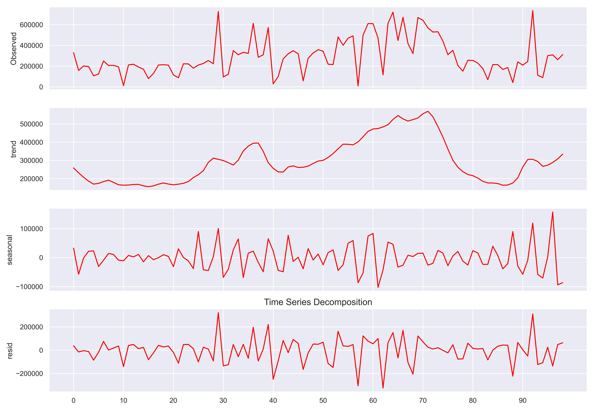
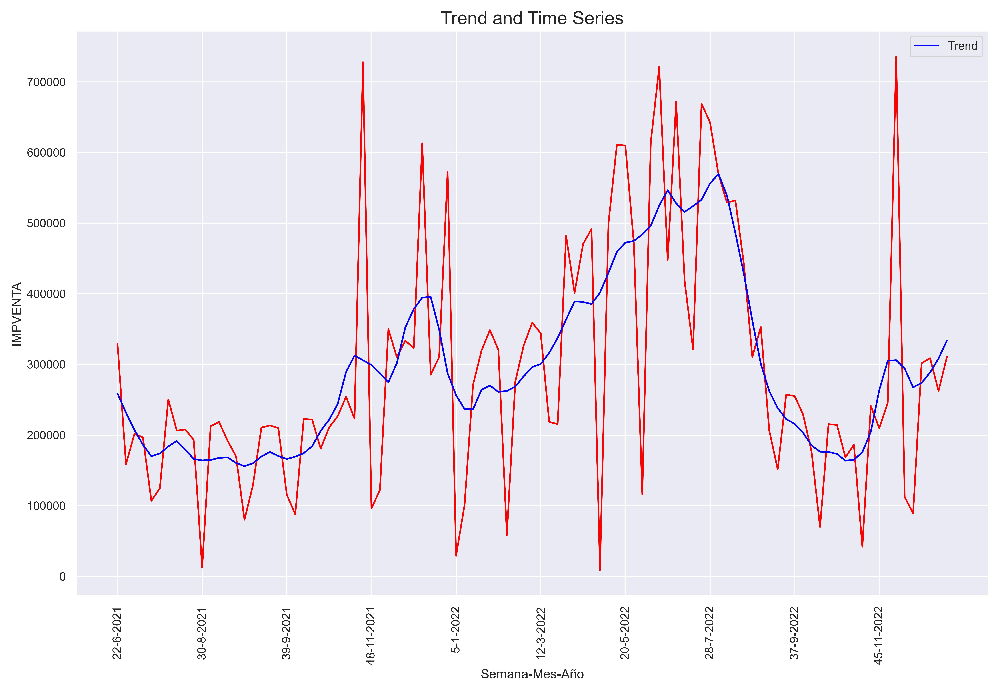

<div>
<style scoped>
    .dataframe tbody tr th:only-of-type {
        vertical-align: middle;
    }

    .dataframe tbody tr th {
        vertical-align: top;
    }

    .dataframe thead th {
        text-align: right;
    }
    
 
    table {
     display: block;
     overflow-x: auto;
     border-collapse: collapse;
     border-spacing: 0;
     border: 0px solid;
     color: var(--jp-ui-font-color1);
     font-size: 14px;
     margin-left: auto;
     margin-right: auto;
     
            }
            
</style>


<div class="warning" style='background-color:#FCF2EC; color: #000000; border-left: solid #FE9554 7px; border-radius: 3px; size:1px ; padding:0.1em;'>
<span>
 
<p style='margin-left:10em;'>


$\hspace{0.3cm}$ **More articles:    $\hspace{0.1cm}$ [Estadistica4all](https://fabioscielzoortiz.github.io/Estadistica4all.github.io/)**

$\hspace{0.3cm}$ **Author:** $\hspace{0.1cm}$ [Fabio Scielzo Ortiz](http://estadistica4all.com/autores/autores.html)

$\hspace{0.3cm}$ **If you use this article, please reference it:** 

$\hspace{0.5cm}$ Scielzo Ortiz, Fabio. (2023). Preprocessing and Visualizing Time Series in Python. Estadistica4all. http://estadistica4all.com/Articulos/Preprocessing_and_Visualizing_Time_Series_in_Python.html


</p>
 
</p></span>
</div>


***It's recommended to open the article in a computer or tablet.***
 
 
 
<br>


# Introduction to stochastic processes 


## Stochastic processes  


Let  $\hspace{0.1cm}\mathcal{X}_t\hspace{0.1cm}$ be a random variable (r.v.), for each $\hspace{0.1cm}t\in T$


<div class="warning" style='background-color:#F7EBE8; color: #030000; border-left: solid #CA0B0B 7px; border-radius: 3px; size:1px ; padding:0.1em;'>
<span>
 
<p style='margin-left:1em;'>


$\hspace{0.25cm}$ A **stochastic processes** is a set of random variables $\hspace{0.1cm}\left\lbrace \hspace{0.1cm} \mathcal{X}_t \hspace{0.1cm}:\hspace{0.1cm} t \in T \hspace{0.1cm}\right\rbrace\hspace{0.1cm}$ such that $\hspace{0.1cm}\mathcal{X}_t \in S \subset \mathbb{R}$
 

$\hspace{0.25cm}$ where:

- $T\hspace{0.1cm}$ is called **parameter space** and is the set of indices of the random variables that define the stochastic process. $\\[0.35cm]$

- $S\hspace{0.1cm}$ is called **states space** and is the variation field of the random variables that define the stochastic process. $\\[0.35cm]$


- We will say that $\hspace{0.1cm}\lbrace \hspace{0.1cm} \mathcal{X}_t \in S  \hspace{0.1cm} : \hspace{0.1cm} t \in T \hspace{0.1cm} \rbrace\hspace{0.15cm}$ is a stochastic process with parameter space $\hspace{0.1cm}T\hspace{0.1cm}$ and states space $\hspace{0.1cm}S$. $\\[0.5cm]$
 
</p>
 
</p></span>
</div>


**Observation:**

$T\hspace{0.1cm}$ is generally interpreted as moments or periods of time, because one of the most important applications of stochastic processes is time series modeling.


Therefore:

$X_t\hspace{0.1cm}$ is a random variable ussually used to model the state of a system at time moment $\hspace{0.06cm}t\hspace{0.06cm}$, or to model a variable of interest at the moment or period $\hspace{0.06cm}t$. 


<br>


## Discrete stochastic process  

<div class="warning" style='background-color:#F7EBE8; color: #030000; border-left: solid #CA0B0B 7px; border-radius: 3px; size:1px ; padding:0.1em;'>
<span>
 
<p style='margin-left:1em;'>

$\hspace{0.25cm}$ $\lbrace \hspace{0.1cm} \mathcal{X}_t \in S  \hspace{0.1cm}:\hspace{0.1cm} t \in T \hspace{0.1cm} \rbrace\hspace{0.15cm}$  is a **discrete stochastic process** if $\hspace{0.15cm}T\subset \lbrace 0,1,2,... \rbrace$

</p>
 
</p></span>
</div>

<br>

## Continuous stochastic process

<div class="warning" style='background-color:#F7EBE8; color: #030000; border-left: solid #CA0B0B 7px; border-radius: 3px; size:1px ; padding:0.1em;'>
<span>
 
<p style='margin-left:1em;'>

$\hspace{0.25cm}$ $\lbrace \hspace{0.1cm} \mathcal{X}_t \in S  \hspace{0.1cm}:\hspace{0.1cm} t \in T \hspace{0.1cm} \rbrace\hspace{0.15cm}$ is a **continuous stochastic process** if $\hspace{0.15cm}T\subset [0, \infty)$

</p>
 
</p></span>
</div>

<br>

## Types of stochastic processes  <a class="anchor" id="1"></a>

### Independent process


<div class="warning" style='background-color:#F7EBE8; color: #030000; border-left: solid #CA0B0B 7px; border-radius: 3px; size:1px ; padding:0.1em;'>
<span>
 
<p style='margin-left:1em;'>

$\hspace{0.25cm}$$\lbrace \hspace{0.1cm} \mathcal{X}_t \in S  \hspace{0.1cm}:\hspace{0.1cm} t \in T \hspace{0.1cm} \rbrace\hspace{0.1cm}$ is a **independent stochastic process** if the random variables that define the process are independent.

</p>
 
</p></span>
</div>

<br>


### Markov process

<div class="warning" style='background-color:#F7EBE8; color: #030000; border-left: solid #CA0B0B 7px; border-radius: 3px; size:1px ; padding:0.1em;'>
<span>
 
<p style='margin-left:1em;'>

$\hspace{0.25cm}$ A discrete stochastic process  $\hspace{0.1cm}\lbrace \hspace{0.1cm} \mathcal{X}_t \in S  \hspace{0.1cm}/\hspace{0.1cm} t \in \lbrace 0,1,2,... \hspace{0.1cm} \rbrace\hspace{0.2cm}$ is a **Markov process** if: $\\[0.15cm]$


$$P(\mathcal{X}_{n+1} = x_{n+1}\hspace{0.15cm} |\hspace{0.15cm} \mathcal{X}_0 = x_0 ,..., \mathcal{X}_n =x_n) \hspace{0.1cm}=\hspace{0.1cm} P(\mathcal{X}_{n+1} = x_{n+1}\hspace{0.15cm} |\hspace{0.15cm} \mathcal{X}_n = x_n)$$ 


$\hspace{0.25cm}$ where: $\hspace{0.2cm} x_{t} \in S \hspace{0.2cm},\hspace{0.2cm} \forall\hspace{0.1cm} t \in \lbrace 0,1,...,n+1\rbrace$  $\\[0.35cm]$

</p>
 
</p></span>
</div>

This property is known as the memoryless Markov property. Because it implies that the future state of the system, $\hspace{0.05cm}\mathcal{X}_{n+1}\hspace{0.05cm}$ , only depends on the present state $x_n$ and does not depend on past states $\hspace{0.05cm}x_0,...,x_{n- 1}\hspace{0.05cm}$.

<br>


### Process of independent increments


<div class="warning" style='background-color:#F7EBE8; color: #030000; border-left: solid #CA0B0B 7px; border-radius: 3px; size:1px ; padding:0.1em;'>
<span>
 
<p style='margin-left:1em;'>

$\hspace{0.25cm}$ A continuous stochastic process  $\hspace{0.1cm}\lbrace \hspace{0.1cm} \mathcal{X}_t \in S  \hspace{0.1cm}/\hspace{0.1cm} t \geq 0 \rbrace\hspace{0.1cm}$ is a independent increments process if:

$\hspace{0.25cm}$ For all set of times $\hspace{0.1cm}t_1,t_2,t_3\geq 0\hspace{0.13cm}$ such that $\hspace{0.1cm}t_1 < t_2 < t_3$


$\hspace{0.25cm}$ $\mathcal{X}_{t_2} - \mathcal{X}_{t_1} \hspace{0.1cm}$ and $\hspace{0.1cm} \mathcal{X}_{t_3} - \mathcal{X}_{t_2}\hspace{0.1cm}$ are independents.

</p>
 
</p></span>
</div>

This means that the displacements of the process in the time intervals $\hspace{0.1cm}[t_1 , t_2) , [t_2 , t_3)\hspace{0.1cm}$ are independent of each other, for all $\hspace{0.1cm }0 \leq t_1 < t_2 < t_3$.


<br>

### Strictly stationary process

<div class="warning" style='background-color:#F7EBE8; color: #030000; border-left: solid #CA0B0B 7px; border-radius: 3px; size:1px ; padding:0.1em;'>
<span>
 
<p style='margin-left:1em;'>

$\hspace{0.25cm}$ A continuous stochastic process $\hspace{0.1cm}\lbrace \hspace{0.1cm} \mathcal{X}_t \in S  \hspace{0.1cm}/\hspace{0.1cm} t \geq 0 \rbrace\hspace{0.2cm}$ is a **strictly stationary process**  if:

$\hspace{0.25cm}$ For all $\hspace{0.05cm}t \geq 0\hspace{0.05cm}$ , the probability distribution of $\hspace{0.05cm}\mathcal{X}_{t}\hspace{0.05cm}$ is the same as that of $\hspace{0.05cm}\mathcal{X}_{t+h}\hspace{0.05cm}$  , for all $\hspace{0.05cm}h>0\hspace{0.05cm}$.

</p>
 
</p></span>
</div>


Therefore, for all set of times $\hspace{0.1cm}t_1 , t_2,...,t_n$ :

$\hspace{0.2cm}(\mathcal{X}_{t_1}, \mathcal{X}_{t_2},\dots ,\mathcal{X}_{t_n} )\hspace{0.1cm}$ is identically distributed as $\hspace{0.1cm}(\mathcal{X}_{t_1+h}, \mathcal{X}_{t_2+h},\dots ,\mathcal{X}_{t_n+h} )$


<br>


### Process with stationary increments

<div class="warning" style='background-color:#F7EBE8; color: #030000; border-left: solid #CA0B0B 7px; border-radius: 3px; size:1px ; padding:0.1em;'>
<span>
 
<p style='margin-left:1em;'>

$\hspace{0.25cm}$ A continuous stochastic process $\hspace{0.1cm}\lbrace \hspace{0.1cm} \mathcal{X}_t \in S  \hspace{0.1cm}/\hspace{0.1cm} t \geq 0 \rbrace\hspace{0.1cm}$ is a process with stationary increments if:

$\hspace{0.25cm}$ For all pair of times  $\hspace{0.1cm}t_1,t_2 > 0\hspace{0.1cm}$ such that $\hspace{0.1cm}t_1 < t_2$


$\hspace{0.25cm}$ $\mathcal{X}_{t_2} - \mathcal{X}_{t_1}\hspace{0.1cm}$ and $\hspace{0.1cm}\mathcal{X}_{t_2 + h} - \mathcal{X}_{t_1 + h}\hspace{0.1cm}$ are independents, for any $\hspace{0.1cm}h>0$

</p>
 
</p></span>
</div>


<br>

### Martingalas process

<div class="warning" style='background-color:#F7EBE8; color: #030000; border-left: solid #CA0B0B 7px; border-radius: 3px; size:1px ; padding:0.1em;'>
<span>
 
<p style='margin-left:1em;'>

$\hspace{0.25cm}$ A discrete stochastic process $\hspace{0.1cm}\lbrace \hspace{0.1cm} \mathcal{X}_t \in S  \hspace{0.1cm}/\hspace{0.1cm} t \in \lbrace 0,1,2,... \hspace{0.1cm} \rbrace\hspace{0.1cm}$ is a Martingalas process if: $\\[0.15cm]$


$$E\left[\hspace{0.1cm}\mathcal{X}_{n+1} | X_0 = x_0 ,..., X_n = x_n\hspace{0.1cm} \right] \hspace{0.1cm} = \hspace{0.1cm} x_n$$  


$\hspace{0.25cm}$ where: $\hspace{0.2cm} x_{t} \in S \hspace{0.2cm},\hspace{0.2cm} \forall\hspace{0.1cm} t \in \lbrace 0,1,...,n+1\rbrace$ $\\[0.35cm]$

</p>
 
</p></span>
</div>

This property is known as Martingalas property, and it implies that the expected value of the sistym in the future  $\hspace{0.1cm}n+1\hspace{0.1cm}$ is the value of the system in the present $\hspace{0.1cm}x_n$. In mean the system doesn´t change of the state observed in the last moment.

This property is known as Martingale property, and it implies that the expected value of the sistym in the future $\hspace{0.1cm}n+1\hspace{0.1cm}$ is the value of the system in the present $\hspace {0.1cm}x_n$. So, in mean the system doesn´t change of the state observed in the last moment.


<br>

### Levy process

<div class="warning" style='background-color:#F7EBE8; color: #030000; border-left: solid #CA0B0B 7px; border-radius: 3px; size:1px ; padding:0.1em;'>
<span>
 
<p style='margin-left:1em;'>

$\hspace{0.25cm}$ A continuous stochastic process $\hspace{0.1cm}\lbrace \hspace{0.1cm} \mathcal{X}_t \in S  \hspace{0.1cm}/\hspace{0.1cm} t \geq 0 \rbrace\hspace{0.15cm}$ is a Levy process if is a  process of independents and stationaries increments. 

</p>
 
</p></span>
</div>

The Poisson and Brownian process are examples of Levy process.

<br>


### Gaussian Process  <a class="anchor" id="1"></a>

<div class="warning" style='background-color:#F7EBE8; color: #030000; border-left: solid #CA0B0B 7px; border-radius: 3px; size:1px ; padding:0.1em;'>
<span>
 
<p style='margin-left:1em;'>

$\hspace{0.25cm}$ A continuous stochastic process $\hspace{0.1cm}\lbrace \hspace{0.1cm} \mathcal{X}_t \in S  \hspace{0.1cm}/\hspace{0.1cm} t \geq 0 \rbrace\hspace{0.15cm}$ is a **Gaussian process** if:

$\hspace{0.25cm}$ For all set of times $\hspace{0.1cm}t_1,...,t_n \geq 0$ : $\\[0.12cm]$

$$(\mathcal{X}_{t_1}, \mathcal{X}_{t_2},...,\mathcal{X}_{t_n}) \sim NM(\mu , \Sigma)$$


$\hspace{0.25cm}$ where:

$\hspace{0.3cm}$ $NM(\mu , \Sigma)\hspace{0.1cm}$ denote the multivariate Normal probability distribution with mean vector $\hspace{0.1cm}\mu\hspace{0.1cm}$ y covariance matrix $\hspace{0.1cm}\Sigma$ . $\\[0.2cm]$


</p>
 
</p></span>
</div>


The  dynamic phenomena that we observe in a time series can grouped into two classes:

- The first are those that take stable values in time around a constant level, without showing a long term increasing or decreasing trend. These processes are called stationary. 

Examples of those are the average yearly  temperatures in a region or the propotion of births corresponding to males.


- A second class of processes are the non-stationary processes, which are those that can show trend, seasonality and other evolutionary effects over time.

Examples of those are the yearly income of a country, company sales or energy demand. These are series that evolve over time with more or less stable trends.


In practice, the classification of a series as stationary or not depends on the period of observation, since the series can be stable in a short period and non-stationary in a longer one.


<br>


# Time series  

<div class="warning" style='background-color:#F7EBE8; color: #030000; border-left: solid #CA0B0B 7px; border-radius: 3px; size:1px ; padding:0.1em;'>
<span>
 
<p style='margin-left:1em;'>

$\hspace{0.2cm}$ Given a stochastic process $\hspace{0.15cm} \mathcal{Y} \hspace{0.1cm}=\hspace{0.1cm} \Bigl( \hspace{0.06cm} \mathcal{Y}_t \hspace{0.12cm}: \hspace{0.12cm} t \in T=\lbrace 1,2,...,n \rbrace \hspace{0.06cm}\Bigl) \hspace{0.1cm} = \hspace{0.1cm}\Bigl( \hspace{0.06cm} \mathcal{Y}_1 ,  \mathcal{Y}_2 ,..., \mathcal{Y}_n  \hspace{0.06cm}\Bigl) \hspace{0.05cm}$ .

$\hspace{0.25cm}$ Given a sample of one observation $\hspace{0.08cm}y_t\hspace{0.08cm}$ of each random variable $\hspace{0.08cm}\mathcal{Y}_t\hspace{0.08cm}$ of the process, for $\hspace{0.06cm}t \in T=\lbrace 1,2,...,n \rbrace\hspace{0.06cm}$. $\\[0.3cm]$


- $\hspace{0.15cm} Y_t = \left( y_1, y_2, ...,y_n \right)^t \hspace{0.15cm}$ is a **time series** associated to the stochastic process $\hspace{0.09cm}\mathcal{Y}$.
 
 
$\hspace{0.25cm}$ where:

$\hspace{0.35cm}$ $y_t\hspace{0.06cm}$ is frequently interpreted as the value observed of the variable $\hspace{0.06cm}\mathcal{Y}\hspace{0.06cm}$ at the time or period $\hspace{0.06cm}t$. Hence the name **time** series. $\\[0.15cm]$

</p>
 
</p></span>
</div>


**Observations:**

- $y_t \in \mathbb{R}\hspace{0.08cm}$ is a realization of the random variable $\hspace{0.08cm}\mathcal{Y}_t$ $\\[0.35cm]$


- A time series is a realization of a stochastic process. The time series is considered a result or trajectory of the stochastic process. $\\[0.35cm]$

- A time series can be defined as a vector of data points ordered in time. Where the data is equally spaced in time, namely, between each data point there is the same time space, such as a week, a month, a trimester, a quarter ...


The process is characterized by the join probability distribution of the random variables $\hspace{0.1cm} \mathcal{Y}_1 ,  \mathcal{Y}_2 ,..., \mathcal{Y}_k   \hspace{0.1cm}$, namely, is characterized by the join density or probability function $\hspace{0.08cm}f_{\hspace{0.08cm}\mathcal{Y}_1 ,  \mathcal{Y}_2 ,..., \mathcal{Y}_k}$ 

This distribution is called finite-dimensional distribution of the process. We say that we know the probabilistic structure of the stochastic process when we know that join distribution, which determine the distribution of any subset of the variables and, in particular, the marginal distribution of each variable.

<br>


# Mean function 

<div class="warning" style='background-color:#F7EBE8; color: #030000; border-left: solid #CA0B0B 7px; border-radius: 3px; size:1px ; padding:0.1em;'>
<span>
 
<p style='margin-left:1em;'>

$\hspace{0.2cm}$ Given a stochastic process $\hspace{0.15cm} \mathcal{Y} \hspace{0.1cm}=\hspace{0.1cm} \Bigl( \hspace{0.06cm} \mathcal{Y}_t \hspace{0.12cm}: \hspace{0.12cm} t \in T=\lbrace 1,2,...,n \rbrace \hspace{0.06cm}\Bigl) \hspace{0.1cm} = \hspace{0.1cm}\Bigl( \hspace{0.06cm} \mathcal{Y}_1 ,  \mathcal{Y}_2 ,..., \mathcal{Y}_n  \hspace{0.06cm}\Bigl) \hspace{0.05cm}$ .

$\hspace{0.2cm}$ Mean function $\hspace{0.1cm} \mu_{\hspace{0.03cm}t} \hspace{0.1cm}$ of the process is defined as: $\\[0.15cm]$

$$\mu_{\hspace{0.03cm}t} = E\Bigl[\hspace{0.08cm}\mathcal{Y}_t\hspace{0.08cm}\Bigr]$$

$\hspace{0.2cm}$ for $\hspace{0.1cm}  t \in \lbrace 1,2,...,k \rbrace .\\$


</p>
 
</p></span>
</div>


**Observations:**

- An important particular case, due to its simplicity, arises when all the variables have the same mean and thus the mean function is a constant.
The realizations of the process show no trend and we say that the process is stable in the mean. $\\[0.35cm]$


- If, on the contrary, the means change over time, the observations at different
moments will reveal that change. $\\[0.35cm]$

- On many occasions we only have one realization of the stochastic process and
we have to deduce from that whether the mean function of the process is, or is
not, constant over time.


<br>

# Variance function

<div class="warning" style='background-color:#F7EBE8; color: #030000; border-left: solid #CA0B0B 7px; border-radius: 3px; size:1px ; padding:0.1em;'>
<span>
 
<p style='margin-left:1em;'>

$\hspace{0.2cm}$ Given a stochastic process $\hspace{0.15cm} \mathcal{Y} \hspace{0.1cm}=\hspace{0.1cm} \Bigl( \hspace{0.06cm} \mathcal{Y}_t \hspace{0.12cm}: \hspace{0.12cm} t \in T=\lbrace 1,2,...,n \rbrace \hspace{0.06cm}\Bigl) \hspace{0.1cm} = \hspace{0.1cm}\Bigl( \hspace{0.06cm} \mathcal{Y}_1 ,  \mathcal{Y}_2 ,..., \mathcal{Y}_n  \hspace{0.06cm}\Bigl) \hspace{0.05cm}$ .

$\hspace{0.2cm}$ Variance function $\hspace{0.1cm} \sigma^2_{\hspace{0.03cm}t} \hspace{0.1cm}$ of the process is defined as: $\\[0.15cm]$

$$\sigma^2_t = Var\Bigl[\hspace{0.08cm} \mathcal{Y}_t \hspace{0.08cm}\Bigr]$$

$\hspace{0.2cm}$ for $t \in \lbrace 1,2,...,k \rbrace \\$


</p>
 
</p></span>
</div>


 
**Observations:**


- We say that the process is stable in the variance if the variability is constant
over time. $\\[0.3cm]$

- A process can be stable in the mean but not in the variance and vice versa.


<br>

# Autocovariance function


The structure of linear dependence between random variables is represented by
the covariance and correlation functions.

<div class="warning" style='background-color:#F7EBE8; color: #030000; border-left: solid #CA0B0B 7px; border-radius: 3px; size:1px ; padding:0.1em;'>
<span>
 
<p style='margin-left:1em;'>

$\hspace{0.2cm}$ Given a stochastic process $\hspace{0.15cm} \mathcal{Y} \hspace{0.1cm}=\hspace{0.1cm} \Bigl( \hspace{0.06cm} \mathcal{Y}_t \hspace{0.12cm}: \hspace{0.12cm} t \in T=\lbrace 1,2,...,n \rbrace \hspace{0.06cm}\Bigl) \hspace{0.1cm} = \hspace{0.1cm}\Bigl( \hspace{0.06cm} \mathcal{Y}_1 ,  \mathcal{Y}_2 ,..., \mathcal{Y}_n  \hspace{0.06cm}\Bigl) \hspace{0.05cm}$ .

 
 
$\hspace{0.2cm}$ The autocovariance function $\hspace{0.08cm}\gamma_{\hspace{0.03cm}t \hspace{0.03cm},\hspace{0.03cm} t+h}\hspace{0.08cm}$ of the process is defined as: $\\[0.25cm]$

$$\gamma_{\hspace{0.03cm}t\hspace{0.03cm} ,\hspace{0.03cm} t+h} \hspace{0.08cm}=\hspace{0.08cm} Cov\left(\hspace{0.08cm}\mathcal{Y}_t \hspace{0.08cm} ,\hspace{0.08cm} \mathcal{Y}_{t+h}\hspace{0.08cm} \right) \hspace{0.08cm}=\hspace{0.08cm} E \hspace{0.08cm}\Bigl[\hspace{0.08cm} (\mathcal{Y}_t - \mu_{\hspace{0.03cm}t})\cdot (\mathcal{Y}_{t+h} - \mu_{\hspace{0.03cm}t+h}) \hspace{0.08cm}  \Bigr] \\$$

$\hspace{0.2cm}$ for $\hspace{0.1cm}t \in \lbrace 1,2,...,k \rbrace\hspace{0.12cm}$ and $\hspace{0.1cm}  h\in \lbrace \pm 1, \pm 2,... \rbrace . \\$


$\hspace{0.2cm}$ In particular, we have :


$$\gamma_{\hspace{0.03cm}t\hspace{0.03cm} , \hspace{0.03cm}t} \hspace{0.05cm}=\hspace{0.05cm} \sigma_t^2 \\$$

</p>
 
</p></span>
</div>


The autocovariances have dimensions, the squares of the series, thus it is not
advisable to use them for comparing series measured in different units.


<br>

# Autocorrelation function  <a class="anchor" id="1"></a> 

<div class="warning" style='background-color:#F7EBE8; color: #030000; border-left: solid #CA0B0B 7px; border-radius: 3px; size:1px ; padding:0.1em;'>
<span>
 
<p style='margin-left:1em;'>

$\hspace{0.2cm}$ Given a stochastic process $\hspace{0.15cm} \mathcal{Y} \hspace{0.1cm}=\hspace{0.1cm} \Bigl( \hspace{0.06cm} \mathcal{Y}_t \hspace{0.12cm}: \hspace{0.12cm} t \in T=\lbrace 1,2,...,n \rbrace \hspace{0.06cm}\Bigl) \hspace{0.1cm} = \hspace{0.1cm}\Bigl( \hspace{0.06cm} \mathcal{Y}_1 ,  \mathcal{Y}_2 ,..., \mathcal{Y}_n  \hspace{0.06cm}\Bigl) \hspace{0.05cm}$ .


$\hspace{0.2cm}$ The autocorrelation function $\hspace{0.08cm}\rho_{\hspace{0.05cm}t \hspace{0.05cm},\hspace{0.05cm} t+h}\hspace{0.08cm}$ of the process is defined as: $\\[0.25cm]$

$$\rho_{\hspace{0.05cm}t \hspace{0.05cm},\hspace{0.05cm} t+h\hspace{0.05cm}} =\hspace{0.05cm} \dfrac{\gamma_{\hspace{0.05cm}t\hspace{0.05cm} , \hspace{0.05cm}t+h\hspace{0.05cm}}}{\sqrt{\sigma_{\hspace{0.05cm}t}^2 \cdot \sigma_{\hspace{0.05cm}t+h}^2\hspace{0.08cm}}\hspace{0.08cm}} \\$$

$\hspace{0.2cm}$ for $\hspace{0.1cm}t \in \lbrace 1,2,...,k \rbrace\hspace{0.1cm}$ and $\hspace{0.1cm} h\in \lbrace \pm 1, \pm 2,... \rbrace \\$


$\hspace{0.2cm}$ In particular, we have :


$$\rho_{\hspace{0.05cm}t\hspace{0.05cm} ,\hspace{0.05cm} t\hspace{0.05cm}} =\hspace{0.05cm} 1 \\$$


</p>
 
</p></span>
</div>

 

It is interesting to notice the differences between conditional distributions and the marginal distributions.

The marginal distribution of $\hspace{0.08cm}\mathcal{Y}_t\hspace{0.08cm}$ represents what we know about a variable, without knowing anything about its trajectory until time $\hspace{0.05cm}t\hspace{0.05cm}$.

The conditional distribution of $\hspace{0.08cm}\mathcal{Y}_t\hspace{0.08cm}$ given $\hspace{0.08cm}\mathcal{Y}_{t-1}\hspace{0.05cm}$,...,$\hspace{0.05cm}\mathcal{Y}_{t-r}\hspace{0.08cm}$ represents what we
know about a variable when we know the k previous values of the process.

In time series conditional distributions are of greater interest than marginal
ones because they define the predictions that we can make about the future
knowing the past.


<br>


# Time Series Descomposition

Time series decomposition is a process by which we separate a time series into its components: trend, seasonality and residuals.

- Trend represents the slow-moving changes in a time series. $\\[0.25cm]$

- Seasonality represent the seasonal pattern in the series. The cycles occur repeatedly over a fixed period of time. $\\[0.25cm]$

- Residuals represent the behavior that cannot be explained by the trend and seasonality components. $\\[0.25cm]$

<br>

## Time Series Descomposition in `Python`  <a class="anchor" id="1"></a> 

First of all, we import the needed `Statsmodels` module for this section:
```python
from statsmodels.tsa.seasonal import seasonal_decompose, STL
```

We now print the time series dataset that we are going to use throughout this article. It is recommended that you first read our article on preprocessing and visualizing time series in `Python`.

```python
Weekly_Time_Series_1
```


<div>
<style scoped>
    .dataframe tbody tr th:only-of-type {
        vertical-align: middle;
    }

    .dataframe tbody tr th {
        vertical-align: top;
    }

    .dataframe thead th {
        text-align: right;
    }
</style>
<table border="1" class="dataframe">
  <thead>
    <tr style="text-align: right;">
      <th></th>
      <th>Año</th>
      <th>Mes</th>
      <th>Semana</th>
      <th>Ventas</th>
      <th>Semana-Mes-Año</th>
    </tr>
  </thead>
  <tbody>
    <tr>
      <th>0</th>
      <td>2021</td>
      <td>6</td>
      <td>22</td>
      <td>329029.82</td>
      <td>22-6-2021</td>
    </tr>
    <tr>
      <th>1</th>
      <td>2021</td>
      <td>6</td>
      <td>23</td>
      <td>158833.59</td>
      <td>23-6-2021</td>
    </tr>
    <tr>
      <th>2</th>
      <td>2021</td>
      <td>6</td>
      <td>24</td>
      <td>201568.21</td>
      <td>24-6-2021</td>
    </tr>
    <tr>
      <th>3</th>
      <td>2021</td>
      <td>6</td>
      <td>25</td>
      <td>196610.74</td>
      <td>25-6-2021</td>
    </tr>
    <tr>
      <th>4</th>
      <td>2021</td>
      <td>6</td>
      <td>26</td>
      <td>106849.14</td>
      <td>26-6-2021</td>
    </tr>
    <tr>
      <th>...</th>
      <td>...</td>
      <td>...</td>
      <td>...</td>
      <td>...</td>
      <td>...</td>
    </tr>
    <tr>
      <th>94</th>
      <td>2022</td>
      <td>12</td>
      <td>48</td>
      <td>89144.45</td>
      <td>48-12-2022</td>
    </tr>
    <tr>
      <th>95</th>
      <td>2022</td>
      <td>12</td>
      <td>49</td>
      <td>301484.19</td>
      <td>49-12-2022</td>
    </tr>
    <tr>
      <th>96</th>
      <td>2022</td>
      <td>12</td>
      <td>50</td>
      <td>308829.59</td>
      <td>50-12-2022</td>
    </tr>
    <tr>
      <th>97</th>
      <td>2022</td>
      <td>12</td>
      <td>51</td>
      <td>262326.49</td>
      <td>51-12-2022</td>
    </tr>
    <tr>
      <th>98</th>
      <td>2022</td>
      <td>12</td>
      <td>52</td>
      <td>311029.97</td>
      <td>52-12-2022</td>
    </tr>
  </tbody>
</table>
<p>99 rows × 5 columns</p>
</div>


<br>


We create a plot whit the different components of the time series:

```python
advanced_decomposition = STL(Weekly_Time_Series_1.Ventas, period=4).fit()
```


```python
fig, axs = plt.subplots(nrows=4, ncols=1, sharex=True)

plt.title("Time Series Decomposition",  fontsize = 16)

p1=sns.lineplot(advanced_decomposition.observed, color='red', ax=axs[0])
p2=sns.lineplot(advanced_decomposition.trend, color='red', ax=axs[1])
p3=sns.lineplot(advanced_decomposition.seasonal, color='red', ax=axs[2])
p4=sns.lineplot(advanced_decomposition.resid, color='red', ax=axs[3])

p1.set_ylabel('Observed')
p2.set_ylabel('trend')
p3.set_ylabel('seasonal')
p4.set_ylabel('resid')

p1.set_xticks(np.arange(0 , len(Weekly_Time_Series_1) , 10))

plt.setp(p1.get_xticklabels(), rotation=90)

fig.savefig('p6.jpg', format='jpg', dpi=1200)

plt.show()
```


   
<center>

{width="70%"}

</center> 
     
     


<br>

The following plot has a trend superimposed on the time series:

```python
fig, ax = plt.subplots()

p1=sns.lineplot(x="Semana-Mes-Año", y="Ventas", data=Weekly_Time_Series_1 , color='red')
p2=sns.lineplot(advanced_decomposition.trend, color='blue', linestyle='-', label='Trend')

p1.set_xticks(np.arange(0 , len(Weekly_Time_Series_1) , 10))

plt.setp(p1.get_xticklabels(), rotation=90)

plt.title("Trend and Time Series",  fontsize = 17)

fig.savefig('p7.jpg', format='jpg', dpi=1200)

plt.show()
```


<center>

{width="70%"}

</center> 


<br>


<br>


# Regression Problem vs   Time Series  Forecasting <a class="anchor" id="1"></a>
 

You probably have encountered regression problems where you must predict some continuous
target given a certain set of features. At first glance, time series forecasting seems
like a typical regression problem: we have some historical data, and we wish to build a
mathematical expression that will express future values as a function of past values.
However, there are some key differences between time series forecasting and regression
for time-independent scenarios that deserve to be addressed before we look at
our very first forecasting technique.


- **Time series have an order:**

    The first concept to keep in mind is that time series have an order, and we cannot change that order when modeling. In time series forecasting, we express future values as a function of past values. Therefore, we must keep the data in order, so as to not violate this relationship.

    Other regression tasks in machine learning often do not have an order. For example, if you are tasked to predict revenue based on ad spend, it does not matter when a certain amount was spent on ads. Instead, you simply want to relate the amount of ad spend to the revenue. In fact, you might even randomly shuffle the data to make your model more robust. Here the regression task is to simply derive a function such that given an amount on ad spend, an estimate of revenue is returned. On the other hand, time series are indexed by time, and that order must be kept. $\\[1.55cm]$


- **Time series sometimes do not have features:**

    It is possible to forecast time series without the use of features other than the time series itself. As data scientists, we are used to having datasets with many columns, each representing a potential predictor for our target. For example, consider the task of predicting revenue based on ad spend, where the revenue is the target variable. As features, we could have the amount spent on Google ads, Facebook ads, and television ads. Using these three features, we would build a regression model to estimate revenue. However, with time series, it is quite common to be given a simple dataset with a time column and a value at that point in time. Without any other features, we must learn ways of using past values of the time series to forecast future values. This is when the moving average model or autoregressive model come into play, as they are ways to express future values as a function of past values

<br>


#  Time Series Forecasting <a class="anchor" id="1"></a>


Given a stochastic process $\hspace{0.15cm} \mathcal{Y} \hspace{0.1cm}=\hspace{0.1cm}  \hspace{0.1cm}\bigl( \hspace{0.06cm} \mathcal{Y}_1 ,  \mathcal{Y}_2 ,..., \mathcal{Y}_n  \hspace{0.06cm}\bigl) \hspace{0.1cm}$ .


<div class="warning" style='background-color:#F7EBE8; color: #030000; border-left: solid #CA0B0B 7px; border-radius: 3px; size:1px ; padding:0.1em;'>
<span>
 
<p style='margin-left:1em;'>


- We have a time series $\hspace{0.07cm}Y_t = \left( y_1, y_2, ...,y_n \right)^t \hspace{0.1cm}$ associated to the  process $\hspace{0.07cm}\mathcal{Y}\hspace{0.07cm}$.$\\[0.4cm]$ 

- $\hspace{0.05cm}y_t\hspace{0.07cm}$ is the value of the process $\hspace{0.07cm}\mathcal{Y}\hspace{0.07cm}$ in the period $\hspace{0.07cm}t$.$\\[0.4cm]$ 


- Our goal is to predict the value of the process at future periods. For that we will use the observed values of the process in the time series, namely, using the available data. $\\[0.4cm]$ 

- We want to predict $\hspace{0.1cm}y_{n+k}\hspace{0.15cm}$, for $\hspace{0.07cm}k=1,2,3,\dots$ $\\[0.4cm]$ 
 
- The idea under most part of forecasting methods is to predict $\hspace{0.1cm}y_{n+k}\hspace{0.1cm}$ as:


$$\widehat{y}_{n+k} \hspace{0.1cm}=\hspace{0.1cm} \widehat{g}_k(y_1, y_2, ...,y_n) \hspace{0.25cm} , \hspace{0.25cm} k = 1,2,3,\dots$$

</p>
 
</p></span>
</div>

 

**Observations:**

- We are assuming that the  available data is $\hspace{0.1cm}Y_t = \left( y_1, y_2, ...,y_n \right)^t \hspace{0.1cm}$. $\\[0.35cm]$

- In many cases $\hspace{0.1cm}y_{n+k}\hspace{0.1cm}$ is the value of the process in a future period. So, by definition, we don't know $\hspace{0.1cm}y_{n+k}\hspace{0.12cm}$, for $\hspace{0.07cm}k=1,2,3,\dots$.

 
<br>


# Stationary processes


## Strict Stationarity

Given a stochastic process $\hspace{0.15cm} \mathcal{Y} \hspace{0.1cm}=\hspace{0.1cm}  \hspace{0.1cm}\bigl( \hspace{0.06cm} \mathcal{Y}_1 ,  \mathcal{Y}_2 ,..., \mathcal{Y}_n  \hspace{0.06cm}\bigl) \hspace{0.1cm}.$ $\\[0.25cm]$


The stochastic process $\hspace{0.08cm}\mathcal{Y} \hspace{0.08cm}$ is **strictly stationary** if:

the probability distribution of $\hspace{0.08cm}\mathcal{Y}_{t}\hspace{0.08cm}$ is the same as that of $\hspace{0.08cm}\mathcal{Y}_{t+h}\hspace{0.08cm}$,
for all $\hspace{0.1cm}t = 1,2,...,n \rbrace\hspace{0.1cm}$ and $\hspace{0.1cm} h = 1,2,3,...\\$   

 
Strict stationarity is a very strong condition, since to prove it we must have the joint distributions for any set of variables in the process. A weaker property, but one which is easier to prove, is **weak stationarity**.


<br>


## Weak Stationarity

Given a stochastic process $\hspace{0.15cm} \mathcal{Y} \hspace{0.1cm}=\hspace{0.1cm}  \hspace{0.1cm}\bigl( \hspace{0.06cm} \mathcal{Y}_1 ,  \mathcal{Y}_2 ,..., \mathcal{Y}_n  \hspace{0.06cm}\bigl) \hspace{0.1cm}.$  $\\[0.25cm]$


The stochastic process $\hspace{0.08cm}\mathcal{Y} \hspace{0.08cm}$ is **weakly stationary** if:  $\\[0.35cm]$

- $\mu_t \hspace{0.08cm}=\hspace{0.08cm} \mu \hspace{0.3cm} , \hspace{0.3cm} \forall\hspace{0.08cm} t = 1,2,...,n \hspace{0.5cm}\text{(weak stationarity in mean)}\\$

- $\sigma_t^2 \hspace{0.08cm}=\hspace{0.08cm} \sigma^2  \hspace{0.3cm},\hspace{0.3cm} \forall\hspace{0.08cm} t = 1,2,...,n  \hspace{0.5cm}\text{(weak stationarity in variance)}\\$

- $\gamma_{t , t - h} \hspace{0.08cm}=\hspace{0.08cm}   \gamma_h   \hspace{0.4cm},\hspace{0.4cm} \gamma_{h}\hspace{0.08cm}=\hspace{0.08cm}   \gamma_{-h} \hspace{0.4cm},\hspace{0.4cm} \forall\hspace{0.08cm} h = 0 , \pm 1 , \pm 2 ,...  \hspace{0.5cm}\text{(weak stationarity in covariance)}\\$

   
   
    Where:  $\hspace{0.2cm}\gamma_{t , t - h} \hspace{0.08cm}=\hspace{0.08cm}Cov(\mathcal{Y}_t,\mathcal{Y}_{t-h}) \hspace{0.08cm}=\hspace{0.08cm}E[(\mathcal{Y}_t - \mu)\cdot (\mathcal{Y}_{t-h} - \mu)]\\$
    
    

The first two conditions indicate that the **mean** and **variance** are **constant**.

The third indicates that the covariance between two variables depends only on
their temporal separation.

In a stationary process the autocovariances and autocorrelations depend only on
the lag between the variables and, in particular, the relationship between $\hspace{0.08cm}\mathcal{Y}_t\hspace{0.08cm}$ and $\hspace{0.08cm}\mathcal{Y}_{t+h}\hspace{0.08cm}$ ,  is always equal to the relationship between $\hspace{0.08cm}\mathcal{Y}_t\hspace{0.08cm}$ and $\hspace{0.08cm}\mathcal{Y}_{t-h}\hspace{0.08cm}$, this can be summarize as $\hspace{0.08cm}\gamm_{t,t-h} \hspace{0.08cm}=\hspace{0.08cm} \gamma_{h}\hspace{0.08cm}=\hspace{0.08cm}   \gamma_{-h} \hspace{0.08cm}=\hspace{0.08cm}  \gamma_{t,t+h}\hspace{0.08cm}$ .


As a result, in a weak stationary processes:


$$\rho_{t, t-h} \hspace{0.08cm}=\hspace{0.08cm} \dfrac{\gamma_{t , t - h}}{\sqrt{\sigma_t^2 \cdot \sigma_{t-h}^2}} \hspace{0.08cm}=\hspace{0.08cm} \dfrac{\gamma_h}{\sqrt{\sigma^2 \cdot \sigma^2}} \hspace{0.08cm}=\hspace{0.08cm} \dfrac{\gamma_h}{\sigma^2}\hspace{0.08cm} =\hspace{0.08cm} \dfrac{\gamma_h}{\gamma_0} \hspace{0.08cm}=\hspace{0.08cm} \rho_h$$

And also it's fulfilled that $\hspace{0.08cm}\rho_h\hspace{0.08cm} = \hspace{0.08cm}\rho_{-h}\hspace{0.08cm}$.


<br>

**Observation:**

Weak stationarity doesn't guarantee full process stability, namely, the probability distribution of $\hspace{0.08cm}\mathcal{Y}_t\hspace{0.08cm}$ may change for different $\hspace{0.08cm}t\hspace{0.08cm}$ values.

But, if it is assume that $\hspace{0.08cm}\mathcal{Y}_1,\dots , \mathcal{Y}_n \hspace{0.08cm}\sim\hspace{0.08cm} NM_n(\mathbf{\mu}, \mathbf{\Sigma})\hspace{0.08cm}$, then, weak stationariy is equivalent to strict stationarity.


<br>


## Asymptotic Weak Stationarity

Given a stochastic process $\hspace{0.15cm} \mathcal{Y} \hspace{0.1cm}=\hspace{0.1cm}  \hspace{0.1cm}\bigl( \hspace{0.06cm} \mathcal{Y}_1 ,  \mathcal{Y}_2 ,..., \mathcal{Y}_n  \hspace{0.06cm}\bigl) \hspace{0.1cm}.$  $\\[0.25cm]$


The stochastic process $\hspace{0.08cm}\mathcal{Y} \hspace{0.08cm}$ is **asymptotically stationary in a weak sense** if:   $\\[0.35cm]$

- $\mu_t \hspace{0.08cm}=\hspace{0.08cm} \mu \hspace{0.3cm} , \hspace{0.3cm} \forall\hspace{0.08cm} t \rightarrow \infty \hspace{0.5cm}\text{(asymptotic weak stationarity in mean)}\\$

- $\sigma_t^2 \hspace{0.08cm}=\hspace{0.08cm} \sigma^2  \hspace{0.3cm},\hspace{0.3cm} \forall\hspace{0.08cm} t \rightarrow \infty  \hspace{0.5cm}\text{(asymptotic weak stationarity in variance)}\\$

- $\gamma_{t , t - h} \hspace{0.08cm}=\hspace{0.08cm}   \gamma_h   \hspace{0.4cm},\hspace{0.4cm} \gamma_{h}\hspace{0.08cm}=\hspace{0.08cm}   \gamma_{-h} \hspace{0.4cm},\hspace{0.4cm} \forall\hspace{0.08cm} h = 0 , \pm 1 , \pm 2 ,...  \hspace{0.5cm}\text{(weak stationarity in covariance)}\\$


<br>


## White Noise Process  <a class="anchor" id="1"></a>


Given a stochastic process $\hspace{0.15cm} \mathcal{Y} \hspace{0.08cm}=\hspace{0.08cm}  \hspace{0.1cm}\bigl( \hspace{0.06cm} \mathcal{Y}_1 ,  \mathcal{Y}_2 ,..., \mathcal{Y}_n  \hspace{0.06cm}\bigl) \hspace{0.1cm}.$  $\\[0.25cm]$


The process $\hspace{0.08cm}\mathcal{Y}\hspace{0.08cm}$ is a white noise process if: $\\[0.35cm]$

- $E[\mathcal{Y}_t] \hspace{0.08cm}=\hspace{0.08cm} 0 \hspace{0.3cm}, \hspace{0.3cm}\forall\hspace{0.08cm} t=1,\dots , n\\$

- $Var(\mathcal{Y}_t)=\sigma^2 \hspace{0.3cm}, \hspace{0.3cm}\forall\hspace{0.08cm} t=1,\dots , n\\$

- $\gamma_{t,t+h} \hspace{0.08cm}= \hspace{0.08cm}Cov(\mathcal{Y}_t, \mathcal{Y}_{t+h})\hspace{0.08cm}=\hspace{0.08cm}0 \hspace{0.3cm}, \hspace{0.3cm}\forall\hspace{0.08cm} t=1,\dots , n\\$


**Observation:**

A white noise process is a weak stationarity process.


<br>

---

<br>


# First-Order Autoregresive Process: AR(1) process  


Given a stochastic process $\hspace{0.15cm} \mathcal{Y} \hspace{0.08cm}=\hspace{0.08cm}  \hspace{0.1cm}\bigl( \hspace{0.06cm} \mathcal{Y}_1 ,  \mathcal{Y}_2 ,..., \mathcal{Y}_n  \hspace{0.06cm}\bigl) \hspace{0.1cm}.$  $\\[0.25cm]$
 
 


The first-order autoregressive process $\hspace{0.08cm}AR(1)\hspace{0.08cm}$ for the process $\hspace{0.08cm}\mathcal{Y}\hspace{0.08cm}$ is defined as: $\\[0.35cm]$

$$\mathcal{Y}_t\hspace{0.08cm}=\hspace{0.08cm}\phi_0 \hspace{0.08cm}+\hspace{0.08cm} \phi_1 \cdot \mathcal{Y}_{t-1} \hspace{0.08cm}+\hspace{0.08cm} \varepsilon_t \hspace{0.4cm}  , \hspace{0.4cm}  t = 2,3,\dots , n$$ 

Where:

- $\varepsilon_t \hspace{0.08cm}\sim \hspace{0.08cm}N(0,\sigma^2) \hspace{0.3cm},\hspace{0.3cm} \forall\hspace{0.08cm} t = 2,3,\dots , n\\$

- $Cov(\varepsilon_t \hspace{0.08cm},\hspace{0.08cm} \varepsilon_{t+h})=0 \hspace{0.3cm},\hspace{0.3cm}  \forall\hspace{0.08cm} t = 2,3,\dots \hspace{0.15cm},\hspace{0.15cm}  \forall\hspace{0.08cm} h = \pm 1,\pm 2,\dots\\$


- $Cov(\mathcal{Y}_{t+h}\hspace{0.08cm},\hspace{0.08cm} \varepsilon_t) \hspace{0.08cm}=\hspace{0.08cm} 0 \hspace{0.3cm},\hspace{0.3cm}  \forall\hspace{0.08cm} t = 2,3,\dots  \hspace{0.15cm},\hspace{0.15cm} \forall\hspace{0.08cm}  h = 0,\pm 1,\pm 2,\dots\\$
    
    First two assumptions means that $\hspace{0.08cm}(\hspace{0.03cm}\varepsilon_t \hspace{0.1cm}:\hspace{0.1cm} t = 2,3,\dots, n \hspace{0.03cm})\hspace{0.1cm}$ is a **normal white noise proccess**. 
    
    
<br>    
    

## Expression of AR(1) as a function of the lag operator

We can express $\hspace{0.08cm}AR(2)\hspace{0.08cm}$ process using the lag operator as follows: $\\[0.3cm]$

$$\left(1 - \phi_1 \cdot B\right) \cdot \mathcal{Y}_t \hspace{0.08cm} =\hspace{0.08cm} \phi_0 \hspace{0.08cm}+\hspace{0.08cm} \varepsilon_t$$


Where: 

$B\hspace{0.08cm}$ is the lag operator and is defined as follows:

$$B\cdot \mathcal{Y}_t \hspace{0.08cm}=\hspace{0.08cm} \mathcal{Y}_{t-1}$$

$$B^h\cdot \mathcal{Y}_t \hspace{0.08cm}=\hspace{0.08cm} \mathcal{Y}_{t-h}  \hspace{0.3cm} , \hspace{0.3cm} h=1,2,\dots$$


<br>


## Mean of AR(1) process

In general, for an $\hspace{0.08cm}AR(1)\hspace{0.08cm}$  process we have the following:


$$\mu_t \hspace{0.08cm}=\hspace{0.08cm} E[\mathcal{Y}_t] \hspace{0.08cm}=\hspace{0.08cm} \phi_0 \cdot \sum_{i=0}^{t-2}\hspace{0.08cm} \phi_1^i \hspace{0.08cm}+\hspace{0.08cm} \phi_1^{t-1}\cdot \mu_1$$


Where: $\hspace{0.12cm}\mu_1 \hspace{0.08cm}=\hspace{0.08cm} E[\mathcal{Y}_1]\\$


As we can see, $\hspace{0.08cm}\mu_t\hspace{0.08cm}$ depends on $\hspace{0.08cm}t\hspace{0.08cm}$ so, It isn't necessarily constant. That means $\hspace{0.08cm}AR(1)\hspace{0.08cm}$ isn't necessarily a weak stationary process.  $\\[1.5cm]$


- If $\hspace{0.1cm}| \phi_1 | < 1\hspace{0.1cm}$ , then:

   
    $$\mu_t \hspace{0.08cm}=\hspace{0.08cm} \mu_{\mathcal{Y}} \hspace{0.08cm}=\hspace{0.08cm} \dfrac{\phi_0}{1-\phi_1} \hspace{0.35cm} ,\hspace{0.35cm} t \rightarrow \infty \\$$
    
    
    
    So, the $\hspace{0.08cm}AR(1)\hspace{0.08cm}$ process is **weakly stationary in mean**, in an **asymptotic** sense, because the mean converge to a constant value when $\hspace{0.08cm}t\hspace{0.08cm}$ is large enough. $\\[0.3cm]$
    
    
    
    Using that fact, we will consider the following approximation:$\\[0.3cm]$
    
    $$\mu_t\hspace{0.08cm} \approx\hspace{0.08cm} \mu_{\mathcal{Y}} \hspace{0.08cm}=\hspace{0.08cm} \dfrac{\phi_0}{1-\phi_1} \hspace{0.3cm},\hspace{0.3cm} \forall\hspace{0.08cm} t = 1,2,\dots , n$$ $\\[0.7cm]$


- If $\hspace{0.1cm}| \phi_1 | \geq 1\hspace{0.1cm}$ , then: $\\[0.4cm]$ 


    $$\mu_t\hspace{0.2cm}  \text{doesn't converge to a constant value.}\hspace{0.3cm},\hspace{0.3cm} \forall\hspace{0.08cm} t = 1,2,\dots , n \\$$

    So, the $\hspace{0.08cm}AR(1)\hspace{0.08cm}$ process  isn't weak stationary in mean, and by extension, It  isn't weak stationary, in general, so neither in a strict sense. 
    
    
<br>

---

<br>

**Proof:**

Using the definition of the $\hspace{0.08cm}AR(1)\hspace{0.08cm}$  process, by recursion, we can proof the following statement:

$$\mathcal{Y}_t \hspace{0.08cm}=\hspace{0.08cm} \phi_0 \cdot \sum_{i=0}^{t-2}\hspace{0.08cm} \phi_1^i \hspace{0.08cm}+\hspace{0.08cm} \phi_1^{t-1}\cdot \mathcal{Y}_1 \hspace{0.08cm}+\hspace{0.08cm} \sum_{i=0}^{t-2} \hspace{0.08cm}\phi_1^i \cdot \varepsilon_{t-i}  \hspace{0.3cm},\hspace{0.3cm} t=2,3,\dots,n \\$$


So,taking the expectation we have:

$$\mu_t = E[\mathcal{Y}_t]  \hspace{0.08cm}=\hspace{0.08cm} \phi_0 \cdot \sum_{i=0}^{t-2}\hspace{0.08cm} \phi_1^i \hspace{0.08cm}+\hspace{0.08cm} \phi_1^{t-1}\cdot \mu_1 \hspace{0.3cm},\hspace{0.3cm} t=2,3,\dots,n$$


Therefore, $\hspace{0.08cm}\mu_t\hspace{0.08cm}$ depends on $\hspace{0.08cm}t\hspace{0.08cm}$ and isn't necessarily constant. $\\[1cm]$


- If $\hspace{0.1cm}| \phi_1 | < 1\hspace{0.1cm}$ , then:

  
    $$\sum_{i=0}^{t-2}\hspace{0.08cm} \phi_1^i \hspace{0.1cm}=\hspace{0.1cm} \dfrac{\hspace{0.08cm}1-\phi_1^{t-1}\hspace{0.08cm}}{1-\phi_1}\\$$


   
    So, we have,:
    
    $$\mu_t \hspace{0.08cm}=\hspace{0.08cm} \phi_0 \cdot\dfrac{1-\phi_1^{t-1}}{1-\phi_1} \hspace{0.08cm}+\hspace{0.08cm} \phi_1^{t-1}\cdot \mu_1\\$$
    
    
    And, under the assumption of $\hspace{0.1cm}| \phi_1 | < 1\hspace{0.1cm}$, we also have:
    
    $$\underset{t \rightarrow \infty}{\text{lim}} \hspace{0.08cm} \phi_1^{t-1} \hspace{0.08cm}=\hspace{0.08cm} 0\\$$


    Therefore:
    
    $$\underset{t \rightarrow \infty}{\text{lim}} \hspace{0.08cm} \mu_t \hspace{0.08cm}=\hspace{0.08cm} \phi_0 \cdot\dfrac{1}{1-\phi_1}\\$$
    
    So, the mean $\hspace{0.08cm}\mu_t\hspace{0.08cm}$ converge to a constant value when $t$ is large. So, the process $AR(1)$ process is weakly stationary in a asymptotic sense. $\\[1.5cm]$
    


- If $\hspace{0.1cm}| \phi_1 | \geq 1\hspace{0.1cm}$ , then: $\\[0.7cm]$


    The sum $\hspace{0.12cm}\sum_{i=0}^{t-2}\hspace{0.08cm} \phi_1^i\hspace{0.1cm}$ doesn't converge to a constant value.
 
 
    And the value of $\hspace{0.1cm}\phi_1^{t-1}\hspace{0.1cm}$ depends on $\hspace{0.08cm}t\hspace{0.08cm}$ and doen't converge to $\hspace{0.08cm}0\hspace{0.1cm}$ when $\hspace{0.08cm}t\rightarrow \infty$
 

    So, the mean $\hspace{0.08cm}\mu_t\hspace{0.08cm}$ doesn't converge to a constant value. Then, the $\hspace{0.08cm}AR(1)\hspace{0.08cm}$ process is not stationary, neither in the weak nor in the strict sense.


<br>


## Variance of AR(1) process

In general, for an $\hspace{0.08cm}AR(1)\hspace{0.08cm}$  process we have the following:


$$\sigma_t^2 \hspace{0.08cm}=\hspace{0.08cm} Var(\mathcal{Y}_t) \hspace{0.08cm}=\hspace{0.08cm} \phi_1^{2(t-1)} \cdot \sigma_1^2 \hspace{0.08cm}+\hspace{0.08cm} Var\left(\hspace{0.08cm} \sum_{i=0}^{t-2} \phi_1^i \cdot \varepsilon_{t-i} \hspace{0.08cm} \right)\\$$


As we can see, $\hspace{0.1cm}\sigma_t^2\hspace{0.1cm}$ depends on $\hspace{0.08cm}t\hspace{0.08cm}$ so, not is necessarily constant.  That means $\hspace{0.08cm}AR(1)\hspace{0.08cm}$ isn't necessarily a weak stationary process.  $\\[1.5cm]$


- If $\hspace{0.1cm}| \phi_1 | < 1\hspace{0.1cm}$ , then:


    $$\sigma_t^2 \hspace{0.08cm}=\hspace{0.08cm}  \sigma_{\mathcal{Y}}^2  \hspace{0.08cm}=\hspace{0.08cm} \dfrac{\sigma^2}{1-\phi_1^2} \hspace{0.35cm} ,\hspace{0.35cm} t \rightarrow \infty\\$$


    So, the AR(1) process is **weakly stationary in variance**, in an **asymptotic sense**,    because the variance converge to a constant value when $\hspace{0.08cm}t\hspace{0.08cm}$ is large enough. $\\[0.3cm]$
    
    
    
    Using that fact, we will consider the following approximation:$\\[0.3cm]$
    
    $$\sigma_t^2\hspace{0.08cm} \approx\hspace{0.08cm} \sigma_{\mathcal{Y}}^2 \hspace{0.08cm}=\hspace{0.08cm} \dfrac{\sigma^2}{1-\phi_1^2} \hspace{0.3cm},\hspace{0.3cm} \forall\hspace{0.08cm} t = 1,2,\dots , n $$ $\\[0.7cm]$

    

- If $\hspace{0.1cm}| \phi_1 | \geq 1\hspace{0.1cm}$ , then: $\\[0.35cm]$

   
    $$\hspace{0.08cm}\sigma_t^2\hspace{0.13cm}  \text{doesn't converge to a constant value.} \hspace{0.3cm},\hspace{0.3cm} \forall\hspace{0.08cm} t = 1,2,\dots , n\\$$

    So, the process $\hspace{0.08cm}AR(1)\hspace{0.08cm}$ isn't weak stationary in variance, and by extension, the process $\hspace{0.08cm}AR(1)\hspace{0.08cm}$ isn't a weak stationary process, so neither in a strict sense. $\\[1cm]$

<br>

---

<br>

**Proof:**

Using the definition of the $\hspace{0.08cm}AR(1)\hspace{0.08cm}$  process by recursion we can proof the following statement:

$$\mathcal{Y}_t \hspace{0.08cm}=\hspace{0.08cm} \phi_0 \cdot \sum_{i=0}^{t-2}\hspace{0.08cm} \phi_1^i \hspace{0.08cm}+\hspace{0.08cm} \phi_1^{t-1}\cdot \mathcal{Y}_1 \hspace{0.08cm}+\hspace{0.08cm} \sum_{i=0}^{t-2} \hspace{0.08cm}\phi_1^i \cdot \varepsilon_{t-i}  \hspace{0.3cm},\hspace{0.3cm} t=2,3,\dots,n$$


So, taking the variance we have:

$$\sigma_t^2 \hspace{0.08cm}=\hspace{0.08cm} Var(\mathcal{Y}_t) \hspace{0.08cm}=\hspace{0.08cm} \phi_1^{2(t-1)} \cdot \sigma_1^2 \hspace{0.08cm}+\hspace{0.08cm} Var\left(\sum_{i=0}^{t-2} \phi_1^i \cdot \varepsilon_{t-i}\right)$$


We have that:

$$Var\left(\sum_{i=0}^{t-2} \phi_1^i \cdot \varepsilon_{t-i}\right) \hspace{0.08cm}=\hspace{0.08cm} Var(\varepsilon_t + \phi_1\cdot\varepsilon_{t-1} + \phi_1^2\cdot \varepsilon_{t-2} +\dots + \phi_1^{t-2}\varepsilon_2)\hspace{0.08cm}= \\[1cm] =\hspace{0.08cm}
\sigma^2 + (\phi_1)^2 \cdot \sigma^2 + (\phi_1^2)^2 \cdot \sigma^2 + \dots + (\phi_1^{t-2})^2 \cdot \sigma^2 \hspace{0.08cm}+\hspace{0.08cm} 2\cdot \sum_{i\neq j \\ i,j=2,...,t-2} Cov(\varepsilon_i , \varepsilon_j) \cdot a_i \cdot a_j$$


Where: $\hspace{0.15cm}a_i = \phi_1^{t-i}  \hspace{0.25cm},\hspace{0.25cm}  i=2,3,\dots ,n$


Taking into account that $\hspace{0.08cm}Cov(\varepsilon_i , \varepsilon_j)=0 \hspace{0.15cm},\hspace{0.15cm} \forall i,j\hspace{0.12cm}$, then: $\\[0.5cm]$


$$Var\left(\sum_{i=0}^{t-2} \phi_1^i \cdot \varepsilon_{t-i}\right) \hspace{0.08cm}=\hspace{0.08cm} \sigma^2 + (\phi_1)^2 \cdot \sigma^2 + (\phi_1^2)^2 \cdot \sigma^2 + \dots + (\phi_1^{t-2})^2 \cdot \sigma^2  \hspace{0.08cm} = \\[0.5cm]  = \hspace{0.08cm}
\sum_{i=0}^{t-2} (\phi_1^i)^2 \cdot \sigma^2 = \sum_{i=0}^{t-2} \phi_1^{2i} \cdot \sigma^2$$


Therefore:

$$\sigma_t^2 \hspace{0.08cm}=\hspace{0.08cm} Var(\mathcal{Y}_t) \hspace{0.08cm}=\hspace{0.08cm} \phi_1^{2(t-1)} \cdot \sigma_1^2 \hspace{0.08cm}+\hspace{0.08cm} \sigma^2 \cdot \sum_{i=0}^{t-2} \phi_1^{2i}$$


As we can see, $\hspace{0.08cm}\sigma_t^2\hspace{0.08cm}$ depend on $\hspace{0.08cm}t\hspace{0.08cm}$, so it is not necessarily the same constant for each $\hspace{0.08cm}t\hspace{0.08cm}.\\$

- If $\hspace{0.1cm}| \phi_1 | < 1\hspace{0.1cm}$ , then:


    $$\sum_{i=0}^{t-2}\hspace{0.08cm} (\phi_1^2)^i \hspace{0.1cm}=\hspace{0.1cm} \dfrac{\hspace{0.08cm}1-(\phi_1^2)^{t-1}\hspace{0.08cm}}{1-\phi_1^2}\\$$


    So, we have:
    
    $$\sigma_t^2 \hspace{0.08cm}=\hspace{0.08cm} Var(\mathcal{Y}_t) \hspace{0.08cm}=\hspace{0.08cm} \phi_1^{2(t-1)} \cdot \sigma_1^2 \hspace{0.08cm}+\hspace{0.08cm} \dfrac{\hspace{0.08cm}1-(\phi_1^2)^{t-1}\hspace{0.08cm}}{1-\phi_1^2} \cdot \sigma^2$$
    
   
    
And we also have:

$$\underset{t\rightarrow  \infty}{\text{lim}} \hspace{0.08cm}  \phi_1^{2(t-1)} = 0$$


Therefore:


 $$\underset{t\rightarrow  \infty}{\text{lim}} \hspace{0.08cm}  \sigma_t^2   \hspace{0.1cm}=\hspace{0.1cm}     \dfrac{\hspace{0.08cm}1 \hspace{0.08cm}}{1-\phi_1^2} \cdot \sigma^2\hspace{0.1cm}=\hspace{0.1cm} \dfrac{\hspace{0.08cm}\sigma^2 \hspace{0.08cm}}{1-\phi_1^2}\\$$


- If $\hspace{0.1cm}| \phi_1 | \geq 1\hspace{0.1cm}$, then: $\\[0.35cm]$


    The sum $\hspace{0.12cm}\sum_{i=0}^{t-2}\hspace{0.08cm} (\phi_1^2)^i\hspace{0.1cm}$ doesn't converge to a constant value, is a divergent sum. $\\[0.3cm]$
 
 
    And the value of $\hspace{0.1cm}\phi_1^{2(t-1)}\hspace{0.1cm}$ depends on $\hspace{0.08cm}t\hspace{0.08cm}$ and doen't converge to $\hspace{0.08cm}0\hspace{0.1cm}$ when $\hspace{0.08cm}t\rightarrow \infty$.  $\\[0.3cm]$
 

    So, the variance $\hspace{0.08cm}\sigma^2_t\hspace{0.08cm}$ doesn't converge to a constant value. Then, the $\hspace{0.08cm}AR(1)\hspace{0.08cm}$ process is not stationary, neither in the weak nor in the strict sense.


<br>


## Autocovariance of AR(1) process


If $\hspace{0.08cm}AR(1)\hspace{0.08cm}$ process isn't weakly stationary  in autocovariance, then isn't a close expression for the covariance $\hspace{0.08cm}Cov(\mathcal{Y}_t , \mathcal{Y}_{t-h})\hspace{0.08cm}$.

Assuming that   $\hspace{0.08cm}AR(1)\hspace{0.08cm}$ process is **weakly stationary in covariance**, we have the following: $\\[0.3cm]$


$$\gamma_{h} \hspace{0.1cm}=\hspace{0.1cm} Cov(\mathcal{Y}_t , \mathcal{Y}_{t-h}) \hspace{0.1cm}=\hspace{0.1cm} \dfrac{\phi_1^{|h|} }{1-\phi_1^2}\cdot \sigma^2\hspace{0.1cm}=\hspace{0.1cm}
\phi_1^{|h|} \cdot \sigma_{\mathcal{Y}}^2
\hspace{0.4cm},\hspace{0.4cm} \forall\hspace{0.08cm} t=1,2,\dots ,n \hspace{0.2cm},\hspace{0.2cm} \forall\hspace{0.08cm} h=0,\pm 1, \pm 2,\dots \\$$


Note that: $\hspace{0.1cm}\gamma_{h} = \gamma_{-h}$


And also we have the following relation between $\hspace{0.08cm}\gamma_{h}\hspace{0.08cm}$ and $\hspace{0.08cm}\gamma_{h-1}\hspace{0.08cm}$ : $\\[0.3cm]$ 


$$\gamma_{h} \hspace{0.1cm}=\hspace{0.1cm} \phi_1 \cdot  \gamma_{h-1} \hspace{0.4cm},\hspace{0.4cm} \forall\hspace{0.08cm} h=0,\pm 1, \pm 2,\dots$$


**Observation:**

If $\hspace{0.08cm}| \phi_1 | < 1\hspace{0.08cm}$ , then $\hspace{0.08cm}\gamma_{h}\hspace{0.08cm}$ decrease when $\hspace{0.08cm}h\hspace{0.08cm}$ increases. This means that the relation between two variables of the process decreases when the temporal lag between them increases.


<br>

---

<br>


**Proof:**

Using the definition of an $\hspace{0.08cm}AR(1)\hspace{0.08cm}$ process and some covariance properties, we obtain the following: $\\[0.35cm]$

$$\gamma_{h} \hspace{0.1cm}=\hspace{0.1cm}Cov(\mathcal{Y}_t , \mathcal{Y}_{t-h}) \hspace{0.08cm}=\hspace{0.08cm}
Cov(\phi_0 + \phi_1\cdot \mathcal{Y}_{t-1} + \varepsilon_t \hspace{0.08cm},\hspace{0.08cm} \mathcal{Y}_{t-h}) \hspace{0.08cm}=\hspace{0.08cm}
 Cov(\phi_0  \hspace{0.08cm},\hspace{0.08cm} \mathcal{Y}_{t-h}) \hspace{0.08cm}+\hspace{0.08cm} Cov(\phi_1\cdot \mathcal{Y}_{t-1}  \hspace{0.08cm},\hspace{0.08cm} \mathcal{Y}_{t-h}) \hspace{0.08cm}+\hspace{0.08cm}  Cov(\varepsilon_t   \hspace{0.08cm},\hspace{0.08cm} \mathcal{Y}_{t-h}) 
\hspace{0.08cm}= \\[0.55cm] =\hspace{0.08cm}
\phi_1\cdot Cov( \mathcal{Y}_{t-1}  \hspace{0.08cm},\hspace{0.08cm} \mathcal{Y}_{t-h})\hspace{0.08cm}=\hspace{0.08cm} \phi_1 \cdot Cov( \mathcal{Y}_{t-1}  \hspace{0.08cm},\hspace{0.08cm} \mathcal{Y}_{t-1-(h-1)}) \hspace{0.08cm}=\hspace{0.08cm} \phi_1 \cdot \gamma_{h-1}\\$$

Where: 

- $Cov(\phi_0  \hspace{0.08cm},\hspace{0.08cm} \mathcal{Y}_{t-h}) \hspace{0.08cm}=\hspace{0.08cm} 0\hspace{0.08cm}$ because $\hspace{0.08cm}\phi_0\hspace{0.08cm}$ is a constant. $\\[0.5cm]$

 
 
- $Cov(\varepsilon_t   \hspace{0.08cm},\hspace{0.08cm} \mathcal{Y}_{t-h}) \hspace{0.08cm}=\hspace{0.08cm} 0\hspace{0.08cm}$ by initial assumption of $\hspace{0.08cm}AR(1)\hspace{0.08cm}$ process.  $\\[0.5cm]$


- $Cov( \mathcal{Y}_{t-1}  \hspace{0.08cm},\hspace{0.08cm} \mathcal{Y}_{t-h})\hspace{0.08cm}=\hspace{0.08cm}Cov( \mathcal{Y}_{t-1}  \hspace{0.08cm},\hspace{0.08cm} \mathcal{Y}_{t-1-(h-1)}) \hspace{0.08cm}=\hspace{0.08cm} \gamma_{h-1}\hspace{0.08cm}$ because it has assumed that AR(1) is weakly stationary in covariance, so that, the covariance between two random variables of the process only depend on the time-lag between them. $\\[0.35cm]$
 
 
Now we have to proof: 
$\hspace{0.13cm}\gamma_{h}  \hspace{0.1cm}=\hspace{0.1cm} Cov(\mathcal{Y}_t , \mathcal{Y}_{t-h}) \hspace{0.1cm}=\hspace{0.1cm} \dfrac{\phi_1^k }{1-\phi_1^2}\cdot \sigma^2\hspace{0.1cm}.\\$


$$\hspace{0.1cm}\gamma_{1}  \hspace{0.1cm}=\hspace{0.1cm} Cov(\mathcal{Y}_t , \mathcal{Y}_{t-1}) \hspace{0.1cm}=\hspace{0.1cm} Cov(\phi_0+\phi_1\cdot \mathcal{Y}_{t-1} + \varepsilon_t , \mathcal{Y}_{t-1} \hspace{0.1cm}=\hspace{0.1cm} Cov(\phi_0 , \mathcal{Y}_{t-1}) + \phi_1\cdot Cov(\mathcal{Y}_{t-1} , \mathcal{Y}_{t-1} ) + Cov(\varepsilon_t , \mathcal{Y}_{t-1})\hspace{0.1cm}= \\[0.4cm] =\hspace{0.1cm} \phi_1 \cdot \sigma_{t-1}^2 \hspace{0.1cm}=\hspace{0.1cm} \phi_1 \cdot \sigma_{\mathcal{Y}}^2 \hspace{0.1cm}=\hspace{0.1cm} \phi_1 \cdot \dfrac{\sigma^2}{1-\phi_1^2}$$


 Now, using the fact $\hspace{0.08cm} \gamma_{h} \hspace{0.08cm}=\hspace{0.08cm} \phi_1 \cdot \gamma_{h-1}\hspace{0.08cm}$ in a recursive way, we have:
 
 
$$\gamma_{2} \hspace{0.08cm}=\hspace{0.08cm} \phi_1 \cdot \gamma_{1} \hspace{0.08cm}=\hspace{0.08cm} \phi_1 \cdot \phi_1 \cdot \dfrac{\sigma^2}{1-\phi_1^2} \hspace{0.08cm}=\hspace{0.08cm}\phi_1^2 \cdot \dfrac{\sigma^2}{1-\phi_1^2}$$


$$\gamma_{3} \hspace{0.08cm}=\hspace{0.08cm} \phi_1 \cdot \gamma_{2} \hspace{0.08cm}=\hspace{0.08cm} \phi_1 \cdot \phi_1^2 \cdot \dfrac{\sigma^2}{1-\phi_1^2} \hspace{0.08cm}=\hspace{0.08cm}\phi_1^3 \cdot \dfrac{\sigma^2}{1-\phi_1^2}$$


$$\gamma_{4} \hspace{0.08cm}=\hspace{0.08cm} \phi_1 \cdot \gamma_{3} \hspace{0.08cm}=\hspace{0.08cm} \phi_1 \cdot \phi_1^3 \cdot \dfrac{\sigma^2}{1-\phi_1^2} \hspace{0.08cm}=\hspace{0.08cm}\phi_1^4 \cdot \dfrac{\sigma^2}{1-\phi_1^2}$$


In general:

$$\gamma_{h} \hspace{0.08cm}=\hspace{0.08cm} \phi_1 \cdot \gamma_{h-1} \hspace{0.08cm}=\hspace{0.08cm} \phi_1 \cdot \phi_h^{h-1} \cdot \dfrac{\sigma^2}{1-\phi_1^2} \hspace{0.08cm}=\hspace{0.08cm}\phi_1^h \cdot \dfrac{\sigma^2}{1-\phi_1^2}$$

<br>

## Autocorrelation of AR(1) process

As we have said, $\hspace{0.08cm}AR(1)\hspace{0.08cm}$ process isn't weakly stationary  in covariance, then isn't a close expression for the covariance $\hspace{0.08cm}Cov(\mathcal{Y}_t , \mathcal{Y}_{t-h})\hspace{0.08cm}$, so, by extension, neither for the correlation, since it depend on covariance.

Assuming that   $\hspace{0.08cm}AR(1)\hspace{0.08cm}$ process is **weakly stationary in covariance**, using the relation between correlation and covariance, we have the following: $\\[0.4cm]$

     
    
$$\rho_h \hspace{0.08cm}=\hspace{0.08cm}     Corr(\mathcal{Y}_t , \mathcal{Y}_{t-h})
    \hspace{0.08cm}=\hspace{0.08cm}
    \dfrac{Cov(\mathcal{Y}_t , \mathcal{Y}_{t-h})}{\sqrt{Var(\mathcal{Y}_t)\cdot Var(\mathcal{Y}_{t-h})}}
    \hspace{0.08cm}=\hspace{0.08cm}\dfrac{\hspace{0.08cm}\gamma_{h}\hspace{0.08cm}}{\sigma^2_{\mathcal{Y}}}$$


 
Note that: $\hspace{0.11cm}\rho_h = \rho_{-h}$

<br>


##  Weak Stationarity Condition of an AR(1) <a class="anchor" id="1"></a>


We will summarize the above points. $\\[0.3cm]$

- In a $\hspace{0.08cm}AR(1)\hspace{0.08cm}$ process, if $\hspace{0.08cm}| \phi_1 | < 1\hspace{0.08cm}$ ,   we have the following: $\\[0.4cm]$

    $$\mu_t\hspace{0.08cm} \approx\hspace{0.08cm} \mu_{\mathcal{Y}} \hspace{0.08cm}=\hspace{0.08cm} \dfrac{\phi_0}{1-\phi_1} \hspace{0.3cm},\hspace{0.3cm} \forall\hspace{0.08cm} t = 1,2,\dots , n\\$$  

    $$\sigma_t^2\hspace{0.08cm} \approx\hspace{0.08cm} \sigma_{\mathcal{Y}}^2 \hspace{0.08cm}=\hspace{0.08cm} \dfrac{\sigma^2}{1-\phi_1^2} \hspace{0.3cm},\hspace{0.3cm} \forall\hspace{0.08cm} t = 1,2,\dots , n \\[0.4cm]$$  


    So, if $\hspace{0.1cm}| \phi_1 | < 1\hspace{0.1cm}$, then $\hspace{0.08cm}AR(1)\hspace{0.08cm}$ is approximately weakly stationary in mean and variance, or being more precise, is asymptotically weakly stationary in mean and variance. $\\[0.35cm]$

    For this reason, **$\hspace{0.08cm}| \phi_1 | < 1\hspace{0.08cm}$ is known as weak stationarity condition, for mean and variance, of an $\hspace{0.08cm}AR(1)\hspace{0.08cm}$** . $\\[1.5cm]$


- And, if we assume that $\hspace{0.08cm}AR(1)\hspace{0.08cm}$ process is weakly stationary in covariance, we have:


    $$\gamma_{h} \hspace{0.1cm}=\hspace{0.1cm} Cov(\mathcal{Y}_t , \mathcal{Y}_{t-h}) \hspace{0.1cm}=\hspace{0.1cm} \dfrac{\phi_1^h }{1-\phi_1^2}\cdot \sigma^2 \hspace{0.08cm}=\hspace{0.08cm} \phi_1^h \cdot \sigma_{\mathcal{Y}}^2 \hspace{0.4cm},\hspace{0.4cm} \forall\hspace{0.08cm} t=1,2,\dots ,n \hspace{0.2cm},\hspace{0.2cm} \forall\hspace{0.08cm} h=0,\pm 1, \pm 2,\dots \\$$

   


    And using correlation definition we also have:
    
    
    $$\rho_h \hspace{0.08cm}=\hspace{0.08cm}
    Corr(\mathcal{Y}_t , \mathcal{Y}_{t-h})
    \hspace{0.08cm}=\hspace{0.08cm} \dfrac{\hspace{0.08cm}\gamma_{h}\hspace{0.08cm}}{\sigma^2_{\mathcal{Y}}}$$


 If $\hspace{0.1cm}| \phi_1 | < 1\hspace{0.1cm}$ , then $\hspace{0.08cm}\gamma_{h}\hspace{0.08cm}$ decrease when $\hspace{0.08cm}h\hspace{0.08cm}$ increases. That means that the relation between two variables of the process decreases when the temporal lag between them increases. In other words, $\hspace{0.08cm}\gamma_{1} \hspace{0.08cm}>\hspace{0.08cm} \gamma_{2} \hspace{0.08cm}>\hspace{0.08cm} \gamma_{3} \hspace{0.08cm}>\hspace{0.08cm} \dots \hspace{0.12cm}$ And, by extension $\hspace{0.08cm}\rho_{1} \hspace{0.08cm}>\hspace{0.08cm} \rho_{2} \hspace{0.08cm}>\hspace{0.08cm} \rho_{3} \hspace{0.08cm}>\hspace{0.08cm} \dots \hspace{0.08cm}$


<br>

---

<br>


# First-Order Autoregresive Model: AR(1) model


In practice, we have a time series $\hspace{0.07cm}Y_t = \left( y_1, y_2, ...,y_n \right)^t \hspace{0.1cm}$ associated to the stochastic process $\hspace{0.07cm}\mathcal{Y}\hspace{0.07cm}$. $\hspace{0.07cm}$

Where $\hspace{0.05cm}y_t\hspace{0.07cm}$ is the value of the process $\hspace{0.07cm}\mathcal{Y}\hspace{0.07cm}$ at period $\hspace{0.07cm}t$. $\\[0.4cm]$ 

Our main goal is to predict the value of the process at future periods. For that, we will use the observed values of the process in the time series, namely, the available data. $\\[0.3cm]$

In this sense, we can use   $\hspace{0.07cm}AR(1)\hspace{0.07cm}$ process as a model to predict (forecast) time series.

Let be $\hspace{0.09cm}\widehat{y}_t\hspace{0.09cm}$ the model prediction for $\hspace{0.09cm}y_t\hspace{0.09cm}$ observation  of the process.

We can use an $\hspace{0.07cm}AR(1)\hspace{0.07cm}$ to **estimate past values** of the process $\hspace{0.09cm}\mathcal{Y}\hspace{0.09cm}$ or to **forecast future values** of it. 


<br>


## Estimating past values of the process

Using an $\hspace{0.08cm}AR(1)\hspace{0.08cm}$ model, the estimation of the past (observed) values $\hspace{0.1cm}y_t \hspace{0.1cm},\hspace{0.1cm} t=1,...,n$ of the process is done using the following equation: $\\[0.3cm]$

$$\widehat{y}_t \hspace{0.1cm}=\hspace{0.1cm} \widehat{\phi}_0 \hspace{0.1cm}+\hspace{0.1cm} \widehat{\phi}_1 \cdot y_{t-1}  \hspace{0.35cm},\hspace{0.35cm} t = 2,3,\dots , n\\[0.3cm]$$

**Observation:**

If the avaible data of the process is given by the time series $\hspace{0.07cm}Y_t = \left( y_1, y_2, ...,y_n \right)^t \hspace{0.1cm}$ , then, for $\hspace{0.07cm}t=2,...,n\hspace{0.15cm},$ the value $\hspace{0.15cm}\widehat{y}_t\hspace{0.07cm}$ is an estimation of the observed value $\hspace{0.08cm}y_t\hspace{0.08cm}$ of the process $\hspace{0.07cm}\mathcal{Y}\hspace{0.07cm}$. 

Note that, an **observed value** of the process is also a **past value** of it.


<br>


## Forecasting future values of the process


Using an $\hspace{0.07cm}AR(1)\hspace{0.07cm}$ model we can forcast future values $\hspace{0.1cm}y_{n+k} \hspace{0.12cm},\hspace{0.12cm} k=1,...,n\hspace{0.1cm}$ of the process using the following equation: $\\[0.3cm]$

$$\widehat{y}_{n+1} \hspace{0.1cm}=\hspace{0.1cm} \widehat{\phi}_0 \hspace{0.1cm}+\hspace{0.1cm} \widehat{\phi}_1 \cdot y_{n}  \\[0.3cm]$$


$$\widehat{y}_{n+2} \hspace{0.1cm}=\hspace{0.1cm} \widehat{\phi}_0 \hspace{0.1cm}+\hspace{0.1cm} \widehat{\phi}_1 \cdot \widehat{y}_{n+1}  \\[0.3cm]$$


$$\widehat{y}_{n+3} \hspace{0.1cm}=\hspace{0.1cm} \widehat{\phi}_0 \hspace{0.1cm}+\hspace{0.1cm} \widehat{\phi}_1 \cdot \widehat{y}_{n+2}  \\[0.3cm]$$


In general:


$$
\widehat{y}_{n+k} \hspace{0.1cm}=\hspace{0.1cm} \left\{ \begin{array}{lcc}
\widehat{\phi}_0 \hspace{0.1cm}+\hspace{0.1cm} \widehat{\phi}_1 \cdot y_{(n+k)-1} \hspace{0.4cm}  , \hspace{0.4cm} \text{if} \hspace{0.3cm}  k = 1 \\[0.2cm]
\widehat{\phi}_0 \hspace{0.1cm}+\hspace{0.1cm} \widehat{\phi}_1 \cdot \widehat{y}_{(n+k)-1} \hspace{0.4cm}  , \hspace{0.4cm} \text{if}  \hspace{0.3cm}  k = 2,3,\dots  
\end{array}
   \right. \\[1.3cm]$$


Note that $\hspace{0.08cm}(n+k)-1 > n\hspace{0.1cm}$ when $\hspace{0.08cm}k=2,3,\dots\hspace{0.1cm}$ , and  $\hspace{0.08cm}(n+k)-1 = n\hspace{0.1cm}$ when $\hspace{0.08cm}k=1\hspace{0.08cm}$.


<br>

## Stationariety and forecast

Stationarity is an important property of time series that indicates that the properties of the time series don't change over time. In other words, the mean, variance, and autocorrelation of a stationary time series are constant over time. $\hspace{0.08cm}AR(1)\hspace{0.08cm}$ models can be used to model stationary time series.

It is important to note that if a time series isn't stationary, long-term forecasts may be inaccurate. In this sense, before applying the $\hspace{0.08cm}AR(1)\hspace{0.08cm}$ model to a time series, it is advisable to verify if it verify the stationarity property. For this, various statistical tests can be performed, such as autocorrelation analysis, unit root test, among others, which will be seen in another specific article.

In the event that a time series is not stationary, transformations can be applied to the data, such as differentiation, that allow obtaining a stationary time series. Then, the $\hspace{0.08cm}AR(1)\hspace{0.08cm}$ model can be fitted to the differentiated time series and make long-term forecasts. As before, these transformation techniques will be seen in another article with more detail.

In summary, stationarity is an important property of time series for accurate forecasting and $\hspace{0.08cm}AR(1)\hspace{0.08cm}$ models can be used to model stationary time series. If a time series is not stationary, transformations can be applied to the data to obtain a stationary series and then fit the $\hspace{0.08cm}AR(1)\hspace{0.08cm}$ model to the transformed time series.


<br>


## Estimation of model coeficcients <a class="anchor" id="1"></a>

### Maximum Likelihood


As it was seen, the fundamental equation of an $\hspace{0.08cm}AR(1)\hspace{0.08cm}$ model is: $\\[0.35cm]$


$$\mathcal{Y}_t  \hspace{0.1cm}=\hspace{0.1cm} \phi_0 \hspace{0.08cm}+\hspace{0.08cm}  \phi_1 \cdot \mathcal{Y}_{t-1} \hspace{0.08cm}+\hspace{0.08cm} \varepsilon_t \hspace{0.3cm} , \hspace{0.3cm} t=2,\dots , n\\$$


Since the error term $\hspace{0.07cm}\varepsilon_t\hspace{0.07cm}$ is Gaussian, namely, $\hspace{0.07cm}\varepsilon_t \sim N(0,\sigma^2)\hspace{0.07cm}$, it's fulfilled that: $\\[0.35cm]$

 

$$\mathcal{Y}_t \hspace{0.1cm}|\hspace{0.1cm} \mathcal{Y}_{t-1} = y_{t-1} \hspace{0.13cm} = \hspace{0.13cm} \phi_0 \hspace{0.08cm}+\hspace{0.08cm}  \phi_1 \cdot y_{t-1} \hspace{0.08cm}+\hspace{0.08cm} \varepsilon_t \hspace{0.13cm}\sim\hspace{0.13cm} N\left( \hspace{0.07cm} \phi_0 + \phi_1 \cdot y_{t-1} \hspace{0.13cm} ,\hspace{0.13cm} \sigma^2 \hspace{0.07cm} \right) \hspace{0.35cm} , \hspace{0.35cm} t=2,\dots , n \\[1.5cm]$$


So, one has:

$$f_{\mathcal{Y}_t \hspace{0.08cm}|\hspace{0.08cm} \mathcal{Y}_{t-1}=y_{t-1}}(y_t)\hspace{0.08cm}=\hspace{0.08cm}\dfrac{1}{\sqrt{2\pi \sigma^2}} \cdot exp \left( - \dfrac{(\hspace{0.08cm} y_t \hspace{0.08cm}-\hspace{0.08cm} (\phi_0 + \phi_1\cdot y_{t-1}) \hspace{0.08cm})^2}{\hspace{0.08cm}2\cdot \sigma^2\hspace{0.08cm}} \right)\\[1.5cm]$$


Therefore, the likelihood function of $\hspace{0.08cm}AR(1)\hspace{0.08cm}$ model is:


$$\mathcal{L}(\phi_0,\phi_1, \sigma^2) \hspace{0.09cm}=\hspace{0.09cm}
f_{\mathcal{Y}_2 \hspace{0.08cm}|\hspace{0.08cm} \mathcal{Y}_{1}=y_{1},\dots ,\mathcal{Y}_n \hspace{0.08cm}|\hspace{0.08cm} \mathcal{Y}_{n-1}=y_{n-1}}(y_{2},...,y_n)
\hspace{0.1cm}=\hspace{0.1cm}
\prod_{t=2}^n\hspace{0.1cm}  f_{\mathcal{Y}_t \hspace{0.08cm}|\hspace{0.08cm} \mathcal{Y}_{t-1}=y_{t-1}}(y_t)
\hspace{0.1cm}=\hspace{0.1cm} \prod_{t=2}^n \hspace{0.1cm}  \frac{1}{\sqrt{2\pi\sigma^2}} \cdot \exp\left(-\frac{(y_t - ( \phi_0 +  \phi_1 \cdot y_{t-1}))^2}{2\sigma^2}\right)\\[1.5cm]$$


The log-likelihood function is:

$$ln\left( \hspace{0.07cm}  \mathcal{L}(\phi_0,\phi_1, \sigma^2)\hspace{0.07cm} \right) \hspace{0.09cm}=\hspace{0.09cm} -\frac{n-1}{2} \cdot \ln(2\pi) - \frac{n-1}{2}\cdot \ln(\sigma^2) - \frac{1}{2\sigma^2}\cdot \sum_{t=2}^n \left( y_t - (\phi_0 + \phi_1 y_{t-1}) \right)^2 \\[1.5cm]$$


The $\hspace{0.08cm}AR(1)\hspace{0.08cm}$ parameters estimation is made as follows:
$\\[0.4cm]$


$$\widehat{\phi}_0 \hspace{0.08cm},\hspace{0.08cm} \widehat{\phi}_1 \hspace{0.08cm},\hspace{0.08cm}  \widehat{\sigma}^2 \hspace{0.15cm} =\hspace{0.15cm}  arg \hspace{0.15cm}  \underset{\phi_0, \phi_1, \sigma^2}{Max} \hspace{0.15cm}  ln\left( \hspace{0.07cm}  \mathcal{L}(\phi_0,\phi_1,\sigma^2) \hspace{0.07cm} \right)$$


This problems can be solved using numeric optimization methods, such as Newton-Raphson or descendent gradient. 


<br>


### Ordinary Least Squares

The ordinary least squares (OLS) method is another common approach for estimating the coefficients of an AR(1) model. This method involves minimizing the sum of the squared residuals between the predicted values of the model and the observed values of the time series.

The fundamental equation of an AR(1) model is:

$$y_t \hspace{0.08cm}=\hspace{0.08cm} \phi_0 \hspace{0.08cm}+\hspace{0.08cm} \phi_1 y_{t-1} \hspace{0.08cm}+\hspace{0.08cm} \varepsilon_t$$

With OLS method, $\hspace{0.08cm}AR(1)\hspace{0.08cm}$ parameters estimation is made as follows:
$\\[0.3cm]$


$$\widehat{\phi}_0, \widehat{\phi}_1,  \widehat{\sigma}^2 \hspace{0.13cm} =\hspace{0.13cm}  arg \hspace{0.13cm}  \underset{\phi_0, \phi_1}{Min} \hspace{0.13cm}  \sum_{t=2}^n\hspace{0.08cm} e_t^2 \hspace{0.08cm} =\hspace{0.08cm} \sum_{t=2}^n \hspace{0.08cm} \left(y_t - (\phi_0 + \phi_1\cdot y_{t-1}) \right)^2$$


This problems can be solved using classical optimization techniques or numeric optimization methods, such as Newton-Raphson or descendent gradient. 

  


<br>

---

<br>


# Second-Order Autoregresive Process: AR(2) process  


Given a stochastic process $\hspace{0.15cm} \mathcal{Y} \hspace{0.08cm}=\hspace{0.08cm}  \hspace{0.1cm}\bigl( \hspace{0.06cm} \mathcal{Y}_1 ,  \mathcal{Y}_2 ,..., \mathcal{Y}_n  \hspace{0.06cm}\bigl) \hspace{0.1cm}.$  $\\[0.25cm]$
 
 


The second-order autoregressive process $\hspace{0.08cm}AR(2)\hspace{0.08cm}$ for the process $\hspace{0.08cm}\mathcal{Y}\hspace{0.08cm}$ is defined as: $\\[0.35cm]$

$$\mathcal{Y}_t\hspace{0.08cm}=\hspace{0.08cm}\phi_0 \hspace{0.08cm}+\hspace{0.08cm} \phi_1 \cdot \mathcal{Y}_{t-1} \hspace{0.08cm}+\hspace{0.08cm} \phi_2 \cdot \mathcal{Y}_{t-2} \hspace{0.08cm}+\hspace{0.08cm} \varepsilon_t \hspace{0.4cm}  , \hspace{0.4cm}  t = 3,4,\dots , n\\$$ 

Where:

- $\varepsilon_t \hspace{0.08cm}\sim \hspace{0.08cm}N(0,\sigma^2) \hspace{0.3cm},\hspace{0.3cm} \forall\hspace{0.08cm} t = 3,\dots , n\\$

- $Cov(\varepsilon_t \hspace{0.08cm},\hspace{0.08cm} \varepsilon_{t+h})=0 \hspace{0.3cm},\hspace{0.3cm}  \forall\hspace{0.08cm} t = 3,\dots \hspace{0.15cm},\hspace{0.15cm}  \forall\hspace{0.08cm} h = \pm 1,\pm 2,\dots\\$


- $Cov(\mathcal{Y}_{t+h}\hspace{0.08cm},\hspace{0.08cm} \varepsilon_t) \hspace{0.08cm}=\hspace{0.08cm} 0 \hspace{0.3cm},\hspace{0.3cm}  \forall\hspace{0.08cm} t = 3,\dots  \hspace{0.15cm},\hspace{0.15cm} \forall\hspace{0.08cm}  h = 0,\pm 1,\pm 2,\dots\\$
    
    First two assumptions means that $\hspace{0.08cm}(\hspace{0.03cm}\varepsilon_t \hspace{0.1cm}:\hspace{0.1cm} t = 3,\dots, n \hspace{0.03cm})\hspace{0.1cm}$ is a **normal white noise proccess**. 
    
    
<br>    
    

## Expression of AR(2) as a function of the lag operator

We can express $\hspace{0.08cm}AR(2)\hspace{0.08cm}$ process using the lag operator as follows: $\\[0.3cm]$

$$\left(1 - \phi_1 \cdot B - \phi_2 \cdot B^2 \right) \cdot \mathcal{Y}_t \hspace{0.08cm} =\hspace{0.08cm} \phi_0 \hspace{0.08cm}+\hspace{0.08cm} \varepsilon_t$$


Where: 

$\hspace{0.15cm}B\hspace{0.08cm}$ is the lag operator and is defined as follows:

$$B\cdot \mathcal{Y}_t \hspace{0.1cm}=\hspace{0.1cm} \mathcal{Y}_{t-1}$$

$$B^h\cdot \mathcal{Y}_t \hspace{0.1cm}=\hspace{0.1cm} \mathcal{Y}_{t-h}  \hspace{0.3cm} , \hspace{0.3cm} h=1,2,\dots$$


<br>


## Mean of AR(2) process

Assuming that $\hspace{0.07cm}AR(2)\hspace{0.07cm}$ process is weakly stationary in mean we have the following: $\\[0.4cm]$


$$\mu_t \hspace{0.07cm}=\hspace{0.07cm} \mu_{\mathcal{Y}} \hspace{0.07cm}=\hspace{0.07cm} \dfrac{\phi_0}{1-\phi_1-\phi_2} \hspace{0.3cm} , \hspace{0.3cm} \forall \hspace{0.07cm} t=1,2,\dots ,n\\$$

 
Where: $\hspace{0.12cm}\mu_t \hspace{0.08cm}=\hspace{0.08cm} E[\mathcal{Y}_t]\\$

 
    
**Observation:**


$\mu_{\mathcal{Y}}\hspace{0.08cm}$ is finite only if $\hspace{0.08cm}1-\phi_1-\phi_2 \neq 0\hspace{0.08cm}$.

<br>


## Variance of AR(2) process


Assuming that $\hspace{0.07cm}AR(2)\hspace{0.07cm}$ process is weakly stationary in variance we have the following: $\\[0.4cm]$


$$\sigma^2_t \hspace{0.07cm}=\hspace{0.07cm} \sigma_{\mathcal{Y}} \hspace{0.07cm}=\hspace{0.07cm} \dfrac{(1-\phi_2)\cdot \sigma^2}{(1+\phi_2)\cdot (1-\phi_1-\phi_2)\cdot (1+\phi_1 - \phi_2)} \hspace{0.3cm} , \hspace{0.3cm} \forall \hspace{0.07cm} t=1,2,\dots ,n \\$$

 
Where: $\hspace{0.12cm}\sigma^2_t \hspace{0.08cm}=\hspace{0.08cm} Var(\mathcal{Y}_t)\\$

 

**Observation:**


$\sigma^2_{\mathcal{Y}}\hspace{0.11cm}$ is finite and positive only if $\hspace{0.12cm}\phi_1+\phi_2 < 1\hspace{0.15cm} ,$  $\hspace{0.15cm}\phi_2-\phi_1 < 1\hspace{0.15cm}$ and $\hspace{0.15cm}-1< \phi_2 < 1\hspace{0.1cm}$.


<br>

## Autocovariance of AR(2) process


Assuming that   $\hspace{0.08cm}AR(1)\hspace{0.08cm}$ process is **weakly stationary in covariance**, we have the following: $\\[0.3cm]$

 
 

$$\gamma_{h} \hspace{0.1cm}=\hspace{0.1cm} \phi_1 \cdot  \gamma_{h-1} \hspace{0.08cm}+\hspace{0.08cm} \phi_2\cdot \gamma_{h-2} \hspace{0.4cm},\hspace{0.4cm} \forall\hspace{0.08cm} h=0,\pm 1, \pm 2,\dots$$


There isn't a general expression for $\hspace{0.08cm}\gamma_{h}\hspace{0.08cm}$ for any $\hspace{0.08cm}h=0,\pm 1, \pm 2,\dots\hspace{0.08cm}$ , but we can get them by recursion using the previous formula.

$$\gamma_{1} \hspace{0.08cm}=\hspace{0.08cm} \dfrac{\phi_1}{1-\phi_2} \cdot \sigma_{\mathcal{Y}}^2 \\$$

$$\gamma_{2} \hspace{0.08cm}=\hspace{0.08cm} \left( \dfrac{\phi_1^2}{1-\phi_2} + \phi_2 \right)\cdot \sigma_{\mathcal{Y}}^2 \\[1cm]$$


We can prove easily these last results as follow:

$$\gamma_{1} \hspace{0.08cm}=\hspace{0.08cm} \phi_1 \gamma_0 + \phi_2\cdot \gamma_{-1} \hspace{0.08cm}=\hspace{0.08cm}  \phi_1 \sigma_{\mathcal{Y}}^2 + \phi_2\cdot \gamma_{1} \hspace{0.3cm}\Rightarrow\hspace{0.3cm} \gamma_{1} \hspace{0.08cm}=\hspace{0.08cm} \dfrac{\phi_1}{1-\phi_2} \cdot \sigma_{\mathcal{Y}}^2\\$$


$$\gamma_{2} \hspace{0.08cm}=\hspace{0.08cm} \phi_1 \gamma_1 + \phi_2\cdot \gamma_{0} \hspace{0.08cm}=\hspace{0.08cm}  \phi_1\cdot\dfrac{\phi_1}{1-\phi_2} \cdot \sigma_{\mathcal{Y}}^2 + \phi_2\cdot \sigma_{\mathcal{Y}}^2 \hspace{0.08cm}=\hspace{0.08cm}  \left( \dfrac{\phi_1^2}{1-\phi_2} + \phi_2 \right)\cdot \sigma_{\mathcal{Y}}^2\\$$

 


<br>

## Autocorrelation of AR(2)


Assuming that   $\hspace{0.08cm}AR(1)\hspace{0.08cm}$ process is **weakly stationary in covariance**, we have the following: $\\[0.3cm]$

 
 

$$\rho_{h} \hspace{0.1cm}=\hspace{0.1cm} \rho_1 \cdot  \gamma_{h-1} \hspace{0.08cm}+\hspace{0.08cm} \phi_2\cdot \rho_{h-2} \hspace{0.4cm},\hspace{0.4cm} \forall\hspace{0.08cm} h=0,\pm 1, \pm 2,\dots$$


There isn't a general expression for $\hspace{0.08cm}\rho_{h}\hspace{0.08cm}$ for any $\hspace{0.08cm}h=0,\pm 1, \pm 2,\dots\hspace{0.08cm}$ , but we can get them by recursion using the previous formula.

$$\rho_{1} \hspace{0.08cm}=\hspace{0.08cm} \dfrac{\phi_1}{1-\phi_2}   \\$$

$$\rho_{2} \hspace{0.08cm}=\hspace{0.08cm} \dfrac{\phi_1^2}{1-\phi_2} + \phi_2  \\[1cm]$$


We can prove easily these last results considering the relationship between $\hspace{0.08cm}\rho_{h}\hspace{0.08cm}$ and $\hspace{0.08cm}\gamma_{h}\hspace{0.08cm}$ that exists in a weakly stationary process in covariance, namely :


$$\rho_{h} \hspace{0.08cm}=\hspace{0.08cm} \dfrac{\gamma_{h}}{\sigma_{\mathcal{Y}}}^2$$

 
<br>


##  Weak Stationarity Condition of an AR(2) <a class="anchor" id="1"></a>


The weak stationarity condition is that $\hspace{0.08cm}| \hspace{0.08cm}G_1\hspace{0.08cm} | < 1\hspace{0.1cm}$ and $\hspace{0.1cm}| \hspace{0.08cm}G_2\hspace{0.08cm} | < 1\hspace{0.08cm}$.


Where $\hspace{0.08cm}G_1\hspace{0.08cm}$ and $\hspace{0.08cm}G_2\hspace{0.08cm}$ are the roots of the following equation, called **characteristic equation**::


$$1\hspace{0.08cm}-\hspace{0.08cm}\phi_1 \cdot B \hspace{0.08cm}-\hspace{0.08cm} \phi_2 \cdot B^2 \hspace{0.08cm}=\hspace{0.08cm} 0 \\$$


 

**Observation:**

The proof that a stationary $\hspace{0.08cm}AR(2)\hspace{0.08cm}$ process requires the roots of the characteristic equation to be inside the unit circle is somewhat involved and relies on some results from linear algebra and complex analysis. So, in order to not make more complex this article, we are not going to show the proof here.


<br>

---

<br>


# Second-Order Autoregresive Model: AR(2) model


In practice, we have a time series $\hspace{0.07cm}Y_t = \left( y_1, y_2, ...,y_n \right)^t \hspace{0.1cm}$ associated to the stochastic process $\hspace{0.07cm}\mathcal{Y}\hspace{0.07cm}$. $\hspace{0.07cm}$

Where $\hspace{0.05cm}y_t\hspace{0.07cm}$ is the value of the process $\hspace{0.07cm}\mathcal{Y}\hspace{0.07cm}$ at period $\hspace{0.07cm}t$. $\\[0.4cm]$ 

Our main goal is to predict the value of the process at future periods. For that, we will use the observed values of the process in the time series, namely, the available data. $\\[0.3cm]$

In this sense, we can use   $\hspace{0.07cm}AR(2)\hspace{0.07cm}$ process as a model to predict (forecast) time series.

Let be $\hspace{0.09cm}\widehat{y}_t\hspace{0.09cm}$ the model prediction for $\hspace{0.09cm}y_t\hspace{0.09cm}$ observation  of the process.

We can use an $\hspace{0.07cm}AR(2)\hspace{0.07cm}$ to **estimate past values** of the process $\hspace{0.09cm}\mathcal{Y}\hspace{0.09cm}$ or to **forecast future values** of it. 


<br>


## Estimating past values of the process

Using an $\hspace{0.08cm}AR(2)\hspace{0.08cm}$ model, the estimation of the past (observed) values $\hspace{0.1cm}y_t \hspace{0.1cm},\hspace{0.1cm} t=1,...,n$ of the process is done using the following equation: $\\[0.3cm]$

$$\widehat{y}_t \hspace{0.1cm}=\hspace{0.1cm} \widehat{\phi}_0 \hspace{0.1cm}+\hspace{0.1cm} \widehat{\phi}_1 \cdot y_{t-1} 
\hspace{0.1cm}+\hspace{0.1cm} \widehat{\phi}_2 \cdot y_{t-2} \hspace{0.35cm},\hspace{0.35cm} t = 3,4,\dots , n\\[0.3cm]$$

**Observation:**

If the avaible data of the process is given by the time series $\hspace{0.07cm}Y_t = \left( y_1, y_2, ...,y_n \right)^t \hspace{0.1cm}$ , then, for $\hspace{0.07cm}t=3,4,...,n\hspace{0.15cm},$ the value $\hspace{0.15cm}\widehat{y}_t\hspace{0.07cm}$ is an estimation of the observed value $\hspace{0.08cm}y_t\hspace{0.08cm}$ of the process $\hspace{0.07cm}\mathcal{Y}\hspace{0.07cm}$. 

Note that, an **observed value** of the process is also a **past value** of it.


<br>


## Forecasting future values of the process


Using an $\hspace{0.07cm}AR(2)\hspace{0.07cm}$ model we can forecast future values $\hspace{0.1cm}y_{n+k} \hspace{0.12cm},\hspace{0.12cm} k=1,...,n\hspace{0.1cm}$ of the process using the following equation: $\\[0.3cm]$

$$\widehat{y}_{n+1} \hspace{0.1cm}=\hspace{0.1cm} \widehat{\phi}_0 \hspace{0.1cm}+\hspace{0.1cm} \widehat{\phi}_1 \cdot y_{n} \hspace{0.1cm}+\hspace{0.1cm} \widehat{\phi}_2 \cdot y_{n-1}  \\[0.3cm]$$


$$\widehat{y}_{n+2} \hspace{0.1cm}=\hspace{0.1cm} \widehat{\phi}_0 \hspace{0.1cm}+\hspace{0.1cm} \widehat{\phi}_1 \cdot \widehat{y}_{n+1} \hspace{0.1cm}+\hspace{0.1cm} \widehat{\phi}_2 \cdot y_{n}  \\[0.3cm]$$


$$\widehat{y}_{n+3} \hspace{0.1cm}=\hspace{0.1cm} \widehat{\phi}_0 \hspace{0.1cm}+\hspace{0.1cm} \widehat{\phi}_1 \cdot \widehat{y}_{n+2} 
\hspace{0.1cm}+\hspace{0.1cm} \widehat{\phi}_2 \cdot \widehat{y}_{n+1} \\[0.35cm]$$


In general:


$$
\widehat{y}_{n+k} \hspace{0.1cm}=\hspace{0.1cm} \left\{ \begin{array}{lcc}
\widehat{\phi}_0 \hspace{0.1cm}+\hspace{0.1cm} \widehat{\phi}_1 \cdot y_{(n+k)-1}
\hspace{0.1cm}+\hspace{0.1cm} \widehat{\phi}_2 \cdot y_{(n+k)-2}
\hspace{0.4cm}  , \hspace{0.4cm} \text{if} \hspace{0.3cm}  k = 1 \\[0.2cm]
\widehat{\phi}_0 \hspace{0.1cm}+\hspace{0.1cm} \widehat{\phi}_1 \cdot \hat{y}_{(n+k)-1}
\hspace{0.1cm}+\hspace{0.1cm} \widehat{\phi}_2 \cdot y_{(n+k)-2}
\hspace{0.4cm}  , \hspace{0.4cm} \text{if} \hspace{0.3cm}  k = 2 \\[0.2cm]
\widehat{\phi}_0 \hspace{0.1cm}+\hspace{0.1cm} \widehat{\phi}_1 \cdot \widehat{y}_{(n+k)-1} 
\hspace{0.1cm}+\hspace{0.1cm} \widehat{\phi}_2 \cdot \widehat{y}_{(n+k)-2}\hspace{0.4cm}  , \hspace{0.4cm} \text{if}  \hspace{0.3cm}  k = 3,4,\dots  
\end{array}
   \right. \\[1.3cm]$$


<br>

## Stationariety and forecast

Stationarity is an important property of time series that indicates that the properties of the time series don't change over time. In other words, the mean, variance, and autocorrelation of a stationary time series are constant over time. $\hspace{0.08cm}AR(2)\hspace{0.08cm}$ models can be used to model stationary time series.

It is important to note that if a time series isn't stationary, long-term forecasts may be inaccurate. In this sense, before applying the $\hspace{0.08cm}AR(2)\hspace{0.08cm}$ model to a time series, it is advisable to verify if it verify the stationarity property. For this, various statistical tests can be performed, such as autocorrelation analysis, unit root test, among others, which will be seen in another specific article.

In the event that a time series is not stationary, transformations can be applied to the data, such as differentiation, that allow obtaining a stationary time series. Then, the $\hspace{0.08cm}AR(2)\hspace{0.08cm}$ model can be fitted to the differentiated time series and make long-term forecasts. As before, these transformation techniques will be seen in another article with more detail.

In summary, stationarity is an important property of time series for accurate forecasting and $\hspace{0.08cm}AR(2)\hspace{0.08cm}$ models can be used to model stationary time series. If a time series is not stationary, transformations can be applied to the data to obtain a stationary series and then fit the $\hspace{0.08cm}AR(2)\hspace{0.08cm}$ model to the transformed time series.


<br>


## Estimation of model coeficcients <a class="anchor" id="1"></a>

### Maximum Likelihood


As it was seen, the fundamental equation of an $\hspace{0.08cm}AR(2)\hspace{0.08cm}$ model is: $\\[0.5cm]$


$$\mathcal{Y}_t \hspace{0.1cm}=\hspace{0.1cm} \phi_0 \hspace{0.08cm}+\hspace{0.08cm}  \phi_1 \cdot \mathcal{Y}_{t-1}
\hspace{0.08cm}+\hspace{0.08cm}  \phi_2 \cdot \mathcal{Y}_{t-2}
\hspace{0.08cm}+\hspace{0.08cm} \varepsilon_t \hspace{0.3cm} , \hspace{0.3cm} t=3,\dots , n\\$$


Since the error term $\hspace{0.07cm}\varepsilon_t\hspace{0.07cm}$ is Gaussian, namely, $\hspace{0.07cm}\varepsilon_t \sim N(0,\sigma^2)\hspace{0.07cm}$, it turns out that: $\\[0.5cm]$

$$\mathcal{Y}_t \hspace{0.15cm}|\hspace{0.15cm} \mathcal{Y}_{t-1} = y_{t-1} \hspace{0.05cm},\hspace{0.05cm} \mathcal{Y}_{t-2} = y_{t-2} \hspace{0.13cm} = \hspace{0.13cm} \phi_0 \hspace{0.08cm}+\hspace{0.08cm}  \phi_1 \cdot y_{t-1} \hspace{0.08cm}+\hspace{0.08cm}  \phi_2 \cdot y_{t-2} \hspace{0.08cm}+\hspace{0.08cm} \varepsilon_t \hspace{0.13cm}\sim\hspace{0.13cm} N\left( \hspace{0.07cm} \phi_0 + \phi_1 \cdot y_{t-1} + \phi_2 \cdot y_{t-2} \hspace{0.13cm} ,\hspace{0.13cm} \sigma^2 \hspace{0.07cm} \right) \hspace{0.35cm} , \hspace{0.35cm} t=3,\dots , n \\[1.5cm]$$ 
 

Then, one has the following:

$$
\mathcal{Y}_t \hspace{0.15cm}|\hspace{0.15cm} \mathcal{Y}_{t-1} = y_{t-1} \hspace{0.06cm},\hspace{0.06cm} \mathcal{Y}_{t-2} = y_{t-2} \hspace{0.15cm} \sim \hspace{0.15cm}
\frac{1}{\sqrt{2\pi\sigma^2}} \cdot \exp\left(-\frac{(y_t - ( \phi_0 +  \phi_1 \cdot y_{t-1} +\phi_2 \cdot y_{t-2}))^2}{2\sigma^2}\right) \\[1.5cm]
$$

Therefore, the likelihood function of $\hspace{0.08cm}AR(2)\hspace{0.08cm}$ model is:

$$\mathcal{L}(\phi_0,\phi_1, \phi_2, \sigma^2) \hspace{0.09cm}=\hspace{0.09cm}
f_{\hspace{0.1cm} (\hspace{0.06cm} \mathcal{Y}_t \hspace{0.1cm}|\hspace{0.1cm} \mathcal{Y}_{t-1}=y_{t-1}\hspace{0.06cm},\hspace{0.06cm} \mathcal{Y}_{t-2}=y_{t-2} \hspace{0.12cm}:\hspace{0.12cm} t=3,...,n \hspace{0.06cm}) } \hspace{0.08cm} (y_{3},...,y_n)
\hspace{0.1cm}=\hspace{0.1cm}
\prod_{t=3}^n\hspace{0.1cm}  f_{\hspace{0.06cm}\mathcal{Y}_t \hspace{0.08cm}|\hspace{0.08cm} \mathcal{Y}_{t-1}=y_{t-1}}(y_t)
\hspace{0.1cm}=\hspace{0.1cm} \prod_{t=3}^n \hspace{0.1cm}  \frac{1}{\sqrt{2\pi\sigma^2}} \cdot \exp\left(-\frac{(y_t - ( \phi_0 +  \phi_1 \cdot y_{t-1} +\phi_2 \cdot y_{t-2}))^2}{2\sigma^2}\right)\\[0.7cm]$$


Where:

$$f_{\hspace{0.1cm} (\hspace{0.06cm} \mathcal{Y}_t \hspace{0.1cm}|\hspace{0.1cm} \mathcal{Y}_{t-1}=y_{t-1}\hspace{0.06cm},\hspace{0.06cm} \mathcal{Y}_{t-2}=y_{t-2} \hspace{0.12cm}:\hspace{0.12cm} t=3,...,n \hspace{0.06cm}) } \hspace{0.08cm} (y_{3},...,y_n)
\hspace{0.1cm}=\hspace{0.1cm}    f_{\hspace{0.1cm}\mathcal{Y}_3 \hspace{0.1cm}|\hspace{0.1cm} \mathcal{Y}_{2}=y_{2}\hspace{0.06cm},\hspace{0.06cm} \mathcal{Y}_{1}=y_{1} \hspace{0.1cm},... ,\hspace{0.1cm} \mathcal{Y}_n \hspace{0.1cm}|\hspace{0.1cm} \mathcal{Y}_{n-1}=y_{n-1}\hspace{0.06cm},\hspace{0.06cm}\mathcal{Y}_{n-2}=y_{n-2}}\hspace{0.08cm} (y_{3},...,y_n) \\[1.5cm]$$


The log-likelihood function is: $\\[0.5cm]$

$$ln\left( \hspace{0.07cm}  \mathcal{L}(\phi_0,\phi_1, \phi_2,  \sigma^2)\hspace{0.07cm} \right) \hspace{0.09cm}=\hspace{0.09cm} -\frac{n-1}{2} \cdot \ln(2\pi) - \frac{n-1}{2}\cdot \ln(\sigma^2) - \frac{1}{2\sigma^2}\cdot \sum_{t=3}^n \left( y_t - (\phi_0 + \phi_1\cdot y_{t-1}+ \phi_2\cdot y_{t-2}) \right)^2 \\[1.5cm]$$


The $\hspace{0.08cm}AR(2)\hspace{0.08cm}$ parameters estimation is made as follows:
$\\[0.5cm]$


$$\widehat{\phi}_0, \widehat{\phi}_1, \widehat{\phi}_2,  \widehat{\sigma}^2 \hspace{0.13cm} =\hspace{0.13cm}  arg \hspace{0.13cm}  \underset{\phi_0, \phi_1,\phi_2, \sigma^2}{Max} \hspace{0.13cm}  ln\left( \hspace{0.07cm}  \mathcal{L}(\phi_0,\phi_1,\phi_2, \sigma^2) \hspace{0.07cm} \right)\\[0.6cm]$$


This problems can be solved using numeric optimization methods, such as Newton-Raphson or descendent gradient. 


<br>


### Ordinary Least Squares

The ordinary least squares (OLS) method is another common approach for estimating the coefficients of an $\hspace{0.08cm}AR(2)\hspace{0.08cm}$ model. This method involves minimizing the sum of the squared residuals between the predicted values of the model and the observed values of the time series.

The fundamental equation of an $\hspace{0.08cm}AR(2)\hspace{0.08cm}$ model is: $\\[0.5cm]$

$$y_t \hspace{0.08cm}=\hspace{0.08cm} \phi_0 \hspace{0.08cm}+\hspace{0.08cm} \phi_1 \cdot  y_{t-1} \hspace{0.08cm}+\hspace{0.08cm} \phi_2 \cdot  y_{t-2} \hspace{0.08cm}+\hspace{0.08cm} \varepsilon_t \\[0.6cm]$$

With OLS method, $\hspace{0.08cm}AR(2)\hspace{0.08cm}$ parameters estimation is made as follows:
$\\[0.3cm]$


$$\widehat{\phi}_0, \widehat{\phi}_1, \widehat{\phi}_2 \hspace{0.13cm} =\hspace{0.13cm}  arg \hspace{0.13cm}  \underset{\phi_0, \phi_1, \phi_2}{Min} \hspace{0.13cm}  \sum_{t=3}^n \hspace{0.08cm}e_t^2 \hspace{0.08cm}=\hspace{0.08cm} \sum_{t=3}^n \hspace{0.08cm} \left(y_t - (\phi_0 + \phi_1\cdot y_{t-1} + \phi_2\cdot y_{t-2}) \right)^2$$


This problems can be solved using classical optimization techniques or numeric optimization methods, such as Newton-Raphson or descendent gradient. 

  


<br>

---

<br>


 

# p-Order Autoregresive Process: AR(p) process  


Given a stochastic process $\hspace{0.15cm} \mathcal{Y} \hspace{0.08cm}=\hspace{0.08cm}  \hspace{0.1cm}\bigl( \hspace{0.06cm} \mathcal{Y}_1 ,  \mathcal{Y}_2 ,..., \mathcal{Y}_n  \hspace{0.06cm}\bigl) \hspace{0.1cm}.$  $\\[0.25cm]$
 
 


The $\hspace{0.08cm}p$-order autoregressive process $\hspace{0.08cm}AR(p)\hspace{0.08cm}$ for the process $\hspace{0.08cm}\mathcal{Y}\hspace{0.08cm}$ is defined as: $\\[0.35cm]$

$$\mathcal{Y}_t\hspace{0.08cm}=\hspace{0.08cm}\phi_0 \hspace{0.08cm}+\hspace{0.08cm} \phi_1 \cdot \mathcal{Y}_{t-1} \hspace{0.08cm}+\hspace{0.08cm} \phi_2 \cdot \mathcal{Y}_{t-2}
\hspace{0.08cm}+\hspace{0.08cm} \dots  \hspace{0.08cm}+\hspace{0.08cm} \phi_p \cdot \mathcal{Y}_{t-p}
\hspace{0.08cm}+\hspace{0.08cm} \varepsilon_t \hspace{0.08cm}=\hspace{0.08cm}
\phi_0 \hspace{0.08cm}+\hspace{0.08cm} \sum_{h=1}^p \hspace{0.08cm} \phi_i \cdot \mathcal{Y}_{t-h}
\hspace{0.4cm}  , \hspace{0.4cm}  t = p+1,\dots , n\\$$ 

Where:

- $\varepsilon_t \hspace{0.08cm}\sim \hspace{0.08cm}N(0,\sigma^2) \hspace{0.3cm},\hspace{0.3cm} \forall\hspace{0.08cm} t = p+1,\dots , n\\$

- $Cov(\varepsilon_t \hspace{0.08cm},\hspace{0.08cm} \varepsilon_{t+h})=0 \hspace{0.3cm},\hspace{0.3cm}  \forall\hspace{0.08cm} t = p+1,\dots \hspace{0.15cm},\hspace{0.15cm}  \forall\hspace{0.08cm} h = \pm 1,\pm 2,\dots\\$


- $Cov(\mathcal{Y}_{t+h}\hspace{0.08cm},\hspace{0.08cm} \varepsilon_t) \hspace{0.08cm}=\hspace{0.08cm} 0 \hspace{0.3cm},\hspace{0.3cm}  \forall\hspace{0.08cm} t = p+1,\dots  \hspace{0.15cm},\hspace{0.15cm} \forall\hspace{0.08cm}  h = 0,\pm 1,\pm 2,\dots\\$
    
    First two assumptions means that $\hspace{0.08cm}(\hspace{0.03cm}\varepsilon_t \hspace{0.1cm}:\hspace{0.1cm} t = p+1,\dots, n \hspace{0.03cm})\hspace{0.1cm}$ is a **normal white noise proccess**. 
    

<br>

## Matrix expression of AR(p)  
    
Taking into account the following matrix:

$$
\mathbf{Y} = \begin{pmatrix}
\mathcal{Y}_{p+1} \\
\mathcal{Y}_{p+2}\\
... \\
\mathcal{Y}_{n}\end{pmatrix} \hspace{0.3cm}, \hspace{0.3cm} \mathbf{X} = \begin{pmatrix} & \mathcal{Y}_p & \mathcal{Y}_{p-1} & ... & \mathcal{Y}_{1} \\
1 & \mathcal{Y}_{p+1} & \mathcal{Y}_{p} 1& ... & \mathcal{Y}_{2} \\
... \\
1 & \mathcal{Y}_{n-1} & \mathcal{Y}_{n-2} & ... & \mathcal{Y}_{n-p} \\
\end{pmatrix}
  \hspace{0.3cm}, \hspace{0.3cm} \boldsymbol{\phi} = \begin{pmatrix}
\phi_0 \\
\phi_1 \\
... \\
\phi_p 
\end{pmatrix}
 \hspace{0.3cm}, \hspace{0.3cm}  \boldsymbol{\varepsilon} = \begin{pmatrix}
\varepsilon_{p+1} \\
\varepsilon_{p+2} \\
... \\
\varepsilon_{n}
\end{pmatrix} \\[3cm]
$$


We can express an $\hspace{0.09cm}AR(p)\hspace{0.09cm}$ process as follow: $\\[0.35cm]$

$$\mathbf{Y} \hspace{0.09cm}=\hspace{0.09cm} \mathbf{X}  \cdot \boldsymbol{\phi} \hspace{0.08cm}+\hspace{0.08cm} \boldsymbol{\varepsilon}$$

    
    
    
<br>    
    

## Expression of AR(p) as a function of the lag operator

We can express $\hspace{0.08cm}AR(p)\hspace{0.08cm}$ process using the lag operator as follows: $\\[0.3cm]$

$$\phi_p(B)\cdot \mathcal{Y}_t \hspace{0.08cm} =\hspace{0.08cm}\left(1 - \phi_1 \cdot B - \phi_2 \cdot B^2 - \dots - \phi_p \cdot B^p \right) \cdot \mathcal{Y}_t \hspace{0.08cm} =\hspace{0.08cm} \phi_0 \hspace{0.08cm}+\hspace{0.08cm} \varepsilon_t$$


Where: 

$\hspace{0.15cm}B\hspace{0.08cm}$ is the lag operator and is defined as follows:

$$B\cdot \mathcal{Y}_t \hspace{0.1cm}=\hspace{0.1cm} \mathcal{Y}_{t-1}$$

$$B^h\cdot \mathcal{Y}_t \hspace{0.1cm}=\hspace{0.1cm} \mathcal{Y}_{t-h}  \hspace{0.3cm} , \hspace{0.3cm} h=1,2,\dots$$


<br>


## Mean of AR(p) process

Assuming that $\hspace{0.07cm}AR(p)\hspace{0.07cm}$ process is weakly stationary in mean we have the following: $\\[0.4cm]$


$$\mu_t \hspace{0.07cm}=\hspace{0.07cm} \mu_{\mathcal{Y}} \hspace{0.07cm}=\hspace{0.07cm} \dfrac{\phi_0}{1-\phi_1-\phi_2-\dots -\phi_p}\hspace{0.07cm}=\hspace{0.07cm} \dfrac{\phi_0}{1- \sum_{i=1}^p \phi_i} \hspace{0.35cm} , \hspace{0.35cm} \forall \hspace{0.07cm} t=1,2,\dots ,n\\$$

 
Where: $\hspace{0.12cm}\mu_t \hspace{0.08cm}=\hspace{0.08cm} E[\mathcal{Y}_t]\\$

 
    
**Observation:**


$\mu_{\mathcal{Y}}\hspace{0.1cm}$ is finite only if $\hspace{0.1cm}1-\phi_1-\phi_2- \dots - \phi_p \neq 0\hspace{0.08cm}$.

<br>


## Variance of AR(p) process


Assuming that $\hspace{0.07cm}AR(p)\hspace{0.07cm}$ process is weakly stationary in variance we have the following: $\\[0.4cm]$

 
 
$$\sigma_t^2 \hspace{0.08cm}=\hspace{0.08cm} \sigma_{\mathcal{Y}}^2 \hspace{0.08cm}=\hspace{0.08cm} \sigma^2 \hspace{0.08cm}+\hspace{0.08cm} \sum_{h=1}^p\hspace{0.08cm} \phi_h \gamma_{h}$$ 
 
Where: 

$\hspace{0.12cm}\sigma^2_t \hspace{0.08cm}=\hspace{0.08cm} Var(\mathcal{Y}_t)\\$

$\gamma_{h} = Cov(\mathcal{Y}_{t}, \mathcal{Y}_{t-h})  , t =1,\dots , n$

 

<br>

## Autocovariance of AR(p) process


There isn't a general expression for $\hspace{0.08cm}\gamma_{h}\hspace{0.08cm}$ for any $\hspace{0.08cm}h=0,\pm 1, \pm 2,\dots\hspace{0.08cm}$.

But, assuming that   $\hspace{0.08cm}AR(p)\hspace{0.08cm}$ process is **weakly stationary in covariance**, we have a usuful result, **the Yule-Walker equations**.  $\\[0.3cm]$

 

The **Yule-Walker equations** for an $\hspace{0.08cm}AR(p)\hspace{0.08cm}$ process are a system of $\hspace{0.08cm}p\hspace{0.08cm}$ linear equations that relate the autocovariances at lags $\hspace{0.08cm}1, 2, ..., p\hspace{0.08cm}$ to the coefficients $\hspace{0.08cm}\phi_1, \phi_2, \ldots, \phi_p\hspace{0.08cm}$. 

These equations are:

$$
\gamma_1 \hspace{0.08cm}=\hspace{0.08cm} \phi_1\cdot \gamma_0 \hspace{0.08cm}+\hspace{0.08cm} \phi_2\cdot \gamma_1 \hspace{0.08cm}+ \cdots +\hspace{0.08cm} \phi_p \cdot\gamma_{p-1} \\
\gamma_2 \hspace{0.08cm}=\hspace{0.08cm} \phi_1 \cdot\gamma_1 \hspace{0.08cm}+\hspace{0.08cm} \phi_2 \cdot\gamma_0 \hspace{0.08cm}+ \cdots +\hspace{0.08cm} \phi_p \cdot\gamma_{p-2} \\
\vdots \\
\gamma_p \hspace{0.08cm}=\hspace{0.08cm} \phi_1\cdot \gamma_{p-1} \hspace{0.08cm}+\hspace{0.08cm} \phi_2\cdot \gamma_{p-2} \hspace{0.08cm}+ \cdots +\hspace{0.08cm} \phi_{p}\cdot \gamma_0
\\$$

These equations can be solved to obtain estimates of the coefficients $\hspace{0.08cm}\phi_1, \phi_2, \ldots, \phi_p\hspace{0.08cm}$ based on the **sample estimation** of autocovariances $\hspace{0.08cm}\widehat{\gamma}_1, \widehat{\gamma}_2, \ldots, \widehat{\gamma}_p\hspace{0.08cm}$.  The solution involves inverting a system of linear equations, which can be done numerically. 
 
<br> 
 
### Sample Estimation of Autocovariances

The sample estimation of $\hspace{0.08cm}\gamma_h = Cov(\mathcal{Y}_t , \mathcal{Y}_{t-h})\hspace{0.08cm}$ in a weakly stationary process can be done with the following formula:

$$
\widehat{\gamma}_k \hspace{0.08cm}=\hspace{0.08cm} \frac{1}{n} \cdot \sum_{t=k+1}^n \hspace{0.08cm} (y_t - \bar{y})\cdot (y_{t-k} - \bar{y})
$$

where: 

$$\bar{y} \hspace{0.08cm}=\hspace{0.08cm} \dfrac{1}{n} \cdot \sum_{i=1}^n \hspace{0.08cm} y_i$$

<br>


## Autocorrelation of AR(p)


There isn't a general expression for $\hspace{0.08cm}\rho_{h}\hspace{0.08cm}$ for any $\hspace{0.08cm}h=0,\pm 1, \pm 2,\dots\hspace{0.08cm}$.

But, assuming that   $\hspace{0.08cm}AR(p)\hspace{0.08cm}$ process is **weakly stationary in covariance**, we have a usuful result, **the Yule-Walker equations**.  $\\[0.3cm]$

 

The **Yule-Walker equations** for an $\hspace{0.08cm}AR(p)\hspace{0.08cm}$ process are a system of $\hspace{0.08cm}p\hspace{0.08cm}$ linear equations that relate the autocorrelation at lags $\hspace{0.08cm}1, 2, ..., p\hspace{0.08cm}$ to the coefficients $\hspace{0.08cm}\phi_1, \phi_2, \ldots, \phi_p\hspace{0.08cm}$. 

These equations are:

$$
\rho_1 \hspace{0.08cm}=\hspace{0.08cm} \phi_1 \hspace{0.08cm}+\hspace{0.08cm} \phi_2\cdot \rho_1 \hspace{0.08cm}+ \cdots +\hspace{0.08cm} \phi_p \cdot\rho_{p-1} \\
\rho_2 \hspace{0.08cm}=\hspace{0.08cm} \phi_1 \cdot\rho_1 \hspace{0.08cm}+\hspace{0.08cm} \phi_2   \hspace{0.08cm}+ \cdots +\hspace{0.08cm} \phi_p \cdot\rho_{p-2} \\
\vdots \\
\rho_p \hspace{0.08cm}=\hspace{0.08cm} \phi_1\cdot \rho_{p-1} \hspace{0.08cm}+\hspace{0.08cm} \phi_2\cdot \rho_{p-2} \hspace{0.08cm}+ \cdots +\hspace{0.08cm} \phi_{p}\cdot \gamma_0 \\
$$

These equations can be solved to obtain estimates of the coefficients $\hspace{0.08cm}\phi_1, \phi_2, \ldots, \phi_p\hspace{0.08cm}$ based on the **sample estimation** of autocorrelations $\hspace{0.08cm}\widehat{\rho}_1, \widehat{\rho}_2, \ldots, \widehat{\rho}_p\hspace{0.08cm}$.  The solution involves inverting a system of linear equations, which can be done numerically.
 
 
<br>


##  Weak Stationarity Condition of an AR(p) <a class="anchor" id="1"></a>


The weak stationarity condition is that $\hspace{0.08cm}| \hspace{0.08cm}G_i\hspace{0.08cm} | < 1\hspace{0.2cm} ,\hspace{0.2cm}  \forall i =1,\dots ,p\hspace{0.08cm}$.


Where $\hspace{0.08cm}G_i\hspace{0.08cm}\hspace{0.2cm} ,\hspace{0.2cm}  \forall i =1,\dots ,p\hspace{0.08cm}$   are the roots of the following equation, called **characteristic equation**: $\\[0.35cm]$


$$\phi_p(B) \hspace{0.08cm}=\hspace{0.08cm} 1\hspace{0.08cm}-\hspace{0.08cm}\phi_1 \cdot B \hspace{0.08cm}-\hspace{0.08cm} \phi_2 \cdot B^2 \hspace{0.08cm}-\hspace{0.08cm} \dots \hspace{0.08cm}-\hspace{0.08cm} \phi_p \cdot B^p \hspace{0.08cm}=\hspace{0.08cm} 0 \\$$


 

**Observation:**

The proof that a stationary $\hspace{0.08cm}AR(p)\hspace{0.08cm}$ process requires the roots of the characteristic equation to be inside the unit circle is somewhat involved and relies on some results from linear algebra and complex analysis. So, in order to not make more complex this article, we are not going to show the proof here.


<br>

---

<br>


# p-Order Autoregresive Model: AR(p) model


In practice, we have a time series $\hspace{0.07cm}Y_t = \left( y_1, y_2, ...,y_n \right)^t \hspace{0.1cm}$ associated to the stochastic process $\hspace{0.07cm}\mathcal{Y}\hspace{0.07cm}$. $\hspace{0.07cm}$

Where $\hspace{0.05cm}y_t\hspace{0.07cm}$ is the value of the process $\hspace{0.07cm}\mathcal{Y}\hspace{0.07cm}$ at period $\hspace{0.07cm}t$. $\\[0.4cm]$ 

Our main goal is to predict the value of the process at future periods. For that, we will use the observed values of the process in the time series, namely, the available data. $\\[0.3cm]$

In this sense, we can use   $\hspace{0.07cm}AR(p)\hspace{0.07cm}$ process as a model to predict (forecast) time series.

Let be $\hspace{0.09cm}\widehat{y}_t\hspace{0.09cm}$ the model prediction for $\hspace{0.09cm}y_t\hspace{0.09cm}$ observation  of the process.

We can use an $\hspace{0.07cm}AR(p)\hspace{0.07cm}$ to **estimate past values** of the process $\hspace{0.09cm}\mathcal{Y}\hspace{0.09cm}$ or to **forecast future values** of it. 


<br>


## Estimating past values of the process

Using an $\hspace{0.08cm}AR(p)\hspace{0.08cm}$ model, the estimation of the past (observed) values $\hspace{0.1cm}y_t \hspace{0.1cm},\hspace{0.1cm} t=1,...,n$ of the process is done using the following equation: $\\[0.3cm]$

$$\widehat{y}_t \hspace{0.1cm}=\hspace{0.1cm} \widehat{\phi}_0 \hspace{0.1cm}+\hspace{0.1cm} \widehat{\phi}_1 \cdot y_{t-1} 
\hspace{0.1cm}+\hspace{0.1cm} \widehat{\phi}_2 \cdot y_{t-2} \hspace{0.1cm}+\hspace{0.1cm} \dots \hspace{0.1cm}+\hspace{0.1cm} \widehat{\phi}_p \cdot y_{t-p} \hspace{0.1cm}=\hspace{0.1cm} \phi_0 \hspace{0.1cm}+\hspace{0.1cm} \sum_{h=1}^p \widehat{\phi}_h \cdot y_{t-h}  \hspace{0.35cm},\hspace{0.35cm} t = p+1,\dots , n\\[0.4cm]$$


**Observation:**

If the avaible data of the process is given by the time series $\hspace{0.07cm}Y_t = \left( y_1, y_2, ...,y_n \right)^t \hspace{0.12cm}$ , then, for $\hspace{0.07cm}t=p+1,...,n,\hspace{0.15cm}$ the value $\hspace{0.15cm}\widehat{y}_t\hspace{0.07cm}$ is an estimation of the observed value $\hspace{0.08cm}y_t\hspace{0.08cm}$ of the process $\hspace{0.07cm}\mathcal{Y}\hspace{0.07cm}$. 

Note that, an **observed value** of the process is also a **past value** of it.


<br>


## Forecasting future values of the process


Using an $\hspace{0.07cm}AR(p)\hspace{0.07cm}$ model we can forecast future values $\hspace{0.1cm}y_{n+k} \hspace{0.12cm},\hspace{0.12cm} k=1,...,n\hspace{0.12cm}$ of the process using the following equations: $\\[0.3cm]$

$$\widehat{y}_{n+1} \hspace{0.1cm}=\hspace{0.1cm} \phi_0 \hspace{0.05cm}+\hspace{0.05cm} \sum_{h=1}^p \hspace{0.05cm}\widehat{\phi}_h \cdot y_{(n+1) - h} \hspace{0.1cm}=\hspace{0.1cm}  \phi_0 \hspace{0.07cm}+\hspace{0.07cm} \widehat{\phi}_1 \cdot y_{n} \hspace{0.07cm}+\hspace{0.07cm} \widehat{\phi}_2\cdot y_{n-1}   \hspace{0.07cm}+\hspace{0.07cm} \cdots \hspace{0.07cm}+\hspace{0.07cm} \widehat{\phi}_p \cdot y_{n-(p-1)} \\[0.25cm]$$


$$\widehat{y}_{n+2} \hspace{0.1cm}=\hspace{0.1cm} \phi_0 \hspace{0.07cm}+\hspace{0.07cm}
\widehat{\phi}_1 \cdot \widehat{y}_{(n+2)-1}
\hspace{0.07cm}+\hspace{0.07cm} \sum_{h=2}^p \hspace{0.05cm} \widehat{\phi}_h \cdot y_{(n+2) - h} \\[0.3cm]$$

$$\widehat{y}_{n+3} \hspace{0.1cm}=\hspace{0.1cm} \phi_0 \hspace{0.07cm}+\hspace{0.07cm}
\widehat{\phi}_1 \cdot \widehat{y}_{(n+3)-1} \hspace{0.07cm}+\hspace{0.07cm}
\widehat{\phi}_2 \cdot \widehat{y}_{(n+3)-2}
\hspace{0.07cm}+\hspace{0.07cm} \sum_{h=3}^p \hspace{0.05cm} \widehat{\phi}_h \cdot y_{(n+3) - h}  \\[1.5cm]$$


- In general, for $\hspace{0.1cm} k=1,2,3,\dots\hspace{0.1cm}$ , we have the following prediction equation: $\\[0.35cm]$

    
    $$\widehat{y}_{n+k} \hspace{0.13cm}=\hspace{0.13cm} \phi_0 \hspace{0.1cm}+\hspace{0.1cm} \sum_{h=1}^{k-1} \hspace{0.08cm} \widehat{\phi}_h \cdot \widehat{y}_{(n+k)-h} \hspace{0.1cm}+\hspace{0.1cm} \sum_{h=k}^p \hspace{0.08cm} \widehat{\phi}_h \cdot y_{(n+k) - h} \hspace{0.13cm}=\hspace{0.13cm} \phi_0 \hspace{0.1cm}+\hspace{0.1cm} \widehat{\phi}_1 \cdot \widehat{y}_{(n+k)-1} \hspace{0.1cm}+\hspace{0.1cm} \widehat{\phi}_2 \cdot \widehat{y}_{(n+k)-2} \hspace{0.1cm}+\hspace{0.1cm} \dots\hspace{0.1cm}+\hspace{0.1cm} \widehat{\phi}_{k-1} \cdot \widehat{y}_{(n+k)-(k-1)} \hspace{0.05cm}+\hspace{0.05cm}\widehat{\phi}_k \cdot \widehat{y}_{(n+k)-k } \hspace{0.05cm}+\hspace{0.05cm} \widehat{\phi}_{k+1}\cdot y_{(n+k)-(k+1) }\hspace{0.05cm}+\hspace{0.05cm}\widehat{\phi}_{k+2}\cdot y_{(n+k)-(k+2)} \hspace{0.05cm}+\hspace{0.05cm}\cdots \hspace{0.05cm}+\hspace{0.05cm} \widehat{\phi}_{p} \cdot y_{(n+k)-p} \\[0.45cm]$$

    
    Where, it must be assumed that $\hspace{0.09cm}n+k \hspace{0.05cm}> \hspace{0.05cm}p\hspace{0.05cm}$.


<br>

## Stationariety and forecast

Stationarity is an important property of time series that indicates that the properties of the time series don't change over time. In other words, the mean, variance, and autocorrelation of a stationary time series are constant over time. $\hspace{0.08cm}AR(p)\hspace{0.08cm}$ models can be used to model stationary time series.

It is important to note that if a time series isn't stationary, long-term forecasts may be inaccurate. In this sense, before applying the $\hspace{0.08cm}AR(p)\hspace{0.08cm}$ model to a time series, it is advisable to verify if it verify the stationarity property. For this, various statistical tests can be performed, such as autocorrelation analysis, unit root test, among others, which will be seen in another specific article.

In the event that a time series is not stationary, transformations can be applied to the data, such as differentiation, that allow obtaining a stationary time series. Then, the $\hspace{0.08cm}AR(p)\hspace{0.08cm}$ model can be fitted to the differentiated time series and make long-term forecasts. As before, these transformation techniques will be seen in another article with more detail.

In summary, stationarity is an important property of time series for accurate forecasting and $\hspace{0.08cm}AR(p)\hspace{0.08cm}$ models can be used to model stationary time series. If a time series is not stationary, transformations can be applied to the data to obtain a stationary series and then fit the $\hspace{0.08cm}AR(p)\hspace{0.08cm}$ model to the transformed time series.


<br>


## Estimation of model coeficcients <a class="anchor" id="1"></a>

### Maximum Likelihood

   

As it was seen, the fundamental equation of an $\hspace{0.08cm}AR(p)\hspace{0.08cm}$ model is: $\\[0.35cm]$


$$\mathcal{Y}_t \hspace{0.1cm}=\hspace{0.1cm} \phi_0 \hspace{0.08cm}+\hspace{0.08cm} \sum_{h=1}^p \hspace{0.08cm}  \phi_h \cdot \mathcal{Y}_{t-h}
\hspace{0.08cm}+\hspace{0.08cm} \varepsilon_t \hspace{0.3cm} , \hspace{0.3cm} t=p+1,\dots , n\\$$


Since the error term $\hspace{0.07cm}\varepsilon_t\hspace{0.07cm}$ is Gaussian, namely, $\hspace{0.07cm}\varepsilon_t \sim N(0,\sigma^2)\hspace{0.07cm}$, it turns out that: $\\[0.5cm]$

$$\mathcal{Y}_t \hspace{0.15cm}|\hspace{0.15cm} \mathcal{Y}_{t-1} = y_{t-1},\dots \hspace{0.07cm},\hspace{0.07cm} \mathcal{Y}_{t-p} = y_{t-p} \hspace{0.15cm} = \hspace{0.15cm} \phi_0 \hspace{0.08cm}+\hspace{0.08cm}  \sum_{h=1}^p \phi_h \cdot y_{t-h} \hspace{0.08cm}+\hspace{0.08cm} \varepsilon_t \hspace{0.15cm}\sim\hspace{0.15cm} N\left( \hspace{0.07cm} \phi_0 + \sum_{h=1}^p \phi_h \cdot y_{t-h} \hspace{0.13cm} ,\hspace{0.13cm} \sigma^2 \hspace{0.07cm} \right) \hspace{0.35cm} , \hspace{0.35cm} t=p+1,\dots , n \\[1.5cm]$$ 
 


Therefore, the likelihood function of $\hspace{0.08cm}AR(p)\hspace{0.08cm}$ model is: $\\[0.5cm]$

$$\mathcal{L}(\phi_0,\phi_1,..., \phi_p, \sigma^2) \hspace{0.09cm}=\hspace{0.09cm} f_{(\hspace{0.08cm}\mathcal{Y}_t \hspace{0.12cm}|\hspace{0.12cm} \mathcal{Y}_{t-1}\hspace{0.05cm}=\hspace{0.05cm}y_{t-1}\hspace{0.06cm},...,\hspace{0.06cm}\mathcal{Y}_{t-p}\hspace{0.05cm}=\hspace{0.05cm}y_{t-p} \hspace{0.12cm} : \hspace{0.12cm} t\hspace{0.05cm}=\hspace{0.05cm}p+1,...,n \hspace{0.08cm})}
\hspace{0.1cm}=\hspace{0.1cm} \prod_{t=p+1}^n \hspace{0.1cm}  \frac{1}{\sqrt{2\pi\sigma^2}} \cdot \exp\left(-\frac{(y_t - ( \phi_0 + \sum_{h=1}^p \phi_h \cdot y_{t-h}))^2}{2\sigma^2}\right)\\[1.5cm]$$

 

The log-likelihood function is:

$$ln\left( \hspace{0.07cm}  \mathcal{L}(\phi_0,\phi_1,..., \phi_p,  \sigma^2)\hspace{0.07cm} \right) \hspace{0.09cm}=\hspace{0.09cm} -\frac{n-1}{2} \cdot \ln(2\pi) - \frac{n-1}{2}\cdot \ln(\sigma^2) - \frac{1}{2\sigma^2}\cdot \sum_{t=3}^n \left( y_t - (\phi_0 + \sum_{h=1}^n \phi_h \cdot y_{t-h}) \right)^2 \\[1.5cm]$$


The $\hspace{0.08cm}AR(p)\hspace{0.08cm}$ parameters estimation is made as follows:
$\\[0.5cm]$


$$\widehat{\phi}_0, \widehat{\phi}_1,..., \widehat{\phi}_p,  \widehat{\sigma}^2 \hspace{0.15cm} =\hspace{0.15cm}  arg \hspace{0.15cm}  \underset{\phi_0, \phi_1,...,\phi_p, \sigma^2}{Max} \hspace{0.13cm}  ln\left( \hspace{0.07cm}  \mathcal{L}(\phi_0,\phi_1,...,\phi_p, \sigma^2) \hspace{0.07cm} \right)$$


This problems can be solved using numeric optimization methods, such as Newton-Raphson or descendent gradient. 


 
 
 
 


<br>


### Ordinary Least Squares

The ordinary least squares (OLS) method is another common approach for estimating the coefficients of an $\hspace{0.08cm}AR(p)\hspace{0.08cm}$ model. This method involves minimizing the sum of the squared residuals between the predicted values of the model and the observed values of the time series.

The fundamental equation of an $\hspace{0.08cm}AR(p)\hspace{0.08cm}$ model is: $\\[0.5cm]$

$$y_t \hspace{0.08cm}=\hspace{0.08cm} \phi_0 \hspace{0.08cm}+\hspace{0.08cm} \sum_{h=1}^p \hspace{0.05cm} \phi_h \cdot  y_{t-h} \hspace{0.08cm}+\hspace{0.08cm} \varepsilon_t  \\[0.8cm]$$

With OLS method, $\hspace{0.08cm}AR(p)\hspace{0.08cm}$ parameters estimation is made as follows:
$\\[0.5cm]$


$$\widehat{\phi}_0, \widehat{\phi}_1,..., \widehat{\phi}_p \hspace{0.13cm} =\hspace{0.13cm}  arg \hspace{0.13cm}  \underset{\phi_0, \phi_1,..., \phi_p}{Min} \hspace{0.13cm}  \sum_{t=p+1}^n \hspace{0.08cm}e_t^2 \hspace{0.13cm}=\hspace{0.13cm} \sum_{t=p+1}^n \hspace{0.08cm} \left(y_t - (\phi_0 + \sum_{h=1}^n \phi_h \cdot y_{t-h} ) \right)^2 \\[0.8cm]$$


This problems can be solved using classical optimization techniques or numeric optimization methods, such as Newton-Raphson or descendent gradient. 

<br>

But in this case, there is a closed-form solution for the ordinary least squares (OLS) method to estimate the coefficients of an $AR(p)$ model. The OLS method seeks to minimize the sum of squared residuals between the predicted values of the $AR(p)$ model and the observed values.


Taking into account the following matrix:

$$
\mathbf{Y} = \begin{pmatrix}
y_{p+1} \\
y_{p+2}\\
... \\
y_{n}\end{pmatrix} \hspace{0.3cm}, \hspace{0.3cm} \mathbf{X} = \begin{pmatrix}
1 & y_p & y_{p-1} & ... & y_{1} \\
1 & y_{p+1} & y_{p}  & ... & y_{2} \\
... \\
1 & y_{n-1} & y_{n-2} & ... & y_{n-p} \\
\end{pmatrix}
  \hspace{0.3cm}, \hspace{0.3cm} \boldsymbol{\phi} = \begin{pmatrix}
\phi_0 \\
\phi_1 \\
... \\
\phi_p 
\end{pmatrix} \\[3cm]
$$

We can express the ordinary least squares problem as follow: $\\[0.5cm]$

$$\widehat{\boldsymbol{\phi}} \hspace{0.13cm} =\hspace{0.13cm}  arg \hspace{0.13cm}  \underset{\boldsymbol{\phi}}{Min} \hspace{0.13cm}  \sum_{t=p+1}^n \hspace{0.08cm} (\mathbf{Y} - \mathbf{X}\cdot \boldsymbol{\phi})^t \cdot (\mathbf{Y} - \mathbf{X}\cdot \boldsymbol{\phi})  \\[1cm]$$


 

It can be proved that:  $\\[0.5cm]$

$$\hat{\boldsymbol{\phi}}\hspace{0.08cm}=\hspace{0.08cm}(\mathbf{X}^t \cdot \mathbf{X})^{-1} \cdot \mathbf{X}^t \cdot \mathbf{Y}$$

 
 

<br>

---

<br>


 
# Forcasting with AR(p) model in `Python`

```python
from statsmodels.tsa.arima.model import ARIMA
```


## AR(1) 

```python
p=1

AR_1_model = ARIMA(Weekly_Time_Series_1['Ventas'], order=(p,0,0))

AR_1_model = AR_1_model.fit()
```

```python
k = 5

n = len(Weekly_Time_Series_1) - 1

Y_predict_AR_1 = AR_1_model.predict(start= n + 1, end= n + k)
```
```python
Y_predict_AR_1
```
```
99     299603.813264
100    295344.854457
101    293757.380160
102    293165.668722
103    292945.115591
Name: predicted_mean, dtype: float64
```


<br>


## AR(2)

```python
p=2

AR_2_model = ARIMA(Weekly_Time_Series_1['Ventas'], order=(p,0,0))

AR_2_model = AR_2_model.fit()
```

```python
k = 5

n = len(Weekly_Time_Series_1) - 1

Y_predict_AR_2 = AR_2_model.predict(start= n + 1, end= n + k)
```

```python
Y_predict_AR_2
```
```
99     295235.294447
100    295733.738232
101    294054.681878
102    293561.810618
103    293204.182323
Name: predicted_mean, dtype: float64
```


<br>


## AR(3)

```python
p=3

AR_3_model = ARIMA(Weekly_Time_Series_1['Ventas'], order=(p,0,0))

AR_3_model = AR_3_model.fit()
```

```python
k = 5

n = len(Weekly_Time_Series_1) - 1

Y_predict_AR_3 = AR_3_model.predict(start= n + 1, end= n + k)
```

```python
Y_predict_AR_3
```
```
99     302981.143897
100    286070.378339
101    296833.462374
102    297198.266674
103    291939.312891
Name: predicted_mean, dtype: float64
```


 


