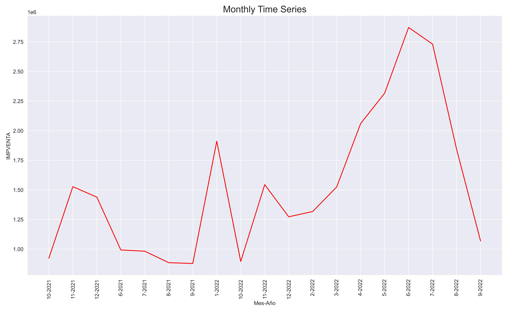
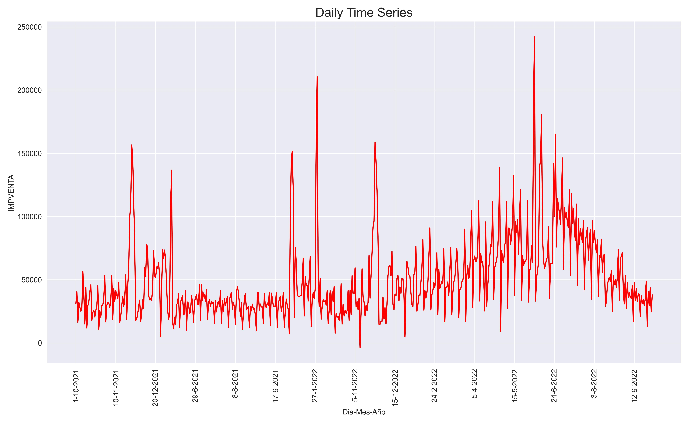
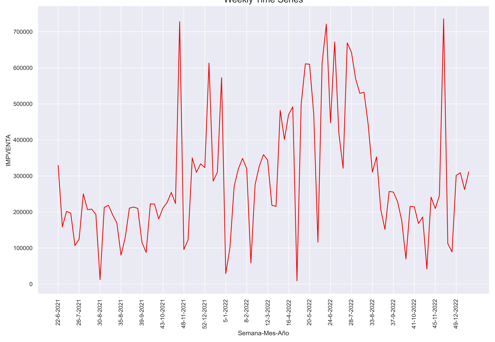
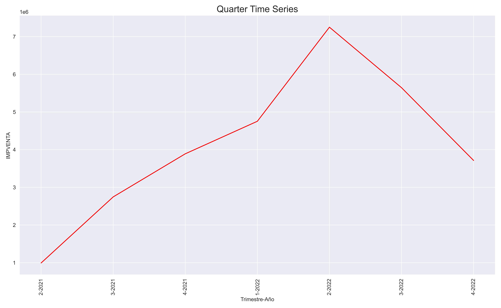
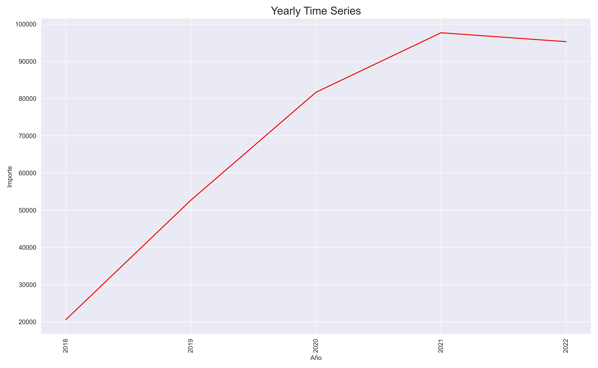
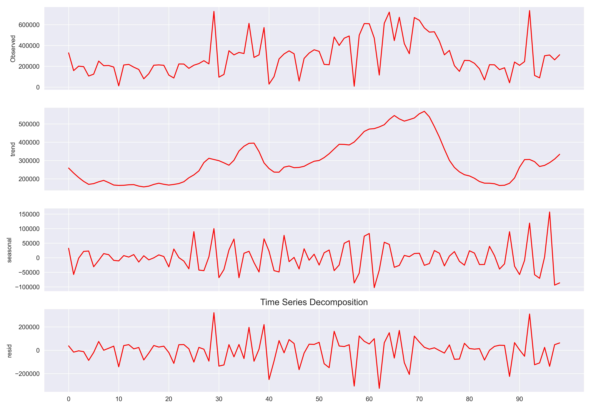

<div>
<style scoped>
    .dataframe tbody tr th:only-of-type {
        vertical-align: middle;
    }

    .dataframe tbody tr th {
        vertical-align: top;
    }

    .dataframe thead th {
        text-align: right;
    }
    
 
    table {
     display: block;
     overflow-x: auto;
     border-collapse: collapse;
     border-spacing: 0;
     border: 0px solid;
     color: var(--jp-ui-font-color1);
     font-size: 14px;
     margin-left: auto;
     margin-right: auto;
     
            }
            
</style>


<div class="warning" style='background-color:#FCF2EC; color: #000000; border-left: solid #FE9554 7px; border-radius: 3px; size:1px ; padding:0.1em;'>
<span>
 
<p style='margin-left:10em;'>


$\hspace{0.3cm}$ **More articles:    $\hspace{0.1cm}$ [Estadistica4all](https://fabioscielzoortiz.github.io/Estadistica4all.github.io/)**

$\hspace{0.3cm}$ **Author:** $\hspace{0.1cm}$ [Fabio Scielzo Ortiz](http://estadistica4all.com/autores/autores.html)

$\hspace{0.3cm}$ **If you use this article, please quote it !!**

$\hspace{0.5cm}$ Scielzo Ortiz, F. (2023). Introduction to Time Series.  http://estadistica4all.com/Articulos/Intervalos-de-confianza.html


</p>
 
</p></span>
</div>


***It's recommended to open the article on a computer or tablet.***
 
 
 
 
 <br>
 
 


# Introduction to stochastic processes 


## Stochastic processes  


Let  $\hspace{0.1cm}\mathcal{X}_t\hspace{0.1cm}$ be a random variable (r.v.), for each $\hspace{0.1cm}t\in T$


<div class="warning" style='background-color:#F7EBE8; color: #030000; border-left: solid #CA0B0B 7px; border-radius: 3px; size:1px ; padding:0.1em;'>
<span>
 
<p style='margin-left:1em;'>


$\hspace{0.25cm}$ A **stochastic processes** is a set of random variables $\hspace{0.1cm}\left\lbrace \hspace{0.1cm} \mathcal{X}_t \hspace{0.1cm}:\hspace{0.1cm} t \in T \hspace{0.1cm}\right\rbrace\hspace{0.1cm}$ such that $\hspace{0.1cm}\mathcal{X}_t \in S \subset \mathbb{R}$
 

$\hspace{0.25cm}$ where:

- $T\hspace{0.1cm}$ is called **parameter space** and is the set of indices of the random variables that define the stochastic process. $\\[0.35cm]$

- $S\hspace{0.1cm}$ is called **states space** and is the variation field of the random variables that define the stochastic process. $\\[0.35cm]$


- We will say that $\hspace{0.1cm}\lbrace \hspace{0.1cm} \mathcal{X}_t \in S  \hspace{0.1cm} : \hspace{0.1cm} t \in T \hspace{0.1cm} \rbrace\hspace{0.15cm}$ is a stochastic process with parameter space $\hspace{0.1cm}T\hspace{0.1cm}$ and states space $\hspace{0.1cm}S$. $\\[0.5cm]$
 
</p>
 
</p></span>
</div>


**Observation:**

$T\hspace{0.1cm}$ is generally interpreted as moments or periods of time, because one of the most important applications of stochastic processes is time series modeling.


Therefore:

$X_t\hspace{0.1cm}$ is a random variable ussually used to model the state of a system at time moment $\hspace{0.06cm}t\hspace{0.06cm}$, or to model a variable of interest at the moment or period $\hspace{0.06cm}t$. 


<br>


## Discrete stochastic process  

<div class="warning" style='background-color:#F7EBE8; color: #030000; border-left: solid #CA0B0B 7px; border-radius: 3px; size:1px ; padding:0.1em;'>
<span>
 
<p style='margin-left:1em;'>

$\hspace{0.25cm}$ $\lbrace \hspace{0.1cm} \mathcal{X}_t \in S  \hspace{0.1cm}:\hspace{0.1cm} t \in T \hspace{0.1cm} \rbrace\hspace{0.15cm}$  is a **discrete stochastic process** if $\hspace{0.15cm}T\subset \lbrace 0,1,2,... \rbrace$

</p>
 
</p></span>
</div>

<br>

## Continuous stochastic process

<div class="warning" style='background-color:#F7EBE8; color: #030000; border-left: solid #CA0B0B 7px; border-radius: 3px; size:1px ; padding:0.1em;'>
<span>
 
<p style='margin-left:1em;'>

$\hspace{0.25cm}$ $\lbrace \hspace{0.1cm} \mathcal{X}_t \in S  \hspace{0.1cm}:\hspace{0.1cm} t \in T \hspace{0.1cm} \rbrace\hspace{0.15cm}$ is a **continuous stochastic process** if $\hspace{0.15cm}T\subset [0, \infty)$

</p>
 
</p></span>
</div>

<br>

## Types of stochastic processes  <a class="anchor" id="1"></a>

### Independent process


<div class="warning" style='background-color:#F7EBE8; color: #030000; border-left: solid #CA0B0B 7px; border-radius: 3px; size:1px ; padding:0.1em;'>
<span>
 
<p style='margin-left:1em;'>

$\hspace{0.25cm}$$\lbrace \hspace{0.1cm} \mathcal{X}_t \in S  \hspace{0.1cm}:\hspace{0.1cm} t \in T \hspace{0.1cm} \rbrace\hspace{0.1cm}$ is a **independent stochastic process** if the random variables that define the process are independent.

</p>
 
</p></span>
</div>

<br>


### Markov process

<div class="warning" style='background-color:#F7EBE8; color: #030000; border-left: solid #CA0B0B 7px; border-radius: 3px; size:1px ; padding:0.1em;'>
<span>
 
<p style='margin-left:1em;'>

$\hspace{0.25cm}$ A discrete stochastic process  $\hspace{0.1cm}\lbrace \hspace{0.1cm} \mathcal{X}_t \in S  \hspace{0.1cm}/\hspace{0.1cm} t \in \lbrace 0,1,2,... \hspace{0.1cm} \rbrace\hspace{0.2cm}$ is a **Markov process** if: $\\[0.15cm]$


$$P(\mathcal{X}_{n+1} = x_{n+1}\hspace{0.15cm} |\hspace{0.15cm} \mathcal{X}_0 = x_0 ,..., \mathcal{X}_n =x_n) \hspace{0.1cm}=\hspace{0.1cm} P(\mathcal{X}_{n+1} = x_{n+1}\hspace{0.15cm} |\hspace{0.15cm} \mathcal{X}_n = x_n)$$ 


$\hspace{0.25cm}$ where: $\hspace{0.2cm} x_{t} \in S \hspace{0.2cm},\hspace{0.2cm} \forall\hspace{0.1cm} t \in \lbrace 0,1,...,n+1\rbrace$  $\\[0.35cm]$

</p>
 
</p></span>
</div>

This property is known as the memoryless Markov property. Because it implies that the future state of the system, $\hspace{0.05cm}\mathcal{X}_{n+1}\hspace{0.05cm}$ , only depends on the present state $x_n$ and does not depend on past states $\hspace{0.05cm}x_0,...,x_{n- 1}\hspace{0.05cm}$.

<br>


### Process of independent increments


<div class="warning" style='background-color:#F7EBE8; color: #030000; border-left: solid #CA0B0B 7px; border-radius: 3px; size:1px ; padding:0.1em;'>
<span>
 
<p style='margin-left:1em;'>

$\hspace{0.25cm}$ A continuous stochastic process  $\hspace{0.1cm}\lbrace \hspace{0.1cm} \mathcal{X}_t \in S  \hspace{0.1cm}/\hspace{0.1cm} t \geq 0 \rbrace\hspace{0.1cm}$ is a independent increments process if:

$\hspace{0.25cm}$ For all set of times $\hspace{0.1cm}t_1,t_2,t_3\geq 0\hspace{0.13cm}$ such that $\hspace{0.1cm}t_1 < t_2 < t_3$


$\hspace{0.25cm}$ $\mathcal{X}_{t_2} - \mathcal{X}_{t_1} \hspace{0.1cm}$ and $\hspace{0.1cm} \mathcal{X}_{t_3} - \mathcal{X}_{t_2}\hspace{0.1cm}$ are independents.

</p>
 
</p></span>
</div>

This means that the displacements of the process in the time intervals $\hspace{0.1cm}[t_1 , t_2) , [t_2 , t_3)\hspace{0.1cm}$ are independent of each other, for all $\hspace{0.1cm }0 \leq t_1 < t_2 < t_3$.


<br>

### Strictly stationary process

<div class="warning" style='background-color:#F7EBE8; color: #030000; border-left: solid #CA0B0B 7px; border-radius: 3px; size:1px ; padding:0.1em;'>
<span>
 
<p style='margin-left:1em;'>

$\hspace{0.25cm}$ A continuous stochastic process $\hspace{0.1cm}\lbrace \hspace{0.1cm} \mathcal{X}_t \in S  \hspace{0.1cm}/\hspace{0.1cm} t \geq 0 \rbrace\hspace{0.2cm}$ is a **strictly stationary process**  if:

$\hspace{0.25cm}$ For all $\hspace{0.05cm}t \geq 0\hspace{0.05cm}$ , the probability distribution of $\hspace{0.05cm}\mathcal{X}_{t}\hspace{0.05cm}$ is the same as that of $\hspace{0.05cm}\mathcal{X}_{t+h}\hspace{0.05cm}$  , for all $\hspace{0.05cm}h>0\hspace{0.05cm}$.

</p>
 
</p></span>
</div>


Therefore, for all set of times $\hspace{0.1cm}t_1 , t_2,...,t_n$ :

$\hspace{0.2cm}(\mathcal{X}_{t_1}, \mathcal{X}_{t_2},\dots ,\mathcal{X}_{t_n} )\hspace{0.1cm}$ is identically distributed as $\hspace{0.1cm}(\mathcal{X}_{t_1+h}, \mathcal{X}_{t_2+h},\dots ,\mathcal{X}_{t_n+h} )$


<br>


### Process with stationary increments

<div class="warning" style='background-color:#F7EBE8; color: #030000; border-left: solid #CA0B0B 7px; border-radius: 3px; size:1px ; padding:0.1em;'>
<span>
 
<p style='margin-left:1em;'>

$\hspace{0.25cm}$ A continuous stochastic process $\hspace{0.1cm}\lbrace \hspace{0.1cm} \mathcal{X}_t \in S  \hspace{0.1cm}/\hspace{0.1cm} t \geq 0 \rbrace\hspace{0.1cm}$ is a process with stationary increments if:

$\hspace{0.25cm}$ For all pair of times  $\hspace{0.1cm}t_1,t_2 > 0\hspace{0.1cm}$ such that $\hspace{0.1cm}t_1 < t_2$


$\hspace{0.25cm}$ $\mathcal{X}_{t_2} - \mathcal{X}_{t_1}\hspace{0.1cm}$ and $\hspace{0.1cm}\mathcal{X}_{t_2 + h} - \mathcal{X}_{t_1 + h}\hspace{0.1cm}$ are independents, for any $\hspace{0.1cm}h>0$

</p>
 
</p></span>
</div>


<br>

### Martingalas process

<div class="warning" style='background-color:#F7EBE8; color: #030000; border-left: solid #CA0B0B 7px; border-radius: 3px; size:1px ; padding:0.1em;'>
<span>
 
<p style='margin-left:1em;'>

$\hspace{0.25cm}$ A discrete stochastic process $\hspace{0.1cm}\lbrace \hspace{0.1cm} \mathcal{X}_t \in S  \hspace{0.1cm}/\hspace{0.1cm} t \in \lbrace 0,1,2,... \hspace{0.1cm} \rbrace\hspace{0.1cm}$ is a Martingalas process if: $\\[0.15cm]$


$$E\left[\hspace{0.1cm}\mathcal{X}_{n+1} | X_0 = x_0 ,..., X_n = x_n\hspace{0.1cm} \right] \hspace{0.1cm} = \hspace{0.1cm} x_n$$  


$\hspace{0.25cm}$ where: $\hspace{0.2cm} x_{t} \in S \hspace{0.2cm},\hspace{0.2cm} \forall\hspace{0.1cm} t \in \lbrace 0,1,...,n+1\rbrace$ $\\[0.35cm]$

</p>
 
</p></span>
</div>

This property is known as Martingalas property, and it implies that the expected value of the sistym in the future  $\hspace{0.1cm}n+1\hspace{0.1cm}$ is the value of the system in the present $\hspace{0.1cm}x_n$. In mean the system doesn´t change of the state observed in the last moment.

This property is known as Martingale property, and it implies that the expected value of the sistym in the future $\hspace{0.1cm}n+1\hspace{0.1cm}$ is the value of the system in the present $\hspace {0.1cm}x_n$. So, in mean the system doesn´t change of the state observed in the last moment.


<br>

### Levy process

<div class="warning" style='background-color:#F7EBE8; color: #030000; border-left: solid #CA0B0B 7px; border-radius: 3px; size:1px ; padding:0.1em;'>
<span>
 
<p style='margin-left:1em;'>

$\hspace{0.25cm}$ A continuous stochastic process $\hspace{0.1cm}\lbrace \hspace{0.1cm} \mathcal{X}_t \in S  \hspace{0.1cm}/\hspace{0.1cm} t \geq 0 \rbrace\hspace{0.15cm}$ is a Levy process if is a  process of independents and stationaries increments. 

</p>
 
</p></span>
</div>

The Poisson and Brownian process are examples of Levy process.

<br>


### Gaussian Process  <a class="anchor" id="1"></a>

<div class="warning" style='background-color:#F7EBE8; color: #030000; border-left: solid #CA0B0B 7px; border-radius: 3px; size:1px ; padding:0.1em;'>
<span>
 
<p style='margin-left:1em;'>

$\hspace{0.25cm}$ A continuous stochastic process $\hspace{0.1cm}\lbrace \hspace{0.1cm} \mathcal{X}_t \in S  \hspace{0.1cm}/\hspace{0.1cm} t \geq 0 \rbrace\hspace{0.15cm}$ is a **Gaussian process** if:

$\hspace{0.25cm}$ For all set of times $\hspace{0.1cm}t_1,...,t_n \geq 0$ : $\\[0.12cm]$

$$(\mathcal{X}_{t_1}, \mathcal{X}_{t_2},...,\mathcal{X}_{t_n}) \sim NM(\mu , \Sigma)$$


$\hspace{0.25cm}$ where:

$\hspace{0.3cm}$ $NM(\mu , \Sigma)\hspace{0.1cm}$ denote the multivariate Normal probability distribution with mean vector $\hspace{0.1cm}\mu\hspace{0.1cm}$ y covariance matrix $\hspace{0.1cm}\Sigma$ . $\\[0.2cm]$


</p>
 
</p></span>
</div>


The  dynamic phenomena that we observe in a time series can grouped into two classes:

- The first are those that take stable values in time around a constant level, without showing a long term increasing or decreasing trend. These processes are called stationary. 

Examples of those are the average yearly  temperatures in a region or the propotion of births corresponding to males.


- A second class of processes are the non-stationary processes, which are those that can show trend, seasonality and other evolutionary effects over time.

Examples of those are the yearly income of a country, company sales or energy demand. These are series that evolve over time with more or less stable trends.


In practice, the classification of a series as stationary or not depends on the period of observation, since the series can be stable in a short period and non-stationary in a longer one.


<br>


# Time series  

<div class="warning" style='background-color:#F7EBE8; color: #030000; border-left: solid #CA0B0B 7px; border-radius: 3px; size:1px ; padding:0.1em;'>
<span>
 
<p style='margin-left:1em;'>

$\hspace{0.2cm}$ Given a stochastic process $\hspace{0.15cm} \mathcal{Y} \hspace{0.1cm}=\hspace{0.1cm} \Bigl( \hspace{0.06cm} \mathcal{Y}_t \hspace{0.12cm}: \hspace{0.12cm} t \in T=\lbrace 1,2,...,n \rbrace \hspace{0.06cm}\Bigl) \hspace{0.1cm} = \hspace{0.1cm}\Bigl( \hspace{0.06cm} \mathcal{Y}_1 ,  \mathcal{Y}_2 ,..., \mathcal{Y}_n  \hspace{0.06cm}\Bigl) \hspace{0.05cm}$ .

$\hspace{0.25cm}$ Given a sample of one observation $\hspace{0.08cm}y_t\hspace{0.08cm}$ of each random variable $\hspace{0.08cm}\mathcal{Y}_t\hspace{0.08cm}$ of the process, for $\hspace{0.06cm}t \in T=\lbrace 1,2,...,n \rbrace\hspace{0.06cm}$. $\\[0.3cm]$


- $\hspace{0.15cm} Y_t = \left( y_1, y_2, ...,y_n \right)^t \hspace{0.15cm}$ is a **time series** associated to the stochastic process $\hspace{0.09cm}\mathcal{Y}$.
 
 
$\hspace{0.25cm}$ where:

$\hspace{0.35cm}$ $y_t\hspace{0.06cm}$ is frequently interpreted as the value observed of the variable $\hspace{0.06cm}\mathcal{Y}\hspace{0.06cm}$ at the time or period $\hspace{0.06cm}t$. Hence the name **time** series. $\\[0.15cm]$

</p>
 
</p></span>
</div>


**Observations:**

- $y_t \in \mathbb{R}\hspace{0.08cm}$ is a realization of the random variable $\hspace{0.08cm}\mathcal{Y}_t$ $\\[0.35cm]$


- A time series is a realization of a stochastic process. The time series is considered a result or trajectory of the stochastic process. $\\[0.35cm]$

- A time series can be defined as a vector of data points ordered in time. Where the data is equally spaced in time, namely, between each data point there is the same time space, such as a week, a month, a trimester, a quarter ...


The process is characterized by the join probability distribution of the random variables $\hspace{0.1cm} \mathcal{Y}_1 ,  \mathcal{Y}_2 ,..., \mathcal{Y}_k   \hspace{0.1cm}$, namely, is characterized by the join density or probability function $\hspace{0.08cm}f_{\hspace{0.08cm}\mathcal{Y}_1 ,  \mathcal{Y}_2 ,..., \mathcal{Y}_k}$ 

This distribution is called finite-dimensional distribution of the process. We say that we know the probabilistic structure of the stochastic process when we know that join distribution, which determine the distribution of any subset of the variables and, in particular, the marginal distribution of each variable.

<br>


# Mean function 

<div class="warning" style='background-color:#F7EBE8; color: #030000; border-left: solid #CA0B0B 7px; border-radius: 3px; size:1px ; padding:0.1em;'>
<span>
 
<p style='margin-left:1em;'>

$\hspace{0.2cm}$ Given a stochastic process $\hspace{0.15cm} \mathcal{Y} \hspace{0.1cm}=\hspace{0.1cm} \Bigl( \hspace{0.06cm} \mathcal{Y}_t \hspace{0.12cm}: \hspace{0.12cm} t \in T=\lbrace 1,2,...,n \rbrace \hspace{0.06cm}\Bigl) \hspace{0.1cm} = \hspace{0.1cm}\Bigl( \hspace{0.06cm} \mathcal{Y}_1 ,  \mathcal{Y}_2 ,..., \mathcal{Y}_n  \hspace{0.06cm}\Bigl) \hspace{0.05cm}$ .

$\hspace{0.2cm}$ Mean function $\hspace{0.1cm} \mu_{\hspace{0.03cm}t} \hspace{0.1cm}$ of the process is defined as: $\\[0.15cm]$

$$\mu_{\hspace{0.03cm}t} = E\Bigl[\hspace{0.08cm}\mathcal{Y}_t\hspace{0.08cm}\Bigr]$$

$\hspace{0.2cm}$ for $\hspace{0.1cm}  t \in \lbrace 1,2,...,k \rbrace .\\$


</p>
 
</p></span>
</div>


**Observations:**

- An important particular case, due to its simplicity, arises when all the variables have the same mean and thus the mean function is a constant.
The realizations of the process show no trend and we say that the process is stable in the mean. $\\[0.35cm]$


- If, on the contrary, the means change over time, the observations at different
moments will reveal that change. $\\[0.35cm]$

- On many occasions we only have one realization of the stochastic process and
we have to deduce from that whether the mean function of the process is, or is
not, constant over time.


<br>

# Variance function

<div class="warning" style='background-color:#F7EBE8; color: #030000; border-left: solid #CA0B0B 7px; border-radius: 3px; size:1px ; padding:0.1em;'>
<span>
 
<p style='margin-left:1em;'>

$\hspace{0.2cm}$ Given a stochastic process $\hspace{0.15cm} \mathcal{Y} \hspace{0.1cm}=\hspace{0.1cm} \Bigl( \hspace{0.06cm} \mathcal{Y}_t \hspace{0.12cm}: \hspace{0.12cm} t \in T=\lbrace 1,2,...,n \rbrace \hspace{0.06cm}\Bigl) \hspace{0.1cm} = \hspace{0.1cm}\Bigl( \hspace{0.06cm} \mathcal{Y}_1 ,  \mathcal{Y}_2 ,..., \mathcal{Y}_n  \hspace{0.06cm}\Bigl) \hspace{0.05cm}$ .

$\hspace{0.2cm}$ Variance function $\hspace{0.1cm} \sigma^2_{\hspace{0.03cm}t} \hspace{0.1cm}$ of the process is defined as: $\\[0.15cm]$

$$\sigma^2_t = Var\Bigl[\hspace{0.08cm} \mathcal{Y}_t \hspace{0.08cm}\Bigr]$$

$\hspace{0.2cm}$ for $t \in \lbrace 1,2,...,k \rbrace \\$


</p>
 
</p></span>
</div>


 
**Observations:**


- We say that the process is stable in the variance if the variability is constant
over time. $\\[0.3cm]$

- A process can be stable in the mean but not in the variance and vice versa.


<br>

# Autocovariance function


The structure of linear dependence between random variables is represented by
the covariance and correlation functions.

<div class="warning" style='background-color:#F7EBE8; color: #030000; border-left: solid #CA0B0B 7px; border-radius: 3px; size:1px ; padding:0.1em;'>
<span>
 
<p style='margin-left:1em;'>

$\hspace{0.2cm}$ Given a stochastic process $\hspace{0.15cm} \mathcal{Y} \hspace{0.1cm}=\hspace{0.1cm} \Bigl( \hspace{0.06cm} \mathcal{Y}_t \hspace{0.12cm}: \hspace{0.12cm} t \in T=\lbrace 1,2,...,n \rbrace \hspace{0.06cm}\Bigl) \hspace{0.1cm} = \hspace{0.1cm}\Bigl( \hspace{0.06cm} \mathcal{Y}_1 ,  \mathcal{Y}_2 ,..., \mathcal{Y}_n  \hspace{0.06cm}\Bigl) \hspace{0.05cm}$ .

 
 
$\hspace{0.2cm}$ The autocovariance function $\hspace{0.08cm}\gamma_{\hspace{0.03cm}t \hspace{0.03cm},\hspace{0.03cm} t+h}\hspace{0.08cm}$ of the process is defined as: $\\[0.25cm]$

$$\gamma_{\hspace{0.03cm}t\hspace{0.03cm} ,\hspace{0.03cm} t+h} \hspace{0.08cm}=\hspace{0.08cm} Cov\left(\hspace{0.08cm}\mathcal{Y}_t \hspace{0.08cm} ,\hspace{0.08cm} \mathcal{Y}_{t+h}\hspace{0.08cm} \right) \hspace{0.08cm}=\hspace{0.08cm} E \hspace{0.08cm}\Bigl[\hspace{0.08cm} (\mathcal{Y}_t - \mu_{\hspace{0.03cm}t})\cdot (\mathcal{Y}_{t+h} - \mu_{\hspace{0.03cm}t+h}) \hspace{0.08cm}  \Bigr] \\$$

$\hspace{0.2cm}$ for $\hspace{0.1cm}t \in \lbrace 1,2,...,k \rbrace\hspace{0.12cm}$ and $\hspace{0.1cm}  h\in \lbrace \pm 1, \pm 2,... \rbrace . \\$


$\hspace{0.2cm}$ In particular, we have :


$$\gamma_{\hspace{0.03cm}t\hspace{0.03cm} , \hspace{0.03cm}t} \hspace{0.05cm}=\hspace{0.05cm} \sigma_t^2 \\$$

</p>
 
</p></span>
</div>


The autocovariances have dimensions, the squares of the series, thus it is not
advisable to use them for comparing series measured in different units.


<br>

# Autocorrelation function  <a class="anchor" id="1"></a> 

<div class="warning" style='background-color:#F7EBE8; color: #030000; border-left: solid #CA0B0B 7px; border-radius: 3px; size:1px ; padding:0.1em;'>
<span>
 
<p style='margin-left:1em;'>

$\hspace{0.2cm}$ Given a stochastic process $\hspace{0.15cm} \mathcal{Y} \hspace{0.1cm}=\hspace{0.1cm} \Bigl( \hspace{0.06cm} \mathcal{Y}_t \hspace{0.12cm}: \hspace{0.12cm} t \in T=\lbrace 1,2,...,n \rbrace \hspace{0.06cm}\Bigl) \hspace{0.1cm} = \hspace{0.1cm}\Bigl( \hspace{0.06cm} \mathcal{Y}_1 ,  \mathcal{Y}_2 ,..., \mathcal{Y}_n  \hspace{0.06cm}\Bigl) \hspace{0.05cm}$ .


$\hspace{0.2cm}$ The autocorrelation function $\hspace{0.08cm}\rho_{\hspace{0.05cm}t \hspace{0.05cm},\hspace{0.05cm} t+h}\hspace{0.08cm}$ of the process is defined as: $\\[0.25cm]$

$$\rho_{\hspace{0.05cm}t \hspace{0.05cm},\hspace{0.05cm} t+h\hspace{0.05cm}} =\hspace{0.05cm} \dfrac{\gamma_{\hspace{0.05cm}t\hspace{0.05cm} , \hspace{0.05cm}t+h\hspace{0.05cm}}}{\sqrt{\sigma_{\hspace{0.05cm}t}^2 \cdot \sigma_{\hspace{0.05cm}t+h}^2\hspace{0.08cm}}\hspace{0.08cm}} \\$$

$\hspace{0.2cm}$ for $\hspace{0.1cm}t \in \lbrace 1,2,...,k \rbrace\hspace{0.1cm}$ and $\hspace{0.1cm} h\in \lbrace \pm 1, \pm 2,... \rbrace \\$


$\hspace{0.2cm}$ In particular, we have :


$$\rho_{\hspace{0.05cm}t\hspace{0.05cm} ,\hspace{0.05cm} t\hspace{0.05cm}} =\hspace{0.05cm} 1 \\$$


</p>
 
</p></span>
</div>

 

It is interesting to notice the differences between conditional distributions and the marginal distributions.

The marginal distribution of $\hspace{0.08cm}\mathcal{Y}_t\hspace{0.08cm}$ represents what we know about a variable, without knowing anything about its trajectory until time $\hspace{0.05cm}t\hspace{0.05cm}$.

The conditional distribution of $\hspace{0.08cm}\mathcal{Y}_t\hspace{0.08cm}$ given $\hspace{0.08cm}\mathcal{Y}_{t-1}\hspace{0.05cm}$,...,$\hspace{0.05cm}\mathcal{Y}_{t-r}\hspace{0.08cm}$ represents what we
know about a variable when we know the k previous values of the process.

In time series conditional distributions are of greater interest than marginal
ones because they define the predictions that we can make about the future
knowing the past.


<br>


# Visualization of time series in `Python`


Throughout this article we will use a time series on sales of a company. 

First of all, we load some of the libraries that we are to use:

```python
import pandas as pd
import numpy as np

import matplotlib.pyplot as plt
import seaborn as sns
```


```python
sns.set_theme()

sns.set(rc={'figure.figsize':(20,9)})
```

We load the data-set:

```python
Time_Series_1 = pd.read_csv('Time_Series_1.csv')
```


```python
Time_Series_1
```


<div>
<style scoped>
    .dataframe tbody tr th:only-of-type {
        vertical-align: middle;
    }

    .dataframe tbody tr th {
        vertical-align: top;
    }

    .dataframe thead th {
        text-align: right;
    }
</style>
<table border="1" class="dataframe">
  <thead>
    <tr style="text-align: right;">
      <th></th>
      <th>CODARTIC</th>
      <th>CODIREGG</th>
      <th>IMPLINEA</th>
      <th>IMPVENTA</th>
      <th>CODTAVEN</th>
      <th>QCANTDEC</th>
      <th>NUMTARJE</th>
    </tr>
  </thead>
  <tbody>
    <tr>
      <th>0</th>
      <td>10254201003449</td>
      <td>1</td>
      <td>59.99</td>
      <td>59.99</td>
      <td>2022-06-21001069602336387</td>
      <td>1.0</td>
      <td>6.008330e+18</td>
    </tr>
    <tr>
      <th>1</th>
      <td>10234141001560</td>
      <td>1</td>
      <td>12.72</td>
      <td>12.72</td>
      <td>2021-08-03001002100821700</td>
      <td>1.0</td>
      <td>NaN</td>
    </tr>
    <tr>
      <th>2</th>
      <td>10865290000019</td>
      <td>4</td>
      <td>11.20</td>
      <td>11.20</td>
      <td>2022-08-21001009006714129</td>
      <td>1.0</td>
      <td>6.008330e+18</td>
    </tr>
    <tr>
      <th>3</th>
      <td>10004136025419</td>
      <td>1</td>
      <td>48.97</td>
      <td>48.97</td>
      <td>2022-07-09001003602372694</td>
      <td>1.0</td>
      <td>NaN</td>
    </tr>
    <tr>
      <th>4</th>
      <td>10073131011804</td>
      <td>1</td>
      <td>22.95</td>
      <td>22.95</td>
      <td>2022-05-14001091203649080</td>
      <td>1.0</td>
      <td>6.008330e+18</td>
    </tr>
    <tr>
      <th>...</th>
      <td>...</td>
      <td>...</td>
      <td>...</td>
      <td>...</td>
      <td>...</td>
      <td>...</td>
      <td>...</td>
    </tr>
    <tr>
      <th>704350</th>
      <td>10271412016641</td>
      <td>1</td>
      <td>18.90</td>
      <td>18.90</td>
      <td>2022-02-10001003601776985</td>
      <td>1.0</td>
      <td>NaN</td>
    </tr>
    <tr>
      <th>704351</th>
      <td>10411524000184</td>
      <td>2</td>
      <td>-29.99</td>
      <td>-29.99</td>
      <td>2022-06-02001009803937030</td>
      <td>-1.0</td>
      <td>NaN</td>
    </tr>
    <tr>
      <th>704352</th>
      <td>10092532091505</td>
      <td>1</td>
      <td>75.00</td>
      <td>75.00</td>
      <td>2022-05-19001003602477163</td>
      <td>1.0</td>
      <td>6.008330e+18</td>
    </tr>
    <tr>
      <th>704353</th>
      <td>10805731000015</td>
      <td>2</td>
      <td>-12.59</td>
      <td>-10.70</td>
      <td>2022-02-17001009008963198</td>
      <td>-1.0</td>
      <td>6.008330e+18</td>
    </tr>
    <tr>
      <th>704354</th>
      <td>10084472093096</td>
      <td>1</td>
      <td>6.95</td>
      <td>6.95</td>
      <td>2021-06-06001048902492799</td>
      <td>1.0</td>
      <td>NaN</td>
    </tr>
  </tbody>
</table>
<p>704355 rows × 7 columns</p>
</div>


The default periodicity of this time series is daily.


We can group a time series by different periods, as hours, days, weeks, months, quarter, years... 

Concretely we will group this time series by day, week, month and quarter.


We can get date column as follows:

```python
Time_Series_1['Fecha'] = Time_Series_1['CODTAVEN'].str[0:10]
```

We have to convert date column to date format:
```python
Time_Series_1['Fecha'] = pd.to_datetime(Time_Series_1['Fecha'])
```

We can create the columns Day, Week, Month, Quarter and Year as follows:

```python
Time_Series_1['Dia'] = Time_Series_1['Fecha'].dt.day

Time_Series_1['Semana'] = Time_Series_1['Fecha'].dt.week

Time_Series_1['Mes'] = Time_Series_1['Fecha'].dt.month

Time_Series_1['Trimestre'] = Time_Series_1['Fecha'].dt.quarter

Time_Series_1['Año'] = Time_Series_1['Fecha'].dt.year
```

We select the columns with which we are going to work. 

`IMPVENTA` will be the response variable, namely, the variable we want to predict.

```python
Time_Series_1 = Time_Series_1.loc[: , ['Fecha', 'Dia', 'Semana', 'Mes', 'Trimestre', 'Año', 'IMPVENTA']]
```


```python
Time_Series_1
```


<div>
<style scoped>
    .dataframe tbody tr th:only-of-type {
        vertical-align: middle;
    }

    .dataframe tbody tr th {
        vertical-align: top;
    }

    .dataframe thead th {
        text-align: right;
    }
</style>
<table border="1" class="dataframe">
  <thead>
    <tr style="text-align: right;">
      <th></th>
      <th>Fecha</th>
      <th>Dia</th>
      <th>Semana</th>
      <th>Mes</th>
      <th>Trimestre</th>
      <th>Año</th>
      <th>IMPVENTA</th>
    </tr>
  </thead>
  <tbody>
    <tr>
      <th>0</th>
      <td>2022-06-21</td>
      <td>21</td>
      <td>25</td>
      <td>6</td>
      <td>2</td>
      <td>2022</td>
      <td>59.99</td>
    </tr>
    <tr>
      <th>1</th>
      <td>2021-08-03</td>
      <td>3</td>
      <td>31</td>
      <td>8</td>
      <td>3</td>
      <td>2021</td>
      <td>12.72</td>
    </tr>
    <tr>
      <th>2</th>
      <td>2022-08-21</td>
      <td>21</td>
      <td>33</td>
      <td>8</td>
      <td>3</td>
      <td>2022</td>
      <td>11.20</td>
    </tr>
    <tr>
      <th>3</th>
      <td>2022-07-09</td>
      <td>9</td>
      <td>27</td>
      <td>7</td>
      <td>3</td>
      <td>2022</td>
      <td>48.97</td>
    </tr>
    <tr>
      <th>4</th>
      <td>2022-05-14</td>
      <td>14</td>
      <td>19</td>
      <td>5</td>
      <td>2</td>
      <td>2022</td>
      <td>22.95</td>
    </tr>
    <tr>
      <th>...</th>
      <td>...</td>
      <td>...</td>
      <td>...</td>
      <td>...</td>
      <td>...</td>
      <td>...</td>
      <td>...</td>
    </tr>
    <tr>
      <th>704350</th>
      <td>2022-02-10</td>
      <td>10</td>
      <td>6</td>
      <td>2</td>
      <td>1</td>
      <td>2022</td>
      <td>18.90</td>
    </tr>
    <tr>
      <th>704351</th>
      <td>2022-06-02</td>
      <td>2</td>
      <td>22</td>
      <td>6</td>
      <td>2</td>
      <td>2022</td>
      <td>-29.99</td>
    </tr>
    <tr>
      <th>704352</th>
      <td>2022-05-19</td>
      <td>19</td>
      <td>20</td>
      <td>5</td>
      <td>2</td>
      <td>2022</td>
      <td>75.00</td>
    </tr>
    <tr>
      <th>704353</th>
      <td>2022-02-17</td>
      <td>17</td>
      <td>7</td>
      <td>2</td>
      <td>1</td>
      <td>2022</td>
      <td>-10.70</td>
    </tr>
    <tr>
      <th>704354</th>
      <td>2021-06-06</td>
      <td>6</td>
      <td>22</td>
      <td>6</td>
      <td>2</td>
      <td>2021</td>
      <td>6.95</td>
    </tr>
  </tbody>
</table>
<p>704355 rows × 7 columns</p>
</div>


<br>


## Visualization of Monthly Time Series

First of all, we group the response variable `IMPVENTA` by year and month:

```python
Monthly_Time_Series_1 = Time_Series_1.groupby(['Año', 'Mes'])['IMPVENTA'].sum().reset_index(drop=False)
```


```python
Monthly_Time_Series_1
```


<div>
<style scoped>
    .dataframe tbody tr th:only-of-type {
        vertical-align: middle;
    }

    .dataframe tbody tr th {
        vertical-align: top;
    }

    .dataframe thead th {
        text-align: right;
    }
</style>
<table border="1" class="dataframe">
  <thead>
    <tr style="text-align: right;">
      <th></th>
      <th>Año</th>
      <th>Mes</th>
      <th>IMPVENTA</th>
    </tr>
  </thead>
  <tbody>
    <tr>
      <th>0</th>
      <td>2021</td>
      <td>6</td>
      <td>992891.50</td>
    </tr>
    <tr>
      <th>1</th>
      <td>2021</td>
      <td>7</td>
      <td>982142.75</td>
    </tr>
    <tr>
      <th>2</th>
      <td>2021</td>
      <td>8</td>
      <td>885289.16</td>
    </tr>
    <tr>
      <th>3</th>
      <td>2021</td>
      <td>9</td>
      <td>878563.14</td>
    </tr>
    <tr>
      <th>4</th>
      <td>2021</td>
      <td>10</td>
      <td>923552.45</td>
    </tr>
    <tr>
      <th>5</th>
      <td>2021</td>
      <td>11</td>
      <td>1527486.61</td>
    </tr>
    <tr>
      <th>6</th>
      <td>2021</td>
      <td>12</td>
      <td>1438722.72</td>
    </tr>
    <tr>
      <th>7</th>
      <td>2022</td>
      <td>1</td>
      <td>1910816.46</td>
    </tr>
    <tr>
      <th>8</th>
      <td>2022</td>
      <td>2</td>
      <td>1317501.34</td>
    </tr>
    <tr>
      <th>9</th>
      <td>2022</td>
      <td>3</td>
      <td>1524652.47</td>
    </tr>
    <tr>
      <th>10</th>
      <td>2022</td>
      <td>4</td>
      <td>2060509.71</td>
    </tr>
    <tr>
      <th>11</th>
      <td>2022</td>
      <td>5</td>
      <td>2316733.47</td>
    </tr>
    <tr>
      <th>12</th>
      <td>2022</td>
      <td>6</td>
      <td>2872219.23</td>
    </tr>
    <tr>
      <th>13</th>
      <td>2022</td>
      <td>7</td>
      <td>2731251.02</td>
    </tr>
    <tr>
      <th>14</th>
      <td>2022</td>
      <td>8</td>
      <td>1844222.02</td>
    </tr>
    <tr>
      <th>15</th>
      <td>2022</td>
      <td>9</td>
      <td>1068975.95</td>
    </tr>
    <tr>
      <th>16</th>
      <td>2022</td>
      <td>10</td>
      <td>895735.29</td>
    </tr>
    <tr>
      <th>17</th>
      <td>2022</td>
      <td>11</td>
      <td>1544511.61</td>
    </tr>
    <tr>
      <th>18</th>
      <td>2022</td>
      <td>12</td>
      <td>1272814.69</td>
    </tr>
  </tbody>
</table>
</div>


This step is necessary to create Month-Year column, which will be used to carry out the plot.

```python
Monthly_Time_Series_1['Año'] = Monthly_Time_Series_1['Año'].astype('string')
Monthly_Time_Series_1['Mes'] = Monthly_Time_Series_1['Mes'].astype('string')

Monthly_Time_Series_1['Mes-Año'] = Monthly_Time_Series_1[['Mes', 'Año']].agg('-'.join, axis=1)
```


```python
Monthly_Time_Series_1
```


<div>
<style scoped>
    .dataframe tbody tr th:only-of-type {
        vertical-align: middle;
    }

    .dataframe tbody tr th {
        vertical-align: top;
    }

    .dataframe thead th {
        text-align: right;
    }
</style>
<table border="1" class="dataframe">
  <thead>
    <tr style="text-align: right;">
      <th></th>
      <th>Año</th>
      <th>Mes</th>
      <th>IMPVENTA</th>
      <th>Mes-Año</th>
    </tr>
  </thead>
  <tbody>
    <tr>
      <th>0</th>
      <td>2021</td>
      <td>6</td>
      <td>992891.50</td>
      <td>6-2021</td>
    </tr>
    <tr>
      <th>1</th>
      <td>2021</td>
      <td>7</td>
      <td>982142.75</td>
      <td>7-2021</td>
    </tr>
    <tr>
      <th>2</th>
      <td>2021</td>
      <td>8</td>
      <td>885289.16</td>
      <td>8-2021</td>
    </tr>
    <tr>
      <th>3</th>
      <td>2021</td>
      <td>9</td>
      <td>878563.14</td>
      <td>9-2021</td>
    </tr>
    <tr>
      <th>4</th>
      <td>2021</td>
      <td>10</td>
      <td>923552.45</td>
      <td>10-2021</td>
    </tr>
    <tr>
      <th>5</th>
      <td>2021</td>
      <td>11</td>
      <td>1527486.61</td>
      <td>11-2021</td>
    </tr>
    <tr>
      <th>6</th>
      <td>2021</td>
      <td>12</td>
      <td>1438722.72</td>
      <td>12-2021</td>
    </tr>
    <tr>
      <th>7</th>
      <td>2022</td>
      <td>1</td>
      <td>1910816.46</td>
      <td>1-2022</td>
    </tr>
    <tr>
      <th>8</th>
      <td>2022</td>
      <td>2</td>
      <td>1317501.34</td>
      <td>2-2022</td>
    </tr>
    <tr>
      <th>9</th>
      <td>2022</td>
      <td>3</td>
      <td>1524652.47</td>
      <td>3-2022</td>
    </tr>
    <tr>
      <th>10</th>
      <td>2022</td>
      <td>4</td>
      <td>2060509.71</td>
      <td>4-2022</td>
    </tr>
    <tr>
      <th>11</th>
      <td>2022</td>
      <td>5</td>
      <td>2316733.47</td>
      <td>5-2022</td>
    </tr>
    <tr>
      <th>12</th>
      <td>2022</td>
      <td>6</td>
      <td>2872219.23</td>
      <td>6-2022</td>
    </tr>
    <tr>
      <th>13</th>
      <td>2022</td>
      <td>7</td>
      <td>2731251.02</td>
      <td>7-2022</td>
    </tr>
    <tr>
      <th>14</th>
      <td>2022</td>
      <td>8</td>
      <td>1844222.02</td>
      <td>8-2022</td>
    </tr>
    <tr>
      <th>15</th>
      <td>2022</td>
      <td>9</td>
      <td>1068975.95</td>
      <td>9-2022</td>
    </tr>
    <tr>
      <th>16</th>
      <td>2022</td>
      <td>10</td>
      <td>895735.29</td>
      <td>10-2022</td>
    </tr>
    <tr>
      <th>17</th>
      <td>2022</td>
      <td>11</td>
      <td>1544511.61</td>
      <td>11-2022</td>
    </tr>
    <tr>
      <th>18</th>
      <td>2022</td>
      <td>12</td>
      <td>1272814.69</td>
      <td>12-2022</td>
    </tr>
  </tbody>
</table>
</div>

<br>

We create the plot:

```python
fig, ax = plt.subplots()

p=sns.lineplot(x="Mes-Año", y="IMPVENTA", data=Monthly_Time_Series_1 , color='red')

plt.setp(p.get_xticklabels(), rotation=90)

plt.title("Monthly Time Series",  fontsize = 17)

fig.savefig('p1.jpg', format='jpg', dpi=1200)

plt.show()
```


<center>

{width="70%"}

</center> 


    


<br>

## Visualization of Daily Time Series

First of all, we group the response variable `IMPVENTA` by year, month and day:

```python
Daily_Time_Series_1 = Time_Series_1.groupby(['Año', 'Mes','Dia'])['IMPVENTA'].sum().reset_index(drop=False)
```


```python
Daily_Time_Series_1
```


<div>
<style scoped>
    .dataframe tbody tr th:only-of-type {
        vertical-align: middle;
    }

    .dataframe tbody tr th {
        vertical-align: top;
    }

    .dataframe thead th {
        text-align: right;
    }
</style>
<table border="1" class="dataframe">
  <thead>
    <tr style="text-align: right;">
      <th></th>
      <th>Año</th>
      <th>Mes</th>
      <th>Dia</th>
      <th>IMPVENTA</th>
    </tr>
  </thead>
  <tbody>
    <tr>
      <th>0</th>
      <td>2021</td>
      <td>6</td>
      <td>1</td>
      <td>26423.78</td>
    </tr>
    <tr>
      <th>1</th>
      <td>2021</td>
      <td>6</td>
      <td>2</td>
      <td>18752.01</td>
    </tr>
    <tr>
      <th>2</th>
      <td>2021</td>
      <td>6</td>
      <td>3</td>
      <td>22812.84</td>
    </tr>
    <tr>
      <th>3</th>
      <td>2021</td>
      <td>6</td>
      <td>4</td>
      <td>107889.11</td>
    </tr>
    <tr>
      <th>4</th>
      <td>2021</td>
      <td>6</td>
      <td>5</td>
      <td>136714.44</td>
    </tr>
    <tr>
      <th>...</th>
      <td>...</td>
      <td>...</td>
      <td>...</td>
      <td>...</td>
    </tr>
    <tr>
      <th>574</th>
      <td>2022</td>
      <td>12</td>
      <td>27</td>
      <td>64542.49</td>
    </tr>
    <tr>
      <th>575</th>
      <td>2022</td>
      <td>12</td>
      <td>28</td>
      <td>59913.84</td>
    </tr>
    <tr>
      <th>576</th>
      <td>2022</td>
      <td>12</td>
      <td>29</td>
      <td>53815.43</td>
    </tr>
    <tr>
      <th>577</th>
      <td>2022</td>
      <td>12</td>
      <td>30</td>
      <td>52695.32</td>
    </tr>
    <tr>
      <th>578</th>
      <td>2022</td>
      <td>12</td>
      <td>31</td>
      <td>39739.67</td>
    </tr>
  </tbody>
</table>
<p>579 rows × 4 columns</p>
</div>


This is necessary step to create Month-Year column, which will be used to carry out the plot.


```python
Daily_Time_Series_1['Año'] = Daily_Time_Series_1['Año'].astype('string')
Daily_Time_Series_1['Mes'] = Daily_Time_Series_1['Mes'].astype('string')
Daily_Time_Series_1['Dia'] = Daily_Time_Series_1['Dia'].astype('string')

Daily_Time_Series_1['Dia-Mes-Año'] = Daily_Time_Series_1[['Dia', 'Mes', 'Año']].agg('-'.join, axis=1)
```


```python
Daily_Time_Series_1
```


<div>
<style scoped>
    .dataframe tbody tr th:only-of-type {
        vertical-align: middle;
    }

    .dataframe tbody tr th {
        vertical-align: top;
    }

    .dataframe thead th {
        text-align: right;
    }
</style>
<table border="1" class="dataframe">
  <thead>
    <tr style="text-align: right;">
      <th></th>
      <th>Año</th>
      <th>Mes</th>
      <th>Dia</th>
      <th>IMPVENTA</th>
      <th>Dia-Mes-Año</th>
    </tr>
  </thead>
  <tbody>
    <tr>
      <th>0</th>
      <td>2021</td>
      <td>6</td>
      <td>1</td>
      <td>26423.78</td>
      <td>1-6-2021</td>
    </tr>
    <tr>
      <th>1</th>
      <td>2021</td>
      <td>6</td>
      <td>2</td>
      <td>18752.01</td>
      <td>2-6-2021</td>
    </tr>
    <tr>
      <th>2</th>
      <td>2021</td>
      <td>6</td>
      <td>3</td>
      <td>22812.84</td>
      <td>3-6-2021</td>
    </tr>
    <tr>
      <th>3</th>
      <td>2021</td>
      <td>6</td>
      <td>4</td>
      <td>107889.11</td>
      <td>4-6-2021</td>
    </tr>
    <tr>
      <th>4</th>
      <td>2021</td>
      <td>6</td>
      <td>5</td>
      <td>136714.44</td>
      <td>5-6-2021</td>
    </tr>
    <tr>
      <th>...</th>
      <td>...</td>
      <td>...</td>
      <td>...</td>
      <td>...</td>
      <td>...</td>
    </tr>
    <tr>
      <th>574</th>
      <td>2022</td>
      <td>12</td>
      <td>27</td>
      <td>64542.49</td>
      <td>27-12-2022</td>
    </tr>
    <tr>
      <th>575</th>
      <td>2022</td>
      <td>12</td>
      <td>28</td>
      <td>59913.84</td>
      <td>28-12-2022</td>
    </tr>
    <tr>
      <th>576</th>
      <td>2022</td>
      <td>12</td>
      <td>29</td>
      <td>53815.43</td>
      <td>29-12-2022</td>
    </tr>
    <tr>
      <th>577</th>
      <td>2022</td>
      <td>12</td>
      <td>30</td>
      <td>52695.32</td>
      <td>30-12-2022</td>
    </tr>
    <tr>
      <th>578</th>
      <td>2022</td>
      <td>12</td>
      <td>31</td>
      <td>39739.67</td>
      <td>31-12-2022</td>
    </tr>
  </tbody>
</table>
<p>579 rows × 5 columns</p>
</div>


<br>

Now, we make the plot:

```python
fig, ax = plt.subplots()

p=sns.lineplot(x="Dia-Mes-Año", y="IMPVENTA", data=Daily_Time_Series_1 , color='red')

p.set_xticks(np.arange(0 , len(Daily_Time_Series_1) , 40))

plt.setp(p.get_xticklabels(), rotation=90)

plt.title("Daily Time Series", fontsize = 20)

fig.savefig('p2.jpg', format='jpg', dpi=1200)

plt.show()
```


    
<center>

{width="70%"}

</center> 
    

<br>


## Weekly Time Series

First of all, we group the response variable `IMPVENTA` by year, month and week:

```python
Weekly_Time_Series_1 = Time_Series_1.groupby(['Año', 'Mes','Semana'])['IMPVENTA'].sum().reset_index(drop=False)
```


```python
Weekly_Time_Series_1
```


<div>
<style scoped>
    .dataframe tbody tr th:only-of-type {
        vertical-align: middle;
    }

    .dataframe tbody tr th {
        vertical-align: top;
    }

    .dataframe thead th {
        text-align: right;
    }
</style>
<table border="1" class="dataframe">
  <thead>
    <tr style="text-align: right;">
      <th></th>
      <th>Año</th>
      <th>Mes</th>
      <th>Semana</th>
      <th>IMPVENTA</th>
    </tr>
  </thead>
  <tbody>
    <tr>
      <th>0</th>
      <td>2021</td>
      <td>6</td>
      <td>22</td>
      <td>329029.82</td>
    </tr>
    <tr>
      <th>1</th>
      <td>2021</td>
      <td>6</td>
      <td>23</td>
      <td>158833.59</td>
    </tr>
    <tr>
      <th>2</th>
      <td>2021</td>
      <td>6</td>
      <td>24</td>
      <td>201568.21</td>
    </tr>
    <tr>
      <th>3</th>
      <td>2021</td>
      <td>6</td>
      <td>25</td>
      <td>196610.74</td>
    </tr>
    <tr>
      <th>4</th>
      <td>2021</td>
      <td>6</td>
      <td>26</td>
      <td>106849.14</td>
    </tr>
    <tr>
      <th>...</th>
      <td>...</td>
      <td>...</td>
      <td>...</td>
      <td>...</td>
    </tr>
    <tr>
      <th>94</th>
      <td>2022</td>
      <td>12</td>
      <td>48</td>
      <td>89144.45</td>
    </tr>
    <tr>
      <th>95</th>
      <td>2022</td>
      <td>12</td>
      <td>49</td>
      <td>301484.19</td>
    </tr>
    <tr>
      <th>96</th>
      <td>2022</td>
      <td>12</td>
      <td>50</td>
      <td>308829.59</td>
    </tr>
    <tr>
      <th>97</th>
      <td>2022</td>
      <td>12</td>
      <td>51</td>
      <td>262326.49</td>
    </tr>
    <tr>
      <th>98</th>
      <td>2022</td>
      <td>12</td>
      <td>52</td>
      <td>311029.97</td>
    </tr>
  </tbody>
</table>
<p>99 rows × 4 columns</p>
</div>


This is necessary step to create Month-Year column, which will be used to carry out the plot.


```python
Weekly_Time_Series_1['Año'] = Weekly_Time_Series_1['Año'].astype('string')
Weekly_Time_Series_1['Mes'] = Weekly_Time_Series_1['Mes'].astype('string')
Weekly_Time_Series_1['Semana'] = Weekly_Time_Series_1['Semana'].astype('string')

Weekly_Time_Series_1['Semana-Mes-Año'] = Weekly_Time_Series_1[['Semana', 'Mes', 'Año']].agg('-'.join, axis=1)
```
 
<br>

We make the plot:

```python
fig, ax = plt.subplots()

p=sns.lineplot(x="Semana-Mes-Año", y="IMPVENTA", data=Weekly_Time_Series_1 , color='red')

p.set_xticks(np.arange(0 , len(Weekly_Time_Series_1) , 5))

plt.setp(p.get_xticklabels(), rotation=90)

plt.title("Weekly Time Series",  fontsize = 17)

fig.savefig('p3.jpg', format='jpg', dpi=1200)

plt.show()
```

<center>

{width="70%"}

</center> 
    
     


<br>

## Quarter Time Series

First of all, we group the response variable `IMPVENTA` by year and quarter:

```python
Quarter_Time_Series_1 = Time_Series_1.groupby(['Año', 'Trimestre'])['IMPVENTA'].sum().reset_index(drop=False)
```


```python
Quarter_Time_Series_1
```


<div>
<style scoped>
    .dataframe tbody tr th:only-of-type {
        vertical-align: middle;
    }

    .dataframe tbody tr th {
        vertical-align: top;
    }

    .dataframe thead th {
        text-align: right;
    }
</style>
<table border="1" class="dataframe">
  <thead>
    <tr style="text-align: right;">
      <th></th>
      <th>Año</th>
      <th>Trimestre</th>
      <th>IMPVENTA</th>
    </tr>
  </thead>
  <tbody>
    <tr>
      <th>0</th>
      <td>2021</td>
      <td>2</td>
      <td>992891.50</td>
    </tr>
    <tr>
      <th>1</th>
      <td>2021</td>
      <td>3</td>
      <td>2745995.05</td>
    </tr>
    <tr>
      <th>2</th>
      <td>2021</td>
      <td>4</td>
      <td>3889761.78</td>
    </tr>
    <tr>
      <th>3</th>
      <td>2022</td>
      <td>1</td>
      <td>4752970.27</td>
    </tr>
    <tr>
      <th>4</th>
      <td>2022</td>
      <td>2</td>
      <td>7249462.41</td>
    </tr>
    <tr>
      <th>5</th>
      <td>2022</td>
      <td>3</td>
      <td>5644448.99</td>
    </tr>
    <tr>
      <th>6</th>
      <td>2022</td>
      <td>4</td>
      <td>3713061.59</td>
    </tr>
  </tbody>
</table>
</div>


```python
Quarter_Time_Series_1['Año'] = Quarter_Time_Series_1['Año'].astype('string')
Quarter_Time_Series_1['Trimestre'] = Quarter_Time_Series_1['Trimestre'].astype('string')

Quarter_Time_Series_1['Trimestre-Año'] = Quarter_Time_Series_1[['Trimestre', 'Año']].agg('-'.join, axis=1)
```


```python
Quarter_Time_Series_1
```


<div>
<style scoped>
    .dataframe tbody tr th:only-of-type {
        vertical-align: middle;
    }

    .dataframe tbody tr th {
        vertical-align: top;
    }

    .dataframe thead th {
        text-align: right;
    }
</style>
<table border="1" class="dataframe">
  <thead>
    <tr style="text-align: right;">
      <th></th>
      <th>Año</th>
      <th>Trimestre</th>
      <th>IMPVENTA</th>
      <th>Trimestre-Año</th>
    </tr>
  </thead>
  <tbody>
    <tr>
      <th>0</th>
      <td>2021</td>
      <td>2</td>
      <td>992891.50</td>
      <td>2-2021</td>
    </tr>
    <tr>
      <th>1</th>
      <td>2021</td>
      <td>3</td>
      <td>2745995.05</td>
      <td>3-2021</td>
    </tr>
    <tr>
      <th>2</th>
      <td>2021</td>
      <td>4</td>
      <td>3889761.78</td>
      <td>4-2021</td>
    </tr>
    <tr>
      <th>3</th>
      <td>2022</td>
      <td>1</td>
      <td>4752970.27</td>
      <td>1-2022</td>
    </tr>
    <tr>
      <th>4</th>
      <td>2022</td>
      <td>2</td>
      <td>7249462.41</td>
      <td>2-2022</td>
    </tr>
    <tr>
      <th>5</th>
      <td>2022</td>
      <td>3</td>
      <td>5644448.99</td>
      <td>3-2022</td>
    </tr>
    <tr>
      <th>6</th>
      <td>2022</td>
      <td>4</td>
      <td>3713061.59</td>
      <td>4-2022</td>
    </tr>
  </tbody>
</table>
</div>


```python
fig, ax = plt.subplots()

p=sns.lineplot(x="Trimestre-Año", y="IMPVENTA", data=Quarter_Time_Series_1 , color='red')

p.set_xticks(np.arange(0 , len(Quarter_Time_Series_1) , 1))

plt.setp(p.get_xticklabels(), rotation=90)

plt.title("Quarter Time Series",  fontsize = 17)

fig.savefig('p4.jpg', format='jpg', dpi=1200)

plt.show()
```

    

<center>

{width="70%"}

</center> 

    
     
<br>


## Yearly Time Series  <a class="anchor" id="1"></a> 


We are going to use a new time series to do a yearly time series visualization.

```python
Time_Series_2 = pd.read_csv('Time_Series_2.csv')
```


```python
Time_Series_2['Fecha'] = pd.to_datetime(Time_Series_2['Fecha'])

Time_Series_2['Dia'] = Time_Series_2['Fecha'].dt.day

Time_Series_2['Semana'] = Time_Series_2['Fecha'].dt.week

Time_Series_2['Mes'] = Time_Series_2['Fecha'].dt.month

Time_Series_2['Trimestre'] = Time_Series_2['Fecha'].dt.quarter

Time_Series_2['Año'] = Time_Series_2['Fecha'].dt.year
```

 
    


```python
Time_Series_2.loc[:,['Importe', 'Fecha', 'Dia', 'Semana', 'Mes', 'Trimestre', 'Año']]
```


<div>
<style scoped>
    .dataframe tbody tr th:only-of-type {
        vertical-align: middle;
    }

    .dataframe tbody tr th {
        vertical-align: top;
    }

    .dataframe thead th {
        text-align: right;
    }
</style>
<table border="1" class="dataframe">
  <thead>
    <tr style="text-align: right;">
      <th></th>
      <th>Importe</th>
      <th>Fecha</th>
      <th>Dia</th>
      <th>Semana</th>
      <th>Mes</th>
      <th>Trimestre</th>
      <th>Año</th>
    </tr>
  </thead>
  <tbody>
    <tr>
      <th>0</th>
      <td>120.0</td>
      <td>2022-11-12</td>
      <td>12</td>
      <td>45</td>
      <td>11</td>
      <td>4</td>
      <td>2022</td>
    </tr>
    <tr>
      <th>1</th>
      <td>25.0</td>
      <td>2022-11-08</td>
      <td>8</td>
      <td>45</td>
      <td>11</td>
      <td>4</td>
      <td>2022</td>
    </tr>
    <tr>
      <th>2</th>
      <td>25.0</td>
      <td>2022-11-08</td>
      <td>8</td>
      <td>45</td>
      <td>11</td>
      <td>4</td>
      <td>2022</td>
    </tr>
    <tr>
      <th>3</th>
      <td>57.0</td>
      <td>2022-11-07</td>
      <td>7</td>
      <td>45</td>
      <td>11</td>
      <td>4</td>
      <td>2022</td>
    </tr>
    <tr>
      <th>4</th>
      <td>245.0</td>
      <td>2022-11-05</td>
      <td>5</td>
      <td>44</td>
      <td>11</td>
      <td>4</td>
      <td>2022</td>
    </tr>
    <tr>
      <th>...</th>
      <td>...</td>
      <td>...</td>
      <td>...</td>
      <td>...</td>
      <td>...</td>
      <td>...</td>
      <td>...</td>
    </tr>
    <tr>
      <th>1017</th>
      <td>270.0</td>
      <td>2018-09-17</td>
      <td>17</td>
      <td>38</td>
      <td>9</td>
      <td>3</td>
      <td>2018</td>
    </tr>
    <tr>
      <th>1018</th>
      <td>375.0</td>
      <td>2018-07-03</td>
      <td>3</td>
      <td>27</td>
      <td>7</td>
      <td>3</td>
      <td>2018</td>
    </tr>
    <tr>
      <th>1019</th>
      <td>45.0</td>
      <td>2018-06-21</td>
      <td>21</td>
      <td>25</td>
      <td>6</td>
      <td>2</td>
      <td>2018</td>
    </tr>
    <tr>
      <th>1020</th>
      <td>365.0</td>
      <td>2018-06-20</td>
      <td>20</td>
      <td>25</td>
      <td>6</td>
      <td>2</td>
      <td>2018</td>
    </tr>
    <tr>
      <th>1021</th>
      <td>18.0</td>
      <td>2018-06-12</td>
      <td>12</td>
      <td>24</td>
      <td>6</td>
      <td>2</td>
      <td>2018</td>
    </tr>
  </tbody>
</table>
<p>1022 rows × 7 columns</p>
</div>


We group the response variable `IMPVENTA` by year :

```python
Yearly_Time_Series_2 = Time_Series_2.groupby(['Año'])['Importe'].sum().reset_index(drop=False)
```


```python
Yearly_Time_Series_2
```


<div>
<style scoped>
    .dataframe tbody tr th:only-of-type {
        vertical-align: middle;
    }

    .dataframe tbody tr th {
        vertical-align: top;
    }

    .dataframe thead th {
        text-align: right;
    }
</style>
<table border="1" class="dataframe">
  <thead>
    <tr style="text-align: right;">
      <th></th>
      <th>Año</th>
      <th>Importe</th>
    </tr>
  </thead>
  <tbody>
    <tr>
      <th>0</th>
      <td>2018</td>
      <td>20584.60</td>
    </tr>
    <tr>
      <th>1</th>
      <td>2019</td>
      <td>52704.27</td>
    </tr>
    <tr>
      <th>2</th>
      <td>2020</td>
      <td>81690.09</td>
    </tr>
    <tr>
      <th>3</th>
      <td>2021</td>
      <td>97683.53</td>
    </tr>
    <tr>
      <th>4</th>
      <td>2022</td>
      <td>95286.31</td>
    </tr>
  </tbody>
</table>
</div>

<br>

We make the plot:

```python
Yearly_Time_Series_2['Año'] = Yearly_Time_Series_2['Año'].astype('string')
```


```python
fig, ax = plt.subplots()

p=sns.lineplot(x="Año", y="Importe", data=Yearly_Time_Series_2 , color='red')

p.set_xticks(np.arange(0 , len(Yearly_Time_Series_2) , 1))

plt.setp(p.get_xticklabels(), rotation=90)

plt.title("Yearly Time Series",  fontsize = 17)

fig.savefig('p5.jpg', format='jpg', dpi=1200)

plt.show()
```


<center>

{width="70%"}

</center> 
    
    
    
    
    
    
<br>


# Time Series Descomposition

Time series decomposition is a process by which we separate a time series into its components: trend, seasonality and residuals.

- Trend represents the slow-moving changes in a time series. $\\[0.25cm]$

- Seasonality represent the seasonal pattern in the series. The cycles occur repeatedly over a fixed period of time. $\\[0.25cm]$

- Residuals represent the behavior that cannot be explained by the trend and seasonality components. $\\[0.25cm]$

<br>

## Time Series Descomposition in `Python`  <a class="anchor" id="1"></a> 


```python
from statsmodels.tsa.seasonal import seasonal_decompose, STL
```


```python
Weekly_Time_Series_1
```


<div>
<style scoped>
    .dataframe tbody tr th:only-of-type {
        vertical-align: middle;
    }

    .dataframe tbody tr th {
        vertical-align: top;
    }

    .dataframe thead th {
        text-align: right;
    }
</style>
<table border="1" class="dataframe">
  <thead>
    <tr style="text-align: right;">
      <th></th>
      <th>Año</th>
      <th>Mes</th>
      <th>Semana</th>
      <th>IMPVENTA</th>
      <th>Semana-Mes-Año</th>
    </tr>
  </thead>
  <tbody>
    <tr>
      <th>0</th>
      <td>2021</td>
      <td>6</td>
      <td>22</td>
      <td>329029.82</td>
      <td>22-6-2021</td>
    </tr>
    <tr>
      <th>1</th>
      <td>2021</td>
      <td>6</td>
      <td>23</td>
      <td>158833.59</td>
      <td>23-6-2021</td>
    </tr>
    <tr>
      <th>2</th>
      <td>2021</td>
      <td>6</td>
      <td>24</td>
      <td>201568.21</td>
      <td>24-6-2021</td>
    </tr>
    <tr>
      <th>3</th>
      <td>2021</td>
      <td>6</td>
      <td>25</td>
      <td>196610.74</td>
      <td>25-6-2021</td>
    </tr>
    <tr>
      <th>4</th>
      <td>2021</td>
      <td>6</td>
      <td>26</td>
      <td>106849.14</td>
      <td>26-6-2021</td>
    </tr>
    <tr>
      <th>...</th>
      <td>...</td>
      <td>...</td>
      <td>...</td>
      <td>...</td>
      <td>...</td>
    </tr>
    <tr>
      <th>94</th>
      <td>2022</td>
      <td>12</td>
      <td>48</td>
      <td>89144.45</td>
      <td>48-12-2022</td>
    </tr>
    <tr>
      <th>95</th>
      <td>2022</td>
      <td>12</td>
      <td>49</td>
      <td>301484.19</td>
      <td>49-12-2022</td>
    </tr>
    <tr>
      <th>96</th>
      <td>2022</td>
      <td>12</td>
      <td>50</td>
      <td>308829.59</td>
      <td>50-12-2022</td>
    </tr>
    <tr>
      <th>97</th>
      <td>2022</td>
      <td>12</td>
      <td>51</td>
      <td>262326.49</td>
      <td>51-12-2022</td>
    </tr>
    <tr>
      <th>98</th>
      <td>2022</td>
      <td>12</td>
      <td>52</td>
      <td>311029.97</td>
      <td>52-12-2022</td>
    </tr>
  </tbody>
</table>
<p>99 rows × 5 columns</p>
</div>


```python
advanced_decomposition = STL(Weekly_Time_Series_1.IMPVENTA, period=4).fit()
```


```python
fig, axs = plt.subplots(nrows=4, ncols=1, sharex=True)

plt.title("Time Series Decomposition",  fontsize = 16)

p1=sns.lineplot(advanced_decomposition.observed, color='red', ax=axs[0])
p2=sns.lineplot(advanced_decomposition.trend, color='red', ax=axs[1])
p3=sns.lineplot(advanced_decomposition.seasonal, color='red', ax=axs[2])
p4=sns.lineplot(advanced_decomposition.resid, color='red', ax=axs[3])

p1.set_ylabel('Observed')
p2.set_ylabel('trend')
p3.set_ylabel('seasonal')
p4.set_ylabel('resid')

p1.set_xticks(np.arange(0 , len(Weekly_Time_Series_1) , 10))

plt.setp(p1.get_xticklabels(), rotation=90)

fig.savefig('p6.jpg', format='jpg', dpi=1200)

plt.show()
```


   
<center>

{width="70%"}

</center> 
     
     


<br>

The following graph has superimposed the observed series and the trend:


```python
fig, ax = plt.subplots()

p1=sns.lineplot(x="Semana-Mes-Año", y="IMPVENTA", data=Weekly_Time_Series_1 , color='red')
p2=sns.lineplot(advanced_decomposition.trend, color='blue', linestyle='-', label='Trend')

p1.set_xticks(np.arange(0 , len(Weekly_Time_Series_1) , 10))

plt.setp(p1.get_xticklabels(), rotation=90)

plt.title("Trend and Time Series",  fontsize = 17)

fig.savefig('p7.jpg', format='jpg', dpi=1200)

plt.show()
```


<center>

{width="70%"}

</center> 


<br>


<br>


# Regression Problem vs   Time Series  Forecasting
 

You probably have encountered regression problems where you must predict some continuous
target given a certain set of features. At first glance, time series forecasting seems
like a typical regression problem: we have some historical data, and we wish to build a
mathematical expression that will express future values as a function of past values.
However, there are some key differences between time series forecasting and regression
for time-independent scenarios that deserve to be addressed before we look at
our very first forecasting technique.


- **Time series have an order:**

    The first concept to keep in mind is that time series have an order, and we cannot change that order when modeling. In time series forecasting, we express future values as a function of past values. Therefore, we must keep the data in order, so as to not violate this relationship.

    Other regression tasks in machine learning often do not have an order. For example, if you are tasked to predict revenue based on ad spend, it does not matter when a certain amount was spent on ads. Instead, you simply want to relate the amount of ad spend to the revenue. In fact, you might even randomly shuffle the data to make your model more robust. Here the regression task is to simply derive a function such that given an amount on ad spend, an estimate of revenue is returned. On the other hand, time series are indexed by time, and that order must be kept. $\\[1.55cm]$


- **Time series sometimes do not have features:**

    It is possible to forecast time series without the use of features other than the time series itself. As data scientists, we are used to having datasets with many columns, each representing a potential predictor for our target. For example, consider the task of predicting revenue based on ad spend, where the revenue is the target variable. As features, we could have the amount spent on Google ads, Facebook ads, and television ads. Using these three features, we would build a regression model to estimate revenue. However, with time series, it is quite common to be given a simple dataset with a time column and a value at that point in time. Without any other features, we must learn ways of using past values of the time series to forecast future values. This is when the moving average model or autoregressive model come into play, as they are ways to express future values as a function of past values

<br>


#  Time Series Forecasting


Given a stochastic process $\hspace{0.15cm} \mathcal{Y} \hspace{0.1cm}=\hspace{0.1cm}  \hspace{0.1cm}\bigl( \hspace{0.06cm} \mathcal{Y}_1 ,  \mathcal{Y}_2 ,..., \mathcal{Y}_n  \hspace{0.06cm}\bigl) \hspace{0.1cm}$ .


<div class="warning" style='background-color:#F7EBE8; color: #030000; border-left: solid #CA0B0B 7px; border-radius: 3px; size:1px ; padding:0.1em;'>
<span>
 
<p style='margin-left:1em;'>


- We have a time series $\hspace{0.07cm}Y_t = \left( y_1, y_2, ...,y_n \right)^t \hspace{0.1cm}$ associated to the  process $\hspace{0.07cm}\mathcal{Y}\hspace{0.07cm}$.$\\[0.4cm]$ 

- $\hspace{0.05cm}y_t\hspace{0.07cm}$ is the value of the process $\hspace{0.07cm}\mathcal{Y}\hspace{0.07cm}$ in the period $\hspace{0.07cm}t$.$\\[0.4cm]$ 


- Our goal is to predict the value of the process at future periods. For that we will use the observed values of the process in the time series, namely, using the available data. $\\[0.4cm]$ 

- We want to predict $\hspace{0.1cm}y_{n+k}\hspace{0.15cm}$, for $\hspace{0.07cm}k=1,2,3,\dots$ $\\[0.4cm]$ 
 
- The idea under most part of forecasting methods is to predict $\hspace{0.1cm}y_{n+k}\hspace{0.1cm}$ as:


$$\widehat{y}_{n+k} \hspace{0.1cm}=\hspace{0.1cm} \widehat{g}_k(y_1, y_2, ...,y_n) \hspace{0.25cm} , \hspace{0.25cm} k = 1,2,3,\dots$$

</p>
 
</p></span>
</div>

 

**Observations:**

- We are assuming that the  available data is $\hspace{0.1cm}Y_t = \left( y_1, y_2, ...,y_n \right)^t \hspace{0.1cm}$. $\\[0.35cm]$

- If $\hspace{0.1cm}y_n\hspace{0.1cm}$ is the value of the process $\hspace{0.09cm}\mathcal{Y}\hspace{0.09cm}$ corresponding to most recent period, $\hspace{0.1cm}y_{n+k}\hspace{0.1cm}$ is the value of the process in a future period. So, by definition, we don't know $\hspace{0.1cm}y_{n+k}\hspace{0.1cm}$, for $\hspace{0.07cm}k=1,2,3,\dots$.

 
 

 

<br>


# Naive Models

## Historical mean model


$$\widehat{y}_{n+k} = \overline{Y}_t \hspace{0.25cm},\hspace{0.25cm} k =1,2,\dots$$

## Last h periods mean

### not flexible

Sea $Y_{:h} = (y_t : t=n,n-1, ..., n-(h-1))$

$$\widehat{y}_{n+k} = \overline{Y}_{:h} \hspace{0.25cm},\hspace{0.25cm} k =1,2,\dots$$


### flexible

Sea $Y_{:h,k} = (y_t : t=n+k-1,n+k-2, ..., n+k-h)$

predicciones recursivas


$$\widehat{y}_{n+1} = \overline{Y}_{:h,1} = mean(y_n, y_{n-1},...,y_{n-(h-1)})$$


$$\widehat{y}_{n+2} = \overline{Y}_{:h,2} = mean(\hat{y}_{n+1}, y_n, y_{n-1},...,y_{n-(h-1)})$$


$$\widehat{y}_{n+3} = \overline{Y}_{:h,3} = mean(\hat{y}_{n+2}, \hat{y}_{n+1},y_n, y_{n-1},...,y_{n-(h-1)})$$


En general:

$$\widehat{y}_{n+k} = \overline{Y}_{:h,k} \hspace{0.25cm},\hspace{0.25cm} k =1,2,\dots$$

donde: 

para los, y_t de {Y}_{:h,k} con t>n , se usa \widehat{y}_t 


## Last h periods replicate

Sea $Y_{:h} = (y_t : t=n,n-1, ..., n-(h-1))$


$$\widehat{y}_{n+1} = {y}_{n-(h-1)}$$

$$\widehat{y}_{n+2} = {y}_{n-(h-2)}$$

$$\widehat{y}_{n+3} = {y}_{n-(h-3)}$$
 
$$\widehat{y}_{n+(h-1)} = {y}_{n-(h-(h-1))} ={y}_{n-1)}$$

$$\widehat{y}_{n+h} = {y}_{n-(h-(h))} ={y}_{n}$$

En general: 

$$\widehat{y}_{n+k}  = y_{n-(h-k)} , k=1,...,h$$


## naive seasonal

serie enmarcada dentro de un año (diaria, semanal, mensual, trimestral etc), asumimos que de periodicidad $r$ (mes: r=12, trimestral: r=4 , cuatrimestral: r=3, semanal: r=52, diaria: r=365)

$\widehat{y}_{n+k} = y_{n+k - r}$


<br>

# Stationary processes

**ver tbn lo de Maria dolores**


Given a stochastic process $\hspace{0.1cm}\left\lbrace \hspace{0.1cm} \mathcal{X}_t \hspace{0.1cm}/\hspace{0.1cm} t \in T=\lbrace 1,2,...,k \rbrace \hspace{0.1cm}\right\rbrace \hspace{0.1cm}$

A stochastic process is **strictly stationary** if:

the probability distribution of $\mathcal{X}_{t}$ is the same as that of $\mathcal{X}_{t+h}$

for all $\hspace{0.1cm}t \in \lbrace 1,2,...,k \rbrace\hspace{0.1cm}$ and $\hspace{0.1cm} h \in \in \lbrace 1,2,... \rbrace$.   


Therefore, for all set of times $\hspace{0.1cm}t_1 , t_2,...,t_n$ 

$(\mathcal{X}_{t_1}, \mathcal{X}_{t_2},\dots ,\mathcal{X}_{t_n} )\hspace{0.1cm}$ is identically distributed as $\hspace{0.1cm}(\mathcal{X}_{t_1+h}, \mathcal{X}_{t_2+h},\dots ,\mathcal{X}_{t_n+h} )$


<br>

Strict stationarity is a very strong condition, since to prove it we must have the joint distributions for any set of variables in the process. A weaker property, but one which is easier to prove, is **weak stationarity**.


A stochastic process is **weakly stationary** if:

- $\mu_t = \mu = cte , \forall t \in \lbrace 1,2,...,k \rbrace$

- $\sigma_t^2 = \sigma = cte , , \forall t \in \lbrace 1,2,...,k \rbrace$

- $\gamma_{t , t + h} = Cov(\mathcal{X}_t,\mathcal{X}_{t+h}) E[(\mathcal{X}_t - \mu)\cdot (\mathcal{X}_{t+h} - \mu)] = \gamma(h)  , \forall h \in  \lbrace 0 , \pm 1 , \pm 2 ,... \rbrace$


The first two conditions indicate that the mean and variance are constant.

The third indicates that the covariance between two variables depends only on
their separation.

In a stationary process the autocovariances and autocorrelations depend only on
the lag between the variables and, in particular, the relationship between $\mathcal{X}_t$ and $\mathcal{X}_{t+h}$ ,  is always equal to the relationship between $\mathcal{X}_t$ and $\mathcal{X}_{t-h}$ .


As a result, in stationary processes:


$\gamma_{t , t + h} = \gamma_{t + r , t + h + r} = \gamma(h) , \forall r \in  \lbrace 0 , \pm 1 , \pm 2 ,... \rbrace$


$$\rho_{t, t+h} = \dfrac{\gamma_{t , t + h}}{\sqrt{\sigma_t^2 \cdot \sigma_{t+h}^2}} = \dfrac{\gamma(h)}{\sqrt{\sigma^2 \cdot \sigma^2}} = \dfrac{\gamma(h)}{\sigma^2} = \dfrac{\gamma(h)}{\gamma(0)} = \rho(h)$$

Where:

$\gamma(0) = \sigma^2$


<br>


# White Noise Process


<br>


# Transformation to get stationarity


**ver tbn lo de Maria dolores**

<br>


# Testing for stationarity

**ver tbn lo de Maria dolores**


Dickey-fuller test

Aumented Dickey Fuller test


<br>

# Random walk

<div class="warning" style='background-color:#F7EBE8; color: #030000; border-left: solid #CA0B0B 7px; border-radius: 3px; size:1px ; padding:0.1em;'>
<span>
 
<p style='margin-left:1em;'>

$\hspace{0.25cm}$ A random walk is a stochastic process $\hspace{0.1cm}\Bigl\{  \hspace{0.1cm} \mathcal{X}_t \hspace{0.1cm}:\hspace{0.1cm} t \in T=\lbrace 1,2,...,n \rbrace \hspace{0.1cm}\Bigl\} \hspace{0.1cm}$  defined as:

- $\mathcal{X}_t = \mathcal{X}_{t-1} + a_t$ ,
for $t \in \lbrace 1,...,n \rbrace$

$\hspace{0.25cm}$ where:

- $\mathcal{X}_0 = 0$ $\\[0.25cm]$

- $a_t \sim N(0, \sigma^2)$ $\\[0.25cm]$


</p>
 
</p></span>
</div>

<br>


## Aplicar los conceptos dediferencia en parte regular y test de ddickey fuller al random walk


<br>


# Autorregresive Model: AR(p)


Given a stochastic process $\hspace{0.15cm} \mathcal{Y} \hspace{0.1cm}=\hspace{0.1cm} \Bigl( \hspace{0.06cm} \mathcal{Y}_t \hspace{0.12cm}: \hspace{0.12cm} t \in T=\lbrace 1,2,...,n \rbrace \hspace{0.06cm}\Bigl) \hspace{0.1cm} = \hspace{0.1cm}\Bigl( \hspace{0.06cm} \mathcal{Y}_1 ,  \mathcal{Y}_2 ,..., \mathcal{Y}_n  \hspace{0.06cm}\Bigl) \hspace{0.1cm}$ .


We have a time series $\hspace{0.07cm}Y_t = \left( y_1, y_2, ...,y_n \right)^t \hspace{0.1cm}$ associated to the  process $\hspace{0.07cm}\mathcal{Y}\hspace{0.07cm}$.$\\[0.4cm]$ 

Where $\hspace{0.05cm}y_t\hspace{0.07cm}$ is the value of the process $\hspace{0.07cm}\mathcal{Y}\hspace{0.07cm}$ in the period $\hspace{0.07cm}t$.$\\[0.4cm]$ 


 Our goal is to predict the value of the process at future periods. For that we will use the observed values of the process in the time series, namely, using the available data. $\\[0.4cm]$ 


 

Los modelos AR (autoregresivos) son un tipo de modelo de series temporales en el que una variable se modela como una función lineal de sus valores pasados. El modelo AR(p) especifica que el valor de la variable en el tiempo t depende linealmente de los p valores anteriores de la variable, es decir,

$$y_t  \hspace{0.1cm}=\hspace{0.1cm} \phi_0 \hspace{0.05cm}+\hspace{0.05cm} \sum_{i=1}^p \phi_i \cdot y_{t-i}  \hspace{0.05cm}+\hspace{0.05cm} \varepsilon_t  \hspace{0.1cm}=\hspace{0.1cm} \phi \hspace{0.05cm}+\hspace{0.05cm} \phi_1 \cdot y_{t-1} \hspace{0.05cm}+\hspace{0.05cm} \phi_2 \cdot y_{t-2}\hspace{0.05cm}+\hspace{0.05cm} \cdots \hspace{0.05cm}+\hspace{0.05cm} \phi_p \cdot y_{t-p} \hspace{0.05cm}+\hspace{0.05cm} \varepsilon_t$$


donde:

- Se asume que $\hspace{0.05cm}\varepsilon_t\hspace{0.05cm}$ es una v.a. con $\hspace{0.05cm}E[\varepsilon_t]=0\hspace{0.07cm}$ y $\hspace{0.07cm}Var(\varepsilon_t)=\sigma^2\hspace{0.05cm}$ $\\[0.3cm]$

- $y_t\hspace{0.05cm}$ es el valor de la variable en el tiempo $\hspace{0.05cm}t$. $\\[0.3cm]$ 

- $\phi_0, \phi_1, \ldots, \phi_p\hspace{0.05cm}$ son parametros a estimar. Son los coeficientes asociados  a cada uno de los $\hspace{0.05cm}p\hspace{0.05cm}$ retardos del proceso.$\\[0.3cm]$

 
<br>


***Expresión AR(p) en funcion del  operador de retardos:***

El modelo $\hspace{0.07cm}AR(p)\hspace{0.07cm}$ puede expresarse en funcion del operador de retardos $\hspace{0.07cm}B\hspace{0.07cm}$ como sigue:

$$\phi_p(B) \cdot y_t \hspace{0.1cm} = \hspace{0.1cm} \left( 1- \phi_1 \cdot B - \phi_2 \cdot B^2 - \dots - \phi_p \cdot B^p \right)\cdot y_t  \hspace{0.1cm} = \hspace{0.1cm} \varepsilon_t + \phi_0$$

donde: 

$$\phi_p(B) \hspace{0.1cm}=\hspace{0.1cm} \left(1- \phi_1 \cdot B - \phi_2 \cdot B^2 - \dots - \phi_p \cdot B^p \right)$$


 


 
<br>


***Estimaciones del pasado:***

Suponiendo que la informacion disponible para realizar la estimación del modelo (estimación de parametros) es $\hspace{0.08cm}Y_t = (y_1,\dots, y_n)^t\hspace{0.08cm}$, en el modelo $\hspace{0.07cm} AR(p) \hspace{0.07cm}$  tenemos las siguientes ecuaciones de estimación de los valores pasados del proceso: $\\[0.25cm]$


$$\widehat{y}_{t} \hspace{0.1cm}=\hspace{0.1cm} c \hspace{0.05cm}+\hspace{0.05cm} \sum_{h=1}^p \hspace{0.05cm}\widehat{\phi}_h \cdot y_{\hspace{0.05cm} t - h} \hspace{0.1cm}=\hspace{0.1cm} c \hspace{0.07cm}+\hspace{0.07cm} \widehat{\phi}_1 \cdot y_{\hspace{0.05cm}t-1} \hspace{0.07cm}+\hspace{0.07cm} \widehat{\phi}_2\cdot y_{\hspace{0.05cm}t-2} \hspace{0.07cm}+\hspace{0.07cm} \cdots \hspace{0.07cm}+\hspace{0.07cm} \widehat{\phi}_p \cdot y_{\hspace{0.05cm}t-p} \hspace{0.25cm} , \hspace{0.25cm} t=1,\dots , n$$


<br>


***Predicciones del futuro:***

Suponiendo que la informacion disponible para realizar la estimación del modelo (estimación de parametros) es $\hspace{0.08cm}Y_t = (y_1,\dots, y_n)^t\hspace{0.08cm}$, en un modelo $\hspace{0.07cm}AR(p)\hspace{0.07cm}$ tenemos las siguientes ecuaciones de estimación de los valores pasados del proceso: $\\[0.25cm]$

$$\widehat{y}_{n+1} \hspace{0.1cm}=\hspace{0.1cm} \phi_0 \hspace{0.05cm}+\hspace{0.05cm} \sum_{h=1}^p \hspace{0.05cm}\widehat{\phi}_h \cdot y_{(n+1) - h} \hspace{0.1cm}=\hspace{0.1cm} \phi_0 \hspace{0.07cm}+\hspace{0.07cm} \widehat{\phi}_1 \cdot y_{(n+1)-1} \hspace{0.07cm}+\hspace{0.07cm} \widehat{\phi}_2\cdot y_{(n+1)-2} \hspace{0.07cm}+\hspace{0.07cm} \cdots \hspace{0.07cm}+\hspace{0.07cm} \widehat{\phi}_p \cdot y_{(n+1)-p} = \\
\hspace{3cm}=\hspace{0.1cm} \phi_0 \hspace{0.07cm}+\hspace{0.07cm} \widehat{\phi}_1 \cdot y_{n} \hspace{0.07cm}+\hspace{0.07cm} \widehat{\phi}_2\cdot y_{n-1} \hspace{0.07cm}+\hspace{0.07cm} \widehat{\phi}_3\cdot y_{n-2} \hspace{0.07cm}+\hspace{0.07cm} \cdots \hspace{0.07cm}+\hspace{0.07cm} \widehat{\phi}_p \cdot y_{n-(p-1)} \\[0.25cm]$$


$$\widehat{y}_{n+2} \hspace{0.1cm}=\hspace{0.1cm} \phi_0 \hspace{0.07cm}+\hspace{0.07cm}
\widehat{\phi}_1 \cdot \widehat{y}_{(n+2)-1}
\hspace{0.07cm}+\hspace{0.07cm} \sum_{h=2}^p \hspace{0.05cm} \widehat{\phi}_h \cdot y_{(n+2) - h} \hspace{0.1cm}=\hspace{0.1cm} \phi_0 \hspace{0.05cm}+\hspace{0.05cm}
\widehat{\phi}_1 \cdot \widehat{y}_{n+1}
\hspace{0.05cm}+\hspace{0.05cm} \widehat{\phi}_2 \cdot y_{n} \hspace{0.05cm}+\hspace{0.05cm} \widehat{\phi}_3\cdot y_{n-1} \hspace{0.05cm}+\hspace{0.05cm} \cdots \hspace{0.05cm}+\hspace{0.05cm} \widehat{\phi}_p \cdot y_{n-(p-2)} \\[0.3cm]$$

$$\widehat{y}_{n+3} \hspace{0.1cm}=\hspace{0.1cm} \phi_0 \hspace{0.07cm}+\hspace{0.07cm}
\widehat{\phi}_1 \cdot \widehat{y}_{(n+3)-1} \hspace{0.07cm}+\hspace{0.07cm}
\widehat{\phi}_2 \cdot \widehat{y}_{(n+3)-2}
\hspace{0.07cm}+\hspace{0.07cm} \sum_{h=3}^p \hspace{0.05cm} \widehat{\phi}_h \cdot y_{(n+3) - h} \hspace{0.1cm}=\hspace{0.1cm} \phi_0 \hspace{0.05cm}+\hspace{0.05cm}
\widehat{\phi}_1 \cdot \widehat{y}_{n+2} \hspace{0.05cm}+\hspace{0.05cm}
\widehat{\phi}_2 \cdot \widehat{y}_{n+1}
\hspace{0.05cm}+\hspace{0.05cm} \widehat{\phi}_3 \cdot {y}_{n} \hspace{0.05cm}+\hspace{0.05cm} \widehat{\phi}_3\cdot y_{n-1} \hspace{0.05cm}+\hspace{0.05cm} \cdots \hspace{0.05cm}+\hspace{0.05cm} \widehat{\phi}_p \cdot y_{n-(p-2)} \\[0.5cm]$$


En general, para $\hspace{0.1cm} k=1,2,3,\dots \\$

$$\widehat{y}_{n+k} \hspace{0.1cm}=\hspace{0.1cm} \phi_0 \hspace{0.07cm}+\hspace{0.07cm}
\sum_{h=1}^{k-1} \hspace{0.05cm} \widehat{\phi}_h \cdot \widehat{y}_{(n+k)-h}
\hspace{0.07cm}+\hspace{0.07cm} \sum_{h=k}^p \hspace{0.05cm} \widehat{\phi}_h \cdot y_{(n+k) - h} \hspace{0.1cm}=\hspace{0.1cm} \phi_0 \hspace{0.05cm}+\hspace{0.05cm}
\widehat{\phi}_1 \cdot \widehat{y}_{n+k-1}
\hspace{0.05cm}+\hspace{0.05cm}
\widehat{\phi}_2 \cdot \widehat{y}_{n+k-2}
\hspace{0.05cm}+\hspace{0.05cm}
\dots\hspace{0.05cm}+\hspace{0.05cm} \widehat{\phi}_{k-1} \cdot \widehat{y}_{n+k-(k-1) = n+1}
\hspace{0.05cm}+\hspace{0.05cm}
\widehat{\phi}_k \cdot \widehat{y}_{n+k-k = n} \hspace{0.05cm}+\hspace{0.05cm} \widehat{\phi}_3\cdot y_{n+k-(k+1)=n-1} \hspace{0.05cm}+\hspace{0.05cm}
\widehat{\phi}_4\cdot y_{n+k-(k+2)=n-2} \hspace{0.05cm}+\hspace{0.05cm}\cdots \hspace{0.05cm}+\hspace{0.05cm} \widehat{\phi}_p \cdot y_{n+k-(k+p-2)} \\[0.3cm]$$


<br>

***Estimación del modelo por máxima verosimilitud:***

Para un modelo $\hspace{0.05cm}AR(p)\hspace{0.05cm}$ con término de error $\hspace{0.07cm}\varepsilon_t\hspace{0.07cm}$ Gaussiano, es decir, $\hspace{0.07cm}\varepsilon_t \sim N(0,\sigma^2)\hspace{0.07cm}$ , se asume la siguiente relación para cada variable del proceso:

$$\mathcal{Y}_t \hspace{0.1cm}=\hspace{0.1cm} \phi_0 + \sum_{h=1}^p \phi_h \cdot y_{t-h} + \varepsilon_t$$

Como el termino de error es Gaussiano, tal y como se especificó antes, se deduce que:

$$\mathcal{Y}_t \sim N\left( \hspace{0.07cm} \phi_0 + \sum_{h=1}^p \phi_h \cdot y_{t-h} \hspace{0.07cm} ,\hspace{0.07cm} \sigma^2 \hspace{0.07cm} \right)$$

para cada $\hspace{0.07cm}t=1,\dots , n$


Por tanto, la función de verosimilitud del modelo $\hspace{0.07cm}AR(p)\hspace{0.07cm}$ es:

$$\mathcal{L}(\phi_0,\phi_1,\dots, \phi_p, \sigma^2) \hspace{0.07cm}=\hspace{0.07cm}
f_{\mathcal{Y}_1,...,\mathcal{Y}_n}(y_{p+1},y_{p+2},...,y_n)
\hspace{0.07cm}=\hspace{0.07cm}
\prod_{t=p+1}^n  f_{\mathcal{Y}_t}(y_t)
\hspace{0.07cm}=\hspace{0.07cm} \prod_{t=p+1}^n  \frac{1}{\sqrt{2\pi\sigma^2}} \cdot \exp\left(-\frac{(y_t - \phi_0 + \sum_{i=1}^p \phi_i y_{t-i})^2}{2\sigma^2}\right)$$

La función de log-verosimilitud es:

$$ ln\left( \hspace{0.07cm}  \mathcal{L}(\phi_0,\phi_1,\dots, \phi_p, \sigma^2)\hspace{0.07cm} \right) \hspace{0.07cm}=\hspace{0.07cm} -\frac{n-p}{2} \cdot \ln(2\pi) - \frac{n-p}{2}\cdot \ln(\sigma^2) - \frac{1}{2\sigma^2}\cdot \sum_{t=p+1}^n \left( y_t - \sum_{h=1}^p \phi_h y_{t-h} \right)^2 $$

La estimación de los parametros del modelo $\hspace{0.07cm} AR(p)\hspace{0.07cm}$  se realiza como sigue: $\\[0.3cm]$


$$\widehat{\phi}_0, \widehat{\phi}_1, \dots , \widehat{\phi}_p , \widehat{\sigma}^2 \hspace{0.07cm} =\hspace{0.07cm}  arg \hspace{0.07cm}  \underset{\phi_0,\dots , \phi_p, \sigma^2}{Max}  ln\left( \hspace{0.07cm}  \mathcal{L}(\phi_0,\phi_1,\dots, \phi_p, \sigma^2)\hspace{0.07cm} \right)$$


Este problema se puede resolver a través de métodos numéricos como el método de Newton-Raphson o el método de gradiente descendente.


<br>


# Moving Average Process: MA


Para un modelo MA(1), la función de verosimilitud toma la forma:

$$\mathcal{L}(\theta_1, \sigma^2) = \prod_{t=1}^T \frac{1}{\sqrt{2\pi\sigma^2}} \exp\left(-\frac{(y_t - \theta_1 \epsilon_{t-1})^2}{2\sigma^2}\right)$$

donde $\epsilon_t$ es un término de error gaussiano con media cero y varianza $\sigma^2$, y $\theta_1$ es un parámetro del modelo. Nuevamente, la función de log-verosimilitud es:

$$\ell(\theta_1, \sigma^2) = -\frac{T}{2} \ln(2\pi) - \frac{T}{2} \ln(\sigma^2) - \frac{1}{2\sigma^2} \sum_{t=1}^T (y_t - \theta_1 \epsilon_{t-1})^2$$

El objetivo es encontrar los valores de los parámetros $\theta_1$ y $\sigma^2$ que maximizan la función de log-verosimilitud. Al igual que en los casos anteriores, se puede utilizar el método de Máxima Verosimilitud para estimar los parámetros, encontrando los valores de $\theta_1$ y $\sigma^2$ que maximizan $\ell(\theta_1, \sigma^2)$. Esto también se puede lograr mediante métodos numéricos como el método de Newton-Raphson o el método de gradiente descendente.

<br>

Para un modelo MA(q), la función de verosimilitud toma la forma:

$$\mathcal{L}(\theta_1, \ldots, \theta_q, \sigma^2) = \prod_{t=q+1}^T \frac{1}{\sqrt{2\pi\sigma^2}} \exp\left(-\frac{(y_t - \sum_{i=1}^q \theta_i \epsilon_{t-i})^2}{2\sigma^2}\right)$$

donde $\epsilon_t$ es un término de error gaussiano con media cero y varianza $\sigma^2$, y $\theta_1, \ldots, \theta_q$ son parámetros del modelo. Nuevamente, la función de log-verosimilitud es:

$$\ell(\theta_1, \ldots, \theta_q, \sigma^2) = -\frac{T-q}{2} \ln(2\pi) - \frac{T-q}{2} \ln(\sigma^2) - \frac{1}{2\sigma^2} \sum_{t=q+1}^T (y_t - \sum_{i=1}^q \theta_i \epsilon_{t-i})^2$$

El objetivo es encontrar los valores de los parámetros $\theta_1, \ldots, \theta_q$ y $\sigma^2$ que maximizan la función de log-verosimilitud. Al igual que en los casos anteriores, se puede utilizar el método de Máxima Verosimilitud para estimar los parámetros, encontrando los valores de $\theta_1, \ldots, \theta_q$ y $\sigma^2$ que maximizan $\ell(\theta_1, \ldots, \theta_q, \sigma^2)$. Esto también se puede lograr mediante métodos numéricos como el método de Newton-Raphson o el método de gradiente descendente.


<br>

# Predicciones ARIMA - serie tranformada

Tenemos una serie original $Y_t = (y_t : t=1,...,n )^t$ 

Se obtiene una serie transformada $W_t = g(Y_t)$ 


Si se entrena un modelo ARIMA con la serie tranformada $W_t$ se pueden obtener las predicciones de la serie transformada $\widehat{w}_{t}$ como habitualmente con los modelos ARIMA. 

Pero a nosotros nos interesa obtener las predicicones para la serie original $\widehat{y}_t$


Vamos a ver como obtener  para dos tipos de transformaciones. En ambos casos vamos a aplicar una transformacion inversa aproximada, que es la que utiliza la libreria `Statmodels`.


- Si $W_t = (1-B) \cdot log(Y_t) = ( w_t = (1-B)\cdot log(y_t) : t=1,...,n)$

La función predict() de Statsmodels, la transformación inversa se aplica utilizando la expresión:

$$y_t = exp\left(w_t + \dfrac{1}{2}\cdot *w_{t-1}^2\right)\cdoty_{t-1}$$

<br> 


- $W_t = (1-B) \cdot log(Y_t) = ( w_t = (1-B)\cdot log(y_t) : t=1,...,n)$


La función predict() de Statsmodels, la transformación inversa se aplica utilizando la expresión:

$$y_t = exp\left( \dfrac{w_t}{(1-y_{t-1})^2} + y_{t-1}\cdot log(y_{t-1}) \right)$$

<br>


- $W_t = (1-B)\cdot (1-B)^r \cdot log(y_t) = ( w_t = (1-B)\cdot (1-B)^r \cdot log(y_t) : t=1,...,n)$


La función predict() de Statsmodels, la transformación inversa se aplica utilizando la expresión:

$$y_t = exp\left((1-B)\cdot (1-B^{r})\cdot log(y_t) \right) + y_{t-r} - y_{t-r-1} =   exp\left((1-B)(log(y_t) - log(y_t-r) \right) + y_{t-r} - y_{t-r-1} = exp\left( log(y_t) - log(y_t-r) - log(y_t-1) + log(y_t-r-1) \right) + y_{t-r} - y_{t-r-1}$$


Es importante tener en cuenta que estas son  transformaciones inversas aproximadas, por lo que son una simplificación de las verdaderas transformaciones inversas, así que pueden no ser precisas en todos los casos. 

Por lo tanto, es importante evaluar la calidad de las predicciones utilizando métricas de rendimiento adecuadas y ajustar el modelo y la transformación inversa según sea necesario.


