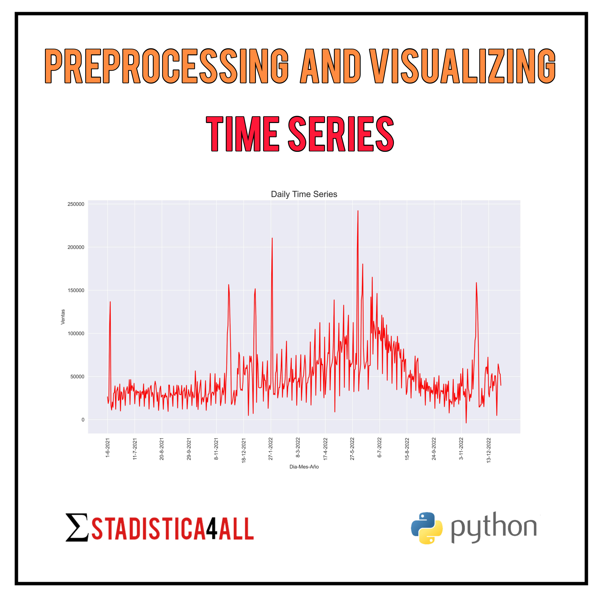
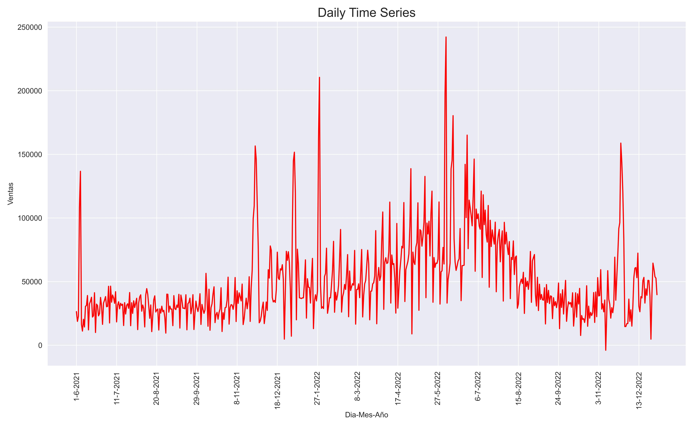
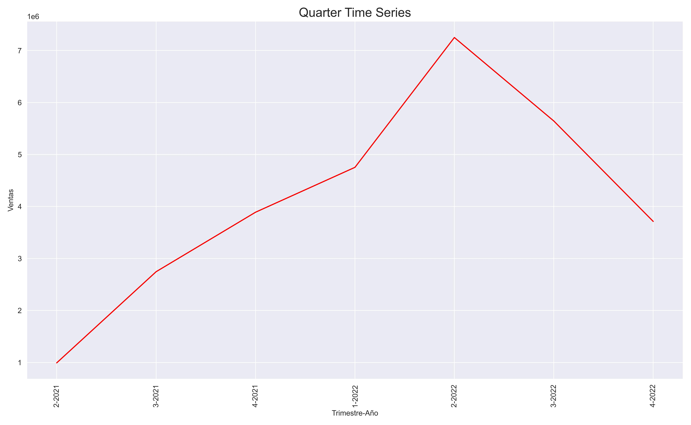
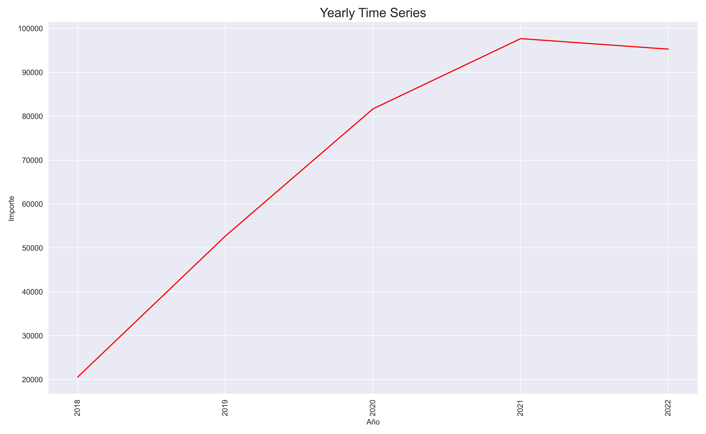
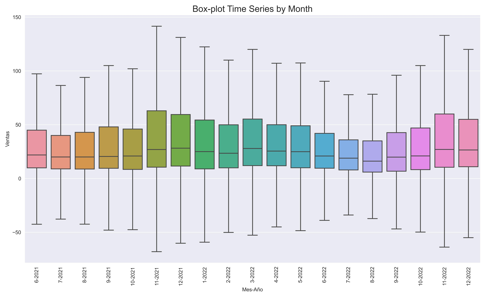

--- 
title: "Preprocessing and Visualizing Time Series in Python"
author: "Fabio Scielzo Ortiz"
date: "`r Sys.Date()`"
site: bookdown::bookdown_site
documentclass: book
bibliography: book.bib
description: |
  This is a practical introduction to time series preprocessing and visualizartion in Python.
link-citations: yes
github-repo: "rstudio/bookdown-demo"
---


# Introduction


<center>

{width="55%"}

</center>


<br>

<div class="warning" style='background-color:#FCF2EC; color: #000000; border-left: solid #FE9554 7px; border-radius: 3px; size:1px ; padding:0.1em;'>
<span>
 
<p style='margin-left:10em;'>


- **More articles:    $\hspace{0.1cm}$ [Estadistica4all](https://fabioscielzoortiz.github.io/Estadistica4all.github.io/)**

- **Author:** $\hspace{0.1cm}$ [Fabio Scielzo Ortiz](http://estadistica4all.com/autores/autores.html)

- **If you use this article, please reference it:** 

$\hspace{0.5cm}$ Scielzo Ortiz, Fabio. (2023). Preprocessing and Visualizing Time Series in Python. Estadistica4all.

- ***It's recommended to open the article in a computer or tablet.***
</p>
 
</p></span>
</div>

<br>


This is a practical introduction to time series preprocessing and visualizartion in `Python`.
 
<br>


# Preprocessing Time Series in `Python`  

First of all, we import some of the libraries we will be using throughout this article:

```python
import pandas as pd
import numpy as np
import matplotlib.pyplot as plt
import seaborn as sns
sns.set_style("darkgrid")
```
<br>

Next, we load a time series dataset. 
```python
Time_Series_1 = pd.read_csv('Time_Series_1.csv')
```
<br>

In this case, the periodicity of the original time series is daily, which will allow us to transform it to other higher periodicities.

Now, we are going to expose some preprocessing time series task, not many but important. 

When we have a time series, often we will have a **date column** in *yy-mm-dd* or *dd-mm-yy* format , in this data-set that column is called *Fecha* and it has *yy-mm-dd* format.

When we have identified the date column we must convert it to date-time format. We can do it using `Pandas` as follows:

```python
Time_Series_1['Fecha'] = pd.to_datetime(Time_Series_1['Fecha'])
```

<br>

Other important preprocessing task when we have a time series data-set is to create new columns with the day, week, month, quarter, and year associated to each observation. 

We can carry out these tasks with `Pandas`:

```python
Time_Series_1['Dia'] = Time_Series_1['Fecha'].dt.day

Time_Series_1['Semana'] = Time_Series_1['Fecha'].dt.week

Time_Series_1['Mes'] = Time_Series_1['Fecha'].dt.month

Time_Series_1['Trimestre'] = Time_Series_1['Fecha'].dt.quarter

Time_Series_1['Año'] = Time_Series_1['Fecha'].dt.year
```

<br>

We select the specific columns we will use throughout this article. The response variable will be the *Ventas* column, and the rest are columns related with the observation date.

```python
Time_Series_1 = Time_Series_1.loc[: , ['Fecha', 'Dia', 'Semana', 'Mes', 'Trimestre', 'Año', 'Ventas']]
```


```python
Time_Series_1
```

|   | Fecha       |   Dia |   Semana |   Mes |   Trimestre |   Año |   Ventas |
|:-:|:------------:|:-----:|:--------:|:-----:|:-----------:|:-----:|:--------:|
| 0 | 2022-06-21 |    21 |       25 |     6 |           2 |  2022 |    59.99 |
| 1 | 2021-08-03 |     3 |       31 |     8 |           3 |  2021 |    12.72 |
| 2 | 2022-08-21 |    21 |       33 |     8 |           3 |  2022 |    11.20 |
| 3 | 2022-07-09 |     9 |       27 |     7 |           3 |  2022 |    48.97 |
| 4 | 2022-05-14 |    14 |       19 |     5 |           2 |  2022 |    22.95 |
|...| ...        | ...   | ...      | ...   | ...         | ...   | ...      |
|704350| 2022-02-10|    10 |        6 |     2 |           1 |  2022 |    18.90 |
|704351| 2022-06-02|     2 |       22 |     6 |           2 |  2022 |   -29.99 |
|704352| 2022-05-19|    19 |       20 |     5 |           2 |  2022 |    75.00 |
|704353| 2022-02-17|    17 |        7 |     2 |           1 |  2022 |   -10.70 |
|704354| 2021-06-06|     6 |       22 |     6 |           2 |  2021 |     6.95 |


<br>

<br>


# Visualizing Time Series in `Python`


In this section we are going to visualize our time series using different periodicities.


## Monthly Time Series


 
We use `groupby` to group the time series by year and month, and then calculate the sum of the *Ventas* column for each of those groups.


```python
Monthly_Time_Series_1 = Time_Series_1.groupby(['Año', 'Mes'])['Ventas'].sum().reset_index(drop=False)
```

<br>
 
We change the *Año* (year) and *Mes* (month) columns to string format, and then we create the *Mes-Año* (month-year) column. All  this is needed for the posterior visualization.

```python
Monthly_Time_Series_1['Año'] = Monthly_Time_Series_1['Año'].astype('string')
Monthly_Time_Series_1['Mes'] = Monthly_Time_Series_1['Mes'].astype('string')
Monthly_Time_Series_1['Mes-Año'] = Monthly_Time_Series_1[['Mes', 'Año']].agg('-'.join, axis=1)
```


```python
Monthly_Time_Series_1
```


 

|        | Año  | Mes | Ventas      | Mes-Año  |
| :----: | :--: | --: | ----------:| --------:|
|   0    | 2021 |  6  | 992891.50  | 6-2021   |
|   1    | 2021 |  7  | 982142.75  | 7-2021   |
|   2    | 2021 |  8  | 885289.16  | 8-2021   |
|   3    | 2021 |  9  | 878563.14  | 9-2021   |
|   4    | 2021 | 10  | 923552.45  | 10-2021  |
|   5    | 2021 | 11  | 1527486.61 | 11-2021  |
|   6    | 2021 | 12  | 1438722.72 | 12-2021  |
|   7    | 2022 |  1  | 1910816.46 | 1-2022   |
|   8    | 2022 |  2  | 1317501.34 | 2-2022   |
|   9    | 2022 |  3  | 1524652.47 | 3-2022   |
|   10   | 2022 |  4  | 2060509.71 | 4-2022   |
|   11   | 2022 |  5  | 2316733.47 | 5-2022   |
|   12   | 2022 |  6  | 2872219.23 | 6-2022   |
|   13   | 2022 |  7  | 2731251.02 | 7-2022   |
|   14   | 2022 |  8  | 1844222.02 | 8-2022   |
|   15   | 2022 |  9  | 1068975.95 | 9-2022   |
|   16   | 2022 | 10  | 895735.29  | 10-2022  |
|   17   | 2022 | 11  | 1544511.61 | 11-2022  |
|   18   | 2022 | 12  | 1272814.69 | 12-2022  |


<br>


Now we create a **monthly** time series plot using `Seaborn`.


```python
fig, ax = plt.subplots(figsize=(13,8))
p=sns.lineplot(x="Mes-Año", y="Ventas", data=Monthly_Time_Series_1 , color='red')
plt.setp(p.get_xticklabels(), rotation=90)
plt.title("Monthly Time Series",  fontsize = 17)
plt.tight_layout()
fig.savefig('p1.jpg', format='jpg', dpi=500)
plt.show()
```

<center>
    
{width="100%"}
    
</center>


<br>

---

<br>


## Daily Time Series

We use `groupby` to group the time series by year, month and day, and then calculate the sum of the *Ventas* column for each of those groups.

```python
Daily_Time_Series_1 = Time_Series_1.groupby(['Año', 'Mes','Dia'])['Ventas'].sum().reset_index(drop=False)
```

<br>
 
We change the *Año* (year), *Mes* (month) and *Dia* (day) columns to string format, and then we create the *Mes-Año-Dia* (month-year-day) column. All  this is needed for the posterior visualization.

```python
Daily_Time_Series_1['Año'] = Daily_Time_Series_1['Año'].astype('string')
Daily_Time_Series_1['Mes'] = Daily_Time_Series_1['Mes'].astype('string')
Daily_Time_Series_1['Dia'] = Daily_Time_Series_1['Dia'].astype('string')
Daily_Time_Series_1['Dia-Mes-Año'] = Daily_Time_Series_1[['Dia', 'Mes', 'Año']].agg('-'.join, axis=1)
```


```python
Daily_Time_Series_1
```


|        | Año  | Mes | Dia | Ventas    | Dia-Mes-Año  |
| :----: | :--: | --: | --: | --------:| ------------:|
|   0    | 2021 |  6  |  1  | 26423.78 |     1-6-2021 |
|   1    | 2021 |  6  |  2  | 18752.01 |     2-6-2021 |
|   2    | 2021 |  6  |  3  | 22812.84 |     3-6-2021 |
|   3    | 2021 |  6  |  4  | 107889.11|     4-6-2021 |
|   4    | 2021 |  6  |  5  | 136714.44|     5-6-2021 |
|  ...   | ...  | ... | ... | ...      |     ...      |
|  574   | 2022 | 12  | 27  | 64542.49 |  27-12-2022  |
|  575   | 2022 | 12  | 28  | 59913.84 |  28-12-2022  |
|  576   | 2022 | 12  | 29  | 53815.43 |  29-12-2022  |
|  577   | 2022 | 12  | 30  | 52695.32 |  30-12-2022  |
|  578   | 2022 | 12  | 31  | 39739.67 |  31-12-2022  |

<br>


Now we create a **daily** time series plot using `Seaborn`.

```python
fig, ax = plt.subplots(figsize=(13,8))
p=sns.lineplot(x="Dia-Mes-Año", y="Ventas", data=Daily_Time_Series_1 , color='red')
p.set_xticks(np.arange(0 , len(Daily_Time_Series_1) , 40))
plt.setp(p.get_xticklabels(), rotation=90)
plt.title("Daily Time Series", fontsize = 17)
plt.tight_layout()
fig.savefig('p2.jpg', format='jpg', dpi=500)
plt.show()
```

<center>
    
{width="100%"}
    
</center>


<br>

---

<br>


## Weekly Time Series

We use `groupby` to group the time series by year, month and week, and then calculate the sum of the *Ventas* column for each of those groups.

```python
Weekly_Time_Series_1 = Time_Series_1.groupby(['Año', 'Mes','Semana'])['Ventas'].sum().reset_index(drop=False)
```

<br>
 

We change the *Año* (year), *Mes* (month) and *Semana* (week) columns to string format, and then we create the *Semana-Mes-Año* (week-month-year) column. All  this is needed for the posterior visualization.
 

```python
Weekly_Time_Series_1['Año'] = Weekly_Time_Series_1['Año'].astype('string')
Weekly_Time_Series_1['Mes'] = Weekly_Time_Series_1['Mes'].astype('string')
Weekly_Time_Series_1['Semana'] = Weekly_Time_Series_1['Semana'].astype('string')
Weekly_Time_Series_1['Semana-Mes-Año'] = Weekly_Time_Series_1[['Semana', 'Mes', 'Año']].agg('-'.join, axis=1)
```


```python
Weekly_Time_Series_1
```


|   | Año  | Mes | Semana | Ventas     | Semana-Mes-Año |
|:-:|:----:|:---:|:------:|:----------|:--------------|
| 0 | 2021 | 6   | 22     | 329029.82 | 22-6-2021     |
| 1 | 2021 | 6   | 23     | 158833.59 | 23-6-2021     |
| 2 | 2021 | 6   | 24     | 201568.21 | 24-6-2021     |
| 3 | 2021 | 6   | 25     | 196610.74 | 25-6-2021     |
| 4 | 2021 | 6   | 26     | 106849.14 | 26-6-2021     |
|...| ...  | ... | ...    | ...       | ...           |
| 94| 2022 | 12  | 48     | 89144.45  | 48-12-2022    |
| 95| 2022 | 12  | 49     | 301484.19 | 49-12-2022    |
| 96| 2022 | 12  | 50     | 308829.59 | 50-12-2022    |
| 97| 2022 | 12  | 51     | 262326.49 | 51-12-2022    |
| 98| 2022 | 12  | 52     | 311029.97 | 52-12-2022    |


<br>

Now we create a **weekly** time series plot using `Seaborn`.

```python
fig, ax = plt.subplots(figsize=(13,8))
p=sns.lineplot(x="Semana-Mes-Año", y="Ventas", data=Weekly_Time_Series_1 , color='red')
p.set_xticks(np.arange(0 , len(Weekly_Time_Series_1) , 5))
plt.setp(p.get_xticklabels(), rotation=90)
plt.title("Weekly Time Series",  fontsize = 17)
plt.tight_layout()
fig.savefig('p3_1.jpg', format='jpg', dpi=500)
plt.show()
```

<center>
    
{width="100%"}
    

</center>


<br>

---

<br>


## Quarterly Time Series

We use `groupby` to group the time series by year, month and week, and then calculate the sum of the *Ventas* column for each of those groups.


```python
Quarter_Time_Series_1 = Time_Series_1.groupby(['Año', 'Trimestre'])['Ventas'].sum().reset_index(drop=False)
```

<br>

 
We change the *Año* (year)  and *Trimestre* (quarter) columns to string format, and then we create the *Trimestre-Año* (quarter-year) column. All  this is needed for the subsequent visualization.

```python
Quarter_Time_Series_1['Año'] = Quarter_Time_Series_1['Año'].astype('string')
Quarter_Time_Series_1['Trimestre'] = Quarter_Time_Series_1['Trimestre'].astype('string')
Quarter_Time_Series_1['Trimestre-Año'] = Quarter_Time_Series_1[['Trimestre', 'Año']].agg('-'.join, axis=1)
```


```python
Quarter_Time_Series_1
```


|     |   Año |   Trimestre |     Ventas | Trimestre-Año   |
|---: |-----: |----------: |----------: |:-------------- |
|  0  |  2021 |          2 |  992891.50 | 2-2021          |
|  1  |  2021 |          3 | 2745995.05 | 3-2021          |
|  2  |  2021 |          4 | 3889761.78 | 4-2021          |
|  3  |  2022 |          1 | 4752970.27 | 1-2022          |
|  4  |  2022 |          2 | 7249462.41 | 2-2022          |
|  5  |  2022 |          3 | 5644448.99 | 3-2022          |
|  6  |  2022 |          4 | 3713061.59 | 4-2022          |


<br>

As before, we create a **quarterly** time series plot using `Seborn`.

```python
fig, ax = plt.subplots(figsize=(13,8))
p=sns.lineplot(x="Trimestre-Año", y="Ventas", data=Quarter_Time_Series_1 , color='red')
p.set_xticks(np.arange(0 , len(Quarter_Time_Series_1) , 1))
plt.setp(p.get_xticklabels(), rotation=90)
plt.title("Quarter Time Series",  fontsize = 17)
plt.tight_layout()
fig.savefig('p4.jpg', format='jpg', dpi=500)
plt.show()
```

<center>
    
{width="100%"}
    
</center>


<br>


## Yearly Time Series


To visualize this case, we will use a new time series data-set which takes more years into account.

```python
Time_Series_2 = pd.read_csv('Time_Series_2.csv')
```

<br>

We will apply the same preprocessing steps to this dataset as we did to the previous one.

```python
Time_Series_2['Fecha'] = pd.to_datetime(Time_Series_2['Fecha'])

Time_Series_2['Dia'] = Time_Series_2['Fecha'].dt.day

Time_Series_2['Semana'] = Time_Series_2['Fecha'].dt.week

Time_Series_2['Mes'] = Time_Series_2['Fecha'].dt.month

Time_Series_2['Trimestre'] = Time_Series_2['Fecha'].dt.quarter

Time_Series_2['Año'] = Time_Series_2['Fecha'].dt.year

Yearly_Time_Series_2['Año'] = Yearly_Time_Series_2['Año'].astype('string')

Time_Series_2.loc[:,['Importe', 'Fecha', 'Dia', 'Semana', 'Mes', 'Trimestre', 'Año']]
 
Yearly_Time_Series_2 = Time_Series_2.groupby(['Año'])['Importe'].sum().reset_index(drop=False)
```


```python
Yearly_Time_Series_2
```


|    |   Año |   Importe |
|---:|------:|----------:|
|  0 |  2018 |  20584.6  |
|  1 |  2019 |  52704.3  |
|  2 |  2020 |  81690.1  |
|  3 |  2021 |  97683.5  |
|  4 |  2022 |  95286.3  |


<br>


Now, we create a yearly time series plot using the new data-set and `Seborn`:

```python
fig, ax = plt.subplots(figsize=(13,8))
p=sns.lineplot(x="Año", y="Importe", data=Yearly_Time_Series_2 , color='red')
p.set_xticks(np.arange(0 , len(Yearly_Time_Series_2) , 1))
plt.setp(p.get_xticklabels(), rotation=90)
plt.title("Yearly Time Series",  fontsize = 17)
plt.tight_layout()
fig.savefig('p5.jpg', format='jpg', dpi=500)
plt.show()
```

<center>
    
{width="100%"}
    
</center>


<br>

---

<br>


## Box-plot by month  

In this subsection we are going to show a different type of time series plot. It consists of graphing the response variable (*Ventas*) by groups with a box-plot. In this case we will use the month as the variable through which the response is grouped.

This is the same way of proceeding as when we have a quantitative variable grouped by the categories of a categorical variable, and we plot them with multiple box-plots.

```python
Time_Series_1_copy = Time_Series_1.copy()
```
<br>

To obtain a better visualization we must do some operations to order the date labels of the x-axis of our plot.

```python
Time_Series_1_copy['Año'] = Time_Series_1_copy['Año'].astype('string')
Time_Series_1_copy['Mes'] = Time_Series_1_copy['Mes'].astype('string')
Time_Series_1_copy['Mes-Año'] = Time_Series_1_copy[['Mes', 'Año']].agg('-'.join, axis=1)
```


```python
from datetime import datetime
Mes_Año = Time_Series_1_copy['Mes-Año'].unique()
Mes_Año_dt = [datetime.strptime(x, '%m-%Y') for x in Mes_Año]
Mes_Año_dt_sorted = sorted(Mes_Año_dt)
Mes_Año_dt_sorted = [datetime.strftime(x, '%m-%Y') for x in Mes_Año_dt_sorted]
Mes_Año_dt_sorted_sin_ceros = [x.lstrip('0')  if x.startswith('0')  else x   for x in Mes_Año_dt_sorted]
```

<br>


Now, we make a time series box-plot using  `Seborn`:

```python
fig, ax = plt.subplots(figsize=(13,7))
p1 = sns.boxplot(x="Mes-Año", y="Ventas", data=Time_Series_1_copy, order=Mes_Año_dt_sorted_sin_ceros, showfliers=True)
plt.setp(p1.get_xticklabels(), rotation=90)
plt.title("Box-plot Time Series by Month",  fontsize = 17)
fig.savefig('pbox1.jpg', format='jpg', dpi=500)
plt.show()
```

<center>
    
{width="100%"}
    
</center>

<br>


As you can see, there are so many outliers that we cannot even see the box-plot clearly. To avoid this problem we can exclude outliers setting the parameter `showfliers` to `False`.


```python
fig, ax = plt.subplots(figsize=(13,7))
p1 = sns.boxplot(x="Mes-Año", y="Ventas", data=Time_Series_1_copy, order=Mes_Año_dt_sorted_sin_ceros, showfliers=False)
plt.setp(p1.get_xticklabels(), rotation=90)
plt.title("Box-plot Time Series by Month",  fontsize = 17)
fig.savefig('pbox2.jpg', format='jpg', dpi=500)
plt.show()
```

<center>
    
{width="100%"}
    
</center>


 
<br>


  
# Bibliography


 
- McKinney, W. (2010). Data Structures for Statistical Computing in Python. Proceedings of the 9th Python in Science Conference (pp. 56-61).   https://conference.scipy.org/proceedings/scipy2010/mckinney.html 

 
- Waskom, M. (2021). Seaborn: statistical data visualization. Journal of Open Source Software, 6(60), 3021. https://doi.org/10.21105/joss.03021
 
 
 
 <br>
 
 
 
 
 
 
 
 
 
 
 
 
 
 
 
 


