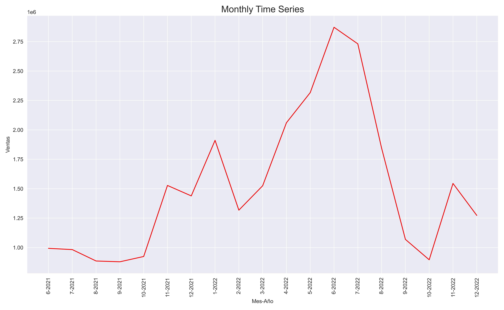
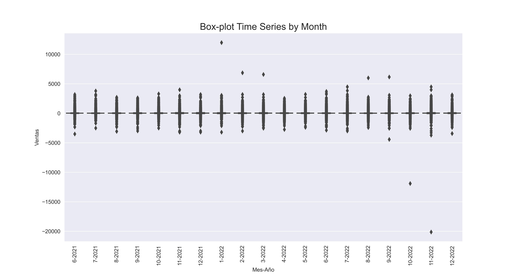
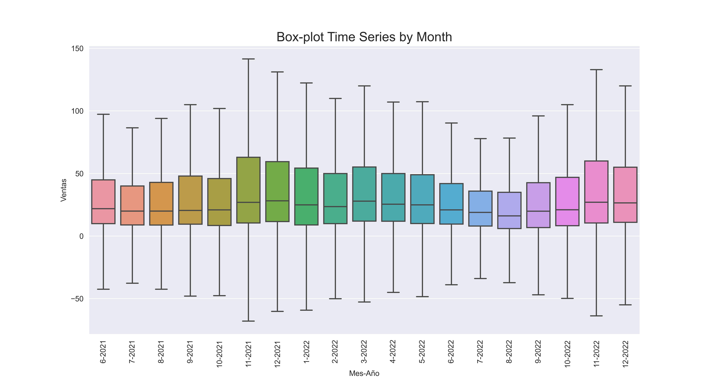

<div>
<style scoped>
    .dataframe tbody tr th:only-of-type {
        vertical-align: middle;
    }

    .dataframe tbody tr th {
        vertical-align: top;
    }

    .dataframe thead th {
        text-align: right;
    }
    
 
    table {
     display: block;
     overflow-x: auto;
     border-collapse: collapse;
     border-spacing: 0;
     border: 0px solid;
     color: var(--jp-ui-font-color1);
     font-size: 14px;
     margin-left: auto;
     margin-right: auto;
     
            }
            
</style>


<div class="warning" style='background-color:#FCF2EC; color: #000000; border-left: solid #FE9554 7px; border-radius: 3px; size:1px ; padding:0.1em;'>
<span>
 
<p style='margin-left:10em;'>


$\hspace{0.3cm}$ **More articles:    $\hspace{0.1cm}$ [Estadistica4all](https://fabioscielzoortiz.github.io/Estadistica4all.github.io/)**

$\hspace{0.3cm}$ **Author:** $\hspace{0.1cm}$ [Fabio Scielzo Ortiz](http://estadistica4all.com/autores/autores.html)

$\hspace{0.3cm}$ **If you use this article, please reference it:** 

$\hspace{0.5cm}$ Scielzo Ortiz, Fabio. (2023). Preprocessing and Visualizing Time Series in Python. Estadistica4all. http://estadistica4all.com/Articulos/Preprocessing_and_Visualizing_Time_Series_in_Python.html


</p>
 
</p></span>
</div>


***It's recommended to open the article in a computer or tablet.***
 
 
 
<br>


# Preprocessing Time Series in `Python` <a class="anchor" id="1"></a>

First of all, we import some of the libraries we will be using throughout this article:

```python
import pandas as pd
import numpy as np

import matplotlib.pyplot as plt
import seaborn as sns

sns.set_style("darkgrid")
```
 
We load a time series data-set, in this case the minimum periodicity of the time series is daily:

```python
Time_Series_1 = pd.read_csv('Time_Series_1.csv')
```

We are going to expose some preprocessing time series task, not many but important. 

When we have a time series, usually we will have a date column, in this data-set called *Fecha*.

When we have identified the date column we must convert it to date-time format. We can do it using `Pandas` as follows:

```python
Time_Series_1['Fecha'] = pd.to_datetime(Time_Series_1['Fecha'])
```


Other important preprocessing task when we have a time series data-set is to create new columns with the day, week, month, quarter, and year associated to each observation. 

We can carry out these tasks with `Pandas`:

```python
Time_Series_1['Dia'] = Time_Series_1['Fecha'].dt.day

Time_Series_1['Semana'] = Time_Series_1['Fecha'].dt.week

Time_Series_1['Mes'] = Time_Series_1['Fecha'].dt.month

Time_Series_1['Trimestre'] = Time_Series_1['Fecha'].dt.quarter

Time_Series_1['Año'] = Time_Series_1['Fecha'].dt.year
```


We select the specific columns we will use throughout this article. The response variable will be the *Ventas* column, and the rest are columns related with the observation date.

```python
Time_Series_1 = Time_Series_1.loc[: , ['Fecha', 'Dia', 'Semana', 'Mes', 'Trimestre', 'Año', 'Ventas']]
```


```python
Time_Series_1
```


<div>
<style scoped>
    .dataframe tbody tr th:only-of-type {
        vertical-align: middle;
    }

    .dataframe tbody tr th {
        vertical-align: top;
    }

    .dataframe thead th {
        text-align: right;
    }
</style>
<table border="1" class="dataframe">
  <thead>
    <tr style="text-align: right;">
      <th></th>
      <th>Fecha</th>
      <th>Dia</th>
      <th>Semana</th>
      <th>Mes</th>
      <th>Trimestre</th>
      <th>Año</th>
      <th>Ventas</th>
    </tr>
  </thead>
  <tbody>
    <tr>
      <th>0</th>
      <td>2022-06-21</td>
      <td>21</td>
      <td>25</td>
      <td>6</td>
      <td>2</td>
      <td>2022</td>
      <td>59.99</td>
    </tr>
    <tr>
      <th>1</th>
      <td>2021-08-03</td>
      <td>3</td>
      <td>31</td>
      <td>8</td>
      <td>3</td>
      <td>2021</td>
      <td>12.72</td>
    </tr>
    <tr>
      <th>2</th>
      <td>2022-08-21</td>
      <td>21</td>
      <td>33</td>
      <td>8</td>
      <td>3</td>
      <td>2022</td>
      <td>11.20</td>
    </tr>
    <tr>
      <th>3</th>
      <td>2022-07-09</td>
      <td>9</td>
      <td>27</td>
      <td>7</td>
      <td>3</td>
      <td>2022</td>
      <td>48.97</td>
    </tr>
    <tr>
      <th>4</th>
      <td>2022-05-14</td>
      <td>14</td>
      <td>19</td>
      <td>5</td>
      <td>2</td>
      <td>2022</td>
      <td>22.95</td>
    </tr>
    <tr>
      <th>...</th>
      <td>...</td>
      <td>...</td>
      <td>...</td>
      <td>...</td>
      <td>...</td>
      <td>...</td>
      <td>...</td>
    </tr>
    <tr>
      <th>704350</th>
      <td>2022-02-10</td>
      <td>10</td>
      <td>6</td>
      <td>2</td>
      <td>1</td>
      <td>2022</td>
      <td>18.90</td>
    </tr>
    <tr>
      <th>704351</th>
      <td>2022-06-02</td>
      <td>2</td>
      <td>22</td>
      <td>6</td>
      <td>2</td>
      <td>2022</td>
      <td>-29.99</td>
    </tr>
    <tr>
      <th>704352</th>
      <td>2022-05-19</td>
      <td>19</td>
      <td>20</td>
      <td>5</td>
      <td>2</td>
      <td>2022</td>
      <td>75.00</td>
    </tr>
    <tr>
      <th>704353</th>
      <td>2022-02-17</td>
      <td>17</td>
      <td>7</td>
      <td>2</td>
      <td>1</td>
      <td>2022</td>
      <td>-10.70</td>
    </tr>
    <tr>
      <th>704354</th>
      <td>2021-06-06</td>
      <td>6</td>
      <td>22</td>
      <td>6</td>
      <td>2</td>
      <td>2021</td>
      <td>6.95</td>
    </tr>
  </tbody>
</table>
<p>704355 rows × 7 columns</p>
</div>


<br>


# Visualizing Time Series in `Python`


In this section we are going to visualize our time series using different periodicities.


## Monthly Time Series


 
We use `groupby` to group the time series by year and month, and then calculate the sum of the *Ventas* column for each of those groups.


```python
Monthly_Time_Series_1 = Time_Series_1.groupby(['Año', 'Mes'])['Ventas'].sum().reset_index(drop=False)
```

 
We change the *Año* (year) and *Mes* (month) columns to string format, and then we create the *Mes-Año* (month-year) column. All  this is needed for the posterior visualization.

```python
Monthly_Time_Series_1['Año'] = Monthly_Time_Series_1['Año'].astype('string')
Monthly_Time_Series_1['Mes'] = Monthly_Time_Series_1['Mes'].astype('string')

Monthly_Time_Series_1['Mes-Año'] = Monthly_Time_Series_1[['Mes', 'Año']].agg('-'.join, axis=1)
```


```python
Monthly_Time_Series_1
```


<div>
<style scoped>
    .dataframe tbody tr th:only-of-type {
        vertical-align: middle;
    }

    .dataframe tbody tr th {
        vertical-align: top;
    }

    .dataframe thead th {
        text-align: right;
    }
</style>
<table border="1" class="dataframe">
  <thead>
    <tr style="text-align: right;">
      <th></th>
      <th>Año</th>
      <th>Mes</th>
      <th>Ventas</th>
      <th>Mes-Año</th>
    </tr>
  </thead>
  <tbody>
    <tr>
      <th>0</th>
      <td>2021</td>
      <td>6</td>
      <td>992891.50</td>
      <td>6-2021</td>
    </tr>
    <tr>
      <th>1</th>
      <td>2021</td>
      <td>7</td>
      <td>982142.75</td>
      <td>7-2021</td>
    </tr>
    <tr>
      <th>2</th>
      <td>2021</td>
      <td>8</td>
      <td>885289.16</td>
      <td>8-2021</td>
    </tr>
    <tr>
      <th>3</th>
      <td>2021</td>
      <td>9</td>
      <td>878563.14</td>
      <td>9-2021</td>
    </tr>
    <tr>
      <th>4</th>
      <td>2021</td>
      <td>10</td>
      <td>923552.45</td>
      <td>10-2021</td>
    </tr>
    <tr>
      <th>5</th>
      <td>2021</td>
      <td>11</td>
      <td>1527486.61</td>
      <td>11-2021</td>
    </tr>
    <tr>
      <th>6</th>
      <td>2021</td>
      <td>12</td>
      <td>1438722.72</td>
      <td>12-2021</td>
    </tr>
    <tr>
      <th>7</th>
      <td>2022</td>
      <td>1</td>
      <td>1910816.46</td>
      <td>1-2022</td>
    </tr>
    <tr>
      <th>8</th>
      <td>2022</td>
      <td>2</td>
      <td>1317501.34</td>
      <td>2-2022</td>
    </tr>
    <tr>
      <th>9</th>
      <td>2022</td>
      <td>3</td>
      <td>1524652.47</td>
      <td>3-2022</td>
    </tr>
    <tr>
      <th>10</th>
      <td>2022</td>
      <td>4</td>
      <td>2060509.71</td>
      <td>4-2022</td>
    </tr>
    <tr>
      <th>11</th>
      <td>2022</td>
      <td>5</td>
      <td>2316733.47</td>
      <td>5-2022</td>
    </tr>
    <tr>
      <th>12</th>
      <td>2022</td>
      <td>6</td>
      <td>2872219.23</td>
      <td>6-2022</td>
    </tr>
    <tr>
      <th>13</th>
      <td>2022</td>
      <td>7</td>
      <td>2731251.02</td>
      <td>7-2022</td>
    </tr>
    <tr>
      <th>14</th>
      <td>2022</td>
      <td>8</td>
      <td>1844222.02</td>
      <td>8-2022</td>
    </tr>
    <tr>
      <th>15</th>
      <td>2022</td>
      <td>9</td>
      <td>1068975.95</td>
      <td>9-2022</td>
    </tr>
    <tr>
      <th>16</th>
      <td>2022</td>
      <td>10</td>
      <td>895735.29</td>
      <td>10-2022</td>
    </tr>
    <tr>
      <th>17</th>
      <td>2022</td>
      <td>11</td>
      <td>1544511.61</td>
      <td>11-2022</td>
    </tr>
    <tr>
      <th>18</th>
      <td>2022</td>
      <td>12</td>
      <td>1272814.69</td>
      <td>12-2022</td>
    </tr>
  </tbody>
</table>
</div>


<br>


Now we create a **monthly** time series plot using `Seaborn`.


```python
fig, ax = plt.subplots(figsize=(13,8))

p=sns.lineplot(x="Mes-Año", y="Ventas", data=Monthly_Time_Series_1 , color='red')

plt.setp(p.get_xticklabels(), rotation=90)

plt.title("Monthly Time Series",  fontsize = 17)

plt.tight_layout()

fig.savefig('p1.jpg', format='jpg', dpi=500)

plt.show()
```

<center>
    
{width="60%"}
    
</center>


<br>


## Daily Time Series

We use `groupby` to group the time series by year, month and day, and then calculate the sum of the *Ventas* column for each of those groups.

```python
Daily_Time_Series_1 = Time_Series_1.groupby(['Año', 'Mes','Dia'])['Ventas'].sum().reset_index(drop=False)
```

 
We change the *Año* (year), *Mes* (month) and *Dia* (day) columns to string format, and then we create the *Mes-Año-Dia* (month-year-day) column. All  this is needed for the posterior visualization.

```python
Daily_Time_Series_1['Año'] = Daily_Time_Series_1['Año'].astype('string')
Daily_Time_Series_1['Mes'] = Daily_Time_Series_1['Mes'].astype('string')
Daily_Time_Series_1['Dia'] = Daily_Time_Series_1['Dia'].astype('string')

Daily_Time_Series_1['Dia-Mes-Año'] = Daily_Time_Series_1[['Dia', 'Mes', 'Año']].agg('-'.join, axis=1)
```


```python
Daily_Time_Series_1
```


<div>
<style scoped>
    .dataframe tbody tr th:only-of-type {
        vertical-align: middle;
    }

    .dataframe tbody tr th {
        vertical-align: top;
    }

    .dataframe thead th {
        text-align: right;
    }
</style>
<table border="1" class="dataframe">
  <thead>
    <tr style="text-align: right;">
      <th></th>
      <th>Año</th>
      <th>Mes</th>
      <th>Dia</th>
      <th>Ventas</th>
      <th>Dia-Mes-Año</th>
    </tr>
  </thead>
  <tbody>
    <tr>
      <th>0</th>
      <td>2021</td>
      <td>6</td>
      <td>1</td>
      <td>26423.78</td>
      <td>1-6-2021</td>
    </tr>
    <tr>
      <th>1</th>
      <td>2021</td>
      <td>6</td>
      <td>2</td>
      <td>18752.01</td>
      <td>2-6-2021</td>
    </tr>
    <tr>
      <th>2</th>
      <td>2021</td>
      <td>6</td>
      <td>3</td>
      <td>22812.84</td>
      <td>3-6-2021</td>
    </tr>
    <tr>
      <th>3</th>
      <td>2021</td>
      <td>6</td>
      <td>4</td>
      <td>107889.11</td>
      <td>4-6-2021</td>
    </tr>
    <tr>
      <th>4</th>
      <td>2021</td>
      <td>6</td>
      <td>5</td>
      <td>136714.44</td>
      <td>5-6-2021</td>
    </tr>
    <tr>
      <th>...</th>
      <td>...</td>
      <td>...</td>
      <td>...</td>
      <td>...</td>
      <td>...</td>
    </tr>
    <tr>
      <th>574</th>
      <td>2022</td>
      <td>12</td>
      <td>27</td>
      <td>64542.49</td>
      <td>27-12-2022</td>
    </tr>
    <tr>
      <th>575</th>
      <td>2022</td>
      <td>12</td>
      <td>28</td>
      <td>59913.84</td>
      <td>28-12-2022</td>
    </tr>
    <tr>
      <th>576</th>
      <td>2022</td>
      <td>12</td>
      <td>29</td>
      <td>53815.43</td>
      <td>29-12-2022</td>
    </tr>
    <tr>
      <th>577</th>
      <td>2022</td>
      <td>12</td>
      <td>30</td>
      <td>52695.32</td>
      <td>30-12-2022</td>
    </tr>
    <tr>
      <th>578</th>
      <td>2022</td>
      <td>12</td>
      <td>31</td>
      <td>39739.67</td>
      <td>31-12-2022</td>
    </tr>
  </tbody>
</table>
<p>579 rows × 5 columns</p>
</div>


<br>


Now we create a **daily** time series plot using `Seaborn`.

```python
fig, ax = plt.subplots(figsize=(13,8))

p=sns.lineplot(x="Dia-Mes-Año", y="Ventas", data=Daily_Time_Series_1 , color='red')

p.set_xticks(np.arange(0 , len(Daily_Time_Series_1) , 40))

plt.setp(p.get_xticklabels(), rotation=90)

plt.title("Daily Time Series", fontsize = 17)

plt.tight_layout()

fig.savefig('p2.jpg', format='jpg', dpi=500)

plt.show()
```

<center>
    
{width="60%"}
    
</center>


<br>


## Weekly Time Series

We use `groupby` to group the time series by year, month and week, and then calculate the sum of the *Ventas* column for each of those groups.

```python
Weekly_Time_Series_1 = Time_Series_1.groupby(['Año', 'Mes','Semana'])['Ventas'].sum().reset_index(drop=False)
```

 

We change the *Año* (year), *Mes* (month) and *Semana* (week) columns to string format, and then we create the *Semana-Mes-Año* (week-month-year) column. All  this is needed for the posterior visualization.
 

```python
Weekly_Time_Series_1['Año'] = Weekly_Time_Series_1['Año'].astype('string')
Weekly_Time_Series_1['Mes'] = Weekly_Time_Series_1['Mes'].astype('string')
Weekly_Time_Series_1['Semana'] = Weekly_Time_Series_1['Semana'].astype('string')

Weekly_Time_Series_1['Semana-Mes-Año'] = Weekly_Time_Series_1[['Semana', 'Mes', 'Año']].agg('-'.join, axis=1)
```


```python
Weekly_Time_Series_1
```


<div>
<style scoped>
    .dataframe tbody tr th:only-of-type {
        vertical-align: middle;
    }

    .dataframe tbody tr th {
        vertical-align: top;
    }

    .dataframe thead th {
        text-align: right;
    }
</style>
<table border="1" class="dataframe">
  <thead>
    <tr style="text-align: right;">
      <th></th>
      <th>Año</th>
      <th>Mes</th>
      <th>Semana</th>
      <th>Ventas</th>
      <th>Semana-Mes-Año</th>
    </tr>
  </thead>
  <tbody>
    <tr>
      <th>0</th>
      <td>2021</td>
      <td>6</td>
      <td>22</td>
      <td>329029.82</td>
      <td>22-6-2021</td>
    </tr>
    <tr>
      <th>1</th>
      <td>2021</td>
      <td>6</td>
      <td>23</td>
      <td>158833.59</td>
      <td>23-6-2021</td>
    </tr>
    <tr>
      <th>2</th>
      <td>2021</td>
      <td>6</td>
      <td>24</td>
      <td>201568.21</td>
      <td>24-6-2021</td>
    </tr>
    <tr>
      <th>3</th>
      <td>2021</td>
      <td>6</td>
      <td>25</td>
      <td>196610.74</td>
      <td>25-6-2021</td>
    </tr>
    <tr>
      <th>4</th>
      <td>2021</td>
      <td>6</td>
      <td>26</td>
      <td>106849.14</td>
      <td>26-6-2021</td>
    </tr>
    <tr>
      <th>...</th>
      <td>...</td>
      <td>...</td>
      <td>...</td>
      <td>...</td>
      <td>...</td>
    </tr>
    <tr>
      <th>94</th>
      <td>2022</td>
      <td>12</td>
      <td>48</td>
      <td>89144.45</td>
      <td>48-12-2022</td>
    </tr>
    <tr>
      <th>95</th>
      <td>2022</td>
      <td>12</td>
      <td>49</td>
      <td>301484.19</td>
      <td>49-12-2022</td>
    </tr>
    <tr>
      <th>96</th>
      <td>2022</td>
      <td>12</td>
      <td>50</td>
      <td>308829.59</td>
      <td>50-12-2022</td>
    </tr>
    <tr>
      <th>97</th>
      <td>2022</td>
      <td>12</td>
      <td>51</td>
      <td>262326.49</td>
      <td>51-12-2022</td>
    </tr>
    <tr>
      <th>98</th>
      <td>2022</td>
      <td>12</td>
      <td>52</td>
      <td>311029.97</td>
      <td>52-12-2022</td>
    </tr>
  </tbody>
</table>
<p>99 rows × 5 columns</p>
</div>


<br>

Now we create a **weekly** time series plot using `Seaborn`.

```python
fig, ax = plt.subplots(figsize=(13,8))

p=sns.lineplot(x="Semana-Mes-Año", y="Ventas", data=Weekly_Time_Series_1 , color='red')

p.set_xticks(np.arange(0 , len(Weekly_Time_Series_1) , 5))

plt.setp(p.get_xticklabels(), rotation=90)


plt.title("Weekly Time Series",  fontsize = 17)

plt.tight_layout()

fig.savefig('p3_1.jpg', format='jpg', dpi=500)

plt.show()
```

<center>
    
{width="60%"}
    

</center>


<br>


## Quarterly Time Series

We use `groupby` to group the time series by year, month and week, and then calculate the sum of the *Ventas* column for each of those groups.


```python
Quarter_Time_Series_1 = Time_Series_1.groupby(['Año', 'Trimestre'])['Ventas'].sum().reset_index(drop=False)
```

 
We change the *Año* (year)  and *Trimestre* (quarter) columns to string format, and then we create the *Trimestre-Año* (quarter-year) column. All  this is needed for the subsequent visualization.

```python
Quarter_Time_Series_1['Año'] = Quarter_Time_Series_1['Año'].astype('string')
Quarter_Time_Series_1['Trimestre'] = Quarter_Time_Series_1['Trimestre'].astype('string')

Quarter_Time_Series_1['Trimestre-Año'] = Quarter_Time_Series_1[['Trimestre', 'Año']].agg('-'.join, axis=1)
```


```python
Quarter_Time_Series_1
```


<div>
<style scoped>
    .dataframe tbody tr th:only-of-type {
        vertical-align: middle;
    }

    .dataframe tbody tr th {
        vertical-align: top;
    }

    .dataframe thead th {
        text-align: right;
    }
</style>
<table border="1" class="dataframe">
  <thead>
    <tr style="text-align: right;">
      <th></th>
      <th>Año</th>
      <th>Trimestre</th>
      <th>Ventas</th>
      <th>Trimestre-Año</th>
    </tr>
  </thead>
  <tbody>
    <tr>
      <th>0</th>
      <td>2021</td>
      <td>2</td>
      <td>992891.50</td>
      <td>2-2021</td>
    </tr>
    <tr>
      <th>1</th>
      <td>2021</td>
      <td>3</td>
      <td>2745995.05</td>
      <td>3-2021</td>
    </tr>
    <tr>
      <th>2</th>
      <td>2021</td>
      <td>4</td>
      <td>3889761.78</td>
      <td>4-2021</td>
    </tr>
    <tr>
      <th>3</th>
      <td>2022</td>
      <td>1</td>
      <td>4752970.27</td>
      <td>1-2022</td>
    </tr>
    <tr>
      <th>4</th>
      <td>2022</td>
      <td>2</td>
      <td>7249462.41</td>
      <td>2-2022</td>
    </tr>
    <tr>
      <th>5</th>
      <td>2022</td>
      <td>3</td>
      <td>5644448.99</td>
      <td>3-2022</td>
    </tr>
    <tr>
      <th>6</th>
      <td>2022</td>
      <td>4</td>
      <td>3713061.59</td>
      <td>4-2022</td>
    </tr>
  </tbody>
</table>
</div>


<br>

As before, we create a **quarterly** time series plot using `Seborn`.

```python
fig, ax = plt.subplots(figsize=(13,8))

p=sns.lineplot(x="Trimestre-Año", y="Ventas", data=Quarter_Time_Series_1 , color='red')

p.set_xticks(np.arange(0 , len(Quarter_Time_Series_1) , 1))

plt.setp(p.get_xticklabels(), rotation=90)

plt.title("Quarter Time Series",  fontsize = 17)

plt.tight_layout()

fig.savefig('p4.jpg', format='jpg', dpi=500)

plt.show()
```

<center>
    
{width="60%"}
    
</center>


<br>


## Yearly Time Series


To visualize this case, we will use a new time series data-set which takes more years into account.

```python
Time_Series_2 = pd.read_csv('Time_Series_2.csv')
```

We will apply the same preprocessing steps to this dataset as we did to the previous one.

```python
Time_Series_2['Fecha'] = pd.to_datetime(Time_Series_2['Fecha'])

Time_Series_2['Dia'] = Time_Series_2['Fecha'].dt.day

Time_Series_2['Semana'] = Time_Series_2['Fecha'].dt.week

Time_Series_2['Mes'] = Time_Series_2['Fecha'].dt.month

Time_Series_2['Trimestre'] = Time_Series_2['Fecha'].dt.quarter

Time_Series_2['Año'] = Time_Series_2['Fecha'].dt.year

Yearly_Time_Series_2['Año'] = Yearly_Time_Series_2['Año'].astype('string')

Time_Series_2.loc[:,['Importe', 'Fecha', 'Dia', 'Semana', 'Mes', 'Trimestre', 'Año']]
```
 
 


```python
Yearly_Time_Series_2 = Time_Series_2.groupby(['Año'])['Importe'].sum().reset_index(drop=False)
```


```python
Yearly_Time_Series_2
```


<div>
<style scoped>
    .dataframe tbody tr th:only-of-type {
        vertical-align: middle;
    }

    .dataframe tbody tr th {
        vertical-align: top;
    }

    .dataframe thead th {
        text-align: right;
    }
</style>
<table border="1" class="dataframe">
  <thead>
    <tr style="text-align: right;">
      <th></th>
      <th>Año</th>
      <th>Importe</th>
    </tr>
  </thead>
  <tbody>
    <tr>
      <th>0</th>
      <td>2018</td>
      <td>20584.60</td>
    </tr>
    <tr>
      <th>1</th>
      <td>2019</td>
      <td>52704.27</td>
    </tr>
    <tr>
      <th>2</th>
      <td>2020</td>
      <td>81690.09</td>
    </tr>
    <tr>
      <th>3</th>
      <td>2021</td>
      <td>97683.53</td>
    </tr>
    <tr>
      <th>4</th>
      <td>2022</td>
      <td>95286.31</td>
    </tr>
  </tbody>
</table>
</div>


<br>


Now, we create a yearly time series plot using the new data-set and `Seborn`:

```python
fig, ax = plt.subplots(figsize=(13,8))

p=sns.lineplot(x="Año", y="Importe", data=Yearly_Time_Series_2 , color='red')

p.set_xticks(np.arange(0 , len(Yearly_Time_Series_2) , 1))

plt.setp(p.get_xticklabels(), rotation=90)

plt.title("Yearly Time Series",  fontsize = 17)

plt.tight_layout()

fig.savefig('p5.jpg', format='jpg', dpi=500)

plt.show()
```

<center>
    
{width="60%"}
    
</center>


<br>


## Box-plot by month <a class="anchor" id="1"></a>

In this subsection we are going to show a different type of time series plot. It consists of graphing the response variable (*Ventas*) by groups with a box-plot. In this case we will use the month as the variable through which the response is grouped.

This is the same way of proceeding as when we have a quantitative variable grouped by the categories of a categorical variable, and we plot them with multiple box-plots.

```python
Time_Series_1_copy = Time_Series_1.copy()
```


```python
Time_Series_1_copy['Año'] = Time_Series_1_copy['Año'].astype('string')
Time_Series_1_copy['Mes'] = Time_Series_1_copy['Mes'].astype('string')

Time_Series_1_copy['Mes-Año'] = Time_Series_1_copy[['Mes', 'Año']].agg('-'.join, axis=1)
```

 
To obtain a better visualization we must do some operations to order the date labels of the x-axis of our plot.

```python
from datetime import datetime

Mes_Año = Time_Series_1_copy['Mes-Año'].unique()


Mes_Año_dt = [datetime.strptime(x, '%m-%Y') for x in Mes_Año]

 
Mes_Año_dt_sorted = sorted(Mes_Año_dt)

 
Mes_Año_dt_sorted = [datetime.strftime(x, '%m-%Y') for x in Mes_Año_dt_sorted]

 
Mes_Año_dt_sorted_sin_ceros = [x.lstrip('0')  if x.startswith('0')  else x   for x in Mes_Año_dt_sorted]
```

<br>


Now, we can make the plot:

```python
fig, ax = plt.subplots(figsize=(13,7))

p1 = sns.boxplot(x="Mes-Año", y="Ventas", data=Time_Series_1_copy, order=Mes_Año_dt_sorted_sin_ceros, showfliers=True)
 
plt.setp(p1.get_xticklabels(), rotation=90)

plt.title("Box-plot Time Series by Month",  fontsize = 17)

fig.savefig('pbox1.jpg', format='jpg', dpi=500)

plt.show()
```

<center>
    
{width="60%"}
    
</center>

<br>


As you can see, there are so many outliers that we cannot even see the box-plot clearly. To avoid this problem we can exclude outliers setting the parameter `showfliers` to `False`.


```python
fig, ax = plt.subplots(figsize=(13,7))

p1 = sns.boxplot(x="Mes-Año", y="Ventas", data=Time_Series_1_copy, order=Mes_Año_dt_sorted_sin_ceros, showfliers=False)
 
plt.setp(p1.get_xticklabels(), rotation=90)

plt.title("Box-plot Time Series by Month",  fontsize = 17)

fig.savefig('pbox2.jpg', format='jpg', dpi=500)

plt.show()
```

<center>
    
{width="60%"}
    
</center>


<br>

---

<br>


  
# Bibliography


 
- McKinney, W. (2010). Data Structures for Statistical Computing in Python. Proceedings of the 9th Python in Science Conference (pp. 56-61).   https://conference.scipy.org/proceedings/scipy2010/mckinney.html $\\[0.75cm]$

 
- Waskom, M. (2021). Seaborn: statistical data visualization. Journal of Open Source Software, 6(60), 3021. https://doi.org/10.21105/joss.03021
 
 
 
 <br>
 
 
 
 
 
 
 
 
 
 
 
 
 
 
 
 
