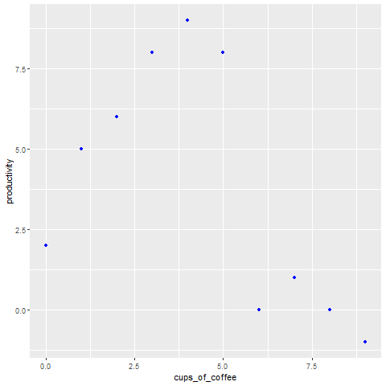

<div>
<style scoped>
    .dataframe tbody tr th:only-of-type {
        vertical-align: middle;
    }

    .dataframe tbody tr th {
        vertical-align: top;
    }

    .dataframe thead th {
        text-align: right;
    }
    
 
    table {
     display: block;
     overflow-x: auto;
     border-collapse: collapse;
     border-spacing: 0;
     border: 0px solid;
     color: var(--jp-ui-font-color1);
     font-size: 14px;
     margin-left: auto;
     margin-right: auto;
     
            }
            
</style>

 

>More articles in my blog:   $\hspace{0.1cm}$   [Estadistica4all.com](http://estadistica4all.com/)


<br>

Vamos a hacer una demostracion de como usar R dentro de Python. Para ello usaremos el paquete `rpy2` de `Python`.

```python
import warnings
warnings.filterwarnings('ignore')
```

<br>


Instalamos el paquete *rpy2* en `Python`:

```python
pip install rpy2
```


También será recomendable que instalemos los paquetes *Pandas* y *Numpy* en Python:
```python
pip install pandas

pip install numpy
```

Importamos los paquetes:

```python
import pandas as pd
import numpy as np
import rpy2
```

Ahora necesitamos ejecutar el siguiente codigo para conectar `R` a `Python`:

**Importante:** el siguiente código nos ha dado problemas, pero hemos conseguido solventarlos usando dentro del IDE `Visual Studio Code` el kernel *R-Mini~1 (Python 3.9.12)*. 

Para seguir este tutorial, recomendamos usar estos elementos: Visual Studio Code y dicho kernel
```python
%load_ext rpy2.ipython
```

También hay que correr el siguiente código para importar los objetos de `R`:

```python
import rpy2.robjects as robjects
```

<br>

Ahora ya podemos usar `R` dentro de `Python` teniendo en cuenta lo siguiente:

Para usar `R` dentro de `Python`, pero sin utilizar objetos creados con `Python` escribimos **%%R** al inicio del bloque de código en el que usaremos `R`.

```python
%%R

a<- 1:5
b<-6:10
```


```python
%%R
a
```

    [1] 1 2 3 4 5


```python
%%R
b
```

    [1]  6  7  8  9 10


<br>

Hacemos otras pruebas:

```python
%%R

library(tidyverse)
```


```python
%%R
tibble(columna1=a , columna2=b)
```
```
# A tibble: 5 x 2
  columna1 columna2
     <int>    <int>
1        1        6
2        2        7
3        3        8
4        4        9
5        5       10
```

<br>

Podemos usar objetos creados en `Python` dentro de un bloque de codigo de `R` escribiendo al inicio del bloque **%%R -i objeto_python**

Vamos a ver un ejemplo de aplicacion de esto.
Creamos un par de data-frames en Python:

```python
df1 = pd.DataFrame({
    'cups_of_coffee': [0, 1, 2, 3, 4, 5, 6, 7, 8, 9],
    'productivity': [2, 5, 6, 8, 9, 8, 0, 1, 0, -1]
})

df1
```
```
   cups_of_coffee  productivity
0               0             2
1               1             5
2               2             6
3               3             8
4               4             9
5               5             8
6               6             0
7               7             1
8               8             0
9               9            -1
```


```python
df2 = pd.DataFrame({
    'X1': [0, 3, 23, 34, 54, 25, 6, 7, 8, 9],
    'X2': [2, 25, 26, 8, 9, 8, 30, 1, 0, -8]
})

df2
```
```
   X1  X2
0   0   2
1   3  25
2  23  26
3  34   8
4  54   9
5  25   8
6   6  30
7   7   1
8   8   0
9   9  -8
```

<br>


Ahora usamos `R` para graficar en un gráfico de puntos de ggplot las variables del primer data-frame de python:


```python
%%R -i df1 

library(ggplot2)

ggplot(data=df1 , aes(x=cups_of_coffee , y=productivity))+
geom_point(color="blue")
```


<br>

<center>

{width="45%"}

</center>

<br>


Si queremos usar dos o mas objetos de Python en un bloque de codigo en R escribimos al inicio del bloque *%%R -i objeto_python_1 -i objeto_python_2* etc 


Como ejemplo aplicamos la funcion de `R` *cbind* a los dos data-frames creados en `Python`:


```python
%%R -i df1 -i df2 

cbind(df1 , df2)
```
```
  cups_of_coffee productivity X1 X2
0              0            2  0  2
1              1            5  3 25
2              2            6 23 26
3              3            8 34  8
4              4            9 54  9
5              5            8 25  8
6              6            0  6 30
7              7            1  7  1
8              8            0  8  0
9              9           -1  9 -8
```


Podemos hacer cualquier cosa que `R` nos permita, como crear un modelo de regresion lineal con `R` usando un data-frame creado en `Python`
```python
%%R -i df2

lm(X2 ~ X1 , data=df2)
```
```
Call:
lm(formula = X2 ~ X1, data = df2)

Coefficients:
(Intercept)           X1  
    9.84672      0.01499 
```


<br>

**Bibliografía**


Rpy2 Developers. R in Python. *Rpy2*.  https://rpy2.github.io/


 