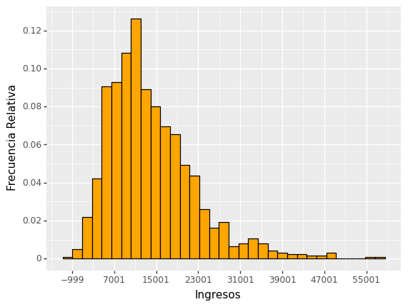
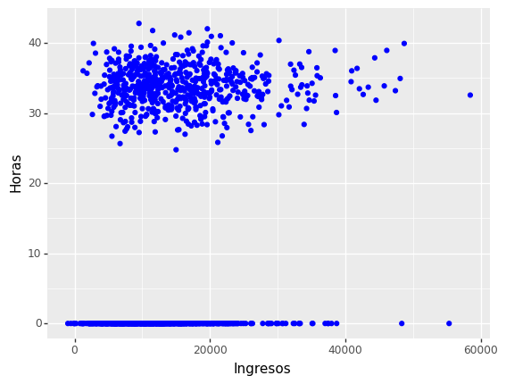

<div>
<style scoped>
    .dataframe tbody tr th:only-of-type {
        vertical-align: middle;
    }

    .dataframe tbody tr th {
        vertical-align: top;
    }

    .dataframe thead th {
        text-align: right;
    }
    
 
    table {
     display: block;
     overflow-x: auto;
     border-collapse: collapse;
     border-spacing: 0;
     border: 0px solid;
     color: var(--jp-ui-font-color1);
     font-size: 14px;
     margin-left: auto;
     margin-right: auto;
     
            }
            
</style>

 

>More articles in my blog:   $\hspace{0.1cm}$   [Estadistica4all](https://fabioscielzoortiz.github.io/Estadistica4all.github.io/)

<br>

En este pequeño articulo vamos a hacer una brevisima demostración de como usar `ggplot` en Python a traves del paquete  `Plotnine`


Cargamos los datos con los que haremos el ejemplo:

```python
import pandas as pd
import numpy as np
```

```python
url = 'https://raw.githubusercontent.com/FabioScielzoOrtiz/Estadistica4all-blog/main/Descriptive%20Statisitcs%20in%20Python%20and%20R/datosAragon.csv'

data_Python = pd.read_csv(url)

data_Python
```

```
      ca  datosECVmas16.prov   nomprov  gen  edad  nac  neduc  sitlab  
0      2                  22    Huesca    1     3    1      3       1   
1      2                  22    Huesca    2     2    1      2       1   
2      2                  22    Huesca    1     1    1      2       1   
3      2                  22    Huesca    1     1    1      2       1   
4      2                  22    Huesca    1     1    1      2       3   
...   ..                 ...       ...  ...   ...  ...    ...     ...   
1231   2                  50  Zaragoza    1     2    1      2       1   
1232   2                  50  Zaragoza    1     2    1      2       2   
1233   2                  50  Zaragoza    2     2    1      2       1   
1234   2                  50  Zaragoza    2     3    1      1       3   
1235   2                  50  Zaragoza    1     3    1      1       1   

      ingnorm  horas  factorel  
0     21237.1  36.42     393.7  
1     17810.8  31.72     393.7  
2     11889.1  31.88     393.7  
3     16000.5  38.18     393.7  
4     21169.6   0.00     393.7  
...       ...    ...       ...  
1231  11760.6  28.79    2206.1  
1232  19321.6   0.00     124.4  
1233  19924.8  37.21     124.4  
1234  13042.5   0.00     246.5  
1235  19618.2  42.01     246.5  
```


`Plotnine` es un paquete de `Python` para visualización de datos inspirado en el paquete `ggplot` de `R`

Este articulo es solo una brevisima muestra de este paquete. Puede encontrarse muchisima mas información sobre él en la web oficial de [`Plotnine`](https://plotnine.readthedocs.io/en/stable/) :

```python
from plotnine import ggplot, aes, geom_line, geom_point, geom_histogram, geom_bar, geom_boxplot, scale_y_continuous, scale_x_continuous
from plotnine import labs, after_stat,  geom_vline, scale_color_manual, theme_gray, theme_xkcd, scale_color_identity, geom_hline
from plotnine import facet_wrap, scale_fill_discrete, scale_fill_manual, scale_fill_hue, guides, guide_legend
```
Ejemplo de generación de un histograma:
```python
(
ggplot( data_Python )
+  aes(x='ingnorm' , y =  after_stat('width*density'))
+ geom_histogram( bins = 33 , fill="orange", color="black")
+  labs(x = "Ingresos", y = "Frecuencia Relativa")
+ scale_x_continuous( breaks = range(int(data_Python['ingnorm'].min()) , 
                           int(data_Python['ingnorm'].max()) , 8000) ) 
+ scale_y_continuous( breaks = np.arange(0, 0.17, 0.02) )
)
```

<br>

<center>

{width="50%"}

</center>

<br>


Ejemplo de generación de un gráfico de dispersión:
```python
(
ggplot( data_Python )
+  aes(x='ingnorm' , y = 'horas')
+ geom_point( color = 'blue' )
+  labs(x = "Ingresos", y = "Horas")
)
```

<br>

<center>

{width="50%"}

</center>

<br>